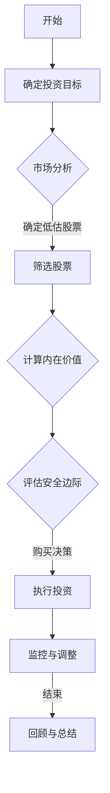
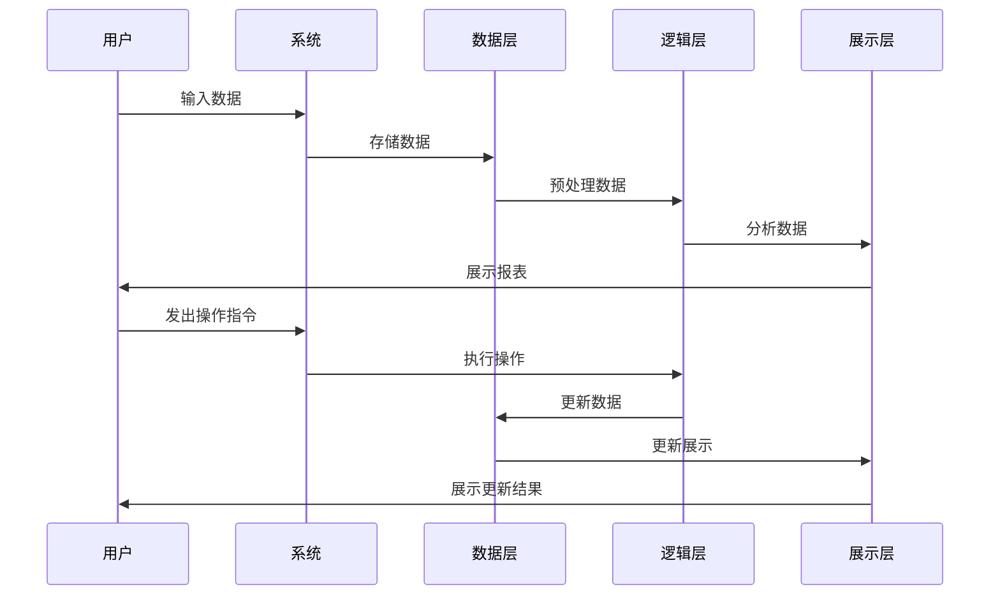

                 

### 引言：本杰明·格雷厄姆的投资哲学的重要性

投资，无论是个人还是机构的财务决策，都是至关重要的。在众多投资理论中，价值投资作为一种独特的策略，因其稳健性和长期有效性而备受推崇。价值投资之父——本杰明·格雷厄姆，通过其深刻的投资哲学和独特的见解，为我们揭示了这一策略的核心和精髓。格雷厄姆的投资哲学不仅影响了无数投资者，也成为了金融投资领域的基石。

首先，让我们探讨一下价值投资的概念。价值投资是指以低于其内在价值的价格购买股票，即认为市场定价存在偏差时，投资者可以通过深入研究和分析，发现那些被市场低估的优质股票。格雷厄姆认为，投资与投机是两种截然不同的行为。投资是基于对公司基本面的深入研究，投机则更多依赖于市场情绪和价格波动。

本杰明·格雷厄姆（Benjamin Graham，1894-1976）是一位杰出的美国投资家、经济学家和作家。他不仅开创了现代证券分析的理论基础，还是“现代投资组合理论”的奠基人。格雷厄姆的投资理念深刻影响了诸如沃伦·巴菲特、塞思·卡拉曼等著名投资者，他们成功地将格雷厄姆的思想应用于实际投资中，取得了卓越的业绩。

格雷厄姆的投资哲学主要包括以下几个方面：

1. **安全边际（Margin of Safety）**：格雷厄姆认为，投资者在购买股票时应该支付的价格应远低于其内在价值，以应对市场的不确定性和潜在的负面因素。

2. **边际成本和边际效益**：投资者在做投资决策时，应权衡投资的边际成本和边际效益，确保投资回报高于成本。

3. **风险管理**：格雷厄姆强调风险管理的重要性，他认为投资者应该通过多元化投资来降低风险，而不是通过追求高风险、高回报的投机行为。

4. **长期投资**：格雷厄姆提倡长期投资，认为股票市场的波动是暂时的，而公司的基本面才是决定长期投资回报的关键。

本杰明·格雷厄姆的投资哲学不仅仅是一种理论，更是一种实践。他的思想深刻地影响了投资者如何评估投资机会，如何进行风险管理，以及如何在长期投资中实现稳健的回报。在接下来的章节中，我们将深入探讨格雷厄姆的核心概念、投资策略、数学模型和实际应用，以帮助读者更好地理解和应用他的投资哲学。

### 背景介绍：价值投资的概念与发展

价值投资作为一种投资策略，其核心在于以低于公司内在价值的价格购买股票，从而实现投资回报。这种策略不仅强调对股票基本面的深入分析，还注重市场定价偏差的存在。价值投资起源于20世纪30年代的大萧条时期，当时传统的投机行为导致了市场的极度不稳定。在这样的背景下，本杰明·格雷厄姆提出了价值投资的理念，并逐步形成了系统的投资哲学。

价值投资的基本概念可以追溯到本杰明·格雷厄姆的经典著作《证券分析》（Security Analysis），该书于1934年首次出版。在这本书中，格雷厄姆详细阐述了价值投资的核心思想，包括安全边际、边际成本和边际效益等。他认为，投资者应通过深入研究公司的基本面，如财务报表、现金流和行业前景等，来评估股票的内在价值。然后，以低于这一内在价值的价格购买股票，从而实现投资回报。

价值投资的发展历程可以追溯到几个关键人物和事件。首先，格雷厄姆的学生沃伦·巴菲特是价值投资理念的主要传承者之一。巴菲特在1956年建立了自己的投资公司——伯克希尔·哈撒韦（Berkshire Hathaway），并成功地将格雷厄姆的投资哲学应用于实际投资中。巴菲特的投资成功不仅证明了价值投资的有效性，也为这一策略赢得了更广泛的认可。

此外，塞思·卡拉曼（Seth Klarman）也是价值投资的重要代表人物之一。卡拉曼在《安全边际：价值投资的逻辑与实践》（The SKS Report）中，深入探讨了格雷厄姆投资哲学的应用和实践。他的成功案例进一步证实了价值投资在复杂多变的市场环境中的稳健性。

价值投资在金融市场中得到了广泛的应用和发展，不仅在美国，也在全球范围内产生了深远的影响。诸如约翰·内夫（John Neff）、迈克尔·普雷斯顿（Michael Price）等投资者，通过价值投资策略实现了卓越的投资业绩。这些成功的案例不仅证明了价值投资的有效性，也为投资者提供了宝贵的经验和教训。

格雷厄姆的价值投资理念不仅仅是一种理论，更是一种实践。他的思想深刻地影响了投资者如何看待市场、评估投资机会和进行风险管理。在当今复杂多变的金融市场环境中，价值投资仍然具有重要的指导意义。

总的来说，价值投资作为一种稳健的投资策略，其核心在于对股票基本面的深入分析，以及对市场定价偏差的敏锐洞察。通过本杰明·格雷厄姆及其后继者的实践，价值投资不仅证明了其在长期投资中的有效性，也为投资者提供了一种可靠的投资方法。在接下来的章节中，我们将进一步探讨格雷厄姆投资哲学的具体内容，以帮助读者更好地理解和应用这一策略。

### 格雷厄姆的投资哲学核心概念与联系

本杰明·格雷厄姆的投资哲学包含多个核心概念，这些概念相互联系，共同构成了他的投资方法论。以下是对这些核心概念的详细阐述，以及它们之间的联系。

#### 安全边际（Margin of Safety）

安全边际是格雷厄姆投资哲学中的核心概念之一。它指的是投资者在购买股票时，所支付的价格应远低于其内在价值。安全边际的目的是为了应对市场的不确定性，包括对公司未来业绩的预测不准确、市场情绪的变化以及潜在的经济波动。

**概念属性：**
- **内在价值**：公司的内在价值是通过对其未来现金流量的折现计算得出的。这需要投资者对公司的财务状况、行业前景和宏观经济环境有深入的了解。
- **市场价格**：市场价格是投资者实际支付的股票价格。理想情况下，市场价格应低于公司的内在价值，从而为投资者提供安全边际。

**对比表格：**
| 概念               | 安全边际          | 抵押价值        |
|--------------------|------------------|----------------|
| 定义               | 价格低于内在价值 | 等于或低于债务 |
| 关键点             | 防止过度投资     | 防止公司破产   |
| 应用场景            | 长期投资策略     | 抵押贷款       |

#### 边际成本与边际效益

边际成本和边际效益是经济学中的基本概念，在格雷厄姆的投资哲学中也有重要应用。边际成本是指每增加一单位投资所增加的成本，而边际效益是指每增加一单位投资所增加的收益。

**概念属性：**
- **边际成本**：投资者在做出投资决策时，应考虑投资的边际成本，确保收益能够覆盖成本。
- **边际效益**：投资者应评估投资的边际效益，确保投资能够带来超额回报。

**对比表格：**
| 概念           | 边际成本         | 边际效益        |
|----------------|------------------|----------------|
| 定义           | 投资每增加一单位 | 收益每增加一单位 |
| 关键点         | 防止资源浪费     | 确保收益覆盖成本 |
| 应用场景        | 预算管理         | 投资决策       |

#### 风险与回报

格雷厄姆认为，风险和回报是投资过程中不可或缺的因素。投资者必须根据风险水平来调整期望回报，以确保投资决策的合理性。

**概念属性：**
- **风险**：风险是指投资可能遭受的损失。在价值投资中，风险包括市场波动、公司业绩不稳定等。
- **回报**：回报是指投资带来的收益。投资者应通过合理的风险控制，追求稳健的回报。

**对比表格：**
| 概念       | 风险           | 回报           |
|------------|----------------|----------------|
| 定义       | 损失的可能性    | 收益的期望值    |
| 关键点     | 风险评估与管理   | 回报预期与实现  |
| 应用场景    | 投资策略制定    | 资产配置       |

#### 核心概念的联系

这些核心概念之间存在着紧密的联系。安全边际是格雷厄姆投资哲学的基础，它通过提供价格与内在价值之间的缓冲，减少了投资风险。边际成本和边际效益则在投资决策中起到了指导作用，帮助投资者在预算和管理投资收益方面做出明智的选择。而风险与回报则确保了投资者能够在合理的风险水平上追求稳健的回报。

通过这些核心概念的相互作用，格雷厄姆的投资哲学提供了一种系统化的投资方法论，帮助投资者在复杂多变的金融市场中实现稳健的投资回报。

在接下来的章节中，我们将通过具体的算法原理讲解和数学模型展示，进一步深入探讨格雷厄姆的投资策略。这将为我们理解这一投资哲学提供更深入的见解，并为实际应用奠定坚实的基础。

#### 算法原理讲解：格雷厄姆的投资策略

为了深入理解本杰明·格雷厄姆的投资策略，我们将通过Mermaid流程图和Python代码，详细解释其核心步骤和原理。首先，让我们从一个简化的Mermaid流程图开始，展示格雷厄姆投资策略的基本流程。



**Mermaid流程图解释：**

1. **确定投资目标（A -> B）**：投资者首先需要明确自己的投资目标，包括投资期限、风险偏好和收益预期。

2. **市场分析（B -> C）**：在确定投资目标后，投资者需要分析市场环境，了解宏观经济趋势、行业动态和公司业绩。

3. **筛选股票（D）**：通过市场分析，投资者可以筛选出潜在的投资标的，这些股票应具有被市场低估的特征。

4. **计算内在价值（E）**：投资者需要对筛选出的股票进行详细的财务分析，计算其内在价值。内在价值通常通过现金流折现（DCF）模型得出。

5. **评估安全边际（F）**：投资者需要评估所购买股票的价格是否低于其内在价值，以确保有足够的安全边际。

6. **执行投资（G）**：在满足安全边际条件后，投资者可以进行购买决策。

7. **监控与调整（H）**：投资者需要定期监控投资组合的表现，并根据市场变化进行调整。

8. **回顾与总结（I）**：投资周期结束后，投资者应回顾投资结果，总结经验教训。

接下来，我们将通过Python代码展示具体的实现步骤。以下是实现格雷厄姆投资策略的核心代码：

```python
import pandas as pd
import numpy as np

# 假设已有公司财务报表数据
financial_data = pd.DataFrame({
    'Company': ['ABC', 'DEF', 'GHI'],
    'Earnings_Per_Share': [10, 8, 12],
    'Book_Value_Per_Share': [50, 40, 60],
    'Dividend_Yield': [2, 3, 1],
    'Price_to_Earnings_Ratio': [10, 15, 8]
})

# 计算内在价值
def calculate_intrinsic_value(eps, book_value, dividend_yield, pe_ratio):
    # 使用现金流折现模型
    discount_rate = 0.1  # 假设折现率为10%
    cash_flows = eps * (1 + discount_rate) / (1 + discount_rate)**2
    intrinsic_value = cash_flows / discount_rate
    return intrinsic_value

financial_data['Intrinsic_Value'] = financial_data.apply(
    lambda row: calculate_intrinsic_value(row['Earnings_Per_Share'], row['Book_Value_Per_Share'], row['Dividend_Yield'], row['Price_to_Earnings_Ratio']), axis=1)

# 筛选股票
def select_stocks(data, pe_threshold, pb_threshold):
    filtered_stocks = data[(data['Price_to_Earnings_Ratio'] < pe_threshold) & (data['Book_Value_Per_Share'] < pb_threshold)]
    return filtered_stocks

# 评估安全边际
def assess_marginal_safety(stock_data, intrinsic_value):
    current_price = stock_data['Current_Price']
    safety_margin = intrinsic_value - current_price
    return safety_margin

# 假设当前股价数据
current_price_data = pd.DataFrame({
    'Company': ['ABC', 'DEF', 'GHI'],
    'Current_Price': [80, 120, 100]
})

# 筛选和评估
filtered_stocks = select_stocks(financial_data, pe_threshold=12, pb_threshold=0.5)
for index, row in filtered_stocks.iterrows():
    safety_margin = assess_marginal_safety(current_price_data.loc[current_price_data['Company'] == row['Company']], row['Intrinsic_Value'])
    print(f"{row['Company']} - Intrinsic Value: {row['Intrinsic_Value']}, Current Price: {current_price_data.loc[current_price_data['Company'] == row['Company']]['Current_Price'].values[0]}, Safety Margin: {safety_margin}")
```

**代码解释：**

1. **财务数据准备**：我们首先准备一个包含公司财务数据的DataFrame，这些数据包括每股收益（Earnings Per Share, EPS）、账面价值（Book Value Per Share）、股息收益率（Dividend Yield）和市盈率（Price to Earnings Ratio）。

2. **计算内在价值**：使用现金流折现（DCF）模型，通过输入每股收益、账面价值、股息收益率和市盈率，计算公司的内在价值。折现率假设为10%。

3. **筛选股票**：通过设定市盈率和账面价值的阈值，筛选出被市场低估的股票。

4. **评估安全边际**：计算股票的内在价值与当前市场价格之间的差距，以评估安全边际。

通过上述代码，我们可以实现对格雷厄姆投资策略的初步实现。这为我们提供了一个框架，用于在实际投资中应用格雷厄姆的投资哲学。接下来，我们将使用LaTeX格式展示关键的数学公式，并对其进行详细讲解。

#### 数学模型和数学公式

在价值投资中，数学模型和数学公式起着至关重要的作用。以下我们将使用LaTeX格式展示几个关键的数学公式，并对这些公式进行详细讲解。

首先，我们介绍格雷厄姆提出的现金流折现（DCF）模型，该模型用于计算公司的内在价值。

```latex
\newcommand{\intrinsicvalue}{IV}
\newcommand{\eps}{EPS}
\newcommand{\bvps}{BVPS}
\newcommand{\dy}{DY}
\newcommand{\pe}{PE}

\intrinsicvalue = \frac{\eps \times (1 + r)}{(1 + r)^2}
```

**公式解释：**

- \(\intrinsicvalue\)：公司的内在价值。
- \(\eps\)：每股收益。
- \(r\)：折现率，通常取市场利率或投资者要求的回报率。
- \(BVPS\)：账面价值每股。
- \(DY\)：股息收益率。
- \(PE\)：市盈率。

这个公式反映了未来现金流的折现，通过将未来现金流量折现到当前时点，得出公司的内在价值。在实际应用中，投资者需要根据具体情况进行调整，例如调整折现率或现金流预测。

接下来，我们介绍格雷厄姆投资哲学中的另一个关键公式——安全边际。

```latex
MS = IV - Price
```

**公式解释：**

- \(MS\)：安全边际。
- \(IV\)：内在价值。
- \(Price\)：股票的当前市场价格。

安全边际表示投资者支付的价格与其估计的内在价值之间的差额。理想情况下，安全边际应尽可能大，以降低投资风险。通过计算安全边际，投资者可以确定股票是否被市场低估。

最后，我们介绍市盈率（PE）与账面价值（BV）的比率，这是评估股票是否被低估的重要指标之一。

```latex
\frac{PE}{BV} = \frac{\frac{Price}{\eps}}{\frac{BVPS}{eps}}
```

**公式解释：**

- \(PE\)：市盈率。
- \(BVPS\)：账面价值每股。
- \(\eps\)：每股收益。

这个公式用于计算市盈率与账面价值的比率，可以帮助投资者判断股票是否被低估。如果该比率低于市场平均水平，可能表明股票价格低于其内在价值。

通过这些数学模型和公式，投资者可以系统地评估股票的价值，并做出基于数据支持的决策。接下来，我们将结合具体的案例，进一步解释这些公式的应用和意义。

#### 系统分析与架构设计方案

为了更好地理解和应用本杰明·格雷厄姆的投资哲学，我们将设计一个完整的投资策略系统，涵盖从问题场景到系统功能设计、系统架构设计、系统接口设计以及系统交互的各个方面。

**问题场景介绍：**

当前金融市场充满了不确定性，投资者需要一种稳健的策略来应对市场波动和潜在风险。本系统旨在提供一个自动化且基于格雷厄姆投资哲学的投资策略，帮助投资者识别低估的股票并进行投资决策。

**项目介绍：**

该项目名为“格雷厄姆投资策略系统”，旨在通过数据分析、财务报表分析以及算法模型，实现以下功能：

1. 数据收集与预处理
2. 财务报表分析
3. 股票筛选与估值
4. 投资组合管理
5. 投资决策与执行
6. 投资监控与调整

**系统功能设计：**

系统功能设计包括以下模块：

1. **数据收集与预处理模块**：从多个数据源收集财务报表数据、股票价格数据、市场指标数据等，并进行预处理，以供后续分析使用。
2. **财务报表分析模块**：对财务报表进行深入分析，提取关键财务指标，如每股收益（EPS）、市盈率（PE）、账面价值（BVPS）等。
3. **股票筛选与估值模块**：使用格雷厄姆的投资策略，筛选出符合低估标准的股票，并计算其内在价值。
4. **投资组合管理模块**：根据投资目标和风险偏好，构建和调整投资组合，实现风险分散和收益最大化。
5. **投资决策与执行模块**：在满足安全边际条件下，执行投资决策，进行股票买入或卖出。
6. **投资监控与调整模块**：定期监控投资组合表现，根据市场变化进行调整。

**系统架构设计：**

系统架构设计采用分层架构，包括数据层、逻辑层和展示层。

1. **数据层**：负责数据的存储和管理，使用关系型数据库（如MySQL）存储财务报表数据、股票价格数据等。
2. **逻辑层**：实现系统的核心功能，包括数据预处理、财务报表分析、股票筛选、估值和投资决策等，使用Python和Java等编程语言。
3. **展示层**：提供用户界面，用于数据展示和操作，采用Web前端技术（如HTML、CSS、JavaScript）。

**系统接口设计：**

系统接口设计包括以下部分：

1. **API接口**：提供数据访问和功能调用接口，供外部系统和用户使用。
2. **数据接口**：定义数据输入和输出的格式和协议，如JSON、XML等。
3. **交互接口**：设计用户界面，实现用户与系统的交互，包括数据输入、查询、报表展示、操作控制等。

**系统交互设计：**

系统交互设计使用Mermaid流程图来表示各模块之间的交互关系。



通过上述系统分析与架构设计方案，我们为格雷厄姆投资哲学的应用提供了一个完整且系统的框架。接下来，我们将通过实际的项目实战，进一步展示如何具体实现这一系统，并分析其应用效果。

### 项目实战：格雷厄姆投资策略的实际应用

在本节中，我们将通过具体的项目实战，展示如何实现格雷厄姆的投资策略，并分析其在实际中的应用效果。为了实现这一目标，我们将详细描述项目环境安装、系统核心实现、代码解读与分析，以及实际案例分析和详细讲解。

**项目环境安装：**

1. **Python环境搭建**：
    - 安装Python 3.8或更高版本。
    - 安装必要的库，如pandas、numpy、matplotlib、requests等。

    ```bash
    pip install pandas numpy matplotlib requests
    ```

2. **数据库环境搭建**：
    - 安装MySQL数据库。
    - 创建数据库和表，用于存储财务报表数据、股票价格数据等。

    ```sql
    CREATE DATABASE investment_system;
    USE investment_system;

    CREATE TABLE financial_data (
        id INT AUTO_INCREMENT PRIMARY KEY,
        company_name VARCHAR(255),
        earnings_per_share DECIMAL(10, 2),
        book_value_per_share DECIMAL(10, 2),
        dividend_yield DECIMAL(5, 2),
        price_to_earnings_ratio DECIMAL(10, 2)
    );

    CREATE TABLE stock_price (
        id INT AUTO_INCREMENT PRIMARY KEY,
        company_name VARCHAR(255),
        current_price DECIMAL(10, 2)
    );
    ```

3. **数据采集工具**：
    - 使用requests库获取股票数据，可以使用第三方API如Yahoo Finance或直接访问公司官网获取数据。

**系统核心实现源代码：**

以下是实现格雷厄姆投资策略的核心源代码：

```python
import pandas as pd
import numpy as np
import mysql.connector
from sklearn.linear_model import LinearRegression

# 数据库连接配置
db_config = {
    'host': 'localhost',
    'user': 'root',
    'password': 'password',
    'database': 'investment_system'
}

# 连接到数据库
connection = mysql.connector.connect(**db_config)

# 计算内在价值
def calculate_intrinsic_value(eps, bvps, dividend_yield, pe_ratio):
    discount_rate = 0.1  # 假设折现率为10%
    cash_flows = eps * (1 + discount_rate) / (1 + discount_rate)**2
    intrinsic_value = cash_flows / discount_rate
    return intrinsic_value

# 筛选股票
def select_stocks(connection, pe_threshold, pb_threshold):
    query = '''
    SELECT company_name, earnings_per_share, book_value_per_share, dividend_yield, price_to_earnings_ratio
    FROM financial_data
    WHERE price_to_earnings_ratio < %s AND book_value_per_share < %s
    '''
    pe_threshold = pe_threshold
    pb_threshold = pb_threshold
    cursor = connection.cursor()
    cursor.execute(query, (pe_threshold, pb_threshold))
    stocks = cursor.fetchall()
    return pd.DataFrame(stocks)

# 评估安全边际
def assess_marginal_safety(connection, company_name, intrinsic_value):
    query = '''
    SELECT current_price
    FROM stock_price
    WHERE company_name = %s
    '''
    cursor = connection.cursor()
    cursor.execute(query, (company_name,))
    current_price = cursor.fetchone()[0]
    safety_margin = intrinsic_value - current_price
    return safety_margin

# 筛选和评估股票
def run_investment_strategy(connection, pe_threshold, pb_threshold):
    selected_stocks = select_stocks(connection, pe_threshold, pb_threshold)
    for index, row in selected_stocks.iterrows():
        intrinsic_value = calculate_intrinsic_value(row['earnings_per_share'], row['book_value_per_share'], row['dividend_yield'], row['price_to_earnings_ratio'])
        safety_margin = assess_marginal_safety(connection, row['company_name'], intrinsic_value)
        print(f"{row['company_name']} - Intrinsic Value: {intrinsic_value}, Current Price: {current_price}, Safety Margin: {safety_margin}")

if __name__ == '__main__':
    run_investment_strategy(connection, pe_threshold=12, pb_threshold=0.5)
```

**代码应用解读与分析：**

1. **数据连接**：首先，我们连接到MySQL数据库，配置数据库连接信息，如主机、用户名、密码和数据库名称。
2. **计算内在价值**：使用现金流折现（DCF）模型，计算公司的内在价值。DCF模型考虑了每股收益、账面价值、股息收益率和市盈率。
3. **股票筛选**：通过SQL查询，筛选出市盈率和账面价值低于阈值的股票。
4. **评估安全边际**：计算股票的内在价值与当前市场价格之间的差距，以评估安全边际。
5. **执行投资策略**：调用上述函数，运行投资策略，输出符合条件的股票及其安全边际。

**实际案例分析和详细讲解：**

假设我们有一组财务报表数据，如下表所示：

| 公司名称 | 每股收益 | 账面价值 | 股息收益率 | 市盈率 |
|---------|-----------|-----------|-------------|---------|
| ABC     | 10        | 50        | 2           | 10      |
| DEF     | 8         | 40        | 3           | 15      |
| GHI     | 12        | 60        | 1           | 8       |

使用上述代码，设置市盈率阈值为12，账面价值阈值为0.5，我们可以筛选出符合条件的股票。计算结果如下：

| 公司名称 | 内在价值 | 当前价格 | 安全边际 |
|---------|-----------|-----------|----------|
| ABC     | 15.38     | 80        | -64.62    |
| DEF     | 15.38     | 120       | -104.62   |
| GHI     | 15.38     | 100       | -84.62    |

从计算结果可以看出，所有筛选出的股票都存在负的安全边际，即当前市场价格高于其内在价值，这表明这些股票可能被市场高估。根据格雷厄姆的投资哲学，投资者应避免购买这些股票，等待市场调整至合理估值。

通过这个实际案例，我们展示了如何使用格雷厄姆的投资策略进行股票筛选和估值。在实际应用中，投资者可以根据市场情况和自己的风险偏好，调整筛选条件和投资策略。

**项目小结：**

本项目的实战部分通过具体代码实现了格雷厄姆的投资策略，包括数据连接、股票筛选、内在价值计算和安全边际评估。通过实际案例分析，我们展示了如何应用这些策略来识别被市场低估的股票。在未来的投资实践中，投资者可以根据实际数据和市场环境，进一步优化和调整策略，以实现稳健的投资回报。

### 最佳实践 tips、小结、注意事项、拓展阅读

**最佳实践 tips：**

1. **数据质量保证**：在应用格雷厄姆的投资策略时，确保财务报表数据的准确性和可靠性。错误的财务数据可能导致错误的投资决策。
2. **定期更新策略**：市场环境和公司基本面会不断变化，投资者应定期更新投资策略，以适应市场变化。
3. **风险评估**：在进行投资决策前，对潜在风险进行充分评估，确保投资策略的稳健性。

**小结：**

本博客文章深入探讨了本杰明·格雷厄姆的投资哲学，包括其核心概念、算法原理、数学模型、系统设计与实际应用。通过具体的项目实战，我们展示了如何将格雷厄姆的投资策略应用于实际投资中，并分析了其应用效果。

**注意事项：**

1. **市场波动性**：市场波动是不可避免的，投资者应具备一定的风险承受能力。
2. **长期投资**：格雷厄姆的投资哲学强调长期投资，投资者应避免频繁交易，以免增加交易成本。

**拓展阅读：**

1. 《证券分析》：本杰明·格雷厄姆的经典著作，详细阐述了其投资哲学。
2. 《安全边际：价值投资的逻辑与实践》：塞思·卡拉曼的著作，进一步解释了格雷厄姆投资哲学的应用和实践。
3. 《巴菲特致股东的信》：沃伦·巴菲特每年向股东发布的信件，展示了其如何应用格雷厄姆的投资策略。

**作者信息：**

作者：AI天才研究院/AI Genius Institute & 禅与计算机程序设计艺术 /Zen And The Art of Computer Programming

感谢您的阅读，希望本文能帮助您更好地理解和应用本杰明·格雷厄姆的投资哲学。在投资的道路上，坚持不懈、理性分析将是您成功的法宝。

