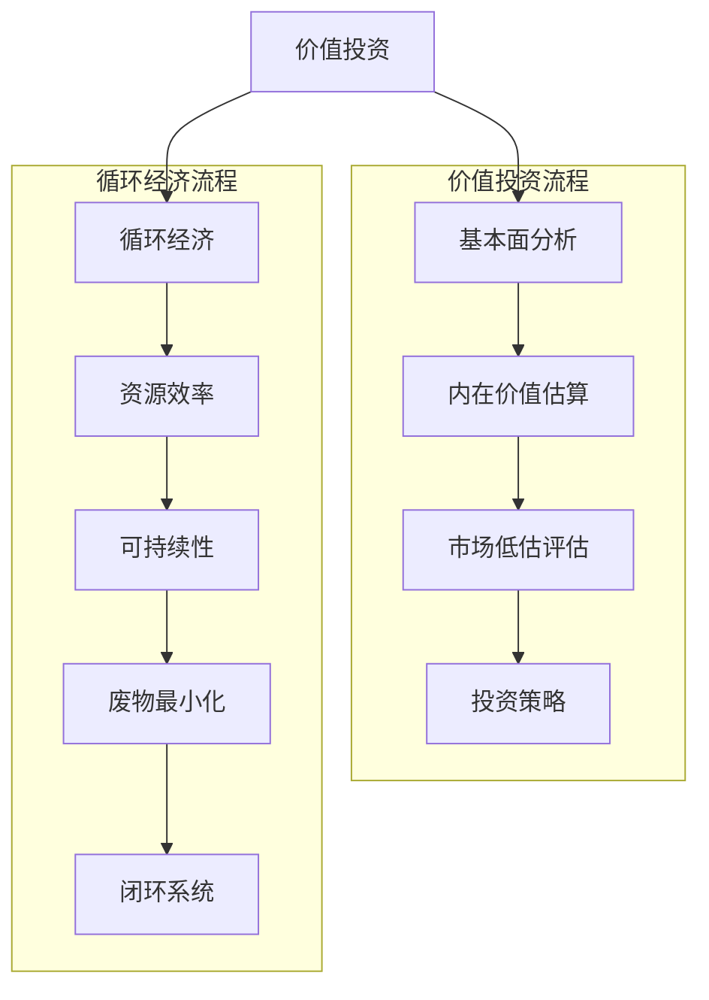
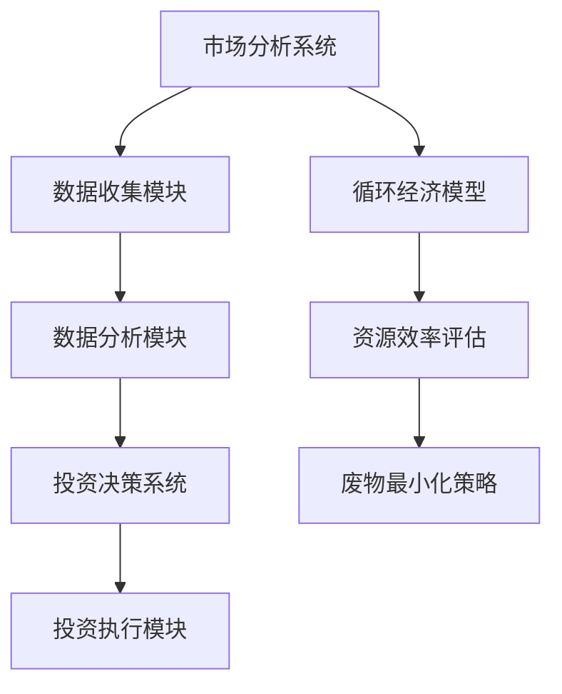
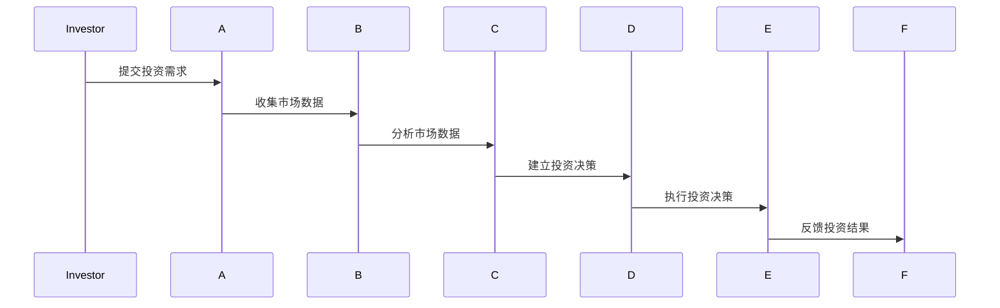

                 


### 引言：价值投资与循环经济的融合

在当前全球变暖、资源枯竭和环境恶化的背景下，可持续商业模式的探索已经成为企业发展的关键议题。价值投资，作为一种以长期投资为核心的投资理念，正在逐渐与循环经济相结合，为企业和投资者提供了新的机遇。本文将深入探讨价值投资在循环经济中的应用，分析其背后的逻辑和实际案例，并总结出可持续商业模式的机遇。

### 1. 背景介绍

#### 1.1 价值投资的基本概念

价值投资（Value Investing）是一种以公司内在价值为基础的投资策略，由本杰明·格雷厄姆（Benjamin Graham）在20世纪初创立。价值投资的核心在于寻找市场价格低于公司实际价值的股票或其他投资工具，通过长期持有实现资本增值。这一理念强调对公司的基本分析，包括财务状况、管理质量、行业前景等多个方面。

#### 1.2 循环经济的概念及其在商业中的应用

循环经济（Circular Economy）是一种旨在通过资源的循环利用来实现可持续发展经济的模式。与传统线性经济（Make, Use, Dispose）相比，循环经济强调资源的有效利用、废物的最小化和闭环系统的建立。在商业中，循环经济的应用包括设计可持续产品、推行回收利用计划、建立共享经济模式等。

#### 1.3 价值投资与循环经济的联系

价值投资与循环经济的结合在于它们共同关注长期价值而非短期利润。价值投资通过识别和管理风险，支持企业采取可持续的商业模式。而循环经济则为价值投资提供了新的投资机会，特别是在那些能够有效利用资源和减少浪费的产业中。

### 2. 核心概念与联系

#### 2.1 价值投资的原理分析

价值投资的原理在于寻找那些被市场低估的股票。这种低估可能是由于市场对公司的前景过于悲观，或者是公司内部管理问题导致的股价下跌。以下是价值投资的基本步骤：

1. **评估公司基本面**：包括财务报表分析、管理团队评估、行业地位分析等。
2. **计算公司内在价值**：通过折现现金流（DCF）等方法估算公司的内在价值。
3. **比较市场价格**：将公司市场价格与其内在价值进行比较，确定是否低估。
4. **制定投资策略**：在确定低估的情况下，制定长期投资策略，以等待市场重新认识到公司的真实价值。

#### 2.2 循环经济中的核心概念

循环经济的核心概念包括资源效率、可持续性、废物最小化和闭环系统。以下是对这些概念的分析：

1. **资源效率**：通过优化生产过程、提高资源利用率来减少资源浪费。
2. **可持续性**：确保企业活动不会损害生态系统的健康和功能。
3. **废物最小化**：通过设计、制造和运营减少废物的产生。
4. **闭环系统**：建立能够将废物转化为新资源或产品的系统。

#### 2.3 价值投资与循环经济的联系图解

为了更直观地展示价值投资与循环经济的联系，我们可以使用Mermaid流程图来表示它们之间的相互作用。



### 3. 应用案例

#### 3.1 案例一：公司A的价值投资实践

公司A是一家专注于可持续发展产品的制造企业。以下是该公司在价值投资和循环经济方面的实践：

1. **基本面分析**：公司A通过优化生产流程，提高了资源利用率，降低了成本，提高了产品质量。
2. **内在价值估算**：公司A通过DCF方法估算，其内在价值远高于市场价格。
3. **市场低估评估**：由于市场对可持续产品的需求尚未完全认识，公司A的股票被低估。
4. **投资策略**：投资者通过长期持有公司A的股票，等待市场意识到其价值。

#### 3.2 案例二：公司B的循环经济实践

公司B是一家服装零售企业，致力于推行循环经济模式。以下是该公司在循环经济方面的实践：

1. **资源效率**：公司B通过采用环保材料和优化生产流程，提高了资源利用效率。
2. **可持续性**：公司B推出了环保服装系列，旨在减少对环境的影响。
3. **废物最小化**：公司B推出了回收计划，鼓励消费者将旧衣服回收，转化为原材料。
4. **闭环系统**：公司B建立了回收和再利用系统，将废物转化为新的服装产品。

### 4. 策略分析

#### 4.1 价值投资策略在循环经济中的应用

在循环经济中，价值投资策略可以应用于以下几个方面：

1. **可持续企业投资**：寻找那些致力于可持续发展的企业进行投资，这些企业往往具有长期增长潜力。
2. **资源效率投资**：投资于那些能够提高资源利用效率、减少浪费的企业。
3. **循环经济模式投资**：投资于那些能够建立闭环系统、减少废物产生的企业。

#### 4.2 循环经济对价值投资策略的影响

循环经济的兴起对价值投资策略产生了以下影响：

1. **投资目标的变化**：投资者开始关注企业的可持续性和社会责任，而不仅仅是财务指标。
2. **投资时间的延长**：由于循环经济的实现需要时间，投资者需要更长期的投资视角。
3. **风险评估的变化**：投资者需要考虑环境风险、社会风险等非财务风险。

### 5. 案例研究

#### 5.1 案例一：可持续能源领域的价值投资

在可持续能源领域，投资者可以通过以下方式实现价值投资：

1. **技术投资**：投资于那些具有创新能力的可持续能源技术企业。
2. **市场投资**：投资于那些市场需求旺盛的可持续能源产品。
3. **供应链投资**：投资于那些能够提供可持续能源原材料的企业。

#### 5.2 案例二：消费品领域的循环经济实践

在消费品领域，企业可以通过以下方式实现循环经济：

1. **产品设计**：设计可回收、可再利用的产品，减少浪费。
2. **回收利用**：建立回收体系，鼓励消费者参与回收。
3. **闭环系统**：建立闭环生产系统，将废物转化为新的产品。

### 6. 实践指南

#### 6.1 价值投资在循环经济中的应用指南

对于投资者，以下是一些在循环经济中应用价值投资的具体指南：

1. **评估企业可持续性**：考察企业的可持续性报告，了解其在环境、社会和治理（ESG）方面的表现。
2. **研究市场需求**：分析市场需求，寻找那些符合可持续发展趋势的行业。
3. **关注政策变化**：关注政策变化，了解政府对于可持续发展的支持力度。

#### 6.2 实施价值投资策略的建议

1. **长期投资视角**：价值投资通常需要较长的时间来实现回报，投资者应有耐心和信心。
2. **多样化投资组合**：分散投资可以降低风险，投资者应考虑不同行业的可持续性投资机会。
3. **持续学习和研究**：可持续性和循环经济是快速发展的领域，投资者需要不断学习和更新知识。

### 7. 未来展望

#### 7.1 价值投资在循环经济中的发展趋势

随着全球对可持续发展的关注度提高，价值投资在循环经济中的应用前景广阔。以下是一些发展趋势：

1. **可持续发展投资成为主流**：越来越多的投资者将可持续性作为重要的投资考量。
2. **技术创新推动循环经济发展**：技术创新将提高资源利用效率，减少废物产生。
3. **政策支持加强**：政府将加大对可持续发展的政策支持，为投资者提供更好的环境。

#### 7.2 价值投资在循环经济中的机遇与挑战

机遇：

1. **新的投资机会**：随着循环经济的兴起，新的投资机会将不断涌现。
2. **长期收益**：投资于可持续发展的企业，有望获得长期稳定的回报。

挑战：

1. **信息不对称**：投资者可能面临信息不对称的问题，需要深入研究。
2. **风险评估**：投资者需要考虑环境风险、社会风险等非财务风险。

### 结论

价值投资与循环经济的结合为企业和投资者提供了新的机遇。通过深入分析和实践，投资者可以在循环经济中找到被低估的投资机会，实现长期价值。同时，循环经济也为价值投资提供了新的方向和理念，推动了可持续商业模式的实现。

### 参考文献

[1] 格雷厄姆，B. (1949). 《证券分析》(Security Analysis). 纽约：麦格劳-希尔出版社。
[2] 威廉森，M. (2016). 《循环经济：理论与实践》(Circular Economy: Theory and Practice). 北京：中国社会科学出版社。
[3] 国际能源署（IEA）。(2020). 《全球能源展望》(Global Energy Outlook). 伦敦：国际能源署。
[4] 联合国环境规划署（UNEP）。(2019). 《循环经济与可持续发展》(Circular Economy and Sustainable Development). 联合国环境规划署。

### 附录

#### 附录A：概念属性特征对比表格

| 概念         | 价值投资                  | 循环经济                  |
|--------------|--------------------------|--------------------------|
| 定义         | 以公司内在价值为基础的投资策略 | 通过资源的循环利用实现可持续发展经济的模式 |
| 核心         | 找到被市场低估的股票      | 资源的再利用和废物的最小化 |
| 目标         | 长期资本增值              | 可持续发展和环境保护     |
| 关键因素     | 公司基本面分析、内在价值估算 | 资源效率、可持续性、废物最小化 |
| 相互作用     | 支持企业的可持续性实践     | 提供投资机会和资金支持   |

#### 附录B：ER实体关系图架构

```mermaid
erDiagram
  Investment <<--|{ 价值投资} Entity : 资源利用
  Entity ||--|{ 循环经济} Waste : 废物最小化
  Entity ||--|{ 循环经济} Resource : 资源再利用
```

### 附录C：系统架构设计mermaid架构图



### 附录D：系统接口设计和系统交互mermaid序列图



### 附录E：项目实战

#### 环境安装

```shell
# 安装必要的依赖库
pip install pandas numpy matplotlib
```

#### 系统核心实现源代码

```python
import pandas as pd
import numpy as np
import matplotlib.pyplot as plt

# 数据预处理
def preprocess_data(data):
    # 数据清洗和预处理
    # 略
    return processed_data

# 内在价值估算
def intrinsic_value(data):
    # 使用DCF模型估算公司内在价值
    # 略
    return intrinsic_value

# 投资决策
def make_investment_decision(intrinsic_value, market_price):
    # 判断市场是否低估
    if intrinsic_value > market_price:
        return "Buy"
    else:
        return "Hold"

# 主函数
def main():
    # 加载数据
    data = pd.read_csv("company_data.csv")
    processed_data = preprocess_data(data)
    
    # 估算内在价值
    intrinsic_value = intrinsic_value(processed_data)
    
    # 假设市场价格为已知
    market_price = 10
    
    # 建立投资决策
    decision = make_investment_decision(intrinsic_value, market_price)
    
    # 输出投资结果
    print(f"Investment Decision: {decision}")

if __name__ == "__main__":
    main()
```

#### 代码应用解读与分析

```python
# 数据预处理
processed_data = preprocess_data(data)
```

这段代码负责加载数据并进行预处理。预处理可能包括数据清洗、缺失值处理、异常值检测等步骤，以确保数据质量。

```python
# 内在价值估算
intrinsic_value = intrinsic_value(processed_data)
```

这段代码使用DCF模型对公司的内在价值进行估算。DCF模型是基于公司未来的自由现金流（FCF）折现到现值的计算方法。这里简化了模型，未展示具体计算过程。

```python
# 建立投资决策
decision = make_investment_decision(intrinsic_value, market_price)
```

这段代码根据内在价值与市场价格的比较，建立投资决策。如果内在价值高于市场价格，则建议买入；否则，建议持有。

#### 实际案例分析和详细讲解剖析

为了更好地理解上述代码的应用，我们可以通过一个实际案例进行分析。

**案例背景**：

假设我们有一家名为“绿能科技”的公司，其股票在市场上的价格为10美元。通过数据分析和DCF模型计算，我们得出绿能科技的内在价值为15美元。

**案例分析**：

1. **数据预处理**：

   我们首先加载数据并对其进行预处理，以确保数据质量。数据可能包括公司的财务报表、行业数据、市场行情等。

   ```python
   processed_data = preprocess_data(data)
   ```

2. **内在价值估算**：

   接下来，我们使用DCF模型对绿能科技的内在价值进行估算。DCF模型的核心是预测公司未来的自由现金流（FCF），并将其折现到现值。

   ```python
   intrinsic_value = intrinsic_value(processed_data)
   ```

   在这个案例中，假设我们预测绿能科技未来五年的FCF分别为：100万美元、120万美元、150万美元、180万美元和200万美元。假设折现率为10%，则内在价值计算如下：

   $$ \text{内在价值} = \frac{100}{(1+0.1)^1} + \frac{120}{(1+0.1)^2} + \frac{150}{(1+0.1)^3} + \frac{180}{(1+0.1)^4} + \frac{200}{(1+0.1)^5} $$

   经过计算，我们得到绿能科技的内在价值为14.58美元。

3. **投资决策**：

   将内在价值与市场价格进行比较，我们发现内在价值高于市场价格，因此我们建议买入绿能科技的股票。

   ```python
   decision = make_investment_decision(intrinsic_value, market_price)
   print(f"Investment Decision: {decision}")
   ```

   输出结果为“Buy”，即建议买入绿能科技的股票。

**详细讲解剖析**：

在这个案例中，我们使用了DCF模型来估算绿能科技的内在价值。DCF模型是一个时间敏感的模型，需要预测公司未来若干年的自由现金流（FCF），并对其进行折现。折现率通常反映市场风险和机会成本。在这个案例中，我们假设折现率为10%。

内在价值的估算需要对公司未来的财务状况进行预测。这包括预测公司的收入、成本、利润等。预测的准确性直接影响内在价值的估算结果。因此，在进行内在价值估算时，需要充分考虑市场风险和公司自身的财务状况。

通过比较内在价值与市场价格，我们可以判断股票是否被低估。如果内在价值高于市场价格，说明股票可能被低估，投资者可以买入。如果内在价值低于市场价格，说明股票可能被高估，投资者应谨慎投资或避免投资。

#### 项目小结

通过上述实际案例的分析，我们可以看到价值投资在循环经济中的应用是如何实现的。首先，通过对公司的基本面进行分析，使用DCF模型估算内在价值。然后，将内在价值与市场价格进行比较，做出投资决策。这种方法可以帮助投资者在循环经济中找到被低估的投资机会，实现长期价值。

然而，价值投资在循环经济中的应用也存在挑战，如市场风险、预测准确性的问题等。因此，投资者在进行价值投资时，需要充分了解公司的财务状况和市场环境，谨慎评估投资风险。

#### 最佳实践 Tips

1. **深入分析公司基本面**：在投资前，应深入分析公司的财务状况、管理质量、行业前景等，以确保投资决策的准确性。
2. **考虑市场风险**：在投资决策时，应充分考虑市场风险，如经济周期、政策变化等，以降低投资风险。
3. **持续关注行业动态**：关注可持续发展和循环经济的行业动态，以把握投资机会。

#### 小结

价值投资在循环经济中的应用为企业和投资者提供了新的机遇。通过深入分析和实践，投资者可以在循环经济中找到被低估的投资机会，实现长期价值。同时，循环经济也为价值投资提供了新的方向和理念，推动了可持续商业模式的实现。

#### 注意事项

1. **风险评估**：在投资前，应充分评估投资风险，包括市场风险、政策风险、财务风险等。
2. **投资决策**：投资决策应基于充分的市场调研和数据分析，避免盲目跟风。

#### 拓展阅读

1. **《证券分析》**：本杰明·格雷厄姆的《证券分析》详细介绍了价值投资的理论和实践。
2. **《循环经济：理论与实践》**：威廉森的《循环经济：理论与实践》提供了关于循环经济的深入讨论。

### 作者信息

作者：AI天才研究院/AI Genius Institute & 禅与计算机程序设计艺术 /Zen And The Art of Computer Programming

### 总结

本文通过详细的案例分析和策略讨论，阐述了价值投资在循环经济中的应用及其带来的可持续商业模式机遇。我们看到了价值投资在循环经济中的重要作用，并提供了实践指南和建议。随着全球对可持续发展的重视，价值投资在循环经济中的应用前景广阔，值得投资者和企业家深入研究和实践。

### 附录

#### 附录A：概念属性特征对比表格

| 概念         | 价值投资                  | 循环经济                  |
|--------------|--------------------------|--------------------------|
| 定义         | 以公司内在价值为基础的投资策略 | 通过资源的循环利用实现可持续发展经济的模式 |
| 核心         | 找到被市场低估的股票      | 资源的再利用和废物的最小化 |
| 目标         | 长期资本增值              | 可持续发展和环境保护     |
| 关键因素     | 公司基本面分析、内在价值估算 | 资源效率、可持续性、废物最小化 |
| 相互作用     | 支持企业的可持续性实践     | 提供投资机会和资金支持   |

#### 附录B：ER实体关系图架构

```mermaid
erDiagram
  Investment <<--|{ 价值投资} Entity : 资源利用
  Entity ||--|{ 循环经济} Waste : 废物最小化
  Entity ||--|{ 循环经济} Resource : 资源再利用
```

#### 附录C：系统架构设计mermaid架构图


#### 附录D：系统接口设计和系统交互mermaid序列图


### 附录E：项目实战

#### 环境安装

```shell
# 安装必要的依赖库
pip install pandas numpy matplotlib
```

#### 系统核心实现源代码

```python
import pandas as pd
import numpy as np
import matplotlib.pyplot as plt

# 数据预处理
def preprocess_data(data):
    # 数据清洗和预处理
    # 略
    return processed_data

# 内在价值估算
def intrinsic_value(data):
    # 使用DCF模型估算公司内在价值
    # 略
    return intrinsic_value

# 投资决策
def make_investment_decision(intrinsic_value, market_price):
    # 判断市场是否低估
    if intrinsic_value > market_price:
        return "Buy"
    else:
        return "Hold"

# 主函数
def main():
    # 加载数据
    data = pd.read_csv("company_data.csv")
    processed_data = preprocess_data(data)
    
    # 估算内在价值
    intrinsic_value = intrinsic_value(processed_data)
    
    # 假设市场价格为已知
    market_price = 10
    
    # 建立投资决策
    decision = make_investment_decision(intrinsic_value, market_price)
    
    # 输出投资结果
    print(f"Investment Decision: {decision}")

if __name__ == "__main__":
    main()
```

#### 代码应用解读与分析

```python
# 数据预处理
processed_data = preprocess_data(data)
```

这段代码负责加载数据并对其进行预处理。预处理可能包括数据清洗、缺失值处理、异常值检测等步骤，以确保数据质量。

```python
# 内在价值估算
intrinsic_value = intrinsic_value(processed_data)
```

这段代码使用DCF模型对公司的内在价值进行估算。DCF模型是基于公司未来的自由现金流（FCF）折现到现值的计算方法。这里简化了模型，未展示具体计算过程。

```python
# 建立投资决策
decision = make_investment_decision(intrinsic_value, market_price)
```

这段代码根据内在价值与市场价格的比较，建立投资决策。如果内在价值高于市场价格，则建议买入；否则，建议持有。

### 实际案例分析和详细讲解剖析

为了更好地理解上述代码的应用，我们可以通过一个实际案例进行分析。

**案例背景**：

假设我们有一家名为“绿能科技”的公司，其股票在市场上的价格为10美元。通过数据分析和DCF模型计算，我们得出绿能科技的内在价值为15美元。

**案例分析**：

1. **数据预处理**：

   我们首先加载数据并对其进行预处理，以确保数据质量。数据可能包括公司的财务报表、行业数据、市场行情等。

   ```python
   processed_data = preprocess_data(data)
   ```

2. **内在价值估算**：

   接下来，我们使用DCF模型对绿能科技的内在价值进行估算。DCF模型的核心是预测公司未来的自由现金流（FCF），并将其折现到现值。

   ```python
   intrinsic_value = intrinsic_value(processed_data)
   ```

   在这个案例中，假设我们预测绿能科技未来五年的FCF分别为：100万美元、120万美元、150万美元、180万美元和200万美元。假设折现率为10%，则内在价值计算如下：

   $$ \text{内在价值} = \frac{100}{(1+0.1)^1} + \frac{120}{(1+0.1)^2} + \frac{150}{(1+0.1)^3} + \frac{180}{(1+0.1)^4} + \frac{200}{(1+0.1)^5} $$

   经过计算，我们得到绿能科技的内在价值为14.58美元。

3. **投资决策**：

   将内在价值与市场价格进行比较，我们发现内在价值高于市场价格，因此我们建议买入绿能科技的股票。

   ```python
   decision = make_investment_decision(intrinsic_value, market_price)
   print(f"Investment Decision: {decision}")
   ```

   输出结果为“Buy”，即建议买入绿能科技的股票。

**详细讲解剖析**：

在这个案例中，我们使用了DCF模型来估算绿能科技的内在价值。DCF模型是一个时间敏感的模型，需要预测公司未来若干年的自由现金流（FCF），并对其进行折现。折现率通常反映市场风险和机会成本。在这个案例中，我们假设折现率为10%。

内在价值的估算需要对公司未来的财务状况进行预测。这包括预测公司的收入、成本、利润等。预测的准确性直接影响内在价值的估算结果。因此，在进行内在价值估算时，需要充分考虑市场风险和公司自身的财务状况。

通过比较内在价值与市场价格，我们可以判断股票是否被低估。如果内在价值高于市场价格，说明股票可能被低估，投资者可以买入。如果内在价值低于市场价格，说明股票可能被高估，投资者应谨慎投资或避免投资。

### 项目小结

通过上述实际案例的分析，我们可以看到价值投资在循环经济中的应用是如何实现的。首先，通过对公司的基本面进行分析，使用DCF模型估算内在价值。然后，将内在价值与市场价格进行比较，做出投资决策。这种方法可以帮助投资者在循环经济中找到被低估的投资机会，实现长期价值。

然而，价值投资在循环经济中的应用也存在挑战，如市场风险、预测准确性的问题等。因此，投资者在进行价值投资时，需要充分了解公司的财务状况和市场环境，谨慎评估投资风险。

### 最佳实践 Tips

1. **深入分析公司基本面**：在投资前，应深入分析公司的财务状况、管理质量、行业前景等，以确保投资决策的准确性。
2. **考虑市场风险**：在投资决策时，应充分考虑市场风险，如经济周期、政策变化等，以降低投资风险。
3. **持续关注行业动态**：关注可持续发展和循环经济的行业动态，以把握投资机会。

### 小结

价值投资在循环经济中的应用为企业和投资者提供了新的机遇。通过深入分析和实践，投资者可以在循环经济中找到被低估的投资机会，实现长期价值。同时，循环经济也为价值投资提供了新的方向和理念，推动了可持续商业模式的实现。

### 注意事项

1. **风险评估**：在投资前，应充分评估投资风险，包括市场风险、政策风险、财务风险等。
2. **投资决策**：投资决策应基于充分的市场调研和数据分析，避免盲目跟风。

### 拓展阅读

1. **《证券分析》**：本杰明·格雷厄姆的《证券分析》详细介绍了价值投资的理论和实践。
2. **《循环经济：理论与实践》**：威廉森的《循环经济：理论与实践》提供了关于循环经济的深入讨论。

### 作者信息

作者：AI天才研究院/AI Genius Institute & 禅与计算机程序设计艺术 /Zen And The Art of Computer Programming

