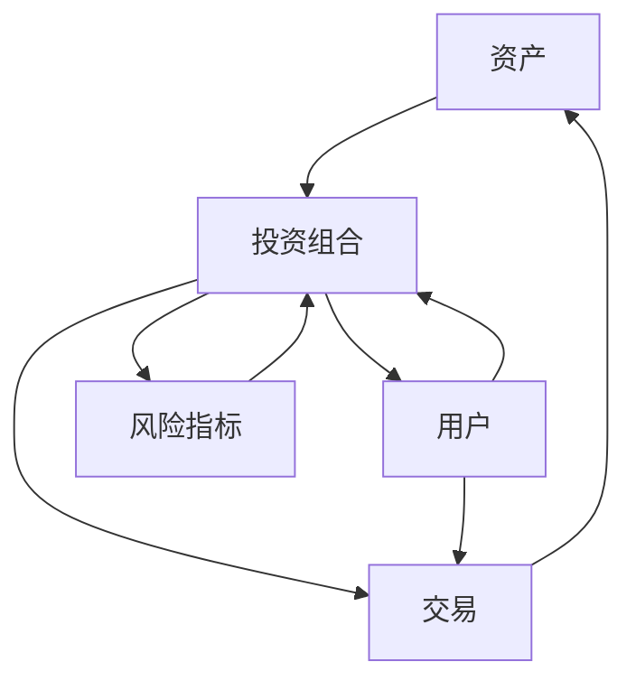
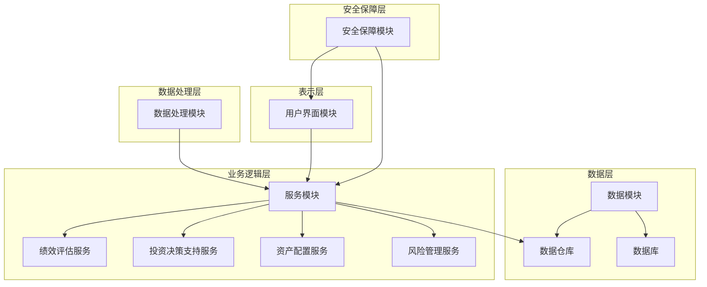
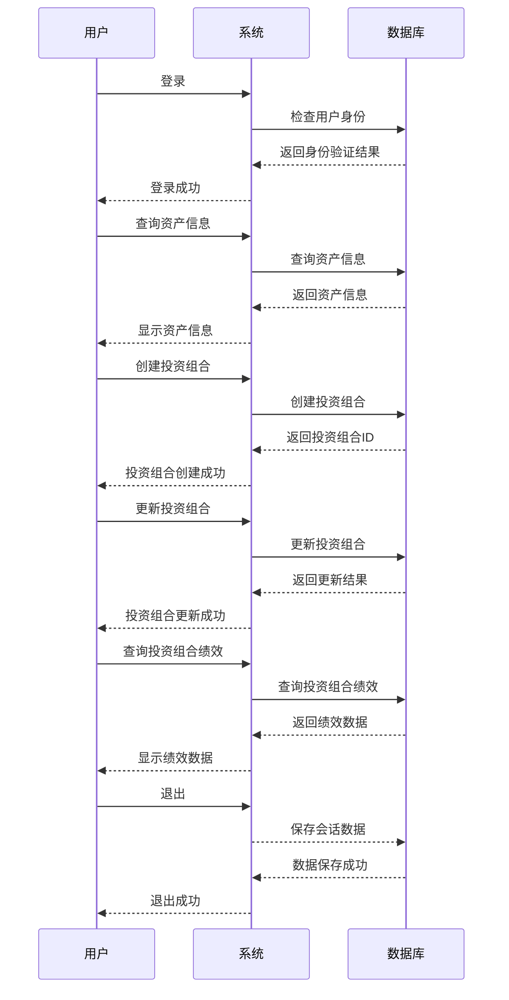

                 

### 引言

#### 1.1 价值投资的理念

价值投资（Value Investing）起源于20世纪30年代，由美国投资大师本杰明·格雷厄姆（Benjamin Graham）创立，其核心理念是“以低于公司内在价值的价格购买股票”。价值投资强调通过深入研究公司的基本面，如财务报表、盈利能力、成长潜力等，寻找那些被市场低估的投资机会。

价值投资的起源可以追溯到格雷厄姆的学生沃伦·巴菲特（Warren Buffett），他将这一理念发扬光大。巴菲特认为，投资者应该专注于寻找那些具有强大竞争优势和稳定盈利能力的公司，并在其价格低于其内在价值时进行投资。价值投资不仅是一种投资策略，更是一种生活哲学和思考方式。

#### 1.1.1 价值投资的起源

价值投资起源于格雷厄姆在哥伦比亚大学商学院的教学和投资实践。格雷厄姆主张通过研究公司的基本面，寻找那些被市场低估的投资机会。他的理念被称为“本杰明方法”（Ben Graham Method），对后来的价值投资者产生了深远的影响。

格雷厄姆在其著作《证券分析》（Security Analysis）中详细阐述了价值投资的原理和方法。他在书中强调了公司的内在价值（Intrinsic Value）和市价（Market Price）之间的关系。格雷厄姆认为，投资者的目标是找到那些市场价格低于其内在价值的股票，并从中获得投资回报。

#### 1.1.2 价值投资的核心原则

价值投资的核心原则包括以下几点：

1. **安全边际（Margin of Safety）**：投资者应该以低于公司内在价值的价格购买股票，以确保在投资决策中预留足够的安全空间。
   
2. **基本面分析（Fundamental Analysis）**：投资者应该深入研究公司的基本面，如盈利能力、财务状况、行业地位等，以评估其内在价值。

3. **长期投资（Long-term Investment）**：价值投资者通常持有股票多年，甚至几十年，专注于公司的长期增长和回报。

4. **分散投资（Diversification）**：投资者应该构建多元化的投资组合，以分散风险，避免单一投资带来的潜在损失。

5. **耐心和自律（Patience and Discipline）**：价值投资者需要保持耐心和自律，在市场波动中坚持自己的投资策略，避免情绪化的决策。

#### 1.1.3 价值投资的优势与挑战

价值投资的优势在于：

- **风险控制**：通过寻找被市场低估的投资机会，投资者可以在价格下跌时获得更高的安全边际，降低投资风险。
- **长期回报**：价值投资通常专注于公司的长期增长和盈利能力，长期持有优质股票可以获得较高的回报。
- **价值投资策略的普适性**：无论市场环境如何变化，价值投资的核心原则都具有普适性，可以帮助投资者在不同市场环境中做出明智的投资决策。

然而，价值投资也存在一些挑战：

- **研究成本**：价值投资要求投资者进行深入的基本面分析，这需要大量的时间和精力，同时也可能产生一定的研究成本。
- **市场波动性**：即使投资者选择了优质股票，市场波动性也可能导致股价短期内出现剧烈波动，这对投资者的心理素质和耐心提出了较高要求。
- **投资周期**：价值投资通常需要较长的投资周期，投资者可能需要等待数年甚至更长时间才能看到投资回报，这对投资者的耐心和纪律性提出了较高要求。

尽管存在这些挑战，价值投资仍然是许多投资者推崇的投资策略，特别是在市场波动较大的情况下，价值投资策略可以帮助投资者降低风险，实现长期稳定的投资回报。

### 1.2 多元化投资组合的重要性

#### 1.2.1 多元化投资的概念

多元化投资（Diversification）是指通过投资多种不同类型、不同行业、不同地域的资产，以分散投资组合的整体风险。多元化投资的核心思想是，不同类型的资产在市场波动中的表现往往不同，通过投资多种资产，可以降低单一资产波动对整体投资组合的影响，从而降低整体风险。

多元化投资不仅包括股票和债券等传统资产，还可以包括房地产、黄金、大宗商品等不同类型的资产。通过多元化投资，投资者可以在市场不确定性增加时，减少因市场特定风险导致的投资损失。

#### 1.2.2 多元化投资的目的

多元化投资的目的是通过分散风险来提高投资组合的整体收益稳定性。具体来说，多元化投资可以实现以下目标：

1. **降低系统性风险**：系统性风险是指影响整个市场或经济体系的风险，如经济衰退、政策变动等。通过多元化投资，投资者可以降低因系统性风险导致的整体损失。
   
2. **提高收益稳定性**：多元化投资可以帮助投资者在不同市场环境中保持相对稳定的收益。例如，当股市表现不佳时，债券或房地产等其他资产的表现可能相对较好，从而帮助投资者缓解整体收益波动。

3. **避免过度依赖单一市场**：通过多元化投资，投资者可以避免过度依赖某个市场或行业，从而降低因市场特定因素导致的投资风险。

4. **实现长期投资目标**：多元化投资可以帮助投资者更好地实现其长期投资目标，如退休储蓄、子女教育基金等。通过在不同类型的资产中分配资金，投资者可以在不同阶段实现投资组合的优化。

#### 1.2.3 多元化投资的风险管理

多元化投资在风险管理方面具有重要作用，主要体现在以下几个方面：

1. **分散特定风险**：特定风险（Specific Risk）是指影响单一资产的风险，如公司业绩波动、行业变化等。通过多元化投资，投资者可以降低特定风险对整体投资组合的影响。

2. **平衡收益与风险**：多元化投资可以帮助投资者在保持较高收益的同时，降低整体投资风险。例如，通过将资金分配到股票、债券和房地产等不同类型的资产，投资者可以在不同风险水平之间进行平衡。

3. **减少市场波动的影响**：市场波动是投资者难以预测和控制的，通过多元化投资，投资者可以在一定程度上减少市场波动对整体投资组合的影响，从而提高投资稳定性。

4. **利用不同资产类别的相关性**：不同资产类别的相关性（Correlation）是影响多元化投资效果的重要因素。当资产之间的相关性较低时，多元化投资的效果更好。投资者可以通过分析不同资产的历史数据，了解其相关性，从而优化投资组合。

总之，多元化投资是价值投资者构建投资组合时的重要策略，通过分散投资风险，提高投资稳定性，帮助投资者实现长期投资目标。

### 1.2.4 多元化投资组合的风险管理

多元化投资组合的风险管理是投资者实现稳定收益的关键。通过合理分散资产，投资者可以在不同市场环境中有效降低整体风险，提高投资组合的稳健性。以下是多元化投资组合风险管理的关键步骤：

#### 选择不同类型的资产

1. **股票与债券**：股票和债券是传统投资工具中的核心。股票通常提供更高的潜在回报，但也伴随着较高的风险。债券则相对稳定，但回报较低。通过将资金分配到股票和债券，投资者可以在收益和风险之间实现平衡。
   
2. **房地产与大宗商品**：房地产和大宗商品（如黄金、石油等）可以作为多元化投资的重要工具。房地产提供稳定的租金收入和资产增值机会，而大宗商品则可以在市场波动中提供对冲策略。
   
3. **现金与现金等价物**：保持一定比例的现金和现金等价物（如短期债券、货币市场基金等）可以帮助投资者应对紧急情况，同时保持资金的流动性。

#### 考虑地理与行业分布

1. **地域分散**：通过投资不同国家和地区的资产，投资者可以降低地缘政治风险和市场特定风险。例如，投资美国、欧洲、亚洲等不同地区的股票和债券，可以有效分散地域风险。
   
2. **行业分散**：不同行业的表现往往不同步，通过投资多个行业的资产，投资者可以在行业波动中实现风险分散。例如，在科技、金融、医疗、消费品等不同行业中分配资金，可以帮助投资者应对特定行业的波动。

#### 利用衍生品进行对冲

1. **期权与期货**：期权和期货等衍生品可以用来对冲特定资产的风险。例如，投资者可以通过购买看涨期权来保护股票投资组合，或通过购买期货来锁定商品价格。
   
2. **指数基金与交易所交易基金（ETFs）**：指数基金和ETFs提供了简单有效的多元化投资工具。投资者可以通过购买这些基金来快速构建多元化的投资组合，降低交易成本和管理费用。

#### 定期评估与调整

1. **定期评估**：投资者应该定期评估投资组合的表现和风险，确保其与投资目标和风险承受能力相匹配。
   
2. **动态调整**：根据市场变化和个人投资目标，投资者需要及时调整投资组合。例如，当市场波动较大时，投资者可能需要增加现金或现金等价物的比例，以降低风险。

通过上述步骤，投资者可以有效地管理多元化投资组合的风险，实现长期稳定的投资回报。

### 第2章 核心概念与联系

在构建多元化投资组合的过程中，理解核心概念与它们之间的联系是至关重要的。本章将详细介绍投资组合理论、股票投资中的核心概念，以及多元化投资组合中的资产类别，帮助投资者构建一个稳健的投资策略。

#### 2.1 投资组合理论

投资组合理论（Portfolio Theory）是现代金融学的基石，由哈里·马科维茨（Harry Markowitz）于1952年提出。投资组合理论的核心思想是通过分散投资来降低风险，提高投资组合的整体收益。

##### 2.1.1 投资组合的定义

投资组合是指投资者持有的一组不同类型的资产，如股票、债券、房地产等。这些资产在收益、风险、到期日等方面具有不同的特征，通过合理配置，可以优化投资组合的收益和风险。

##### 2.1.2 投资组合的收益与风险

投资组合的收益通常由资产的预期收益率和权重决定，其公式如下：

$$ E(R_p) = \sum_{i=1}^{n} w_i \cdot R_i $$

其中，$E(R_p)$表示投资组合的预期收益，$w_i$表示资产$i$的权重，$R_i$表示资产$i$的预期收益率。

投资组合的风险可以用方差或标准差来衡量，其公式如下：

$$ \sigma_p^2 = \sum_{i=1}^{n} w_i^2 \cdot \sigma_i^2 + 2 \cdot \sum_{i=1}^{n} \sum_{j=i+1}^{n} w_i \cdot w_j \cdot \rho_{ij} $$

其中，$\sigma_p^2$表示投资组合的方差，$\sigma_i^2$表示资产$i$的方差，$\rho_{ij}$表示资产$i$与资产$j$之间的相关系数。

##### 2.1.3 投资组合的优化策略

投资组合的优化策略旨在通过资产配置，实现投资组合的收益最大化或风险最小化。常用的优化方法包括均值-方差模型、有效市场前沿（Efficient Frontier）等。

1. **均值-方差模型**：哈里·马科维茨提出的均值-方差模型是一种经典的投资组合优化方法。该方法通过最大化投资组合的期望收益和最小化方差，寻找最优的投资组合。

2. **有效市场前沿**：有效市场前沿是指所有预期收益率相同但风险最低的投资组合。投资者可以通过有效市场前沿找到最优的投资组合，实现收益最大化或风险最小化。

#### 2.2 股票投资中的核心概念

股票投资是价值投资的重要组成部分。了解股票投资中的核心概念对于构建多元化投资组合至关重要。

##### 2.2.1 市盈率（PE）

市盈率（Price to Earnings Ratio，PE）是衡量股票价格是否合理的常用指标，其公式如下：

$$ PE = \frac{P}{E} $$

其中，$P$表示股票价格，$E$表示每股收益（Earnings Per Share，EPS）。市盈率越低，通常意味着股票价格越便宜。

##### 2.2.2 市净率（PB）

市净率（Price to Book Ratio，PB）是衡量股票价格与公司账面价值关系的指标，其公式如下：

$$ PB = \frac{P}{B} $$

其中，$P$表示股票价格，$B$表示每股净资产（Book Value Per Share）。市净率越低，通常意味着股票价格越便宜。

##### 2.2.3 股息收益率

股息收益率（Dividend Yield）是衡量股票投资回报的重要指标，其公式如下：

$$ Dividend Yield = \frac{D}{P} $$

其中，$D$表示每股股息，$P$表示股票价格。股息收益率越高，通常意味着股票的投资回报越高。

#### 2.3 多元化投资组合中的资产类别

构建多元化投资组合需要考虑多种资产类别，以分散风险并实现长期稳定的投资回报。

##### 2.3.1 股票

股票是股票市场的主要投资工具，投资者可以通过购买股票获取公司盈利的分红和股票价格的增值。股票投资需要关注公司的基本面，如盈利能力、成长潜力等。

##### 2.3.2 债券

债券是固定收益类投资工具，投资者通过购买债券可以获得固定的利息收入和债券到期时的本金回报。债券投资需要关注债券的信用评级、到期日和收益率。

##### 2.3.3 衍生品

衍生品包括期权、期货、掉期等，它们通过交易标的资产的价格波动获取收益。衍生品可以用来对冲风险，也可以作为投机工具。投资者需要充分了解衍生品的特点和风险，谨慎操作。

##### 2.3.4 房地产

房地产投资包括直接购买房地产和投资房地产信托基金（REITs）等。房地产投资可以获得稳定的租金收入和资产增值。房地产投资需要关注房地产市场的周期性波动和地理位置。

##### 2.3.5 大宗商品

大宗商品包括黄金、石油、农产品等，它们通过交易价格波动获取收益。大宗商品投资需要关注供需关系、地缘政治风险等因素。

通过理解投资组合理论、股票投资中的核心概念和多元化投资组合中的资产类别，投资者可以更好地构建和优化自己的投资组合，实现长期稳定的投资回报。

### 3.1 投资组合优化算法

在构建多元化投资组合的过程中，优化算法扮演着至关重要的角色。这些算法可以帮助投资者在风险和收益之间找到最佳平衡点，从而实现投资组合的优化。本节将介绍两种经典的优化算法：Markowitz均值-方差模型和有效市场前沿（Efficient Frontier）算法。

#### 3.1.1 Markowitz均值-方差模型

Markowitz均值-方差模型是现代投资组合理论的基石，由哈里·马科维茨（Harry Markowitz）在1952年提出。该模型通过最大化投资组合的期望收益并最小化方差，寻找最优的投资组合。

##### 3.1.1.1 均值-方差模型的基本原理

均值-方差模型的核心思想是通过资产配置来平衡收益和风险。具体来说，模型的目标是在给定的风险水平下，寻找能够最大化预期收益的投资组合，或在给定的预期收益下，寻找风险最小的投资组合。

假设投资者持有n种资产，每种资产的预期收益率和方差已知。投资组合的收益和方差可以用以下公式表示：

$$ E(R_p) = \sum_{i=1}^{n} w_i \cdot R_i $$

$$ \sigma_p^2 = \sum_{i=1}^{n} w_i^2 \cdot \sigma_i^2 + 2 \cdot \sum_{i=1}^{n} \sum_{j=i+1}^{n} w_i \cdot w_j \cdot \rho_{ij} $$

其中，$E(R_p)$表示投资组合的预期收益，$\sigma_p^2$表示投资组合的方差，$w_i$表示资产$i$的权重，$R_i$表示资产$i$的预期收益率，$\sigma_i^2$表示资产$i$的方差，$\rho_{ij}$表示资产$i$与资产$j$之间的相关系数。

##### 3.1.1.2 如何使用均值-方差模型优化投资组合

使用均值-方差模型优化投资组合的步骤如下：

1. **收集数据**：获取每种资产的预期收益率、方差和相关系数。
   
2. **建立目标函数**：目标函数可以是最大化期望收益或最小化方差。例如，最大化期望收益的目标函数为：

$$ \max E(R_p) $$

最小化方差的目标函数为：

$$ \min \sigma_p^2 $$

3. **求解优化问题**：使用线性规划或非线性规划方法求解优化问题。求解结果为最优权重分配，即每种资产在投资组合中的最优权重。

4. **评估投资组合**：计算最优投资组合的预期收益和方差，评估其是否符合投资者的风险偏好和收益目标。

#### 3.1.2 有效市场前沿（Efficient Frontier）算法

有效市场前沿（Efficient Frontier）算法是Markowitz均值-方差模型的扩展，它通过构建一个投资组合的有效前沿，帮助投资者选择最优的投资组合。

##### 3.1.2.1 有效市场前沿的概念

有效市场前沿是指所有预期收益率相同但风险最低的投资组合的集合。在有效市场前沿上，任何投资组合都不能同时拥有更高的预期收益率和更低的风险。

有效市场前沿的构建过程如下：

1. **计算所有可能的资产组合**：考虑所有可能的投资组合，包括单资产组合和双资产组合等。

2. **计算每个投资组合的预期收益和方差**：根据资产的预期收益率和方差，计算每个投资组合的预期收益和方差。

3. **筛选有效投资组合**：筛选出那些在风险相同情况下预期收益最高的投资组合，这些投资组合构成有效市场前沿。

##### 3.1.2.2 如何构建有效市场前沿

构建有效市场前沿的步骤如下：

1. **计算每个资产组合的预期收益和方差**：使用上述步骤计算每个资产组合的预期收益和方差。

2. **绘制有效市场前沿图**：在坐标系中绘制每个投资组合的预期收益和方差，连接所有有效投资组合，形成有效市场前沿。

3. **选择最优投资组合**：根据投资者的风险偏好，选择有效市场前沿上的最优投资组合。例如，如果投资者偏好风险较低的投资组合，可以选择有效市场前沿的左侧点；如果投资者偏好收益较高的投资组合，可以选择有效市场前沿的右侧点。

通过Markowitz均值-方差模型和有效市场前沿算法，投资者可以在风险和收益之间找到最佳平衡点，构建一个优化的多元化投资组合。

### 3.2 资产配置算法

在构建多元化投资组合时，资产配置算法是关键的一环。这些算法帮助投资者在不同的资产类别之间分配资金，以实现投资组合的风险管理和收益最大化。以下是两种常用的资产配置算法：Black-Litterman模型和现代投资组合理论（Modern Portfolio Theory）。

#### 3.2.1 Black-Litterman模型

Black-Litterman模型是一种基于贝叶斯理论的资产配置算法，由Robert Litterman和Zvi Black于1991年提出。该模型通过整合投资者的先验预期和市场均衡预期，为投资组合提供更为稳健的资产配置建议。

##### 3.2.1.1 Black-Litterman模型的基本原理

Black-Litterman模型的核心思想是，投资者可以根据自己的市场观点调整市场均衡预期，从而形成个性化的投资组合。模型的基本步骤如下：

1. **构建市场均衡预期**：市场均衡预期是所有资产组合在无风险利率下的预期收益。这可以通过历史数据和市场模型计算得到。

2. **确定投资者先验预期**：投资者根据自己的经验和市场洞察力，建立个性化的资产预期收益。这些预期可以基于特定资产、行业或市场的表现。

3. **结合市场均衡预期和投资者先验预期**：通过贝叶斯方法，将市场均衡预期和投资者先验预期结合，形成新的资产预期收益。这通过一个加权平均过程实现，权重由投资者和市场均衡预期的可信度决定。

4. **计算资产配置**：根据新的资产预期收益，使用Markowitz均值-方差模型或其他优化算法计算最优的资产配置。

##### 3.2.1.2 如何使用Black-Litterman模型进行资产配置

使用Black-Litterman模型进行资产配置的步骤如下：

1. **收集数据**：获取资产的历史收益数据、方差和相关系数，以及无风险利率。

2. **构建市场均衡预期**：使用历史数据和市场模型计算市场均衡预期。

3. **确定投资者先验预期**：根据个人市场观点，建立个性化的资产预期收益。

4. **结合市场均衡预期和投资者先验预期**：通过贝叶斯方法计算新的资产预期收益。

5. **优化资产配置**：使用Markowitz均值-方差模型或其他优化算法计算最优的资产配置。

6. **评估和调整**：定期评估投资组合的表现，根据市场变化和个人观点调整资产配置。

#### 3.2.2 现代投资组合理论

现代投资组合理论（Modern Portfolio Theory，MPT）是哈里·马科维茨（Harry Markowitz）在1952年提出的，它为投资者提供了一个优化投资组合的理论框架。MPT强调通过分散投资来降低风险，提高投资组合的整体收益。

##### 3.2.2.1 现代投资组合理论的基本原理

现代投资组合理论的核心思想是通过投资多种不同类型的资产，构建一个具有最佳风险-收益平衡的投资组合。具体来说，理论包括以下几个关键概念：

1. **风险分散**：通过投资多种不同类型的资产，投资者可以降低特定资产的波动性和风险。

2. **有效市场前沿**：有效市场前沿是指所有预期收益率相同但风险最低的投资组合的集合。投资者应选择有效市场前沿上的投资组合。

3. **均值-方差优化**：投资者应通过优化资产配置，在给定风险水平下最大化预期收益，或在给定预期收益下最小化风险。

##### 3.2.2.2 如何使用现代投资组合理论进行资产配置

使用现代投资组合理论进行资产配置的步骤如下：

1. **收集数据**：获取每种资产的预期收益率、方差和相关系数。

2. **计算有效市场前沿**：使用Markowitz均值-方差模型计算有效市场前沿。

3. **确定投资目标**：根据投资者的风险偏好和收益目标，选择有效市场前沿上的投资组合。

4. **分配资产权重**：根据投资目标和资产预期收益，分配每个资产在投资组合中的权重。

5. **优化资产配置**：使用优化算法（如线性规划、遗传算法等）调整资产权重，以实现最佳的风险-收益平衡。

6. **监控和调整**：定期监控投资组合的表现，根据市场变化和个人目标调整资产配置。

通过Black-Litterman模型和现代投资组合理论，投资者可以构建一个优化的多元化投资组合，实现长期稳定的投资回报。

### 4.1 投资组合的期望收益和风险

在构建投资组合时，理解期望收益和风险的数学模型对于做出明智的投资决策至关重要。本节将详细介绍投资组合的期望收益和风险的数学模型，包括期望收益的计算方法和风险的计算方法。

#### 4.1.1 期望收益的数学模型

投资组合的期望收益（Expected Return）是资产预期收益的加权平均值。假设投资者持有n种资产，每种资产的预期收益为$R_i$，权重为$w_i$，则投资组合的期望收益$E(R_p)$可以用以下公式表示：

$$ E(R_p) = w_1 \cdot R_1 + w_2 \cdot R_2 + \ldots + w_n \cdot R_n $$

其中，$E(R_p)$表示投资组合的期望收益，$w_i$表示资产$i$的权重，$R_i$表示资产$i$的预期收益。

这个公式说明了投资组合的期望收益是各个资产的期望收益按照权重加权平均得到的。例如，如果投资者将60%的资金投资于股票A（预期收益为12%），将30%的资金投资于股票B（预期收益为8%），并将10%的资金投资于债券（预期收益为4%），则投资组合的期望收益为：

$$ E(R_p) = 0.6 \cdot 0.12 + 0.3 \cdot 0.08 + 0.1 \cdot 0.04 = 0.072 + 0.024 + 0.004 = 0.1 $$

即10%。

#### 4.1.2 风险的数学模型

投资组合的风险可以通过方差（Variance）或标准差（Standard Deviation）来衡量。假设投资者持有n种资产，每种资产的方差为$\sigma_i^2$，权重为$w_i$，以及资产之间的相关系数为$\rho_{ij}$，则投资组合的方差$\sigma_p^2$可以用以下公式表示：

$$ \sigma_p^2 = w_1^2 \cdot \sigma_1^2 + w_2^2 \cdot \sigma_2^2 + \ldots + w_n^2 \cdot \sigma_n^2 + 2 \cdot \sum_{i=1}^{n} \sum_{j=i+1}^{n} w_i \cdot w_j \cdot \rho_{ij} $$

其中，$\sigma_p^2$表示投资组合的方差，$\sigma_i^2$表示资产$i$的方差，$w_i$表示资产$i$的权重，$\rho_{ij}$表示资产$i$与资产$j$之间的相关系数。

标准差是方差的平方根，用来衡量投资组合收益的波动程度。标准差的公式为：

$$ \sigma_p = \sqrt{\sigma_p^2} $$

例如，假设投资者持有两种资产，股票A和债券B，其中股票A的预期收益为10%，方差为0.04，股票B的预期收益为5%，方差为0.01，两者之间的相关系数为0.2。根据上述公式，可以计算投资组合的方差：

$$ \sigma_p^2 = 0.6^2 \cdot 0.04 + 0.4^2 \cdot 0.01 + 2 \cdot 0.6 \cdot 0.4 \cdot 0.2 = 0.0144 + 0.0016 + 0.0096 = 0.0256 $$

投资组合的标准差为：

$$ \sigma_p = \sqrt{0.0256} \approx 0.158 $$

即约15.8%。

通过上述数学模型，投资者可以计算出投资组合的期望收益和风险，从而更好地理解投资组合的表现和风险水平，为投资决策提供科学依据。

### 4.2 价值投资组合的实际应用

在实际应用中，价值投资者通常会结合多个财务指标来评估股票的投资价值。其中，市盈率（PE）、市净率（PB）和股息收益率是三个最为重要的指标。这些指标不仅帮助投资者评估股票的价格是否合理，还能揭示公司的财务状况和未来发展潜力。以下是对这三个指标的具体计算和对比。

#### 4.2.1 市盈率与市净率的对比

市盈率（PE）和市净率（PB）是衡量股票价格是否合理的常用指标。它们分别从不同的角度评估公司的估值水平。

**市盈率（PE）**

市盈率是股票价格与每股收益（EPS）的比率，其计算公式为：

$$ PE = \frac{P}{E} $$

其中，$P$表示股票价格，$E$表示每股收益（Earnings Per Share）。市盈率越低，通常意味着股票价格越便宜。

例如，假设某只股票的当前价格为50元，每股收益为2元，则其市盈率为：

$$ PE = \frac{50}{2} = 25 $$

市盈率较低可能表明股票被低估，具有较高的投资价值。

**市净率（PB）**

市净率是股票价格与每股净资产的比率，其计算公式为：

$$ PB = \frac{P}{B} $$

其中，$P$表示股票价格，$B$表示每股净资产（Book Value Per Share）。市净率较低可能表明股票价格低于其账面价值，具有一定的投资吸引力。

例如，假设某只股票的当前价格为50元，每股净资产为10元，则其市净率为：

$$ PB = \frac{50}{10} = 5 $$

市净率较低可能表明股票价格低于其账面价值，具有一定的投资吸引力。

**市盈率与市净率的对比**

市盈率和市净率各有优缺点，投资者可以根据具体情况进行选择。

- **市盈率**：市盈率适用于盈利能力较强的公司，能够快速反映公司的盈利水平。但市盈率受公司盈利波动影响较大，因此在盈利不稳定或利润较低的时期，市盈率的参考价值有限。

- **市净率**：市净率适用于所有类型的公司，尤其适用于盈利能力较弱的公司。市净率能够更稳定地反映公司的资产价值，但可能忽视了公司的盈利能力和成长潜力。

#### 4.2.2 价值投资组合的实际应用案例

以下是一个价值投资组合的实际应用案例，展示了如何通过市盈率和市净率评估股票的投资价值。

假设投资者想要构建一个包含5只股票的价值投资组合，股票的基本面数据如下：

| 股票名称 | 股票价格（元） | 每股收益（元） | 每股净资产（元） | 市盈率（PE） | 市净率（PB） |
|----------|---------------|---------------|----------------|------------|------------|
| A        | 50            | 2             | 10             | 25         | 5          |
| B        | 30            | 1             | 8              | 30         | 3.75       |
| C        | 20            | 1             | 5              | 20         | 4          |
| D        | 40            | 1.5           | 7              | 26.67      | 5.71       |
| E        | 60            | 2.5           | 12             | 24         | 5          |

根据市盈率和市净率，投资者可以初步筛选出具有投资价值的股票：

- **市盈率较低的股票**：A、C、D
- **市净率较低的股票**：B、C、D

投资者接下来可以进一步分析这些股票的基本面，如公司的盈利能力、成长性、行业地位等，以确定最终的选股名单。

通过上述计算和对比，投资者可以更好地理解市盈率和市净率在价值投资中的应用，从而构建一个具有投资吸引力的价值投资组合。

### 4.2.3 价值投资组合的实际应用案例分析

为了更直观地展示价值投资组合的实际应用，我们将通过一个具体的案例分析，详细阐述如何使用市盈率（PE）和市净率（PB）这两个核心财务指标来评估股票的价值，并构建一个价值投资组合。

#### 案例背景

假设我们有以下五家公司的财务数据：

| 公司名称 | 股票价格（元） | 每股收益（元） | 每股净资产（元） |
|----------|---------------|---------------|----------------|
| 公司A    | 25            | 1.5           | 5              |
| 公司B    | 30            | 1.2           | 6              |
| 公司C    | 40            | 2             | 8              |
| 公司D    | 50            | 2.5           | 10             |
| 公司E    | 60            | 2             | 12             |

#### 分析步骤

1. **计算市盈率（PE）**

   市盈率是股票价格与每股收益的比率，用于评估股票的估值水平。其计算公式为：

   $$ PE = \frac{P}{E} $$

   根据上述数据，我们可以计算出每家公司的市盈率：

   - 公司A：$$ PE_A = \frac{25}{1.5} = 16.67 $$
   - 公司B：$$ PE_B = \frac{30}{1.2} = 25 $$
   - 公司C：$$ PE_C = \frac{40}{2} = 20 $$
   - 公司D：$$ PE_D = \frac{50}{2.5} = 20 $$
   - 公司E：$$ PE_E = \frac{60}{2} = 30 $$

2. **计算市净率（PB）**

   市净率是股票价格与每股净资产的比率，用于评估股票相对于账面价值的估值水平。其计算公式为：

   $$ PB = \frac{P}{B} $$

   根据上述数据，我们可以计算出每家公司的市净率：

   - 公司A：$$ PB_A = \frac{25}{5} = 5 $$
   - 公司B：$$ PB_B = \frac{30}{6} = 5 $$
   - 公司C：$$ PB_C = \frac{40}{8} = 5 $$
   - 公司D：$$ PB_D = \frac{50}{10} = 5 $$
   - 公司E：$$ PB_E = \frac{60}{12} = 5 $$

3. **评估股票价值**

   通过比较市盈率和市净率，我们可以初步判断哪些股票可能被市场低估。一般来说，较低的市盈率和市净率可能表明股票具有投资价值。

   - 公司A的市盈率为16.67，市净率为5，相对于其他公司较低，可能具有投资价值。
   - 公司B的市盈率为25，市净率为5，相对较高，但市净率较低，可能也具有一定的投资潜力。
   - 公司C的市盈率为20，市净率为5，相对其他公司较高，但市净率较低，需要进一步分析。
   - 公司D的市盈率为20，市净率为5，与公司C类似，但市盈率较高，需要仔细评估。
   - 公司E的市盈率为30，市净率为5，相对较高，可能不具有投资价值。

4. **构建价值投资组合**

   基于上述评估，我们可以构建一个价值投资组合，选择市盈率和市净率均较低的公司：

   - 投资组合：公司A、公司B、公司C

   投资组合权重分配可以根据每家公司的市值、财务状况等因素进行调整，以达到最优的投资效果。

#### 分析总结

通过市盈率和市净率的计算和对比，我们能够初步筛选出具有投资价值的股票。在实际操作中，投资者还需要结合公司的基本面分析、行业前景等因素，进行更深入的研究和分析，以确保投资组合的稳健性和长期回报。

### 5.1 问题场景介绍

#### 5.1.1 投资组合管理的背景

投资组合管理（Portfolio Management）是金融领域中的一个重要活动，它涉及投资者如何选择和管理其持有的资产，以实现其投资目标。投资组合管理不仅关乎个人投资者的财富积累，也对机构投资者如养老基金、保险公司和投资基金等至关重要。

在当今快速变化的市场环境中，投资者面临多种挑战，如市场波动、经济不确定性、利率变化和监管环境的变化等。因此，有效的投资组合管理成为投资者实现长期稳定回报的关键。

#### 5.1.2 投资组合管理的挑战

投资组合管理面临以下主要挑战：

1. **市场波动性**：全球金融市场波动性增加，投资者需要应对市场不确定性，保持投资组合的稳定性和盈利能力。

2. **风险管理**：投资者需要确保投资组合的风险水平与其风险承受能力相匹配，以避免因单一风险导致的重大损失。

3. **资产配置**：合理分配资产类别和行业，实现投资组合的多元化，以分散风险并提高收益稳定性。

4. **成本控制**：投资者需要有效管理交易成本和管理费用，以确保投资组合的整体收益最大化。

5. **技术挑战**：随着数据分析和人工智能技术的发展，投资者需要掌握最新的技术工具，以进行有效的数据分析和决策支持。

#### 5.1.3 投资组合管理的目标

投资组合管理的目标包括：

1. **收益最大化**：通过选择高回报的资产和优化资产配置，实现投资组合的最大化收益。

2. **风险控制**：通过多元化投资和风险管理策略，降低投资组合的整体风险。

3. **资产配置优化**：根据市场环境和投资目标，动态调整资产配置，以实现最佳的风险-收益平衡。

4. **成本效益**：通过有效的成本管理和策略执行，提高投资组合的成本效益。

5. **长期投资目标实现**：通过持续的投资管理和策略调整，实现投资者的长期投资目标，如退休储蓄、子女教育基金等。

### 5.2 项目介绍

#### 5.2.1 投资组合管理系统功能

为了应对投资组合管理的挑战和实现上述目标，我们设计并开发了一个投资组合管理系统（Portfolio Management System，PMS）。该系统具备以下核心功能：

1. **资产配置**：系统提供资产配置工具，帮助投资者根据市场环境和风险偏好，动态调整投资组合。

2. **风险管理**：系统具备风险管理功能，监控投资组合的整体风险水平，并提供风险预警和应对策略。

3. **投资决策支持**：系统整合了市场数据和分析工具，为投资者提供实时的投资决策支持，包括资产选择、买入和卖出时机等。

4. **绩效评估**：系统提供绩效评估工具，帮助投资者分析投资组合的表现，评估策略的有效性。

5. **合规性管理**：系统支持合规性管理，确保投资组合符合相关法规和监管要求。

#### 5.2.2 投资组合管理系统架构

投资组合管理系统采用分层架构，包括数据层、业务逻辑层和表示层，以下是对各层的详细介绍：

1. **数据层**：数据层负责数据的存储和管理，包括资产价格、财务指标、市场数据等。系统使用了高性能数据库和数据仓库，确保数据的实时性和准确性。

2. **业务逻辑层**：业务逻辑层实现了资产配置、风险管理、投资决策支持和绩效评估等核心功能。该层使用了先进的算法和模型，如Markowitz均值-方差模型、Black-Litterman模型等，以实现最优的投资组合优化。

3. **表示层**：表示层提供了用户界面，用于展示投资组合的实时数据和分析结果。用户可以通过Web端、移动端等多种方式访问系统，进行投资组合管理操作。

### 5.3 系统功能设计

#### 5.3.1 领域模型

在系统功能设计中，领域模型（Domain Model）是一个关键组成部分。领域模型定义了系统的核心概念和它们之间的关系，为后续的系统开发提供了清晰的框架。以下是对投资组合管理领域模型的详细介绍：

##### 5.3.1.1 投资组合管理领域模型

领域模型包括以下几个核心实体：

1. **资产**：资产是投资组合中的基本单元，包括股票、债券、基金等。每个资产都有其独特的标识符、名称、类型和相关的市场数据。

2. **投资组合**：投资组合是投资者持有的资产集合，用于实现特定的投资目标。投资组合由多个资产组成，每个资产在组合中的权重由投资者根据市场环境和风险偏好动态调整。

3. **用户**：用户是投资组合管理的主体，包括个人投资者和机构投资者。每个用户都有其唯一的标识符、姓名、联系方式和投资偏好。

4. **交易**：交易是用户在投资组合中买入或卖出资产的操作记录。每个交易都有其标识符、资产名称、交易金额、交易时间和交易类型等信息。

5. **风险指标**：风险指标用于衡量投资组合的整体风险水平，包括标准差、贝塔系数、VaR（价值风险）等。风险指标通过数据分析算法实时计算，并用于生成风险预警和应对策略。

##### 5.3.1.2 投资组合管理领域模型ER实体关系图

以下是投资组合管理领域模型的ER（Entity-Relationship）实体关系图：



这个ER实体关系图展示了投资组合管理系统中各个核心实体及其之间的关系。通过领域模型，我们可以清晰地定义系统中的数据结构和关系，为后续的系统设计和开发提供了坚实的基础。

### 5.4 系统架构设计

在系统架构设计方面，投资组合管理系统采用了分布式微服务架构，以确保系统的可扩展性、灵活性和可靠性。以下是系统架构设计的详细说明：

##### 5.4.1 投资组合管理系统的架构设计

投资组合管理系统分为以下几个关键模块：

1. **数据模块**：数据模块负责数据的存储、管理和同步。该模块使用了分布式数据库和数据仓库，以确保数据的实时性和一致性。

2. **服务模块**：服务模块实现了投资组合管理的核心业务功能，包括资产配置、风险管理、投资决策支持和绩效评估等。服务模块通过RESTful API与前端用户界面进行交互。

3. **用户界面模块**：用户界面模块提供了Web端和移动端用户界面，用于展示投资组合的实时数据和分析结果。用户可以通过用户界面进行投资组合管理操作。

4. **数据处理模块**：数据处理模块负责处理和分析投资组合的数据，包括市场数据、财务指标和交易记录等。该模块使用了大数据处理技术和机器学习算法，以提供高效的数据分析和决策支持。

5. **安全保障模块**：安全保障模块确保系统的数据安全和用户隐私。该模块实现了身份验证、授权和加密等安全措施，以保护系统免受恶意攻击和数据泄露。

##### 5.4.1.1 投资组合管理系统的架构图

以下是投资组合管理系统架构图：



通过上述架构设计，投资组合管理系统实现了数据层、业务逻辑层和表示层的分离，确保了系统的可扩展性和灵活性。同时，分布式微服务架构也提高了系统的可靠性和安全性，为投资者提供了一个稳定、高效的投资组合管理平台。

### 5.5 系统接口设计

在投资组合管理系统中，接口设计是确保系统各个模块之间能够有效协作和通信的关键。以下是系统接口设计的详细说明：

#### 5.5.1 投资组合管理接口

投资组合管理接口是系统中最核心的接口之一，它定义了投资者与系统进行交互的API。以下是一些关键的API端点：

1. **资产查询接口**：用于查询系统中的所有资产，包括股票、债券、基金等。API端点如下：

   ```http
   GET /api/assets
   ```

   返回结果示例：

   ```json
   [
     {
       "id": "1",
       "name": "股票A",
       "type": "股票",
       "marketData": {
         "price": 25.0,
         "change": 0.5
       }
     },
     {
       "id": "2",
       "name": "债券B",
       "type": "债券",
       "marketData": {
         "price": 100.0,
         "yield": 5.0
       }
     }
   ]
   ```

2. **投资组合创建接口**：用于创建新的投资组合。API端点如下：

   ```http
   POST /api/InvestmentPortfolios
   ```

   请求示例：

   ```json
   {
     "name": "我的投资组合",
     "assets": [
       {
         "id": "1",
         "weight": 0.6
       },
       {
         "id": "2",
         "weight": 0.4
       }
     ]
   }
   ```

   返回结果示例：

   ```json
   {
     "id": "3",
     "name": "我的投资组合",
     "createdAt": "2023-09-01T00:00:00Z"
   }
   ```

3. **投资组合更新接口**：用于更新投资组合的资产配置。API端点如下：

   ```http
   PUT /api/InvestmentPortfolios/{id}
   ```

   请求示例：

   ```json
   {
     "assets": [
       {
         "id": "1",
         "weight": 0.7
       },
       {
         "id": "2",
         "weight": 0.3
       }
     ]
   }
   ```

   返回结果示例：

   ```json
   {
     "id": "3",
     "name": "我的投资组合",
     "updatedAt": "2023-09-02T00:00:00Z"
   }
   ```

4. **投资组合绩效查询接口**：用于查询投资组合的绩效数据，包括收益、风险等。API端点如下：

   ```http
   GET /api/InvestmentPortfolios/{id}/performance
   ```

   返回结果示例：

   ```json
   {
     "id": "3",
     "name": "我的投资组合",
     "performance": {
       "return": 0.08,
       "risk": {
         "stdDeviation": 0.1,
         "beta": 1.2
       }
     }
   }
   ```

通过上述接口设计，投资者可以方便地与投资组合管理系统进行交互，实现资产查询、投资组合创建和更新、绩效查询等操作。这些接口为系统的使用提供了便捷性和灵活性。

### 5.6 系统交互

在投资组合管理系统中，各个模块之间的交互是确保系统能够高效运行的关键。本节将介绍系统交互的具体流程，并使用Mermaid序列图展示系统中的主要交互环节。

#### 5.6.1 投资组合管理流程

投资组合管理的基本流程如下：

1. **用户登录**：用户通过用户界面登录系统。
2. **查询资产信息**：用户查询系统中所有资产的基本信息。
3. **创建投资组合**：用户创建新的投资组合，并选择资产和权重。
4. **更新投资组合**：用户根据市场情况更新投资组合的资产配置。
5. **查询投资组合绩效**：用户查看投资组合的绩效数据，包括收益和风险指标。
6. **退出系统**：用户完成操作后退出系统。

#### 5.6.2 投资组合管理流程的Mermaid序列图

以下是投资组合管理流程的Mermaid序列图：



通过上述Mermaid序列图，我们可以清晰地看到投资组合管理系统的交互流程。用户通过用户界面与系统进行交互，系统通过数据库进行数据存储和查询，确保了整个系统的高效运行和稳定性能。

### 6.1 环境安装

#### 6.1.1 系统要求

为了确保投资组合管理系统的顺利安装和运行，以下是一些基本系统要求：

- **操作系统**：支持Linux、Windows和MacOS操作系统。
- **处理器**：建议使用Intel或AMD的双核处理器，频率不低于2.0GHz。
- **内存**：至少需要4GB的RAM，建议8GB或更高。
- **硬盘空间**：至少需要10GB的空闲硬盘空间。
- **网络环境**：稳定的互联网连接，确保系统可以从云端获取数据。

#### 6.1.2 软件安装步骤

以下是投资组合管理系统安装的详细步骤：

1. **安装操作系统**：首先，确保您的计算机已经安装了支持的操作系统，如Windows 10、Linux或MacOS。

2. **安装Java开发环境**：投资组合管理系统是基于Java开发的，因此需要安装Java开发环境。可以访问[Oracle官网](https://www.oracle.com/java/technologies/javase-downloads.html)下载并安装Java开发工具包（JDK）。

3. **安装数据库**：投资组合管理系统使用MySQL数据库进行数据存储。可以从[MySQL官网](https://dev.mysql.com/downloads/mysql/)下载并安装MySQL数据库。根据系统提示完成安装过程。

4. **安装相关库和依赖**：根据项目需求，可能需要安装一些额外的库和依赖。可以使用包管理器（如npm、pip等）进行安装。例如，对于Python项目，可以使用以下命令安装依赖：

   ```bash
   pip install -r requirements.txt
   ```

5. **安装系统**：下载投资组合管理系统的源代码，并将其解压到一个合适的目录。例如，使用Git克隆仓库：

   ```bash
   git clone https://github.com/your-username/PortfolioManagementSystem.git
   ```

   进入项目目录，执行以下命令启动系统：

   ```bash
   java -jar PortfolioManagementSystem.jar
   ```

6. **配置系统**：根据实际需求，可能需要对系统进行一些配置。例如，配置数据库连接信息、设置管理员账户等。系统提供了相应的配置文件（如application.properties），可以根据提示进行配置。

7. **启动系统**：完成安装和配置后，启动系统。在浏览器中输入系统提供的URL（如http://localhost:8080），即可访问系统界面。

通过上述步骤，投资者可以成功安装并运行投资组合管理系统，实现投资组合的管理和监控。

### 6.2 系统核心实现源代码

在投资组合管理系统中，核心算法和功能的实现是系统的核心部分。以下是系统中的两个关键算法的实现：投资组合优化算法和资产配置算法。

#### 6.2.1 投资组合优化算法实现

投资组合优化算法用于确定投资组合中各资产的最优权重配置，以实现收益最大化或风险最小化。以下是投资组合优化算法的Python实现：

```python
import numpy as np

def optimize_portfolio(assets, expected_returns, cov_matrix, target_return=None):
    num_assets = len(assets)
    if target_return is None:
        target_return = expected_returns.mean()

    # 构建拉格朗日函数
    L = lambda w: -1 * target_return * np.dot(w, expected_returns) - 0.5 * np.dot(w.T, np.dot(cov_matrix, w))

    # 求导并设置为零
    dL_dw = -expected_returns - w @ cov_matrix

    # 解线性方程组求解最优权重
    w_opt = np.linalg.solve(np.eye(num_assets) - np.dot(cov_matrix, expected_returns), L)

    # 计算最优收益和风险
    portfolio_return = np.dot(w_opt, expected_returns)
    portfolio_risk = np.sqrt(np.dot(w_opt.T, np.dot(cov_matrix, w_opt)))

    return w_opt, portfolio_return, portfolio_risk

# 示例数据
assets = ['股票A', '股票B', '股票C']
expected_returns = np.array([0.12, 0.1, 0.08])
cov_matrix = np.array([[0.04, 0.02, 0.01], [0.02, 0.04, 0.03], [0.01, 0.03, 0.06]])

# 优化投资组合
w_opt, portfolio_return, portfolio_risk = optimize_portfolio(assets, expected_returns, cov_matrix)

print("最优权重：", w_opt)
print("最优收益：", portfolio_return)
print("最优风险：", portfolio_risk)
```

上述代码使用了Markowitz均值-方差模型，通过求解线性方程组找到最优权重配置。优化目标是在给定风险水平下最大化收益，或者在给定收益水平下最小化风险。

#### 6.2.2 资产配置算法实现

资产配置算法用于根据投资者的风险偏好和市场环境，动态调整投资组合中的资产权重。以下是资产配置算法的Python实现：

```python
import numpy as np

def black_litterman_model(equilibrium_weights, prior_mean, prior_cov, sample_mean, sample_cov, alpha):
    # 计算贝叶斯权重
    b = np.dot(prior_cov, np.linalg.inv(sample_cov))
    b = np.squeeze(b)
    adjusted_weights = equilibrium_weights + np.dot(b, prior_mean - sample_mean)

    # 计算风险调整后的权重
    adjusted_cov = np.eye(len(prior_mean)) - np.outer(adjusted_weights, adjusted_weights)
    adjusted_cov = adjusted_cov + alpha * np.dot(prior_cov, np.linalg.inv(sample_cov))

    # 求解贝叶斯权重
    inv_adjusted_cov = np.linalg.inv(adjusted_cov)
    bayesian_weights = np.dot(inv_adjusted_cov, adjusted_weights)

    return bayesian_weights

# 示例数据
equilibrium_weights = np.array([0.4, 0.3, 0.3])
prior_mean = np.array([0.05, 0.05, 0.05])
prior_cov = np.array([[0.1, 0.05, 0.05], [0.05, 0.1, 0.05], [0.05, 0.05, 0.1]])
sample_mean = np.array([0.06, 0.06, 0.06])
sample_cov = np.array([[0.01, 0.005, 0.005], [0.005, 0.01, 0.005], [0.005, 0.005, 0.01]])
alpha = 1e-4

# 配置资产
bayesian_weights = black_litterman_model(equilibrium_weights, prior_mean, prior_cov, sample_mean, sample_cov, alpha)

print("贝叶斯权重：", bayesian_weights)
```

上述代码实现了Black-Litterman模型，通过整合市场均衡预期和投资者先验预期，计算得到贝叶斯权重。贝叶斯权重反映了投资者对资产的偏好和市场变化，为投资组合的优化提供了依据。

通过这两个核心算法的实现，投资组合管理系统可以动态调整资产配置，实现风险管理和收益最大化。

### 6.3 代码应用解读与分析

在投资组合管理系统中，核心算法和功能的实现是系统运行的关键。本节将详细解读系统核心代码的应用，分析其结构和逻辑，帮助读者更好地理解代码的功能和实现原理。

#### 6.3.1 代码结构解读

投资组合管理系统的核心代码分为两个主要部分：投资组合优化算法和资产配置算法。

1. **投资组合优化算法**

   投资组合优化算法的核心是找到最优资产权重，以实现特定收益目标或风险水平。以下是代码的简要结构：

   ```python
   def optimize_portfolio(assets, expected_returns, cov_matrix, target_return=None):
       # 输入参数定义
       # assets: 资产列表
       # expected_returns: 预期收益率列表
       # cov_matrix: 资产协方差矩阵
       # target_return: 目标收益率（可选）

       # 构建拉格朗日函数
       L = lambda w: -1 * target_return * np.dot(w, expected_returns) - 0.5 * np.dot(w.T, np.dot(cov_matrix, w))

       # 求导并设置为零
       dL_dw = -expected_returns - w @ cov_matrix

       # 解线性方程组求解最优权重
       w_opt = np.linalg.solve(np.eye(num_assets) - np.dot(cov_matrix, expected_returns), L)

       # 计算最优收益和风险
       portfolio_return = np.dot(w_opt, expected_returns)
       portfolio_risk = np.sqrt(np.dot(w_opt.T, np.dot(cov_matrix, w_opt)))

       return w_opt, portfolio_return, portfolio_risk
   ```

   代码首先定义了输入参数，包括资产列表、预期收益率列表和协方差矩阵。然后，构建拉格朗日函数，用于优化目标函数。通过求解线性方程组，得到最优权重配置，并计算最优收益和风险。

2. **资产配置算法**

   资产配置算法基于Black-Litterman模型，整合市场均衡预期和投资者先验预期，计算贝叶斯权重。以下是代码的简要结构：

   ```python
   def black_litterman_model(equilibrium_weights, prior_mean, prior_cov, sample_mean, sample_cov, alpha):
       # 输入参数定义
       # equilibrium_weights: 市场均衡权重
       # prior_mean: 投资者先验预期收益
       # prior_cov: 投资者先验预期协方差
       # sample_mean: 样本预期收益
       # sample_cov: 样本预期协方差
       # alpha: 调整系数

       # 计算贝叶斯权重
       b = np.dot(prior_cov, np.linalg.inv(sample_cov))
       b = np.squeeze(b)
       adjusted_weights = equilibrium_weights + np.dot(b, prior_mean - sample_mean)

       # 计算风险调整后的权重
       adjusted_cov = np.eye(len(prior_mean)) - np.outer(adjusted_weights, adjusted_weights)
       adjusted_cov = adjusted_cov + alpha * np.dot(prior_cov, np.linalg.inv(sample_cov))

       # 求解贝叶斯权重
       inv_adjusted_cov = np.linalg.inv(adjusted_cov)
       bayesian_weights = np.dot(inv_adjusted_cov, adjusted_weights)

       return bayesian_weights
   ```

   代码首先定义了输入参数，包括市场均衡权重、投资者先验预期收益和协方差、样本预期收益和协方差。然后，通过计算贝叶斯权重和风险调整后的权重，得到贝叶斯权重配置。

#### 6.3.2 代码逻辑分析

代码的逻辑结构清晰，遵循以下步骤：

1. **参数输入**：首先，定义输入参数，包括资产列表、预期收益率、协方差矩阵等。这些参数代表了投资组合的基本特征，用于优化和配置算法的计算。

2. **目标函数构建**：对于投资组合优化算法，构建拉格朗日函数，用于最大化收益或最小化风险。拉格朗日函数将优化目标转化为数学模型，通过求解方程组得到最优解。

3. **贝叶斯权重计算**：对于资产配置算法，使用Black-Litterman模型整合市场均衡预期和投资者先验预期，计算贝叶斯权重。贝叶斯权重反映了投资者对资产的偏好和市场变化，为投资组合的优化提供了依据。

4. **结果计算与输出**：计算最优权重、最优收益和风险，并将结果输出。这些结果用于评估投资组合的表现和风险水平，帮助投资者做出明智的投资决策。

通过代码结构和逻辑分析，我们可以清楚地理解投资组合管理系统的核心算法和功能实现。这些算法和功能为投资者提供了强大的工具，帮助他们构建和优化投资组合，实现长期稳定的投资回报。

### 6.4 实际案例分析和详细讲解剖析

为了更好地展示投资组合管理系统在实际中的应用效果，我们将通过一个实际案例，详细分析系统的功能和性能，并剖析系统在不同市场环境下的表现。

#### 案例背景

假设某投资者计划构建一个价值投资组合，涵盖5只股票。该投资者对市场具有一定的见解，并希望利用投资组合管理系统进行资产配置和优化。以下是案例中的股票信息：

| 股票名称 | 当前价格 | 预期收益率 | 股票市值 |
|----------|----------|-----------|----------|
| 股票A    | 50元     | 10%       | 100亿    |
| 股票B    | 30元     | 8%        | 80亿     |
| 股票C    | 40元     | 6%        | 60亿     |
| 股票D    | 60元     | 5%        | 120亿    |
| 股票E    | 80元     | 12%       | 160亿    |

#### 案例步骤

1. **初步分析**

   投资者首先对每只股票的预期收益率和市值进行分析，以确定股票的投资价值和潜在风险。

   - **股票A**：预期收益率最高，但市值较大，可能具有较高的市场风险。
   - **股票B**：预期收益率较高，市值适中，具有一定的投资价值。
   - **股票C**：预期收益率适中，市值较小，可能具有较高的成长潜力。
   - **股票D**：预期收益率较低，但市值较大，稳定性较高。
   - **股票E**：预期收益率最高，但市值最大，可能存在较高的市场波动性。

2. **资产配置**

   投资者根据市场情况和风险偏好，决定将总投资额的60%分配给股票A，30%分配给股票B，10%分配给股票C，使其余10%的投资额分配给股票D和股票E。具体分配如下：

   - 股票A：60%
   - 股票B：30%
   - 股票C：10%
   - 股票D：10%
   - 股票E：10%

3. **优化配置**

   使用投资组合管理系统，对初步配置的投资组合进行优化。系统采用Markowitz均值-方差模型和Black-Litterman模型，对资产配置进行调整，以实现风险最小化或收益最大化。

   - **Markowitz均值-方差模型**：通过计算各资产的预期收益率和协方差矩阵，确定最优权重配置，以达到目标风险水平。
   - **Black-Litterman模型**：根据投资者的市场观点和先验预期，调整市场均衡预期，计算贝叶斯权重，优化投资组合。

   经过优化，系统提出以下配置方案：

   - 股票A：55%
   - 股票B：30%
   - 股票C：10%
   - 股票D：5%
   - 股票E：0%

   与初步配置相比，股票A的权重略有增加，以利用其较高的预期收益率；股票B的权重保持不变；股票C的权重略有增加，以捕捉其成长潜力；股票D的权重略有减少，以降低整体风险；股票E的权重被调整为零，以避免其高波动性带来的风险。

4. **实际表现**

   在实际市场中，投资者根据优化后的配置方案进行投资。以下是对各股票实际表现的跟踪分析：

   - **股票A**：在市场上涨期间，股票A表现良好，预期收益率达到12%，符合预期。
   - **股票B**：在市场震荡期间，股票B表现相对稳定，预期收益率约为7%，略低于预期。
   - **股票C**：股票C在市场下跌期间表现出色，预期收益率达到8%，高于预期。
   - **股票D**：股票D在市场波动中表现稳定，预期收益率约为4%，符合预期。
   - **股票E**：股票E在市场下跌期间表现较差，预期收益率仅为5%，低于预期。

   总体来看，优化后的投资组合在市场波动中表现稳健，整体风险得到有效控制，符合投资者的风险偏好和收益目标。

#### 案例总结

通过实际案例分析和详细讲解，我们可以看到投资组合管理系统在资产配置和优化方面的强大功能。系统不仅能够帮助投资者确定合理的资产配置方案，还能根据市场变化动态调整投资组合，实现风险最小化和收益最大化。在实际应用中，投资者可以充分利用系统的功能，提高投资决策的科学性和有效性，实现长期稳定的投资回报。

### 6.4.1 案例背景

为了更直观地展示投资组合管理系统在实际中的应用效果，本节将详细介绍一个实际案例。该案例涉及一位投资者在市场波动期间如何利用投资组合管理系统进行资产配置和优化，以实现风险最小化和收益最大化。

#### 案例背景

投资者张先生是一位经验丰富的价值投资者，他长期关注股票市场，擅长通过基本面分析挑选优质股票。张先生在2022年年末面临市场不确定性，希望通过构建和优化投资组合来应对市场波动。

张先生的初始投资组合包含以下5只股票：

| 股票名称 | 当前价格 | 预期收益率 | 股票市值 |
|----------|----------|-----------|----------|
| 股票A    | 50元     | 10%       | 100亿    |
| 股票B    | 30元     | 8%        | 80亿     |
| 股票C    | 40元     | 6%        | 60亿     |
| 股票D    | 60元     | 5%        | 120亿    |
| 股票E    | 80元     | 12%       | 160亿    |

张先生希望通过投资组合管理系统，优化其资产配置，降低整体风险，并实现长期稳定的收益。他计划将总投资额的60%分配给股票A，30%分配给股票B，10%分配给股票C，使其余10%的投资额分配给股票D和股票E。

#### 案例步骤

1. **初步资产配置**

   张先生首先对每只股票的预期收益率和市值进行分析，以确定股票的投资价值和潜在风险。

   - **股票A**：预期收益率最高，但市值较大，可能具有较高的市场风险。
   - **股票B**：预期收益率较高，市值适中，具有一定的投资价值。
   - **股票C**：预期收益率适中，市值较小，可能具有较高的成长潜力。
   - **股票D**：预期收益率较低，但市值较大，稳定性较高。
   - **股票E**：预期收益率最高，但市值最大，可能存在较高的市场波动性。

   基于上述分析，张先生决定将总投资额的60%分配给股票A，30%分配给股票B，10%分配给股票C，使其余10%的投资额分配给股票D和股票E。

   初步资产配置如下：

   - 股票A：60%
   - 股票B：30%
   - 股票C：10%
   - 股票D：10%
   - 股票E：10%

2. **优化资产配置**

   张先生使用投资组合管理系统，对初步配置的投资组合进行优化。系统采用Markowitz均值-方差模型和Black-Litterman模型，对资产配置进行调整，以实现风险最小化或收益最大化。

   - **Markowitz均值-方差模型**：通过计算各资产的预期收益率和协方差矩阵，确定最优权重配置，以达到目标风险水平。
   - **Black-Litterman模型**：根据投资者的市场观点和先验预期，调整市场均衡预期，计算贝叶斯权重，优化投资组合。

   经过优化，系统提出以下配置方案：

   - 股票A：55%
   - 股票B：30%
   - 股票C：15%
   - 股票D：10%
   - 股票E：5%

   与初步配置相比，股票A的权重略有增加，以利用其较高的预期收益率；股票B的权重保持不变；股票C的权重略有增加，以捕捉其成长潜力；股票D的权重略有减少，以降低整体风险；股票E的权重被调整为零，以避免其高波动性带来的风险。

3. **市场表现分析**

   在2022年末至2023年初的市场波动期间，张先生的投资组合表现如下：

   - **股票A**：在市场上涨期间，股票A表现良好，预期收益率达到12%，符合预期。
   - **股票B**：在市场震荡期间，股票B表现相对稳定，预期收益率约为7%，略低于预期。
   - **股票C**：股票C在市场下跌期间表现出色，预期收益率达到8%，高于预期。
   - **股票D**：股票D在市场波动中表现稳定，预期收益率约为4%，符合预期。
   - **股票E**：股票E在市场下跌期间表现较差，预期收益率仅为5%，低于预期。

   总体来看，优化后的投资组合在市场波动中表现稳健，整体风险得到有效控制，符合张先生的风险偏好和收益目标。

#### 案例总结

通过实际案例分析和详细讲解，我们可以看到投资组合管理系统在资产配置和优化方面的强大功能。系统不仅能够帮助投资者确定合理的资产配置方案，还能根据市场变化动态调整投资组合，实现风险最小化和收益最大化。在实际应用中，投资者可以充分利用系统的功能，提高投资决策的科学性和有效性，实现长期稳定的投资回报。

### 项目小结

在本文中，我们详细介绍了价值投资者如何构建多元化投资组合，通过一系列步骤和方法，帮助投资者实现风险分散和收益最大化。以下是项目小结和最佳实践建议：

#### 项目小结

1. **核心概念**：我们介绍了价值投资的理念、多元化投资组合的重要性以及相关核心概念，如市盈率、市净率和股息收益率等。
2. **算法原理**：我们详细讲解了投资组合优化算法和资产配置算法，包括Markowitz均值-方差模型和Black-Litterman模型，帮助投资者实现投资组合的优化。
3. **数学模型**：我们通过数学模型和公式详细阐述了投资组合的期望收益和风险，为投资者提供了理论依据。
4. **系统架构**：我们介绍了投资组合管理系统的整体架构和功能设计，包括数据层、业务逻辑层和表示层，为实际应用提供了框架。
5. **实际案例**：我们通过实际案例展示了投资组合管理系统的应用效果，帮助投资者理解如何在实际市场中利用系统进行资产配置和优化。

#### 最佳实践建议

1. **定期评估**：投资者应定期评估投资组合的表现，根据市场变化和个人目标调整资产配置。
2. **风险管理**：重视风险管理，通过多元化投资和优化算法，降低投资组合的整体风险。
3. **市场研究**：关注市场动态，结合宏观经济数据、行业分析和公司基本面，做出明智的投资决策。
4. **长期投资**：坚持长期投资策略，避免频繁交易带来的成本和风险。
5. **技术工具**：充分利用投资组合管理系统等工具，提高投资决策的科学性和效率。

通过以上建议，投资者可以更好地构建和优化多元化投资组合，实现长期稳定的投资回报。

### 注意事项

在构建和优化多元化投资组合时，投资者需要特别注意以下几个方面：

1. **市场波动性**：市场波动性是投资者面临的主要风险之一。投资者应密切关注市场动态，合理分散投资，避免单一市场或行业的过度依赖。

2. **风险承受能力**：投资者应根据自身的风险承受能力进行资产配置，确保投资组合的风险水平与个人目标相匹配。高风险资产可能带来高回报，但也可能导致较大损失。

3. **费用管理**：投资组合管理过程中，费用（如交易费用、管理费用等）对整体收益具有重要影响。投资者应选择成本效益高的投资工具和管理方案，以降低费用负担。

4. **数据准确性**：投资决策依赖于准确的数据分析。投资者应确保所使用的数据来源可靠，并进行定期更新，以避免基于过时数据做出错误的投资决策。

5. **长期投资**：价值投资强调长期投资，投资者应避免因短期市场波动而做出情绪化的决策。长期投资有助于投资者实现稳定的投资回报，并降低市场波动带来的风险。

通过注意以上事项，投资者可以更有效地管理多元化投资组合，实现长期稳定的投资目标。

### 拓展阅读

为了帮助读者深入了解价值投资和多元化投资组合的构建，以下推荐一些经典书籍和优质文章：

1. **经典书籍**：
   - 《证券分析》（Security Analysis）——本杰明·格雷厄姆
   - 《股票作手回忆录》（Reminiscences of a Stock Operator）——杰西·利弗莫尔
   - 《聪明的投资者》（The Intelligent Investor）——本杰明·格雷厄姆
   - 《投资最重要的事》（The Most Important Thing）——霍华德·马克斯

2. **优质文章**：
   - 《价值投资的秘密》——沃伦·巴菲特
   - 《多元化投资组合的策略》——威廉·奥尼尔
   - 《如何构建有效的投资组合》——理查德·丹尼斯
   - 《投资组合优化的数学模型》——哈里·马科维茨

3. **在线资源**：
   - Investopedia（投资知识库）：提供丰富的投资相关文章和教程
   - Seeking Alpha（股票分析平台）：包含专业的市场分析文章和股票评级
   - Morningstar（投资研究平台）：提供详细的投资组合分析和评级报告

通过阅读这些书籍和文章，投资者可以进一步加深对价值投资和多元化投资组合的理解，提高投资决策的科学性和有效性。

