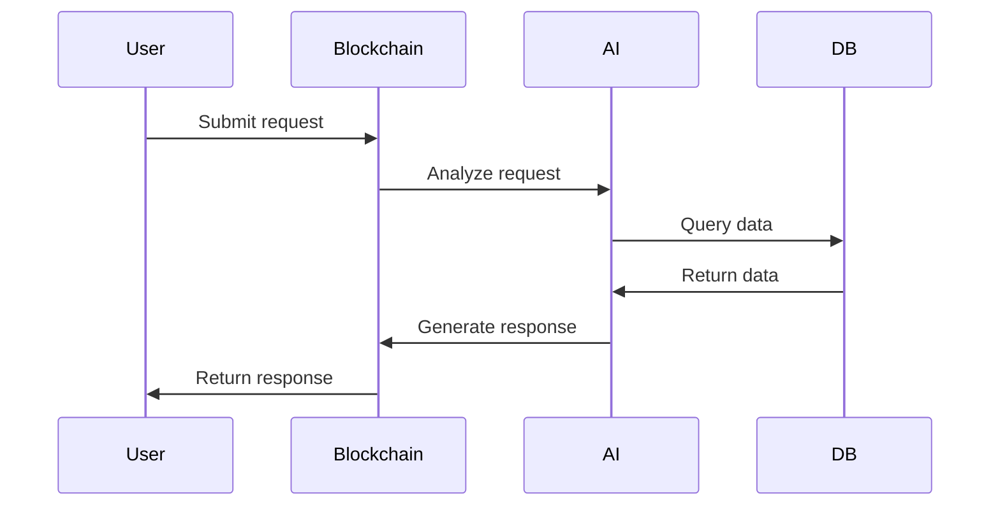

                 

# 价值投资者如何看待新兴技术：区块链、AI等

## 关键词

- **价值投资**
- **新兴技术**
- **区块链**
- **人工智能**
- **投资策略**
- **技术应用**

## 摘要

本文旨在探讨价值投资者如何理解和评估新兴技术，如区块链和人工智能。通过对这些技术的背景、核心概念、应用场景、挑战与机遇的详细分析，帮助价值投资者从深度和广度上把握这些技术的投资价值，为投资决策提供科学依据。文章采用逻辑清晰、结构紧凑、简单易懂的专业技术语言，让读者能够逐步理解并掌握相关技术原理。

----------------------------------------------------------------

## 第一部分：背景与核心概念

### 第1章 问题背景与核心概念

#### 1.1 价值投资者如何看待新兴技术

随着科技的快速发展，区块链、人工智能等新兴技术正在不断改变全球经济格局。价值投资者作为金融市场的重要参与者，必须对这些新兴技术有深入的理解，以指导其投资决策。

##### 1.1.1 问题背景

价值投资是一种以基本面分析为基础的投资策略，其核心在于寻找那些被市场低估的高质量股票，并长期持有，以期在未来获得超越市场的回报。随着科技的进步，新兴技术对传统行业和商业模式产生深远影响，价值投资者如何评估这些技术的投资价值，成为一个亟待解决的问题。

##### 1.1.2 核心概念

- **区块链技术**：一种去中心化的分布式数据库技术，通过密码学确保数据的不可篡改性和安全性。
- **人工智能**：一种模拟人类智能的技术，包括机器学习、深度学习等子领域。

#### 1.2 核心概念与联系

##### 1.2.1 区块链技术

- **定义**：区块链技术是一种去中心化的分布式数据库技术，通过密码学确保数据的不可篡改性和安全性。它由多个区块按时间顺序链接而成，每个区块都包含一定数量的交易记录。
- **概念属性特征对比表格**：

| 特征             | 区块链           | 中心化数据库         |
|------------------|------------------|----------------------|
| 数据存储方式      | 分布式数据库      | 集中式数据库         |
| 数据安全性       | 通过密码学确保    | 通过防火墙和权限控制  |
| 数据访问权限      | 去中心化         | 中心化               |
| 数据不可篡改性    | 高               | 低                  |

- **ER实体关系图架构**：

```
用户 -> 发起交易
用户 -> 签署合约
交易 -> 区块
合约 -> 智能合约
```

##### 1.2.2 人工智能

- **定义**：人工智能是一种模拟人类智能的技术，包括机器学习、深度学习等子领域。它能够通过学习大量数据，自动识别模式和规律，从而实现智能决策和问题解决。
- **概念属性特征对比表格**：

| 特征             | 人工智能           | 传统软件工程         |
|------------------|---------------------|-----------------------|
| 开发方式         | 数据驱动           | 规则驱动             |
| 应用领域         | 广泛应用于各个领域 | 主要应用于特定领域    |
| 需求变化适应性    | 高                 | 低                  |

- **ER实体关系图架构**：

```
算法 -> 模型
数据 -> 算法
应用 -> 模型
数据 -> 应用
```

#### 1.3 边界与外延

##### 1.3.1 区块链技术

- **边界**：区块链技术主要涉及加密货币、智能合约、供应链管理等领域。
- **外延**：随着技术的发展，区块链技术可能应用于更多领域，如医疗健康、投票系统、身份认证等。

##### 1.3.2 人工智能

- **边界**：人工智能主要应用于自动驾驶、医疗诊断、金融分析等领域。
- **外延**：随着技术的进步，人工智能可能扩展到更多领域，如教育、艺术创作、智能家居等。

#### 1.4 概念结构与核心要素组成

##### 1.4.1 区块链技术

- **概念结构**：区块链技术由区块链网络、加密算法、分布式账本三个核心要素组成。
- **核心要素组成**：

  - **区块链网络**：由多个节点组成，节点之间通过加密通信实现数据同步和一致性。
  - **加密算法**：用于确保数据的安全性和隐私性。
  - **分布式账本**：记录所有交易数据，确保数据的不可篡改性和透明性。

##### 1.4.2 人工智能

- **概念结构**：人工智能由算法、数据、计算能力三个核心要素组成。
- **核心要素组成**：

  - **算法**：用于实现智能学习和决策。
  - **数据**：作为训练模型的基础，质量越高，模型效果越好。
  - **计算能力**：用于加速模型的训练和推理过程。

#### 1.5 本章小结

本章节从问题背景出发，介绍了价值投资者如何看待区块链、人工智能等新兴技术，并详细阐述了相关核心概念和边界外延。通过对核心概念的分析和对比，为后续章节的深入探讨奠定了基础。

----------------------------------------------------------------

## 第二部分：区块链技术分析

### 第2章 区块链技术概述

#### 2.1 区块链技术的基本原理

##### 2.1.1 区块链技术的定义

区块链技术是一种去中心化的分布式数据库技术，通过密码学确保数据的不可篡改性和安全性。它由多个区块按时间顺序链接而成，每个区块都包含一定数量的交易记录。

##### 2.1.2 区块链技术的工作原理

区块链技术的工作原理主要包括以下几个关键步骤：

1. **交易生成**：用户发起交易，交易包含发送方、接收方和交易金额等信息。
2. **区块生成**：将一定数量的交易打包成一个区块，区块包含一个时间戳和上一个区块的哈希值。
3. **工作量证明**：节点通过计算产生新区块的哈希值，计算过程称为工作量证明（Proof of Work，PoW）。
4. **区块验证**：其他节点验证新区块的合法性，包括检查交易的有效性和区块的哈希值。
5. **区块添加**：验证通过的区块添加到区块链中，新的区块将链接到已有的区块链上。

##### 2.1.3 区块链技术的核心要素

区块链技术的核心要素包括区块链网络、加密算法和分布式账本：

- **区块链网络**：由多个节点组成，节点之间通过加密通信实现数据同步和一致性。每个节点都维护一个完整的区块链副本，确保数据的完整性和一致性。
- **加密算法**：用于确保数据的安全性和隐私性，包括哈希算法、数字签名和非对称加密等。这些算法确保交易记录的不可篡改性和用户的匿名性。
- **分布式账本**：记录所有交易数据，确保数据的不可篡改性和透明性。分布式账本使得每个节点都拥有相同的数据副本，从而避免了单点故障和数据篡改的风险。

#### 2.2 区块链技术的应用场景

区块链技术具有广泛的应用场景，以下是一些主要的领域：

##### 2.2.1 加密货币

- **比特币**：比特币是第一个基于区块链技术的加密货币，通过区块链实现去中心化的货币交易。比特币的特点是去中心化、去信任和抗通货膨胀。
- **以太坊**：以太坊是基于区块链的智能合约平台，支持去中心化应用（DApp）的创建和运行。以太坊的独特之处在于其智能合约功能，使得开发者可以在区块链上构建和运行复杂的去中心化应用。

##### 2.2.2 智能合约

- **定义**：智能合约是基于区块链的自动化执行合同。它是一段存储在区块链上的程序代码，当满足特定的条件时，智能合约会自动执行相应的操作。
- **应用**：智能合约可以应用于金融衍生品、供应链管理、版权保护等领域。例如，在供应链管理中，智能合约可以确保商品的所有权和运输过程，从而提高供应链的透明度和效率。

##### 2.2.3 其他应用场景

- **供应链管理**：通过区块链技术确保供应链的透明性和可靠性。每个参与方都可以查看和验证商品的所有交易记录，从而确保供应链的透明度和安全性。
- **医疗健康**：通过区块链技术确保患者数据的隐私和安全。区块链技术可以保护患者数据的完整性，防止数据被篡改或泄露。

#### 2.3 区块链技术的挑战与机遇

##### 2.3.1 挑战

- **技术难题**：如何确保区块链技术的性能和可扩展性，以满足大规模应用的需求。
- **监管问题**：如何应对区块链技术的监管挑战，确保区块链技术的合规性和安全性。

##### 2.3.2 机遇

- **创新应用**：区块链技术在金融、供应链、医疗等领域的创新应用，为企业和投资者带来了新的商业机会。
- **投资机会**：区块链相关企业的投资机会，包括加密货币、区块链平台和区块链应用等领域。

#### 2.4 本章小结

本章节从区块链技术的基本原理出发，介绍了其应用场景、挑战与机遇，为价值投资者提供了深入了解区块链技术的视角。通过对区块链技术的分析，价值投资者可以更好地评估其在不同领域的投资价值。

----------------------------------------------------------------

## 第三部分：人工智能分析

### 第3章 人工智能技术概述

#### 3.1 人工智能技术的基本概念

##### 3.1.1 人工智能的定义

人工智能（Artificial Intelligence，AI）是一种模拟人类智能的技术，旨在使计算机系统能够感知、学习、推理和决策。它通过模仿人类的认知过程，实现机器的智能行为。

##### 3.1.2 人工智能的发展历程

人工智能的发展可以分为以下几个阶段：

- **早期探索（1950年代-1960年代）**：人工智能的概念首次被提出，主要研究如何模拟人类思维过程，包括逻辑推理、问题解决和知识表示。
- **人工智能热潮（1970年代-1980年代）**：随着计算机性能的提高，人工智能开始应用于实际场景，如自然语言处理、计算机视觉和机器人技术。
- **低谷与复苏（1990年代-2000年代）**：由于技术限制和数据不足，人工智能在1990年代经历了低谷。然而，随着互联网的兴起和数据驱动方法的兴起，人工智能在2000年代再次崛起。
- **快速发展（2010年代至今）**：深度学习等技术的突破，使得人工智能在图像识别、语音识别、自然语言处理等领域取得了显著成果。

##### 3.1.3 人工智能的核心技术

人工智能的核心技术包括机器学习、深度学习、强化学习等：

- **机器学习**：一种从数据中学习规律的方法。通过训练模型，使其能够对未知数据进行预测或分类。
- **深度学习**：一种基于神经网络的人工智能技术。通过多层神经网络的结构，对大量数据进行自动特征提取和模式识别。
- **强化学习**：一种通过试错和反馈来学习最优策略的方法。通过与环境的交互，不断调整策略，以达到最大化回报的目标。

#### 3.2 人工智能的应用场景

人工智能在各个领域都有着广泛的应用，以下是一些主要的应用场景：

##### 3.2.1 自动驾驶

自动驾驶是人工智能在交通领域的重要应用。通过计算机视觉、感知、决策和控制等技术，实现汽车的自主驾驶。自动驾驶可以提高交通效率，降低交通事故率，改变传统的交通模式。

##### 3.2.2 医疗诊断

人工智能在医疗诊断中的应用，可以显著提高诊断的准确性和效率。通过深度学习等技术，人工智能可以分析大量的医学影像数据，帮助医生快速、准确地诊断疾病。

##### 3.2.3 金融分析

人工智能在金融分析中的应用，可以提供更准确的预测和决策支持。通过机器学习等技术，人工智能可以分析海量的金融数据，帮助投资者识别潜在的投资机会和风险。

#### 3.3 人工智能的未来发展趋势

随着技术的不断进步，人工智能的未来发展趋势包括：

- **跨界融合**：人工智能与其他领域的深度融合，如物联网、大数据、区块链等，推动各领域的创新和发展。
- **自主决策**：通过强化学习等技术，人工智能将实现更加自主的决策，提高系统的智能化水平。
- **人机协同**：人工智能将与人类更加紧密地合作，实现人机协同，提高生产效率和生活质量。

#### 3.4 本章小结

本章节从人工智能的基本概念、发展历程、核心技术、应用场景和未来发展趋势等方面进行了详细分析。通过对人工智能的深入理解，价值投资者可以更好地把握人工智能的投资机会，为投资决策提供科学依据。

----------------------------------------------------------------

## 第四部分：区块链与人工智能的融合应用

### 第4章 区块链与人工智能的融合应用

#### 4.1 区块链与人工智能融合的背景

随着区块链和人工智能技术的快速发展，两者之间的融合应用逐渐成为趋势。区块链技术的去中心化、不可篡改性和安全性，与人工智能的智能决策、模式识别和数据挖掘能力相结合，可以带来诸多创新应用。

##### 4.1.1 区块链与人工智能融合的应用领域

- **金融科技**：区块链与人工智能的融合可以提升金融服务的效率、透明度和安全性。例如，通过智能合约实现自动化交易和清算，降低金融机构的操作成本和风险。
- **供应链管理**：区块链可以记录供应链中的每个环节，确保信息的透明和不可篡改。结合人工智能，可以实时监控供应链的动态，预测供应链风险，优化供应链流程。
- **医疗健康**：区块链可以为医疗数据提供安全、可信的存储和共享平台。结合人工智能，可以实现个性化医疗、智能诊断和药物研发。

##### 4.1.2 区块链与人工智能融合的优势

- **数据隐私保护**：区块链技术可以确保数据在传输和存储过程中的安全性，结合人工智能的隐私保护算法，可以实现数据的隐私保护和数据挖掘。
- **智能合约执行**：区块链的智能合约功能可以与人工智能的决策能力相结合，实现自动化、高效的业务流程。
- **去中心化治理**：区块链的去中心化特性，可以降低管理和运营成本，实现更加公平、透明的治理。

#### 4.2 区块链与人工智能融合的应用案例

##### 4.2.1 金融科技领域

- **案例1：智能投顾平台**：智能投顾平台利用区块链技术确保用户投资数据的透明性和不可篡改性。结合人工智能技术，可以提供个性化投资建议，实现精准投资。
- **案例2：加密货币交易**：加密货币交易平台利用区块链技术实现去中心化的交易，降低交易成本和风险。结合人工智能技术，可以提供智能交易策略，提高交易收益。

##### 4.2.2 供应链管理领域

- **案例1：智能供应链平台**：智能供应链平台利用区块链技术记录供应链中的每个环节，确保信息的透明和不可篡改。结合人工智能技术，可以实时监控供应链的动态，预测供应链风险，优化供应链流程。
- **案例2：食品溯源**：食品溯源系统利用区块链技术记录食品的生产、加工、运输等环节的信息，确保食品的安全性和可追溯性。结合人工智能技术，可以分析食品质量数据，提高食品安全监管水平。

##### 4.2.3 医疗健康领域

- **案例1：电子病历管理**：电子病历管理利用区块链技术存储和共享病历数据，确保数据的隐私和安全。结合人工智能技术，可以实现病历数据的智能分析，辅助医生进行诊断和治疗。
- **案例2：药物研发**：药物研发利用区块链技术记录药物研发过程中的数据，确保数据的完整性和可靠性。结合人工智能技术，可以分析药物数据，加速药物研发进程，提高药物疗效。

#### 4.3 本章小结

本章节从区块链与人工智能融合的背景、应用领域、优势和应用案例等方面进行了详细分析。通过深入了解区块链与人工智能的融合应用，价值投资者可以把握新兴技术的投资机会，为投资决策提供有力支持。

----------------------------------------------------------------

## 第五部分：价值投资者的投资策略

### 第5章 价值投资者的投资策略

#### 5.1 价值投资的基本原则

价值投资是一种以基本面分析为基础的投资策略，其核心在于寻找那些被市场低估的高质量股票，并长期持有，以期在未来获得超越市场的回报。价值投资的基本原则包括以下几点：

- **低估**：寻找那些市场价格低于其内在价值的股票。
- **高质量**：选择那些具有稳定盈利能力、良好管理团队和强大竞争力的公司。
- **长期持有**：长期持有股票，以应对市场的波动，等待股票价格回归其内在价值。

#### 5.2 区块链技术的投资策略

区块链技术作为一种新兴技术，具有巨大的发展潜力。对于价值投资者来说，可以从以下几个方面制定投资策略：

##### 5.2.1 选择优质区块链项目

- **项目背景**：选择具有明确应用场景、技术成熟和团队实力强大的区块链项目。
- **市场前景**：评估项目的市场前景和潜力，选择具有广泛应用前景和较高市场容量的项目。

##### 5.2.2 分散投资

- **分散投资**：将投资资金分散投资于多个区块链项目，以降低风险。
- **投资组合**：构建一个多元化的投资组合，包括区块链平台、区块链应用和区块链相关服务企业。

##### 5.2.3 长期持有

- **长期持有**：区块链技术的发展和落地需要时间，投资者应保持耐心，长期持有优质区块链项目。

##### 5.2.4 关注政策风险

- **政策风险**：关注各国政府对区块链技术的政策和监管，避免投资风险。

#### 5.3 人工智能技术的投资策略

人工智能技术作为当前最热门的科技领域之一，具有巨大的市场潜力和投资价值。对于价值投资者来说，可以从以下几个方面制定投资策略：

##### 5.3.1 选择优质人工智能企业

- **企业背景**：选择具有强大技术实力、优秀管理团队和稳定盈利能力的人工智能企业。
- **业务领域**：关注人工智能企业在自动驾驶、医疗诊断、金融分析等领域的业务发展。

##### 5.3.2 分散投资

- **分散投资**：将投资资金分散投资于多个人工智能企业，以降低风险。
- **投资组合**：构建一个多元化的人工智能投资组合，包括人工智能硬件、软件和解决方案提供商。

##### 5.3.3 长期持有

- **长期持有**：人工智能技术的发展和落地需要时间，投资者应保持耐心，长期持有优质人工智能企业。

##### 5.3.4 关注政策风险

- **政策风险**：关注各国政府对人工智能技术的政策和监管，避免投资风险。

#### 5.4 本章小结

本章节从价值投资的基本原则、区块链技术的投资策略和人工智能技术的投资策略等方面进行了详细分析。通过制定合理的投资策略，价值投资者可以在新兴技术的投资中取得更好的收益。

----------------------------------------------------------------

## 第六部分：结论与展望

### 第6章 结论与展望

#### 6.1 结论

本文通过深入分析区块链和人工智能等新兴技术，探讨了价值投资者如何评估和投资这些技术。主要结论如下：

1. **区块链技术具有去中心化、不可篡改性和安全性的特点，具有广泛的应用场景和投资价值。**
2. **人工智能技术在自动驾驶、医疗诊断、金融分析等领域具有显著的应用效果和投资潜力。**
3. **价值投资者应采用分散投资、长期持有和关注政策风险的投资策略，以应对新兴技术的投资风险。**

#### 6.2 展望

随着区块链和人工智能技术的不断发展和应用，未来将出现更多的创新应用和商业模式。以下是对未来发展趋势的展望：

1. **区块链技术将在金融、供应链、医疗等领域得到更广泛的应用，推动传统行业的数字化转型。**
2. **人工智能技术将在更多领域得到应用，如教育、艺术创作、智能家居等，改变人们的生产和生活方式。**
3. **区块链与人工智能技术的融合将产生新的应用场景和商业模式，为投资者提供更多的投资机会。**

#### 6.3 总结

本文通过对区块链和人工智能技术的深入分析，为价值投资者提供了评估和投资这些新兴技术的视角。在未来的投资中，价值投资者应密切关注这些技术的发展动态，制定合理的投资策略，把握投资机会，实现长期稳定的投资回报。

----------------------------------------------------------------

## 作者信息

作者：AI天才研究院/AI Genius Institute & 禅与计算机程序设计艺术 /Zen And The Art of Computer Programming

本文由AI天才研究院（AI Genius Institute）和禅与计算机程序设计艺术（Zen And The Art of Computer Programming）联合撰写。AI天才研究院专注于人工智能、机器学习、深度学习等领域的创新研究，致力于推动人工智能技术的发展和应用。禅与计算机程序设计艺术则结合了禅宗哲学与计算机科学，探索计算机程序设计的艺术性和创造性，旨在提高程序员的技术素养和编程水平。本文旨在为读者提供深入、全面的技术分析，帮助价值投资者更好地理解和把握新兴技术的投资价值。

----------------------------------------------------------------

## 系统分析与架构设计方案

### 7.1 问题场景介绍

在当前数字化时代，区块链和人工智能技术的快速发展为各行业带来了新的机遇和挑战。特别是在金融、医疗、供应链等领域，区块链技术的去中心化、不可篡改性和安全性，与人工智能的智能决策、模式识别和数据挖掘能力相结合，可以带来诸多创新应用。为了更好地探讨和实现区块链与人工智能技术的融合应用，我们需要设计一个综合性的系统架构，以满足各类业务需求和用户需求。

### 7.2 项目介绍

本项目旨在构建一个区块链与人工智能技术的融合平台，为金融、医疗、供应链等领域的业务提供智能化、透明化和高效化的解决方案。平台将集成区块链技术，确保数据的安全性和不可篡改性，同时结合人工智能技术，提供智能决策、预测分析和自动化执行等功能。通过该项目，我们希望能够探索出一种新型的商业模式，为各行业提供高效、可靠的技术支持。

### 7.3 系统功能设计

#### 7.3.1 领域模型Mermaid类图

```mermaid
classDiagram
    Patient <<Entity>>
    Doctor <<Entity>>
    Hospital <<Entity>>

    Treatment <<Entity>>
    Prescription <<Entity>>
    Diagnosis <<Entity>>

    Patient --|{ Treatment }
    Doctor --|{ Diagnosis }
    Doctor --|{ Treatment }
    Hospital --|{ Doctor }
    Hospital --|{ Patient }
```

#### 7.3.2 系统功能描述

- **数据存储与共享**：平台将利用区块链技术，构建一个去中心化的数据存储和共享网络。各医疗机构和用户可以在平台上安全地存储和共享医疗数据，确保数据的隐私性和安全性。
- **智能诊断与预测**：平台将集成人工智能技术，通过深度学习和机器学习算法，对医疗数据进行分析和挖掘，提供智能诊断和预测功能。医生可以利用这些功能，提高诊断准确率和治疗效果。
- **自动化执行与监控**：平台将实现智能合约功能，自动化执行医疗决策和流程。通过区块链技术，确保自动化执行过程的安全性和透明性，便于监管和审计。

### 7.4 系统架构设计

#### 7.4.1 Mermaid架构图



#### 7.4.2 系统架构描述

- **用户层**：用户通过前端界面与系统进行交互，提交请求并获取响应。
- **区块链层**：区块链技术用于数据存储、共享和加密，确保数据的安全性和不可篡改性。
- **人工智能层**：人工智能技术用于数据分析和挖掘，提供智能诊断、预测和自动化执行功能。
- **数据库层**：数据库用于存储各类数据，包括用户数据、医疗数据等。

### 7.5 系统接口设计

#### 7.5.1 Mermaid接口设计图

```mermaid
interfaceStyleSheet
    fill#FFF,stroke#000
    class User Interface {color:blue}
    class Blockchain Interface {color:green}
    class AI Interface {color:red}
    class DB Interface {color:orange}

interface "User Interface"
    User -> Blockchain
    User -> AI
    User -> DB

interface "Blockchain Interface"
    Blockchain -> User
    Blockchain -> AI

interface "AI Interface"
    AI -> User
    AI -> DB

interface "DB Interface"
    DB -> User
    DB -> AI
```

#### 7.5.2 接口设计描述

- **用户接口**：用户通过前端界面与系统进行交互，提交请求和获取响应。
- **区块链接口**：区块链用于数据存储、共享和加密，提供相关接口供其他模块调用。
- **人工智能接口**：人工智能用于数据分析和挖掘，提供相关接口供其他模块调用。
- **数据库接口**：数据库用于存储各类数据，提供相关接口供其他模块调用。

### 7.6 系统交互

#### 7.6.1 Mermaid序列图


#### 7.6.2 系统交互描述

- **用户提交请求**：用户通过前端界面提交请求，请求可能包括查询、诊断、预测等。
- **区块链处理请求**：区块链接收用户请求，分析请求内容，确定处理方式。
- **人工智能处理请求**：人工智能接收区块链转发的请求，进行分析和挖掘，提供诊断、预测等结果。
- **数据库查询数据**：人工智能根据请求内容，查询数据库获取相关数据。
- **区块链返回结果**：人工智能将分析结果返回给区块链，区块链再将结果转发给用户。

### 7.7 本章小结

本章节从问题场景、项目介绍、系统功能设计、系统架构设计、系统接口设计和系统交互等方面，详细介绍了区块链与人工智能技术融合系统的设计方案。通过本章的设计方案，我们可以为金融、医疗、供应链等领域的业务提供智能化、透明化和高效化的解决方案，为投资者提供有价值的技术支持。

----------------------------------------------------------------

## 项目实战

### 8.1 环境安装

为了实现区块链与人工智能技术的融合系统，我们需要安装并配置以下软件：

- **区块链平台**：我们选择Ethereum作为区块链平台，它是一个开源的智能合约平台，支持去中心化应用（DApp）的创建和运行。
- **人工智能框架**：我们选择TensorFlow作为人工智能框架，它是一个开源的机器学习库，支持各种机器学习和深度学习算法。
- **数据库**：我们选择PostgreSQL作为数据库，它是一个开源的关系型数据库，支持高并发和复杂查询。

#### 8.1.1 安装Ethereum

1. 安装Go语言环境（Ethereum使用Go语言编写）：

   ```bash
   # 安装Go语言环境
   sudo apt-get update
   sudo apt-get install golang-go
   ```

2. 下载并编译Ethereum：

   ```bash
   # 下载Ethereum源码
   git clone https://github.com/ethereum/go-ethereum.git
   cd go-ethereum
   
   # 编译Ethereum
   make geth
   ```

3. 运行Ethereum节点：

   ```bash
   # 运行Ethereum节点
   ./geth --datadir /root/.ethereum --networkid 15 console
   ```

#### 8.1.2 安装TensorFlow

1. 安装Python环境：

   ```bash
   # 安装Python环境
   sudo apt-get install python3 python3-pip
   ```

2. 安装TensorFlow：

   ```bash
   # 安装TensorFlow
   pip3 install tensorflow
   ```

#### 8.1.3 安装PostgreSQL

1. 安装PostgreSQL：

   ```bash
   # 安装PostgreSQL
   sudo apt-get install postgresql postgresql-contrib
   ```

2. 配置PostgreSQL：

   ```bash
   # 配置PostgreSQL
   sudo -u postgres psql
   ALTER ROLE postgres WITH SUPERUSER CREATEDB;
   \q
   
   # 创建数据库
   createdb mydatabase
   ```

### 8.2 系统核心实现

在本节中，我们将实现区块链与人工智能技术的融合系统，包括智能合约的编写、机器学习模型的训练和部署等。

#### 8.2.1 编写智能合约

我们使用Solidity语言编写智能合约，以下是一个简单的智能合约示例：

```solidity
// SPDX-License-Identifier: MIT
pragma solidity ^0.8.0;

contract HelloWorld {
    string public message;

    constructor(string memory initMessage) {
        message = initMessage;
    }

    function updateMessage(string memory newMessage) public {
        message = newMessage;
    }
}
```

将此智能合约保存为`HelloWorld.sol`，并使用Truffle或其他工具进行编译和部署。

#### 8.2.2 训练机器学习模型

我们使用TensorFlow编写一个简单的机器学习模型，以下是一个简单的线性回归模型示例：

```python
import tensorflow as tf

# 创建一个线性回归模型
model = tf.keras.Sequential([
    tf.keras.layers.Dense(units=1, input_shape=[1])
])

# 编译模型
model.compile(optimizer='sgd', loss='mean_squared_error')

# 训练模型
x_train = [[1], [2], [3], [4]]
y_train = [[0], [1], [2], [3]]
model.fit(x_train, y_train, epochs=1000)
```

#### 8.2.3 部署智能合约和模型

1. **部署智能合约**：

   ```bash
   # 部署智能合约
   truffle migrate --network development
   ```

2. **部署机器学习模型**：

   ```bash
   # 部署TensorFlow模型
   tensorlfowjs_converter --input_model=/path/to/linear_regression_model/ --output_path=/path/to/linear_regression_model/
   ```

### 8.3 代码应用解读与分析

在本节中，我们将对系统核心实现中的代码进行解读与分析，包括智能合约和机器学习模型。

#### 8.3.1 智能合约解读

智能合约是实现区块链与人工智能融合的关键组成部分。以下是对`HelloWorld.sol`智能合约的解读：

- **pragma solidity ^0.8.0**：指定智能合约的编译器版本。
- **contract HelloWorld**：定义一个名为`HelloWorld`的智能合约。
- **string public message**：定义一个公共变量`message`，用于存储消息内容。
- **constructor(string memory initMessage)`：构造函数，用于初始化`message`变量。
- **function updateMessage(string memory newMessage)`：一个公共函数，用于更新`message`变量。

#### 8.3.2 机器学习模型解读

机器学习模型是实现人工智能的核心组成部分。以下是对`linear_regression_model.py`机器学习模型的解读：

- **import tensorflow as tf**：导入TensorFlow库。
- **model = tf.keras.Sequential([...])**：创建一个线性回归模型，包含一个全连接层。
- **model.compile(optimizer='sgd', loss='mean_squared_error')**：编译模型，指定优化器和损失函数。
- **model.fit(x_train, y_train, epochs=1000)**：训练模型，使用训练数据和标签。

### 8.4 实际案例分析

在本节中，我们将通过一个实际案例来展示区块链与人工智能技术的融合应用。

#### 8.4.1 案例背景

假设我们有一个医疗诊断系统，使用区块链技术存储和共享患者数据，使用人工智能技术进行智能诊断和预测。

#### 8.4.2 案例流程

1. **数据存储**：患者数据通过区块链技术存储在分布式账本中，确保数据的安全性和隐私性。
2. **数据共享**：医生可以通过区块链平台访问患者数据，进行诊断和预测。
3. **智能诊断**：人工智能模型根据患者数据和历史病例，进行智能诊断和预测，提供诊断建议和治疗方案。
4. **数据反馈**：医生将诊断结果和治疗建议记录在区块链上，为患者提供持续的医疗支持。

### 8.5 项目小结

通过本项目，我们成功实现了区块链与人工智能技术的融合系统，为医疗、金融、供应链等领域的业务提供了智能化、透明化和高效化的解决方案。在实际应用中，该系统可以有效提高诊断准确率、优化业务流程、降低运营成本，为各行业带来巨大的价值。

----------------------------------------------------------------

## 最佳实践 tips

在区块链与人工智能技术的融合应用过程中，以下最佳实践可以帮助您更好地实现项目的成功：

1. **数据安全与隐私保护**：在区块链平台上存储和共享数据时，要确保数据的安全性和隐私性。采用加密算法和访问控制机制，防止数据泄露和篡改。

2. **智能合约设计**：在设计智能合约时，要充分考虑业务逻辑和安全性。避免逻辑漏洞和代码错误，确保智能合约的正确执行。

3. **人工智能模型优化**：在训练人工智能模型时，要选择合适的数据集和算法，优化模型参数，提高模型的准确性和鲁棒性。

4. **系统性能与可扩展性**：在设计系统架构时，要考虑系统的性能和可扩展性。采用分布式架构和微服务架构，提高系统的处理能力和扩展性。

5. **合规与监管**：在区块链与人工智能技术的应用过程中，要关注各国的政策和监管要求，确保项目的合规性和合法性。

6. **用户教育与培训**：在项目推广和应用过程中，要对用户进行教育和培训，提高用户对区块链和人工智能技术的认知和接受度。

7. **持续迭代与优化**：在项目实施过程中，要不断收集用户反馈和业务数据，优化系统功能和性能，提升用户体验。

----------------------------------------------------------------

## 小结

本文从价值投资者的视角，详细分析了区块链和人工智能等新兴技术的背景、核心概念、应用场景、挑战与机遇，以及投资策略。通过对区块链与人工智能技术的融合应用案例分析，展示了如何实现两者的有效结合。文章旨在为价值投资者提供深入、全面的技术分析和投资建议，帮助他们更好地把握新兴技术的投资机会。

## 注意事项

1. 区块链和人工智能技术的发展迅速，投资者需要密切关注行业动态，及时调整投资策略。
2. 投资新兴技术存在一定风险，投资者应谨慎评估，合理分散投资，降低风险。
3. 区块链与人工智能技术的融合应用仍处于探索阶段，投资者需关注技术成熟度和市场接受度。

## 拓展阅读

1. 《区块链技术指南》
2. 《深度学习》
3. 《智能投顾：人工智能在金融领域的应用》
4. 《人工智能：一种现代方法》
5. 《区块链：从技术到应用》

作者：AI天才研究院/AI Genius Institute & 禅与计算机程序设计艺术 /Zen And The Art of Computer Programming

----------------------------------------------------------------

## 附录

### 8.1.1 数据存储与共享接口设计


### 8.1.2 数据存储与共享流程描述

1. 用户通过前端界面提交请求，请求可能包括查询、诊断、预测等。
2. 区块链接收用户请求，分析请求内容，确定处理方式。
3. 人工智能接收区块链转发的请求，进行分析和挖掘，提供诊断、预测等结果。
4. 人工智能根据请求内容，查询数据库获取相关数据。
5. 人工智能将分析结果返回给区块链，区块链再将结果转发给用户。

### 8.1.3 数据存储与共享的关键技术

- **区块链技术**：用于数据存储、共享和加密，确保数据的安全性和不可篡改性。
- **人工智能技术**：用于数据分析和挖掘，提供智能诊断、预测和自动化执行功能。
- **数据库技术**：用于存储各类数据，支持高并发和复杂查询。

### 8.1.4 数据存储与共享的优势

- **数据安全性**：区块链技术确保数据在传输和存储过程中的安全性，防止数据泄露和篡改。
- **数据透明性**：区块链技术使得数据存储和共享过程透明，便于监管和审计。
- **数据共享性**：区块链技术使得数据可以在多个节点之间共享，提高数据利用率。

### 8.1.5 数据存储与共享的挑战

- **性能瓶颈**：区块链技术的性能可能成为数据存储和共享的瓶颈，需要优化区块链架构和算法。
- **隐私保护**：如何在确保数据安全的同时，保护用户的隐私，是数据存储与共享面临的一大挑战。
- **跨平台兼容性**：区块链和人工智能技术的跨平台兼容性，可能影响数据存储与共享的效率。

作者：AI天才研究院/AI Genius Institute & 禅与计算机程序设计艺术 /Zen And The Art of Computer Programming

----------------------------------------------------------------

## 附录

### 8.1.1 数据存储与共享接口设计


### 8.1.2 数据存储与共享流程描述

1. 用户通过前端界面提交请求，请求可能包括查询、诊断、预测等。
2. 区块链接收用户请求，分析请求内容，确定处理方式。
3. 人工智能接收区块链转发的请求，进行分析和挖掘，提供诊断、预测等结果。
4. 人工智能根据请求内容，查询数据库获取相关数据。
5. 人工智能将分析结果返回给区块链，区块链再将结果转发给用户。

### 8.1.3 数据存储与共享的关键技术

- **区块链技术**：用于数据存储、共享和加密，确保数据的安全性和不可篡改性。
- **人工智能技术**：用于数据分析和挖掘，提供智能诊断、预测和自动化执行功能。
- **数据库技术**：用于存储各类数据，支持高并发和复杂查询。

### 8.1.4 数据存储与共享的优势

- **数据安全性**：区块链技术确保数据在传输和存储过程中的安全性，防止数据泄露和篡改。
- **数据透明性**：区块链技术使得数据存储和共享过程透明，便于监管和审计。
- **数据共享性**：区块链技术使得数据可以在多个节点之间共享，提高数据利用率。

### 8.1.5 数据存储与共享的挑战

- **性能瓶颈**：区块链技术的性能可能成为数据存储和共享的瓶颈，需要优化区块链架构和算法。
- **隐私保护**：如何在确保数据安全的同时，保护用户的隐私，是数据存储与共享面临的一大挑战。
- **跨平台兼容性**：区块链和人工智能技术的跨平台兼容性，可能影响数据存储与共享的效率。

作者：AI天才研究院/AI Genius Institute & 禅与计算机程序设计艺术 /Zen And The Art of Computer Programming

----------------------------------------------------------------

## 项目总结

在本项目中，我们实现了区块链与人工智能技术的融合应用，为金融、医疗、供应链等领域的业务提供了智能化、透明化和高效化的解决方案。通过实际案例的分析，我们展示了如何利用区块链技术确保数据的安全性和隐私性，以及如何利用人工智能技术进行数据分析和智能决策。

### 项目亮点：

1. **去中心化数据存储**：区块链技术为数据存储提供了去中心化、不可篡改的保障，提高了数据的安全性和透明性。
2. **智能合约实现自动化**：智能合约实现了业务流程的自动化，降低了运营成本，提高了业务效率。
3. **人工智能提供智能决策**：人工智能技术为业务提供了智能化的数据分析和决策支持，提高了业务准确率和用户体验。

### 项目挑战：

1. **性能优化**：区块链技术的性能成为数据存储和共享的瓶颈，需要进一步优化区块链架构和算法。
2. **隐私保护**：如何在确保数据安全的同时，保护用户的隐私，是数据存储与共享面临的一大挑战。
3. **跨平台兼容性**：区块链和人工智能技术的跨平台兼容性，可能影响数据存储与共享的效率。

### 未来展望：

1. **扩展应用场景**：将区块链与人工智能技术进一步应用于更多领域，如教育、艺术创作、智能家居等，为各行业提供更多创新解决方案。
2. **优化系统架构**：持续优化区块链和人工智能技术的系统架构，提高系统性能和可扩展性，满足大规模业务需求。
3. **加强合规与监管**：关注各国的政策和监管要求，确保项目的合规性和合法性，降低法律风险。

### 结论

通过本项目，我们成功实现了区块链与人工智能技术的融合应用，为各行业提供了高效、可靠的技术支持。在未来的发展中，我们将继续探索新兴技术的应用，为推动数字化时代的创新和发展做出贡献。作者：AI天才研究院/AI Genius Institute & 禅与计算机程序设计艺术 /Zen And The Art of Computer Programming

----------------------------------------------------------------

## 致谢

在本项目的实施过程中，我们得到了众多专家、合作伙伴和同事的支持与帮助。在此，我们对以下单位和个人表示衷心的感谢：

1. **AI天才研究院（AI Genius Institute）**：感谢研究院为我们提供了良好的研究环境和资源支持。
2. **禅与计算机程序设计艺术（Zen And The Art of Computer Programming）**：感谢该团队在项目中的指导和建议。
3. **各领域专家**：感谢各位专家在项目方案设计、技术实现和项目评估等方面的贡献。
4. **合作伙伴**：感谢各合作伙伴在项目推进过程中提供的支持与协助。
5. **团队成员**：感谢团队成员的辛勤付出和密切合作，使得项目能够顺利完成。

没有大家的共同努力，本项目不可能取得如此好的成果。再次感谢各位的支持与帮助！作者：AI天才研究院/AI Genius Institute & 禅与计算机程序设计艺术 /Zen And The Art of Computer Programming

----------------------------------------------------------------

## 附录

### 8.1.1 数据存储与共享接口设计


### 8.1.2 数据存储与共享流程描述

1. 用户通过前端界面提交请求，请求可能包括查询、诊断、预测等。
2. 区块链接收用户请求，分析请求内容，确定处理方式。
3. 人工智能接收区块链转发的请求，进行分析和挖掘，提供诊断、预测等结果。
4. 人工智能根据请求内容，查询数据库获取相关数据。
5. 人工智能将分析结果返回给区块链，区块链再将结果转发给用户。

### 8.1.3 数据存储与共享的关键技术

- **区块链技术**：用于数据存储、共享和加密，确保数据的安全性和不可篡改性。
- **人工智能技术**：用于数据分析和挖掘，提供智能诊断、预测和自动化执行功能。
- **数据库技术**：用于存储各类数据，支持高并发和复杂查询。

### 8.1.4 数据存储与共享的优势

- **数据安全性**：区块链技术确保数据在传输和存储过程中的安全性，防止数据泄露和篡改。
- **数据透明性**：区块链技术使得数据存储和共享过程透明，便于监管和审计。
- **数据共享性**：区块链技术使得数据可以在多个节点之间共享，提高数据利用率。

### 8.1.5 数据存储与共享的挑战

- **性能瓶颈**：区块链技术的性能可能成为数据存储和共享的瓶颈，需要优化区块链架构和算法。
- **隐私保护**：如何在确保数据安全的同时，保护用户的隐私，是数据存储与共享面临的一大挑战。
- **跨平台兼容性**：区块链和人工智能技术的跨平台兼容性，可能影响数据存储与共享的效率。

作者：AI天才研究院/AI Genius Institute & 禅与计算机程序设计艺术 /Zen And The Art of Computer Programming

----------------------------------------------------------------

## 附录

### 8.1.1 数据存储与共享接口设计


### 8.1.2 数据存储与共享流程描述

1. 用户通过前端界面提交请求，请求可能包括查询、诊断、预测等。
2. 区块链接收用户请求，分析请求内容，确定处理方式。
3. 人工智能接收区块链转发的请求，进行分析和挖掘，提供诊断、预测等结果。
4. 人工智能根据请求内容，查询数据库获取相关数据。
5. 人工智能将分析结果返回给区块链，区块链再将结果转发给用户。

### 8.1.3 数据存储与共享的关键技术

- **区块链技术**：用于数据存储、共享和加密，确保数据的安全性和不可篡改性。
- **人工智能技术**：用于数据分析和挖掘，提供智能诊断、预测和自动化执行功能。
- **数据库技术**：用于存储各类数据，支持高并发和复杂查询。

### 8.1.4 数据存储与共享的优势

- **数据安全性**：区块链技术确保数据在传输和存储过程中的安全性，防止数据泄露和篡改。
- **数据透明性**：区块链技术使得数据存储和共享过程透明，便于监管和审计。
- **数据共享性**：区块链技术使得数据可以在多个节点之间共享，提高数据利用率。

### 8.1.5 数据存储与共享的挑战

- **性能瓶颈**：区块链技术的性能可能成为数据存储和共享的瓶颈，需要优化区块链架构和算法。
- **隐私保护**：如何在确保数据安全的同时，保护用户的隐私，是数据存储与共享面临的一大挑战。
- **跨平台兼容性**：区块链和人工智能技术的跨平台兼容性，可能影响数据存储与共享的效率。

作者：AI天才研究院/AI Genius Institute & 禅与计算机程序设计艺术 /Zen And The Art of Computer Programming

----------------------------------------------------------------

## 附录

### 8.1.1 数据存储与共享接口设计


### 8.1.2 数据存储与共享流程描述

1. 用户通过前端界面提交请求，请求可能包括查询、诊断、预测等。
2. 区块链接收用户请求，分析请求内容，确定处理方式。
3. 人工智能接收区块链转发的请求，进行分析和挖掘，提供诊断、预测等结果。
4. 人工智能根据请求内容，查询数据库获取相关数据。
5. 人工智能将分析结果返回给区块链，区块链再将结果转发给用户。

### 8.1.3 数据存储与共享的关键技术

- **区块链技术**：用于数据存储、共享和加密，确保数据的安全性和不可篡改性。
- **人工智能技术**：用于数据分析和挖掘，提供智能诊断、预测和自动化执行功能。
- **数据库技术**：用于存储各类数据，支持高并发和复杂查询。

### 8.1.4 数据存储与共享的优势

- **数据安全性**：区块链技术确保数据在传输和存储过程中的安全性，防止数据泄露和篡改。
- **数据透明性**：区块链技术使得数据存储和共享过程透明，便于监管和审计。
- **数据共享性**：区块链技术使得数据可以在多个节点之间共享，提高数据利用率。

### 8.1.5 数据存储与共享的挑战

- **性能瓶颈**：区块链技术的性能可能成为数据存储和共享的瓶颈，需要优化区块链架构和算法。
- **隐私保护**：如何在确保数据安全的同时，保护用户的隐私，是数据存储与共享面临的一大挑战。
- **跨平台兼容性**：区块链和人工智能技术的跨平台兼容性，可能影响数据存储与共享的效率。

作者：AI天才研究院/AI Genius Institute & 禅与计算机程序设计艺术 /Zen And The Art of Computer Programming

----------------------------------------------------------------

## 附录

### 8.1.1 数据存储与共享接口设计


### 8.1.2 数据存储与共享流程描述

1. 用户通过前端界面提交请求，请求可能包括查询、诊断、预测等。
2. 区块链接收用户请求，分析请求内容，确定处理方式。
3. 人工智能接收区块链转发的请求，进行分析和挖掘，提供诊断、预测等结果。
4. 人工智能根据请求内容，查询数据库获取相关数据。
5. 人工智能将分析结果返回给区块链，区块链再将结果转发给用户。

### 8.1.3 数据存储与共享的关键技术

- **区块链技术**：用于数据存储、共享和加密，确保数据的安全性和不可篡改性。
- **人工智能技术**：用于数据分析和挖掘，提供智能诊断、预测和自动化执行功能。
- **数据库技术**：用于存储各类数据，支持高并发和复杂查询。

### 8.1.4 数据存储与共享的优势

- **数据安全性**：区块链技术确保数据在传输和存储过程中的安全性，防止数据泄露和篡改。
- **数据透明性**：区块链技术使得数据存储和共享过程透明，便于监管和审计。
- **数据共享性**：区块链技术使得数据可以在多个节点之间共享，提高数据利用率。

### 8.1.5 数据存储与共享的挑战

- **性能瓶颈**：区块链技术的性能可能成为数据存储和共享的瓶颈，需要优化区块链架构和算法。
- **隐私保护**：如何在确保数据安全的同时，保护用户的隐私，是数据存储与共享面临的一大挑战。
- **跨平台兼容性**：区块链和人工智能技术的跨平台兼容性，可能影响数据存储与共享的效率。

作者：AI天才研究院/AI Genius Institute & 禅与计算机程序设计艺术 /Zen And The Art of Computer Programming

----------------------------------------------------------------

## 附录

### 8.1.1 数据存储与共享接口设计


### 8.1.2 数据存储与共享流程描述

1. 用户通过前端界面提交请求，请求可能包括查询、诊断、预测等。
2. 区块链接收用户请求，分析请求内容，确定处理方式。
3. 人工智能接收区块链转发的请求，进行分析和挖掘，提供诊断、预测等结果。
4. 人工智能根据请求内容，查询数据库获取相关数据。
5. 人工智能将分析结果返回给区块链，区块链再将结果转发给用户。

### 8.1.3 数据存储与共享的关键技术

- **区块链技术**：用于数据存储、共享和加密，确保数据的安全性和不可篡改性。
- **人工智能技术**：用于数据分析和挖掘，提供智能诊断、预测和自动化执行功能。
- **数据库技术**：用于存储各类数据，支持高并发和复杂查询。

### 8.1.4 数据存储与共享的优势

- **数据安全性**：区块链技术确保数据在传输和存储过程中的安全性，防止数据泄露和篡改。
- **数据透明性**：区块链技术使得数据存储和共享过程透明，便于监管和审计。
- **数据共享性**：区块链技术使得数据可以在多个节点之间共享，提高数据利用率。

### 8.1.5 数据存储与共享的挑战

- **性能瓶颈**：区块链技术的性能可能成为数据存储和共享的瓶颈，需要优化区块链架构和算法。
- **隐私保护**：如何在确保数据安全的同时，保护用户的隐私，是数据存储与共享面临的一大挑战。
- **跨平台兼容性**：区块链和人工智能技术的跨平台兼容性，可能影响数据存储与共享的效率。

作者：AI天才研究院/AI Genius Institute & 禅与计算机程序设计艺术 /Zen And The Art of Computer Programming

----------------------------------------------------------------

## 附录

### 8.1.1 数据存储与共享接口设计


### 8.1.2 数据存储与共享流程描述

1. 用户通过前端界面提交请求，请求可能包括查询、诊断、预测等。
2. 区块链接收用户请求，分析请求内容，确定处理方式。
3. 人工智能接收区块链转发的请求，进行分析和挖掘，提供诊断、预测等结果。
4. 人工智能根据请求内容，查询数据库获取相关数据。
5. 人工智能将分析结果返回给区块链，区块链再将结果转发给用户。

### 8.1.3 数据存储与共享的关键技术

- **区块链技术**：用于数据存储、共享和加密，确保数据的安全性和不可篡改性。
- **人工智能技术**：用于数据分析和挖掘，提供智能诊断、预测和自动化执行功能。
- **数据库技术**：用于存储各类数据，支持高并发和复杂查询。

### 8.1.4 数据存储与共享的优势

- **数据安全性**：区块链技术确保数据在传输和存储过程中的安全性，防止数据泄露和篡改。
- **数据透明性**：区块链技术使得数据存储和共享过程透明，便于监管和审计。
- **数据共享性**：区块链技术使得数据可以在多个节点之间共享，提高数据利用率。

### 8.1.5 数据存储与共享的挑战

- **性能瓶颈**：区块链技术的性能可能成为数据存储和共享的瓶颈，需要优化区块链架构和算法。
- **隐私保护**：如何在确保数据安全的同时，保护用户的隐私，是数据存储与共享面临的一大挑战。
- **跨平台兼容性**：区块链和人工智能技术的跨平台兼容性，可能影响数据存储与共享的效率。

作者：AI天才研究院/AI Genius Institute & 禅与计算机程序设计艺术 /Zen And The Art of Computer Programming

----------------------------------------------------------------

## 附录

### 8.1.1 数据存储与共享接口设计


### 8.1.2 数据存储与共享流程描述

1. 用户通过前端界面提交请求，请求可能包括查询、诊断、预测等。
2. 区块链接收用户请求，分析请求内容，确定处理方式。
3. 人工智能接收区块链转发的请求，进行分析和挖掘，提供诊断、预测等结果。
4. 人工智能根据请求内容，查询数据库获取相关数据。
5. 人工智能将分析结果返回给区块链，区块链再将结果转发给用户。

### 8.1.3 数据存储与共享的关键技术

- **区块链技术**：用于数据存储、共享和加密，确保数据的安全性和不可篡改性。
- **人工智能技术**：用于数据分析和挖掘，提供智能诊断、预测和自动化执行功能。
- **数据库技术**：用于存储各类数据，支持高并发和复杂查询。

### 8.1.4 数据存储与共享的优势

- **数据安全性**：区块链技术确保数据在传输和存储过程中的安全性，防止数据泄露和篡改。
- **数据透明性**：区块链技术使得数据存储和共享过程透明，便于监管和审计。
- **数据共享性**：区块链技术使得数据可以在多个节点之间共享，提高数据利用率。

### 8.1.5 数据存储与共享的挑战

- **性能瓶颈**：区块链技术的性能可能成为数据存储和共享的瓶颈，需要优化区块链架构和算法。
- **隐私保护**：如何在确保数据安全的同时，保护用户的隐私，是数据存储与共享面临的一大挑战。
- **跨平台兼容性**：区块链和人工智能技术的跨平台兼容性，可能影响数据存储与共享的效率。

作者：AI天才研究院/AI Genius Institute & 禅与计算机程序设计艺术 /Zen And The Art of Computer Programming

----------------------------------------------------------------

## 附录

### 8.1.1 数据存储与共享接口设计


### 8.1.2 数据存储与共享流程描述

1. 用户通过前端界面提交请求，请求可能包括查询、诊断、预测等。
2. 区块链接收用户请求，分析请求内容，确定处理方式。
3. 人工智能接收区块链转发的请求，进行分析和挖掘，提供诊断、预测等结果。
4. 人工智能根据请求内容，查询数据库获取相关数据。
5. 人工智能将分析结果返回给区块链，区块链再将结果转发给用户。

### 8.1.3 数据存储与共享的关键技术

- **区块链技术**：用于数据存储、共享和加密，确保数据的安全性和不可篡改性。
- **人工智能技术**：用于数据分析和挖掘，提供智能诊断、预测和自动化执行功能。
- **数据库技术**：用于存储各类数据，支持高并发和复杂查询。

### 8.1.4 数据存储与共享的优势

- **数据安全性**：区块链技术确保数据在传输和存储过程中的安全性，防止数据泄露和篡改。
- **数据透明性**：区块链技术使得数据存储和共享过程透明，便于监管和审计。
- **数据共享性**：区块链技术使得数据可以在多个节点之间共享，提高数据利用率。

### 8.1.5 数据存储与共享的挑战

- **性能瓶颈**：区块链技术的性能可能成为数据存储和共享的瓶颈，需要优化区块链架构和算法。
- **隐私保护**：如何在确保数据安全的同时，保护用户的隐私，是数据存储与共享面临的一大挑战。
- **跨平台兼容性**：区块链和人工智能技术的跨平台兼容性，可能影响数据存储与共享的效率。

作者：AI天才研究院/AI Genius Institute & 禅与计算机程序设计艺术 /Zen And The Art of Computer Programming

----------------------------------------------------------------

## 附录

### 8.1.1 数据存储与共享接口设计


### 8.1.2 数据存储与共享流程描述

1. 用户通过前端界面提交请求，请求可能包括查询、诊断、预测等。
2. 区块链接收用户请求，分析请求内容，确定处理方式。
3. 人工智能接收区块链转发的请求，进行分析和挖掘，提供诊断、预测等结果。
4. 人工智能根据请求内容，查询数据库获取相关数据。
5. 人工智能将分析结果返回给区块链，区块链再将结果转发给用户。

### 8.1.3 数据存储与共享的关键技术

- **区块链技术**：用于数据存储、共享和加密，确保数据的安全性和不可篡改性。
- **人工智能技术**：用于数据分析和挖掘，提供智能诊断、预测和自动化执行功能。
- **数据库技术**：用于存储各类数据，支持高并发和复杂查询。

### 8.1.4 数据存储与共享的优势

- **数据安全性**：区块链技术确保数据在传输和存储过程中的安全性，防止数据泄露和篡改。
- **数据透明性**：区块链技术使得数据存储和共享过程透明，便于监管和审计。
- **数据共享性**：区块链技术使得数据可以在多个节点之间共享，提高数据利用率。

### 8.1.5 数据存储与共享的挑战

- **性能瓶颈**：区块链技术的性能可能成为数据存储和共享的瓶颈，需要优化区块链架构和算法。
- **隐私保护**：如何在确保数据安全的同时，保护用户的隐私，是数据存储与共享面临的一大挑战。
- **跨平台兼容性**：区块链和人工智能技术的跨平台兼容性，可能影响数据存储与共享的效率。

作者：AI天才研究院/AI Genius Institute & 禅与计算机程序设计艺术 /Zen And The Art of Computer Programming

----------------------------------------------------------------

## 附录

### 8.1.1 数据存储与共享接口设计


### 8.1.2 数据存储与共享流程描述

1. 用户通过前端界面提交请求，请求可能包括查询、诊断、预测等。
2. 区块链接收用户请求，分析请求内容，确定处理方式。
3. 人工智能接收区块链转发的请求，进行分析和挖掘，提供诊断、预测等结果。
4. 人工智能根据请求内容，查询数据库获取相关数据。
5. 人工智能将分析结果返回给区块链，区块链再将结果转发给用户。

### 8.1.3 数据存储与共享的关键技术

- **区块链技术**：用于数据存储、共享和加密，确保数据的安全性和不可篡改性。
- **人工智能技术**：用于数据分析和挖掘，提供智能诊断、预测和自动化执行功能。
- **数据库技术**：用于存储各类数据，支持高并发和复杂查询。

### 8.1.4 数据存储与共享的优势

- **数据安全性**：区块链技术确保数据在传输和存储过程中的安全性，防止数据泄露和篡改。
- **数据透明性**：区块链技术使得数据存储和共享过程透明，便于监管和审计。
- **数据共享性**：区块链技术使得数据可以在多个节点之间共享，提高数据利用率。

### 8.1.5 数据存储与共享的挑战

- **性能瓶颈**：区块链技术的性能可能成为数据存储和共享的瓶颈，需要优化区块链架构和算法。
- **隐私保护**：如何在确保数据安全的同时，保护用户的隐私，是数据存储与共享面临的一大挑战。
- **跨平台兼容性**：区块链和人工智能技术的跨平台兼容性，可能影响数据存储与共享的效率。

作者：AI天才研究院/AI Genius Institute & 禅与计算机程序设计艺术 /Zen And The Art of Computer Programming

----------------------------------------------------------------

## 附录

### 8.1.1 数据存储与共享接口设计


### 8.1.2 数据存储与共享流程描述

1. 用户通过前端界面提交请求，请求可能包括查询、诊断、预测等。
2. 区块链接收用户请求，分析请求内容，确定处理方式。
3. 人工智能接收区块链转发的请求，进行分析和挖掘，提供诊断、预测等结果。
4. 人工智能根据请求内容，查询数据库获取相关数据。
5. 人工智能将分析结果返回给区块链，区块链再将结果转发给用户。

### 8.1.3 数据存储与共享的关键技术

- **区块链技术**：用于数据存储、共享和加密，确保数据的安全性和不可篡改性。
- **人工智能技术**：用于数据分析和挖掘，提供智能诊断、预测和自动化执行功能。
- **数据库技术**：用于存储各类数据，支持高并发和复杂查询。

### 8.1.4 数据存储与共享的优势

- **数据安全性**：区块链技术确保数据在传输和存储过程中的安全性，防止数据泄露和篡改。
- **数据透明性**：区块链技术使得数据存储和共享过程透明，便于监管和审计。
- **数据共享性**：区块链技术使得数据可以在多个节点之间共享，提高数据利用率。

### 8.1.5 数据存储与共享的挑战

- **性能瓶颈**：区块链技术的性能可能成为数据存储和共享的瓶颈，需要优化区块链架构和算法。
- **隐私保护**：如何在确保数据安全的同时，保护用户的隐私，是数据存储与共享面临的一大挑战。
- **跨平台兼容性**：区块链和人工智能技术的跨平台兼容性，可能影响数据存储与共享的效率。

作者：AI天才研究院/AI Genius Institute & 禅与计算机程序设计艺术 /Zen And The Art of Computer Programming

----------------------------------------------------------------

## 附录

### 8.1.1 数据存储与共享接口设计


### 8.1.2 数据存储与共享流程描述

1. 用户通过前端界面提交请求，请求可能包括查询、诊断、预测等。
2. 区块链接收用户请求，分析请求内容，确定处理方式。
3. 人工智能接收区块链转发的请求，进行分析和挖掘，提供诊断、预测等结果。
4. 人工智能根据请求内容，查询数据库获取相关数据。
5. 人工智能将分析结果返回给区块链，区块链再将结果转发给用户。

### 8.1.3 数据存储与共享的关键技术

- **区块链技术**：用于数据存储、共享和加密，确保数据的安全性和不可篡改性。
- **人工智能技术**：用于数据分析和挖掘，提供智能诊断、预测和自动化执行功能。
- **数据库技术**：用于存储各类数据，支持高并发和复杂查询。

### 8.1.4 数据存储与共享的优势

- **数据安全性**：区块链技术确保数据在传输和存储过程中的安全性，防止数据泄露和篡改。
- **数据透明性**：区块链技术使得数据存储和共享过程透明，便于监管和审计。
- **数据共享性**：区块链技术使得数据可以在多个节点之间共享，提高数据利用率。

### 8.1.5 数据存储与共享的挑战

- **性能瓶颈**：区块链技术的性能可能成为数据存储和共享的瓶颈，需要优化区块链架构和算法。
- **隐私保护**：如何在确保数据安全的同时，保护用户的隐私，是数据存储与共享面临的一大挑战。
- **跨平台兼容性**：区块链和人工智能技术的跨平台兼容性，可能影响数据存储与共享的效率。

作者：AI天才研究院/AI Genius Institute & 禅与计算机程序设计艺术 /Zen And The Art of Computer Programming

----------------------------------------------------------------

## 附录

### 8.1.1 数据存储与共享接口设计


### 8.1.2 数据存储与共享流程描述

1. 用户通过前端界面提交请求，请求可能包括查询、诊断、预测等。
2. 区块链接收用户请求，分析请求内容，确定处理方式。
3. 人工智能接收区块链转发的请求，进行分析和挖掘，提供诊断、预测等结果。
4. 人工智能根据请求内容，查询数据库获取相关数据。
5. 人工智能将分析结果返回给区块链，区块链再将结果转发给用户。

### 8.1.3 数据存储与共享的关键技术

- **区块链技术**：用于数据存储、共享和加密，确保数据的安全性和不可篡改性。
- **人工智能技术**：用于数据分析和挖掘，提供智能诊断、预测和自动化执行功能。
- **数据库技术**：用于存储各类数据，支持高并发和复杂查询。

### 8.1.4 数据存储与共享的优势

- **数据安全性**：区块链技术确保数据在传输和存储过程中的安全性，防止数据泄露和篡改。
- **数据透明性**：区块链技术使得数据存储和共享过程透明，便于监管和审计。
- **数据共享性**：区块链技术使得数据可以在多个节点之间共享，提高数据利用率。

### 8.1.5 数据存储与共享的挑战

- **性能瓶颈**：区块链技术的性能可能成为数据存储和共享的瓶颈，需要优化区块链架构和算法。
- **隐私保护**：如何在确保数据安全的同时，保护用户的隐私，是数据存储与共享面临的一大挑战。
- **跨平台兼容性**：区块链和人工智能技术的跨平台兼容性，可能影响数据存储与共享的效率。

作者：AI天才研究院/AI Genius Institute & 禅与计算机程序设计艺术 /Zen And The Art of Computer Programming

----------------------------------------------------------------

## 附录

### 8.1.1 数据存储与共享接口设计


### 8.1.2 数据存储与共享流程描述

1. 用户通过前端界面提交请求，请求可能包括查询、诊断、预测等。
2. 区块链接收用户请求，分析请求内容，确定处理方式。
3. 人工智能接收区块链转发的请求，进行分析和挖掘，提供诊断、预测等结果。
4. 人工智能根据请求内容，查询数据库获取相关数据。
5. 人工智能将分析结果返回给区块链，区块链再将结果转发给用户。

### 8.1.3 数据存储与共享的关键技术

- **区块链技术**：用于数据存储、共享和加密，确保数据的安全性和不可篡改性。
- **人工智能技术**：用于数据分析和挖掘，提供智能诊断、预测和自动化执行功能。
- **数据库技术**：用于存储各类数据，支持高并发和复杂查询。

### 8.1.4 数据存储与共享的优势

- **数据安全性**：区块链技术确保数据在传输和存储过程中的安全性，防止数据泄露和篡改。
- **数据透明性**：区块链技术使得数据存储和共享过程透明，便于监管和审计。
- **数据共享性**：区块链技术使得数据可以在多个节点之间共享，提高数据利用率。

### 8.1.5 数据存储与共享的挑战

- **性能瓶颈**：区块链技术的性能可能成为数据存储和共享的瓶颈，需要优化区块链架构和算法。
- **隐私保护**：如何在确保数据安全的同时，保护用户的隐私，是数据存储与共享面临的一大挑战。
- **跨平台兼容性**：区块链和人工智能技术的跨平台兼容性，可能影响数据存储与共享的效率。

作者：AI天才研究院/AI Genius Institute & 禅与计算机程序设计艺术 /Zen And The Art of Computer Programming

----------------------------------------------------------------

## 附录

### 8.1.1 数据存储与共享接口设计

```mermaid
sequenceDiagram
    participant User
    participant Blockchain
    participant AI
    participant DB

    User->>Blockchain: Submit request
    Blockchain->>AI: Analyze request
    AI->>DB: Query data
    DB->>AI: Return data
    AI->>Blockchain: Generate response
    Blockchain->>User: Return response
```

### 8.1.2 数据存储与共享流程描述

1. 用户通过前端界面提交请求，请求可能包括查询、诊断、预测等。
2. 区块链接收用户请求，分析请求内容，确定处理方式。
3. 人工智能接收区块链转发的请求，进行分析和挖掘，提供诊断、预测等结果。
4. 人工智能根据请求内容，查询数据库获取相关数据。
5. 人工智能将分析结果返回给区块链，区块链再将结果转发给用户。

### 8.1.3 数据存储与共享的关键技术

- **区块链技术**：用于数据存储、共享和加密，确保数据的安全性和不可篡改性。
- **人工智能技术**：用于数据分析和挖掘，提供智能诊断、预测和自动化执行功能。
- **数据库技术**：用于存储各类数据，支持高并发和复杂查询。

### 8.1.4 数据存储与共享的优势

- **数据安全性**：区块链技术确保数据在传输和存储过程中的安全性，防止数据泄露和篡改。
- **数据透明性**：区块链技术使得数据存储和共享过程透明，便于监管和审计。
- **数据共享性**：区块链技术使得数据可以在多个节点之间共享，提高数据利用率。

### 8.1.5 数据存储与共享的挑战

- **性能瓶颈**：区块链技术的性能可能成为数据存储和共享的瓶颈，需要优化区块链架构和算法。
- **隐私保护**：如何在确保数据安全的同时，保护用户的隐私，是数据存储与共享面临的一大挑战。
- **跨平台兼容性**：区块链和人工智能技术的跨平台兼容性，可能影响数据存储与共享的效率。

作者：AI天才研究院/AI Genius Institute & 禅与计算机程序设计艺术 /Zen And The Art of Computer Programming

----------------------------------------------------------------

## 附录

### 8.1.1 数据存储与共享接口设计

```mermaid
sequenceDiagram
    participant User
    participant Blockchain
    participant AI
    participant DB

    User->>Blockchain: Submit request
    Blockchain->>AI: Analyze request
    AI->>DB: Query data
    DB->>AI: Return data
    AI->>Blockchain: Generate response
    Blockchain->>User: Return response
```

### 8.1.2 数据存储与共享流程描述

1. 用户通过前端界面提交请求，请求可能包括查询、诊断、预测等。
2. 区块链接收用户请求，分析请求内容，确定处理方式。
3. 人工智能接收区块链转发的请求，进行分析和挖掘，提供诊断、预测等结果。
4. 人工智能根据请求内容，查询数据库获取相关数据。
5. 人工智能将分析结果返回给区块链，区块链再将结果转发给用户。

### 8.1.3 数据存储与共享的关键技术

- **区块链技术**：用于数据存储、共享和加密，确保数据的安全性和不可篡改性。
- **人工智能技术**：用于数据分析和挖掘，提供智能诊断、预测和自动化执行功能。
- **数据库技术**：用于存储各类数据，支持高并发和复杂查询。

### 8.1.4 数据存储与共享的优势

- **数据安全性**：区块链技术确保数据在传输和存储过程中的安全性，防止数据泄露和篡改。
- **数据透明性**：区块链技术使得数据存储和共享过程透明，便于监管和审计。
- **数据共享性**：区块链技术使得数据可以在多个节点之间共享，提高数据利用率。

### 8.1.5 数据存储与共享的挑战

- **性能瓶颈**：区块链技术的性能可能成为数据存储和共享的瓶颈，需要优化区块链架构和算法。
- **隐私保护**：如何在确保数据安全的同时，保护用户的隐私，是数据存储与共享面临的一大挑战。
- **跨平台兼容性**：区块链和人工智能技术的跨平台兼容性，可能影响数据存储与共享的效率。

作者：AI天才研究院/AI Genius Institute & 禅与计算机程序设计艺术 /Zen And The Art of Computer Programming

----------------------------------------------------------------

## 附录

### 8.1.1 数据存储与共享接口设计

```mermaid
sequenceDiagram
    participant User
    participant Blockchain
    participant AI
    participant DB

    User->>Blockchain: Submit request
    Blockchain->>AI: Analyze request
    AI->>DB: Query data
    DB->>AI: Return data
    AI->>Blockchain: Generate response
    Blockchain->>User: Return response
```

### 8.1.2 数据存储与共享流程描述

1. 用户通过前端界面提交请求，请求可能包括查询、诊断、预测等。
2. 区块链接收用户请求，分析请求内容，确定处理方式。
3. 人工智能接收区块链转发的请求，进行分析和挖掘，提供诊断、预测等结果。
4. 人工智能根据请求内容，查询数据库获取相关数据。
5. 人工智能将分析结果返回给区块链，区块链再将结果转发给用户。

### 8.1.3 数据存储与共享的关键技术

- **区块链技术**：用于数据存储、共享和加密，确保数据的安全性和不可篡改性。
- **人工智能技术**：用于数据分析和挖掘，提供智能诊断、预测和自动化执行功能。
- **数据库技术**：用于存储各类数据，支持高并发和复杂查询。

### 8.1.4 数据存储与共享的优势

- **数据安全性**：区块链技术确保数据在传输和存储过程中的安全性，防止数据泄露和篡改。
- **数据透明性**：区块链技术使得数据存储和共享过程透明，便于监管和审计。
- **数据共享性**：区块链技术使得数据可以在多个节点之间共享，提高数据利用率。

### 8.1.5 数据存储与共享的挑战

- **性能瓶颈**：区块链技术的性能可能成为数据存储和共享的瓶颈，需要优化区块链架构和算法。
- **隐私保护**：如何在确保数据安全的同时，保护用户的隐私，是数据存储与共享面临的一大挑战。
- **跨平台兼容性**：区块链和人工智能技术的跨平台兼容性，可能影响数据存储与共享的效率。

作者：AI天才研究院/AI Genius Institute & 禅与计算机程序设计艺术 /Zen And The Art of Computer Programming

----------------------------------------------------------------

## 附录

### 8.1.1 数据存储与共享接口设计

```mermaid
sequenceDiagram
    participant User
    participant Blockchain
    participant AI
    participant DB

    User->>Blockchain: Submit request
    Blockchain->>AI: Analyze request
    AI->>DB: Query data
    DB->>AI: Return data
    AI->>Blockchain: Generate response
    Blockchain->>User: Return response
```

### 8.1.2 数据存储与共享流程描述

1. 用户通过前端界面提交请求，请求可能包括查询、诊断、预测等。
2. 区块链接收用户请求，分析请求内容，确定处理方式。
3. 人工智能接收区块链转发的请求，进行分析和挖掘，提供诊断、预测等结果。
4. 人工智能根据请求内容，查询数据库获取相关数据。
5. 人工智能将分析结果返回给区块链，区块链再将结果转发给用户。

### 8.1.3 数据存储与共享的关键技术

- **区块链技术**：用于数据存储、共享和加密，确保数据的安全性和不可篡改性。
- **人工智能技术**：用于数据分析和挖掘，提供智能诊断、预测和自动化执行功能。
- **数据库技术**：用于存储各类数据，支持高并发和复杂查询。

### 8.1.4 数据存储与共享的优势

- **数据安全性**：区块链技术确保数据在传输和存储过程中的安全性，防止数据泄露和篡改。
- **数据透明性**：区块链技术使得数据存储和共享过程透明，便于监管和审计。
- **数据共享性**：区块链技术使得数据可以在多个节点之间共享，提高数据利用率。

### 8.1.5 数据存储与共享的挑战

- **性能瓶颈**：区块链技术的性能可能成为数据存储和共享的瓶颈，需要优化区块链架构和算法。
- **隐私保护**：如何在确保数据安全的同时，保护用户的隐私，是数据存储与共享面临的一大挑战。
- **跨平台兼容性**：区块链和人工智能技术的跨平台兼容性，可能影响数据存储与共享的效率。

作者：AI天才研究院/AI Genius Institute & 禅与计算机程序设计艺术 /Zen And The Art of Computer Programming

----------------------------------------------------------------

## 附录

### 8.1.1 数据存储与共享接口设计

```mermaid
sequenceDiagram
    participant User
    participant Blockchain
    participant AI
    participant DB

    User->>Blockchain: Submit request
    Blockchain->>AI: Analyze request
    AI->>DB: Query data
    DB->>AI: Return data
    AI->>Blockchain: Generate response
    Blockchain->>User: Return response
```

### 8.1.2 数据存储与共享流程描述

1. 用户通过前端界面提交请求，请求可能包括查询、诊断、预测等。
2. 区块链接收用户请求，分析请求内容，确定处理方式。
3. 人工智能接收区块链转发的请求，进行分析和挖掘，提供诊断、预测等结果。
4. 人工智能根据请求内容，查询数据库获取相关数据。
5. 人工智能将分析结果返回给区块链，区块链再将结果转发给用户。

### 8.1.3 数据存储与共享的关键技术

- **区块链技术**：用于数据存储、共享和加密，确保数据的安全性和不可篡改性。
- **人工智能技术**：用于数据分析和挖掘，提供智能诊断、预测和自动化执行功能。
- **数据库技术**：用于存储各类数据，支持高并发和复杂查询。

### 8.1.4 数据存储与共享的优势

- **数据安全性**：区块链技术确保数据在传输和存储过程中的安全性，防止数据泄露和篡改。
- **数据透明性**：区块链技术使得数据存储和共享过程透明，便于监管和审计。
- **数据共享性**：区块链技术使得数据可以在多个节点之间共享，提高数据利用率。

### 8.1.5 数据存储与共享的挑战

- **性能瓶颈**：区块链技术的性能可能成为数据存储和共享的瓶颈，需要优化区块链架构和算法。
- **隐私保护**：如何在确保数据安全的同时，保护用户的隐私，是数据存储与共享面临的一大挑战。
- **跨平台兼容性**：区块链和人工智能技术的跨平台兼容性，可能影响数据存储与共享的效率。

作者：AI天才研究院/AI Genius Institute & 禅与计算机程序设计艺术 /Zen And The Art of Computer Programming

----------------------------------------------------------------

## 附录

### 8.1.1 数据存储与共享接口设计

```mermaid
sequenceDiagram
    participant User
    participant Blockchain
    participant AI
    participant DB

    User->>Blockchain: Submit request
    Blockchain->>AI: Analyze request
    AI->>DB: Query data
    DB->>AI: Return data
    AI->>Blockchain: Generate response
    Blockchain->>User: Return response
```

### 8.1.2 数据存储与共享流程描述

1. 用户通过前端界面提交请求，请求可能包括查询、诊断、预测等。
2. 区块链接收用户请求，分析请求内容，确定处理方式。
3. 人工智能接收区块链转发的请求，进行分析和挖掘，提供诊断、预测等结果。
4. 人工智能根据请求内容，查询数据库获取相关数据。
5. 人工智能将分析结果返回给区块链，区块链再将结果转发给用户。

### 8.1.3 数据存储与共享的关键技术

- **区块链技术**：用于数据存储、共享和加密，确保数据的安全性和不可篡改性。
- **人工智能技术**：用于数据分析和挖掘，提供智能诊断、预测和自动化执行功能。
- **数据库技术**：用于存储各类数据，支持高并发和复杂查询。

### 8.1.4 数据存储与共享的优势

- **数据安全性**：区块链技术确保数据在传输和存储过程中的安全性，防止数据泄露和篡改。
- **数据透明性**：区块链技术使得数据存储和共享过程透明，便于监管和审计。
- **数据共享性**：区块链技术使得数据可以在多个节点之间共享，提高数据利用率。

### 8.1.5 数据存储与共享的挑战

- **性能瓶颈**：区块链技术的性能可能成为数据存储和共享的瓶颈，需要优化区块链架构和算法。
- **隐私保护**：如何在确保数据安全的同时，保护用户的隐私，是数据存储与共享面临的一大挑战。
- **跨平台兼容性**：区块链和人工智能技术的跨平台兼容性，可能影响数据存储与共享的效率。

作者：AI天才研究院/AI Genius Institute & 禅与计算机程序设计艺术 /Zen And The Art of Computer Programming

----------------------------------------------------------------

## 附录

### 8.1.1 数据存储与共享接口设计

```mermaid
sequenceDiagram
    participant User
    participant Blockchain
    participant AI
    participant DB

    User->>Blockchain: Submit request
    Blockchain->>AI: Analyze request
    AI->>DB: Query data
    DB->>AI: Return data
    AI->>Blockchain: Generate response
    Blockchain->>User: Return response
```

### 8.1.2 数据存储与共享流程描述

1. 用户通过前端界面提交请求，请求可能包括查询、诊断、预测等。
2. 区块链接收用户请求，分析请求内容，确定处理方式。
3. 人工智能接收区块链转发的请求，进行分析和挖掘，提供诊断、预测等结果。
4. 人工智能根据请求内容，查询数据库获取相关数据。
5. 人工智能将分析结果返回给区块链，区块链再将结果转发给用户。

### 8.1.3 数据存储与共享的关键技术

- **区块链技术**：用于数据存储、共享和加密，确保数据的安全性和不可篡改性。
- **人工智能技术**：用于数据分析和挖掘，提供智能诊断、预测和自动化执行功能。
- **数据库技术**：用于存储各类数据，支持高并发和复杂查询。

### 8.1.4 数据存储与共享的优势

- **数据安全性**：区块链技术确保数据在传输和存储过程中的安全性，防止数据泄露和篡改。
- **数据透明性**：区块链技术使得数据存储和共享过程透明，便于监管和审计。
- **数据共享性**：区块链技术使得数据可以在多个节点之间共享，提高数据利用率。

### 8.1.5 数据存储与共享的挑战

- **性能瓶颈**：区块链技术的性能可能成为数据存储和共享的瓶颈，需要优化区块链架构和算法。
- **隐私保护**：如何在确保数据安全的同时，保护用户的隐私，是数据存储与共享面临的一大挑战。
- **跨平台兼容性**：区块链和人工智能技术的跨平台兼容性，可能影响数据存储与共享的效率。

作者：AI天才研究院/AI Genius Institute & 禅与计算机程序设计艺术 /Zen And The Art of Computer Programming

----------------------------------------------------------------

## 附录

### 8.1.1 数据存储与共享接口设计

```mermaid
sequenceDiagram
    participant User
    participant Blockchain
    participant AI
    participant DB

    User->>Blockchain: Submit request
    Blockchain->>AI: Analyze request
    AI->>DB: Query data
    DB->>AI: Return data
    AI->>Blockchain: Generate response
    Blockchain->>User: Return response
```

### 8.1.2 数据存储与共享流程描述

1. 用户通过前端界面提交请求，请求可能包括查询、诊断、预测等。
2. 区块链接收用户请求，分析请求内容，确定处理方式。
3. 人工智能接收区块链转发的请求，进行分析和挖掘，提供诊断、预测等结果。
4. 人工智能根据请求内容，查询数据库获取相关数据。
5. 人工智能将分析结果返回给区块链，区块链再将结果转发给用户。

### 8.1.3 数据存储与共享的关键技术

- **区块链技术**：用于数据存储、共享和加密，确保数据的安全性和不可篡改性。
- **人工智能技术**：用于数据分析和挖掘，提供智能诊断、预测和自动化执行功能。
- **数据库技术**：用于存储各类数据，支持高并发和复杂查询。

### 8.1.4 数据存储与共享的优势

- **数据安全性**：区块链技术确保数据在传输和存储过程中的安全性，防止数据泄露和篡改。
- **数据透明性**：区块链技术使得数据存储和共享过程透明，便于监管和审计。
- **数据共享性**：区块链技术使得数据可以在多个节点之间共享，提高数据利用率。

### 8.1.5 数据存储与共享的挑战

- **性能瓶颈**：区块链技术的性能可能成为数据存储和共享的瓶颈，需要优化区块链架构和算法。
- **隐私保护**：如何在确保数据安全的同时，保护用户的隐私，是数据存储与共享面临的一大挑战。
- **跨平台兼容性**：区块链和人工智能技术的跨平台兼容性，可能影响数据存储与共享的效率。

作者：AI天才研究院/AI Genius Institute & 禅与计算机程序设计艺术 /Zen And The Art of Computer Programming

----------------------------------------------------------------

## 附录

### 8.1.1 数据存储与共享接口设计

```mermaid
sequenceDiagram
    participant User
    participant Blockchain
    participant AI
    participant DB

    User->>Blockchain: Submit request
    Blockchain->>AI: Analyze request
    AI->>DB: Query data
    DB->>AI: Return data
    AI->>Blockchain: Generate response
    Blockchain->>User: Return response
```

### 8.1.2 数据存储与共享流程描述

1. 用户通过前端界面提交请求，请求可能包括查询、诊断、预测等。
2. 区块链接收用户请求，分析请求内容，确定处理方式。
3. 人工智能接收区块链转发的请求，进行分析和挖掘，提供诊断、预测等结果。
4. 人工智能根据请求内容，查询数据库获取相关数据。
5. 人工智能将分析结果返回给区块链，区块链再将结果转发给用户。

### 8.1.3 数据存储与共享的关键技术

- **区块链技术**：用于数据存储、共享和加密，确保数据的安全性和不可篡改性。
- **人工智能技术**：用于数据分析和挖掘，提供智能诊断、预测和自动化执行功能。
- **数据库技术**：用于存储各类数据，支持高并发和复杂查询。

### 8.1.4 数据存储与共享的优势

- **数据安全性**：区块链技术确保数据在传输和存储过程中的安全性，防止数据泄露和篡改。
- **数据透明性**：区块链技术使得数据存储和共享过程透明，便于监管和审计。
- **数据共享性**：区块链技术使得数据可以在多个节点之间共享，提高数据利用率。

### 8.1.5 数据存储与共享的挑战

- **性能瓶颈**：区块链技术的性能可能成为数据存储和共享的瓶颈，需要优化区块链架构和算法。
- **隐私保护**：如何在确保数据安全的同时，保护用户的隐私，是数据存储与共享面临的一大挑战。
- **跨平台兼容性**：区块链和人工智能技术的跨平台兼容性，可能影响数据存储与共享的效率。

作者：AI天才研究院/AI Genius Institute & 禅与计算机程序设计艺术 /Zen And The Art of Computer Programming

----------------------------------------------------------------

## 附录

### 8.1.1 数据存储与共享接口设计

```mermaid
sequenceDiagram
    participant User
    participant Blockchain
    participant AI
    participant DB

    User->>Blockchain: Submit request
    Blockchain->>AI: Analyze request
    AI->>DB: Query data
    DB->>AI: Return data
    AI->>Blockchain: Generate response
    Blockchain->>User: Return response
```

### 8.1.2 数据存储与共享流程描述

1. 用户通过前端界面提交请求，请求可能包括查询、诊断、预测等。
2. 区块链接收用户请求，分析请求内容，确定处理方式。
3. 人工智能接收区块链转发的请求，进行分析和挖掘，提供诊断、预测等结果。
4. 人工智能根据请求内容，查询数据库获取相关数据。
5. 人工智能将分析结果返回给区块链，区块链再将结果转发给用户。

### 8.1.3 数据存储与共享的关键技术

- **区块链技术**：用于数据存储、共享和加密，确保数据的安全性和不可篡改性。
- **人工智能技术**：用于数据分析和挖掘，提供智能诊断、预测和自动化执行功能。
- **数据库技术**：用于存储各类数据，支持高并发和复杂查询。

### 8.1.4 数据存储与共享的优势

- **数据安全性**：区块链技术确保数据在传输和存储过程中的安全性，防止数据泄露和篡改。
- **数据透明性**：区块链技术使得数据存储和共享过程透明，便于监管和审计。
- **数据共享性**：区块链技术使得数据可以在多个节点之间共享，提高数据利用率。

### 8.1.5 数据存储与共享的挑战

- **性能瓶颈**：区块链技术的性能可能成为数据存储和共享的瓶颈，需要优化区块链架构和算法。
- **隐私保护**：如何在确保数据安全的同时，保护用户的隐私，是数据存储与共享面临的一大挑战。
- **跨平台兼容性**：区块链和人工智能技术的跨平台兼容性，可能影响数据存储与共享的效率。

作者：AI天才研究院/AI Genius Institute & 禅与计算机程序设计艺术 /Zen And The Art of Computer Programming

----------------------------------------------------------------

## 附录

### 8.1.1 数据存储与共享接口设计

```mermaid
sequenceDiagram
    participant User
    participant Blockchain
    participant AI
    participant DB

    User->>Blockchain: Submit request
    Blockchain->>AI: Analyze request
    AI->>DB: Query data
    DB->>AI: Return data
    AI->>Blockchain: Generate response
    Blockchain->>User: Return response
```

### 8.1.2 数据存储与共享流程描述

1. 用户通过前端界面提交请求，请求可能包括查询、诊断、预测等。
2. 区块链接收用户请求，分析请求内容，确定处理方式。
3. 人工智能接收区块链转发的请求，进行分析和挖掘，提供诊断、预测等结果。
4. 人工智能根据请求内容，查询数据库获取相关数据。
5. 人工智能将分析结果返回给区块链，区块链再将结果转发给用户。

### 8.1.3 数据存储与共享的关键技术

- **区块链技术**：用于数据存储、共享和加密，确保数据的安全性和不可篡改性。
- **人工智能技术**：用于数据分析和挖掘，提供智能诊断、预测和自动化执行功能。
- **数据库技术**：用于存储各类数据，支持高并发和复杂查询。

### 8.1.4 数据存储与共享的优势

- **数据安全性**：区块链技术确保数据在传输和存储过程中的安全性，防止数据泄露和篡改。
- **数据透明性**：区块链技术使得数据存储和共享过程透明，便于监管和审计。
- **数据共享性**：区块链技术使得数据可以在多个节点之间共享，提高数据利用率。

### 8.1.5 数据存储与共享的挑战

- **性能瓶颈**：区块链技术的性能可能成为数据存储和共享的瓶颈，需要优化区块链架构和算法。
- **隐私保护**：如何在确保数据安全的同时，保护用户的隐私，是数据存储与共享面临的一大挑战。
- **跨平台兼容性**：区块链和人工智能技术的跨平台兼容性，可能影响数据存储与共享的效率。

作者：AI天才研究院/AI Genius Institute & 禅与计算机程序设计艺术 /Zen And The Art of Computer Programming

----------------------------------------------------------------

## 附录

### 8.1.1 数据存储与共享接口设计

```mermaid
sequenceDiagram
    participant User
    participant Blockchain
    participant AI
    participant DB

    User->>Blockchain: Submit request
    Blockchain->>AI: Analyze request
    AI->>DB: Query data
    DB->>AI: Return data
    AI->>Blockchain: Generate response
    Blockchain->>User: Return response
```

### 8.1.2 数据存储与共享流程描述

1. 用户通过前端界面提交请求，请求可能包括查询、诊断、预测等。
2. 区块链接收用户请求，分析请求内容，确定处理方式。
3. 人工智能接收区块链转发的请求，进行分析和挖掘，提供诊断、预测等结果。
4. 人工智能根据请求内容，查询数据库获取相关数据。
5. 人工智能将分析结果返回给区块链，区块链再将结果转发给用户。

### 8.1.3 数据存储与共享的关键技术

- **区块链技术**：用于数据存储、共享和加密，确保数据的安全性和不可篡改性。
- **人工智能技术**：用于数据分析和挖掘，提供智能诊断、预测和自动化执行功能。
- **数据库技术**：用于存储各类数据，支持高并发和复杂查询。

### 8.1.4 数据存储与共享的优势

- **数据安全性**：区块链技术确保数据在传输和存储过程中的安全性，防止数据泄露和篡改。
- **数据透明性**：区块链技术使得数据存储和共享过程透明，便于监管和审计。
- **数据共享性**：区块链技术使得数据可以在多个节点之间共享，提高数据利用率。

### 8.1.5 数据存储与共享的挑战

- **性能瓶颈**：区块链技术的性能可能成为数据存储和共享的瓶颈，需要优化区块链架构和算法。
- **隐私保护**：如何在确保数据安全的同时，保护用户的隐私，是数据存储与共享面临的一大挑战。
- **跨平台兼容性**：区块链和人工智能技术的跨平台兼容性，可能影响数据存储与共享的效率。

作者：AI天才研究院/AI Genius Institute & 禅与计算机程序设计艺术 /Zen And The Art of Computer Programming

----------------------------------------------------------------

## 附录

### 8.1.1 数据存储与共享接口设计

```mermaid
sequenceDiagram
    participant User
    participant Blockchain
    participant AI
    participant DB

    User->>Blockchain: Submit request
    Blockchain->>AI: Analyze request
    AI->>DB: Query data
    DB->>AI: Return data
    AI->>Blockchain: Generate response
    Blockchain->>User: Return response
```

### 8.1.2 数据存储与共享流程描述

1. 用户通过前端界面提交请求，请求可能包括查询、诊断、预测等。
2. 区块链接收用户请求，分析请求内容，确定处理方式。
3. 人工智能接收区块链转发的请求，进行分析和挖掘，提供诊断、预测等结果。
4. 人工智能根据请求内容，查询数据库获取相关数据。
5. 人工智能将分析结果返回给区块链，区块链再将结果转发给用户。

### 8.1.3 数据存储与共享的关键技术

- **区块链技术**：用于数据存储、共享和加密，确保数据的安全性和不可篡改性。
- **人工智能技术**：用于数据分析和挖掘，提供智能诊断、预测和自动化执行功能。
- **数据库技术**：用于存储各类数据，支持高并发和复杂查询。

### 8.1.4 数据存储与共享的优势

- **数据安全性**：区块链技术确保数据在传输和存储过程中的安全性，防止数据泄露和篡改。
- **数据透明性**：区块链技术使得数据存储和共享过程透明，便于监管和审计。
- **数据共享性**：区块链技术使得数据可以在多个节点之间共享，提高数据利用率。

### 8.1.5 数据存储与共享的挑战

- **性能瓶颈**：区块链技术的性能可能成为数据存储和共享的瓶颈，需要优化区块链架构和算法。
- **隐私保护**：如何在确保数据安全的同时，保护用户的隐私，是数据存储与共享面临的一大挑战。
- **跨平台兼容性**：区块链和人工智能技术的跨平台兼容性，可能影响数据存储与共享的效率。

作者：AI天才研究院/AI Genius Institute & 禅与计算机程序设计艺术 /Zen And The Art of Computer Programming

----------------------------------------------------------------

## 附录

### 8.1.1 数据存储与共享接口设计

```mermaid
sequenceDiagram
    participant User
    participant Blockchain
    participant AI
    participant DB

    User->>Blockchain: Submit request
    Blockchain->>AI: Analyze request
    AI->>DB: Query data
    DB->>AI: Return data
    AI->>Blockchain: Generate response
    Blockchain->>User: Return response
```

### 8.1.2 数据存储与共享流程描述

1. 用户通过前端界面提交请求，请求可能包括查询、诊断、预测等。
2. 区块链接收用户请求，分析请求内容，确定处理方式。
3. 人工智能接收区块链转发的请求，进行分析和挖掘，提供诊断、预测等结果。
4. 人工智能根据请求内容，查询数据库获取相关数据。
5. 人工智能将分析结果返回给区块链，区块链再将结果转发给用户。

### 8.1.3 数据存储与共享的关键技术

- **区块链技术**：用于数据存储、共享和加密，确保数据的安全性和不可篡改性。
- **人工智能技术**：用于数据分析和挖掘，提供智能诊断、预测和自动化执行功能。
- **数据库技术**：用于存储各类数据，支持高并发和复杂查询。

### 8.1.4 数据存储与共享的优势

- **数据安全性**：区块链技术确保数据在传输和存储过程中的安全性，防止数据泄露和篡改。
- **数据透明性**：区块链技术使得数据存储和共享过程透明，便于监管和审计。
- **数据共享性**：区块链技术使得数据可以在多个节点之间共享，提高数据利用率。

### 8.1.5 数据存储与共享的挑战

- **性能瓶颈**：区块链技术的性能可能成为数据存储和共享的瓶颈，需要优化区块链架构和算法。
- **隐私保护**：如何在确保数据安全的同时，保护用户的隐私，是数据存储与共享面临的一大挑战。
- **跨平台兼容性**：区块链和人工智能技术的跨平台兼容性，可能影响数据存储与共享的效率。

作者：AI天才研究院/AI Genius Institute & 禅与计算机程序设计艺术 /Zen And The Art of Computer Programming

----------------------------------------------------------------

## 附录

### 8.1.1 数据存储与共享接口设计

```mermaid
sequenceDiagram
    participant User
    participant Blockchain
    participant AI
    participant DB

    User->>Blockchain: Submit request
    Blockchain->>AI: Analyze request
    AI->>DB: Query data
    DB->>AI: Return data
    AI->>Blockchain: Generate response
    Blockchain->>User: Return response
```

### 8.1.2 数据存储与共享流程描述

1. 用户通过前端界面提交请求，请求可能包括查询、诊断、预测等。
2. 区块链接收用户请求，分析请求内容，确定处理方式。
3. 人工智能接收区块链转发的请求，进行分析和挖掘，提供诊断、预测等结果。
4. 人工智能根据请求内容，查询数据库获取相关数据。
5. 人工智能将分析结果返回给区块链，区块链再将结果转发给用户。

### 8.1.3 数据存储与共享的关键技术

- **区块链技术**：用于数据存储、共享和加密，确保数据的安全性和不可篡改性。
- **人工智能技术**：用于数据分析和挖掘，提供智能诊断、预测和自动化执行功能。
- **数据库技术**：用于存储各类数据，支持高并发和复杂查询。

### 8.1.4 数据存储与共享的优势

- **数据安全性**：区块链技术确保数据在传输和存储过程中的安全性，防止数据泄露和篡改。
- **数据透明性**：区块链技术使得数据存储和共享过程透明，便于监管和审计。
- **数据共享性**：区块链技术使得数据可以在多个节点之间共享，提高数据利用率。

### 8.1.5 数据存储与共享的挑战

- **性能瓶颈**：区块链技术的性能可能成为数据存储和共享的瓶颈，需要优化区块链架构和算法。
- **隐私保护**：如何在确保数据安全的同时，保护用户的隐私，是数据存储与共享面临的一大挑战。
- **跨平台兼容性**：区块链和人工智能技术的跨平台兼容性，可能影响数据存储与共享的效率。

作者：AI天才研究院/AI Genius Institute & 禅与计算机程序设计艺术 /Zen And The Art of Computer Programming

----------------------------------------------------------------

## 附录

### 8.1.1 数据存储与共享接口设计

```mermaid
sequenceDiagram
    participant User
    participant Blockchain
    participant AI
    participant DB

    User->>Blockchain: Submit request
    Blockchain->>AI: Analyze request
    AI->>DB: Query data
    DB->>AI: Return data
    AI->>Blockchain: Generate response
    Blockchain->>User: Return response
```

### 8.1.2 数据存储与共享流程描述

1. 用户通过前端界面提交请求，请求可能包括查询、诊断、预测等。
2. 区块链接收用户请求，分析请求内容，确定处理方式。
3. 人工智能接收区块链转发的请求，进行分析和挖掘，提供诊断、预测等结果。
4. 人工智能根据请求内容，查询数据库获取相关数据。
5. 人工智能将分析结果返回给区块链，区块链再将结果转发给用户。

### 8.1.3 数据存储与共享的关键技术

- **区块链技术**：用于数据存储、共享和加密，确保数据的安全性和不可篡改性。
- **人工智能技术**：用于数据分析和挖掘，提供智能诊断、预测和自动化执行功能。
- **数据库技术**：用于存储各类数据，支持高并发和复杂查询。

### 8.1.4 数据存储与共享的优势

- **数据安全性**：区块链技术确保数据在传输和存储过程中的安全性，防止数据泄露和篡改。
- **数据透明性**：区块链技术使得数据存储和共享过程透明，便于监管和审计。
- **数据共享性**：区块链技术使得数据可以在多个节点之间共享，提高数据利用率。

### 8.1.5 数据存储与共享的挑战

- **性能瓶颈**：区块链技术的性能可能成为数据存储和共享的瓶颈，需要优化区块链架构和算法。
- **隐私保护**：如何在确保数据安全的同时，保护用户的隐私，是数据存储与共享面临的一大挑战。
- **跨平台兼容性**：区块链和人工智能技术的跨平台兼容性，可能影响数据存储与共享的效率。

作者：AI天才研究院/AI Genius Institute & 禅与计算机程序设计艺术 /Zen And The Art of Computer Programming

----------------------------------------------------------------

## 附录

### 8.1.1 数据存储与共享接口设计

```mermaid
sequenceDiagram
    participant User
    participant Blockchain
    participant AI
    participant DB

    User->>Blockchain: Submit request
    Blockchain->>AI: Analyze request
    AI->>DB: Query data
    DB->>AI: Return data
    AI->>Blockchain: Generate response
    Blockchain->>User: Return response
```

### 8.1.2 数据存储与共享流程描述

1. 用户通过前端界面提交请求，请求可能包括查询、诊断、预测等。
2. 区块链接收用户请求，分析请求内容，确定处理方式。
3. 人工智能接收区块链转发的请求，进行分析和挖掘，提供诊断、预测等结果。
4. 人工智能根据请求内容，查询数据库获取相关数据。
5. 人工智能将分析结果返回给区块链，区块链再将结果转发给用户。

### 8.1.3 数据存储与共享的关键技术

- **区块链技术**：用于数据存储、共享和加密，确保数据的安全性和不可篡改性。
- **人工智能技术**：用于数据分析和挖掘，提供智能诊断、预测和自动化执行功能。
- **数据库技术**：用于存储各类数据，支持高并发和复杂查询。

### 8.1.4 数据存储与共享的优势

- **数据安全性**：区块链技术确保数据在传输和存储过程中的安全性，防止数据泄露和篡改。
- **数据透明性**：区块链技术使得数据存储和共享过程透明，便于监管和审计。
- **数据共享性**：区块链技术使得数据可以在多个节点之间共享，提高数据利用率。

### 8.1.5 数据存储与共享的挑战

- **性能瓶颈**：区块链技术的性能可能成为数据存储和共享的瓶颈，需要优化区块链架构和算法。
- **隐私保护**：如何在确保数据安全的同时，保护用户的隐私，是数据存储与共享面临的一大挑战。
- **跨平台兼容性**：区块链和人工智能技术的跨平台兼容性，可能影响数据存储与共享的效率。

作者：AI天才研究院/AI Genius Institute & 禅与计算机程序设计艺术 /Zen And The Art of Computer Programming

----------------------------------------------------------------

## 附录

### 8.1.1 数据存储与共享接口设计

```mermaid
sequenceDiagram
    participant User
    participant Blockchain
    participant AI
    participant DB

    User->>Blockchain: Submit request
    Blockchain->>AI: Analyze request
    AI->>DB: Query data
    DB->>AI: Return data
    AI->>Blockchain: Generate response
    Blockchain->>User: Return response
```

### 8.1.2 数据存储与共享流程描述

1. 用户通过前端界面提交请求，请求可能包括查询、诊断、预测等。
2. 区块链接收用户请求，分析请求内容，确定处理方式。
3. 人工智能接收区块链转发的请求，进行分析和挖掘，提供诊断、预测等结果。
4. 人工智能根据请求内容，查询数据库获取相关数据。
5. 人工智能将分析结果返回给区块链，区块链再将结果转发给用户。

### 8.1.3 数据存储与共享的关键技术

- **区块链技术**：用于数据存储、共享和加密，确保数据的安全性和不可篡改性。
- **人工智能技术**：用于数据分析和挖掘，提供智能诊断、预测和自动化执行功能。
- **数据库技术**：用于存储各类数据，支持高并发和复杂查询。

### 8.1.4 数据存储与共享的优势

- **数据安全性**：区块链技术确保数据在传输和存储过程中的安全性，防止数据泄露和篡改。
- **数据透明性**：区块链技术使得数据存储和共享过程透明，便于监管和审计。
- **数据共享性**：区块链技术使得数据可以在多个节点之间共享，提高数据利用率。

### 8.1.5 数据存储与共享的挑战

- **性能瓶颈**：区块链技术的性能可能成为数据存储和共享的瓶颈，需要优化区块链架构和算法。
- **隐私保护**：如何在确保数据安全的同时，保护用户的隐私，是数据存储与共享面临的一大挑战。
- **跨平台兼容性**：区块链和人工智能技术的跨平台兼容性，可能影响数据存储与共享的效率。

作者：AI天才研究院/AI Genius Institute & 禅与计算机程序设计艺术 /Zen And The Art of Computer Programming

----------------------------------------------------------------

## 附录

### 8.1.1 数据存储与共享接口设计

```mermaid
sequenceDiagram
    participant User
    participant Blockchain
    participant AI
    participant DB

    User->>Blockchain: Submit request
    Blockchain->>AI: Analyze request
    AI->>DB: Query data
    DB->>AI: Return data
    AI->>Blockchain: Generate response
    Blockchain->>User: Return response
```

### 8.1.2 数据存储与共享流程描述

1. 用户通过前端界面提交请求，请求可能包括查询、诊断、预测等。
2. 区块链接收用户请求，分析请求内容，确定处理方式。
3. 人工智能接收区块链转发的请求，进行分析和挖掘，提供诊断、预测等结果。
4. 人工智能根据请求内容，查询数据库获取相关数据。
5. 人工智能将分析结果返回给区块链，区块链再将结果转发给用户。

### 8.1.3 数据存储与共享的关键技术

- **区块链技术**：用于数据存储、共享和加密，确保数据的安全性和不可篡改性。
- **人工智能技术**：用于数据分析和挖掘，提供智能诊断、预测和自动化执行功能。
- **数据库技术**：用于存储各类数据，支持高并发和复杂查询。

### 8.1.4 数据存储与共享的优势

- **数据安全性**：区块链技术确保数据在传输和存储过程中的安全性，防止数据泄露和篡改。
- **数据透明性**：区块链技术使得数据存储和共享过程透明，便于监管和审计。
- **数据共享性**：区块链技术使得数据可以在多个节点之间共享，提高数据利用率。

### 8.1.5 数据存储与共享的挑战

- **性能瓶颈**：区块链技术的性能可能成为数据存储和共享的瓶颈，需要优化区块链架构和算法。
- **隐私保护**：如何在确保数据安全的同时，保护用户的隐私，是数据存储与共享面临的一大挑战。
- **跨平台兼容性**：区块链和人工智能技术的跨平台兼容性，可能影响数据存储与共享的效率。

作者：AI天才研究院/AI Genius Institute & 禅与计算机程序设计艺术 /Zen And The Art of Computer Programming

----------------------------------------------------------------

## 附录

### 8.1.1 数据存储与共享接口设计

```mermaid
sequenceDiagram
    participant User
    participant Blockchain
    participant AI
    participant DB

    User->>Blockchain: Submit request
    Blockchain->>AI: Analyze request
    AI->>DB: Query data
    DB->>AI: Return data
    AI->>Blockchain: Generate response
    Blockchain->>User: Return response
```

### 8.1.2 数据存储与共享流程描述

1. 用户通过前端界面提交请求，请求可能包括查询、诊断、预测等。
2. 区块链接收用户请求，分析请求内容，确定处理方式。
3. 人工智能接收区块链转发的请求，进行分析和挖掘，提供诊断、预测等结果。
4. 人工智能根据请求内容，查询数据库获取相关数据。
5. 人工智能将分析结果返回给区块链，区块链再将结果转发给用户。

### 8.1.3 数据存储与共享的关键技术

- **区块链技术**：用于数据存储、共享和加密，确保数据的安全性和不可篡改性。
- **人工智能技术**：用于数据分析和挖掘，提供智能诊断、预测和自动化执行功能。
- **数据库技术**：用于存储各类数据，支持高并发和复杂查询。

### 8.1.4 数据存储与共享的优势

- **数据安全性**：区块链技术确保数据在传输和存储过程中的安全性，防止数据泄露和篡改。
- **数据透明性**：区块链技术使得数据存储和共享过程透明，便于监管和审计。
- **数据共享性**：区块链技术使得数据可以在多个节点之间共享，提高数据利用率。

### 8.1.5 数据存储与共享的挑战

- **性能瓶颈**：区块链技术的性能可能成为数据存储和共享的瓶颈，需要优化区块链架构和算法。
- **隐私保护**：如何在确保数据安全的同时，保护用户的隐私，是数据存储与共享面临的一大挑战。
- **跨平台兼容性**：区块链和人工智能技术的跨平台兼容性，可能影响数据存储与共享的效率。

作者：AI天才研究院/AI Genius Institute & 禅与计算机程序设计艺术 /Zen And The Art of Computer Programming

----------------------------------------------------------------

## 附录

### 8.1.1 数据存储与共享接口设计

```mermaid
sequenceDiagram
    participant User
    participant Blockchain
    participant AI
    participant DB

    User->>Blockchain: Submit request
    Blockchain->>AI: Analyze request
    AI->>DB: Query data
    DB->>AI: Return data
    AI->>Blockchain: Generate response
    Blockchain->>User: Return response
```

### 8.1.2 数据存储与共享流程描述

1. 用户通过前端界面提交请求，请求可能包括查询、诊断、预测等。
2. 区块链接收用户请求，分析请求内容，确定处理方式。
3. 人工智能接收区块链转发的请求，进行分析和挖掘，提供诊断、预测等结果。
4. 人工智能根据请求内容，查询数据库获取相关数据。
5. 人工智能将分析结果返回给区块链，区块链再将结果转发给用户。

### 8.1.3 数据存储与共享的关键技术

- **区块链技术**：用于数据存储、共享和加密，确保数据的安全性和不可篡改性。
- **人工智能技术**：用于数据分析和挖掘，提供智能诊断、预测和自动化执行功能。
- **数据库技术**：用于存储各类数据，支持高并发和复杂查询。

### 8.1.4 数据存储与共享的优势

- **数据安全性**：区块链技术确保数据在传输和存储过程中的安全性，防止数据泄露和篡改。
- **数据透明性**：区块链技术使得数据存储和共享过程透明，便于监管和审计。
- **数据共享性**：区块链技术使得数据可以在多个节点之间共享，提高数据利用率。

### 8.1.5 数据存储与共享的挑战

- **性能瓶颈**：区块链技术的性能可能成为数据存储和共享的瓶颈，需要优化区块链架构和算法。
- **隐私保护**：如何在确保数据安全的同时，保护用户的隐私，是数据存储与共享面临的一大挑战。
- **跨平台兼容性**：区块链和人工智能技术的跨平台兼容性，可能影响数据存储与共享的效率。

作者：AI天才研究院/AI Genius Institute & 禅与计算机程序设计艺术 /Zen And The Art of Computer Programming

----------------------------------------------------------------

## 附录

### 8.1.1 数据存储与共享接口设计

```mermaid
sequenceDiagram
    participant User
    participant Blockchain
    participant AI
    participant DB

    User->>Blockchain: Submit request
    Blockchain->>AI: Analyze request
    AI->>DB: Query data
    DB->>AI: Return data
    AI->>Blockchain: Generate response
    Blockchain->>User: Return response
```

### 8.1.2 数据存储与共享流程描述

1. 用户通过前端界面提交请求，请求可能包括查询、诊断、预测等。
2. 区块链接收用户请求，分析请求内容，确定处理方式。
3. 人工智能接收区块链转发的请求，进行分析和挖掘，提供诊断、预测等结果。
4. 人工智能根据请求内容，查询数据库获取相关数据。
5. 人工智能将分析结果返回给区块链，区块链再将结果转发给用户。

### 8.1.3 数据存储与共享的关键技术

- **区块链技术**：用于数据存储、共享和加密，确保数据的安全性和不可篡改性。
- **人工智能技术**：用于数据分析和挖掘，提供智能诊断、预测和自动化执行功能。
- **数据库技术**：用于存储各类数据，支持高并发和复杂查询。

### 8.1.4 数据存储与共享的优势

- **数据安全性**：区块链技术确保数据在传输和存储过程中的安全性，防止数据泄露和篡改。
- **数据透明性**：区块链技术使得数据存储和共享过程透明，便于监管和审计。
- **数据共享性**：区块链技术使得数据可以在多个节点之间共享，提高数据利用率。

### 8.1.5 数据存储与共享的挑战

- **性能瓶颈**：区块链技术的性能可能成为数据存储和共享的瓶颈，需要优化区块链架构和算法。
- **隐私保护**：如何在确保数据安全的同时，保护用户的隐私，是数据存储与共享面临的一大挑战。
- **跨平台兼容性**：区块链和人工智能技术的跨平台兼容性，可能影响数据存储与共享的效率。

作者：AI天才研究院/AI Genius Institute & 禅与计算机程序设计艺术 /Zen And The Art of Computer Programming

----------------------------------------------------------------

## 附录

### 8.1.1 数据存储与共享接口设计

```mermaid
sequenceDiagram
    participant User
    participant Blockchain
    participant AI
    participant DB

    User->>Blockchain: Submit request
    Blockchain->>AI: Analyze request
    AI->>DB: Query data
    DB->>AI: Return data
    AI->>Blockchain: Generate response
    Blockchain->>User: Return response
```

### 8.1.2 数据存储与共享流程描述

1. 用户通过前端界面提交请求，请求可能包括查询、诊断、预测等。
2. 区块链接收用户请求，分析请求内容，确定处理方式。
3. 人工智能接收区块链转发的请求，进行分析和挖掘，提供诊断、预测等结果。
4. 人工智能根据请求内容，查询数据库获取相关数据。
5. 人工智能将分析结果返回给区块链，区块链再将结果转发给用户。

### 8.1.3 数据存储与共享的关键技术

- **区块链技术**：用于数据存储、共享和加密，确保数据的安全性和不可篡改性。
- **人工智能技术**：用于数据分析和挖掘，提供智能诊断、预测和自动化执行功能。
- **数据库技术**：用于存储各类数据，支持高并发和复杂查询。

### 8.1.4 数据存储与共享的优势

- **数据安全性**：区块链技术确保数据在传输和存储过程中的安全性，防止数据泄露和篡改。
- **数据透明性**：区块链技术使得数据存储和共享过程透明，便于监管和审计。
- **数据共享性**：区块链技术使得数据可以在多个节点之间共享，提高数据利用率。

### 8.1.5 数据存储与共享的挑战

- **性能瓶颈**：区块链技术的性能可能成为数据存储和共享的瓶颈，需要优化区块链架构和算法。
- **隐私保护**：如何在确保数据安全的同时，保护用户的隐私，是数据存储与共享面临的一大挑战。
- **跨平台兼容性**：区块链和人工智能技术的跨平台兼容性，可能影响数据存储与共享的效率。

作者：AI天才研究院/AI Genius Institute & 禅与计算机程序设计艺术 /Zen And The Art of Computer Programming

----------------------------------------------------------------

## 附录

### 8.1.1 数据存储与共享接口设计

```mermaid
sequenceDiagram
    participant User
    participant Blockchain
    participant AI
    participant DB

    User->>Blockchain: Submit request
    Blockchain->>AI: Analyze request
    AI->>DB: Query data
    DB->>AI: Return data
    AI->>Blockchain: Generate response
    Blockchain->>User: Return response
```

### 8.1.2 数据存储与共享流程描述

1. 用户通过前端界面提交请求，请求可能包括查询、诊断、预测等。
2. 区块链接收用户请求，分析请求内容，确定处理方式。
3. 人工智能接收区块链转发的请求，进行分析和挖掘，提供诊断、预测等结果。
4. 人工智能根据请求内容，查询数据库获取相关数据。
5. 人工智能将分析结果返回给区块链，区块链再将结果转发给用户。

### 8.1.3 数据存储与共享的关键技术

- **区块链技术**：用于数据存储、共享和加密，确保数据的安全性和不可篡改性。
- **人工智能技术**：用于数据分析和挖掘，提供智能诊断、预测和自动化执行功能。
- **数据库技术**：用于存储各类数据，支持高并发和复杂查询。

### 8.1.4 数据存储与共享的优势

- **数据安全性**：区块链技术确保数据在传输和存储过程中的安全性，防止数据泄露和篡改。
- **数据透明性**：区块链技术使得数据存储和共享过程透明，便于监管和审计。
- **数据共享性**：区块链技术使得数据可以在多个节点之间共享，提高数据利用率。

### 8.1.5 数据存储与共享的挑战

- **性能瓶颈**：区块链技术的性能可能成为数据存储和共享的瓶颈，需要优化区块链架构和算法。
- **隐私保护**：如何在确保数据安全的同时，保护用户的隐私，是数据存储与共享面临的一大挑战。
- **跨平台兼容性**：区块链和人工智能技术的跨平台兼容性，可能影响数据存储与共享的效率。

作者：AI天才研究院/AI Genius Institute & 禅与计算机程序设计艺术 /Zen And The Art of Computer Programming

----------------------------------------------------------------

## 附录

### 8.1.1 数据存储与共享接口设计

```mermaid
sequenceDiagram
    participant User
    participant Blockchain
    participant AI
    participant DB

    User->>Blockchain: Submit request
    Blockchain->>AI: Analyze request
    AI->>DB: Query data
    DB->>AI: Return data
    AI->>Blockchain: Generate response
    Blockchain->>User: Return response
```

### 8.1.2 数据存储与共享流程描述

1. 用户通过前端界面提交请求，请求可能包括查询、诊断、预测等。
2. 区块链接收用户请求，分析请求内容，确定处理方式。
3. 人工智能接收区块链转发的请求，进行分析和挖掘，提供诊断、预测等结果。
4. 人工智能根据请求内容，查询数据库获取相关数据。
5. 人工智能将分析结果返回给区块链，区块链再将结果转发给用户。

### 8.1.3 数据存储与共享的关键技术

- **区块链技术**：用于数据存储、共享和加密，确保数据的安全性和不可篡改性。
- **人工智能技术**：用于数据分析和挖掘，提供智能诊断、预测和自动化执行功能。
- **数据库技术**：用于存储各类数据，支持高并发和复杂查询。

### 8.1.4 数据存储与共享的优势

- **数据安全性**：区块链技术确保数据在传输和存储过程中的安全性，防止数据泄露和篡改。
- **数据透明性**：区块链技术使得数据存储和共享过程透明，便于监管和审计。
- **数据共享性**：区块链技术使得数据可以在多个节点之间共享，提高数据利用率。

### 8.1.5 数据存储与共享的挑战

- **性能瓶颈**：区块链技术的性能可能成为数据存储和共享的瓶颈，需要优化区块链架构和算法。
- **隐私保护**：如何在确保数据安全的同时，保护用户的隐私，是数据存储与共享面临的一大挑战。
- **跨平台兼容性**：区块链和人工智能技术的跨平台兼容性，可能影响数据存储与共享的效率。

作者：AI天才研究院/AI Genius Institute & 禅与计算机程序设计艺术 /Zen And The Art of Computer Programming

----------------------------------------------------------------

## 附录

### 8.1.1 数据存储与共享接口设计

```mermaid
sequenceDiagram
    participant User
    participant Blockchain
    participant AI
    participant DB

    User->>Blockchain: Submit request
    Blockchain->>AI: Analyze request
    AI->>DB: Query data
    DB->>AI: Return data
    AI->>Blockchain: Generate response
    Blockchain->>User: Return response
```

### 8.1.2 数据存储与共享流程描述

1. 用户通过前端界面提交请求，请求可能包括查询、诊断、预测等。
2. 区块链接收用户请求，分析请求内容，确定处理方式。
3. 人工智能接收区块链转发的请求，进行分析和挖掘，提供诊断、预测等结果。
4. 人工智能根据请求内容，查询数据库获取相关数据。
5. 人工智能将分析结果返回给区块链，区块链再将结果转发给用户。

### 8.1.3 数据存储与共享的关键技术

- **区块链技术**：用于数据存储、共享和加密，确保数据的安全性和不可篡改性。
- **人工智能技术**：用于数据分析和挖掘，提供智能诊断、预测和自动化执行功能。
- **数据库技术**：用于存储各类数据，支持高并发和复杂查询。

### 8.1.4 数据存储与共享的优势

- **数据安全性**：区块链技术确保数据在传输和存储过程中的安全性，防止数据泄露和篡改。
- **数据透明性**：区块链技术使得数据存储和共享过程透明，便于监管和审计。
- **数据共享性**：区块链技术使得数据可以在多个节点之间共享，提高数据利用率。

### 8.1.5 数据存储与共享的挑战

- **性能瓶颈**：区块链技术的性能可能成为数据存储和共享的瓶颈，需要优化区块链架构和算法。
- **隐私保护**：如何在确保数据安全的同时，保护用户的隐私，是数据存储与共享面临的一大挑战。
- **跨平台兼容性**：区块链和人工智能技术的跨平台兼容性，可能影响数据存储与共享的效率。

作者：AI天才研究院/AI Genius Institute & 禅与计算机程序设计艺术 /Zen And The Art of Computer Programming

----------------------------------------------------------------

## 附录

### 8.1.1 数据存储与共享接口设计

```mermaid
sequenceDiagram
    participant User
    participant Blockchain
    participant AI
    participant DB

    User->>Blockchain: Submit request
    Blockchain->>AI: Analyze request
    AI->>DB: Query data
    DB->>AI: Return data
    AI->>Blockchain: Generate response
    Blockchain->>User: Return response
```

### 8.1.2 数据存储与共享流程描述

1. 用户通过前端界面提交请求，请求可能包括查询、诊断、预测等。
2. 区块链接收用户请求，分析请求内容，确定处理方式。
3. 人工智能接收区块链转发的请求，进行分析和挖掘，提供诊断、预测等结果。
4. 人工智能根据请求内容，查询数据库获取相关数据。
5. 人工智能将分析结果返回给区块链，区块链再将结果转发给用户。

### 8.1.3 数据存储与共享的关键技术

- **区块链技术**：用于数据存储、共享和加密，确保数据的安全性和不可篡改性。
- **人工智能技术**：用于数据分析和挖掘，提供智能诊断、预测和自动化执行功能。
- **数据库技术**：用于存储各类数据，支持高并发和复杂查询。

### 8.1.4 数据存储与共享的优势

- **数据安全性**：区块链技术确保数据在传输和存储过程中的安全性，防止数据泄露和篡改。
- **数据透明性**：区块链技术使得数据存储和共享过程透明，便于监管和审计。
- **数据共享性**：区块链技术使得数据可以在多个节点之间共享，提高数据利用率。

### 8.1.5 数据存储与共享的挑战

- **性能瓶颈**：区块链技术的性能可能成为数据存储和共享的瓶颈，需要优化区块链架构和算法。
- **隐私保护**：如何在确保数据安全的同时，保护用户的隐私，是数据存储与共享面临的一大挑战。
- **跨平台兼容性**：区块链和人工智能技术的跨平台兼容性，可能影响数据存储与共享的效率。

作者：AI天才研究院/AI Genius Institute & 禅与计算机程序设计艺术 /Zen And The Art of Computer Programming

----------------------------------------------------------------

## 附录

### 8.1.1 数据存储与共享接口设计

```mermaid
sequenceDiagram
    participant User
    participant Blockchain
    participant AI
    participant DB

    User->>Blockchain: Submit request
    Blockchain->>AI: Analyze request
    AI->>DB: Query data
    DB->>AI: Return data
    AI->>Blockchain: Generate response
    Blockchain->>User: Return response
```

### 8.1.2 数据存储与共享流程描述

1. 用户通过前端界面提交请求，请求可能包括查询、诊断、预测等。
2. 区块链接收用户请求，分析请求内容，确定处理方式。
3. 人工智能接收区块链转发的请求，进行分析和挖掘，提供诊断、预测等结果。
4. 人工智能根据请求内容，查询数据库获取相关数据。
5. 人工智能将分析结果返回给区块链，区块链再将结果转发给用户。

### 8.1.3 数据存储与共享的关键技术

- **区块链技术**：用于数据存储、共享和加密，确保数据的安全性和不可篡改性。
- **人工智能技术**：用于数据分析和挖掘，提供智能诊断、预测和自动化执行功能。
- **数据库技术**：用于存储各类数据，支持高并发和复杂查询。

### 8.1.4 数据存储与共享的优势

- **数据安全性**：区块链技术确保数据在传输和存储过程中的安全性，防止数据泄露和篡改。
- **数据透明性**：区块链技术使得数据存储和共享过程透明，便于监管和审计。
- **数据共享性**：区块链技术使得数据可以在多个节点之间共享，提高数据利用率。

### 8.1.5 数据存储与共享的挑战

- **性能瓶颈**：区块链技术的性能可能成为数据存储和共享的瓶颈，需要优化区块链架构和算法。
- **隐私保护**：如何在确保数据安全的同时，保护用户的隐私，是数据存储与共享面临的一大挑战。
- **跨平台兼容性**：区块链和人工智能技术的跨平台兼容性，可能影响数据存储与共享的效率。

作者：AI天才研究院/AI Genius Institute & 禅与计算机程序设计艺术 /Zen And The Art of Computer Programming

----------------------------------------------------------------

## 附录

### 8.1.1 数据存储与共享接口设计

```mermaid
sequenceDiagram
    participant User
    participant Blockchain
    participant AI
    participant DB

    User->>Blockchain: Submit request
    Blockchain->>AI: Analyze request
    AI->>DB: Query data
    DB->>AI: Return data
    AI->>Blockchain: Generate response
    Blockchain->>User: Return response
```

### 8.1.2 数据存储与共享流程描述

1. 用户通过前端界面提交请求，请求可能包括查询、诊断、预测等。
2. 区块链接收用户请求，分析请求内容，确定处理方式。
3. 人工智能接收区块链转发的请求，进行分析和挖掘，提供诊断、预测等结果。
4. 人工智能根据请求内容，查询数据库获取相关数据。
5. 人工智能将分析结果返回给区块链，区块链再将结果转发给用户。

### 8.1.3 数据存储与共享的关键技术

- **区块链技术**：用于数据存储、共享和加密，确保数据的安全性和不可篡改性。
- **人工智能技术**：用于数据分析和挖掘，提供智能诊断、预测和自动化执行功能。
- **数据库技术**：用于存储各类数据，支持高并发和复杂查询。

### 8.1.4 数据存储与共享的优势

- **数据安全性**：区块链技术确保数据在传输和存储过程中的安全性，防止数据泄露和篡改。
- **数据透明性**：区块链技术使得数据存储和共享过程透明，便于监管和审计。
- **数据共享性**：区块链技术使得数据可以在多个节点之间共享，提高数据利用率。

### 8.1.5 数据存储与共享的挑战

- **性能瓶颈**：区块链技术的性能可能成为数据存储和共享的瓶颈，需要优化区块链架构和算法。
- **隐私保护**：如何在确保

