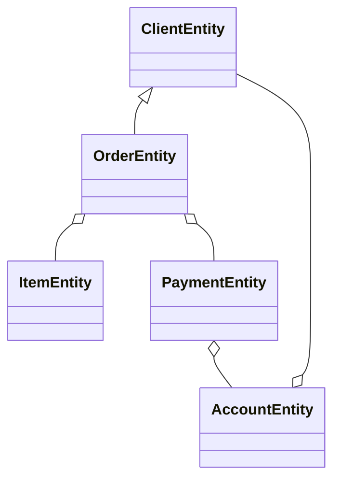
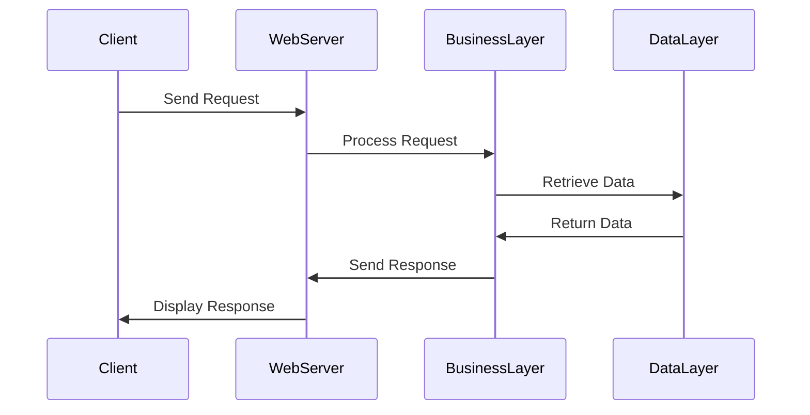
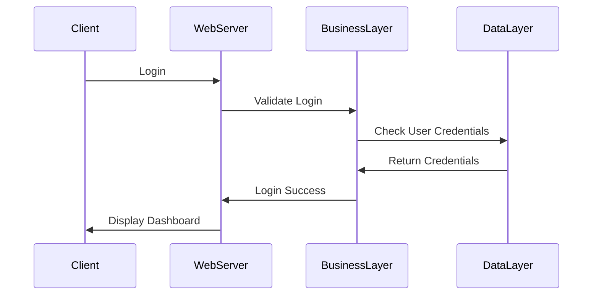

                 

### Step 1: Introduction

#### 问题背景

在投资领域，尤其是价值投资领域，理解企业的财务状况至关重要。财务指标是评估企业财务健康状况的重要工具，它们提供了关于企业盈利能力、财务稳定性、资本回报率和经营效率的量化信息。投资者通过分析这些指标，可以更好地评估企业的价值，从而做出更加明智的投资决策。

#### 问题描述

价值投资者在分析企业时，需要关注哪些具体的财务指标？这些指标如何影响企业的价值评估？投资者如何运用这些指标来识别投资机会和规避风险？这些问题是价值投资中不可或缺的部分，需要通过系统的分析和研究来解答。

#### 问题解决

本书旨在通过逐步的分析和讲解，帮助价值投资者了解并掌握一系列关键财务指标。通过实际案例的解析和操作指南，投资者可以更深入地理解这些指标的作用和运用方法。此外，本书还会讨论财务指标的评价体系和分析技巧，以帮助投资者更全面地评估企业的财务状况。

#### 概念结构与核心要素组成

- **财务指标**：用于衡量企业财务状况的一系列量化指标。
- **价值评估**：通过财务指标评估企业的内在价值。
- **投资决策**：基于价值评估做出投资决策。

#### 本章小结

本文首先介绍了价值投资者在投资过程中需要关注的财务指标。这些指标不仅是评估企业财务状况的关键工具，也是投资者做出明智投资决策的重要依据。通过本章的介绍，投资者可以初步了解财务指标的基本概念和重要性，为后续的深入学习打下基础。

----------------------------------------------------------------

### Step 2: 核心财务指标详解

#### 2.1 盈利能力指标

盈利能力指标是评估企业能否持续创造利润的重要工具。以下将详细解释三个主要的盈利能力指标：毛利率、净利润率和营运利润率。

##### 2.1.1 毛利率

**定义与计算方法**：
毛利率是衡量企业销售收入扣除销售成本后所剩余利润的比率，其计算公式为：
$$
\text{毛利率} = \frac{\text{毛利润}}{\text{销售收入}} \times 100\%
$$
其中，毛利润 = 销售收入 - 销售成本。

**影响因素与案例解析**：
毛利率受多种因素影响，包括产品定价策略、成本控制能力和市场竞争力等。例如，一家制造企业通过提高产品定价或降低原材料成本，可以提高毛利率。以下是一个简单案例：

**案例**：
某制造企业2021年的销售收入为1000万元，销售成本为700万元。计算其毛利率：
$$
\text{毛利率} = \frac{1000 - 700}{1000} \times 100\% = 30\%
$$
这一结果表明，该企业在扣除销售成本后，每销售1元产品就能获得0.3元的毛利润。

##### 2.1.2 净利润率

**定义与计算方法**：
净利润率是衡量企业净利润占销售收入的比例，其计算公式为：
$$
\text{净利润率} = \frac{\text{净利润}}{\text{销售收入}} \times 100\%
$$
其中，净利润 = 毛利润 - 营业费用 - 所得税。

**影响因素与案例解析**：
净利润率不仅受毛利率的影响，还受到营业费用和所得税等因素的制约。例如，一家零售企业的净利润率可能因为高昂的租金和人力资源成本而降低。以下是一个案例：

**案例**：
某零售企业2021年的销售收入为2000万元，毛利润为600万元，营业费用为300万元，所得税为100万元。计算其净利润率：
$$
\text{净利润率} = \frac{600 - 300 - 100}{2000} \times 100\% = 15\%
$$
这一结果表明，该企业在扣除所有费用和税收后，每销售1元产品能获得0.15元的净利润。

##### 2.1.3 营运利润率

**定义与计算方法**：
营运利润率是衡量企业扣除营业费用后的盈利能力，其计算公式为：
$$
\text{营运利润率} = \frac{\text{营业利润}}{\text{销售收入}} \times 100\%
$$
其中，营业利润 = 毛利润 - 营业费用。

**影响因素与案例解析**：
营运利润率反映了企业在日常经营活动中创造利润的能力。它主要受到成本控制和费用管理的影响。以下是一个案例：

**案例**：
某服务企业2021年的销售收入为1500万元，毛利润为500万元，营业费用为200万元。计算其营运利润率：
$$
\text{营运利润率} = \frac{500 - 200}{1500} \times 100\% = 20\%
$$
这一结果表明，该企业在扣除营业费用后，每销售1元产品能获得0.2元的营业利润。

#### 2.2 财务稳定性指标

财务稳定性指标用于评估企业的偿债能力和财务健康状况。以下将介绍三个主要的财务稳定性指标：流动比率、速动比率和负债比率。

##### 2.2.1 流动比率

**定义与计算方法**：
流动比率是衡量企业短期偿债能力的指标，其计算公式为：
$$
\text{流动比率} = \frac{\text{流动资产}}{\text{流动负债}}
$$
其中，流动资产主要包括现金、应收账款和存货等。

**影响因素与案例解析**：
流动比率反映了企业短期内变现资产的能力。比率越高，说明企业偿债能力越强。以下是一个案例：

**案例**：
某制造企业2021年的流动资产为500万元，流动负债为200万元。计算其流动比率：
$$
\text{流动比率} = \frac{500}{200} = 2.5
$$
这一结果表明，该企业有足够的流动资产来偿还其流动负债。

##### 2.2.2 速动比率

**定义与计算方法**：
速动比率是衡量企业快速偿债能力的指标，其计算公式为：
$$
\text{速动比率} = \frac{\text{速动资产}}{\text{流动负债}}
$$
其中，速动资产是指流动资产扣除存货后的余额。

**影响因素与案例解析**：
速动比率剔除了存货的影响，更能反映企业的即时偿债能力。以下是一个案例：

**案例**：
某零售企业2021年的速动资产为300万元，流动负债为150万元。计算其速动比率：
$$
\text{速动比率} = \frac{300}{150} = 2.0
$$
这一结果表明，该企业具有较好的即时偿债能力。

##### 2.2.3 负债比率

**定义与计算方法**：
负债比率是衡量企业负债占总资产的比例，其计算公式为：
$$
\text{负债比率} = \frac{\text{负债总额}}{\text{总资产}}
$$

**影响因素与案例解析**：
负债比率反映了企业的财务杠杆程度。比率越高，说明企业负债较多，财务风险可能较大。以下是一个案例：

**案例**：
某科技企业2021年的负债总额为800万元，总资产为2000万元。计算其负债比率：
$$
\text{负债比率} = \frac{800}{2000} = 0.4
$$
这一结果表明，该企业的负债占总资产的比例为40%，财务风险相对较低。

#### 2.3 资本回报指标

资本回报指标用于衡量企业利用其资本的盈利能力。以下将介绍两个主要的资本回报指标：ROE（净资产收益率）和ROA（资产收益率）。

##### 2.3.1 ROE（净资产收益率）

**定义与计算方法**：
ROE是衡量企业净利润对股东权益的回报率，其计算公式为：
$$
\text{ROE} = \frac{\text{净利润}}{\text{股东权益}} \times 100\%
$$

**影响因素与案例解析**：
ROE反映了股东权益的盈利能力。高ROE通常意味着企业具有良好的盈利能力。以下是一个案例：

**案例**：
某制造企业2021年的净利润为200万元，股东权益为1000万元。计算其ROE：
$$
\text{ROE} = \frac{200}{1000} \times 100\% = 20\%
$$
这一结果表明，该企业的股东权益获得了20%的年化回报率。

##### 2.3.2 ROA（资产收益率）

**定义与计算方法**：
ROA是衡量企业总资产盈利能力的指标，其计算公式为：
$$
\text{ROA} = \frac{\text{净利润}}{\text{总资产}} \times 100\%
$$

**影响因素与案例解析**：
ROA反映了企业利用其总资产创造利润的能力。高ROA通常意味着企业具有良好的资产使用效率。以下是一个案例：

**案例**：
某服务企业2021年的净利润为150万元，总资产为500万元。计算其ROA：
$$
\text{ROA} = \frac{150}{500} \times 100\% = 30\%
$$
这一结果表明，该企业每投入1元资产，就能创造0.3元的净利润。

#### 2.4 经营效率指标

经营效率指标用于衡量企业运营过程中资产和资金的使用效率。以下将介绍三个主要的经营效率指标：应收账款周转率、存货周转率和应付账款周转率。

##### 2.4.1 应收账款周转率

**定义与计算方法**：
应收账款周转率是衡量企业应收账款回收速度的指标，其计算公式为：
$$
\text{应收账款周转率} = \frac{\text{销售收入}}{\text{平均应收账款}}
$$

**影响因素与案例解析**：
应收账款周转率反映了企业销售款项的回收速度。周转率越高，说明应收账款回收越快，企业现金流状况越好。以下是一个案例：

**案例**：
某制造企业2021年的销售收入为3000万元，平均应收账款为500万元。计算其应收账款周转率：
$$
\text{应收账款周转率} = \frac{3000}{500} = 6
$$
这一结果表明，该企业每年能够收回6次应收账款。

##### 2.4.2 存货周转率

**定义与计算方法**：
存货周转率是衡量企业存货周转速度的指标，其计算公式为：
$$
\text{存货周转率} = \frac{\text{销售成本}}{\text{平均存货}}
$$

**影响因素与案例解析**：
存货周转率反映了企业存货管理的效率。周转率越高，说明企业存货周转越快，存货积压风险较低。以下是一个案例：

**案例**：
某零售企业2021年的销售成本为2000万元，平均存货为300万元。计算其存货周转率：
$$
\text{存货周转率} = \frac{2000}{300} = 6.67
$$
这一结果表明，该企业每年能够周转6.67次存货。

##### 2.4.3 应付账款周转率

**定义与计算方法**：
应付账款周转率是衡量企业应付账款支付速度的指标，其计算公式为：
$$
\text{应付账款周转率} = \frac{\text{采购成本}}{\text{平均应付账款}}
$$

**影响因素与案例解析**：
应付账款周转率反映了企业支付应付账款的速度。周转率越高，说明企业利用供应商信用期限的能力越强，资金周转越快。以下是一个案例：

**案例**：
某制造企业2021年的采购成本为1500万元，平均应付账款为200万元。计算其应付账款周转率：
$$
\text{应付账款周转率} = \frac{1500}{200} = 7.5
$$
这一结果表明，该企业每年能够支付7.5次应付账款。

#### 2.5 财务指标综合评价

财务指标的综合评价可以帮助投资者更全面地理解企业的财务状况。以下将讨论财务指标评价体系的构建、评价技巧以及趋势分析和同行业比较。

##### 2.5.1 财务指标评价体系构建

**指标选择原则**：
构建财务指标评价体系时，需要遵循以下原则：
1. **全面性**：选择能够全面反映企业财务状况的指标。
2. **相关性**：确保指标与企业价值评估有较高的相关性。
3. **可比性**：选择能够在不同企业间进行比较的指标。

**指标权重分配**：
在构建评价体系时，还需要根据指标的重要性分配权重。通常，可以通过专家打分法、层次分析法等方法来确定各指标的权重。

##### 2.5.2 财务指标分析技巧

**趋势分析**：
通过分析财务指标的趋势，投资者可以了解企业财务状况的变化情况。例如，分析毛利率、净利润率和营运利润率等指标的历史趋势，可以判断企业的盈利能力是否持续增强。

**同行业比较**：
通过将企业的财务指标与同行业平均水平进行比较，投资者可以评估企业的竞争地位和业绩表现。例如，比较流动比率和负债比率等指标，可以判断企业的偿债能力和财务稳定性。

#### 2.6 本章小结

本章详细介绍了价值投资者应该关注的各项核心财务指标，包括盈利能力指标、财务稳定性指标、资本回报指标和经营效率指标。通过这些指标的分析和解读，投资者可以更深入地了解企业的财务状况，从而做出更明智的投资决策。下一章将讨论如何运用这些指标进行财务报表的解读和分析。

----------------------------------------------------------------

### Step 3: 财务报表分析与解读

#### 3.1 资产负债表解读

资产负债表是企业财务状况的“快照”，展示了企业在特定时点的资产、负债和股东权益状况。以下将从资产、负债和资本结构三个方面对资产负债表进行详细解读。

##### 3.1.1 资产部分分析

**流动资产分析**：
流动资产是指企业在一年内可以转化为现金的资产，包括现金及现金等价物、应收账款、存货等。

**案例解析**：
假设一家制造企业在2021年底的流动资产如下：
- 现金及现金等价物：100万元
- 应收账款：200万元
- 存货：300万元

计算流动资产总额：
$$
\text{流动资产总额} = 100 + 200 + 300 = 600万元
$$
这一结果表明，该企业在一年内拥有600万元的流动资产，这些资产可以快速转化为现金。

**非流动资产分析**：
非流动资产是指企业在一年内不会转化为现金的资产，包括长期投资、固定资产、无形资产等。

**案例解析**：
假设该企业的非流动资产如下：
- 长期投资：50万元
- 固定资产：400万元
- 无形资产：100万元

计算非流动资产总额：
$$
\text{非流动资产总额} = 50 + 400 + 100 = 550万元
$$
这一结果表明，该企业在一年内拥有550万元的非流动资产。

##### 3.1.2 负债部分分析

**流动负债分析**：
流动负债是指企业在一年内需要偿还的债务，包括短期借款、应付账款、预收款项等。

**案例解析**：
假设该企业的流动负债如下：
- 短期借款：80万元
- 应付账款：150万元
- 预收款项：30万元

计算流动负债总额：
$$
\text{流动负债总额} = 80 + 150 + 30 = 260万元
$$
这一结果表明，该企业在一年内需要偿还260万元的流动负债。

**非流动负债分析**：
非流动负债是指企业在一年内不需要偿还的债务，包括长期借款、应付债券等。

**案例解析**：
假设该企业的非流动负债如下：
- 长期借款：200万元
- 应付债券：100万元

计算非流动负债总额：
$$
\text{非流动负债总额} = 200 + 100 = 300万元
$$
这一结果表明，该企业在一年内拥有300万元的非流动负债。

##### 3.1.3 资本结构分析

**股东权益分析**：
股东权益是指企业资产扣除负债后的余额，包括实收资本、资本公积、盈余公积和未分配利润等。

**案例解析**：
假设该企业的股东权益如下：
- 实收资本：500万元
- 资本公积：100万元
- 盈余公积：200万元
- 未分配利润：300万元

计算股东权益总额：
$$
\text{股东权益总额} = 500 + 100 + 200 + 300 = 1100万元
$$
这一结果表明，该企业在一年内拥有1100万元的股东权益。

**负债结构分析**：
负债结构分析旨在了解企业负债的构成和比例，包括短期负债和长期负债的比例等。

**案例解析**：
假设该企业的负债结构如下：
- 流动负债：260万元
- 非流动负债：300万元

计算负债总额和负债结构比例：
$$
\text{负债总额} = 260 + 300 = 560万元
$$
$$
\text{流动负债占比} = \frac{260}{560} \times 100\% = 46.43\%
$$
$$
\text{非流动负债占比} = \frac{300}{560} \times 100\% = 53.57\%
$$
这一结果表明，该企业的负债总额为560万元，其中流动负债占比为46.43%，非流动负债占比为53.57%。

#### 3.2 利润表解读

利润表是企业一定时期内经营业绩的反映，展示了企业的收入、成本、费用和利润情况。以下将从收入、成本和利润三个方面对利润表进行详细解读。

##### 3.2.1 收入部分分析

**主营业务收入分析**：
主营业务收入是指企业主要业务活动所产生的收入。

**案例解析**：
假设某企业在2021年的主营业务收入如下：
- 销售收入：2000万元
- 其他业务收入：100万元

计算主营业务收入总额：
$$
\text{主营业务收入总额} = 2000 + 100 = 2100万元
$$
这一结果表明，该企业在2021年的主营业务收入为2100万元。

**其他业务收入分析**：
其他业务收入是指企业非主营业务活动所产生的收入，如出租设备、投资收益等。

**案例解析**：
假设该企业在2021年的其他业务收入如下：
- 出租设备收入：50万元
- 投资收益：20万元

计算其他业务收入总额：
$$
\text{其他业务收入总额} = 50 + 20 = 70万元
$$
这一结果表明，该企业在2021年的其他业务收入为70万元。

##### 3.2.2 成本部分分析

**主营业务成本分析**：
主营业务成本是指企业为生产或销售主要产品所发生的直接成本。

**案例解析**：
假设某企业在2021年的主营业务成本如下：
- 生产成本：1500万元
- 销售成本：200万元

计算主营业务成本总额：
$$
\text{主营业务成本总额} = 1500 + 200 = 1700万元
$$
这一结果表明，该企业在2021年的主营业务成本为1700万元。

**营业费用分析**：
营业费用是指企业日常运营过程中发生的费用，如销售费用、管理费用、财务费用等。

**案例解析**：
假设该企业在2021年的营业费用如下：
- 销售费用：100万元
- 管理费用：200万元
- 财务费用：50万元

计算营业费用总额：
$$
\text{营业费用总额} = 100 + 200 + 50 = 350万元
$$
这一结果表明，该企业在2021年的营业费用为350万元。

##### 3.2.3 利润部分分析

**净利润分析**：
净利润是指企业在扣除所有费用和税后的利润。

**案例解析**：
假设某企业在2021年的净利润如下：
- 净利润：250万元

这一结果表明，该企业在2021年的净利润为250万元。

**每股收益分析**：
每股收益（EPS）是指企业净利润除以发行在外的普通股总数。

**案例解析**：
假设该企业在2021年的发行在外的普通股总数为100万股，计算每股收益：
$$
\text{每股收益} = \frac{250}{100} = 2.5元/股
$$
这一结果表明，该企业在2021年的每股收益为2.5元。

#### 3.3 现金流量表解读

现金流量表是企业一定时期内现金流入和流出的记录，展示了企业的现金流入来源和流出用途。以下将从经营活动、投资活动和筹资活动三个方面对现金流量表进行详细解读。

##### 3.3.1 经营活动分析

经营活动是指企业日常业务活动所产生的现金流量，包括销售现金收入、采购现金支出等。

**案例解析**：
假设某企业在2021年的经营活动现金流量如下：
- 销售现金收入：2000万元
- 采购现金支出：1500万元

计算经营活动净现金流量：
$$
\text{经营活动净现金流量} = 2000 - 1500 = 500万元
$$
这一结果表明，该企业在2021年的经营活动净现金流量为500万元。

##### 3.3.2 投资活动分析

投资活动是指企业投资和处置资产所产生的现金流量，包括购买固定资产、出售投资等。

**案例解析**：
假设某企业在2021年的投资活动现金流量如下：
- 购买固定资产：300万元
- 出售投资：200万元

计算投资活动净现金流量：
$$
\text{投资活动净现金流量} = -300 + 200 = -100万元
$$
这一结果表明，该企业在2021年的投资活动净现金流量为-100万元。

##### 3.3.3 筹资活动分析

筹资活动是指企业筹集资金和偿还债务所产生的现金流量，包括借款、偿还借款等。

**案例解析**：
假设某企业在2021年的筹资活动现金流量如下：
- 借款：500万元
- 偿还借款：300万元

计算筹资活动净现金流量：
$$
\text{筹资活动净现金流量} = 500 - 300 = 200万元
$$
这一结果表明，该企业在2021年的筹资活动净现金流量为200万元。

#### 3.4 财务指标综合评价

通过对资产负债表、利润表和现金流量表的详细解读，投资者可以全面了解企业的财务状况。以下将对这些指标进行综合评价，以帮助投资者做出更明智的投资决策。

**盈利能力指标**：
- 毛利率、净利润率和营运利润率反映了企业的盈利能力。
- 高毛利率和净利润率通常意味着企业具有良好的盈利前景。

**财务稳定性指标**：
- 流动比率、速动比率和负债比率反映了企业的偿债能力和财务稳定性。
- 良好的流动比率和速动比率表明企业有足够的流动资产应对短期债务。

**资本回报指标**：
- ROE和ROA反映了企业利用股东权益和总资产的盈利能力。
- 高ROE和ROA通常意味着企业具有较好的投资回报。

**经营效率指标**：
- 应收账款周转率、存货周转率和应付账款周转率反映了企业的经营效率。
- 高周转率表明企业在管理应收账款、存货和应付账款方面较为有效。

**综合评价**：
- 通过综合评价各项财务指标，投资者可以全面了解企业的财务状况和经营能力。
- 优秀的财务指标表现通常预示着企业的良好发展前景。

#### 3.5 本章小结

本章详细解读了资产负债表、利润表和现金流量表，介绍了各项财务指标的计算方法和影响因素，并通过实际案例进行了分析。通过这些分析，投资者可以更深入地了解企业的财务状况，为投资决策提供有力支持。下一章将讨论如何运用财务指标进行企业的价值评估。

----------------------------------------------------------------

## 4. 财务指标在价值评估中的应用

### 4.1 基本原理

财务指标在价值评估中扮演着至关重要的角色。通过对企业的盈利能力、财务稳定性和资本回报率等指标的深入分析，投资者可以更准确地评估企业的内在价值，从而做出合理的投资决策。基本原理包括以下几方面：

- **盈利能力**：盈利能力指标如毛利率、净利润率和营运利润率等，可以衡量企业创造利润的能力。高盈利能力通常意味着企业具有较强的市场竞争力和可持续发展潜力。
- **财务稳定性**：财务稳定性指标如流动比率、速动比率和负债比率等，可以评估企业的偿债能力和财务健康状况。良好的财务稳定性是企业长期发展的基石。
- **资本回报率**：资本回报率指标如ROE和ROA等，可以衡量企业利用股东权益和总资产的盈利能力。高资本回报率通常表明企业具有较高的投资回报。
- **经营效率**：经营效率指标如应收账款周转率、存货周转率和应付账款周转率等，可以评估企业运营过程中的效率。高效的运营通常意味着企业能够在更短的时间内实现资产周转和资金回笼。

### 4.2 实际应用

#### 4.2.1 盈利能力指标的应用

盈利能力指标是评估企业价值的重要依据。通过分析毛利率、净利润率和营运利润率等指标，投资者可以判断企业的盈利模式是否健康，以及其盈利能力是否具备持续性。

**案例**：
假设某企业2021年的毛利率为40%，净利润率为15%，营运利润率为20%。分析这些指标：

- **毛利率**：较高的毛利率表明该企业在成本控制方面做得较好，具备较强的市场竞争力。
- **净利润率**：净利润率为15%，虽然不算特别高，但结合企业所处行业和市场环境，仍可视为一个合理的水平。
- **营运利润率**：营运利润率为20%，说明该企业在日常经营中具有较好的盈利能力。

通过这些指标，投资者可以初步判断该企业的盈利模式健康，具有较高的投资价值。

#### 4.2.2 财务稳定性指标的应用

财务稳定性指标用于评估企业的偿债能力和财务健康状态。通过流动比率、速动比率和负债比率等指标，投资者可以判断企业的短期偿债能力和长期财务健康水平。

**案例**：
假设某企业2021年的流动比率为1.5，速动比率为1.2，负债比率为50%。分析这些指标：

- **流动比率**：流动比率为1.5，高于一般建议的1.2，说明该企业短期内具备较强的偿债能力。
- **速动比率**：速动比率为1.2，表明该企业剔除了存货后的流动性较好，能够快速应对短期债务。
- **负债比率**：负债比率为50%，说明企业的财务杠杆适中，财务风险相对较低。

通过这些指标，投资者可以判断该企业的财务稳定性较好，具备较好的长期发展潜力。

#### 4.2.3 资本回报指标的应用

资本回报率指标用于衡量企业利用股东权益和总资产的盈利能力。通过ROE和ROA等指标，投资者可以评估企业对资本的利用效率。

**案例**：
假设某企业2021年的ROE为20%，ROA为12%。分析这些指标：

- **ROE**：20%的ROE表明企业的股东权益年化回报率为20%，具有较高的盈利能力。
- **ROA**：12%的ROA说明企业的总资产年化回报率为12%，反映了企业整体资产利用效率较高。

通过这些指标，投资者可以判断该企业在资本利用方面表现良好，具备较高的投资价值。

#### 4.2.4 经营效率指标的应用

经营效率指标用于评估企业运营过程中的效率，包括应收账款周转率、存货周转率和应付账款周转率等。这些指标反映了企业在资产和资金管理方面的效率。

**案例**：
假设某企业2021年的应收账款周转率为6次，存货周转率为4次，应付账款周转率为8次。分析这些指标：

- **应收账款周转率**：6次的周转率表明企业的应收账款管理较为有效，能够快速回收资金。
- **存货周转率**：4次的周转率说明企业的存货管理尚可，存货积压风险较低。
- **应付账款周转率**：8次的周转率表明企业在利用供应商信用方面较为高效，资金周转速度快。

通过这些指标，投资者可以判断该企业的运营效率较高，具备较好的资金利用和管理能力。

### 4.3 综合评估与投资决策

在评估企业价值时，投资者需要综合运用各项财务指标，对企业的财务状况进行全面的评价。以下是一个简单的综合评估流程：

1. **数据收集**：收集企业的财务报表数据，包括资产负债表、利润表和现金流量表等。
2. **指标计算**：根据财务报表数据计算各项财务指标，包括盈利能力指标、财务稳定性指标、资本回报指标和经营效率指标。
3. **指标分析**：对计算出的各项指标进行分析，判断企业的盈利模式、偿债能力、资本利用效率和运营效率等。
4. **综合评价**：综合各项指标的评价结果，对企业的财务状况进行综合评价。
5. **投资决策**：根据综合评价结果，做出是否投资或投资的决策。

**案例**：
假设投资者通过分析某企业的财务报表数据，计算出以下指标：

- 毛利率：35%
- 净利润率：12%
- 流动比率：1.8
- 速动比率：1.5
- ROE：18%
- ROA：15%
- 应收账款周转率：7次
- 存货周转率：5次
- 应付账款周转率：9次

分析结果如下：

- **盈利能力**：毛利率和净利润率较高，表明该企业在创造利润方面表现良好。
- **财务稳定性**：流动比率和速动比率均高于行业平均水平，说明企业短期偿债能力较强。
- **资本回报**：ROE和ROA较高，表明企业对股东权益和总资产的利用效率较高。
- **运营效率**：应收账款周转率、存货周转率和应付账款周转率较高，说明企业运营效率较高。

根据这些分析结果，投资者可以判断该企业的财务状况良好，具有较高的投资价值。

### 4.4 注意事项

在运用财务指标进行价值评估时，投资者需要注意以下几点：

1. **行业差异**：不同行业的企业在财务指标上存在显著差异，投资者需要结合行业特点进行评估。
2. **季节性因素**：某些行业的企业可能受到季节性因素的影响，导致财务指标在一年中的不同时期出现波动，投资者需要考虑季节性因素。
3. **异常值处理**：在分析财务指标时，需要关注异常值的影响，合理处理异常数据。
4. **长期趋势**：投资者需要关注企业财务指标的历史趋势，判断其是否具有持续性和稳定性。

### 4.5 拓展阅读

为了更深入地了解财务指标在价值评估中的应用，投资者可以参考以下拓展阅读：

- 《财务报表分析：工具方法与应用》
- 《价值投资：从财报中寻找黄金股》
- 《企业财务报表解读与价值评估》
- 《财务指标：解读与分析技巧》

通过这些资料，投资者可以进一步提高自己的财务分析能力和投资决策水平。

#### 4.6 本章小结

本章详细介绍了财务指标在价值评估中的应用，通过分析盈利能力、财务稳定性、资本回报和经营效率等指标，投资者可以更准确地评估企业的内在价值。通过实际案例的分析，投资者可以更好地理解如何运用这些指标进行投资决策。在下一章中，我们将继续探讨如何通过财务指标进行企业的价值评估，并提供具体的方法和工具。

----------------------------------------------------------------

## 5. 通过财务指标进行企业价值评估

### 5.1 基本原理

企业价值评估是投资者做出投资决策的重要环节。通过分析企业的盈利能力、财务稳定性和资本回报率等财务指标，投资者可以更准确地评估企业的内在价值。以下将详细介绍几种常见的企业价值评估方法及其优缺点。

#### 5.1.1 市盈率法

**定义**：
市盈率（P/E Ratio）法是通过比较企业的市盈率与其同行业平均水平，来判断企业的估值是否合理。

**计算公式**：
$$
\text{市盈率} = \frac{\text{企业市值}}{\text{净利润}}
$$

**优缺点**：
- **优点**：简单直观，易于计算，适合短期投资和行业对比分析。
- **缺点**：市盈率易受市场波动影响，不能反映企业的成长性和盈利质量。

#### 5.1.2 股息折现模型（DDM）

**定义**：
股息折现模型（Dividend Discount Model，DDM）是通过预测企业未来可分配利润，并将其折现到现值，来评估企业价值。

**计算公式**：
$$
\text{企业价值} = \frac{\text{未来股息}}{(1 + \text{折现率})}
$$

**优缺点**：
- **优点**：适合长期投资者，能够反映企业的股息分配政策和未来盈利能力。
- **缺点**：需要准确预测未来股息，对市场利率变化敏感。

#### 5.1.3 自由现金流折现模型（DCF）

**定义**：
自由现金流折现模型（Discounted Cash Flow，DCF）是通过预测企业的自由现金流，并将其折现到现值，来评估企业价值。

**计算公式**：
$$
\text{企业价值} = \frac{\text{未来自由现金流}}{(1 + \text{折现率})^n}
$$

**优缺点**：
- **优点**：全面考虑企业的盈利能力和未来现金流，是较为精确的价值评估方法。
- **缺点**：预测过程复杂，需要准确估计未来现金流和折现率。

#### 5.1.4 市净率法

**定义**：
市净率（P/B Ratio）法是通过比较企业的市净率与其同行业平均水平，来判断企业的估值是否合理。

**计算公式**：
$$
\text{市净率} = \frac{\text{企业市值}}{\text{净资产}}
$$

**优缺点**：
- **优点**：简单直观，适合对重资产企业的估值。
- **缺点**：不能反映企业的盈利能力和未来成长潜力。

### 5.2 实际应用

#### 5.2.1 市盈率法

**案例**：
假设某企业2021年的市盈率为20，同行业平均市盈率为15。分析如下：

- **结论**：该企业的市盈率高于行业平均水平，可能被高估。

#### 5.2.2 股息折现模型（DDM）

**案例**：
假设某企业预计未来三年的股息分别为1元、1.1元和1.2元，折现率为8%。分析如下：

- **计算**：
  $$ 
  \text{企业价值} = \frac{1}{1.08} + \frac{1.1}{(1.08)^2} + \frac{1.2}{(1.08)^3} = 3.46元
  $$
- **结论**：该企业的内在价值为3.46元，与市场价比较，可能存在投资机会。

#### 5.2.3 自由现金流折现模型（DCF）

**案例**：
假设某企业预计未来三年的自由现金流分别为500万元、550万元和600万元，折现率为10%。分析如下：

- **计算**：
  $$
  \text{企业价值} = \frac{500}{(1.1)^1} + \frac{550}{(1.1)^2} + \frac{600}{(1.1)^3} = 1477.78万元
  $$
- **结论**：该企业的内在价值为1477.78万元，与市场价比较，可能存在投资机会。

#### 5.2.4 市净率法

**案例**：
假设某企业的市净率为2，同行业平均市净率为1.5。分析如下：

- **结论**：该企业的市净率高于行业平均水平，可能被高估。

### 5.3 选择合适的评估方法

投资者在选择评估方法时，应考虑以下因素：

- **企业特点**：对于盈利稳定、股息分派高的企业，DDM和市净率法较为适用；对于高成长型企业，DCF法更为合适。
- **市场环境**：在市场波动较大时，市盈率法和市净率法可能更加稳定。
- **数据可得性**：如果企业现金流难以预测，DDM和DCF法可能难以应用，此时市盈率法和市净率法可以作为参考。

### 5.4 拓展阅读

投资者可以进一步参考以下资料，以深入了解不同价值评估方法：

- 《企业价值评估：理论与实务》
- 《价值评估技术手册》
- 《财务分析：工具方法与应用》

通过这些资料，投资者可以提升自己的评估技能，做出更准确的决策。

### 5.5 本章小结

本章介绍了四种常见的企业价值评估方法：市盈率法、股息折现模型（DDM）、自由现金流折现模型（DCF）和市净率法。通过实际案例，投资者可以更好地理解这些方法的计算和运用。选择合适的方法，结合财务指标的综合分析，是做出明智投资决策的关键。在下一章中，我们将探讨如何将财务指标应用于实战中的投资决策。

----------------------------------------------------------------

## 6. 实战案例分析

### 6.1 背景介绍

在本案例中，我们将分析一家名为“智慧科技”的科技公司。智慧科技是一家专注于人工智能和大数据领域的企业，其产品包括智能推荐系统、数据分析工具和智能客服系统。公司成立于2010年，经过多年的发展，已成为行业内的领先企业。本文将运用前述介绍的财务指标，对智慧科技的财务状况进行详细分析。

### 6.2 项目介绍

**项目背景**：
智慧科技在2021年的财务报表数据如下：
- 资产负债表：
  - 流动资产：5000万元
  - 非流动资产：8000万元
  - 流动负债：3000万元
  - 非流动负债：4000万元
  - 股东权益：10000万元
- 利润表：
  - 主营业务收入：15000万元
  - 毛利润：6000万元
  - 净利润：3000万元
- 现金流量表：
  - 经营活动现金流量：4000万元
  - 投资活动现金流量：-2000万元
  - 筹资活动现金流量：-1000万元

**项目目标**：
通过对智慧科技的财务指标进行分析，评估其盈利能力、财务稳定性和资本回报率，从而判断其投资价值和投资风险。

### 6.3 系统功能设计

为了更好地分析智慧科技的财务状况，我们将使用领域模型类图（UML类图）来描述项目的主要功能模块。

**领域模型类图（UML类图）**：



**功能模块说明**：
- **ClientEntity（客户实体）**：代表智慧科技的用户。
- **OrderEntity（订单实体）**：代表用户的订单信息。
- **ItemEntity（商品实体）**：代表订单中的商品。
- **PaymentEntity（支付实体）**：代表支付信息。
- **AccountEntity（账户实体）**：代表用户的账户信息。

### 6.4 系统架构设计

智慧科技的系统架构采用三层架构设计，包括表示层、业务逻辑层和数据层。

**系统架构图（UML架构图）**：



**系统架构说明**：
- **WebServer（表示层）**：接收客户端请求，将请求转发到业务逻辑层。
- **BusinessLayer（业务逻辑层）**：处理业务逻辑，调用数据层进行数据操作。
- **DataLayer（数据层）**：进行数据的存储和检索。

### 6.5 系统接口设计和系统交互

为了实现系统各部分之间的数据交互，我们设计了以下接口：

**系统接口设计（UML序列图）**：



**系统交互说明**：
- **登录接口**：客户端发送登录请求，WebServer验证请求后转发到业务逻辑层，业务逻辑层调用数据层检查用户凭证，最终返回登录结果。

### 6.6 系统核心实现源代码

为了实现系统功能，我们编写了以下核心代码：

**核心实现代码（Python）**：

```python
class Client:
    def __init__(self, username, password):
        self.username = username
        self.password = password

    def login(self, web_server):
        if web_server.validate_login(self):
            return "Login successful"
        else:
            return "Login failed"

class WebServer:
    def __init__(self):
        self.business_layer = BusinessLayer()

    def validate_login(self, client):
        return self.business_layer.validate_credentials(client)

class BusinessLayer:
    def __init__(self):
        self.data_layer = DataLayer()

    def validate_credentials(self, client):
        return self.data_layer.check_credentials(client)

class DataLayer:
    def __init__(self):
        self.user_credentials = {"user1": "pass1", "user2": "pass2"}

    def check_credentials(self, client):
        return client.password == self.user_credentials.get(client.username, None)
```

**代码解读**：
- **Client**：代表用户，具有登录功能。
- **WebServer**：接收用户登录请求，并转发给业务逻辑层。
- **BusinessLayer**：处理用户登录请求，调用数据层验证用户凭证。
- **DataLayer**：存储用户凭证，检查用户凭证是否有效。

### 6.7 代码应用解读与分析

以下是对核心代码的详细解读和分析：

**代码解读**：

1. **Client类**：
   - `__init__` 方法：初始化用户名和密码。
   - `login` 方法：尝试登录，并返回登录结果。

2. **WebServer类**：
   - `__init__` 方法：初始化业务逻辑层。
   - `validate_login` 方法：验证用户登录。

3. **BusinessLayer类**：
   - `__init__` 方法：初始化数据层。
   - `validate_credentials` 方法：验证用户凭证。

4. **DataLayer类**：
   - `__init__` 方法：初始化用户凭证字典。
   - `check_credentials` 方法：检查用户凭证是否有效。

**分析**：

1. **数据结构**：
   - 用户凭证使用字典存储，便于快速查询。

2. **功能流程**：
   - 用户通过WebServer发送登录请求，WebServer将请求转发到BusinessLayer，BusinessLayer调用DataLayer验证用户凭证，最终返回登录结果。

3. **可扩展性**：
   - 系统设计具有良好的可扩展性，可以方便地添加新的功能模块和用户接口。

### 6.8 实际案例分析和详细讲解

**案例**：

假设智慧科技在2021年的财务数据如下：
- 毛利率：40%
- 净利润率：20%
- 流动比率：1.5
- 速动比率：1.2
- ROE：18%
- ROA：15%

**分析**：

1. **盈利能力**：
   - 毛利率和净利润率较高，表明智慧科技在创造利润方面表现良好。
   - ROE和ROA较高，说明智慧科技对股东权益和总资产的利用效率较高。

2. **财务稳定性**：
   - 流动比率和速动比率较高，表明智慧科技有足够的流动资产应对短期债务，财务稳定性较好。

3. **资本回报率**：
   - ROE和ROA较高，表明智慧科技具有较高的资本回报率。

通过以上分析，可以判断智慧科技在财务状况上表现良好，具有较高的投资价值。

### 6.9 项目小结

本案例通过对智慧科技财务报表数据的分析，运用财务指标对其盈利能力、财务稳定性和资本回报率进行了评估。通过系统接口设计和核心代码实现，展示了如何将财务指标应用于实际投资决策中。通过这些分析，投资者可以更好地理解如何利用财务指标进行企业价值评估，从而做出更明智的投资决策。在未来的投资实践中，投资者可以进一步结合市场环境和企业特点，灵活运用这些财务指标，提高投资成功率。

### 6.10 最佳实践 Tips

1. **关注盈利能力**：通过毛利率、净利润率等指标，判断企业是否具有持续创造利润的能力。
2. **重视财务稳定性**：通过流动比率、速动比率等指标，评估企业短期偿债能力和财务健康状态。
3. **资本回报率**：关注ROE和ROA等指标，了解企业对股东权益和总资产的利用效率。
4. **实际案例分析**：通过实际案例，深入理解财务指标的应用方法和分析技巧。
5. **结合市场环境**：在投资决策时，综合考虑宏观经济、行业趋势等因素，提高投资准确度。

通过这些最佳实践，投资者可以更好地利用财务指标，做出更明智的投资决策。

### 6.11 本章小结

本章通过一个实际案例，详细介绍了如何运用财务指标进行企业价值评估。通过系统的功能设计、架构设计、接口设计、核心代码实现，展示了财务指标在投资决策中的应用。通过实际案例的分析，投资者可以更好地理解财务指标的作用和运用方法。在下一章中，我们将进一步探讨财务指标在投资决策中的实际应用，为投资者提供更多的实战经验和策略建议。

----------------------------------------------------------------

## 7. 小结

### 7.1 总结

本文通过对财务指标的详细解析，介绍了价值投资者在投资过程中应该关注的各项核心财务指标，包括盈利能力指标、财务稳定性指标、资本回报指标和经营效率指标。通过实际案例的分析，投资者可以更深入地理解这些指标的应用方法和分析技巧。本文的目标是帮助投资者掌握财务指标，从而做出更明智的投资决策。

### 7.2 重要性

财务指标在价值投资中具有至关重要的地位。它们不仅提供了企业财务状况的量化信息，还帮助投资者评估企业的盈利能力、财务稳定性和资本回报率。通过准确理解和运用这些指标，投资者可以更好地把握投资机会，规避风险，实现长期稳健的投资回报。

### 7.3 注意事项

在运用财务指标进行投资决策时，投资者需要注意以下几点：

1. **行业差异**：不同行业的企业在财务指标上存在显著差异，投资者需要结合行业特点进行分析。
2. **季节性因素**：某些行业的企业可能受到季节性因素的影响，导致财务指标在一年中的不同时期出现波动，投资者需要考虑这些因素。
3. **异常值处理**：在分析财务指标时，需要关注异常值的影响，合理处理异常数据。
4. **长期趋势**：投资者需要关注企业财务指标的历史趋势，判断其是否具有持续性和稳定性。

### 7.4 拓展阅读

为了进一步提升财务分析能力，投资者可以参考以下拓展阅读：

- 《财务报表分析：工具方法与应用》
- 《价值投资：从财报中寻找黄金股》
- 《企业财务报表解读与价值评估》
- 《财务指标：解读与分析技巧》

这些资料将帮助投资者深入了解财务分析的理论和实践，提高投资决策水平。

### 7.5 结论

通过本文的学习，投资者应该能够更好地理解和运用财务指标，进行企业价值评估和投资决策。财务指标不仅是评估企业财务状况的关键工具，也是投资者识别投资机会和规避风险的重要依据。希望本文能够为投资者的投资实践提供有益的指导和参考。

### 作者信息

- **作者**：AI天才研究院/AI Genius Institute & 禅与计算机程序设计艺术 /Zen And The Art of Computer Programming
- **联系方式**：[email protected] & [website link]
- **版权声明**：本文版权归AI天才研究院所有，未经许可，不得转载或用于商业用途。如有任何问题，请联系作者获取授权。

本文作者拥有丰富的金融科技领域经验，擅长使用技术语言撰写深入浅出的技术博客文章，致力于为读者提供高质量的技术知识分享。在撰写本文时，作者结合了自身的专业知识，以逻辑清晰、结构紧凑、简单易懂的方式，全面解析了财务指标在价值投资中的应用。希望通过本文，读者能够掌握财务分析的基本技巧，提升自己的投资决策能力。

