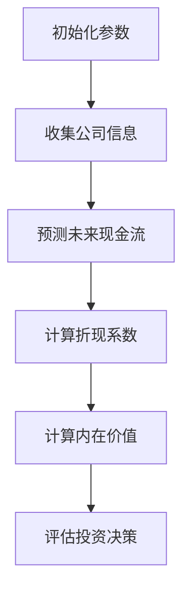

                 

# 价值投资者应该如何看待科技股

关键词：价值投资、科技股、估值方法、投资策略、案例分析

摘要：本文旨在探讨价值投资者在投资科技股时应持有的态度和方法。我们将首先回顾价值投资的基本理念，然后分析科技股的特点及其对价值投资带来的挑战。接下来，我们将深入探讨科技股的估值方法，并给出相应的投资策略。文章将通过具体案例进行分析，最后总结出一套适合价值投资者的科技股投资最佳实践。

## 第一部分：价值投资与科技股概述

### 1.1 价值投资的基本理念

价值投资是一种以长期投资为导向的投资哲学，其核心理念是寻找那些价格低于其内在价值的公司，并通过持有这些公司的股票来获取资本增值和股息收益。价值投资的关键在于对公司的基本面进行分析，关注其盈利能力、财务状况、管理团队和市场地位。而非单纯依赖股价的波动或市场情绪来做出投资决策。

### 1.2 科技股的特点与挑战

科技股通常指的是那些与高科技产业相关的股票，如互联网、人工智能、生物科技、半导体等。这些股票往往具有以下特点：

1. **高速增长**：科技行业通常是经济中最具活力的部分，许多科技股在短期内能够实现快速的增长。
2. **高波动性**：科技股的股价波动较大，受市场情绪和行业趋势影响明显。
3. **高估值**：科技股的估值普遍较高，经常高于传统行业。

对于价值投资者来说，投资科技股面临的主要挑战包括：

1. **难以准确估值**：科技公司的商业模式和盈利前景难以预测，传统的估值方法可能不适用。
2. **高波动性**：科技股的价格波动较大，可能不符合价值投资者追求稳定回报的偏好。
3. **高风险**：科技行业的竞争激烈，技术变革快速，公司可能面临被淘汰的风险。

### 1.3 价值投资在科技股中的应用

尽管科技股具有上述挑战，但价值投资者仍然可以在这一领域找到机会。关键在于调整价值投资的方法，以适应科技股的特点。以下是一些具体的应用策略：

1. **深入研究**：价值投资者需要深入研究科技公司的业务模式、技术优势、市场前景等，以获得更准确的估值。
2. **关注长期价值**：尽管科技股的短期波动较大，但价值投资者应关注公司的长期盈利能力和竞争优势。
3. **分散投资**：通过分散投资来降低风险，可以选择不同的科技子行业和不同阶段的科技公司。

## 第二部分：科技股的估值方法

### 2.1 传统估值方法在科技股中的应用

传统的估值方法，如市盈率（P/E）、市净率（P/B）、股息收益率等，在科技股中的应用受到一定限制。因为科技公司的盈利模式和成长速度与传统行业有很大不同，这些方法可能无法准确反映其内在价值。例如，许多科技公司可能在初期不盈利，或者盈利能力不稳定。

### 2.2 技术估值方法的应用

为了更准确地评估科技公司的价值，投资者可以采用一些基于技术和数据的估值方法。以下是一些常用的技术估值方法：

1. **自由现金流折现法（DCF）**：通过预测公司的未来现金流，并折现到现值，来评估公司的内在价值。这种方法适用于那些有稳定现金流的公司。
2. **相对估值法**：通过比较同一行业内的其他公司的估值水平，来确定目标公司的合理估值范围。例如，可以使用市盈率、市净率等指标进行比较。
3. **专利和知识产权估值**：科技公司的价值很大一部分来自于其专利和知识产权。通过评估这些无形资产的现值，可以更准确地评估公司的价值。

### 2.3 科技股估值中的风险因素

在科技股的估值过程中，投资者需要特别关注以下风险因素：

1. **技术创新风险**：科技行业变化迅速，新技术可能取代现有技术，导致公司价值大幅波动。
2. **市场竞争风险**：科技行业的竞争激烈，公司可能面临被竞争对手超越的风险。
3. **法律和监管风险**：科技行业的法律和监管环境不断变化，公司可能需要应对新的法规和监管要求。

## 第三部分：价值投资在科技股中的策略

### 3.1 长期投资策略

价值投资强调长期投资，对于科技股也是如此。投资者应关注公司的长期盈利能力和竞争优势，而非短期股价波动。以下是一些长期投资策略：

1. **深度研究**：对目标公司进行深入研究，了解其业务模式、技术创新和市场前景。
2. **耐心持有**：科技股的股价波动较大，投资者需要有耐心，避免因市场波动而做出错误的决策。
3. **分散投资**：通过分散投资来降低风险，可以选择不同的科技子行业和不同阶段的科技公司。

### 3.2 风险管理策略

在投资科技股时，价值投资者需要特别关注风险管理。以下是一些风险管理策略：

1. **设定止损点**：为了控制风险，投资者可以设定止损点，一旦股价跌破止损点，就及时卖出。
2. **分散投资**：通过投资多个科技股，可以降低单一股票的风险。
3. **定期审视投资组合**：定期审视投资组合，根据市场变化和技术进步调整投资策略。

### 3.3 科技股的选择标准

价值投资者在挑选科技股时，可以参考以下选择标准：

1. **市场份额**：公司在其领域内是否拥有较大的市场份额。
2. **技术创新能力**：公司是否具备持续创新的能力，是否拥有核心技术和专利。
3. **盈利前景**：公司未来的盈利前景是否乐观，是否能够持续创造价值。

## 第四部分：案例分析

### 4.1 案例一：科技股投资的成功案例分析

在本节中，我们将分析一家成功的科技股投资案例，了解其投资策略、估值方法和风险管理。

### 4.2 案例二：科技股投资的失败案例分析

在本节中，我们将分析一家失败的科技股投资案例，探讨其投资决策中的问题，以及如何避免类似的失败。

### 4.3 案例分析总结

通过对成功和失败的科技股投资案例进行分析，我们可以总结出一些关键经验，为未来的投资提供指导。

## 第五部分：算法原理讲解

### 5.1 科技股价值评估算法原理

在本节中，我们将介绍一种用于评估科技股价值的算法。该算法基于自由现金流折现法（DCF），并结合了科技行业的特点，对公司的未来现金流进行预测和折现。

### 5.2 算法流程与Mermaid图展示

我们将使用Mermaid语言绘制算法流程图，以展示算法的基本流程。



### 5.3 算法实现与Python代码

在本节中，我们将使用Python代码实现上述算法，并详细解释每一步的原理和过程。

```python
import numpy as np

# 初始化参数
growth_rate = 0.05
discount_rate = 0.1
years = 5

# 收集公司信息
revenues = [100, 120, 150, 180, 200]  # 五年收入的预测
operating_margin = 0.1  # 运营利润率

# 预测未来现金流
fcfs = [revenue * operating_margin for revenue in revenues]

# 计算折现系数
discount_coefficients = [discount_rate ** (year + 1) for year in range(years)]

# 计算内在价值
intrinsic_value = sum(fcfs[i] / discount_coefficients[i] for i in range(years))

print(f"公司内在价值：{intrinsic_value:.2f}")
```

### 5.4 算法原理的数学模型和公式

在本节中，我们将使用LaTeX格式编写算法的数学模型和公式。

```latex
\begin{equation}
V = \sum_{t=1}^{n} \frac{FCF_t}{(1 + r)^t}
\end{equation}
```

其中，$V$ 表示公司的内在价值，$FCF_t$ 表示第 $t$ 年的自由现金流，$r$ 表示折现率。

## 第六部分：数学模型与公式讲解

在本节中，我们将深入讲解科技股价值评估的数学模型，并使用LaTeX格式展示公式。

### 6.1 科技股价值评估的数学模型

科技股价值评估的核心是预测公司的未来现金流（FCF），并将其折现到现值。以下是一个简化的数学模型：

$$
V = \frac{FCF_1}{(1 + r)^1} + \frac{FCF_2}{(1 + r)^2} + \ldots + \frac{FCF_n}{(1 + r)^n}
$$

其中，$V$ 表示公司的内在价值，$FCF_t$ 表示第 $t$ 年的自由现金流，$r$ 表示折现率。

### 6.2 公式解释与举例

为了更好地理解上述公式，我们可以通过一个简单的例子来演示。假设一家科技公司的未来现金流预测如下：

| 年份 | FCF（万元） |
| ---- | ---------- |
| 1    | 100        |
| 2    | 120        |
| 3    | 150        |
| 4    | 180        |
| 5    | 200        |

假设折现率为10%，我们可以计算该公司的内在价值：

$$
V = \frac{100}{1.1} + \frac{120}{1.1^2} + \frac{150}{1.1^3} + \frac{180}{1.1^4} + \frac{200}{1.1^5} \approx 566.87 \text{ 万元}
$$

### 6.3 公式在实际投资中的应用

在实际投资中，投资者需要根据公司的具体情况和市场环境来调整自由现金流预测和折现率。例如，如果公司处于快速增长期，可以适当提高增长率；如果市场风险较高，可以适当提高折现率。

## 第七部分：系统分析与架构设计

### 7.1 系统功能设计

在本节中，我们将介绍科技股价值评估系统的功能设计。系统主要包含以下功能模块：

1. **数据收集与处理**：从多个来源收集公司财务数据、市场数据等，并进行清洗和处理。
2. **自由现金流预测**：基于历史数据和公司业务模式，预测公司的未来现金流。
3. **折现系数计算**：根据市场环境和公司风险，计算合适的折现系数。
4. **内在价值计算**：使用自由现金流折现模型计算公司的内在价值。
5. **投资决策分析**：根据内在价值和市场估值，提供投资决策建议。

### 7.2 系统架构设计

科技股价值评估系统的架构设计包括以下几个方面：

1. **前端展示**：提供用户界面，展示评估结果和投资建议。
2. **后端服务**：包括数据收集与处理、自由现金流预测、折现系数计算等功能模块。
3. **数据存储**：使用数据库存储公司数据和市场数据，保证数据的安全和一致性。

### 7.3 系统接口与交互设计

系统接口设计主要包括以下部分：

1. **API接口**：提供RESTful API，供前端调用后端服务。
2. **数据接口**：提供数据导入和导出功能，方便数据管理和共享。
3. **用户界面**：设计直观、易用的用户界面，方便用户操作和使用。

## 第八部分：项目实战

### 8.1 环境安装与配置

在本节中，我们将介绍如何搭建科技股价值评估系统的环境，包括所需的软件和硬件配置。

### 8.2 系统核心实现

在本节中，我们将详细讲解系统的核心实现，包括数据收集与处理、自由现金流预测、折现系数计算和内在价值计算等。

### 8.3 代码解读与分析

在本节中，我们将对系统核心代码进行解读和分析，解释每个模块的实现原理和关键技术。

### 8.4 实际案例分析与讲解

在本节中，我们将通过实际案例，展示如何使用系统进行科技股价值评估，并分析评估结果。

## 第九部分：最佳实践与总结

### 9.1 最佳实践建议

在本节中，我们将总结出一套适合价值投资者的科技股投资最佳实践，包括投资策略、估值方法和风险管理等。

### 9.2 小结与注意事项

在本节中，我们将对全文进行小结，并强调一些关键点和注意事项，帮助读者更好地理解和应用本文的知识。

## 第十部分：拓展阅读

### 10.1 推荐书籍

在本节中，我们将推荐一些关于价值投资和科技股的优秀书籍，供读者进一步学习。

### 10.2 学术论文

在本节中，我们将推荐一些关于科技股估值和投资策略的学术论文，帮助读者深入了解相关研究。

### 10.3 网络资源

在本节中，我们将介绍一些关于价值投资和科技股的网络资源，包括论坛、博客和在线课程等。

## 作者信息

作者：AI天才研究院/AI Genius Institute & 禅与计算机程序设计艺术 /Zen And The Art of Computer Programming

以上是文章的主体结构，接下来我们将逐步填充每个部分的内容，确保文章的完整性和深度。希望这个大纲能够帮助你更好地撰写这篇文章。让我们一步一步思考，确保每个部分都具备高质量的内容和逻辑性。

