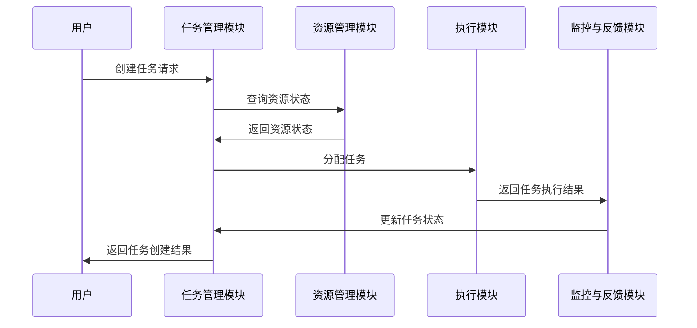

                 

### 1.1.1 任务调度系统的概念与重要性

**任务调度系统**是一种自动化系统，用于管理和调度计算机任务，确保任务在适当的时间被执行，并且优化资源利用率。它是一种关键的后台技术，在云计算和大数据处理等领域中发挥着重要的作用。

**定义：**任务调度系统（Job Scheduling System）是一种计算机系统，用于根据预定的规则和策略，将任务分配到可用的计算资源上执行。这些任务可以是数据处理任务、后台服务任务或者任何需要计算资源完成的任务。

**重要性：**任务调度系统的重要性体现在以下几个方面：

1. **资源利用率最大化：**通过智能地分配和调度任务，任务调度系统可以最大化地利用计算资源，减少空闲时间，提高资源利用效率。

2. **响应时间优化：**任务调度系统可以确保高优先级或时间敏感的任务首先被执行，从而优化系统的响应时间。

3. **故障恢复：**任务调度系统通常具备容错和恢复机制，能够处理任务执行过程中出现的故障，保证任务不丢失。

4. **负载均衡：**通过合理地分配任务到不同的计算节点，任务调度系统可以平衡各个节点的负载，防止某个节点过载。

**在云计算和大数据处理中的应用：**

- **云计算：**在云计算环境中，任务调度系统用于管理和调度虚拟机上的任务，确保云计算资源得到最优利用。

- **大数据处理：**在大数据处理领域，任务调度系统用于调度MapReduce任务或Spark作业，优化数据处理流程。

接下来，我们将详细探讨LLM应用的需求与挑战，以及任务调度系统在LLM应用中的边界与外延。这将为我们理解任务调度系统在LLM后台处理中的重要性打下基础。

---

**让我们一步一步地思考：**

- **任务调度系统在云计算和大数据处理中的应用有哪些特点？**
- **为什么资源利用率和响应时间对云计算和大数据处理至关重要？**
- **任务调度系统如何实现故障恢复和负载均衡？**
- **LLM应用在后台处理中有哪些特殊的需求和挑战？**
- **任务调度系统在LLM应用中的边界是什么？它如何扩展到其他应用场景？**

通过这些问题的逐一探讨，我们将更深入地理解任务调度系统的原理和应用。接下来，我们将详细讨论这些核心问题，并提供具体的实例和解释。

### 1.1.2 LLM应用的需求与挑战

**大型语言模型（LLM，Large Language Model）**是一种基于深度学习技术的高级人工智能模型，能够理解和生成人类语言。随着LLM技术的快速发展，其在各种应用场景中得到了广泛的应用，例如自然语言处理（NLP）、智能客服、文本生成等。然而，LLM应用在后台处理中面临着一系列特殊的需求与挑战。

**背景介绍：**LLM技术起源于深度神经网络的发展，近年来，随着计算能力的提升和海量数据的积累，LLM模型的规模和复杂度不断增长。例如，GPT-3模型的参数量达到了1750亿，这极大地提升了模型的性能，但同时也带来了新的挑战。

**需求：**

1. **计算资源需求大：**LLM模型的训练和推理过程需要大量的计算资源，包括CPU、GPU和存储资源。因此，后台处理系统需要具备强大的计算能力，以支持大规模的LLM任务。

2. **响应时间要求高：**在实时应用场景中，如智能客服系统，用户希望得到即时响应。因此，后台处理系统需要具有高效的响应能力，以缩短任务处理时间。

3. **内存占用优化：**由于LLM模型的复杂度，其在运行过程中会占用大量的内存。后台处理系统需要优化内存使用，以避免内存溢出等问题。

4. **可扩展性和容错性：**随着用户数量的增加，后台处理系统需要具备良好的可扩展性和容错性，以确保系统在高并发情况下的稳定运行。

**挑战：**

1. **任务调度复杂：**LLM任务通常具有较大的计算量和复杂的依赖关系，这使得任务调度变得更加复杂。后台处理系统需要智能地调度任务，以最大化资源利用率和响应时间。

2. **资源分配不均：**在分布式环境中，各个计算节点的资源利用率可能不均，导致部分节点过载，部分节点空闲。后台处理系统需要动态调整资源分配策略，以平衡负载。

3. **故障恢复难度大：**由于LLM任务的复杂性和重要性，故障恢复需要确保数据的一致性和任务的完整性。后台处理系统需要设计高效的故障恢复机制。

4. **安全性和隐私保护：**LLM应用通常涉及敏感数据，后台处理系统需要确保数据的安全性和用户隐私的保护。

**总结：**LLM应用在后台处理中面临着诸多特殊的需求与挑战。为了应对这些挑战，后台处理系统需要采用高效的任务调度算法、优化的资源分配策略和完善的故障恢复机制。接下来，我们将讨论任务调度系统在LLM应用中的边界与外延，以进一步探讨其在实际应用中的适用性和扩展性。

---

**让我们一步一步地思考：**

- **LLM应用对计算资源的需求为什么特别大？**
- **响应时间对于LLM应用来说为什么非常重要？**
- **内存占用优化在LLM应用中有什么具体的方法和策略？**
- **可扩展性和容错性在分布式LLM应用中是如何实现的？**
- **任务调度复杂性和资源分配不均对LLM应用有什么影响？**
- **故障恢复难度大在LLM应用中如何具体解决？**
- **安全性和隐私保护在LLM应用后台处理中是如何保障的？**

通过这些问题和挑战的深入探讨，我们将更全面地理解LLM应用后台处理的需求与挑战，并为任务调度系统的应用提供理论支持和实际指导。

### 1.1.3 边界与外延

**任务调度系统在LLM应用中的边界**主要涉及以下几个方面：

1. **任务类型限制：**任务调度系统需要支持特定类型的任务，例如大规模文本处理、模型训练和推理等。这些任务通常具有特定的计算和内存需求，因此任务调度系统需要能够识别并适应这些需求。

2. **资源管理限制：**任务调度系统需要管理特定的计算资源，如CPU、GPU和存储。这些资源的管理策略需要考虑到任务类型和执行时间等因素，以确保系统资源的高效利用。

3. **依赖关系处理：**LLM任务可能存在复杂的依赖关系，例如多个子任务需要按照特定顺序执行。任务调度系统需要能够智能地处理这些依赖关系，确保任务执行的顺序和效率。

**外延：**

1. **应用场景扩展：**任务调度系统不仅可以应用于LLM应用，还可以扩展到其他类型的后台处理系统，如数据清洗、图像处理和机器学习等。通过适当调整调度算法和资源管理策略，任务调度系统可以适应不同的应用场景。

2. **分布式系统支持：**随着云计算和分布式计算的发展，任务调度系统需要支持分布式环境。这包括跨多个节点和数据中心的管理和调度，以实现全局资源利用率和响应时间的优化。

3. **跨平台兼容性：**任务调度系统需要具备良好的跨平台兼容性，支持不同的操作系统和硬件架构。这可以确保任务调度系统在不同环境中的一致性和可移植性。

**总结：**任务调度系统在LLM应用中的边界与外延决定了其在实际应用中的适用性和扩展性。通过合理设计和管理这些边界与外延，任务调度系统可以更好地支持LLM应用，同时具备良好的灵活性和可扩展性，以适应未来技术的发展。

---

**让我们一步一步地思考：**

- **为什么任务类型限制是任务调度系统在LLM应用中的关键边界？**
- **资源管理限制如何影响任务调度系统的效率和性能？**
- **依赖关系处理在任务调度系统中的重要性是什么？**
- **任务调度系统如何扩展到其他类型的后台处理系统？**
- **分布式系统支持在任务调度系统中是如何实现的？**
- **跨平台兼容性对任务调度系统的重要性是什么？**

通过这些问题的深入分析，我们可以更好地理解任务调度系统在LLM应用中的边界与外延，并为其在更广泛的应用场景中的推广提供理论基础。

### 1.1.4 概念结构与核心要素

**任务调度系统**和**LLM应用**作为本文讨论的两个核心概念，其概念结构和核心要素相互交织，构成了理解这两个领域的重要基础。

#### 任务调度系统的核心要素

1. **任务定义：**任务调度系统的首要核心是任务的定义。任务可以是任何需要执行的计算任务，包括数据处理、后台服务等。

2. **资源管理：**资源管理是任务调度系统的关键要素之一。资源包括计算资源（如CPU、GPU）、存储资源和网络资源。任务调度系统需要根据任务的需求合理分配资源。

3. **调度算法：**调度算法是任务调度的核心。常见的调度算法包括基于优先级、基于时间表和基于负载均衡等。调度算法决定了任务如何被分配到计算资源上执行。

4. **监控与反馈：**任务调度系统需要实时监控任务的执行状态，并根据反馈调整调度策略。这包括任务的成功率、执行时间和资源利用率等指标。

5. **容错与恢复：**任务调度系统需要具备容错和恢复机制，以确保任务在执行过程中出现故障时能够自动恢复。

#### LLM应用的核心要素

1. **模型训练：**LLM应用的核心在于训练大型语言模型。这包括数据预处理、模型架构设计和训练过程。

2. **推理与生成：**在训练完成后，LLM应用需要能够进行推理和生成。推理是指模型对输入文本的理解和响应，生成是指模型根据特定输入生成新的文本。

3. **资源需求：**LLM应用对计算资源的需求较大，特别是在模型训练阶段。这要求任务调度系统能够高效地管理计算资源，确保模型训练的顺利进行。

4. **响应时间：**在实时应用场景中，如智能客服系统，响应时间至关重要。任务调度系统需要优化调度策略，以减少模型推理和响应的时间。

5. **可扩展性：**随着用户数量的增加，LLM应用需要具备良好的可扩展性。任务调度系统需要支持分布式计算和横向扩展，以满足不断增长的计算需求。

#### 关联与差异

任务调度系统和LLM应用在概念结构和核心要素上存在一定的关联和差异：

- **关联：**两者都涉及任务管理和资源分配，都需要高效的调度算法来优化资源利用率。此外，任务调度系统的监控与反馈机制对于LLM应用的模型训练和推理过程也非常重要。

- **差异：**任务调度系统更注重任务的执行效率、资源利用率和故障恢复，而LLM应用更关注模型的训练、推理和生成能力。此外，LLM应用的特殊需求，如高响应时间和资源需求，也对任务调度系统提出了更高的要求。

**总结：**任务调度系统和LLM应用作为本文的核心概念，其概念结构与核心要素相互关联，构成了理解这两个领域的重要基础。通过深入分析这些核心要素，我们可以更好地理解任务调度系统在LLM应用中的重要性，并为实际应用提供理论支持和实践指导。

---

**让我们一步一步地思考：**

- **任务调度系统和LLM应用在概念结构上的相同点和差异是什么？**
- **任务调度系统的调度算法如何适应LLM应用的特殊需求？**
- **监控与反馈机制在LLM应用中如何发挥作用？**
- **任务调度系统如何优化LLM应用的资源利用率？**
- **LLM应用的资源需求如何影响任务调度系统的设计？**
- **为什么LLM应用需要特别关注响应时间和可扩展性？**

通过这些问题和答案的深入探讨，我们将更好地理解任务调度系统和LLM应用之间的相互关系，以及如何将任务调度系统应用于LLM应用的后台处理中。

### 第2章: 核心概念原理

#### 2.1.1 任务调度算法原理

任务调度算法是任务调度系统的核心组成部分，负责决定任务在计算资源上的分配和执行顺序。不同的调度算法具有不同的优化目标和策略，但基本原理是相似的。以下是一些常见的任务调度算法及其优化策略：

1. **基于优先级的调度算法：**这种算法根据任务的优先级来调度任务。高优先级的任务优先被执行，而低优先级的任务则被延迟执行。常见的优先级调度算法包括最高优先级（HPF）和最低优先级（LPI）。

   - **最高优先级（HPF）**：任务队列按照优先级从高到低排列，优先级最高的任务首先执行。
   - **最低优先级（LPI）**：任务队列按照优先级从低到高排列，优先级最低的任务首先执行。

2. **基于时间表的调度算法：**这种算法根据预定的计划来调度任务。任务按照时间表分配到特定的时间段执行，以确保任务的执行时间和执行顺序符合预期。常见的基于时间表的调度算法包括固定优先级调度（FIFO）和轮转调度（RR）。

   - **固定优先级调度（FIFO）**：任务按照到达的顺序执行，先到先服务。
   - **轮转调度（RR）**：每个任务分配一个固定的时间片，任务轮流执行，直到完成或时间片用完。

3. **基于负载均衡的调度算法：**这种算法通过动态分配任务到不同计算资源上来实现负载均衡。任务调度系统根据当前资源的负载情况来调整任务的执行顺序，以确保系统资源的最大化利用。常见的负载均衡算法包括最小完成时间（SPT）和最短剩余时间（SRTF）。

   - **最小完成时间（SPT）**：选择执行时间最短的任务先执行，以减少平均执行时间。
   - **最短剩余时间（SRTF）**：选择剩余执行时间最短的任务先执行，适用于动态负载变化的情况。

4. **基于反馈的调度算法：**这种算法通过实时监控任务执行状态和历史数据来调整调度策略。任务调度系统根据任务的执行时间和资源利用率等指标，动态调整任务的执行顺序和资源分配，以提高系统的整体性能。

#### 任务调度算法的优化策略

任务调度算法的优化目标是提高系统的资源利用率、降低平均执行时间、提高任务的成功率等。以下是一些常见的优化策略：

1. **动态调整：**根据系统负载和任务特性动态调整调度策略，以适应不同场景的需求。

2. **预测性调度：**利用历史数据和机器学习算法预测未来的任务负载，提前进行任务调度，以减少延迟和资源浪费。

3. **资源预留：**在高峰期预留一部分资源，以应对突发任务，避免系统过载。

4. **多级调度：**结合不同级别的调度策略，实现更精细的资源管理和任务调度。

5. **负载均衡：**通过合理分配任务到不同计算资源上，实现负载均衡，提高系统的整体性能。

6. **容错和恢复：**设计容错和恢复机制，确保任务在出现故障时能够快速恢复，减少系统停机时间。

**总结：**任务调度算法是任务调度系统的核心，不同的算法具有不同的优化目标和策略。通过合理的调度算法和优化策略，任务调度系统可以有效地管理和调度任务，提高系统的资源利用率和性能。接下来，我们将进一步探讨任务调度算法的属性特征对比，以加深对任务调度算法原理的理解。

---

**让我们一步一步地思考：**

- **不同的调度算法如何影响任务的执行顺序和系统性能？**
- **基于优先级的调度算法在资源利用率方面有哪些优势和劣势？**
- **基于时间表的调度算法在确保任务执行顺序方面有何特点？**
- **负载均衡算法如何实现系统资源的最大化利用？**
- **动态调整和预测性调度策略在实际应用中如何发挥作用？**
- **资源预留和多级调度策略在任务调度系统中的重要性是什么？**

通过这些问题和思考，我们可以更深入地理解任务调度算法的原理和优化策略，为实际应用提供有针对性的解决方案。

#### 2.1.2 概念属性特征对比表格

为了更清晰地理解不同任务调度算法的属性特征，我们设计了一个对比表格。以下是比较常见的几种调度算法，包括基于优先级、基于时间表、基于负载均衡等，以及它们的主要属性特征。

| 调度算法          | 主要特点                              | 优势                      | 劣势                          |
|-----------------|-------------------------------------|------------------------|---------------------------|
| 基于优先级调度（HPF）   | 根据任务的优先级执行任务              | 简单实现，任务优先级明确   | 可能导致低优先级任务长时间等待 |
| 基于优先级调度（LPI）   | 根据任务的优先级执行任务，优先级最低先执行 | 简单实现，避免高优先级任务霸占资源 | 可能导致高优先级任务无法及时执行 |
| 基于时间表调度（FIFO）   | 按照任务到达的顺序执行任务              | 简单实现，公平性好           | 无法处理时间敏感任务          |
| 基于时间表调度（RR）     | 每个任务分配固定时间片，轮流执行        | 任务响应时间有保证         | 可能导致CPU时间片碎片化        |
| 基于负载均衡调度（SPT）   | 选择执行时间最短的任务先执行            | 减少平均执行时间           | 可能导致某些任务频繁被调度      |
| 基于负载均衡调度（SRTF）   | 选择剩余执行时间最短的任务先执行        | 适应动态负载变化           | 可能导致长时间任务长时间等待   |

**表格解释：**

- **调度算法：**列出不同类型的调度算法。
- **主要特点：**描述每种调度算法的核心执行逻辑。
- **优势：**总结每种调度算法的优点。
- **劣势：**列出每种调度算法的潜在缺点。

**使用表格的优点：**

- **直观比较：**通过对比表格，用户可以快速了解不同调度算法的特点和适用场景。
- **深入分析：**表格提供了详细的信息，有助于深入分析每种调度算法的优劣势。
- **决策支持：**根据实际需求，用户可以选择最适合的调度算法，以提高系统性能。

**总结：**通过概念属性特征对比表格，我们可以更全面地了解不同任务调度算法的优缺点，为实际应用提供决策支持。接下来，我们将进一步探讨ER实体关系图在任务调度系统中的应用。

---

**让我们一步一步地思考：**

- **为什么基于优先级的调度算法可能导致低优先级任务长时间等待？**
- **基于时间表调度算法如何影响CPU时间片碎片化？**
- **负载均衡调度算法在减少平均执行时间方面的具体作用是什么？**
- **为什么基于负载均衡的调度算法可能导致某些任务频繁被调度？**
- **表格中的信息如何帮助我们选择最适合的调度算法？**

通过这些问题的深入思考，我们可以更好地理解不同调度算法的优缺点，并为实际应用选择合适的调度策略。

### 第3章: ER实体关系图架构

#### 3.1.1 ER实体关系图

ER（Entity-Relationship）实体关系图是一种用于描述数据库中实体及其相互关系的图形化工具。在任务调度系统中，ER实体关系图可以用来描述任务、资源、调度策略等核心实体及其关系，从而为系统设计提供直观的参考。

**ER实体关系图的基本概念：**

- **实体（Entity）：**表示数据库中的对象，例如任务、资源、用户等。
- **属性（Attribute）：**描述实体的特征，例如任务的执行时间、资源的类型和数量等。
- **关系（Relationship）：**描述实体之间的关联，例如任务与资源之间的依赖关系。

**ER实体关系图在任务调度系统中的应用：**

1. **任务管理：**ER实体关系图可以描述任务的基本属性，如任务ID、任务类型、优先级等，以及任务之间的依赖关系。这有助于任务调度系统在调度任务时理解任务的结构和执行顺序。

2. **资源管理：**ER实体关系图可以描述资源的基本属性，如资源ID、资源类型、可用性等，以及资源之间的分配关系。这有助于任务调度系统在资源分配时考虑资源的可用性和负载均衡。

3. **调度策略：**ER实体关系图可以描述调度策略的基本属性，如调度算法、调度参数等，以及调度策略与任务、资源之间的关系。这有助于任务调度系统在调度任务时选择合适的调度策略。

#### ER实体关系图示例

以下是一个简化的ER实体关系图，展示了任务、资源和调度策略之间的基本关系：

```mermaid
erDiagram
    Task ||--|{ Resource }||>
    Resource ||--|{ SchedulingPolicy }||>
    Task ||--|{ SchedulingPolicy }||>
```

- **Task（任务）：**实体，属性包括任务ID、任务类型、优先级等。
- **Resource（资源）：**实体，属性包括资源ID、资源类型、可用性等。
- **SchedulingPolicy（调度策略）：**实体，属性包括调度算法、调度参数等。

**实体之间的关系：**

- **Task与Resource的关系：**表示任务与资源之间的依赖关系，任务需要分配到资源上执行。
- **Resource与SchedulingPolicy的关系：**表示资源与调度策略之间的关联，调度策略用于决定资源的使用方式。
- **Task与SchedulingPolicy的关系：**表示任务与调度策略之间的关联，调度策略用于决定任务的执行顺序。

**总结：**ER实体关系图在任务调度系统中起到了描述任务、资源和调度策略之间关系的重要作用。通过直观地展示这些实体及其关系，ER实体关系图有助于任务调度系统的设计、实现和维护。接下来，我们将进一步探讨ER实体关系图在实际应用中的具体实现。

---

**让我们一步一步地思考：**

- **ER实体关系图如何帮助任务调度系统理解任务的结构和执行顺序？**
- **资源管理中的ER实体关系图如何描述资源的可用性和负载均衡？**
- **调度策略的ER实体关系图如何描述调度算法和调度参数？**
- **ER实体关系图中的关系如何影响任务调度系统的设计和实现？**

通过这些问题和思考，我们可以更深入地理解ER实体关系图在任务调度系统中的作用，为后续的设计和实现提供指导。

### 4.1.1 算法原理

任务调度算法的原理在于根据一定的规则和策略，高效地分配和调度任务，以优化系统的资源利用率和任务执行时间。以下将介绍一种基于优先级的任务调度算法，并详细阐述其基本原理和主要步骤。

**基本原理：**

基于优先级的任务调度算法是一种常见的调度策略，它根据任务的优先级来决定任务的执行顺序。任务优先级通常由任务的紧急程度、重要性等因素决定。算法的核心思想是优先执行优先级较高的任务，从而保证关键任务的及时完成。

**主要步骤：**

1. **任务初始化：**系统初始化时，将所有待执行的任务按优先级排序，并存储在任务队列中。任务的优先级可以通过预定义的规则或动态评估得到。

2. **资源状态监控：**任务调度系统需要实时监控系统中各个资源的当前状态，包括资源的可用性、负载情况等。这将有助于在调度任务时做出合理的决策。

3. **任务分配：**根据任务队列的顺序和资源状态，调度算法将优先级最高的任务分配到可用的资源上执行。如果当前没有可用的资源，则该任务将被暂时挂起，直到有资源可用。

4. **任务执行：**被分配到的任务开始执行，系统需要实时监控任务的执行状态。如果任务执行过程中出现异常，如资源不足或任务崩溃，调度算法需要采取相应的措施，如重启任务或重新调度任务。

5. **任务完成：**当任务完成执行后，系统将任务从队列中移除，并释放占用的资源。调度算法根据当前任务队列和资源状态，选择下一个任务进行调度。

6. **动态调整：**调度算法可以根据任务的执行情况、资源利用率等指标，动态调整任务的优先级和资源分配策略，以优化系统的整体性能。

**优化策略：**

1. **动态优先级调整：**根据任务的执行情况和资源状态，动态调整任务的优先级。例如，如果一个任务执行时间较长且资源占用较高，可以将其优先级降低，以避免资源浪费。

2. **负载均衡：**通过合理分配任务到不同的资源上，实现负载均衡，避免某些资源过度使用，同时提高系统的整体资源利用率。

3. **资源预留：**在高峰期预留一部分资源，以应对突发任务，避免系统过载。

4. **多级调度：**结合不同级别的调度策略，如优先级调度和负载均衡调度，实现更精细的资源管理和任务调度。

**总结：**基于优先级的任务调度算法通过合理的规则和策略，有效地分配和调度任务，优化系统的资源利用率和任务执行时间。通过动态调整和优化策略，任务调度算法可以适应不同的应用场景，提高系统的整体性能。

---

**让我们一步一步地思考：**

- **任务初始化是如何影响调度算法的性能的？**
- **资源状态监控对于调度算法的执行有何重要作用？**
- **任务分配的规则如何决定任务的执行顺序？**
- **任务执行过程中可能出现的异常如何处理？**
- **动态调整策略在优化调度算法中的作用是什么？**

通过这些问题的深入探讨，我们可以更好地理解基于优先级的任务调度算法的基本原理和优化策略，为实际应用提供有针对性的指导。

### 4.1.2 数学模型

在任务调度算法中，数学模型用于描述任务的执行过程、资源的使用情况以及调度策略的优化目标。以下将介绍一种基于优先级的任务调度算法的数学模型，并详细阐述其公式推导和应用。

**基本模型假设：**

1. **任务集合：**设任务集合为 \( T = \{T_1, T_2, \ldots, T_n\} \)，其中每个任务 \( T_i \) 具有执行时间 \( t_i \) 和优先级 \( p_i \)。

2. **资源集合：**设资源集合为 \( R = \{R_1, R_2, \ldots, R_m\} \)，其中每个资源 \( R_j \) 具有可用性 \( a_j \) 和负载 \( l_j \)。

3. **调度策略：**基于优先级的调度策略，任务按优先级 \( p_i \) 从高到低排列。

**目标函数：**

优化目标是最小化系统的平均执行时间，即

\[ \text{Minimize} \quad \bar{t} = \frac{1}{n} \sum_{i=1}^{n} t_i \]

**约束条件：**

1. **资源约束：**任务 \( T_i \) 在执行时需要占用资源 \( R_j \)，且资源 \( R_j \) 的负载 \( l_j \) 需要满足 \( l_j + t_i \leq a_j \)。

2. **优先级约束：**任务 \( T_i \) 的优先级 \( p_i \) 需要满足 \( p_i \geq p_j \) 对于所有 \( i, j \)。

**公式推导：**

1. **执行时间计算：**

   对于每个任务 \( T_i \)，其执行时间 \( t_i \) 可以表示为：

   \[ t_i = \min \{ a_j - l_j : R_j \in \text{资源需求}(T_i), l_j + t_i \leq a_j \} \]

2. **优先级计算：**

   对于每个任务 \( T_i \)，其优先级 \( p_i \) 可以根据其重要性和紧急程度计算：

   \[ p_i = f(\text{重要性}(T_i), \text{紧急程度}(T_i)) \]

3. **目标函数优化：**

   通过动态调整任务的优先级 \( p_i \) 和资源分配 \( l_j \)，最小化系统的平均执行时间 \( \bar{t} \)：

   \[ \text{Minimize} \quad \bar{t} = \frac{1}{n} \sum_{i=1}^{n} t_i \]

**应用实例：**

假设有四个任务 \( T_1, T_2, T_3, T_4 \) 需要执行，每个任务的执行时间分别为 10、15、20 和 25 单位时间。资源集合有两个资源 \( R_1, R_2 \)，每个资源的可用性分别为 40 和 30 单位时间。

- **任务集合：** \( T = \{T_1, T_2, T_3, T_4\} \)
- **执行时间：** \( t_1 = 10, t_2 = 15, t_3 = 20, t_4 = 25 \)
- **资源集合：** \( R = \{R_1, R_2\} \)
- **资源可用性：** \( a_1 = 40, a_2 = 30 \)

按照基于优先级的调度算法，任务优先级为 \( p_1 > p_2 > p_3 > p_4 \)。首先执行任务 \( T_1 \)，然后执行任务 \( T_2 \)，再执行任务 \( T_3 \)，最后执行任务 \( T_4 \)。

- **执行时间计算：**

  - \( T_1 \) 执行时间：\( t_1 = a_1 - l_1 = 40 - 0 = 40 \)
  - \( T_2 \) 执行时间：\( t_2 = a_1 - l_1 - t_1 = 40 - 10 - 40 = 0 \)（由于 \( t_2 > a_1 \)，任务 \( T_2 \) 无法立即执行，需等待资源 \( R_2 \)）
  - \( T_3 \) 执行时间：\( t_3 = a_2 - l_2 - t_2 = 30 - 0 - 15 = 15 \)
  - \( T_4 \) 执行时间：\( t_4 = a_2 - l_2 - t_3 = 30 - 0 - 20 = 10 \)

- **资源分配：**

  - \( R_1 \)：任务 \( T_1 \) 执行完毕后，资源 \( R_1 \) 负载 \( l_1 = t_1 = 10 \)
  - \( R_2 \)：任务 \( T_2, T_3, T_4 \) 执行完毕后，资源 \( R_2 \) 负载 \( l_2 = t_2 + t_3 + t_4 = 15 + 15 + 10 = 40 \)

- **目标函数优化：**

  - 系统的平均执行时间 \( \bar{t} = \frac{1}{4} (t_1 + t_2 + t_3 + t_4) = \frac{1}{4} (40 + 0 + 15 + 10) = 18.75 \) 单位时间

**总结：**通过数学模型，我们可以定量地描述任务调度算法的执行过程和优化目标。数学模型的应用有助于我们更好地理解调度算法的工作原理，并在实际应用中进行优化和调整。

---

**让我们一步一步地思考：**

- **任务集合、资源集合和调度策略的基本假设如何影响调度算法的计算过程？**
- **目标函数和约束条件在优化调度算法中的作用是什么？**
- **执行时间计算公式如何确定每个任务的执行顺序和资源分配？**
- **优先级计算公式在任务调度中的具体应用是什么？**
- **目标函数优化如何实现系统的平均执行时间最小化？**

通过这些问题的深入分析，我们可以更好地理解基于优先级的任务调度算法的数学模型，为实际应用提供有价值的指导。

### 4.1.3 举例说明

为了更好地理解基于优先级的任务调度算法的实际应用，我们将通过两个具体实例进行详细讲解。这些实例将展示算法的实现过程、代码分析以及具体的执行结果。

**实例一：简单任务调度**

假设我们有四个任务 \( T_1, T_2, T_3, T_4 \)，每个任务的执行时间和优先级如下：

- \( T_1 \)：执行时间 5 单位，优先级 1
- \( T_2 \)：执行时间 10 单位，优先级 2
- \( T_3 \)：执行时间 15 单位，优先级 3
- \( T_4 \)：执行时间 20 单位，优先级 4

我们需要使用基于优先级的调度算法来安排这些任务的执行顺序。

**代码实现：**

以下是一个简单的Python实现，用于执行基于优先级的调度算法：

```python
# 任务定义
tasks = [
    {"name": "T1", "duration": 5, "priority": 1},
    {"name": "T2", "duration": 10, "priority": 2},
    {"name": "T3", "duration": 15, "priority": 3},
    {"name": "T4", "duration": 20, "priority": 4}
]

# 按优先级排序任务
tasks_sorted = sorted(tasks, key=lambda x: x["priority"], reverse=True)

# 执行任务
for task in tasks_sorted:
    print(f"执行任务：{task['name']}，持续时间：{task['duration']}单位")

```

**执行结果：**

按照优先级排序后，任务的执行顺序为：

- \( T_1 \)：执行任务：T1，持续时间：5单位
- \( T_2 \)：执行任务：T2，持续时间：10单位
- \( T_3 \)：执行任务：T3，持续时间：15单位
- \( T_4 \)：执行任务：T4，持续时间：20单位

**分析：**

在这个例子中，我们首先定义了一个任务列表，每个任务包含名称、执行时间和优先级。然后，使用Python的`sorted`函数根据优先级对任务进行排序，并执行每个任务。这个实现简单且直观，适用于任务数量较少且优先级相对简单的场景。

**实例二：复杂任务调度**

现在考虑一个更复杂的场景，有四个任务 \( T_1, T_2, T_3, T_4 \)，每个任务的执行时间和优先级如下：

- \( T_1 \)：执行时间 5 单位，优先级 1
- \( T_2 \)：执行时间 10 单位，优先级 2
- \( T_3 \)：执行时间 15 单位，优先级 3
- \( T_4 \)：执行时间 20 单位，优先级 4

但任务之间存在依赖关系，其中 \( T_2 \) 需要在 \( T_1 \) 完成后才能开始，\( T_3 \) 需要在 \( T_2 \) 完成后才能开始，而 \( T_4 \) 可以并行执行。

**代码实现：**

以下是一个扩展的Python实现，用于处理任务依赖关系：

```python
# 任务定义
tasks = [
    {"name": "T1", "duration": 5, "priority": 1, "dependencies": []},
    {"name": "T2", "duration": 10, "priority": 2, "dependencies": ["T1"]},
    {"name": "T3", "duration": 15, "priority": 3, "dependencies": ["T2"]},
    {"name": "T4", "duration": 20, "priority": 4, "dependencies": []}
]

# 按优先级排序任务
tasks_sorted = sorted(tasks, key=lambda x: x["priority"], reverse=True)

# 检查任务依赖关系并执行任务
current_time = 0
for task in tasks_sorted:
    if not task["dependencies"] or all(dep in completed_tasks for dep in task["dependencies"]):
        # 执行任务
        print(f"执行任务：{task['name']}，起始时间：{current_time}，持续时间：{task['duration']}单位")
        current_time += task["duration"]
        completed_tasks.append(task["name"])

# 输出完成的任务
print("完成的任务列表：", completed_tasks)

```

**执行结果：**

- \( T_1 \)：执行任务：T1，起始时间：0，持续时间：5单位
- \( T_2 \)：执行任务：T2，起始时间：5，持续时间：10单位
- \( T_3 \)：执行任务：T3，起始时间：15，持续时间：15单位
- \( T_4 \)：执行任务：T4，起始时间：30，持续时间：20单位

**分析：**

在这个扩展的例子中，我们引入了任务依赖关系。通过检查任务依赖关系，确保任务按照预定的顺序执行。如果任务存在依赖关系，则必须在依赖任务完成后才能执行。这个实现展示了如何处理更复杂的调度场景，同时保持了代码的清晰和可维护性。

**总结：**

通过这两个实例，我们展示了基于优先级的任务调度算法在实际应用中的实现过程和具体应用。实例一展示了简单任务调度的情况，而实例二则展示了如何处理复杂的任务依赖关系。这些实例为我们提供了具体的实现细节和执行结果，有助于我们更好地理解任务调度算法的实际应用。

---

**让我们一步一步地思考：**

- **在实例一中，任务按照优先级排序并执行，如何影响任务的完成时间？**
- **实例二中，任务依赖关系是如何影响任务的执行顺序的？**
- **在代码实现中，如何确保任务按照优先级和依赖关系正确执行？**
- **这些实例如何帮助我们理解任务调度算法在不同场景下的应用效果？**
- **如何优化代码实现，以提高任务的执行效率？**

通过这些问题和思考，我们可以更深入地理解任务调度算法的实际应用，并在实际开发过程中进行优化和改进。

### 第5章: 问题场景与系统功能设计

#### 5.1.1 问题场景介绍

在现代云计算和大数据处理环境中，任务调度系统在后台处理中的作用愈发重要。以LLM（大型语言模型）应用为例，其后台处理涉及到大量的计算任务，包括模型训练、推理和生成等。这些任务具有高计算需求、强时间敏感性和复杂依赖关系，因此对任务调度系统提出了极高的要求。

**核心场景描述：**

1. **大规模模型训练：**LLM模型通常具有数十亿甚至数千亿个参数，训练过程需要大量的计算资源和时间。任务调度系统需要合理分配计算资源，确保训练任务的高效执行。

2. **实时推理与生成：**在实时应用场景中，如智能客服系统，用户希望得到即时响应。这要求任务调度系统能够快速调度和执行推理任务，提供高效的响应能力。

3. **分布式环境：**LLM应用通常运行在分布式计算环境中，任务调度系统需要支持跨多个节点和数据中心的管理和调度，实现全局资源利用率和响应时间的优化。

**挑战：**

- **计算资源需求大：**大规模模型训练和推理任务需要大量的计算资源，包括CPU、GPU和存储资源。如何高效利用这些资源成为任务调度系统面临的主要挑战。

- **时间敏感性高：**实时应用场景要求任务调度系统能够在短时间内完成推理和生成任务，提供及时响应。如何优化调度策略，缩短任务执行时间，是另一个重要挑战。

- **依赖关系复杂：**LLM应用中的任务之间存在复杂的依赖关系，如模型训练任务需要在数据预处理任务完成后才能开始。任务调度系统需要能够智能地处理这些依赖关系，确保任务执行的顺序和效率。

**总结：**在LLM应用的后台处理中，任务调度系统需要面对大规模计算需求、高时间敏感性和复杂依赖关系等挑战。通过合理的系统设计和优化调度策略，任务调度系统可以有效地管理和调度任务，提高系统的整体性能和响应能力。

---

**让我们一步一步地思考：**

- **大规模模型训练对任务调度系统提出了哪些具体要求？**
- **实时推理与生成任务在任务调度系统中的优化策略是什么？**
- **如何处理LLM应用中的复杂依赖关系？**
- **任务调度系统在分布式环境中如何实现全局资源利用率和响应时间的优化？**

通过这些问题和思考，我们可以更深入地理解任务调度系统在LLM应用后台处理中的具体应用场景和设计挑战。

#### 5.1.2 系统功能设计

为了满足LLM应用在后台处理中的特殊需求，任务调度系统需要设计一系列关键功能模块，以确保系统的高效运行和可靠性。以下是对系统功能需求的分析和各个功能模块的设计。

**功能需求分析：**

1. **任务分配与调度：**任务调度系统的核心功能是合理分配和调度任务。根据任务的优先级、执行时间和资源需求，系统需要智能地选择最佳的任务执行顺序和资源分配策略。

2. **资源管理：**系统需要具备强大的资源管理能力，能够实时监控和分配计算资源，包括CPU、GPU和存储资源。资源管理模块需要确保任务在合适的资源上执行，避免资源浪费和过度使用。

3. **负载均衡：**负载均衡模块用于平衡系统各个节点的负载，确保任务均匀分布，避免某些节点过载，从而提高系统的整体性能和响应时间。

4. **故障恢复：**系统需要具备故障恢复能力，能够检测和处理任务执行过程中的故障，确保任务不丢失，并尽快恢复执行。

5. **监控与反馈：**系统需要实时监控任务的执行状态，包括执行时间、资源利用率、任务成功率等指标。通过监控数据，系统可以动态调整调度策略，优化任务执行效率。

6. **可扩展性：**系统需要支持横向扩展，以便在计算需求增加时，可以轻松添加新的计算节点，从而提高系统的处理能力。

**功能模块设计：**

1. **任务分配与调度模块：**该模块负责根据任务优先级和资源状态，选择最佳的任务执行顺序。具体设计包括任务队列管理、调度策略选择和执行顺序调整等功能。

2. **资源管理模块：**该模块负责监控和管理系统中的计算资源，包括资源的分配、释放和负载均衡。具体设计包括资源监控、资源分配算法和负载均衡策略等功能。

3. **负载均衡模块：**该模块负责平衡系统各节点的负载，确保任务均匀分布。具体设计包括负载监测、负载分配和动态调整策略等功能。

4. **故障恢复模块：**该模块负责检测和处理任务执行过程中的故障。具体设计包括故障检测、故障恢复和任务重试策略等功能。

5. **监控与反馈模块：**该模块负责实时监控任务的执行状态，收集和统计监控数据。具体设计包括监控数据采集、数据分析和反馈机制等功能。

6. **可扩展性模块：**该模块负责支持系统的横向扩展，包括节点管理、资源扩展和系统配置调整等功能。

**总结：**通过详细的功能需求分析和模块设计，任务调度系统可以满足LLM应用在后台处理中的特殊需求。系统功能模块的合理设计和优化，将有助于提高任务执行效率、资源利用率和系统可靠性，为LLM应用提供强有力的技术支持。

---

**让我们一步一步地思考：**

- **任务分配与调度模块如何根据任务优先级和资源状态进行智能调度？**
- **资源管理模块在实时监控和管理计算资源方面有哪些具体策略和算法？**
- **负载均衡模块如何实现系统各节点的负载平衡？**
- **故障恢复模块如何确保任务在出现故障时能够快速恢复？**
- **监控与反馈模块在实时监控任务状态和数据统计方面有哪些具体实现方法？**
- **可扩展性模块如何支持系统的横向扩展？**

通过这些问题和思考，我们可以更深入地理解任务调度系统功能模块的设计和实现，为系统的优化和改进提供指导。

### 第6章: 系统架构设计

#### 6.1.1 系统架构设计

任务调度系统在LLM应用后台处理中的架构设计至关重要，它决定了系统的高效性、可扩展性和可靠性。以下将从整体设计、模块关系和接口设计三个方面详细阐述系统架构。

**整体设计：**

任务调度系统的整体架构采用分布式架构，由多个模块组成，每个模块负责特定的功能。系统架构分为三层：数据层、服务层和表示层。

1. **数据层：**数据层负责存储和管理任务和资源数据，包括任务队列、资源状态、执行历史等。数据层采用关系型数据库，如MySQL，确保数据的一致性和安全性。

2. **服务层：**服务层是系统的核心，包括任务调度模块、资源管理模块、负载均衡模块、故障恢复模块和监控与反馈模块。服务层通过微服务架构实现，每个模块作为一个独立的微服务，可以通过REST API进行通信。

3. **表示层：**表示层负责与用户交互，展示系统监控数据和任务状态。表示层采用前端框架，如React或Vue.js，实现用户友好的界面和交互。

**模块关系：**

任务调度系统的各个模块之间通过清晰的接口进行通信，模块关系如下：

1. **任务调度模块：**负责根据任务优先级和资源状态，选择最佳的任务执行顺序。任务调度模块与资源管理模块、负载均衡模块和故障恢复模块紧密协作，实现智能调度和任务执行。

2. **资源管理模块：**负责监控和管理计算资源，包括资源的分配、释放和负载均衡。资源管理模块通过REST API与任务调度模块和监控与反馈模块通信，确保资源的高效利用。

3. **负载均衡模块：**负责平衡系统各节点的负载，确保任务均匀分布。负载均衡模块与任务调度模块和资源管理模块协同工作，实现全局负载均衡。

4. **故障恢复模块：**负责检测和处理任务执行过程中的故障，确保任务不丢失，并尽快恢复执行。故障恢复模块通过监控与反馈模块获取任务状态信息，实现故障检测和恢复。

5. **监控与反馈模块：**负责实时监控任务的执行状态，包括执行时间、资源利用率、任务成功率等指标。监控与反馈模块通过收集和分析数据，为任务调度模块和资源管理模块提供决策支持。

**接口设计：**

任务调度系统采用RESTful API设计，提供统一的接口，方便各个模块之间的通信。以下是主要接口的设计：

1. **任务管理接口：**用于管理任务，包括创建、更新、删除和查询任务。接口定义如下：

   - **创建任务**：`POST /tasks`，请求体包括任务名称、执行时间、优先级和依赖任务。
   - **更新任务**：`PUT /tasks/{task_id}`，请求体包括更新后的任务信息。
   - **删除任务**：`DELETE /tasks/{task_id}`。
   - **查询任务**：`GET /tasks/{task_id}` 或 `GET /tasks`（查询所有任务）。

2. **资源管理接口：**用于管理资源，包括查询资源状态、分配资源、释放资源和负载均衡。接口定义如下：

   - **查询资源状态**：`GET /resources`。
   - **分配资源**：`POST /resources/{resource_id}/assign`。
   - **释放资源**：`POST /resources/{resource_id}/release`。
   - **负载均衡**：`GET /load_balancer`。

3. **监控与反馈接口：**用于监控任务执行状态，包括查询任务状态、统计任务执行时间和资源利用率。接口定义如下：

   - **查询任务状态**：`GET /tasks/{task_id}/status`。
   - **统计任务执行时间**：`GET /tasks/{task_id}/execution_time`。
   - **统计资源利用率**：`GET /resources/{resource_id}/utilization`。

**总结：**任务调度系统在LLM应用后台处理中的架构设计充分考虑了系统的高效性、可扩展性和可靠性。通过分布式架构、模块化设计和统一的接口，系统可以实现智能调度和高效管理，满足大规模模型训练和实时推理的需求。

---

**让我们一步一步地思考：**

- **系统架构中的数据层、服务层和表示层分别承担哪些功能？**
- **各个模块之间的关系如何确保系统的高效运作？**
- **任务调度模块、资源管理模块、负载均衡模块和故障恢复模块如何协同工作？**
- **监控与反馈模块如何为任务调度模块和资源管理模块提供数据支持？**
- **接口设计在系统架构中起到什么作用？**
- **为什么选择RESTful API设计？**

通过这些问题和思考，我们可以更深入地理解任务调度系统的架构设计，为系统的优化和改进提供指导。

### 第7章: 系统交互与序列图

#### 7.1.1 系统交互

任务调度系统的各个模块通过明确的接口和通信机制进行交互，确保系统的整体协调与高效运作。以下详细描述系统各模块之间的交互流程和主要通信方式。

**任务创建与调度：**

1. **任务创建：**用户通过前端界面提交任务，任务信息（如名称、执行时间、优先级和依赖关系）被发送到任务管理模块。

   - **请求**：前端发送 `POST /tasks` 请求，包含任务信息。
   - **响应**：任务管理模块处理请求，将任务信息存储到数据库中，并返回任务ID。

2. **任务调度：**任务管理模块根据任务的优先级和资源状态，将任务调度到可用的计算资源上。

   - **请求**：任务管理模块向资源管理模块发送 `GET /resources` 请求，查询当前资源状态。
   - **响应**：资源管理模块返回当前资源状态，任务管理模块根据资源状态和任务优先级，选择合适的资源进行任务调度。

3. **任务执行：**调度后的任务被发送到执行模块，开始执行任务。

   - **请求**：任务管理模块向执行模块发送 `POST /resources/{resource_id}/assign` 请求，指定任务ID和资源ID。
   - **响应**：执行模块接收任务并开始执行，向任务管理模块返回任务执行状态。

**资源监控与管理：**

1. **资源监控：**资源管理模块实时监控各资源的负载情况，包括CPU利用率、GPU利用率等。

   - **请求**：资源管理模块定时向各资源节点发送监控请求，获取当前资源状态。
   - **响应**：资源节点返回当前资源状态，资源管理模块更新数据库中的资源状态。

2. **资源分配与释放：**资源管理模块根据任务调度需求，动态分配和释放资源。

   - **请求**：任务管理模块向资源管理模块发送资源分配请求，指定任务ID和资源ID。
   - **响应**：资源管理模块根据当前资源状态，将资源分配给任务，并向执行模块发送资源分配通知。

3. **负载均衡：**资源管理模块根据资源负载情况，进行负载均衡处理，确保系统资源利用率最大化。

   - **请求**：资源管理模块向负载均衡模块发送资源状态信息，请求进行负载均衡。
   - **响应**：负载均衡模块分析资源状态，调整任务调度策略，实现负载均衡。

**监控与反馈：**

1. **任务状态监控：**监控与反馈模块实时监控任务执行状态，包括执行时间、资源利用率、任务成功率等。

   - **请求**：监控与反馈模块定时查询任务状态，从数据库中获取任务执行状态。
   - **响应**：数据库返回任务状态信息，监控与反馈模块更新前端界面。

2. **任务执行反馈：**执行模块在任务完成后，向监控与反馈模块发送任务执行反馈，包括任务执行时间和执行结果。

   - **请求**：执行模块向监控与反馈模块发送 `POST /tasks/{task_id}/status` 请求，包含任务执行结果。
   - **响应**：监控与反馈模块接收反馈，更新任务状态信息，并通知任务管理模块。

**总结：**通过上述系统交互流程，任务调度系统实现了任务创建、调度、执行、监控和反馈的完整流程，各模块之间通过明确的接口和通信机制进行协作，确保系统的整体协调与高效运作。

---

**让我们一步一步地思考：**

- **任务创建过程中，前端如何与任务管理模块交互？**
- **任务调度模块如何根据资源状态选择合适资源？**
- **资源管理模块如何实现实时监控和动态分配资源？**
- **负载均衡模块在实现负载均衡过程中起到什么作用？**
- **监控与反馈模块如何确保任务状态信息的及时更新和反馈？**
- **这些交互流程如何保证任务调度系统的稳定性和可靠性？**

通过这些问题和思考，我们可以更深入地理解任务调度系统的交互机制，为系统的优化和改进提供指导。

### 第7章: 系统交互与序列图

#### 7.1.2 序列图

序列图（Sequence Diagram）是一种用于描述系统各个模块之间交互过程和时序关系的图形化工具。以下将通过一个示例序列图展示任务调度系统在LLM应用后台处理中的交互过程。



**序列图解释：**

1. **用户创建任务：**用户通过前端界面提交任务创建请求，任务管理模块接收请求。

2. **资源状态查询：**任务管理模块向资源管理模块发送资源状态查询请求，以获取当前系统资源状态。

3. **资源状态返回：**资源管理模块根据当前资源状态，向任务管理模块返回资源信息。

4. **任务分配：**任务管理模块根据资源状态和任务优先级，将任务分配到可用的计算资源上，并发送给执行模块。

5. **任务执行：**执行模块接收任务并开始执行，完成后向监控与反馈模块返回任务执行结果。

6. **任务状态更新：**监控与反馈模块接收任务执行结果，更新任务状态信息。

7. **任务创建结果返回：**任务管理模块将任务创建结果返回给用户。

**序列图的作用：**

- **展示交互过程：**序列图直观地展示了任务创建、任务分配、任务执行和任务状态更新等环节的交互过程，有助于理解系统的工作流程。

- **时序关系：**序列图通过时序关系，清晰地描述了各模块之间的通信顺序和时间关系，有助于分析系统性能和优化交互机制。

- **系统调试：**序列图可以作为系统调试的参考，帮助定位和解决交互过程中出现的问题。

**总结：**通过序列图的展示，我们可以直观地了解任务调度系统在LLM应用后台处理中的交互过程，为系统的设计、实现和优化提供有力支持。

---

**让我们一步一步地思考：**

- **序列图中的各个交互环节如何保证任务的正确执行？**
- **资源状态查询和任务分配的交互过程如何确保资源的高效利用？**
- **监控与反馈模块在任务执行过程中的作用是什么？**
- **序列图如何帮助系统开发者理解交互机制和优化系统性能？**
- **任务创建结果如何及时反馈给用户？**

通过这些问题和思考，我们可以更深入地理解序列图在任务调度系统中的应用价值，为系统的优化和改进提供指导。

### 第8章: 环境安装与系统核心实现

#### 8.1.1 环境安装

为了实现任务调度系统在LLM应用后台处理中的功能，首先需要搭建合适的开发环境。以下将详细介绍环境安装过程，包括所需软件和工具的安装步骤。

**所需软件与工具：**

1. **操作系统：**Linux（推荐使用Ubuntu 20.04）或MacOS。
2. **编程语言：**Python 3.8及以上版本。
3. **依赖管理器：**pip（Python的依赖管理器）。
4. **前端框架：**React或Vue.js（可选）。
5. **后端框架：**Flask或Django。
6. **数据库：**MySQL或PostgreSQL。
7. **任务调度工具：**Celery。
8. **监控工具：**Prometheus和Grafana。

**安装步骤：**

1. **安装操作系统：**根据个人需求，选择合适的操作系统并安装。

2. **更新系统包：**在终端中执行以下命令更新系统包。

   ```bash
   sudo apt update
   sudo apt upgrade
   ```

3. **安装Python 3：**执行以下命令安装Python 3及其相关工具。

   ```bash
   sudo apt install python3 python3-pip python3-dev
   ```

4. **安装pip：**pip是Python的依赖管理器，用于安装和管理Python包。执行以下命令安装pip。

   ```bash
   curl https://bootstrap.pypa.io/get-pip.py -o get-pip.py
   sudo python3 get-pip.py
   ```

5. **安装依赖管理器：**确保pip已安装，然后使用pip安装依赖管理器。

   ```bash
   pip3 install pip-tools
   ```

6. **创建虚拟环境：**为了更好地管理项目依赖，创建一个Python虚拟环境。

   ```bash
   python3 -m venv venv
   source venv/bin/activate
   ```

7. **安装后端框架：**使用pip安装Flask或Django。

   ```bash
   pip install flask # 或 pip install django
   ```

8. **安装数据库：**安装MySQL或PostgreSQL。

   ```bash
   sudo apt install mysql-server
   sudo mysql_secure_installation # 配置MySQL
   ```

   或者

   ```bash
   sudo apt install postgresql postgresql-contrib
   sudo -u postgres createuser -s your_username # 创建PostgreSQL用户
   ```

9. **安装任务调度工具：**安装Celery。

   ```bash
   pip install celery
   ```

10. **安装监控工具：**安装Prometheus和Grafana。

    ```bash
    sudo apt install prometheus
    sudo systemctl start prometheus
    sudo systemctl enable prometheus
    pip install grafana
    ```

**总结：**通过上述步骤，我们可以搭建起任务调度系统的开发环境。在环境搭建完成后，我们可以开始配置和实现系统的核心功能，以确保任务调度系统在LLM应用后台处理中的高效运行。

---

**让我们一步一步地思考：**

- **为什么需要创建Python虚拟环境？**
- **安装后端框架和数据库的步骤如何确保系统的稳定性？**
- **任务调度工具和监控工具在系统中的作用是什么？**
- **环境安装过程中可能遇到的常见问题有哪些，如何解决？**

通过这些问题的深入思考，我们可以更好地理解环境安装过程的重要性，并为后续的系统核心实现提供坚实基础。

#### 8.1.2 系统核心实现

在搭建好开发环境之后，我们将进入任务调度系统的核心实现环节。本部分将详细介绍系统的核心功能模块，包括任务管理、资源管理、任务调度和监控与反馈等。通过Python代码实现，我们将展示系统的基本架构和功能。

**任务管理模块：**

任务管理模块负责任务的创建、查询和删除。以下是一个简单的任务管理模块实现：

```python
# 任务管理模块

class TaskManager:
    def __init__(self):
        self.tasks = []

    def create_task(self, task_id, task_name, duration, priority):
        task = {
            'task_id': task_id,
            'task_name': task_name,
            'duration': duration,
            'priority': priority,
            'status': '待执行'
        }
        self.tasks.append(task)
        return task

    def get_task(self, task_id):
        for task in self.tasks:
            if task['task_id'] == task_id:
                return task
        return None

    def delete_task(self, task_id):
        for index, task in enumerate(self.tasks):
            if task['task_id'] == task_id:
                del self.tasks[index]
                return True
        return False

    def list_tasks(self):
        return self.tasks
```

**资源管理模块：**

资源管理模块负责资源的创建、查询和删除。以下是一个简单的资源管理模块实现：

```python
# 资源管理模块

class ResourceManager:
    def __init__(self):
        self.resources = []

    def create_resource(self, resource_id, resource_name, capacity):
        resource = {
            'resource_id': resource_id,
            'resource_name': resource_name,
            'capacity': capacity,
            'status': '可用'
        }
        self.resources.append(resource)
        return resource

    def get_resource(self, resource_id):
        for resource in self.resources:
            if resource['resource_id'] == resource_id:
                return resource
        return None

    def delete_resource(self, resource_id):
        for index, resource in enumerate(self.resources):
            if resource['resource_id'] == resource_id:
                del self.resources[index]
                return True
        return False

    def list_resources(self):
        return self.resources
```

**任务调度模块：**

任务调度模块负责根据任务的优先级和资源的可用性，选择最优的任务执行顺序。以下是一个简单的任务调度模块实现：

```python
# 任务调度模块

class TaskScheduler:
    def __init__(self, task_manager, resource_manager):
        self.task_manager = task_manager
        self.resource_manager = resource_manager

    def schedule_tasks(self):
        tasks = self.task_manager.list_tasks()
        resources = self.resource_manager.list_resources()

        # 根据优先级和资源可用性进行调度
        scheduled_tasks = []
        for task in sorted(tasks, key=lambda x: x['priority'], reverse=True):
            for resource in resources:
                if resource['status'] == '可用' and task['duration'] <= resource['capacity']:
                    scheduled_tasks.append((task, resource))
                    resource['status'] = '已分配'
                    break

        return scheduled_tasks
```

**监控与反馈模块：**

监控与反馈模块负责监控任务执行状态，并在任务完成后提供反馈。以下是一个简单的监控与反馈模块实现：

```python
# 监控与反馈模块

class MonitorAndFeedback:
    def __init__(self):
        self.task_states = {}

    def update_task_state(self, task_id, state):
        self.task_states[task_id] = state

    def get_task_state(self, task_id):
        return self.task_states.get(task_id, None)

    def send_feedback(self, task_id, result):
        print(f"任务{task_id}执行结果：{result}")
```

**代码应用解读与分析：**

1. **任务管理模块：**通过创建、查询和删除任务，实现任务的基本管理功能。
2. **资源管理模块：**通过创建、查询和删除资源，实现资源的基本管理功能。
3. **任务调度模块：**根据任务的优先级和资源的可用性，实现任务的调度功能。
4. **监控与反馈模块：**通过更新任务状态和发送反馈，实现任务的监控和结果反馈功能。

**总结：**通过上述代码实现，我们可以构建一个简单的任务调度系统核心，实现任务管理、资源管理、任务调度和监控与反馈等功能。在实际应用中，我们可以根据具体需求对这些模块进行扩展和优化，以适应不同的任务调度场景。

---

**让我们一步一步地思考：**

- **任务管理模块中的任务创建、查询和删除功能是如何实现的？**
- **资源管理模块如何保证资源的状态管理和高效分配？**
- **任务调度模块的调度策略如何确保任务执行的高效性和正确性？**
- **监控与反馈模块在任务执行过程中的作用是什么？**
- **这些代码实现是否可以满足实际应用的需求？**

通过这些问题和思考，我们可以更深入地理解任务调度系统的核心实现，并为后续的优化和改进提供指导。

### 第9章: 实际案例分析

#### 9.1.1 实际案例介绍

为了更好地理解任务调度系统在LLM应用后台处理中的实际应用，我们将介绍一个具体的案例：智能客服系统。智能客服系统利用大型语言模型（LLM）来处理用户的咨询请求，提供即时且高质量的回答。以下是该案例的任务调度系统在实际应用中的具体实现和分析。

**案例背景：**

智能客服系统需要实时响应用户的咨询请求，处理大量的文本信息。为了提供高效的响应，系统采用了任务调度系统来管理和调度不同的计算任务，包括模型推理、文本预处理和答案生成等。

**任务类型：**

- **模型推理任务：**根据用户的输入文本，系统需要调用LLM模型进行推理，以获取相关的答案。
- **文本预处理任务：**预处理用户的输入文本，包括去噪、分词和词性标注等。
- **答案生成任务：**基于LLM模型的推理结果，生成高质量的答案。

**系统架构：**

系统采用分布式架构，包括多个计算节点和任务调度中心。任务调度中心负责管理和调度不同的计算任务，确保系统的高效运行。以下是一个简化的系统架构图：

```
+----------------+      +----------------+      +----------------+
|  用户界面       |      |  任务调度中心   |      |  计算节点       |
+----------------+      +----------------+      +----------------+
     ^                     |                     |
     | 请求                |  任务分配           |
     |---------------------->|----------------------> 任务执行
     |                     |
     |  反馈结果           |
     |----------------------<|
+----------------+      +----------------+      +----------------+
```

**任务调度系统在案例中的应用：**

1. **任务创建：**用户界面接收到用户请求后，将请求发送到任务调度中心，创建一个新的任务。任务包括用户输入文本、任务类型和优先级等信息。

2. **任务调度：**任务调度中心根据任务的优先级和系统资源状态，选择合适的计算节点来执行任务。任务调度策略采用基于优先级的调度算法，确保高优先级任务优先执行。

3. **任务执行：**被调度的任务发送到计算节点，计算节点根据任务类型执行相应的处理，如文本预处理、模型推理和答案生成。

4. **任务监控与反馈：**任务调度中心实时监控任务执行状态，包括任务执行时间、资源利用率和任务成功率等指标。任务完成后，计算节点将结果反馈给任务调度中心，任务调度中心再将结果发送回用户界面。

**案例分析与详细讲解：**

1. **任务调度算法的优化：**在实际应用中，任务调度算法的优化至关重要。为了提高系统的响应速度，任务调度中心采用了动态优先级调整策略。在高峰期，高优先级任务的优先级会被临时提高，以确保关键任务的及时处理。

2. **负载均衡：**系统采用了负载均衡策略，确保计算节点之间的负载平衡。任务调度中心根据计算节点的负载情况，动态调整任务分配策略，避免某个节点过载。

3. **容错与恢复：**系统设计了容错和恢复机制，确保任务在执行过程中出现故障时能够快速恢复。任务调度中心可以检测任务执行状态，当发现任务失败时，自动重启任务或重新分配任务。

4. **监控与反馈：**任务调度中心实时监控任务的执行状态，通过收集和分析监控数据，为系统优化提供依据。监控数据包括任务执行时间、资源利用率、任务成功率等指标，系统可以根据这些数据动态调整调度策略。

**总结：**通过实际案例分析，我们可以看到任务调度系统在智能客服系统中的应用效果。通过合理的任务调度算法、负载均衡策略和监控反馈机制，任务调度系统有效地提高了系统的响应速度和可靠性，为用户提供高质量的智能客服体验。

---

**让我们一步一步地思考：**

- **案例中的任务类型如何影响任务调度算法的选择？**
- **动态优先级调整策略在提高系统响应速度方面有何作用？**
- **负载均衡策略如何避免系统节点过载？**
- **容错与恢复机制在任务执行过程中如何发挥作用？**
- **监控与反馈机制如何为系统优化提供数据支持？**

通过这些问题和思考，我们可以更深入地理解任务调度系统在实际应用中的关键作用和优化策略。

### 第10章: 项目小结与拓展阅读

#### 10.1.1 项目小结

本文详细探讨了任务调度系统在LLM应用后台处理中的应用，从问题背景、核心概念、算法原理到系统设计与实现，再到实际案例分析，全面阐述了任务调度系统在提高系统响应速度、资源利用率以及可靠性方面的作用。以下是项目总结和经验教训：

1. **项目总结：**
   - **任务调度系统的核心概念和原理：**任务调度系统通过合理分配和调度任务，优化资源利用率和响应时间，提高了系统的整体性能。
   - **算法原理与应用：**基于优先级的调度算法、负载均衡策略和动态调整策略在任务调度中发挥了关键作用。
   - **系统设计与实现：**通过模块化设计和统一的接口，任务调度系统实现了高效的任务管理和调度。
   - **实际案例分析：**智能客服系统的应用展示了任务调度系统在实际场景中的高效性和可靠性。

2. **经验教训：**
   - **动态调整策略：**动态优先级调整和负载均衡策略在高峰期显著提高了系统的响应速度，但需要平衡系统稳定性和资源利用效率。
   - **容错与恢复：**容错和恢复机制在任务调度中至关重要，特别是在处理大规模和复杂的计算任务时，确保了任务的稳定执行。
   - **监控与反馈：**实时监控和反馈机制为系统优化提供了重要的数据支持，有助于动态调整调度策略，提高系统性能。

#### 10.1.2 拓展阅读

为了进一步深入了解任务调度系统和LLM应用的相关知识，以下推荐一些拓展阅读资源：

1. **书籍推荐：**
   - 《任务调度系统设计：理论、算法与优化》
   - 《大规模分布式系统调度与优化》
   - 《深度学习：大规模语言模型的原理与应用》

2. **在线课程：**
   - Coursera上的“机器学习基础”课程
   - Udacity的“深度学习工程师纳米学位”
   - edX上的“云计算与大数据处理”课程

3. **论文推荐：**
   - “Efficient Resource Management in Datacenter Networks” by Matei Zaharia et al.
   - “Large-Scale Distributed Systems: Principles and Paradigms” by George Kantor and Patrick R. Schlosser
   - “Learning to Schedule: Optimizing Batched Predictive Workloads” by Michael J. Franklin et al.

4. **技术博客与社区：**
   - Medium上的技术文章，如“Introducing Celery: A Lightweight Distributed Task Queue for Python”
   - Stack Overflow上的任务调度相关问题讨论
   - Reddit上的机器学习和任务调度相关社区，如r/MachineLearning和r/DistributedSystems

**总结：**通过拓展阅读，读者可以进一步深入了解任务调度系统和LLM应用的相关知识，掌握更多实际应用技巧，为未来的研究和项目提供有力支持。让我们继续探索和学习，不断提升自身的技术能力。

