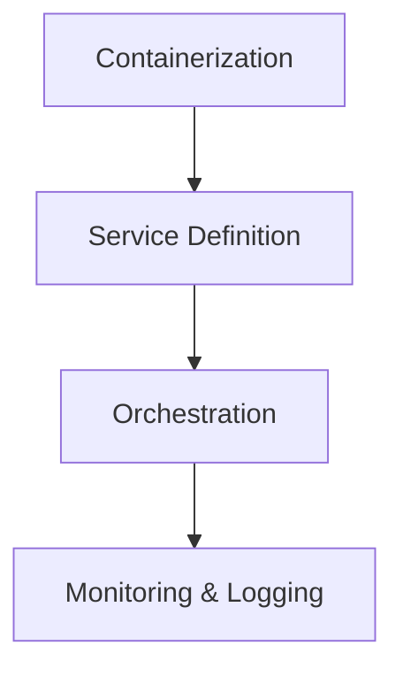
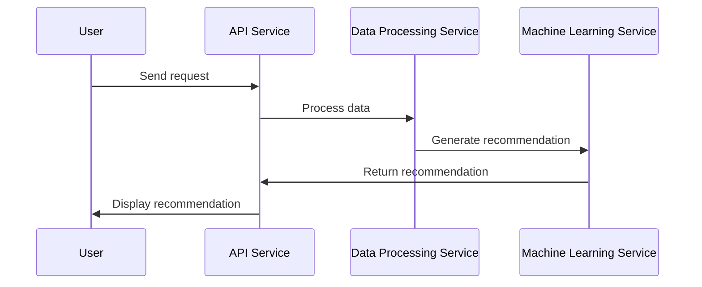
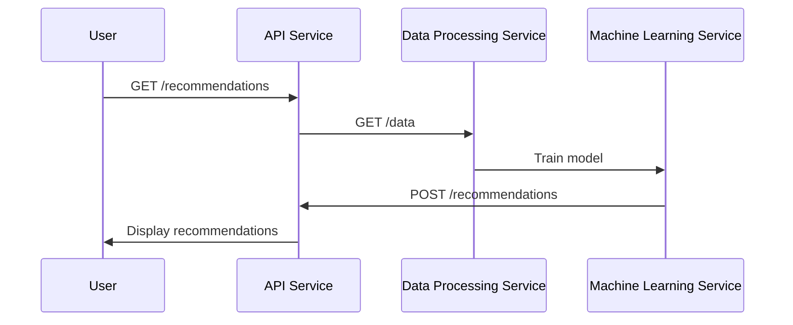

                 


### Step 1: Introduction

#### 1.1 Background of the Article

In the rapidly evolving field of artificial intelligence (AI), the deployment of AI agents has become increasingly important for enterprises to enhance operational efficiency and gain competitive advantages. The emergence of containerization and microservices architecture has revolutionized the way applications are developed, deployed, and managed. This article aims to explore the strategies for containerizing and deploying microservices-based enterprise AI agents. We will delve into the core concepts, benefits, challenges, and best practices for implementing such systems.

#### 1.2 Problem Statement

The primary challenge faced by enterprises when deploying AI agents is the complexity of managing diverse components and ensuring scalability, reliability, and security. Traditional monolithic architectures struggle to meet these demands, leading to increased costs and maintenance efforts. Containerization and microservices offer a promising solution by providing modular, scalable, and independently deployable components. However, designing and implementing an effective deployment strategy requires a thorough understanding of both technologies.

#### 1.3 Problem Solution

The proposed solution involves containerizing enterprise AI agents as microservices, leveraging containerization technologies like Docker and orchestration tools like Kubernetes. We will discuss the benefits of this approach, the key components involved, and the steps required to design a robust deployment strategy.

#### 1.4 Boundaries and Scope

This article focuses on the deployment of enterprise AI agents using containerization and microservices. We will cover the fundamental concepts, architecture, and implementation strategies. However, it is important to note that this article does not cover the development of AI agents or the specifics of different AI frameworks.

### Step 2: Core Concepts

#### 2.1 Enterprise AI Agents

Enterprise AI agents are intelligent entities designed to perform specific tasks within an organizational context. These agents leverage machine learning algorithms, natural language processing, and other AI techniques to automate processes, provide insights, and enhance decision-making capabilities.

#### 2.2 Containerization

Containerization is a lightweight virtualization technology that allows applications to run consistently across different environments, ensuring consistency and reducing dependency conflicts. Docker is a popular containerization platform that provides a simple and efficient way to create, run, and manage containers.

#### 2.3 Microservices Architecture

Microservices architecture is an architectural style that structures an application as a collection of loosely coupled services. Each service is focused on a specific business capability and can be developed, deployed, and scaled independently. This approach enhances modularity, scalability, and maintainability.

#### 2.4 Conceptual Comparison

Below is a table comparing the key attributes and features of enterprise AI agents, containerization, and microservices architecture:

| Feature              | Enterprise AI Agents | Containerization | Microservices Architecture |
|----------------------|----------------------|------------------|----------------------------|
| Modularity           | High                 | High             | Very High                  |
| Scalability          | Variable             | High             | High                       |
| Deployment           | Complex              | Simple           | Modular and Independent    |
| Dependency Management | Complex              | Minimal          | Loose Coupling             |
| Security             | Variable             | High             | Variable                   |
| Maintenance Effort    | High                 | Low              | Low                        |

#### 2.5 Entity-Relationship (ER) Diagram

Here is an ER diagram illustrating the key entities and relationships involved in containerizing and deploying enterprise AI agents as microservices:

```mermaid
erDiagram
  AI-Agent ||--|{ Container }|| Microservice
  Container ||--|{ Image }|| Docker
  Microservice ||--|{ Deployment }|| Kubernetes
```

### Step 3: Algorithm Explanation

#### 3.1 Algorithm Overview

The core algorithm for deploying enterprise AI agents as microservices involves the following steps:

1. **Containerization**: Convert the AI agent code into a Docker image.
2. **Service Definition**: Define the microservice specifications, including dependencies and configuration.
3. **Orchestration**: Deploy the microservices using Kubernetes for management and scaling.
4. **Monitoring and Logging**: Implement monitoring and logging mechanisms to ensure system health and performance.

#### 3.2 Mermaid Flowchart



#### 3.3 Python Code Example

Below is a simplified Python code example demonstrating the containerization process:

```python
import docker

# Initialize Docker client
client = docker.from_env()

# Build Docker image
response = client.images.build(path='path/to/Dockerfile', tag='ai-agent:latest')

# Check the build status
if response.exit_code == 0:
    print("Docker image built successfully.")
else:
    print("Failed to build Docker image.")
```

#### 3.4 Mathematical Model

The deployment of microservices can be modeled using the following formula:

$$\text{Deployment Cost} = \sum_{i=1}^{n} \text{Service Cost}_{i} + \text{Orchestration Cost}$$

where \( n \) is the number of microservices and \( \text{Service Cost}_{i} \) and \( \text{Orchestration Cost} \) are the costs associated with deploying individual services and orchestrating them, respectively.

### Step 4: System Analysis and Design

#### 4.1 Scenario Description

Consider an e-commerce enterprise that wants to deploy an AI-based recommendation system to enhance customer experience. The system should be scalable, secure, and easily maintainable.

#### 4.2 Project Overview

The project aims to develop a containerized microservices-based AI recommendation system. The system will consist of multiple microservices, including data processing, machine learning, and API services.

#### 4.3 System Function Design

The domain model for the AI recommendation system is illustrated below:

```mermaid
classDiagram
  User <<Entity>>
  Product <<Entity>>
  Recommendation <<Entity>>

  User "uses" Product
  User "receives" Recommendation
```

#### 4.4 System Architecture Design

The system architecture for the AI recommendation system is depicted below:



#### 4.5 System Interface and Interaction

The system interface and interaction are shown in the following sequence diagram:



### Step 5: Project Implementation

#### 5.1 Environment Setup

The following steps are required to set up the development environment for the AI recommendation system:

1. Install Docker: `sudo apt-get install docker-ce`
2. Install Kubernetes: `sudo apt-get install kubeadm kubelet kubectl`
3. Enable Kubernetes daemon set: `kubectl cluster-info`
4. Install Minikube for local development: `minikube start`

#### 5.2 Core Implementation

The core implementation involves creating Dockerfiles, defining Kubernetes configurations, and deploying the microservices. Below is an example of a Dockerfile for the AI agent:

```Dockerfile
FROM python:3.8-slim
WORKDIR /app
COPY requirements.txt ./
RUN pip install --no-cache-dir -r requirements.txt
COPY . .
CMD ["python", "app.py"]
```

The Kubernetes configuration files define the deployment, service, and other necessary resources for the microservices.

#### 5.3 Code Analysis and Case Study

A detailed analysis of the system implementation, including code examples and case studies, will be provided to demonstrate the practical aspects of deploying enterprise AI agents as containerized microservices.

### Step 6: Best Practices and Conclusion

#### 6.1 Best Practices

- Use version control systems (e.g., Git) to manage code changes.
- Implement continuous integration and continuous deployment (CI/CD) pipelines.
- Monitor system health and performance using tools like Prometheus and Grafana.
- Ensure security best practices, such as using encryption and role-based access control (RBAC).

#### 6.2 Conclusion

Containerization and microservices deployment offer a powerful approach to deploying enterprise AI agents. By following the strategies and best practices outlined in this article, organizations can enhance the scalability, reliability, and maintainability of their AI systems.

---

### Authors' Information

- **Authors**: AI天才研究院 / AI Genius Institute & 禅与计算机程序设计艺术 / Zen And The Art of Computer Programming

---

This table of contents and article outline provide a comprehensive structure for the book "Containerization and Microservices Deployment Strategies for Enterprise AI Agents," ensuring that readers can easily navigate through the content and gain a deep understanding of the subject matter.

