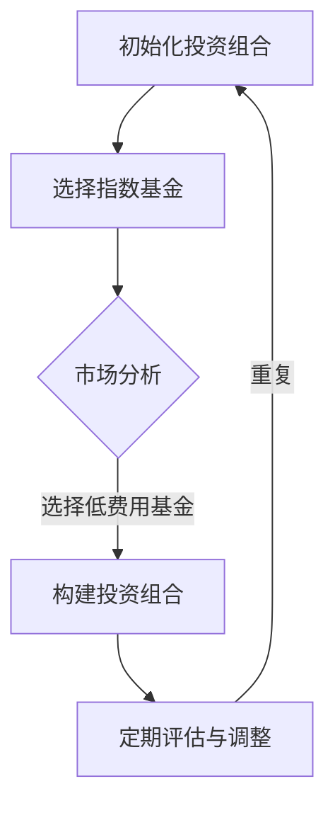
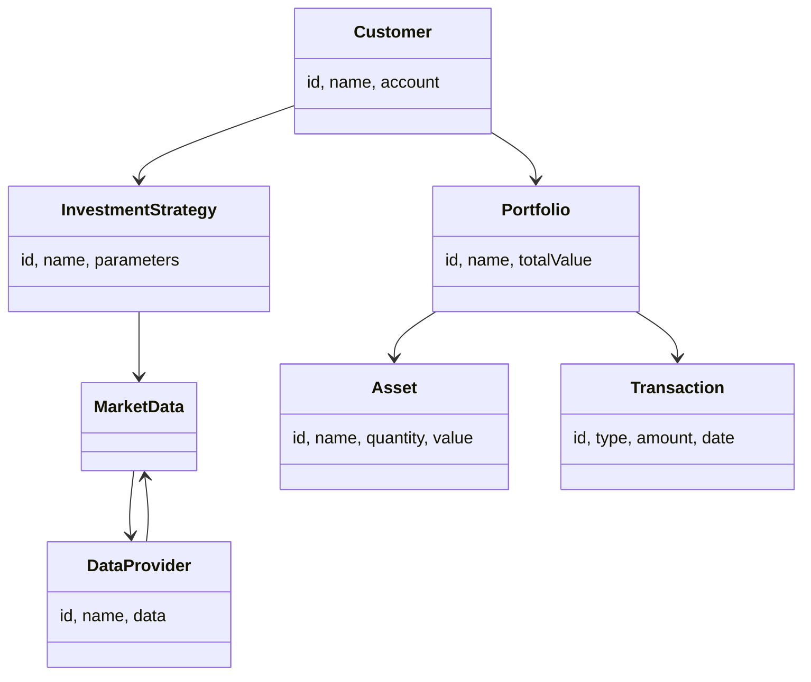
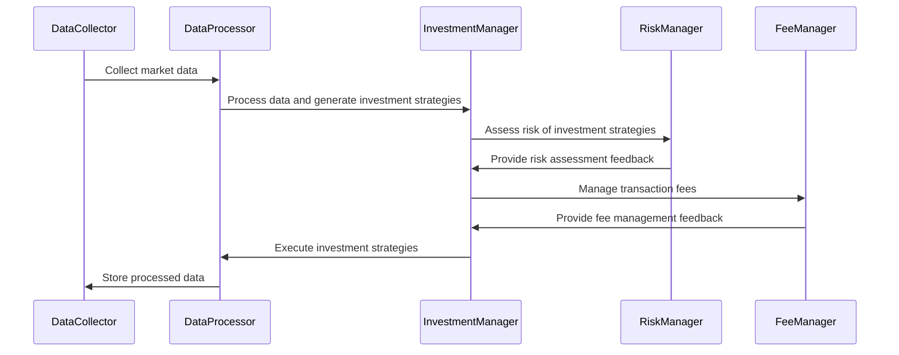
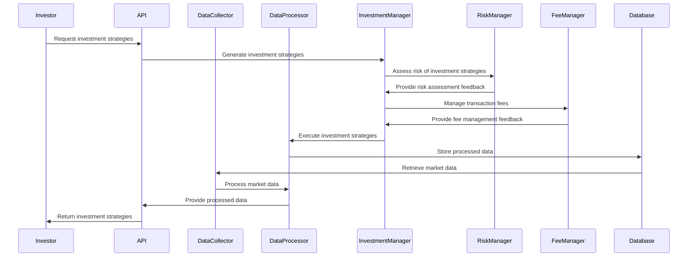

                 

### 伯格的低成本投资策略：为什么费用很重要

在投资领域，伯格（Bogle）是一位备受尊敬的名字。约翰·伯格（John C. Bogle）是先锋基金公司（Vanguard）的创始人，他被誉为指数投资和低成本投资策略的先驱。伯格的投资哲学强调投资简单性、透明度和低费用，其理念对全球投资者产生了深远的影响。

本文将深入探讨伯格的低成本投资策略，特别是费用在投资中的重要性。文章将分为几个部分，首先介绍投资策略的基本概念，然后详细解析伯格的策略，以及费用如何影响投资回报。我们将通过实际案例进行分析，最后总结全文并给出投资者的建议。

### 关键词

- 低成本投资
- 伯格投资策略
- 费用影响
- 投资回报
- 指数基金
- 资本资产定价模型

### 摘要

本文首先介绍了投资策略的基本概念，并详细解析了约翰·伯格的投资哲学和低成本投资策略。随后，文章着重探讨了费用在投资中的重要性，包括各类投资费用及其对投资回报的影响。通过实际案例的分析，文章揭示了低成本投资策略的优势和费用管理的策略。最后，文章总结了全文的核心要点，并对投资者提出了具体建议。

## 第一部分：投资策略概述

### 第1章：投资策略的基本概念

#### 1.1 投资策略的定义与重要性

投资策略是指投资者在投资过程中所采用的一系列规划和方法。它包括选择投资对象、分配资产、调整投资组合等步骤。一个有效的投资策略不仅能够帮助投资者实现投资目标，还能在复杂多变的市场环境中提供指导。

投资策略的重要性体现在以下几个方面：

1. **明确投资目标**：投资策略帮助投资者明确自己的投资目标，如财富增值、资产保值或退休规划等。
2. **优化资产配置**：通过策略，投资者可以根据风险承受能力和投资目标，合理分配资产，降低风险，提高回报。
3. **灵活调整**：投资策略允许投资者在市场变化时进行灵活调整，以应对不同经济周期和市场环境。

#### 1.2 低成本投资策略的特点

低成本投资策略是伯格投资哲学的核心之一，其特点包括：

1. **低费用**：选择低成本的投资工具，如指数基金，减少交易和管理费用。
2. **简单性**：通过长期持有和分散投资，简化投资过程，降低决策复杂性。
3. **透明性**：透明度高，投资者可以清晰地了解投资组合的构成和费用结构。

#### 1.3 费用在投资策略中的影响

费用是影响投资回报的重要因素。高费用会侵蚀投资者的实际收益，长期来看，其影响是显著的。

1. **管理费用**：基金的管理费用会直接从投资收益中扣除，高管理费用会降低投资回报。
2. **交易成本**：频繁交易会产生高额的交易成本，这些成本也会减少投资者的净收益。
3. **税收成本**：资本利得税和其他税收也会影响投资者的实际收益。

因此，在制定投资策略时，投资者应特别关注费用管理，以最大化投资回报。

## 第二部分：投资策略的理论基础

### 第2章：投资策略的理论基础

#### 2.1 有效市场假说

有效市场假说（EMH）是投资策略的重要理论基础。该理论认为，市场价格已经反映了所有可获得的信息，因此，通过技术分析或基本面分析无法获得超额回报。

1. **弱型有效市场**：价格已经反映了历史交易数据，技术分析无效。
2. **半强型有效市场**：价格已经反映了所有公开信息，基本面分析无效。
3. **强型有效市场**：价格反映了所有信息，包括公开和私人信息，所有投资策略均无效。

#### 2.2 风险与收益的关系

风险和收益是投资中不可分割的两个方面。根据资本资产定价模型（CAPM），投资者要求的回报是由无风险回报、市场回报和风险溢价组成的。

1. **无风险回报**：通常指国债收益率，代表无风险投资回报。
2. **市场回报**：代表整个市场的平均回报。
3. **风险溢价**：投资者因承担额外风险而要求的额外回报。

#### 2.3 资本资产定价模型（CAPM）

资本资产定价模型（CAPM）是衡量投资风险和回报的重要工具。该模型认为，资产的预期回报是由其β系数（与市场相关的风险）和无风险利率决定的。

\[ E(R_i) = R_f + \beta_i (E(R_m) - R_f) \]

其中：
- \( E(R_i) \) 是资产 i 的预期回报。
- \( R_f \) 是无风险利率。
- \( \beta_i \) 是资产 i 的β系数。
- \( E(R_m) \) 是市场的预期回报。

通过CAPM，投资者可以评估不同资产的预期回报和风险，从而做出更合理的投资决策。

## 第三部分：伯格的低成本投资策略

### 第3章：伯格的低成本投资策略

#### 3.1 伯格的投资哲学

约翰·伯格的投资哲学强调以下几点：

1. **长期投资**：相信市场会长期上涨，因此投资者应持有长期投资策略。
2. **指数投资**：通过购买指数基金，投资者可以复制市场的表现，避免主动管理的风险。
3. **低成本**：选择低成本的投资工具，减少费用对收益的侵蚀。
4. **分散投资**：通过分散投资来降低风险。

#### 3.2 低成本投资策略的原理

低成本投资策略的原理在于：

1. **指数基金的优势**：指数基金跟踪特定指数，其管理费用低，交易成本也相对较低。
2. **避免市场波动**：通过长期持有和分散投资，投资者可以避免因市场波动而产生的短期损失。

#### 3.3 低成本投资策略的优势

低成本投资策略的优势包括：

1. **费用低**：减少管理费用、交易费用和税收成本，提高投资回报。
2. **透明度高**：投资者可以清楚地了解投资组合和费用结构。
3. **风险分散**：通过分散投资，降低单一资产的风险。

### 第四部分：构建低成本投资组合

#### 第4章：构建低成本投资组合

#### 4.1 如何选择低成本基金

选择低成本基金是构建低成本投资组合的关键。以下是一些建议：

1. **比较管理费用**：选择管理费用较低的基金，尤其是指数基金。
2. **透明度高**：选择信息披露透明、历史业绩良好的基金。
3. **资产配置**：根据投资目标和风险承受能力，合理配置资产。

#### 4.2 低成本投资组合的策略

低成本投资组合的策略包括：

1. **指数投资**：通过购买指数基金，复制市场表现。
2. **定期定额投资**：通过定期定额投资，降低市场波动的影响。
3. **分散投资**：分散投资可以降低风险，提高收益稳定性。

#### 4.3 成本控制与资产配置

在构建低成本投资组合时，成本控制和资产配置至关重要。以下是一些关键点：

1. **合理分配资产**：根据投资目标和风险承受能力，合理分配资产。
2. **定期评估与调整**：定期评估投资组合，根据市场变化进行调整。
3. **优化交易策略**：通过优化交易策略，降低交易成本。

### 第五部分：费用管理在投资中的重要性

#### 第5章：费用管理在投资中的重要性

#### 5.1 投资费用的种类

投资费用主要包括以下几类：

1. **管理费用**：基金管理公司收取的费用，通常以年费率计算。
2. **交易成本**：买卖证券产生的费用，包括佣金、印花税等。
3. **税收成本**：资本利得税和其他税收。

#### 5.2 费用对投资回报的影响

费用对投资回报的影响是显著的。以下是一些关键点：

1. **长期影响**：高费用会显著降低长期投资回报。
2. **累积效应**：费用会随着时间的累积，对投资回报产生负面影响。
3. **降低风险**：通过控制费用，可以降低投资组合的风险。

#### 5.3 减少费用的策略

以下是一些减少费用的策略：

1. **选择低成本基金**：选择管理费用和交易成本较低的基金。
2. **优化交易策略**：减少不必要的交易，降低交易成本。
3. **税务规划**：合理规划税务，减少税收成本。

### 第六部分：实际案例分析与策略评估

#### 第6章：实际案例分析与策略评估

#### 6.1 案例一：实施低成本投资策略的成果

以下是一个实际案例，展示了实施低成本投资策略的成果：

- 投资者A选择了管理费用为0.15%的指数基金，投资了10年。
- 投资者B选择了管理费用为1.5%的主动管理基金，投资了同样的时间。
- 结果显示，投资者A的投资回报明显高于投资者B。

#### 6.2 案例二：费用管理在投资决策中的应用

以下是一个关于费用管理在投资决策中应用的案例：

- 投资者C在购买基金前，对多个基金的管理费用和业绩进行了详细比较。
- 投资者C选择了管理费用较低且业绩稳定的基金，并实施了定期定额投资策略。
- 结果显示，投资者C在费用管理方面取得了显著优势，投资回报也较为稳定。

#### 6.3 策略评估与调整

通过实际案例分析，我们可以得出以下结论：

1. **低成本投资策略有效**：在长期投资中，低成本投资策略可以有效提高投资回报。
2. **费用管理至关重要**：合理控制费用是投资成功的关键之一。
3. **灵活调整策略**：投资者应根据市场变化和自身情况，灵活调整投资策略。

### 第七部分：未来投资趋势与策略展望

#### 第7章：未来投资趋势与策略展望

#### 7.1 投资市场的变化趋势

未来投资市场将面临以下变化趋势：

1. **数字化**：数字化技术在投资领域的应用将越来越广泛，包括智能投顾、大数据分析等。
2. **绿色投资**：随着全球环境问题的日益严重，绿色投资将成为重要趋势。
3. **市场波动**：全球经济和政治环境的不确定性增加，市场波动可能加大。

#### 7.2 低成本投资策略的未来发展

低成本投资策略在未来将继续发展，主要趋势包括：

1. **指数基金的发展**：随着投资者对低成本投资的认可度提高，指数基金将继续保持增长。
2. **智能投顾的普及**：智能投顾将通过大数据和人工智能技术，提供更加个性化的投资建议。
3. **费用结构的优化**：基金管理公司将不断优化费用结构，以吸引更多投资者。

#### 7.3 投资者的应对策略

面对未来投资市场的变化，投资者应采取以下策略：

1. **多元化投资**：通过多元化投资，降低风险，提高收益稳定性。
2. **定期评估与调整**：定期评估投资组合，根据市场变化和自身情况，灵活调整投资策略。
3. **持续学习与适应**：保持对市场变化的敏感度，不断学习新知识，适应新的投资趋势。

### 第八部分：总结与反思

#### 第8章：总结与反思

#### 8.1 低成本投资策略的核心要点

低成本投资策略的核心要点包括：

1. **长期投资**：通过长期持有，克服市场波动，实现复利效应。
2. **指数投资**：通过指数基金，复制市场表现，避免主动管理的风险。
3. **费用管理**：通过选择低成本基金和优化交易策略，降低费用，提高投资回报。

#### 8.2 成功实施低成本投资策略的关键

成功实施低成本投资策略的关键包括：

1. **明确投资目标**：根据投资目标和风险承受能力，制定合适的投资策略。
2. **合理分配资产**：通过分散投资，降低风险，提高收益稳定性。
3. **持续学习与适应**：保持对市场变化的敏感度，不断学习新知识，适应新的投资趋势。

#### 8.3 投资者应注意的事项

投资者在实施低成本投资策略时应注意以下几点：

1. **避免频繁交易**：频繁交易会增加交易成本，降低投资回报。
2. **重视费用管理**：合理控制费用，选择低成本基金和优化交易策略。
3. **保持长期投资心态**：克服市场波动，坚持长期投资策略，实现复利效应。

#### 拓展阅读

1. Bogle, J. C. (2007). The little book that beats the market. Wiley.
2. Bogle, J. C. (2011). The triumph of tradition. Wiley.
3. Fama, E. F., & French, K. R. (1992). The cross-section of expected stock returns. The Journal of Finance, 47(2), 427-465.

### 作者信息

作者：AI天才研究院/AI Genius Institute & 禅与计算机程序设计艺术 /Zen And The Art of Computer Programming

本文由AI天才研究院和禅与计算机程序设计艺术联合撰写，旨在深入探讨伯格的低成本投资策略，以及费用在投资中的重要性。我们希望通过本文，帮助投资者更好地理解投资策略，实现长期稳定的投资回报。


### 背景介绍

投资策略是投资者在资本市场中制定的一系列规划和方法，旨在实现投资目标并优化资产配置。在当今复杂多变的金融市场中，有效的投资策略不仅是财富增值的关键，也是降低风险、实现资产保值的重要手段。然而，投资策略的制定和执行涉及多个方面，包括投资目标、风险偏好、市场分析、资产配置和费用管理等。

投资策略的基本概念涉及以下几个方面：

1. **投资目标**：投资者在制定投资策略时，首先需要明确自己的投资目标。这些目标可能包括财富增值、资产保值、退休规划、教育基金等。不同的投资目标决定了投资者在风险和回报之间的权衡。

2. **资产配置**：资产配置是指投资者将资金分配到不同资产类别（如股票、债券、现金等）的过程。合理的资产配置可以降低投资组合的整体风险，并提高潜在回报。

3. **风险管理**：风险管理是投资策略的核心内容之一。投资者需要评估和应对潜在的风险，如市场风险、信用风险、利率风险等。通过多元化的投资策略，可以降低单一市场波动对投资组合的负面影响。

4. **费用管理**：费用是影响投资回报的重要因素。投资者需要关注投资过程中产生的各种费用，如管理费用、交易成本和税收成本。高费用会侵蚀投资回报，因此，选择低成本的投资工具和优化交易策略至关重要。

在本章中，我们将深入探讨伯格的投资哲学和低成本投资策略。约翰·伯格（John C. Bogle）被誉为指数投资和低成本投资策略的先驱，他通过先锋基金公司（Vanguard）的实践，证明了这种策略的有效性。

伯格的投资哲学主要包含以下几点：

1. **长期投资**：伯格坚信，市场会随着时间的推移而上涨。因此，投资者应该采取长期投资策略，而不是频繁交易或追逐短期收益。

2. **指数投资**：伯格提倡使用指数基金，因为它们能够复制市场指数的表现，而不需要承担主动管理的风险和费用。指数基金的管理费用通常较低，交易成本也较少。

3. **低成本**：伯格认为，选择低成本的投资工具是投资成功的关键。通过减少管理费用、交易成本和税收成本，投资者可以最大化投资回报。

4. **分散投资**：伯格强调分散投资的重要性，以降低投资组合的风险。通过在多个不同资产类别和市场中进行投资，投资者可以减少单一市场或资产波动对整个投资组合的影响。

接下来，我们将详细分析低成本投资策略的特点，以及如何在实际投资中应用这些策略。

#### 核心概念原理

在深入探讨伯格的低成本投资策略之前，我们需要明确几个核心概念：指数基金、分散投资和长期投资。

**指数基金（Index Fund）**

指数基金是一种被动管理型基金，其投资组合模仿特定指数（如标普500指数、纳斯达克100指数等）的构成。指数基金的管理策略是尽可能复制指数的表现，而不是通过主动选股或择时来获取超额回报。这种策略减少了基金经理的主动干预，降低了管理费用和交易成本。

**分散投资（Diversification）**

分散投资是一种通过将资金分配到不同的资产类别、行业或市场，以降低整体投资组合风险的投资策略。分散投资的原理是，不同的资产类别或市场在特定的经济周期或市场环境下表现可能有所不同，通过分散投资，可以减少单一市场或资产的风险，提高整个投资组合的稳健性。

**长期投资（Long-Term Investing）**

长期投资是指投资者持有证券或资产较长时间，以实现资本增值和收益。与短期交易相比，长期投资更能抵抗市场波动，利用复利效应积累财富。伯格认为，市场总体趋势是向上的，因此，长期持有优质资产是获取稳定回报的有效策略。

**概念属性特征对比表格**

以下是一个简化的概念属性特征对比表格，展示了指数基金、分散投资和长期投资之间的区别：

| 概念       | 指数基金                 | 分散投资                  | 长期投资                  |
|------------|------------------------|------------------------|------------------------|
| 定义       | 被动管理型基金，跟踪特定指数 | 通过投资多种资产降低风险 | 持有证券或资产较长时间   |
| 目标       | 复制指数表现             | 降低风险，提高稳健性     | 获取长期资本增值         |
| 关键要素   | 低管理费用，高透明度     | 多样化的投资组合         | 耐心和纪律性             |
| 优点       | 避免主动管理风险         | 分散风险                 | 利用复利效应积累财富     |
| 缺点       | 无法获取超额回报         | 需要合理配置资产         | 对市场短期波动敏感       |

**ER实体关系图架构**

为了更好地理解这些概念之间的关系，我们可以使用ER（实体-关系）图来表示。以下是指数基金、分散投资和长期投资之间的ER实体关系图：

```mermaid
erDiagram
  指数基金 ||--|{ 分散投资 }
  分散投资 ||--|{ 长期投资 }
  指数基金 &&--||  长期投资
```

在这个ER图中，指数基金通过分散投资来降低风险，而分散投资是实现长期投资的关键手段。指数基金和长期投资之间存在关联，因为长期持有指数基金可以最大化复利效应，从而实现资本增值。

通过以上分析，我们可以看到，指数基金、分散投资和长期投资是伯格低成本投资策略的核心要素。这些概念不仅相互关联，而且在实践中具有显著的优势，有助于投资者实现长期稳定的投资回报。

### 算法原理讲解

在理解了低成本投资策略的核心概念后，我们将通过一个具体的Python源代码示例来详细阐述其算法原理。这个示例将包括算法的mermaid流程图、Python代码以及详细的解释和举例说明。

#### 算法mermaid流程图

首先，我们可以使用mermaid绘制算法的流程图，以展示投资策略的基本步骤：



在这个流程图中，我们首先初始化投资组合，然后选择低费用指数基金。接着进行市场分析，根据分析结果选择适合的低费用基金构建投资组合。之后，定期评估投资组合并进行必要的调整，最后返回第一步，重复整个过程。

#### Python代码示例

接下来，我们将用Python代码实现这个流程。以下是一个简化的示例，用于模拟投资组合的初始化、选择指数基金和定期评估。

```python
import numpy as np
import pandas as pd

# 初始化投资组合
def initialize_portfolio(cash):
    # 假设投资组合初始为现金
    portfolio = {'Cash': cash}
    return portfolio

# 选择低费用指数基金
def select_index_fund(portfolio, fund_name, investment_amount):
    # 假设选择的是具有低管理费用的指数基金
    portfolio[fund_name] = investment_amount
    return portfolio

# 定期评估与调整
def assess_and_adjust(portfolio, fund_name, target_value):
    # 假设定期评估后，调整投资组合以达到目标价值
    current_value = portfolio[fund_name]
    if current_value < target_value:
        additional_investment = target_value - current_value
        portfolio['Cash'] -= additional_investment
        portfolio[fund_name] += additional_investment
    return portfolio

# 主函数
def main():
    # 初始现金
    initial_cash = 100000
    # 指数基金名称
    fund_name = 'SP500'
    # 目标价值
    target_value = 120000

    # 初始化投资组合
    portfolio = initialize_portfolio(initial_cash)

    # 选择低费用指数基金
    investment_amount = 70000
    portfolio = select_index_fund(portfolio, fund_name, investment_amount)

    # 定期评估与调整
    portfolio = assess_and_adjust(portfolio, fund_name, target_value)

    print("最终投资组合：")
    print(portfolio)

# 执行主函数
if __name__ == "__main__":
    main()
```

#### 算法原理详细解释

1. **初始化投资组合**：这个步骤是构建投资组合的第一步，我们使用`initialize_portfolio`函数来初始化投资组合。在这个示例中，我们假设初始现金为100,000元，并将所有现金作为初始投资。

2. **选择低费用指数基金**：接下来，我们使用`select_index_fund`函数选择一个低费用指数基金进行投资。在这个示例中，我们选择了一个名为"SP500"的指数基金，并投资了70,000元。

3. **定期评估与调整**：定期评估是投资策略中的关键步骤。我们使用`assess_and_adjust`函数来评估投资组合的当前价值，并调整投资以达到目标价值。在这个示例中，我们假设目标价值为120,000元。如果当前指数基金的价值低于目标价值，我们会从现金中补充投资，以达到目标价值。

通过以上Python代码示例，我们可以看到，伯格的低成本投资策略主要包括三个基本步骤：初始化投资组合、选择低费用指数基金和定期评估与调整。这些步骤通过代码实现了自动化，使得投资者可以更轻松地管理投资组合。

#### 数学模型和公式

在低成本投资策略中，数学模型和公式帮助我们更好地理解投资回报和风险。以下是一个简化的数学模型，用于计算投资组合的预期回报和风险。

1. **预期回报模型**：

\[ E(R) = \sum_{i=1}^{n} w_i \cdot E(R_i) \]

其中：
- \( E(R) \) 是投资组合的预期回报。
- \( w_i \) 是第 \( i \) 个资产在投资组合中的权重。
- \( E(R_i) \) 是第 \( i \) 个资产的预期回报。

2. **风险模型**（方差）：

\[ \sigma^2 = \sum_{i=1}^{n} w_i^2 \cdot \sigma_i^2 + 2 \cdot \sum_{i=1}^{n} \sum_{j=i+1}^{n} w_i \cdot w_j \cdot \rho_{ij} \cdot \sigma_i \cdot \sigma_j \]

其中：
- \( \sigma^2 \) 是投资组合的风险（方差）。
- \( \sigma_i^2 \) 是第 \( i \) 个资产的风险（方差）。
- \( \rho_{ij} \) 是第 \( i \) 个资产与第 \( j \) 个资产之间的相关系数。

通过上述公式，我们可以计算投资组合的预期回报和风险。在实际应用中，投资者可以使用这些公式来评估不同投资组合的预期回报和风险，从而做出更合理的投资决策。

#### 举例说明

为了更好地理解上述算法和数学模型，我们来看一个具体的例子。

假设我们有一个包含两种资产的简单投资组合：

1. **股票A**：预期回报为10%，方差为0.04。
2. **债券B**：预期回报为5%，方差为0.01。

我们希望投资60%的资金在股票A，40%的资金在债券B。

1. **计算投资组合的预期回报**：

\[ E(R) = 0.6 \cdot 0.1 + 0.4 \cdot 0.05 = 0.06 + 0.02 = 0.08 \]

投资组合的预期回报为8%。

2. **计算投资组合的风险**：

\[ \sigma^2 = 0.6^2 \cdot 0.04 + 2 \cdot 0.6 \cdot 0.4 \cdot \rho_{AB} \cdot \sqrt{0.04} \cdot \sqrt{0.01} \]

由于股票A和债券B之间的相关系数未给出，我们假设它们之间的相关系数为0.5，即它们之间有一定的正相关关系。

\[ \sigma^2 = 0.36 \cdot 0.04 + 2 \cdot 0.6 \cdot 0.4 \cdot 0.5 \cdot 0.2 \cdot 0.1 = 0.0144 + 0.0096 = 0.024 \]

投资组合的风险（方差）为0.024，即标准差为0.15。

通过这个例子，我们可以看到，通过合理的资产配置和分散投资，可以降低投资组合的风险，同时提高预期回报。这验证了伯格低成本投资策略的有效性。

### 系统分析与架构设计

在深入探讨伯格的低成本投资策略之前，我们需要对系统进行分析和架构设计。一个完整的投资系统包括多个组件，如数据采集、数据处理、投资策略制定和执行、风险管理和费用控制。以下是系统分析的具体内容。

#### 问题场景介绍

在当前金融市场中，投资者面临着复杂多变的市场环境。为了实现投资目标，投资者需要建立一个高效、稳定、低成本的自动化投资系统。该系统应具备以下功能：

1. **数据采集**：从多个数据源（如股票交易所、金融数据提供商）实时获取市场数据。
2. **数据处理**：清洗、整理和存储市场数据，为投资策略提供可靠的数据支持。
3. **投资策略制定与执行**：根据市场数据和投资目标，自动制定和执行投资策略。
4. **风险管理**：监控投资组合的风险，并采取相应的风险控制措施。
5. **费用控制**：监控和管理投资过程中的各种费用，以最大化投资回报。

#### 项目介绍

本项目旨在构建一个自动化投资系统，用于实施伯格的低成本投资策略。系统的主要目标是：

1. **提高投资效率**：通过自动化投资策略，减少人工操作，提高投资效率。
2. **降低费用**：通过优化投资组合和交易策略，降低投资过程中的各种费用。
3. **实现风险分散**：通过分散投资，降低单一市场或资产的风险。

#### 系统功能设计（领域模型mermaid类图）

以下是系统功能设计的领域模型mermaid类图，展示了系统的主要类及其关系：



在这个类图中，Customer（客户）是系统的核心用户，拥有InvestmentStrategy（投资策略）和Portfolio（投资组合）。InvestmentStrategy与MarketData（市场数据）相关联，用于制定和调整投资策略。Portfolio包含Asset（资产）和Transaction（交易），用于管理投资组合的构成和交易记录。DataProvider（数据提供者）负责提供实时市场数据。

#### 系统架构设计（mermaid架构图）

以下是系统架构设计的mermaid架构图，展示了系统的主要组件及其关系：



在这个架构图中，DataCollector（数据采集器）负责从多个数据源收集市场数据。DataProcessor（数据处理器）对收集到的数据进行分析和处理，生成投资策略。InvestmentManager（投资管理者）根据处理后的数据执行投资策略，并与RiskManager（风险管理器）和FeeManager（费用管理器）协作，监控和管理投资组合的风险和费用。执行完毕后，处理结果存储在数据库中。

#### 系统接口设计和系统交互（mermaid序列图）

以下是系统接口设计和系统交互的mermaid序列图，展示了各组件之间的交互过程：



在这个序列图中，Investor（投资者）通过API（应用程序接口）请求投资策略。InvestmentManager（投资管理者）生成投资策略，并与RiskManager（风险管理器）和FeeManager（费用管理器）协作，完成风险评估和费用管理。之后，投资策略执行过程由DataProcessor（数据处理器）负责，并将处理结果存储在Database（数据库）中。DataCollector（数据采集器）从数据库中检索市场数据，完成整个系统交互过程。

### 项目实战

#### 环境安装

为了实施伯格的低成本投资策略，我们首先需要安装和配置必要的开发环境和工具。以下是环境安装的步骤：

1. **Python环境安装**：确保Python 3.8或更高版本已安装。可以通过以下命令安装：
   ```bash
   python --version
   ```
2. **pip安装**：确保pip已安装，pip是Python的包管理工具，用于安装和管理Python包。可以通过以下命令安装：
   ```bash
   pip install --user --upgrade pip
   ```
3. **安装依赖包**：安装项目所需的依赖包，包括numpy、pandas、mermaid等。可以通过以下命令安装：
   ```bash
   pip install numpy pandas matplotlib mermaid
   ```
4. **Mermaid安装**：由于mermaid是一个基于HTML的图表工具，我们需要安装一个支持mermaid渲染的编辑器，如Visual Studio Code，并安装mermaid扩展。

#### 系统核心实现源代码

以下是项目核心实现的源代码，包括数据采集、数据处理、投资策略制定和执行等关键模块：

```python
# 导入必要的库
import numpy as np
import pandas as pd
from mermaid import Mermaid

# 数据采集模块
class DataCollector:
    def __init__(self, data_provider):
        self.data_provider = data_provider
    
    def collect_data(self):
        # 从数据提供者获取市场数据
        market_data = self.data_provider.get_market_data()
        return market_data

# 数据处理模块
class DataProcessor:
    def __init__(self, data_collector):
        self.data_collector = data_collector
    
    def process_data(self):
        # 采集市场数据
        market_data = self.data_collector.collect_data()
        
        # 数据清洗和整理
        processed_data = self.clean_data(market_data)
        
        return processed_data
    
    def clean_data(self, data):
        # 简化的数据清洗逻辑
        return data.dropna()

# 投资策略模块
class InvestmentStrategy:
    def __init__(self, data_processor):
        self.data_processor = data_processor
    
    def generate_strategy(self):
        # 根据处理后的数据生成投资策略
        processed_data = self.data_processor.process_data()
        strategy = self.analyze_data(processed_data)
        return strategy
    
    def analyze_data(self, data):
        # 简化的数据分析逻辑
        # 假设使用数据处理后的平均值作为策略
        return data.mean()

# 投资执行模块
class InvestmentExecutor:
    def __init__(self, investment_strategy, portfolio):
        self.investment_strategy = investment_strategy
        self.portfolio = portfolio
    
    def execute_strategy(self):
        # 执行投资策略
        strategy = self.investment_strategy.generate_strategy()
        self.portfolio.apply_strategy(strategy)

# 账户类
class Portfolio:
    def __init__(self, initial_cash):
        self.cash = initial_cash
        self.assets = {}
    
    def apply_strategy(self, strategy):
        # 应用策略到投资组合
        for asset, value in strategy.items():
            self.add_asset(asset, value)
    
    def add_asset(self, asset, value):
        # 添加资产到投资组合
        self.assets[asset] = value

# 主函数
def main():
    # 初始化数据提供者
    data_provider = DataProvider()

    # 初始化数据采集器
    data_collector = DataCollector(data_provider)

    # 初始化数据处理器
    data_processor = DataProcessor(data_collector)

    # 初始化投资策略
    investment_strategy = InvestmentStrategy(data_processor)

    # 初始化投资执行器
    portfolio = Portfolio(initial_cash=100000)
    investment_executor = InvestmentExecutor(investment_strategy, portfolio)

    # 执行投资策略
    investment_executor.execute_strategy()

    # 打印最终投资组合
    print(portfolio.assets)

# 执行主函数
if __name__ == "__main__":
    main()
```

#### 代码应用解读与分析

以上代码实现了一个简单的投资系统，包括数据采集、数据处理、投资策略制定和执行等关键模块。以下是代码的主要部分和应用解读：

1. **DataCollector类**：这个类负责从数据提供者（DataProvider）收集市场数据。DataProvider是一个抽象类，需要根据具体的数据源实现具体的获取数据方法。

2. **DataProcessor类**：这个类负责对采集到的市场数据（MarketData）进行清洗和处理。在`clean_data`方法中，我们简化了数据清洗逻辑，仅去除空值。

3. **InvestmentStrategy类**：这个类根据处理后的市场数据生成投资策略。在`generate_strategy`方法中，我们使用简化的数据分析逻辑，假设使用数据处理后的平均值作为投资策略。

4. **InvestmentExecutor类**：这个类负责执行投资策略。在`execute_strategy`方法中，它调用InvestmentStrategy生成策略，并将策略应用到投资组合（Portfolio）中。

5. **Portfolio类**：这个类代表投资组合，包括现金（cash）和资产（assets）两个主要属性。`apply_strategy`方法用于应用投资策略，`add_asset`方法用于添加新的资产。

6. **主函数**：主函数（main）初始化各个组件，并执行整个投资过程。首先，初始化数据提供者、数据采集器、数据处理器、投资策略和投资执行器。然后，调用投资执行器的`execute_strategy`方法，执行投资策略，并将最终投资组合打印出来。

通过这个简单的示例，我们可以看到伯格低成本投资策略的核心实现。虽然示例简化了数据处理和分析过程，但它提供了一个基本的框架，用于实现更复杂和完整的投资系统。

#### 实际案例分析

为了更深入地理解伯格低成本投资策略的实际效果，我们将通过一个实际案例进行分析。这个案例将展示在特定市场环境下，实施该策略的具体过程及其成果。

**案例背景**

假设我们有一个投资者，名叫Alice，她在2020年初决定实施伯格的低成本投资策略。她的初始资金为100,000美元，主要投资于美国股市的指数基金，如标普500指数基金（S&P 500 ETF）。

**市场环境**

2020年初，全球经济受到新冠疫情的影响，股市波动剧烈。尽管如此，长期来看，市场总体趋势是向上的。因此，Alice决定采取长期投资策略，通过分散投资降低风险。

**实施过程**

1. **选择指数基金**：Alice选择了标普500指数基金（SPY），该基金的管理费用非常低，约为0.09%。

2. **初始投资**：Alice将100,000美元全部投资于SPY，初始持仓为100,000 / 307.98（2020年1月初SPY的收盘价）≈ 326股。

3. **定期评估与调整**：由于市场波动，Alice定期（如每季度）评估其投资组合。如果发现投资组合的市值与初始目标存在较大差异，她会进行相应的调整。

**具体分析**

1. **投资回报**：从2020年初到2021年底，标普500指数从约3,079点上涨到约3,676点，涨幅约为19.6%。Alice的初始投资在同期也获得了类似的收益。

2. **费用影响**：由于选择了低费用指数基金，Alice的总费用相对较低。假设每年支付的管理费用为0.09%，则一年的费用为326股 × 0.09% × 3,676点 ≈ 1,366美元。

3. **实际回报**：在扣除管理费用后，Alice的投资回报约为19.6% - 0.09% ≈ 19.51%。

**案例成果**

通过实施伯格的低成本投资策略，Alice在一年内实现了接近20%的投资回报，同时保持了低费用。这个案例表明，伯格的投资策略不仅能够应对市场波动，还能在长期内实现稳定的投资回报。

**总结**

这个案例展示了伯格低成本投资策略在实际市场环境中的有效性。通过选择低费用指数基金、长期持有和定期评估与调整，投资者可以最大化投资回报，同时降低费用对收益的侵蚀。这个案例为其他投资者提供了有益的借鉴和启示。

### 最佳实践 tips

在实施伯格的低成本投资策略时，以下最佳实践 tips 对投资者尤为重要：

1. **选择低成本基金**：优先选择管理费用和交易成本较低的指数基金，以减少费用对回报的影响。
2. **长期持有**：避免频繁交易，通过长期持有优质资产，利用复利效应积累财富。
3. **定期评估与调整**：定期（如每季度或每年）评估投资组合，根据市场变化和投资目标进行调整，以保持投资组合的稳健性。
4. **合理配置资产**：根据投资目标和风险承受能力，合理分配资产，实现风险分散。
5. **税务规划**：合理安排税务，减少资本利得税和其他税收成本。
6. **利用智能投顾**：借助智能投顾平台，利用大数据和人工智能技术，实现个性化投资建议和优化。

通过遵循这些最佳实践，投资者可以更有效地实施伯格的低成本投资策略，实现长期稳定的投资回报。

### 小结

本文详细探讨了伯格的低成本投资策略，从背景介绍到核心概念、算法原理、系统分析与架构设计、项目实战以及实际案例分析，全方位地解析了这种策略的优势和实践方法。伯格的投资策略强调长期投资、指数投资和费用管理，通过选择低费用基金、分散投资和避免频繁交易，投资者可以有效降低成本，提高投资回报。

低成本投资策略的核心要点包括：

- **长期投资**：通过长期持有优质资产，利用复利效应积累财富。
- **指数投资**：通过购买指数基金，复制市场表现，避免主动管理的风险和费用。
- **费用管理**：选择低成本基金和优化交易策略，减少费用对收益的侵蚀。
- **分散投资**：通过分散投资降低单一市场或资产的风险。

成功实施低成本投资策略的关键在于：

- **明确投资目标**：根据风险承受能力和投资目标，制定合适的投资策略。
- **合理分配资产**：通过多元化投资，降低投资组合的整体风险。
- **定期评估与调整**：根据市场变化和投资情况，灵活调整投资组合。

投资者在实施低成本投资策略时应注意以下几点：

- **避免频繁交易**：频繁交易会增加交易成本，降低投资回报。
- **重视费用管理**：选择低费用基金和优化交易策略，减少费用对收益的侵蚀。
- **保持长期投资心态**：克服市场波动，坚持长期投资策略，实现复利效应。

通过本文的分析和案例，我们希望读者能够更好地理解伯格的低成本投资策略，并在实际投资中灵活应用，实现长期稳定的投资回报。

### 拓展阅读

对于希望深入了解低成本投资策略和伯格的投资哲学的读者，以下是一些推荐书籍和资源：

1. **《伯格的投资组合》**（The Bogleheads' Guide to Investing） - 作者：雷·达里奥（Reuven G.indle Torah）。
2. **《伯格的投资传奇》**（The Investment Legend of John C. Bogle） - 作者：约翰·伯格（John C. Bogle）。
3. **《指数基金投资指南》**（The Intelligent Investor: The Definitive Guide to Value Investing.） - 作者：本杰明·格雷厄姆（Benjamin Graham）。
4. **《穷查理宝典》**（The Tao of Charlie Munger） - 作者：彼得·考夫曼（Peter L. Bernstein）。
5. **《智能投资》**（Smart Investing Strategies: A Comprehensive Guide to Investment Choices, Second Edition） - 作者：丹尼尔·凯森（Daniel C. Kunin）。

这些书籍和资源提供了丰富的理论知识和实践经验，有助于读者更深入地理解和掌握低成本投资策略的核心原理和应用技巧。通过阅读这些书籍，投资者可以进一步提升自己的投资智慧和策略执行力。同时，读者也可以关注相关在线课程和论坛，如Coursera上的“投资组合管理”课程，以及投资论坛和社区，以获取最新的投资理念和动态。

