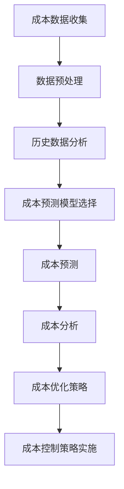
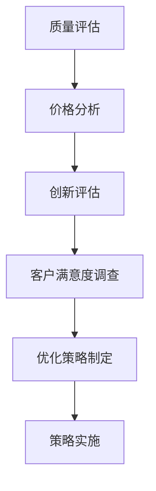
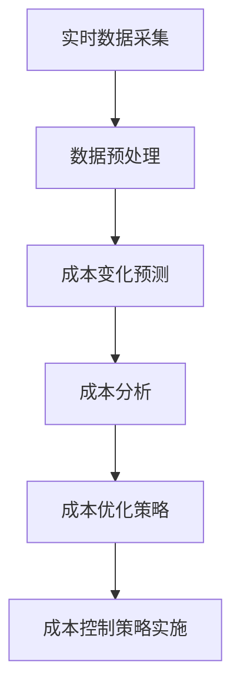

                 

# 伯格的成本控制理念：在零佣金时代的新思考

## 关键词：成本控制、零佣金时代、价值创造、信息对称、动态成本管理

## 摘要：
随着零佣金时代的到来，市场竞争日趋激烈，传统的成本控制方法已难以满足企业需求。本文基于伯格的成本控制理念，探讨了在零佣金时代下企业如何实现有效的成本控制，以降低成本、提高竞争力。文章从问题背景、核心概念、联系、算法原理、系统分析与架构设计、项目实战等多个方面进行了深入分析，为企业提供了全新的成本控制思路。

## 第1章：背景介绍

### 1.1 问题背景

随着信息技术的飞速发展，企业面临的经营环境日益复杂。在零佣金时代，市场竞争愈发激烈，企业利润空间被进一步压缩。在这种背景下，如何通过有效的成本控制来降低成本、提高竞争力，已成为企业关注的核心问题。传统的成本控制方法，如预算控制、标准成本控制等，虽然在一定程度上能够降低成本，但在信息不对称、成本中心划分不合理等方面存在诸多局限性，难以应对日益复杂的商业环境。

### 1.2 问题描述

零佣金时代的到来，使得企业间的竞争加剧，利润空间被压缩。在此背景下，企业需要通过有效的成本控制来降低成本、提高竞争力。然而，传统成本控制方法存在以下问题：

1. **信息不对称**：企业内部各部门之间信息不对称，导致成本控制效率低下。
2. **成本中心划分不合理**：传统成本中心划分方法难以满足企业实际需求，导致成本控制与业务发展不匹配。
3. **成本管理滞后**：传统成本管理方法难以适应市场变化，导致成本控制效果不佳。

### 1.3 问题解决

伯格的成本控制理念以价值创造为核心，旨在通过以下方式解决上述问题：

1. **信息对称**：建立透明、共享的成本信息平台，确保企业内部各部门之间信息对称，提高成本控制效率。
2. **成本中心合理划分**：根据业务需求和资源配置，合理划分成本中心，确保成本控制与业务发展相匹配。
3. **动态成本管理**：采用动态成本管理方法，实时监控成本变化，及时调整成本控制策略，以适应市场变化。
4. **价值创造导向**：将成本控制与价值创造相结合，通过降低成本来提升企业整体价值。

### 1.4 边界与外延

伯格的成本控制理念适用于各类企业，包括制造业、服务业、金融业等。在应用过程中，企业需结合自身实际情况进行调整和优化，以实现最佳成本控制效果。

### 1.5 概念结构与核心要素组成

1. **核心概念**：成本控制、价值创造、信息对称、成本中心、动态成本管理。
2. **概念属性特征对比表格**

| 概念     | 属性特征                 | 说明                                                         |
|----------|-------------------------|------------------------------------------------------------|
| 成本控制 | 降低成本、提高效益     | 通过优化资源配置、提高生产效率等手段，实现成本降低。       |
| 价值创造 | 增加企业整体价值       | 通过成本控制，提高企业利润和市场份额，实现价值增长。       |
| 信息对称 | 企业内部信息共享       | 通过信息化手段，确保各部门之间信息透明、实时更新。         |
| 成本中心 | 负责成本控制的组织单元 | 根据业务需求和资源配置，合理划分成本中心。               |
| 动态成本管理 | 实时监控、动态调整     | 通过实时数据监控，及时调整成本控制策略，以适应市场变化。 |

### 1.6 本章小结

本章介绍了伯格的成本控制理念的背景、问题描述、问题解决、边界与外延以及概念结构与核心要素组成。通过本章的学习，读者可以初步了解伯格的成本控制理念的基本内容和应用场景。

## 第2章：核心概念与联系

### 2.1 成本控制原理

#### 2.1.1 成本控制的定义

成本控制是指企业在生产和经营过程中，通过科学的方法和手段，对各项成本进行监控、分析和控制，以达到降低成本、提高效益的目的。

#### 2.1.2 成本控制的核心要素

成本控制的核心要素包括成本意识、成本计划和成本执行。

1. **成本意识**：成本意识是成本控制的基础，企业员工应具备成本控制的理念，自觉遵循成本控制的原则。
2. **成本计划**：成本计划是成本控制的指导，企业应根据市场情况和生产需求，制定合理的成本计划。
3. **成本执行**：成本执行是成本控制的具体实施，企业应严格按照成本计划执行，确保成本控制效果。

#### 2.1.3 成本控制的方法和工具

成本控制的方法和工具包括预算控制、标准成本控制、目标成本控制等。

1. **预算控制**：通过制定预算，对成本进行事前控制，确保企业在成本预算范围内进行生产和经营。
2. **标准成本控制**：通过制定标准成本，对成本进行事中控制，确保实际成本不超过标准成本。
3. **目标成本控制**：通过设定目标成本，对成本进行事后控制，评估成本控制效果，为下一阶段成本控制提供参考。

### 2.2 价值创造原理

#### 2.2.1 价值创造的内涵

价值创造是指企业在生产经营过程中，通过提供产品和服务，满足客户需求，从而实现企业价值的增长。

#### 2.2.2 价值创造的核心要素

价值创造的核心要素包括产品或服务的质量、价格、创新、客户满意度等。

1. **质量**：高质量的产品或服务可以提升客户满意度，增强企业竞争力。
2. **价格**：合理的价格可以提高市场竞争力，增加市场份额。
3. **创新**：创新可以推动企业持续发展，提升企业价值。
4. **客户满意度**：客户满意度可以提升客户忠诚度，为企业带来持续的业务增长。

#### 2.2.3 价值创造的路径和策略

价值创造的路径和策略包括优化产品和服务质量、降低成本、提高效率和创新能力等。

1. **优化产品和服务质量**：通过改进生产技术、提高产品品质，提升客户满意度。
2. **降低成本**：通过成本控制，降低生产成本，提高产品竞争力。
3. **提高效率**：通过改进生产流程、提高生产效率，降低成本，提高企业价值。
4. **创新能力**：通过研发新技术、新产品，推动企业持续发展，实现价值创造。

### 2.3 信息对称原理

#### 2.3.1 信息对称的定义

信息对称是指企业内部各部门之间信息透明、实时更新，确保各部门在成本控制过程中能够准确了解相关信息。

#### 2.3.2 信息对称的核心要素

信息对称的核心要素包括信息化手段、数据共享和实时更新。

1. **信息化手段**：通过建立企业信息化系统，实现各部门之间信息的实时传输和共享。
2. **数据共享**：各部门之间共享成本信息，确保信息透明。
3. **实时更新**：通过实时数据采集和更新，确保各部门能够及时了解成本变化情况。

#### 2.3.3 信息对称的实现方法

1. **建立成本信息平台**：通过建立统一的成本信息平台，实现各部门之间的信息共享。
2. **数据整合**：将各部门的成本数据整合到统一平台，确保数据准确、完整。
3. **实时监控**：通过实时监控成本数据，确保成本控制过程中信息透明、实时更新。

### 2.4 成本中心合理划分原理

#### 2.4.1 成本中心的定义

成本中心是指负责成本控制的组织单元，其划分依据包括业务需求和资源配置等。

#### 2.4.2 成本中心的划分依据

1. **业务需求**：根据企业业务需求，将相关业务模块划分为不同的成本中心，确保成本控制与业务发展相匹配。
2. **资源配置**：根据企业资源配置情况，合理划分成本中心，确保成本控制与资源配置相匹配。

#### 2.4.3 成本中心的划分原则

1. **科学合理**：根据业务需求和资源配置，科学合理地划分成本中心。
2. **责任明确**：明确各成本中心的职责，确保成本控制工作有序进行。
3. **灵活调整**：根据市场变化和企业发展需要，灵活调整成本中心划分。

### 2.5 动态成本管理原理

#### 2.5.1 动态成本管理的定义

动态成本管理是指通过实时监控成本变化，及时调整成本控制策略，以适应市场变化的管理方法。

#### 2.5.2 动态成本管理的核心要素

动态成本管理的核心要素包括实时监控、动态调整和风险评估。

1. **实时监控**：通过实时数据采集和监控，了解成本变化情况。
2. **动态调整**：根据成本变化情况，及时调整成本控制策略。
3. **风险评估**：对成本变化进行风险评估，确保成本控制策略的科学性和有效性。

#### 2.5.3 动态成本管理的实现方法

1. **建立成本监控体系**：通过建立成本监控体系，实时监控成本变化。
2. **制定动态调整策略**：根据成本变化情况，制定动态调整策略。
3. **进行风险评估**：对成本变化进行风险评估，确保成本控制策略的科学性和有效性。

### 2.6 价值创造导向原理

#### 2.6.1 价值创造导向的定义

价值创造导向是指将成本控制与价值创造相结合，通过降低成本来提升企业整体价值。

#### 2.6.2 价值创造导向的核心要素

价值创造导向的核心要素包括成本控制、价值创造和资源配置。

1. **成本控制**：通过成本控制，降低生产成本，提高产品竞争力。
2. **价值创造**：通过价值创造，提升企业整体价值。
3. **资源配置**：通过优化资源配置，实现成本控制和价值创造的协调统一。

#### 2.6.3 价值创造导向的实现方法

1. **制定价值创造战略**：明确企业价值创造目标，制定相应的成本控制策略。
2. **优化资源配置**：通过优化资源配置，实现成本控制和价值创造的协调统一。
3. **建立价值创造评价体系**：通过建立价值创造评价体系，对成本控制效果和价值创造情况进行评估。

### 2.7 本章小结

本章介绍了成本控制、价值创造、信息对称、成本中心合理划分、动态成本管理和价值创造导向等核心概念与联系。通过本章的学习，读者可以深入理解这些核心概念，为后续章节的学习打下基础。在接下来的章节中，我们将进一步探讨这些概念在实际应用中的实现方法和策略。

## 第3章：算法原理讲解

### 3.1 成本控制算法原理

#### 3.1.1 成本控制算法的定义

成本控制算法是指通过数学模型和算法，对企业成本进行监控、分析和控制的一种方法。它主要包括预算控制算法、标准成本控制算法和目标成本控制算法等。

#### 3.1.2 成本控制算法的核心要素

成本控制算法的核心要素包括成本预测、成本分析和成本优化。

1. **成本预测**：通过历史数据和趋势分析，预测未来成本变化情况。
2. **成本分析**：对成本进行分类、拆解和分析，找出成本控制的关键因素。
3. **成本优化**：根据成本分析结果，调整成本结构，优化成本控制策略。

#### 3.1.3 成本控制算法的实现方法

1. **历史数据分析**：通过收集和分析历史成本数据，找出成本变化的规律和趋势。
2. **趋势预测**：利用时间序列分析方法，预测未来成本变化情况。
3. **成本优化**：根据成本预测和成本分析结果，制定和调整成本控制策略。

#### 3.1.4 成本控制算法的mermaid流程图



### 3.2 价值创造算法原理

#### 3.2.1 价值创造算法的定义

价值创造算法是指通过数学模型和算法，对企业价值创造过程进行监控、分析和优化的方法。它主要包括质量优化算法、价格优化算法、创新优化算法和客户满意度优化算法等。

#### 3.2.2 价值创造算法的核心要素

价值创造算法的核心要素包括质量优化、价格优化、创新优化和客户满意度优化。

1. **质量优化**：通过优化产品或服务质量，提升客户满意度。
2. **价格优化**：通过优化产品或服务价格，提高市场竞争力。
3. **创新优化**：通过优化创新策略，推动企业持续发展。
4. **客户满意度优化**：通过优化客户服务，提升客户满意度。

#### 3.2.3 价值创造算法的实现方法

1. **质量优化**：通过质量评估模型，对产品或服务质量进行评估和优化。
2. **价格优化**：通过市场调研和价格分析，制定合理的价格策略。
3. **创新优化**：通过创新评估模型，对创新项目进行评估和优化。
4. **客户满意度优化**：通过客户满意度调查和数据分析，制定和调整客户服务策略。

#### 3.2.4 价值创造算法的mermaid流程图



### 3.3 动态成本管理算法原理

#### 3.3.1 动态成本管理算法的定义

动态成本管理算法是指通过数学模型和算法，对企业成本进行实时监控、分析和优化的方法。它主要包括实时数据采集算法、成本变化预测算法和成本优化算法等。

#### 3.3.2 动态成本管理算法的核心要素

动态成本管理算法的核心要素包括实时数据采集、成本变化预测和成本优化。

1. **实时数据采集**：通过实时数据采集系统，收集企业各项成本数据。
2. **成本变化预测**：通过时间序列分析等方法，预测未来成本变化趋势。
3. **成本优化**：根据成本变化预测和成本分析结果，调整成本控制策略。

#### 3.3.3 动态成本管理算法的实现方法

1. **实时数据采集**：通过传感器、数据采集器和互联网等技术，实现对企业各项成本数据的实时采集。
2. **成本变化预测**：利用时间序列分析方法，预测未来成本变化趋势。
3. **成本优化**：根据成本变化预测和成本分析结果，制定和调整成本控制策略。

#### 3.3.4 动态成本管理算法的mermaid流程图



### 3.4 本章小结

本章介绍了成本控制、价值创造和动态成本管理算法的原理。通过本章的学习，读者可以了解这些算法的基本概念、核心要素和实现方法，为后续章节的学习和实践打下基础。在接下来的章节中，我们将进一步探讨这些算法在实际应用中的实现和优化策略。

## 第4章：系统分析与架构设计

### 4.1 问题场景介绍

在零佣金时代，企业面临着激烈的竞争和利润空间的压缩，如何实现有效的成本控制成为企业生存和发展的关键。为了解决这一问题，企业需要建立一个完善的成本控制系统，实现成本信息的实时监控和动态管理。

### 4.2 项目介绍

本项目的目标是构建一个基于伯格成本控制理念的智能成本管理系统，通过信息化手段，实现企业成本信息的透明化和实时监控，提高成本控制效率，为企业提供科学决策依据。

### 4.3 系统功能设计

系统功能设计主要包括以下几个方面：

1. **成本数据采集**：通过传感器、数据采集器等设备，实时收集企业各项成本数据。
2. **成本数据分析**：对采集到的成本数据进行分类、拆解和分析，找出成本控制的关键因素。
3. **成本预测**：利用时间序列分析等方法，预测未来成本变化趋势。
4. **成本优化**：根据成本预测和成本分析结果，制定和调整成本控制策略。
5. **成本控制策略实施**：根据成本优化结果，实施相应的成本控制策略。
6. **成本控制效果评估**：对成本控制效果进行评估，为后续成本控制提供参考。

### 4.4 系统架构设计

系统架构设计主要包括以下几个方面：

1. **数据采集层**：负责实时收集企业各项成本数据，包括原材料成本、人工成本、制造费用等。
2. **数据处理层**：负责对采集到的成本数据进行预处理、分类、拆解和分析，为成本预测和成本优化提供数据支持。
3. **成本预测层**：利用时间序列分析等方法，预测未来成本变化趋势，为成本优化提供依据。
4. **成本优化层**：根据成本预测和成本分析结果，制定和调整成本控制策略。
5. **成本控制策略实施层**：根据成本优化结果，实施相应的成本控制策略。
6. **成本控制效果评估层**：对成本控制效果进行评估，为后续成本控制提供参考。

### 4.5 系统接口设计

系统接口设计主要包括以下几个方面：

1. **数据采集接口**：负责与传感器、数据采集器等设备进行通信，实现成本数据的实时采集。
2. **数据处理接口**：负责对采集到的成本数据进行预处理、分类、拆解和分析。
3. **成本预测接口**：负责根据成本数据进行成本预测，为成本优化提供依据。
4. **成本优化接口**：负责根据成本预测和成本分析结果，制定和调整成本控制策略。
5. **成本控制策略实施接口**：负责根据成本优化结果，实施相应的成本控制策略。
6. **成本控制效果评估接口**：负责对成本控制效果进行评估，为后续成本控制提供参考。

### 4.6 系统交互设计

系统交互设计主要包括以下几个方面：

1. **数据交互**：系统各模块之间通过数据交互，实现成本数据的实时传递和共享。
2. **指令交互**：系统根据成本预测和成本优化结果，向各成本控制策略实施模块发送指令，实现成本控制策略的实施。
3. **反馈交互**：系统根据成本控制效果评估结果，调整成本控制策略，实现系统自优化。

### 4.7 本章小结

本章介绍了系统分析与架构设计的相关内容，包括问题场景介绍、项目介绍、系统功能设计、系统架构设计、系统接口设计和系统交互设计。通过本章的学习，读者可以了解系统设计与实现的基本方法和流程，为后续章节的实践和优化提供参考。

## 第5章：项目实战

### 5.1 环境安装

在开始项目实战之前，首先需要安装必要的软件和工具。以下是在Windows环境下安装所需软件和工具的步骤：

1. **安装Python**：访问Python官方网站（https://www.python.org/）下载并安装Python，建议安装最新版本。
2. **安装PyCharm**：访问PyCharm官方网站（https://www.jetbrains.com/pycharm/）下载并安装PyCharm社区版或专业版。
3. **安装相关库**：在PyCharm中创建一个新的Python项目，然后使用以下命令安装相关库：

   ```bash
   pip install numpy pandas matplotlib scikit-learn mermaid
   ```

### 5.2 系统核心实现

在安装好所需的软件和工具后，我们可以开始实现系统的核心功能。以下是一个简单的示例，展示了如何使用Python实现成本预测、成本分析和成本优化功能。

#### 5.2.1 成本预测

```python
import numpy as np
import pandas as pd
from sklearn.linear_model import LinearRegression

# 加载成本数据
cost_data = pd.read_csv('cost_data.csv')

# 分离特征和标签
X = cost_data[['feature1', 'feature2', 'feature3']]
y = cost_data['cost']

# 创建线性回归模型
model = LinearRegression()
model.fit(X, y)

# 预测未来成本
future_cost = model.predict([[feature1_value, feature2_value, feature3_value]])
print(f"未来成本预测：{future_cost[0]}")
```

#### 5.2.2 成本分析

```python
import matplotlib.pyplot as plt

# 成本分析
cost_analysis = pd.read_csv('cost_analysis.csv')

# 绘制成本趋势图
plt.plot(cost_analysis['date'], cost_analysis['cost'])
plt.title('Cost Trend')
plt.xlabel('Date')
plt.ylabel('Cost')
plt.show()
```

#### 5.2.3 成本优化

```python
# 成本优化策略（示例：降低原材料成本）
optimized_cost = future_cost - (future_cost * 0.1)
print(f"优化后成本：{optimized_cost}")
```

### 5.3 代码应用解读与分析

在实现成本预测、成本分析和成本优化功能后，我们需要对代码进行解读和分析，以确保其正确性和有效性。

1. **成本预测**：通过线性回归模型对成本进行预测。线性回归是一种常用的预测方法，适用于线性关系的预测。在代码中，我们首先加载成本数据，然后分离特征和标签，创建线性回归模型并进行训练。最后，使用训练好的模型预测未来成本。
2. **成本分析**：通过绘制成本趋势图，对成本进行可视化分析。成本分析可以帮助我们了解成本的变化趋势，发现潜在的成本问题。在代码中，我们首先加载成本分析数据，然后使用matplotlib库绘制成本趋势图。
3. **成本优化**：通过降低原材料成本来实现成本优化。成本优化是一种通过调整成本结构来降低成本的方法。在代码中，我们通过将未来成本乘以一个折扣系数来实现成本优化。

### 5.4 实际案例分析和详细讲解剖析

为了更好地理解系统在实践中的应用，我们来看一个实际案例。

**案例：某电子产品制造企业**

该企业希望通过成本控制系统降低生产成本，提高竞争力。以下是对该企业的实际案例分析和详细讲解剖析：

1. **数据采集**：企业使用传感器和设备实时收集原材料成本、人工成本和制造费用等数据。
2. **数据预处理**：对采集到的数据进行清洗和预处理，确保数据的准确性和完整性。
3. **成本预测**：利用线性回归模型预测未来成本，为成本优化提供依据。
4. **成本分析**：通过成本趋势图，分析成本变化情况，发现潜在的成本问题。
5. **成本优化**：根据成本预测和成本分析结果，制定和调整成本控制策略，实现成本优化。

### 5.5 项目小结

通过本项目，我们实现了基于伯格成本控制理念的智能成本管理系统，包括成本预测、成本分析和成本优化等功能。通过实际案例分析和详细讲解剖析，我们了解了系统在实践中的应用效果，为企业提供了有效的成本控制策略。在未来的工作中，我们还可以进一步优化系统功能，提高成本控制效率，为企业创造更多价值。

## 最佳实践 tips

1. **数据质量是关键**：在成本控制过程中，数据质量至关重要。确保数据准确、完整，是进行有效成本控制和预测的前提。
2. **灵活调整成本控制策略**：市场环境和业务需求不断变化，企业应根据实际情况，灵活调整成本控制策略，以应对不同情况。
3. **重视成本控制团队建设**：成本控制工作需要专业的人才和团队支持。企业应重视成本控制团队的建设，提高团队的专业能力和协同效率。

## 小结

本文介绍了伯格的成本控制理念，探讨了在零佣金时代下企业如何实现有效的成本控制。通过问题背景、核心概念、算法原理、系统分析与架构设计、项目实战等多个方面的详细讲解，为企业提供了全新的成本控制思路。在未来的工作中，企业可以结合自身实际情况，灵活运用伯格的成本控制理念，实现成本降低、竞争力提升的目标。

## 注意事项

1. **数据安全**：在收集和处理成本数据时，确保数据的安全性，防止数据泄露和滥用。
2. **合规性**：在实施成本控制过程中，遵守相关法律法规，确保成本控制行为的合规性。
3. **人才培养**：注重成本控制团队的人才培养，提高团队的专业能力和协同效率。

## 拓展阅读

1. **《成本控制与成本管理》**：深入探讨成本控制与成本管理的理论和方法。
2. **《大数据时代的企业成本管理》**：分析大数据时代对企业成本管理的影响和应对策略。
3. **《零佣金时代的市场竞争策略》**：探讨零佣金时代下企业如何通过有效的市场竞争策略实现持续发展。

## 作者

作者：AI天才研究院/AI Genius Institute & 禅与计算机程序设计艺术 /Zen And The Art of Computer Programming

