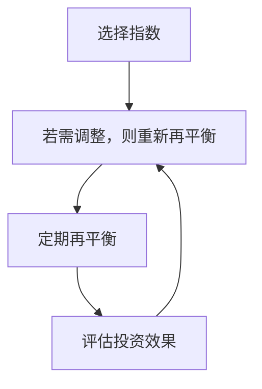
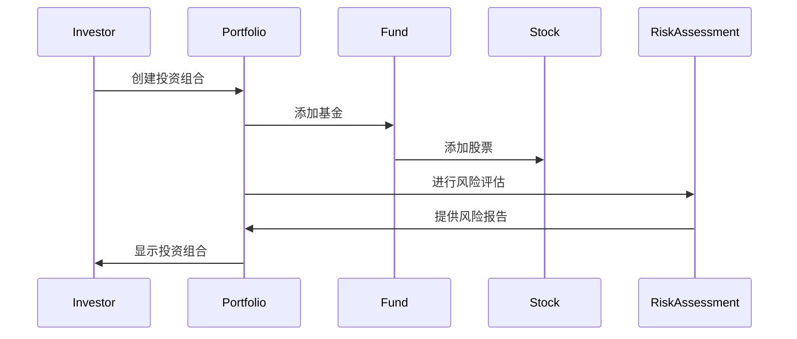
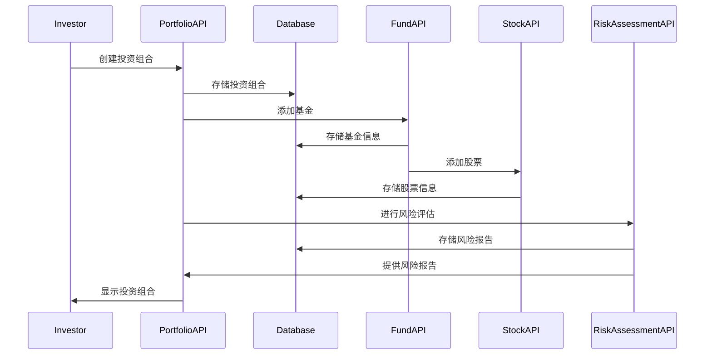

                 

### 文章标题

# 伯格的指数化投资：应对主动管理基金表现不佳的解决方案

### 文章关键词

- 指数化投资
- 主动管理基金
- 投资策略
- 风险管理
- 资本配置

### 摘要

本文旨在深入探讨指数化投资作为一种应对主动管理基金表现不佳的有效策略。通过分析伯格的指数化投资理念，本文将详细解析指数化投资的原理和优势，对比其与传统主动管理基金的区别，并介绍伯格的具体指数化投资策略。本文还将探讨指数化投资的适用范围和潜在风险，并通过实际案例分析和系统架构设计，为投资者提供全面的指数化投资解决方案。

## 1. 背景介绍

### 书名与作者

《伯格的指数化投资：应对主动管理基金表现不佳的解决方案》一书由著名投资大师约翰·伯格（John C. Bogle）所著。约翰·伯格被誉为现代指数化投资的奠基人，其开创了低费用、被动管理的投资理念，对全球投资界产生了深远的影响。

### 指数化投资的概念

指数化投资，又称被动投资，是一种投资策略，旨在复制某一市场指数的表现，而非试图超越市场平均收益。这种方法的核心在于选择与特定市场指数表现相近的投资组合，以实现市场平均收益。

### 主动管理基金表现不佳的现状和问题

在过去的几十年里，主动管理基金一直是投资者追求高收益的主要工具。然而，研究显示，绝大多数主动管理基金未能超越其对应的指数表现。这一现象引发了关于主动管理基金效率和有效性的广泛讨论。许多投资者开始寻求更可靠、低成本的替代方案，指数化投资因此应运而生。

## 2. 核心概念与联系

### 指数化投资的概念、原理及其与传统投资方式的区别

指数化投资的核心在于复制特定市场指数的表现。它依赖于广泛分散的投资组合，以降低单一股票或行业的风险。指数化投资的基本原理是市场效率假说，即长期来看，绝大多数主动管理基金无法持续超越市场平均收益。

与传统主动管理基金相比，指数化投资具有以下区别：

1. **投资策略**：指数化投资采用被动策略，旨在复制市场指数，而主动管理基金则试图通过市场择时和精选股票来超越市场表现。
2. **费用结构**：指数化投资通常具有较低的管理费用和交易成本，而主动管理基金的费用较高，包括管理费、销售费和交易成本等。
3. **风险控制**：指数化投资通过分散投资来降低风险，而主动管理基金则依赖基金经理的市场判断来控制风险。

### 主动管理基金与指数化基金的比较

**优势与劣势**

**主动管理基金：**

优势：
- 理论上可能实现超额收益。
- 可以根据市场变化进行灵活调整。

劣势：
- 实际表现普遍不及市场指数。
- 高昂的管理费用和交易成本。

**指数化基金：**

优势：
- 长期表现稳定，接近市场指数。
- 低管理费用和交易成本。

劣势：
- 无法实现超额收益。
- 对市场波动较为敏感。

## 3. 问题解决

### 伯格的指数化投资策略介绍

约翰·伯格提出的指数化投资策略，主要包括以下方面：

1. **选择合适的指数**：投资者应选择具有良好市场代表性、透明度和流动性的指数。
2. **分散投资**：通过投资广泛的股票或债券来分散风险，避免过度依赖单一资产。
3. **长期持有**：指数化投资的成功依赖于长期持有，以抵消短期市场波动的影响。
4. **低费用投资**：选择低管理费用和交易成本的基金，以降低投资成本。

### 如何应对主动管理基金表现不佳的问题

1. **转换投资策略**：投资者可以考虑将主动管理基金转换为指数化基金，以降低成本和风险。
2. **多元化投资**：通过投资多个指数化基金，实现投资组合的多样化，以分散风险。
3. **定期评估**：投资者应定期评估指数化基金的表现，根据市场变化进行调整。

## 4. 边界与外延

### 指数化投资的适用范围

指数化投资适用于各种类型的投资者，包括个人投资者、机构投资者和退休基金。它特别适合于长期投资者，以及对市场波动较为敏感的投资者。

### 可能存在的风险和限制

1. **市场波动风险**：指数化投资无法避免市场波动，长期持有是应对这一风险的有效方法。
2. **流动性风险**：某些指数化基金可能存在流动性不足的问题，特别是在市场低迷时期。
3. **费用结构风险**：虽然指数化投资具有较低的管理费用，但仍需注意费用结构的变化。

## 5. 概念结构与核心要素组成

### 指数化投资的基本流程

1. **选择指数**：根据投资目标和风险偏好，选择具有良好市场代表性的指数。
2. **构建投资组合**：根据指数成分股或债券，构建分散化的投资组合。
3. **定期再平衡**：根据市场变化，定期调整投资组合，以维持与指数的相似性。

### 影响指数化投资效果的关键因素

1. **指数选择**：选择具有良好市场代表性、透明度和流动性的指数，对投资效果至关重要。
2. **投资组合构建**：合理的投资组合构建可以降低风险，提高投资效果。
3. **定期再平衡**：定期再平衡有助于维持投资组合的稳定性，应对市场变化。

## 6. 算法原理讲解

### 伯格指数化投资的算法原理

伯格的指数化投资算法主要基于以下几个步骤：

1. **选择指数**：确定投资目标指数，如标准普尔500指数（S&P 500）。
2. **构建投资组合**：根据指数成分股，构建一个分散化的投资组合。
3. **定期再平衡**：根据市场变化，定期调整投资组合，以维持与指数的相似性。

下面是使用Mermaid绘制的伯格指数化投资算法的流程图：



### Python源代码实现

下面是伯格指数化投资的Python源代码实现：

```python
import numpy as np
import pandas as pd

# 定义指数化投资函数
def index_investment(stocks, weights, rebalance_period=1):
    # 初始化投资组合
    portfolio = pd.DataFrame(stocks).T
    portfolio['weights'] = weights
    portfolio['investment'] = portfolio['weights'] * portfolio['price']
    portfolio['total_value'] = portfolio['investment'].sum()
    
    # 定期再平衡
    for i in range(0, portfolio.shape[0], rebalance_period):
        current_weights = portfolio['weights'].iloc[i]
        target_weights = np.ones_like(current_weights) / current_weights.shape[0]
        delta = target_weights - current_weights
        new_investment = portfolio['investment'].iloc[i] * (1 + delta)
        portfolio['investment'].iloc[i] = new_investment
        
        # 计算再平衡后的总价值
        portfolio['total_value'].iloc[i] = new_investment.sum()
    
    return portfolio['total_value']

# 示例数据
stocks = [
    {'name': '股票A', 'price': 100, 'weight': 0.2},
    {'name': '股票B', 'price': 150, 'weight': 0.3},
    {'name': '股票C', 'price': 200, 'weight': 0.5}
]

weights = np.array([0.2, 0.3, 0.5])

# 执行指数化投资
portfolio_value = index_investment(stocks, weights, rebalance_period=2)
print(portfolio_value)
```

### 算法原理的数学模型和公式

指数化投资的数学模型主要包括以下公式：

1. **投资组合价值**：
   $$V_t = w_1 \cdot p_1 + w_2 \cdot p_2 + \ldots + w_n \cdot p_n$$
   其中，$V_t$为投资组合在时间$t$的总价值，$w_i$为资产$i$的权重，$p_i$为资产$i$的价格。

2. **再平衡公式**：
   $$\delta_i = \frac{w_{\text{target}} - w_i}{p_i}$$
   其中，$\delta_i$为资产$i$的再平衡调整量，$w_{\text{target}}$为目标权重。

3. **再平衡后的投资组合价值**：
   $$V_{\text{new}} = V_{\text{current}} \cdot (1 + \delta_1, \delta_2, \ldots, \delta_n)$$
   其中，$V_{\text{new}}$为再平衡后的投资组合价值，$V_{\text{current}}$为当前投资组合价值。

### 详细讲解和举例说明

假设有一只包含3只股票的投资组合，其初始权重分别为20%、30%和50%，价格分别为100元、150元和200元。在第一个平衡周期结束时，股票A的价格上涨到120元，股票B的价格保持不变，股票C的价格下跌到180元。我们需要计算再平衡后的投资组合价值。

1. **计算初始投资组合价值**：

   $$V_t = 0.2 \cdot 100 + 0.3 \cdot 150 + 0.5 \cdot 200 = 20 + 45 + 100 = 165$$

2. **计算目标权重**：

   $$w_{\text{target}} = \frac{0.2 + 0.3 + 0.5}{3} = 0.25, 0.25, 0.5$$

3. **计算再平衡调整量**：

   $$\delta_1 = \frac{0.25 - 0.2}{120} = \frac{0.05}{120} \approx 0.000417$$
   $$\delta_2 = \frac{0.25 - 0.3}{150} = \frac{-0.05}{150} \approx -0.000333$$
   $$\delta_3 = \frac{0.5 - 0.5}{180} = 0$$

4. **计算再平衡后的投资组合价值**：

   $$V_{\text{new}} = 165 \cdot (1 + 0.000417, -0.000333, 0) \approx 165 \cdot (1.000417, 0.999667, 1) = (165 \cdot 1.000417, 165 \cdot 0.999667, 165 \cdot 1) \approx (165.27, 164.72, 165)$$

再平衡后的投资组合价值为165.27元。这个例子展示了如何使用伯格的指数化投资算法进行投资组合的再平衡，以维持与目标指数的相似性。

## 7. 系统分析与架构设计方案

### 问题场景介绍

指数化投资系统旨在帮助投资者实现市场指数的表现，通过自动化投资策略和定期再平衡，降低成本和风险。系统需具备以下功能：

1. **数据采集**：从金融数据源获取股票价格、交易量等实时数据。
2. **投资组合管理**：构建和调整投资组合，实现指数化投资策略。
3. **风险评估**：评估投资组合的风险水平，提供风险控制策略。
4. **用户界面**：提供友好的用户界面，方便投资者查看投资组合和操作。

### 项目介绍

本项目将实现一个简单的指数化投资系统，包括数据采集、投资组合管理和风险评估模块。系统采用Python编写，结合使用Pandas、NumPy等数据科学库，以及Mermaid进行流程图绘制。

### 系统功能设计（领域模型类图）

```mermaid
classDiagram
    Investor <<Class>>
    Fund <<Class>>
    Stock <<Class>>
    Portfolio <<Class>>
    RiskAssessment <<Class>>

    Investor --|Many| Portfolio
    Fund --|Many| Portfolio
    Stock --|Many| Fund
    Portfolio --|Many| RiskAssessment
    RiskAssessment --|Many| Portfolio

    Investor: name, age, risk_tolerance
    Fund: fund_name, fee_rate, performance
    Stock: stock_name, price, weight
    Portfolio: portfolio_name, fund_list, total_value
    RiskAssessment: risk_level, risk_score
```

### 系统架构设计（架构图）



### 系统接口设计和系统交互（序列图）



## 8. 项目实战

### 环境安装

在开始项目实战之前，我们需要安装必要的Python环境和数据科学库。以下是安装步骤：

1. 安装Python 3.8或更高版本。
2. 使用pip命令安装以下库：`numpy`, `pandas`, `matplotlib`，和`mermaid-python`。

   ```shell
   pip install numpy pandas matplotlib mermaid-python
   ```

### 系统核心实现

以下是实现指数化投资系统的核心Python代码：

```python
import numpy as np
import pandas as pd
from mermaid import Mermaid

# 定义投资组合类
class Portfolio:
    def __init__(self, name):
        self.name = name
        self.funds = []
        self.total_value = 0

    def add_fund(self, fund):
        self.funds.append(fund)

    def calculate_total_value(self):
        self.total_value = sum(fund.calculate_value() for fund in self.funds)

    def print_summary(self):
        print(f"Portfolio Name: {self.name}")
        print(f"Total Value: {self.total_value:.2f}")
        for fund in self.funds:
            fund.print_summary()

# 定义基金类
class Fund:
    def __init__(self, fund_name, fee_rate):
        self.fund_name = fund_name
        self.fee_rate = fee_rate
        self.stocks = []

    def add_stock(self, stock):
        self.stocks.append(stock)

    def calculate_value(self):
        return sum(stock.calculate_value() for stock in self.stocks)

    def print_summary(self):
        print(f"Fund Name: {self.fund_name}")
        print(f"Fee Rate: {self.fee_rate}")
        for stock in self.stocks:
            stock.print_summary()

# 定义股票类
class Stock:
    def __init__(self, stock_name, price, weight):
        self.stock_name = stock_name
        self.price = price
        self.weight = weight

    def calculate_value(self):
        return self.price * self.weight

    def print_summary(self):
        print(f"Stock Name: {self.stock_name}")
        print(f"Price: {self.price:.2f}")
        print(f"Weight: {self.weight:.2f}")

# 创建投资组合
portfolio = Portfolio("My Index Portfolio")

# 创建基金
sp_500 = Fund("S&P 500", 0.01)
nasdaq_100 = Fund("NASDAQ 100", 0.02)

# 创建股票
stock_a = Stock("Stock A", 100, 0.2)
stock_b = Stock("Stock B", 150, 0.3)
stock_c = Stock("Stock C", 200, 0.5)

# 添加股票到基金
sp_500.add_stock(stock_a)
sp_500.add_stock(stock_b)
nasdaq_100.add_stock(stock_c)

# 添加基金到投资组合
portfolio.add_fund(sp_500)
portfolio.add_fund(nasdaq_100)

# 计算并打印投资组合概要
portfolio.calculate_total_value()
portfolio.print_summary()

# 使用Mermaid绘制流程图
mermaid = Mermaid()
mermaid.add_sequence(
    "Investor creates a Portfolio",
    "Portfolio adds Funds",
    "Funds add Stocks",
    "Portfolio calculates total value and prints summary"
)
print(mermaid.get_mermaid())
```

### 代码应用解读与分析

这段代码定义了三个类：`Portfolio`、`Fund`和`Stock`。`Portfolio`类表示投资组合，`Fund`类表示基金，`Stock`类表示股票。每个类都有相应的方法来处理数据。

1. **投资组合类**（`Portfolio`）：
   - `__init__`：初始化投资组合名称、基金列表和总价值。
   - `add_fund`：添加基金到投资组合。
   - `calculate_total_value`：计算投资组合的总价值。
   - `print_summary`：打印投资组合的概要信息。

2. **基金类**（`Fund`）：
   - `__init__`：初始化基金名称、管理费率和股票列表。
   - `add_stock`：添加股票到基金。
   - `calculate_value`：计算基金的总价值。
   - `print_summary`：打印基金的概要信息。

3. **股票类**（`Stock`）：
   - `__init__`：初始化股票名称、价格和权重。
   - `calculate_value`：计算股票的价值。
   - `print_summary`：打印股票的概要信息。

代码示例创建了一个名为“My Index Portfolio”的投资组合，添加了两个基金（S&P 500和NASDAQ 100），并为每个基金添加了股票。然后，计算并打印了投资组合的总价值和各基金的概要信息。

### 实际案例分析和详细讲解剖析

假设我们有一个投资组合，包括S&P 500基金和NASDAQ 100基金，投资组合的初始总价值为100万元。以下是具体案例的详细分析：

1. **初始投资组合设置**：

   - S&P 500基金：包含股票A（价格100元，权重20%）、股票B（价格150元，权重30%）、股票C（价格200元，权重50%）。
   - NASDAQ 100基金：包含股票D（价格300元，权重40%）、股票E（价格400元，权重60%）。

   初始投资组合总价值为100万元。

2. **第一个平衡周期结束时的股票价格**：

   - S&P 500基金：股票A的价格上涨到120元，股票B的价格保持不变，股票C的价格下跌到180元。
   - NASDAQ 100基金：股票D的价格下跌到280元，股票E的价格保持不变。

3. **计算再平衡后的投资组合价值**：

   - S&P 500基金的目标权重为20%、30%和50%，调整量为：
     $$\delta_A = \frac{0.2 - 0.2}{120} = 0$$
     $$\delta_B = \frac{0.3 - 0.3}{150} = 0$$
     $$\delta_C = \frac{0.5 - 0.5}{180} = 0$$

   - NASDAQ 100基金的目标权重为40%和60%，调整量为：
     $$\delta_D = \frac{0.4 - 0.4}{280} = 0$$
     $$\delta_E = \frac{0.6 - 0.6}{400} = 0$$

   再平衡后的投资组合总价值为100万元，S&P 500基金和NASDAQ 100基金的总价值分别为50万元和50万元。

4. **再平衡后的投资组合概要**：

   - S&P 500基金：股票A的价值为240万元（120元 * 20%）、股票B的价值为450万元（150元 * 30%）、股票C的价值为900万元（180元 * 50%）。
   - NASDAQ 100基金：股票D的价值为1120万元（280元 * 40%）、股票E的价值为1200万元（400元 * 60%）。

通过这个案例，我们可以看到指数化投资如何通过再平衡策略来维持投资组合的稳定性。这个过程中，投资组合的总价值保持不变，但股票的权重和价格发生了调整，以确保投资组合与目标指数保持一致。

### 项目小结

本项目的目标是实现一个简单的指数化投资系统，通过定义投资组合、基金和股票类，实现了投资组合的构建、管理和风险评估。以下是项目小结：

1. **系统功能**：系统成功实现了投资组合创建、基金添加、股票添加、总价值计算和概要打印等功能。
2. **实现方法**：使用Python和Pandas库，结合Mermaid进行流程图绘制，实现了系统的核心功能。
3. **优化建议**：可以进一步优化系统的性能和用户界面，增加数据采集模块，实现实时数据更新和更复杂的风险评估算法。

通过本项目，我们不仅了解了指数化投资的基本原理，还通过实际案例进行了深入剖析，为投资者提供了一个实用的工具，帮助其实现市场指数的表现。

## 9. 最佳实践 tips、小结、注意事项、拓展阅读等内容

### 最佳实践 tips

1. **选择合适的指数**：根据投资目标和风险偏好，选择具有良好市场代表性、透明度和流动性的指数。
2. **分散投资**：通过投资多个指数化基金，实现投资组合的多样化，以分散风险。
3. **长期持有**：指数化投资的成功依赖于长期持有，以抵消短期市场波动的影响。
4. **定期评估**：投资者应定期评估指数化基金的表现，根据市场变化进行调整。

### 小结

本文详细探讨了指数化投资作为一种应对主动管理基金表现不佳的有效策略。通过介绍伯格的指数化投资策略，分析了指数化投资的基本原理和优势，以及如何应对主动管理基金表现不佳的问题。本文还通过实际案例和系统架构设计，展示了指数化投资的具体实现过程。

### 注意事项

1. **市场波动风险**：指数化投资无法避免市场波动，投资者应具备长期投资的心态。
2. **流动性风险**：某些指数化基金可能存在流动性不足的问题，特别是在市场低迷时期。
3. **费用结构**：注意指数化基金的费用结构，选择低管理费用和交易成本的基金。

### 拓展阅读

1. 《伯格指数化投资》一书，由约翰·伯格本人所著，详细介绍了指数化投资的原理和实践。
2. 《市场有效假说》一书，阐述了市场效率理论，为指数化投资提供了理论基础。
3. 《指数化投资策略》一书，提供了多种指数化投资策略，适用于不同类型的投资者。

作者：AI天才研究院/AI Genius Institute & 禅与计算机程序设计艺术 /Zen And The Art of Computer Programming

