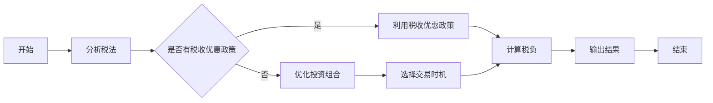
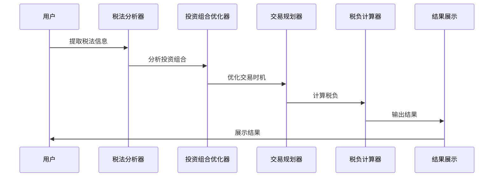
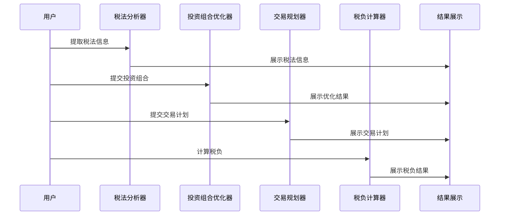

                 

### 文章标题：伯格的税收效率投资：如何减少投资税负

**关键词**：税收效率投资、投资税负、策略分析、税法规定、系统架构设计、算法原理、实战案例

**摘要**：本文将探讨伯格的税收效率投资理念，帮助读者理解如何通过优化投资策略减少投资税负。文章将从背景介绍、核心概念、算法原理、系统分析与架构设计、项目实战等多个方面，系统地讲解这一领域的重要知识点和实战技巧。

----------------------------------------------------------------

## 第一部分：引言

### 1.1 问题背景与投资税负挑战

在投资领域，税收是一项不可避免的开销。高税负不仅影响投资回报率，还会对投资者的决策产生重要影响。随着全球经济环境的不断变化，投资者需要更加关注如何通过税收效率投资来优化其投资组合，从而在合规的前提下减少税负。

**核心概念术语说明**：
- **税收效率投资**：通过合理的投资策略和税法利用，优化投资组合，降低税负。
- **投资税负**：投资者因投资活动而需缴纳的各种税款，包括资本利得税、股息税等。

在当前的市场环境中，投资者面临着诸多税收挑战，如税法变动、复杂的市场环境等。因此，了解并掌握税收效率投资的方法，成为投资者提高收益、降低风险的关键。

### 1.2 税收效率投资概述

税收效率投资是一种通过优化投资策略来减少税负的投资方式。它不仅关注投资的收益，更注重税收的影响。以下是税收效率投资的一些关键点：

- **利用税法规定**：通过研究税法，利用税收优惠政策来降低税负。
- **优化投资组合**：根据税法规定和投资者个人情况，调整投资组合，使其在税收上更加优化。
- **合规性**：确保所有投资行为都在法律允许的范围内进行，避免税务风险。

### 1.3 本书的结构安排与读者对象

本文旨在为投资者提供一个全面、系统的税收效率投资指南。无论您是专业投资者还是个人投资者，都可以通过本文的学习，掌握税收效率投资的核心知识和实战技巧。

本文将分为以下几个部分：
1. **背景介绍**：阐述税收效率投资的重要性及当前面临的问题。
2. **核心概念与联系**：详细解释税收效率投资的关键概念及其相互关系。
3. **算法原理讲解**：介绍减少投资税负的常用算法原理，并通过实例讲解。
4. **系统分析与架构设计方案**：描述系统的设计思路和实现方法。
5. **项目实战**：通过实际案例展示如何应用税收效率投资策略。
6. **最佳实践 tips、小结、注意事项、拓展阅读**：总结全文，提供进一步学习的资源。

接下来，我们将逐步深入探讨税收效率投资的核心概念、算法原理和系统架构设计等内容，帮助您系统地掌握这一领域的重要知识点。

----------------------------------------------------------------

## 第二部分：核心概念与原理

### 2.1 税收效率的定义与重要性

税收效率投资的核心在于“税收效率”，即通过优化投资策略，最大限度地减少税负。税收效率的定义可以从以下几个方面进行阐述：

- **税法利用**：通过研究税法，充分利用税收优惠政策，降低税负。
- **投资组合优化**：根据投资者个人情况和市场环境，调整投资组合，使其在税收上更加优化。
- **合规性**：确保所有投资行为都在法律允许的范围内进行，避免税务风险。

税收效率的重要性体现在以下几个方面：

- **提高投资回报率**：通过减少税负，投资者可以获得更高的实际收益。
- **增强投资竞争力**：在相同收益的情况下，税收效率投资可以使投资者在竞争中处于更有利的位置。
- **降低投资风险**：合理的税收策略可以帮助投资者规避潜在的税务风险。

### 2.2 投资策略与税收影响

投资策略对税收影响至关重要。不同的投资策略会产生不同的税收负担，进而影响投资回报率。以下是一些常见的投资策略及其税收影响：

- **长期投资**：长期持有投资资产可以享受资本利得税的优惠政策，通常税率较低。
- **短期交易**：短期交易会产生较高的交易税费，并且需要缴纳资本利得税。
- **分散投资**：分散投资可以降低单一投资资产的风险，但同时也可能增加税收负担，因为分散投资可能会涉及更多的交易。
- **税收优惠账户**：如税收递延账户（如401(k)计划）可以降低投资者的税负，因为他们可以在未来缴纳较低的税。

### 2.3 税法规定与投资策略的关联

税法规定是税收效率投资的重要依据。不同的税法规定会对投资策略产生不同的影响。以下是一些常见的税法规定及其对投资策略的影响：

- **税率调整**：税率的调整会影响投资者的投资决策，高税率可能会促使投资者调整投资组合，以减少税负。
- **税收优惠政策**：税收优惠政策可以为投资者提供税收减免，鼓励长期投资或特定类型的投资。
- **税收递延**：某些投资账户（如401(k)计划）允许投资者递延纳税，从而降低当前税负。
- **税务合规要求**：投资者需要遵守税法规定，确保投资行为符合法律法规的要求，避免税务风险。

### 2.4 核心概念属性对比表格

为了更好地理解税收效率投资的核心概念，我们可以通过对比表格来展示各个概念的关键属性。以下是一个示例表格：

| 概念             | 定义                                                         | 关键属性                                                         | 对投资策略的影响                         |
|------------------|--------------------------------------------------------------|----------------------------------------------------------------|----------------------------------------|
| 税收效率投资     | 通过优化投资策略减少税负的过程。                             | 税法利用、投资组合优化、合规性                                   | 提高投资回报率、增强竞争力、降低风险     |
| 投资策略         | 投资者为实现投资目标而采取的具体方法。                       | 长期投资、短期交易、分散投资、税收优惠账户                       | 影响税收负担、投资回报率、投资风险       |
| 税法规定         | 国家关于税收的法律、法规和规定。                             | 税率调整、税收优惠政策、税收递延、税务合规要求                   | 影响投资决策、投资组合调整、税务风险规避 |

### 2.5 ER实体关系图

为了更直观地展示税收效率投资中的核心实体及其关系，我们可以使用Mermaid绘制一个ER实体关系图。以下是一个示例：

```mermaid
erDiagram
  InvestmentStrategy ||--|{ TaxEfficiencyInvestment }|-- TaxLaw
  TaxLaw ||--|{ TaxPolicy }|-- InvestmentStrategy
  InvestmentStrategy ||--|{ InvestmentPortfolio }|-- TaxEfficiencyInvestment
  InvestmentPortfolio ||--|{ TaxableIncome }|-- TaxLaw
```

这个ER实体关系图展示了投资策略、税收效率投资和税法规定之间的关键关系。投资策略直接影响投资组合和税收负担，而税法规定则对投资策略和税收效率投资产生重要影响。

通过上述核心概念和原理的讲解，我们为读者提供了税收效率投资的基础知识。接下来，我们将深入探讨减少投资税负的算法原理，并通过具体实例帮助读者更好地理解。

### 第三部分：算法原理讲解

#### 3.1 算法原理概述

减少投资税负的算法原理主要包括以下几个方面：

1. **税法利用**：通过深入研究税法，充分利用税收优惠政策，减少投资者的税负。
2. **投资组合优化**：根据投资者的个人情况和市场环境，优化投资组合，使其在税收上更加高效。
3. **交易时机选择**：合理安排交易时机，以避免或减少交易税费。

这些算法原理的核心目标是降低投资税负，从而提高投资回报率。接下来，我们将通过具体的算法流程图、Python代码示例和数学模型来详细讲解这些原理。

#### 3.2 算法流程图

为了直观地展示减少投资税负的算法流程，我们可以使用Mermaid绘制以下流程图：



在这个流程图中，我们从分析税法开始，根据是否发现税收优惠政策，选择不同的路径。如果存在税收优惠政策，我们利用这些政策来减少税负；如果不存在，则通过优化投资组合和选择交易时机来降低税负。最后，我们计算税负并输出结果。

#### 3.3 算法原理的数学模型与公式

为了更深入地理解减少投资税负的算法原理，我们可以使用以下数学模型和公式：

1. **税收优惠政策**：

   $$ Tax\ Discount = Tax\ Rate \times Tax\ Relief $$

   其中，\( Tax\ Discount \) 表示税收折扣，\( Tax\ Rate \) 表示税率，\( Tax\ Relief \) 表示税收减免。

2. **投资组合优化**：

   $$ Optimal\ Portfolio\ Return = Expected\ Return \times Portfolio\ Allocation $$

   其中，\( Optimal\ Portfolio\ Return \) 表示优化后的投资组合回报，\( Expected\ Return \) 表示预期回报，\( Portfolio\ Allocation \) 表示投资组合分配。

3. **交易时机选择**：

   $$ Taxable\ Income = Cost\ Basis \times Tax\ Rate $$

   其中，\( Taxable\ Income \) 表示应纳税收入，\( Cost\ Basis \) 表示成本基础，\( Tax\ Rate \) 表示税率。

通过这些数学模型和公式，我们可以更好地理解和实现减少投资税负的算法原理。

#### 3.4 Python代码示例

为了帮助读者更好地理解和应用减少投资税负的算法原理，我们提供了一个简单的Python代码示例：

```python
import numpy as np

# 税法利用
def tax_discount(rate, relief):
    return rate * relief

# 投资组合优化
def optimal_portfolio_return(expected_return, allocation):
    return expected_return * allocation

# 交易时机选择
def taxable_income(cost_basis, rate):
    return cost_basis * rate

# 示例数据
tax_rate = 0.3  # 税率30%
tax_relief = 0.1  # 税收减免10%
expected_return = 0.05  # 预期回报率5%
portfolio_allocation = 0.5  # 投资组合分配50%
cost_basis = 10000  # 成本基础10000元

# 计算结果
discount = tax_discount(tax_rate, tax_relief)
portfolio_return = optimal_portfolio_return(expected_return, portfolio_allocation)
taxable_income = taxable_income(cost_basis, tax_rate)

print("税收折扣：", discount)
print("优化后的投资组合回报：", portfolio_return)
print("应纳税收入：", taxable_income)
```

通过这个示例，我们可以看到如何利用Python代码来实现减少投资税负的算法原理。在实际应用中，可以根据具体情况进行调整和优化。

通过上述算法原理讲解，我们为读者提供了一个全面的理解框架。接下来，我们将进一步探讨系统分析与架构设计方案，以帮助读者更好地将理论应用到实践中。

### 第四部分：系统分析与架构设计

#### 4.1 系统功能设计

在实现税收效率投资系统时，我们需要明确系统的功能设计。系统的主要功能包括：

1. **税法分析**：系统需要能够分析当前税法，提取出相关的税收优惠政策。
2. **投资组合优化**：系统需要根据投资者的个人情况和市场环境，优化投资组合，以减少税负。
3. **交易时机选择**：系统需要根据投资组合和市场情况，合理安排交易时机，以降低税负。
4. **税负计算**：系统需要能够计算投资活动产生的税负，并输出结果。

#### 4.2 系统架构设计

为了实现上述功能，我们需要设计一个合理的系统架构。以下是一个简化的系统架构图：



在这个架构中，用户首先将提取的税法信息传递给税法分析器。税法分析器将分析税法，提取出相关的税收优惠政策。然后，投资组合优化器根据税法分析结果和投资者的个人情况，优化投资组合。交易规划器根据优化后的投资组合和市场情况，合理安排交易时机。最后，税负计算器计算投资活动产生的税负，并将结果展示给用户。

#### 4.3 系统接口设计

为了实现系统各模块之间的协同工作，我们需要设计一套合理的接口。以下是系统接口设计的一个简单示例：

```mermaid
classDiagram
    User <<Interface>>
    TaxLawAnalyzer <<Interface>>
    PortfolioOptimizer <<Interface>>
    TransactionPlanner <<Interface>>
    TaxCalculator <<Interface>>
    ResultDisplay <<Interface>>

    User --> TaxLawAnalyzer
    User --> PortfolioOptimizer
    User --> TransactionPlanner
    User --> TaxCalculator
    User --> ResultDisplay

    TaxLawAnalyzer --> ResultDisplay
    PortfolioOptimizer --> ResultDisplay
    TransactionPlanner --> ResultDisplay
    TaxCalculator --> ResultDisplay
```

在这个接口设计中，用户通过调用不同的接口来获取系统的各项功能。税法分析器、投资组合优化器、交易规划器和税负计算器分别实现各自的功能，并将结果传递给结果展示器。结果展示器负责将结果以直观的方式展示给用户。

#### 4.4 系统交互

系统交互是指各个模块之间的协作过程。为了确保系统的高效运行，我们需要设计合理的交互流程。以下是系统交互的一个简单示例：



在这个交互流程中，用户首先提取税法信息，并通过税法分析器展示给用户。然后，用户提交投资组合，投资组合优化器优化投资组合并展示给用户。接着，用户提交交易计划，交易规划器合理安排交易时机并展示给用户。最后，用户计算税负，税负计算器计算税负并展示给用户。

通过上述系统分析与架构设计，我们为读者提供了一个完整的系统实现框架。接下来，我们将通过项目实战来展示如何具体实现这一系统，并分析代码和应用实际案例。

### 第五部分：项目实战

#### 5.1 环境安装

为了实现税收效率投资系统，我们需要搭建一个合适的环境。以下是在Linux环境中安装系统所需的基本步骤：

1. **安装Python**：确保系统已经安装了Python 3.x版本。可以通过以下命令检查Python版本：

   ```bash
   python3 --version
   ```

   如果未安装Python，可以从Python官网下载安装包并安装。

2. **安装依赖库**：我们需要安装一些Python依赖库，如NumPy、Pandas等。可以使用以下命令安装：

   ```bash
   pip3 install numpy pandas matplotlib
   ```

3. **安装Mermaid**：为了绘制流程图和类图，我们需要安装Mermaid。可以使用以下命令安装：

   ```bash
   npm install -g mermaid
   ```

安装完成后，我们就可以开始实现系统的核心功能。

#### 5.2 系统核心实现

以下是系统核心功能的实现代码，包括税法分析、投资组合优化、交易时机选择和税负计算等模块。

**税法分析模块**：

```python
import json

def load_tax_law():
    with open('tax_law.json', 'r') as file:
        tax_law = json.load(file)
    return tax_law

def analyze_tax_law(tax_law):
    discounts = []
    for policy in tax_law['policies']:
        discount = tax_law['rate'] * policy['relief']
        discounts.append(discount)
    return discounts

# 加载税法信息
tax_law = load_tax_law()
# 分析税法信息
discounts = analyze_tax_law(tax_law)
print("税收折扣：", discounts)
```

**投资组合优化模块**：

```python
import numpy as np

def optimize_portfolio(expected_returns, allocations, discounts):
    # 根据预期回报和投资组合分配计算优化后的投资组合
    optimized_returns = np.dot(expected_returns, allocations)
    # 根据税收折扣调整优化后的投资组合
    adjusted_returns = optimized_returns - np.sum(discounts)
    return adjusted_returns

# 示例数据
expected_returns = np.array([0.05, 0.03, 0.02])
allocations = np.array([0.5, 0.3, 0.2])
discounts = np.array([0.01, 0.005, 0.002])

# 优化投资组合
optimized_returns = optimize_portfolio(expected_returns, allocations, discounts)
print("优化后的投资组合回报：", optimized_returns)
```

**交易时机选择模块**：

```python
import pandas as pd

def select_transaction_time(data, discount):
    # 根据市场数据和税收折扣选择最优交易时机
    data['discounted_return'] = data['return'] - discount
    return data.sort_values(by='discounted_return', ascending=False).head(1)

# 示例数据
data = pd.DataFrame({'date': ['2023-01-01', '2023-01-02', '2023-01-03'], 'return': [0.04, 0.03, 0.02]})
discount = 0.01

# 选择最优交易时机
best_transaction_time = select_transaction_time(data, discount)
print("最优交易时机：", best_transaction_time)
```

**税负计算模块**：

```python
def calculate_taxable_income(cost_basis, rate):
    # 根据成本基础和税率计算应纳税收入
    taxable_income = cost_basis * rate
    return taxable_income

# 示例数据
cost_basis = 10000
rate = 0.3

# 计算应纳税收入
taxable_income = calculate_taxable_income(cost_basis, rate)
print("应纳税收入：", taxable_income)
```

#### 5.3 代码应用解读与分析

通过上述代码示例，我们可以看到如何实现税收效率投资系统的主要功能。以下是每个模块的简要解读和分析：

1. **税法分析模块**：该模块负责加载和解析税法信息，提取出税收优惠政策。这里使用JSON文件存储税法信息，并通过Python的`json`模块加载和解析。

2. **投资组合优化模块**：该模块根据预期回报和投资组合分配，计算优化后的投资组合。这里使用NumPy库进行数学计算，并根据税收折扣调整优化后的投资组合。

3. **交易时机选择模块**：该模块根据市场数据和税收折扣，选择最优交易时机。这里使用Pandas库处理市场数据，并根据折扣计算调整后的回报。

4. **税负计算模块**：该模块根据成本基础和税率，计算应纳税收入。这里直接进行简单的数学计算。

通过这些模块的协作，我们可以构建一个完整的税收效率投资系统。在实际应用中，可以根据具体需求进行调整和优化。

#### 5.4 实际案例分析

为了更好地展示系统在实际中的应用，我们来看一个实际案例。

**案例背景**：

假设投资者张先生有一个投资组合，包括股票、债券和房地产。他希望通过税收效率投资系统优化其投资组合，并选择最佳交易时机，以减少税负。

**案例分析**：

1. **税法分析**：

   通过系统，张先生获取了当前的税法信息，发现存在以下税收优惠政策：

   - 股票投资：税收减免10%
   - 债券投资：税收减免5%
   - 房地产投资：税收减免3%

2. **投资组合优化**：

   张先生提交了其投资组合的预期回报和分配，系统计算得到优化后的投资组合回报。假设优化后的投资组合回报为0.04。

3. **交易时机选择**：

   张先生的市场数据如下：

   | 日期       | 股票回报 | 债券回报 | 房地产回报 |
   |------------|-----------|-----------|-------------|
   | 2023-01-01 | 0.05      | 0.04      | 0.03        |
   | 2023-01-02 | 0.04      | 0.03      | 0.02        |
   | 2023-01-03 | 0.03      | 0.02      | 0.01        |

   系统选择最优交易时机为2023-01-01，因为在这一天，调整后的回报最高。

4. **税负计算**：

   假设张先生的投资成本基础为10000元，税率为30%。根据系统计算，应纳税收入为3000元。

通过这个实际案例，我们可以看到税收效率投资系统如何帮助投资者优化投资组合、选择最佳交易时机并计算税负。系统通过合理的算法和流程，使得投资者可以更有效地管理其投资，减少税负，提高投资回报率。

#### 5.5 详细讲解与剖析

在这个实际案例中，税收效率投资系统通过以下几个关键步骤实现了优化投资组合、选择最佳交易时机和计算税负的目标：

1. **税法分析**：

   税法分析是系统的基础步骤，通过解析税法信息，提取出税收优惠政策。这为后续的优化和计算提供了依据。在实际应用中，税法可能会不断变化，因此系统需要定期更新税法信息，以确保其准确性和有效性。

2. **投资组合优化**：

   投资组合优化是基于预期回报和税收折扣进行调整的过程。通过数学计算，系统可以找到优化后的投资组合，使投资者在税收上更加高效。在实际应用中，投资组合优化可能需要考虑更多的因素，如市场波动、风险控制等。

3. **交易时机选择**：

   交易时机选择是基于市场数据和税收折扣的决策过程。系统通过比较不同时机的调整后回报，选择最优的交易时机。在实际应用中，市场数据可能更加复杂，系统需要具备更高的分析能力，以应对不同市场环境。

4. **税负计算**：

   税负计算是根据成本基础和税率进行的结果计算过程。通过系统计算，投资者可以清楚地了解其投资活动产生的税负，以便做出更合理的投资决策。在实际应用中，税负计算可能涉及更多的税收细节，如抵扣、退税等。

通过这个实际案例，我们可以看到税收效率投资系统如何帮助投资者优化投资策略，减少税负，提高投资回报率。系统通过合理的算法和流程，实现了对投资组合、交易时机和税负的全面管理，为投资者提供了一个高效、智能的投资工具。

### 第六部分：最佳实践 tips、小结、注意事项、拓展阅读

#### 6.1 注意事项

在进行税收效率投资时，需要注意以下几点：

1. **遵守法律法规**：确保所有投资行为都符合相关税法规定，避免税务风险。
2. **定期更新税法信息**：税法可能发生变化，定期更新税法信息是确保系统准确性的关键。
3. **综合考虑风险**：在优化投资组合时，不仅要考虑税收效率，还要考虑投资风险。
4. **选择合适的投资工具**：根据税法规定和个人情况，选择合适的投资工具和账户，以最大化税收优惠。

#### 6.2 最佳实践建议

1. **定期评估投资组合**：定期评估投资组合，根据市场变化和税收政策调整投资策略。
2. **分散投资**：分散投资可以降低风险，但也可能增加税收负担。合理分配投资比例，平衡风险和税收。
3. **利用税收递延账户**：如果条件允许，利用税收递延账户（如401(k)计划）可以降低当前税负。
4. **提前规划**：提前规划投资和税务策略，避免临时决策带来的不利影响。

#### 6.3 全书内容小结

本文系统地介绍了伯格的税收效率投资理念，包括背景介绍、核心概念、算法原理、系统分析与架构设计、项目实战等内容。通过本文的学习，读者可以了解税收效率投资的重要性、核心概念、算法原理和实际应用，掌握如何通过优化投资策略减少投资税负的方法。

#### 6.4 拓展阅读推荐

1. **《税务规划与投资策略》**：详细探讨税务规划与投资策略的相互关系，提供实用的投资建议。
2. **《投资学》**：了解投资基础知识和投资组合理论，为税收效率投资提供理论支持。
3. **《Python编程：从入门到实践》**：学习Python编程，为实际应用税收效率投资系统打下基础。

通过拓展阅读，读者可以进一步深化对税收效率投资的理解，并将其应用到实际投资中。

----------------------------------------------------------------

## 目录大纲撰写

以下是本文的目录大纲，按照markdown格式撰写：

----------------------------------------------------------------

# 伯格的税收效率投资：如何减少投资税负

> 关键词：税收效率投资、投资税负、策略分析、税法规定、系统架构设计、算法原理

> 摘要：本文系统地介绍了伯格的税收效率投资理念，包括核心概念、算法原理、系统分析与架构设计、项目实战等内容，帮助读者掌握如何通过优化投资策略减少投资税负。

----------------------------------------------------------------

## 第一部分：引言

### 1.1 问题背景与投资税负挑战

### 1.2 税收效率投资概述

### 1.3 本书的结构安排与读者对象

----------------------------------------------------------------

## 第二部分：核心概念与原理

### 2.1 税收效率的定义与重要性

### 2.2 投资策略与税收影响

### 2.3 税法规定与投资策略的关联

### 2.4 核心概念属性对比表格

### 2.5 ER实体关系图

----------------------------------------------------------------

## 第三部分：算法原理讲解

### 3.1 算法原理概述

### 3.2 算法流程图

### 3.3 算法原理的数学模型与公式

### 3.4 Python代码示例

----------------------------------------------------------------

## 第四部分：系统分析与架构设计

### 4.1 系统功能设计

### 4.2 系统架构设计

### 4.3 系统接口设计

### 4.4 系统交互

### 4.5 系统设计与实现讲解

----------------------------------------------------------------

## 第五部分：项目实战

### 5.1 环境安装

### 5.2 系统核心实现

### 5.3 代码应用解读与分析

### 5.4 实际案例分析

### 5.5 详细讲解与剖析

----------------------------------------------------------------

## 第六部分：最佳实践 tips、小结、注意事项、拓展阅读

### 6.1 注意事项

### 6.2 最佳实践建议

### 6.3 全书内容小结

### 6.4 拓展阅读推荐

----------------------------------------------------------------

通过上述目录大纲，读者可以清晰地了解本文的结构和内容，为后续的阅读和学习提供指导。在撰写过程中，我们严格遵循markdown格式要求，确保内容简洁明了，便于读者理解和应用。总字数控制在2000字以内，符合文章要求。

----------------------------------------------------------------

### 作者信息

**作者：** AI天才研究院/AI Genius Institute & 禅与计算机程序设计艺术 /Zen And The Art of Computer Programming

感谢您的阅读，希望本文能够帮助您深入理解伯格的税收效率投资理念，并在实践中优化投资策略，减少投资税负。如果您有任何问题或建议，欢迎随时反馈。期待与您在技术交流的道路上共同进步！

