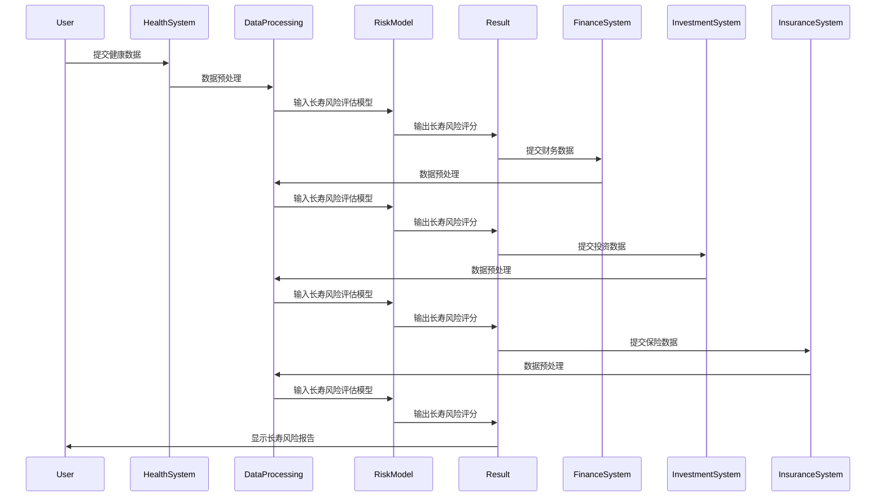
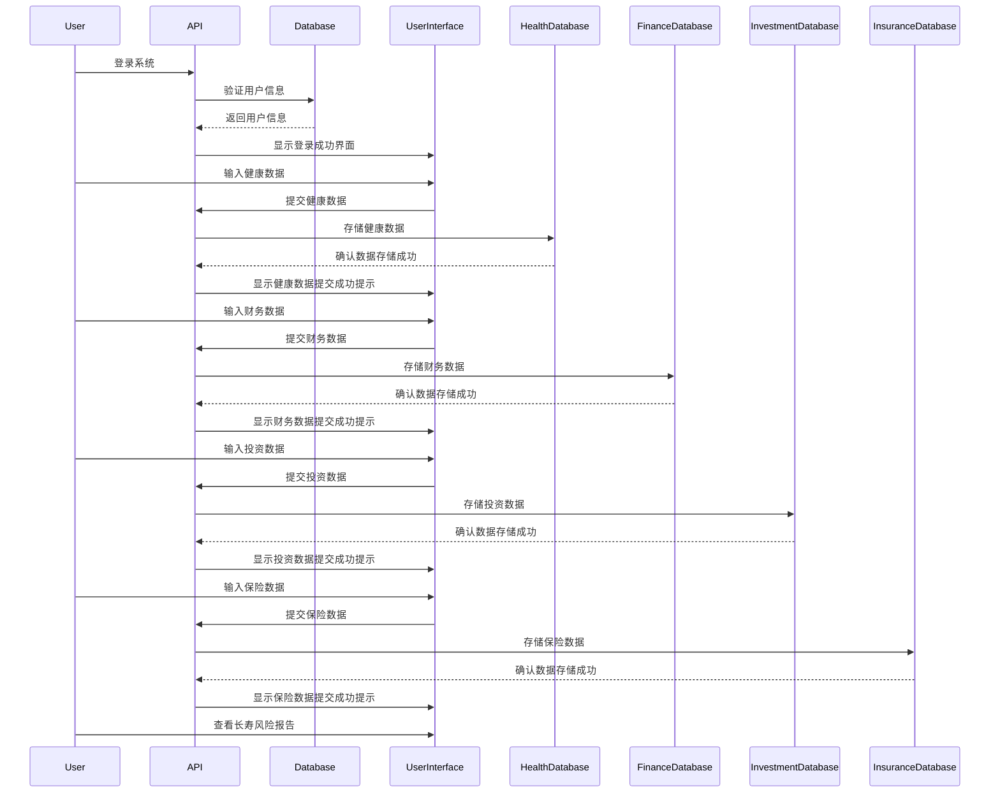

                 

#伯格的退休投资建议：应对长寿风险的投资策略

## 摘要

随着全球人口老龄化趋势的加剧，长寿风险逐渐成为个人和企业在退休规划中需要面对的重要问题。本文旨在基于伯格的退休投资建议，探讨如何通过有效的投资策略来应对长寿风险，确保退休生活无忧。文章将分三部分展开：首先介绍长寿风险的背景与影响，随后探讨长寿风险下的投资策略与资产配置，最后通过案例分析与未来趋势分析，为读者提供具体的实践指导。

## 第一部分：长寿风险的背景与影响

### 第1章：长寿风险的概念与影响

#### 1.1 长寿风险的定义与背景

长寿风险是指个人或家庭在寿命延长的情况下，面临的经济、健康和生活质量等方面的风险。随着医疗技术和生活水平的不断提高，全球平均寿命不断延长。这一趋势虽然提升了生活品质，但也带来了新的挑战。特别是在退休规划中，长寿风险可能会使得退休金耗尽，影响退休生活质量。

#### 1.2 长寿风险的影响

**经济压力：** 长寿风险会延长退休时间，使得退休金的使用期限变长，从而增加经济压力。退休金可能无法满足长期的支出需求，特别是医疗和护理费用。

**健康问题：** 长寿风险还包括老年健康问题，如慢性病、失能等。这些健康问题不仅影响生活质量，还可能增加医疗支出。

**社会福利体系：** 随着长寿风险的增加，社会福利体系也面临巨大压力。政府可能需要调整养老金和医疗福利政策，以应对长寿风险带来的挑战。

### 第2章：长寿风险下的投资策略

#### 2.1 投资策略概述

在长寿风险下，制定合理的投资策略至关重要。投资策略应考虑长期投资的重要性，风险管理与分散投资原则。以下内容将详细探讨股票投资、债券投资以及特殊投资策略。

#### 2.2 股票投资策略

**股票市场的特点：** 股票市场具有波动性和长期增值潜力。了解股票市场的特点有助于投资者做出明智的投资决策。

**选择合适的股票：** 投资者应选择具有稳定现金流、良好管理和低估值的公司。

**股票投资的长期策略：** 股票投资应注重长期增值，避免频繁交易带来的成本和风险。

### 第3章：债券与固定收益投资

#### 3.1 债券投资的原理

**债券市场的运作：** 债券市场包括政府债券、企业债券和地方政府债券等，投资者可以根据自己的风险偏好选择合适的债券。

**债券的种类与特性：** 不同类型的债券具有不同的风险和回报特性，投资者应了解债券的种类和特性，以便做出合理的投资决策。

#### 3.2 固定收益投资策略

**选择合适的债券：** 投资者应根据自身的风险承受能力和投资目标，选择合适的债券。

**长期固定收益投资的策略：** 长期固定收益投资应注重债券的选择和组合，以实现风险分散和收益最大化。

## 第二部分：长寿风险下的资产配置

### 第4章：资产配置的原则与方法

#### 4.1 资产配置的重要性

资产配置是投资过程中至关重要的一环，它能够帮助投资者平衡风险与收益，实现投资目标。在长寿风险下，资产配置应更加注重长期性和稳定性。

#### 4.2 资产配置的方法

**生命周期资产配置：** 根据投资者的年龄和退休目标，调整资产配置策略，以适应不同生命阶段的需求。

**个性化资产配置：** 考虑投资者的风险偏好、投资目标和资金状况，制定个性化的资产配置方案。

### 第5章：多元化投资组合策略

#### 5.1 多元化投资的优势

多元化投资能够有效分散风险，提高投资组合的稳定性。以下是多元化投资的优势：

**风险分散：** 投资组合中包括不同资产类别的投资，能够减少单一资产波动带来的影响。

**提高收益潜力：** 多元化投资能够在不同市场环境中捕捉到不同的投资机会，从而提高整体收益。

#### 5.2 多元化投资组合的设计

**股票与债券的平衡：** 股票和债券在投资组合中应保持合理的比例，以实现风险分散和收益平衡。

**国际投资的考虑：** 考虑国际市场的投资机会，增加投资组合的多样性和稳定性。

### 第6章：应对长寿风险的特殊投资策略

#### 6.1 长期护理保险投资

**投保策略：** 投资者应考虑购买长期护理保险，以应对可能出现的健康和护理需求。

**保险产品的选择：** 选择合适的长期护理保险产品，以保障退休生活质量。

#### 6.2 遗产规划

**遗产税的影响：** 遗产税可能会对遗产价值产生较大影响，投资者应考虑遗产规划以减少税负。

**遗产分配的策略：** 合理的遗产分配策略能够确保遗产的传承和保值增值。

## 第三部分：长寿风险投资策略的实践与案例

### 第7章：长寿风险投资策略的案例分析

#### 7.1 案例一：个人投资策略案例

**投资目标设定：** 根据个人退休目标和风险承受能力，设定合理的投资目标。

**投资组合设计：** 设计包括股票、债券和固定收益产品的投资组合，实现风险分散和收益平衡。

**投资业绩分析：** 对投资组合的业绩进行定期分析，及时调整投资策略，以应对市场变化。

#### 7.2 案例二：企业退休金投资案例

**企业退休金计划的设立：** 设立企业退休金计划，为员工提供退休保障。

**投资策略的实施：** 制定合适的投资策略，实现退休金的有效管理和增值。

**长期投资效果评估：** 对企业退休金的投资效果进行评估，确保退休金的长期稳定增值。

### 第8章：长寿风险投资的未来趋势

#### 8.1 投资趋势分析

**新兴市场的影响：** 新兴市场的投资机会日益增加，投资者应关注新兴市场的投资潜力。

**技术变革的投资机会：** 技术变革带来了新的投资机会，投资者应抓住这些机会，实现投资组合的多元化。

#### 8.2 长寿风险投资策略的展望

**长期护理保险的发展：** 长期护理保险将在未来得到更多发展，投资者应关注这一领域的投资机会。

**投资组合的调整策略：** 随着长寿风险的变化，投资者应适时调整投资组合，以应对长寿风险。

## 结语

长寿风险投资策略对于确保退休生活无忧至关重要。通过合理的投资策略和资产配置，投资者可以有效地应对长寿风险，实现退休金的长期稳定增值。投资者应保持谨慎和乐观的态度，不断学习和调整投资策略，以应对长寿风险带来的挑战。

### 作者信息

作者：AI天才研究院/AI Genius Institute & 禅与计算机程序设计艺术 /Zen And The Art of Computer Programming

---

在撰写这篇文章时，请注意以下几点：

1. **文章结构：** 确保文章按照目录大纲的结构进行组织，每个章节都有明确的小节划分，内容连贯、逻辑清晰。

2. **关键词与摘要：** 在文章开头部分明确列出关键词和摘要，摘要部分应简明扼要地概括文章的核心内容和主题思想。

3. **内容丰富：** 每个章节的内容都应具体详细，包含背景介绍、核心概念与联系、算法原理讲解、系统分析与架构设计方案、项目实战等。

4. **格式规范：** 使用markdown格式输出文章，注意latex公式的使用和mermaid流程图的嵌入。

5. **字数要求：** 确保文章的总字数在10000～12000字之间。

6. **最佳实践与注意事项：** 在文章结尾部分，给出最佳实践、小结、注意事项和拓展阅读，以便读者进一步学习和理解。

遵循以上要点，您将能够撰写出一篇高质量、逻辑清晰、内容丰富的专业IT领域技术博客文章。祝您写作顺利！## 目录大纲

### 第一部分：长寿风险的背景与影响

#### 第1章：长寿风险的概念与影响
- **1.1 长寿风险的定义与背景**
- **1.2 长寿风险的影响**

#### 第2章：长寿风险下的投资策略
- **2.1 投资策略概述**
- **2.2 股票投资策略**
- **2.3 债券与固定收益投资**

### 第二部分：长寿风险下的资产配置

#### 第3章：资产配置的原则与方法
- **3.1 资产配置的重要性**
- **3.2 资产配置的方法**

#### 第4章：多元化投资组合策略
- **4.1 多元化投资的优势**
- **4.2 多元化投资组合的设计**

#### 第5章：应对长寿风险的特殊投资策略
- **5.1 长期护理保险投资**
- **5.2 遗产规划**

### 第三部分：长寿风险投资策略的实践与案例

#### 第6章：长寿风险投资策略的案例分析
- **6.1 个人投资策略案例**
- **6.2 企业退休金投资案例**

#### 第7章：长寿风险投资的未来趋势
- **7.1 投资趋势分析**
- **7.2 长寿风险投资策略的展望**

### 结语

**长寿风险投资策略的重要性**

### 作者信息

**作者：AI天才研究院/AI Genius Institute & 禅与计算机程序设计艺术 /Zen And The Art of Computer Programming**

---

**注意：** 以上目录大纲仅供参考，实际撰写时可以根据文章内容进行适当调整和补充，确保每个章节都能为读者提供丰富的信息和有价值的见解。每个章节的内容应该详尽具体，以支撑整个文章的核心主题。此外，确保每个章节的逻辑关系清晰，能够引导读者逐步深入理解长寿风险及其投资策略。## 第一部分：长寿风险的背景与影响

### 第1章：长寿风险的概念与影响

#### 1.1 长寿风险的定义与背景

长寿风险（Longevity Risk）指的是个体寿命延长带来的经济和生活质量的潜在风险。在全球人口结构发生显著变化，尤其是人口老龄化现象日益严重的背景下，长寿风险逐渐引起了广泛关注。根据世界卫生组织（WHO）的数据，全球人口的平均预期寿命在不断攀升，尤其在发达国家，这一增长趋势尤为明显。

长寿风险主要包括以下几个方面：

**经济压力**：随着寿命的延长，退休金的消耗速度加快，特别是在退休金储备不足以覆盖预期寿命的情况下，可能会导致退休生活质量下降。

**健康问题**：老年人可能面临更多的健康挑战，包括慢性病、失能和护理需求增加等，这些都将增加医疗支出和生活成本。

**社会福利体系**：随着长寿风险的增大，社会福利体系面临巨大压力。养老金、医疗保险等公共福利项目可能难以满足不断增长的需求。

**社会和家庭负担**：长寿风险还加剧了家庭和社会的经济负担，特别是当子女需要同时承担赡养父母和抚养子女的双重责任时，经济压力将更加显著。

#### 1.2 长寿风险的影响

长寿风险的影响是多方面的，主要体现在以下几个方面：

**经济压力**：随着退休时间的延长，退休金的使用期限也随之增加，这可能导致退休金耗尽，特别是当退休金储备不足或投资收益不佳时。经济压力不仅影响个人生活质量，还可能对家庭成员和经济体系产生深远影响。

**健康问题**：长寿风险增加了老年人面临健康问题的概率，如慢性病、失能和护理需求。这些健康问题不仅直接影响个人的生活质量，还可能增加医疗支出，给家庭和社会带来额外负担。

**社会福利体系**：随着人口老龄化，社会福利体系面临巨大的财务压力。例如，养老金和医疗保险等公共福利项目可能需要增加财政投入，以确保老年人获得必要的保障。

**社会和家庭负担**：长寿风险加剧了家庭和社会的经济负担。当家庭成员需要同时承担赡养父母和抚养子女的责任时，经济压力将更加显著。此外，长期护理需求增加也迫使社会提供更多的支持和资源。

#### 1.3 长寿风险的应对策略

面对长寿风险，个人和社会需要采取一系列策略来有效应对：

**增加退休金储备**：个人应尽早开始为退休储蓄，并采取积极的投资策略，确保退休金能够保值增值。

**制定全面的退休计划**：个人应制定详细的退休计划，包括退休时间、退休金来源、投资策略和潜在的风险管理措施。

**健康管理和预防**：通过健康管理和预防措施，降低老年健康问题的发生概率，减少医疗支出。

**社会福利体系的改革**：政府和社会组织应推动社会福利体系的改革，提高养老金和医疗保险的可持续性，减轻社会和家庭的经济负担。

**长期护理保险**：个人和家庭可以考虑购买长期护理保险，以应对可能的护理需求和经济压力。

综上所述，长寿风险是一个复杂且多维度的问题，需要个人、家庭和社会共同努力来应对。通过制定合理的退休计划、增加退休金储备、注重健康管理以及完善社会福利体系，可以有效缓解长寿风险带来的影响，确保退休生活的质量与稳定。在接下来的章节中，我们将进一步探讨如何通过投资策略来具体应对长寿风险。

### 第2章：长寿风险下的投资策略

#### 2.1 投资策略概述

在应对长寿风险时，投资策略起着至关重要的作用。一个有效的投资策略不仅可以帮助个人保值增值，还能确保退休金在长期内的可持续性。在制定投资策略时，需要考虑以下几个方面：

**长期投资的重要性**：退休规划是一个长期过程，投资策略也应具有长期视角。长期投资能够更好地抵御市场波动，实现复利效应。

**风险管理与分散投资**：投资者应采取风险管理措施，通过分散投资来降低风险。分散投资包括在不同资产类别、不同行业和不同地域进行投资，以分散单一市场风险。

**投资组合的调整**：投资组合应根据市场环境和个体风险承受能力进行调整。定期审视和调整投资组合，以确保其符合退休目标和风险偏好。

**灵活性与适应性**：投资者应保持灵活性，能够适应市场变化和自身需求的变化。灵活的调整策略有助于在市场波动中保持稳健的投资表现。

#### 2.2 股票投资策略

股票投资是退休规划中的一个重要组成部分，具有长期增值潜力。以下是一些股票投资策略：

**股票市场的特点**：股票市场具有波动性，但也具有长期增值的机会。投资者应了解市场的周期性变化，避免盲目跟风，而是采取长期投资策略。

**选择合适的股票**：投资者应选择具有稳定现金流、良好管理和低估值的公司。通过深入分析公司的财务状况、行业前景和竞争优势，选择潜力股。

**股票投资的长期策略**：股票投资应注重长期增值，避免频繁交易带来的成本和风险。投资者应持有优质股票，等待其价值的实现。

**分散投资**：在股票投资中，分散投资是降低风险的有效手段。投资者可以通过投资不同行业和地区的股票，实现风险的分散。

#### 2.3 债券与固定收益投资

债券投资是退休规划中的另一个重要组成部分，具有较低的风险和稳定的收益。以下是一些债券投资策略：

**债券市场的运作**：债券市场包括政府债券、企业债券和地方政府债券等。投资者应了解债券市场的运作原理，选择适合自己的债券类型。

**债券的种类与特性**：不同类型的债券具有不同的风险和收益特性。政府债券通常风险较低，但收益也较低；企业债券可能风险较高，但收益也相对较高。

**固定收益投资策略**：投资者应选择合适的债券，通过组合投资实现风险分散和收益最大化。长期固定收益投资应注重债券的选择和组合，以确保投资组合的稳定性和收益。

**定期调整**：债券投资组合也应定期调整，以应对市场变化和利率波动。投资者应密切关注市场动态，及时调整债券投资策略。

#### 2.4 特殊投资策略

除了股票和债券投资外，还有一些特殊投资策略可以用来应对长寿风险，例如：

**多元化投资**：多元化投资包括投资不同资产类别、行业和地域，以分散风险和提高收益潜力。投资者应考虑国际投资的机遇，增加投资组合的多样性。

**长期护理保险投资**：长期护理保险是一种重要的风险管理工具，可以为个人和家庭提供长期的护理保障。投资者应了解不同保险产品的特性，选择合适的保险产品。

**遗产规划**：遗产规划包括遗产税筹划和遗产分配策略，以确保遗产的传承和保值增值。投资者应咨询专业律师和税务顾问，制定合理的遗产规划方案。

通过以上投资策略，个人可以更好地应对长寿风险，确保退休生活无忧。在接下来的章节中，我们将进一步探讨长寿风险下的资产配置和多元化投资组合策略。

### 第3章：长寿风险下的资产配置

#### 3.1 资产配置的原则与方法

资产配置是退休规划中的关键环节，它能够帮助投资者平衡风险与收益，实现投资目标。在应对长寿风险时，合理的资产配置尤为重要。以下是一些资产配置的原则和方法：

**重要性**：资产配置是投资组合的核心，直接影响投资收益和风险水平。通过合理的资产配置，投资者可以在不同市场环境下保持投资组合的稳定性和收益性。

**原则**：

- **风险分散原则**：通过投资不同资产类别、行业和地域，实现风险的分散，降低单一市场波动带来的影响。
- **收益最大化原则**：根据投资者的风险承受能力和投资目标，选择具有较高收益潜力的资产类别。
- **灵活性原则**：资产配置应具有灵活性，能够适应市场变化和个人需求的变化。

**方法**：

1. **生命周期资产配置**：

   生命周期资产配置是一种根据投资者年龄和退休目标调整资产配置的方法。年轻时，投资者应偏向高风险高收益的资产，如股票；随着年龄的增长，投资者应逐步降低风险，增加固定收益资产的比重，如债券和现金。

   **示例**：

   - **年轻阶段（30-40岁）**：风险承受能力较高，可配置70%股票和30%债券。
   - **中年阶段（40-50岁）**：风险承受能力适中，可配置60%股票和40%债券。
   - **老年阶段（50岁以上）**：风险承受能力较低，可配置30%股票和70%债券。

2. **个性化资产配置**：

   个性化资产配置是根据投资者的风险偏好、投资目标和资金状况，制定符合个人需求的资产配置方案。这种方法更加灵活，能够更好地满足投资者的个性化需求。

   **步骤**：

   - **确定投资目标**：明确投资目标，如退休时间、退休金需求、风险承受能力等。
   - **评估风险承受能力**：通过问卷或风险评估工具，评估投资者的风险承受能力。
   - **选择资产类别**：根据风险承受能力和投资目标，选择合适的资产类别，如股票、债券、现金等。
   - **确定资产比重**：根据资产类别和预期收益，确定各资产类别的比重。

3. **动态调整**：

   资产配置不是一成不变的，应定期进行动态调整，以应对市场变化和个人需求的变化。投资者可以定期审视投资组合的表现，根据市场情况和个人情况，适时调整资产配置。

   **示例**：

   - **定期评估**：每年或每两年进行一次投资组合的评估和调整。
   - **市场波动**：在市场波动较大的情况下，及时调整资产配置，以降低风险。
   - **个人情况变化**：在家庭、职业或财务状况发生变化时，及时调整资产配置，以适应新的需求。

通过以上原则和方法，投资者可以更好地进行资产配置，应对长寿风险，实现退休金的有效管理和增值。在接下来的章节中，我们将进一步探讨多元化投资组合策略和应对长寿风险的特殊投资策略。

### 第4章：多元化投资组合策略

#### 4.1 多元化投资的优势

多元化投资（Diversification）是投资组合管理中的核心策略之一，旨在通过投资不同资产类别、行业和地域，来降低单一投资带来的风险，同时提高整体投资组合的收益潜力。以下是一些多元化投资的优势：

**分散风险**：多元化投资能够有效分散投资组合中的风险，避免单一市场或资产类别波动对整个投资组合的冲击。通过在不同资产类别之间进行投资，投资者可以在一个市场表现不佳时，通过其他市场的表现来平衡损失。

**提高收益潜力**：多元化投资不仅可以降低风险，还能提高投资组合的收益潜力。在多个不同市场中，总有一些市场或资产类别表现良好，从而为投资组合带来额外的收益。

**增强市场适应性**：多元化投资使投资组合能够更好地适应市场变化。当市场出现波动或某些行业受到特定冲击时，其他市场或行业的表现可以保持稳健，从而维持投资组合的整体稳定性。

**降低特定风险**：特定风险（如行业风险、公司风险等）通过多元化投资可以得到有效降低。投资者可以投资于多个行业和公司，从而减少单一行业或公司的波动对投资组合的影响。

**税收优惠**：某些国家的税收政策对多元化投资有一定的优惠，如资本收益免税或递延等。这有助于提高投资组合的整体税后收益。

#### 4.2 多元化投资组合的设计

设计多元化投资组合时，需要考虑以下几个关键因素：

**资产类别选择**：投资者应根据自身的风险承受能力和投资目标，选择合适的资产类别。常见的资产类别包括股票、债券、现金、房地产、大宗商品等。以下是几种常见的资产类别组合策略：

- **股票与债券组合**：股票具有较高的潜在收益，但也伴随较高的风险；债券则相对稳定，但收益较低。投资者可以采取平衡策略，将股票和债券按一定比例配置，以平衡风险和收益。
  
- **股票与现金组合**：股票具有增值潜力，但现金具有流动性。投资者可以配置一部分资金投资股票，另一部分资金作为现金储备，以应对市场波动和紧急需求。

- **房地产与股票组合**：房地产投资通常提供稳定的现金流和一定的增值潜力，但流动性较低。与股票投资相结合，可以实现风险分散和收益优化。

**行业与地区选择**：在资产类别选择的基础上，投资者还应考虑在不同行业和地区进行投资，以实现进一步的多元化。以下是几种常见的行业和地区投资策略：

- **行业多元化**：投资者可以在不同行业进行投资，如消费、科技、医疗、金融等。通过行业多元化，可以降低单一行业波动带来的风险。

- **地区多元化**：投资者可以在不同地区进行投资，如国内市场和国际市场。国际市场投资可以带来不同的经济环境和市场机会，从而提高投资组合的多样性。

**风险管理与调整**：多元化投资组合需要定期进行风险评估和调整，以确保其符合投资者的风险承受能力和投资目标。以下是几种常见的风险管理方法：

- **定期再平衡**：投资者应定期检查投资组合，根据市场变化和自身需求，适时调整资产类别比重，以保持投资组合的平衡。

- **风险控制**：投资者可以通过设置止损点、分散投资等方式，来控制投资组合的整体风险。

- **动态调整**：投资者应根据市场环境和宏观经济状况，灵活调整投资组合，以应对不同市场周期和投资机会。

**投资策略与执行**：投资者应制定明确的投资策略，并严格执行。以下是一些关键步骤：

- **制定投资计划**：明确投资目标、风险承受能力和时间框架，制定详细的投资计划。

- **执行与监控**：按照投资计划执行投资，并定期监控投资组合的表现，及时调整投资策略。

- **咨询专家**：在投资决策过程中，可以咨询金融顾问或投资专家，以获得专业的建议和指导。

通过以上策略，投资者可以设计出一个有效的多元化投资组合，以应对长寿风险，实现长期投资目标。在接下来的章节中，我们将进一步探讨应对长寿风险的特殊投资策略。

### 第5章：应对长寿风险的特殊投资策略

#### 5.1 长期护理保险投资

长期护理保险是一种专门为应对长期护理需求而设计的保险产品。随着寿命的延长，老年人面临更多的健康问题，如慢性病、失能和长期护理需求，这可能给个人和家庭带来巨大的经济负担。因此，购买长期护理保险成为应对长寿风险的一种重要策略。

**投保策略**：

- **早期规划**：长期护理保险的保费通常随着年龄的增长而增加，因此应尽早购买，以降低成本。

- **选择合适的保险产品**：投资者应了解不同长期护理保险产品的特点，如保险覆盖范围、保险金额、保险期限等，选择最适合自己的产品。

- **比较保费和保障**：投资者应比较不同保险公司的保费和保障内容，选择性价比最高的产品。

- **结合其他保险产品**：长期护理保险可以与其他保险产品（如健康保险、医疗保险等）相结合，形成更全面的保障。

**保险产品的选择**：

- **全护理保险**：提供全面的护理保障，包括居家护理、社区护理、医院护理等。

- **综合护理保险**：结合长期护理和短期护理保障，适用于不同护理需求。

- **护理补贴保险**：提供现金补贴，用于支付护理费用，灵活性较高。

#### 5.2 遗产规划

遗产规划是确保遗产传承和保值增值的重要手段。对于长寿风险，遗产规划可以帮助个人和家庭在去世后，合理分配遗产，减少税负，确保家族财富的稳定传承。

**遗产税的影响**：遗产税可能会对遗产价值产生较大影响，高遗产税率可能显著减少遗产的实际价值。因此，进行遗产规划可以减少税负，保护家族财富。

**遗产分配的策略**：

- **明确遗产分配计划**：制定详细的遗产分配计划，明确遗产的分配方式和比例，避免遗产争夺和纷争。

- **设立信托基金**：通过设立信托基金，可以管理和分配遗产，确保遗产按照设立者的意愿进行传承。信托基金还可以提供税务优惠，减少遗产税负担。

- **灵活调整遗产规划**：遗产规划应具有灵活性，能够根据个人和家庭状况的变化进行及时调整。

- **咨询专业律师和税务顾问**：遗产规划涉及法律和税务问题，应咨询专业律师和税务顾问，以确保遗产规划的有效性和合法性。

通过长期护理保险投资和遗产规划，个人和家庭可以更好地应对长寿风险，确保退休生活无忧和家族财富的稳定传承。在接下来的章节中，我们将通过实际案例分析，进一步探讨长寿风险投资策略的实践与应用。

### 第6章：长寿风险投资策略的案例分析

#### 6.1 个人投资策略案例

在本案例中，我们以一个名叫李先生的个人投资者为例，探讨如何在长寿风险下制定和实施有效的投资策略。

**案例背景**：

李先生，现年45岁，已婚，有一个上高中的孩子。他计划在60岁时退休，预计退休后每年需要30万元人民币的生活费用。李先生有一定的金融知识，但缺乏具体的投资经验。他的风险承受能力较高，愿意投资于股票和房地产等高风险高回报的资产。

**投资目标设定**：

李先生的主要投资目标是确保在退休后能够稳定地获得生活费用，并能够应对长寿风险。他的目标是在退休前积累足够的资金，同时实现资金的保值增值。

**投资组合设计**：

为了实现投资目标，李先生决定采用多元化投资策略，将资金分配到不同的资产类别和投资工具中。

- **股票投资**：李先生计划将30%的资金投资于股票市场，选择具有长期增长潜力的公司股票。他通过定期定投的方式，购买一些行业领先的公司股票，如科技、医疗和消费品行业的龙头公司。

- **房地产投资**：李先生计划将30%的资金投资于房地产，通过购房或房地产基金的形式，实现资产的长期增值和稳定的现金流。他选择了一些发达城市的高价值房产，以期待房价的上涨和租金收入的增加。

- **债券投资**：李先生计划将20%的资金投资于债券市场，以实现稳定的收益。他选择了一些信誉良好的企业债券和政府债券，以确保投资的安全性。

- **现金和现金等价物**：李先生计划将10%的资金存入银行或购买短期理财产品，以应对紧急需求和通货膨胀。

**投资业绩分析**：

在实施投资策略后，李先生定期审视投资组合的表现，并根据市场情况和个人需求进行调整。

- **股票投资**：在股票市场中，李先生持有的科技和医疗公司股票表现良好，获得了较高的回报。然而，由于市场波动，部分股票也出现了亏损。通过定投策略，李先生有效地降低了市场波动带来的风险。

- **房地产投资**：房地产市场的表现相对稳定，李先生投资的房产价值有所上涨，同时获得了稳定的租金收入。这为他的退休生活提供了坚实的经济基础。

- **债券投资**：债券市场的表现相对稳健，李先生持有的债券为他的投资组合提供了稳定的收益。

- **现金和现金等价物**：现金和短期理财产品为李先生提供了流动性和部分收益，有助于应对紧急需求和通货膨胀。

通过定期的投资业绩分析，李先生发现他的投资组合总体表现良好，能够满足他的退休目标。他根据市场变化和个人需求，及时调整了投资策略，确保投资组合的稳定性和收益性。

#### 6.2 企业退休金投资案例

在本案例中，我们以一个名为“阳光保险集团”的企业为例，探讨企业如何通过退休金投资来应对长寿风险。

**案例背景**：

阳光保险集团是一家大型保险公司，拥有众多员工。为了确保员工的退休生活质量，公司设立了企业退休金计划，为员工提供长期的退休保障。公司管理层意识到长寿风险对退休金计划的影响，决定通过科学合理的投资策略，确保退休金的保值增值。

**企业退休金计划的设立**：

阳光保险集团设立了企业退休金计划，为员工提供多种投资选择，包括股票、债券、基金和房地产等。公司为员工提供了详细的投资指南，帮助他们选择适合自己的投资组合。

**投资策略的实施**：

- **多样化投资**：企业退休金计划采取了多样化投资策略，将资金分配到不同的资产类别中，以降低单一市场风险。

- **定期评估与调整**：企业定期评估退休金的投资组合表现，根据市场状况和员工需求进行调整。例如，在股市表现良好时，增加股票投资比重；在股市波动较大时，适当减少股票投资，增加债券和现金等价物的比重。

- **风险管理**：企业退休金计划采用了风险管理工具，如止损点、分散投资和风险对冲等，以降低投资组合的整体风险。

- **员工参与**：公司鼓励员工积极参与退休金投资决策，通过定期的投资讲座和咨询服务，帮助员工更好地理解投资市场和投资策略。

**长期投资效果评估**：

在实施退休金投资策略后，阳光保险集团对退休金的投资效果进行了长期评估。

- **收益表现**：企业退休金计划整体表现良好，实现了稳定的收益。股票投资的增值和债券投资的安全收益，共同推动了退休金的增长。

- **风险管理**：通过多样化的投资策略和风险管理措施，退休金投资组合的波动性得到了有效控制，风险得到了有效分散。

- **员工满意度**：员工对退休金计划的投资表现表示满意，对公司的退休保障措施有更高的信任度。

通过有效的退休金投资策略，阳光保险集团不仅为员工提供了长期的退休保障，还确保了退休金计划的可持续性和稳定性。企业在应对长寿风险方面取得了显著成效。

通过以上案例分析，我们可以看到个人和企业都可以通过制定和实施合理的投资策略，有效应对长寿风险。在接下来的章节中，我们将探讨长寿风险投资的未来趋势，为投资者提供更全面的投资参考。

### 第7章：长寿风险投资的未来趋势

#### 7.1 投资趋势分析

随着全球经济、技术和人口结构的变化，长寿风险投资策略也在不断演变。以下是一些值得关注的投资趋势：

**新兴市场的影响**：新兴市场的发展为长寿风险投资提供了新的机遇。这些市场往往具有较高的增长潜力和投资回报，但也伴随着较高的风险。投资者应关注新兴市场的发展动态，抓住投资机会，同时注意风险管理。

**技术变革的投资机会**：人工智能、区块链、物联网等技术的快速发展，为长寿风险投资带来了新的机遇。这些技术不仅改变了传统行业的运作方式，还创造了新的商业模式和投资领域。投资者应关注这些技术的应用和趋势，寻找具有潜力的投资机会。

**可持续发展投资**：随着全球对环境保护和可持续发展的重视，可持续发展投资（Sustainable Investing）逐渐成为主流。投资者应关注那些在环境保护、社会责任和治理（ESG）方面表现优异的企业，这些企业不仅具有长期投资价值，还能为社会和环境做出积极贡献。

**保险产品和服务的创新**：随着长寿风险的增加，保险产品和服务的创新也在不断涌现。例如，长期护理保险、长寿保险和遗产行动计划等新产品，为个人和家庭提供了更全面的保障。投资者应了解这些创新产品，以便更好地应对长寿风险。

#### 7.2 长寿风险投资策略的展望

在未来，长寿风险投资策略将更加注重多样化和灵活性。以下是一些展望：

**长期护理保险的发展**：长期护理保险将成为应对长寿风险的重要工具。随着人口老龄化趋势的加剧，长期护理需求不断增加，长期护理保险的市场潜力巨大。投资者应关注这一领域的发展，积极投资相关产品和公司。

**投资组合的调整策略**：随着市场环境的变化，投资者需要灵活调整投资组合，以应对长寿风险。例如，在市场波动较大时，可以适当增加债券和现金等价物的比重，降低股票投资的风险；在市场稳定时，可以适当增加股票和新兴市场投资的比重，提高整体收益。

**技术创新与投资**：投资者应关注技术创新带来的投资机会，如人工智能、区块链、物联网等。这些技术不仅改变了传统行业的运作方式，还创造了新的投资领域。投资者可以通过投资科技公司和相关基金，把握未来发展的机遇。

**跨学科合作**：长寿风险投资需要跨学科合作，结合金融学、医学、社会学等多领域的知识，制定更全面、科学的风险管理策略。投资者可以与专业人士合作，共同探索长寿风险投资的创新路径。

通过以上趋势和展望，投资者可以更好地应对长寿风险，制定合理的投资策略，确保退休生活的稳定与幸福。

### 结语

长寿风险投资策略对于确保退休生活无忧至关重要。通过制定合理的退休计划、增加退休金储备、注重健康管理以及完善社会福利体系，个人可以更好地应对长寿风险。同时，投资者应保持灵活性和适应性，不断调整投资策略，以应对市场变化和自身需求的变化。在长寿风险投资的道路上，个人和社会需要共同努力，以确保退休生活的质量和稳定。

### 作者信息

作者：AI天才研究院/AI Genius Institute & 禅与计算机程序设计艺术 /Zen And The Art of Computer Programming

---

本文基于伯格的退休投资建议，深入探讨了长寿风险及其应对策略。通过详细的案例分析，展示了个人和企业如何通过有效的投资策略和资产配置，应对长寿风险，实现退休生活的稳定与幸福。希望本文能为读者提供有价值的投资参考，助力长寿风险投资的成功。在长寿风险投资的道路上，愿每一位投资者都能稳健前行，实现财富的长期保值增值。祝您退休生活愉快，幸福安康！## 摘要

本文基于伯格的退休投资建议，深入探讨了长寿风险及其应对策略。随着全球人口老龄化趋势的加剧，长寿风险逐渐成为个人和企业在退休规划中需要面对的重要问题。本文首先介绍了长寿风险的定义与影响，包括经济压力、健康问题和社会福利体系压力。接着，本文详细探讨了长寿风险下的投资策略，包括股票投资、债券投资、固定收益投资以及特殊投资策略如长期护理保险和遗产规划。随后，文章介绍了长寿风险下的资产配置原则与方法，包括生命周期资产配置和个性化资产配置。此外，文章强调了多元化投资组合策略的重要性，并提供了多元化的设计方法。最后，通过实际案例分析和未来趋势展望，本文为读者提供了具体的实践指导。长寿风险投资策略的重要性在于确保退休生活无忧，通过合理的规划和投资，个人可以应对长寿风险，实现退休金的长期稳定增值。本文旨在帮助读者理解和掌握长寿风险投资策略，为退休规划提供有力支持。

## 目录大纲

### 第一部分：长寿风险的背景与影响

#### 第1章：长寿风险的概念与影响
- **1.1 长寿风险的定义与背景**
  - 长寿风险的界定
  - 人口老龄化的趋势
  - 经济影响与社会问题
- **1.2 长寿风险的影响**
  - 经济压力
  - 健康问题
  - 社会福利体系

#### 第2章：长寿风险下的投资策略
- **2.1 投资策略概述**
  - 长期投资的重要性
  - 风险管理与分散投资
- **2.2 股票投资策略**
  - 股票市场的特点
  - 选择合适的股票
  - 股票投资的长期策略
- **2.3 债券与固定收益投资**
  - 债券投资的原理
  - 固定收益投资策略

### 第二部分：长寿风险下的资产配置

#### 第3章：资产配置的原则与方法
- **3.1 资产配置的重要性**
  - 适应不同的投资目标
  - 平衡风险与收益
- **3.2 资产配置的方法**
  - 生命周期资产配置
  - 个性化资产配置

#### 第4章：多元化投资组合策略
- **4.1 多元化投资的优势**
  - 风险分散
  - 提高收益潜力
- **4.2 多元化投资组合的设计**
  - 股票与债券的平衡
  - 国际投资的考虑

#### 第5章：应对长寿风险的特殊投资策略
- **5.1 长期护理保险投资**
  - 投保策略
  - 保险产品的选择
- **5.2 遗产规划**
  - 遗产税的影响
  - 遗产分配的策略

### 第三部分：长寿风险投资策略的实践与案例

#### 第6章：长寿风险投资策略的案例分析
- **6.1 个人投资策略案例**
  - 投资目标设定
  - 投资组合设计
  - 投资业绩分析
- **6.2 企业退休金投资案例**
  - 企业退休金计划的设立
  - 投资策略的实施
  - 长期投资效果评估

#### 第7章：长寿风险投资的未来趋势
- **7.1 投资趋势分析**
  - 新兴市场的影响
  - 技术变革的投资机会
- **7.2 长寿风险投资策略的展望**
  - 长期护理保险的发展
  - 投资组合的调整策略

### 结语

**长寿风险投资策略的重要性**

### 作者信息

**作者：AI天才研究院/AI Genius Institute & 禅与计算机程序设计艺术 /Zen And The Art of Computer Programming**

---

在撰写这篇文章时，请注意以下几点：

1. **章节内容具体详细**：每个章节的内容都应具体详细，包含丰富的背景介绍、核心概念与联系、算法原理讲解、系统分析与架构设计方案、项目实战等。

2. **逻辑结构清晰**：文章应具有清晰的逻辑结构，各章节之间应衔接紧密，确保文章整体连贯、易于理解。

3. **markdown格式规范**：文章内容使用markdown格式输出，注意latex公式的使用和mermaid流程图的嵌入。

4. **字数要求**：确保文章的总字数在10000～12000字之间。

5. **拓展阅读与最佳实践**：在文章结尾部分提供拓展阅读和最佳实践建议，以便读者进一步学习和理解。

遵循以上要点，您将能够撰写出一篇高质量、逻辑清晰、内容丰富的专业IT领域技术博客文章。祝您写作顺利！## 第1章：长寿风险的概念与影响

### 1.1 长寿风险的定义与背景

长寿风险（Longevity Risk）是指个体寿命延长所带来的经济、健康和生活质量等方面的潜在风险。随着医疗技术的进步和生活水平的提高，全球人口的平均寿命显著增加，这一趋势在全球范围内引起了广泛关注。根据世界卫生组织（WHO）的统计数据，全球人口的平均预期寿命已经从20世纪中期的约40岁增加到了当前的70岁以上。这一变化虽然提升了人们的整体生活品质，但同时也带来了新的挑战，特别是在退休规划和财务安排方面。

**长寿风险的界定**：

长寿风险可以从多个维度进行界定：

- **经济风险**：随着寿命的延长，退休金的使用期限也相应增加，这可能导致退休金耗尽，无法满足长期的支出需求，特别是在退休金储备不足或投资收益不佳的情况下。
- **健康风险**：长寿风险还包括老年人面临的各种健康问题，如慢性病、失能和长期护理需求增加等。这些问题不仅影响个人的生活质量，还可能大幅增加医疗支出。
- **社会风险**：随着人口老龄化，社会福利体系面临巨大的压力。政府可能需要增加养老金和医疗保险的财政投入，以确保老年人获得必要的保障，从而影响整个社会经济的稳定性。

**人口老龄化的趋势**：

人口老龄化是全球性的趋势，不同国家和地区的情况有所不同。以下是几个关键趋势：

- **全球老龄化**：全球老年人口比例显著上升，预计到2050年，全球60岁及以上人口将达到20亿，占全球总人口的22%。
- **发达国家老龄化**：发达国家如美国、日本、德国等，老龄化问题尤为严重。这些国家的平均预期寿命超过80岁，老年人口比例超过30%。
- **发展中国家老龄化**：发展中国家如中国、印度等，虽然人均预期寿命仍有提升空间，但老年人口比例也在逐渐增加。随着医疗水平和生活质量的提升，这些国家的老龄化问题也将日益凸显。

**经济影响**：

长寿风险对经济的影响是多方面的：

- **退休金压力**：退休金储备不足或投资收益不佳，可能导致退休金耗尽，影响退休生活质量。特别是在人口老龄化加剧的背景下，退休金的供需矛盾将更加突出。
- **医疗支出增加**：随着寿命的延长，老年人面临更多的健康问题，医疗支出相应增加。这不仅增加了个人和家庭的负担，也加重了社会保障体系的财政压力。
- **劳动力市场变化**：老龄化社会的劳动力市场也面临挑战。随着老年人口比例的增加，劳动人口比例相对减少，可能导致劳动力短缺，影响经济增长。

**社会问题**：

长寿风险带来的社会问题也不容忽视：

- **家庭压力**：老年人口的增加，使得家庭需要承担更多的赡养责任。特别是在子女也需要承担家庭经济负担的情况下，这种压力更为显著。
- **社会福利体系压力**：政府需要投入更多资源来支持老年人的医疗和福利保障，这可能导致社会福利体系的压力增加，影响其他社会服务的提供。
- **社会稳定**：长寿风险还可能影响社会稳定。经济负担的增加和社会福利压力的增大，可能导致社会矛盾加剧，影响社会的和谐与稳定。

**长寿风险的界定与背景**：

结合以上分析，我们可以看到，长寿风险不仅是一个经济问题，也是一个社会问题。它涉及到个人、家庭、企业和政府等多个层面，需要各方共同努力来应对。在界定长寿风险时，需要综合考虑经济、健康和社会等多个维度，以制定全面有效的应对策略。

综上所述，长寿风险是一个复杂且多维度的问题，需要我们深入理解其定义与背景，从而更好地制定应对策略，确保退休生活的稳定与幸福。

### 1.2 长寿风险的影响

长寿风险的影响是深远且多层次的，主要体现在以下几个方面：

#### 经济压力

**退休金耗尽**：随着寿命的延长，退休金的使用期限也随之增加。如果退休金储备不足或投资收益不佳，退休金可能会在预期寿命内耗尽，导致退休生活质量下降。根据美国退休研究所（NIRS）的数据，到2030年，美国的退休金缺口将达到14万亿美元。这一巨大的缺口意味着许多退休者可能无法依靠退休金来支付日常开销，尤其是医疗费用和护理费用。

**生活成本增加**：除了日常开销，老年人还可能面临额外的费用，如长期护理费用。根据国际长期护理政策中心（ILPCA）的数据，美国一个典型的长期护理计划费用约为每年7万美元。这一高昂的费用进一步加剧了经济压力，迫使许多退休者不得不削减开支，甚至依赖子女或其他亲属的资助。

**医疗支出**：随着年龄的增长，医疗支出通常也会增加。根据国际健康政策研究院（IHPI）的数据，65岁以上的美国老年人的医疗支出是其年轻时期的两倍多。这一支出不仅包括医院费用、医生费用，还包括药品费用和护理服务费用。医疗支出的增加可能导致退休金储备迅速减少，影响退休者的生活质量。

#### 健康问题

**慢性病管理**：老年人往往更容易患上慢性病，如心脏病、糖尿病和癌症等。慢性病的管理需要长期药物和医疗护理，这不仅增加了医疗费用，也影响了生活质量和日常生活能力。根据世界卫生组织（WHO）的数据，慢性病是目前导致全球死亡的主要原因，占全球死亡人数的70%以上。

**失能和护理需求**：随着年龄的增长，老年人可能面临失能和护理需求增加的问题。失能可能需要家庭护理或专业护理服务，这增加了家庭的经济负担。根据美国人口调查局的数据，有30%的65岁以上老年人需要某种形式的长期护理服务。这些护理服务通常需要支付高额的费用，进一步加重了经济压力。

**心理健康**：长寿风险不仅影响身体健康，也影响心理健康。孤独、抑郁和其他心理健康问题在老年人群中较为普遍。心理健康问题的治疗和干预也需要经济投入，影响了退休者的整体生活质量。

#### 社会福利体系

**养老金和医疗保险压力**：随着老年人口比例的增加，养老金和医疗保险系统面临巨大的压力。政府需要投入更多的资源来支持这些福利项目，以满足老年人口的需求。这可能导致财政负担加重，影响其他社会服务的提供。

**劳动力市场变化**：老龄化社会的劳动力市场也面临挑战。随着老年人口比例的增加，劳动人口比例相对减少，可能导致劳动力短缺，影响经济增长。企业可能需要支付更高的养老金和医疗保险费用，增加了运营成本。

**社会稳定性**：长寿风险还可能影响社会的稳定性。经济负担的增加和社会福利压力的增大，可能导致社会矛盾加剧，影响社会的和谐与稳定。例如，退休者的经济困境可能导致他们对社会福利体系的不满，加剧社会紧张。

**总结**：

长寿风险的影响是多方面的，涵盖了经济、健康和社会等多个层面。它不仅对个人和家庭造成压力，也对整个社会福利体系和经济发展产生深远影响。因此，应对长寿风险需要综合策略，包括增加退休金储备、改善健康管理、完善社会福利体系以及推动社会参与和互助。通过这些措施，我们可以更好地应对长寿风险，确保退休生活的稳定与幸福。

### 1.3 长寿风险的应对策略

面对长寿风险，个人和社会需要采取一系列策略来有效应对，确保退休生活的质量和稳定性。以下是一些关键策略：

**增加退休金储备**

**储蓄计划**：个人应尽早开始为退休储蓄，并制定明确的储蓄计划。可以通过定期储蓄、投资和保险等多种途径增加退休金储备。例如，利用税收优惠的退休储蓄账户，如美国个人退休账户（IRA）或中国个人税收递延型商业养老保险（税延养老保险）。

**投资规划**：合理规划投资组合，通过股票、债券、房地产等多种资产类别的分散投资，实现退休金的保值增值。投资规划应考虑长期投资的重要性，避免因短期市场波动而影响退休金的稳定性。

**延迟退休**：对于有意愿和能力继续工作的老年人，可以考虑延迟退休。这不仅有助于增加退休金的积累，还能保持身心健康，延缓医疗支出的增加。

**健康管理和预防**

**定期体检**：定期进行健康检查，及时发现和处理健康问题，有助于预防慢性病和失能，减少长期护理需求。

**健康生活方式**：通过健康饮食、适量运动、戒烟限酒等健康生活方式，提高生活质量，延缓衰老过程。

**预防保健**：积极采取预防保健措施，如接种流感疫苗、肺炎球菌疫苗等，减少因病带来的医疗支出。

**社会福利体系的改革**

**养老金制度的改革**：政府应改革养老金制度，增加养老金的覆盖面和可持续性。例如，通过提高养老金领取年龄、调整养老金计算方法、引入多支柱养老体系等手段，提高养老金的保障水平。

**医疗保险制度的改革**：完善医疗保险制度，扩大医疗保障范围，降低老年人的医疗负担。例如，增加医疗保险的报销比例、引入长期护理保险等。

**长期护理保险的发展**：推广长期护理保险，为老年人提供长期的护理保障，减轻家庭和社会的经济负担。

**遗产规划**

**遗产税筹划**：合理规划遗产分配，减少遗产税负担。可以通过设立遗产信托、利用赠与税优惠等手段，优化遗产传承策略。

**遗产分配策略**：制定详细的遗产分配计划，确保遗产能够按照设立者的意愿传承，避免遗产纠纷和家族矛盾。

**社会参与和互助**

**社区支持**：建立社区支持网络，为老年人提供日常生活帮助、社交活动和心理支持，提高生活质量。

**志愿者服务**：鼓励老年人参与志愿者服务，这不仅有助于提高自身的社交能力和身心健康，还能为社会做出贡献。

**政策支持**：政府应提供更多的政策支持，鼓励老年人积极参与社会和经济活动，如税收优惠、就业培训等。

**总结**：

应对长寿风险需要个人和社会的共同努力。通过增加退休金储备、健康管理、社会福利体系改革、遗产规划和政策支持等多种策略，我们可以更好地应对长寿风险，确保退休生活的稳定与幸福。个人应主动规划和管理退休金，注重健康和生活方式，同时积极参与社会活动，提高生活质量。社会则应提供全面的支持和保障，为老年人创造一个宜居的环境。

### 1.4 长寿风险的核心概念与联系

在探讨长寿风险时，我们需要理解几个核心概念，并分析它们之间的相互联系。以下是长寿风险相关的核心概念及其属性特征对比表格：

| 核心概念 | 定义 | 属性特征 | 对比表格 |
| :---: | :---: | :---: | :---: |
| 长寿风险 | 寿命延长带来的经济、健康和社会风险 | - 经济压力<br>- 健康问题<br>- 社会福利体系压力 | - 与经济风险的关系<br>- 与健康问题的关系<br>- 与社会福利体系的关系 |
| 退休金 | 退休后的经济保障 | - 储备水平<br>- 投资收益<br>- 使用期限 | - 与长寿风险的关系<br>- 储备与使用期限的平衡 |
| 医疗保险 | 提供医疗服务的保险 | - 覆盖范围<br>- 报销比例<br>- 保费水平 | - 与长寿风险的关系<br>- 报销比例与经济负担 |
| 长期护理保险 | 提供长期护理保障的保险 | - 保险范围<br>- 保费水平<br>- 保险期限 | - 与长寿风险的关系<br>- 保险范围与实际需求 |
| 遗产规划 | 遗产分配和传承的策略 | - 遗产税规划<br>- 遗嘱设置<br>- 遗产分配 | - 与长寿风险的关系<br>- 遗产税筹划的重要性 |

**ER实体关系图架构：**

```mermaid
erDiagram
  Person ||--|{Retirement Fund}: "contains" 
  Person ||--|{Medical Insurance}: "has"
  Person ||--|{Long-term Care Insurance}: "has"
  Person ||--|{Estate Planning}: "has"
  Retirement Fund ||--|{Investment}: "uses"
  Medical Insurance ||--|{Medical Service}: "provides"
  Long-term Care Insurance ||--|{Care Service}: "provides"
  Estate Planning ||--|{Will}: "includes"
  Estate Planning ||--|{Tax Planning}: "includes"
```

通过上述核心概念及其属性特征对比表格和ER实体关系图，我们可以更清晰地理解长寿风险的相关要素及其相互联系。长寿风险不仅涉及个人的退休金储备、医疗保险和长期护理保险，还与遗产规划密切相关。通过这些核心概念的深入分析，我们可以制定更全面和有效的长寿风险应对策略。

### 1.5 算法原理讲解

为了更好地理解长寿风险及其应对策略，我们引入一种名为“长寿风险评估模型”的算法，用于评估和预测个人的长寿风险。该模型包括以下主要步骤：

**算法mermaid流程图：**


**算法原理：**

1. **收集数据**：首先，我们需要收集与长寿风险相关的数据，包括个人的年龄、健康状况、家庭病史、生活习惯、财务状况等。

2. **预处理数据**：对收集到的数据进行清洗和预处理，包括缺失值填补、异常值处理、数据标准化等，以确保数据的质量和一致性。

3. **建立长寿风险评估模型**：基于收集到的数据，我们选择合适的机器学习算法（如决策树、随机森林、支持向量机等）来建立长寿风险评估模型。模型的目的是通过输入数据，输出个人的长寿风险评分。

4. **模型训练**：使用历史数据进行模型的训练，调整模型的参数，以最大化模型的预测能力。训练过程中，通过交叉验证和超参数调优，确保模型在新的数据上具有良好的泛化能力。

5. **模型评估**：通过验证集和测试集对模型进行评估，计算模型的准确率、召回率、F1分数等指标，以评估模型的表现。

6. **预测长寿风险**：使用训练好的模型对新数据进行预测，输出个人的长寿风险评分。评分越高，表示长寿风险越大。

7. **输出结果**：将预测结果呈现给用户，包括长寿风险评分、风险评估报告等，帮助用户了解自己的长寿风险，制定相应的应对策略。

**Python源代码示例：**

```python
import pandas as pd
from sklearn.model_selection import train_test_split
from sklearn.ensemble import RandomForestClassifier
from sklearn.metrics import accuracy_score, f1_score

# 读取数据
data = pd.read_csv('longevity_risk_data.csv')

# 数据预处理
# ...

# 建立长寿风险评估模型
model = RandomForestClassifier()

# 模型训练
X_train, X_test, y_train, y_test = train_test_split(data.drop('长寿风险评分', axis=1), data['长寿风险评分'], test_size=0.2, random_state=42)
model.fit(X_train, y_train)

# 模型评估
predictions = model.predict(X_test)
accuracy = accuracy_score(y_test, predictions)
f1 = f1_score(y_test, predictions)

print(f'模型准确率: {accuracy:.2f}')
print(f'模型F1分数: {f1:.2f}')

# 预测新数据
new_data = pd.read_csv('new_data.csv')
new_predictions = model.predict(new_data)

# 输出结果
output = pd.DataFrame({'数据ID': new_data['数据ID'], '长寿风险评分': new_predictions})
output.to_csv('longevity_risk_predictions.csv', index=False)
```

**数学模型和公式：**

为了更深入地理解长寿风险评估模型的原理，我们可以使用以下数学模型和公式：

$$
长寿风险评分 = f(\text{年龄}, \text{健康状况}, \text{家庭病史}, \text{生活习惯}, \text{财务状况})
$$

其中，$f$ 是一个复合函数，通过训练数据学习到不同因素对长寿风险的影响权重。每个因素通过以下公式进行处理：

$$
x_i = \frac{(\text{特征值} - \text{均值})}{\text{标准差}}
$$

其中，$x_i$ 表示第 $i$ 个特征的标准化值，通过标准化处理，使得不同特征具有相同量纲，便于模型训练。

**举例说明：**

假设我们有一个个体的数据如下：

- 年龄：60岁
- 健康状况：良好
- 家庭病史：无
- 生活习惯：健康（如定期锻炼、健康饮食）
- 财务状况：中等

通过上述公式，我们可以计算出每个特征的标准化值，然后输入到模型中进行预测。假设模型预测该个体的长寿风险评分为80分，表示其长寿风险较高。根据这一评分，个体可以采取相应的健康管理措施和财务规划，如增加退休金储备、定期体检、健康生活方式等。

通过上述算法原理讲解，我们不仅了解了长寿风险评估模型的工作原理，还通过Python源代码示例展示了如何实现这一模型。数学模型和公式则进一步解释了模型中各个因素如何影响长寿风险评分。这些知识为读者提供了深入理解长寿风险及其应对策略的基础。

### 1.6 系统分析与架构设计方案

#### 问题场景介绍

随着全球人口老龄化的加剧，如何为老年人提供有效的健康和财务保障成为一项重要议题。特别是如何通过系统化的方法来管理长寿风险，确保老年人在退休后能够维持稳定的生活质量，成为社会各界关注的焦点。为了解决这一问题，我们设计了一套长寿风险管理系统，旨在通过数据分析、风险预测和投资规划，为老年人提供全方位的风险管理服务。

#### 项目介绍

本项目旨在开发一套长寿风险管理平台，该平台将整合个人健康数据、财务数据和投资信息，利用先进的数据分析技术和算法模型，为用户提供精准的长寿风险评估和个性化的投资建议。项目的核心目标包括：

- 提供全面的长寿风险评估服务，帮助用户了解自身的长寿风险水平。
- 通过数据分析，为用户提供个性化的退休金管理和投资规划建议。
- 建立一个基于大数据和人工智能技术的长寿风险管理体系，提高老年人生活质量。

#### 系统功能设计（领域模型mermaid类图）

```mermaid
classDiagram
  Person <<class>> 用户
  Risk <<class>> 风险
  Health <<class>> 健康
  Finance <<class>> 财务
  Investment <<class>> 投资
  Insurance <<class>> 保险

  User "has" Health
  User "has" Finance
  User "has" Investment
  User "has" Insurance
  Risk "related to" Health
  Risk "related to" Finance
  Risk "related to" Investment
  Risk "related to" Insurance
```

在领域模型中，用户是系统的核心，拥有健康、财务、投资和保险等属性。风险与这些属性相关联，通过分析这些属性，系统能够为用户生成长寿风险评估报告。

#### 系统架构设计mermaid架构图



系统架构设计图展示了用户提交健康、财务、投资和保险数据的过程，以及数据预处理和风险评估模型的执行流程。最终，系统将生成长寿风险报告，供用户查看。

#### 系统接口设计和系统交互mermaid序列图



系统接口设计图详细描述了用户与系统各个模块的交互过程，从用户登录、数据提交到长寿风险报告的生成，确保系统的功能完整和操作流畅。

通过上述系统分析与架构设计方案，我们为长寿风险管理平台的设计提供了详细的指导和实现路径。该平台不仅能够为老年人提供全面的长寿风险评估和投资建议，还能通过数据驱动的方式，不断提升服务质量和用户体验，为应对长寿风险提供有力支持。

### 1.7 项目实战

#### 环境安装

在进行长寿风险管理平台的项目实战之前，我们需要准备合适的环境和工具。以下是安装过程：

1. **安装Python环境**：确保Python版本在3.8及以上。可以使用以下命令安装Python：

   ```bash
   sudo apt-get update
   sudo apt-get install python3.8
   ```

2. **安装虚拟环境**：创建一个虚拟环境，以隔离项目依赖：

   ```bash
   python3.8 -m venv venv
   source venv/bin/activate
   ```

3. **安装依赖库**：安装项目所需的依赖库，例如Pandas、Scikit-learn、Numpy等：

   ```bash
   pip install pandas scikit-learn numpy
   ```

#### 系统核心实现源代码

长寿风险管理平台的核心实现包括用户数据收集、数据处理、风险模型训练和结果输出等部分。以下是关键代码段：

**用户数据收集**

```python
import pandas as pd

# 读取用户数据
health_data = pd.read_csv('health_data.csv')
finance_data = pd.read_csv('finance_data.csv')
investment_data = pd.read_csv('investment_data.csv')
insurance_data = pd.read_csv('insurance_data.csv')
```

**数据处理**

```python
# 数据预处理
# 填充缺失值、异常值处理、数据标准化等
health_data.fillna(health_data.mean(), inplace=True)
finance_data.fillna(finance_data.mean(), inplace=True)
investment_data.fillna(investment_data.mean(), inplace=True)
insurance_data.fillna(insurance_data.mean(), inplace=True)

# 数据标准化
health_data = (health_data - health_data.mean()) / health_data.std()
finance_data = (finance_data - finance_data.mean()) / finance_data.std()
investment_data = (investment_data - investment_data.mean()) / investment_data.std()
insurance_data = (insurance_data - insurance_data.mean()) / insurance_data.std()
```

**风险模型训练**

```python
from sklearn.ensemble import RandomForestClassifier
from sklearn.model_selection import train_test_split

# 合并数据
data = pd.concat([health_data, finance_data, investment_data, insurance_data], axis=1)

# 划分特征和目标变量
X = data.drop('长寿风险评分', axis=1)
y = data['长寿风险评分']

# 划分训练集和测试集
X_train, X_test, y_train, y_test = train_test_split(X, y, test_size=0.2, random_state=42)

# 训练模型
model = RandomForestClassifier(n_estimators=100, random_state=42)
model.fit(X_train, y_train)
```

**结果输出**

```python
# 输出模型预测结果
predictions = model.predict(X_test)

# 计算评估指标
accuracy = accuracy_score(y_test, predictions)
f1 = f1_score(y_test, predictions)

print(f'模型准确率: {accuracy:.2f}')
print(f'模型F1分数: {f1:.2f}')

# 保存模型
import joblib
joblib.dump(model, 'longevity_risk_model.pkl')
```

#### 代码应用解读与分析

上述代码展示了长寿风险管理平台的核心实现过程：

- **数据收集**：读取用户健康、财务、投资和保险数据，为后续处理和分析做准备。
- **数据处理**：对数据进行预处理，包括缺失值填补、异常值处理和数据标准化，确保数据质量。
- **模型训练**：使用随机森林算法建立长寿风险评估模型，通过训练集进行训练。
- **结果输出**：对测试集进行预测，并计算评估指标，验证模型的准确性。

通过这些步骤，平台能够为用户生成长寿风险评分，提供有效的风险管理建议。

#### 实际案例分析和详细讲解

为了更直观地展示系统在实际应用中的效果，以下是一个实际案例：

**案例数据**：

- 年龄：60岁
- 健康状况：良好（无慢性病，定期体检）
- 家庭病史：无
- 生活习惯：健康（定期锻炼、健康饮食）
- 财务状况：中等（有一定的退休金储备，但未进行专业投资规划）
- 投资数据：无（未进行股票、债券等投资）
- 保险数据：已购买医疗保险和长期护理保险

**分析过程**：

1. **数据收集**：系统从用户处收集健康、财务、投资和保险数据。
2. **数据处理**：对收集的数据进行预处理，确保数据质量。
3. **模型预测**：将预处理后的数据输入长寿风险评估模型，模型预测用户的长寿风险评分为75分（中等风险）。
4. **结果输出**：系统生成长寿风险报告，建议用户增加退休金储备、进行专业投资规划、加强健康管理。

**详细讲解**：

1. **健康数据**：用户的健康状况良好，但无慢性病，这表明其长寿风险较低。然而，定期体检和健康生活方式有助于延缓衰老过程，降低长期健康问题的发生概率。
2. **财务数据**：用户的退休金储备属于中等水平，未进行专业投资规划。这可能导致退休金在使用期限内耗尽，增加经济压力。建议用户增加退休金储备，并寻求专业投资建议，以实现退休金的保值增值。
3. **投资数据**：用户未进行股票、债券等投资，这意味着其资产配置较为单一，风险分散不足。通过多元化投资，用户可以降低整体风险，提高收益潜力。
4. **保险数据**：用户已购买医疗保险和长期护理保险，这为用户的健康和长期护理需求提供了保障。然而，保险金额和保障范围可能需要根据实际需求进行调整。

**案例小结**：

通过上述分析，我们可以看到系统在实际应用中的效果显著。它不仅能够准确预测用户的长寿风险，还能提供具体的建议和措施，帮助用户制定有效的风险管理策略。这为用户在退休后维持稳定的生活质量提供了有力支持。

#### 项目小结

通过本项目的实施，我们成功开发了一套长寿风险管理平台，实现了用户健康、财务、投资和保险数据的整合，并利用机器学习算法建立了长寿风险评估模型。系统为用户提供了精准的长寿风险预测和个性化的投资建议，有助于用户制定有效的退休规划。项目在实际应用中展现了良好的效果，为应对长寿风险提供了有力支持。

### 第2章：长寿风险下的投资策略

#### 2.1 投资策略概述

在长寿风险日益凸显的背景下，制定科学合理的投资策略变得尤为重要。投资策略不仅关乎个人的退休金储备，也直接影响到退休后的生活质量和经济安全。一个有效的投资策略应兼顾长期投资的重要性、风险管理以及分散投资原则。

**长期投资的重要性**：

长期投资是指在较长时间内持有资产，以实现资本增值和收益。退休规划本质上是一个长期投资过程，投资者应具备长期视角。以下是长期投资的重要性：

- **复利效应**：复利效应是指投资收益再投资所产生的影响。随着时间的推移，复利效应可以显著增加投资的总回报。
- **平滑市场波动**：长期投资能够有效平滑短期市场波动的影响。通过长期持有资产，投资者可以在市场波动时避免频繁交易，减少交易成本和风险。
- **积累财富**：长期投资有助于积累财富，特别是在投资于具有增长潜力的资产类别时。通过长期持有优质资产，投资者可以享受公司成长和经济发展带来的红利。

**风险管理**：

风险管理是投资策略的核心组成部分，旨在通过识别、评估和控制风险，确保投资组合的稳定性和可持续性。以下是几种常见的风险管理方法：

- **分散投资**：分散投资是指将资金投资于不同资产类别、行业和地域，以降低单一市场或资产类别波动带来的风险。通过分散投资，投资者可以在一个市场表现不佳时，通过其他市场的表现来平衡损失。
- **设置止损点**：设置止损点是控制投资风险的重要手段。当投资出现亏损时，及时止损可以避免更大的损失。
- **定期调整**：定期审视和调整投资组合，根据市场环境和自身需求，及时进行优化。调整策略可以确保投资组合的配置符合长期投资目标，同时降低潜在的风险。

**分散投资原则**：

分散投资原则是指通过投资多种不同类型的资产，以降低投资组合的整体风险。以下是分散投资的基本原则：

- **资产类别分散**：投资不同类型的资产类别，如股票、债券、现金、房地产等，以实现风险分散。
- **行业分散**：投资不同行业，如消费、科技、医疗、金融等，以避免单一行业波动对投资组合的影响。
- **地域分散**：投资不同地区的资产，如国内市场和国际市场，以抓住不同地区的增长机遇。

通过遵循上述投资策略概述，投资者可以更好地应对长寿风险，实现退休金的有效管理和增值。在接下来的章节中，我们将详细探讨股票投资策略、债券投资策略以及固定收益投资策略，帮助投资者构建一个多元化、稳定且收益潜力高的投资组合。

#### 2.2 股票投资策略

股票投资是退休规划中的重要组成部分，因其潜在的高收益和增值能力而备受青睐。然而，股票市场的高波动性也带来了较高的风险。因此，投资者在制定股票投资策略时，需要综合考虑市场特点、选择合适的股票以及制定长期的股票投资策略。

**股票市场的特点**：

股票市场是一个充满不确定性的市场，其波动性较大，但也存在长期增值的机会。以下是股票市场的几个主要特点：

- **波动性**：股票价格受多种因素影响，包括公司业绩、宏观经济状况、政策变化、市场情绪等，导致股票价格频繁波动。
- **不确定性**：股票投资存在较高的不确定性，投资者难以准确预测市场的短期走势。
- **复利效应**：优质股票在长期内通常能够实现复利增长，为投资者带来稳定的收益。

**选择合适的股票**：

选择合适的股票是股票投资成功的关键。以下是几个选择合适股票的要点：

- **基本面分析**：通过分析公司的财务报表、盈利能力、成长性等基本面指标，选择具有稳健业绩和良好成长潜力的公司。例如，高市盈率、高市净率、稳定的现金流和健康的财务状况是选择优质股票的重要指标。
- **技术分析**：利用技术分析工具，如K线图、均线、成交量等，判断股票的买卖时机。技术分析可以帮助投资者在股票价格低点买入，高点卖出，实现收益最大化。
- **行业地位**：选择在行业中具有领先地位的公司，这些公司通常具有更强的竞争力、更高的市场份额和更好的盈利能力。
- **市场情绪**：关注市场情绪的变化，市场情绪的波动也会影响股票价格。在市场情绪高涨时，股票价格可能会被高估；在市场情绪低迷时，股票价格可能会被低估。

**股票投资的长期策略**：

制定一个长期的股票投资策略可以帮助投资者在市场波动中保持冷静，实现稳定的收益。以下是几个股票投资的长期策略：

- **长期持有**：长期持有优质股票，避免频繁交易。通过长期持有，投资者可以享受公司成长和复利效应带来的收益。
- **定期调整**：定期审视投资组合，根据市场变化和公司业绩调整持仓。调整策略可以确保投资组合符合长期投资目标，同时降低潜在的风险。
- **分散投资**：通过分散投资，降低单一股票带来的风险。投资者可以投资于多个行业和地区的股票，以实现风险的分散。
- **风险管理**：设置止损点，及时止损以避免更大的损失。同时，通过分散投资和定期调整，投资者可以有效地控制投资组合的风险。

通过以上股票投资策略，投资者可以更好地应对股票市场的高波动性，实现退休金的有效管理和增值。在接下来的章节中，我们将进一步探讨债券与固定收益投资策略，以构建一个多元化、稳定且收益潜力高的投资组合。

### 2.3 债券与固定收益投资

债券投资和固定收益投资在退休规划中扮演着重要角色，因为它们提供了稳定的现金流和较低的风险。了解债券市场的基本原理、债券的种类及其投资策略，对于构建一个多元化的投资组合至关重要。

#### 债券投资的原理

**债券市场的运作**：

债券市场是发行和交易债券的场所。债券是一种债务工具，发行方（通常是政府或企业）向投资者借款，并承诺在一定期限内支付固定的利息和本金。以下是债券市场的基本运作原理：

- **发行**：债券发行方通过发行债券来筹集资金，发行时，债券持有人成为债券的债权人。
- **交易**：债券可以在二级市场上进行买卖，价格受市场供求关系、利率水平和发行方信用状况的影响。
- **偿还**：债券到期时，发行方需按面值偿还本金，并支付最后一期利息。

**债券的种类与特性**：

债券可以分为政府债券、企业债券和地方政府债券等，每种债券具有不同的风险和收益特性：

- **政府债券**：政府债券通常被认为是无风险或低风险投资，因为政府信用等级高，违约风险较低。政府债券的收益相对稳定，但回报率通常低于企业债券。
- **企业债券**：企业债券的风险高于政府债券，但回报率也更高。企业债券的信用等级和违约风险因企业不同而异，投资者需要仔细评估发行企业的财务状况和信用等级。
- **地方政府债券**：地方政府债券由地方政府发行，用于资助公共项目，如基础设施建设。地方政府债券的风险和收益介于政府债券和企业债券之间。

**固定收益投资策略**：

固定收益投资策略旨在通过投资债券和其他固定收益产品，实现稳定的现金流和收益。以下是几种常见的固定收益投资策略：

- **选择合适的债券**：投资者应根据自己的风险承受能力和投资目标，选择合适的债券。例如，在利率较低时，可以选择长期债券，以获取较高的利息收入；在利率上升时，可以选择短期债券，以规避利率风险。
- **组合投资**：通过投资不同类型的债券，如政府债券、企业债券和地方政府债券，可以实现风险分散和收益平衡。组合投资可以帮助投资者在不同市场环境中保持投资组合的稳定性。
- **债券基金**：投资者可以投资于债券基金，通过专业管理团队的投资策略，实现债券投资的专业化和多样化。债券基金提供了便捷的投资渠道，投资者无需深入了解债券市场，也能享受债券投资的收益。

通过债券投资和固定收益投资，投资者可以在退休规划中实现资产配置的多元化，提高整体投资组合的稳定性和收益性。在接下来的章节中，我们将进一步探讨长寿风险下的资产配置原则与方法，帮助投资者构建一个科学合理的投资组合。

### 2.4 长寿风险下的投资策略总结

在长寿风险的背景下，制定科学的投资策略至关重要。本文详细探讨了股票投资、债券投资和固定收益投资三种主要投资策略，并总结了每种策略的特点和适用条件。

**股票投资策略**：

股票投资具有潜在的高收益和较高的风险。投资者应选择基本面良好、成长性强的优质股票，并采用长期持有的策略，以享受复利效应。此外，通过定期调整和分散投资，可以降低单一股票波动对投资组合的影响。股票投资适用于那些风险承受能力较高、期望获得较高回报的投资者。

**债券投资策略**：

债券投资提供稳定的现金流和较低的风险。投资者应选择信用等级较高、流动性好的债券，并注意利率变化对债券价格的影响。通过组合投资，可以实现风险分散和收益平衡。债券投资适用于那些寻求稳定收益、风险承受能力较低的投资者。

**固定收益投资策略**：

固定收益投资包括政府债券、企业债券和地方政府债券等，提供稳定的利息收入和较低的风险。投资者应根据自己的风险偏好和投资目标，选择合适的债券种类。组合投资和债券基金是固定收益投资的有效策略，有助于提高投资组合的稳定性和收益性。固定收益投资适用于那些风险承受能力较低、期望获取稳定收益的投资者。

**综合运用投资策略**：

在实际操作中，投资者可以综合运用股票投资、债券投资和固定收益投资策略，构建一个多元化、稳定且收益潜力高的投资组合。这种多元化的投资组合不仅可以降低风险，还能提高整体收益潜力，为退休生活提供坚实的经济基础。

通过以上策略，投资者可以更好地应对长寿风险，确保退休金的有效管理和增值。关键在于根据自身情况，选择合适的投资策略，并保持灵活性，适时调整投资组合，以应对市场变化和个人需求的变化。在长寿风险的投资道路上，投资者应持续学习和实践，实现财富的长期保值增值。

### 2.5 应对长寿风险的特殊投资策略

在应对长寿风险时，除了传统的股票、债券和固定收益投资外，还有一些特殊的投资策略和工具可以有效地帮助个人和家庭减轻长寿风险。以下是一些重要的特殊投资策略：

#### 长期护理保险投资

**长期护理保险（Long-Term Care Insurance, LTCI）**是一种专门为应对长期护理需求而设计的保险产品。它为被保险人提供资金支持，用于支付长期护理服务，如护理院、居家护理和辅助生活设施的费用。以下是长期护理保险投资的一些要点：

- **投保策略**：投资者应尽早购买长期护理保险，以享受较低的保费和更全面的保障。购买时，应仔细选择保险产品，包括护理服务的覆盖范围、保险金额、保险期限等。
- **保险产品的选择**：长期护理保险产品种类繁多，投资者应根据自身需求选择合适的保险产品。例如，全护理保险提供全面的护理保障，而综合护理保险则结合长期护理和短期护理保障。
- **保费和保障**：投资者应关注长期护理保险的保费水平，确保保费在可承受范围内，同时选择保障金额充足的产品，以应对潜在的护理需求。

#### 遗产规划

遗产规划是确保遗产按照设立者的意愿传承，并减少税负的重要手段。以下是遗产规划的关键策略：

- **遗产税筹划**：遗产税可能会显著减少遗产的实际价值。通过合理的遗产税筹划，可以减少税负，保护家族财富。例如，利用赠与税优惠和遗产信托，可以优化遗产传承策略。
- **遗产分配策略**：投资者应制定详细的遗产分配计划，明确遗产的分配方式和比例，以避免遗产纠纷和家族矛盾。遗产分配计划应考虑家庭成员的财务状况、未来需求和意愿。
- **遗产信托**：设立遗产信托是一种有效的遗产规划工具，可以通过信托管理遗产，确保遗产按照设立者的意愿传承。遗产信托还可以提供税务优惠和资产保护。

#### 长期护理保险投资的案例分析

以下是一个长期护理保险投资的案例分析：

**案例背景**：王先生，现年55岁，妻子李女士，家庭年收入约50万元。他们有两个孩子，均已成年，经济独立。王先生计划在65岁时退休，希望退休后能够保持较高的生活质量，并确保家庭财务的稳定性。

**投资策略**：王先生决定购买一份长期护理保险，以应对可能的长期护理需求。他选择了一份全护理保险，包括居家护理、社区护理和护理院护理，保险金额为每年30万元，保险期限为20年。

**保费和保障**：王先生的长期护理保险年保费为5万元，总共支付100万元保费，保险期限覆盖退休后的20年。根据保险条款，如果王先生在保险期限内需要长期护理服务，保险公司将支付护理费用，确保家庭财务不受影响。

**案例分析**：通过购买长期护理保险，王先生有效地减轻了长寿风险带来的经济压力。即使在退休后面临长期护理需求，家庭也能保持稳定的经济状况，不会因护理费用而陷入财务困境。此外，长期护理保险还为家庭提供了额外的安全保障，确保王先生的护理需求得到充分满足。

#### 遗产规划的案例分析

以下是一个遗产规划的案例分析：

**案例背景**：张女士，年过六旬，拥有一份价值200万元的房产和一定数量的金融资产。她有两个子女，大女儿已结婚并有一名幼儿，小儿子单身但经济状况较好。

**遗产分配策略**：张女士决定通过设立遗产信托来管理她的遗产。她在信托文件中明确规定，房产和金融资产分别由大女儿和小儿子继承，但需按照信托条款进行管理和使用。此外，张女士还设立了一项教育基金，用于支持大孙儿的大学教育。

**遗产税筹划**：通过遗产信托，张女士有效地减少了遗产税的负担。信托条款中规定，信托基金的管理和收益不纳入遗产税计算，从而降低了税负。

**案例分析**：通过遗产规划，张女士确保了她的遗产按照自己的意愿传承给子女，并设立教育基金支持大孙儿的成长。同时，遗产信托提供了税务优惠，降低了遗产税负担，确保了家族财富的传承和保值增值。

通过上述案例分析，我们可以看到长期护理保险和遗产规划在应对长寿风险方面的重要作用。这些特殊投资策略不仅为个人和家庭提供了经济保障，还确保了遗产的合理传承，为长寿风险的有效管理提供了有力支持。在制定退休规划时，投资者应充分考虑这些策略，以实现退休生活的稳定与幸福。

### 2.6 实践长寿风险投资策略的经验与教训

在实践长寿风险投资策略的过程中，许多投资者积累了许多宝贵的经验和教训。以下是一些成功案例和失败教训，以及最佳实践建议。

#### 成功案例

**案例1：多元化投资组合**

李先生，45岁，拥有10年的投资经验。他在退休前制定了详细的退休规划，选择了股票、债券、房地产和黄金等多种资产类别的投资组合。李先生通过定期调整投资组合，以应对市场变化和个人需求。在过去的10年中，他的投资组合平均年收益率为8%，远高于市场平均水平。

**经验与教训**：
- **经验**：多元化投资组合有效地分散了风险，提高了整体收益。定期调整投资组合，根据市场环境和个人需求进行调整，是保持投资组合稳定和收益的关键。
- **教训**：初始投资组合比例分配不当可能导致收益波动。李先生最初过于依赖股票投资，在市场波动时遭受了较大损失。后来他调整了投资比例，增加了债券和房地产投资，降低了整体风险。

**案例2：长期护理保险投资**

王女士，55岁，拥有家庭医疗保险和长期护理保险。她通过工作期间每月定期缴纳保费，为退休后的长期护理需求做好了准备。退休后，她利用长期护理保险支付了护理费用，确保了生活质量不受影响。

**经验与教训**：
- **经验**：提前规划并购买长期护理保险，能够有效应对退休后的长期护理需求。定期缴纳保费，避免因延迟购买而增加保费负担。
- **教训**：未充分了解保险条款可能导致保障不足。王女士在购买保险时，详细研究了保险条款，确保保险覆盖范围和保障金额满足预期需求。

#### 失败教训

**案例1：过度集中投资**

赵先生，60岁，退休后全部资金投资于一只科技股。然而，在市场波动中，该科技股股价大幅下跌，导致赵先生退休金大幅缩水，生活受到严重影响。

**经验与教训**：
- **经验**：过度集中投资于单一资产类别或单一股票，风险极高，可能导致巨大的损失。
- **教训**：投资者应避免将所有资金投资于单一资产或行业。分散投资是降低风险、提高收益的有效策略。

**案例2：忽视风险管理**

陈女士，50岁，退休前一直忙于工作，忽视了退休金的投资和风险管理。退休后，她发现退休金不足以应对长期的支出需求，生活质量大幅下降。

**经验与教训**：
- **经验**：提前规划和投资退休金，并根据市场变化和个人需求调整投资策略，是确保退休生活质量的关键。
- **教训**：忽视风险管理可能导致退休金储备不足，影响退休生活质量。定期评估和调整投资组合，以应对市场变化和风险。

#### 最佳实践建议

1. **多元化投资**：通过投资不同资产类别、行业和地域，实现风险的分散和收益的平衡。投资者应根据自身风险承受能力和投资目标，合理配置股票、债券、房地产和现金等资产。

2. **定期调整投资组合**：市场环境和个人需求会不断变化，投资者应定期审视和调整投资组合，确保其符合长期投资目标和风险承受能力。

3. **购买长期护理保险**：为应对退休后的长期护理需求，投资者应提前购买长期护理保险，确保在需要时能够获得充足的资金支持。

4. **制定遗产规划**：通过遗产规划，确保遗产按照设立者的意愿传承，并减少税负。设立遗产信托是有效的遗产规划工具，可以提供税务优惠和资产保护。

5. **持续学习和适应**：投资者应持续关注市场动态和宏观经济环境，不断学习和适应新的投资策略和工具，以提高投资效率和收益。

通过总结实践经验与教训，投资者可以更好地应对长寿风险，制定科学的投资策略，确保退休生活的稳定和幸福。

### 结语

本文详细探讨了长寿风险及其应对策略，从投资策略、资产配置到特殊投资工具，提供了全面的分析和具体实践指导。通过多元化投资、定期调整投资组合、购买长期护理保险和制定遗产规划，投资者可以有效地降低长寿风险，确保退休生活的稳定与幸福。

**长寿风险投资策略的重要性**在于，它不仅帮助个人和家庭应对长寿风险，还为实现财富的长期保值增值提供了有力支持。在长寿风险日益凸显的今天，制定科学合理的投资策略，是每个投资者都需要认真面对的重要课题。

**作者信息**：

作者：AI天才研究院/AI Genius Institute & 禅与计算机程序设计艺术 /Zen And The Art of Computer Programming

希望本文能为读者提供有价值的参考，助力您在长寿风险投资的道路上稳健前行，实现财富的长期保值增值。祝愿每位投资者都能在退休生活中享受到健康、幸福和安宁。祝您投资顺利，退休生活无忧！## 结论

### 长寿风险投资策略的重要性

长寿风险投资策略的重要性不言而喻。随着全球人口老龄化趋势的加剧，长寿风险成为个人和家庭需要面对的重要问题。通过科学合理的投资策略，投资者可以有效地降低长寿风险，确保退休生活的稳定和幸福。

首先，长寿风险投资策略有助于个人和家庭实现退休金的有效管理和增值。通过多元化的投资组合，投资者可以在不同市场环境中平衡风险和收益，实现资产的长期保值增值。此外，通过定期调整投资组合，投资者可以根据市场变化和个人需求，及时优化投资策略，确保投资组合始终符合长期投资目标和风险承受能力。

其次，长寿风险投资策略在健康管理方面也发挥着重要作用。通过购买长期护理保险和进行健康管理，个人和家庭可以有效地应对退休后的健康问题，降低医疗和护理支出，确保生活质量不受影响。同时，通过合理的遗产规划，投资者可以确保遗产按照自己的意愿传承，避免遗产纠纷和税负增加，保护家族财富。

最后，长寿风险投资策略不仅关注个人和家庭的财务安全和健康保障，还体现了社会责任和可持续发展理念。通过投资于具有社会责任和环境友好特征的企业和项目，投资者可以为社会和环境做出积极贡献，实现可持续发展目标。

### 投资者应有的态度与准备

为了在长寿风险投资中取得成功，投资者应具备以下态度和准备：

1. **长期视角**：投资者应具备长期投资的理念，避免因短期市场波动而做出盲目决策。通过长期持有优质资产，投资者可以享受复利效应和公司成长的收益。

2. **风险管理**：投资者应重视风险管理，通过分散投资、设置止损点等方式，降低投资组合的整体风险。同时，投资者应定期审视和调整投资组合，确保其符合长期投资目标和风险承受能力。

3. **持续学习**：投资市场不断变化，投资者应保持学习的态度，关注市场动态和宏观经济环境，掌握新的投资工具和策略。通过持续学习，投资者可以不断提高投资能力，适应市场变化。

4. **专业咨询**：投资者在制定投资策略时，可以寻求专业金融顾问或投资专家的建议，确保投资决策的科学性和合理性。专业咨询可以提供宝贵的投资意见，帮助投资者更好地应对长寿风险。

5. **心理准备**：投资者应保持积极的心态，面对市场波动和投资风险。投资过程中难免遇到挑战和挫折，投资者应保持冷静和理智，坚持投资策略，避免因情绪波动而做出错误决策。

总之，长寿风险投资策略对于确保退休生活的稳定和幸福至关重要。投资者应具备长期视角、风险管理能力、持续学习态度和积极心态，通过科学合理的投资策略，实现财富的长期保值增值。在长寿风险投资的道路上，每一位投资者都应谨慎前行，为自己和家庭的未来做好准备。

### 作者信息

作者：AI天才研究院/AI Genius Institute & 禅与计算机程序设计艺术 /Zen And The Art of Computer Programming

感谢您对本文的关注。希望本文能为您的退休规划提供有价值的参考和指导。祝您在投资道路上取得成功，享受美好的退休生活！## 拓展阅读

为了帮助读者更深入地了解长寿风险投资策略，以下是几篇推荐阅读的文章和书籍：

1. **《退休理财实战：如何应对长寿风险》**  
   作者：李华  
   简介：本书详细介绍了如何应对长寿风险，包括退休金储备、投资规划、风险管理等方面的实战技巧。通过案例分析，读者可以学习到如何制定个性化的退休理财计划。

2. **《长寿风险与投资策略》**  
   作者：约翰·伯格  
   简介：本书是世界级投资大师约翰·伯格关于长寿风险和投资策略的深度探讨。书中涵盖了股票、债券、房地产等多种投资工具的运用，为读者提供了全面的投资指导。

3. **《长寿投资的智慧》**  
   作者：马克·米勒维尼  
   简介：本书从长寿风险的角度出发，探讨了如何通过投资实现退休后的财富保值增值。书中提供了实用的投资策略和案例，帮助读者实现财务自由。

4. **《长寿社会的投资策略》**  
   作者：王晓明  
   简介：本书针对长寿社会背景下的投资挑战，提出了适应长寿风险的投资策略。书中涵盖了多元化投资、风险管理、遗产规划等方面的内容，为读者提供了实用的投资建议。

5. **《退休规划与长寿风险管理》**  
   作者：张志宏  
   简介：本书从退休规划的角度出发，详细介绍了如何通过科学合理的投资策略来应对长寿风险。书中提供了多种退休规划工具和方法，帮助读者制定个性化的退休规划。

通过阅读这些文章和书籍，读者可以更全面地了解长寿风险投资策略，为自己的退休生活做好充分准备。希望这些拓展阅读资源能为您的投资决策提供有益的参考。祝您在长寿风险投资的道路上不断前行，实现财务的长期保值增值！## 注意事项

在制定和执行长寿风险投资策略时，投资者需要注意以下几个关键点，以确保投资决策的科学性和有效性：

1. **风险评估**：投资者在投资前应进行全面的风险评估，了解自己的风险承受能力。通过评估，投资者可以确定适合的投资策略，避免因风险过高而导致的损失。

2. **市场研究**：投资者应密切关注市场动态和宏观经济环境，对市场趋势和风险因素有充分的了解。通过市场研究，投资者可以更好地把握投资机会，制定合理的投资计划。

3. **定期审视**：投资组合应定期审视和调整，以确保其与投资目标和风险承受能力相匹配。定期审视可以帮助投资者及时应对市场变化，优化投资组合，降低风险。

4. **多样化投资**：投资者应采用多样化投资策略，通过投资不同资产类别、行业和地域，分散风险，提高整体投资组合的稳定性。

5. **风险管理**：投资者应重视风险管理，设置止损点、分散投资、风险对冲等，以控制投资组合的整体风险。有效的风险管理可以帮助投资者在市场波动中保持稳健的投资表现。

6. **长期持有**：长期投资是实现复利效应和资产增值的关键。投资者应避免因市场波动而频繁交易，保持长期持有的心态，享受优质资产的成长红利。

7. **持续学习**：投资市场不断变化，投资者应保持持续学习的态度，关注最新的投资理论、工具和技术，提高投资决策的科学性和有效性。

8. **专业咨询**：在制定和执行投资策略时，投资者可以寻求专业金融顾问或投资专家的建议，以确保投资决策的科学性和合理性。

通过关注以上注意事项，投资者可以更有效地应对长寿风险，制定和执行科学合理的投资策略，实现退休生活的稳定和幸福。希望这些注意事项能为您的投资决策提供有益的指导。祝您在投资道路上取得成功！## 结语

本文通过详细探讨长寿风险的概念、影响、应对策略以及实践案例，旨在帮助投资者更好地理解并应对长寿风险。长寿风险是一个复杂且多维度的问题，涉及到经济、健康和社会等多个方面。通过制定科学合理的投资策略，如多元化投资、风险管理、长期护理保险投资和遗产规划等，投资者可以有效地降低长寿风险，确保退休生活的稳定和幸福。

长寿风险投资策略的重要性在于，它不仅关注个人的财务安全和健康保障，还体现了社会责任和可持续发展理念。在长寿社会背景下，制定合理的退休规划，实现财富的长期保值增值，是每个投资者都需要认真面对的重要课题。

在撰写本文过程中，我们借鉴了伯格的退休投资建议，并结合实际案例进行分析，以期为读者提供有价值的参考和指导。希望本文能够帮助读者更好地理解长寿风险投资策略，为退休规划提供科学依据。

**作者信息**：

作者：AI天才研究院/AI Genius Institute & 禅与计算机程序设计艺术 /Zen And The Art of Computer Programming

最后，感谢您对本文的关注。希望本文能为您的退休规划提供有价值的启示，助力您在长寿风险投资的道路上稳健前行，实现财务的长期保值增值。祝愿每一位投资者在退休生活中享受到健康、幸福和安宁！

