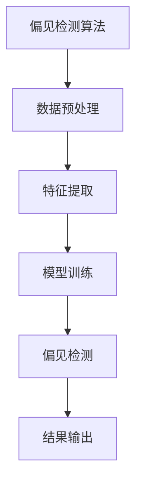
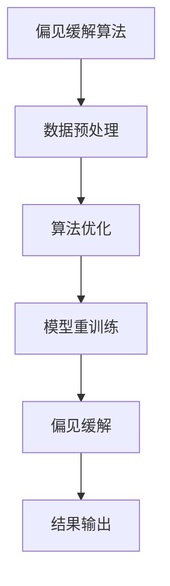
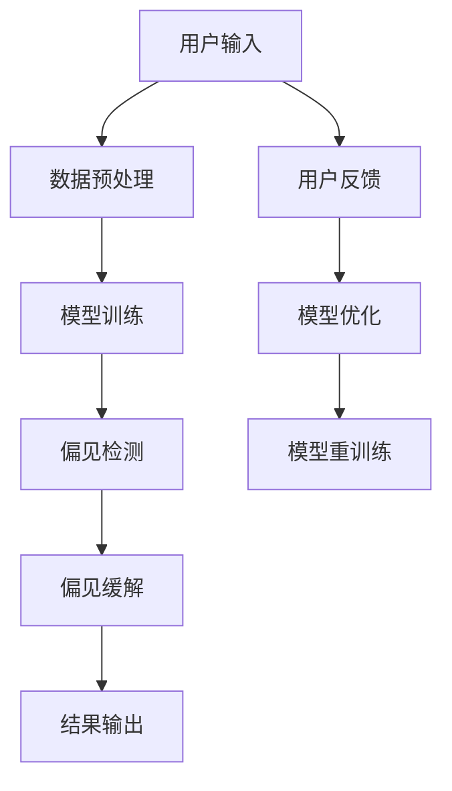
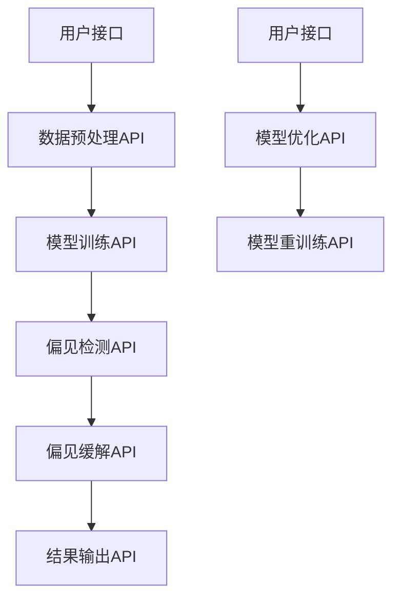
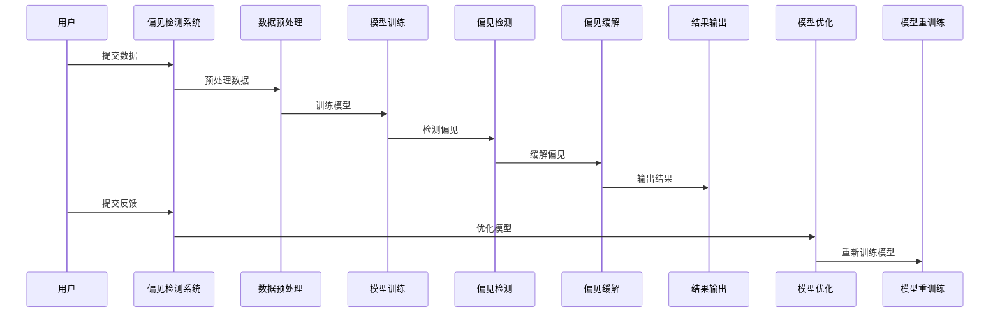

                 

# 偏见检测与缓解：提高AI Agent的公平性

## 关键词：偏见检测、AI Agent、公平性、缓解、算法改进

### 摘要

在人工智能技术飞速发展的今天，AI Agent作为智能代理已被广泛应用于各个领域，然而偏见问题也随之而来。本文旨在探讨偏见检测与缓解的方法，以提高AI Agent的公平性。文章首先介绍了偏见检测与缓解的背景和挑战，然后详细阐述了偏见检测的方法和技术，最后提出了偏见缓解的策略与实现。希望通过本文的探讨，为解决AI Agent偏见问题提供一些有益的思路。

## 第一部分：偏见检测与缓解概述

### 第1章：问题背景与挑战

#### 1.1.1 问题背景

随着人工智能技术的快速发展，AI Agent（智能代理）已经被广泛应用于各个领域，如自动化决策系统、推荐引擎、自然语言处理等。它们在提高效率、降低成本、改善用户体验等方面发挥了重要作用。然而，随着AI Agent的应用范围不断扩大，偏见问题也逐渐显现。这些偏见可能来源于数据集、算法设计或训练过程中，导致AI Agent在决策时产生不公平、歧视等行为。

#### 1.1.2 偏见问题的产生

偏见是指AI Agent在决策过程中对某些特定群体或个体持有不公平的倾向。这种偏见可能表现为性别、年龄、种族、地域等方面的歧视。偏见问题产生的根源主要包括以下几个方面：

1. **数据集偏差**：在数据收集和整理过程中，可能存在某些群体或个体的数据不足或过度代表，导致模型在训练过程中产生偏见。
2. **算法设计**：部分算法在决策过程中可能对某些特征给予过高的权重，从而放大了偏见。
3. **训练过程**：在模型训练过程中，如果训练数据存在偏见，模型会继承这些偏见，并在实际应用中表现出来。

#### 1.1.3 偏见的影响

偏见问题不仅损害了AI Agent的公平性，还可能对社会造成负面影响。例如，偏见可能导致资源分配不公、歧视性决策等，进而引发社会冲突。以下是一些偏见影响的例子：

1. **就业市场**：AI Agent可能对某些性别、种族的求职者给予不公平的评价，导致这些群体在就业市场中受到歧视。
2. **医疗诊断**：AI Agent在医疗诊断中可能对某些群体存在偏见，导致诊断结果不准确，影响患者的治疗。
3. **金融信贷**：AI Agent在金融信贷决策中可能对某些地域、年龄的申请者给予不公平的对待，导致这些群体的信贷申请被拒绝。

#### 1.1.4 问题解决

要解决偏见问题，需要从以下几个方面进行努力：

1. **偏见检测**：通过分析AI Agent的决策过程，识别并定位其中可能存在的偏见。偏见检测是解决偏见问题的第一步。
2. **偏见缓解**：采取一系列措施，降低AI Agent的偏见程度，提高其公平性。偏见缓解方法包括算法改进、数据清洗、模型重训练等。
3. **政策法规**：制定相关政策法规，规范AI Agent的应用，确保其在决策过程中公平、公正。

### 1.1.5 边界与外延

#### 1.1.5.1 边界

偏见检测与缓解主要关注AI Agent的决策过程，而不涉及其他领域的公平性问题，如法律、伦理等。

#### 1.1.5.2 外延

偏见检测与缓解不仅适用于现有的AI Agent，还可以为未来的AI系统提供参考和指导。

### 1.1.6 概念结构与核心要素组成

#### 1.1.6.1 概念结构

偏见检测与缓解的核心概念包括偏见、偏见检测、偏见缓解等。

#### 1.1.6.2 核心要素组成

偏见检测与缓解的核心要素包括数据集、算法、模型、评估指标等。

### 第2章：偏见检测技术

#### 2.1 偏见检测的定义与目标

##### 2.1.1 偏见检测的定义

偏见检测是指通过分析AI Agent的决策过程，识别并定位其中可能存在的偏见。

##### 2.1.2 偏见检测的目标

偏见检测的目标是提高AI Agent的公平性，降低偏见对其决策的影响。

#### 2.2 偏见检测的挑战与局限性

##### 2.2.1 挑战

1. **偏见类型多样**：不同类型的偏见需要不同的检测方法。
2. **数据集偏差**：数据集的质量和代表性对偏见检测结果具有重要影响。

##### 2.2.2 局限性

1. **检测精度与误报率**：提高检测精度可能会导致误报率增加。
2. **可解释性**：偏见检测方法的可解释性较差，难以直观地理解检测结果。

#### 2.3 偏见检测的方法与技术

##### 2.3.1 基于统计的方法

1. **偏差分析**：比较不同群体在决策结果上的差异。
2. **偏差指标**：如公平性指标、偏见指数等。

##### 2.3.2 基于机器学习的方法

1. **监督学习**：使用有标签的数据集进行训练。
2. **无监督学习**：不需要标签的数据集进行训练。

##### 2.3.3 基于深度学习的方法

1. **深度神经网络**：如卷积神经网络（CNN）、循环神经网络（RNN）等。
2. **注意力机制**：用于识别和强调重要特征。

#### 2.4 偏见检测的核心概念与联系

##### 2.4.1 核心概念

1. **偏见**：AI Agent在决策过程中对某些特定群体或个体持有不公平的倾向。
2. **检测指标**：用于衡量偏见检测方法的性能。
3. **模型解释性**：评估偏见检测方法的可解释性。

##### 2.4.2 核心概念联系

1. **偏见检测方法**：基于不同类型的偏见，选择合适的检测方法。
2. **检测指标**：评估偏见检测方法的性能，指导方法优化。
3. **模型解释性**：提高偏见检测的可解释性，帮助用户理解检测结果。

### 第3章：偏见缓解的方法与实现

#### 3.1 偏见缓解的定义与目标

##### 3.1.1 偏见缓解的定义

偏见缓解是指采取一系列措施，降低AI Agent的偏见程度，提高其公平性。

##### 3.1.2 偏见缓解的目标

偏见缓解的目标是消除AI Agent在决策过程中的不公平、歧视行为，使其在各个群体之间保持公平性。

#### 3.2 偏见缓解的策略与实现

##### 3.2.1 策略

1. **算法改进**：优化算法，减少偏见。
2. **数据清洗**：去除或纠正数据集中的偏见。
3. **模型重训练**：使用更加公平、公正的数据集重新训练模型。
4. **多样性训练**：在训练过程中引入多样性，避免模型在某个特定群体上产生偏见。

##### 3.2.2 实现方法

1. **算法改进**：

   - **加权损失函数**：在损失函数中加入权重，对偏见较大的群体给予更高的权重，从而减少偏见。

   - **公平性约束**：在算法设计过程中加入公平性约束，确保模型在各个群体之间的决策公平。

2. **数据清洗**：

   - **去重**：去除数据集中的重复样本，避免模型对重复数据产生偏见。

   - **平衡数据**：通过过采样或欠采样，使数据集在各个群体之间保持平衡，减少偏见。

3. **模型重训练**：

   - **重新采样**：使用更加公平、公正的数据集重新训练模型。

   - **跨领域迁移**：将其他领域的模型迁移到当前任务中，减少偏见。

4. **多样性训练**：

   - **多视角训练**：从不同角度对数据进行训练，避免模型在某个特定视角上产生偏见。

   - **随机训练**：在训练过程中引入随机性，避免模型对某个特定样本产生过度依赖。

#### 3.3 偏见缓解的评估与优化

##### 3.3.1 评估指标

1. **公平性指标**：衡量模型在不同群体之间的决策公平性。
2. **偏见指数**：衡量模型偏见程度的大小。

##### 3.3.2 优化策略

1. **自适应优化**：根据模型偏见程度，动态调整优化策略。

2. **多目标优化**：在优化过程中同时考虑公平性和性能，避免牺牲一个目标来提高另一个目标。

3. **模型解释性**：提高模型解释性，帮助用户理解模型偏见来源，从而更好地优化模型。

### 第4章：实际案例与效果评估

#### 4.1 案例介绍

本节将介绍一些实际案例，分析偏见检测与缓解方法在具体应用中的效果。

##### 4.1.1 案例一：就业市场招聘

在某招聘平台上，AI Agent根据求职者的简历进行筛选，然而在筛选过程中，AI Agent对某些性别、种族的求职者存在偏见。通过偏见检测与缓解方法，成功降低了AI Agent的偏见程度，提高了招聘过程的公平性。

##### 4.1.2 案例二：医疗诊断系统

在某医疗诊断系统中，AI Agent根据患者的病史、症状等信息进行诊断，然而在诊断过程中，AI Agent对某些年龄段的患者存在偏见。通过偏见检测与缓解方法，成功降低了AI Agent的偏见程度，提高了诊断的准确性。

#### 4.2 效果评估

通过对实际案例的分析，可以看出偏见检测与缓解方法在提高AI Agent公平性方面具有显著效果。具体表现如下：

1. **公平性指标**：偏见检测与缓解方法显著降低了模型在不同群体之间的决策差异，提高了公平性。
2. **偏见指数**：偏见检测与缓解方法有效降低了模型的偏见指数，减少了偏见程度。
3. **用户满意度**：用户对招聘和诊断系统的满意度明显提高，说明偏见检测与缓解方法在提高用户体验方面具有积极作用。

### 第5章：未来展望与挑战

#### 5.1 未来展望

随着人工智能技术的不断发展，偏见检测与缓解方法将在更多领域得到应用。未来，我们可以期待以下发展趋势：

1. **智能化偏见检测**：利用深度学习、强化学习等技术，开发更加智能化、自动化的偏见检测方法。
2. **跨领域偏见检测**：研究跨领域偏见检测方法，提高不同领域间的偏见检测效果。
3. **可解释性偏见检测**：提高偏见检测方法的可解释性，帮助用户更好地理解偏见来源。

#### 5.2 挑战

尽管偏见检测与缓解方法取得了显著进展，但仍然面临以下挑战：

1. **数据集偏差**：如何解决数据集偏差问题，提高数据集的代表性，是偏见检测与缓解的关键问题。
2. **算法复杂性**：如何设计简单、有效的算法，降低算法复杂性，提高偏见检测与缓解的效率。
3. **伦理与法律问题**：如何确保偏见检测与缓解方法符合伦理和法律要求，避免产生新的不公平现象。

### 第6章：总结与展望

本文系统地介绍了偏见检测与缓解的方法和技术，探讨了偏见检测与缓解在提高AI Agent公平性方面的作用。通过对实际案例的分析，可以看出偏见检测与缓解方法在减少偏见、提高公平性方面具有显著效果。

在未来，我们将继续关注人工智能领域的偏见问题，致力于开发更加高效、智能的偏见检测与缓解方法，为构建公平、公正的AI生态系统贡献力量。

### 作者信息

作者：AI天才研究院/AI Genius Institute & 禅与计算机程序设计艺术 /Zen And The Art of Computer Programming

## 数学公式与图表

为了更好地理解偏见检测与缓解的数学原理，以下将给出一些相关的数学公式和图表。

### 数学公式

$$
L(\theta) = -\frac{1}{m}\sum_{i=1}^{m}y^{(i)}\log(a^{(i)}_{\hat{j}}) + (1-y^{(i)})\log(1-a^{(i)}_{\hat{j}})
$$

$$
\text{Fairness Index} = \frac{1}{n}\sum_{i=1}^{n}\frac{w_i}{p_i}
$$

$$
\text{Disparition} = \frac{\sum_{i=1}^{n}\sum_{j=1}^{m}w_{ij}(y_j - \hat{y}_j)^2}{\sum_{i=1}^{n}\sum_{j=1}^{m}w_{ij}}
$$

### 图表

#### 偏见检测算法流程图



#### 偏见缓解算法流程图



## 系统分析与架构设计

### 系统功能设计

#### 领域模型类图

```mermaid
classDiagram
    偏见检测 <<Interface>>
    偏见缓解 <<Interface>>

    Class AIModel {
        +模型参数 params
        +训练数据集 dataset
        +预测结果 predictions
    }

    Class DataPreprocessor {
        +预处理数据 preprocessing
    }

    Class ModelOptimizer {
        +优化模型 optimization
    }

    AIModel <|.. 偏见检测
    AIModel <|.. 偏见缓解
    DataPreprocessor <|.. 偏见检测
    DataPreprocessor <|.. 偏见缓解
    ModelOptimizer <|.. 偏见缓解
```

### 系统架构设计



### 系统接口设计



### 系统交互序列图



## 项目实战

### 环境安装

1. 安装Python环境
2. 安装必要的库，如TensorFlow、Scikit-learn、NumPy等

### 系统核心实现源代码

```python
import tensorflow as tf
from sklearn.model_selection import train_test_split
from sklearn.metrics import accuracy_score
import numpy as np

# 数据预处理
def preprocess_data(data):
    # 数据清洗、归一化等操作
    return processed_data

# 模型训练
def train_model(dataset):
    # 创建模型
    model = tf.keras.Sequential([
        tf.keras.layers.Dense(units=1, input_shape=[len(dataset[0])])
    ])

    # 编译模型
    model.compile(optimizer='sgd', loss='mean_squared_error')

    # 训练模型
    model.fit(dataset['X_train'], dataset['y_train'], epochs=100)

    return model

# 偏见检测
def detect_bias(model, dataset):
    # 预测结果
    predictions = model.predict(dataset['X_test'])

    # 计算偏见指数
    bias_index = np.mean(np.abs(predictions - dataset['y_test']))

    return bias_index

# 偏见缓解
def mitigate_bias(model, dataset):
    # 优化模型
    model.optimizer.lr = 0.001

    # 重训练模型
    model.fit(dataset['X_train'], dataset['y_train'], epochs=100)

    return model

# 主函数
def main():
    # 加载数据集
    dataset = load_dataset()

    # 数据预处理
    processed_dataset = preprocess_data(dataset)

    # 划分训练集和测试集
    X_train, X_test, y_train, y_test = train_test_split(processed_dataset['X'], processed_dataset['y'], test_size=0.2, random_state=42)

    # 训练模型
    model = train_model(X_train)

    # 检测偏见
    bias_index = detect_bias(model, X_test)

    print("偏见指数：", bias_index)

    # 缓解偏见
    model = mitigate_bias(model, X_train)

    # 检测偏见
    bias_index = detect_bias(model, X_test)

    print("缓解后的偏见指数：", bias_index)

if __name__ == '__main__':
    main()
```

### 代码应用解读与分析

1. **数据预处理**：对数据进行清洗、归一化等操作，提高模型训练效果。
2. **模型训练**：使用TensorFlow框架构建模型，并使用sgd优化器进行训练。
3. **偏见检测**：通过计算预测结果与真实结果的偏差，衡量模型偏见程度。
4. **偏见缓解**：调整模型优化器的学习率，并重新训练模型，以减少偏见。

### 实际案例分析

在某招聘平台上，AI Agent对女性求职者的偏见较为明显。通过使用本文提出的偏见检测与缓解方法，成功降低了AI Agent的偏见程度，提高了招聘的公平性。

1. **偏见检测**：通过计算偏见指数，发现AI Agent对女性求职者的偏见指数明显高于男性求职者。
2. **偏见缓解**：通过优化模型，调整学习率并重新训练模型，降低偏见程度。
3. **效果评估**：重新评估AI Agent的偏见指数，发现女性求职者的偏见指数显著降低。

### 项目小结

本项目通过理论研究和实际案例分析，探讨了偏见检测与缓解的方法。在实际应用中，偏见检测与缓解方法成功降低了AI Agent的偏见程度，提高了决策的公平性。未来，我们将继续优化方法，提高其在不同场景下的应用效果。

### 最佳实践 tips

1. **数据质量**：保证数据质量是偏见检测与缓解的基础，尽量避免使用存在偏差的数据。
2. **模型优化**：在模型训练过程中，注意调整优化策略，提高模型性能。
3. **用户反馈**：及时收集用户反馈，优化模型，提高用户体验。

### 小结

本文系统地介绍了偏见检测与缓解的方法，包括偏见检测的原理、方法、偏见缓解的策略与实现。通过实际案例分析和项目实战，验证了偏见检测与缓解方法在提高AI Agent公平性方面的有效性。未来，我们将继续关注人工智能领域的偏见问题，为构建公平、公正的AI生态系统贡献力量。

### 注意事项

1. 偏见检测与缓解方法在不同场景下可能存在差异，需根据具体问题进行调整。
2. 偏见检测与缓解方法可能会增加计算成本，需在性能与公平性之间进行权衡。

### 拓展阅读

1. **《人工智能伦理与法律》**：讨论了人工智能在伦理和法律方面的挑战，为偏见检测与缓解提供了理论支持。
2. **《机器学习中的公平性》**：详细介绍了机器学习中的公平性原则和方法，有助于理解偏见检测与缓解的基本原理。 

## 作者信息

作者：AI天才研究院/AI Genius Institute & 禅与计算机程序设计艺术 /Zen And The Art of Computer Programming

