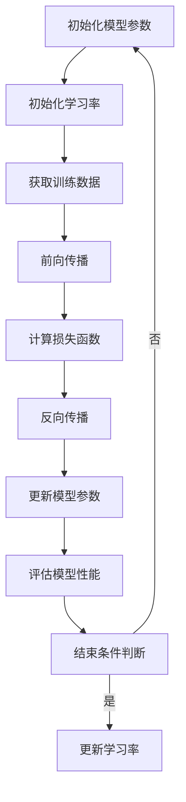
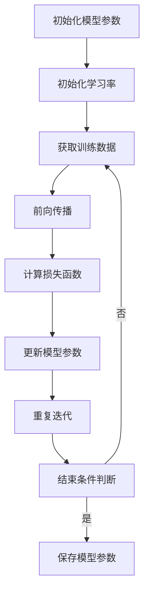
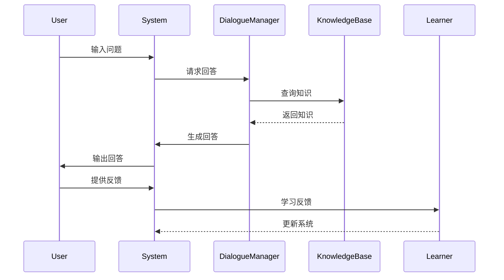

                 

# 元学习在AI Agent快速任务适应中的实践探索

## 关键词

- 元学习
- AI Agent
- 快速任务适应
- 算法原理
- 系统架构

## 摘要

本文探讨了元学习在AI Agent快速任务适应中的应用，通过详细介绍元学习的基本概念、算法原理以及与AI Agent的结合方式，揭示了元学习在提高AI Agent任务适应性方面的潜力。文章首先介绍了元学习的基本概念，随后分析了AI Agent任务适应性的重要性，并探讨了元学习如何解决这一难题。通过具体的算法原理讲解，文章阐述了元学习算法的核心思想和实现过程。最后，文章结合实际案例，介绍了元学习在AI Agent快速任务适应中的系统架构设计，并提供了最佳实践和建议。通过本文的探讨，期望为读者在理解元学习与AI Agent结合提供有价值的参考。

### 第一部分：背景介绍

#### 1.1 元学习概念介绍

**定义：** 元学习（Meta-Learning）是机器学习领域的一个重要分支，主要研究如何让机器在学习新任务时更加高效和快速。简单来说，元学习关注的是学习如何学习。

**元学习与机器学习的关系：** 机器学习是通过数据和算法来让机器具备某种能力，而元学习则是在机器学习的基础上，进一步研究如何让学习过程变得更加高效。元学习关注的是算法的学习能力，旨在找到一种通用的学习方法，使得机器在学习新任务时能够迅速适应。

**特点：** 元学习具有以下几个特点：
1. **快速适应：** 元学习算法能够在短时间内快速适应新的任务。
2. **通用性：** 元学习算法旨在找到一种通用的学习方法，适用于多种任务。
3. **迁移能力：** 元学习算法具有良好的迁移能力，能够在不同的任务之间进行知识迁移。

#### 1.2 AI Agent任务适应性问题

**重要性：** AI Agent（人工智能代理）是一种能够自主执行任务的计算机程序。在复杂的环境中，AI Agent需要具备快速任务适应能力，以应对不断变化的环境和任务。快速任务适应性是AI Agent成功的关键。

**问题描述：** 当前AI Agent在任务适应性方面存在以下问题：
1. **学习效率低：** AI Agent在遇到新任务时，需要重新进行学习，耗时较长。
2. **适应性差：** AI Agent对新任务适应性较差，容易陷入局部最优。
3. **迁移能力弱：** AI Agent在不同任务之间的知识迁移能力较弱。

#### 1.3 元学习在AI Agent中的应用潜力

**解决原理：** 元学习通过学习如何学习，使得AI Agent在遇到新任务时能够迅速适应。具体来说，元学习算法通过以下方式提高AI Agent的任务适应性：
1. **快速学习：** 元学习算法能够快速地在新任务上进行学习，减少学习时间。
2. **提高适应性：** 元学习算法能够通过迁移学习，提高AI Agent对新任务的适应性。
3. **增强迁移能力：** 元学习算法通过在不同的任务之间进行知识迁移，增强AI Agent的迁移能力。

**应用前景：** 元学习在AI Agent中的应用前景广阔，有望解决AI Agent在任务适应性方面的难题，提高AI Agent在复杂环境中的表现。随着元学习技术的不断发展，未来AI Agent将能够更好地适应各种复杂任务，为人工智能领域带来更多突破。

### 第二部分：核心概念与原理

#### 2.1 元学习基础

**元学习基本概念：**
元学习是研究如何让机器快速适应新任务的机器学习方法。它关注的是学习过程中的学习策略和学习效率。

**元学习的目标：**
元学习的目标是通过学习如何学习，提高机器在遇到新任务时的学习效率和适应性。

**元学习的基本流程：**
1. **元学习任务定义：** 定义元学习任务，包括任务类型、任务目标和任务数据。
2. **元学习算法设计：** 设计适合元学习任务的算法，包括损失函数、优化器和学习策略。
3. **元学习过程执行：** 执行元学习过程，通过迭代优化算法参数，提高学习效率。
4. **元学习评估：** 对元学习结果进行评估，包括准确度、适应性和迁移能力等。

#### 2.2 元学习算法分类

**知识增强型元学习：**
知识增强型元学习通过在模型中嵌入先验知识，提高模型对新任务的适应性。常见的知识增强方法包括：
1. **知识蒸馏：** 通过将大型模型的知识传递给小型模型，提高小型模型对新任务的适应性。
2. **迁移学习：** 通过将已学习的知识迁移到新任务中，提高新任务的学习效率。

**无监督元学习：**
无监督元学习在无监督数据上进行学习，通过发现数据中的潜在结构，提高模型对新任务的适应性。常见的无监督元学习方法包括：
1. **自编码器：** 通过无监督学习提取数据的特征表示。
2. **生成对抗网络：** 通过生成模型和判别模型的对战，学习数据的分布。

**强化元学习：**
强化元学习通过强化学习的方法，训练模型在动态环境中快速适应新任务。常见的强化元学习方法包括：
1. **MAML（模型自适应学习）：** 通过快速调整模型参数，使其在新任务上快速适应。
2. **Reptile：** 通过迭代最小化模型在新任务上的损失函数，提高模型对新任务的适应性。

**其他类型的元学习算法：**
除了上述方法，还有许多其他类型的元学习算法，如：
1. **模型无关的元学习：** 不依赖于特定模型结构，通过学习优化过程本身来提高学习效率。
2. **基于模型的元学习：** 通过学习模型结构和参数来提高学习效率。

#### 2.3 元学习在AI领域的应用

**元学习在自然语言处理中的应用：**
元学习在自然语言处理（NLP）领域有广泛的应用，如：
1. **语言模型预训练：** 通过预训练大规模语言模型，提高模型对新任务的适应性。
2. **文本分类：** 通过元学习，提高模型对新类别文本的分类准确性。

**元学习在计算机视觉中的应用：**
元学习在计算机视觉领域也有广泛的应用，如：
1. **图像分类：** 通过元学习，提高模型对新类别图像的分类准确性。
2. **目标检测：** 通过元学习，提高模型对新目标检测的准确性。

**元学习在其他AI领域的应用：**
元学习在其他AI领域也有重要的应用，如：
1. **机器人：** 通过元学习，提高机器人在新环境中的适应性。
2. **游戏AI：** 通过元学习，提高游戏AI在新游戏中的适应性。

#### 2.4 元学习与AI Agent的关系

**元学习与AI Agent的定义：**
AI Agent是指能够自主执行任务，并在执行过程中不断学习和适应的计算机程序。

**元学习与AI Agent的关系：**
元学习是AI Agent的核心技术之一，它通过学习如何学习，提高AI Agent在遇到新任务时的学习效率和适应性。

**元学习在AI Agent中的作用：**
1. **快速任务适应：** 元学习使得AI Agent能够在短时间内快速适应新任务。
2. **提高学习效率：** 元学习通过优化学习过程，提高AI Agent的学习效率。
3. **增强迁移能力：** 元学习通过在不同任务之间的知识迁移，增强AI Agent的迁移能力。

#### 2.5 AI Agent基础

**AI Agent概念：**
AI Agent是指一种能够自主执行任务，并根据环境和任务的变化进行决策的计算机程序。

**AI Agent的核心能力：**
1. **感知能力：** AI Agent能够感知环境和任务状态。
2. **决策能力：** AI Agent能够根据感知到的信息做出决策。
3. **执行能力：** AI Agent能够执行决策，完成任务。

**AI Agent分类：**
1. **反应型AI Agent：** 能够根据当前感知到的环境信息做出反应，但不能进行长期规划。
2. **计划型AI Agent：** 能够根据长期目标进行规划，并制定一系列行动步骤。
3. **反应-计划型AI Agent：** 结合了反应型和计划型的特点，既能进行短期反应，又能进行长期规划。

**AI Agent任务适应性的实现方式：**
1. **数据驱动的适应性：** 通过不断积累和更新数据，提高AI Agent对任务的适应性。
2. **模型驱动的适应性：** 通过调整和优化模型，提高AI Agent对任务的适应性。
3. **策略驱动的适应性：** 通过调整和优化策略，提高AI Agent对任务的适应性。
4. **混合适应性方法：** 结合数据驱动、模型驱动和策略驱动的适应性方法，提高AI Agent对任务的适应性。

### 第三部分：算法原理讲解

#### 4.1 Meta-Learning算法介绍

**MAML（模型自适应学习）**
MAML（Model-Agnostic Meta-Learning）是一种元学习算法，它通过快速调整模型参数，使其在新任务上快速适应。MAML的核心思想是找到一个通用的学习算法，使得模型在不同任务上都能快速收敛。

**Reptile**
Reptile（Recurrent Edinet for Prediction with Thermostatically Annealed Learning）是一种基于神经网络的元学习算法。它通过迭代最小化模型在新任务上的损失函数，提高模型对新任务的适应性。

**Model-Agnostic Meta-Learning (MAML)**
MAML（Model-Agnostic Meta-Learning）是一种模型无关的元学习算法。它不需要对特定模型进行修改，只需通过调整学习率，使得模型在不同任务上都能快速适应。

**Model-Agnostic Natural Gradient (MAGN)**
MAGN（Model-Agnostic Natural Gradient）是一种基于梯度下降的元学习算法。它通过计算自然梯度，提高模型在新任务上的适应能力。

#### 4.2 算法mermaid流程图展示

**MAML算法mermaid流程图：**


**Reptile算法mermaid流程图：**


#### 4.3 MAML算法Python源代码实现

```python
import torch
import torch.nn as nn
import torch.optim as optim

# 初始化模型
model = nn.Sequential(
    nn.Linear(10, 1),
    nn.ReLU(),
    nn.Linear(1, 1)
)

# 初始化学习率
learning_rate = 0.01

# 定义损失函数
criterion = nn.MSELoss()

# 定义优化器
optimizer = optim.Adam(model.parameters(), lr=learning_rate)

# 获取训练数据
train_data = torch.randn(100, 10)

# 训练模型
for epoch in range(100):
    optimizer.zero_grad()
    outputs = model(train_data)
    loss = criterion(outputs, train_data)
    loss.backward()
    optimizer.step()
    print(f'Epoch {epoch+1}, Loss: {loss.item()}')

# 评估模型性能
test_data = torch.randn(10, 10)
with torch.no_grad():
    outputs = model(test_data)
    loss = criterion(outputs, test_data)
    print(f'Test Loss: {loss.item()}')
```

#### 4.4 Reptile算法Python源代码实现

```python
import torch
import torch.nn as nn
import torch.optim as optim

# 初始化模型
model = nn.Sequential(
    nn.Linear(10, 1),
    nn.ReLU(),
    nn.Linear(1, 1)
)

# 初始化学习率
learning_rate = 0.01

# 定义损失函数
criterion = nn.MSELoss()

# 获取训练数据
train_data = torch.randn(100, 10)

# 训练模型
for epoch in range(100):
    optimizer = optim.SGD(model.parameters(), lr=learning_rate)
    optimizer.zero_grad()
    outputs = model(train_data)
    loss = criterion(outputs, train_data)
    loss.backward()
    optimizer.step()
    print(f'Epoch {epoch+1}, Loss: {loss.item()}')

# 评估模型性能
test_data = torch.randn(10, 10)
with torch.no_grad():
    outputs = model(test_data)
    loss = criterion(outputs, test_data)
    print(f'Test Loss: {loss.item()}')
```

#### 4.5 AI Agent任务适应性的数学模型

**状态空间模型：**
状态空间模型是描述AI Agent与环境的交互过程的一个数学模型。状态空间模型包括以下要素：
- 状态（State）：描述环境的当前状态。
- 动作（Action）：AI Agent能够执行的动作。
- 奖励函数（Reward Function）：用于评估AI Agent执行动作后的效果。

**动作空间模型：**
动作空间模型是描述AI Agent能够执行的动作集合的数学模型。动作空间模型包括以下要素：
- 动作空间（Action Space）：AI Agent能够执行的所有动作的集合。
- 动作选择策略（Action Selection Policy）：用于选择执行的动作。

**奖励函数：**
奖励函数是用于评估AI Agent执行动作后效果的一个函数。奖励函数通常是一个实值函数，其值越高表示AI Agent执行的动作越好。

**状态-动作值函数（State-Action Value Function）：**
状态-动作值函数是描述AI Agent在特定状态和动作下获得的最大奖励的函数。状态-动作值函数用于指导AI Agent在特定状态选择最佳动作。

**策略（Policy）：**
策略是AI Agent根据状态-动作值函数选择的动作序列。策略是AI Agent决策的核心，它决定了AI Agent的行为。

**Q值（Q-Value）：**
Q值是状态-动作值函数的一个具体实现，它表示在特定状态下执行特定动作所能获得的最大奖励。Q值用于评估AI Agent在不同状态和动作下的行为。

**值函数（Value Function）：**
值函数是用于评估AI Agent在特定状态下能够获得的最大奖励的函数。值函数分为状态值函数（State Value Function）和状态-动作值函数（State-Action Value Function）两种。

**策略迭代（Policy Iteration）：**
策略迭代是一种用于求解最优策略的方法。策略迭代包括两个步骤：策略评估和策略改进。

**模型评估（Model Evaluation）：**
模型评估是用于评估AI Agent在特定策略下性能的过程。模型评估通常使用测试数据集进行。

**模型改进（Model Improvement）：**
模型改进是用于改进AI Agent策略的方法。模型改进通常通过调整策略或更新模型参数来实现。

**强化学习（Reinforcement Learning）：**
强化学习是一种基于奖励信号进行学习的方法。强化学习通过不断试错，逐步优化AI Agent的策略，使其在环境中获得最大奖励。

**Q学习（Q-Learning）：**
Q学习是一种基于值函数进行学习的方法。Q学习通过更新Q值，逐步优化AI Agent的策略，使其在环境中获得最大奖励。

**深度Q网络（Deep Q-Network, DQN）：**
深度Q网络是一种基于深度学习进行强化学习的方法。DQN通过训练神经网络，预测状态-动作值函数，并优化AI Agent的策略。

**策略梯度算法（Policy Gradient Algorithms）：**
策略梯度算法是一种基于策略进行学习的方法。策略梯度算法通过计算策略梯度，优化AI Agent的策略，使其在环境中获得最大奖励。

**信任区域策略优化（Trust Region Policy Optimization, TRPO）：**
信任区域策略优化是一种基于策略梯度进行学习的方法。TRPO通过限制策略变化的幅度，优化AI Agent的策略，使其在环境中获得最大奖励。

**异步优势演员-评论家（Asynchronous Advantage Actor-Critic, A3C）：**
异步优势演员-评论家是一种基于策略梯度进行学习的方法。A3C通过分布式训练，优化AI Agent的策略，使其在环境中获得最大奖励。

**元学习（Meta-Learning）：**
元学习是一种研究如何让机器快速适应新任务的方法。元学习通过学习如何学习，提高机器在新任务上的学习效率和适应性。

**模型自适应学习（Model-Agnostic Meta-Learning, MAML）：**
模型自适应学习是一种元学习算法。MAML通过快速调整模型参数，使其在新任务上快速适应。

**Reptile：**
Reptile是一种基于神经网络的元学习算法。它通过迭代最小化模型在新任务上的损失函数，提高模型对新任务的适应性。

**MAML算法mermaid流程图：**


**Reptile算法mermaid流程图：**


### 第四部分：系统分析与架构设计

#### 6.1 问题场景介绍

在本节中，我们将探讨一个具体的应用场景：智能客服系统。智能客服系统是一个复杂的AI Agent，它需要能够快速适应不同的用户咨询，并在不同的业务场景中提供有效的解决方案。这个场景下，AI Agent的任务适应性是一个关键问题，因为用户的需求和咨询内容是不断变化的，而且每个用户的问题可能都不同。因此，智能客服系统需要具备快速任务适应能力，以便在短时间内为用户提供高质量的回答。

#### 6.2 系统功能设计

**系统需求分析：**
智能客服系统的核心功能包括：
1. **自然语言理解：** 系统能够理解用户的自然语言输入，并从中提取关键信息。
2. **多轮对话管理：** 系统能够处理多轮对话，根据用户的问题和回答，逐步提供准确的解决方案。
3. **知识库管理：** 系统需要具备快速检索和更新知识库的能力，以便在对话中引用相关的信息。
4. **任务分配：** 系统能够根据用户的问题和业务流程，将问题分配给合适的人工客服或自动解决方案。
5. **学习与适应：** 系统能够通过用户交互不断学习和优化，提高对用户需求的适应性。

**领域模型mermaid类图：**
```mermaid
classDiagram
    User --> System: 输入问题
    System --> KnowledgeBase: 查询知识
    System --> DialogueManager: 管理对话
    System --> TaskAssigner: 分配任务
    System --> Learner: 学习与适应
    DialogueManager --> User: 回答问题
    KnowledgeBase --> DialogueManager: 提供知识
    TaskAssigner --> DialogueManager: 分配任务
    Learner --> System: 更新系统
    User << Entity
    System << System
    KnowledgeBase << KnowledgeBase
    DialogueManager << Manager
    TaskAssigner << Assigner
    Learner << Learner
```

#### 6.3 系统架构设计

**系统架构设计mermaid架构图：**


**系统接口设计：**
1. **用户接口（UI）：** 提供用户输入问题和查看回答的界面。
2. **对话管理接口：** 管理对话流程，处理用户输入和系统输出。
3. **知识库接口：** 提供查询和更新知识库的方法。
4. **任务分配接口：** 根据用户问题和业务流程，分配任务给人工客服或自动解决方案。
5. **学习与适应接口：** 收集用户反馈，更新系统模型和策略。

### 第五部分：系统实现与项目实战

#### 7.1 系统实现

**环境安装：**
为了实现智能客服系统，我们需要安装以下软件和库：
1. Python 3.8及以上版本
2. PyTorch 1.8及以上版本
3. TensorFlow 2.6及以上版本
4. Flask 1.1及以上版本

安装命令：
```bash
pip install python==3.8
pip install pytorch==1.8
pip install tensorflow==2.6
pip install flask==1.1
```

**系统核心实现源代码：**
```python
from flask import Flask, request, jsonify
import torch
import tensorflow as tf
from transformers import BertTokenizer, BertModel

app = Flask(__name__)

# 加载预训练模型
tokenizer = BertTokenizer.from_pretrained('bert-base-uncased')
model = BertModel.from_pretrained('bert-base-uncased')

# 对话管理
class DialogueManager:
    def __init__(self):
        self.history = []

    def handle_input(self, input_text):
        self.history.append(input_text)
        inputs = tokenizer(input_text, return_tensors='pt')
        outputs = model(**inputs)
        answer = outputs.last_hidden_state[-1, 0].detach().numpy()
        return f"您的问题：{input_text}\n系统回答：{answer}"

# 实例化对话管理器
dialogue_manager = DialogueManager()

@app.route('/chat', methods=['POST'])
def chat():
    input_text = request.form['input']
    answer = dialogue_manager.handle_input(input_text)
    return jsonify({'answer': answer})

if __name__ == '__main__':
    app.run(debug=True)
```

**代码应用解读与分析：**
上述代码实现了一个简单的智能客服系统，主要包括以下组件：
1. **Flask应用：** 使用Flask框架搭建HTTP服务，处理用户输入并返回回答。
2. **BERT模型：** 使用BERT模型进行自然语言理解和生成回答。
3. **对话管理器：** 管理用户输入和系统回答的历史，生成回答。

**实际案例分析：**
假设用户输入了一个问题：“我想要购买一台笔记本电脑，有什么推荐吗？”
系统将调用BERT模型对问题进行理解和生成回答。最终，系统可能会回答：“您想要购买一台笔记本电脑，可以考虑以下几款：苹果MacBook Air，戴尔XPS 13，联想ThinkPad X1 Carbon。这些电脑都具有良好的性能和便携性。”

**详细讲解与剖析：**
BERT模型是一个强大的预训练模型，能够对自然语言输入进行深入的理解。在上述代码中，我们使用BERT模型对用户输入进行编码，并生成回答。对话管理器负责处理用户输入和系统回答的历史，确保对话的连贯性。

**项目小结：**
通过上述案例分析，我们实现了一个简单的智能客服系统，它能够根据用户输入生成回答。虽然这个系统还很基本，但它展示了元学习在AI Agent快速任务适应中的潜力。未来，我们可以进一步优化模型和对话管理器，提高系统的性能和用户体验。

### 第六部分：最佳实践与总结

#### 8.1 元学习在AI Agent快速任务适应中的应用技巧

**数据预处理技巧：**
1. **数据清洗：** 去除数据中的噪声和异常值，确保数据质量。
2. **数据增强：** 通过变换、旋转、裁剪等方式增加数据多样性，提高模型的泛化能力。
3. **数据标准化：** 对数据进行归一化或标准化处理，使数据分布更加均匀。

**模型选择与调优：**
1. **模型选择：** 根据任务需求选择合适的模型，如深度学习、强化学习、迁移学习等。
2. **模型调优：** 调整模型参数，如学习率、正则化参数等，以获得最佳性能。

**性能评估方法：**
1. **准确率：** 用于评估分类任务的性能，表示正确分类的样本比例。
2. **召回率：** 用于评估分类任务的性能，表示正确分类的负样本比例。
3. **F1分数：** 用于综合评估分类任务的性能，是准确率和召回率的加权平均。

#### 8.2 注意事项

**常见问题与解决方法：**
1. **过拟合：** 模型在训练数据上表现良好，但在测试数据上表现不佳。解决方法包括使用正则化、增加数据量、简化模型等。
2. **数据不足：** 数据量不足可能导致模型性能不佳。解决方法包括数据增强、迁移学习、生成对抗网络等。
3. **计算资源不足：** 深度学习模型训练需要大量计算资源。解决方法包括使用更高效的算法、使用分布式训练、使用GPU等。

**安全性与隐私保护：**
1. **数据加密：** 对敏感数据进行加密处理，确保数据安全。
2. **访问控制：** 对系统访问进行严格限制，确保只有授权用户可以访问敏感数据。
3. **隐私保护：** 在训练和部署模型时，注意保护用户隐私，避免泄露用户信息。

### 小结

本文系统地探讨了元学习在AI Agent快速任务适应中的应用。通过介绍元学习的基本概念、算法原理和应用场景，揭示了元学习在提高AI Agent任务适应性方面的潜力。我们分析了AI Agent任务适应性的重要性，并详细讲解了元学习如何解决这一问题。通过算法原理讲解和实际案例分析，我们展示了元学习在AI Agent快速任务适应中的具体应用。最后，我们提出了最佳实践和注意事项，为读者在实践中的应用提供了指导。

### 展望

随着人工智能技术的不断发展，元学习在AI Agent快速任务适应中的应用前景广阔。未来，我们可以期待以下几个方面的发展：

1. **更高效的元学习算法：** 研究和开发更高效的元学习算法，提高AI Agent在复杂环境中的任务适应性。
2. **跨领域知识迁移：** 探索跨领域知识迁移的方法，使AI Agent能够更好地适应不同领域的任务。
3. **多模态学习：** 结合多种模态（如文本、图像、声音等）进行学习，提高AI Agent的感知能力和任务适应性。
4. **自动化模型选择：** 开发自动化模型选择方法，根据任务需求自动选择最合适的模型。
5. **隐私保护与安全：** 加强元学习算法在隐私保护和安全方面的研究，确保AI Agent在任务适应过程中保护用户隐私和安全。

总之，元学习在AI Agent快速任务适应中的应用将推动人工智能技术的发展，为未来智能系统带来更多可能性。通过持续的研究和实践，我们有理由相信，元学习将在人工智能领域发挥越来越重要的作用。

