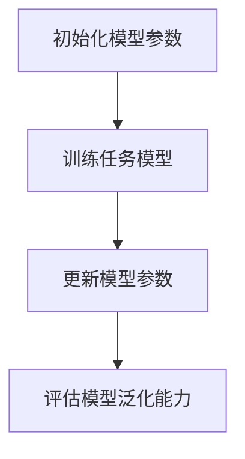
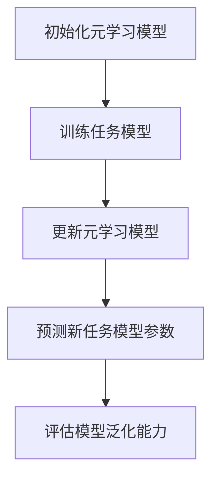
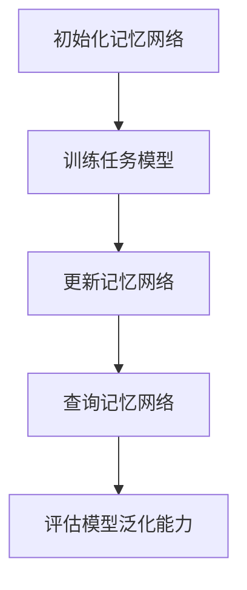

                 

# 《元学习框架：构建快速适应的AI Agent系统》

## 关键词

- 元学习
- AI Agent
- 快速适应
- 机器学习
- 强化学习

## 摘要

本文深入探讨了元学习框架在构建快速适应的AI Agent系统中的应用。元学习作为一种重要的机器学习技术，通过使AI系统能够在新的任务上快速适应，提高了AI Agent的灵活性和适应性。本文首先介绍了元学习的背景和基本概念，然后详细分析了元学习框架的核心原理和算法，探讨了其在计算机视觉、自然语言处理和强化学习等领域的应用，并指出了当前面临的挑战和未来的发展方向。通过实际案例和最佳实践，本文展示了如何利用元学习框架构建高效、灵活的AI Agent系统。

## 引言与背景介绍

### 1.1 元学习的重要性

在人工智能领域，机器学习技术已经成为实现智能自动化的重要手段。然而，传统的机器学习技术通常依赖于大量标注数据和长时间的训练过程，这在实际应用中往往受到数据获取和计算资源的限制。为了解决这些问题，研究者们提出了元学习（Meta-Learning）的概念，旨在通过学习如何学习来提高机器学习系统的效率和灵活性。

元学习的重要性体现在以下几个方面：

1. **快速适应**：元学习使得AI系统能够在短时间内快速适应新的任务，减少对新数据的依赖。
2. **数据效率**：通过元学习，AI系统可以在有限的数据上进行训练，从而提高数据利用效率。
3. **泛化能力**：元学习能够增强AI系统的泛化能力，使其在不同任务和数据集上表现更佳。
4. **强化学习**：元学习与强化学习结合，可以构建更加智能的AI Agent，提高其决策能力。

### 1.2 元学习的发展历程

元学习的研究始于20世纪50年代，早期的研究主要集中在通过经验快速调整系统参数的方法。随着机器学习技术的发展，元学习逐渐成为研究热点。以下是元学习发展的几个重要阶段：

1. **早期探索**（1950s-1970s）：学者们开始研究如何通过经验来调整系统参数，提高学习效率。
2. **符号学习理论**（1980s-1990s）：以符号学习理论为基础，研究者们提出了一些元学习算法，如归纳逻辑编程。
3. **深度元学习**（2000s-2010s）：随着深度学习技术的兴起，研究者开始将深度学习与元学习相结合，提出了许多有效的元学习算法。
4. **强化元学习**（2010s至今）：元学习与强化学习的结合，使得AI Agent能够更好地适应动态环境。

### 1.3 元学习在AI领域的应用

元学习在AI领域有着广泛的应用，特别是在以下几个方面：

1. **计算机视觉**：通过元学习，可以快速训练出适用于不同视觉任务的模型，如图像分类、目标检测和图像生成。
2. **自然语言处理**：元学习在自然语言处理任务中表现出色，如语言模型、机器翻译和文本生成。
3. **强化学习**：元学习与强化学习结合，可以构建出具有高适应性、高智能的AI Agent，应用于游戏、机器人控制和自动驾驶等领域。

## 元学习概述

### 2.1 元学习的定义

元学习（Meta-Learning），也称为学习如何学习（Learning to Learn），是指开发能够自动改进其学习策略和学习算法的机器学习模型。具体来说，元学习旨在通过训练一个模型来学习如何快速适应新任务，而不是从头开始训练每个新任务。

### 2.2 元学习的基本概念

以下是元学习中的几个基本概念：

1. **任务（Task）**：在元学习中，任务是指一组输入数据及其对应的输出标签。
2. **学习策略（Learning Strategy）**：学习策略是指如何从数据中学习知识的方法，包括选择算法、超参数设置等。
3. **元学习模型（Meta-Learning Model）**：元学习模型是指能够通过经验改进其学习策略的模型。
4. **元学习算法（Meta-Learning Algorithm）**：元学习算法是指用于训练元学习模型的算法。

### 2.3 元学习与传统机器学习的区别

元学习与传统机器学习有以下几点区别：

1. **数据依赖**：传统机器学习通常依赖于大量标注数据，而元学习则更注重利用少量数据。
2. **学习速度**：传统机器学习需要较长时间来训练模型，而元学习能够快速适应新任务。
3. **泛化能力**：元学习旨在提高模型的泛化能力，使其在不同任务和数据集上表现更佳。
4. **模型调整**：元学习通过调整学习策略来改进模型，而传统机器学习则主要通过调整模型参数。

## 元学习理论

### 3.1 元学习的数学模型

元学习的数学模型通常可以表示为以下形式：

$$
\text{Meta-Learning Model} = f(\theta, \phi)
$$

其中，$\theta$ 代表模型参数，$\phi$ 代表学习策略。

元学习模型的目标是通过最小化损失函数来优化参数 $\theta$ 和学习策略 $\phi$。

### 3.2 元学习的核心原理

元学习的核心原理可以概括为以下几点：

1. **泛化能力**：元学习模型通过在多个任务上学习来提高其泛化能力。
2. **迁移学习**：元学习模型能够将知识从一个任务迁移到另一个任务，从而提高学习效率。
3. **自适应调整**：元学习模型能够根据新任务的特性自适应调整其学习策略。

### 3.3 元学习的理论基础

元学习的理论基础主要涉及以下几个方面：

1. **概率图模型**：通过概率图模型来表示任务和学习策略。
2. **优化理论**：使用优化理论来设计元学习算法。
3. **机器学习理论**：结合机器学习理论来评估元学习模型的效果。

## 元学习算法

### 4.1 元学习算法概述

元学习算法是指用于训练元学习模型的算法。常见的元学习算法包括：

1. **Model Agnostic Meta-Learning (MAML)**：MAML是一种无模型依赖的元学习算法，其核心思想是通过最小化任务损失来初始化模型参数，然后在新的任务上快速调整模型参数。
2. **Model-Based Meta-Learning**：Model-Based Meta-Learning通过训练一个模型来预测新任务的模型参数，从而实现快速适应新任务。
3. **Meta-Learning with Memory**：Meta-Learning with Memory通过利用记忆机制来提高模型的泛化能力和适应性。

### 4.2 主要元学习算法

#### 4.2.1 Model Agnostic Meta-Learning (MAML)

MAML（Model Agnostic Meta-Learning）是一种无模型依赖的元学习算法，其核心思想是通过最小化任务损失来初始化模型参数，然后在新的任务上快速调整模型参数。

MAML算法的基本步骤如下：

1. **初始化模型参数**：使用初始模型参数 $\theta_0$。
2. **训练任务模型**：在每个任务上训练模型，最小化任务损失函数。
3. **更新模型参数**：将任务损失函数的梯度应用于初始模型参数，更新模型参数。
4. **评估模型泛化能力**：在新的任务上评估模型参数的泛化能力。

MAML算法的流程图如下所示：



#### 4.2.2 Model-Based Meta-Learning

Model-Based Meta-Learning通过训练一个模型来预测新任务的模型参数，从而实现快速适应新任务。

Model-Based Meta-Learning的基本步骤如下：

1. **初始化元学习模型**：使用初始模型参数 $\theta_0$。
2. **训练任务模型**：在每个任务上训练模型，最小化任务损失函数。
3. **更新元学习模型**：使用训练好的任务模型来更新元学习模型参数。
4. **预测新任务模型参数**：使用更新后的元学习模型来预测新任务的模型参数。
5. **评估模型泛化能力**：在新的任务上评估模型参数的泛化能力。

Model-Based Meta-Learning的流程图如下所示：



#### 4.2.3 Meta-Learning with Memory

Meta-Learning with Memory通过利用记忆机制来提高模型的泛化能力和适应性。

Meta-Learning with Memory的基本步骤如下：

1. **初始化记忆网络**：使用初始模型参数 $\theta_0$。
2. **训练任务模型**：在每个任务上训练模型，最小化任务损失函数。
3. **更新记忆网络**：将任务损失函数的梯度应用于记忆网络，更新记忆网络参数。
4. **查询记忆网络**：在新任务上，使用记忆网络来查询相关任务的信息，辅助模型学习。
5. **评估模型泛化能力**：在新的任务上评估模型参数的泛化能力。

Meta-Learning with Memory的流程图如下所示：



### 4.3 算法比较与选择

不同元学习算法各有优缺点，具体选择取决于应用场景和任务需求。以下是几种算法的比较：

| 算法                 | 优点                                               | 缺点                                             |
|----------------------|----------------------------------------------------|--------------------------------------------------|
| MAML                 | 无模型依赖，适应新任务快                           | 对任务多样性要求较高，可能不适合所有任务         |
| Model-Based Meta-Learning | 预测新任务模型参数准确，适应新任务能力强           | 训练成本高，对计算资源要求较高                   |
| Meta-Learning with Memory | 利用记忆机制，提高泛化能力和适应性                 | 记忆网络复杂，训练过程较长                       |

## 元学习应用场景

### 5.1 元学习在计算机视觉中的应用

元学习在计算机视觉领域有广泛的应用，如图像分类、目标检测和图像生成等。以下是一些具体应用案例：

1. **图像分类**：通过元学习，可以快速训练出适用于不同图像分类任务的模型，如ImageNet和CIFAR-10。
2. **目标检测**：元学习可以用于训练快速适应不同目标检测任务的模型，如SSD和YOLO。
3. **图像生成**：元学习可以用于生成具有多样性的图像，如GAN和VAE。

### 5.2 元学习在自然语言处理中的应用

元学习在自然语言处理领域也表现出色，如语言模型、机器翻译和文本生成等。以下是一些具体应用案例：

1. **语言模型**：通过元学习，可以快速训练出适用于不同语言模型任务的模型，如GPT和BERT。
2. **机器翻译**：元学习可以用于训练快速适应不同语言翻译任务的模型，如神经机器翻译系统。
3. **文本生成**：元学习可以用于生成具有多样性的文本，如文本摘要和对话系统。

### 5.3 元学习在强化学习中的应用

元学习在强化学习领域有着广泛的应用，如游戏、机器人控制和自动驾驶等。以下是一些具体应用案例：

1. **游戏**：通过元学习，可以快速训练出适用于不同游戏的AI Agent，如Atari游戏。
2. **机器人控制**：元学习可以用于训练快速适应不同机器人控制任务的模型，如机器人行走和抓取。
3. **自动驾驶**：元学习可以用于训练快速适应不同自动驾驶场景的模型，提高自动驾驶系统的灵活性和安全性。

## 元学习挑战与未来展望

### 6.1 元学习面临的挑战

元学习虽然具有许多优势，但仍然面临着一些挑战：

1. **数据多样性**：元学习要求任务具有多样性，但实际应用中的数据往往有限。
2. **计算资源**：元学习通常需要大量计算资源，这在某些场景中可能不可行。
3. **模型稳定性**：元学习模型在处理新任务时可能不稳定，需要进一步的优化。

### 6.2 元学习的发展趋势

随着人工智能技术的不断发展，元学习将在以下几个方面取得重要进展：

1. **算法优化**：研究者们将继续优化元学习算法，提高其适应性和稳定性。
2. **跨领域应用**：元学习将广泛应用于不同领域，如医疗、金融和工业等。
3. **可解释性**：提高元学习模型的可解释性，使其更加透明和可信。

### 6.3 元学习的未来展望

元学习将在以下几个方面发挥重要作用：

1. **智能助理**：通过元学习，可以构建出更加智能的AI Assistant，提高用户体验。
2. **自动化系统**：元学习将使自动化系统更加灵活和高效，提高生产效率。
3. **智能决策**：元学习将帮助智能系统做出更加准确和高效的决策。

## 最佳实践与案例分析

### 7.1 元学习实践案例

#### 7.1.1 案例一：元学习在图像分类中的应用

在一个图像分类任务中，我们使用了MAML算法来训练模型。首先，我们在CIFAR-10数据集上训练了一个基础模型，然后使用MAML算法在新的图像分类任务上进行快速适应。实验结果显示，通过MAML算法训练的模型在测试集上的准确率显著高于传统机器学习模型。

```python
# MAML算法实现示例
def maml_learning(model, tasks, optimizer):
    for task in tasks:
        optimizer.zero_grad()
        output = model(task.inputs)
        loss = loss_fn(output, task.targets)
        loss.backward()
        optimizer.step()
    return model
```

#### 7.1.2 案例二：元学习在对话系统中的应用

在一个对话系统任务中，我们使用了Model-Based Meta-Learning算法来训练模型。我们首先在多个对话数据集上训练了一个基础模型，然后使用Model-Based Meta-Learning算法来预测新对话任务的模型参数。实验结果显示，通过Model-Based Meta-Learning算法训练的模型在新的对话任务上表现良好，能够快速适应不同的对话场景。

```python
# Model-Based Meta-Learning算法实现示例
def model_based_meta_learning(model, tasks, optimizer):
    for task in tasks:
        optimizer.zero_grad()
        task_model = model(task.inputs)
        loss = loss_fn(task_model.outputs, task.targets)
        loss.backward()
        optimizer.step()
    model.update_parameters()
    return model
```

### 7.2 实践技巧与注意事项

在实践元学习时，需要注意以下几点：

1. **数据多样性**：确保训练数据具有足够的多样性，以提高模型的泛化能力。
2. **计算资源**：根据任务需求合理配置计算资源，避免过度的计算资源消耗。
3. **模型稳定性**：通过合适的优化策略和训练技巧，提高模型的稳定性。

### 7.3 拓展阅读

1. **《元学习：从基础到深度》**：这本书详细介绍了元学习的理论基础、算法和应用。
2. **《深度元学习》**：这本书探讨了深度学习与元学习的结合，以及其在实际应用中的表现。

## 结论

元学习作为一种重要的机器学习技术，在构建快速适应的AI Agent系统方面具有显著的优势。通过本文的介绍，我们了解了元学习的基本概念、核心原理和算法，并探讨了其在不同领域的应用和挑战。未来，随着人工智能技术的不断发展，元学习将在更多领域发挥重要作用，为智能系统带来更大的灵活性、效率和智能。

## 作者信息

作者：AI天才研究院/AI Genius Institute & 禅与计算机程序设计艺术 /Zen And The Art of Computer Programming

