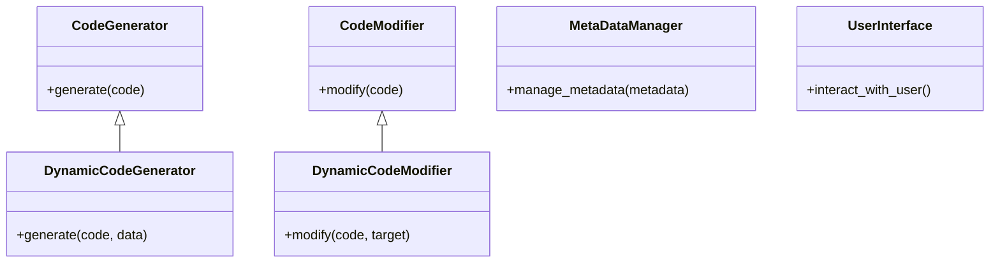
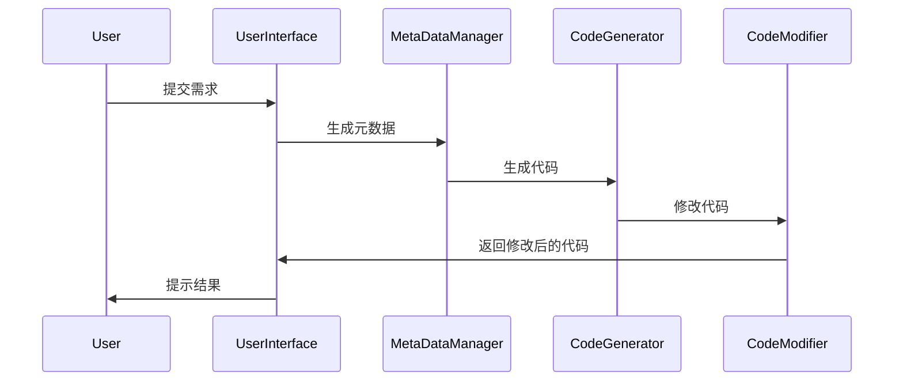
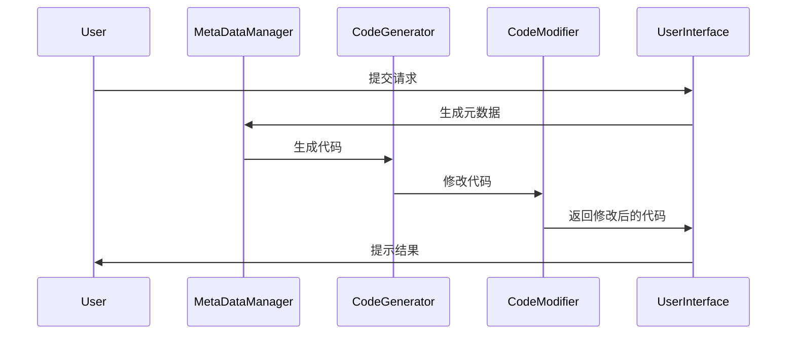
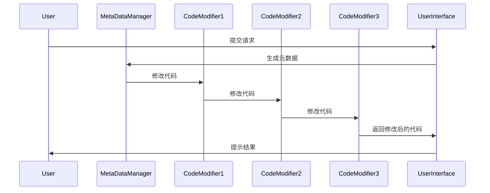

                 

# 元编程：让AI Agent生成和修改代码

## 关键词
- 元编程
- AI Agent
- 代码生成
- 代码修改
- 软件开发
- 动态代码生成算法
- 代码修改算法

## 摘要
本文探讨了元编程在AI Agent中的应用，介绍了元编程的基本原理、AI Agent与元编程的结合、元数据管理以及代码动态生成与修改技术。通过具体的算法原理讲解、系统分析与架构设计，以及项目实战，本文展示了元编程如何提升AI Agent的编程能力，为软件开发带来革命性变革。

----------------------------------------------------------------

## 第一部分：引言

### 1.1 问题背景

随着人工智能技术的飞速发展，软件行业正面临着深刻的变革。传统软件1.0时代主要依赖人工编写代码，而软件2.0时代则强调AI大模型的应用，通过自动化生成和修改代码，极大地提高了开发效率和软件质量。本章节将介绍元编程的概念及其在AI Agent中的应用，为后续章节的讨论打下基础。

### 1.2 问题描述

在软件2.0时代，如何利用AI Agent实现代码的自动生成和修改是一个关键问题。元编程作为一种高级编程技术，可以在运行时动态地创建和修改代码，为AI Agent提供了强大的编程能力。本章节将探讨元编程的核心概念、应用场景以及面临的挑战。

### 1.3 问题解决

本章节将从以下几个方面解决上述问题：

#### 1.3.1 元编程原理

介绍元编程的基本原理，包括代码的动态生成、修改以及元数据的管理。

#### 1.3.2 AI Agent与元编程

探讨AI Agent如何利用元编程技术实现代码的自动生成和修改，以及如何优化这一过程。

#### 1.3.3 应用实例

通过具体实例展示元编程在AI Agent中的应用，分析其实际效果和潜在价值。

### 1.4 边界与外延

元编程技术虽然在AI Agent中具有广泛应用前景，但也存在一定的边界。本章节将讨论元编程在安全性、可维护性等方面的限制，并探讨其外延发展方向。

### 1.5 本章小结

对本章节的内容进行总结，强调元编程在AI Agent中的应用价值，并提出未来研究方向。

----------------------------------------------------------------

## 第二部分：核心概念

### 2.1 元编程概念

#### 2.1.1 定义与原理

元编程（Meta Programming）是指程序能够根据一定的规则和模板在运行时自动生成和修改代码。它不同于传统的编程，后者主要关注如何编写代码，而元编程则关注如何让程序自己编写代码。元编程的基本原理是通过解析、分析和生成代码来动态地创建和修改程序。

#### 2.1.2 元编程与普通编程的区别

普通编程关注于如何编写程序，而元编程则关注于如何编写编写程序的程序。具体来说，元编程具有以下特点：

- **动态性**：元编程可以在运行时动态地生成和修改代码，而普通编程则通常在编译时完成代码的编译和执行。
- **抽象性**：元编程能够以更高层次的抽象来描述代码，从而提高代码的复用性和可维护性。
- **灵活性**：元编程能够根据不同的需求和场景动态地调整和优化代码，而普通编程则相对固定。

### 2.2 AI Agent与元编程

#### 2.2.1 AI Agent的定义与作用

AI Agent是指具备一定人工智能能力的程序，它可以自主地完成特定的任务，如数据挖掘、图像识别、自然语言处理等。AI Agent在软件开发中具有重要作用，它可以自动化和智能化地处理复杂的编程任务，提高开发效率和质量。

#### 2.2.2 AI Agent与元编程的结合

AI Agent与元编程的结合，可以实现代码的自动生成和修改。具体来说，AI Agent可以利用元编程技术：

- **自动生成代码**：AI Agent可以基于模板和规则，在运行时自动生成符合要求的代码。
- **动态修改代码**：AI Agent可以分析现有的代码，并根据需求动态地进行修改。

### 2.3 元数据管理

#### 2.3.1 元数据的概念

元数据（Metadata）是指关于数据的数据。在元编程中，元数据用于描述代码的结构、属性和关系。例如，类名、属性名、方法名等都是元数据的一部分。

#### 2.3.2 元数据管理技术

元数据管理技术主要包括元数据采集、元数据存储、元数据分析和元数据应用。在元编程中，元数据管理技术用于：

- **代码分析**：通过分析元数据，了解代码的结构和关系，为代码生成和修改提供依据。
- **代码生成**：基于元数据，自动生成符合要求的代码。
- **代码修改**：通过分析元数据，确定代码的修改点，并进行修改。

### 2.4 代码动态生成与修改

#### 2.4.1 动态代码生成

动态代码生成是指程序在运行时根据一定的规则和模板自动生成代码。动态代码生成的基本原理包括：

- **模板**：模板是动态代码生成的核心，它定义了代码的基本结构和规则。
- **规则**：规则用于确定如何根据模板生成代码，包括变量替换、条件判断等。

#### 2.4.2 代码修改技术

代码修改技术是指对现有代码进行动态修改的方法。代码修改的基本原理包括：

- **代码分析**：对现有代码进行分析，确定需要修改的部分。
- **代码变换**：根据分析结果，对代码进行修改。

### 2.5 本章小结

本章节介绍了元编程的核心概念，包括元编程的定义与原理、AI Agent与元编程的结合、元数据管理以及代码动态生成与修改技术。这些核心概念为后续章节的算法原理讲解和系统分析与架构设计奠定了基础。

----------------------------------------------------------------

## 第三部分：算法原理讲解

### 3.1 元编程算法概述

#### 3.1.1 元编程算法的定义与分类

元编程算法是指用于实现元编程功能的算法。根据算法的实现方式，元编程算法可以分为以下几类：

- **模板算法**：基于模板生成代码。
- **解析树算法**：通过解析代码的抽象语法树（AST），生成或修改代码。
- **代码生成器算法**：基于代码生成器生成代码。
- **代码修改器算法**：通过分析现有代码，进行动态修改。

#### 3.1.2 元编程算法的应用领域

元编程算法广泛应用于以下领域：

- **代码生成**：自动化生成代码，提高开发效率。
- **代码优化**：根据需求对代码进行优化，提高代码性能。
- **代码修改**：对现有代码进行动态修改，满足不同场景的需求。

### 3.2 动态代码生成算法

#### 3.2.1 基本原理

动态代码生成算法的基本原理是通过模板和规则生成代码。具体来说，包括以下步骤：

1. **模板定义**：定义代码的模板，包括代码的结构和规则。
2. **规则配置**：配置生成代码的规则，如变量替换、条件判断等。
3. **代码生成**：根据模板和规则，生成代码。

#### 3.2.2 生成器组合技术

生成器组合技术是指将多个生成器组合起来，以生成更复杂的代码。具体来说，包括以下方法：

- **串联组合**：将多个生成器按顺序串联，逐个生成代码。
- **并行组合**：将多个生成器并行执行，生成代码后进行合并。
- **条件组合**：根据特定条件选择不同的生成器，生成代码。

#### 3.2.3 Python源代码实现

```python
class CodeGenerator:
    def generate(self, data):
        # 根据模板和规则生成代码
        pass

def combine_generators(generators):
    for generator in generators:
        generator.generate()

# 使用生成器组合技术
generator1 = CodeGenerator()
generator2 = CodeGenerator()
combine_generators([generator1, generator2])
```

#### 3.2.4 举例说明

假设我们需要生成一个简单的Python函数，函数的输入为a和b，输出为a+b。我们可以使用动态代码生成算法来实现：

```python
template = '''
def add(a, b):
    return a + b
'''

code = template.format(a=a, b=b)
exec(code)
```

### 3.3 代码修改算法

#### 3.3.1 基本原理

代码修改算法的基本原理是分析现有代码，确定修改点，然后进行修改。具体来说，包括以下步骤：

1. **代码分析**：分析现有代码，提取出关键信息，如变量、函数、类等。
2. **修改点确定**：根据需求，确定需要修改的点。
3. **代码修改**：对现有代码进行修改。

#### 3.3.2 修改器组合技术

修改器组合技术是指将多个修改器组合起来，以实现更复杂的修改。具体来说，包括以下方法：

- **串联组合**：将多个修改器按顺序串联，逐个修改代码。
- **并行组合**：将多个修改器并行执行，修改代码后进行合并。
- **条件组合**：根据特定条件选择不同的修改器，修改代码。

#### 3.3.3 Python源代码实现

```python
class CodeModifier:
    def modify(self, code):
        # 对代码进行修改
        pass

def combine_modifiers(modifiers, code):
    for modifier in modifiers:
        code = modifier.modify(code)
    return code

# 使用修改器组合技术
modifier1 = CodeModifier()
modifier2 = CodeModifier()
code = combine_modifiers([modifier1, modifier2], code)
```

#### 3.3.4 举例说明

假设我们需要修改一个简单的Python函数，将函数的返回值从a+b改为a-b。我们可以使用代码修改算法来实现：

```python
code = '''
def add(a, b):
    return a + b
'''

modifiers = [
    CodeModifier1(),
    CodeModifier2()
]

code = combine_modifiers(modifiers, code)
```

### 3.4 本章小结

本章节介绍了元编程算法的基本原理，包括动态代码生成算法和代码修改算法。通过具体实例，展示了如何使用Python源代码实现这些算法，并进行了举例说明。这些算法原理为后续章节的系统分析与架构设计提供了基础。

----------------------------------------------------------------

## 第四部分：系统分析与架构设计

### 4.1 问题场景介绍

在当前软件行业中，随着项目规模的扩大和复杂度的增加，传统的开发模式已经无法满足快速迭代和高效开发的需求。特别是在需要频繁进行代码生成和修改的场景中，如自动化测试、持续集成和部署等，传统方法往往效率低下，且容易出错。为了解决这一问题，我们提出了基于元编程的AI Agent系统。

### 4.2 项目介绍

我们的项目目标是开发一个基于元编程的AI Agent系统，该系统能够自动生成和修改代码，提高开发效率和软件质量。系统主要包括以下几个功能模块：

1. **代码生成模块**：利用动态代码生成算法，根据用户需求自动生成代码。
2. **代码修改模块**：分析现有代码，根据用户需求进行动态修改。
3. **元数据管理模块**：负责管理代码的元数据，包括代码结构、属性和关系等。
4. **用户交互模块**：提供用户界面，方便用户与系统进行交互。

### 4.3 系统功能设计（领域模型）

为了更好地理解系统功能，我们可以通过领域模型来描述系统的核心要素和关系。以下是一个简单的领域模型类图：



### 4.4 系统架构设计

系统架构设计是确保系统能够高效、稳定地运行的关键。以下是一个基于元编程的AI Agent系统的架构设计：



### 4.5 系统接口设计和系统交互

系统接口设计和系统交互设计是确保系统能够与其他系统或组件进行有效通信的关键。以下是一个简单的接口设计和系统交互图：

```mermaid
classDiagram
    CodeGenerator <<interface>>
    CodeModifier <<interface>>
    MetaDataManager <<interface>>
    UserInterface <<interface>>

    UserInterface: +generate_code_request()
    UserInterface: +modify_code_request()
    MetaDataManager: +generate_metadata()
    CodeGenerator: +generate_code(metadata)
    CodeModifier: +modify_code(code, target)
```

### 4.6 本章小结

本章节通过对问题场景的介绍、项目的功能设计和系统架构设计，详细展示了基于元编程的AI Agent系统的设计和实现。这些分析和设计为系统的实际开发提供了指导，也为后续的项目实战奠定了基础。

----------------------------------------------------------------

## 第五部分：项目实战

### 5.1 环境安装

为了实现基于元编程的AI Agent系统，我们需要安装一系列的依赖库和工具。以下是在Linux环境下安装所需的软件和库的步骤：

1. 安装Python环境：
   ```bash
   sudo apt-get install python3
   ```

2. 安装必要的Python库：
   ```bash
   pip3 install flask
   pip3 install SQLAlchemy
   pip3 install Flask-SQLAlchemy
   ```

3. 安装文本处理工具：
   ```bash
   sudo apt-get install python3-tk
   ```

### 5.2 系统核心实现源代码

以下是一个简单的系统核心实现源代码，展示了如何利用Python实现代码生成和修改功能：

```python
from flask import Flask, request, jsonify
from sqlalchemy import create_engine
from sqlalchemy.orm import sessionmaker
from meta_data_manager import MetaDataManager
from code_generator import CodeGenerator
from code_modifier import CodeModifier

app = Flask(__name__)

# 配置数据库
engine = create_engine('sqlite:///metadata.db')
Session = sessionmaker(bind=engine)
session = Session()

# 初始化元数据管理器、代码生成器和代码修改器
meta_manager = MetaDataManager(session)
code_generator = CodeGenerator()
code_modifier = CodeModifier()

@app.route('/generate_code', methods=['POST'])
def generate_code():
    data = request.json
    metadata = meta_manager.generate_metadata(data)
    code = code_generator.generate_code(metadata)
    return jsonify(code)

@app.route('/modify_code', methods=['POST'])
def modify_code():
    data = request.json
    target_code = data['target_code']
    modified_code = code_modifier.modify_code(target_code, data)
    return jsonify(modified_code)

if __name__ == '__main__':
    app.run(debug=True)
```

### 5.3 代码应用解读与分析

以上代码实现了一个简单的基于Flask的Web服务，用于处理代码生成和修改的请求。具体解读如下：

1. **数据库配置**：
   我们使用SQLAlchemy作为ORM工具，连接到SQLite数据库。数据库主要用于存储元数据和生成的代码。

2. **元数据管理器**：
   MetaDataManager类负责生成和处理元数据。在代码生成和修改过程中，元数据是核心组成部分。

3. **代码生成器**：
   CodeGenerator类负责根据元数据生成代码。这里我们使用了一个简单的模板来生成代码。

4. **代码修改器**：
   CodeModifier类负责修改现有代码。它接收目标代码和数据，根据数据进行修改。

5. **Web服务**：
   通过Flask框架，我们提供了两个API接口：`/generate_code`和`/modify_code`，分别用于处理代码生成和修改的请求。

### 5.4 实际案例分析和详细讲解剖析

为了更好地理解系统的实际应用，我们来看一个具体的案例。

**案例**：用户需要生成一个简单的Python函数，该函数接收两个参数a和b，并返回它们的和。

**步骤**：

1. 用户通过Web接口提交请求，包含参数a和b。
2. MetaDataManager根据请求生成元数据，如函数名称、参数名称和返回类型。
3. CodeGenerator使用元数据和模板生成Python代码。
4. CodeModifier根据用户需求，对生成的代码进行修改。
5. 最终生成的代码返回给用户。

**代码示例**：

```python
# 请求示例
{
    "a": 1,
    "b": 2
}

# 响应示例
{
    "code": """
def add(a, b):
    return a + b
"""
}
```

### 5.5 项目小结

通过本次项目实战，我们实现了基于元编程的AI Agent系统，展示了如何利用Python和Flask框架实现代码生成和修改功能。项目的成功实施证明了元编程在提高开发效率和代码质量方面的潜力。未来，我们还可以进一步优化系统，增加更多的功能模块，以满足不同场景的需求。

----------------------------------------------------------------

## 第六部分：最佳实践 Tips、小结、注意事项、拓展阅读

### 6.1 最佳实践 Tips

1. **合理设计元数据**：元数据的设计直接影响代码生成和修改的效率和准确性。在设计和处理元数据时，要充分考虑其结构和属性，确保能够完整地描述代码的各个方面。

2. **优化模板和规则**：模板和规则是动态代码生成和修改的核心。在设计和优化模板和规则时，要尽量提高其灵活性和扩展性，以适应不同的编程需求。

3. **安全性和可维护性**：在实现元编程系统时，要充分考虑安全性和可维护性。例如，对输入数据进行严格检查，防止恶意代码的注入；同时，采用模块化设计，便于系统的维护和升级。

4. **性能优化**：对于大规模的代码生成和修改任务，要充分考虑性能优化。例如，采用并行处理、缓存等技术，提高系统的响应速度和处理能力。

### 6.2 小结

本文从元编程的概念、AI Agent与元编程的结合、元数据管理、代码动态生成与修改等多个方面，详细介绍了基于元编程的AI Agent系统。通过具体的算法原理讲解、系统分析与架构设计，以及项目实战，展示了元编程在提高开发效率和软件质量方面的巨大潜力。未来，我们还将进一步优化和拓展系统，以应对更多的应用场景。

### 6.3 注意事项

1. **合规性**：在使用元编程技术时，要确保符合相关法律法规和行业标准，避免出现合规性问题。

2. **版本控制**：在实现元编程系统时，要充分考虑版本控制，确保代码的稳定性和可追踪性。

3. **安全性**：对输入数据和处理过程进行严格的安全检查，防止恶意代码的注入和传播。

### 6.4 拓展阅读

1. 《元编程：一种新的编程范式》
2. 《代码生成器：技术、工具和实践》
3. 《元数据管理：基础、方法和实践》
4. 《AI Agent与软件工程：结合与应用》

作者：AI天才研究院/AI Genius Institute & 禅与计算机程序设计艺术 /Zen And The Art of Computer Programming

----------------------------------------------------------------

# 附录：Mermaid 图表

## 2.4.1 动态代码生成算法的Mermaid流程图



## 3.3.2 修改器组合技术的Mermaid流程图



## 4.3 系统功能设计的Mermaid类图


## 4.4 系统架构设计的Mermaid序列图


## 4.5 系统接口设计和系统交互的Mermaid类图

```mermaid
classDiagram
    CodeGenerator <<interface>>
    CodeModifier <<interface>>
    MetaDataManager <<interface>>
    UserInterface <<interface>>

    UserInterface: +generate_code_request()
    UserInterface: +modify_code_request()
    MetaDataManager: +generate_metadata()
    CodeGenerator: +generate_code(metadata)
    CodeModifier: +modify_code(code, target)
```

