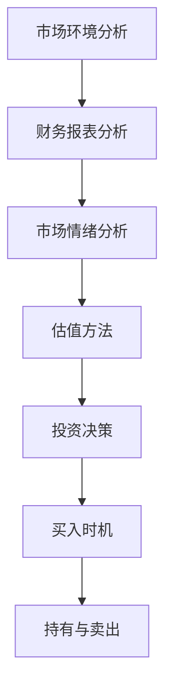
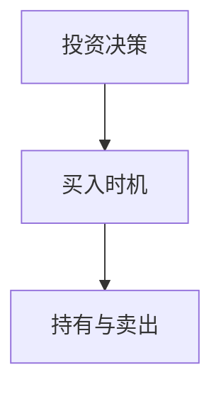

                 


### 引言

#### 深度价值投资的概念与背景

深度价值投资是一种基于对公司基本面进行深入分析，寻找被市场严重低估的投资机会的策略。它源于传统价值投资，但又比传统的价值投资更为深入和严谨。传统价值投资主要关注公司的财务报表，而深度价值投资则更侧重于对公司未来盈利能力的预测和市场情绪的分析。

这种投资方法起源于20世纪30年代的美国，当时著名的投资大师本杰明·格雷厄姆提出了价值投资的理念。随着时间的推移，许多投资大师，如沃伦·巴菲特、大卫·多德等，进一步发展和完善了这一理论。他们通过深入分析公司的财务数据、市场情绪以及宏观经济环境，寻找那些被市场忽视的、具有长期投资价值的股票。

深度价值投资在当今市场环境中尤为重要。随着金融市场的日益复杂和透明度提高，许多股票的价格与其内在价值之间存在较大差异。通过深度价值投资，投资者可以寻找到这些被低估的股票，从而获得较高的投资回报。

#### 深度价值投资的重要性

深度价值投资具有以下重要性：

1. **长期投资回报率高**：通过深入分析公司的基本面，深度价值投资可以寻找到那些具有长期投资价值的股票，从而实现较高的投资回报。
2. **风险较低**：由于深度价值投资强调对公司的深入分析，因此投资者可以更好地了解公司的真实情况，从而降低投资风险。
3. **市场适应性**：深度价值投资不仅关注公司的基本面，还关注市场情绪和宏观经济环境，这使得投资者可以更好地适应市场变化，捕捉投资机会。

#### 本文内容安排

本文将围绕深度价值投资的主题，系统地介绍其核心概念、投资流程、实战案例以及风险管理等内容。具体内容安排如下：

1. **核心概念**：详细介绍深度价值投资的基本原理和策略。
2. **投资流程**：分析深度价值投资的完整流程，包括选股策略、买入时机、持有与卖出等。
3. **实战案例**：通过实际案例展示深度价值投资的应用。
4. **风险管理**：讨论深度价值投资中可能面临的风险，并提供相应的管理策略。
5. **最佳实践与总结**：总结深度价值投资的最佳实践，并提供拓展阅读建议。

通过本文的阅读，读者将全面了解深度价值投资的理论和实践，掌握这一投资策略的核心要义，从而在实际投资中运用自如。

### 核心概念

#### 价值投资原理

价值投资，又称价值型投资，是一种通过寻找市场价格低于其内在价值的股票进行投资的方法。其核心思想是，通过深入分析公司的财务报表、市场地位、行业趋势等因素，找到那些被市场低估的股票，从而在未来获得较高的投资回报。

价值投资的创始人本杰明·格雷厄姆提出了几个重要的原则，包括：

1. **安全边际**：投资者应该选择市场价格低于其内在价值的股票，以避免潜在的投资损失。安全边际是市场价格与内在价值之间的差额，是评估股票是否具有投资价值的重要指标。
2. **内在价值**：股票的内在价值是指其真实价值，可以通过分析公司的财务报表、未来盈利能力等因素来估算。只有当市场价格低于内在价值时，股票才具有投资价值。

#### 深度价值投资的特点

深度价值投资是对传统价值投资的一种深化和拓展。其特点包括：

1. **更深入的分析**：深度价值投资不仅分析公司的财务报表，还关注公司的市场地位、行业前景、管理团队等因素。通过更全面的分析，投资者可以更准确地评估股票的内在价值。
2. **更长时间的持有**：深度价值投资通常选择那些具有长期投资价值的股票，因此投资周期较长。投资者需要具备较强的耐心和定力，以应对市场波动。
3. **更广泛的范围**：深度价值投资不仅关注传统的金融指标，还关注市场情绪、宏观经济环境等因素。这使得投资者可以更好地把握市场动态，寻找被低估的投资机会。

#### 深度价值投资的框架

深度价值投资可以分为以下几个步骤：

1. **市场环境分析**：投资者需要分析宏观经济环境、行业发展趋势、市场情绪等因素，以确定投资的大环境。
2. **公司基本面分析**：投资者需要通过财务报表、行业报告等途径，深入分析公司的基本面，包括盈利能力、资产负债状况、现金流等。
3. **估值方法**：投资者需要选择合适的估值方法，如市盈率、市净率、股息率等，来估算股票的内在价值。
4. **市场情绪分析**：投资者需要关注市场情绪，以判断股票价格是否低于其内在价值。
5. **投资决策**：投资者需要根据以上分析结果，做出投资决策，选择具有长期投资价值的股票。
6. **买入时机**：投资者需要选择合适的时机进行买入，以最大化投资收益。
7. **持有与卖出**：投资者需要根据市场变化，合理持有股票，并在合适的时机卖出。

#### 核心概念联系图（ER图）

以下是深度价值投资的核心概念联系图（ER图）：

```mermaid
erDiagram
    MarketEnvironment --> CompanyFundamentals : 分析市场环境以确定投资大环境
    CompanyFundamentals --> ValuationMethods : 分析公司基本面以估算内在价值
    ValuationMethods --> MarketSentiment : 使用估值方法判断股票价格是否低于内在价值
    MarketSentiment --> InvestmentDecision : 分析市场情绪以做出投资决策
    InvestmentDecision --> BuyingOpportunity : 选择合适的时机进行买入
    BuyingOpportunity --> HoldingAndSelling : 根据市场变化合理持有和卖出股票
```

#### 价值投资与深度价值投资对比表

以下是价值投资与深度价值投资的对比表：

| 对比项 | 价值投资 | 深度价值投资 |
| :--: | :--: | :--: |
| 分析深度 | 表面分析 | 深入分析 |
| 投资周期 | 较短 | 较长 |
| 估值方法 | 侧重传统财务指标 | 结合市场情绪和宏观经济环境 |
| 耐心程度 | 较高 | 非常高 |

通过以上对比，我们可以看出，深度价值投资在分析深度、投资周期、估值方法和耐心程度等方面都比传统价值投资更为深入和严谨。

### 选股策略

#### 财务报表分析

财务报表分析是深度价值投资中的核心环节，通过分析公司的财务报表，投资者可以了解公司的盈利能力、资产负债状况、现金流等关键信息。以下是一些关键的财务指标及其分析方法：

1. **市盈率（PE）**：市盈率是股票价格与每股收益（EPS）的比值。低市盈率通常意味着股票被低估。然而，单纯依靠市盈率来判断股票的价值并不可靠，因为市盈率会受到市场情绪、行业周期等因素的影响。投资者应该结合公司的基本面和其他财务指标进行综合分析。
2. **市净率（PB）**：市净率是股票价格与每股净资产（BPS）的比值。低市净率通常意味着股票被低估。市净率可以作为评估股票价值的一个参考指标，但同样需要结合公司的盈利能力、成长性等因素进行分析。
3. **现金流（CF）**：现金流是公司经营活动中产生的现金流入和流出。自由现金流（FCF）是公司扣除运营成本、资本支出后的现金流。自由现金流可以反映公司的盈利能力和现金回报能力，是评估公司价值的重要指标。
4. **负债率（D/E）**：负债率是公司负债总额与股东权益的比值。高负债率可能意味着公司存在较高的财务风险，而低负债率则可能意味着公司财务状况较为稳定。

#### 市场情绪分析

市场情绪分析是深度价值投资中不可或缺的一部分，通过分析市场情绪，投资者可以判断股票价格是否低于其内在价值。以下是一些常用的市场情绪分析工具：

1. **股票价格指数**：股票价格指数如道琼斯工业平均指数、标准普尔500指数等可以反映市场整体情绪。指数的涨跌可以提供市场情绪的初步判断。
2. **成交量**：成交量是市场活跃程度的指标。大量成交通常意味着市场情绪高涨，而低成交量则可能意味着市场情绪低迷。
3. **技术分析**：技术分析通过研究股票价格和交易量等数据，预测股票未来的走势。常用的技术分析工具包括趋势线、支撑位、阻力位、移动平均线等。
4. **市场情绪指标**：市场情绪指标如恐慌指数（VIX）可以反映市场的恐慌程度。高恐慌指数通常意味着市场情绪悲观，可能为深度价值投资提供机会。

#### 估值方法

估值方法是深度价值投资中用于判断股票是否被低估的重要工具。以下是一些常用的估值方法：

1. **贴现现金流法（DCF）**：贴现现金流法是通过估算公司的未来现金流，并将其折现到当前价值，以判断股票的价值。DCF法需要预测公司的未来盈利能力、增长率等关键因素，因此具有较高的难度。但它是评估公司内在价值的最直接和准确的方法。
2. **相对估值法**：相对估值法是通过比较同一行业或其他类似公司的估值水平，来判断股票的价值。常用的相对估值指标包括市盈率、市净率、市销率等。
3. **股息折现模型（DDM）**：股息折现模型是通过估算公司未来派发的股息，并将其折现到当前价值，以判断股票的价值。DDM法适用于那些具有稳定股息支付记录的公司。

#### 选股策略流程图（mermaid图）

以下是选股策略的流程图：



通过以上分析，投资者可以系统地选股，并制定合理的投资策略。接下来，我们将介绍深度价值投资的投资流程，帮助投资者更好地理解和应用这一策略。

### 投资流程

#### 投资决策

投资决策是深度价值投资流程中的第一步，也是至关重要的一步。投资者需要根据市场环境分析、财务报表分析、市场情绪分析和估值方法分析的结果，做出是否投资的决定。以下是一些关键步骤：

1. **评估市场环境**：投资者需要分析宏观经济环境、行业发展趋势、政策变化等因素，以判断当前市场是否有利于投资。例如，在经济繁荣时期，市场情绪高涨，投资者可能会更加乐观，反之，在经济衰退时期，市场情绪悲观，投资者可能会更加谨慎。
2. **评估财务报表**：投资者需要通过分析公司的财务报表，了解公司的盈利能力、资产负债状况、现金流等关键信息。如果财务报表显示公司经营状况良好，盈利能力较强，则可能为投资提供了有力的支持。
3. **分析市场情绪**：投资者需要通过市场情绪指标、技术分析等方法，判断市场情绪是否乐观。如果市场情绪悲观，可能为深度价值投资提供了机会。
4. **估值分析**：投资者需要根据估值方法，如贴现现金流法、相对估值法等，判断股票的内在价值。如果股票的内在价值明显高于市场价格，则可能是一个值得投资的机会。
5. **综合评估**：投资者需要将以上分析结果进行综合评估，以做出最终的投资决策。例如，如果市场环境良好，公司财务报表显示盈利能力强，市场情绪悲观，且股票的内在价值高于市场价格，则可能是一个理想的投资机会。

#### 买入时机

买入时机是深度价值投资中至关重要的环节，正确的买入时机可以最大化投资收益，而错误的买入时机可能会导致投资损失。以下是一些关键步骤：

1. **等待机会**：投资者需要耐心等待市场机会的出现。在市场情绪悲观、股票价格低于其内在价值时，可能是买入的时机。
2. **观察市场**：投资者需要密切关注市场动态，包括股票价格、成交量、市场情绪等。通过观察这些指标，投资者可以判断市场是否已经达到理想的买入时机。
3. **制定买入策略**：投资者需要根据市场情况，制定买入策略。例如，如果市场情绪悲观，股票价格已经连续下跌，且估值水平较低，则可能是买入的时机。
4. **分散投资**：投资者不应将所有资金投入一只股票，而是应该进行分散投资，以降低风险。投资者可以选择多只被低估的股票进行投资，以分散风险。

#### 持有与卖出

持有与卖出是深度价值投资流程中的最后一步，投资者需要根据市场变化和投资目标，合理持有和卖出股票。以下是一些关键步骤：

1. **合理持有**：投资者需要根据投资目标和市场情况，合理持有股票。如果市场环境良好，公司基本面稳定，且股票价格低于其内在价值，则可以继续持有股票。
2. **关注市场变化**：投资者需要密切关注市场变化，包括股票价格、成交量、市场情绪等。通过关注这些指标，投资者可以判断股票是否已经达到合理的卖出时机。
3. **设定卖出目标**：投资者需要根据市场情况和投资目标，设定合理的卖出目标。例如，如果股票价格已经达到其内在价值，或者市场环境发生变化，则可能是卖出股票的时机。
4. **分散卖出**：投资者不应一次性卖出所有股票，而是应该进行分散卖出。例如，如果投资者持有多只被低估的股票，可以逐步卖出，以降低风险。

#### 投资流程mermaid图

以下是投资流程的mermaid图：



通过以上步骤，投资者可以系统地执行深度价值投资流程，实现投资目标。接下来，我们将通过实际案例，展示如何应用深度价值投资策略。

### 实战案例

#### 案例一：某股票的深度价值分析

在本案例中，我们将以中国的一家知名互联网公司——腾讯（股票代码：00700.HK）为例，展示如何进行深度价值分析。

1. **市场环境分析**：
   - 当前市场处于波动期，受全球经济形势和新冠疫情的影响，市场情绪较为悲观。
   - 腾讯所处的互联网行业仍然具有较高增长潜力，但随着竞争加剧，行业整体估值有所下降。

2. **财务报表分析**：
   - 根据腾讯2022年年报，其营业收入为5607.8亿元，同比增长21%；净利润为1265.5亿元，同比增长33%。
   - 腾讯的资产负债情况良好，总负债为2619.9亿元，资产负债率为34.7%，处于较低水平。
   - 腾讯的自由现金流（FCF）为892.5亿元，显示出强劲的现金创造能力。

3. **市场情绪分析**：
   - 腾讯的股票价格在市场波动期间有所下跌，当前市盈率（PE）为21倍，低于行业平均水平。
   - 技术分析显示，腾讯股票价格在关键技术支撑位附近，显示市场情绪较为稳定。

4. **估值方法**：
   - 使用贴现现金流法（DCF）进行估值，假设腾讯未来三年的增长率为10%，贴现率为10%。
   - 计算得出腾讯的内在价值约为550港元/股，而当前股价约为450港元/股，存在明显低估。

5. **投资决策**：
   - 结合市场环境、财务报表、市场情绪和估值分析，腾讯显示出较强的投资潜力，是一个值得关注的深度价值投资目标。

6. **买入时机**：
   - 观察到腾讯股票价格在关键技术支撑位附近，市场情绪稳定，且估值较低，选择在此时买入。

7. **持有与卖出**：
   - 在持有期间，密切关注市场变化和公司基本面，如市场环境恶化或公司基本面出现重大变化，及时调整投资策略。
   - 当腾讯股票价格达到其内在价值或市场环境发生变化时，选择合适的时机进行卖出。

#### 案例二：某行业的深度价值投资策略

在本案例中，我们将以全球半导体行业为例，展示如何进行深度价值投资策略。

1. **市场环境分析**：
   - 当前全球经济形势不确定，半导体行业受到供应链中断、需求下降等因素的影响，整体市场情绪较为悲观。
   - 但从长期来看，半导体行业仍具有较高增长潜力，随着科技的进步和5G、人工智能等领域的快速发展，行业需求有望回升。

2. **行业基本面分析**：
   - 根据行业报告，全球半导体市场预计在未来五年内将保持年均5%以上的增长，显示出较强的增长潜力。
   - 主要半导体公司如台积电、三星、英特尔等，在技术创新、产能扩张等方面取得积极进展，盈利能力较强。

3. **估值方法**：
   - 使用市盈率（PE）和市净率（PB）等相对估值方法，对比行业平均水平和主要竞争对手，发现部分半导体公司的估值处于较低水平。

4. **投资策略**：
   - 选择估值较低、基本面良好的半导体公司进行投资，如台积电、三星等。
   - 关注行业趋势，如5G、人工智能等领域的需求增长，选择具有核心竞争力和技术优势的公司。

5. **买入时机**：
   - 在市场情绪低迷、半导体行业估值较低时，选择合适的时机进行买入。

6. **持有与卖出**：
   - 在持有期间，密切关注行业动态和公司基本面，如行业需求回升或公司业绩超预期，选择合适的时机进行卖出。

#### 案例分析与解读

通过对腾讯和全球半导体行业的深度价值投资案例分析，我们可以得出以下结论：

1. **市场环境分析**：在投资前，需要对市场环境进行充分分析，以判断当前市场是否有利于投资。
2. **财务报表分析**：通过财务报表分析，了解公司的盈利能力、资产负债状况、现金流等关键信息，是评估公司价值的重要依据。
3. **市场情绪分析**：通过市场情绪分析，判断股票价格是否低于其内在价值，是做出投资决策的重要依据。
4. **估值方法**：选择合适的估值方法，如贴现现金流法、相对估值法等，是判断股票价值的重要手段。
5. **投资决策**：结合市场环境、财务报表、市场情绪和估值分析，做出合理的投资决策。
6. **买入时机**：在市场情绪低迷、估值较低时，选择合适的时机进行买入。
7. **持有与卖出**：在持有期间，密切关注市场变化和公司基本面，合理持有和卖出股票。

通过以上实战案例，我们可以更深入地理解深度价值投资策略，并学会如何在实际投资中应用这一策略。

### 风险管理

#### 市场风险

市场风险是指由于市场环境变化导致的投资损失。深度价值投资者在投资过程中可能面临以下市场风险：

1. **市场波动**：股市波动性较大，可能会使股票价格短期大幅波动。深度价值投资者需要具备较强的心理素质，以应对市场波动。
2. **行业风险**：某些行业可能会受到宏观经济、政策变化等因素的影响，导致行业整体表现不佳。投资者需要选择那些具有长期增长潜力的行业进行投资。
3. **流动性风险**：某些股票可能存在流动性不足的问题，特别是在市场情绪悲观时，可能会导致股票价格难以回升。

#### 投资者心理风险

投资者心理风险是指由于投资者自身心理因素导致的投资决策失误。深度价值投资者在投资过程中可能面临以下心理风险：

1. **过度乐观或悲观**：投资者在市场环境较好或较差时，可能会过度乐观或悲观，导致投资决策不合理。
2. **情绪化决策**：投资者在受到市场情绪的影响时，可能会做出情绪化的决策，而不是基于理性分析。
3. **贪婪与恐惧**：投资者在市场上涨时可能会过于贪婪，而市场下跌时可能会过于恐惧，导致投资失误。

#### 风险管理策略

为了有效管理风险，深度价值投资者可以采取以下策略：

1. **分散投资**：通过分散投资，投资者可以降低单一股票或单一行业带来的风险。选择不同行业、不同估值水平的股票进行投资，可以分散市场风险。
2. **长期投资**：深度价值投资强调长期持有，通过长期投资，投资者可以降低短期市场波动带来的风险。
3. **定期评估**：投资者需要定期评估自己的投资组合，根据市场变化和公司基本面调整投资策略。
4. **心理建设**：投资者需要保持良好的心理素质，避免情绪化决策，以理性分析为基础做出投资决策。

通过以上风险管理策略，深度价值投资者可以更好地管理投资风险，实现长期稳定的投资回报。

### 最佳实践与总结

#### 最佳实践

1. **深入研究公司基本面**：投资者应深入研究公司的财务报表、盈利能力、现金流等关键信息，以判断公司是否具有长期投资价值。
2. **关注市场情绪**：投资者应关注市场情绪，通过技术分析和市场情绪指标，判断股票价格是否低于其内在价值。
3. **分散投资**：投资者应分散投资，以降低单一股票或单一行业带来的风险。
4. **长期持有**：投资者应具备长期持有的耐心，以应对市场波动，实现长期稳定的投资回报。
5. **定期评估**：投资者应定期评估自己的投资组合，根据市场变化和公司基本面调整投资策略。

#### 小结

深度价值投资是一种通过深入分析公司基本面和市场情绪，寻找被市场低估的投资机会的策略。通过本文的介绍，我们了解了深度价值投资的核心概念、投资流程、实战案例以及风险管理策略。深度价值投资具有长期投资回报率高、风险较低等优点，但需要投资者具备较强的分析能力、耐心和定力。

#### 注意事项

1. **充分研究**：在进行深度价值投资前，投资者应充分研究公司和行业，以避免投资风险。
2. **市场情绪**：投资者应关注市场情绪，避免在市场情绪高涨时盲目跟风，或在市场情绪低迷时过度悲观。
3. **分散投资**：投资者应分散投资，降低单一股票或行业带来的风险。

#### 拓展阅读

1. **《深度价值投资：寻找被低估的股票》** - 作者：克里斯·布朗
2. **《股市真规则》** - 作者：威廉·奥尼尔
3. **《股市真规则实战案例解析》** - 作者：威廉·奥尼尔

通过拓展阅读，投资者可以更深入地了解深度价值投资的原理和实践，提高自己的投资技能。

### 附录

#### 相关资源和进一步阅读

为了帮助读者深入了解深度价值投资，以下是一些推荐的资源：

1. **《深度价值投资：寻找被低估的股票》** - 克里斯·布朗
   - 本书详细介绍了深度价值投资的理论和实践，通过大量案例展示了如何在实际投资中运用这一策略。
2. **《股市真规则》** - 威廉·奥尼尔
   - 本书阐述了股市投资的基本原则和实战技巧，对投资者具有很高的指导意义。
3. **《股市真规则实战案例解析》** - 威廉·奥尼尔
   - 本书通过分析经典投资案例，展示了如何在实际操作中应用深度价值投资策略。

#### 进一步阅读

1. **《证券分析》** - 本杰明·格雷厄姆
   - 本书是价值投资的经典之作，阐述了价值投资的理论基础和实践方法。
2. **《股票大作手回忆录》** - 杰西·利弗莫尔
   - 本书通过作者的个人经历，展示了市场操纵和深度价值投资等投资策略。
3. **《投资最重要的事》** - 霍华德·马克斯
   - 本书从心理、策略、市场等多个角度，探讨了投资中最重要的因素，对投资者具有很高的参考价值。

通过进一步阅读这些书籍，读者可以更全面地了解深度价值投资的原理和实践，提高自己的投资水平。

### 作者信息

- 作者：AI天才研究院/AI Genius Institute & 禅与计算机程序设计艺术 /Zen And The Art of Computer Programming
- 本文旨在为读者提供关于深度价值投资的专业知识和实战经验，帮助投资者更好地理解和应用这一策略。希望本文对您有所帮助。如有任何疑问或建议，欢迎随时联系我们。祝您投资顺利！

