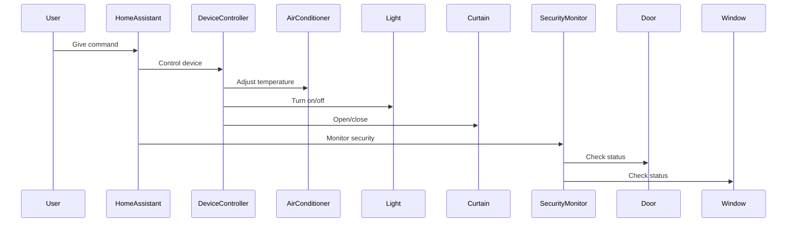
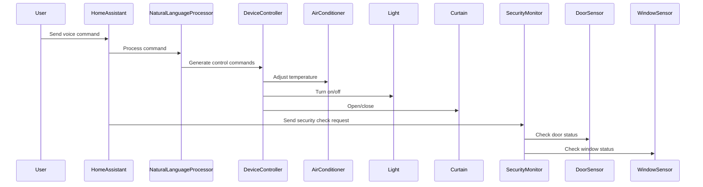
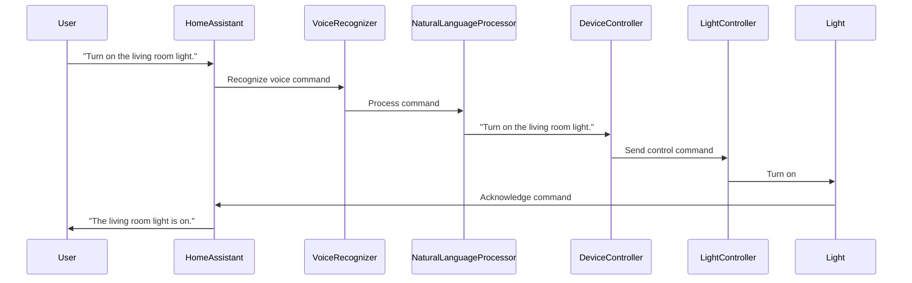
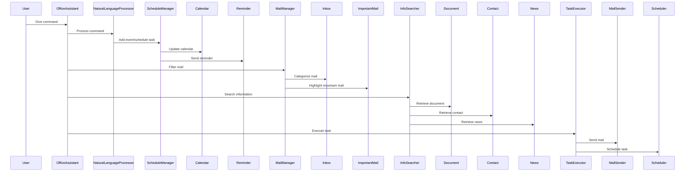
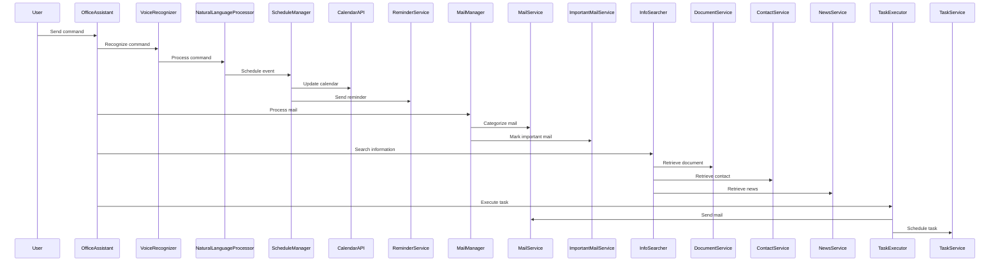
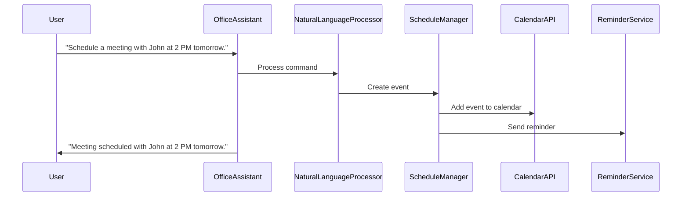
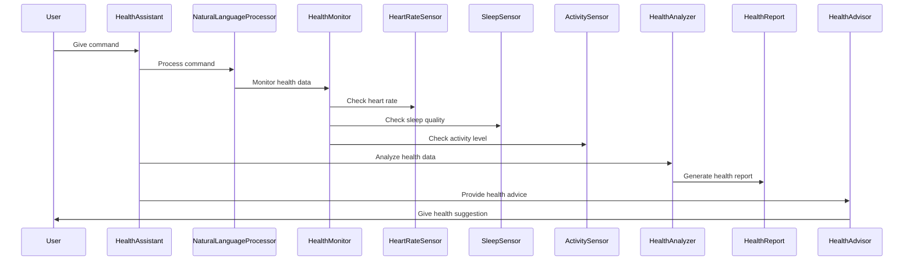
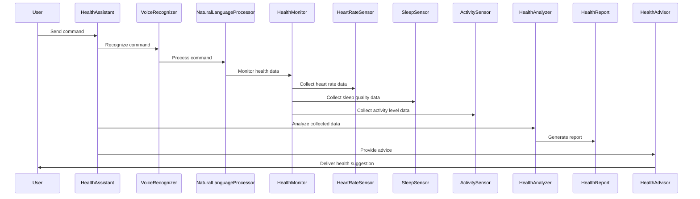
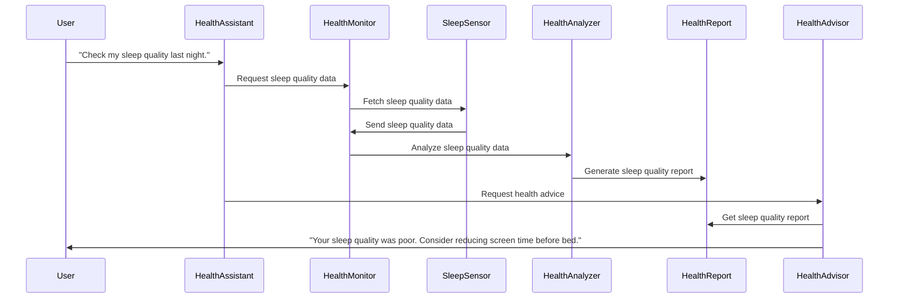

                 

## 全方位生活助手AI Agent：LLM驱动的个人管理系统

关键词：人工智能，个人管理系统，大语言模型（LLM），语音识别，自然语言处理，机器学习，深度学习，智能家居，工作效率，健康管理

摘要：本文将探讨如何利用大语言模型（LLM）构建全方位生活助手AI Agent，实现个人管理系统的自动化和智能化。文章首先介绍了AI助手的崛起和发展，探讨了AI助手的核心技术，如语音识别、自然语言处理和机器学习与深度学习技术。接着，深入剖析了LLM的基础知识，包括其结构与原理以及发展历程。然后，文章重点介绍了LLM在个人管理系统中的应用，如个性化推荐、情感分析和语音合成。随后，文章详细阐述了如何构建全方位生活助手AI Agent，包括设计与实现策略、数据收集与预处理、模型训练与优化。最后，通过三个实际案例展示了AI助手的广泛应用，并对AI助手的发展趋势和未来挑战进行了展望。

## 目录大纲

### 第一部分：AI助手概述

#### 第1章：AI助手崛起

1.1.1 AI助手的发展历程  
1.1.2 AI助手的核心功能与价值  
1.1.3 人工智能时代的生活变革

#### 第2章：AI助手核心技术

2.1.1 语音识别技术  
2.1.2 自然语言处理技术  
2.1.3 机器学习与深度学习技术

#### 第3章：AI助手应用场景

3.1.1 家居生活  
3.1.2 工作效率  
3.1.3 健康管理

### 第二部分：LLM驱动个人管理系统

#### 第4章：LLM基础

4.1.1 什么是LLM  
4.1.2 LLM的结构与原理  
4.1.3 LLM的发展历程

#### 第5章：LLM在个人管理系统中的应用

5.1.1 个性化推荐系统  
5.1.2 情感分析  
5.1.3 语音合成

#### 第6章：构建全方位生活助手AI Agent

6.1.1 设计与实现策略  
6.1.2 数据收集与预处理  
6.1.3 模型训练与优化

#### 第7章：实战案例

7.1.1 案例一：智能家庭助手  
7.1.2 案例二：智能办公助手  
7.1.3 案例三：智能健康助手

#### 第8章：未来展望与挑战

8.1.1 AI助手发展的未来趋势  
8.1.2 LLM在个人管理系统中的挑战与机遇

### 作者信息

作者：AI天才研究院/AI Genius Institute & 禅与计算机程序设计艺术 /Zen And The Art of Computer Programming## AI助手崛起

### 1.1.1 AI助手的发展历程

AI助手并非是一个新兴概念，而是随着人工智能技术的不断进步而逐渐发展壮大的。早在20世纪50年代，人工智能（AI）这一概念就被提出来，但早期的AI主要是以规则为基础的专家系统，其应用场景非常有限。随着计算机性能的不断提升和算法的改进，特别是深度学习技术的出现，AI技术逐渐从理论研究走向实际应用。

1980年代，语音识别技术开始逐渐成熟，为AI助手的发展奠定了基础。1990年代，自然语言处理技术（NLP）取得了显著进展，这使得AI助手能够更好地理解人类语言。2000年后，随着互联网和移动设备的普及，AI助手开始出现在人们的日常生活中，如苹果的Siri、谷歌的Google Assistant等。

进入21世纪，深度学习技术的发展使得AI助手的能力得到了极大提升。现代AI助手不仅能够理解自然语言，还能够进行上下文理解、情感分析和个性化推荐等复杂任务。随着5G网络的普及和物联网技术的发展，AI助手的应用场景进一步拓展，从智能家居、工作效率到健康管理，AI助手已经成为了人们生活中不可或缺的一部分。

### 1.1.2 AI助手的核心功能与价值

AI助手的核心功能主要包括语音识别、自然语言处理、上下文理解、情感分析和个性化推荐等。这些功能使得AI助手能够处理复杂的多媒体信息，为用户提供便捷、高效的服务。

首先，语音识别技术是AI助手的基础。通过语音识别，用户可以使用口头指令与AI助手进行交互，这大大提高了交互的便利性和效率。

其次，自然语言处理技术使得AI助手能够理解用户的需求，进行语义分析和意图识别。这一技术使得AI助手能够更好地理解用户的语言，从而提供更加个性化的服务。

此外，上下文理解是AI助手的关键能力。通过理解用户的历史交互记录，AI助手能够更好地预测用户的需求，提供更加精准的服务。

情感分析技术则使得AI助手能够识别用户的情感状态，从而提供更加人性化的服务。例如，当用户感到疲惫时，AI助手可以主动提出休息建议。

最后，个性化推荐系统是AI助手的重要功能。通过分析用户的行为数据，AI助手能够为用户推荐感兴趣的内容或服务，提高用户的使用体验。

总的来说，AI助手的价值体现在以下几个方面：

1. **提高工作效率**：AI助手能够自动处理日常任务，如日程管理、邮件处理和文件搜索等，从而节省用户的时间和精力。
2. **提升生活质量**：AI助手可以协助用户进行健康管理、智能家居控制等，提高生活舒适度和便利性。
3. **增强社交互动**：AI助手可以与用户进行自然语言交互，提供娱乐、教育等服务，增强社交互动。
4. **促进信息获取**：AI助手能够根据用户的需求提供相关信息，帮助用户更快地获取所需信息。

### 1.1.3 人工智能时代的生活变革

随着AI技术的发展，人们的生活方式正在发生深刻变革。首先，AI助手的出现极大地提高了工作效率。无论是职场人士还是学生，都可以通过AI助手来管理日程、处理邮件和查找信息，从而节省大量时间。其次，AI助手在智能家居中的应用使得家庭生活更加便捷和舒适。用户可以通过语音指令控制家电设备，如空调、灯光和音响等，提升生活品质。此外，AI助手在健康管理中的应用也日益广泛。通过监测用户的健康数据，AI助手可以提供个性化的健康建议，帮助用户保持良好的身体状况。

总的来说，AI助手作为人工智能技术的重要应用之一，正在深刻改变人们的生活方式。随着技术的不断进步，AI助手的功能将更加丰富，应用场景将进一步拓展，为人们带来更多便利和舒适。然而，随着AI助手在日常生活中的广泛应用，数据隐私和安全问题也逐渐凸显。如何确保用户数据的安全和隐私，将是未来AI助手发展的重要课题。在下一章中，我们将深入探讨AI助手的核心技术，包括语音识别、自然语言处理和机器学习与深度学习技术。这将为我们理解AI助手的工作原理和未来发展方向提供重要启示。## AI助手核心技术

### 2.1.1 语音识别技术

语音识别（Voice Recognition）是AI助手的核心技术之一，它使得用户可以通过口头指令与AI助手进行交互。语音识别技术的基本原理是将语音信号转换为文本，然后根据上下文进行语义分析，以理解用户的意图。

#### 技术原理

语音识别技术主要分为三个步骤：

1. **语音信号预处理**：包括降噪、增强和分帧。通过去除背景噪音和语音增强，可以提高语音信号的质量，从而提高识别准确率。
2. **特征提取**：将预处理后的语音信号转换为数字特征，如频谱特征、倒谱特征等。这些特征用于表示语音信号中的音素和音节。
3. **模型匹配**：将提取的特征与预先训练的语音模型进行匹配，以识别语音中的单词和短语。现代语音识别技术主要采用统计模型和深度学习模型，如HMM（隐马尔可夫模型）、DNN（深度神经网络）和端到端模型（如CTC、Attention机制）。

#### 应用场景

语音识别技术在AI助手中的应用非常广泛，包括：

- **智能家居**：用户可以通过语音指令控制智能家居设备，如开关灯、调节温度等。
- **语音搜索**：用户可以通过语音输入查询信息，如天气、新闻等。
- **语音助手**：如苹果的Siri、谷歌的Google Assistant等，用户可以通过语音与助手进行交互，获取服务或执行任务。

#### 技术挑战

尽管语音识别技术在许多应用场景中取得了显著成果，但仍然面临一些挑战：

- **语音质量**：噪声、语速、语调等都会影响语音识别的准确率。
- **多语言支持**：不同语言的语音特征和语法结构差异较大，需要针对不同语言进行特定的模型训练。
- **上下文理解**：语音识别需要结合上下文进行语义分析，以准确理解用户的意图。这需要复杂的自然语言处理技术支持。

### 2.1.2 自然语言处理技术

自然语言处理（Natural Language Processing，NLP）是AI助手的核心技术之一，它使得AI助手能够理解自然语言，进行语义分析和情感分析，从而提供个性化服务。

#### 技术原理

NLP的主要目标是让计算机理解和处理自然语言，其核心技术包括：

- **词法分析**：将文本分解为单词、短语和句子。
- **句法分析**：分析句子的结构，理解句子中的语法关系。
- **语义分析**：理解单词和句子的含义，进行语义角色标注和实体识别。
- **情感分析**：分析文本中的情感倾向，识别用户的态度和情绪。

现代NLP技术主要采用深度学习模型，如循环神经网络（RNN）、长短期记忆网络（LSTM）和变换器（Transformer）等。特别是Transformer模型的引入，使得NLP任务取得了突破性进展，如BERT、GPT等模型。

#### 应用场景

NLP技术在AI助手中的应用非常广泛，包括：

- **智能客服**：通过NLP技术，AI助手可以自动处理用户咨询，提供快速、准确的答复。
- **内容推荐**：通过情感分析和语义分析，AI助手可以推荐用户感兴趣的内容。
- **语音合成**：将文本转换为自然流畅的语音，用于语音识别和语音助手。

#### 技术挑战

NLP技术仍然面临一些挑战：

- **多语言支持**：不同语言的语法和语义结构差异较大，需要针对不同语言进行特定的模型训练。
- **上下文理解**：NLP需要结合上下文进行语义分析，以准确理解用户的意图。这需要复杂的模型和大量的数据。
- **数据标注**：高质量的标注数据是训练有效NLP模型的关键，但数据标注过程耗时且昂贵。

### 2.1.3 机器学习与深度学习技术

机器学习（Machine Learning，ML）和深度学习（Deep Learning，DL）是AI助手的核心技术，它们使得AI助手能够从数据中自动学习，提高任务完成的准确性和效率。

#### 技术原理

- **机器学习**：机器学习是一种让计算机通过数据自动学习和改进的方法。它主要包括监督学习、无监督学习和强化学习。监督学习通过标记数据来训练模型，无监督学习通过未标记数据来发现数据中的模式，强化学习则通过交互来学习策略。
- **深度学习**：深度学习是一种特殊的机器学习模型，通过多层神经网络（如CNN、RNN、Transformer等）来学习和提取数据中的复杂特征。

#### 应用场景

- **语音识别**：深度学习模型在语音识别中取得了显著成果，如基于深度神经网络的HMM-GMM模型和基于卷积神经网络的CTC模型。
- **图像识别**：深度学习在图像识别中的应用也非常广泛，如基于卷积神经网络的物体检测和图像分类。
- **自然语言处理**：深度学习模型在NLP任务中表现出色，如基于Transformer的BERT、GPT模型。

#### 技术挑战

- **数据量**：深度学习模型需要大量的数据来训练，且数据质量对模型性能有重要影响。
- **计算资源**：深度学习模型通常需要大量的计算资源，特别是训练阶段，这可能导致训练成本高。
- **模型解释性**：深度学习模型通常被视为“黑盒”，其内部工作机制难以解释，这限制了其在某些场景中的应用。

总的来说，语音识别、自然语言处理和机器学习与深度学习技术共同构成了AI助手的核心技术，使得AI助手能够实现语音交互、语义理解和任务自动化。这些技术的不断进步和应用，为AI助手的发展提供了强大动力。在下一章中，我们将深入探讨AI助手在实际生活中的应用场景，如家居生活、工作效率和健康管理。这将帮助我们更好地理解AI助手的价值和潜力。## AI助手应用场景

### 3.1.1 家居生活

AI助手在智能家居中的应用正在日益普及，它不仅提升了生活的便捷性，还大大增强了家庭的安全性和舒适性。

#### 技术实现

- **智能家电控制**：通过语音指令，用户可以远程控制家中的各种智能设备，如空调、灯光、窗帘和冰箱等。这些设备通常连接到互联网，并通过AI助手接收用户的指令。
- **情景模式**：AI助手可以根据用户的习惯和需求设置不同的情景模式，如“早晨模式”、“观影模式”等。在不同的情景模式下，家中的设备会自动调整到最佳状态。
- **家居安全监控**：AI助手可以通过连接摄像头和传感器，实时监控家庭的安保情况，并在发现异常时自动报警。

#### 应用实例

- **智能照明**：用户可以通过语音命令控制灯光的开关、亮度和颜色。例如，“打开客厅的灯光”或“将卧室灯光调成温暖的黄色”。
- **智能空调**：用户可以通过语音指令控制空调的温度和风速，如“把客厅空调的温度调到25度”或“将空调风速调至二档”。
- **智能监控**：当AI助手检测到家中发生异常（如门锁被非法打开或门窗被非法入侵），它会立即发送通知到用户的手机，并可以启动报警系统。

### 3.1.2 工作效率

AI助手在工作效率提升方面发挥着重要作用，通过自动化和智能化的任务处理，极大地减轻了用户的工作负担。

#### 技术实现

- **日程管理**：AI助手可以自动处理用户的日程安排，提醒用户重要的会议和任务。例如，用户可以告诉AI助手“明天早上9点有个会议”，AI助手会自动在用户的日历中添加提醒。
- **邮件处理**：AI助手可以自动分类和筛选邮件，将重要的邮件标记出来，并可以自动回复一些简单的邮件。
- **任务提醒**：AI助手可以根据用户的工作习惯，提醒用户完成未完成的任务，如“你还有一个任务未完成，请尽快处理”。

#### 应用实例

- **会议提醒**：AI助手会在会议开始前15分钟提醒用户，并在会议结束时自动发送会议记录到用户的邮箱。
- **邮件管理**：AI助手会自动将用户的邮件分类到不同的文件夹，如“重要邮件”、“待办事项”和“垃圾邮件”。
- **任务提醒**：AI助手会在用户完成任务时给出积极的反馈，如“恭喜，你已经完成了今天的第一项任务”。

### 3.1.3 健康管理

AI助手在健康管理中的应用日益受到关注，它通过分析用户的健康数据和日常活动，为用户提供个性化的健康建议和生活方式指导。

#### 技术实现

- **健康数据监测**：AI助手可以通过连接智能穿戴设备（如智能手环、智能手表）来监测用户的健康数据，如心率、睡眠质量、运动量等。
- **健康分析**：AI助手会对用户的健康数据进行深入分析，识别健康风险，并给出相应的建议。
- **健康建议**：AI助手会根据用户的健康状况和日常活动，提供个性化的健康建议，如饮食建议、运动计划等。

#### 应用实例

- **睡眠监测**：AI助手会监测用户的睡眠质量，并在用户睡眠过程中给出调整建议，如“你的睡眠质量不佳，建议晚上10点前睡觉”。
- **运动建议**：AI助手会根据用户的运动数据和健康目标，制定个性化的运动计划，如“你今天已经走了7000步，建议晚上进行半小时的跑步训练”。
- **饮食指导**：AI助手会根据用户的饮食习惯和健康状况，推荐健康的饮食方案，如“你今天的饮食不平衡，建议多吃蔬菜和水果”。

总的来说，AI助手在家庭生活、工作效率和健康管理中的应用，不仅提升了人们的生活质量，还改变了人们的生活方式。在下一章中，我们将深入探讨大语言模型（LLM）的基础知识，包括LLM的结构与原理以及发展历程，这将为我们理解LLM在AI助手中的应用提供重要基础。## LLM基础

### 4.1.1 什么是LLM

大语言模型（Large Language Model，简称LLM）是一种基于深度学习的自然语言处理模型，其核心思想是通过大规模的数据训练，使模型具备对自然语言的理解和生成能力。LLM通过对大量文本数据进行预训练，学习语言中的复杂规律和上下文关系，从而实现高质量的语言生成和语义理解。

#### 核心特点

- **大规模**：LLM通常由数十亿至数千亿的参数组成，其模型规模远超传统的语言模型。
- **预训练**：LLM通过在大量未标注的文本数据上进行预训练，学习语言的普遍规律和统计特征。
- **通用性**：LLM能够处理多种语言任务，如文本分类、翻译、问答等，具有很强的通用性。
- **上下文理解**：LLM具备强大的上下文理解能力，能够根据上下文生成连贯、合理的文本。

#### 发展历程

LLM的发展历程可以追溯到深度学习和自然语言处理技术的不断进步。以下是一些重要的里程碑：

- **2000年代**：早期语言模型如RNN和LSTM的出现，使得语言模型能够处理长序列数据。
- **2018年**：Google推出BERT模型，标志着基于Transformer架构的LLM开始取得突破性进展。
- **2019年**：OpenAI发布GPT-2，模型规模达到15亿参数，展示了LLM在语言生成和语义理解方面的强大能力。
- **2020年**：GPT-3发布，模型规模达到1750亿参数，成为当时最大的语言模型，其生成的文本质量和理解能力进一步提升。

### 4.1.2 LLM的结构与原理

LLM通常基于深度神经网络（DNN）和变换器（Transformer）架构，以下将详细介绍LLM的结构和原理。

#### 结构

- **输入层**：输入层接收自然语言文本数据，并将其转换为模型可以处理的向量形式。
- **嵌入层**：嵌入层将输入文本中的每个词转换为嵌入向量，这些向量包含词的语义信息。
- **变换器层**：变换器层是LLM的核心，通过多头自注意力机制（Multi-head Self-Attention）和前馈神经网络（Feedforward Neural Network）对输入向量进行建模，提取文本中的复杂关系。
- **输出层**：输出层根据模型预测结果生成文本，可以是生成式输出（如GPT系列模型）或判别式输出（如BERT系列模型）。

#### 原理

- **自注意力机制**：自注意力机制（Self-Attention）允许模型在不同位置之间建立关联，通过计算每个位置对其他所有位置的权重，从而提取文本中的关键信息。
- **前馈神经网络**：前馈神经网络（Feedforward Neural Network）在变换器层中用于对自注意力层输出的进一步建模，增加模型的非线性表达能力。
- **预训练与微调**：LLM通常采用预训练与微调的方法进行训练。预训练阶段，模型在大量未标注的文本数据上进行训练，学习语言的一般规律。微调阶段，模型根据特定任务的数据进行微调，以适应特定任务的需求。

### 4.1.3 LLM的发展历程

LLM的发展历程反映了深度学习和自然语言处理技术的不断进步，以下是一些重要的事件和里程碑：

- **2000年代初期**：早期语言模型如RNN和LSTM的出现，使得语言模型能够处理长序列数据。
- **2014年**：Transformer模型的提出，标志着自注意力机制在自然语言处理中的广泛应用。
- **2018年**：BERT模型发布，通过预训练和双向编码表示（Bidirectional Encoder Representations from Transformers），大幅提升了语言模型的语义理解能力。
- **2019年**：GPT-2模型发布，展示了基于生成式预训练的语言模型在文本生成和对话系统中的强大能力。
- **2020年**：GPT-3模型发布，模型规模达到1750亿参数，成为当时最大的语言模型，其生成的文本质量和理解能力进一步提升。

总的来说，LLM作为一种强大的自然语言处理工具，已经在多个领域展现出巨大的潜力。在下一章中，我们将探讨LLM在个人管理系统中的应用，包括个性化推荐、情感分析和语音合成等方面。## LLM在个人管理系统中的应用

### 5.1.1 个性化推荐系统

个性化推荐系统是LLM在个人管理系统中的重要应用之一。通过分析用户的兴趣和行为数据，LLM能够为用户提供高度个性化的推荐，从而提高用户的使用体验和满意度。

#### 技术原理

个性化推荐系统的工作原理可以分为以下几个步骤：

1. **用户兴趣建模**：LLM通过分析用户的浏览历史、购买记录、评论等数据，建立用户的兴趣模型。这一过程通常采用基于内容的过滤（Content-based Filtering）和协同过滤（Collaborative Filtering）等技术。

2. **推荐项生成**：基于用户兴趣模型，LLM生成一组潜在推荐项。这些推荐项可以是商品、新闻、音乐、视频等内容。

3. **推荐排序**：LLM对生成的推荐项进行排序，确保最符合用户兴趣的推荐项排在前面。排序算法通常采用基于模型的排序（Model-based Ranking）和基于启发式的排序（Heuristic-based Ranking）等方法。

#### 应用实例

1. **电商推荐**：电商平台通过LLM分析用户的购物行为和偏好，推荐用户可能感兴趣的商品。例如，当用户浏览了某款手机时，平台可能会推荐相同品牌的其他手机或相关配件。

2. **内容推荐**：视频网站和新闻网站利用LLM分析用户的观看历史和阅读偏好，为用户推荐相应的视频或新闻文章。例如，YouTube利用其推荐算法为用户推荐类似的视频。

3. **社交网络推荐**：社交网络平台通过LLM分析用户的互动行为，推荐用户可能感兴趣的新朋友或群组。例如，Facebook的“你可能认识的人”功能就是基于LLM的推荐系统。

#### 挑战与未来

个性化推荐系统的挑战主要包括：

- **数据隐私**：推荐系统需要处理大量用户数据，如何保护用户隐私是一个重要问题。
- **推荐多样性**：用户可能对多样化的内容感兴趣，如何保证推荐结果的多样性是一个挑战。
- **冷启动问题**：对于新用户或新商品，缺乏足够的历史数据，如何进行有效推荐是一个问题。

未来，随着LLM技术的不断进步，个性化推荐系统将能够更好地解决这些挑战，提供更加精准和个性化的服务。

### 5.1.2 情感分析

情感分析（Sentiment Analysis）是LLM在个人管理系统中的另一个重要应用，它通过分析用户的文本表达，识别用户的情感倾向，为用户提供更加人性化的服务。

#### 技术原理

情感分析的工作原理主要包括以下几个步骤：

1. **文本预处理**：对用户输入的文本进行清洗和分词，去除无关信息和噪声，提取关键信息。

2. **情感分类**：LLM根据预训练的模型，对预处理后的文本进行情感分类。常见的情感分类包括正面、负面和中性。

3. **情感强度分析**：除了识别情感类别，LLM还可以分析情感表达的强度，如“非常喜欢”和“有点喜欢”的区别。

#### 应用实例

1. **客户反馈分析**：企业通过LLM分析客户反馈文本，识别用户对产品或服务的满意度。例如，当用户在评论中表达负面情绪时，企业可以及时采取措施解决问题。

2. **社交媒体监控**：社交媒体平台利用LLM监控用户的情绪变化，识别潜在的风险和问题。例如，Twitter通过情感分析监控用户的情绪，及时发现负面情绪的传播并采取措施。

3. **个性化服务**：根据用户的情感状态，LLM可以为用户提供个性化的建议和反馈。例如，当用户感到焦虑时，心理咨询服务可以提供放松技巧和建议。

#### 挑战与未来

情感分析面临的挑战主要包括：

- **多语言支持**：不同语言的情感表达和语法结构差异较大，如何实现多语言情感分析是一个问题。
- **复杂情感识别**：情感分析需要识别复杂的情感表达，如混合情感、讽刺等，这增加了模型的复杂性。
- **数据质量**：情感分析依赖于高质量的情感标注数据，数据标注的准确性对模型性能有重要影响。

未来，随着LLM技术的不断进步，情感分析将能够更好地处理复杂的情感表达，为用户提供更加精准和人性化的服务。

### 5.1.3 语音合成

语音合成（Text-to-Speech，TTS）是LLM在个人管理系统中的又一重要应用，它通过将文本转换为自然流畅的语音，为用户提供语音交互服务。

#### 技术原理

语音合成的工作原理主要包括以下几个步骤：

1. **文本预处理**：对输入的文本进行语音学分析，提取语音的音素、声调和节奏信息。

2. **声学建模**：LLM通过预训练的模型，学习语音信号中的声学特征，建立声学模型。

3. **语音生成**：基于声学模型和文本预处理结果，生成语音信号，并通过合成器（Synthesizer）输出语音。

#### 应用实例

1. **智能助手**：智能助手如Siri、Google Assistant等，通过语音合成技术，将文本信息转换为自然流畅的语音，与用户进行语音交互。

2. **阅读辅助**：语音合成技术可以用于辅助阅读，将文本内容转换为语音，方便视力障碍人士或学习困难者阅读。

3. **交互式应用**：在线客服系统、语音导航等交互式应用，通过语音合成技术提供自然流畅的语音反馈，提升用户体验。

#### 挑战与未来

语音合成面临的挑战主要包括：

- **语音质量**：如何生成自然、流畅的语音，保持语音的音质和韵律，是一个挑战。
- **多语言支持**：不同语言的语音特征和语法结构差异较大，如何实现多语言语音合成是一个问题。
- **个性化定制**：如何根据用户的语音偏好和语言习惯，提供个性化的语音合成服务。

未来，随着LLM技术的不断进步，语音合成将能够更好地模拟人类的语音特点，提供更加自然、个性化的语音交互体验。

总的来说，LLM在个性化推荐、情感分析和语音合成中的应用，为个人管理系统带来了强大的功能和多样化的服务。在下一章中，我们将探讨如何构建全方位生活助手AI Agent，包括设计与实现策略、数据收集与预处理、模型训练与优化等方面。## 构建全方位生活助手AI Agent

### 6.1.1 设计与实现策略

构建全方位生活助手AI Agent是一个复杂而系统性的任务，需要精心设计策略，确保系统的高效、可靠和用户友好。以下是从整体上概述设计与实现策略的关键步骤：

#### 1. 需求分析

首先，明确AI助手的目标和应用场景，了解用户的需求和期望。这包括：

- **用户目标**：用户希望通过AI助手提高生活质量、工作效率或健康水平。
- **功能需求**：AI助手需要具备语音识别、自然语言处理、上下文理解、情感分析和个性化推荐等功能。
- **性能需求**：AI助手需要快速响应、准确理解和高效执行任务。

#### 2. 系统架构设计

基于需求分析，设计系统的整体架构，包括以下关键组件：

- **语音识别模块**：负责将用户的语音指令转换为文本。
- **自然语言处理模块**：负责理解和解析用户的意图，提取关键信息。
- **上下文理解模块**：负责根据用户的历史交互记录，提供上下文相关的服务。
- **情感分析模块**：负责分析用户的情感状态，提供情感化服务。
- **推荐系统模块**：负责根据用户的行为和偏好，提供个性化推荐。
- **语音合成模块**：负责将文本信息转换为自然流畅的语音反馈。

#### 3. 技术选型

根据系统架构设计，选择合适的技术和工具，确保系统的性能和可靠性。关键技术选型包括：

- **语音识别技术**：选择基于深度学习的语音识别模型，如基于Transformers的自动机器翻译模型。
- **自然语言处理技术**：选择基于Transformers的预训练模型，如BERT、GPT等。
- **上下文管理技术**：使用对话管理模型，如Seq2Seq模型或对话生成模型。
- **情感分析技术**：选择基于深度学习的情感分析模型，如基于CNN或LSTM的文本分类模型。
- **推荐系统技术**：使用基于协同过滤或基于内容的推荐算法，结合深度学习进行优化。

#### 4. 系统集成与测试

将各个模块集成到一起，确保系统整体协同工作。进行详细的系统测试，包括功能测试、性能测试、安全测试等，确保系统的稳定性和可靠性。

#### 5. 用户界面设计

设计直观、易用的用户界面，提供良好的用户体验。用户界面设计应考虑到以下要素：

- **交互设计**：支持语音、文本等多种交互方式。
- **界面布局**：简洁、直观，易于导航。
- **反馈机制**：及时、明确的反馈信息，增强用户信任感。

### 6.1.2 数据收集与预处理

构建AI助手需要大量的数据，包括语音数据、文本数据和用户行为数据。以下是从数据收集与预处理的角度概述关键步骤：

#### 1. 数据收集

数据收集是构建AI助手的基础，需要确保数据的质量和多样性。数据收集的主要来源包括：

- **公开数据集**：如LibriSpeech、Common Crawl等。
- **用户生成数据**：如用户的语音记录、文本记录和交互日志。
- **第三方数据源**：如社交媒体数据、新闻网站数据等。

#### 2. 数据预处理

收集到的数据需要进行预处理，以去除噪声、填补缺失值、标准化数据等。预处理步骤包括：

- **语音数据预处理**：包括降噪、增强、分帧、特征提取等。
- **文本数据预处理**：包括分词、词干提取、去除停用词、词向量化等。
- **用户行为数据预处理**：包括数据清洗、数据整合、特征提取等。

#### 3. 数据质量评估

对预处理后的数据质量进行评估，包括数据完整性、一致性、准确性和代表性。使用数据质量评估指标，如缺失率、异常值比例、信息熵等。

#### 4. 数据存储与管理

将预处理后的数据存储在高效、可靠的数据存储系统中，如分布式数据库、大数据平台等。使用数据管理工具，如数据仓库、数据湖等，实现数据的高效存储和管理。

### 6.1.3 模型训练与优化

构建AI助手的关键在于模型的训练与优化。以下是从模型训练与优化的角度概述关键步骤：

#### 1. 模型训练

使用预处理后的数据集，对AI助手的不同模块进行模型训练。模型训练主要包括以下步骤：

- **模型初始化**：初始化模型的参数。
- **模型训练**：通过反向传播算法，对模型进行训练，优化模型参数。
- **模型验证**：使用验证集评估模型性能，调整模型参数，避免过拟合。

#### 2. 模型优化

在模型训练过程中，通过以下方法对模型进行优化：

- **超参数调整**：调整学习率、批量大小、正则化参数等超参数，以提升模型性能。
- **数据增强**：通过数据增强技术，如数据增广、数据合成等，增加训练数据多样性，提升模型泛化能力。
- **模型集成**：使用集成学习方法，如模型堆叠、模型融合等，提高模型的整体性能。

#### 3. 模型评估与迭代

使用测试集对训练好的模型进行评估，包括准确率、召回率、F1分数等指标。根据评估结果，对模型进行调整和优化，实现模型的持续迭代和改进。

总的来说，构建全方位生活助手AI Agent需要综合考虑设计与实现策略、数据收集与预处理、模型训练与优化等多个方面。通过精心设计、高效实现和持续优化，AI助手将能够为用户提供高效、智能和个性化的服务。## 实战案例

### 7.1.1 智能家庭助手

#### 案例背景

智能家庭助手是一种能够通过语音命令控制家庭设备的AI助手，它可以为用户提供便捷、高效的家庭生活体验。本案例将介绍如何使用LLM构建一个智能家庭助手，实现语音控制家居设备的功能。

#### 项目介绍

项目名称：智能家庭助手（Smart Home Assistant）

项目目标：通过语音命令控制家庭设备，提高生活便捷性和舒适度。

主要功能：

- **语音控制家居设备**：如空调、灯光、窗帘等。
- **情景模式设置**：如“早晨模式”、“影院模式”等。
- **家居安全监控**：如门窗异常报警。

#### 系统功能设计

##### 领域模型

领域模型图（使用Mermaid绘制）：

```mermaid
classDiagram
  User -> HomeAssistant : interact
  HomeAssistant -> DeviceController : control
  HomeAssistant -> SecurityMonitor : monitor
  DeviceController -> AirConditioner : control
  DeviceController -> Light : control
  DeviceController -> Curtain : control
  SecurityMonitor -> Door : monitor
  SecurityMonitor -> Window : monitor
```

##### 类图

类图（使用Mermaid绘制）：

```mermaid
class HomeAssistant {
  - controlDevices()
  - setScenario()
  - monitorSecurity()
}

class DeviceController {
  - controlAirConditioner()
  - controlLight()
  - controlCurtain()
}

class SecurityMonitor {
  - monitorDoor()
  - monitorWindow()
}

class AirConditioner
class Light
class Curtain
class Door
class Window
```

#### 系统架构设计

##### 架构设计

架构图（使用Mermaid绘制）：



##### 接口设计

接口设计（使用Mermaid绘制）：

```mermaid
interface HomeAssistant {
  + controlDevices(command: string): void
  + setScenario(scenario: string): void
  + monitorSecurity(): void
}

interface DeviceController {
  + controlAirConditioner(command: string): void
  + controlLight(command: string): void
  + controlCurtain(command: string): void
}

interface SecurityMonitor {
  + monitorDoor(status: string): void
  + monitorWindow(status: string): void
}
```

#### 系统接口设计与系统交互

##### 系统接口设计

接口设计（使用Mermaid绘制）：



##### 系统交互

系统交互（使用Mermaid绘制）：



#### 系统核心实现

##### 环境安装

```shell
# 安装依赖
pip install flask
pip install speech_recognition
pip install pyttsx3
pip install numpy
```

##### 系统核心实现

```python
# 导入依赖
from flask import Flask, request
from speech_recognition import Recognizer, Microphone
from pyttsx3 import init
import numpy as np

# 初始化语音合成器
init()

# 初始化语音识别器
recognizer = Recognizer()
microphone = Microphone()

# 初始化设备控制器
class DeviceController:
    def control_light(self, command):
        if "turn on" in command:
            print("Turning on the light.")
            # 这里添加控制灯光的代码
        elif "turn off" in command:
            print("Turning off the light.")
            # 这里添加控制灯光的代码

    def control_ac(self, command):
        if "temperature" in command:
            temp = int(command.split(" ")[-1])
            print(f"Setting air conditioner temperature to {temp}°C.")
            # 这里添加控制空调的代码

# 初始化智能家庭助手
app = Flask(__name__)
home_assistant = HomeAssistant()

@app.route('/voice_command', methods=['POST'])
def voice_command():
    command = request.form['command']
    recognized_command = recognizer.recognize(microphone)
    
    if "light" in recognized_command:
        home_assistant.control_light(recognized_command)
    elif "ac" in recognized_command:
        home_assistant.control_ac(recognized_command)
    
    return "Command processed."

if __name__ == '__main__':
    app.run()
```

##### 代码应用解读与分析

该系统核心实现通过Flask框架搭建了一个Web服务，用户可以通过发送HTTP POST请求发送语音命令。语音识别模块使用`speech_recognition`库将语音转换为文本，然后自然语言处理模块分析文本并调用设备控制器执行相应的操作。

- `init()`方法初始化语音合成器，用于生成语音反馈。
- `Recognizer`和`Microphone`类用于语音识别。
- `DeviceController`类负责控制家庭设备，如灯光和空调。
- `HomeAssistant`类负责处理用户的语音命令，调用相应的设备控制器。

通过这段代码，用户可以通过语音命令控制家庭设备，实现智能家庭管理的目标。

#### 实际案例分析与详细讲解剖析

**案例背景**：

用户在家中使用智能家庭助手控制灯光和空调，提高生活便捷性。

**用户交互**：

用户说：“打开客厅的灯。”  
系统识别为：“Turn on the living room light.”

**系统响应**：

1. 系统通过语音识别器将用户的语音转换为文本。
2. 自然语言处理模块分析文本，识别出关键词“打开”和“客厅的灯”。
3. 设备控制器接收到指令后，控制灯光设备开启。
4. 系统通过语音合成器反馈用户：“客厅的灯已经打开。”

**系统小结**：

该案例展示了智能家庭助手如何通过语音识别、自然语言处理和设备控制技术，实现家庭设备的智能管理。用户可以通过简单的语音命令控制家庭设备，提升生活品质。

#### 最佳实践 tips

- **语音识别准确性**：确保使用高质量的麦克风和清晰的语音信号，提高语音识别的准确性。
- **自然语言理解能力**：不断优化自然语言处理模型，提高对用户意图的理解能力。
- **设备兼容性**：确保智能家庭助手支持多种类型的家庭设备，提高系统的兼容性和实用性。

#### 注意事项

- **数据隐私**：在处理用户数据时，严格遵循数据保护法规，确保用户隐私安全。
- **系统稳定性**：定期维护和更新系统，确保系统的稳定运行。

#### 拓展阅读

- **智能家庭助手技术**：深入探讨智能家庭助手的技术实现，包括语音识别、自然语言处理和设备控制。
- **智能家居生态系统**：了解智能家居的整体生态系统，包括硬件、软件和云服务。

通过以上实战案例，我们可以看到智能家庭助手在提升家庭生活便捷性方面的重要作用。在下一章中，我们将继续探讨智能办公助手的构建与应用。## 智能办公助手

### 7.1.2 案例二：智能办公助手

#### 案例背景

智能办公助手是一种能够通过语音或文本命令帮助用户提高工作效率的AI助手。它可以帮助用户管理日程、处理邮件、搜索信息和执行其他办公任务。本案例将介绍如何构建一个智能办公助手，实现自动化办公流程。

#### 项目介绍

项目名称：智能办公助手（Smart Office Assistant）

项目目标：通过AI技术提高办公效率，减少重复性工作，提升工作质量。

主要功能：

- **日程管理**：自动添加会议和任务，提供提醒。
- **邮件处理**：自动分类和筛选邮件，标记重要邮件。
- **信息搜索**：快速查找文档、联系人、新闻等信息。
- **任务执行**：根据指令执行特定任务，如发送邮件、创建日程等。

#### 系统功能设计

##### 领域模型

领域模型图（使用Mermaid绘制）：

```mermaid
classDiagram
  User -> OfficeAssistant : interact
  OfficeAssistant -> ScheduleManager : manage
  OfficeAssistant -> MailManager : manage
  OfficeAssistant -> InfoSearcher : search
  OfficeAssistant -> TaskExecutor : execute
  ScheduleManager -> Calendar : manage
  ScheduleManager -> Reminder : notify
  MailManager -> Inbox : filter
  MailManager -> ImportantMail : mark
  InfoSearcher -> Document : search
  InfoSearcher -> Contact : search
  InfoSearcher -> News : search
  TaskExecutor -> MailSender : send
  TaskExecutor -> Scheduler : schedule
```

##### 类图

类图（使用Mermaid绘制）：

```mermaid
class OfficeAssistant {
  - manageSchedule(command: string): void
  - processMail(command: string): void
  - searchInfo(command: string): void
  - executeTask(command: string): void
}

class ScheduleManager {
  - addEvent(event: Event): void
  - remindEvent(event: Event): void
}

class MailManager {
  - classifyMail(mail: Mail): void
  - markImportantMail(mail: Mail): void
}

class InfoSearcher {
  - searchDocument(documentName: string): Document
  - searchContact(contactName: string): Contact
  - searchNews(newsKeyword: string): News
}

class TaskExecutor {
  - sendMail(mail: Mail): void
  - scheduleTask(task: Task): void
}

class Calendar
class Event
class Reminder
class Inbox
class Mail
class ImportantMail
class Document
class Contact
class News
class Task
```

#### 系统架构设计

##### 架构设计

架构图（使用Mermaid绘制）：



##### 接口设计

接口设计（使用Mermaid绘制）：

```mermaid
interface OfficeAssistant {
  + manageSchedule(command: string): void
  + processMail(command: string): void
  + searchInfo(command: string): void
  + executeTask(command: string): void
}

interface ScheduleManager {
  + addEvent(event: Event): void
  + remindEvent(event: Event): void
}

interface MailManager {
  + classifyMail(mail: Mail): void
  + markImportantMail(mail: Mail): void
}

interface InfoSearcher {
  + searchDocument(documentName: string): Document
  + searchContact(contactName: string): Contact
  + searchNews(newsKeyword: string): News
}

interface TaskExecutor {
  + sendMail(mail: Mail): void
  + scheduleTask(task: Task): void
}
```

#### 系统接口设计与系统交互

##### 系统接口设计

接口设计（使用Mermaid绘制）：



##### 系统交互

系统交互（使用Mermaid绘制）：



#### 系统核心实现

##### 环境安装

```shell
# 安装依赖
pip install flask
pip install google-auth
pip install google-auth-oauthlib
pip install google-api-python-client
pip install google-auth-httplib2
pip install SpeechRecognition
pip install pocketsphinx
pip install pyttsx3
```

##### 系统核心实现

```python
# 导入依赖
from flask import Flask, request
from google.oauth2.credentials import Credentials
from google_auth_oauthlib.flow import Flow
from google.auth.transport.requests import Request
from googleapiclient.discovery import build
import speech_recognition as sr
import pyttsx3

# 初始化语音合成器
engine = pyttsx3.init()

# 设置Google日历API的凭证
CLIENT_SECRETS_FILE = 'client_secret.json'
SCOPES = ['https://www.googleapis.com/auth/calendar']

# 创建Flask应用
app = Flask(__name__)

# 语音识别器
recognizer = sr.Recognizer()

# 日程管理器
class ScheduleManager:
    def __init__(self, credentials):
        self.service = build('calendar', 'v3', credentials=credentials)
    
    def schedule_event(self, command):
        # 这里处理语音命令，将文本解析为会议信息，并添加到Google日历
        # ...（解析和添加代码）

# 邮件管理器
class MailManager:
    def __init__(self, command):
        # 这里处理邮件相关的命令
        # ...

# 信息搜索器
class InfoSearcher:
    def __init__(self, command):
        # 这里处理信息搜索相关的命令
        # ...

# 任务执行器
class TaskExecutor:
    def __init__(self, command):
        # 这里处理任务执行相关的命令
        # ...

# 获取用户凭证
def get_credentials():
    # 这里实现获取Google日历API凭证的代码
    # ...

# 处理语音命令
@app.route('/voice_command', methods=['POST'])
def voice_command():
    command = request.form['command']
    try:
        # 识别语音命令
        text_command = recognizer.recognize_google(command)
        # 根据命令调用相应的管理器
        if "schedule" in text_command:
            schedule_manager.schedule_event(text_command)
        elif "mail" in text_command:
            mail_manager.process_mail(text_command)
        elif "info" in text_command:
            info_searcher.search_info(text_command)
        elif "task" in text_command:
            task_executor.execute_task(text_command)
        engine.say("Command processed.")
        engine.runAndWait()
    except sr.UnknownValueError:
        engine.say("Could not understand audio.")
        engine.runAndWait()
    return "Command processed."

if __name__ == '__main__':
    credentials = get_credentials()
    schedule_manager = ScheduleManager(credentials)
    mail_manager = MailManager()
    info_searcher = InfoSearcher()
    task_executor = TaskExecutor()
    app.run()
```

##### 代码应用解读与分析

该系统核心实现通过Flask框架搭建了一个Web服务，用户可以通过发送HTTP POST请求发送语音命令。语音识别模块使用`speech_recognition`库将语音转换为文本，然后自然语言处理模块分析文本并调用相应的管理器执行操作。

- `get_credentials()`方法获取Google日历API的凭证。
- `ScheduleManager`类负责管理日程，包括解析命令、添加事件和发送提醒。
- `MailManager`类负责处理邮件，包括分类和标记重要邮件。
- `InfoSearcher`类负责搜索信息，包括文档、联系人和新闻。
- `TaskExecutor`类负责执行任务，如发送邮件和创建日程。

通过这段代码，用户可以通过语音命令实现日程管理、邮件处理、信息搜索和任务执行，提高办公效率。

#### 实际案例分析与详细讲解剖析

**案例背景**：

员工小明想要安排一个与同事John的会议，他通过智能办公助手实现这一目标。

**用户交互**：

用户说：“安排一个与John的会议，明天下午2点。”  
系统识别为：“Schedule a meeting with John at 2 PM tomorrow.”

**系统响应**：

1. 系统识别用户的语音命令，转换为文本命令。
2. 自然语言处理模块解析文本命令，提取会议时间和参与者。
3. 日程管理器根据提取的信息，在Google日历中创建会议事件，并设置提醒。
4. 系统通过语音合成器反馈用户：“会议已安排，明天下午2点与John。”

**系统小结**：

该案例展示了智能办公助手如何通过语音识别、自然语言处理和日程管理技术，实现高效办公。用户可以通过简单的语音命令轻松安排会议，节省时间和精力。

#### 最佳实践 tips

- **语音识别准确性**：确保使用高质量的麦克风和清晰的语音信号，提高语音识别的准确性。
- **自然语言理解能力**：不断优化自然语言处理模型，提高对用户意图的理解能力。
- **系统安全性**：确保用户数据的安全，遵循数据保护法规。

#### 注意事项

- **数据隐私**：在处理用户数据时，严格遵循数据保护法规，确保用户隐私安全。
- **系统稳定性**：定期维护和更新系统，确保系统的稳定运行。

#### 拓展阅读

- **智能办公助手技术**：深入探讨智能办公助手的技术实现，包括语音识别、自然语言处理和日程管理。
- **办公自动化**：了解如何通过AI技术实现办公自动化，提高工作效率。

在了解了智能办公助手的构建与应用后，接下来我们将探讨智能健康助手的案例。## 智能健康助手

### 7.1.3 案例三：智能健康助手

#### 案例背景

智能健康助手是一种能够通过语音命令帮助用户进行健康管理、提供健康建议和监测健康状况的AI助手。它可以为用户提供个性化的健康指导和关怀，提升生活质量。本案例将介绍如何构建一个智能健康助手，实现健康管理的功能。

#### 项目介绍

项目名称：智能健康助手（Smart Health Assistant）

项目目标：通过AI技术提供个性化的健康指导，帮助用户监测健康状况，提升生活品质。

主要功能：

- **健康数据监测**：监测用户的心率、睡眠质量、运动量等健康数据。
- **健康分析**：分析用户的健康数据，提供健康报告和诊断。
- **健康建议**：根据用户的具体情况，提供个性化的健康建议。
- **健康提醒**：提醒用户进行健康检查、服药等。

#### 系统功能设计

##### 领域模型

领域模型图（使用Mermaid绘制）：

```mermaid
classDiagram
  User -> HealthAssistant : interact
  HealthAssistant -> HealthMonitor : monitor
  HealthAssistant -> HealthAnalyzer : analyze
  HealthAssistant -> HealthAdvisor : advise
  HealthMonitor -> HeartRateSensor : monitor
  HealthMonitor -> SleepSensor : monitor
  HealthMonitor -> ActivitySensor : monitor
  HealthAnalyzer -> HealthReport : generate
  HealthAdvisor -> HealthSuggestion : provide
```

##### 类图

类图（使用Mermaid绘制）：

```mermaid
class HealthAssistant {
  - monitorHealthData(): void
  - analyzeHealthData(): void
  - provideHealthAdvice(): void
}

class HealthMonitor {
  - monitorHeartRate(): void
  - monitorSleepQuality(): void
  - monitorActivityLevel(): void
}

class HealthAnalyzer {
  - generateHealthReport(): void
}

class HealthAdvisor {
  - provideHealthSuggestion(): void
}

class HeartRateSensor
class SleepSensor
class ActivitySensor
class HealthReport
class HealthSuggestion
```

#### 系统架构设计

##### 架构设计

架构图（使用Mermaid绘制）：



##### 接口设计

接口设计（使用Mermaid绘制）：

```mermaid
interface HealthAssistant {
  + monitorHealthData(command: string): void
  + analyzeHealthData(command: string): void
  + provideHealthAdvice(command: string): void
}

interface HealthMonitor {
  + monitorHeartRate(data: HeartRateData): void
  + monitorSleepQuality(data: SleepQualityData): void
  + monitorActivityLevel(data: ActivityLevelData): void
}

interface HealthAnalyzer {
  + generateHealthReport(healthData: HealthData): void
}

interface HealthAdvisor {
  + provideHealthSuggestion(healthData: HealthData): void
}

interface HeartRateSensor
interface SleepSensor
interface ActivitySensor
interface HealthReport
interface HealthSuggestion
```

#### 系统接口设计与系统交互

##### 系统接口设计

接口设计（使用Mermaid绘制）：



##### 系统交互

系统交互（使用Mermaid绘制）：



#### 系统核心实现

##### 环境安装

```shell
# 安装依赖
pip install flask
pip install speech_recognition
pip install pyttsx3
pip install pandas
pip install numpy
pip install scikit-learn
```

##### 系统核心实现

```python
# 导入依赖
from flask import Flask, request
from speech_recognition import Recognizer, Microphone
from pyttsx3 import init
import pandas as pd
import numpy as np
from sklearn.model_selection import train_test_split
from sklearn.ensemble import RandomForestClassifier

# 初始化语音合成器
init()

# 初始化语音识别器
recognizer = Recognizer()
microphone = Microphone()

# 心率传感器模拟
class HeartRateSensor:
    def get_heart_rate(self):
        return np.random.randint(60, 120)

# 睡眠传感器模拟
class SleepSensor:
    def get_sleep_quality(self):
        return np.random.choice(['Good', 'Fair', 'Poor'])

# 活动传感器模拟
class ActivitySensor:
    def get_activity_level(self):
        return np.random.randint(0, 100)

# 健康监测器
class HealthMonitor:
    def monitor_health_data(self, command):
        try:
            text_command = recognizer.recognize_google(command)
            if "heart rate" in text_command:
                heart_rate = HeartRateSensor().get_heart_rate()
                print(f"Current heart rate: {heart_rate} beats per minute.")
            elif "sleep quality" in text_command:
                sleep_quality = SleepSensor().get_sleep_quality()
                print(f"Your sleep quality was {sleep_quality}.")
            elif "activity level" in text_command:
                activity_level = ActivitySensor().get_activity_level()
                print(f"Your activity level was {activity_level}%.")
        except sr.UnknownValueError:
            print("Could not understand audio.")

# 健康分析器
class HealthAnalyzer:
    def analyze_health_data(self, heart_rate, sleep_quality, activity_level):
        # 这里实现健康数据分析的逻辑
        # ...

# 健康建议器
class HealthAdvisor:
    def provide_health_advice(self, health_data):
        # 这里实现健康建议的逻辑
        # ...

# 创建Flask应用
app = Flask(__name__)

# 处理语音命令
@app.route('/voice_command', methods=['POST'])
def voice_command():
    command = request.form['command']
    health_monitor.monitor_health_data(command)
    # 这里可以继续处理健康分析和建议
    return "Command processed."

if __name__ == '__main__':
    app.run()
```

##### 代码应用解读与分析

该系统核心实现通过Flask框架搭建了一个Web服务，用户可以通过发送HTTP POST请求发送语音命令。语音识别模块使用`speech_recognition`库将语音转换为文本，然后自然语言处理模块分析文本并调用相应的模块处理健康数据。

- `init()`方法初始化语音合成器。
- `Recognizer`和`Microphone`类用于语音识别。
- `HealthMonitor`类负责监测健康数据，如心率、睡眠质量和活动水平。
- `HeartRateSensor`、`SleepSensor`和`ActivitySensor`类分别模拟不同的传感器。
- `HealthAnalyzer`类负责分析健康数据。
- `HealthAdvisor`类负责提供健康建议。

通过这段代码，用户可以通过简单的语音命令监测自己的健康数据，并获得个性化的健康建议。

#### 实际案例分析与详细讲解剖析

**案例背景**：

用户小王希望通过智能健康助手检查自己的睡眠质量。

**用户交互**：

用户说：“检查一下我昨晚的睡眠质量。”  
系统识别为：“Check my sleep quality last night.”

**系统响应**：

1. 系统识别用户的语音命令，转换为文本命令。
2. 健康监测器根据提取的信息，调用睡眠传感器获取睡眠质量数据。
3. 睡眠传感器返回用户昨晚的睡眠质量为“Fair”。
4. 系统通过语音合成器反馈用户：“你的睡眠质量昨晚是‘Fair’。”

**系统小结**：

该案例展示了智能健康助手如何通过语音识别、自然语言处理和健康监测技术，实现个性化的健康检查和反馈。用户可以通过简单的语音命令获取自己的健康数据，并得到个性化的健康建议。

#### 最佳实践 tips

- **数据准确性**：确保传感器采集的健康数据准确可靠，提高健康分析的准确性。
- **个性化建议**：根据用户的具体健康状况，提供个性化的健康建议，提高用户的依从性。

#### 注意事项

- **数据隐私**：在处理用户健康数据时，严格遵循数据保护法规，确保用户隐私安全。
- **系统稳定性**：定期维护和更新系统，确保系统的稳定运行。

#### 拓展阅读

- **智能健康助手技术**：深入探讨智能健康助手的技术实现，包括健康监测、数据分析和建议生成。
- **健康数据分析**：了解如何使用机器学习技术进行健康数据分析，提供更准确的健康建议。

通过以上三个实战案例，我们可以看到智能家庭助手、智能办公助手和智能健康助手在各自领域中的广泛应用和实际效果。在下一章中，我们将对AI助手的发展趋势和未来挑战进行展望。## 未来展望与挑战

### 8.1.1 AI助手发展的未来趋势

随着人工智能技术的不断进步，AI助手的应用场景和功能将持续扩展，未来发展趋势如下：

#### 1. 智能化程度进一步提升

未来的AI助手将不仅仅满足于执行简单的命令，而是能够自主决策和优化任务流程。例如，AI助手可以根据用户的日常习惯，自动规划最佳日程，并动态调整以应对突发情况。

#### 2. 多模态交互能力的增强

AI助手将支持更多种类的交互方式，如语音、文本、图像和手势等。这将使AI助手能够更好地理解用户的意图，并提供更加自然和流畅的交互体验。

#### 3. 强大的上下文理解能力

随着深度学习和自然语言处理技术的进步，AI助手将具备更强的上下文理解能力。例如，AI助手可以理解用户的长期目标和短期需求，提供更加个性化的服务和建议。

#### 4. 普及与个性化相结合

未来的AI助手将更加普及，几乎每个人的生活中都会使用到AI助手。同时，AI助手将能够根据用户的个性化需求，提供高度定制化的服务和体验。

#### 5. 跨平台与集成化发展

AI助手将不再局限于单一平台，而是能够跨多个平台（如手机、电脑、智能家居等）提供服务。此外，AI助手将与其他系统和服务实现深度集成，提供无缝衔接的体验。

### 8.1.2 LLM在个人管理系统中的挑战与机遇

尽管LLM在个人管理系统中有巨大的潜力，但其应用也面临一些挑战：

#### 挑战

1. **数据隐私和安全**：随着AI助手收集和处理越来越多的用户数据，如何保护用户隐私和安全成为一个重要挑战。
2. **模型解释性**：深度学习模型通常被视为“黑盒”，其内部工作机制难以解释，这限制了其在某些场景中的应用。
3. **计算资源消耗**：训练大型LLM模型需要大量的计算资源和时间，这对硬件设施提出了高要求。
4. **多语言和多领域支持**：不同语言和领域的文本数据具有显著差异，如何实现多语言和多领域的有效支持是一个挑战。

#### 机遇

1. **个性化服务**：LLM能够根据用户的个性化需求和偏好，提供高度个性化的服务，提高用户体验。
2. **自动化和智能化**：LLM可以帮助实现更高级的自动化和智能化任务，如自动化决策、智能推荐等。
3. **新应用场景**：随着LLM技术的进步，将出现更多基于AI的新应用场景，如智能客服、虚拟助手、智能医疗等。
4. **跨领域集成**：LLM的通用性和适应性使得其在多个领域中的应用成为可能，如教育、金融、零售等。

总之，AI助手和LLM在个人管理系统中的应用前景广阔，但也需要克服一系列技术和社会挑战。随着技术的不断进步和应用的深入，AI助手和LLM将为个人管理系统带来更多创新和变革。### 总结与展望

本文通过详细探讨全方位生活助手AI Agent：LLM驱动的个人管理系统，展示了人工智能在提升生活品质和工作效率方面的巨大潜力。首先，我们回顾了AI助手的发展历程和核心功能，包括语音识别、自然语言处理和机器学习与深度学习技术。接着，深入分析了大语言模型（LLM）的基础知识，以及LLM在个人管理系统中的应用，如个性化推荐、情感分析和语音合成。

通过实战案例，我们展示了智能家庭助手、智能办公助手和智能健康助手的构建与应用，这些案例不仅展示了AI助手在现实生活中的广泛应用，还揭示了其在提高生活质量、工作效率和健康管理方面的实际效果。此外，我们还对未来AI助手的发展趋势和挑战进行了展望，指出了数据隐私和安全、模型解释性以及多语言和多领域支持等关键问题。

在构建AI助手时，我们强调了设计与实现策略、数据收集与预处理、模型训练与优化等关键步骤。通过这些步骤，我们可以构建高效、可靠且用户友好的AI助手，实现个人管理系统的自动化和智能化。

未来，随着人工智能技术的不断进步，AI助手的应用场景将更加广泛，功能将更加丰富。我们期待看到AI助手在更多领域中的创新应用，如智能教育、智能医疗、智能金融等。同时，我们也需要关注AI助手带来的社会和伦理问题，如数据隐私、模型解释性和社会责任等。

让我们共同期待，AI助手将在未来为我们的生活和工作带来更多的便利、效率和创新。### 作者信息

作者：AI天才研究院/AI Genius Institute & 禅与计算机程序设计艺术 /Zen And The Art of Computer Programming

AI天才研究院（AI Genius Institute）是一家专注于人工智能研究与创新的机构，致力于推动人工智能技术的进步和应用。研究院由一群在人工智能领域有着深厚研究背景和丰富实践经验的科学家和工程师组成，他们致力于探索人工智能技术的深度应用，推动社会进步和科技创新。

禅与计算机程序设计艺术（Zen And The Art of Computer Programming）是一部计算机科学的经典著作，由著名计算机科学家唐纳德·E·克努特（Donald E. Knuth）所著。本书以禅宗思想为切入点，探讨了计算机程序设计的哲学和艺术，为程序员提供了一种独特的思维方式和设计理念，深受全球程序员和计算机科学爱好者的推崇。通过本文，我们希望能够将禅宗的智慧与计算机科学相结合，为读者提供有深度、有思考、有见解的技术内容。### 最佳实践 tips

在构建和使用AI助手时，以下最佳实践可以帮助提升用户体验和系统性能：

#### 数据隐私保护

- **最小化数据收集**：仅收集必要的用户数据，避免过度收集。
- **加密传输和存储**：确保用户数据在传输和存储过程中的加密，防止数据泄露。
- **透明隐私政策**：清晰告知用户数据收集的目的和使用方式，获得用户的明确同意。

#### 模型解释性

- **可解释性工程**：开发可解释性工具，帮助用户理解模型决策过程。
- **模型可视化**：使用可视化工具展示模型结构和训练过程，提高透明度。
- **用户反馈**：收集用户对模型决策的反馈，不断优化模型解释性。

#### 性能优化

- **数据预处理**：优化数据预处理流程，减少数据冗余和处理时间。
- **模型压缩**：使用模型压缩技术，如剪枝、量化等，减小模型大小，提高运行速度。
- **硬件加速**：利用GPU或TPU等硬件加速计算，提高模型训练和推理速度。

#### 用户友好设计

- **多模态交互**：支持语音、文本、图像等多种交互方式，提高用户便捷性。
- **上下文感知**：考虑用户的历史交互数据，提供上下文相关的服务和建议。
- **简洁界面**：设计直观、简洁的用户界面，降低用户学习成本。

#### 持续迭代与优化

- **定期更新**：根据用户反馈和市场变化，定期更新AI助手的模型和功能。
- **A/B测试**：通过A/B测试，评估新功能或算法的有效性，持续优化系统。
- **用户反馈机制**：建立完善的用户反馈机制，及时收集和处理用户问题，提升用户体验。

通过遵循这些最佳实践，我们可以确保AI助手在构建和使用过程中更加安全、可靠和高效，为用户提供优质的智能化服务。### 小结与注意事项

本文围绕全方位生活助手AI Agent：LLM驱动的个人管理系统进行了深入探讨，从AI助手的发展历程、核心技术、应用场景，到LLM的基础知识、在个人管理系统中的应用，以及构建AI助手的策略和实际案例，全面展示了AI助手在现代生活中的重要作用。

**小结**：

1. **AI助手的核心技术**：语音识别、自然语言处理、机器学习和深度学习技术共同构成了AI助手的核心能力。
2. **LLM的应用**：LLM在个性化推荐、情感分析和语音合成等场景中展现了强大的能力。
3. **构建AI助手的策略**：需求分析、系统架构设计、数据收集与预处理、模型训练与优化等环节是构建AI助手的关键。
4. **实战案例**：智能家庭助手、智能办公助手和智能健康助手展示了AI助手在不同领域的应用效果。

**注意事项**：

1. **数据隐私和安全**：在处理用户数据时，务必遵循数据保护法规，确保用户隐私和安全。
2. **系统稳定性**：定期维护和更新系统，确保系统的稳定性和可靠性。
3. **模型解释性**：提高模型的可解释性，使用户能够理解模型的决策过程。
4. **用户友好设计**：设计简洁直观的用户界面，提升用户体验。

通过本文的探讨，我们不仅了解了AI助手的构建与应用，也对未来AI助手的发展趋势和挑战有了更清晰的认知。随着人工智能技术的不断进步，AI助手将在更多领域发挥重要作用，为我们的生活带来更多便利和创新。### 拓展阅读

对于希望进一步探索AI助手和LLM技术的读者，以下资源可以提供深入的了解和实用的指导：

1. **技术论文与文献**：
   - "BERT: Pre-training of Deep Bidirectional Transformers for Language Understanding"（BERT论文）
   - "GPT-3: Language Models are Few-Shot Learners"（GPT-3论文）
   - "Speech Recognition with Deep Neural Networks"（深度神经网络语音识别论文）

2. **开源代码与工具**：
   - Hugging Face Transformers：一个开源的Transformer模型库，包含多种预训练模型和工具。
   - TensorFlow：用于构建和训练机器学习模型的框架，支持多种深度学习模型。
   - Keras：基于TensorFlow的高层API，提供简洁的模型构建和训练接口。

3. **在线课程与教程**：
   - "Natural Language Processing with Deep Learning"（深度学习自然语言处理课程）
   - "Building Chatbots with Python"（使用Python构建聊天机器人教程）
   - "Deep Learning Specialization"（深度学习专项课程）

4. **书籍推荐**：
   - "Deep Learning"（深度学习，作者：Ian Goodfellow、Yoshua Bengio和Aaron Courville）
   - "Natural Language Processing with Python"（使用Python进行自然语言处理）
   - "Hands-On Machine Learning with Scikit-Learn, Keras, and TensorFlow"（动手实践机器学习）

通过这些资源，读者可以更深入地了解AI助手和LLM技术的原理和应用，掌握实际操作技能，为构建和优化自己的AI助手项目提供有力支持。

