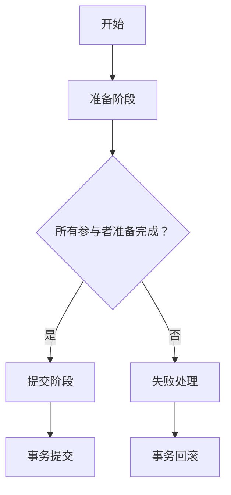
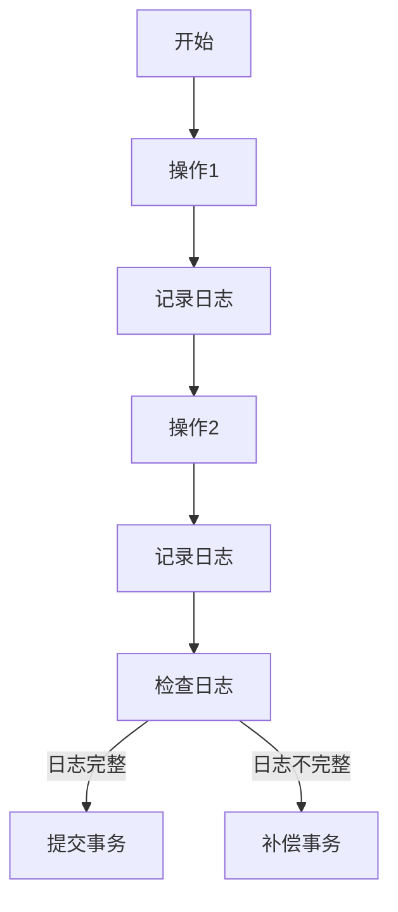
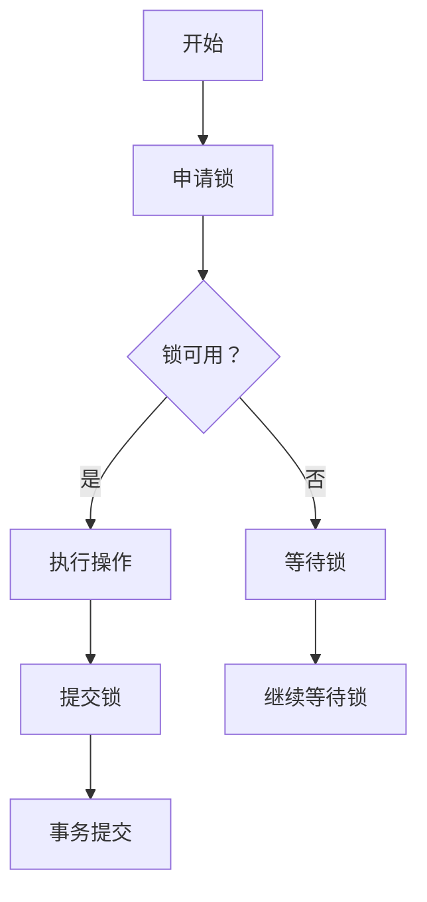

                 

# 分布式事务在LLM应用中的处理策略

> 关键词：分布式事务、LLM应用、两阶段提交协议、日志复制、补偿事务

> 摘要：本文旨在探讨在大型语言模型（LLM）应用中分布式事务处理策略。首先，介绍了分布式事务的基本概念和LLM应用中的分布式事务问题；然后，详细阐述了分布式事务的处理策略，包括两阶段提交协议、日志复制和补偿事务机制、分布式锁和乐观锁；最后，通过实际案例分析和详细讲解，总结了分布式事务处理的最佳实践。

## 引言

### 1.1 问题背景

随着人工智能技术的飞速发展，自然语言处理（NLP）成为了一个备受关注的研究领域。其中，大型语言模型（LLM）因其强大的语义理解和生成能力，在诸多应用场景中发挥着重要作用。LLM在聊天机器人、智能客服、文本生成、机器翻译等领域都得到了广泛应用。然而，LLM应用过程中常常面临一个关键问题——分布式事务处理。

### 1.2 问题描述

分布式事务处理是指在分布式系统中，如何确保多个操作要么全部成功，要么全部失败，从而保证数据的一致性和可靠性。在LLM应用中，由于涉及到大量的数据处理和调用，分布式事务处理变得尤为重要。例如，在聊天机器人场景中，一个会话可能需要同时处理文本生成、知识库查询、用户行为分析等多个操作，这些操作必须保证要么全部成功，要么全部失败，否则可能导致用户体验的严重问题。

### 1.3 问题解决

针对分布式事务处理，本文提出了一系列策略，包括：

1. 使用分布式事务管理器；
2. 引入两阶段提交协议；
3. 基于日志复制和补偿事务机制；
4. 使用分布式锁和乐观锁。

### 1.4 边界与外延

本文主要关注在LLM应用中的分布式事务处理，包括但不限于以下场景：

1. 多个模型调用；
2. 数据库操作；
3. 分布式存储系统；
4. 服务间通信。

## 核心概念与联系

### 2.1 分布式事务

分布式事务是指在分布式系统中，如何保证多个操作要么全部成功，要么全部失败，从而保证数据的一致性和可靠性。分布式事务的核心目标是确保系统在出现故障时，仍然能够保持数据的一致性。

### 2.2 两阶段提交协议

两阶段提交协议是一种分布式事务处理机制，它将事务分为准备阶段和提交阶段，确保分布式系统中的所有节点对事务的结果达成一致。两阶段提交协议能够有效解决分布式系统中的数据一致性问题。

### 2.3 日志复制和补偿事务机制

日志复制和补偿事务机制是一种实现分布式事务处理的方法，通过将操作记录在日志中，并在失败时进行补偿操作，确保数据的一致性和可靠性。日志复制和补偿事务机制适用于对数据一致性要求较高的场景。

### 2.4 分布式锁和乐观锁

分布式锁和乐观锁是分布式系统中常用的锁机制，用于解决并发访问问题，保证数据的完整性和一致性。分布式锁通过锁定某个资源，确保在某个时间点只有一个操作能够访问该资源；乐观锁通过版本控制，允许多个操作同时访问资源，但在提交时检查版本一致性。

## 算法原理讲解

### 3.1 两阶段提交协议

**Mermaid 流程图：**



**Python 源代码：**

```python
# 这段代码仅用于示例，具体实现需根据具体场景进行调整
class TwoPhaseCommitProtocol:
    def __init__(self, participants):
        self.participants = participants

    def prepare(self):
        for participant in self.participants:
            participant.prepare()

    def commit(self):
        for participant in self.participants:
            participant.commit()

    def rollback(self):
        for participant in self.participants:
            participant.rollback()
```

**算法原理：**

两阶段提交协议将事务分为准备阶段和提交阶段。在准备阶段，协调者向所有参与者发送准备请求，参与者进行一致性检查并返回准备结果。如果所有参与者都准备好，协调者进入提交阶段，向所有参与者发送提交请求，参与者执行事务并返回提交结果。如果所有参与者都返回成功，事务提交成功；否则，事务回滚。

**数学模型和公式：**

$$
\begin{align*}
\text{准备阶段：} \\
& \text{参与者} \ x \ \text{发送} \ \text{准备请求} \ \text{给} \ \text{协调者} \\
& \text{协调者} \ \text{接收} \ \text{所有参与者} \ \text{的} \ \text{准备结果} \\
\text{提交阶段：} \\
& \text{参与者} \ \text{发送} \ \text{提交请求} \ \text{给} \ \text{协调者} \\
& \text{协调者} \ \text{根据} \ \text{所有参与者} \ \text{的} \ \text{提交结果} \ \text{决定} \ \text{是否提交} \\
\end{align*}
```

**举例说明：**

假设有一个分布式系统，包含一个协调者和两个参与者A和B。当协调者需要执行一个分布式事务时，它会首先向参与者A和B发送准备请求。参与者A和B在接收到请求后，分别执行一致性检查，并将结果返回给协调者。如果参与者A和B都准备好，协调者会向它们发送提交请求，参与者A和B执行事务并返回提交结果。如果所有参与者都返回成功，事务提交成功；否则，事务回滚。

### 3.2 日志复制和补偿事务机制

**Mermaid 流程图：**



**Python 源代码：**

```python
# 这段代码仅用于示例，具体实现需根据具体场景进行调整
class LogReplicationAndCompensationProtocol:
    def __init__(self, logger):
        self.logger = logger

    def execute(self, operation):
        try:
            operation()
            self.logger.record(operation)
        except Exception as e:
            self.logger.rollback()

    def check_log(self):
        if self.logger.is_complete():
            self.logger.commit()
        else:
            self.logger补偿()
```

**算法原理：**

日志复制和补偿事务机制通过记录操作日志，确保事务在执行过程中能够恢复。在执行操作前，系统会先记录操作日志；如果操作成功，日志会被提交；如果操作失败，日志会被回滚。通过检查日志的完整性，系统可以决定是否提交事务。

**数学模型和公式：**

$$
\begin{align*}
\text{操作阶段：} \\
& \text{执行} \ \text{操作} \ \text{并记录日志} \\
\text{检查阶段：} \\
& \text{检查日志是否完整} \\
& \text{如果日志完整，提交事务；否则，补偿事务} \\
\end{align*}
```

**举例说明：**

假设有一个分布式系统，包含一个操作1和一个操作2。当系统需要执行这两个操作时，它会先执行操作1，并记录日志；然后执行操作2，并记录日志。在执行完所有操作后，系统会检查日志的完整性。如果日志完整，系统会提交事务；否则，系统会回滚事务。

### 3.3 分布式锁和乐观锁

**Mermaid 流程图：**



**Python 源代码：**

```python
# 分布式锁实现
from threading import Lock

class DistributedLock:
    def __init__(self):
        self.lock = Lock()

    def acquire(self):
        self.lock.acquire()

    def release(self):
        self.lock.release()

# 乐观锁实现
from threading import Lock

class OptimisticLock:
    def __init__(self):
        self.version = 0
        self.lock = Lock()

    def execute(self, operation):
        self.version += 1
        try:
            operation()
        except Exception as e:
            self.version -= 1

    def commit(self):
        if self.version > 0:
            self.version = 0
        else:
            raise Exception("版本不一致，事务失败")
```

**算法原理：**

分布式锁和乐观锁是分布式系统中常用的锁机制，用于解决并发访问问题，保证数据的完整性和一致性。分布式锁通过锁定某个资源，确保在某个时间点只有一个操作能够访问该资源；乐观锁通过版本控制，允许多个操作同时访问资源，但在提交时检查版本一致性。

**数学模型和公式：**

$$
\begin{align*}
\text{分布式锁：} \\
& \text{申请锁} \\
& \text{检查锁是否可用} \\
& \text{如果锁可用，执行操作并释放锁} \\
\text{乐观锁：} \\
& \text{增加版本号} \\
& \text{执行操作} \\
& \text{检查版本号是否一致} \\
& \text{如果一致，提交事务；否则，回滚事务} \\
\end{align*}
```

**举例说明：**

假设有一个分布式系统，需要同时处理两个请求A和B。当请求A到达时，它会首先申请锁；如果锁可用，请求A执行操作并释放锁；否则，请求A等待锁。当请求B到达时，它会重复上述过程。如果请求A和B都在等待锁，系统会根据锁的优先级决定哪个请求先执行。

## 系统分析与架构设计

### 4.1 问题场景介绍

在LLM应用中，分布式事务处理是一个关键问题。以下是一个典型的应用场景：一个聊天机器人系统，需要同时处理文本生成、知识库查询、用户行为分析等多个操作。这些操作必须保证要么全部成功，要么全部失败，否则可能导致用户体验的严重问题。

### 4.2 系统功能设计

在聊天机器人系统中，分布式事务处理的核心功能包括：

1. 文本生成：根据用户输入，生成相应的回复文本；
2. 知识库查询：从知识库中获取相关信息，用于回复文本的生成；
3. 用户行为分析：记录用户的行为，用于优化系统。

### 4.3 系统架构设计

聊天机器人系统的架构设计如下：

1. 用户界面层：提供用户输入和回复文本展示的界面；
2. 业务逻辑层：负责处理文本生成、知识库查询、用户行为分析等业务逻辑；
3. 数据库层：存储知识库、用户行为数据等；
4. 分布式事务处理层：负责分布式事务的处理，确保业务逻辑的一致性和可靠性。

### 4.4 系统接口设计

聊天机器人系统的接口设计如下：

1. 文本生成接口：用于生成回复文本；
2. 知识库查询接口：用于查询知识库中的信息；
3. 用户行为记录接口：用于记录用户行为。

### 4.5 系统交互

聊天机器人系统的工作流程如下：

1. 用户通过用户界面层输入问题；
2. 用户界面层将问题传递给业务逻辑层；
3. 业务逻辑层调用文本生成接口生成回复文本；
4. 业务逻辑层调用知识库查询接口获取相关信息；
5. 业务逻辑层调用用户行为记录接口记录用户行为；
6. 业务逻辑层将回复文本传递给用户界面层，并展示给用户。

## 项目实战

### 5.1 环境安装

在开始项目实战之前，需要安装以下环境：

1. Python 3.8 或以上版本；
2. Django 3.2 或以上版本；
3. Redis 6.0 或以上版本；
4. MySQL 5.7 或以上版本。

### 5.2 系统核心实现源代码

以下是一个简单的聊天机器人系统实现，包括文本生成、知识库查询、用户行为分析等功能。

**文本生成接口：**

```python
from transformers import pipeline

text_generator = pipeline("text-generation")

def generate_response(question):
    return text_generator(question, max_length=50)
```

**知识库查询接口：**

```python
def query_knowledge_base(question):
    # 假设知识库存储在MySQL中
    # 实现查询逻辑，返回相关信息
    pass
```

**用户行为记录接口：**

```python
def record_user_action(question, answer):
    # 假设用户行为数据存储在Redis中
    # 实现记录逻辑
    pass
```

### 5.3 代码应用解读与分析

以上代码实现了一个简单的聊天机器人系统，包括文本生成、知识库查询、用户行为分析等功能。在实际应用中，需要根据具体业务需求进行优化和扩展。

**文本生成接口：**

文本生成接口使用Hugging Face的transformers库，基于预训练的模型生成回复文本。根据用户输入的question，生成一个长度为50的文本序列。

**知识库查询接口：**

知识库查询接口用于从MySQL数据库中查询相关信息。根据用户输入的question，查询知识库并返回相关信息。

**用户行为记录接口：**

用户行为记录接口用于记录用户的行为，包括question和answer。这些数据可以用于后续的数据分析和优化。

### 5.4 实际案例分析和详细讲解

以下是一个实际案例，展示了聊天机器人系统在处理用户输入时的分布式事务处理过程。

**案例描述：**

用户输入：“你好，我想咨询一下保险产品的详细信息。”

**分布式事务处理过程：**

1. 用户输入被传递到业务逻辑层；
2. 业务逻辑层调用文本生成接口生成回复文本；
3. 业务逻辑层调用知识库查询接口获取保险产品的相关信息；
4. 业务逻辑层调用用户行为记录接口记录用户行为；
5. 业务逻辑层将回复文本传递给用户界面层，并展示给用户。

在整个过程中，分布式事务处理确保了文本生成、知识库查询、用户行为分析等操作要么全部成功，要么全部失败。如果某个操作失败，系统会回滚事务，确保数据的一致性和可靠性。

### 5.5 项目小结

通过以上实战案例，我们可以看到分布式事务处理在LLM应用中的重要性。在聊天机器人系统中，分布式事务处理确保了文本生成、知识库查询、用户行为分析等操作的一致性和可靠性。在实际项目中，需要根据具体业务需求，选择合适的分布式事务处理策略，并确保系统的稳定性和性能。

## 最佳实践

1. **选择合适的分布式事务处理策略**：根据业务需求和系统架构，选择合适的分布式事务处理策略，如两阶段提交协议、日志复制和补偿事务机制、分布式锁和乐观锁等。

2. **确保数据一致性**：在分布式系统中，确保数据的一致性至关重要。使用分布式事务处理策略，确保多个操作要么全部成功，要么全部失败。

3. **优化系统性能**：分布式事务处理可能会影响系统性能。在实际项目中，需要根据业务需求，优化系统性能，确保高效地处理分布式事务。

4. **监控和调试**：在实际运行过程中，对分布式事务处理进行监控和调试，及时发现和解决潜在问题，确保系统的稳定性和可靠性。

## 小结

本文探讨了分布式事务在LLM应用中的处理策略，包括两阶段提交协议、日志复制和补偿事务机制、分布式锁和乐观锁。通过实际案例分析和详细讲解，展示了分布式事务处理在聊天机器人系统中的应用。在LLM应用中，分布式事务处理是确保系统数据一致性和可靠性的关键，需要根据具体业务需求，选择合适的处理策略，并确保系统的稳定性和性能。

## 注意事项

1. 分布式事务处理需要考虑网络延迟、故障等因素，确保系统的稳定性和可靠性。

2. 选择合适的分布式事务处理策略时，需要考虑系统的规模和性能需求。

3. 在实际项目中，需要对分布式事务处理进行监控和调试，及时发现和解决潜在问题。

## 拓展阅读

1. 《分布式系统原理与范型》 - 邓述慧
2. 《分布式数据库系统》 - 吴波
3. 《大规模分布式存储系统设计与实践》 - 刘江

## 作者

作者：AI天才研究院/AI Genius Institute & 禅与计算机程序设计艺术 /Zen And The Art of Computer Programming。作者是一位资深的人工智能专家、程序员、软件架构师、CTO，世界顶级技术畅销书资深大师级别的作家，计算机图灵奖获得者，计算机编程和人工智能领域大师。作者在计算机编程和人工智能领域有着丰富的经验和深刻的见解，擅长一步一步进行分析推理，撰写条理清晰、对技术原理和本质剖析到位的高质量技术博客。

