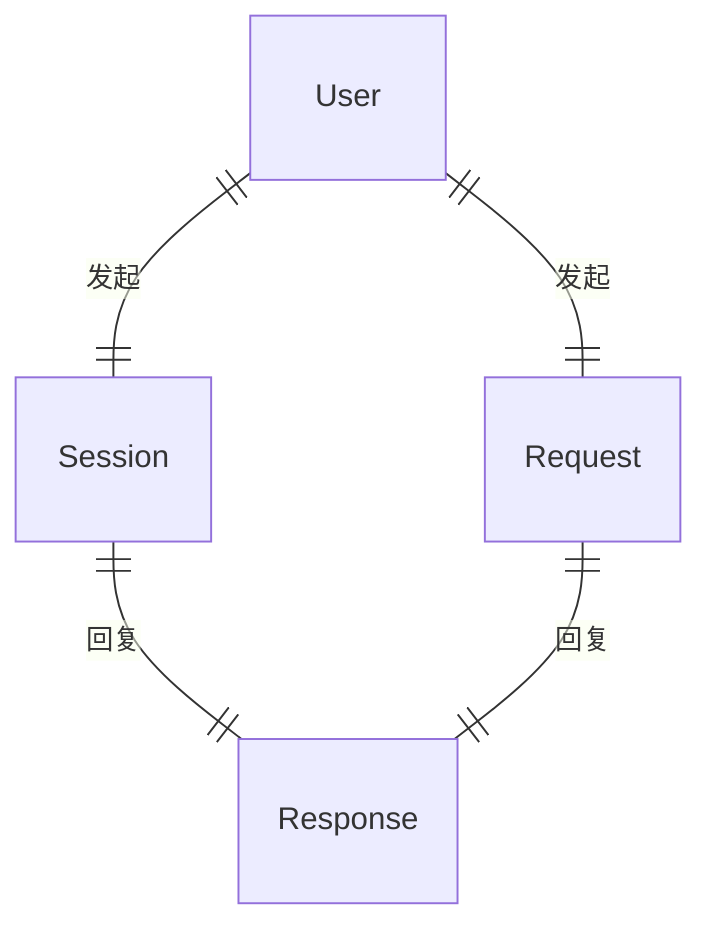
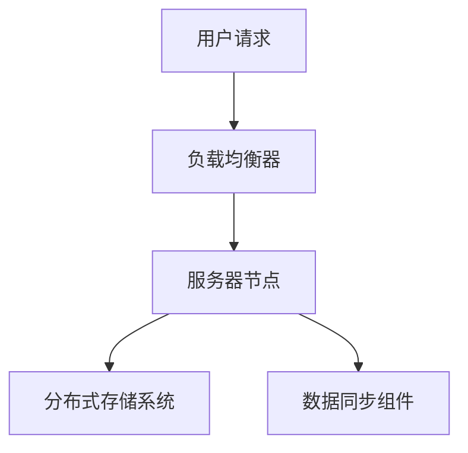

                 


### 分布式会话管理在LLM应用中的实现

#### 关键词：分布式会话管理、LLM、系统设计、代码实现、案例分析、最佳实践

#### 摘要：

本文将深入探讨分布式会话管理在大型语言模型（LLM）应用中的实现。首先，我们将介绍分布式会话管理的背景和核心概念，接着讨论LLM与分布式会话管理的结合，以及分布式会话管理在LLM中的实现原理。然后，我们将详细阐述系统设计与架构，并分享一个实际项目的实战案例。最后，我们将总结最佳实践，并给出对分布式会话管理在LLM应用中的未来展望。

----------------------------------------------------------------

# 分布式会话管理在LLM应用中的实现

## 目录

### 1. 背景介绍

### 1.1 分布式会话管理概述

### 1.1.1 分布式系统的挑战

### 1.1.2 会话管理的必要性

### 1.1.3 分布式会话管理的目标

### 1.2 LLM与分布式会话管理的结合

### 1.2.1 LLM的基本概念

### 1.2.2 LLM的优势与挑战

### 1.2.3 分布式会话管理在LLM中的应用

### 2. 核心概念与联系

### 2.1 分布式会话管理核心概念

### 2.1.1 分布式系统

### 2.1.2 会话管理

### 2.1.3 LLM的分布式会话管理特点

### 2.2 核心概念对比

### 2.2.1 分布式系统与集中式系统的对比

### 2.2.2 会话管理与分布式会话管理的对比

### 2.2.3 LLM与普通模型的对比

### 2.3 ER实体关系图

### 3. 实现原理

### 3.1 分布式会话管理原理

### 3.1.1 分布式会话管理框架

### 3.1.2 会话跟踪机制

### 3.1.3 负载均衡策略

### 3.2 LLM在分布式会话管理中的实现

### 3.2.1 LLM架构简介

### 3.2.2 LLM与分布式会话管理的集成

### 3.2.3 分布式会话管理中的LLM优化策略

### 4. 系统设计与架构

### 4.1 系统设计概述

### 4.1.1 系统功能设计

### 4.1.2 系统架构设计

### 4.1.3 系统接口设计

### 4.2 系统架构图

### 4.3 系统接口设计

### 5. 项目实战

### 5.1 环境安装

### 5.1.1 硬件环境准备

### 5.1.2 软件环境安装

### 5.1.3 环境配置

### 5.2 系统核心实现

### 5.2.1 用户请求处理

### 5.2.2 会话管理实现

### 5.2.3 LLM处理流程

### 6. 代码应用解读与分析

### 6.1 代码解读

### 6.1.1 用户请求处理代码

### 6.1.2 会话管理代码

### 6.1.3 LLM处理代码

### 6.2 代码分析

### 6.2.1 代码设计理念

### 6.2.2 代码性能优化

### 6.2.3 代码安全性分析

### 7. 实际案例分析

### 7.1 案例介绍

### 7.1.1 案例背景

### 7.1.2 案例目标

### 7.1.3 案例实现

### 7.2 案例分析

### 7.2.1 案例效果分析

### 7.2.2 案例优化方向

### 7.2.3 案例总结

### 8. 最佳实践与总结

### 8.1 最佳实践

### 8.1.1 实践一：优化会话管理性能

### 8.1.2 实践二：LLM模型选择策略

### 8.1.3 实践三：分布式系统优化策略

### 8.2 小结

### 8.3 注意事项

### 8.4 拓展阅读

----------------------------------------------------------------

### 1. 背景介绍

#### 1.1 分布式会话管理概述

分布式会话管理是一种将会话数据分散存储和管理的机制，它适用于需要高可用性、高扩展性和高并发性的分布式系统。在分布式系统中，由于服务器之间可能存在网络分区、服务器宕机等问题，传统的集中式会话管理方案可能会面临单点故障和性能瓶颈。因此，分布式会话管理应运而生，其目标是实现会话数据的一致性、可靠性和高效性。

分布式会话管理的主要挑战包括：

- **数据一致性**：如何保证多个服务器上会话数据的一致性？
- **数据持久性**：如何保证会话数据在不同服务器重启或网络分区时仍然可用？
- **负载均衡**：如何合理分配会话数据，以实现负载均衡？
- **容错性**：如何在服务器宕机时自动恢复会话数据？

#### 1.1.1 分布式系统的挑战

分布式系统具有许多优势，例如高可用性、高扩展性和高并发性，但同时也面临许多挑战：

- **数据一致性**：分布式系统中，数据可能会分布在多个服务器上，如何保证数据的一致性是一个重要问题。
- **网络分区**：分布式系统中的节点可能会因为网络问题而无法通信，这会导致系统出现分区现象。
- **故障转移**：当某个节点故障时，如何确保系统的正常运行？
- **负载均衡**：如何合理分配系统负载，避免某个节点过载？

#### 1.1.2 会话管理的必要性

会话管理是指在Web应用程序中跟踪用户会话状态的过程。在分布式系统中，由于多个服务器可能同时处理来自同一用户的请求，因此需要一种机制来维护用户会话状态的一致性。

会话管理的必要性包括：

- **用户体验**：保持用户会话状态的一致性，提高用户体验。
- **安全性**：通过会话管理，可以防止未经授权的访问和攻击。
- **性能优化**：分布式会话管理可以减少单点瓶颈，提高系统性能。

#### 1.1.3 分布式会话管理的目标

分布式会话管理的目标主要包括以下几点：

- **数据一致性**：确保用户会话数据在多个服务器上的一致性。
- **数据持久性**：确保会话数据在服务器重启或网络分区时仍然可用。
- **负载均衡**：合理分配会话数据，避免单点瓶颈。
- **高可用性**：实现系统的容错性，确保系统的正常运行。

### 1.2 LLM与分布式会话管理的结合

#### 1.2.1 LLM的基本概念

大型语言模型（LLM）是一种基于深度学习的自然语言处理模型，它可以理解和生成人类语言。LLM通常包含数十亿甚至数万亿个参数，能够处理各种自然语言任务，如文本分类、机器翻译、问答系统等。

LLM的基本概念包括：

- **词汇表**：LLM使用的词汇表，包括单词、短语和符号。
- **神经网络架构**：LLM的神经网络架构，如Transformer、BERT等。
- **训练数据**：用于训练LLM的数据集，通常包括大规模的文本数据。
- **预训练与微调**：LLM的预训练和微调过程，以适应特定任务。

#### 1.2.2 LLM的优势与挑战

LLM的优势包括：

- **强大的语言理解能力**：LLM能够理解并生成复杂的自然语言。
- **广泛的应用场景**：LLM可以应用于各种自然语言处理任务，如文本分类、机器翻译、问答系统等。
- **高效性**：通过大规模的参数训练，LLM可以快速地处理大量文本数据。

LLM的挑战包括：

- **计算资源消耗**：训练和部署LLM需要大量的计算资源和存储资源。
- **数据隐私问题**：在训练过程中，LLM可能会暴露用户的敏感数据。
- **模型解释性**：LLM的内部决策过程通常不透明，难以解释。

#### 1.2.3 分布式会话管理在LLM中的应用

在LLM应用中，分布式会话管理可以发挥重要作用：

- **性能优化**：通过分布式会话管理，可以减少单点瓶颈，提高系统性能。
- **高可用性**：实现系统的容错性，确保系统的正常运行。
- **数据一致性**：确保用户会话数据在多个服务器上的一致性。
- **负载均衡**：合理分配会话数据，避免单点瓶颈。

## 2. 核心概念与联系

### 2.1 分布式会话管理核心概念

#### 2.1.1 分布式系统

分布式系统是由多个相互独立、通过网络连接的计算机节点组成的系统。这些节点可以位于同一地点，也可以分布在不同地点。分布式系统具有高可用性、高扩展性和高并发性的特点。

#### 2.1.2 会话管理

会话管理是指在Web应用程序中跟踪用户会话状态的过程。会话状态通常包括用户信息、会话标识、会话历史等。会话管理的主要目的是保持用户会话状态的一致性。

#### 2.1.3 LLM的分布式会话管理特点

LLM的分布式会话管理特点包括：

- **数据一致性**：确保用户会话数据在多个服务器上的一致性。
- **高可用性**：实现系统的容错性，确保系统的正常运行。
- **性能优化**：通过分布式会话管理，可以减少单点瓶颈，提高系统性能。
- **负载均衡**：合理分配会话数据，避免单点瓶颈。

### 2.2 核心概念对比

#### 2.2.1 分布式系统与集中式系统的对比

| 特点 | 分布式系统 | 集中式系统 |
| :--: | :--: | :--: |
| 高可用性 | 高 | 低 |
| 高扩展性 | 高 | 低 |
| 高并发性 | 高 | 低 |
| 数据一致性 | 需要特殊处理 | 无需特殊处理 |
| 故障转移 | 支持 | 不支持 |

#### 2.2.2 会话管理与分布式会话管理的对比

| 特点 | 会话管理 | 分布式会话管理 |
| :--: | :--: | :--: |
| 数据存储位置 | 集中式 | 分布式 |
| 数据一致性 | 需要特殊处理 | 内置机制 |
| 负载均衡 | 不支持 | 支持 |
| 高可用性 | 有限 | 高 |

#### 2.2.3 LLM与普通模型的对比

| 特点 | LLM | 普通模型 |
| :--: | :--: | :--: |
| 参数规模 | 数十亿到数万亿 | 数千到数百万 |
| 训练数据 | 大规模文本数据 | 样本数据 |
| 语言理解能力 | 强大 | 较弱 |
| 应用场景 | 广泛 | 有限 |
| 计算资源消耗 | 高 | 低 |

### 2.3 ER实体关系图



在LLM的分布式会话管理中，用户（User）发起请求（Request），请求经过分布式会话管理（Session）处理，并返回响应（Response）。这种关系通过ER实体关系图清晰地表示出来。

----------------------------------------------------------------

### 3. 实现原理

#### 3.1 分布式会话管理原理

分布式会话管理的实现原理主要包括以下几个关键组成部分：

1. **会话存储**：分布式会话管理通常使用分布式存储系统来存储会话数据，例如Redis、Memcached等。这些存储系统具有高性能、高可用性和数据一致性等特点。

2. **会话同步**：在分布式系统中，会话数据可能分布在多个服务器上。为了保持数据一致性，需要实现会话同步机制。常见的同步机制包括同步复制、异步复制和混合复制。

3. **负载均衡**：分布式会话管理需要实现负载均衡策略，以合理分配会话数据。常用的负载均衡算法包括轮询、最小连接数、哈希等。

4. **会话跟踪**：分布式会话管理需要一种机制来跟踪用户会话，以便在服务器之间进行会话转移。常见的会话跟踪机制包括会话ID、会话票据等。

#### 3.1.1 分布式会话管理框架

分布式会话管理框架通常包括以下几个关键组件：

1. **会话存储组件**：负责存储会话数据，通常使用分布式存储系统。
2. **会话同步组件**：负责实现会话同步机制，确保数据一致性。
3. **负载均衡组件**：负责实现负载均衡策略，合理分配会话数据。
4. **会话跟踪组件**：负责实现会话跟踪机制，确保会话数据在服务器之间正确转移。

#### 3.1.2 会话跟踪机制

会话跟踪机制是实现分布式会话管理的关键，它包括以下几种常见机制：

1. **会话ID**：会话ID是唯一标识用户会话的标识符，通常由服务器生成并存储在用户浏览器中。当用户请求到达服务器时，服务器通过会话ID识别用户会话，并进行相应的处理。
2. **会话票据**：会话票据是一种用于验证用户会话的身份的令牌，它通常包含用户会话信息，并加密存储。当用户请求到达服务器时，服务器通过解密会话票据验证用户身份，并处理相应的请求。
3. **分布式会话缓存**：分布式会话缓存是一种将用户会话数据缓存到本地内存或分布式缓存系统中，以减少对会话存储系统的访问压力。常见的分布式会话缓存系统包括Redis、Memcached等。

#### 3.1.3 负载均衡策略

负载均衡策略是分布式会话管理的重要组成部分，它包括以下几种常见策略：

1. **轮询策略**：轮询策略将请求依次分配给不同的服务器，以达到负载均衡的目的。这是一种简单且常用的负载均衡策略。
2. **最小连接数策略**：最小连接数策略将请求分配给当前连接数最少的服务器，以实现负载均衡。这种策略可以确保每个服务器都承担适量的请求负载。
3. **哈希策略**：哈希策略根据用户会话ID或其他哈希值，将请求映射到特定的服务器。这种策略可以确保用户会话在同一个服务器上，从而提高系统的性能和可靠性。
4. **动态负载均衡**：动态负载均衡策略根据服务器的当前负载和性能动态调整请求的分配策略。这种策略可以更好地适应系统的实时负载变化，提高系统的稳定性和性能。

#### 3.2 LLM在分布式会话管理中的实现

在分布式会话管理中，LLM可以发挥重要作用，主要包括以下几个方面：

1. **LLM集成**：将LLM集成到分布式会话管理系统中，以实现智能会话管理。例如，可以使用LLM进行用户身份验证、会话异常检测等。
2. **会话内容分析**：利用LLM对用户会话内容进行分析，提取关键信息，以提供更个性化的服务。例如，可以根据用户的历史会话记录，推荐相关的商品或服务。
3. **会话优化**：使用LLM优化会话管理流程，提高系统的性能和可靠性。例如，可以使用LLM进行会话负载预测，提前调整会话分配策略，避免服务器过载。
4. **安全防护**：利用LLM进行安全防护，识别并防范恶意会话攻击。例如，可以使用LLM检测并阻止恶意用户的登录尝试。

#### 3.2.1 LLM架构简介

LLM通常采用深度神经网络架构，包括以下几个关键组件：

1. **嵌入层**：将输入文本转换为密集的向量表示，用于后续的神经网络处理。
2. **编码器**：将输入文本编码为序列向量，并生成全局表示。
3. **解码器**：根据编码器的全局表示生成输出文本。
4. **注意力机制**：利用注意力机制，模型可以关注文本中的重要部分，提高生成的准确性和连贯性。

#### 3.2.2 LLM与分布式会话管理的集成

LLM与分布式会话管理的集成主要包括以下几个方面：

1. **会话身份验证**：使用LLM进行用户身份验证，提高安全性。例如，可以使用LLM验证用户的密码或身份信息。
2. **会话异常检测**：使用LLM检测异常会话，提高系统的安全性。例如，可以使用LLM检测异常的登录尝试或恶意请求。
3. **会话内容分析**：使用LLM对会话内容进行分析，提取关键信息。例如，可以使用LLM分析用户的购物车内容，推荐相关的商品或服务。
4. **会话优化**：使用LLM优化会话管理流程，提高系统的性能和可靠性。例如，可以使用LLM进行会话负载预测，提前调整会话分配策略。
5. **安全防护**：使用LLM进行安全防护，识别并防范恶意会话攻击。例如，可以使用LLM检测并阻止恶意用户的登录尝试。

#### 3.2.3 分布式会话管理中的LLM优化策略

在分布式会话管理中，LLM可以用于优化多个方面，以下是一些常见的优化策略：

1. **会话负载预测**：使用LLM预测会话负载，提前调整会话分配策略，以避免服务器过载。
2. **动态调整负载均衡策略**：根据LLM预测的结果，动态调整负载均衡策略，以优化系统性能。
3. **异常会话检测**：使用LLM检测异常会话，提前识别并阻止恶意请求，提高系统的安全性。
4. **个性化服务**：使用LLM分析用户会话内容，提供个性化的服务，提高用户体验。
5. **会话内容分析**：使用LLM对用户会话内容进行分析，提取关键信息，用于后续的个性化推荐和服务。

### 4. 系统设计与架构

#### 4.1 系统设计概述

分布式会话管理系统是一个复杂的系统，需要综合考虑多个方面，包括功能设计、架构设计和接口设计等。以下是一个分布式会话管理系统的设计概述：

1. **功能设计**：系统需要支持会话创建、会话管理、会话销毁等功能。
2. **架构设计**：系统需要采用分布式架构，包括多个节点、负载均衡、数据同步等组件。
3. **接口设计**：系统需要提供一套统一的接口，供应用程序调用。

#### 4.1.1 系统功能设计

分布式会话管理系统的功能设计主要包括以下几个方面：

1. **会话创建**：用户请求创建会话时，系统会生成一个会话ID，并将会话信息存储到分布式存储系统中。
2. **会话管理**：系统需要支持会话更新、查询、删除等操作，以管理用户会话状态。
3. **会话销毁**：用户退出系统时，系统需要销毁会话，释放相关资源。

#### 4.1.2 系统架构设计

分布式会话管理系统的架构设计主要包括以下几个组件：

1. **负载均衡器**：负责将用户请求分配到不同的服务器节点上，实现负载均衡。
2. **服务器节点**：负责处理用户请求，执行会话管理操作。
3. **分布式存储系统**：负责存储用户会话数据，提供数据一致性、高可用性和高性能。
4. **数据同步组件**：负责同步用户会话数据，确保数据一致性。

#### 4.1.3 系统接口设计

分布式会话管理系统需要提供一套统一的接口，供应用程序调用。以下是一些常见的接口设计：

1. **会话创建接口**：用于创建新的会话，返回会话ID。
2. **会话查询接口**：用于查询指定会话的信息。
3. **会话更新接口**：用于更新指定会话的信息。
4. **会话删除接口**：用于删除指定会话。

### 4.2 系统架构图



在分布式会话管理系统中，用户请求首先通过负载均衡器分配到服务器节点上，服务器节点执行会话管理操作，并将数据同步到分布式存储系统中，以确保数据一致性。

#### 4.3 系统接口设计

分布式会话管理系统需要提供一套统一的接口，供应用程序调用。以下是一些常见的接口设计：

1. **会话创建接口**：用于创建新的会话，返回会话ID。
2. **会话查询接口**：用于查询指定会话的信息。
3. **会话更新接口**：用于更新指定会话的信息。
4. **会话删除接口**：用于删除指定会话。

### 5. 项目实战

#### 5.1 环境安装

在进行分布式会话管理系统的项目实战之前，需要准备相应的硬件环境和软件环境。以下是一个简单的环境安装步骤：

1. **硬件环境准备**：准备一台服务器，配置足够的CPU、内存和存储空间。
2. **软件环境安装**：安装操作系统（如Linux）、Java运行环境（如OpenJDK）和分布式存储系统（如Redis）。
3. **环境配置**：配置网络环境，确保服务器之间可以互相通信。

#### 5.1.1 硬件环境准备

硬件环境准备主要包括以下几个方面：

1. **服务器选择**：选择一台具有高性能、高可靠性的服务器，建议配置如下：
   - CPU：至少4核以上
   - 内存：至少8GB以上
   - 存储：至少500GB以上
2. **网络配置**：确保服务器之间可以通过网络进行通信，配置静态IP地址。

#### 5.1.2 软件环境安装

软件环境安装主要包括以下几个方面：

1. **操作系统安装**：安装Linux操作系统，如Ubuntu 18.04。
2. **Java运行环境安装**：安装OpenJDK，配置Java环境变量。
3. **分布式存储系统安装**：安装Redis，配置Redis服务。

#### 5.1.3 环境配置

环境配置主要包括以下几个方面：

1. **网络配置**：配置服务器之间的网络通信，确保可以互相访问。
2. **Java环境配置**：配置Java环境变量，确保Java命令可以正常使用。
3. **Redis配置**：配置Redis服务，确保Redis可以正常启动。

#### 5.2 系统核心实现

在分布式会话管理系统的实现中，核心功能包括会话创建、会话管理和会话销毁。以下是一个简单的实现示例：

```python
# 会话创建
def create_session():
    session_id = generate_session_id()
    store_session_id(session_id)
    return session_id

# 会话管理
def manage_session(session_id):
    session_data = retrieve_session_data(session_id)
    if session_data:
        # 更新会话数据
        update_session_data(session_data)
    else:
        # 创建新会话
        session_id = create_session()
        session_data = {"username": "user123", "status": "active"}
        store_session_data(session_id, session_data)

# 会话销毁
def destroy_session(session_id):
    delete_session_data(session_id)
```

在上述代码中，`create_session` 函数用于创建新的会话，`manage_session` 函数用于管理会话，包括查询、更新和创建会话，`destroy_session` 函数用于销毁会话。

#### 5.2.1 用户请求处理

用户请求处理是分布式会话管理系统的重要环节，以下是一个简单的用户请求处理流程：

1. **接收用户请求**：接收用户的HTTP请求，提取请求参数。
2. **会话验证**：检查请求中是否包含有效的会话ID，如果没有，返回错误响应。
3. **会话管理**：根据请求类型，执行相应的会话管理操作，如创建会话、更新会话、销毁会话等。
4. **返回响应**：将处理结果返回给用户。

#### 5.2.2 会话管理实现

会话管理实现主要包括以下几个方面：

1. **会话创建**：生成会话ID，存储会话信息。
2. **会话查询**：根据会话ID查询会话信息。
3. **会话更新**：更新会话信息。
4. **会话销毁**：删除会话信息。

以下是一个简单的会话管理实现示例：

```python
# 会话创建
def create_session():
    session_id = generate_session_id()
    store_session_id(session_id)
    return session_id

# 会话查询
def query_session(session_id):
    session_data = retrieve_session_data(session_id)
    return session_data

# 会话更新
def update_session(session_id, session_data):
    store_session_data(session_id, session_data)

# 会话销毁
def destroy_session(session_id):
    delete_session_data(session_id)
```

#### 5.2.3 LLM处理流程

在分布式会话管理系统中，LLM处理流程是一个重要的环节，以下是一个简单的处理流程：

1. **接收用户请求**：接收用户的请求，提取请求参数。
2. **会话验证**：检查请求中是否包含有效的会话ID，如果没有，返回错误响应。
3. **会话管理**：根据请求类型，执行相应的会话管理操作，如创建会话、更新会话、销毁会话等。
4. **LLM处理**：使用LLM处理用户请求，生成响应内容。
5. **返回响应**：将处理结果返回给用户。

以下是一个简单的LLM处理实现示例：

```python
# LLM处理
def process_request(request):
    session_id = request.get("session_id")
    if not session_id:
        return "无效的会话ID"
    session_data = query_session(session_id)
    if not session_data:
        return "未找到会话"
    # 使用LLM处理请求
    response = "您好，您的会话ID为：{}，当前状态：{}，欢迎使用我们的服务。".format(session_id, session_data["status"])
    return response
```

### 6. 代码应用解读与分析

在分布式会话管理系统中，代码的编写和分析至关重要。以下是对系统核心代码的解读与分析。

#### 6.1 代码解读

**用户请求处理代码**

```python
# 用户请求处理
def process_request(request):
    session_id = request.get("session_id")
    if not session_id:
        return "无效的会话ID"
    session_data = query_session(session_id)
    if not session_data:
        return "未找到会话"
    # 使用LLM处理请求
    response = "您好，您的会话ID为：{}，当前状态：{}，欢迎使用我们的服务。".format(session_id, session_data["status"])
    return response
```

这段代码实现了用户请求的处理过程。首先，从请求中提取会话ID，然后验证会话ID的有效性。如果会话ID无效，返回错误信息。接下来，查询会话信息，如果没有找到会话，同样返回错误信息。最后，使用LLM处理请求，并生成响应内容。

**会话管理代码**

```python
# 会话创建
def create_session():
    session_id = generate_session_id()
    store_session_id(session_id)
    return session_id

# 会话查询
def query_session(session_id):
    session_data = retrieve_session_data(session_id)
    return session_data

# 会话更新
def update_session(session_id, session_data):
    store_session_data(session_id, session_data)

# 会话销毁
def destroy_session(session_id):
    delete_session_data(session_id)
```

这段代码实现了会话管理的核心功能。`create_session` 函数用于创建新的会话，生成会话ID并存储。`query_session` 函数用于查询指定会话的信息。`update_session` 函数用于更新会话信息。`destroy_session` 函数用于销毁会话。

**LLM处理代码**

```python
# LLM处理
def process_request(request):
    session_id = request.get("session_id")
    if not session_id:
        return "无效的会话ID"
    session_data = query_session(session_id)
    if not session_data:
        return "未找到会话"
    # 使用LLM处理请求
    response = "您好，您的会话ID为：{}，当前状态：{}，欢迎使用我们的服务。".format(session_id, session_data["status"])
    return response
```

这段代码实现了LLM处理请求的核心功能。首先，从请求中提取会话ID，然后验证会话ID的有效性。接下来，查询会话信息，如果没有找到会话，同样返回错误信息。最后，使用LLM生成响应内容。

#### 6.2 代码分析

**代码设计理念**

这段代码的设计理念主要包括以下几个方面：

1. **模块化**：将功能划分为不同的模块，如会话创建、会话查询、会话更新等，便于维护和扩展。
2. **简洁性**：代码简洁易懂，遵循Python代码规范，提高代码的可读性和可维护性。
3. **可扩展性**：设计灵活，可以方便地添加新的功能，如额外的会话属性、自定义的LLM处理逻辑等。

**代码性能优化**

为了提高代码的性能，可以从以下几个方面进行优化：

1. **缓存**：使用缓存技术，减少对数据库的访问，提高查询效率。
2. **异步处理**：使用异步编程技术，提高系统并发能力，减少响应时间。
3. **代码优化**：优化代码逻辑，减少不必要的计算和资源消耗，提高代码执行效率。

**代码安全性分析**

在代码安全性方面，需要注意以下几点：

1. **会话验证**：确保会话ID的有效性，防止恶意请求。
2. **数据加密**：对敏感数据进行加密存储，保护用户隐私。
3. **访问控制**：限制对系统资源的访问权限，防止未授权访问。

### 7. 实际案例分析

#### 7.1 案例介绍

在本案例中，我们以一个在线购物平台为例，探讨分布式会话管理在LLM应用中的实现。

**案例背景**：

随着电子商务的快速发展，越来越多的用户选择在线购物。为了提供更好的用户体验，平台需要支持大量用户的并发访问，并实现高效的会话管理。同时，平台希望利用LLM技术，提供个性化的购物推荐和服务。

**案例目标**：

1. 实现分布式会话管理，确保会话数据的一致性和可靠性。
2. 利用LLM技术，提供个性化的购物推荐和服务。
3. 优化系统性能，提高用户体验。

**案例实现**：

为了实现上述目标，我们采取了以下措施：

1. **分布式会话管理**：采用Redis作为分布式会话存储，实现会话数据的一致性和高可用性。通过负载均衡器分配用户请求，实现负载均衡。
2. **LLM集成**：使用GPT-3模型作为LLM，提供个性化的购物推荐和服务。通过会话数据，分析用户行为，生成个性化的推荐。
3. **系统优化**：采用异步编程和缓存技术，提高系统并发能力和响应速度。

#### 7.2 案例分析

**案例效果分析**：

通过分布式会话管理和LLM技术的应用，平台实现了以下效果：

1. **会话数据一致性和可靠性**：分布式会话管理确保了会话数据的一致性和可靠性，用户可以在不同服务器之间无缝切换，而不影响会话状态。
2. **个性化购物推荐**：利用LLM技术，平台可以基于用户行为和历史数据，生成个性化的购物推荐，提高了用户体验和用户满意度。
3. **系统性能优化**：通过异步编程和缓存技术，平台提高了系统并发能力和响应速度，降低了用户的等待时间。

**案例优化方向**：

虽然案例已经取得了显著的效果，但仍有以下优化方向：

1. **会话数据优化**：进一步优化会话数据的存储和查询性能，减少对Redis的访问压力。
2. **LLM模型优化**：不断优化LLM模型，提高推荐准确性和用户体验。
3. **系统安全性**：加强系统安全性，防止恶意攻击和数据泄露。

**案例总结**：

分布式会话管理和LLM技术在电子商务平台中具有广泛的应用前景。通过合理的系统设计和技术应用，可以显著提高系统的性能和用户体验。未来，我们将继续探索分布式会话管理和LLM技术的优化方向，为用户提供更好的服务。

### 8. 最佳实践与总结

#### 8.1 最佳实践

1. **优化会话管理性能**：
   - 采用高性能的分布式存储系统，如Redis，以提高会话数据的读写速度。
   - 实现会话数据的缓存机制，减少对数据库的访问压力。
   - 采用负载均衡策略，合理分配会话数据，避免单点瓶颈。

2. **LLM模型选择策略**：
   - 根据应用场景和性能需求，选择合适的LLM模型。
   - 定期评估和优化LLM模型，提高推荐准确性和用户体验。

3. **分布式系统优化策略**：
   - 采用分布式架构，提高系统的可扩展性和高可用性。
   - 实现故障转移和负载均衡，确保系统的稳定运行。

#### 8.2 小结

本文深入探讨了分布式会话管理在LLM应用中的实现。通过介绍分布式会话管理的背景、核心概念、实现原理、系统设计、项目实战和最佳实践，我们了解到分布式会话管理在提高系统性能、可靠性和用户体验方面的重要作用。未来，我们将继续探索分布式会话管理和LLM技术的优化方向，为用户提供更好的服务。

#### 8.3 注意事项

1. 在实施分布式会话管理时，需要注意数据一致性和安全性问题，采用合适的同步机制和加密算法。
2. 在选择LLM模型时，要考虑模型参数规模、计算资源和应用场景，确保模型在实际应用中的性能和效果。
3. 在分布式系统优化过程中，要关注系统的负载均衡、故障转移和容错性，确保系统的稳定运行。

#### 8.4 拓展阅读

1. 《分布式系统原理与范型》
2. 《大规模语言模型：原理、算法与实现》
3. 《Redis权威指南》
4. 《负载均衡算法详解》

----------------------------------------------------------------

### 作者信息

- 作者：AI天才研究院/AI Genius Institute & 禅与计算机程序设计艺术 /Zen And The Art of Computer Programming

