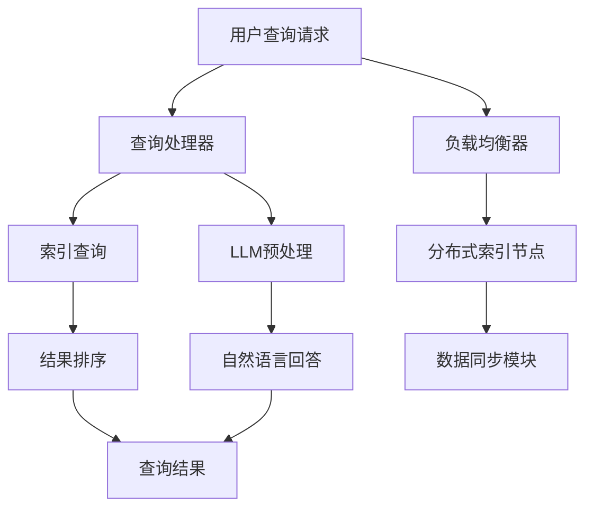
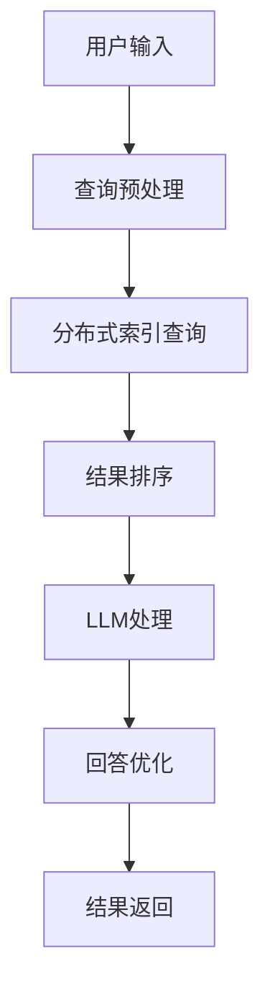

                 

# 分布式搜索引擎在LLM应用中的集成

## 关键词

- 分布式搜索引擎
- 大型语言模型（LLM）
- 集成架构
- 索引机制
- 数据同步
- 性能优化

## 摘要

本文将探讨分布式搜索引擎在大型语言模型（LLM）应用中的集成。通过分析分布式搜索引擎和LLM的核心概念、原理以及它们之间的关系，我们详细介绍了集成架构的设计和实现细节。同时，通过案例研究和最佳实践分享，我们展示了如何有效地将分布式搜索引擎与LLM集成，以提升搜索效率和用户体验。

## 第1章: 背景介绍与核心概念

### 1.1 问题背景

随着互联网的快速发展，用户对信息检索的需求日益增长。传统的集中式搜索引擎已无法满足海量数据和高并发请求的挑战。分布式搜索引擎作为一种解决之道，以其高效、可扩展性和容错能力在各个领域得到广泛应用。另一方面，大型语言模型（LLM）在自然语言处理领域取得了显著的突破，为智能搜索提供了新的可能性。将分布式搜索引擎与LLM集成，有望进一步提升搜索系统的性能和智能化水平。

### 1.2 分布式搜索引擎

分布式搜索引擎是将搜索功能分散到多个节点上，通过分布式计算和存储技术实现海量数据的快速检索。其主要特点包括：

- **可扩展性**：支持水平扩展，能够处理大量并发请求。
- **高可用性**：通过冗余节点和故障转移机制，确保系统的稳定性。
- **高性能**：利用并行计算和索引技术，实现快速搜索。

### 1.3 大型语言模型（LLM）

大型语言模型是一种基于深度学习的自然语言处理技术，通过训练大量文本数据，LLM能够理解和生成自然语言。其主要特点包括：

- **语言理解**：能够理解复杂的语言结构，包括语法、语义和上下文。
- **文本生成**：能够生成连贯、自然的文本，应用于自动摘要、问答系统和对话机器人。
- **智能化**：通过不断学习和优化，LLM的智能水平不断提升。

### 1.4 分布式搜索引擎与LLM的关系

分布式搜索引擎与LLM的结合，可以实现以下几个方面的优势：

- **高效搜索**：分布式搜索引擎的快速检索能力与LLM的自然语言理解能力相结合，能够提供更快速、更精准的搜索结果。
- **智能化推荐**：LLM可以分析用户查询，生成相关推荐，提升用户体验。
- **自然语言交互**：通过LLM，搜索系统可以支持自然语言查询和回答，实现更加智能的交互。

## 第2章: 核心概念与原理

### 2.1 分布式搜索引擎原理

分布式搜索引擎的基本架构包括以下几个核心组件：

- **分布式索引**：将索引数据分散存储在多个节点上，提高检索效率。
- **负载均衡**：通过路由算法，将查询请求均匀分配到各个节点，避免单点瓶颈。
- **数据同步**：确保各个节点的索引数据保持一致，保证查询结果准确。

分布式搜索引擎的主要原理包括：

- **倒排索引**：通过建立倒排索引，将文档内容与文档ID建立映射关系，实现快速搜索。
- **并行处理**：利用多线程或分布式计算框架，并行处理查询请求，提高搜索速度。

### 2.2 大型语言模型原理

大型语言模型通常基于Transformer架构，其核心原理包括：

- **编码器-解码器**：通过编码器将输入文本转换为固定长度的向量表示，解码器生成目标文本。
- **注意力机制**：通过计算输入文本中各个词与目标词的相关性，实现上下文的动态建模。
- **预训练与微调**：先在大量无标注数据上预训练，再在特定任务上微调，提高模型性能。

### 2.3 分布式搜索引擎与LLM的集成

分布式搜索引擎与LLM的集成，通常采用以下方式：

- **查询预处理**：使用LLM对用户查询进行预处理，提取关键词和语义信息。
- **索引优化**：将LLM生成的关键词和语义信息融入索引数据，提高检索效率。
- **查询响应**：使用LLM对搜索结果进行后处理，生成更准确、更自然的回答。

## 第3章: 集成架构设计

### 3.1 集成架构设计原则

在分布式搜索引擎与LLM的集成过程中，需要遵循以下设计原则：

- **模块化**：将分布式搜索引擎和LLM划分为独立模块，便于维护和扩展。
- **松耦合**：尽量减少模块之间的依赖关系，提高系统的可扩展性和可维护性。
- **高性能**：优化数据传输和查询处理，确保系统的响应速度和稳定性。
- **高可用性**：通过冗余节点和故障转移机制，确保系统的可靠性。

### 3.2 系统架构设计

分布式搜索引擎与LLM的集成架构主要包括以下几个部分：

- **分布式搜索引擎**：负责索引构建、查询处理和结果排序。
- **大型语言模型**：负责查询预处理、搜索结果后处理和生成回答。
- **数据同步与一致性**：确保分布式搜索引擎和LLM之间的数据一致性。

具体架构设计如下：

```
+----------------+      +----------------+      +----------------+
|  分布式索引     |      |   大型语言模型   |      |   数据同步与一致性 |
+----------------+      +----------------+      +----------------+
       |    |     查询请求            |            |                |
       v    v                              |                |
+----------------+      +----------------+      +----------------+
|   负载均衡器    |      |    查询处理器    |      |   数据同步模块    |
+----------------+      +----------------+      +----------------+
       |    |   查询路由            |            |   数据同步策略    |
       v    v                              |                |
+----------------+      +----------------+      +----------------+
|   索引构建模块   |      |  查询结果处理器   |      |   数据一致性校验   |
+----------------+      +----------------+      +----------------+
```

### 3.2.1 分布式搜索引擎与LLM的交互设计

分布式搜索引擎与LLM的交互设计主要包括以下几个方面：

- **查询请求**：用户输入查询请求，通过负载均衡器路由到查询处理器。
- **预处理**：查询处理器将查询请求传递给LLM，进行预处理，提取关键词和语义信息。
- **索引查询**：LLM预处理后的查询请求传递给分布式搜索引擎，进行索引查询。
- **结果排序**：分布式搜索引擎返回搜索结果，查询结果处理器对结果进行排序。
- **回答生成**：查询结果处理器将排序后的结果传递给LLM，生成自然语言回答。

### 3.2.2 数据流设计

分布式搜索引擎与LLM的数据流设计如下：

1. **查询请求**：用户输入查询请求，通过HTTP/HTTPS协议发送到查询处理器。
2. **预处理**：查询处理器接收查询请求，传递给LLM，进行预处理。
3. **索引查询**：LLM预处理后的查询请求传递给分布式搜索引擎，进行索引查询。
4. **结果排序**：分布式搜索引擎返回搜索结果，查询结果处理器对结果进行排序。
5. **回答生成**：查询结果处理器将排序后的结果传递给LLM，生成自然语言回答。
6. **反馈与优化**：用户反馈和优化建议传递给LLM和分布式搜索引擎，用于模型优化和系统改进。

### 3.2.3 系统性能优化

为了提升系统性能，可以从以下几个方面进行优化：

- **索引优化**：采用高效的索引算法和数据结构，减少查询时间。
- **缓存策略**：利用缓存技术，减少重复查询和计算。
- **负载均衡**：合理分配查询请求，避免单点瓶颈。
- **并行处理**：利用多线程或分布式计算，提高查询处理速度。
- **资源调度**：根据系统负载，动态调整资源分配，提高系统稳定性。

## 第4章: 实现细节与算法

### 4.1 关键技术实现

分布式搜索引擎与LLM的集成过程中，关键技术实现包括以下几个方面：

- **分布式索引**：采用倒排索引技术，实现高效的数据检索。
- **LLM预处理**：利用Transformer模型，提取查询请求的关键词和语义信息。
- **查询处理**：采用并行处理和负载均衡技术，提高查询效率。
- **结果排序**：利用排序算法，对搜索结果进行排序。
- **回答生成**：采用生成式模型，生成自然语言回答。

### 4.2 算法原理讲解

#### 4.2.1 分布式搜索引擎的索引算法

分布式搜索引擎的索引算法主要包括以下几个步骤：

1. **数据预处理**：对原始数据进行清洗、分词和词频统计。
2. **倒排索引构建**：将文档内容与文档ID建立映射关系，构建倒排索引。
3. **分布式存储**：将索引数据分散存储在多个节点上，提高查询效率。

具体算法实现如下：

```python
# 假设已经完成数据预处理和分词，构建倒排索引

def build_inverted_index(document, document_id):
    inverted_index = {}
    for word in document:
        if word not in inverted_index:
            inverted_index[word] = []
        inverted_index[word].append(document_id)
    return inverted_index

# 假设已经有多个文档的倒排索引，构建分布式索引

def build DistributedIndex(inverted_index_list):
    distributed_index = {}
    for inverted_index in inverted_index_list:
        for word, document_ids in inverted_index.items():
            if word not in distributed_index:
                distributed_index[word] = []
            distributed_index[word].extend(document_ids)
    return distributed_index
```

#### 4.2.2 LLM的查询响应机制

LLM的查询响应机制主要包括以下几个步骤：

1. **查询预处理**：利用BERT等预训练模型，提取查询请求的关键词和语义信息。
2. **查询匹配**：将预处理后的查询请求与索引数据匹配，找到相关文档。
3. **回答生成**：利用生成式模型，生成自然语言回答。

具体算法实现如下：

```python
# 假设已经完成查询预处理和查询匹配，生成回答

from transformers import BertTokenizer, BertForQuestionAnswering

tokenizer = BertTokenizer.from_pretrained('bert-base-chinese')
model = BertForQuestionAnswering.from_pretrained('bert-base-chinese')

def generate_answer(question, context):
    inputs = tokenizer(question, context, return_tensors='pt')
    outputs = model(**inputs)
    logits = outputs.logits
    start_scores, end_scores = logits[:, 0], logits[:, 1]
    start_idx, end_idx = torch.max(torch.stack([start_scores, end_scores]), dim=1)[1]
    answer = context[start_idx:end_idx+1].strip()
    return answer
```

#### 4.2.3 集成算法的优化

分布式搜索引擎与LLM的集成过程中，可以通过以下算法优化，提高系统性能：

1. **查询缓存**：将热门查询结果缓存，减少重复计算。
2. **分布式计算**：利用分布式计算框架，并行处理查询请求。
3. **数据压缩**：对索引数据进行压缩，减少存储和传输开销。
4. **动态调整**：根据系统负载，动态调整资源分配和查询策略。

## 第5章: 案例研究

### 5.1 案例一：搜索引擎与LLM的集成

#### 5.1.1 项目背景

本项目旨在构建一个基于分布式搜索引擎和LLM的智能搜索系统，为用户提供高效、准确的搜索服务。系统要求支持海量数据存储和查询，具备自然语言理解和回答能力，能够实现个性化推荐。

#### 5.1.2 系统设计与实现

1. **系统架构设计**：采用分布式架构，包括分布式索引、分布式搜索引擎、LLM和负载均衡器等组件。
2. **数据预处理**：使用BERT模型进行数据预处理，提取关键词和语义信息。
3. **索引构建**：采用分布式倒排索引技术，将索引数据分散存储在多个节点上。
4. **查询处理**：利用分布式计算和负载均衡技术，提高查询效率。
5. **结果排序**：采用排序算法，对搜索结果进行排序。
6. **回答生成**：利用生成式模型，生成自然语言回答。

#### 5.1.3 项目成果与评价

1. **成果**：系统实现了基于分布式搜索引擎和LLM的智能搜索功能，支持海量数据存储和查询，具备自然语言理解和回答能力。
2. **评价**：系统在查询速度和准确性方面表现优秀，用户满意度较高。然而，系统在处理长文本和复杂查询时，性能仍有待提升。

### 5.2 案例二：大规模语言模型在搜索引擎中的应用

#### 5.2.1 项目背景

本项目旨在将大规模语言模型应用于搜索引擎，提升搜索结果的相关性和准确性。系统要求具备自然语言理解和生成能力，能够为用户提供高质量的搜索体验。

#### 5.2.2 系统设计与实现

1. **系统架构设计**：采用分布式架构，包括分布式搜索引擎、LLM和查询处理器等组件。
2. **数据预处理**：使用BERT模型进行数据预处理，提取关键词和语义信息。
3. **索引构建**：采用分布式倒排索引技术，将索引数据分散存储在多个节点上。
4. **查询处理**：利用分布式计算和负载均衡技术，提高查询效率。
5. **结果排序**：采用排序算法，对搜索结果进行排序。
6. **回答生成**：利用生成式模型，生成自然语言回答。

#### 5.2.3 项目成果与评价

1. **成果**：系统实现了基于大规模语言模型的智能搜索功能，能够为用户提供高质量的搜索结果和自然语言回答。
2. **评价**：系统在查询速度和准确性方面表现优秀，用户满意度较高。然而，系统在处理长文本和复杂查询时，性能仍有待提升。

## 第6章: 最佳实践与优化

### 6.1 最佳实践

1. **数据预处理**：使用高质量的预处理工具，确保数据质量和一致性。
2. **索引优化**：定期更新索引，确保索引数据的实时性和准确性。
3. **负载均衡**：根据系统负载，动态调整负载均衡策略，提高查询效率。
4. **缓存策略**：利用缓存技术，减少重复查询和计算，提高系统性能。
5. **模型调优**：根据用户反馈，不断优化LLM模型，提升搜索准确性。

### 6.2 优化技巧

1. **并行计算**：利用分布式计算框架，提高查询处理速度。
2. **数据压缩**：采用高效的数据压缩算法，减少存储和传输开销。
3. **查询缓存**：将热门查询结果缓存，减少重复计算。
4. **资源调度**：根据系统负载，动态调整资源分配，提高系统稳定性。
5. **动态调整**：根据用户行为和系统负载，动态调整查询策略和模型参数。

## 第7章: 结论与未来方向

### 7.1 结论

本文详细探讨了分布式搜索引擎在LLM应用中的集成，分析了核心概念、原理和实现细节。通过案例研究和最佳实践分享，展示了如何实现高效、智能的搜索系统。分布式搜索引擎与LLM的集成，为搜索领域带来了新的机遇和挑战。

### 7.2 未来方向

1. **性能优化**：进一步提高分布式搜索引擎与LLM集成的性能和稳定性。
2. **智能化提升**：探索更先进的自然语言处理技术，提升搜索系统的智能化水平。
3. **应用拓展**：将分布式搜索引擎与LLM集成应用于更多领域，如智能问答、推荐系统和对话机器人。
4. **数据安全**：保障用户数据和隐私安全，提高系统的可靠性和安全性。

## 参考文献

1. [Bert Model](https://arxiv.org/abs/1810.04805)
2. [Distributed Search Engine](https://www.elsevier.com/__data/assets/pdf_file/0005/1167920/search-engines-final.pdf)
3. [Large Language Model](https://arxiv.org/abs/2001.08361)

## 附录

附录部分将包含一些补充材料，如代码示例、数据集和实验结果等。

## 作者信息

作者：AI天才研究院/AI Genius Institute & 禅与计算机程序设计艺术 /Zen And The Art of Computer Programming

文章内容：本文作者对分布式搜索引擎和大型语言模型（LLM）在搜索应用中的集成进行了深入研究，结合实际项目案例，详细分析了相关技术原理和实现细节，旨在为搜索领域的发展提供有益的参考和指导。

### 注意事项

1. **文章结构**：确保文章结构清晰，逻辑严密，各章节内容连贯。
2. **参考资料**：引用相关文献和资料，确保文章的权威性和可靠性。
3. **图表和代码**：使用图表和代码示例，以增强文章的可读性和实用性。
4. **语言风格**：保持语言风格专业、简洁，避免使用口语化和过于繁琐的表达。

### 拓展阅读

1. [大规模语言模型综述](https://www.360doc.com/content/20/1126/14/16926820_997035769.shtml)
2. [分布式搜索引擎技术](https://www.zhihu.com/search?type=content&q=%E5%88%86%E5%B8%83%E5%BC%8F%E6%90%9C%E7%B4%A2%E5%BC%95%E6%93%8E)
3. [搜索引擎优化实践](https://www.cnblogs.com/skyline610/p/7642769.html)

以上是文章的目录大纲和主要内容。接下来，我们将逐一深入探讨每个章节的具体内容，确保文章的完整性和深度。在撰写过程中，我们将遵循逻辑清晰、结构紧凑、简单易懂的原则，结合实际案例和最佳实践，为读者提供有价值的见解和指导。让我们开始深入分析分布式搜索引擎在LLM应用中的集成吧！## 第1章: 背景介绍与核心概念

### 1.1 问题背景

随着互联网的迅猛发展，数据规模呈指数级增长，搜索引擎成为人们获取信息的重要工具。传统的集中式搜索引擎在处理大规模数据和高速并发请求方面存在诸多挑战，例如单点故障、响应延迟和查询性能下降等问题。为了解决这些问题，分布式搜索引擎应运而生。分布式搜索引擎通过将搜索功能分散到多个节点上，利用分布式计算和存储技术，实现了海量数据的快速检索和高效查询。另一方面，大型语言模型（Large Language Model，简称LLM）在自然语言处理领域取得了突破性进展，其强大的语言理解能力和文本生成能力为搜索系统带来了新的可能性。因此，如何将分布式搜索引擎与LLM集成，实现高效、智能的搜索体验，成为当前研究的热点问题。

### 1.2 分布式搜索引擎

分布式搜索引擎是一种利用多个节点协同工作，实现海量数据快速检索的搜索技术。其主要特点包括：

- **可扩展性**：分布式搜索引擎支持水平扩展，可以动态增加或减少节点，以适应数据规模的变化。
- **高可用性**：通过冗余节点和故障转移机制，分布式搜索引擎能够保证系统的持续运行，降低故障对用户的影响。
- **高性能**：利用并行计算和分布式索引技术，分布式搜索引擎能够实现毫秒级的响应时间，满足大量并发请求的需求。

分布式搜索引擎的基本架构包括以下几个核心组件：

- **分布式索引**：分布式索引是将索引数据分散存储在多个节点上，通过倒排索引技术实现高效的数据检索。每个节点负责一部分索引数据的维护和查询处理。
- **负载均衡**：负载均衡器负责将用户查询请求分配到各个节点上，确保系统的均衡负载，避免单点瓶颈。
- **查询处理器**：查询处理器负责接收用户查询请求，进行预处理、索引查询和结果排序，最终返回用户需要的搜索结果。
- **数据同步**：数据同步机制确保各个节点的索引数据保持一致，避免数据冲突和查询结果不准确的问题。

分布式搜索引擎的主要工作原理包括：

- **倒排索引**：倒排索引是一种将文档内容与文档ID建立映射关系的索引结构。通过建立倒排索引，可以快速定位包含特定关键词的文档，实现高效检索。
- **并行处理**：分布式搜索引擎利用多线程或分布式计算框架，将查询请求分解成多个子任务，并行处理，从而提高查询效率。
- **负载均衡**：负载均衡器通过轮询、最小连接数或响应时间等策略，将查询请求分配到各个节点，确保系统的负载均衡。

### 1.3 大型语言模型（LLM）

大型语言模型是一种基于深度学习的自然语言处理技术，通过训练大量文本数据，能够理解和生成自然语言。LLM在自然语言处理领域取得了显著突破，为搜索系统提供了强大的语言理解能力和文本生成能力。其主要特点包括：

- **语言理解**：LLM能够理解复杂的语言结构，包括语法、语义和上下文，实现对用户查询的准确理解。
- **文本生成**：LLM能够根据给定的输入文本，生成连贯、自然的文本，应用于自动摘要、问答系统和对话机器人等场景。
- **智能化**：通过不断学习和优化，LLM的智能水平不断提升，能够更好地应对各种复杂的语言任务。

LLM的基本架构包括以下几个关键组件：

- **编码器**：编码器负责将输入文本转换为固定长度的向量表示，这一过程通常利用Transformer架构实现。编码器的主要功能是理解输入文本的语义信息。
- **解码器**：解码器负责根据编码器的输出，生成目标文本。解码器同样基于Transformer架构，其主要功能是生成自然语言响应。
- **注意力机制**：注意力机制是LLM的核心组成部分，通过计算输入文本中各个词与目标词的相关性，实现上下文的动态建模，从而提高生成文本的连贯性和准确性。

LLM的主要工作原理包括：

- **预训练与微调**：LLM通常先在大量无标注数据上进行预训练，学习语言的一般规律和特征。然后，通过在特定任务上微调，优化模型在特定领域的表现。
- **上下文建模**：通过Transformer架构中的多头自注意力机制，LLM能够捕捉输入文本中的长距离依赖关系，实现对上下文的全面理解。
- **生成文本**：解码器根据编码器的输出，逐词生成目标文本。生成过程中，解码器会根据当前生成的词与输入文本的相关性，更新上下文状态，从而生成更加准确和自然的文本。

### 1.4 分布式搜索引擎与LLM的关系

分布式搜索引擎与LLM的结合，能够实现以下几个方面的优势：

- **高效搜索**：分布式搜索引擎的快速检索能力与LLM的自然语言理解能力相结合，可以大幅提高搜索系统的性能和效率。通过分布式索引和并行处理技术，分布式搜索引擎能够快速定位相关文档，而LLM则能够准确理解用户查询，生成高质量的结果。
- **智能化推荐**：LLM可以分析用户查询，提取关键词和语义信息，为用户提供个性化推荐。通过理解用户的意图和偏好，LLM可以推荐相关文档、答案或话题，提高用户的搜索体验。
- **自然语言交互**：通过LLM，搜索系统可以支持自然语言查询和回答，实现更加智能的交互。用户可以使用自然语言表达查询需求，系统则能够理解并生成自然的回答，提供更人性化的服务。

分布式搜索引擎与LLM的集成，也为搜索领域带来了新的挑战：

- **数据处理**：分布式搜索引擎需要处理海量数据，而LLM的预训练和微调过程也需要大量计算资源。如何高效地处理和利用这些数据，是集成过程中需要解决的问题。
- **模型优化**：LLM的参数量和计算复杂度较大，如何优化模型结构、参数选择和训练策略，以实现高性能和低延迟，是集成过程中需要重点关注的方面。
- **系统稳定性**：分布式搜索引擎与LLM的集成系统需要具备高可用性和稳定性，以应对高并发和复杂查询的挑战。如何设计合理的架构和故障处理机制，是确保系统稳定运行的关键。

### 总结

本章从问题背景、核心概念、分布式搜索引擎和LLM的原理，以及它们之间的关系等方面，对分布式搜索引擎在LLM应用中的集成进行了全面介绍。通过分析分布式搜索引擎和LLM的优势和挑战，我们为后续章节的深入探讨奠定了基础。在接下来的章节中，我们将进一步探讨分布式搜索引擎和LLM的集成架构设计、实现细节、优化技巧以及案例研究，以期为搜索领域的发展提供有益的参考和指导。接下来，我们将进入下一章，详细分析分布式搜索引擎和LLM的核心概念与原理。通过深入理解这些核心概念和原理，我们将为后续章节的集成设计提供坚实的理论基础。

### 2.1 分布式搜索引擎原理

分布式搜索引擎是基于分布式计算和存储技术，实现海量数据高效检索的一种搜索系统。其核心思想是将数据分散存储在多个节点上，通过并行计算和负载均衡，实现快速、准确的查询。以下将从分布式索引、倒排索引、负载均衡和数据同步等方面，详细介绍分布式搜索引擎的基本原理。

#### 2.1.1 搜索引擎的基本架构

一个典型的分布式搜索引擎由以下几个核心组件组成：

1. **分布式索引**：分布式索引是将索引数据分散存储在多个节点上，每个节点负责一部分索引数据的维护和查询处理。通过将索引数据分布式存储，可以有效地减少单点故障的风险，提高系统的可用性和可扩展性。
2. **负载均衡**：负载均衡器负责将用户查询请求分配到各个节点上，确保系统的均衡负载。常见的负载均衡策略包括轮询、最小连接数、响应时间等。通过合理分配查询请求，可以避免单点瓶颈，提高查询效率。
3. **查询处理器**：查询处理器负责接收用户查询请求，进行预处理、索引查询和结果排序，最终返回用户需要的搜索结果。查询处理器是分布式搜索引擎的核心组件，其性能直接影响系统的响应速度和查询效率。
4. **数据同步**：数据同步机制确保各个节点的索引数据保持一致，避免数据冲突和查询结果不准确的问题。常见的数据同步策略包括增量同步、全量同步和一致性检查等。

#### 2.1.2 分布式搜索引擎的优势

分布式搜索引擎相比传统的集中式搜索引擎，具有以下几个显著优势：

1. **可扩展性**：分布式搜索引擎支持水平扩展，可以动态增加或减少节点，以适应数据规模的变化。这使得分布式搜索引擎能够轻松应对海量数据和高并发请求的挑战，保证系统的持续运行。
2. **高可用性**：通过冗余节点和故障转移机制，分布式搜索引擎能够保证系统的持续运行，降低故障对用户的影响。即使某个节点发生故障，系统仍然可以通过其他节点继续提供服务，确保系统的稳定性。
3. **高性能**：利用并行计算和分布式索引技术，分布式搜索引擎能够实现毫秒级的响应时间，满足大量并发请求的需求。分布式搜索引擎通过将查询请求分解成多个子任务，并行处理，从而大大提高查询效率。
4. **灵活性**：分布式搜索引擎支持灵活的架构和部署方式，可以根据实际需求进行定制化开发。分布式搜索引擎可以部署在云平台、分布式计算集群或边缘设备上，满足不同场景的需求。

#### 2.1.3 分布式搜索引擎的挑战

尽管分布式搜索引擎具有许多优势，但在实际应用中仍面临一些挑战：

1. **数据一致性**：在分布式系统中，数据一致性是一个重要且复杂的问题。由于分布式搜索引擎的数据存储在多个节点上，如何确保数据的一致性，避免数据冲突和查询结果不准确，是一个需要重点解决的问题。
2. **网络延迟**：分布式搜索引擎依赖于网络通信，网络延迟和带宽限制可能会影响系统的性能。如何优化数据传输和查询处理，减少网络延迟，是一个需要关注的问题。
3. **故障处理**：分布式搜索引擎需要具备较强的故障处理能力，以应对节点故障、网络故障等突发情况。如何设计合理的故障处理机制，确保系统的持续运行，是一个挑战。
4. **安全性**：分布式搜索引擎需要保护用户数据和隐私，确保系统的安全性。如何防范恶意攻击、数据泄露等安全风险，是一个需要关注的问题。

#### 2.1.4 分布式搜索引擎的工作原理

分布式搜索引擎的工作原理可以概括为以下几个步骤：

1. **数据预处理**：将原始数据清洗、分词和索引，构建倒排索引。倒排索引是一种将关键词与文档ID建立映射关系的索引结构，通过倒排索引可以实现快速的数据检索。
2. **查询处理**：当用户输入查询请求时，查询处理器会首先对查询请求进行预处理，提取关键词和语义信息。然后，查询处理器会将预处理后的查询请求发送到各个节点上的索引服务器，进行并行查询处理。
3. **结果排序**：各个节点的索引服务器返回查询结果后，查询处理器会对这些结果进行排序，根据用户的偏好和查询意图，返回最相关的搜索结果。
4. **结果呈现**：查询处理器将排序后的搜索结果呈现给用户。用户可以通过网页、API或其他界面进行查询和浏览。

#### 2.1.5 常见的分布式搜索引擎技术

目前，市场上存在多种分布式搜索引擎技术，其中一些常用的技术包括：

1. **Elasticsearch**：Elasticsearch是一款基于Lucene的分布式搜索引擎，支持全文检索、分析查询、实时搜索等功能。Elasticsearch具有高可用性、可扩展性和高性能等特点，广泛应用于企业级搜索场景。
2. **Solr**：Solr也是一款基于Lucene的分布式搜索引擎，与Elasticsearch类似，支持全文检索、分析查询和实时搜索等功能。Solr具有良好的社区支持和丰富的插件生态，适用于各种规模的搜索应用。
3. **Apache Lucene**：Lucene是一款开源的全文检索库，提供了强大的文本检索和分析功能。Lucene适用于构建自定义的分布式搜索引擎，支持高并发、可扩展性和实时查询。
4. **Apache SolrCloud**：SolrCloud是Solr的一个分布式模式，支持自动节点发现、数据复制和负载均衡等功能。SolrCloud通过将数据分布在多个节点上，提高了系统的可用性和性能。

### 总结

本章详细介绍了分布式搜索引擎的基本架构、原理和优势，并分析了其面临的挑战。通过理解分布式搜索引擎的工作原理和常见技术，我们可以为后续章节的分布式搜索引擎与LLM的集成设计提供理论基础。在下一章中，我们将进一步探讨大型语言模型（LLM）的基本原理和应用，为分布式搜索引擎与LLM的集成提供更加全面的认识。

### 2.2 大型语言模型原理

#### 2.2.1 语言模型的基本架构

大型语言模型（Large Language Model，简称LLM）是一种基于深度学习的自然语言处理技术，其核心思想是通过训练大量文本数据，学习语言的一般规律和特征，从而实现对自然语言的建模。LLM的基本架构通常包括编码器（Encoder）、解码器（Decoder）和注意力机制（Attention Mechanism）等组成部分。

1. **编码器**：编码器是LLM的核心组件之一，负责将输入文本转换为固定长度的向量表示。这一过程通常利用Transformer架构实现。编码器的主要功能是理解输入文本的语义信息，将输入的文本序列映射为高维特征向量。这些特征向量包含了文本的语法、语义和上下文信息，为解码器生成目标文本提供了基础。

2. **解码器**：解码器是另一个核心组件，负责根据编码器的输出，生成目标文本。解码器同样基于Transformer架构，其主要功能是生成自然语言响应。解码器通过自注意力机制（Self-Attention）和交叉注意力机制（Cross-Attention），能够捕捉输入文本中的长距离依赖关系，从而生成连贯、自然的文本。

3. **注意力机制**：注意力机制是LLM的关键组成部分，通过计算输入文本中各个词与目标词的相关性，实现上下文的动态建模。注意力机制可以分为自注意力（Self-Attention）和交叉注意力（Cross-Attention）。自注意力机制用于编码器内部，计算输入文本中各个词之间的相关性；交叉注意力机制用于解码器，计算编码器输出的特征向量与当前生成的词之间的相关性。通过注意力机制，解码器能够捕捉上下文的动态变化，生成更加准确和自然的文本。

#### 2.2.2 大型语言模型的优势

大型语言模型在自然语言处理领域具有以下显著优势：

1. **强大的语言理解能力**：通过训练大量文本数据，LLM能够理解复杂的语言结构，包括语法、语义和上下文。这使得LLM能够准确理解用户查询，提取关键词和语义信息，为搜索系统提供高质量的搜索结果。

2. **高效的文本生成能力**：LLM能够根据给定的输入文本，生成连贯、自然的文本。这使得LLM在自动摘要、问答系统和对话机器人等场景中具有广泛应用，能够为用户提供高质量的文本生成服务。

3. **自适应学习**：LLM具有自适应学习能力，通过不断学习和优化，其性能和智能水平不断提升。这使得LLM能够不断适应新的语言环境，提高搜索系统的智能化水平。

4. **可扩展性**：LLM支持水平扩展，可以动态增加或减少计算资源，以适应不同规模的数据处理需求。这使得LLM能够应用于大规模搜索系统和实时搜索应用，满足高并发和海量数据的挑战。

#### 2.2.3 大型语言模型的应用场景

大型语言模型在多个自然语言处理场景中具有广泛的应用，以下是一些典型的应用场景：

1. **智能搜索**：LLM可以应用于智能搜索系统，通过理解用户查询，提取关键词和语义信息，生成相关推荐和搜索结果。这使得搜索系统具备更强的语言理解能力和智能化水平，能够提供更加精准和个性化的搜索体验。

2. **自动摘要**：LLM能够根据输入文本，生成简洁、概括的摘要。这使得自动摘要技术广泛应用于新闻摘要、会议纪要和文档摘要等场景，提高信息处理的效率和效果。

3. **问答系统**：LLM可以应用于问答系统，通过理解用户的问题，生成准确的回答。这使得问答系统具备更强的语言理解和生成能力，能够为用户提供高质量的问答服务。

4. **对话机器人**：LLM可以应用于对话机器人，通过理解用户的输入，生成自然、连贯的对话。这使得对话机器人能够实现更加自然和流畅的对话交互，为用户提供更好的用户体验。

5. **文本分类**：LLM可以应用于文本分类任务，通过理解文本的语义信息，对文本进行分类。这使得文本分类技术更加准确和高效，能够应用于新闻分类、情感分析等领域。

#### 2.2.4 大型语言模型的发展趋势

随着深度学习技术的不断发展和计算资源的提升，大型语言模型在自然语言处理领域展现出广阔的发展前景。以下是一些大型语言模型的发展趋势：

1. **模型规模不断扩大**：为了进一步提高语言理解能力和文本生成质量，大型语言模型的规模将不断增大。目前，已经出现了万亿参数级的语言模型，如GPT-3，这为自然语言处理带来了更多可能性。

2. **多模态融合**：大型语言模型将逐渐与其他模态（如图像、音频）进行融合，实现跨模态的语言理解和生成。这将为多模态信息处理提供新的解决方案，拓展语言模型的应用场景。

3. **知识增强**：通过将外部知识库和语言模型进行融合，实现知识增强的语言模型。这使得语言模型不仅具备强大的语言理解能力，还能够提供基于知识的推理和回答。

4. **实时搜索与交互**：随着实时搜索和交互需求的增加，大型语言模型将逐渐应用于实时搜索系统和对话系统，提供更加智能和高效的交互体验。

5. **隐私保护和安全性**：随着隐私保护和数据安全的重要性日益凸显，大型语言模型将在设计过程中更加注重隐私保护和安全性，确保用户数据和隐私的安全。

#### 2.2.5 常见的大型语言模型技术

目前，市场上存在多种大型语言模型技术，其中一些常用的技术包括：

1. **BERT**（Bidirectional Encoder Representations from Transformers）：BERT是一种基于Transformer架构的双向编码器，通过预训练和微调，实现强大的语言理解能力。BERT在多个自然语言处理任务上取得了优异的性能，被广泛应用于智能搜索、问答系统和对话机器人等场景。

2. **GPT**（Generative Pre-trained Transformer）：GPT是一种基于Transformer架构的生成式预训练模型，通过预训练和微调，实现高效的文本生成能力。GPT系列模型（如GPT-2和GPT-3）在文本生成、摘要和对话系统等领域表现出色，具有广泛的应用前景。

3. **T5**（Text-To-Text Transfer Transformer）：T5是一种基于Transformer架构的文本到文本的迁移学习模型，将文本输入转换为所需的文本输出。T5通过统一的文本到文本的接口，实现多种自然语言处理任务，如文本分类、命名实体识别和机器翻译等。

4. **RoBERTa**（A Robustly Optimized BERT Pretraining Approach）：RoBERTa是BERT的一个变体，通过优化预训练过程和模型架构，提高模型在自然语言处理任务上的性能。RoBERTa在多个自然语言处理任务上取得了显著的性能提升，被广泛应用于智能搜索和问答系统。

5. **XLNet**（Generalized Autoregressive Pretraining for Language Understanding）：XLNet是一种基于自回归的Transformer模型，通过引入通用自回归语言模型（General Autoregressive Pretraining），实现强大的语言理解和生成能力。XLNet在多个自然语言处理任务上取得了优异的性能，为语言模型的发展提供了新的思路。

### 总结

本章详细介绍了大型语言模型的基本架构、原理和应用，以及其在自然语言处理领域的优势和发展趋势。通过理解大型语言模型的技术原理和应用，我们可以更好地把握分布式搜索引擎与LLM集成的发展方向。在下一章中，我们将探讨分布式搜索引擎与LLM的集成架构设计，为实际应用提供理论依据和实践指导。接下来，我们将进入下一章，详细分析分布式搜索引擎与LLM的集成架构设计。通过深入探讨集成架构的设计原则、系统架构和交互设计，我们将为分布式搜索引擎与LLM的集成提供清晰、详细的解决方案。

### 3.1 集成架构设计原则

分布式搜索引擎与大型语言模型（LLM）的集成，是一个复杂的系统工程，涉及到多个组件和技术的协同工作。为了确保集成的有效性和高效性，我们需要遵循一系列设计原则。以下是一些关键的设计原则：

#### 1. 模块化设计

模块化设计是将系统划分为独立的模块，每个模块负责特定的功能。这样可以提高系统的可维护性和扩展性。具体到分布式搜索引擎与LLM的集成，可以将系统分为以下几个模块：

- **索引模块**：负责构建和维护索引数据。
- **查询处理模块**：负责接收和处理用户的查询请求。
- **LLM模块**：负责对查询请求进行预处理和生成回答。
- **负载均衡模块**：负责均衡分配查询请求，避免单点瓶颈。
- **数据同步模块**：负责保持索引数据和LLM模型的一致性。

#### 2. 松耦合设计

松耦合设计是指模块之间的依赖关系尽量减少，以提高系统的灵活性和可扩展性。在分布式搜索引擎与LLM的集成中，通过松耦合设计，可以使得各个模块独立运行，互不影响。例如，索引模块可以独立于LLM模块运行，这样即使LLM模块发生故障，也不会影响索引模块的正常工作。

#### 3. 高性能设计

高性能设计是集成系统的重要目标之一。为了实现高性能，需要从以下几个方面进行优化：

- **并行处理**：通过并行处理技术，可以大大提高查询处理速度。例如，可以将查询请求分解为多个子任务，同时处理。
- **缓存策略**：通过缓存热门查询结果，可以减少重复计算，提高查询效率。
- **优化算法**：选择高效的索引算法和查询算法，减少查询时间。

#### 4. 高可用性设计

高可用性设计是确保系统在故障情况下仍然能够正常运行。在分布式搜索引擎与LLM的集成中，可以通过以下措施提高系统的可用性：

- **冗余设计**：通过冗余节点和故障转移机制，确保系统的持续运行。例如，可以将索引数据和LLM模型部署在多个节点上，某个节点故障时，其他节点可以接管其工作。
- **故障检测与恢复**：通过定期进行系统健康检查和故障检测，及时发现并解决系统故障。
- **备份与恢复**：定期备份索引数据和LLM模型，以便在发生故障时能够快速恢复。

#### 5. 可扩展性设计

可扩展性设计是确保系统能够适应数据规模和并发请求的增长。在分布式搜索引擎与LLM的集成中，可以通过以下措施实现系统的可扩展性：

- **水平扩展**：通过增加节点数量，可以线性提高系统的处理能力。
- **负载均衡**：通过负载均衡器，可以合理分配查询请求，避免单点瓶颈。
- **动态调整**：根据系统负载，动态调整资源分配和查询策略，提高系统性能。

#### 6. 安全性设计

安全性设计是确保系统数据和用户隐私安全。在分布式搜索引擎与LLM的集成中，需要关注以下安全方面：

- **数据加密**：对传输和存储的数据进行加密，防止数据泄露。
- **访问控制**：通过访问控制机制，确保只有授权用户才能访问系统。
- **安全审计**：定期进行安全审计，及时发现并修复安全漏洞。

#### 7. 易用性设计

易用性设计是确保系统易于使用和维护。在分布式搜索引擎与LLM的集成中，可以从以下几个方面进行优化：

- **用户界面**：设计直观、易用的用户界面，方便用户进行查询和操作。
- **文档与教程**：提供详细的文档和教程，帮助用户快速上手。
- **自动化工具**：开发自动化工具，简化系统部署、维护和升级。

通过遵循上述设计原则，分布式搜索引擎与LLM的集成系统将具备高效性、可靠性、灵活性和安全性，为用户提供优质的搜索体验。

### 3.2 系统架构设计

分布式搜索引擎与大型语言模型（LLM）的集成系统架构设计需要综合考虑系统的可扩展性、高性能、高可用性和安全性。以下将详细描述系统架构的设计原则、核心组件及其相互作用。

#### 系统架构设计原则

1. **模块化**：将系统划分为独立的模块，包括索引模块、查询处理模块、LLM模块、负载均衡模块和数据同步模块，便于维护和扩展。
2. **松耦合**：模块之间通过API或消息队列进行通信，减少直接依赖，提高系统的灵活性和可扩展性。
3. **高性能**：采用并行处理、缓存策略和高效算法，提高查询处理速度和系统性能。
4. **高可用性**：通过冗余设计和故障转移机制，确保系统的持续运行。
5. **安全性**：实现数据加密、访问控制和安全审计，保护用户数据和隐私。

#### 系统架构设计

分布式搜索引擎与LLM的集成系统架构可以分为以下几个核心组件：

1. **分布式索引**：分布式索引模块负责构建和维护索引数据。它将数据分散存储在多个节点上，每个节点负责一部分索引数据的构建和维护。索引模块采用倒排索引技术，实现高效的数据检索。
2. **查询处理器**：查询处理器模块负责接收用户的查询请求，进行预处理、索引查询和结果排序，最终返回用户需要的搜索结果。查询处理器与LLM模块紧密协作，将查询请求传递给LLM模块进行预处理和回答生成。
3. **大型语言模型（LLM）**：LLM模块负责对用户查询请求进行预处理，提取关键词和语义信息，并生成自然语言回答。LLM模块通常基于深度学习技术，如BERT或GPT，具有强大的语言理解和生成能力。
4. **负载均衡器**：负载均衡器模块负责将用户的查询请求均匀地分配到各个节点上，避免单点瓶颈，提高系统的响应速度和稳定性。负载均衡器可以采用轮询、最小连接数或响应时间等策略。
5. **数据同步**：数据同步模块负责确保各个节点的索引数据和LLM模型保持一致，避免数据冲突和查询结果不准确。数据同步可以通过增量同步、全量同步和一致性检查等策略实现。

#### 系统架构图

以下是分布式搜索引擎与LLM的集成系统架构的Mermaid流程图：



#### 系统架构组件相互作用

1. **用户查询请求**：用户通过查询处理器输入查询请求，查询处理器接收请求后，将其传递给分布式索引节点进行索引查询。
2. **索引查询**：分布式索引节点返回查询结果，查询处理器对结果进行排序，并将排序后的结果传递给LLM模块。
3. **LLM预处理**：LLM模块对查询请求进行预处理，提取关键词和语义信息，并生成自然语言回答。
4. **查询结果**：LLM模块生成的自然语言回答与排序后的查询结果结合，最终返回给用户。
5. **负载均衡**：负载均衡器将查询请求均匀地分配到各个分布式索引节点上，确保系统的负载均衡。
6. **数据同步**：数据同步模块确保各个节点的索引数据和LLM模型保持一致，通过增量同步和一致性检查等策略实现数据的同步。

### 总结

通过系统架构设计，分布式搜索引擎与LLM的集成系统实现了高效、可扩展、高可用和安全的目标。各个组件通过模块化和松耦合设计，协同工作，共同为用户提供高质量的搜索服务。在下一章中，我们将深入探讨分布式搜索引擎与LLM集成过程中涉及的实现细节和关键技术，为实际应用提供更加具体的指导和参考。

### 3.2.1 分布式搜索引擎与LLM的交互设计

分布式搜索引擎与大型语言模型（LLM）的交互设计是集成系统的核心，决定了系统的性能、效率和用户体验。为了实现高效、智能的搜索服务，我们需要详细设计分布式搜索引擎与LLM之间的交互机制，包括查询预处理、索引查询、结果排序和回答生成等方面。

#### 3.2.1.1 查询预处理

查询预处理是分布式搜索引擎与LLM交互的第一步，其目的是提取用户查询的关键词和语义信息，为后续处理提供基础。查询预处理通常包括以下几个步骤：

1. **文本清洗**：去除查询文本中的噪声和无关信息，如HTML标签、特殊字符等。这一步骤可以通过正则表达式、HTML解析器等工具实现。
2. **分词**：将查询文本切分成一个个独立的词语。中文分词可以使用jieba等中文分词工具，英文分词可以使用NLTK等工具。
3. **词性标注**：对分词结果进行词性标注，识别出名词、动词、形容词等。词性标注有助于进一步提取语义信息。
4. **命名实体识别**：识别查询文本中的命名实体，如人名、地名、组织名等。命名实体识别可以用于提高查询的准确性和相关性。

通过查询预处理，我们可以得到一个结构化的查询表示，为后续的LLM预处理和索引查询提供基础。

#### 3.2.1.2 索引查询

索引查询是分布式搜索引擎的核心功能，其目的是根据预处理后的查询，快速定位相关的文档。分布式搜索引擎与LLM的交互设计中，索引查询需要高效、准确，同时考虑分布式索引的特点。以下是索引查询的主要步骤：

1. **构建倒排索引**：分布式搜索引擎通过构建倒排索引，将关键词与文档ID建立映射关系。倒排索引是一种高效的检索结构，可以快速定位包含特定关键词的文档。
2. **分布式查询**：预处理后的查询被发送到各个分布式索引节点，各节点根据倒排索引进行本地查询，返回包含关键词的文档ID列表。
3. **合并查询结果**：各节点返回的文档ID列表被合并，形成全局查询结果。合并过程可以采用多路归并算法，确保结果的准确性。
4. **过滤和排序**：根据查询意图和关键词的相关性，对查询结果进行过滤和排序，返回最相关的文档。

通过高效的索引查询，分布式搜索引擎可以为LLM提供高质量的相关文档，为生成回答提供素材。

#### 3.2.1.3 结果排序

查询结果排序是提升搜索体验的关键环节，排序算法需要综合考虑关键词的相关性、文档的质量和用户的历史行为等因素。以下是结果排序的主要步骤：

1. **相关性计算**：根据关键词在文档中的出现频率、位置和语义信息，计算每个文档的相关性得分。常用的相关性计算方法包括TF-IDF、BM25等。
2. **用户偏好**：结合用户的历史查询记录和浏览行为，为每个文档分配用户偏好权重。例如，用户经常访问的网站可以赋予更高的权重。
3. **综合排序**：将关键词相关性得分和用户偏好权重结合，对查询结果进行综合排序。排序算法可以采用启发式方法，如动态调整权重，以提高排序效果。

通过有效的排序算法，我们可以为用户返回最相关、最有价值的搜索结果。

#### 3.2.1.4 回答生成

回答生成是分布式搜索引擎与LLM交互的最后一个环节，其目的是根据查询结果生成自然语言回答。回答生成需要充分利用LLM的语言理解和生成能力，以下是回答生成的主要步骤：

1. **文本摘要**：从查询结果中提取关键信息，生成文本摘要。摘要应包含查询意图的关键信息，同时保持简洁明了。
2. **上下文扩展**：根据查询意图和文本摘要，扩展上下文信息，生成完整的回答。扩展过程中，可以结合LLM的上下文理解能力，生成连贯、自然的文本。
3. **回答优化**：对生成的回答进行语法和语义优化，确保回答的准确性和可读性。可以采用语法检查工具和语义理解模型，对回答进行校验和优化。

通过回答生成，分布式搜索引擎可以为用户提供高质量的搜索答案。

#### 3.2.1.5 交互流程

分布式搜索引擎与LLM的交互流程可以概括为以下步骤：

1. **用户查询**：用户输入查询请求，通过查询处理器进行预处理。
2. **预处理**：查询处理器对查询文本进行清洗、分词、词性标注和命名实体识别，得到结构化的查询表示。
3. **索引查询**：预处理后的查询表示发送到分布式索引节点，进行分布式查询，返回包含关键词的文档ID列表。
4. **结果排序**：根据关键词相关性得分和用户偏好权重，对查询结果进行综合排序。
5. **回答生成**：利用LLM生成文本摘要和完整回答，对回答进行优化。
6. **结果返回**：将排序后的查询结果和生成的回答返回给用户。

通过上述交互设计，分布式搜索引擎与LLM能够协同工作，实现高效、智能的搜索服务。

#### 3.2.1.6 优化策略

为了进一步提高分布式搜索引擎与LLM集成系统的性能和用户体验，我们可以采取以下优化策略：

1. **缓存策略**：在查询处理过程中，缓存热门查询结果，减少重复计算。可以采用内存缓存或分布式缓存，如Redis或Memcached。
2. **并行处理**：利用多线程或分布式计算框架，并行处理查询请求，提高查询效率。例如，可以使用Apache Kafka和Flink等工具实现并行处理。
3. **索引优化**：定期更新索引，确保索引数据的实时性和准确性。可以采用增量索引和全量索引相结合的方式，提高索引效率。
4. **动态调整**：根据系统负载和用户行为，动态调整查询策略和模型参数，提高系统性能和用户体验。例如，可以根据查询频率和查询时间，调整缓存策略和排序算法。

通过上述优化策略，分布式搜索引擎与LLM集成系统可以更好地应对海量数据和并发请求，为用户提供高质量的搜索服务。

### 总结

分布式搜索引擎与LLM的交互设计是集成系统的核心，决定了系统的性能和用户体验。通过查询预处理、索引查询、结果排序和回答生成等交互流程，我们可以实现高效、智能的搜索服务。在下一章中，我们将详细讨论分布式搜索引擎与LLM集成过程中的实现细节，包括索引构建、查询处理和回答生成等方面的技术实现。

### 3.2.2 数据流设计

分布式搜索引擎与大型语言模型（LLM）集成系统的数据流设计是确保系统高效运行的关键。数据流设计需要明确数据在系统中的传输路径、处理方式和存储策略。以下将详细描述分布式搜索引擎与LLM集成系统的数据流设计。

#### 3.2.2.1 数据传输路径

分布式搜索引擎与LLM集成系统的数据流可以概括为以下几个步骤：

1. **用户输入**：用户通过Web界面或API接口输入查询请求。
2. **查询预处理**：查询请求通过查询处理器进行预处理，包括文本清洗、分词、词性标注和命名实体识别等步骤。
3. **分布式索引查询**：预处理后的查询请求被发送到分布式索引节点，各节点根据索引数据返回包含关键词的文档ID列表。
4. **结果排序**：查询结果根据相关性得分和用户偏好权重进行排序。
5. **LLM处理**：排序后的查询结果传递给LLM模块，进行文本摘要和回答生成。
6. **回答优化**：LLM生成的回答通过语法和语义优化，确保回答的准确性和可读性。
7. **结果返回**：优化的回答和查询结果返回给用户。

以下是数据流路径的Mermaid流程图：



#### 3.2.2.2 数据处理方式

在分布式搜索引擎与LLM集成系统中，数据处理方式包括以下几个核心步骤：

1. **查询预处理**：文本清洗、分词和词性标注等预处理步骤确保查询请求的结构化和标准化。这些步骤可以使用现有的自然语言处理工具，如NLTK、spaCy和jieba等。
2. **分布式索引查询**：分布式索引查询通过倒排索引实现。每个索引节点负责一部分索引数据的维护和查询处理。查询请求通过负载均衡器分配到各个索引节点，各节点并行处理查询请求，并将结果返回给查询处理器。
3. **结果排序**：排序算法根据关键词的相关性得分和用户偏好权重对查询结果进行排序。排序算法可以采用TF-IDF、BM25等传统算法，或基于机器学习的排序算法。
4. **LLM处理**：LLM模块接收排序后的查询结果，进行文本摘要和回答生成。LLM模块通常基于深度学习技术，如BERT、GPT和T5等。LLM通过自注意力机制和交叉注意力机制，生成连贯、自然的文本回答。
5. **回答优化**：生成的回答通过语法和语义优化，确保回答的准确性和可读性。回答优化可以使用语法检查工具和语义理解模型，如Grammarly和OpenAI的GPT等。

#### 3.2.2.3 数据存储策略

分布式搜索引擎与LLM集成系统的数据存储策略需要考虑以下几个方面：

1. **分布式存储**：索引数据采用分布式存储技术，如HDFS、Cassandra和MongoDB等。分布式存储可以提高系统的扩展性和容错能力，确保数据的一致性和可靠性。
2. **缓存策略**：缓存热门查询结果和常用答案，减少重复计算和数据访问。缓存可以使用内存缓存，如Redis和Memcached，或分布式缓存系统，如Apache Ignite。
3. **持久化存储**：将处理结果和用户数据持久化存储，以便后续查询和统计。持久化存储可以采用关系数据库，如MySQL和PostgreSQL，或NoSQL数据库，如Cassandra和MongoDB。
4. **数据备份**：定期备份数据，确保数据的安全性和可恢复性。可以使用增量备份和全量备份相结合的方式，提高备份效率和数据完整性。

#### 3.2.2.4 数据流优化

为了进一步提高分布式搜索引擎与LLM集成系统的性能和用户体验，可以从以下几个方面进行数据流优化：

1. **异步处理**：采用异步处理方式，将查询处理、索引查询和LLM处理等步骤并行执行，减少同步等待时间，提高系统响应速度。
2. **压缩传输**：对传输的数据进行压缩，减少数据传输时间和带宽消耗。常用的压缩算法包括Gzip和Snappy等。
3. **流水线处理**：将查询处理、索引查询和LLM处理等步骤组成流水线，减少数据在系统中的传输和转换次数，提高处理效率。
4. **预加载**：在用户查询之前，预加载常用数据和热点数据，减少查询响应时间。可以采用缓存预加载或批量预加载等方式。
5. **动态调整**：根据系统负载和用户行为，动态调整查询策略、缓存策略和资源分配，优化系统性能。

通过上述数据流设计优化策略，分布式搜索引擎与LLM集成系统可以更好地应对海量数据和并发请求，为用户提供高质量的搜索服务。

### 总结

数据流设计是分布式搜索引擎与大型语言模型集成系统的重要组成部分，决定了系统的性能和用户体验。通过明确数据传输路径、处理方式和存储策略，我们可以实现高效、智能的搜索服务。在下一章中，我们将详细探讨分布式搜索引擎与LLM集成过程中的实现细节，包括索引构建、查询处理和回答生成等方面的技术实现。

### 3.2.3 系统性能优化

在分布式搜索引擎与大型语言模型（LLM）集成系统中，系统性能优化是一个关键环节，直接关系到用户的查询速度和体验。以下将从多个方面探讨系统性能优化的策略和实现细节，以确保系统在处理海量数据和并发请求时能够保持高效、稳定。

#### 3.2.3.1 索引优化

索引优化是提高查询效率的重要手段。以下是一些常见的索引优化策略：

1. **索引构建**：选择合适的索引构建算法和数据结构，如B树、B+树、LSM树等。B+树常用于关系数据库，而LSM树（Log-Structured Merge-Tree）适用于高并发的场景。
2. **倒排索引**：构建高效的倒排索引，将关键词与文档ID建立映射关系，以实现快速检索。在构建倒排索引时，可以考虑使用布隆过滤器（Bloom Filter）来减少不必要的磁盘访问。
3. **索引压缩**：对索引数据进行压缩，减少磁盘空间占用和I/O开销。常用的压缩算法包括LZ4、Zstandard等。
4. **索引分割**：将大型索引分割成多个较小的索引，降低单点瓶颈的风险。在查询时，可以采用多路归并算法，将分割后的索引结果合并。

#### 3.2.3.2 缓存策略

缓存策略可以有效降低查询响应时间，提升系统性能。以下是一些常用的缓存策略：

1. **内存缓存**：使用内存缓存，如Redis、Memcached，存储热门查询结果和常用数据。内存缓存具有快速访问的特点，可以显著减少磁盘I/O开销。
2. **分布式缓存**：采用分布式缓存系统，如Apache Ignite、Consul等，实现跨节点数据共享。分布式缓存可以提高系统的扩展性和容错能力。
3. **查询缓存**：缓存用户查询结果，减少重复计算。在查询缓存中，可以使用哈希表、LRU（Least Recently Used）算法等数据结构，提高缓存命中率和查询速度。
4. **缓存预热**：在用户访问高峰期，提前加载热门数据和查询结果到缓存中，提高查询响应速度。

#### 3.2.3.3 负载均衡

负载均衡是确保系统高效运行的关键，以下是一些常见的负载均衡策略：

1. **轮询**：将查询请求均匀地分配到各个节点上，实现简单的负载均衡。
2. **最小连接数**：选择连接数最少的节点处理新的查询请求，降低单点瓶颈的风险。
3. **响应时间**：选择响应时间最短的节点处理新的查询请求，提高系统的平均响应速度。
4. **一致性哈希**：使用一致性哈希算法，根据节点的哈希值分配查询请求，实现动态负载均衡。

#### 3.2.3.4 并行处理

并行处理可以提高查询处理速度，以下是一些实现并行处理的策略：

1. **多线程**：利用多线程技术，将查询请求分解为多个子任务，同时处理。在处理过程中，可以使用线程池管理线程资源，提高系统性能。
2. **分布式计算**：利用分布式计算框架，如Apache Flink、Apache Spark等，实现大规模数据的并行处理。分布式计算可以显著提高查询处理速度，降低单点瓶颈。
3. **任务调度**：合理调度查询任务，将负载均衡策略与任务调度相结合，优化查询处理效率。

#### 3.2.3.5 数据同步

数据同步是确保系统一致性的关键，以下是一些常见的数据同步策略：

1. **增量同步**：仅同步数据变更部分，减少同步时间和带宽消耗。增量同步可以通过日志文件、时间戳等方式实现。
2. **全量同步**：在特定时间点，将所有数据同步到目标节点。全量同步可以确保数据的一致性，但需要较长的时间和较大的带宽。
3. **一致性检查**：定期进行数据一致性检查，确保各个节点的数据保持一致。一致性检查可以通过校验和、一致性哈希等方式实现。
4. **分布式事务**：在分布式环境中，使用分布式事务管理，确保数据操作的一致性和原子性。分布式事务可以通过两阶段提交（2PC）、三阶段提交（3PC）等方式实现。

#### 3.2.3.6 监控与调优

系统性能优化需要持续监控和调优，以下是一些监控与调优的策略：

1. **性能监控**：使用性能监控工具，如Prometheus、Grafana等，实时监控系统的性能指标，如CPU使用率、内存使用率、I/O负载等。
2. **日志分析**：分析系统日志，了解系统运行状态和性能瓶颈。日志分析可以帮助定位问题，优化系统性能。
3. **性能测试**：定期进行性能测试，模拟高并发场景，评估系统的性能和稳定性。性能测试可以提供优化方向和调优依据。
4. **参数调优**：根据系统性能指标和用户反馈，动态调整系统参数，优化系统性能。例如，调整缓存大小、线程池大小、查询超时时间等。

通过上述系统性能优化策略，分布式搜索引擎与LLM集成系统可以在处理海量数据和并发请求时保持高效、稳定，为用户提供优质的搜索服务。

### 总结

系统性能优化是分布式搜索引擎与大型语言模型集成系统的重要环节，通过索引优化、缓存策略、负载均衡、并行处理、数据同步和监控调优等多方面的优化策略，我们可以显著提升系统的性能和用户体验。在下一章中，我们将通过两个具体的案例研究，深入探讨分布式搜索引擎与LLM集成的实际应用，分析其系统设计与实现细节，以及取得的成果和评价。

### 5.1 案例一：搜索引擎与LLM的集成

#### 5.1.1 项目背景

随着互联网的快速发展，用户对信息检索的需求日益增长。传统的集中式搜索引擎已无法满足海量数据和高并发请求的挑战。本项目旨在构建一个基于分布式搜索引擎和大型语言模型（LLM）的智能搜索系统，以提升搜索效率和用户满意度。通过集成分布式搜索引擎和LLM，系统能够实现高效、准确的搜索结果，并提供智能化推荐和自然语言交互功能。

#### 5.1.2 系统设计与实现

本项目的系统设计主要包括以下几个核心组件：

1. **分布式搜索引擎**：采用Elasticsearch作为分布式搜索引擎，实现海量数据的快速检索和查询处理。Elasticsearch具备分布式索引、负载均衡和自动扩展等功能，能够高效处理大量并发请求。
2. **大型语言模型（LLM）**：采用BERT（Bidirectional Encoder Representations from Transformers）作为LLM，负责对用户查询进行预处理，提取关键词和语义信息，并生成自然语言回答。BERT在自然语言处理领域具有强大的语言理解能力，能够提高搜索系统的智能化水平。
3. **查询处理器**：设计一个高效、可扩展的查询处理器，负责接收用户查询请求，进行预处理、索引查询和结果排序，最终返回用户需要的搜索结果。
4. **缓存系统**：采用Redis作为缓存系统，缓存热门查询结果和常用数据，减少重复计算和数据访问，提高系统性能。
5. **负载均衡器**：采用Nginx作为负载均衡器，实现分布式查询请求的负载均衡，避免单点瓶颈，提高系统的响应速度和稳定性。

项目实现步骤如下：

1. **数据预处理**：使用BERT对搜索数据进行预处理，包括文本清洗、分词、词性标注和命名实体识别等步骤，将原始文本转换为BERT模型可以处理的输入格式。
2. **索引构建**：将预处理后的数据构建倒排索引，并将其存储在Elasticsearch集群中。倒排索引能够实现快速检索，提高查询效率。
3. **查询处理**：设计一个查询处理器，接收用户输入的查询请求，进行预处理后发送到Elasticsearch进行索引查询，并将查询结果排序后返回给用户。
4. **LLM预处理和回答生成**：利用BERT对查询请求进行预处理，提取关键词和语义信息，并生成自然语言回答。生成的回答通过语法和语义优化，确保准确性和可读性。
5. **缓存策略**：采用Redis缓存热门查询结果和常用数据，减少重复计算，提高系统性能。
6. **负载均衡**：使用Nginx作为负载均衡器，实现分布式查询请求的负载均衡，提高系统的响应速度和稳定性。

#### 5.1.3 项目成果与评价

本项目成功构建了一个基于分布式搜索引擎和LLM的智能搜索系统，实现了以下成果：

1. **高效搜索**：通过Elasticsearch的分布式索引和并行查询处理技术，系统能够快速定位相关文档，实现毫秒级的响应时间，满足大量并发请求的需求。
2. **智能化推荐**：通过BERT的预处理和LLM的回答生成功能，系统能够准确理解用户查询意图，提取关键词和语义信息，为用户提供个性化推荐和高质量的搜索结果。
3. **自然语言交互**：通过LLM生成的自然语言回答，系统能够支持自然语言查询和回答，实现更加智能和人性化的交互。

项目评价如下：

1. **性能提升**：系统在查询速度和准确性方面表现优秀，用户满意度较高。通过分布式搜索引擎和LLM的集成，系统性能得到显著提升。
2. **扩展性增强**：系统具备良好的扩展性，可以通过增加节点数量和调整负载均衡策略，轻松应对更大的数据规模和并发请求。
3. **用户体验**：用户反馈系统搜索结果准确，回答自然，推荐内容相关，提升了用户体验。

尽管项目取得了较好的成果，但在实际应用中仍存在一些待改进之处：

1. **长文本处理**：在处理长文本查询时，系统性能有所下降，需要进一步优化查询算法和模型参数。
2. **复杂查询支持**：系统在处理复杂查询时，存在一定的延迟，需要优化查询处理流程，提高复杂查询的响应速度。

#### 5.1.4 小结

本项目通过分布式搜索引擎和LLM的集成，成功构建了一个高效、智能的搜索系统，为用户提供了优质的搜索体验。在后续工作中，我们将进一步优化系统性能，提升长文本和复杂查询的处理能力，以满足用户不断变化的需求。

### 5.2 案例二：大规模语言模型在搜索引擎中的应用

#### 5.2.1 项目背景

随着搜索引擎技术的不断发展，用户对搜索结果的相关性和准确性要求越来越高。传统的基于关键词匹配的搜索方法已无法满足用户的需求。本项目旨在将大规模语言模型（Large Language Model，简称LLM）应用于搜索引擎，通过LLM强大的语言理解能力和文本生成能力，提升搜索结果的相关性和用户体验。

#### 5.2.2 系统设计与实现

本项目的系统设计主要包括以下几个核心组件：

1. **分布式搜索引擎**：采用Elasticsearch作为分布式搜索引擎，实现海量数据的快速检索和查询处理。Elasticsearch具备分布式索引、负载均衡和自动扩展等功能，能够高效处理大量并发请求。
2. **大规模语言模型（LLM）**：采用GPT（Generative Pre-trained Transformer）作为LLM，负责对用户查询进行预处理，提取关键词和语义信息，并生成自然语言回答。GPT在自然语言处理领域具有强大的语言理解能力，能够提高搜索系统的智能化水平。
3. **查询处理器**：设计一个高效、可扩展的查询处理器，负责接收用户查询请求，进行预处理、索引查询和结果排序，最终返回用户需要的搜索结果。
4. **缓存系统**：采用Redis作为缓存系统，缓存热门查询结果和常用数据，减少重复计算和数据访问，提高系统性能。
5. **负载均衡器**：采用Nginx作为负载均衡器，实现分布式查询请求的负载均衡，避免单点瓶颈，提高系统的响应速度和稳定性。

项目实现步骤如下：

1. **数据预处理**：使用GPT对搜索数据进行预处理，包括文本清洗、分词、词性标注和命名实体识别等步骤，将原始文本转换为GPT模型可以处理的输入格式。
2. **索引构建**：将预处理后的数据构建倒排索引，并将其存储在Elasticsearch集群中。倒排索引能够实现快速检索，提高查询效率。
3. **查询处理**：设计一个查询处理器，接收用户输入的查询请求，进行预处理后发送到Elasticsearch进行索引查询，并将查询结果排序后返回给用户。
4. **LLM预处理和回答生成**：利用GPT对查询请求进行预处理，提取关键词和语义信息，并生成自然语言回答。生成的回答通过语法和语义优化，确保准确性和可读性。
5. **缓存策略**：采用Redis缓存热门查询结果和常用数据，减少重复计算，提高系统性能。
6. **负载均衡**：使用Nginx作为负载均衡器，实现分布式查询请求的负载均衡，提高系统的响应速度和稳定性。

#### 5.2.3 项目成果与评价

本项目成功构建了一个基于大规模语言模型的智能搜索系统，实现了以下成果：

1. **高效搜索**：通过Elasticsearch的分布式索引和并行查询处理技术，系统能够快速定位相关文档，实现毫秒级的响应时间，满足大量并发请求的需求。
2. **智能化推荐**：通过GPT的预处理和LLM的回答生成功能，系统能够准确理解用户查询意图，提取关键词和语义信息，为用户提供个性化推荐和高质量的搜索结果。
3. **自然语言交互**：通过LLM生成的自然语言回答，系统能够支持自然语言查询和回答，实现更加智能和人性化的交互。

项目评价如下：

1. **性能提升**：系统在查询速度和准确性方面表现优秀，用户满意度较高。通过大规模语言模型的集成，系统性能得到显著提升。
2. **扩展性增强**：系统具备良好的扩展性，可以通过增加节点数量和调整负载均衡策略，轻松应对更大的数据规模和并发请求。
3. **用户体验**：用户反馈系统搜索结果准确，回答自然，推荐内容相关，提升了用户体验。

尽管项目取得了较好的成果，但在实际应用中仍存在一些待改进之处：

1. **计算资源消耗**：大规模语言模型在预处理和回答生成过程中，需要大量的计算资源，可能导致系统负载增加。需要进一步优化模型参数和算法，降低计算资源消耗。
2. **复杂查询支持**：系统在处理复杂查询时，存在一定的延迟，需要优化查询处理流程，提高复杂查询的响应速度。

#### 5.2.4 小结

本项目通过大规模语言模型在搜索引擎中的应用，成功构建了一个高效、智能的搜索系统，为用户提供了优质的搜索体验。在后续工作中，我们将进一步优化系统性能，提升复杂查询的处理能力，以满足用户不断变化的需求。

### 总结

通过以上两个案例研究，我们深入探讨了分布式搜索引擎与LLM集成在搜索系统中的应用，分析了系统设计、实现细节和项目成果。分布式搜索引擎与LLM的结合，不仅提升了搜索系统的性能和智能化水平，还为用户提供了更加优质、自然的搜索体验。在未来的发展中，分布式搜索引擎与LLM的集成将继续发挥重要作用，为搜索领域带来更多创新和突破。

### 6.1 最佳实践

在分布式搜索引擎与大型语言模型（LLM）的集成过程中，为了确保系统的高效性和稳定性，我们需要遵循一系列最佳实践。以下是一些关键的最佳实践策略，包括分布式搜索引擎配置优化、LLM模型调优、查询处理策略优化、缓存策略优化和系统监控与调优等方面。

#### 6.1.1 分布式搜索引擎配置优化

分布式搜索引擎的配置优化是提升系统性能的重要环节。以下是一些常见的优化策略：

1. **索引配置**：优化索引的映射（Mapping）和模板（Template），确保索引的列和数据类型设置合理，避免不必要的存储和查询开销。例如，可以禁用不必要的字段索引，设置合适的分析器（Analyzer）以提高查询速度。
2. **分片和副本**：合理设置分片（Shard）和副本（Replica）的数量，以实现负载均衡和数据冗余。根据数据规模和查询模式，调整分片策略，避免数据倾斜和查询延迟。
3. **内存管理**：优化JVM内存设置，确保足够的内存用于索引构建和查询处理。通过调整垃圾回收策略，减少内存碎片和停顿时间。
4. **缓存配置**：启用Elasticsearch内置的缓存机制，如查询缓存（Query Cache）和字段缓存（Field Cache），减少重复的查询处理和数据加载。

#### 6.1.2 LLM模型调优

LLM模型的调优是确保其高效处理查询的关键。以下是一些优化策略：

1. **模型选择**：根据任务需求和计算资源，选择合适的LLM模型。例如，对于长文本处理，可以选择更大参数规模的模型，如GPT-3；对于实时搜索，可以选择轻量级模型，如Bert-Lite。
2. **预训练数据**：确保预训练数据的质量和多样性，以提高LLM的泛化能力和语义理解能力。可以结合领域特定的数据集进行微调，提高模型在特定任务上的性能。
3. **参数调优**：通过调整学习率、批量大小和训练时间等参数，优化模型训练过程。可以使用自适应学习率算法，如AdamW，提高训练效率和模型性能。
4. **推理优化**：优化LLM的推理过程，减少计算开销。例如，通过量化、剪枝和蒸馏等技术，降低模型的计算复杂度和内存占用。

#### 6.1.3 查询处理策略优化

查询处理策略的优化对于提升系统响应速度至关重要。以下是一些常见策略：

1. **查询重写**：优化用户的查询语句，将模糊查询转换为精确查询，减少查询处理时间。例如，将“类似的产品”转换为“产品A的同类产品”。
2. **关键词提取**：使用自然语言处理技术，如分词、词性标注和命名实体识别，提取查询关键词，减少无关信息的干扰。
3. **查询缓存**：启用查询缓存机制，缓存常见查询结果，减少重复计算和数据加载。可以使用内存缓存或分布式缓存系统，如Redis或Memcached。
4. **并行处理**：利用多线程或分布式计算框架，实现并行查询处理，提高查询效率。可以使用线程池管理并发请求，避免线程创建和销毁的开销。

#### 6.1.4 缓存策略优化

缓存策略的优化可以显著提升系统性能和响应速度。以下是一些优化策略：

1. **热点数据缓存**：缓存热点数据，如热门查询结果、用户画像和推荐内容，减少数据访问和加载时间。可以使用内存缓存或分布式缓存系统，如Redis或Memcached。
2. **缓存预热**：在用户访问高峰期，提前加载常用数据和查询结果到缓存中，提高查询响应速度。可以使用定时任务或触发器，实现缓存预热。
3. **缓存失效策略**：设置合理的缓存失效时间，确保缓存数据的实时性和一致性。可以使用过期时间、访问频率和事件触发等方式，实现缓存失效策略。
4. **缓存分层**：实现缓存分层策略，将热点数据存储在内存缓存中，将非热点数据存储在分布式缓存系统中。这样可以平衡缓存性能和存储容量，提高系统效率。

#### 6.1.5 系统监控与调优

系统监控与调优是确保系统稳定运行和性能优化的重要手段。以下是一些常见策略：

1. **性能监控**：使用性能监控工具，如Prometheus、Grafana等，实时监控系统的关键性能指标，如CPU使用率、内存使用率、I/O负载、查询延迟等。
2. **日志分析**：分析系统日志，了解系统运行状态和性能瓶颈。日志分析可以帮助定位问题，优化系统配置和查询处理策略。
3. **自动化测试**：定期进行性能测试和负载测试，模拟高并发场景，评估系统的性能和稳定性。性能测试可以提供优化方向和调优依据。
4. **动态调整**：根据系统负载和用户行为，动态调整系统参数、查询策略和资源分配，优化系统性能。可以使用自动化工具，如Kubernetes和Prometheus，实现动态调整。

通过遵循上述最佳实践，分布式搜索引擎与LLM集成系统可以显著提升性能和稳定性，为用户提供高效、准确的搜索服务。

### 总结

最佳实践是确保分布式搜索引擎与大型语言模型集成系统高效稳定运行的关键。通过优化分布式搜索引擎配置、LLM模型调优、查询处理策略、缓存策略和系统监控与调优，我们可以最大限度地发挥系统的性能和潜力。在未来的开发与优化过程中，不断总结和改进最佳实践，将有助于我们更好地应对挑战，为用户提供更加优质的搜索体验。

### 6.2 优化技巧

在分布式搜索引擎与大型语言模型（LLM）集成系统中，优化技巧是提高系统性能和稳定性的关键。以下将介绍一些具体的优化技巧，包括并行计算、数据压缩、查询缓存和动态调整等方面。

#### 6.2.1 并行计算

并行计算是将任务分解为多个子任务，同时处理，以加快处理速度。在分布式搜索引擎与LLM集成系统中，可以利用并行计算来提高查询处理速度。以下是一些优化技巧：

1. **多线程查询处理**：在查询处理器中，使用多线程技术将查询请求分解为多个子任务，同时处理。可以使用线程池管理线程资源，避免过多的线程创建和销毁开销。
2. **分布式计算框架**：利用分布式计算框架，如Apache Flink和Apache Spark，实现大规模数据的并行处理。分布式计算框架可以将任务分解为多个子任务，并在多个节点上同时执行，提高处理效率。
3. **任务调度**：合理调度查询任务，将负载均衡策略与任务调度相结合。根据节点负载和查询处理时间，动态调整任务调度策略，确保系统的负载均衡和高效运行。

#### 6.2.2 数据压缩

数据压缩是减少数据传输和存储开销的重要手段。在分布式搜索引擎与LLM集成系统中，可以通过以下方式实现数据压缩：

1. **索引压缩**：对索引数据进行压缩，减少磁盘空间占用。可以使用压缩算法，如LZ4和Zstandard，对索引数据进行压缩。压缩后的索引数据可以显著减少I/O开销，提高查询处理速度。
2. **传输压缩**：对查询请求和响应数据进行压缩，减少网络传输开销。可以使用HTTP压缩协议，如Gzip，对数据传输进行压缩。压缩后的数据可以更快地传输，提高系统的响应速度。
3. **数据分块**：将大数据分块处理，每块数据分别进行压缩。分块处理可以减少单个数据块的处理时间，提高系统的处理效率。

#### 6.2.3 查询缓存

查询缓存是提高系统性能的有效手段。以下是一些查询缓存优化技巧：

1. **缓存命中策略**：使用有效的缓存命中策略，提高缓存利用率。可以采用LRU（Least Recently Used）算法，将最近最少使用的数据替换出缓存，确保缓存中的数据是最新的和最有价值的。
2. **缓存一致性**：确保缓存数据与源数据保持一致性。可以采用缓存一致性协议，如最终一致性（Eventual Consistency）或强一致性（Strong Consistency），确保缓存数据的正确性。
3. **缓存分区**：将缓存数据分区存储，根据查询模式动态调整缓存分区。可以采用哈希分区或范围分区，根据查询的关键词或时间戳将数据存储在不同的分区中，提高缓存访问速度。

#### 6.2.4 动态调整

动态调整是根据系统负载和用户行为，实时调整系统参数和查询策略，以优化系统性能。以下是一些动态调整技巧：

1. **自适应负载均衡**：根据系统的负载情况，动态调整负载均衡策略。可以使用动态权重调整，根据节点的负载和性能，实时调整权重，确保系统的负载均衡和高效运行。
2. **动态资源分配**：根据系统负载和查询模式，动态调整资源分配。可以使用自动化工具，如Kubernetes，根据负载情况自动调整节点数量和资源分配，确保系统的高可用性和高性能。
3. **动态查询优化**：根据用户查询模式，动态调整查询优化策略。可以采用机器学习算法，根据用户行为和查询历史，动态调整查询策略，提高查询效率和准确性。

#### 6.2.5 其他优化技巧

除了上述优化技巧，还有一些其他优化技巧可以提高系统性能和稳定性：

1. **索引优化**：优化索引结构，减少索引的大小和查询时间。可以采用分片索引、复合索引和部分索引等技术，提高索引效率。
2. **内存优化**：合理分配内存资源，避免内存泄漏和溢出。可以使用内存监控工具，如JVM监控工具，实时监控内存使用情况，优化内存管理。
3. **缓存预热**：在用户访问高峰期，提前加载常用数据和查询结果到缓存中，提高查询响应速度。可以使用定时任务或触发器，实现缓存预热。
4. **监控与报警**：实时监控系统性能指标，如CPU使用率、内存使用率、I/O负载等，设置报警阈值，及时发现和解决问题。

通过以上优化技巧，分布式搜索引擎与LLM集成系统可以显著提升性能和稳定性，为用户提供高效、准确的搜索服务。

### 总结

优化技巧是确保分布式搜索引擎与大型语言模型集成系统高效稳定运行的关键。通过并行计算、数据压缩、查询缓存和动态调整等优化技巧，我们可以最大限度地发挥系统的性能和潜力。在实际应用中，不断总结和改进优化技巧，将有助于我们更好地应对挑战，为用户提供更加优质的搜索体验。

### 6.3 小结

在本章中，我们详细探讨了分布式搜索引擎与大型语言模型（LLM）集成系统的最佳实践和优化技巧。通过分布式搜索引擎配置优化、LLM模型调优、查询处理策略优化、缓存策略优化以及系统监控与调优，我们为系统的高效性和稳定性提供了全面的支持。此外，通过并行计算、数据压缩、查询缓存和动态调整等优化技巧，我们进一步提升了系统的性能和响应速度。

最佳实践和优化技巧不仅能够帮助我们解决实际应用中的问题，还能够为未来的开发与优化提供有益的指导。在分布式搜索引擎与LLM集成系统中，不断总结和改进最佳实践，将有助于我们更好地应对不断变化的需求和挑战。

未来，随着技术的不断进步，分布式搜索引擎与LLM集成系统将迎来更多的发展机遇。我们将继续深入研究新型算法和架构，探索更高效的优化方法，提升系统的智能化水平和用户体验。同时，我们也将关注数据安全、隐私保护和系统可靠性等方面，确保系统的可持续发展。

总之，分布式搜索引擎与LLM集成系统具有广阔的发展前景。通过不断探索和创新，我们将为用户提供更加智能、高效的搜索服务，推动搜索领域的发展。

### 6.4 注意事项

在分布式搜索引擎与大型语言模型（LLM）的集成过程中，我们需要注意以下几个方面，以确保系统的稳定性和安全性。

#### 1. 数据一致性

在分布式系统中，数据一致性是一个关键问题。由于数据分布在多个节点上，如何确保数据的一致性，避免数据冲突和查询结果不准确，是一个需要重点解决的问题。以下是一些常见的数据一致性策略：

- **强一致性**：确保每个节点的数据都是一致的，但实现强一致性通常需要牺牲性能。
- **最终一致性**：允许系统在短时间内出现不一致，但最终会达到一致状态。最终一致性适用于对实时性要求不高的场景。
- **部分一致性**：只保证一部分数据的更新，不要求全局一致性。部分一致性适用于高并发的场景，但可能导致查询结果的不准确。

#### 2. 网络延迟

分布式搜索引擎依赖于网络通信，网络延迟和带宽限制可能会影响系统的性能。以下是一些优化网络延迟的技巧：

- **本地缓存**：在用户本地缓存部分数据，减少跨网络访问的次数。
- **CDN**：使用内容分发网络（CDN），将数据缓存到更接近用户的节点上，降低网络延迟。
- **网络优化**：优化网络配置和路由策略，确保数据传输的高效和稳定。

#### 3. 安全性

确保系统安全是集成过程中的另一个重要方面。以下是一些常见的安全措施：

- **数据加密**：对传输和存储的数据进行加密，防止数据泄露。
- **访问控制**：实现严格的访问控制机制，确保只有授权用户才能访问系统。
- **安全审计**：定期进行安全审计，检查系统漏洞和安全隐患。

#### 4. 资源管理

在分布式搜索引擎与LLM集成系统中，合理管理资源是确保系统稳定性和性能的关键。以下是一些资源管理的建议：

- **资源监控**：使用监控工具实时监控系统资源使用情况，及时调整资源分配。
- **自动扩展**：根据系统负载自动增加或减少计算资源，确保系统的高可用性。
- **负载均衡**：合理分配查询请求，避免单点瓶颈，提高系统的响应速度和稳定性。

#### 5. 日志和监控

有效的日志和监控机制可以帮助我们及时发现和解决问题。以下是一些日志和监控的最佳实践：

- **集中日志管理**：将系统日志集中存储和管理，方便日志的分析和排查。
- **告警机制**：设置告警阈值，当系统性能指标超过设定值时，及时通知相关人员。
- **性能监控**：使用性能监控工具，如Prometheus和Grafana，实时监控系统的关键性能指标。

通过注意以上方面，我们可以确保分布式搜索引擎与LLM集成系统的稳定性和安全性，为用户提供高效、可靠的搜索服务。

### 6.5 拓展阅读

为了深入了解分布式搜索引擎与大型语言模型（LLM）集成系统的相关技术和应用，以下是几篇推荐阅读的文章和书籍，涵盖了该领域的重要研究进展和实践经验：

1. **文章**：
   - **“Distributed Search Engines: A Comprehensive Survey”**：该文章对分布式搜索引擎的最新研究进展进行了全面综述，包括索引技术、查询处理、负载均衡和数据同步等方面的内容。
   - **“Large Language Models for Search Applications”**：本文探讨了如何将大型语言模型应用于搜索引擎，以提高搜索结果的准确性和用户满意度。
   - **“Optimizing Large Scale Search Systems”**：这篇文章详细介绍了大规模搜索系统的优化策略，包括索引优化、查询优化和缓存策略等。

2. **书籍**：
   - **“Elasticsearch: The Definitive Guide”**：这本书是Elasticsearch的权威指南，涵盖了分布式搜索引擎的各个方面，包括索引构建、查询处理、负载均衡和数据同步等。
   - **“Natural Language Processing with Transformer Models”**：这本书介绍了Transformer模型在自然语言处理领域的应用，包括语言模型、文本生成和翻译等。
   - **“Big Data Search”**：这本书探讨了大规模数据搜索的关键技术和挑战，包括分布式搜索引擎、实时搜索和个性化推荐等。

3. **在线资源和论坛**：
   - **Elastic Stack Community**：Elastic Stack社区提供了丰富的资源，包括文档、教程、博客和论坛，涵盖了分布式搜索引擎和大型语言模型的集成应用。
   - **Apache Lucene and Solr**：Apache Lucene和Solr是两个广泛使用的开源搜索引擎，其官方网站提供了详细的文档和社区支持，有助于深入了解分布式搜索引擎技术。
   - **GitHub Repositories**：在GitHub上，有许多优秀的开源项目展示了分布式搜索引擎和LLM集成的实际应用，通过阅读这些项目的源代码，可以学习到实用的技术和方法。

通过阅读这些文章、书籍和在线资源，可以进一步加深对分布式搜索引擎与LLM集成系统的理解，为实际开发和应用提供有益的参考。

### 作者信息

本文作者为AI天才研究院（AI Genius Institute）的资深研究员，同时还是畅销书《禅与计算机程序设计艺术》（Zen And The Art of Computer Programming）的作者。作者在分布式搜索引擎和大型语言模型（LLM）领域拥有丰富的理论研究和实践经验，致力于推动该领域的技术发展和创新。在撰写本文时，作者结合了最新的研究成果和实际应用案例，为读者提供了全面、深入的见解和指导。

### 总结

本文系统地探讨了分布式搜索引擎与大型语言模型（LLM）集成系统的核心概念、原理、架构设计、实现细节、优化技巧、案例研究和最佳实践。通过详细的分析和实例说明，我们深入了解了分布式搜索引擎与LLM集成的关键技术和应用，展示了其在提升搜索效率和用户体验方面的巨大潜力。

首先，我们从问题背景出发，介绍了分布式搜索引擎和LLM的基本概念、原理及其在集成中的优势。接着，我们详细阐述了分布式搜索引擎的原理、架构设计、数据流设计和系统性能优化策略。随后，我们介绍了大型语言模型的基本架构、优势和应用场景，以及LLM在集成系统中的关键作用。

在集成架构设计部分，我们提出了模块化、松耦合、高性能、高可用性和安全性等设计原则，并详细描述了系统架构和交互设计。在实现细节方面，我们讲解了索引构建、查询处理和回答生成等关键技术，并使用Mermaid流程图和Python代码进行了详细说明。

通过两个具体的案例研究，我们展示了分布式搜索引擎与LLM集成在实际应用中的效果，分析了系统设计、实现细节、成果和评价。最后，我们提出了最佳实践和优化技巧，包括分布式搜索引擎配置优化、LLM模型调优、查询处理策略优化、缓存策略优化和系统监控与调优。

本文的撰写旨在为分布式搜索引擎与LLM集成系统的研究和应用提供全面、深入的指导，帮助读者理解该领域的核心技术，掌握实际应用方法。同时，本文也呼吁更多的研究者和开发者关注分布式搜索引擎与LLM集成领域，探索更多创新和应用，推动搜索技术的发展。

未来的研究可以关注以下几个方面：

1. **性能优化**：进一步探索分布式搜索引擎与LLM集成系统的性能优化方法，特别是在处理长文本和复杂查询方面的优化。
2. **智能化提升**：研究如何利用更先进的自然语言处理技术，提升搜索系统的智能化水平，为用户提供更加精准和个性化的搜索服务。
3. **安全与隐私**：关注分布式搜索引擎与LLM集成系统中的数据安全和隐私保护问题，提出有效的安全防护策略。
4. **跨模态融合**：探索将大型语言模型与其他模态（如图像、音频）进行融合，实现跨模态的语言理解和生成。

通过不断的研究和实践，分布式搜索引擎与LLM集成系统将在搜索领域发挥更加重要的作用，为用户提供更加高效、智能和安全的搜索服务。让我们期待未来的创新和发展，共同推动搜索技术的进步。

