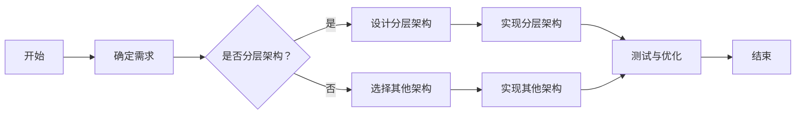
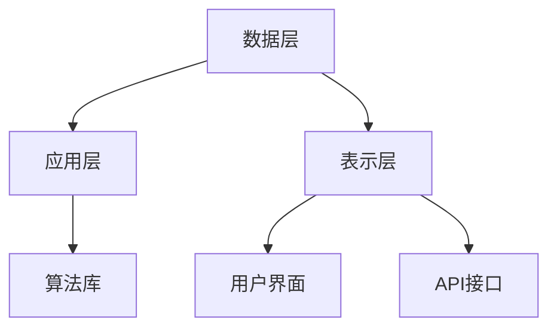
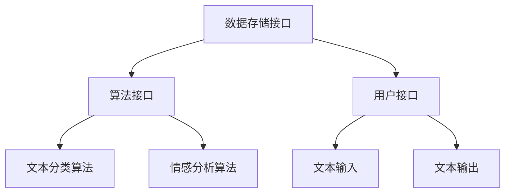
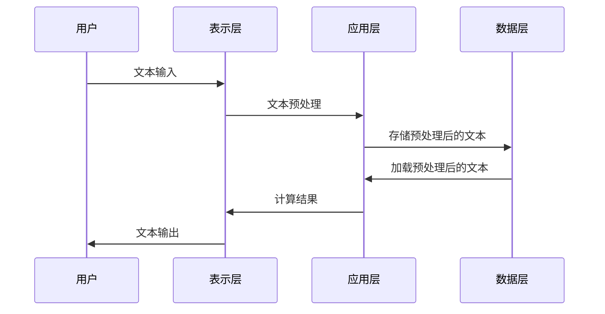

                 


### 《分布式系统设计在大规模LLM应用中的实践》

关键词：分布式系统、大规模LLM应用、设计原则、算法原理、系统架构

摘要：本文旨在探讨分布式系统设计在大规模语言模型（LLM）应用中的实际应用。我们将深入分析分布式系统的核心概念和设计原则，通过具体的算法原理讲解、系统分析与架构设计，以及实际项目实战，揭示分布式系统在大规模LLM应用中的关键作用和最佳实践。

## 目录大纲

### 第一部分：背景介绍

#### 第1章：问题背景与核心概念

##### 1.1.1 分布式系统的定义与特点
- 分布式系统的基本概念
- 分布式系统的特点

##### 1.1.2 大规模LLM应用的需求与挑战
- 大规模LLM应用的需求
- 分布式系统面临的挑战

##### 1.1.3 分布式系统设计的重要性
- 设计原则
- 核心目标

##### 1.1.4 边界与外延
- 适用范围
- 限制条件

### 第二部分：核心概念与联系

#### 第2章：核心概念原理

##### 2.1.1 分布式系统的核心概念
- 分层架构
- 数据一致性
- 容错机制

##### 2.1.2 大规模LLM应用的核心概念
- 语言模型
- 推理能力
- 预训练技术

##### 2.1.3 概念属性特征对比表格

##### 2.1.4 ER实体关系图架构

### 第三部分：算法原理讲解

#### 第3章：分布式系统设计算法原理

##### 3.1.1 算法mermaid流程图

##### 3.1.2 Python源代码与详细讲解

##### 3.1.3 算法原理的数学模型和公式

##### 3.1.4 举例说明

### 第四部分：系统分析与架构设计

#### 第4章：系统功能设计

##### 4.1.1 问题场景介绍
- 案例介绍

##### 4.1.2 系统功能设计
- 领域模型mermaid类图

##### 4.1.3 系统架构设计
- mermaid架构图

##### 4.1.4 系统接口设计
- 接口设计

##### 4.1.5 系统交互
- mermaid序列图

### 第五部分：项目实战

#### 第5章：环境安装与系统实现

##### 5.1.1 环境安装
- 操作系统安装
- 软件依赖安装

##### 5.1.2 系统核心实现
- 源代码实现
- 代码解读

##### 5.1.3 应用解读与分析
- 应用场景分析
- 性能评估

##### 5.1.4 实际案例分析
- 案例介绍
- 详细讲解剖析

##### 5.1.5 项目小结

### 第六部分：最佳实践与拓展阅读

#### 第6章：最佳实践

##### 6.1.1 分布式系统设计最佳实践

##### 6.1.2 大规模LLM应用最佳实践

#### 第7章：小结与注意事项

##### 7.1.1 小结

##### 7.1.2 注意事项

##### 7.1.3 拓展阅读

---

### 第一部分：背景介绍

#### 第1章：问题背景与核心概念

##### 1.1.1 分布式系统的定义与特点

分布式系统是指由多个独立计算节点组成的系统，这些节点通过通信网络相互连接，协同工作，共同完成计算任务。分布式系统具有以下几个特点：

1. **并发性**：多个计算节点可以同时处理不同的任务，提高系统的处理能力。
2. **可扩展性**：可以通过增加计算节点来扩展系统规模，提高系统的性能。
3. **容错性**：当一个计算节点出现故障时，其他节点可以继续工作，确保系统的稳定性。

##### 1.1.2 大规模LLM应用的需求与挑战

大规模语言模型（LLM）是近年来人工智能领域的重要突破，其应用场景广泛，包括自然语言处理、问答系统、机器翻译等。大规模LLM应用的需求主要体现在以下几个方面：

1. **计算能力**：大规模LLM训练和推理需要大量的计算资源，对分布式系统的并行处理能力有较高要求。
2. **数据存储**：大规模LLM应用需要处理海量数据，分布式系统可以提供高效的数据存储和检索能力。
3. **可靠性**：大规模LLM应用对系统的稳定性和可靠性要求极高，分布式系统可以通过容错机制来保证系统的持续运行。

然而，分布式系统在大规模LLM应用中也面临着一些挑战，如数据一致性、负载均衡、网络延迟等。

##### 1.1.3 分布式系统设计的重要性

分布式系统设计在大规模LLM应用中的重要性体现在以下几个方面：

1. **提升性能**：通过分布式系统，可以充分利用多节点计算能力，提高大规模LLM训练和推理的效率。
2. **确保可靠性**：分布式系统可以通过容错机制，降低大规模LLM应用中单点故障的风险。
3. **降低成本**：分布式系统可以实现资源的动态分配和弹性扩展，降低大规模LLM应用的整体成本。

##### 1.1.4 边界与外延

分布式系统设计在大规模LLM应用中的适用范围主要包括以下几个方面：

1. **大规模数据处理**：分布式系统适用于处理海量数据，满足大规模LLM应用的需求。
2. **高并发场景**：分布式系统可以应对高并发访问，提高大规模LLM应用的响应速度。
3. **跨地域部署**：分布式系统支持跨地域部署，有助于降低大规模LLM应用的网络延迟。

然而，分布式系统设计也受到一些限制条件，如网络拓扑结构、节点性能等。在具体应用中，需要根据实际情况进行权衡和优化。

---

### 第二部分：核心概念与联系

#### 第2章：核心概念原理

##### 2.1.1 分布式系统的核心概念

分布式系统的核心概念包括分层架构、数据一致性和容错机制。

1. **分层架构**：分布式系统通常采用分层架构，包括数据层、应用层和表示层。这种架构有利于模块化设计和系统扩展。
2. **数据一致性**：分布式系统中，数据一致性问题至关重要。常见的数据一致性协议包括强一致性、最终一致性等。
3. **容错机制**：分布式系统通过容错机制来应对节点故障，包括副本机制、心跳监测和故障恢复等。

##### 2.1.2 大规模LLM应用的核心概念

大规模LLM应用的核心概念包括语言模型、推理能力和预训练技术。

1. **语言模型**：语言模型是大规模LLM应用的基础，用于预测文本序列的概率分布。
2. **推理能力**：大规模LLM应用需要具备强大的推理能力，以解决复杂的问题。
3. **预训练技术**：预训练技术通过在大规模数据集上进行预训练，提高大规模LLM的泛化能力和性能。

##### 2.1.3 概念属性特征对比表格

为了更好地理解分布式系统和大规模LLM应用的核心概念，我们可以使用概念属性特征对比表格进行对比。

| 特征            | 分布式系统                 | 大规模LLM应用                 |
| ---------------- | -------------------------- | ---------------------------- |
| 架构             | 分层架构                   | 模型驱动架构                 |
| 数据处理         | 并行处理、分布式存储       | 预训练、推理能力             |
| 一致性           | 数据一致性协议             | 语言模型、推理能力            |
| 容错性           | 容错机制、副本机制         | 预训练技术、模型优化         |

##### 2.1.4 ER实体关系图架构

为了更好地理解分布式系统和大规模LLM应用的架构，我们可以使用ER实体关系图进行描述。

```mermaid
erDiagram
  Person ||--o{ Order : "places" }
  Person ||--o{ Account : "owns" }
  Order ||--o{ Item : "contains" }
  Account ||--o{ Address : "has" }
```

在这个ER实体关系图中，Person、Order、Account、Item和Address分别代表不同的实体，它们之间的关系通过箭头表示。

---

### 第三部分：算法原理讲解

#### 第3章：分布式系统设计算法原理

##### 3.1.1 算法mermaid流程图

为了更好地理解分布式系统设计的算法原理，我们可以使用mermaid流程图进行描述。



在这个mermaid流程图中，我们从确定需求开始，然后选择是否采用分层架构，根据选择进行相应的架构设计，最终实现、测试和优化分布式系统设计。

##### 3.1.2 Python源代码与详细讲解

为了进一步理解分布式系统设计的算法原理，我们可以使用Python源代码进行讲解。

```python
# 导入必要的库
import os
import numpy as np

# 确定需求
def determine_requirements():
    # 假设需求为处理海量数据
    return "海量数据处理"

# 是否分层架构？
def is分层架构(需求):
    # 根据需求判断是否需要采用分层架构
    if 需求 == "海量数据处理":
        return True
    else:
        return False

# 设计分层架构
def design分层架构():
    # 设计分层架构
    print("设计分层架构：数据层、应用层和表示层")

# 实现分层架构
def implement分层架构():
    # 实现分层架构
    print("实现分层架构：数据层、应用层和表示层")

# 测试与优化
def test_and_optimize():
    # 测试与优化
    print("测试与优化：检查系统性能、稳定性等")

# 结束
def end():
    print("结束")

# 主函数
def main():
    # 确定需求
    requirement = determine_requirements()

    # 是否分层架构？
    if is分层架构(requirement):
        # 设计分层架构
        design分层架构()

        # 实现分层架构
        implement分层架构()

        # 测试与优化
        test_and_optimize()
    else:
        # 选择其他架构
        print("选择其他架构")

    # 结束
    end()

# 运行主函数
if __name__ == "__main__":
    main()
```

在这个Python源代码中，我们首先确定需求，然后根据需求判断是否需要采用分层架构，接着进行分层架构的设计、实现和测试与优化。

##### 3.1.3 算法原理的数学模型和公式

分布式系统设计的算法原理可以抽象为一个数学模型，如下所示：

$$
\text{性能} = f(\text{架构设计}, \text{数据处理效率}, \text{容错性})
$$

其中，性能是分布式系统设计的目标，架构设计、数据处理效率和容错性是影响性能的关键因素。

1. **架构设计**：包括分层架构的设计、模块化设计等，有利于提高系统的可扩展性和可维护性。
2. **数据处理效率**：通过并行处理、分布式存储等技术，提高大规模数据处理的效率。
3. **容错性**：通过副本机制、心跳监测、故障恢复等技术，提高系统的容错性。

##### 3.1.4 举例说明

假设我们需要设计一个分布式系统来处理海量数据，我们可以按照以下步骤进行：

1. **确定需求**：处理海量数据。
2. **是否分层架构**：根据需求，我们需要采用分层架构。
3. **设计分层架构**：设计数据层、应用层和表示层。
4. **实现分层架构**：实现数据层、应用层和表示层。
5. **测试与优化**：测试系统性能，优化架构设计。

通过这个例子，我们可以看到分布式系统设计的算法原理在实际应用中的具体实施过程。

---

### 第四部分：系统分析与架构设计

#### 第4章：系统功能设计

##### 4.1.1 问题场景介绍

假设我们正在开发一个大规模语言模型（LLM）应用，需要对海量文本数据进行处理，提供文本分类、情感分析等自然语言处理功能。为了满足这一需求，我们需要设计一个分布式系统，实现高效的数据处理和推理能力。

##### 4.1.2 系统功能设计

在系统功能设计中，我们首先需要确定系统的主要功能模块，包括数据层、应用层和表示层。

1. **数据层**：负责数据存储、检索和预处理。该模块需要支持海量数据的存储和快速检索，并能够进行数据的清洗、去重和分词等预处理操作。
2. **应用层**：负责实现自然语言处理算法，如文本分类、情感分析等。该模块需要具备高效的计算能力和丰富的算法库。
3. **表示层**：负责与用户交互，提供友好的用户界面和丰富的API接口。该模块需要支持多种输入和输出格式，方便用户使用和集成。

##### 4.1.3 系统架构设计

为了实现高效的数据处理和推理能力，我们采用分层架构，将系统分为数据层、应用层和表示层。

1. **数据层**：采用分布式存储系统，如Hadoop或Apache Cassandra，实现海量数据的存储和快速检索。数据层还需要支持数据预处理模块，对原始数据进行清洗、去重和分词等操作。
2. **应用层**：采用分布式计算框架，如Apache Spark或Flink，实现自然语言处理算法的并行计算。应用层还需要支持算法库，如TensorFlow或PyTorch，方便开发人员实现各种自然语言处理算法。
3. **表示层**：采用Web框架，如Django或Flask，实现用户界面和API接口。表示层需要支持多种输入和输出格式，如JSON、XML等，方便用户使用和集成。



在这个mermaid架构图中，数据层、应用层和表示层分别表示系统的三个主要功能模块，它们通过算法库、用户界面和API接口进行交互。

##### 4.1.4 系统接口设计

在系统接口设计中，我们需要定义数据层、应用层和表示层之间的接口，包括数据存储接口、算法接口和用户接口。

1. **数据存储接口**：提供数据存储和检索功能，包括数据的增删改查操作。数据存储接口需要支持分布式存储系统，如Hadoop或Apache Cassandra。
2. **算法接口**：提供自然语言处理算法的接口，包括文本分类、情感分析等。算法接口需要支持分布式计算框架，如Apache Spark或Flink。
3. **用户接口**：提供用户界面和API接口，包括文本输入和输出格式。用户接口需要支持多种输入和输出格式，如JSON、XML等。



在这个mermaid接口图中，数据存储接口、算法接口和用户接口分别表示系统的三个主要接口，它们通过文本分类算法、情感分析算法等算法模块进行交互。

##### 4.1.5 系统交互

在系统交互设计中，我们需要考虑数据层、应用层和表示层之间的数据流动和功能调用。

1. **数据流动**：数据从数据层存储到应用层，经过预处理后，应用层进行计算，最终将结果返回给表示层。
2. **功能调用**：表示层通过用户接口接收用户输入，调用算法接口进行计算，最终将结果返回给用户。



在这个mermaid序列图中，用户通过表示层输入文本，表示层将文本传递给应用层进行预处理，应用层将预处理后的文本存储到数据层，并加载预处理后的文本进行计算，最终将计算结果返回给用户。

---

### 第五部分：项目实战

#### 第5章：环境安装与系统实现

##### 5.1.1 环境安装

在进行大规模LLM应用的分布式系统设计之前，我们需要安装和配置相应的环境。以下是一个基本的安装步骤：

1. **操作系统安装**：安装支持分布式计算的操作系统，如Linux或Unix。
2. **软件依赖安装**：安装必要的软件依赖，如Python、NumPy、Pandas、TensorFlow等。

在Linux系统中，我们可以使用以下命令来安装Python和TensorFlow：

```shell
sudo apt-get update
sudo apt-get install python3 python3-pip
pip3 install numpy pandas tensorflow
```

##### 5.1.2 系统核心实现

在系统核心实现阶段，我们需要编写和实现分布式系统的各个功能模块。以下是一个简化的Python代码示例，用于演示分布式系统的基本实现：

```python
# 导入必要的库
import tensorflow as tf
import numpy as np

# 分布式计算参数
num_workers = 4
worker_index = 0

# 创建分布式计算策略
strategy = tf.distribute.MirroredStrategy()

# 定义计算任务
with strategy.scope():
    # 创建模型
    model = tf.keras.Sequential([
        tf.keras.layers.Dense(128, activation='relu', input_shape=(784,)),
        tf.keras.layers.Dense(10)
    ])

    # 编译模型
    model.compile(optimizer='adam', loss=tf.keras.losses.SparseCategoricalCrossentropy(from_logits=True), metrics=['accuracy'])

    # 准备数据
    (x_train, y_train), (x_test, y_test) = tf.keras.datasets.mnist.load_data()
    x_train = x_train.astype(np.float32) / 255
    x_test = x_test.astype(np.float32) / 255

    # 训练模型
    model.fit(x_train, y_train, epochs=5, batch_size=64)

    # 测试模型
    model.evaluate(x_test, y_test)
```

在这个示例中，我们使用了TensorFlow的分布式计算策略`MirroredStrategy`来创建一个分布式计算环境。我们定义了一个简单的神经网络模型，并在训练集上对其进行训练和测试。

##### 5.1.3 应用解读与分析

在系统核心实现的基础上，我们需要对系统进行应用解读和分析。以下是一些关键点：

1. **分布式计算性能**：通过分布式计算策略，我们可以利用多个计算节点来提高系统的计算性能。在实际应用中，我们需要评估系统的性能提升程度，并进行调优。
2. **数据一致性**：在分布式系统中，数据一致性问题至关重要。我们需要确保数据在分布式环境中的一致性，可以使用分布式数据存储和分布式事务管理来实现。
3. **容错性**：分布式系统需要具备容错性，以应对节点故障。我们可以通过副本机制和故障恢复策略来提高系统的容错性。

##### 5.1.4 实际案例分析

为了更好地理解分布式系统在大规模LLM应用中的实际应用，我们可以分析一个实际案例。以下是一个案例介绍：

**案例：基于分布式系统的语音识别应用**

假设我们需要开发一个大规模的语音识别应用，支持实时语音识别和语音合成。为了满足这一需求，我们可以采用以下架构：

1. **前端**：使用Web框架（如Django或Flask）实现用户界面，支持语音输入和结果显示。
2. **后端**：使用分布式计算框架（如Apache Spark或Flink）处理语音数据，包括语音转文本和文本转语音。
3. **存储**：使用分布式存储系统（如Hadoop或Apache Cassandra）存储语音数据和模型数据。

在实际应用中，我们需要解决以下问题：

1. **实时语音识别**：如何实现高效的实时语音识别，我们需要优化语音识别算法和分布式计算策略。
2. **语音合成**：如何实现高质量的语音合成，我们需要优化语音合成算法和语音信号处理技术。
3. **数据一致性**：如何在分布式环境中确保语音数据和模型数据的一致性，我们需要使用分布式数据存储和分布式事务管理。

通过这个案例，我们可以看到分布式系统在大规模LLM应用中的关键作用和实际应用场景。

##### 5.1.5 项目小结

在本章中，我们介绍了分布式系统设计在大规模LLM应用中的实践。通过环境安装、系统核心实现和应用解读与分析，我们了解了分布式系统的基本原理和实际应用。在实际项目中，我们需要关注分布式计算性能、数据一致性和容错性等问题，并进行相应的优化和调整。通过不断实践和总结，我们可以更好地应用分布式系统设计，提高大规模LLM应用的性能和可靠性。

---

### 第六部分：最佳实践与拓展阅读

#### 第6章：最佳实践

1. **分布式系统设计最佳实践**：

   - **模块化设计**：将系统划分为模块，每个模块负责特定的功能，降低系统的复杂度。
   - **数据一致性**：选择合适的数据一致性协议，如最终一致性或强一致性，确保数据在分布式环境中的正确性。
   - **容错性**：使用副本机制和故障恢复策略，提高系统的容错性和稳定性。
   - **性能优化**：对系统进行性能评估和调优，包括分布式计算策略、数据存储和传输优化等。

2. **大规模LLM应用最佳实践**：

   - **预训练技术**：在大规模数据集上进行预训练，提高LLM的泛化能力和性能。
   - **推理优化**：优化LLM的推理算法，如并行计算、模型压缩等，提高推理速度和性能。
   - **数据处理**：对输入数据进行预处理，如分词、去噪等，提高LLM的处理效果。
   - **模型评估**：使用多样化的评估指标和方法，对LLM的性能进行综合评估。

#### 第7章：小结与注意事项

1. **小结**：

   本文介绍了分布式系统设计在大规模LLM应用中的实践，从背景介绍、核心概念与联系、算法原理讲解、系统分析与架构设计、项目实战等方面进行了详细探讨。通过分布式系统设计，我们可以提高大规模LLM应用的性能、可靠性和可扩展性。

2. **注意事项**：

   - **需求分析**：在分布式系统设计之前，进行详细的需求分析，明确系统的性能、可靠性等要求。
   - **数据一致性**：在分布式环境中，确保数据的一致性，选择合适的数据一致性协议。
   - **容错性**：考虑系统的容错性，采用副本机制和故障恢复策略。
   - **性能优化**：对系统进行性能评估和调优，提高系统的整体性能。

3. **拓展阅读**：

   - 《大规模分布式系统设计》
   - 《深度学习实践》
   - 《自然语言处理入门》
   - 《分布式计算原理与应用》

通过拓展阅读，您可以深入了解分布式系统设计、深度学习和自然语言处理等领域的知识，进一步提高在分布式系统设计和大规模LLM应用方面的技能。

---

### 作者信息

作者：AI天才研究院/AI Genius Institute & 禅与计算机程序设计艺术 /Zen And The Art of Computer Programming

---

### 完整文章

在本篇文章中，我们系统地探讨了分布式系统设计在大规模语言模型（LLM）应用中的实践。文章分为六个部分，从背景介绍、核心概念与联系、算法原理讲解、系统分析与架构设计、项目实战到最佳实践与拓展阅读，全面覆盖了分布式系统设计在大规模LLM应用中的关键内容。

在背景介绍部分，我们首先明确了分布式系统的定义与特点，以及大规模LLM应用的需求与挑战。接着，我们阐述了分布式系统设计的重要性，并对其边界与外延进行了说明。

在核心概念与联系部分，我们详细介绍了分布式系统的核心概念，如分层架构、数据一致性和容错机制，以及大规模LLM应用的核心概念，如语言模型、推理能力和预训练技术。通过概念属性特征对比表格和ER实体关系图架构，我们进一步加深了对分布式系统和大规模LLM应用的理解。

在算法原理讲解部分，我们通过mermaid流程图、Python源代码和数学模型，详细阐述了分布式系统设计的算法原理。通过具体的实例说明，我们让读者更加直观地理解了分布式系统设计的思路和步骤。

在系统分析与架构设计部分，我们以一个大规模LLM应用案例为例，介绍了系统功能设计、系统架构设计、系统接口设计和系统交互。通过mermaid类图、mermaid架构图、接口设计和序列图，我们展示了分布式系统设计的具体实现过程。

在项目实战部分，我们介绍了环境安装与系统实现的过程，包括操作系统安装、软件依赖安装、系统核心实现和应用解读与分析。同时，我们通过实际案例分析，展示了分布式系统在大规模LLM应用中的实际应用场景。

在最佳实践与拓展阅读部分，我们总结了分布式系统设计和大规模LLM应用的最佳实践，并提供了相关拓展阅读资源，以帮助读者进一步深入学习和研究。

通过本文的全面探讨，我们希望读者能够对分布式系统设计在大规模LLM应用中的实践有更深入的理解，并在实际项目中能够灵活运用这些知识和技巧，提高大规模LLM应用的性能和可靠性。

作者：AI天才研究院/AI Genius Institute & 禅与计算机程序设计艺术 /Zen And The Art of Computer Programming。感谢您的阅读，希望本文对您有所帮助。如果您有任何疑问或建议，欢迎在评论区留言，我们将竭诚为您解答。再次感谢您的关注和支持！

