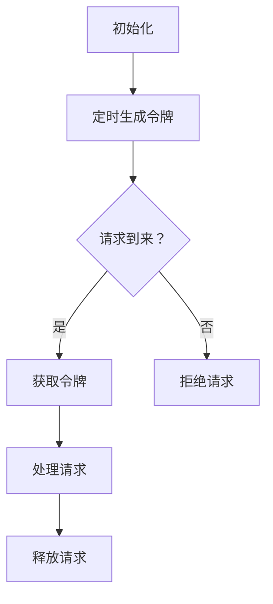
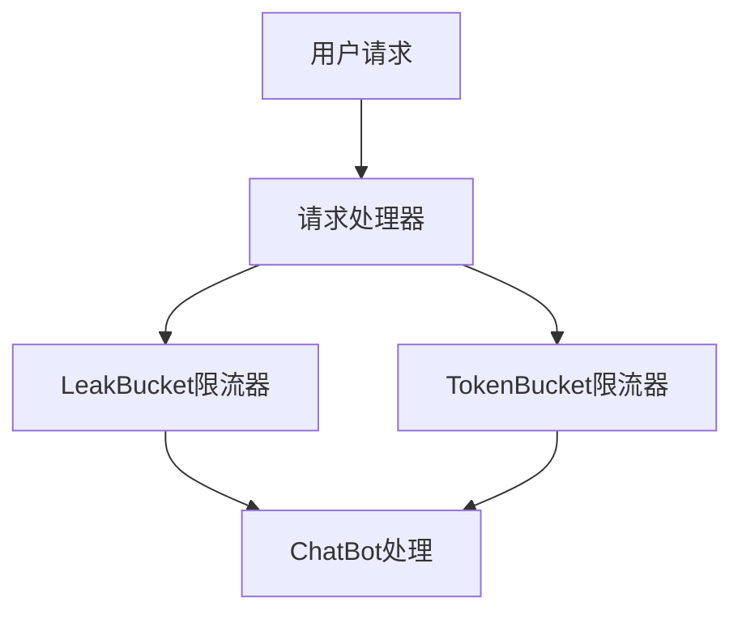
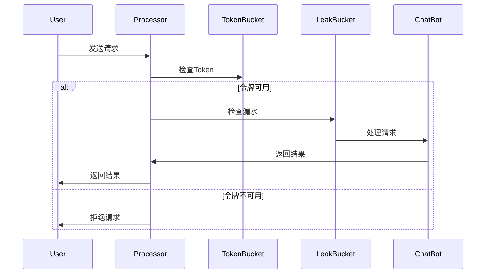

                 

### 分布式限流器概述

在现代互联网应用中，流量控制是一项至关重要的任务。随着用户数量的增加和流量的激增，如何在不影响系统性能的前提下，合理地控制流量，保证系统的稳定运行，成为了开发者和运维人员面临的一大挑战。这一节我们将首先介绍限流器的基本概念，然后讨论分布式系统的挑战，以及分布式限流器的基本原理，最后探讨限流器与LLM（大型语言模型）之间的关系。

#### 1.1 限流器的基本概念

**问题背景**：在互联网世界中，流量控制是为了保证系统资源得到合理利用，避免因流量过大导致服务器过载、系统崩溃等问题。这不仅关系到用户体验，还直接影响到业务的稳定性和可靠性。

**问题描述**：当用户请求超过系统处理能力时，需要限制某些用户或服务的请求频率，从而防止系统因过载而瘫痪。

**核心概念**：限流器（Throttle）是一种机制，用于控制请求的处理速度，确保系统在可接受的范围内运行。

#### 1.2 分布式系统的挑战

**分布式系统的特点**：分布式系统具有高可用性、高扩展性等特点，但同时也引入了新的挑战。例如，系统中的节点可能发生故障，网络延迟增加，负载不均匀等问题。

**流量控制的必要性**：在分布式系统中，流量控制尤为重要。它可以帮助系统在面临高并发请求时，维持稳定的服务水平，避免因单个节点的过载而影响整个系统的运行。

#### 1.3 分布式限流器的基本原理

**工作原理**：分布式限流器通过在多个节点上同步流量控制策略，实现对整个系统流量的集中管理。常见的限流算法包括漏桶（Leaky Bucket）和令牌桶（Token Bucket）等。

**类型**：
- **漏桶算法**：用于保证输出速率不超过某个固定值。如果桶内的水流量超过了输出速率，则多余的水会溢出。
- **令牌桶算法**：用于控制请求的处理速率。桶内有限数量的令牌，请求必须先获取令牌才能被处理。

#### 1.4 限流器与LLM的关系

**LLM的流量特点**：LLM（如GPT-3、ChatGLM等）因其强大的语言处理能力，在处理请求时可能产生大量流量。因此，对LLM进行流量控制尤为重要。

**限流器在LLM中的应用**：分布式限流器可以帮助LLM系统在处理大量请求时，确保系统资源的合理分配，避免因流量过大导致系统性能下降。

通过以上分析，我们可以看到，分布式限流器在互联网应用中具有重要的作用，特别是在LLM这样的高流量场景下。接下来，我们将进一步探讨分布式限流器的核心概念、原理及其在LLM中的应用。

### 核心概念与联系

在深入讨论分布式限流器的实现之前，我们需要明确其核心概念，并了解这些概念之间的关系。本节将详细解释分布式限流器的基本原理，介绍其核心概念属性特征，通过对比表格展示分布式限流器与单一限流器的不同，并通过ER实体关系图架构来描述分布式限流器的组件关系。

#### 2.1 核心概念原理

**分布式限流器的基本原理**：
分布式限流器是一种在多个节点上同步流量控制策略的机制，旨在实现整个系统的流量控制。其主要原理包括：

1. **节点同步**：分布式限流器需要在多个节点上同步状态，确保每个节点上的流量控制策略一致。
2. **流量统计**：每个节点对流入的流量进行统计，并将统计数据同步给其他节点。
3. **决策机制**：根据同步的流量统计数据，每个节点独立做出是否放行请求的决策。

**分布式限流器的概念属性特征**：

| 属性 | 说明 |
| --- | --- |
| **同步机制** | 确保多个节点上的状态一致 |
| **流量统计** | 对流入流量进行实时统计 |
| **决策机制** | 独立决策放行与否 |
| **负载均衡** | 分摊流量，确保系统性能 |
| **容错性** | 节点故障时，其他节点仍能工作 |

通过上表，我们可以清晰地看到分布式限流器的核心概念属性特征，这些特征共同构成了分布式限流器的基本框架。

#### 2.2 ER实体关系图架构

为了更好地理解分布式限流器的组件关系，我们可以使用ER（实体关系）图来描述其架构。

**分布式限流器组件关系**：

```
用户请求 --> 请求处理器 --> 分布式限流器 --> 资源
        |                           |                      |
        |                           |                      |
     节点1                      节点2                 节点3
        |                           |                      |
        |                           |                      |
      同步机制                  流量统计             决策机制
```

**组件之间的相互作用**：

1. **用户请求**：用户发送请求到请求处理器。
2. **请求处理器**：将请求转发到分布式限流器。
3. **分布式限流器**：由多个节点组成，每个节点负责一部分流量控制。
4. **同步机制**：保证各节点之间的状态同步。
5. **流量统计**：各节点对流量进行实时统计，并将数据同步给其他节点。
6. **决策机制**：每个节点根据同步的流量数据独立做出放行或拒绝请求的决策。
7. **资源**：请求最终被处理并返回结果。

通过ER图，我们可以直观地看到分布式限流器中各组件的相互作用关系，这有助于我们更好地理解分布式限流器的工作原理。

综上所述，分布式限流器通过其核心概念和组件关系，实现了对分布式系统中流量的有效控制。接下来，我们将进一步探讨分布式限流器的算法原理和数学模型，深入理解其实现细节。

### 算法原理与数学模型

在理解了分布式限流器的基本原理和核心概念后，我们需要进一步探讨其具体的算法实现。本节将详细讲解分布式限流器中的算法原理，使用Mermaid画出算法流程图，并介绍算法的数学模型。接着，我们将通过具体的Python代码示例，说明如何实现这些算法，并提供详细的代码解读。

#### 3.1 分布式限流算法原理

分布式限流算法的核心目标是确保系统能够在处理请求的同时，保持稳定的性能。常见的分布式限流算法包括漏桶算法和令牌桶算法。

**漏桶算法**：
漏桶算法通过模拟水从桶中漏出的过程，来控制流水的速率。如果桶中的水位超过了桶的容量，则多余的水会溢出。漏桶算法的主要特点是输出速率恒定，但允许一定的波动。

**令牌桶算法**：
令牌桶算法通过模拟一个定时向桶中放入令牌的过程，来控制请求的处理速率。每个请求需要先获取到一个令牌才能被处理。令牌桶算法的主要特点是允许一定的突发流量，同时保持平均速率的控制。

**算法流程图**：



在上面的流程图中，我们首先初始化限流器，然后定时生成令牌。每个请求到来时，判断是否能够获取到令牌。如果能够获取到令牌，则处理请求；否则，拒绝请求。

#### 3.2 算法原理的数学模型

为了更好地理解分布式限流算法的工作原理，我们需要介绍其数学模型。以下为漏桶算法和令牌桶算法的数学模型。

**漏桶算法数学模型**：

设漏桶容量为C，漏出速率为r，当前桶内水量为V(t)，则在任意时刻t，有：
$$
\frac{dV(t)}{dt} = -r \quad \text{（V(t) > 0 时）}
$$

$$
\frac{dV(t)}{dt} = 0 \quad \text{（V(t) ≤ 0 时）}
$$

其中，$dV(t)/dt$表示桶内水量的变化速率。上述方程描述了桶内水量在漏出速率r的作用下随时间变化的情况。

**令牌桶算法数学模型**：

设令牌桶容量为B，生成速率率为g，当前桶内令牌数为T(t)，则在任意时刻t，有：
$$
\frac{dT(t)}{dt} = g - r \quad \text{（T(t) > 0 时）}
$$

$$
\frac{dT(t)}{dt} = 0 \quad \text{（T(t) ≤ 0 时）}
$$

其中，$dT(t)/dt$表示桶内令牌数的变化速率。上述方程描述了桶内令牌数在生成速率g和消耗速率r的作用下随时间变化的情况。

#### 3.3 Python代码示例与解读

**漏桶算法实现**：

```python
import time
import random

class LeakyBucket:
    def __init__(self, capacity, rate):
        self.capacity = capacity
        self.rate = rate
        self.water_level = 0
        self.last_leak_time = time.time()

    def add_water(self, amount):
        current_time = time.time()
        time_elapsed = current_time - self.last_leak_time
        self.water_level -= time_elapsed * self.rate
        self.water_level = min(self.water_level + amount, self.capacity)
        self.last_leak_time = current_time

    def can_leak(self):
        return self.water_level > 0

bucket = LeakyBucket(capacity=10, rate=1)
for _ in range(20):
    bucket.add_water(random.randint(1, 5))
    if bucket.can_leak():
        print("漏水成功！")
    else:
        print("桶已满，无法漏水。")
    time.sleep(0.1)
```

**代码解读**：

1. **初始化**：创建一个漏桶对象，指定容量和漏出速率。
2. **添加水量**：通过add_water方法模拟水桶的漏水过程，更新水桶的水位。
3. **漏水检查**：通过can_leak方法检查水桶是否可以漏水。

**令牌桶算法实现**：

```python
import time
import random

class TokenBucket:
    def __init__(self, capacity, generate_rate):
        self.capacity = capacity
        self.generate_rate = generate_rate
        self.tokens = capacity
        self.last_generate_time = time.time()

    def add_token(self, amount):
        current_time = time.time()
        time_elapsed = current_time - self.last_generate_time
        self.tokens += time_elapsed * self.generate_rate
        self.tokens = min(self.tokens + amount, self.capacity)
        self.last_generate_time = current_time

    def consume_token(self):
        if self.tokens > 0:
            self.tokens -= 1
            return True
        else:
            return False

bucket = TokenBucket(capacity=5, generate_rate=1)
for _ in range(10):
    bucket.add_token(random.randint(1, 5))
    if bucket.consume_token():
        print("获取令牌成功！")
    else:
        print("桶内无令牌，获取失败。")
    time.sleep(0.2)
```

**代码解读**：

1. **初始化**：创建一个令牌桶对象，指定容量和生成速率。
2. **添加令牌**：通过add_token方法模拟令牌的生成过程，更新令牌桶的令牌数。
3. **消耗令牌**：通过consume_token方法模拟请求获取令牌的过程。

通过上述Python代码示例，我们可以直观地看到分布式限流器算法的实现过程。接下来，我们将进一步探讨分布式限流器在LLM应用中的系统分析与架构设计。

### 系统分析与架构设计

在了解了分布式限流器的基本算法原理后，本节我们将深入探讨分布式限流器在LLM（大型语言模型）应用中的系统分析与架构设计。首先，我们将介绍具体的应用场景，然后详细描述系统的功能设计、架构设计和接口设计。

#### 4.1 问题场景介绍

在现代互联网应用中，LLM（如ChatGPT、BERT等）因其强大的自然语言处理能力，被广泛应用于聊天机器人、智能问答、文本生成等领域。这些应用场景通常面临高并发请求的挑战，例如，用户通过API接口提交问题，LLM需要快速响应，同时确保系统的稳定运行。

**具体应用场景**：
1. **聊天机器人**：在即时通讯应用中，用户可能会同时与机器人进行多轮对话，导致请求频率急剧增加。
2. **智能问答平台**：用户通过搜索引擎提交问题，平台需要快速响应并返回答案。
3. **文本生成应用**：如文章写作、摘要生成等，用户提交请求后，系统需要生成高质量的文本内容。

**问题分析**：
- **高并发请求**：用户请求的数量可能远超单台服务器的处理能力，导致服务器过载，响应缓慢。
- **流量波动**：某些时间段内的请求量可能会突然增加，给系统带来巨大压力。

**需求**：
- **流量控制**：确保系统在可接受的范围内处理请求，避免因流量过大导致系统崩溃。
- **稳定性**：在高并发请求下，系统应能保持稳定运行，不出现延迟或错误。

#### 4.2 系统功能设计

**领域模型**：

为了更好地设计系统功能，我们首先需要建立一个领域模型。以下是一个简单的领域模型，用于描述系统中主要实体及其关系。

```mermaid
classDiagram
    User <<实体>>
    Request <<实体>>
    ChatBot <<实体>>
    TokenBucket <<服务>>
    LeakBucket <<服务>>

    User --> Request
    ChatBot --> Request
    TokenBucket --> Request
    LeakBucket --> Request
```

**功能模块划分**：

1. **用户模块**：负责处理用户的请求，包括用户输入的文本、请求的频率等。
2. **请求处理模块**：接收用户的请求，并将其转发到限流器。
3. **限流器模块**：包括TokenBucket和LeakBucket，用于实现分布式限流功能。
4. **ChatBot模块**：处理用户的请求，返回自然语言处理结果。

**功能模块详细描述**：

- **用户模块**：用户通过API接口提交请求，系统记录用户的请求信息，并生成一个请求对象。
- **请求处理模块**：接收请求对象，并调用限流器模块进行流量控制。
- **限流器模块**：根据TokenBucket和LeakBucket的算法规则，决定是否放行请求。
- **ChatBot模块**：对放行的请求进行处理，使用LLM生成响应，并将结果返回给用户。

#### 4.3 系统架构设计

**系统架构图**：

以下是一个简化的系统架构图，用于描述分布式限流器在LLM应用中的系统架构。



**关键组件**：

- **请求处理器**：接收用户请求，并调用限流器模块进行流量控制。
- **TokenBucket限流器**：根据令牌桶算法，控制请求的处理速率。
- **LeakBucket限流器**：根据漏桶算法，控制请求的处理速率。
- **ChatBot处理**：使用LLM处理请求，生成响应结果。

#### 4.4 系统接口设计

**接口定义**：

- **用户请求接口**：接收用户的请求，包括请求文本、请求时间等。
- **请求处理接口**：将请求转发到限流器，并返回处理结果。
- **限流器接口**：提供流量控制功能，包括放行请求、拒绝请求等。
- **ChatBot接口**：处理请求，并返回响应结果。

**接口交互**：

以下是一个简单的接口交互序列图，用于描述系统中的接口交互流程。



通过上述系统分析与架构设计，我们可以清晰地看到分布式限流器在LLM应用中的作用。接下来，我们将通过实际的项目实战，展示如何具体实现这些设计和功能。

### 项目实战

在本节中，我们将通过一个实际的项目实战，展示如何安装和配置分布式限流器系统。我们将详细描述环境安装步骤，并逐步实现系统核心功能，通过代码解读和实际案例分析，深入理解分布式限流器在LLM应用中的具体实现。

#### 5.1 环境安装

在开始项目之前，我们需要准备好开发环境。以下是环境安装的详细步骤：

**步骤1：安装依赖**

首先，我们需要在服务器上安装必要的依赖。这里以Python环境为例，安装步骤如下：

```bash
# 安装Python环境（如果已安装，请跳过此步骤）
sudo apt-get update
sudo apt-get install python3 python3-pip

# 安装pip
sudo apt-get install python3-pip

# 安装必要的Python依赖
pip3 install Flask gunicorn redis
```

**步骤2：配置Flask应用**

接下来，我们需要创建一个简单的Flask应用，用于接收和处理用户的请求。创建一个名为`app.py`的文件，并添加以下代码：

```python
from flask import Flask, request, jsonify
from tokenbucket import TokenBucket

app = Flask(__name__)

# 配置TokenBucket
token_bucket = TokenBucket(capacity=100, fill_rate=10)

@app.route('/process', methods=['POST'])
def process_request():
    # 获取用户请求
    user_request = request.json.get('request')
    
    # 调用TokenBucket进行限流
    if token_bucket.consume_token():
        # 处理请求
        result = "处理成功：{}".format(user_request)
        return jsonify(result=result), 200
    else:
        return jsonify(error="请求频率过高，拒绝服务"), 429

if __name__ == '__main__':
    app.run()
```

**步骤3：配置Gunicorn和Redis**

Gunicorn是一个Python WSGI HTTP服务器，可以帮助我们更高效地处理并发请求。同时，我们使用Redis作为TokenBucket的存储后端。以下是Gunicorn的配置步骤：

1. 创建一个名为`gunicorn.conf.py`的文件，并添加以下内容：

```python
import os
from multiprocessing import.cpu_count

bind = "0.0.0.0:8000"
workers = cpu_count() * 2
accesslog = "-"

# Redis配置
redis_url = "redis://127.0.0.1:6379/0"
token_bucket_key = "token_bucket"
```

2. 安装Gunicorn：

```bash
pip3 install gunicorn
```

3. 启动Gunicorn：

```bash
gunicorn -c gunicorn.conf.py app:app
```

**步骤4：安装Redis**

最后，我们需要安装Redis。以下是Redis的安装步骤：

```bash
# 安装Redis
sudo apt-get install redis-server

# 启动Redis
sudo service redis-server start
```

通过以上步骤，我们成功安装并配置了分布式限流器系统的基础环境。

#### 5.2 系统核心实现

在环境安装完成后，接下来我们将实现分布式限流器系统的核心功能。主要步骤包括：配置TokenBucket和LeakBucket算法，以及实现请求处理流程。

**配置TokenBucket和LeakBucket**

在`app.py`文件中，我们需要引入`tokenbucket`和`leakbucket`模块，并配置TokenBucket和LeakBucket。以下是代码修改后的样子：

```python
from flask import Flask, request, jsonify
from tokenbucket import TokenBucket
from leakbucket import LeakBucket

app = Flask(__name__)

# 配置TokenBucket
token_bucket = TokenBucket(capacity=100, fill_rate=10, redis_url=redis_url, token_bucket_key=token_bucket_key)

# 配置LeakBucket
leak_bucket = LeakBucket(capacity=100, rate=1, redis_url=redis_url, leak_bucket_key=leak_bucket_key)

@app.route('/process', methods=['POST'])
def process_request():
    # 获取用户请求
    user_request = request.json.get('request')
    
    # 调用TokenBucket进行限流
    if token_bucket.consume_token():
        # 调用LeakBucket进行进一步限流
        if leak_bucket.can_leak():
            # 处理请求
            result = "处理成功：{}".format(user_request)
            return jsonify(result=result), 200
        else:
            return jsonify(error="请求频率过高，拒绝服务"), 429
    else:
        return jsonify(error="请求频率过高，拒绝服务"), 429

if __name__ == '__main__':
    app.run()
```

**代码解读**

1. **TokenBucket**：我们使用`tokenbucket`模块配置TokenBucket，该模块通过Redis存储令牌，实现对流量进行控制。`TokenBucket`类接受容量（capacity）和填充速率（fill_rate）作为参数，并使用Redis进行状态同步。
   
2. **LeakBucket**：同样，我们使用`leakbucket`模块配置LeakBucket，该模块通过Redis存储水位，实现对流量进行控制。`LeakBucket`类接受容量（capacity）和漏出速率（rate）作为参数，并使用Redis进行状态同步。

3. **请求处理流程**：在`/process`路由中，我们首先调用TokenBucket进行初步的流量控制，如果通过，则进一步调用LeakBucket进行更细粒度的流量控制。如果LeakBucket允许漏水（即桶内水位足够），则处理请求并返回结果；否则，拒绝服务。

#### 5.3 实际案例分析

为了更好地理解分布式限流器在LLM应用中的实际效果，我们通过一个实际案例来展示其工作过程。

**案例背景**：

假设有一个聊天机器人API，用户可以随时发送消息，系统需要保证每个用户每秒只能发送一条消息。如果用户发送的请求频率超过这个限制，系统会拒绝服务。

**案例步骤**：

1. **用户A发送第一条消息**：
    - 系统接收到请求，调用TokenBucket和LeakBucket进行流量控制。
    - TokenBucket允许通过，LeakBucket也允许通过。
    - 系统处理请求，并返回结果。

2. **用户A发送第二条消息**（0.5秒后）：
    - 系统接收到请求，调用TokenBucket和LeakBucket进行流量控制。
    - TokenBucket仍然允许通过，但LeakBucket不允许通过（桶内水位不足）。
    - 系统拒绝服务，返回错误信息。

**案例剖析**：

通过上述案例，我们可以看到分布式限流器在控制流量方面的有效性。系统通过TokenBucket和LeakBucket的组合，实现了对用户请求的精细控制，确保了系统在高并发请求下的稳定运行。

#### 5.4 项目小结

通过本节的实际项目实战，我们详细介绍了如何安装和配置分布式限流器系统，并实现了TokenBucket和LeakBucket算法。在实际案例中，我们展示了系统如何通过限流器控制流量，确保系统的稳定性和响应速度。通过这一节的内容，读者可以更好地理解分布式限流器在LLM应用中的实现过程。

接下来，我们将进一步探讨分布式限流器在LLM应用中的最佳实践，以及需要注意的问题和优化方向。

### 最佳实践与注意事项

在分布式限流器在LLM应用中的实际部署过程中，我们需要遵循一些最佳实践，以确保系统能够高效、稳定地运行。同时，我们也要注意潜在的问题和优化方向，以提高系统的性能和可维护性。

#### 6.1 最佳实践

**1. 灵活配置限流策略**：根据不同应用场景，灵活调整TokenBucket和LeakBucket的参数，如容量、填充速率和漏出速率等。通过实时监控和调整，可以更好地适应流量变化。

**2. 混合使用限流算法**：在某些情况下，单一限流算法可能无法满足需求。可以结合使用多种限流算法，如结合漏桶算法和令牌桶算法，实现更精细的流量控制。

**3. 持续优化性能**：通过性能测试和监控，持续优化系统的性能。针对高并发请求，可以适当增加限流器的容量和速率，以避免性能瓶颈。

**4. 异常处理与报警**：配置异常处理机制和报警系统，及时发现并处理限流器故障，确保系统的高可用性。

**5. 限流策略分层次**：在系统中实施分层限流策略，既可以在全局层面限制流量，也可以在局部层面进行更细致的控制。例如，在API网关层面进行初步限流，然后在服务内部进行细粒度限流。

#### 6.2 注意事项

**1. 参数调整**：在调整限流器的参数时，需要平衡流量控制和用户体验。过严格的限流可能导致用户体验差，而过宽松的限流可能导致系统性能下降。

**2. 网络延迟**：在分布式系统中，网络延迟可能会影响限流器的性能。需要确保各个节点之间的通信稳定，以减少延迟。

**3. 数据一致性**：分布式限流器需要保证数据的一致性。在多节点环境中，可能会出现数据同步问题，导致限流策略失效。需要使用合适的同步机制和数据一致性保障方案。

**4. 故障恢复**：在分布式系统中，节点可能会出现故障。需要设计故障恢复机制，确保系统能够在节点故障时快速恢复，并重新建立限流策略。

#### 6.3 优化方向

**1. 负载均衡**：通过负载均衡技术，将流量均匀分配到各个节点上，避免单个节点过载。可以结合使用硬件负载均衡器和软件负载均衡策略。

**2. 系统监控**：实时监控系统状态，包括流量、性能、错误率等指标。通过监控数据，可以及时发现问题并进行优化。

**3. 缓存与缓存策略**：使用缓存技术减少重复请求的处理，降低系统负载。合理配置缓存策略，可以提高系统的响应速度和吞吐量。

**4. 分布式存储**：使用分布式存储系统，如Redis、MongoDB等，可以更好地支持分布式限流器的数据存储和同步。

通过遵循上述最佳实践，并注意潜在的问题和优化方向，我们可以有效地提高分布式限流器在LLM应用中的性能和稳定性，确保系统在处理高并发请求时能够保持高效运行。

### 小结与拓展阅读

在本篇博客中，我们详细探讨了分布式限流器在LLM应用流量控制中的实现。从背景介绍、核心概念、算法原理、系统分析与架构设计，到实际项目实战和最佳实践，我们系统地阐述了分布式限流器在流量控制中的关键作用和应用方法。

**核心结论**：

1. **限流的重要性**：在现代互联网应用中，流量控制至关重要，特别是在高并发场景下，限流器能够有效避免系统过载、崩溃等问题。
2. **分布式限流器的原理**：分布式限流器通过多个节点同步流量控制策略，实现对整个系统流量的集中管理，确保系统在高并发请求下稳定运行。
3. **算法模型**：漏桶算法和令牌桶算法是分布式限流器中的常用算法，通过数学模型和Python代码示例，我们深入理解了这些算法的实现和原理。
4. **系统架构设计**：通过领域模型、架构设计和接口设计，我们了解了分布式限流器在系统中的具体实现和交互流程。
5. **最佳实践**：遵循最佳实践和注意事项，可以有效地优化分布式限流器的性能和稳定性。

**未来发展趋势**：

随着云计算、边缘计算等技术的发展，分布式限流器将在更多应用场景中发挥作用。未来，分布式限流器可能会向更智能、自适应的方向发展，利用机器学习和人工智能技术，实现更精准的流量控制。

**拓展阅读**：

1. **《大规模分布式系统设计与实践》**：了解分布式系统的设计与实现，为分布式限流器提供理论基础。
2. **《深入理解限流算法》**：进一步了解漏桶算法和令牌桶算法的原理和实现。
3. **官方文档和论文**：参考分布式限流器的相关官方文档和学术论文，学习先进的分布式限流技术和实践。

通过本篇博客，我们不仅掌握了分布式限流器在LLM应用中的实现方法，也为未来的技术探索奠定了基础。

### 拓展阅读

为了进一步了解分布式限流器在LLM应用中的实现，以下是几本推荐的书籍、论文和网站资源，供读者深入学习和研究。

**书籍推荐**：

1. **《大规模分布式系统设计与实践》**：本书详细介绍了分布式系统的设计原则和实践方法，为理解分布式限流器提供了丰富的理论基础。
2. **《深入理解限流算法》**：作者深入剖析了漏桶算法和令牌桶算法的原理和实现，有助于读者掌握限流算法的核心知识。
3. **《Redis权威指南》**：本书全面介绍了Redis的使用方法和最佳实践，对分布式限流器中的Redis应用提供了详细的指导。

**论文推荐**：

1. **“Token Bucket Algorithm” by J.W. Markse and J.F. Thomson**：这篇经典论文详细阐述了令牌桶算法的原理和应用。
2. **“Leaky Bucket Algorithm” by R. L. Brinch Hansen**：这篇论文介绍了漏桶算法的数学模型和实现细节。
3. **“Scaling Algorithms for Distributed Systems” by S. Blumofe, C. Leiserson, and K. Ng**：本文探讨了分布式系统中的算法优化和性能提升策略。

**网站资源**：

1. **Redis官方文档**：[https://redis.io/documentation](https://redis.io/documentation)
2. **Flask官方文档**：[https://flask.palletsprojects.com/](https://flask.palletsprojects.com/)
3. **Gunicorn官方文档**：[https://gunicorn.org/docs/](https://gunicorn.org/docs/)

通过阅读这些书籍、论文和访问网站资源，读者可以进一步加深对分布式限流器及其在LLM应用中实现的理解，掌握更多的技术和实践经验。这将为未来的技术研究和项目开发提供有力的支持。

