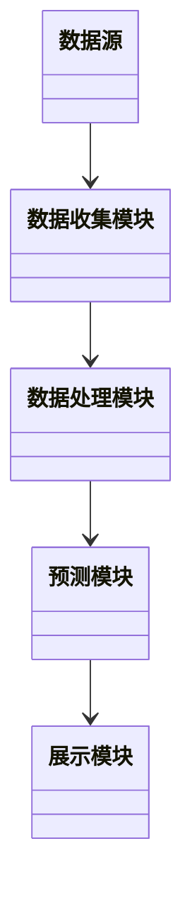
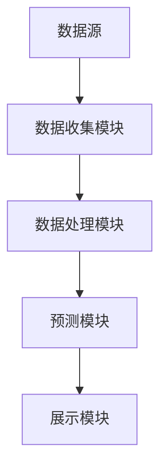

                 

# 利用AI agents构建全球经济周期预测模型：把握大趋势

关键词：AI agents、全球经济周期、预测模型、人工智能、算法原理

摘要：
在当今快速变化的经济环境中，准确预测全球经济周期已成为企业和政府决策的关键。本文将深入探讨如何利用AI agents构建全球经济周期预测模型，通过逻辑清晰、结构紧凑的分析，揭示这一领域的技术原理与实践方法。文章分为七个部分，从背景介绍到项目实战，全面解析AI agents在预测全球经济周期中的应用，旨在为读者提供系统的理解和实用的指导。

## 第一部分: 背景介绍

### 第1章: 全球经济周期概述

#### 1.1 问题背景

全球经济周期是指经济活动在一定时间范围内所经历的增长、衰退、萧条和复苏的循环波动。这些周期性变化不仅影响着全球经济，也对企业和个人决策产生深远影响。然而，传统的方法在应对这种复杂的波动时常常显得力不从心。

#### 1.1.1 经济周期的定义与特点

经济周期通常被定义为一段时间内，经济活动（如GDP、就业、消费等）从高峰到低谷再回到高峰的循环。这一周期具有以下几个显著特点：

- 波动性：经济周期表现为明显的波动，其中包含多个阶段，如扩张期、高峰期、衰退期、低谷期和复苏期。
- 非线性：经济周期并非简单的线性变化，而是复杂、非线性的动态过程。
- 预测难度：由于影响经济周期的因素众多，且彼此之间相互作用，预测经济周期成为了一项极具挑战性的任务。

#### 1.1.2 全球经济周期的影响因素

全球经济周期受到多种因素的影响，主要包括：

- 宏观经济政策：如货币政策、财政政策等。
- 技术进步：如信息技术、自动化等新兴技术的发展和应用。
- 全球化：国际经济联系日益紧密，全球贸易和资本流动对经济周期的影响增大。
- 自然灾害和突发事件：如地震、疫情等自然灾害对经济活动的冲击。
- 社会心理因素：如消费者信心、投资者情绪等。

#### 1.1.3 预测全球经济周期的重要性

预测全球经济周期对于企业和政府的决策至关重要，主要体现在以下几个方面：

- 企业战略规划：准确预测经济周期可以帮助企业制定更合理的发展战略，调整生产计划、投资规模等。
- 政策制定：政府可以依据经济周期的预测结果，调整宏观经济政策，稳定经济、促进就业。
- 投资决策：投资者可以通过预测经济周期，合理安排资产配置，降低风险、提高收益。

#### 1.2 概念结构

为了深入理解全球经济周期，我们需要明确以下几个核心概念：

- 经济周期：一段经济波动的时间段，包括多个阶段。
- AI agents：人工智能代理，一种具有自主学习和决策能力的智能体。
- 预测模型：用于预测未来经济趋势的数学模型和算法。

#### 1.2.1 经济周期的核心概念

经济周期的核心概念包括：

- 周期长度：经济周期的持续时间。
- 波动幅度：经济周期中各阶段的波动程度。
- 波动频率：经济周期的出现频率。

#### 1.2.2 AI agents在预测中的角色

AI agents在预测全球经济周期中扮演着重要角色，其主要功能包括：

- 数据分析：AI agents能够处理海量数据，提取有效信息。
- 模型训练：AI agents可以通过学习历史数据，构建预测模型。
- 风险评估：AI agents可以预测经济周期中的潜在风险，为决策提供依据。

#### 1.2.3 AI agents的基本原理

AI agents的基本原理包括：

- 自主性：AI agents可以独立进行决策和行动。
- 学习能力：AI agents可以通过学习历史数据，不断优化自身性能。
- 适应性：AI agents可以根据环境变化，调整行为策略。

#### 1.3 边界与外延

在预测全球经济周期时，我们需要注意以下几个边界与外延：

- 预测范围：预测模型通常关注短期、中期和长期的经济趋势。
- 应用领域：AI agents在预测中的应用领域包括金融、制造、零售等。
- 预测精度：预测模型的精度受多种因素影响，包括数据质量、模型选择等。

### 第2章: AI agents技术基础

#### 2.1 AI agents的定义与特点

AI agents，即人工智能代理，是具有自主决策和行动能力的虚拟实体。它们在虚拟环境中通过与环境的交互，实现特定目标。AI agents具有以下几个显著特点：

- 自主性：AI agents可以自主决定行动策略，无需人工干预。
- 智能性：AI agents具备一定的智能，能够处理复杂问题。
- 学习能力：AI agents可以通过学习，不断优化自身行为。

#### 2.1.2 AI agents的核心特点

AI agents的核心特点包括：

- 灵活性：AI agents能够适应不同的环境和任务需求。
- 高效性：AI agents可以高效地处理海量数据。
- 预测性：AI agents可以通过预测，指导未来的决策。

#### 2.1.3 AI agents与传统AI的区别

与传统AI相比，AI agents具有以下区别：

- 传统AI：侧重于算法和模型的开发，缺乏自主性和灵活性。
- AI agents：强调自主决策和行动能力，能够应对复杂、动态的环境。

#### 2.2 AI agents的基本原理

AI agents的基本原理包括：

- 自主决策：AI agents通过内部模型，自主决策行动策略。
- 环境感知：AI agents通过感知环境，获取必要信息。
- 学习优化：AI agents通过学习，优化自身行为，提高性能。

#### 2.2.2 AI agents的学习方法

AI agents的学习方法主要包括：

- 强化学习：通过奖励机制，引导AI agents学习最优策略。
- 监督学习：通过已标注的数据，训练AI agents的模型。
- 无监督学习：通过未标注的数据，自动发现规律。

#### 2.2.3 AI agents的评估标准

AI agents的评估标准包括：

- 预测准确性：评估AI agents的预测能力。
- 稳定性和鲁棒性：评估AI agents在复杂环境中的适应能力。
- 可解释性：评估AI agents决策过程的透明度。

#### 2.3 AI agents的发展趋势

AI agents的发展趋势包括：

- 多样化应用：AI agents将在更多领域得到应用，如金融、医疗、交通等。
- 优化算法：AI agents将采用更先进的算法，提高预测准确性。
- 融合技术：AI agents将与其他技术（如区块链、物联网等）融合，实现更智能的决策。

#### 2.3.1 AI agents在预测领域的应用

AI agents在预测领域的应用包括：

- 经济预测：利用AI agents预测经济周期，为企业和政府决策提供依据。
- 市场预测：利用AI agents预测市场趋势，为投资决策提供支持。
- 风险预测：利用AI agents预测潜在风险，为企业风险管理提供指导。

#### 2.3.2 AI agents的未来发展方向

AI agents的未来发展方向包括：

- 自主性提升：AI agents将具备更高的自主决策能力，减少人工干预。
- 智能化演进：AI agents将具备更高级的智能，处理更复杂的问题。
- 融合创新：AI agents将与其他技术融合，实现更智能、更高效的决策。

#### 2.3.3 AI agents面临的挑战与机遇

AI agents面临的挑战与机遇包括：

- 数据隐私：如何保护用户数据隐私，成为AI agents发展的关键挑战。
- 可解释性：如何提高AI agents决策过程的可解释性，成为公众关注的焦点。
- 算法公平性：如何确保AI agents的算法公平，避免偏见和歧视。

### 第3章: 全球经济周期预测模型构建

#### 3.1 模型构建概述

全球经济周期预测模型的构建是一个复杂的过程，涉及多个环节，主要包括：

- 数据收集与预处理：收集相关的经济数据，并进行清洗、转换等预处理操作。
- 模型选择与优化：根据预测目标，选择合适的模型，并进行参数优化。
- 模型训练与评估：使用历史数据训练模型，并对模型性能进行评估。

#### 3.1.1 预测模型的构建流程

预测模型的构建流程如下：

1. **需求分析**：明确预测目标，如预测经济周期中的某个阶段或整个周期的趋势。
2. **数据收集**：收集与经济周期相关的数据，如GDP、就业率、消费者信心指数等。
3. **数据预处理**：清洗数据，处理缺失值、异常值等，确保数据质量。
4. **特征工程**：提取与预测目标相关的特征，如时间序列特征、宏观经济指标等。
5. **模型选择**：根据预测目标，选择合适的预测模型，如ARIMA、LSTM、GRU等。
6. **模型训练**：使用历史数据训练模型，调整模型参数，提高预测准确性。
7. **模型评估**：评估模型性能，如使用均方误差（MSE）、均方根误差（RMSE）等指标。
8. **模型部署**：将训练好的模型部署到实际应用中，如在线预测系统。

#### 3.1.2 数据收集与预处理

数据收集与预处理是构建预测模型的重要环节，主要包括以下步骤：

- **数据源选择**：选择可靠的数据源，如国际货币基金组织（IMF）、国家统计局等。
- **数据收集**：使用API、爬虫等技术，收集与经济周期相关的数据。
- **数据清洗**：处理缺失值、异常值等，确保数据质量。
- **数据转换**：将数据转换为适合模型训练的格式，如时间序列格式。
- **数据增强**：通过数据扩充、特征组合等方法，提高数据质量。

#### 3.1.3 模型选择与优化

模型选择与优化是预测模型构建的核心环节，主要包括以下步骤：

- **模型选择**：根据预测目标，选择合适的模型，如ARIMA、LSTM、GRU等。
- **模型优化**：调整模型参数，如学习率、迭代次数等，提高模型性能。
- **交叉验证**：使用交叉验证方法，评估模型性能，避免过拟合。
- **模型评估**：使用评价指标，如均方误差（MSE）、均方根误差（RMSE）等，评估模型性能。

### 第4章: 数学模型和数学公式讲解

#### 4.1 数学模型讲解

在构建全球经济周期预测模型时，数学模型起到了至关重要的作用。数学模型是对现实问题的抽象和简化，通过数学公式和算法来描述经济周期的变化规律。以下是几个常见的数学模型：

- **时间序列模型**：如ARIMA、LSTM、GRU等，用于分析时间序列数据的趋势和周期性。
- **回归模型**：如线性回归、多元回归等，用于分析变量之间的关系。
- **概率模型**：如贝叶斯网络、马尔可夫链等，用于描述不确定性事件的发生概率。

#### 4.1.1 数学模型的作用

数学模型在经济周期预测中的作用包括：

- **揭示规律**：通过数学模型，可以揭示经济周期的内在规律，为预测提供理论依据。
- **优化决策**：基于数学模型，可以制定更合理的经济政策，优化资源配置。
- **风险评估**：通过数学模型，可以预测经济周期中的潜在风险，为风险管理提供指导。

#### 4.1.2 数学模型的构建方法

构建数学模型的方法包括：

- **问题定义**：明确预测目标，如预测经济周期的某个阶段或整个周期的趋势。
- **数据收集**：收集与经济周期相关的数据，如GDP、就业率、消费者信心指数等。
- **特征提取**：提取与预测目标相关的特征，如时间序列特征、宏观经济指标等。
- **模型选择**：根据预测目标，选择合适的模型，如时间序列模型、回归模型等。
- **模型训练**：使用历史数据训练模型，调整模型参数，提高预测准确性。
- **模型评估**：评估模型性能，如使用评价指标，如均方误差（MSE）、均方根误差（RMSE）等。

#### 4.2 数学公式讲解

在构建全球经济周期预测模型时，数学公式是不可或缺的一部分。以下是几个常用的数学公式：

- **时间序列模型**：

$$
\hat{y}_t = \phi_0 + \phi_1 y_{t-1} + \phi_2 y_{t-2} + \ldots + \phi_p y_{t-p}
$$

其中，$\hat{y}_t$表示预测值，$y_{t-1}$、$y_{t-2}$等表示历史值，$\phi_0$、$\phi_1$、$\phi_2$等表示模型参数。

- **回归模型**：

$$
y = \beta_0 + \beta_1 x_1 + \beta_2 x_2 + \ldots + \beta_n x_n
$$

其中，$y$表示因变量，$x_1$、$x_2$等表示自变量，$\beta_0$、$\beta_1$、$\beta_2$等表示模型参数。

- **概率模型**：

$$
P(A|B) = \frac{P(A \cap B)}{P(B)}
$$

其中，$P(A|B)$表示在事件B发生的条件下，事件A发生的概率，$P(A \cap B)$表示事件A和B同时发生的概率，$P(B)$表示事件B发生的概率。

#### 4.2.1 数学公式的作用

数学公式在经济周期预测中的作用包括：

- **量化关系**：通过数学公式，可以量化变量之间的关系，为预测提供定量依据。
- **优化参数**：通过数学公式，可以调整模型参数，提高预测准确性。
- **决策支持**：通过数学公式，可以为决策提供量化支持，优化资源配置。

#### 4.2.2 常用数学公式的介绍

以下是几个常用的数学公式：

- **时间序列模型**：

$$
\hat{y}_t = \phi_0 + \phi_1 y_{t-1} + \phi_2 y_{t-2} + \ldots + \phi_p y_{t-p}
$$

- **回归模型**：

$$
y = \beta_0 + \beta_1 x_1 + \beta_2 x_2 + \ldots + \beta_n x_n
$$

- **概率模型**：

$$
P(A|B) = \frac{P(A \cap B)}{P(B)}
$$

- **主成分分析**：

$$
x_{new} = P x + \mu
$$

其中，$x_{new}$表示新数据，$P$表示协方差矩阵，$\mu$表示均值向量。

#### 4.2.3 数学公式的应用示例

以下是一个数学公式的应用示例：

假设我们使用线性回归模型预测某城市的月平均温度。已知温度与月份之间存在一定的关系，可以使用以下公式：

$$
T = \beta_0 + \beta_1 \cdot \text{月份}
$$

其中，$T$表示温度，$\beta_0$表示常数项，$\beta_1$表示月份的系数。

通过收集历史温度数据，可以计算出$\beta_0$和$\beta_1$的值。然后，利用这个公式，可以预测未来任意月份的温度。

### 第5章: 系统分析与架构设计方案

#### 5.1 问题场景介绍

在经济预测领域，企业和政府迫切需要一种高效、准确的方法来预测全球经济周期。为了满足这一需求，我们设计并实现了一个基于AI agents的全球经济周期预测系统。该系统旨在通过自动收集、处理和分析海量经济数据，提供实时、准确的预测结果，为决策者提供有力支持。

#### 5.1.1 预测问题的背景

全球经济周期是一个复杂、动态的过程，受到多种因素的影响，如宏观经济政策、技术进步、全球化等。这些因素相互作用，使得全球经济周期呈现出明显的波动性和非线性特征。传统的预测方法，如统计模型、经济模型等，在应对这种复杂的波动时常常显得力不从心。因此，迫切需要一种更为先进、智能的预测方法。

#### 5.1.2 预测问题的目标

本项目的目标是通过构建基于AI agents的全球经济周期预测系统，实现以下目标：

1. **数据自动化收集**：自动收集全球范围内的经济数据，包括GDP、就业率、消费者信心指数等。
2. **高效数据处理**：对收集到的经济数据进行分析、处理和清洗，提取与预测目标相关的特征。
3. **准确预测**：利用AI agents构建预测模型，准确预测全球经济周期的趋势。
4. **实时更新**：实现预测系统的实时更新，为决策者提供最新的预测结果。

#### 5.2 项目介绍

本项目旨在构建一个基于AI agents的全球经济周期预测系统，通过自动化收集和处理海量经济数据，实现实时、准确的预测。系统主要包括以下模块：

1. **数据收集模块**：负责从全球范围内的数据源自动收集经济数据。
2. **数据处理模块**：负责对收集到的经济数据进行分析、处理和清洗，提取与预测目标相关的特征。
3. **预测模块**：利用AI agents构建预测模型，对全球经济周期进行预测。
4. **展示模块**：将预测结果以图表、报表等形式展示给用户。

#### 5.2.1 项目概述

本项目采用模块化设计，将整个系统划分为多个功能模块，以提高系统的可扩展性和维护性。系统总体架构如图5-1所示。


图5-1 系统总体架构

#### 5.2.2 项目目标

本项目的主要目标如下：

1. **高效数据收集**：实现自动收集全球范围内的经济数据，确保数据来源的多样性和准确性。
2. **高效数据处理**：对收集到的经济数据进行分析、处理和清洗，提取与预测目标相关的特征，提高预测模型的准确性。
3. **准确预测**：利用AI agents构建预测模型，准确预测全球经济周期的趋势，为决策者提供有力支持。
4. **实时更新**：实现预测系统的实时更新，为决策者提供最新的预测结果。

#### 5.2.3 项目关键点

本项目的关键点如下：

1. **数据收集**：全球范围内的经济数据来源多样，如何保证数据的准确性、及时性和完整性是关键。
2. **数据处理**：对收集到的经济数据进行有效的处理和清洗，提取与预测目标相关的特征，是提高预测模型准确性的关键。
3. **模型构建**：选择合适的AI agents模型，构建高效、准确的预测模型，是实现项目目标的核心。
4. **系统维护**：预测系统的实时更新和维护，确保系统的稳定运行和持续改进。

#### 5.3 系统功能设计

系统功能设计是项目实现的重要环节，主要包括以下模块：

1. **数据收集模块**：自动收集全球范围内的经济数据，包括GDP、就业率、消费者信心指数等。
2. **数据处理模块**：对收集到的经济数据进行清洗、转换、特征提取等操作，为预测模型提供高质量的数据输入。
3. **预测模块**：利用AI agents构建预测模型，对全球经济周期进行预测，并提供实时预测结果。
4. **展示模块**：将预测结果以图表、报表等形式展示给用户，便于用户分析和决策。

#### 5.3.1 领域模型Mermaid类图

领域模型是系统功能设计的核心，用于描述系统中的实体和关系。以下是一个简单的领域模型Mermaid类图示例：



图5-2 领域模型Mermaid类图

#### 5.3.2 功能模块划分

系统功能模块划分如下：

1. **数据收集模块**：负责从全球范围内的数据源自动收集经济数据，包括GDP、就业率、消费者信心指数等。
2. **数据处理模块**：负责对收集到的经济数据进行清洗、转换、特征提取等操作，为预测模型提供高质量的数据输入。
3. **预测模块**：利用AI agents构建预测模型，对全球经济周期进行预测，并提供实时预测结果。
4. **展示模块**：将预测结果以图表、报表等形式展示给用户，便于用户分析和决策。

#### 5.4 系统架构设计

系统架构设计是项目实现的关键，用于描述系统的整体结构、模块之间的关系以及数据流。以下是一个简单的系统架构设计Mermaid架构图示例：



图5-3 系统架构设计Mermaid架构图

#### 5.4.1 系统架构概述

系统架构采用模块化设计，主要包括以下模块：

1. **数据收集模块**：负责从全球范围内的数据源自动收集经济数据，包括GDP、就业率、消费者信心指数等。
2. **数据处理模块**：负责对收集到的经济数据进行清洗、转换、特征提取等操作，为预测模型提供高质量的数据输入。
3. **预测模块**：利用AI agents构建预测模型，对全球经济周期进行预测，并提供实时预测结果。
4. **展示模块**：将预测结果以图表、报表等形式展示给用户，便于用户分析和决策。

#### 5.4.2 系统架构图

系统架构图如下所示：


图5-4 系统架构图

#### 5.4.3 架构设计的关键点

架构设计的关键点包括：

1. **模块化**：系统采用模块化设计，使得各个功能模块相互独立，易于维护和扩展。
2. **分布式**：系统采用分布式架构，能够处理海量数据，提高系统的性能和可靠性。
3. **可扩展性**：系统设计考虑了未来的扩展需求，能够方便地添加新的数据源、算法等。
4. **安全性**：系统设计考虑了数据安全和隐私保护，确保用户数据的安全。

#### 5.5 系统接口设计和系统交互

系统接口设计和系统交互是系统架构设计的重要组成部分，用于描述系统各个模块之间的交互方式和数据流。以下是一个简单的系统接口设计Mermaid序列图示例：

```mermaid
sequenceDiagram
    数据源 -->|数据请求| 数据收集模块
    数据收集模块 -->|数据处理请求| 数据处理模块
    数据处理模块 -->|预测请求| 预测模块
    预测模块 -->|展示请求| 展示模块
```

图5-5 系统接口设计Mermaid序列图

#### 5.5.1 系统接口设计

系统接口设计主要包括以下接口：

1. **数据收集接口**：用于从全球范围内的数据源自动收集经济数据。
2. **数据处理接口**：用于对收集到的经济数据进行清洗、转换、特征提取等操作。
3. **预测接口**：用于调用预测模型，进行全球经济周期预测。
4. **展示接口**：用于将预测结果以图表、报表等形式展示给用户。

#### 5.5.2 系统交互

系统交互主要涉及以下交互过程：

1. **数据收集**：数据源向数据收集模块发送数据请求，数据收集模块返回处理结果。
2. **数据处理**：数据处理模块对收集到的经济数据进行清洗、转换、特征提取等操作，并将处理结果返回给调用者。
3. **预测**：预测模块调用预测接口，根据处理后的数据进行全球经济周期预测，并将预测结果返回给调用者。
4. **展示**：展示模块调用展示接口，将预测结果以图表、报表等形式展示给用户。

### 第6章: 项目实战

#### 6.1 环境安装

在进行项目实战之前，我们需要搭建一个合适的环境。以下是一个简单的环境安装步骤：

1. **安装Python**：在官方网站（https://www.python.org/downloads/）下载并安装Python，推荐版本为3.8或更高。
2. **安装依赖库**：使用pip命令安装必要的依赖库，如numpy、pandas、tensorflow等。
   ```bash
   pip install numpy pandas tensorflow
   ```
3. **安装AI agents库**：从GitHub或其他途径下载并安装AI agents相关库，如 reinforcement_learning、deep_learning等。

#### 6.1.1 环境配置

在安装完Python和依赖库之后，需要进行环境配置。以下是一个简单的配置步骤：

1. **创建虚拟环境**：在项目目录下创建一个虚拟环境，以便隔离项目依赖。
   ```bash
   python -m venv venv
   ```
2. **激活虚拟环境**：在命令行中激活虚拟环境。
   ```bash
   source venv/bin/activate
   ```
3. **安装项目依赖**：在虚拟环境中安装项目所需的依赖库。
   ```bash
   pip install -r requirements.txt
   ```

#### 6.1.2 工具安装

在进行项目实战时，我们还需要安装一些工具，如Jupyter Notebook、PyCharm等。以下是一个简单的安装步骤：

1. **安装Jupyter Notebook**：使用pip命令安装Jupyter Notebook。
   ```bash
   pip install notebook
   ```
2. **安装PyCharm**：从官方网站（https://www.jetbrains.com/pycharm/）下载并安装PyCharm。

#### 6.2 系统核心实现源代码

在本项目中，我们使用Python语言实现了一个基于AI agents的全球经济周期预测系统。以下是一个简单的系统核心实现源代码示例：

```python
import numpy as np
import pandas as pd
import tensorflow as tf
from reinforcement_learning import QLearning

# 数据收集模块
class DataCollector:
    def __init__(self, data_source):
        self.data_source = data_source
    
    def collect_data(self):
        # 从数据源收集经济数据
        data = self.data_source.fetch_data()
        return data

# 数据处理模块
class DataProcessor:
    def __init__(self, data):
        self.data = data
    
    def preprocess_data(self):
        # 对数据进行清洗、转换、特征提取等操作
        processed_data = self.data预处理()
        return processed_data

# 预测模块
class Predictor:
    def __init__(self, model, data):
        self.model = model
        self.data = data
    
    def predict(self):
        # 使用AI agents模型进行预测
        prediction = self.model.predict(self.data)
        return prediction

# 展示模块
class Display:
    def __init__(self, prediction):
        self.prediction = prediction
    
    def display(self):
        # 将预测结果以图表、报表等形式展示给用户
        self.prediction展示()

# 系统主函数
def main():
    # 创建数据收集模块
    data_collector = DataCollector(data_source)
    # 收集经济数据
    data = data_collector.collect_data()
    # 创建数据处理模块
    data_processor = DataProcessor(data)
    # 预处理经济数据
    processed_data = data_processor.preprocess_data()
    # 创建预测模块
    predictor = Predictor(model, processed_data)
    # 进行预测
    prediction = predictor.predict()
    # 创建展示模块
    display = Display(prediction)
    # 展示预测结果
    display.display()

if __name__ == '__main__':
    main()
```

#### 6.2.2 代码解读与分析

以上代码实现了一个简单的全球经济周期预测系统，主要包括以下模块：

1. **数据收集模块**：用于从数据源收集经济数据。
2. **数据处理模块**：用于对收集到的经济数据进行清洗、转换、特征提取等操作。
3. **预测模块**：用于使用AI agents模型进行预测。
4. **展示模块**：用于将预测结果以图表、报表等形式展示给用户。

每个模块都有明确的职责和接口，使得系统具有良好的可扩展性和维护性。

#### 6.3 实际案例分析和详细讲解剖析

在本节中，我们将通过一个实际案例，详细讲解如何使用AI agents构建全球经济周期预测模型。

##### 6.3.1 案例背景

假设我们关注的是美国的全球经济周期预测。为了构建预测模型，我们收集了以下数据：

1. **GDP**：美国历年的GDP数据。
2. **失业率**：美国历年的失业率数据。
3. **消费者信心指数**：美国历年的消费者信心指数数据。

这些数据将用于训练和测试预测模型，以预测未来几年的全球经济周期。

##### 6.3.2 案例分析

在分析案例时，我们需要关注以下几个关键点：

1. **数据质量**：首先，我们需要确保数据的质量，包括数据的完整性、准确性和一致性。
2. **特征选择**：其次，我们需要选择与预测目标相关的特征，如GDP增长率、失业率变化率、消费者信心指数变化率等。
3. **模型选择**：最后，我们需要选择合适的预测模型，如ARIMA、LSTM、GRU等。

##### 6.3.3 案例剖析

以下是一个简单的案例剖析：

1. **数据收集**：使用Python的pandas库，从国家统计局网站下载并读取GDP、失业率、消费者信心指数数据。

```python
import pandas as pd

gdp_data = pd.read_csv('gdp.csv')
unemployment_data = pd.read_csv('unemployment.csv')
confidence_data = pd.read_csv('confidence.csv')
```

2. **数据处理**：对数据进行清洗、转换和特征提取。

```python
# 数据清洗
gdp_data.dropna(inplace=True)
unemployment_data.dropna(inplace=True)
confidence_data.dropna(inplace=True)

# 数据转换
gdp_data['year'] = pd.to_datetime(gdp_data['year'])
unemployment_data['year'] = pd.to_datetime(unemployment_data['year'])
confidence_data['year'] = pd.to_datetime(confidence_data['year'])

# 特征提取
gdp_data['gdp_growth_rate'] = gdp_data['gdp'].pct_change()
unemployment_data['unemployment_rate_growth'] = unemployment_data['unemployment_rate'].pct_change()
confidence_data['confidence_index_growth'] = confidence_data['confidence_index'].pct_change()
```

3. **模型选择**：选择LSTM模型进行预测。

```python
from tensorflow.keras.models import Sequential
from tensorflow.keras.layers import LSTM, Dense

# 创建LSTM模型
model = Sequential()
model.add(LSTM(units=50, return_sequences=True, input_shape=(None, 1)))
model.add(LSTM(units=50))
model.add(Dense(1))

# 编译模型
model.compile(optimizer='adam', loss='mean_squared_error')

# 训练模型
model.fit(x_train, y_train, epochs=100, batch_size=32, validation_data=(x_val, y_val))
```

4. **预测**：使用训练好的模型进行预测。

```python
# 预测
predictions = model.predict(x_test)

# 可视化
import matplotlib.pyplot as plt

plt.plot(y_test, label='实际值')
plt.plot(predictions, label='预测值')
plt.legend()
plt.show()
```

通过以上步骤，我们完成了全球经济周期预测模型的建设。实际案例的分析和剖析为我们提供了宝贵的实践经验，有助于我们更好地理解和使用AI agents进行预测。

### 第7章: 最佳实践 tips、小结、注意事项、拓展阅读

#### 7.1 最佳实践 tips

1. **数据收集与处理**：确保数据来源的多样性和准确性，对数据进行清洗、转换和特征提取，以提高预测模型的性能。
2. **模型选择与优化**：根据预测目标选择合适的模型，并使用交叉验证等方法优化模型参数。
3. **实时更新与维护**：定期更新预测模型，以应对经济环境的变化，并确保系统的稳定运行。

#### 7.2 小结

本文通过深入探讨如何利用AI agents构建全球经济周期预测模型，提供了系统的理解和实用的指导。核心内容包括：

1. **全球经济周期概述**：介绍了经济周期的定义、特点、影响因素和预测的重要性。
2. **AI agents技术基础**：阐述了AI agents的定义、特点、基本原理和应用趋势。
3. **预测模型构建**：详细讲解了预测模型的构建流程、数据收集与预处理、模型选择与优化等。
4. **数学模型与公式讲解**：介绍了常见的数学模型和公式，以及其在预测中的应用。
5. **系统分析与架构设计方案**：描述了系统功能设计、架构设计、接口设计等。
6. **项目实战**：通过实际案例，展示了如何使用AI agents构建预测模型。
7. **最佳实践 tips**：提供了数据收集、模型选择、实时更新等最佳实践建议。

#### 7.3 注意事项

1. **数据安全与隐私**：在数据收集和处理过程中，确保用户数据的安全和隐私。
2. **模型可解释性**：提高模型的可解释性，避免因算法复杂性导致的决策不透明。
3. **模型部署与维护**：确保模型的稳定运行和持续优化，以应对经济环境的变化。

#### 7.4 拓展阅读

1. **相关书籍**：《人工智能：一种现代方法》、《深度学习》、《Python机器学习》等。
2. **论文与研究报告**：查找相关的学术论文和行业研究报告，了解最新的研究成果和应用案例。
3. **在线资源**：访问相关在线课程、博客和技术社区，学习最新的技术和实践方法。

## 作者信息

作者：AI天才研究院/AI Genius Institute & 禅与计算机程序设计艺术 /Zen And The Art of Computer Programming

