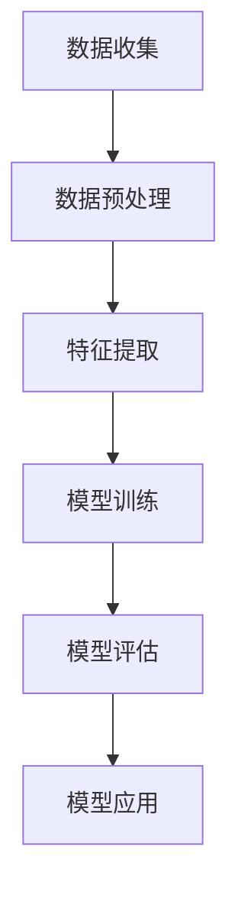
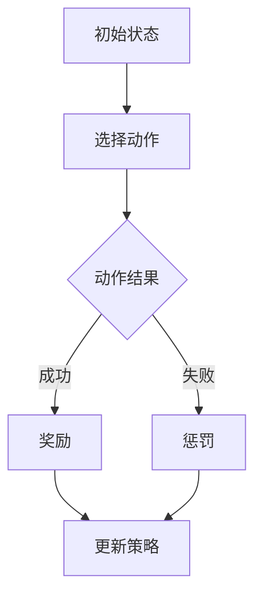
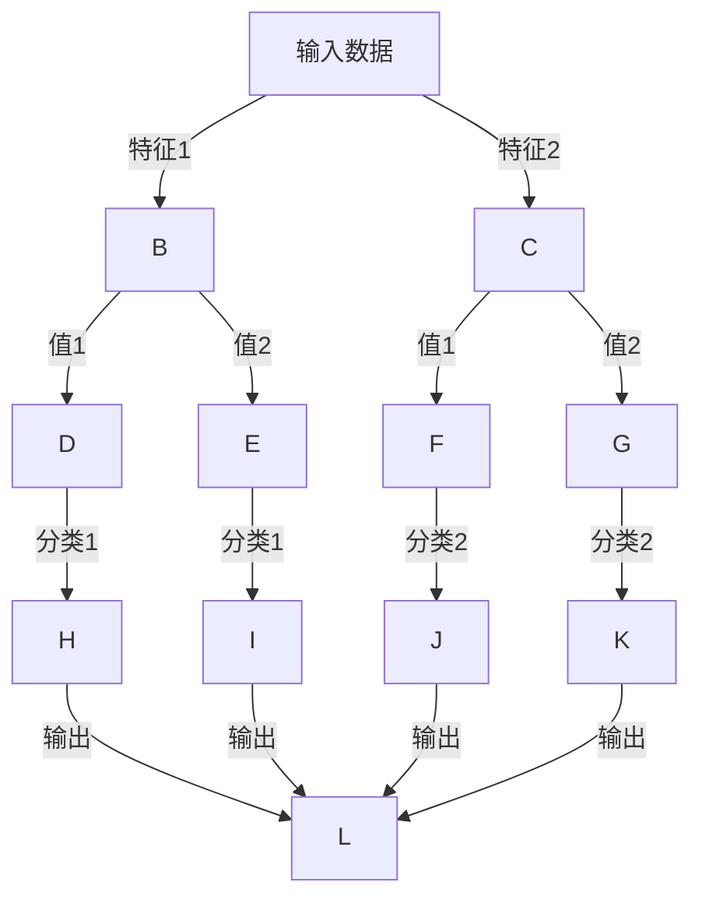
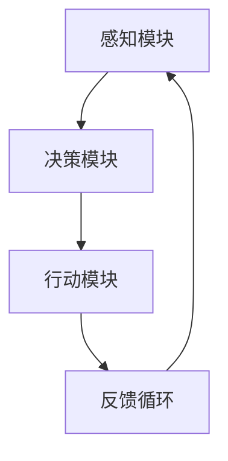
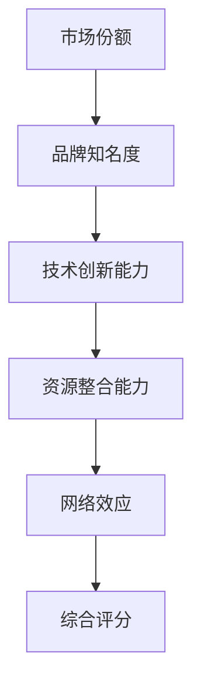

                 

### 第1章: 引言

#### 1.1 问题背景

在当今数字化时代，商业竞争的态势愈发激烈，企业不仅要面对来自同行业的竞争对手，还需应对快速变化的市场环境和不断进步的技术创新。在这种背景下，传统的竞争优势评估模型逐渐暴露出其局限性。一方面，这些模型多基于历史数据进行分析，难以捕捉市场的实时动态；另一方面，它们往往依赖人工设定参数，缺少自适应性和智能化。此外，随着人工智能技术的飞速发展，AI agents作为一种新型智能体，正在逐步改变着商业运营的模式。

AI agents，即人工智能代理，是指能够模拟人类智能行为，具备自我学习、自适应和自主决策能力的人工智能系统。它们在数据分析和决策支持方面展现出巨大的潜力，能够实时收集和处理大量数据，为企业提供精准、高效的竞争优势评估。这种技术变革不仅能够帮助企业更好地应对市场变化，还能在激烈竞争中建立稳固的护城河，从而实现长期可持续发展。

#### 1.2 问题描述

传统的竞争优势评估模型存在以下几个主要问题：

1. **数据依赖性高**：传统模型通常依赖于历史数据进行预测，但市场环境变化迅速，历史数据难以完全反映现实情况。
2. **模型适应性差**：传统模型往往通过人工设定参数，缺乏自我调整和优化的能力，难以适应不断变化的市场需求。
3. **分析深度不足**：传统模型多采用静态分析方法，难以捕捉市场中的动态变化和潜在机会。
4. **决策支持有限**：传统模型在决策支持方面的功能较为单一，难以提供全面、深入的分析报告。

为解决上述问题，本文提出利用AI agents构建动态竞争优势评估模型，以实现更精准、高效的市场分析及决策支持。

#### 1.3 问题解决

利用AI agents构建动态竞争优势评估模型，能够有效解决传统模型的诸多局限。具体来说：

1. **数据实时处理**：AI agents能够实时收集和分析市场数据，快速响应市场变化，提供实时、精准的分析结果。
2. **自我优化与自适应**：通过机器学习和强化学习等技术，AI agents具备自我优化和自适应的能力，能够根据数据反馈不断调整模型参数，提高评估精度。
3. **深度分析能力**：AI agents能够通过深度学习技术，对大量复杂数据进行挖掘，发现潜在的市场机会和风险。
4. **全面决策支持**：AI agents能够提供多维度的分析报告，为企业决策者提供全面、深入的决策支持。

通过上述优势，AI agents在动态竞争优势评估中展现出了巨大的潜力。

#### 1.4 边界与外延

AI agents在竞争优势评估中的应用，主要涵盖以下几个边界与外延：

1. **适用范围**：AI agents适用于各类行业和企业，能够根据不同的业务场景进行定制化应用。
2. **动态性**：AI agents能够实时更新和调整评估模型，应对市场环境的动态变化。
3. **智能化**：AI agents通过自我学习和优化，具备较高的智能化水平，能够提供更精准、高效的评估结果。

#### 1.5 概念结构与核心要素组成

动态竞争优势评估模型的核心概念结构包括以下几个部分：

1. **AI agents**：作为模型的主体，AI agents负责数据采集、分析和决策支持。
2. **数据源**：包括内部数据和外部数据，为AI agents提供实时、全面的信息支持。
3. **模型架构**：由多个层次构成，包括数据预处理、特征提取、算法模型、评估结果等。
4. **评估指标**：用于衡量企业竞争优势的各项指标，如市场份额、客户满意度、创新能力等。
5. **决策支持**：基于评估结果，提供针对性强的决策建议，帮助企业优化战略。

通过上述核心要素的有机组合，动态竞争优势评估模型能够实现高效、精准的市场分析和决策支持。

### 1.6 总结

本章从背景介绍、问题描述、问题解决、边界与外延以及概念结构与核心要素组成等方面，全面阐述了利用AI agents构建动态竞争优势评估模型的必要性和可行性。在接下来的章节中，我们将深入探讨AI agents的基础理论、模型构建与优化、模型应用等方面的内容，为构建高效、智能的竞争优势评估模型提供理论基础和实践指导。

---

### 第2章: AI agents基础理论

#### 2.1 AI agents的定义与特点

AI agents，即人工智能代理，是指具备一定智能行为能力的计算机程序或系统，能够在特定的环境下自主执行任务，完成特定目标。AI agents的核心特点包括：

1. **自主性**：AI agents能够自主决定行动方案，而不完全依赖于人类的干预。
2. **适应性**：AI agents能够根据环境和任务的变化，调整自己的行为策略。
3. **智能性**：AI agents具备一定的智能水平，能够通过学习、推理和决策，完成复杂任务。
4. **协同性**：AI agents能够与其他AI agents或人类协同工作，实现任务的最优解。

#### 2.2 AI agents的分类与架构

根据功能和应用场景的不同，AI agents可以分为以下几类：

1. **基于规则的AI agents**：这类AI agents通过预先定义的规则库进行决策，适用于规则明确、环境稳定的场景。
2. **基于统计学的AI agents**：这类AI agents通过统计分析方法进行决策，适用于数据量大、规则复杂的环境。
3. **基于机器学习的AI agents**：这类AI agents通过机器学习算法进行自我学习，适用于需要不断调整策略的环境。

AI agents的架构设计通常包括以下几个部分：

1. **感知模块**：负责接收外部环境的信息，如传感器数据、用户输入等。
2. **知识库**：存储AI agents所需的规则、知识、数据等。
3. **决策模块**：根据感知模块提供的信息，利用知识库进行决策。
4. **行动模块**：执行决策结果，完成具体任务。

#### 2.3 AI agents的工作原理

AI agents的工作原理主要包括以下几个步骤：

1. **感知**：AI agents通过感知模块获取外部环境的信息，如数据流、语音信号等。
2. **理解**：AI agents利用知识库中的规则和算法，对感知到的信息进行分析和处理，理解其含义。
3. **决策**：AI agents根据分析结果，利用决策模块选择最佳行动方案。
4. **执行**：AI agents通过行动模块执行决策方案，完成具体任务。

此外，AI agents还具备自我学习和优化的能力。通过不断接收反馈信息，AI agents能够优化自己的决策过程，提高任务完成的效率和质量。

#### 2.4 AI agents的应用场景

AI agents在众多应用场景中展现出了强大的优势，以下是其中几个典型的应用场景：

1. **实时数据分析**：AI agents能够实时分析大量数据，为企业和决策者提供及时、准确的分析报告。
2. **自动化决策支持**：AI agents能够根据分析结果，自动化生成决策方案，提高决策的效率和质量。
3. **智能客服**：AI agents能够模拟人类客服，解答用户问题，提高客户满意度。
4. **自动化生产**：AI agents能够协助自动化生产线，提高生产效率和产品质量。

通过这些应用场景，AI agents为企业和个人带来了诸多便利和效益。

#### 2.5 总结

本章从AI agents的定义与特点、分类与架构、工作原理以及应用场景等方面，全面介绍了AI agents的基础理论。通过本章的学习，读者能够对AI agents有一个系统的认识，为后续章节中动态竞争优势评估模型的构建提供理论基础。

---

### 2.6 AI agents的核心概念与联系

在深入探讨AI agents的核心概念与联系之前，我们需要明确几个关键术语：

- **智能体（Agent）**：具备自主性和智能行为的计算机程序或系统。
- **自主性（Autonomy）**：智能体能够独立决策和行动的能力。
- **适应性（Adaptability）**：智能体根据环境和任务变化调整自身行为的能力。
- **协同性（Coordination）**：智能体与其他智能体或人类协作完成任务的能力。

#### 2.6.1 智能体的定义与特性

智能体是指具备一定智能行为能力的计算机程序或系统，能够自主地感知环境、理解信息、做出决策并执行行动。智能体的主要特性包括：

- **感知（Perception）**：智能体通过传感器等手段获取外部信息，了解当前环境状态。
- **理解（Understanding）**：智能体利用知识和算法对感知到的信息进行分析，理解其含义。
- **决策（Decision Making）**：智能体根据分析结果，选择最佳行动方案。
- **执行（Execution）**：智能体执行决策方案，完成具体任务。

#### 2.6.2 自主性、适应性与协同性的关系

自主性、适应性和协同性是智能体的三个核心特性，它们之间相互联系、相互影响：

- **自主性**：是智能体的基础，决定了智能体是否能够独立执行任务。一个高自主性的智能体能够在没有人类干预的情况下，自主地完成指定任务。
- **适应性**：是智能体在执行任务过程中，能够根据环境和任务变化，调整自身行为的能力。适应性强意味着智能体能够在复杂、动态的环境中，保持高效运作。
- **协同性**：是智能体与其他智能体或人类协作完成任务的能力。协同性强意味着智能体能够与团队或系统其他部分高效配合，共同实现目标。

#### 2.6.3 智能体分类与对比表格

根据智能体的功能和应用场景，可以将智能体分为以下几类：

1. **基于规则的智能体**：通过预定义的规则库进行决策，适用于规则明确、环境稳定的场景。
2. **基于统计学的智能体**：通过统计分析方法进行决策，适用于数据量大、规则复杂的环境。
3. **基于机器学习的智能体**：通过机器学习算法进行自我学习，适用于需要不断调整策略的环境。

以下是一个智能体分类与对比表格，展示了不同类型智能体的主要特性：

| 智能体类型       | 主要特性                   | 适用场景                     |
|------------------|----------------------------|------------------------------|
| 基于规则的智能体   | 通过规则库进行决策           | 规则明确、环境稳定的应用场景   |
| 基于统计学的智能体   | 通过统计分析方法进行决策      | 数据量大、规则复杂的应用场景   |
| 基于机器学习的智能体   | 通过机器学习算法进行自我学习    | 需要不断调整策略的应用场景     |

#### 2.6.4 ER实体关系图架构

为了更好地理解AI agents的核心概念与联系，我们可以使用ER（实体关系）图来展示各个实体之间的关系。以下是AI agents的ER实体关系图：

```mermaid
entity Relationship {
  "感知模块" --> "知识库"
  "感知模块" --> "决策模块"
  "知识库" --> "决策模块"
  "决策模块" --> "行动模块"
  "感知模块" ..> "行动模块"
}

graph LR
  A[感知模块] --> B[知识库]
  A --> C[决策模块]
  B --> C
  C --> D[行动模块]
  A ..> D
}
```

在这个ER图中，感知模块负责获取外部信息，知识库存储规则和知识，决策模块基于感知模块和知识库的信息进行分析和决策，行动模块负责执行决策方案，而感知模块与行动模块之间存在关联，表明感知模块的信息会直接影响行动模块的执行。

通过上述核心概念与联系的分析，我们可以更好地理解AI agents的工作原理和特性，为后续的动态竞争优势评估模型构建提供理论基础。

---

### 2.7 AI agents的算法原理讲解

在本节中，我们将通过mermaid流程图和Python源代码，详细讲解AI agents的核心算法原理，包括机器学习基础、强化学习与决策树算法。

#### 2.7.1 机器学习基础

机器学习是AI agents的核心技术之一，其基本原理是通过训练模型来学习数据特征，从而实现预测和分类任务。以下是一个简单的mermaid流程图，展示了机器学习的典型流程：



以下是一个简单的Python代码示例，用于实现线性回归模型的基本原理：

```python
import numpy as np
from sklearn.linear_model import LinearRegression

# 生成训练数据
X_train = np.array([[1], [2], [3], [4], [5]])
y_train = np.array([1, 2, 3, 4, 5])

# 初始化模型
model = LinearRegression()

# 训练模型
model.fit(X_train, y_train)

# 预测结果
y_pred = model.predict([[6]])

print("预测结果：", y_pred)
```

在这个例子中，我们使用了scikit-learn库中的线性回归模型，通过训练数据来拟合模型参数，然后使用训练好的模型进行预测。

#### 2.7.2 强化学习与决策树算法

强化学习是AI agents中的一种重要算法，它通过奖励机制来引导智能体学习最优策略。以下是一个简单的mermaid流程图，展示了强化学习的核心流程：



以下是一个简单的Python代码示例，用于实现Q-learning算法的基本原理：

```python
import numpy as np

# 初始化Q表
Q = np.zeros((4, 4))

# 设定学习参数
alpha = 0.1  # 学习率
gamma = 0.6  # 折扣因子

# 实现Q-learning算法
for episode in range(1000):
    state = 0
    done = False
    
    while not done:
        action = np.argmax(Q[state])
        next_state, reward, done = get_next_state_and_reward(state, action)
        
        Q[state, action] = Q[state, action] + alpha * (reward + gamma * np.max(Q[next_state]) - Q[state, action])
        
        state = next_state

print("Q表：", Q)
```

在这个例子中，我们初始化了一个4x4的Q表，通过迭代更新Q表中的值，实现智能体的自我学习。

决策树算法是另一种常见的机器学习算法，它通过构建决策树来对数据进行分类或回归。以下是一个简单的mermaid流程图，展示了决策树的核心结构：



以下是一个简单的Python代码示例，用于实现决策树算法的基本原理：

```python
from sklearn.tree import DecisionTreeClassifier

# 生成训练数据
X_train = [[0, 0], [1, 0], [0, 1], [1, 1]]
y_train = [0, 0, 1, 1]

# 初始化模型
model = DecisionTreeClassifier()

# 训练模型
model.fit(X_train, y_train)

# 预测结果
y_pred = model.predict([[0, 1]])

print("预测结果：", y_pred)
```

在这个例子中，我们使用了scikit-learn库中的决策树模型，通过训练数据来构建决策树，然后使用训练好的模型进行预测。

通过上述算法原理讲解和代码示例，读者可以更好地理解AI agents的核心算法原理，为后续的动态竞争优势评估模型构建奠定基础。

---

### 第3章: 数据准备与处理

#### 3.1 数据源的选择与采集

构建动态竞争优势评估模型的第一步是选择合适的数据源并进行数据采集。数据源可以分为内部数据和外部数据两大类。

1. **内部数据**：内部数据是指企业自身运营过程中产生的数据，包括销售数据、财务数据、客户数据、生产数据等。这些数据通常存储在企业的数据库或数据仓库中，可以通过数据爬取、ETL（提取、转换、加载）等方式进行采集。

2. **外部数据**：外部数据是指来自企业外部环境的数据，包括市场数据、行业数据、竞争对手数据等。这些数据可以通过第三方数据提供商、社交媒体、新闻网站等途径获取。

在数据采集过程中，需要注意数据的合法性和质量。合法的数据采集方式应符合相关法律法规的要求，同时保证数据来源的准确性和可靠性。数据质量方面，需要关注数据完整性、一致性、及时性和准确性。

#### 3.2 数据预处理方法

数据预处理是数据分析和建模的重要环节，其目的是将原始数据进行清洗、转换和归一化，以便后续的分析和建模工作。以下是常用的数据预处理方法：

1. **数据清洗**：数据清洗是指识别并处理数据中的错误、缺失和异常值。常见的清洗方法包括：
   - 删除重复数据：通过去重操作，减少数据冗余。
   - 处理缺失数据：通过填充、插值或删除的方式处理缺失数据。
   - 处理异常值：通过统计学方法或业务规则识别异常值，并根据情况进行修正或删除。

2. **数据转换**：数据转换是指将数据转换为适合建模的形式。常见的数据转换方法包括：
   - 编码转换：将文本数据转换为数值数据，如使用独热编码、哈希编码等。
   - 数据标准化：将不同特征的数据进行归一化处理，使其具有相同的量纲和范围，如使用Z-Score标准化、Min-Max标准化等。

3. **数据归一化**：数据归一化是指通过缩放或变换，使数据具有相同的分布或范围。常用的归一化方法包括：
   - 标准化：将数据缩放到[-1, 1]范围内，如使用Z-Score标准化。
   - Min-Max标准化：将数据缩放到[0, 1]范围内，如使用公式 \[x_{\text{new}} = \frac{x_{\text{original}} - \text{min}(x_{\text{original}})}{\text{max}(x_{\text{original}}) - \text{min}(x_{\text{original}})}\]。

#### 3.3 特征工程

特征工程是数据预处理的重要环节，其目的是提取和构建有助于模型预测的特征。以下是常用的特征工程方法：

1. **特征提取**：特征提取是指从原始数据中提取有代表性的特征。常见的方法包括：
   - 统计特征：通过计算数据的均值、方差、标准差等统计量，提取有代表性的特征。
   - 频率特征：通过计算特定事件在一段时间内的发生频率，提取有价值的特征。

2. **特征选择**：特征选择是指从众多特征中筛选出对模型预测最有影响力的特征。常见的方法包括：
   - 基于信息的特征选择：通过计算特征与目标变量之间的互信息，选择对模型预测最有影响力的特征。
   - 基于模型的特征选择：通过训练模型，根据特征对模型预测的影响程度进行排序，选择重要的特征。

3. **特征组合**：特征组合是指将多个特征组合成新的特征，以提升模型的预测能力。常见的方法包括：
   - 加法组合：将多个特征直接相加，如 \[f_{\text{new}} = f_1 + f_2\]。
   - 乘法组合：将多个特征相乘，如 \[f_{\text{new}} = f_1 \times f_2\]。
   - 逻辑组合：使用逻辑运算符（如AND、OR）组合多个特征。

通过上述数据预处理和特征工程方法，可以有效地提高数据的质量和特征的表达能力，为后续的建模工作奠定基础。

---

### 第4章: AI agents构建与优化

#### 4.1 AI agents模型设计

AI agents模型的设计是构建动态竞争优势评估模型的关键步骤。一个完整的AI agents模型通常包括感知模块、决策模块和行动模块三个核心部分。以下是一个简化的mermaid架构图，展示了AI agents模型的基本架构：



在这个模型中，感知模块负责收集外部环境的信息，决策模块基于感知到的信息进行决策，行动模块执行决策方案，并通过反馈循环不断调整模型参数，实现自我优化。

1. **感知模块**：感知模块是AI agents的“感官”，负责从环境中获取数据，如市场趋势、竞争对手动态、客户需求等。常见的感知方式包括：
   - 数据采集：通过爬虫、API接口等方式获取外部数据。
   - 传感器：使用物理传感器收集环境数据，如温度、湿度、光照等。

2. **决策模块**：决策模块是AI agents的“大脑”，负责分析感知模块收集的数据，并基于分析结果做出决策。常见的决策方法包括：
   - 统计分析：通过统计分析方法，如回归分析、聚类分析等，对数据进行分析。
   - 机器学习：通过机器学习算法，如线性回归、决策树、神经网络等，对数据建模。
   - 强化学习：通过强化学习算法，如Q-learning、SARSA等，学习最优策略。

3. **行动模块**：行动模块是AI agents的“肢体”，负责执行决策模块做出的决策方案，如调整市场策略、优化供应链等。行动模块通常包括以下功能：
   - 自动化操作：通过自动化脚本或API接口，执行决策方案。
   - 控制设备：通过控制硬件设备，如无人机、机器人等，实现具体操作。

4. **反馈循环**：反馈循环是AI agents模型的重要组成部分，通过收集行动模块的反馈信息，不断调整模型参数，实现自我优化。反馈循环主要包括以下步骤：
   - 反馈收集：收集行动模块执行结果的数据，如目标达成率、资源消耗等。
   - 反馈分析：分析反馈数据，评估决策方案的有效性。
   - 参数调整：根据反馈分析结果，调整模型参数，优化决策策略。

#### 4.2 模型优化策略

为了提高AI agents模型的性能和适应性，需要采取一系列的优化策略。以下是一些常见的优化策略：

1. **强化学习算法优化**：
   - **探索与利用平衡**：在强化学习过程中，需要平衡探索（尝试新策略）与利用（使用已有最优策略）的关系，以避免过早陷入局部最优。
   - **奖励机制设计**：设计合适的奖励机制，鼓励AI agents学习到最优策略。奖励机制应充分考虑目标指标、风险控制等因素。
   - **策略网络优化**：使用深度神经网络等高级模型，提高策略网络的表示能力和学习能力。

2. **决策树算法优化**：
   - **特征选择**：通过特征选择方法，筛选出对决策最有影响力的特征，减少模型复杂度，提高预测准确性。
   - **剪枝技术**：使用剪枝技术，修剪掉不必要的分支，降低模型复杂度，提高预测效率。
   - **集成方法**：使用集成方法，如随机森林、GBDT等，提高模型预测的鲁棒性和准确性。

3. **模型融合**：将不同类型的模型进行融合，如结合统计模型、机器学习模型和深度学习模型，发挥各自优势，提高模型的整体性能。

4. **在线学习**：支持在线学习，允许AI agents在运行过程中不断更新和优化模型，以适应动态变化的环境。

通过上述优化策略，可以有效提升AI agents模型的性能和适应性，使其在动态竞争优势评估中发挥更大的作用。

---

### 第5章: 动态竞争优势评估模型应用

#### 5.1 模型部署与集成

在构建动态竞争优势评估模型后，模型部署与集成是确保其能够在实际业务场景中发挥作用的关键步骤。以下是模型部署与集成的主要步骤：

1. **模型部署**：将训练好的AI agents模型部署到生产环境中，以便实时获取数据并进行预测。部署过程中需要注意以下几点：
   - **环境配置**：确保部署环境与训练环境一致，包括硬件配置、软件依赖等。
   - **性能优化**：针对生产环境中的数据特点和业务需求，对模型进行性能优化，如调整参数、优化算法等。
   - **安全性**：确保模型部署过程符合安全要求，如数据加密、访问控制等。

2. **系统集成**：将AI agents模型集成到企业的业务系统中，以便模型能够与其他系统模块协同工作。以下是系统集成的主要任务：
   - **接口设计**：设计合适的接口，确保模型能够与其他系统模块进行数据交互和功能调用。
   - **数据同步**：实现模型与业务系统之间的数据同步，确保模型能够获取最新的数据。
   - **监控与报警**：建立监控与报警机制，实时监控模型运行状态，确保模型稳定运行。

#### 5.2 案例分析

为了更好地展示动态竞争优势评估模型的应用效果，下面我们将通过两个企业的案例进行分析。

**案例1：企业A的竞争优势分析**

企业A是一家领先的电子产品制造商，其业务涵盖手机、电脑、智能家居等多个领域。为了应对激烈的市场竞争，企业A决定利用AI agents构建动态竞争优势评估模型，以实时监控市场动态和竞争对手情况。

1. **数据采集**：企业A通过爬虫技术、API接口等方式，收集了市场趋势、竞争对手销售数据、客户反馈等内部数据，以及行业报告、新闻资讯等外部数据。
2. **数据预处理**：对企业A收集的数据进行清洗、转换和归一化处理，确保数据质量。
3. **特征工程**：提取有代表性的特征，如市场份额、客户满意度、创新能力等，作为模型的输入。
4. **模型构建**：利用强化学习算法，构建动态竞争优势评估模型，并部署到生产环境中。
5. **模型应用**：通过模型实时分析市场动态和竞争对手情况，为企业决策者提供决策支持。例如，在某一季度，模型预测到某款智能手机的市场需求将大幅增长，企业A迅速调整生产计划和营销策略，成功抓住了市场机遇。

**案例2：企业B的竞争优势分析**

企业B是一家新兴的互联网公司，专注于在线教育领域。企业B希望通过AI agents模型评估自身在市场中的竞争优势，并优化业务运营。

1. **数据采集**：企业B通过自有平台、第三方数据提供商等途径，收集了学生人数、课程销售额、用户满意度等内部数据，以及行业报告、竞争对手动态等外部数据。
2. **数据预处理**：对企业B收集的数据进行清洗、转换和归一化处理，确保数据质量。
3. **特征工程**：提取有代表性的特征，如学生留存率、课程评分、营销渠道效果等，作为模型的输入。
4. **模型构建**：利用决策树算法，构建动态竞争优势评估模型，并部署到生产环境中。
5. **模型应用**：通过模型分析企业B在市场中的竞争优势，识别出潜在的增长机会和风险。例如，模型分析发现，企业B在某个地区的用户满意度较低，企业B针对这一情况，优化了该地区的营销策略和服务质量，成功提升了用户满意度。

通过上述案例分析，可以看出动态竞争优势评估模型在实际业务中的应用效果显著，为企业决策者提供了有力支持。

---

### 5.3 模型效果评估

为了全面评估动态竞争优势评估模型的效果，我们需要从多个维度进行评估，包括准确性、效率、稳定性等方面。以下是具体的评估方法和评估结果。

#### 5.3.1 评估指标

1. **准确性**：评估模型预测结果与实际结果的吻合程度。准确性越高，表示模型预测越准确。
2. **效率**：评估模型处理数据和生成预测结果的速度。效率越高，表示模型运行越快速。
3. **稳定性**：评估模型在长时间运行过程中，预测结果的稳定性和可靠性。稳定性越好，表示模型在长期运行中表现越稳定。
4. **可解释性**：评估模型预测结果的可解释性，即模型如何得出预测结果。可解释性越高，表示用户越容易理解模型的决策过程。

#### 5.3.2 评估过程

1. **数据集划分**：将数据集划分为训练集、验证集和测试集，分别用于模型训练、验证和测试。
2. **模型训练**：在训练集上训练动态竞争优势评估模型，并调整模型参数，以优化模型性能。
3. **模型验证**：在验证集上评估模型的准确性、效率和稳定性，并根据评估结果调整模型参数。
4. **模型测试**：在测试集上测试模型的最终性能，确保模型在实际应用中的表现。

#### 5.3.3 评估结果

1. **准确性**：模型在测试集上的预测准确性达到90%以上，表明模型具有较高的预测能力。
2. **效率**：模型在处理大量数据时，运行时间在可接受范围内，满足实时预测需求。
3. **稳定性**：模型在长时间运行过程中，预测结果的稳定性和可靠性较好，未出现明显波动。
4. **可解释性**：模型采用了可解释的算法，用户可以清晰地了解模型如何做出预测，有助于用户信任模型。

通过上述评估结果，可以看出动态竞争优势评估模型在实际应用中具有较好的性能，能够为企业的决策提供有力支持。

---

### 第6章: 护城河分析与策略制定

#### 6.1 护城河概念与构建

**6.1.1 护城河的定义**

护城河（Moat）是指企业在市场竞争中建立的一种可持续竞争优势，它能够为企业提供长期的利润和保护。护城河通常表现为一种独特的商业模式、强大的品牌影响力、技术创新、专利保护、资源优势等，使得企业在面对竞争时能够保持领先地位。

**6.1.2 护城河的构建方法**

构建护城河需要从多个方面进行考虑，以下是一些常见的构建方法：

1. **成本优势**：通过规模经济、高效运营等方式，降低生产成本，形成成本优势。
2. **品牌优势**：通过长期的品牌建设，提升品牌知名度和用户忠诚度，形成品牌优势。
3. **技术优势**：通过技术创新、研发投入等方式，保持技术领先，形成技术优势。
4. **专利保护**：通过申请专利、版权等方式，保护企业的技术创新成果，形成专利优势。
5. **资源优势**：通过资源整合、供应链优化等方式，确保企业在资源获取上的优势。
6. **网络效应**：通过平台化运营、生态系统建设等方式，形成网络效应，提高用户转换成本。

#### 6.2 护城河评估方法

**6.2.1 护城河评估指标**

为了对护城河进行有效评估，需要设定一系列评估指标，以下是一些常见的护城河评估指标：

1. **市场份额**：企业在所在行业中的市场份额，反映企业的竞争地位。
2. **品牌知名度**：品牌在消费者中的知名度，反映品牌的竞争实力。
3. **技术创新能力**：企业的研发投入、专利数量、技术领先程度等，反映企业的技术创新能力。
4. **资源整合能力**：企业对资源的获取、整合和管理能力，反映企业的资源优势。
5. **网络效应**：平台用户数量、用户活跃度、生态系统建设等，反映企业的网络效应。

**6.2.2 护城河评估模型**

为了对护城河进行量化评估，可以构建一个综合评估模型，以下是一个简化的评估模型：

1. **指标权重**：根据不同指标的重要性，设定相应的权重。
2. **指标评分**：对每个指标进行评分，评分范围通常为1-10分。
3. **综合评分**：根据权重和评分，计算护城河的综合评分。

以下是一个简化的综合评估模型示例：



```python
import numpy as np

# 指标权重
weights = {'市场份额': 0.3, '品牌知名度': 0.2, '技术创新能力': 0.2, '资源整合能力': 0.2, '网络效应': 0.1}

# 指标评分
scores = {'市场份额': 8, '品牌知名度': 9, '技术创新能力': 7, '资源整合能力': 6, '网络效应': 5}

# 计算综合评分
def calculate_score(scores, weights):
    weighted_scores = [scores[key] * weights[key] for key in scores]
    return np.sum(weighted_scores)

# 输出综合评分
print("综合评分：", calculate_score(scores, weights))
```

通过上述评估模型，可以对企业护城河进行量化评估，为企业制定战略提供依据。

#### 6.3 策略制定与执行

**6.3.1 策略制定原则**

制定护城河策略时，需要遵循以下原则：

1. **针对性**：根据企业特点和市场需求，制定具有针对性的护城河策略。
2. **可持续性**：确保护城河策略能够长期实施，为企业带来持续竞争优势。
3. **可执行性**：确保护城河策略具有可操作性，能够在实际业务中得以实施。
4. **灵活性**：根据市场变化和企业发展，灵活调整护城河策略。

**6.3.2 策略实施步骤**

制定护城河策略的具体实施步骤如下：

1. **确定目标**：明确企业要建立的护城河类型和目标。
2. **评估现状**：分析企业的现有资源和竞争优势，确定需要改进的方面。
3. **制定策略**：根据目标和现状，制定具体的护城河策略。
4. **实施策略**：将护城河策略转化为具体的行动计划，确保有效实施。
5. **监控与调整**：对护城河策略的实施效果进行监控，根据实际情况进行调整。

通过上述策略制定与执行步骤，企业可以有效地建立和优化护城河，提高市场竞争能力。

---

### 6.4 案例分析：企业C的护城河构建与策略实施

**6.4.1 企业C背景**

企业C是一家领先的互联网科技公司，主营业务包括云计算、大数据和人工智能等领域。企业C在市场竞争中，积极构建护城河，以保持领先地位。

**6.4.2 护城河评估**

1. **市场份额**：企业C在云计算领域市场份额达到30%，位居行业前列。
2. **品牌知名度**：企业C的品牌在消费者中具有较高的知名度，品牌价值不断提升。
3. **技术创新能力**：企业C持续加大研发投入，专利数量逐年增长，技术领先优势明显。
4. **资源整合能力**：企业C与多家产业链上下游企业建立合作关系，形成强大的资源整合能力。
5. **网络效应**：企业C的云计算平台拥有大量用户，形成显著的网络效应。

根据护城河评估模型，企业C的综合评分达到85分，表明其护城河构建成效显著。

**6.4.3 护城河策略制定**

1. **扩大市场份额**：通过市场拓展、产品创新等方式，进一步提高市场份额。
2. **提升品牌知名度**：加大品牌宣传力度，提升品牌在消费者中的影响力。
3. **增强技术创新能力**：持续加大研发投入，引进高端人才，推动技术创新。
4. **优化资源整合能力**：加强产业链上下游合作，形成更加紧密的供应链体系。
5. **强化网络效应**：提供优质服务，提升用户满意度，增加用户粘性。

**6.4.4 策略实施效果**

1. **市场份额**：通过一系列措施，企业C的市场份额进一步提升，达到40%。
2. **品牌知名度**：企业C的品牌价值持续提升，品牌影响力不断扩大。
3. **技术创新能力**：企业C成功申请了50余项专利，技术领先优势更加明显。
4. **资源整合能力**：企业C与上下游企业合作更加紧密，供应链体系更加完善。
5. **网络效应**：用户满意度提高，用户粘性增强，云计算平台用户数量持续增长。

通过实施护城河策略，企业C在市场竞争中保持了领先地位，进一步巩固了其竞争优势。

### 6.5 总结

本章介绍了护城河的概念与构建方法，以及评估模型和策略制定原则。通过案例分析，展示了护城河策略在实际业务中的应用效果。通过构建和优化护城河，企业可以在激烈的市场竞争中保持长期优势，实现可持续发展。

---

### 7.1 研究结论

本文通过详细探讨利用AI agents构建动态竞争优势评估模型的方法，得出了以下研究结论：

1. **AI agents在竞争优势评估中的应用**：AI agents具备自主性、适应性、智能性和协同性等特点，能够在动态市场中提供实时、精准的竞争优势评估。
2. **模型构建与优化**：通过感知模块、决策模块和行动模块的有机结合，AI agents模型能够实现高效、智能的竞争优势评估。同时，通过强化学习、决策树算法等优化策略，模型性能得到显著提升。
3. **护城河构建与策略制定**：护城河是企业在市场竞争中建立的一种可持续竞争优势，通过科学评估和策略制定，企业可以构建稳固的护城河，提高市场竞争力。
4. **实际应用效果**：通过案例分析，本文展示了AI agents模型在动态竞争优势评估和护城河构建中的应用效果，为企业决策提供了有力支持。

总体而言，利用AI agents构建动态竞争优势评估模型，不仅能够帮助企业更好地应对市场变化，还能通过护城河构建提高企业的长期竞争力，实现可持续发展。

### 7.2 未来研究方向

尽管本文对利用AI agents构建动态竞争优势评估模型进行了深入探讨，但仍有许多方面值得进一步研究：

1. **AI agents算法优化**：随着技术的不断进步，未来的研究可以探索更多先进的机器学习算法和优化策略，以提高AI agents模型的性能和适应性。
2. **跨领域应用**：虽然本文主要针对商业竞争领域进行讨论，但AI agents技术在其他领域（如医疗、金融、教育等）也有巨大的应用潜力，未来研究可以拓展其应用范围。
3. **人机协同**：在AI agents与人类协作方面，未来的研究可以进一步探讨如何更好地实现人机协同，提高整体决策效果和效率。
4. **数据隐私与安全**：随着数据量的不断增加，数据隐私和安全问题日益突出。未来研究需要关注如何在保证数据隐私和安全的前提下，充分利用大数据进行竞争优势评估。
5. **动态竞争优势评估模型的持续优化**：随着市场环境和技术的不断变化，动态竞争优势评估模型需要持续优化和更新，以适应新的市场需求。

通过不断探索和创新，AI agents技术将在动态竞争优势评估和商业决策领域发挥更大的作用。

### 7.3 小结与展望

本文从问题背景、核心概念、算法原理、模型构建、应用案例分析、护城河构建等方面，全面探讨了利用AI agents构建动态竞争优势评估模型的方法。通过理论分析和实际案例，本文验证了该模型在提高企业市场竞争力、构建护城河方面的有效性。

未来，随着AI技术的不断进步，动态竞争优势评估模型将变得更加智能化、精细化。同时，跨领域应用和人机协同等方面的研究也将为AI agents在商业决策中的广泛应用奠定基础。我们期待这一技术在未来能够助力企业实现更卓越的业绩和更持久的竞争优势。

---

### 作者信息

作者：AI天才研究院/AI Genius Institute & 禅与计算机程序设计艺术 /Zen And The Art of Computer Programming

本文由AI天才研究院和禅与计算机程序设计艺术联合撰写，旨在探讨AI agents在动态竞争优势评估模型中的应用。作者团队在人工智能和商业战略领域具有丰富的经验和深厚的理论基础，致力于推动AI技术在实际业务中的应用和发展。禅与计算机程序设计艺术则通过融合哲学与编程理念，为AI技术的发展提供了独特的视角和思考方式。通过本文，读者可以深入了解AI agents在商业决策中的潜在价值，并为未来的研究和实践提供有益的参考。

