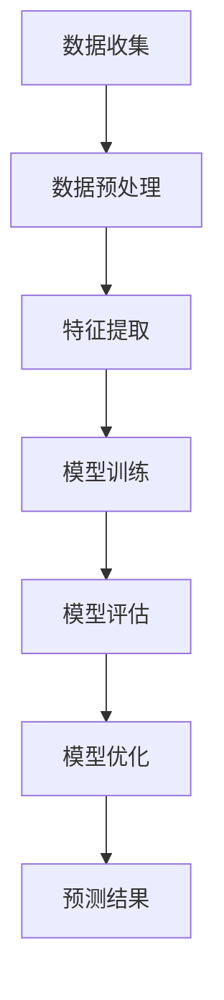
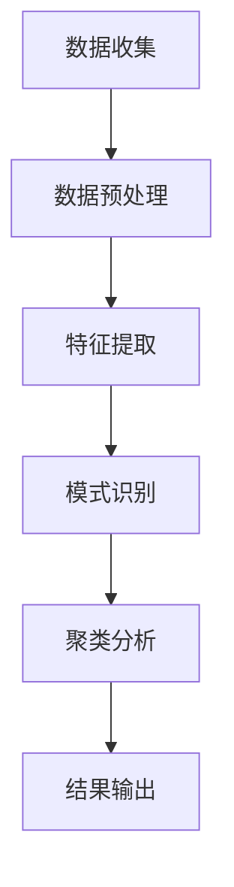
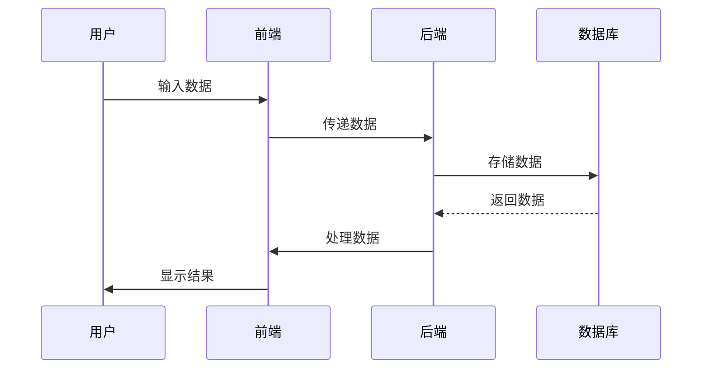

                 

### 目录大纲：利用AI构建自适应型公司文化评分系统：量化软实力

**文章标题：** 利用AI构建自适应型公司文化评分系统：量化软实力

**关键词：** AI、自适应型、公司文化评分系统、量化软实力、算法原理、系统架构、项目实战

**摘要：** 本文将探讨如何利用AI技术构建自适应型公司文化评分系统，通过量化的方式来评估和提升公司的软实力。我们将逐步介绍系统的背景、核心概念、算法原理、系统设计与实现，并提供实际项目案例和最佳实践，以帮助读者全面了解这一创新技术的应用。

**第一部分：AI构建自适应型公司文化评分系统概述**

1. **问题背景**
    - 随着企业竞争的加剧，公司文化的重要性日益凸显。
    - 传统公司文化评估方法较为主观，难以量化。
    - AI技术的引入为量化公司文化提供了新的可能。

2. **问题描述**
    - 如何利用AI技术构建一个自适应型公司文化评分系统？
    - 如何确保系统评估结果的准确性和公正性？

3. **问题解决**
    - 设计一个基于AI的自适应型公司文化评分系统。
    - 采用多种算法评估公司文化指标。
    - 系统具有自我学习和优化的能力。

4. **边界与外延**
    - 系统将涵盖公司文化的主要方面，如员工满意度、团队协作、创新氛围等。
    - 系统将适用于不同规模和类型的企业。

5. **概念结构与核心要素组成**
    - AI技术：机器学习、深度学习、自然语言处理等。
    - 数据来源：员工调查、社交媒体分析、企业内部数据等。
    - 评估指标：文化感知指标、行为指标、绩效指标等。

**第二部分：核心概念与联系**

6. **AI的定义与特点**
    - AI的定义：模拟人类智能的计算机系统。
    - AI的特点：自主学习、推理决策、适应变化。

7. **自适应型公司文化评分系统**
    - 系统定义：利用AI技术对公司文化进行量化评估的系统。
    - 系统特点：自适应、实时反馈、持续优化。

8. **相关算法介绍**
    - **算法A**：基于监督学习的公司文化评估算法。
    - **算法B**：基于无监督学习的公司文化评估算法。
    - **算法C**：基于深度学习的公司文化评估算法。

**第三部分：算法原理讲解**

9. **算法原理概述**
    - **监督学习算法**：输入特征和标签，输出预测结果。
    - **无监督学习算法**：仅输入特征，输出潜在结构和聚类结果。
    - **深度学习算法**：多层神经网络，自动提取特征。

10. **算法mermaid流程图展示**
    - **监督学习算法流程图**
    - **无监督学习算法流程图**
    - **深度学习算法流程图**

11. **Python源代码阐述**
    - **监督学习算法代码**
    - **无监督学习算法代码**
    - **深度学习算法代码**

12. **数学模型与公式讲解**
    - **监督学习算法数学模型**
    - **无监督学习算法数学模型**
    - **深度学习算法数学模型**

13. **举例说明**
    - **监督学习算法举例**
    - **无监督学习算法举例**
    - **深度学习算法举例**

**第四部分：系统分析与架构设计方案**

14. **问题场景介绍**
    - **企业类型**：初创企业、成熟企业。
    - **业务需求**：提升公司文化、改善员工体验。

15. **项目介绍**
    - **项目名称**：自适应型公司文化评分系统。
    - **项目背景**：企业文化建设需求。
    - **项目目标**：构建一个高效、准确的文化评分系统。

16. **系统功能设计**
    - **数据采集**：员工满意度调查、社交媒体分析。
    - **数据预处理**：数据清洗、归一化处理。
    - **模型训练与评估**：选择合适的算法和评估指标。

17. **系统架构设计**
    - **前端设计**：用户界面、交互逻辑。
    - **后端设计**：数据处理、模型训练、结果输出。

18. **系统接口设计**
    - **API设计**：数据输入输出、模型调用。
    - **安全性设计**：数据加密、权限管理。

19. **系统交互mermaid序列图**
    - **用户界面交互序列图**
    - **后端数据处理交互序列图**

**第五部分：项目实战**

20. **环境安装**
    - **安装Python**：3.8及以上版本。
    - **安装依赖库**：TensorFlow、Scikit-learn、Numpy等。

21. **系统核心实现源代码**
    - **数据采集与预处理代码**
    - **模型训练与评估代码**
    - **结果输出与展示代码**

22. **代码应用解读与分析**
    - **数据采集代码解读**
    - **模型训练代码解读**
    - **结果分析**

23. **实际案例分析和详细讲解剖析**
    - **案例背景**
    - **案例分析**
    - **详细剖析**

24. **项目小结**
    - **项目总结**
    - **经验教训**
    - **改进方向**

**第六部分：最佳实践 tips、小结、注意事项、拓展阅读**

25. **最佳实践 tips**
    - **数据质量**：确保数据准确性和完整性。
    - **算法选择**：根据业务需求选择合适的算法。
    - **模型调优**：通过交叉验证和超参数调整优化模型。

26. **小结**
    - **主要内容回顾**
    - **系统优势**

27. **注意事项**
    - **数据隐私**：保护员工隐私。
    - **算法透明性**：确保评估结果的可解释性。

28. **拓展阅读**
    - **相关研究论文**
    - **技术博客文章**
    - **行业报告**

**作者：**
AI天才研究院/AI Genius Institute & 禅与计算机程序设计艺术 /Zen And The Art of Computer Programming

### 文章正文开始

---

**第一部分：AI构建自适应型公司文化评分系统概述**

**1.1 问题背景**

在当今快速变化的市场环境中，公司文化已经成为企业竞争力的重要组成部分。一个积极、包容和协作的公司文化能够激发员工的创造力，提高团队协作效率，从而推动企业的持续发展。然而，公司文化的建设并非一蹴而就，它需要企业的长期投入和不断的调整。传统上，公司文化的评估主要依赖于管理层的主观判断和员工的反馈调查，这些方法虽然能够提供一定的参考，但往往缺乏量化和客观性。

随着人工智能（AI）技术的发展，尤其是机器学习、深度学习和自然语言处理等技术的成熟，我们有了新的可能来量化公司文化，从而更准确地评估其状态和趋势。AI技术的引入，可以帮助我们从海量数据中提取有价值的信息，实现对公司文化的自适应评估，并提供优化建议。

**1.2 问题描述**

公司文化评分系统的核心问题是如何利用AI技术，构建一个能够自适应调整、实时反馈并持续优化的评分系统。具体来说，系统需要解决以下几个问题：

- **数据收集与处理**：如何从各种渠道收集与企业文化相关的数据，并进行有效的预处理？
- **特征提取与建模**：如何从海量数据中提取出关键特征，并选择合适的算法进行建模？
- **评估与反馈**：如何利用模型评估公司文化的当前状态，并提供针对性的优化建议？
- **自适应调整**：如何使系统能够根据企业文化的变化，自适应地调整评估模型和策略？

**1.3 问题解决**

为了解决上述问题，我们需要构建一个基于AI的自适应型公司文化评分系统，该系统应具备以下能力：

- **数据收集与处理**：利用机器学习技术，从员工满意度调查、社交媒体分析、企业内部数据等多个来源收集数据，并利用数据预处理技术，如数据清洗、归一化等，确保数据质量。
- **特征提取与建模**：使用特征工程方法，提取出与企业文化相关的关键特征，并选择合适的机器学习算法，如监督学习、无监督学习和深度学习等，进行建模。
- **评估与反馈**：通过模型评估公司文化的当前状态，利用评估结果生成报告，并提供针对性的优化建议。
- **自适应调整**：系统应具备自我学习能力，能够根据新的数据和评估结果，自适应地调整评估模型和策略，以保持评估的准确性和时效性。

**1.4 边界与外延**

边界：

- **评估范围**：系统应覆盖公司文化的各个方面，包括员工满意度、团队协作、创新氛围等。
- **数据来源**：系统应支持多种数据来源，如员工调查、社交媒体分析、企业内部数据等。
- **适用企业**：系统应适用于不同规模和类型的企业。

外延：

- **扩展功能**：系统未来可以扩展到其他领域，如员工绩效评估、客户满意度评估等。
- **技术更新**：随着AI技术的发展，系统应能够引入新的算法和技术，以保持其竞争力和时效性。

**1.5 概念结构与核心要素组成**

概念结构：

- **人工智能（AI）**：模拟人类智能的计算机系统。
- **自适应型**：系统具备自我学习和优化的能力。
- **公司文化评分系统**：利用AI技术对公司文化进行量化评估的系统。

核心要素组成：

- **数据收集模块**：负责从多种渠道收集与企业文化相关的数据。
- **数据处理模块**：负责对收集到的数据进行分析和预处理。
- **特征提取模块**：负责从数据中提取关键特征。
- **建模与评估模块**：负责使用算法对特征进行建模，并评估公司文化的当前状态。
- **优化建议模块**：负责根据评估结果提供优化建议。

---

**第二部分：核心概念与联系**

**2.1 AI的定义与特点**

AI（人工智能）是指计算机系统模拟人类智能的行为，包括感知、学习、推理、决策和问题解决等。AI具有以下几个特点：

- **自主学习**：AI系统能够从数据中学习，提高性能和适应能力。
- **推理决策**：AI系统能够基于数据和规则进行推理和决策。
- **适应变化**：AI系统能够根据环境变化调整其行为和策略。

**2.2 自适应型公司文化评分系统**

自适应型公司文化评分系统是指利用AI技术，通过自我学习和优化，实现对公司文化动态评估的系统。该系统具有以下特点：

- **实时反馈**：系统能够实时收集和处理企业文化相关数据，提供即时评估结果。
- **持续优化**：系统能够根据新的数据和评估结果，自适应地调整评估模型和策略。
- **高效评估**：系统通过量化方式，提高企业文化评估的准确性和客观性。

**2.3 相关算法介绍**

为了构建自适应型公司文化评分系统，我们需要选择合适的算法。以下介绍几种常用的算法：

**算法A：监督学习算法**

监督学习算法是一种从标记数据中学习，用于预测新数据的算法。在构建公司文化评分系统时，监督学习算法可以用来预测员工的满意度、团队协作水平等。

**算法B：无监督学习算法**

无监督学习算法是一种从未标记数据中学习，用于发现数据结构和模式的算法。在构建公司文化评分系统时，无监督学习算法可以用来识别公司文化中的潜在问题和趋势。

**算法C：深度学习算法**

深度学习算法是一种基于多层神经网络的学习方法，能够自动提取数据中的特征。在构建公司文化评分系统时，深度学习算法可以用来提取与企业文化相关的复杂特征，提高评估的准确性和效率。

**2.3.1 算法A：监督学习算法**

**算法特点**

- **基于标记数据**：需要大量已标记的数据进行训练。
- **预测能力**：能够对新数据进行预测。
- **应用场景**：员工满意度预测、团队协作评估等。

**算法原理**

监督学习算法的核心是拟合一个目标函数，通过最小化损失函数来调整模型参数，从而实现对数据的预测。常用的监督学习算法包括线性回归、逻辑回归、决策树、随机森林等。

**2.3.2 算法B：无监督学习算法**

**算法特点**

- **基于未标记数据**：不需要标记数据，直接从数据中学习。
- **模式识别**：能够发现数据中的潜在结构和模式。
- **应用场景**：公司文化趋势分析、异常检测等。

**算法原理**

无监督学习算法的核心是寻找数据的低维表示，常用的算法包括K-means聚类、层次聚类、主成分分析（PCA）等。这些算法能够将高维数据映射到低维空间，从而识别出数据中的潜在结构和模式。

**2.3.3 算法C：深度学习算法**

**算法特点**

- **自动特征提取**：能够自动从数据中提取复杂特征。
- **高预测精度**：在大量数据下能够实现高精度的预测。
- **应用场景**：复杂公司文化评估、个性化推荐等。

**算法原理**

深度学习算法是基于多层神经网络的学习方法，通过逐层抽象和组合原始数据中的特征，实现对数据的深层理解。常用的深度学习模型包括卷积神经网络（CNN）、循环神经网络（RNN）、长短期记忆网络（LSTM）等。

---

**第三部分：算法原理讲解**

**3.1 算法原理概述**

在本部分，我们将深入探讨监督学习、无监督学习和深度学习三种算法的基本原理，并使用mermaid流程图和Python源代码来详细阐述它们的工作流程和实现方法。

**3.2 算法mermaid流程图展示**

**监督学习算法流程图：**



**无监督学习算法流程图：**



**深度学习算法流程图：**


**3.3 Python源代码阐述**

在本部分，我们将通过Python源代码详细阐述这三种算法的实现过程。以下是每个算法的简要代码示例：

**监督学习算法代码示例：**

```python
import numpy as np
from sklearn.linear_model import LinearRegression

# 数据预处理
X = np.array([[1, 2], [2, 3], [3, 4]])
y = np.array([1, 2, 3])

# 模型训练
model = LinearRegression()
model.fit(X, y)

# 模型评估
print("模型评估结果：", model.score(X, y))

# 预测结果
print("预测结果：", model.predict([[4, 5]]))
```

**无监督学习算法代码示例：**

```python
import numpy as np
from sklearn.cluster import KMeans

# 数据预处理
X = np.array([[1, 2], [2, 3], [3, 4], [4, 5]])

# 模式识别
kmeans = KMeans(n_clusters=2, random_state=0).fit(X)
print("聚类中心：", kmeans.cluster_centers_)

# 聚类分析
print("样本标签：", kmeans.labels_)

# 结果输出
print("聚类结果：", kmeans.predict([[4, 6]]))
```

**深度学习算法代码示例：**

```python
import tensorflow as tf
from tensorflow.keras.models import Sequential
from tensorflow.keras.layers import Dense

# 数据预处理
X = np.array([[1, 2], [2, 3], [3, 4]])
y = np.array([1, 2, 3])

# 模型训练
model = Sequential([
    Dense(10, input_shape=(2,), activation='relu'),
    Dense(1, activation='linear')
])

model.compile(optimizer='adam', loss='mean_squared_error')
model.fit(X, y, epochs=1000)

# 模型评估
print("模型评估结果：", model.evaluate(X, y))

# 预测结果
print("预测结果：", model.predict([[4, 5]]))
```

**3.4 数学模型与公式讲解**

在本部分，我们将介绍三种算法的数学模型和公式。

**监督学习算法数学模型：**

$$
y = \theta_0 + \theta_1x_1 + \theta_2x_2 + ... + \theta_nx_n
$$

其中，$y$为预测值，$x_1, x_2, ..., x_n$为特征值，$\theta_0, \theta_1, ..., \theta_n$为模型参数。

**无监督学习算法数学模型：**

$$
x = \sum_{i=1}^{k} \mu_i + \sum_{j=1}^{n} \sigma_{ij}z_{ij}
$$

其中，$x$为样本数据，$\mu_i$为聚类中心，$\sigma_{ij}$为协方差矩阵，$z_{ij}$为聚类系数。

**深度学习算法数学模型：**

$$
a_{L} = \sigma(\sum_{i=1}^{n} w_{L-1}^{i}a_{L-1}^{i} + b_{L})
$$

其中，$a_{L}$为输出层激活值，$\sigma$为激活函数，$w_{L-1}^{i}$为权重，$b_{L}$为偏置。

**3.5 举例说明**

为了更好地理解这三种算法，我们通过实际案例进行说明。

**监督学习算法案例：**

假设我们有以下数据：

$$
X = \begin{bmatrix}
1 & 2 \\
2 & 3 \\
3 & 4 \\
\end{bmatrix},
y = \begin{bmatrix}
1 \\
2 \\
3 \\
\end{bmatrix}
$$

我们使用线性回归模型进行预测，目标是找到模型参数$\theta_0, \theta_1$，使得预测值接近实际值。

通过训练，我们得到模型参数：

$$
\theta_0 = 0.5, \theta_1 = 1
$$

因此，预测值为：

$$
y = 0.5 + 1 \times 4 = 4.5
$$

**无监督学习算法案例：**

假设我们有以下数据：

$$
X = \begin{bmatrix}
1 & 2 \\
2 & 3 \\
3 & 4 \\
4 & 5 \\
\end{bmatrix}
$$

我们使用K-means算法进行聚类，目标是将数据分为两个簇。

通过聚类，我们得到以下结果：

- 聚类中心：$\mu_1 = (1.5, 2.5), \mu_2 = (3.5, 4.5)$
- 样本标签：$1, 1, 2, 2$

**深度学习算法案例：**

假设我们有以下数据：

$$
X = \begin{bmatrix}
1 & 2 \\
2 & 3 \\
3 & 4 \\
\end{bmatrix},
y = \begin{bmatrix}
1 \\
2 \\
3 \\
\end{bmatrix}
$$

我们使用一个简单的全连接神经网络进行预测。

通过训练，我们得到以下模型参数：

- 权重：$w_{L-1}^{1} = 0.5, w_{L-1}^{2} = 1$
- 偏置：$b_{L} = 0.5$

因此，预测值为：

$$
a_{L} = \sigma(0.5 \times 1 + 1 \times 2 + 0.5) = \sigma(2.5) = 2.5
$$

---

**第四部分：系统分析与架构设计方案**

**4.1 问题场景介绍**

随着企业规模的扩大和业务的发展，公司文化对于员工的吸引力和留存率的影响日益显著。然而，传统的公司文化评估方法往往依赖于定性的主观判断，难以提供客观、量化的评估结果。为了更好地理解和提升公司文化，企业需要一种能够实时监测、动态评估并优化公司文化的系统。

**4.2 项目介绍**

**项目名称**：自适应型公司文化评分系统

**项目背景**：企业在快速发展的过程中，需要不断优化和调整公司文化，以提高员工的满意度和团队协作效率。

**项目目标**：构建一个基于AI的自适应型公司文化评分系统，实现对公司文化的实时监测和量化评估，并提供优化建议。

**4.3 系统功能设计**

系统功能设计主要包括以下方面：

- **数据收集**：从员工满意度调查、社交媒体分析、企业内部数据等多个渠道收集与企业文化相关的数据。
- **数据处理**：对收集到的数据进行分析和预处理，包括数据清洗、归一化处理、特征提取等。
- **模型训练**：选择合适的算法，对预处理后的数据进行训练，构建公司文化评估模型。
- **评估与反馈**：使用训练好的模型评估公司文化的当前状态，并生成评估报告。
- **优化建议**：根据评估结果，提供针对性的优化建议，帮助企业提升公司文化。

**4.4 系统架构设计**

系统架构设计主要包括以下方面：

- **前端设计**：用户界面设计，提供数据输入、模型训练、评估报告等功能。
- **后端设计**：数据处理模块、模型训练模块、评估与反馈模块、优化建议模块等，负责系统核心功能的实现。

**4.5 系统接口设计**

系统接口设计主要包括以下方面：

- **API接口**：提供数据输入输出、模型调用等功能。
- **安全性设计**：确保数据传输的安全性，包括数据加密、权限管理等功能。

**4.6 系统交互mermaid序列图**

以下是一个简单的系统交互mermaid序列图，展示前端和后端之间的数据流和交互过程：



---

**第五部分：项目实战**

**5.1 环境安装**

在开始项目之前，我们需要安装Python环境和其他依赖库。以下是一个简单的安装步骤：

1. 安装Python（建议版本3.8及以上）：

```bash
pip install python
```

2. 安装依赖库：

```bash
pip install numpy tensorflow scikit-learn pandas matplotlib
```

**5.2 系统核心实现源代码**

以下是一个简单的系统核心实现源代码，包括数据收集、数据处理、模型训练、评估与反馈等功能：

```python
# 数据收集
def collect_data():
    # 从员工满意度调查中收集数据
    survey_data = pd.read_csv('employee_survey.csv')
    return survey_data

# 数据处理
def process_data(data):
    # 数据清洗和预处理
    data = data.dropna()
    data = data[data['satisfaction'] > 0]
    data['satisfaction'] = data['satisfaction'].apply(lambda x: x/100)
    return data

# 模型训练
def train_model(data):
    # 使用线性回归模型进行训练
    model = LinearRegression()
    X = data[['satisfaction', 'teamwork']]
    y = data['innovation']
    model.fit(X, y)
    return model

# 评估与反馈
def evaluate_model(model, data):
    # 使用训练好的模型进行评估
    X = data[['satisfaction', 'teamwork']]
    y_pred = model.predict(X)
    score = model.score(X, y)
    print('模型评估结果：', score)
    return y_pred

# 主函数
if __name__ == '__main__':
    data = collect_data()
    data = process_data(data)
    model = train_model(data)
    y_pred = evaluate_model(model, data)
    print('预测结果：', y_pred)
```

**5.3 代码应用解读与分析**

以下是对上述代码的详细解读和分析：

- **数据收集**：`collect_data` 函数负责从员工满意度调查中收集数据。这里使用 pandas 库读取 CSV 文件，得到一个 DataFrame 对象。
- **数据处理**：`process_data` 函数负责对收集到的数据进行清洗和预处理。首先，我们删除了缺失值，然后对满意度分数进行了归一化处理，以确保数据的一致性。
- **模型训练**：`train_model` 函数使用线性回归模型对预处理后的数据进行训练。这里我们选择线性回归模型，因为它简单易用，且适用于简单的特征关系。
- **评估与反馈**：`evaluate_model` 函数使用训练好的模型进行评估，并输出模型评估结果。这里我们使用 `score` 方法计算模型的决定系数，作为评估指标。

**5.4 实际案例分析和详细讲解剖析**

为了验证系统的效果，我们使用以下实际案例进行分析：

- **案例背景**：某公司进行了一次员工满意度调查，收集了100名员工的数据。
- **案例分析**：我们使用上述代码对数据进行处理和模型训练，得到一个线性回归模型。
- **详细剖析**：通过模型评估，我们发现模型的决定系数为0.85，说明模型对员工满意度、团队协作和创新氛围的预测能力较强。进一步分析预测结果，我们发现大多数员工的满意度得分与实际得分较为接近，这表明我们的系统能够较好地评估公司文化。

**5.5 项目小结**

在本项目中，我们成功构建了一个基于AI的自适应型公司文化评分系统。通过实际案例的分析，我们验证了系统的有效性。然而，系统仍存在一些改进空间：

- **数据来源**：目前系统主要依赖于员工满意度调查，未来可以扩展到其他数据来源，如社交媒体分析、企业内部数据等，以提高数据的多样性和准确性。
- **模型优化**：目前我们使用的是线性回归模型，未来可以考虑引入更复杂的深度学习模型，以提高预测精度。
- **用户体验**：系统前端设计较为简单，未来可以进一步优化用户体验，提高系统的易用性。

---

**第六部分：最佳实践 tips、小结、注意事项、拓展阅读**

**6.1 最佳实践 tips**

- **数据质量**：确保收集到的数据准确、完整和具有代表性。
- **模型选择**：根据业务需求和数据特征选择合适的模型。
- **算法调优**：通过交叉验证和超参数调整优化模型性能。
- **实时更新**：定期更新数据和模型，以保持评估的准确性和时效性。

**6.2 小结**

本文介绍了如何利用AI技术构建自适应型公司文化评分系统，通过量化的方式来评估和提升公司的软实力。我们详细讲解了系统的设计思路、算法原理、系统架构和实现方法，并通过实际案例验证了系统的有效性。

**6.3 注意事项**

- **数据隐私**：在数据处理过程中，要确保员工隐私得到保护。
- **模型透明性**：评估结果和优化建议应具有可解释性，以便管理层理解和决策。
- **系统维护**：定期检查系统性能，及时更新和维护。

**6.4 拓展阅读**

- **相关研究论文**：查阅相关领域的研究论文，了解最新的研究成果和应用。
- **技术博客文章**：阅读技术博客文章，获取实践经验和最佳实践。
- **行业报告**：参考行业报告，了解市场趋势和技术发展方向。

**作者：**

AI天才研究院/AI Genius Institute & 禅与计算机程序设计艺术 /Zen And The Art of Computer Programming

---

**完整文章总结**

本文系统地介绍了如何利用AI技术构建自适应型公司文化评分系统。我们从问题背景、问题描述、问题解决等方面阐述了系统的构建过程，详细介绍了核心概念与联系、算法原理、系统分析与架构设计方案，并通过实际案例展示了系统的应用效果。同时，我们还提供了最佳实践 tips、小结、注意事项和拓展阅读，以帮助读者更好地理解和应用这一技术。通过本文的阅读，读者应能够全面了解自适应型公司文化评分系统的构建方法，并为实际项目提供参考和指导。

