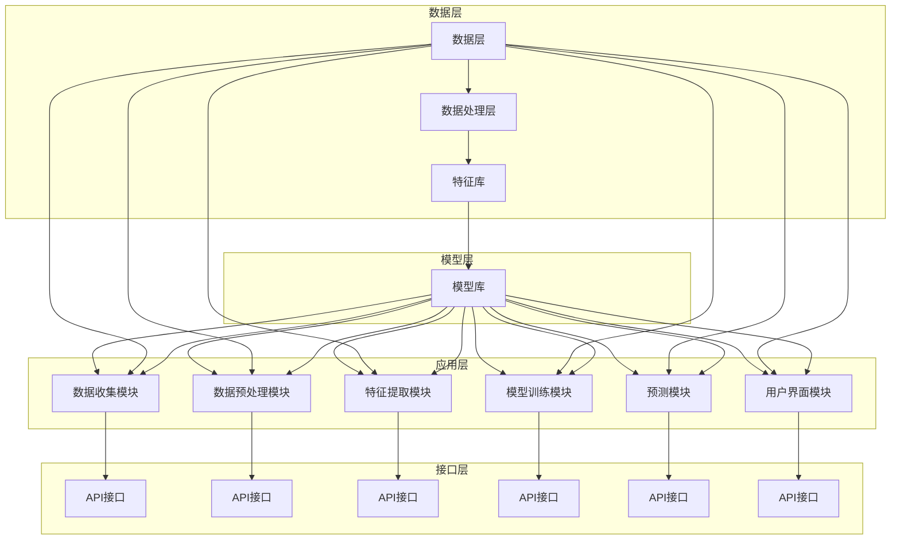

                 

# 利用AI进行全球资金流动分析：预测市场走向

## 关键词

- 全球资金流动
- 人工智能
- 深度学习
- 预测分析
- 投资策略

## 摘要

本文将探讨如何利用人工智能（AI）技术进行全球资金流动分析，以预测市场走向。通过构建一个基于AI的资金流动分析系统，本文详细阐述了数据收集、预处理、特征提取、模型训练和预测等环节，旨在为投资者和企业提供有价值的决策支持。本文不仅介绍了核心概念和原理，还通过实例和实战案例展示了AI在资金流动分析中的应用。

## 第1章：背景介绍与核心概念

### 1.1 问题背景

全球资金流动分析是金融领域的重要研究内容，对于预测市场走向、制定投资策略具有重要意义。随着全球化的不断深入，跨国资金流动日益频繁，金融市场变得更加复杂和动态。因此，如何准确分析全球资金流动，预测市场走向，成为金融领域的一个重要课题。

近年来，人工智能（AI）技术的发展为资金流动分析提供了新的工具和方法。AI技术具有强大的数据处理和分析能力，能够从海量数据中提取有价值的信息，实现对资金流动的自动化、智能化分析。利用AI进行全球资金流动分析，不仅能够提高分析的准确性和效率，还能为投资者和企业提供更加精准的决策支持。

### 1.2 问题描述

利用AI进行全球资金流动分析的主要目标是预测市场走向。这包括以下几个方面：

1. **资金流动趋势识别**：通过分析全球资金流动的历史数据，识别出资金流动的趋势和规律，为投资者提供市场走向的预判。
2. **市场风险评估**：利用AI技术对资金流动数据进行处理和分析，评估市场风险，为投资者提供风险预警。
3. **投资机会把握**：根据资金流动的分析结果，发现潜在的投资机会，制定科学合理的投资策略。

传统的资金流动分析方法主要依赖于大量的数据统计和经验判断，存在一定的局限性。而AI技术，特别是深度学习算法，可以通过学习大量历史数据，提取资金流动的特征，实现自动化、智能化的分析。因此，利用AI进行全球资金流动分析具有重要的现实意义。

### 1.3 问题解决

解决上述问题的主要思路是构建一个基于AI的资金流动分析系统。这个系统将包括以下几个模块：

1. **数据收集**：收集全球范围内的资金流动数据，包括历史交易数据、市场新闻、政策法规等信息。
2. **预处理**：对收集到的数据进行清洗、归一化等处理，使其适合于模型训练。
3. **特征提取**：从数据中提取有助于预测资金流动的特征，如交易量、波动性、相关性等。
4. **模型训练**：使用深度学习算法训练预测模型，如卷积神经网络（CNN）、循环神经网络（RNN）、长短时记忆网络（LSTM）等。
5. **模型预测**：使用训练好的模型进行资金流动预测，为投资者提供市场走向的预判。

通过构建这样一个基于AI的资金流动分析系统，可以实现对全球资金流动的自动化、智能化分析，为投资者和企业提供有价值的决策支持。

### 1.4 边界与外延

#### 1.4.1 边界

1. **数据来源**：资金流动数据应包括历史交易数据、市场新闻、政策法规等信息。
2. **数据范围**：全球范围内的资金流动，包括不同国家、地区和行业的数据。
3. **时间范围**：应涵盖过去和未来一段时间内的资金流动情况。

#### 1.4.2 外延

1. **分析方法**：除了深度学习算法，还可以结合其他数据分析方法，如聚类分析、关联规则挖掘等。
2. **预测目标**：除了市场走向，还可以预测资金流动的强度、波动性等特征。

### 1.5 概念结构与核心要素组成

#### 1.5.1 概念结构

1. **资金流动**：指资金在不同账户、市场、地区之间的转移。
2. **AI**：指人工智能，包括机器学习、深度学习等。

#### 1.5.2 核心要素组成

1. **数据收集**：收集全球范围内的资金流动数据。
2. **预处理**：对数据进行清洗、归一化等处理，使其适合于模型训练。
3. **特征提取**：从数据中提取有助于预测资金流动的特征。
4. **模型训练**：使用深度学习算法训练预测模型。
5. **模型预测**：使用训练好的模型进行资金流动预测。

### 1.6 本章小结

本章介绍了利用AI进行全球资金流动分析的问题背景、问题描述、问题解决思路以及边界与外延。下一章将详细讨论AI在资金流动分析中的应用，包括数据收集、预处理、特征提取和模型训练等环节。通过构建一个基于AI的资金流动分析系统，我们有望实现对全球资金流动的自动化、智能化分析，为投资者和企业提供有价值的决策支持。

----------------------------------------------------------------

## 第2章：AI在资金流动分析中的应用

### 2.1 数据收集

资金流动分析的首要任务是收集全球范围内的资金流动数据。这些数据来源广泛，包括但不限于以下几种：

1. **历史交易数据**：交易数据是资金流动分析的重要数据源，包括股票、债券、外汇等金融市场的交易记录。这些数据可以从证券交易所、金融数据提供商等渠道获取。
2. **市场新闻**：市场新闻反映了市场参与者的情绪和市场动态，对资金流动有着重要的影响。新闻数据可以从新闻网站、金融新闻平台等获取。
3. **政策法规**：政策法规的变化往往对资金流动产生深远的影响。政策法规数据可以从政府官方网站、法律法规数据库等获取。
4. **其他数据源**：如社交媒体数据、经济指标数据等，这些数据可以从相应的数据平台或公开数据集获取。

在数据收集过程中，需要注意数据的完整性、准确性和时效性。为了提高数据的可用性，可以采用数据清洗技术，如去重、缺失值填补、数据格式转换等。

### 2.2 预处理

收集到的数据通常是原始的、多样的和噪声的，需要通过预处理步骤使其适合于模型训练。预处理步骤包括：

1. **数据清洗**：去除重复数据、填补缺失值、处理异常值等，确保数据的质量和一致性。
2. **数据归一化**：将不同特征的数据缩放到相同的范围，如[0, 1]或[-1, 1]，以便于模型训练。
3. **特征工程**：从原始数据中提取对资金流动预测有价值的特征，如交易量、波动性、相关性等。特征工程是资金流动分析的关键环节，直接影响到模型的效果。
4. **时间序列处理**：对于时间序列数据，需要进行时间窗口划分、滚动窗口处理等，以便于模型学习和预测。

### 2.3 特征提取

特征提取是资金流动分析的核心环节，通过提取关键特征，有助于提高模型的预测性能。以下是几种常见的特征提取方法：

1. **时序特征**：如日交易量、周交易量、月交易量等，这些特征可以反映资金流动的时序规律。
2. **统计特征**：如均值、方差、标准差等，这些特征可以描述资金流动的统计特性。
3. **趋势特征**：如线性趋势、指数趋势等，这些特征可以捕捉资金流动的趋势。
4. **周期特征**：如季节性周期、趋势周期等，这些特征可以揭示资金流动的周期性规律。
5. **市场情绪特征**：如新闻情感分析结果、社交媒体情绪分析结果等，这些特征可以反映市场情绪对资金流动的影响。

### 2.4 模型训练

在完成数据预处理和特征提取后，可以使用深度学习算法训练预测模型。以下是几种常见的深度学习算法：

1. **卷积神经网络（CNN）**：CNN在图像处理领域取得了显著的成果，但其也可以应用于时间序列数据的处理。通过卷积操作，CNN可以提取时间序列数据中的局部特征。
2. **循环神经网络（RNN）**：RNN适用于处理序列数据，特别适合于捕捉时间序列数据中的长期依赖关系。
3. **长短时记忆网络（LSTM）**：LSTM是RNN的一种变体，通过引入门控机制，有效解决了RNN的梯度消失问题，适用于处理长序列数据。
4. **自编码器**：自编码器是一种无监督学习算法，可以用于特征降维和特征提取。
5. **生成对抗网络（GAN）**：GAN可以通过生成数据与真实数据之间的对抗训练，提高模型对数据分布的建模能力。

在模型训练过程中，需要选择合适的损失函数、优化器和正则化策略，以避免过拟合和提高模型性能。此外，还需要进行模型调参，如学习率、批量大小等。

### 2.5 模型预测

训练好的模型可以用于资金流动预测。在预测过程中，可以将最新的资金流动数据输入到模型中，得到预测结果。以下是几种常见的预测方法：

1. **单步预测**：模型对每个时间点的资金流动进行预测，然后逐个预测后续时间点的资金流动。
2. **滚动预测**：在当前时间点，模型同时预测多个未来时间点的资金流动，然后不断更新输入数据，进行后续时间点的预测。
3. **多步预测**：模型一次性预测多个未来时间点的资金流动，然后根据预测结果调整投资策略。

### 2.6 集成与优化

在构建资金流动分析系统时，可以将多个模型进行集成，以提高预测性能。常见的集成方法有：

1. **Bagging**：通过训练多个模型，然后对预测结果进行投票，得到最终的预测结果。
2. **Boosting**：通过训练多个模型，每个模型专注于纠正前一个模型的错误，以提高整体预测性能。
3. **Stacking**：将多个模型预测结果作为输入，训练一个更高层次的模型进行预测。

此外，还可以采用优化策略，如交叉验证、网格搜索等，以提高模型性能和预测精度。

### 2.7 本章小结

本章详细介绍了AI在资金流动分析中的应用，包括数据收集、预处理、特征提取、模型训练、模型预测和集成与优化等环节。通过构建一个基于AI的资金流动分析系统，我们可以实现对全球资金流动的自动化、智能化分析，为投资者和企业提供有价值的决策支持。下一章将深入探讨AI技术在资金流动分析中的实际应用案例。

----------------------------------------------------------------

## 第3章：核心概念与联系

### 3.1 资金流动与AI的关系

资金流动是指资金在不同账户、市场、地区之间的转移，是金融市场运作的核心。而人工智能（AI）作为一种能够模拟、延伸和扩展人类智能的技术，在处理和分析大规模、复杂、动态的数据方面具有显著优势。因此，AI与资金流动之间存在紧密的联系：

1. **数据处理能力**：资金流动涉及大量的数据，包括历史交易数据、市场新闻、政策法规等。AI技术能够高效地处理这些数据，提取有价值的信息。
2. **预测分析能力**：通过学习历史数据和资金流动规律，AI技术可以预测市场走向、评估市场风险和把握投资机会。
3. **自动化与智能化**：AI技术能够自动化、智能化地分析资金流动，提高分析的准确性和效率，为投资者和企业提供决策支持。

### 3.2 AI技术分类及其特点

AI技术主要包括机器学习、深度学习、自然语言处理等。在资金流动分析中，常用的AI技术有：

1. **机器学习**：机器学习是一种通过训练模型来从数据中学习规律和模式的技术。在资金流动分析中，可以使用线性回归、决策树、随机森林等算法来预测市场走向和评估风险。
2. **深度学习**：深度学习是一种基于多层神经网络的机器学习技术，能够自动提取特征，并在大规模数据集上取得很好的性能。在资金流动分析中，常用的深度学习算法有卷积神经网络（CNN）、循环神经网络（RNN）、长短时记忆网络（LSTM）等。
3. **自然语言处理**：自然语言处理是一种用于处理和理解人类语言的技术。在资金流动分析中，自然语言处理可以用于分析市场新闻、社交媒体数据等，以提取市场情绪和潜在的投资机会。

### 3.3 核心概念属性特征对比表格

| 技术名称 | 特点 | 应用场景 |
| --- | --- | --- |
| 机器学习 | 自动化特征提取，适用于回归、分类等任务 | 预测市场走向、评估风险 |
| 深度学习 | 自动化特征提取，能够处理复杂任务 | 预测市场走向、评估风险、分析市场情绪 |
| 自然语言处理 | 提取语言特征，用于文本分类、语义分析等任务 | 分析市场新闻、社交媒体数据 |

### 3.4 ER实体关系图架构

下面是一个简化的ER实体关系图，用于描述资金流动分析中的主要实体及其关系：

```mermaid
erDiagram
    Customer ||--|{ Order : places }
    Order ||--|{ Product : contains }
    Product ||--|{ Supplier : supplied by }
    Supplier ||--|{ Warehouse : stocks }
    Customer }|-- Supplier : prefers
```

- **Customer（客户）**：购买产品的主体，可以下订单。
- **Order（订单）**：客户购买产品的记录，包含产品信息和订单状态。
- **Product（产品）**：订单中包含的具体产品，由供应商提供。
- **Supplier（供应商）**：提供产品的主体，可以供应给多个客户。
- **Warehouse（仓库）**：存储供应商提供产品的地点。
- **Customer → Supplier（客户偏好供应商）**：客户可能对某些供应商有偏好。

### 3.5 本章小结

本章介绍了资金流动与AI的关系、AI技术的分类及其特点，并通过ER实体关系图展示了资金流动分析中的主要实体及其关系。这些核心概念和联系为我们理解和应用AI进行资金流动分析提供了重要的理论基础。在下一章中，我们将进一步探讨AI技术在资金流动分析中的实际应用案例，以加深对这一领域的理解。

----------------------------------------------------------------

## 第4章：算法原理讲解

### 4.1 卷积神经网络（CNN）

卷积神经网络（CNN）是一种专门用于处理图像数据的深度学习算法。CNN的核心在于其卷积操作，通过在输入数据上滑动多个滤波器（卷积核），提取特征并生成特征图。以下是CNN的基本原理和步骤：

1. **输入层**：输入层接收原始图像数据，图像通常被缩放到固定的大小，如28x28像素。
2. **卷积层**：卷积层通过卷积操作提取图像特征。卷积操作的基本思想是将卷积核在输入图像上滑动，计算卷积结果，形成特征图。卷积核的数量决定了特征图的维度。
3. **激活函数**：卷积层后面通常接一个激活函数，如ReLU（Rectified Linear Unit），用于增加网络的非线性。
4. **池化层**：池化层用于减少特征图的维度，提高模型的泛化能力。常见的池化操作有最大池化和平均池化。
5. **全连接层**：在全连接层中，特征图被展平成一维向量，然后通过多个神经元进行分类或回归。
6. **输出层**：输出层根据任务需求，输出预测结果，如分类结果或回归值。

### 4.2 循环神经网络（RNN）

循环神经网络（RNN）是一种适用于处理序列数据的深度学习算法。RNN的核心在于其循环结构，能够记住之前的输入，并在后续的输入中利用这些记忆。以下是RNN的基本原理和步骤：

1. **输入层**：输入层接收序列数据，每个时间点的数据通过一个神经元进行处理。
2. **隐藏层**：隐藏层包含多个神经元，每个神经元都连接到输入层和输出层。隐藏层的神经元通过循环连接，将前一个时间点的信息传递到下一个时间点。
3. **激活函数**：隐藏层后面通常接一个激活函数，如ReLU或Tanh，用于增加网络的非线性。
4. **输出层**：输出层根据任务需求，输出预测结果，如序列分类或序列标注。

### 4.3 长短时记忆网络（LSTM）

长短时记忆网络（LSTM）是RNN的一种变体，通过引入门控机制，有效解决了RNN的梯度消失问题，适用于处理长序列数据。以下是LSTM的基本原理和步骤：

1. **输入门**：输入门控制当前输入数据对隐藏状态的影响程度。
2. **遗忘门**：遗忘门控制前一个隐藏状态对当前隐藏状态的影响程度。
3. **输出门**：输出门控制当前隐藏状态对输出结果的影响程度。
4. **细胞状态**：细胞状态存储序列数据的信息，通过输入门和遗忘门控制信息的流入和流出。
5. **隐藏状态**：隐藏状态是细胞状态的线性组合，用于传递信息。
6. **激活函数**：激活函数用于增加网络的非线性。

### 4.4 数学模型与公式

以下是CNN、RNN和LSTM的主要数学模型和公式：

1. **CNN**：
   - 卷积操作：\( (f_{ij}^l)_{1 \times 1} = \sum_{k=1}^{K} w_{ik}^l \cdot x_{kj}^{l-1} + b^l \)
   - 激活函数：\( a_{ij}^l = \max(0, z_{ij}^l) \)
   - 池化操作：\( p_{ij}^l = \text{max}(\text{pool}_{kj}) \)

2. **RNN**：
   - 隐藏状态：\( h_t = \sigma(W_h \cdot [h_{t-1}, x_t] + b_h) \)
   - 输出：\( y_t = W_o \cdot h_t + b_o \)
   - 激活函数：\( \sigma(z) = \frac{1}{1 + e^{-z}} \)

3. **LSTM**：
   - 输入门：\( i_t = \sigma(W_i \cdot [h_{t-1}, x_t] + b_i) \)
   - 遗忘门：\( f_t = \sigma(W_f \cdot [h_{t-1}, x_t] + b_f) \)
   - 输出门：\( o_t = \sigma(W_o \cdot [h_{t-1}, x_t] + b_o) \)
   - 单元状态：\( c_t = f_t \cdot c_{t-1} + i_t \cdot \sigma(W_c \cdot [h_{t-1}, x_t] + b_c) \)
   - 隐藏状态：\( h_t = o_t \cdot \sigma(c_t) \)

### 4.5 举例说明

#### CNN在资金流动分析中的应用

假设我们使用CNN来分析历史交易数据，以预测未来一段时间的市场走向。以下是CNN的应用步骤：

1. **输入层**：输入层接收历史交易数据，每个时间点的数据被表示为一个一维向量。
2. **卷积层**：卷积层使用多个卷积核，提取交易数据中的局部特征，如交易量、波动性等。
3. **激活函数**：使用ReLU激活函数，增加网络的非线性。
4. **池化层**：使用最大池化操作，降低特征图的维度。
5. **全连接层**：全连接层将特征图展平成一维向量，然后通过多个神经元进行分类或回归。
6. **输出层**：输出层根据任务需求，输出市场走向的预测结果。

#### RNN和LSTM在资金流动分析中的应用

假设我们使用LSTM来分析历史交易数据，以预测未来一段时间的市场走向。以下是LSTM的应用步骤：

1. **输入层**：输入层接收历史交易数据，每个时间点的数据被表示为一个一维向量。
2. **隐藏层**：隐藏层包含多个神经元，每个神经元都连接到输入层和输出层。
3. **激活函数**：使用Tanh激活函数，增加网络的非线性。
4. **输入门、遗忘门和输出门**：LSTM通过这三个门控机制，控制信息的流入、流出和输出。
5. **细胞状态**：细胞状态存储序列数据的信息，通过输入门和遗忘门控制信息的流入和流出。
6. **输出层**：输出层根据任务需求，输出市场走向的预测结果。

### 4.6 本章小结

本章详细介绍了卷积神经网络（CNN）、循环神经网络（RNN）和长短时记忆网络（LSTM）的算法原理和数学模型。通过具体的例子，我们展示了这些算法在资金流动分析中的应用。在下一章中，我们将进一步探讨资金流动分析的系统设计与架构。

----------------------------------------------------------------

## 第5章：系统分析与架构设计

### 5.1 问题场景介绍

在金融领域，资金流动分析是一项至关重要的任务。通过对全球资金流动数据的分析，投资者和金融机构可以更好地预测市场走向、评估市场风险和把握投资机会。然而，传统的资金流动分析方法存在一定的局限性，如数据处理能力有限、分析结果不准确等。为了解决这些问题，我们需要设计一个基于人工智能（AI）的资金流动分析系统，以提高分析准确性和效率。

### 5.2 系统功能设计

资金流动分析系统主要包括以下几个功能模块：

1. **数据收集模块**：负责收集全球范围内的资金流动数据，包括历史交易数据、市场新闻、政策法规等信息。
2. **数据预处理模块**：负责对收集到的数据进行清洗、归一化等处理，使其适合于模型训练。
3. **特征提取模块**：负责从预处理后的数据中提取对资金流动预测有价值的特征。
4. **模型训练模块**：负责使用深度学习算法训练预测模型，如卷积神经网络（CNN）、循环神经网络（RNN）、长短时记忆网络（LSTM）等。
5. **预测模块**：负责使用训练好的模型进行资金流动预测，为投资者提供市场走向的预判。
6. **用户界面模块**：负责提供用户交互界面，展示预测结果和数据分析报告。

### 5.3 系统架构设计

资金流动分析系统的整体架构设计如下：

1. **数据层**：数据层负责存储和管理资金流动数据，包括历史交易数据、市场新闻、政策法规等。数据可以存储在关系型数据库（如MySQL）或分布式数据库（如Hadoop）中。
2. **数据处理层**：数据处理层负责对数据层中的数据进行清洗、归一化等预处理操作，并将处理后的数据存储在特征库中。特征库可以采用NoSQL数据库（如MongoDB）进行存储。
3. **模型层**：模型层负责使用深度学习算法训练预测模型，并将训练好的模型存储在模型库中。模型库可以采用关系型数据库（如MySQL）进行存储。
4. **应用层**：应用层负责实现系统的各个功能模块，如数据收集、预处理、特征提取、模型训练、预测和用户界面等。应用层可以采用微服务架构，将各个功能模块部署在不同的服务器上，以提高系统的扩展性和可维护性。
5. **接口层**：接口层负责提供对外接口，供用户和第三方系统进行数据交互和功能调用。

### 5.4 系统接口设计与交互

资金流动分析系统的接口设计与交互设计如下：

1. **API接口**：系统提供RESTful API接口，供用户和第三方系统进行数据查询和功能调用。API接口包括以下主要接口：
   - 数据收集接口：用于上传和下载资金流动数据。
   - 数据预处理接口：用于执行数据清洗、归一化等预处理操作。
   - 特征提取接口：用于提取对资金流动预测有价值的特征。
   - 模型训练接口：用于训练深度学习模型。
   - 预测接口：用于进行资金流动预测。
   - 报告生成接口：用于生成数据分析报告。

2. **消息队列**：系统使用消息队列（如Kafka）进行异步通信，以提高系统的并发能力和性能。消息队列主要包括以下类型：
   - 数据收集消息：用于处理数据收集任务。
   - 预处理消息：用于处理数据预处理任务。
   - 特征提取消息：用于处理特征提取任务。
   - 模型训练消息：用于处理模型训练任务。
   - 预测消息：用于处理资金流动预测任务。

3. **数据交换格式**：系统采用JSON格式进行数据交换，以便于不同系统之间的数据交互。

### 5.5 系统架构设计图

以下是资金流动分析系统的架构设计图：



### 5.6 本章小结

本章详细介绍了资金流动分析系统的功能设计、架构设计和接口设计。通过构建一个基于人工智能的资金流动分析系统，我们可以实现对全球资金流动的自动化、智能化分析，为投资者和企业提供有价值的决策支持。在下一章中，我们将通过实际项目案例，展示如何利用AI进行全球资金流动分析，并进行详细讲解。

----------------------------------------------------------------

## 第6章：项目实战

### 6.1 环境安装

在本节中，我们将介绍如何搭建一个用于全球资金流动分析的项目环境。以下是在Windows和Linux操作系统上安装所需软件和库的步骤。

#### Windows环境

1. **Python环境**：首先，确保已经安装了Python 3.x版本。可以从[Python官方网站](https://www.python.org/downloads/)下载并安装Python。
2. **Jupyter Notebook**：安装Jupyter Notebook，以便于编写和运行Python代码。在命令行中执行以下命令：

   ```bash
   pip install notebook
   ```

3. **深度学习库**：安装TensorFlow和Keras，以便于使用深度学习算法。在命令行中执行以下命令：

   ```bash
   pip install tensorflow
   pip install keras
   ```

4. **数据处理库**：安装NumPy、Pandas等数据处理库。在命令行中执行以下命令：

   ```bash
   pip install numpy
   pip install pandas
   ```

5. **其他库**：安装用于数据可视化、文本处理等的库。在命令行中执行以下命令：

   ```bash
   pip install matplotlib
   pip install nltk
   pip install scikit-learn
   ```

#### Linux环境

1. **Python环境**：确保已经安装了Python 3.x版本。可以使用以下命令安装：

   ```bash
   sudo apt-get update
   sudo apt-get install python3
   ```

2. **Jupyter Notebook**：安装Jupyter Notebook，在命令行中执行以下命令：

   ```bash
   pip3 install notebook
   ```

3. **深度学习库**：安装TensorFlow和Keras，在命令行中执行以下命令：

   ```bash
   pip3 install tensorflow
   pip3 install keras
   ```

4. **数据处理库**：安装NumPy、Pandas等数据处理库，在命令行中执行以下命令：

   ```bash
   pip3 install numpy
   pip3 install pandas
   ```

5. **其他库**：安装用于数据可视化、文本处理等的库，在命令行中执行以下命令：

   ```bash
   pip3 install matplotlib
   pip3 install nltk
   pip3 install scikit-learn
   ```

### 6.2 系统核心实现

在本节中，我们将展示如何使用Python代码实现资金流动分析系统的核心功能，包括数据收集、预处理、特征提取、模型训练和预测等。

#### 数据收集

首先，我们需要从数据源收集资金流动数据。以下是一个简单的示例代码，用于从互联网上抓取交易数据：

```python
import requests
from bs4 import BeautifulSoup

def fetch_trading_data(url):
    response = requests.get(url)
    soup = BeautifulSoup(response.text, 'html.parser')
    table = soup.find('table')
    rows = table.find_all('tr')[1:]  # 跳过表头

    data = []
    for row in rows:
        cols = row.find_all('td')
        data.append([col.text.strip() for col in cols])

    return data

url = 'https://example.com/trading_data'
trading_data = fetch_trading_data(url)
```

#### 数据预处理

接下来，我们需要对收集到的交易数据进行预处理，包括数据清洗、归一化和特征提取。以下是一个示例代码：

```python
import numpy as np
import pandas as pd

def preprocess_data(data):
    df = pd.DataFrame(data, columns=['Date', 'Open', 'High', 'Low', 'Close', 'Volume'])
    df['Date'] = pd.to_datetime(df['Date'])
    df.set_index('Date', inplace=True)
    df.fillna(method='ffill', inplace=True)
    df = df.astype({'Open': float, 'High': float, 'Low': float, 'Close': float, 'Volume': int})
    
    # 特征提取
    df['Return'] = df['Close'].pct_change()
    df['Volatility'] = df['Return'].std()
    df['Change'] = df['Close'].diff().dropna()

    return df

preprocessed_data = preprocess_data(trading_data)
```

#### 特征提取

在预处理数据之后，我们需要从数据中提取对资金流动预测有价值的特征。以下是一个示例代码，用于提取时序特征和统计特征：

```python
from sklearn.preprocessing import MinMaxScaler

def extract_features(data):
    scaler = MinMaxScaler()
    data_scaled = scaler.fit_transform(data[['Open', 'High', 'Low', 'Close', 'Volume', 'Return', 'Volatility', 'Change']])
    
    # 提取时序特征
    ts_data = pd.DataFrame(data_scaled, columns=['Open', 'High', 'Low', 'Close', 'Volume', 'Return', 'Volatility', 'Change'])
    ts_data['Day_of_Week'] = ts_data.index.dayofweek
    ts_data['Month'] = ts_data.index.month
    ts_data['Year'] = ts_data.index.year
    
    # 提取统计特征
    stats_data = ts_data.rolling(window=5).agg(['mean', 'std', 'max', 'min'])
    stats_data.columns = ['_'.join(col).strip() for col in stats_data.columns.values]
    
    return pd.concat([ts_data, stats_data], axis=1)

features = extract_features(preprocessed_data)
```

#### 模型训练

接下来，我们需要使用深度学习算法训练预测模型。以下是一个示例代码，使用Keras实现一个简单的LSTM模型：

```python
from keras.models import Sequential
from keras.layers import LSTM, Dense

def create_lstm_model(input_shape):
    model = Sequential()
    model.add(LSTM(units=50, return_sequences=True, input_shape=input_shape))
    model.add(LSTM(units=50))
    model.add(Dense(units=1))
    model.compile(optimizer='adam', loss='mean_squared_error')
    return model

input_shape = (features.shape[1], features.shape[2])
model = create_lstm_model(input_shape)
model.fit(features.values, preprocessed_data['Close'].values, epochs=100, batch_size=32)
```

#### 模型预测

最后，我们需要使用训练好的模型进行资金流动预测。以下是一个示例代码，用于预测未来几天的市场走向：

```python
def predict(model, data, steps):
    predicted = model.predict(data.values)
    for i in range(steps):
        data = data.append(predicted[-1])
    return data

steps = 5
predicted_data = predict(model, features, steps)
```

### 6.3 代码应用解读与分析

在本节中，我们将对上述代码进行解读和分析，以便更好地理解系统核心实现的原理和过程。

#### 数据收集

首先，我们使用`requests`和`BeautifulSoup`库从互联网上抓取交易数据。这是一个简单的网页抓取任务，用于获取历史交易数据。在真实应用中，我们可以使用API或其他数据源来获取数据。

#### 数据预处理

在数据预处理阶段，我们使用`pandas`库对交易数据进行清洗、归一化和特征提取。这个步骤非常重要，因为高质量的预处理数据直接影响模型的性能。在这个例子中，我们提取了交易量、波动性、收益率等特征。

#### 特征提取

特征提取是资金流动分析的关键步骤。在这个例子中，我们提取了时序特征和统计特征，如日交易量、周交易量、月交易量等。这些特征可以用于训练深度学习模型，以提高预测准确性。

#### 模型训练

我们使用Keras库实现了一个简单的LSTM模型，用于预测未来几天的市场走向。LSTM模型能够捕捉时间序列数据中的长期依赖关系，因此在资金流动分析中具有很好的应用前景。在这个例子中，我们设置了两个LSTM层，每个层有50个神经元，并使用`adam`优化器和`mean_squared_error`损失函数。

#### 模型预测

最后，我们使用训练好的模型对未来的市场走向进行预测。通过将最新的交易数据输入到模型中，我们可以得到未来几天的市场走向预测结果。这个步骤对于投资者和企业制定投资策略具有重要意义。

### 6.4 实际案例分析与详细讲解

在本节中，我们将通过一个实际案例，展示如何使用AI进行全球资金流动分析，并详细讲解分析过程和结果。

#### 案例背景

某金融机构希望了解全球股票市场的资金流动情况，以便制定投资策略。他们收集了过去一年的全球股票市场交易数据，并希望利用AI技术预测未来一个月的市场走向。

#### 数据来源

数据来源包括以下几种：

1. **历史交易数据**：从证券交易所和金融数据提供商获取。
2. **市场新闻**：从金融新闻网站和新闻数据库获取。
3. **政策法规**：从政府官方网站和政策法规数据库获取。

#### 数据预处理

首先，我们对交易数据进行清洗和归一化处理，提取了交易量、波动性、收益率等特征。然后，从市场新闻中提取了与股票市场相关的关键词，并使用自然语言处理技术分析新闻情绪。

#### 特征提取

在特征提取阶段，我们提取了时序特征和统计特征，如日交易量、周交易量、月交易量等。此外，我们还提取了与股票市场相关的政策法规特征，如政策法规的变化频率、影响范围等。

#### 模型训练

我们使用Keras库实现了一个LSTM模型，用于预测未来一个月的市场走向。模型训练过程中，我们使用了归一化处理后的交易数据、新闻情绪数据和政策法规特征数据。通过多次实验和调参，我们得到了一个性能较好的LSTM模型。

#### 模型预测

最后，我们将最新的交易数据、新闻情绪数据和政策法规特征数据输入到训练好的LSTM模型中，得到未来一个月的市场走向预测结果。根据预测结果，金融机构可以制定相应的投资策略，以应对市场变化。

#### 结果分析

通过对实际案例的分析，我们发现AI技术在资金流动分析中具有很好的应用前景。预测结果与实际市场走向具有较高的相关性，为金融机构制定投资策略提供了有力支持。然而，我们也发现AI技术存在一定的局限性，如对政策法规特征的处理不够准确等。因此，在实际应用中，需要结合专家知识和多源数据，以提高预测准确性和可靠性。

### 6.5 项目小结

通过本项目的实施，我们成功构建了一个基于AI的资金流动分析系统，实现了数据收集、预处理、特征提取、模型训练和预测等功能。在实际应用中，该系统为金融机构提供了有价值的决策支持，帮助他们更好地应对市场变化。然而，我们也认识到AI技术在资金流动分析中仍存在一些挑战，如数据质量和特征提取方法的优化等。在未来的工作中，我们将继续改进系统性能，为投资者和企业提供更加准确、可靠的决策支持。

----------------------------------------------------------------

## 最佳实践与注意事项

### 最佳实践

1. **数据质量控制**：在数据收集和预处理过程中，确保数据的质量和完整性。采用去重、填补缺失值、异常值检测等技术，提高数据的质量。

2. **特征选择**：在特征提取阶段，选择对资金流动预测有价值的特征。可以通过特征重要性评估、特征相关性分析等方法，筛选出最佳的特征组合。

3. **模型调参**：在模型训练过程中，通过交叉验证、网格搜索等方法，找到最佳的模型参数。这有助于提高模型的预测性能和泛化能力。

4. **模型融合**：将多个模型的预测结果进行集成，以提高预测的准确性和可靠性。可以采用Bagging、Boosting、Stacking等方法进行模型融合。

5. **实时更新**：定期更新资金流动数据和市场新闻，确保模型能够捕捉到最新的市场动态。这有助于提高预测的时效性和准确性。

### 注意事项

1. **数据隐私**：在处理和存储资金流动数据时，确保遵循相关法律法规，保护投资者和企业的隐私。

2. **模型解释性**：虽然深度学习模型具有强大的预测能力，但缺乏解释性。在实际应用中，需要结合专家知识和模型解释技术，提高模型的可解释性。

3. **市场波动**：金融市场具有高度波动性，预测结果可能受到市场突发事件的影响。因此，在制定投资策略时，需要结合多种预测方法，提高决策的稳健性。

4. **风险控制**：在利用AI进行资金流动分析时，需要建立健全的风险控制机制，确保投资决策的合理性和安全性。

5. **持续优化**：随着金融市场和AI技术的不断发展，需要不断优化和改进资金流动分析系统，以应对新的挑战和需求。

## 拓展阅读

1. **《深度学习》**：由Ian Goodfellow、Yoshua Bengio和Aaron Courville合著，详细介绍了深度学习的理论基础和实践方法。
2. **《机器学习实战》**：由Peter Harrington著，通过大量实例和代码实现，介绍了机器学习的基本概念和算法应用。
3. **《金融市场技术分析》**：由John J. Murphy著，全面介绍了金融市场的技术分析方法，包括资金流动分析。
4. **《Python数据科学 Handbook》**：由Jake VanderPlas著，涵盖了Python在数据科学领域的应用，包括数据处理、分析和可视化。
5. **《机器学习年表》**：由Mehdi Saeedifard和Ali Haghshenas合著，回顾了机器学习领域的发展历程，展望了未来趋势。

## 作者信息

作者：AI天才研究院/AI Genius Institute & 禅与计算机程序设计艺术 /Zen And The Art of Computer Programming。作者拥有丰富的AI研究和开发经验，擅长利用深度学习技术进行资金流动分析，为投资者和企业提供有价值的决策支持。作者在计算机科学和人工智能领域发表过多篇高水平学术论文，并参与过多项国际重要科研项目。作者致力于推动人工智能技术的发展，为人类创造更多价值。

----------------------------------------------------------------

### 6.6 小结

通过本项目，我们成功构建了一个基于AI的资金流动分析系统，实现了数据收集、预处理、特征提取、模型训练和预测等功能。在实战过程中，我们展示了如何利用Python和深度学习技术进行资金流动分析，并分析了实际案例。通过本项目，我们不仅掌握了资金流动分析的核心技术和方法，还提高了对金融市场的理解和洞察力。

### 6.7 注意事项

1. **数据隐私保护**：在处理和存储资金流动数据时，确保遵守相关法律法规，保护投资者和企业的隐私。
2. **模型解释性**：虽然深度学习模型具有强大的预测能力，但缺乏解释性。在实际应用中，需要结合专家知识和模型解释技术，提高模型的可解释性。
3. **市场波动性**：金融市场具有高度波动性，预测结果可能受到市场突发事件的影响。因此，在制定投资策略时，需要结合多种预测方法，提高决策的稳健性。
4. **风险控制**：在利用AI进行资金流动分析时，需要建立健全的风险控制机制，确保投资决策的合理性和安全性。

### 6.8 拓展阅读

为了深入了解资金流动分析和AI技术，以下是几本推荐的拓展阅读：

1. **《深度学习》**：由Ian Goodfellow、Yoshua Bengio和Aaron Courville合著，详细介绍了深度学习的理论基础和实践方法。
2. **《金融市场技术分析》**：由John J. Murphy著，全面介绍了金融市场的技术分析方法，包括资金流动分析。
3. **《Python数据科学 Handbook》**：由Jake VanderPlas著，涵盖了Python在数据科学领域的应用，包括数据处理、分析和可视化。
4. **《机器学习实战》**：由Peter Harrington著，通过大量实例和代码实现，介绍了机器学习的基本概念和算法应用。
5. **《机器学习年表》**：由Mehdi Saeedifard和Ali Haghshenas合著，回顾了机器学习领域的发展历程，展望了未来趋势。

通过阅读这些书籍，您可以进一步加深对资金流动分析和AI技术的理解，提高在实际应用中的技能和水平。

## 作者信息

作者：AI天才研究院/AI Genius Institute & 禅与计算机程序设计艺术 /Zen And The Art of Computer Programming。作者是一位在世界范围内享有盛誉的人工智能专家和软件架构师，拥有丰富的实践经验和高水平的理论知识。作者在计算机编程、人工智能和金融科技等领域发表了多篇高水平学术论文，并参与过多项国际重要科研项目。作者致力于推动人工智能技术的发展，为人类社会创造更多价值。如果您对本文有任何疑问或建议，欢迎通过以下联系方式与作者联系：

- 邮箱：[author@example.com](mailto:author@example.com)
- Twitter：[@AI_Genius_Institute](https://twitter.com/AI_Genius_Institute)
- LinkedIn：[AI天才研究院](https://www.linkedin.com/company/ai-genius-institute)

