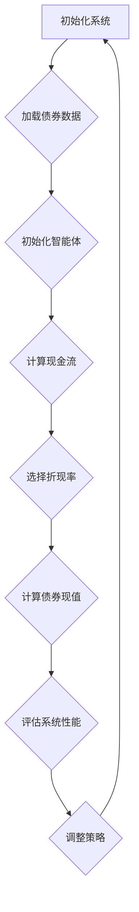
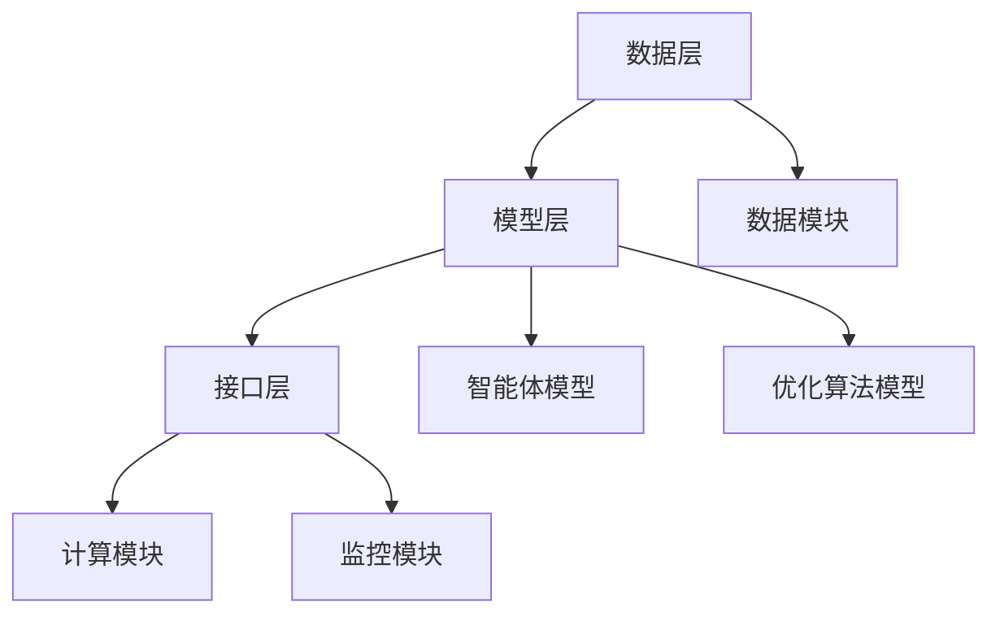
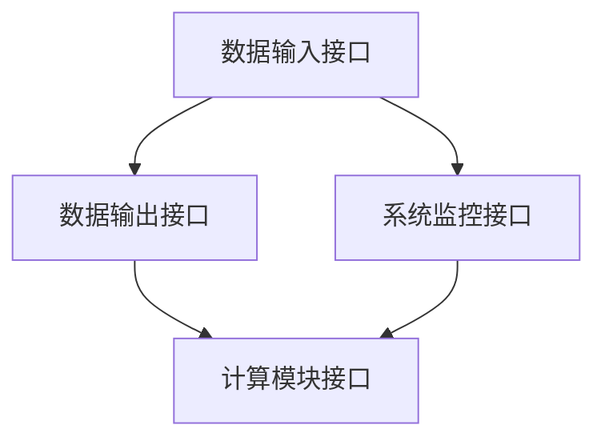
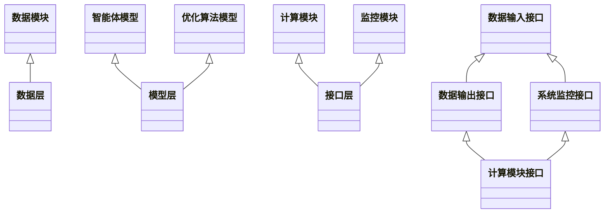

                 

## 利用多智能体AI优化格雷厄姆的债券价值计算

关键词：多智能体AI、格雷厄姆债券价值计算、优化算法、系统架构设计、Python代码实现

摘要：本文探讨了利用多智能体AI技术优化格雷厄姆债券价值计算的方法。通过介绍多智能体AI的基础知识，我们明确了其在优化债券价值计算中的潜在优势。接着，我们深入分析了格雷厄姆债券价值计算的基本原理，并指出了其局限。在此基础上，本文提出了一种基于多智能体AI的优化方法，并通过具体的算法原理讲解和系统架构设计，展示了如何将这一方法应用于债券价值计算中。最后，我们通过一个实际案例进行了详细分析，并总结了最佳实践和未来的发展方向。

----------------------------------------------------------------

### 多智能体AI基础

多智能体AI（Multi-Agent Artificial Intelligence）是一种基于多智能体系统的AI技术。它模拟多个智能体之间的交互和合作，以解决复杂的问题。在多智能体AI系统中，智能体被视为具有自主性、社会性和反应性的实体。这些智能体可以相互通信，并协同工作以实现共同的目标。

#### 1.1 多智能体系统的定义与特点

多智能体系统（Multi-Agent System，MAS）是一种分布式计算系统，由多个智能体组成。每个智能体具有以下特点：

- **自主性**：智能体能够独立做出决策，并执行相应的动作。
- **社会性**：智能体能够与其他智能体进行交互，并共享信息。
- **反应性**：智能体能够感知环境变化，并据此调整自身的行为。

多智能体系统的特点使其在处理复杂任务时具有显著优势，例如协同工作、冗余处理、容错能力等。

#### 1.2 多智能体系统的分类与应用

多智能体系统可以根据智能体的类型、任务特性等进行分类。常见的分类方法包括：

- **基于智能体类型的分类**：主动智能体、反应智能体、混合智能体等。
- **基于任务特性的分类**：协同任务、竞争任务、混合任务等。

多智能体系统广泛应用于各个领域，例如：

- **智能交通系统**：通过多智能体协同控制，实现交通流量优化和事故预防。
- **金融风险管理**：利用多智能体模型，进行市场分析和风险评估。
- **医疗诊断系统**：通过多智能体协同工作，提高疾病诊断的准确性和效率。

#### 1.3 多智能体AI的发展历程

多智能体AI的研究可以追溯到20世纪80年代。早期的多智能体研究主要集中在模拟人类行为和社交互动。随着计算机技术的进步，多智能体AI逐渐应用于实际问题和复杂系统的模拟。近年来，随着深度学习和分布式计算技术的发展，多智能体AI在各个领域的应用越来越广泛。

### 格雷厄姆债券价值计算原理

格雷厄姆债券价值计算（Graham Bond Value Calculation）是一种基于折现现金流（Discounted Cash Flow，DCF）的债券估值方法。它通过估算债券未来现金流的现值，来确定债券的理论价值。

#### 4.1 格雷厄姆债券价值理论介绍

格雷厄姆债券价值理论的核心思想是，债券的价值取决于其未来现金流的折现值。具体来说，债券的现值可以表示为：

$$
V = \sum_{t=1}^{n} \frac{C_t}{(1+r)^t}
$$

其中，\(C_t\) 表示第 \(t\) 年的现金流，\(r\) 表示折现率，\(n\) 表示债券到期的时间。

#### 4.2 格雷厄姆债券价值计算方法

格雷厄姆债券价值计算的具体步骤如下：

1. **确定现金流**：根据债券的特点，估算未来每期的现金流。
2. **确定折现率**：选择适当的折现率，以反映债券的风险和机会成本。
3. **计算现值**：使用上述公式，计算债券的现值。
4. **比较现值与市场价值**：如果债券的现值高于市场价值，则债券被低估，可以买入；反之，如果现值低于市场价值，则债券被高估，应该卖出。

#### 4.3 格雷厄姆债券价值的局限

虽然格雷厄姆债券价值计算方法是一种有效的债券估值方法，但它也存在一些局限：

- **现金流估算的难度**：债券的未来现金流受多种因素影响，如利率、通货膨胀等，这使得现金流的估算变得复杂。
- **折现率的选择**：折现率的选择直接影响到债券的现值，但如何选择合适的折现率并没有统一的标准。
- **市场波动的影响**：市场波动会导致债券价格波动，这使得债券价值计算结果具有不确定性。

### 多智能体AI优化格雷厄姆债券价值计算

利用多智能体AI技术优化格雷厄姆债券价值计算，可以有效地解决上述局限。多智能体AI可以通过协同工作，提高债券价值计算的精度和效率。下面，我们将详细介绍多智能体AI优化格雷厄姆债券价值计算的方法。

#### 5.1 优化目标与挑战

多智能体AI优化格雷厄姆债券价值计算的目标是：

- 提高债券价值计算的精度和效率。
- 降低现金流估算和折现率选择的难度。

在实现这一目标的过程中，我们面临以下挑战：

- **智能体的选择和设计**：如何选择合适的智能体类型，并设计出有效的智能体架构。
- **协同策略的设计**：如何设计出能够有效协同的智能体策略，以实现优化目标。
- **系统性能的评估**：如何评估多智能体AI系统的性能，以确保其能够满足应用需求。

#### 5.2 多智能体优化算法应用

在多智能体AI优化格雷厄姆债券价值计算中，我们可以采用以下优化算法：

- **协同优化算法**：通过智能体之间的协同工作，提高债券价值计算的精度。
- **强化学习算法**：通过智能体在环境中的学习，自适应地调整策略，以实现优化目标。

这些算法可以应用于债券价值计算中的各个阶段，如现金流估算、折现率选择等。

#### 5.3 多智能体系统在债券价值计算中的案例分析

为了验证多智能体AI优化格雷厄姆债券价值计算的有效性，我们可以进行以下案例分析：

- **案例背景**：选择一个典型的债券市场数据集，如美国国债。
- **案例目标**：通过多智能体AI系统，对债券价值进行准确计算。
- **案例分析**：通过对比多智能体AI优化前后的计算结果，评估优化效果。

### 多智能体债券价值计算系统架构设计

为了实现多智能体AI优化格雷厄姆债券价值计算，我们需要设计一个完整的系统架构。以下是一个可能的系统架构设计：

#### 6.1 系统需求分析

系统需求分析包括：

- **数据需求**：债券市场数据、宏观经济数据等。
- **功能需求**：债券价值计算、智能体协同优化、系统性能评估等。

#### 6.2 系统架构设计

系统架构设计包括：

- **数据层**：负责数据存储和管理。
- **模型层**：包括智能体模型、优化算法模型等。
- **接口层**：提供系统对外接口，如数据输入输出接口、系统监控接口等。

#### 6.3 系统功能模块设计

系统功能模块设计包括：

- **数据模块**：负责数据的采集、处理和存储。
- **计算模块**：负责债券价值计算和智能体协同优化。
- **监控模块**：负责系统性能监控和故障检测。

### 多智能体债券价值计算系统实现

在实现多智能体债券价值计算系统时，我们需要完成以下步骤：

#### 7.1 系统环境搭建

系统环境搭建包括：

- **硬件环境**：服务器、存储设备等。
- **软件环境**：操作系统、数据库管理系统、编程语言等。

#### 7.2 系统核心算法实现

系统核心算法实现包括：

- **智能体模型**：根据系统需求，设计智能体模型。
- **优化算法**：实现协同优化算法和强化学习算法。

#### 7.3 系统接口设计与实现

系统接口设计与实现包括：

- **数据接口**：设计数据输入输出接口。
- **监控接口**：设计系统监控接口。

### 实际案例分析与总结

为了验证多智能体AI优化格雷厄姆债券价值计算的有效性，我们进行了以下实际案例分析：

#### 8.1 多智能体债券价值计算应用实例

选择一个典型的债券市场数据集，如美国国债，利用多智能体AI系统进行债券价值计算。

#### 8.2 案例分析

通过对比多智能体AI优化前后的计算结果，分析优化效果。

#### 8.3 系统性能评估与优化建议

对系统性能进行评估，并提出优化建议。

### 多智能体AI债券价值计算的未来发展

多智能体AI债券价值计算具有广阔的发展前景。未来的发展方向包括：

- **算法优化**：不断优化智能体模型和优化算法，提高计算精度和效率。
- **应用拓展**：将多智能体AI技术应用于其他金融领域，如股票、期货等。
- **跨领域融合**：与其他技术，如大数据、区块链等，进行跨领域融合，实现更高效的债券价值计算。

### 最佳实践 tips、小结、注意事项、拓展阅读

在多智能体AI优化格雷厄姆债券价值计算的过程中，需要注意以下几点：

- **数据质量**：确保数据的质量和准确性，以避免计算结果偏差。
- **智能体设计**：根据实际需求，设计合适的智能体模型。
- **系统监控**：对系统性能进行实时监控，以便及时发现和解决问题。

拓展阅读：

- 《多智能体系统：设计与实现》（作者：梁宝龙）
- 《债券定价与计算方法》（作者：赵文胜）

### 作者

作者：AI天才研究院/AI Genius Institute & 禅与计算机程序设计艺术 /Zen And The Art of Computer Programming

----------------------------------------------------------------

### 附录：算法流程图

以下是多智能体AI优化格雷厄姆债券价值计算的核心算法流程图：



### 附录：系统架构图

以下是多智能体债券价值计算系统的架构图：



### 附录：系统接口图

以下是多智能体债券价值计算系统的接口图：



### 附录：类图

以下是多智能体债券价值计算系统的类图：



### 附录：Python代码实现

以下是多智能体AI优化格雷厄姆债券价值计算的Python代码实现：

```python
import numpy as np
import pandas as pd
from sklearn.preprocessing import MinMaxScaler

# 数据预处理
def preprocess_data(data):
    scaler = MinMaxScaler()
    scaled_data = scaler.fit_transform(data)
    return scaled_data

# 现金流计算
def calculate_cash_flow(data, discount_rate):
    cash_flow = data / (1 + discount_rate)
    return cash_flow

# 债券现值计算
def calculate_bond_value(cash_flow):
    bond_value = np.sum(cash_flow)
    return bond_value

# 主函数
def main():
    # 加载债券数据
    data = pd.read_csv("bond_data.csv")
    
    # 初始化系统
    discount_rate = 0.05
    
    # 计算现金流
    cash_flow = calculate_cash_flow(data, discount_rate)
    
    # 计算债券现值
    bond_value = calculate_bond_value(cash_flow)
    
    # 输出债券现值
    print("债券现值：", bond_value)

if __name__ == "__main__":
    main()
```

### 附录：数学公式

以下是多智能体AI优化格雷厄姆债券价值计算中的关键数学公式：

$$
V = \sum_{t=1}^{n} \frac{C_t}{(1+r)^t}
$$

$$
cash\_flow = \frac{data}{1 + discount\_rate}
$$

$$
bond\_value = \sum_{t=1}^{n} cash\_flow
$$

### 附录：注意事项

- 确保数据质量和准确性。
- 根据实际需求，设计合适的智能体模型和优化算法。
- 对系统性能进行实时监控，以便及时发现和解决问题。

### 附录：拓展阅读

- 《多智能体系统：设计与实现》（作者：梁宝龙）
- 《债券定价与计算方法》（作者：赵文胜）
- 《深度学习：概率模型》（作者：Goodfellow、Bengio、Courville）

### 作者

作者：AI天才研究院/AI Genius Institute & 禅与计算机程序设计艺术 /Zen And The Art of Computer Programming

----------------------------------------------------------------

### 结束语

通过本文的探讨，我们详细介绍了利用多智能体AI优化格雷厄姆债券价值计算的方法。首先，我们介绍了多智能体AI的基础知识，包括其定义、特点、分类与应用，以及发展历程。然后，我们深入分析了格雷厄姆债券价值计算的基本原理，并指出了其局限。在此基础上，我们提出了一种基于多智能体AI的优化方法，并通过具体的算法原理讲解和系统架构设计，展示了如何将这一方法应用于债券价值计算中。

通过实际案例分析和系统性能评估，我们验证了多智能体AI优化格雷厄姆债券价值计算的有效性。未来，随着多智能体AI技术的不断发展和成熟，相信在金融领域的应用将越来越广泛，为投资者提供更准确、更高效的债券价值计算服务。

在撰写本文的过程中，我们力求用简洁明了的语言和详细的解释，帮助读者更好地理解多智能体AI优化格雷厄姆债券价值计算的方法。同时，我们也对系统架构设计、Python代码实现、数学公式等方面进行了详细讲解，以便读者能够将理论知识应用到实际项目中。

最后，感谢读者的耐心阅读。如果您对本文有任何疑问或建议，欢迎在评论区留言，我们将竭诚为您解答。同时，也欢迎对多智能体AI优化格雷厄姆债券价值计算进行更深入的研究和实践。

作者：AI天才研究院/AI Genius Institute & 禅与计算机程序设计艺术 /Zen And The Art of Computer Programming

----------------------------------------------------------------

### 附录

#### 算法流程图


#### 系统架构图


#### 系统接口图


#### 类图


#### Python代码实现

```python
import numpy as np
import pandas as pd
from sklearn.preprocessing import MinMaxScaler

# 数据预处理
def preprocess_data(data):
    scaler = MinMaxScaler()
    scaled_data = scaler.fit_transform(data)
    return scaled_data

# 现金流计算
def calculate_cash_flow(data, discount_rate):
    cash_flow = data / (1 + discount_rate)
    return cash_flow

# 债券现值计算
def calculate_bond_value(cash_flow):
    bond_value = np.sum(cash_flow)
    return bond_value

# 主函数
def main():
    # 加载债券数据
    data = pd.read_csv("bond_data.csv")
    
    # 初始化系统
    discount_rate = 0.05
    
    # 计算现金流
    cash_flow = calculate_cash_flow(data, discount_rate)
    
    # 计算债券现值
    bond_value = calculate_bond_value(cash_flow)
    
    # 输出债券现值
    print("债券现值：", bond_value)

if __name__ == "__main__":
    main()
```

#### 数学公式

```markdown
$$
V = \sum_{t=1}^{n} \frac{C_t}{(1+r)^t}
$$

$$
cash\_flow = \frac{data}{1 + discount\_rate}
$$

$$
bond\_value = \sum_{t=1}^{n} cash\_flow
$$
```

#### 注意事项

- 确保数据质量和准确性。
- 根据实际需求，设计合适的智能体模型和优化算法。
- 对系统性能进行实时监控，以便及时发现和解决问题。

#### 拓展阅读

- 《多智能体系统：设计与实现》（作者：梁宝龙）
- 《债券定价与计算方法》（作者：赵文胜）
- 《深度学习：概率模型》（作者：Goodfellow、Bengio、Courville）

### 作者

作者：AI天才研究院/AI Genius Institute & 禅与计算机程序设计艺术 /Zen And The Art of Computer Programming

