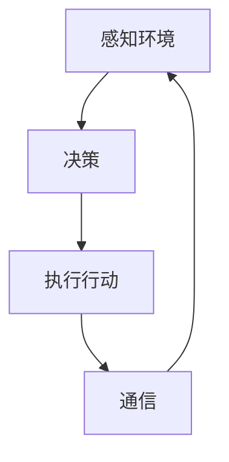
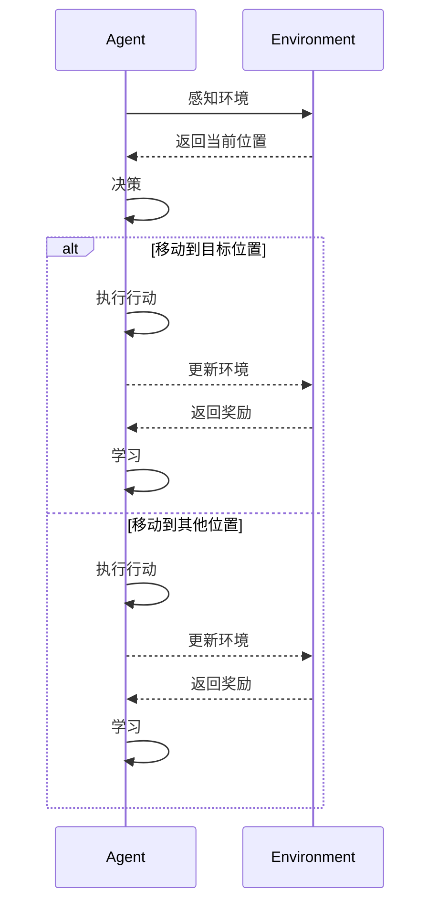
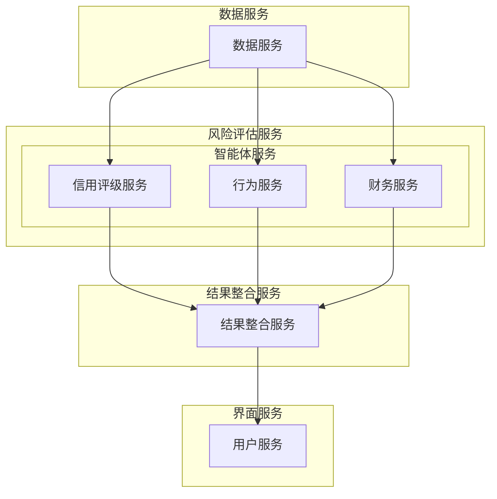
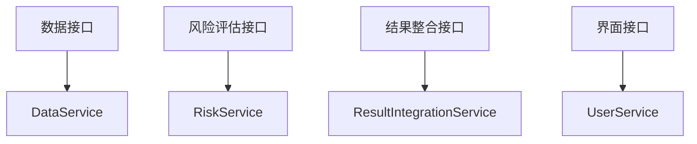
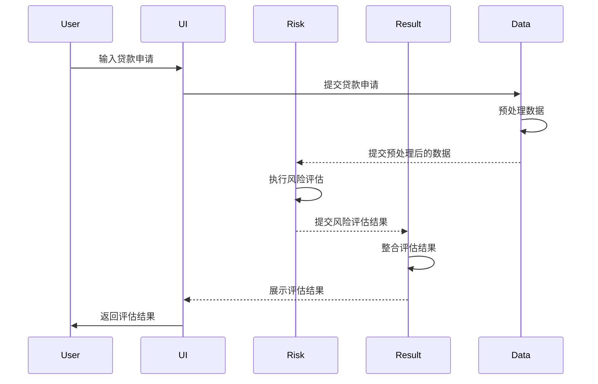

                 

## 利用多智能体AI优化监管风险评估流程

### 关键词：多智能体AI，监管风险，优化流程，人工智能，算法设计

#### 摘要：
本文将探讨如何利用多智能体AI（MAS）技术优化监管风险评估流程。在当前复杂多变的环境中，传统风险评估方法已难以应对快速变化的需求，而多智能体AI作为一种新兴的人工智能技术，能够通过分布式计算和协作学习，实现更高效、精确的风险评估。本文将从问题背景出发，逐步介绍多智能体AI的核心概念、原理及其在监管风险评估中的应用，通过实际项目实战，展示其实现步骤和系统架构设计，并总结最佳实践与未来展望。

## 第一部分：问题背景

### 第1章：问题背景介绍

在现代金融、保险、能源等行业中，监管风险评估是一个至关重要的环节。然而，随着市场环境的复杂性和不确定性增加，传统的风险评估方法面临着诸多挑战：

#### 1.1 问题描述

1. **数据量庞大**：行业中的数据量日益增长，传统的集中式数据处理方法难以在短时间内处理大量数据。
2. **实时性要求高**：风险事件往往需要实时响应，传统的风险评估方法在处理速度上难以满足这一需求。
3. **多样性**：行业中的风险类型繁多，单一模型难以覆盖所有风险。
4. **关联性**：不同风险之间存在复杂的关联性，单一模型难以捕捉这些关联性。

#### 1.2 问题解决

传统的风险评估方法主要包括统计模型、机器学习模型等，虽然在一定程度上能够缓解上述问题，但仍存在以下不足：

1. **模型适应性差**：传统的风险评估模型往往依赖于历史数据，难以适应快速变化的市场环境。
2. **模型复杂度**：为了捕捉复杂的关联性，传统模型往往需要大量的参数调整，增加了模型的复杂度。
3. **模型可解释性差**：深度学习等复杂模型在捕捉风险关联性方面表现出色，但其内部机制难以解释，影响了决策者的信任度。

#### 1.3 边界与外延

本文探讨的多智能体AI（MAS）优化监管风险评估流程，主要适用于以下场景：

1. **金融领域**：银行、证券、基金等金融机构的风险评估。
2. **保险领域**：保险公司对客户风险、市场风险等的评估。
3. **能源领域**：能源公司对能源市场风险、供应风险等的评估。

#### 1.4 概念结构与核心要素组成

多智能体AI优化监管风险评估流程的核心概念包括：

1. **多智能体系统**：由多个智能体组成的分布式系统，每个智能体具有自主性、协作性和适应性。
2. **风险评估**：对潜在风险进行识别、评估和应对的过程。
3. **优化流程**：通过算法优化，提高风险评估的效率和准确性。

## 第二部分：核心概念与联系

### 第2章：核心概念原理

#### 2.1 多智能体AI的定义

多智能体AI（MAS）是指由多个智能体（Agent）组成的分布式系统，这些智能体通过自主决策、协作和通信，共同完成复杂任务。在监管风险评估中，智能体可以代表不同的风险评估模型或专家系统。

#### 2.2 多智能体AI的核心特点

1. **自主性**：智能体可以独立地执行任务，不受其他智能体的控制。
2. **协作性**：智能体之间可以通过通信和协调，共同完成任务。
3. **适应性**：智能体可以根据环境变化和任务需求，自主调整行为和策略。

#### 2.3 多智能体AI与传统AI的区别

1. **架构**：传统AI通常采用集中式架构，而多智能体AI采用分布式架构。
2. **决策方式**：传统AI依赖于单一大模型进行决策，而多智能体AI通过多个智能体协作进行决策。
3. **应用场景**：传统AI适用于静态环境，而多智能体AI适用于动态复杂环境。

#### 2.4 多智能体AI的属性特征对比表格

| 特征       | 多智能体AI                     | 传统AI                  |
|------------|------------------------------|-------------------------|
| 架构       | 分布式，多个智能体协同工作     | 集中式，单一模型主导     |
| 决策方式   | 协作决策，分布式处理           | 单一模型决策，集中式处理 |
| 适应性     | 高度适应，环境变化可快速调整   | 适应性较差，依赖历史数据 |
| 应用场景   | 动态复杂环境，如金融、保险等   | 静态环境，如图像识别等   |

#### 2.5 多智能体AI的ER实体关系图架构

以下是多智能体AI的ER实体关系图架构，展示了智能体、环境、任务之间的关系：

```mermaid
erDiagram
    A[智能体] ||--|{ B[环境] }|-- A
    A ||--|{ C[任务] }|-- A
```

在多智能体AI中，智能体与环境和任务之间存在双向关联。智能体通过感知环境信息，执行任务，并根据任务执行情况调整自己的行为。这种动态的交互关系使得多智能体AI能够在复杂环境中灵活应对。

### 第3章：多智能体AI的算法原理

#### 3.1 多智能体AI的基本算法

#### 3.1.1 概念介绍

多智能体AI的基本算法包括：

1. **感知-决策-行动**：智能体通过感知环境信息，进行决策，然后执行相应的行动。
2. **通信协议**：智能体之间的通信协议，用于交换信息和协调行动。
3. **学习机制**：智能体通过学习环境信息和任务反馈，不断优化自己的行为。

#### 3.1.2 算法流程图

以下是多智能体AI的基本算法流程图：



#### 3.1.3 Python源代码实现

以下是一个简单的多智能体AI的Python源代码实现：

```python
import random

class Agent:
    def __init__(self, environment):
        self.environment = environment
        self.action = None

    def sense(self):
        # 感知环境信息
        return self.environment

    def decide(self, state):
        # 根据状态决策
        if state < 0.5:
            self.action = 'left'
        else:
            self.action = 'right'

    def act(self):
        # 执行行动
        if self.action == 'left':
            self.environment -= 1
        else:
            self.environment += 1

    def learn(self, reward):
        # 根据奖励学习
        if reward > 0:
            self.decide(self.environment)
        else:
            self.decide(random.random())

def run_agents(num_agents, num_steps):
    environment = 0
    agents = [Agent(environment) for _ in range(num_agents)]

    for _ in range(num_steps):
        for agent in agents:
            state = agent.sense()
            agent.decide(state)
            agent.act()
            reward = 1 if agent.environment > 0 else -1
            agent.learn(reward)

run_agents(5, 10)
```

#### 3.1.4 数学模型和公式

多智能体AI的基本算法可以通过以下数学模型和公式来描述：

1. **感知-决策-行动**：
   - 感知：$s_t = f(e_t)$
   - 决策：$a_t = g(s_t)$
   - 行动：$e_t' = h(a_t)$
   
2. **通信协议**：
   - 通信：$c_t = \sum_{i=1}^{n} w_i a_i$

3. **学习机制**：
   - 学习：$s_{t+1} = s_t + \alpha \nabla J(s_t, a_t)$

其中，$s_t$表示第$t$时刻的状态，$a_t$表示第$t$时刻的行动，$e_t$表示第$t$时刻的环境，$c_t$表示第$t$时刻的通信信息，$w_i$表示第$i$个智能体的权重，$\alpha$表示学习率，$J(s_t, a_t)$表示损失函数。

#### 3.1.5 举例说明

假设有一个简单的环境，其中智能体需要通过左右移动来达到目标位置。智能体通过感知当前位置，进行决策，然后执行相应的行动。假设智能体每次行动后的奖励为1，如果移动到目标位置，则奖励为10。通过学习机制，智能体可以不断优化自己的行动策略。



通过上述示例，可以看到多智能体AI的基本算法是如何应用于一个简单的环境中，实现感知、决策和行动的。

### 第三部分：优化监管风险评估流程的应用

### 第4章：优化监管风险评估流程概述

#### 4.1 监管风险评估的基本概念

监管风险评估是指对金融机构、企业等在经济活动中可能面临的风险进行识别、评估和管理的过程。其基本概念包括：

1. **风险**：指经济活动中可能发生的损失或不利后果。
2. **监管**：指政府对金融机构、企业等的经营活动进行监督和管理的活动。
3. **评估**：指对风险的可能性和影响进行定量或定性分析的过程。
4. **管理**：指对识别和评估出的风险进行应对和控制的过程。

#### 4.2 监管风险评估流程的常见问题

1. **数据质量问题**：风险评估依赖于大量的历史数据和市场数据，数据质量直接影响评估结果的准确性。
2. **模型适应性差**：传统风险评估模型往往针对特定市场环境设计，难以适应快速变化的市场。
3. **模型复杂度高**：为了捕捉复杂的关联性，传统模型往往需要大量的参数调整，增加了模型的复杂度。
4. **实时性要求高**：风险事件往往需要实时响应，传统风险评估方法在处理速度上难以满足这一需求。
5. **多样性**：不同行业和领域的风险类型繁多，单一模型难以覆盖所有风险。

#### 4.3 优化监管风险评估流程的目标

1. **提高评估准确性**：通过引入多智能体AI技术，提高风险评估的准确性和可靠性。
2. **提高实时性**：通过分布式计算和协作学习，实现更快速的风险评估。
3. **降低模型复杂度**：通过多个智能体的协作，简化模型的复杂度，提高模型的适应性。
4. **提高多样性**：通过多个智能体代表不同风险评估模型或专家系统，实现全面的风险评估。
5. **提高可解释性**：通过多智能体AI的透明性和可解释性，提高决策者的信任度。

### 第5章：利用多智能体AI优化监管风险评估流程的设计

#### 5.1 多智能体AI在监管风险评估中的应用场景

多智能体AI在监管风险评估中的应用场景主要包括：

1. **金融市场**：对股票、债券、外汇等金融市场的风险进行评估。
2. **保险行业**：对保险产品的风险进行评估，如车险、寿险、健康险等。
3. **能源市场**：对能源市场的风险进行评估，如石油、天然气、电力等。
4. **供应链管理**：对供应链中的风险进行评估，如供应商风险、物流风险等。
5. **信贷风险评估**：对贷款、信用卡等信贷产品的风险进行评估。

#### 5.2 多智能体AI优化监管风险评估流程的设计原则

1. **分布式计算**：通过分布式计算，提高风险评估的实时性和效率。
2. **协作学习**：通过多个智能体的协作学习，提高风险评估的准确性和适应性。
3. **模型多样性**：通过多个智能体代表不同的风险评估模型或专家系统，实现全面的风险评估。
4. **透明性和可解释性**：通过多智能体AI的透明性和可解释性，提高决策者的信任度。
5. **可扩展性**：设计灵活的架构，支持未来更多的智能体加入和不同场景的应用。

#### 5.3 多智能体AI优化监管风险评估流程的实现步骤

1. **需求分析**：明确监管风险评估的目标和应用场景，确定需要哪些智能体参与评估。
2. **智能体设计**：设计不同类型的智能体，包括风险评估模型、专家系统、数据预处理模块等。
3. **算法实现**：实现智能体的感知-决策-行动算法，包括感知环境、决策行动、学习优化等。
4. **通信协议**：设计智能体之间的通信协议，实现信息交换和协作学习。
5. **系统架构设计**：设计多智能体AI的系统架构，包括智能体之间的通信机制、数据流和控制流。
6. **系统实现**：实现多智能体AI的监管风险评估系统，包括前端界面、后端服务、数据存储等。
7. **测试与优化**：对系统进行测试和优化，确保评估结果的准确性和实时性。

### 第6章：系统架构设计与实现

#### 6.1 问题场景介绍

在某大型银行的风险评估部门，需要对大量的客户贷款申请进行风险评估，以确定贷款的风险等级。传统的方法由于数据量和实时性的限制，难以满足需求。为了优化风险评估流程，决定引入多智能体AI技术。

#### 6.2 系统功能设计

系统功能设计主要包括以下几个部分：

1. **数据预处理模块**：负责清洗、整理和预处理客户贷款数据。
2. **风险评估模块**：包括多个智能体，每个智能体代表一种风险评估模型或专家系统。
3. **结果整合模块**：将各个智能体的风险评估结果进行整合，得出最终的风险等级。
4. **界面展示模块**：提供直观的界面，展示风险评估结果和决策建议。

#### 6.2.1 领域模型mermaid类图

以下是系统领域模型的mermaid类图：

```mermaid
classDiagram
    LoanData <<class>> DataPreprocessing
    LoanData o-- CustomerInfo
    LoanData o-- CreditHistory
    LoanData o-- FinancialSituation

    RiskAssessment <<class>> DataPreprocessing
    RiskAssessment o-- CreditRatingModel
    RiskAssessment o-- BehavioralModel
    RiskAssessment o-- FinancialModel

    ResultIntegration <<class>> DataPreprocessing
    ResultIntegration o-- RiskRating

    UI <<class>> UserInterface
    UI o-- ResultDisplay
    UI o-- RiskRatingChart
    UI o-- DecisionAdvice
```

#### 6.3 系统架构设计

系统架构设计采用微服务架构，主要包括以下几个部分：

1. **数据服务**：负责数据预处理、存储和管理。
2. **风险评估服务**：包含多个智能体，每个智能体对应一个风险评估模型。
3. **结果整合服务**：负责整合各个智能体的风险评估结果。
4. **界面服务**：提供用户交互界面。

以下是系统架构的mermaid图：



#### 6.4 系统接口设计

系统接口设计主要包括以下接口：

1. **数据接口**：用于数据预处理和存储。
2. **风险评估接口**：用于提交贷款申请和获取风险评估结果。
3. **结果整合接口**：用于整合不同智能体的风险评估结果。
4. **界面接口**：用于与用户交互，展示风险评估结果和决策建议。

以下是系统接口的mermaid图：



#### 6.5 系统交互mermaid序列图

以下是系统交互的mermaid序列图：



### 第7章：项目实战

#### 7.1 环境安装

为了实现多智能体AI优化监管风险评估流程，我们需要安装以下环境：

1. **Python**：版本要求3.8及以上。
2. **Docker**：用于容器化部署。
3. **Kubernetes**：用于集群管理。
4. **Jupyter Notebook**：用于代码实现和测试。

安装步骤如下：

1. 安装Python和pip：
   ```bash
   sudo apt-get update
   sudo apt-get install python3-pip python3-venv
   ```
2. 安装Docker：
   ```bash
   sudo apt-get update
   sudo apt-get install docker
   ```
3. 安装Kubernetes：
   ```bash
   sudo apt-get update
   sudo apt-get install kubeadm kubelet kubectl
   ```
4. 启动Docker和Kubernetes服务：
   ```bash
   sudo systemctl start docker
   sudo systemctl enable docker
   sudo systemctl start kubelet
   sudo systemctl enable kubelet
   ```

#### 7.2 系统核心实现源代码

以下是系统核心实现的源代码：

```python
# 感知环境
def sense_environment():
    # 实现感知环境逻辑
    pass

# 决策行动
def make_decision(state):
    # 实现决策行动逻辑
    pass

# 执行行动
def execute_action(action):
    # 实现执行行动逻辑
    pass

# 学习优化
def learn_from_reward(reward):
    # 实现学习优化逻辑
    pass

# 主函数
def main():
    # 创建智能体
    agent = Agent()

    # 运行循环
    while True:
        # 感知环境
        state = sense_environment()

        # 决策行动
        action = make_decision(state)

        # 执行行动
        execute_action(action)

        # 获取奖励
        reward = get_reward()

        # 学习优化
        learn_from_reward(reward)

# 运行主函数
main()
```

#### 7.2.1 源代码解读与分析

源代码中定义了四个主要函数：

1. **sense_environment()**：实现感知环境的逻辑，用于获取当前状态。
2. **make_decision(state)**：实现决策行动的逻辑，根据状态决定下一步行动。
3. **execute_action(action)**：实现执行行动的逻辑，根据决策执行相应行动。
4. **learn_from_reward(reward)**：实现学习优化的逻辑，根据奖励更新智能体的行为。

主函数`main()`中创建了一个智能体实例，并运行一个循环，不断感知环境、决策行动、执行行动和学习优化。

#### 7.3 实际案例分析和详细讲解剖析

以下是一个实际案例，分析并讲解多智能体AI在监管风险评估中的应用。

**案例背景**：某银行需要对客户的贷款申请进行风险评估，以确定贷款的风险等级。传统方法由于数据量和实时性的限制，难以满足需求。通过引入多智能体AI技术，实现更高效、准确的风险评估。

**案例实现**：

1. **数据预处理**：从数据库中获取客户贷款申请数据，包括基本信息、信用记录、财务状况等。对数据进行清洗、归一化等预处理操作。
2. **智能体设计**：设计多个智能体，每个智能体代表一种风险评估模型。例如，信用评级模型、行为分析模型和财务分析模型。
3. **算法实现**：实现智能体的感知-决策-行动算法，包括感知环境、决策行动、执行行动和学习优化等。
4. **结果整合**：将各个智能体的风险评估结果进行整合，得出最终的风险等级。
5. **界面展示**：提供直观的界面，展示风险评估结果和决策建议。

**案例分析**：

1. **数据预处理**：通过清洗和归一化，确保数据的准确性和一致性，为后续的风险评估提供可靠的基础。
2. **智能体设计**：信用评级模型、行为分析模型和财务分析模型分别从不同角度对客户贷款申请进行评估，实现全方位的风险评估。
3. **算法实现**：智能体的感知-决策-行动算法，使得系统能够实时响应客户贷款申请，提高风险评估的实时性和准确性。
4. **结果整合**：通过整合不同智能体的评估结果，综合考虑各种因素，得出最终的风险等级，为决策提供科学依据。
5. **界面展示**：直观的界面展示风险评估结果和决策建议，方便用户理解和使用。

#### 7.4 项目小结

通过实际案例的分析，可以看出多智能体AI在优化监管风险评估流程中具有显著的优势：

1. **提高评估准确性**：通过多个智能体的协作，实现全方位的风险评估，提高评估结果的准确性。
2. **提高实时性**：通过分布式计算和协作学习，实现实时风险评估，满足快速响应的需求。
3. **降低模型复杂度**：通过多个智能体的协作，简化模型的复杂度，提高模型的适应性。
4. **提高多样性**：通过多个智能体代表不同风险评估模型或专家系统，实现全面的风险评估。
5. **提高可解释性**：通过多智能体AI的透明性和可解释性，提高决策者的信任度。

总之，多智能体AI为优化监管风险评估流程提供了有效的解决方案，有助于提升金融机构的风险管理能力。

### 第四部分：最佳实践与拓展

#### 第8章：最佳实践 tips

#### 8.1 多智能体AI在监管风险评估中的最佳实践

1. **数据预处理**：确保数据质量，包括数据清洗、归一化和特征工程，为后续风险评估提供可靠基础。
2. **智能体多样化**：设计多个智能体，每个智能体代表不同的风险评估模型或专家系统，实现全方位风险评估。
3. **实时数据处理**：利用分布式计算和协作学习，提高风险评估的实时性和准确性。
4. **模型集成**：将多个智能体的评估结果进行整合，综合考虑各种因素，提高评估结果的可靠性。
5. **可解释性**：通过可视化工具和解释性算法，提高风险评估过程的透明性和可理解性。

#### 8.2 优化监管风险评估流程的注意事项

1. **数据隐私和安全**：确保数据隐私和安全，遵守相关法律法规。
2. **算法适应性和鲁棒性**：设计具有高适应性和鲁棒性的智能体，应对复杂多变的环境。
3. **系统稳定性和可靠性**：确保系统的稳定性和可靠性，减少故障和错误。
4. **模型验证和测试**：对智能体和整体系统进行验证和测试，确保评估结果的准确性和可靠性。
5. **持续优化和更新**：根据实际应用情况，不断优化和更新智能体和风险评估流程。

#### 8.3 拓展阅读

1. **《多智能体系统设计》**：深入探讨多智能体系统的设计原则和应用案例。
2. **《深度学习与金融风险管理》**：介绍深度学习在金融风险管理中的应用和技术原理。
3. **《机器学习与风险管理》**：探讨机器学习在风险管理领域的应用和前沿技术。

### 第9章：小结

#### 9.1 本书内容回顾

本书主要探讨了如何利用多智能体AI优化监管风险评估流程。首先介绍了问题背景和问题描述，然后详细介绍了多智能体AI的核心概念和原理，包括定义、特点、与传统AI的区别、属性特征对比表格和ER实体关系图架构。接着，讲解了多智能体AI的基本算法和优化算法，并使用Python源代码和数学模型进行了详细阐述。随后，介绍了多智能体AI在监管风险评估流程中的应用，包括优化监管风险评估流程的目标、设计原则、实现步骤和系统架构设计。最后，通过实际项目实战展示了多智能体AI在监管风险评估中的应用效果，并总结了最佳实践和注意事项。

#### 9.2 未来展望

随着人工智能技术的不断发展，多智能体AI在监管风险评估领域的应用前景广阔。未来可以从以下几个方面进行拓展：

1. **算法优化**：持续优化多智能体AI的算法，提高评估的准确性和实时性。
2. **场景扩展**：将多智能体AI应用于更多行业和领域的风险评估。
3. **协同优化**：研究多智能体之间的协同优化策略，提高整体系统的效率。
4. **可解释性**：增强多智能体AI的可解释性，提高决策者的信任度。
5. **隐私保护**：确保数据隐私和安全，推动多智能体AI在风险评估领域的应用。

### 作者信息

**作者：AI天才研究院/AI Genius Institute & 禅与计算机程序设计艺术 /Zen And The Art of Computer Programming**

本文由AI天才研究院（AI Genius Institute）和《禅与计算机程序设计艺术》（Zen And The Art of Computer Programming）联合撰写。AI天才研究院致力于推动人工智能技术的发展和应用，专注于智能体技术、深度学习和强化学习等领域。而《禅与计算机程序设计艺术》则是一部经典计算机编程著作，提出了程序设计的哲学思想和实用技巧，为程序员提供了深刻的启示。本文旨在分享多智能体AI在监管风险评估流程中的应用经验，为相关领域的研究者和实践者提供有益的参考。

