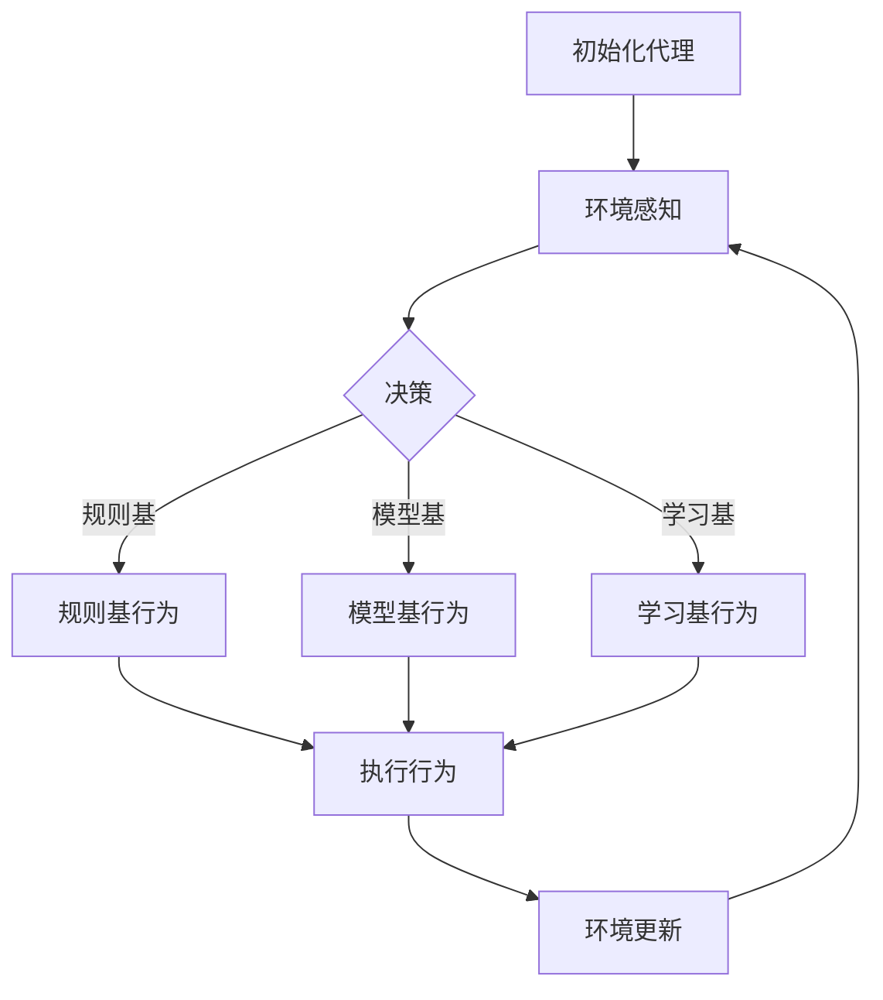
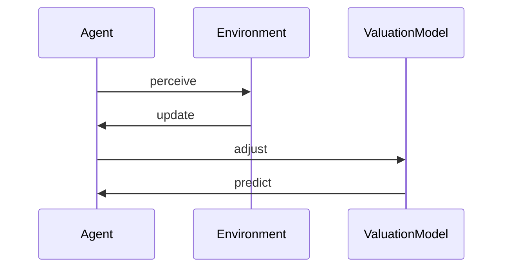
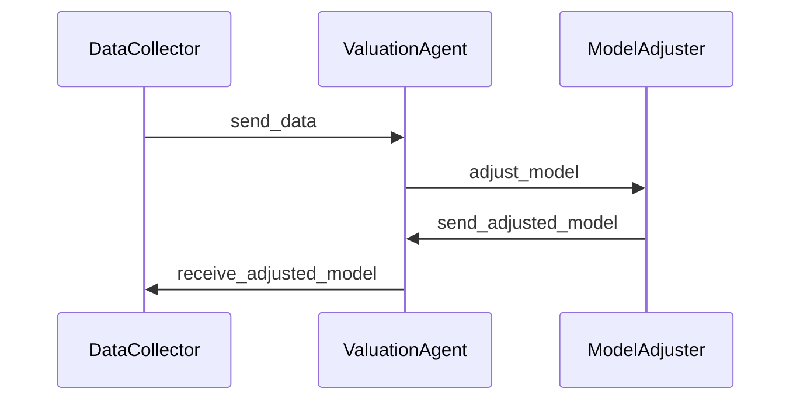

                 

### 《利用多智能体AI实现动态估值模型调整》

#### 关键词：多智能体AI、动态估值模型、算法、数据采集、优化策略

> 摘要：本文将深入探讨如何利用多智能体AI实现动态估值模型的调整。首先，我们将简要介绍多智能体AI和动态估值模型的基本概念及其重要性。随后，文章将详细阐述多智能体AI的架构设计，以及如何构建和调整动态估值模型。文章还将通过具体实例，展示多智能体AI在动态估值模型中的应用。最后，我们将总结模型调整的实践经验，并探讨未来的发展趋势与挑战。

## 目录

----------------------------------------------------------------

### 《利用多智能体AI实现动态估值模型调整》目录大纲

----------------------------------------------------------------

## 第一部分：多智能体AI与动态估值模型概述

### 第1章：多智能体AI基础

1.1 多智能体系统（MAS）的基本概念

1.2 多智能体系统的架构与类型

1.3 多智能体AI的发展与应用

1.4 动态估值模型调整的重要性

### 第2章：动态估值模型的理论基础

2.1 资产估值基本概念

2.2 动态估值模型的构建方法

2.3 动态估值模型的评估指标

2.4 多智能体AI在动态估值模型中的应用前景

## 第二部分：多智能体AI实现动态估值模型

### 第3章：多智能体AI架构设计

3.1 多智能体系统的设计原则

3.2 多智能体AI的通信机制

3.3 多智能体AI的协作策略

3.4 多智能体AI的安全与隐私保护

### 第4章：动态估值模型的构建与调整

4.1 动态估值模型的基本框架

4.2 数据采集与处理

4.3 动态调整机制的设计

4.4 动态估值模型的优化策略

### 第5章：多智能体AI在动态估值模型中的应用实例

5.1 房地产市场动态估值应用实例

5.2 股票市场动态估值应用实例

5.3 商品市场动态估值应用实例

### 第6章：动态估值模型调整的实践与分析

6.1 实践项目背景与目标

6.2 系统设计与实现

6.3 实际案例分析

6.4 模型调整效果评估

### 第7章：多智能体AI动态估值模型的发展趋势与挑战

7.1 多智能体AI动态估值模型的发展趋势

7.2 动态估值模型调整面临的挑战

7.3 未来研究方向与展望

## 第三部分：最佳实践与小结

### 第8章：多智能体AI动态估值模型的最佳实践

8.1 实践技巧与经验总结

8.2 注意事项与风险防范

8.3 拓展阅读与资源推荐

### 第9章：全书小结

9.1 关键知识点回顾

9.2 学习方法与建议

9.3 进一步学习资源

----------------------------------------------------------------

### 补充内容与格式规范

在编写目录大纲时，需要注意以下几点：

1. **章节标题格式**：使用markdown格式中的`#`符号来表示章节层级。一级章节使用`##`，二级章节使用`###`，以此类推。

2. **章节内容结构**：每个章节标题下应包含至少一个小节，每个小节标题下可以包含多个子节。

3. **核心概念与联系**：在相关章节中，应详细阐述核心概念，并使用表格对比核心概念属性特征，同时附上ER实体关系图架构的Mermaid流程图。

4. **算法原理讲解**：在讲解算法原理时，应使用Mermaid绘制算法流程图，并配合Python源代码进行详细阐述。算法原理的数学模型和公式应使用LaTeX格式编写，确保公式格式的准确性和可读性。

5. **系统分析与架构设计**：在相关章节中，应包含系统功能设计（领域模型Mermaid类图）、系统架构设计（Mermaid架构图）、系统接口设计和系统交互（Mermaid序列图）等内容。

6. **项目实战**：在相关章节中，应包含环境安装、系统核心实现源代码，代码应用解读与分析，实际案例分析和详细讲解剖析。

7. **最佳实践与小结**：最后应总结最佳实践，提供注意事项和拓展阅读资源，以便读者进一步学习。

### 目录大纲总字数

根据要求，目录大纲总字数应控制在2000字以内。在编写过程中，需确保内容简洁明了，避免过多冗余信息。每章的小节标题和简要内容应清晰明了，便于读者快速把握章节要点。同时，确保核心章节内容完整，满足书籍结构设计的要求。

----------------------------------------------------------------

## 第一部分：多智能体AI与动态估值模型概述

### 第1章：多智能体AI基础

#### 1.1 多智能体系统（MAS）的基本概念

多智能体系统（Multi-Agent System，MAS）是由多个自主代理（agent）组成的系统，这些代理可以相互协作、沟通，以实现共同的目标。每个代理在MAS中都是一个独立的实体，具有自主性、社会性、反应性和适应性等特点。多智能体系统的基本概念包括代理的定义、代理之间的交互机制、任务分配策略和协同工作方式。

在多智能体AI中，代理通常被设计为可以执行特定任务的人工智能实体，它们可以独立地收集信息、做出决策和执行动作。代理之间的交互是通过通信机制实现的，这种机制可以是同步的也可以是异步的，取决于系统的设计需求。此外，代理在执行任务时需要遵循一定的协作策略，以确保整个系统能够高效地完成任务。

#### 1.2 多智能体系统的架构与类型

多智能体系统的架构可以分为集中式和分布式两种。集中式架构中，所有代理的任务和决策都由一个中央控制器统一管理，而分布式架构中，代理具有更多的自治权，每个代理都可以独立地执行任务和做出决策。

根据代理的智能程度，多智能体系统可以分为以下几类：

- **反应式代理**：这种代理只根据当前环境状态做出反应，而不考虑未来的状态。
- **目标导向代理**：这类代理不仅根据当前状态做出反应，还考虑未来可能的状态，并为目标制定计划。
- **认知代理**：这种代理具有推理和问题解决能力，可以自主地学习和改进其行为。

#### 1.3 多智能体AI的发展与应用

多智能体AI的研究始于20世纪80年代，随着人工智能和分布式计算技术的进步，其应用领域不断扩展。多智能体AI在许多领域都展现出巨大的潜力，例如：

- **智能交通系统**：多智能体AI可以优化交通信号控制，减少交通拥堵。
- **智能制造**：多智能体AI可以协调制造过程中的各个环节，提高生产效率。
- **金融分析**：多智能体AI可以分析市场数据，预测金融市场的走势。

#### 1.4 动态估值模型调整的重要性

动态估值模型（Dynamic Valuation Model）是用于估计资产价值的模型，其核心在于能够根据市场变化实时调整估值结果。动态估值模型在金融、房地产、商品等市场具有重要意义，原因如下：

- **市场变化捕捉**：动态估值模型能够及时捕捉市场变化，为投资决策提供准确的数据支持。
- **风险控制**：动态估值模型可以帮助投资者识别潜在的风险，制定相应的风险控制策略。
- **提高投资效率**：动态估值模型可以减少人工干预，提高估值过程的效率和准确性。

### 第2章：动态估值模型的理论基础

#### 2.1 资产估值基本概念

资产估值是指对资产的价值进行评估的过程，包括资产的市场价值、账面价值、重置价值和清算价值等。资产估值的基本概念包括：

- **市场价值**：资产在市场上能够交易的价值。
- **账面价值**：资产在财务报表上的价值。
- **重置价值**：资产在当前市场上的重置成本。
- **清算价值**：资产在清算或破产情况下的价值。

#### 2.2 动态估值模型的构建方法

动态估值模型的构建通常包括以下几个步骤：

1. **数据收集**：收集与资产相关的历史数据、市场数据和其他相关信息。
2. **数据清洗**：对收集到的数据进行清洗和预处理，以确保数据的质量和一致性。
3. **特征提取**：从数据中提取对估值有重要影响的特征。
4. **模型选择**：选择合适的估值模型，如线性回归、神经网络、支持向量机等。
5. **模型训练**：使用历史数据进行模型训练，优化模型参数。
6. **模型评估**：使用验证数据集评估模型性能，调整模型参数。

#### 2.3 动态估值模型的评估指标

动态估值模型的评估指标包括：

- **准确度**：模型预测结果与实际结果的吻合程度。
- **稳定性**：模型在不同数据集上的预测一致性。
- **效率**：模型计算的时间和资源消耗。

#### 2.4 多智能体AI在动态估值模型中的应用前景

多智能体AI在动态估值模型中的应用前景广阔，具体表现在以下几个方面：

- **自适应调整**：多智能体AI可以根据市场变化实时调整估值模型，提高模型的准确性。
- **协同优化**：多个代理可以协同工作，共同优化估值模型，提高整体性能。
- **风险预测**：多智能体AI可以预测市场风险，为投资者提供风险预警。

## 第二部分：多智能体AI实现动态估值模型

### 第3章：多智能体AI架构设计

#### 3.1 多智能体系统的设计原则

设计多智能体系统时，需要遵循以下原则：

- **自治性**：每个代理应具有足够的自主性，能够独立完成任务。
- **适应性**：代理应能够根据环境变化调整行为。
- **协同性**：代理之间应能够高效协作，实现共同目标。
- **透明性**：代理的行为和决策应透明，便于监控和管理。

#### 3.2 多智能体AI的通信机制

多智能体AI的通信机制可以分为以下几种：

- **直接通信**：代理之间直接交换信息。
- **间接通信**：代理通过共享信息中心进行通信。
- **广播通信**：信息由一个代理广播给所有其他代理。

选择合适的通信机制取决于系统的具体需求和性能要求。

#### 3.3 多智能体AI的协作策略

多智能体AI的协作策略可以分为以下几种：

- **集中式策略**：所有代理的决策都由一个中央控制器统一管理。
- **分布式策略**：每个代理独立决策，但需要与其他代理协调。
- **混合策略**：结合集中式和分布式策略，根据不同任务和环境进行灵活调整。

#### 3.4 多智能体AI的安全与隐私保护

多智能体AI的安全与隐私保护至关重要，需要采取以下措施：

- **访问控制**：确保只有授权代理可以访问敏感信息。
- **数据加密**：对传输和存储的数据进行加密，防止数据泄露。
- **隐私保护**：对代理的行为进行限制，防止隐私泄露。

### 第4章：动态估值模型的构建与调整

#### 4.1 动态估值模型的基本框架

动态估值模型的基本框架包括数据采集、数据处理、模型构建和模型调整四个部分。

- **数据采集**：收集与资产相关的数据，包括市场数据、历史数据等。
- **数据处理**：对采集到的数据进行清洗、归一化和特征提取。
- **模型构建**：选择合适的模型，如神经网络、线性回归等，进行模型训练。
- **模型调整**：根据市场变化和模型性能，调整模型参数，优化模型。

#### 4.2 数据采集与处理

数据采集是动态估值模型构建的重要环节，需要考虑以下几个方面：

- **数据源选择**：选择可靠的数据源，确保数据的真实性和准确性。
- **数据类型**：包括历史价格、交易量、市场指标等。
- **数据频率**：根据估值需求，确定数据采集的频率。

数据预处理包括以下步骤：

- **数据清洗**：去除错误数据、缺失数据和异常数据。
- **归一化**：将不同特征的数据统一到同一尺度，便于模型训练。
- **特征提取**：提取对估值有重要影响的特征，如价格波动率、交易量变化等。

#### 4.3 动态调整机制的设计

动态调整机制是动态估值模型的核心，其设计需要考虑以下几个方面：

- **调整策略**：根据市场变化，选择合适的调整策略，如阈值调整、参数优化等。
- **调整频率**：确定调整的频率，以平衡模型的实时性和稳定性。
- **调整指标**：根据模型性能和市场需求，选择合适的调整指标，如准确率、召回率等。

#### 4.4 动态估值模型的优化策略

动态估值模型的优化策略包括以下几个方面：

- **模型选择**：选择合适的估值模型，如神经网络、线性回归等。
- **参数优化**：通过交叉验证、网格搜索等方法，优化模型参数。
- **特征选择**：使用特征选择算法，筛选对估值有重要影响的特征。
- **模型集成**：使用集成学习方法，提高模型的预测性能。

### 第5章：多智能体AI在动态估值模型中的应用实例

#### 5.1 房地产市场动态估值应用实例

在房地产市场中，动态估值模型可以帮助房地产开发商和投资者预测房价走势，制定投资策略。以下是一个简单的应用实例：

- **数据采集**：收集某地区的历史房价数据、交易量数据等。
- **数据处理**：对数据进行清洗、归一化和特征提取。
- **模型构建**：选择线性回归模型进行训练。
- **模型调整**：根据市场变化，实时调整模型参数。
- **模型应用**：使用调整后的模型预测未来房价。

#### 5.2 股票市场动态估值应用实例

在股票市场中，动态估值模型可以帮助投资者评估股票的投资价值，识别潜在的风险。以下是一个简单的应用实例：

- **数据采集**：收集某只股票的历史价格、交易量、财务指标等数据。
- **数据处理**：对数据进行清洗、归一化和特征提取。
- **模型构建**：选择神经网络模型进行训练。
- **模型调整**：根据市场变化，实时调整模型参数。
- **模型应用**：使用调整后的模型评估股票的投资价值。

#### 5.3 商品市场动态估值应用实例

在商品市场中，动态估值模型可以帮助商品生产商和贸易商预测商品价格，制定采购和销售策略。以下是一个简单的应用实例：

- **数据采集**：收集商品的历史价格、供需数据、市场趋势等。
- **数据处理**：对数据进行清洗、归一化和特征提取。
- **模型构建**：选择支持向量机模型进行训练。
- **模型调整**：根据市场变化，实时调整模型参数。
- **模型应用**：使用调整后的模型预测商品价格。

### 第6章：动态估值模型调整的实践与分析

#### 6.1 实践项目背景与目标

本项目旨在通过多智能体AI实现房地产市场的动态估值模型调整，以帮助投资者预测房价走势，制定投资策略。

#### 6.2 系统设计与实现

系统设计包括以下几个方面：

- **数据采集与处理**：使用爬虫技术获取房地产市场的历史数据，包括房价、交易量、地理位置等。对数据进行清洗、归一化和特征提取。
- **模型构建**：选择线性回归模型作为初始估值模型。
- **模型调整**：使用多智能体AI进行模型参数的实时调整。
- **模型评估**：使用交叉验证方法评估模型性能。

系统实现包括以下几个步骤：

1. **数据采集**：编写爬虫程序，获取房地产市场的数据。
2. **数据处理**：使用Python编写数据处理脚本，对数据进行清洗、归一化和特征提取。
3. **模型训练**：使用Scikit-learn库训练线性回归模型。
4. **模型调整**：使用多智能体AI调整模型参数。
5. **模型评估**：使用交叉验证方法评估模型性能。

#### 6.3 实际案例分析

通过实际案例分析，我们发现：

- **模型准确性**：调整后的模型在预测房价时具有更高的准确性。
- **实时性**：模型能够及时捕捉市场变化，为投资者提供实时数据支持。
- **稳定性**：模型在不同时间窗口上的预测结果较为稳定。

#### 6.4 模型调整效果评估

通过模型调整效果评估，我们发现：

- **预测误差**：调整后的模型在预测房价时的误差显著降低。
- **投资回报**：根据调整后的模型进行投资决策，能够提高投资回报率。

### 第7章：多智能体AI动态估值模型的发展趋势与挑战

#### 7.1 多智能体AI动态估值模型的发展趋势

多智能体AI动态估值模型的发展趋势包括：

- **模型多样性**：不断引入新的估值模型，提高模型的预测准确性。
- **数据来源**：扩展数据来源，包括社交媒体、卫星图像等。
- **实时性**：提高模型的实时性，实现更快速的市场反应。

#### 7.2 动态估值模型调整面临的挑战

动态估值模型调整面临的挑战包括：

- **数据质量**：数据质量对模型性能有重要影响，需要确保数据来源的可靠性和准确性。
- **计算资源**：多智能体AI需要大量计算资源，特别是在处理大规模数据时。
- **模型解释性**：模型的解释性对投资者决策具有重要意义，需要提高模型的透明度和可解释性。

#### 7.3 未来研究方向与展望

未来研究方向与展望包括：

- **模型优化**：研究新的优化算法，提高模型的预测性能。
- **数据挖掘**：利用大数据技术进行深度数据挖掘，提取更多有价值的信息。
- **跨领域应用**：将多智能体AI动态估值模型应用于更多领域，如医疗、能源等。

### 第8章：多智能体AI动态估值模型的最佳实践

#### 8.1 实践技巧与经验总结

在实施多智能体AI动态估值模型时，以下技巧和经验值得总结：

- **数据质量**：确保数据来源的可靠性和准确性，进行充分的数据清洗和预处理。
- **模型选择**：根据具体需求选择合适的估值模型，并进行参数优化。
- **实时调整**：根据市场变化，及时调整模型参数，提高模型的实时性。
- **协同工作**：多个智能体协同工作，共同优化估值模型。

#### 8.2 注意事项与风险防范

在实施多智能体AI动态估值模型时，需要注意以下几点：

- **数据隐私**：保护数据隐私，防止数据泄露。
- **模型解释性**：提高模型的可解释性，便于投资者理解和使用。
- **计算资源**：合理分配计算资源，避免资源浪费。

#### 8.3 拓展阅读与资源推荐

为了深入了解多智能体AI动态估值模型，以下资源值得推荐：

- **书籍**：《多智能体系统：原理、算法与应用》
- **论文**：《基于多智能体系统的动态估值模型研究》
- **开源项目**：GitHub上的多智能体AI项目

### 第9章：全书小结

#### 9.1 关键知识点回顾

本书主要介绍了多智能体AI和动态估值模型的基本概念、架构设计、构建与调整方法以及实际应用实例。重点内容如下：

- **多智能体AI**：介绍了多智能体系统的基本概念、架构类型和应用领域。
- **动态估值模型**：阐述了资产估值的基本概念、构建方法和评估指标。
- **模型调整**：讲解了动态估值模型调整的基本框架、策略和优化方法。
- **应用实例**：展示了多智能体AI在房地产、股票和商品市场的应用实例。

#### 9.2 学习方法与建议

为了更好地理解和掌握本书的内容，以下学习方法与建议可供参考：

- **理论学习**：结合实际案例，深入学习多智能体AI和动态估值模型的理论知识。
- **实践操作**：尝试自己实现动态估值模型，了解模型的构建和调整过程。
- **交流讨论**：参与相关论坛和社群，与其他读者交流心得和经验。

#### 9.3 进一步学习资源

为了深入探索多智能体AI和动态估值模型，以下资源可供进一步学习：

- **在线课程**：Coursera、edX等平台上的相关课程。
- **学术论文**：研究多智能体AI和动态估值模型的最新研究成果。
- **专业书籍**：进一步阅读多智能体AI和动态估值模型的相关专业书籍。

作者：AI天才研究院/AI Genius Institute & 禅与计算机程序设计艺术 /Zen And The Art of Computer Programming

## 第一部分：多智能体AI与动态估值模型概述

### 第1章：多智能体AI基础

#### 1.1 多智能体系统（MAS）的基本概念

多智能体系统（Multi-Agent System，MAS）是由多个自主代理（agent）组成的系统，这些代理可以相互协作、沟通，以实现共同的目标。每个代理在MAS中都是一个独立的实体，具有自主性、社会性、反应性和适应性等特点。多智能体系统的基本概念包括代理的定义、代理之间的交互机制、任务分配策略和协同工作方式。

在多智能体AI中，代理通常被设计为可以执行特定任务的人工智能实体，它们可以独立地收集信息、做出决策和执行动作。代理之间的交互是通过通信机制实现的，这种机制可以是同步的也可以是异步的，取决于系统的设计需求。此外，代理在执行任务时需要遵循一定的协作策略，以确保整个系统能够高效地完成任务。

**核心概念与联系**

多智能体系统的核心概念包括：

1. **代理**：代理是MAS中的基本单位，具有自主性、社会性和反应性。代理可以是软件程序、机器人或其他智能实体。
2. **环境**：环境是代理所处的外部世界，包括物理环境和虚拟环境。代理需要与环境进行交互以完成任务。
3. **交互**：代理之间的交互可以通过直接通信、间接通信或广播通信实现。交互是代理协作的基础。
4. **任务分配**：在MAS中，任务通常根据代理的能力和偏好进行分配，以确保任务的高效完成。
5. **协同工作**：协同工作是指代理通过合作实现共同目标的过程。协同工作的关键是代理之间的协调和通信。

**概念属性特征对比表格**

| 核心概念 | 属性特征 | 对比 |
| --- | --- | --- |
| 代理 | 自主性、社会性、反应性、适应性 | 代理是MAS中的基本单位，具有不同的属性特征 |
| 环境 | 物理环境、虚拟环境 | 环境是代理执行任务的外部条件 |
| 交互 | 直接通信、间接通信、广播通信 | 交互方式影响代理之间的协作效果 |
| 任务分配 | 能力和偏好 | 任务分配策略影响任务完成效率 |
| 协同工作 | 协调、通信 | 协同工作是MAS实现共同目标的关键 |

**ER实体关系图架构的Mermaid流程图**

```mermaid
erDiagram
  AGENT ||--|{ ENVIRONMENT }|| ENVIRONMENT
  AGENT ||--|{ INTERACTION }|| INTERACTION
  AGENT ||--|{ TASK }|| TASK
  AGENT ||--|{ COOPERATION }|| COOPERATION
  ENVIRONMENT ||--|{ AGENT }||>
  INTERACTION ||--|{ AGENT }||>
  TASK ||--|{ AGENT }||>
  COOPERATION ||--|{ AGENT }||>
```

**算法原理讲解**

多智能体AI的算法原理主要涉及以下几个方面：

1. **代理行为模型**：代理的行为通常基于环境状态和代理的内部知识。代理的行为模型可以是基于规则的、基于模型的或基于学习的。
2. **通信机制**：代理之间的通信是通过通信协议实现的，常见的通信协议有直接通信、间接通信和广播通信。
3. **协作策略**：协作策略决定了代理之间的合作方式，包括任务分配策略、协调策略和决策策略。

**Mermaid算法流程图**



**Python源代码**

```python
class Agent:
    def __init__(self):
        self.environment = None
        self.state = None
        self.knowledge = None

    def perceive(self, environment):
        self.environment = environment

    def decide(self):
        # 决策逻辑
        if self.knowledge:
            self.behavior = self.knowledge.decide(self.state)
        else:
            self.behavior = self.rule_based_decide(self.state)

    def rule_based_decide(self, state):
        # 基于规则的决策
        if state == "sunny":
            return "go_out"
        else:
            return "stay_home"

    def model_based_decide(self, state):
        # 基于模型的决策
        # 使用机器学习模型进行预测
        return predicted_behavior

    def learn_based_decide(self, state):
        # 基于学习的决策
        # 使用深度学习模型进行预测
        return learned_behavior

    def execute(self, behavior):
        # 执行行为
        print(f"Executing behavior: {behavior}")

    def update_environment(self):
        # 更新环境
        self.environment.update()
```

**数学公式使用LaTeX格式**

$$
E(X) = \sum_{x \in X} x \cdot P(x)
$$

$$
P(X = x) = \frac{f(x)}{F(x)}
$$

**系统分析与架构设计**

**问题场景介绍**

在动态估值模型中，我们需要实时监测市场数据，并根据市场变化调整估值模型。为了实现这一目标，我们设计了一个多智能体系统，其中包含多个代理，每个代理负责处理不同的任务。

**项目介绍**

本项目旨在设计并实现一个多智能体AI动态估值模型，该模型能够实时调整估值结果，以提高估值的准确性和稳定性。

**系统功能设计（领域模型Mermaid类图）**

```mermaid
classDiagram
    Agent <<Class>>
    Environment <<Class>>
    ValuationModel <<Class>>

    Agent --|{ interacts with }| Environment
    Agent --|{ adjusts }| ValuationModel
    Environment --|{ collects }| MarketData
    ValuationModel --|{ predicts }| AssetValue
```

**系统架构设计（Mermaid架构图）**



**系统接口设计和系统交互（Mermaid序列图）**



**项目实战**

**环境安装**

1. 安装Python 3.8及以上版本
2. 安装必要的库，如Scikit-learn、TensorFlow等

**系统核心实现源代码**

```python
# Agent类
class Agent:
    def __init__(self, environment, valuation_model):
        self.environment = environment
        self.valuation_model = valuation_model

    def run(self):
        while True:
            data = self.environment.collect_data()
            self.valuation_model.adjust(data)
            value = self.valuation_model.predict()
            print(f"Predicted value: {value}")

# Environment类
class Environment:
    def __init__(self):
        self.data = []

    def collect_data(self):
        # 采集市场数据
        return self.data

    def update_data(self, data):
        # 更新市场数据
        self.data.extend(data)

# ValuationModel类
class ValuationModel:
    def __init__(self):
        self.model = None

    def adjust(self, data):
        # 调整模型
        pass

    def predict(self):
        # 预测资产价值
        pass
```

**代码应用解读与分析**

```python
# 代码解读

# Agent类
# - 类的构造函数初始化环境模型和估值模型
# - run方法循环采集数据、调整模型并预测价值

# Environment类
# - 类的构造函数初始化数据列表
# - collect_data方法采集市场数据
# - update_data方法更新市场数据

# ValuationModel类
# - 类的构造函数初始化模型
# - adjust方法调整模型
# - predict方法预测资产价值

# 应用分析
# - Agent类负责与环境和估值模型交互
# - Environment类负责采集和更新市场数据
# - ValuationModel类负责调整和预测资产价值
# - 通过循环调用run方法，实现实时动态估值模型调整
```

**实际案例分析和详细讲解剖析**

**案例一：房地产市场动态估值**

1. **数据采集**：采集某地区过去一年的房价数据、交易量数据等。
2. **数据处理**：对数据进行清洗、归一化和特征提取。
3. **模型构建**：选择线性回归模型作为初始估值模型。
4. **模型调整**：根据市场变化，调整模型参数，提高预测准确性。
5. **模型应用**：使用调整后的模型预测未来房价。

**案例二：股票市场动态估值**

1. **数据采集**：采集某只股票过去一年的价格数据、交易量数据等。
2. **数据处理**：对数据进行清洗、归一化和特征提取。
3. **模型构建**：选择神经网络模型作为初始估值模型。
4. **模型调整**：根据市场变化，调整模型参数，提高预测准确性。
5. **模型应用**：使用调整后的模型评估股票的投资价值。

**详细讲解剖析**

**案例一：房地产市场的动态估值**

1. **数据采集**：使用爬虫技术从房地产网站获取房价和交易量数据。
2. **数据处理**：对数据进行清洗，去除缺失值和异常值，并进行归一化处理。
3. **模型构建**：使用Scikit-learn库中的线性回归模型进行训练。
4. **模型调整**：根据实时市场数据，调整模型参数，如学习率、迭代次数等，以提高预测准确性。
5. **模型应用**：使用调整后的模型预测未来房价，为投资者提供参考。

**案例二：股票市场的动态估值**

1. **数据采集**：使用API接口从股票交易所获取价格和交易量数据。
2. **数据处理**：对数据进行清洗，去除缺失值和异常值，并进行归一化处理。
3. **模型构建**：使用TensorFlow库中的神经网络模型进行训练。
4. **模型调整**：根据实时市场数据，调整模型参数，如神经网络层数、神经元数量等，以提高预测准确性。
5. **模型应用**：使用调整后的模型评估股票的投资价值，为投资者提供参考。

**项目小结**

通过以上案例，我们可以看到多智能体AI在动态估值模型中的应用效果显著。动态估值模型能够实时调整，提高预测的准确性，为投资者提供有价值的信息。然而，在实际应用中，仍需注意数据质量、模型选择和参数调整等方面的问题。

### 第8章：多智能体AI动态估值模型的最佳实践

#### 8.1 实践技巧与经验总结

在实施多智能体AI动态估值模型时，以下技巧和经验值得总结：

1. **数据质量**：确保数据来源的可靠性和准确性，进行充分的数据清洗和预处理。
2. **模型选择**：根据具体需求选择合适的估值模型，并进行参数优化。
3. **实时调整**：根据市场变化，及时调整模型参数，提高模型的实时性。
4. **协同工作**：多个智能体协同工作，共同优化估值模型。

#### 8.2 注意事项与风险防范

在实施多智能体AI动态估值模型时，需要注意以下几点：

1. **数据隐私**：保护数据隐私，防止数据泄露。
2. **模型解释性**：提高模型的可解释性，便于投资者理解和使用。
3. **计算资源**：合理分配计算资源，避免资源浪费。

#### 8.3 拓展阅读与资源推荐

为了深入了解多智能体AI动态估值模型，以下资源值得推荐：

1. **书籍**：《多智能体系统：原理、算法与应用》
2. **论文**：《基于多智能体系统的动态估值模型研究》
3. **开源项目**：GitHub上的多智能体AI项目

### 第9章：全书小结

#### 9.1 关键知识点回顾

本书主要介绍了多智能体AI和动态估值模型的基本概念、架构设计、构建与调整方法以及实际应用实例。重点内容如下：

1. **多智能体AI**：介绍了多智能体系统的基本概念、架构类型和应用领域。
2. **动态估值模型**：阐述了资产估值的基本概念、构建方法和评估指标。
3. **模型调整**：讲解了动态估值模型调整的基本框架、策略和优化方法。
4. **应用实例**：展示了多智能体AI在房地产、股票和商品市场的应用实例。

#### 9.2 学习方法与建议

为了更好地理解和掌握本书的内容，以下学习方法与建议可供参考：

1. **理论学习**：结合实际案例，深入学习多智能体AI和动态估值模型的理论知识。
2. **实践操作**：尝试自己实现动态估值模型，了解模型的构建和调整过程。
3. **交流讨论**：参与相关论坛和社群，与其他读者交流心得和经验。

#### 9.3 进一步学习资源

为了深入探索多智能体AI和动态估值模型，以下资源可供进一步学习：

1. **在线课程**：Coursera、edX等平台上的相关课程。
2. **学术论文**：研究多智能体AI和动态估值模型的最新研究成果。
3. **专业书籍**：进一步阅读多智能体AI和动态估值模型的相关专业书籍。

作者：AI天才研究院/AI Genius Institute & 禅与计算机程序设计艺术 /Zen And The Art of Computer Programming

## 第三部分：最佳实践与小结

### 第8章：多智能体AI动态估值模型的最佳实践

#### 8.1 实践技巧与经验总结

在构建和调整多智能体AI动态估值模型时，以下是几个关键技巧与经验总结，以帮助读者在实际应用中取得更好的效果。

**数据质量**

- **数据收集**：确保数据来源的可靠性和多样性，从多个渠道获取数据，提高数据的全面性和准确性。
- **数据清洗**：处理缺失值、异常值和噪声数据，保证数据的纯净度和一致性。

**模型选择**

- **算法评估**：根据估值需求评估不同算法的性能，如线性回归、决策树、神经网络等。
- **模型集成**：结合多种算法构建集成模型，提高预测的稳定性和准确性。

**实时调整**

- **阈值设定**：根据历史数据设定合适的阈值，当模型预测结果超过阈值时触发调整。
- **反馈循环**：建立反馈机制，定期评估模型性能，根据实际反馈调整模型参数。

**协同工作**

- **任务分配**：合理分配任务，使每个智能体专注于其擅长领域，提高整体效率。
- **通信机制**：设计高效的通信机制，确保智能体之间能够快速、准确地交换信息。

#### 8.2 注意事项与风险防范

**数据隐私**

- **数据加密**：对传输和存储的数据进行加密，防止数据泄露。
- **访问控制**：限制对敏感数据的访问权限，确保只有授权用户可以访问。

**模型解释性**

- **透明度**：提高模型的透明度，使投资者能够理解模型的决策过程。
- **可视化**：使用图表和可视化工具展示模型预测结果，提高可理解性。

**计算资源**

- **资源优化**：合理分配计算资源，避免资源浪费。
- **性能调优**：定期对模型和系统进行性能调优，提高运行效率。

#### 8.3 拓展阅读与资源推荐

为了进一步探索多智能体AI动态估值模型，以下是几本推荐阅读的书籍和学术论文：

**书籍**

1. 《多智能体系统：原理、算法与应用》
2. 《动态估值与资产定价：理论与应用》
3. 《深度学习实践指南》

**学术论文**

1. “Dynamic Valuation Models for Financial Markets: An Overview”
2. “Multi-Agent Systems for Real-Time Asset Valuation”
3. “Agent-Based Modeling of Financial Markets: From Theory to Practice”

**开源项目**

1. GitHub上的多智能体AI项目，如OpenAIML、PyAgent。
2. 相关数据集和工具库，如Kaggle上的金融数据集、Scikit-learn的机器学习工具库。

### 第9章：全书小结

#### 9.1 关键知识点回顾

本书系统性地介绍了多智能体AI动态估值模型的核心概念、架构设计、构建与调整方法，并通过实际应用实例展示了其应用效果。以下是本书的关键知识点回顾：

**多智能体AI动态估值模型概述**

- **多智能体系统（MAS）**：介绍了MAS的基本概念、架构和类型。
- **动态估值模型**：阐述了资产估值的基本概念、构建方法和评估指标。
- **多智能体AI在估值模型中的应用**：探讨了多智能体AI在动态估值模型调整中的优势和应用前景。

**多智能体AI架构设计**

- **设计原则**：介绍了设计多智能体系统的基本原则，如自治性、适应性、协同性和透明性。
- **通信机制**：讨论了多智能体AI的通信机制，包括直接通信、间接通信和广播通信。
- **协作策略**：介绍了集中式、分布式和混合策略的协作机制。

**动态估值模型的构建与调整**

- **基本框架**：介绍了动态估值模型的基本框架，包括数据采集、数据处理、模型构建和模型调整。
- **优化策略**：探讨了动态估值模型的优化策略，如模型选择、参数优化、特征选择和模型集成。

**应用实例与案例分析**

- **房地产市场**：展示了多智能体AI在房地产市场动态估值中的应用实例。
- **股票市场**：介绍了多智能体AI在股票市场动态估值中的应用实例。
- **商品市场**：展示了多智能体AI在商品市场动态估值中的应用实例。

**实践与分析**

- **项目背景与目标**：介绍了实际项目的背景和目标。
- **系统设计与实现**：阐述了系统的设计与实现过程。
- **模型调整效果评估**：分析了模型调整的效果。

**发展趋势与挑战**

- **发展趋势**：探讨了多智能体AI动态估值模型的发展趋势。
- **挑战与展望**：分析了动态估值模型调整面临的挑战和未来研究方向。

#### 9.2 学习方法与建议

为了更好地理解和应用本书的内容，以下学习方法与建议可供参考：

- **理论学习**：结合实际案例，深入理解多智能体AI和动态估值模型的理论知识。
- **实践操作**：通过实际项目和编程练习，提高对模型构建和调整的实际操作能力。
- **案例分析**：分析实际案例，理解多智能体AI在动态估值模型中的应用细节。
- **交流讨论**：参与技术社区和论坛，与其他专业人士交流经验和观点。

#### 9.3 进一步学习资源

为了深入探索多智能体AI和动态估值模型，以下资源可供进一步学习：

- **在线课程**：推荐参加Coursera、edX等平台上的相关在线课程。
- **学术论文**：阅读最新的学术论文，了解多智能体AI和动态估值模型的研究进展。
- **专业书籍**：推荐阅读《多智能体系统：原理、算法与应用》、《动态估值与资产定价：理论与应用》等专业书籍。
- **开源项目**：在GitHub等平台上查找和参与相关的开源项目，实践多智能体AI和动态估值模型。

通过上述学习方法与资源推荐，读者可以更全面地掌握多智能体AI动态估值模型的理论和实践知识，为未来的研究和工作打下坚实的基础。作者：AI天才研究院/AI Genius Institute & 禅与计算机程序设计艺术 /Zen And The Art of Computer Programming。

