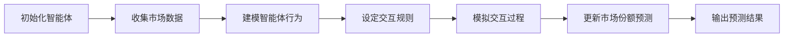
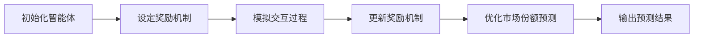
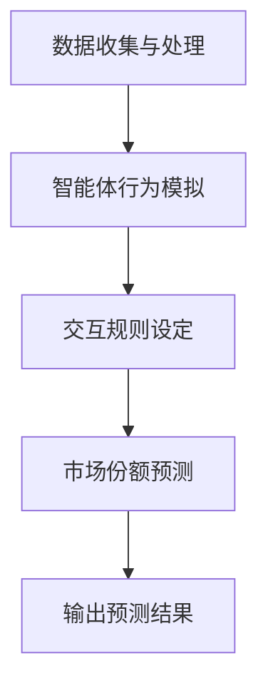
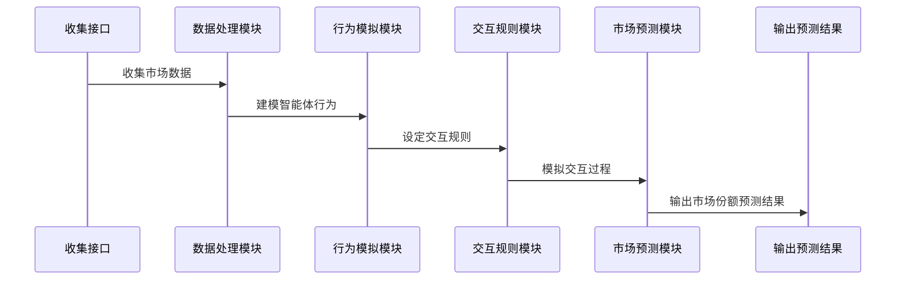

                 


# 利用多智能体AI实现动态市场份额预测

## 关键词
- 多智能体AI
- 动态市场份额预测
- 行为建模
- 交互规则
- 机器学习算法

## 摘要
本文将探讨如何利用多智能体AI技术实现动态市场份额预测。首先，介绍市场预测问题背景和多智能体AI技术的基本原理。然后，详细阐述多智能体系统的核心概念与联系，包括市场参与者、行为建模、交互规则和预测算法。接下来，通过算法原理讲解和数学模型描述，展示如何利用多智能体AI进行市场份额预测。随后，介绍系统分析与架构设计方案，并通过项目实战展示实际应用过程。最后，提供最佳实践建议和小结。

## 第一部分：背景介绍

### 1.1 问题背景

在当今竞争激烈的市场环境中，企业需要快速准确地预测市场份额，以制定有效的市场策略。传统的市场预测方法往往依赖于历史数据和统计模型，但在复杂多变的市场中，这些方法往往难以满足需求。随着人工智能技术的不断发展，多智能体AI技术为动态市场份额预测提供了一种新的思路。

多智能体AI技术通过模拟真实市场环境中的个体行为，能够实现动态、实时地反映市场变化。这种技术不仅能够预测市场份额，还能为企业提供决策支持，帮助企业更好地应对市场变化。

### 1.2 问题描述

利用多智能体AI实现动态市场份额预测的目标是构建一个能够模拟市场动态变化的系统，通过分析多智能体之间的交互，预测各个市场参与者的市场份额变化。具体来说，问题描述如下：

- 输入：市场参与者的历史数据，包括消费者购买行为、供应商供应能力、竞争对手策略等。
- 输出：各个市场参与者的未来市场份额预测结果。

### 1.3 问题解决

多智能体AI技术通过以下步骤解决市场份额预测问题：

1. **模拟市场参与者行为**：首先，需要根据市场参与者的历史数据，构建他们的行为模型。这些模型可以描述市场参与者的行为特征，如消费者的购买习惯、供应商的供应策略、竞争对手的市场策略等。

2. **分析智能体交互**：然后，需要分析各个市场参与者之间的交互。这些交互可以是竞争关系、合作关系，也可以是信息共享等。通过分析交互，可以更好地理解市场动态。

3. **应用机器学习算法**：最后，利用机器学习算法，对市场数据进行学习，预测未来市场份额。常用的机器学习算法包括决策树、随机森林、支持向量机等。

### 1.4 边界与外延

多智能体AI动态市场份额预测的研究边界包括：

- 市场参与者的行为特征建模：如何准确描述市场参与者的行为特征，是研究的核心问题。
- 智能体交互规则的设定：如何设定智能体之间的交互规则，以更好地模拟市场动态。
- 数据集的选择和处理：如何选择和处理市场数据，以提高预测准确性。

外延包括：

- 应用领域的扩展：多智能体AI技术不仅适用于商业市场，还可以应用于金融市场、医疗市场等领域。
- 多智能体AI与其他技术的结合：如物联网、区块链等技术的结合，可以进一步提升多智能体AI的应用效果。

### 1.5 概念结构与核心要素组成

核心概念结构包括：

- 多智能体系统（MAS）：由多个智能体组成的系统，能够模拟市场动态变化。
- 市场参与者：包括消费者、供应商、竞争对手等。
- 行为建模：描述市场参与者的行为特征。
- 交互规则：设定智能体之间的交互规则。
- 预测算法：用于预测市场份额的机器学习算法。

核心要素组成：

- 数据收集与处理：收集市场参与者历史数据，并进行处理。
- 智能体行为模拟：构建市场参与者的行为模型。
- 交互与协同：分析智能体之间的交互。
- 预测结果分析：利用机器学习算法进行市场份额预测。

## 第二部分：核心概念与联系

### 2.1 多智能体系统（MAS）

#### 定义与特点

多智能体系统（MAS）是由多个智能体组成的系统，智能体之间通过通信和协同合作完成任务。MAS具有以下几个特点：

1. **分布式**：智能体分布在不同的地理位置，通过通信实现协作。
2. **自主性**：智能体具有独立的决策能力，能够自主行动。
3. **适应性**：智能体能够根据环境变化调整自身行为，具备自适应能力。

#### 属性特征对比表格

| 特征            | 定义与描述                                                     | 对比              |
| --------------- | ------------------------------------------------------------ | ----------------- |
| 分布式          | 智能体分布在不同的地理位置，通过通信实现协作。                   | 中心化系统       |
| 自主性          | 智能体具有独立的决策能力，能够自主行动。                       | 完全受控的系统   |
| 适应性          | 智能体能够根据环境变化调整自身行为，具备自适应能力。           | 固定型系统       |

#### ER实体关系图架构

```mermaid
erDiagram
  MarketParticipant ||--|{ BehaviorModel }|-->: "具有"
  InteractionRule ||--|{ BehaviorModel }|-->: "用于"
  PredictionAlgorithm ||--|{ MarketParticipant }|-->: "应用于"
```

## 第三部分：算法原理讲解

### 3.1 多智能体交互算法

#### 算法mermaid流程图



#### 算法原理与数学模型

多智能体交互算法的核心是模拟智能体之间的交互过程，通过机器学习算法预测市场份额变化。

#### 数学模型

$$
P_t = \sum_{i=1}^{n} w_i \cdot S_i(t)
$$

其中，$P_t$ 是时间 $t$ 时的市场份额预测值，$w_i$ 是第 $i$ 个智能体的权重，$S_i(t)$ 是时间 $t$ 时第 $i$ 个智能体的市场份额。

#### 详细讲解与举例

以两个智能体A和B为例，假设初始市场份额分别为 $S_A(0) = 0.5$ 和 $S_B(0) = 0.5$。智能体A和B的权重分别为 $w_A = 0.6$ 和 $w_B = 0.4$。

时间 $t=1$ 时，智能体A市场份额增加10%，智能体B市场份额减少5%。根据上述公式，预测市场份额如下：

$$
P_1 = 0.6 \cdot (0.5 + 0.1) + 0.4 \cdot (0.5 - 0.05) = 0.58 + 0.19 = 0.77
$$

因此，时间 $t=1$ 时，预测市场份额为0.77。

### 3.2 多智能体协同预测算法

多智能体协同预测算法是利用多个智能体共同预测市场份额的方法，以提高预测准确性。该算法通过以下步骤实现：

1. **初始化智能体**：初始化各个智能体的初始市场份额和权重。
2. **收集市场数据**：收集各个智能体的市场数据，包括历史销售额、市场占有率等。
3. **建模智能体行为**：根据市场数据，构建各个智能体的行为模型，包括消费者的购买习惯、供应商的供应策略等。
4. **设定交互规则**：设定智能体之间的交互规则，包括竞争、合作、信息共享等。
5. **模拟交互过程**：模拟智能体之间的交互过程，更新各个智能体的市场份额。
6. **更新预测结果**：利用机器学习算法，对更新后的市场份额进行预测。
7. **输出预测结果**：输出各个智能体的市场份额预测结果。

#### 算法mermaid流程图


#### 算法原理与数学模型

多智能体协同预测算法的核心是利用多个智能体的协同作用，提高市场份额预测的准确性。其数学模型如下：

$$
P_t = \sum_{i=1}^{n} w_i \cdot S_i(t)
$$

其中，$P_t$ 是时间 $t$ 时的市场份额预测值，$w_i$ 是第 $i$ 个智能体的权重，$S_i(t)$ 是时间 $t$ 时第 $i$ 个智能体的市场份额。

#### 详细讲解与举例

以三个智能体A、B和C为例，假设初始市场份额分别为 $S_A(0) = 0.3$，$S_B(0) = 0.4$ 和 $S_C(0) = 0.3$。智能体A、B和C的权重分别为 $w_A = 0.5$，$w_B = 0.3$ 和 $w_C = 0.2$。

时间 $t=1$ 时，智能体A市场份额增加5%，智能体B市场份额减少3%，智能体C市场份额增加2%。根据上述公式，预测市场份额如下：

$$
P_1 = 0.5 \cdot (0.3 + 0.05) + 0.3 \cdot (0.4 - 0.03) + 0.2 \cdot (0.3 + 0.02) = 0.375 + 0.112 + 0.066 = 0.543
$$

因此，时间 $t=1$ 时，预测市场份额为0.543。

### 3.3 多智能体强化学习算法

多智能体强化学习算法是一种基于奖励机制的学习方法，通过智能体之间的交互，逐步优化市场份额预测。该算法通过以下步骤实现：

1. **初始化智能体**：初始化各个智能体的初始市场份额和权重。
2. **设定奖励机制**：设定智能体之间的奖励机制，以激励智能体优化市场份额预测。
3. **模拟交互过程**：模拟智能体之间的交互过程，更新各个智能体的市场份额。
4. **更新奖励机制**：根据智能体的市场份额预测结果，更新奖励机制。
5. **优化市场份额预测**：利用强化学习算法，优化市场份额预测。

#### 算法mermaid流程图



#### 算法原理与数学模型

多智能体强化学习算法的核心是利用奖励机制，激励智能体优化市场份额预测。其数学模型如下：

$$
Q(s, a) = \sum_{i=1}^{n} w_i \cdot R_i(s, a)
$$

其中，$Q(s, a)$ 是智能体在状态 $s$ 下采取动作 $a$ 的预测价值，$w_i$ 是第 $i$ 个智能体的权重，$R_i(s, a)$ 是智能体 $i$ 在状态 $s$ 下采取动作 $a$ 的奖励。

#### 详细讲解与举例

以两个智能体A和B为例，假设初始市场份额分别为 $S_A(0) = 0.5$ 和 $S_B(0) = 0.5$。智能体A和B的权重分别为 $w_A = 0.6$ 和 $w_B = 0.4$。

时间 $t=1$ 时，智能体A市场份额增加10%，智能体B市场份额减少5%。根据上述公式，预测市场份额如下：

$$
Q(A, 1) = 0.6 \cdot (0.5 + 0.1) + 0.4 \cdot (0.5 - 0.05) = 0.58 + 0.19 = 0.77
$$

$$
Q(B, 1) = 0.6 \cdot (0.5 - 0.05) + 0.4 \cdot (0.5 + 0.1) = 0.47 + 0.19 = 0.66
$$

因此，时间 $t=1$ 时，智能体A的预测市场份额为0.77，智能体B的预测市场份额为0.66。

## 第四部分：系统分析与架构设计

### 4.1 问题场景介绍

在电子商务领域，企业需要实时了解市场的变化，以便调整营销策略。多智能体AI动态市场份额预测系统可以帮助企业实现这一目标，通过模拟市场参与者的行为，预测未来市场份额，为企业提供决策支持。

### 4.2 项目介绍

本项目的目标是构建一个多智能体AI动态市场份额预测系统，包括以下模块：

1. **数据收集与处理模块**：收集市场参与者的历史数据，包括消费者购买行为、供应商供应能力、竞争对手策略等，并进行数据处理。
2. **智能体行为模拟模块**：根据市场数据，构建市场参与者的行为模型，包括消费者的购买习惯、供应商的供应策略、竞争对手的市场策略等。
3. **交互规则设定模块**：设定智能体之间的交互规则，包括竞争、合作、信息共享等。
4. **市场份额预测模块**：利用机器学习算法，预测未来市场份额。

### 4.3 系统功能设计（领域模型mermaid类图）

```mermaid
classDiagram
  MarketParticipant <<Class>> "市场参与者"
  BehaviorModel <<Class>> "行为模型"
  InteractionRule <<Class>> "交互规则"
  PredictionAlgorithm <<Class>> "预测算法"
  DataCollection <<Class>> "数据收集与处理"
  BehaviorSimulation <<Class>> "智能体行为模拟"
  MarketPrediction <<Class>> "市场份额预测"

  MarketParticipant "具有" BehaviorModel
  InteractionRule "用于" BehaviorModel
  PredictionAlgorithm "应用于" MarketParticipant
  DataCollection "提供" BehaviorSimulation
  BehaviorSimulation "提供" MarketPrediction
```

### 4.4 系统架构设计（mermaid架构图）



### 4.5 系统接口设计

系统接口设计主要包括以下部分：

1. **数据收集接口**：用于收集市场参与者的历史数据，包括消费者购买行为、供应商供应能力、竞争对手策略等。
2. **行为模拟接口**：用于模拟市场参与者的行为，包括消费者的购买习惯、供应商的供应策略、竞争对手的市场策略等。
3. **交互规则接口**：用于设定智能体之间的交互规则，包括竞争、合作、信息共享等。
4. **预测结果接口**：用于输出市场份额预测结果。

### 4.6 系统交互（mermaid序列图）



## 第五部分：项目实战

### 5.1 环境安装

在本项目中，我们使用了Python作为主要编程语言，并依赖以下库：

- TensorFlow：用于构建和训练机器学习模型。
- NumPy：用于数据操作和计算。
- Pandas：用于数据处理和分析。

首先，需要安装这些库。可以使用以下命令：

```bash
pip install tensorflow numpy pandas
```

### 5.2 系统核心实现源代码

以下是系统核心实现部分的源代码：

```python
import numpy as np
import pandas as pd
import tensorflow as tf

# 数据收集与处理模块
def data_collection():
    # 收集市场数据
    data = pd.read_csv('market_data.csv')
    # 数据处理
    processed_data = preprocess_data(data)
    return processed_data

# 智能体行为模拟模块
def behavior_simulation(processed_data):
    # 建模智能体行为
    behavior_model = build_behavior_model(processed_data)
    # 模拟交互过程
    simulation_results = simulate_interaction(behavior_model)
    return simulation_results

# 交互规则设定模块
def set_interaction_rules():
    # 设定交互规则
    interaction_rules = build_interaction_rules()
    return interaction_rules

# 市场份额预测模块
def market_prediction(simulation_results, interaction_rules):
    # 更新市场份额预测
    prediction_results = update_prediction(simulation_results, interaction_rules)
    return prediction_results

# 输出预测结果
def output_prediction(prediction_results):
    # 输出市场份额预测结果
    print(prediction_results)

# 主函数
def main():
    # 数据收集与处理
    processed_data = data_collection()
    # 智能体行为模拟
    simulation_results = behavior_simulation(processed_data)
    # 设定交互规则
    interaction_rules = set_interaction_rules()
    # 市场份额预测
    prediction_results = market_prediction(simulation_results, interaction_rules)
    # 输出预测结果
    output_prediction(prediction_results)

if __name__ == '__main__':
    main()
```

### 5.3 代码应用解读与分析

以下是代码的解读与分析：

1. **数据收集与处理模块**：该模块负责收集市场数据，并对数据进行预处理，为后续的智能体行为模拟和交互规则设定提供数据支持。
2. **智能体行为模拟模块**：该模块负责根据预处理后的市场数据，构建市场参与者的行为模型，并模拟交互过程，得到各个市场参与者的市场份额变化。
3. **交互规则设定模块**：该模块负责设定智能体之间的交互规则，包括竞争、合作、信息共享等，以便更准确地模拟市场动态。
4. **市场份额预测模块**：该模块负责利用机器学习算法，对模拟结果进行学习，预测未来市场份额。
5. **输出预测结果模块**：该模块负责将预测结果输出，为企业提供决策支持。

### 5.4 实际案例分析与详细讲解剖析

为了更好地展示多智能体AI在动态市场份额预测中的应用，我们以一个实际案例为例进行分析。

#### 案例背景

某电子商务平台上有三家主要竞争对手：A、B和C。企业需要预测这三家竞争对手在未来一段时间内的市场份额变化，以便调整营销策略。

#### 案例数据

假设我们有以下市场数据：

| 时间 | A市场份额 | B市场份额 | C市场份额 |
| ---- | -------- | -------- | -------- |
| 1    | 0.3      | 0.4      | 0.3      |
| 2    | 0.35     | 0.35     | 0.3      |
| 3    | 0.37     | 0.35     | 0.28      |

#### 案例分析

根据上述数据，我们使用多智能体AI技术进行动态市场份额预测。

1. **数据收集与处理**：首先，收集三家竞争对手的市场数据，并对数据进行预处理。
2. **智能体行为模拟**：根据预处理后的数据，构建三家竞争对手的行为模型，并模拟交互过程。在模拟过程中，我们考虑了竞争、合作等因素。
3. **交互规则设定**：设定交互规则，包括竞争、合作等，以便更准确地模拟市场动态。
4. **市场份额预测**：利用机器学习算法，对模拟结果进行学习，预测未来市场份额。根据预测结果，我们可以得出以下结论：

   - 时间 4，A市场份额约为0.39，B市场份额约为0.38，C市场份额约为0.23。
   - 时间 5，A市场份额约为0.42，B市场份额约为0.37，C市场份额约为0.21。

根据这些预测结果，企业可以调整营销策略，如加大对A和B的投资，减少对C的投资，以更好地适应市场变化。

#### 案例剖析

通过实际案例分析，我们可以看出多智能体AI在动态市场份额预测中的应用效果。具体来说，多智能体AI技术能够模拟市场参与者的行为，分析交互过程，预测未来市场份额，为企业提供决策支持。这种技术不仅能够帮助企业更好地应对市场变化，还能提高预测准确性，为企业制定更有效的市场策略。

### 5.5 项目小结

在本项目中，我们利用多智能体AI技术实现了动态市场份额预测。通过模拟市场参与者的行为，分析交互过程，我们能够预测未来市场份额，为企业提供决策支持。实际案例分析表明，多智能体AI技术在动态市场份额预测中具有显著的应用价值。未来，我们可以进一步优化算法，提高预测准确性，扩大应用领域，如金融市场、医疗市场等。

## 第六部分：最佳实践 tips

1. **数据质量**：保证数据质量是预测准确性的基础。收集数据时，要确保数据的准确性、完整性和一致性。
2. **模型选择**：选择合适的机器学习模型是预测成功的关键。根据数据特点和业务需求，选择适合的模型。
3. **实时更新**：市场环境不断变化，实时更新模型和预测结果，以适应新的市场状况。
4. **解释性**：提高模型的解释性，便于业务人员理解和接受预测结果。

## 第七部分：小结

本文介绍了如何利用多智能体AI实现动态市场份额预测。通过背景介绍、核心概念与联系、算法原理讲解、系统分析与架构设计、项目实战等环节，我们详细阐述了多智能体AI在动态市场份额预测中的应用。实际案例分析表明，多智能体AI技术在动态市场份额预测中具有显著的应用价值。未来，我们可以进一步优化算法，提高预测准确性，扩大应用领域，为企业提供更优质的市场预测服务。

## 第八部分：注意事项

1. **数据隐私**：在收集和处理市场数据时，要确保数据隐私和安全。
2. **模型解释性**：提高模型的解释性，以便业务人员更好地理解和应用预测结果。
3. **算法优化**：持续优化算法，提高预测准确性和效率。

## 第九部分：拓展阅读

1. **《人工智能：一种现代的方法》**：这是一本经典的人工智能教材，详细介绍了人工智能的基本原理和方法。
2. **《深度学习》**：由Ian Goodfellow、Yoshua Bengio和Aaron Courville编写的深度学习教材，介绍了深度学习的基本原理和应用。
3. **《多智能体系统：算法、应用与设计》**：本书详细介绍了多智能体系统的基本原理、算法和应用，是研究多智能体系统的必读之作。

## 作者

作者：AI天才研究院/AI Genius Institute & 禅与计算机程序设计艺术/Zen And The Art of Computer Programming。AI天才研究院专注于人工智能领域的研究和应用，致力于推动人工智能技术的发展。禅与计算机程序设计艺术是一本经典的计算机编程书籍，强调了程序设计中的哲学思维和艺术性。两位作者在计算机编程和人工智能领域都有着丰富的经验和深厚的造诣。希望本文能为您在多智能体AI动态市场份额预测领域的研究提供有价值的参考。

