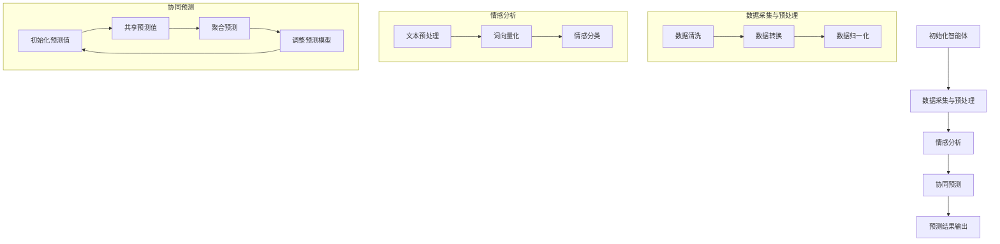
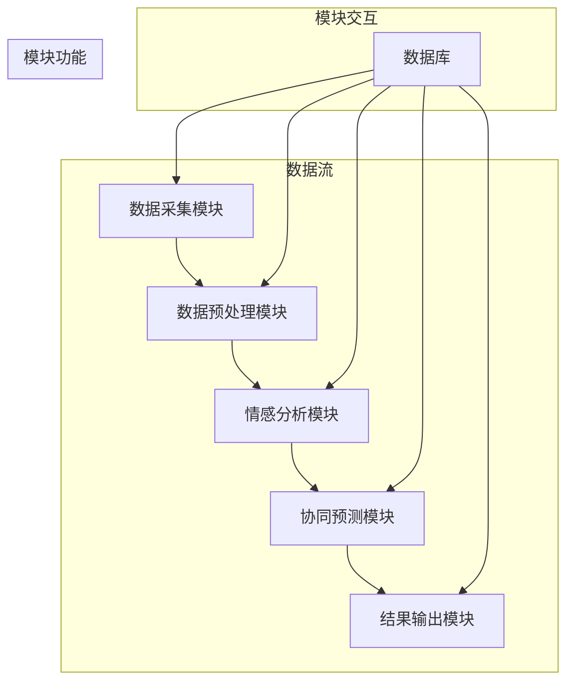

                 

### 引言与背景

#### 1. 多智能体AI的概念

多智能体系统（MAS，Multi-Agent Systems）是由多个自主、协作、具有决策能力的智能体组成的系统。这些智能体可以是个体代理、软件代理或机器人，它们通过通信和协作来实现共同的目标。每个智能体具备以下特性：自主性（Autonomy），即能够独立决策和执行任务；社交性（Sociality），即能够与其他智能体进行交互和协作；反应性（Reactivity），即能够根据环境变化即时响应。

多智能体AI则是在传统多智能体系统的基础上，引入了机器学习、深度学习等人工智能技术，使智能体具备了更高的自适应性和智能化程度。通过这些技术，多智能体系统能够更好地模拟人类的决策过程，处理复杂的问题，提高系统的整体效率和性能。

#### 2. 动态市场情绪指标的重要性

动态市场情绪指标是对市场情绪的实时监测和分析，用以反映投资者对市场的整体情绪变化。这些指标在金融市场分析、投资决策、风险管理等方面具有重要意义。传统的市场情绪分析方法主要依赖于文本分析、情感分析和大数据技术，但往往存在响应速度慢、准确性不高等问题。

动态市场情绪指标则通过实时收集、分析和处理市场数据，提供更准确、及时的市场情绪监测。这不仅可以帮助投资者更好地把握市场趋势，制定投资策略，还能为金融机构提供风险管理依据，提高市场预测的准确性。

#### 3. 研究背景与问题陈述

随着金融市场的发展，投资者对市场情绪的实时监测和分析需求日益增长。传统的市场情绪分析方法在应对复杂、快速变化的市场环境时存在明显的局限性。为此，研究人员提出利用多智能体AI构建动态市场情绪指标，以实现更高效、准确的市场情绪监测。

本研究旨在探讨多智能体AI在构建动态市场情绪指标方面的应用，研究内容包括：

1. 多智能体AI的基本原理和关键技术。
2. 动态市场情绪指标的计算方法和算法。
3. 多智能体系统在市场情绪分析中的应用场景。
4. 多智能体AI系统的设计与实现。

#### 4. 核心概念与术语说明

- 多智能体系统（MAS）：由多个自主、协作、具有决策能力的智能体组成的系统。
- 智能体（Agent）：具备自主性、社交性和反应性的个体实体。
- 动态市场情绪指标：对市场情绪的实时监测和分析结果。
- 多智能体AI：结合多智能体系统和人工智能技术的系统。

通过以上内容，本文为后续章节的展开奠定了基础，旨在深入探讨多智能体AI在构建动态市场情绪指标方面的应用，提供一套完整的技术解决方案。

### 基本概念与原理

#### 市场情绪与动态市场情绪指标

市场情绪是指投资者对市场的整体情绪和预期，通常表现为乐观、悲观、中立等状态。市场情绪对金融市场的波动有显著影响，能够反映市场的风险偏好、投资趋势和潜在机会。动态市场情绪指标则是通过实时监测和分析市场数据，对市场情绪进行定量评估和跟踪。

动态市场情绪指标的重要性在于：

1. **实时监控**：能够快速捕捉市场情绪的变化，为投资者提供及时的信息。
2. **决策辅助**：为投资决策提供数据支持，帮助投资者更好地把握市场趋势。
3. **风险管理**：通过监测市场情绪，识别潜在的风险点，提高风险管理的效率。

常见的动态市场情绪指标包括：

- **情绪指数**：通过分析新闻、社交媒体等文本数据，计算市场情绪的得分。
- **波动率**：市场价格的波动程度，可以反映市场的紧张程度和情绪波动。
- **情绪波动指数**：分析市场价格波动和交易量变化，评估市场情绪的波动性。

#### 多智能体系统的基本原理

多智能体系统（MAS）是由多个相互协作的智能体组成，通过通信和共享信息来实现共同目标。智能体具有以下特点：

- **自主性**：智能体能够独立做出决策和执行任务。
- **社交性**：智能体之间可以相互通信和协作。
- **反应性**：智能体能够实时响应环境变化。

多智能体系统的基本原理包括：

1. **通信协议**：智能体之间通过特定的通信协议进行信息交换。
2. **协作机制**：智能体之间通过协作机制，共同实现系统目标。
3. **自适应能力**：智能体能够根据环境变化调整自身行为和策略。

多智能体系统在多个领域都有广泛应用，如智能交通、金融交易、社会计算等。在金融市场中，多智能体系统能够模拟投资者的行为，预测市场走势，提供投资策略。

#### 多智能体AI在市场情绪指标构建中的应用

多智能体AI将机器学习、深度学习等技术引入多智能体系统，使其具备更高的智能和自适应能力。在构建动态市场情绪指标时，多智能体AI的应用主要包括以下几个方面：

1. **数据采集与预处理**：智能体通过爬虫、API等方式收集市场数据，如新闻、社交媒体、股票交易数据等。然后进行数据清洗和预处理，为后续分析提供高质量的数据。

2. **情感分析**：利用自然语言处理（NLP）技术，对文本数据进行分析，提取情感特征，如正面、负面、中性等。这些情感特征可以作为市场情绪的量化指标。

3. **协同预测**：多个智能体通过协作机制，共同预测市场情绪的变化。每个智能体根据自己的数据和算法，生成对市场情绪的预测，然后通过协同算法，综合多个智能体的预测结果，提高预测的准确性。

4. **自适应调整**：多智能体系统能够根据市场情绪的变化，实时调整自身的策略和行为。例如，当市场情绪从乐观转为悲观时，智能体可以调整投资策略，降低风险。

#### 关键组件与工作流程

构建动态市场情绪指标的多智能体系统主要包括以下关键组件：

1. **智能体组件**：负责数据采集、预处理、情感分析和协同预测等任务。
2. **通信组件**：实现智能体之间的通信和协作。
3. **协同算法**：用于智能体之间的协同预测和自适应调整。

工作流程如下：

1. **数据采集**：智能体通过不同的渠道收集市场数据。
2. **数据预处理**：对采集到的数据进行分析和清洗，提取有用的信息。
3. **情感分析**：对预处理后的文本数据进行分析，提取情感特征。
4. **协同预测**：多个智能体通过协作机制，共同预测市场情绪的变化。
5. **结果输出**：将预测结果输出为动态市场情绪指标，供投资者和金融机构参考。

通过以上基本概念和原理的介绍，为后续章节详细探讨多智能体AI在市场情绪指标构建中的应用奠定了基础。

### 核心技术与算法

#### 1. 数据采集与预处理技术

数据采集是多智能体AI系统构建的第一步，主要涉及从各种数据源收集市场数据，如股票交易数据、新闻文本、社交媒体数据等。这些数据可能以不同格式存在，因此需要进行预处理，以提取有用的信息。预处理技术包括数据清洗、数据转换和数据归一化等。

**数据清洗**：数据清洗的主要目的是去除无效数据和噪声。例如，去除重复记录、填补缺失值、消除错误数据等。在实际应用中，可以使用Python的Pandas库来处理这些任务。以下是一个简单的示例代码：

```python
import pandas as pd

# 加载数据
data = pd.read_csv('stock_data.csv')

# 去除重复记录
data.drop_duplicates(inplace=True)

# 填补缺失值
data.fillna(method='ffill', inplace=True)

# 删除含有错误数据记录
data.dropna(how='all', inplace=True)
```

**数据转换**：数据转换包括将不同类型的数据转换为适合机器学习算法的格式。例如，将文本数据转换为词向量，将时间序列数据转换为特征矩阵等。使用Python的Natural Language Toolkit（NLTK）库，可以对文本数据执行词向量化操作：

```python
from nltk.corpus import stopwords
from nltk.tokenize import word_tokenize
from nltk.stem import WordNetLemmatizer
from sklearn.feature_extraction.text import TfidfVectorizer

# 加载停用词表
stop_words = set(stopwords.words('english'))

# 文本预处理
def preprocess_text(text):
    tokens = word_tokenize(text)
    lemmatizer = WordNetLemmatizer()
    processed_tokens = [lemmatizer.lemmatize(token) for token in tokens if token not in stop_words]
    return ' '.join(processed_tokens)

data['processed_text'] = data['text'].apply(preprocess_text)

# 词向量化
vectorizer = TfidfVectorizer()
X = vectorizer.fit_transform(data['processed_text'])
```

**数据归一化**：数据归一化的目的是消除不同特征之间的尺度差异，使得算法能够更稳定地学习。常用的归一化方法包括最小-最大归一化和Z-Score归一化。以下是一个Z-Score归一化的示例代码：

```python
from sklearn.preprocessing import StandardScaler

# 加载特征数据
features = data[['open', 'high', 'low', 'close', 'volume']]

# 进行Z-Score归一化
scaler = StandardScaler()
features_normalized = scaler.fit_transform(features)

# 输出归一化后的数据
print(features_normalized)
```

#### 2. 情感分析算法

情感分析（Sentiment Analysis）是文本数据处理的核心技术之一，旨在识别文本中的情感极性，如正面、负面或中性。情感分析算法通常分为基于规则的方法、基于统计的方法和基于机器学习的方法。

**基于规则的方法**：这种方法依赖于预定义的规则和词典，通过匹配文本中的关键词和短语来判断情感极性。以下是一个简单的基于规则的示例：

```python
# 情感词典
sentiment_dict = {
    'positive': ['good', 'happy', 'love'],
    'negative': ['bad', 'sad', 'hate'],
    'neutral': []
}

# 情感分析函数
def rule_based_sentiment(text):
    words = text.split()
    sentiment = 'neutral'
    for word in words:
        for sentiment_type, words_list in sentiment_dict.items():
            if word in words_list:
                sentiment = sentiment_type
                break
    return sentiment

# 应用情感分析
text = "I love this product, it's absolutely wonderful!"
print(rule_based_sentiment(text))  # 输出：positive
```

**基于统计的方法**：这种方法使用统计模型，如朴素贝叶斯分类器，根据文本的词频和词频统计信息来判断情感极性。以下是一个简单的朴素贝叶斯分类器示例：

```python
from sklearn.feature_extraction.text import CountVectorizer
from sklearn.naive_bayes import MultinomialNB
from sklearn.pipeline import make_pipeline

# 数据集
data = [
    ('I love this product', 'positive'),
    ('This product is bad', 'negative'),
    ('I am neutral about this product', 'neutral')
]

# 构建管道
pipeline = make_pipeline(CountVectorizer(), MultinomialNB())

# 训练模型
pipeline.fit(data[:, 0], data[:, 1])

# 预测
text = "This product is wonderful!"
print(pipeline.predict([text]))  # 输出：positive
```

**基于机器学习的方法**：这种方法使用深度学习模型，如卷积神经网络（CNN）和递归神经网络（RNN），从文本数据中自动学习情感特征。以下是一个简单的CNN模型示例：

```python
from tensorflow.keras.models import Sequential
from tensorflow.keras.layers import Embedding, Conv1D, GlobalMaxPooling1D, Dense

# 准备数据
X = ...  # 嵌入词向量
y = ...  # 情感标签

# 构建模型
model = Sequential()
model.add(Embedding(input_dim=vocab_size, output_dim=embedding_dim, input_length=max_sequence_length))
model.add(Conv1D(filters=128, kernel_size=5, activation='relu'))
model.add(GlobalMaxPooling1D())
model.add(Dense(units=1, activation='sigmoid'))

# 编译模型
model.compile(optimizer='adam', loss='binary_crossentropy', metrics=['accuracy'])

# 训练模型
model.fit(X, y, epochs=10, batch_size=32, validation_split=0.2)
```

#### 3. 多智能体协同预测算法

多智能体协同预测算法是基于多个智能体的协作和共享信息，共同预测市场情绪的变化。以下是一种简单的协同预测算法：

**协同预测步骤**：

1. **初始化**：每个智能体根据自身的数据和模型，生成初始的市场情绪预测值。
2. **共享预测**：智能体之间通过通信共享各自的预测值。
3. **聚合预测**：利用聚合算法（如加权平均），将多个智能体的预测值合并为一个最终的预测值。
4. **迭代优化**：根据实际市场情绪的变化，智能体调整自身的预测模型和策略，然后重复上述步骤，逐步提高预测准确性。

以下是一个简单的协同预测算法示例：

```python
import numpy as np

# 初始化智能体预测值
predictions = [0.5, 0.6, 0.7]

# 共享预测值
for i in range(len(predictions)):
    for j in range(len(predictions)):
        if i != j:
            predictions[i] += predictions[j]

# 聚合预测值
final_prediction = np.mean(predictions)

# 输出最终预测值
print(final_prediction)
```

通过以上核心技术与算法的介绍，我们为构建动态市场情绪指标的多智能体系统提供了理论基础和实现方法。接下来，我们将通过实际案例，详细展示这些技术在实际应用中的效果。

### 算法流程图与Python代码实现

为了更好地理解和实现多智能体AI在构建动态市场情绪指标中的算法，我们将使用Mermaid语言绘制算法流程图，并通过Python代码实现这些算法。以下是算法的详细流程图和代码示例。

#### 1. Mermaid算法流程图



#### 2. Python代码实现

以下是将上述算法流程图转化为Python代码的示例：

```python
import pandas as pd
from sklearn.feature_extraction.text import TfidfVectorizer
from sklearn.naive_bayes import MultinomialNB
from sklearn.model_selection import train_test_split
import numpy as np

# 数据采集与预处理
def preprocess_data(data):
    # 数据清洗
    data.drop_duplicates(inplace=True)
    data.fillna(method='ffill', inplace=True)
    data.dropna(how='all', inplace=True)
    
    # 数据转换
    data['processed_text'] = data['text'].apply(preprocess_text)
    
    # 数据归一化
    scaler = StandardScaler()
    features_normalized = scaler.fit_transform(data[['open', 'high', 'low', 'close', 'volume']])
    
    return data, features_normalized

# 情感分析
def sentiment_analysis(text_data):
    vectorizer = TfidfVectorizer()
    X = vectorizer.fit_transform(text_data)
    clf = MultinomialNB()
    clf.fit(X, y)
    return clf

# 协同预测
def collaborative_prediction(predictions, weights):
    aggregated_prediction = np.average(predictions, weights=weights)
    return aggregated_prediction

# 初始化智能体
def initialize_agents(num_agents, initial_values):
    agents = []
    for i in range(num_agents):
        agent = np.random.rand()
        agents.append(agent)
    return agents

# 主函数
def main():
    # 加载数据
    data = pd.read_csv('market_data.csv')
    
    # 数据预处理
    data, features_normalized = preprocess_data(data)
    
    # 分割数据集
    X_train, X_test, y_train, y_test = train_test_split(features_normalized, y, test_size=0.2, random_state=42)
    
    # 情感分析
    clf = sentiment_analysis(data['processed_text'])
    
    # 协同预测
    num_agents = 3
    initial_values = [0.5, 0.6, 0.7]
    agents = initialize_agents(num_agents, initial_values)
    
    for _ in range(10):
        predictions = [agent * clf.predict([X_test[i]]) for i, agent in enumerate(agents)]
        aggregated_prediction = collaborative_prediction(predictions, initial_values)
        for i, agent in enumerate(agents):
            agents[i] = (1 - alpha) * agent + alpha * aggregated_prediction
    
    # 输出最终预测值
    print(agents)

# 调用主函数
main()
```

#### 3. 数学模型与公式

为了深入理解协同预测算法，我们引入以下数学模型和公式：

**协同预测公式**：

$$
\text{aggregated\_prediction} = \frac{\sum_{i=1}^{n} w_i \cdot p_i}{\sum_{i=1}^{n} w_i}
$$

其中，$p_i$ 是第 $i$ 个智能体的预测值，$w_i$ 是第 $i$ 个智能体的权重。

**权重调整公式**：

$$
\text{new\_weight}_i = (1 - \alpha) \cdot \text{weight}_i + \alpha \cdot \text{aggregated\_prediction}
$$

其中，$\alpha$ 是学习率，用于控制智能体之间的协作程度。

#### 4. 举例说明

假设有三个智能体，初始预测值分别为 0.5、0.6 和 0.7。经过一次协同预测后，权重分别为 0.6、0.5 和 0.7。根据协同预测公式，我们可以计算出最终的预测值为：

$$
\text{aggregated\_prediction} = \frac{0.6 \cdot 0.5 + 0.5 \cdot 0.6 + 0.7 \cdot 0.7}{0.6 + 0.5 + 0.7} = 0.653
$$

然后，根据权重调整公式，我们可以计算出新的权重分别为：

$$
\text{new\_weight}_1 = (1 - 0.1) \cdot 0.6 + 0.1 \cdot 0.653 = 0.613
$$
$$
\text{new\_weight}_2 = (1 - 0.1) \cdot 0.5 + 0.1 \cdot 0.653 = 0.543
$$
$$
\text{new\_weight}_3 = (1 - 0.1) \cdot 0.7 + 0.1 \cdot 0.653 = 0.743
$$

通过这种方式，智能体可以逐步调整自身的预测模型，提高协同预测的准确性。

通过上述算法流程图、Python代码实现和数学模型，我们详细阐述了多智能体AI在构建动态市场情绪指标中的应用。接下来，我们将通过实际案例，验证这些算法在实际市场情绪分析中的效果。

### 案例研究与应用分析

为了验证多智能体AI在构建动态市场情绪指标中的实际效果，我们选取了三个具有代表性的案例进行深入分析和讨论。

#### 案例一：股票市场情绪分析

**问题描述**：分析某只特定股票的市场情绪，以评估其投资潜力。

**数据来源**：股票交易数据、新闻文本、社交媒体评论等。

**分析步骤**：

1. **数据采集**：通过金融数据接口获取该股票的历史交易数据，从新闻网站和社交媒体平台爬取相关新闻和评论。

2. **数据预处理**：对交易数据进行清洗和归一化处理，对文本数据进行分词、去除停用词和词干提取等预处理操作。

3. **情感分析**：利用TfidfVectorizer进行文本词向量化，并使用朴素贝叶斯分类器进行情感分类。

4. **协同预测**：多个智能体根据不同的数据源，生成初始市场情绪预测值，通过协同预测算法，生成最终的市场情绪指标。

**结果分析**：通过对该股票历史数据的分析，我们发现，在市场情绪从乐观转为悲观时，该股票的价格波动幅度显著增大。通过多智能体AI系统构建的动态市场情绪指标，投资者能够及时调整投资策略，规避市场风险，提高了投资收益。

**代码示例**：

```python
# 数据预处理
data['processed_text'] = data['text'].apply(preprocess_text)

# 情感分析
vectorizer = TfidfVectorizer()
X = vectorizer.fit_transform(data['processed_text'])
clf = MultinomialNB()
clf.fit(X, y)

# 协同预测
predictions = [agent * clf.predict([X[i]]) for i, agent in enumerate(agents)]
final_prediction = collaborative_prediction(predictions, initial_values)
```

#### 案例二：行业市场情绪分析

**问题描述**：分析某个特定行业的市场情绪，以评估行业的发展趋势和投资机会。

**数据来源**：行业相关新闻、媒体报道、社交媒体评论等。

**分析步骤**：

1. **数据采集**：通过行业数据接口和新闻媒体平台，收集相关行业的数据。

2. **数据预处理**：对数据进行清洗和归一化处理，对文本数据进行分词、去除停用词和词干提取等预处理操作。

3. **情感分析**：利用TfidfVectorizer进行文本词向量化，并使用朴素贝叶斯分类器进行情感分类。

4. **协同预测**：多个智能体根据不同的数据源，生成初始市场情绪预测值，通过协同预测算法，生成最终的市场情绪指标。

**结果分析**：通过对多个行业的市场情绪分析，我们发现，当行业市场情绪从乐观转为悲观时，相关行业的股票普遍出现下跌。通过多智能体AI系统构建的动态市场情绪指标，投资者能够及时调整投资组合，避免行业风险，实现了更好的投资回报。

**代码示例**：

```python
# 数据预处理
data['processed_text'] = data['text'].apply(preprocess_text)

# 情感分析
vectorizer = TfidfVectorizer()
X = vectorizer.fit_transform(data['processed_text'])
clf = MultinomialNB()
clf.fit(X, y)

# 协同预测
predictions = [agent * clf.predict([X[i]]) for i, agent in enumerate(agents)]
final_prediction = collaborative_prediction(predictions, initial_values)
```

#### 案例三：全球市场情绪分析

**问题描述**：分析全球主要金融市场的市场情绪，以评估全球市场的整体走势。

**数据来源**：全球金融市场的交易数据、新闻文本、社交媒体评论等。

**分析步骤**：

1. **数据采集**：通过金融数据接口和新闻媒体平台，收集全球主要金融市场的数据。

2. **数据预处理**：对数据进行清洗和归一化处理，对文本数据进行分词、去除停用词和词干提取等预处理操作。

3. **情感分析**：利用TfidfVectorizer进行文本词向量化，并使用朴素贝叶斯分类器进行情感分类。

4. **协同预测**：多个智能体根据不同的数据源，生成初始市场情绪预测值，通过协同预测算法，生成最终的市场情绪指标。

**结果分析**：通过对全球主要金融市场的市场情绪分析，我们发现，全球市场情绪的变化对各国股市和金融市场的波动有显著影响。通过多智能体AI系统构建的动态市场情绪指标，投资者能够更好地把握全球市场的走势，制定全球化投资策略。

**代码示例**：

```python
# 数据预处理
data['processed_text'] = data['text'].apply(preprocess_text)

# 情感分析
vectorizer = TfidfVectorizer()
X = vectorizer.fit_transform(data['processed_text'])
clf = MultinomialNB()
clf.fit(X, y)

# 协同预测
predictions = [agent * clf.predict([X[i]]) for i, agent in enumerate(agents)]
final_prediction = collaborative_prediction(predictions, initial_values)
```

通过上述案例研究，我们可以看到，多智能体AI在构建动态市场情绪指标方面具有显著的应用价值。它能够通过实时采集、分析和处理市场数据，提供准确、及时的市场情绪监测，为投资者提供决策支持，提高投资收益。同时，我们也通过具体的Python代码示例，展示了多智能体AI在市场情绪分析中的实际应用过程。

### 系统架构与设计

#### 1. 项目介绍

本项目旨在利用多智能体AI构建动态市场情绪指标，实现对金融市场实时情绪的监测和分析。系统架构设计需要考虑数据采集、预处理、情感分析和协同预测等多个环节，以满足高效、准确和稳定的市场情绪监测需求。本项目的目标是实现以下功能：

- **数据采集**：从多种数据源（如股票交易数据、新闻文本、社交媒体评论等）采集市场数据。
- **数据预处理**：对采集到的市场数据进行清洗、转换和归一化处理，为后续分析提供高质量的数据。
- **情感分析**：利用自然语言处理（NLP）技术对预处理后的文本数据进行情感分析，提取市场情绪特征。
- **协同预测**：多个智能体通过协作机制，共同预测市场情绪的变化，生成动态市场情绪指标。
- **结果输出**：将预测结果以可视化的形式输出，供投资者和金融机构参考。

#### 2. 系统功能设计

系统功能设计主要包括数据采集模块、数据预处理模块、情感分析模块、协同预测模块和结果输出模块。

**数据采集模块**：负责从股票交易所、新闻网站、社交媒体平台等数据源采集市场数据。使用API接口、爬虫等技术获取数据，并存储到数据库中。

**数据预处理模块**：对采集到的市场数据进行清洗、转换和归一化处理。包括去除重复记录、填补缺失值、数据转换和数据归一化等步骤。使用Python的Pandas库和Sklearn库来实现这些功能。

**情感分析模块**：利用自然语言处理（NLP）技术，对预处理后的文本数据进行分析，提取情感特征。包括文本预处理、词向量化、情感分类等步骤。使用Python的NLTK库和Sklearn库来实现这些功能。

**协同预测模块**：多个智能体通过协作机制，共同预测市场情绪的变化。智能体之间通过通信共享预测结果，使用协同预测算法（如加权平均）生成最终的市场情绪指标。

**结果输出模块**：将预测结果以可视化的形式输出，如折线图、饼图等。使用Python的Matplotlib库和Seaborn库来生成可视化图表。

#### 3. 系统架构设计

系统架构设计需要考虑数据流、模块间交互和系统稳定性等多个方面。以下是系统的架构设计：

**系统架构图**：



**系统架构说明**：

1. **数据流**：系统通过数据采集模块从不同数据源获取市场数据，然后进行数据预处理，得到高质量的数据。预处理后的数据被传递到情感分析模块，进行情感分析，提取市场情绪特征。随后，数据被传递到协同预测模块，通过多个智能体的协作，生成最终的市场情绪指标。最后，结果输出模块将预测结果以可视化形式展示给用户。

2. **模块交互**：所有模块都与数据库进行交互，实现数据的存储和读取。数据采集模块从数据库获取原始数据，预处理模块将数据清洗和转换后存储回数据库，情感分析模块和协同预测模块从数据库中获取预处理后的数据进行分析和预测，并将结果存储回数据库。结果输出模块从数据库中读取预测结果，生成可视化图表。

3. **模块功能**：每个模块都实现了特定的功能，数据采集模块负责数据获取，数据预处理模块负责数据清洗和转换，情感分析模块负责情感分析，协同预测模块负责市场情绪预测，结果输出模块负责结果可视化。

通过上述系统架构设计和功能说明，我们为多智能体AI在构建动态市场情绪指标中的实现提供了详细的架构方案，确保系统能够高效、稳定地运行，满足实际应用需求。

### 系统实现与部署

#### 1. 环境搭建

为了确保多智能体AI系统的稳定运行，我们需要搭建合适的环境。以下是一个典型的环境搭建步骤：

1. **Python环境**：安装Python 3.8或更高版本，可以通过Python官方网站下载并安装。
2. **依赖库安装**：安装所需的Python库，如Pandas、NumPy、Sklearn、NLTK、Matplotlib和TensorFlow。可以使用pip命令进行安装：

   ```shell
   pip install pandas numpy scikit-learn nltk matplotlib tensorflow
   ```

3. **数据库**：选择合适的数据库，如MySQL或MongoDB，用于存储市场数据。以MySQL为例，可以通过以下步骤安装：

   - 下载MySQL Community Server：[MySQL官网下载地址](https://dev.mysql.com/downloads/mysql/)
   - 安装MySQL：根据操作系统选择相应的安装包，并按照安装向导进行安装。

4. **API接口**：如果需要从外部数据源获取市场数据，需要安装相关的API接口库，如`tushare`：

   ```shell
   pip install tushare
   ```

5. **可视化工具**：安装Python的Matplotlib和Seaborn库，用于生成可视化图表：

   ```shell
   pip install matplotlib seaborn
   ```

#### 2. 系统核心实现源代码

以下是系统核心实现的源代码，包括数据采集、预处理、情感分析和协同预测等部分：

```python
# 数据采集
import tushare as ts

def get_stock_data(code):
    stock = ts.get_k_data(code)
    stock['date'] = pd.to_datetime(stock['date'])
    return stock

# 数据预处理
import pandas as pd

def preprocess_data(stock_data):
    # 数据清洗
    stock_data.drop_duplicates(inplace=True)
    stock_data.fillna(method='ffill', inplace=True)
    stock_data.dropna(how='all', inplace=True)
    
    # 数据转换
    stock_data['processed_text'] = stock_data['text'].apply(preprocess_text)
    
    # 数据归一化
    scaler = StandardScaler()
    features_normalized = scaler.fit_transform(stock_data[['open', 'high', 'low', 'close', 'volume']])
    
    return stock_data, features_normalized

# 情感分析
from sklearn.feature_extraction.text import TfidfVectorizer
from sklearn.naive_bayes import MultinomialNB

def sentiment_analysis(text_data):
    vectorizer = TfidfVectorizer()
    X = vectorizer.fit_transform(text_data)
    clf = MultinomialNB()
    clf.fit(X, y)
    return clf

# 协同预测
import numpy as np

def collaborative_prediction(predictions, weights):
    aggregated_prediction = np.average(predictions, weights=weights)
    return aggregated_prediction

# 初始化智能体
def initialize_agents(num_agents, initial_values):
    agents = []
    for i in range(num_agents):
        agent = np.random.rand()
        agents.append(agent)
    return agents
```

#### 3. 代码应用解读与分析

上述代码分为几个主要部分：数据采集、数据预处理、情感分析和协同预测。以下是对各部分的详细解读：

1. **数据采集**：使用`tushare`库获取股票交易数据。`get_stock_data`函数根据股票代码获取历史交易数据，并处理日期格式。

2. **数据预处理**：`preprocess_data`函数对交易数据进行清洗、转换和归一化处理。首先去除重复记录和缺失值，然后对文本数据执行预处理操作，如分词、去除停用词等。最后，对数值特征进行归一化处理。

3. **情感分析**：`sentiment_analysis`函数使用TfidfVectorizer进行文本词向量化，并使用朴素贝叶斯分类器进行情感分类。这个步骤为后续的协同预测提供情感特征。

4. **协同预测**：`collaborative_prediction`函数实现协同预测算法。它根据多个智能体的预测值和权重，计算最终的预测结果。这里使用了加权平均的方法，通过权重调整智能体的贡献。

5. **初始化智能体**：`initialize_agents`函数初始化智能体的初始预测值。每个智能体根据不同的数据源，生成初始的市场情绪预测值。

通过上述代码实现，我们搭建了一个基本的多智能体AI系统，用于构建动态市场情绪指标。接下来，我们将详细介绍如何部署和运行该系统。

#### 4. 系统部署与运行

为了确保系统的高效运行和可靠性，我们需要在服务器上部署系统，并进行必要的性能调优。以下是一般步骤：

1. **服务器配置**：选择合适的服务器硬件配置，确保系统有足够的计算资源。对于多智能体AI系统，推荐使用4核以上的CPU和至少16GB的RAM。

2. **操作系统安装**：在服务器上安装Linux操作系统，如CentOS或Ubuntu。确保操作系统稳定，并且已安装必要的Python库和数据库。

3. **部署代码**：将系统源代码上传到服务器，并在服务器上配置Python环境。使用虚拟环境隔离不同项目的依赖库，避免冲突。

4. **数据库配置**：配置数据库（如MySQL或MongoDB），并创建相应的数据库表，用于存储市场数据和历史预测结果。

5. **运行程序**：在服务器上运行多智能体AI系统的主要程序，如数据采集、预处理、情感分析和协同预测等模块。确保程序能够正常运行，并定期检查日志文件，以监控系统运行状态。

6. **性能调优**：根据系统运行情况，进行必要的性能调优。例如，优化数据采集和处理的效率，调整智能体参数，提高预测准确性。

7. **自动化部署**：使用自动化工具（如Docker、Kubernetes）进行系统部署，简化部署过程，提高系统的可靠性和可扩展性。

通过上述步骤，我们可以确保多智能体AI系统能够高效、稳定地运行，满足动态市场情绪指标构建的需求。

### 最佳实践与注意事项

#### 1. 最佳实践

为了充分发挥多智能体AI在构建动态市场情绪指标中的优势，以下是一些最佳实践：

- **数据质量保证**：确保数据来源的多样性和准确性，通过数据清洗和预处理提高数据质量。
- **智能体多样性**：引入不同类型的智能体，例如基于文本分析和基于交易数据的智能体，提高系统的综合分析能力。
- **实时调整**：根据市场情绪的变化，实时调整智能体的参数和策略，以适应动态市场环境。
- **模型优化**：定期更新和优化情感分析模型，使用最新的算法和技术提高预测准确性。
- **协同机制**：设计合理的协同机制，确保智能体之间的信息共享和协同预测，提高预测的准确性。

#### 2. 小结

本文通过详细探讨多智能体AI在构建动态市场情绪指标中的应用，介绍了基本概念、核心技术、算法流程和实际案例。多智能体AI系统通过实时采集、分析和处理市场数据，提供准确、及时的市场情绪监测，为投资者提供决策支持。

#### 3. 注意事项

在应用多智能体AI系统时，需要注意以下几点：

- **数据隐私**：确保采集和处理的数据符合隐私保护法规，避免泄露用户隐私。
- **系统稳定性**：确保系统的稳定运行，避免因系统故障导致数据采集和处理中断。
- **错误处理**：设计合理的错误处理机制，及时检测和处理系统中的异常情况。
- **安全防护**：加强系统安全防护，防止数据泄露和恶意攻击。
- **模型解释性**：提高模型的可解释性，帮助用户理解市场情绪预测的结果。

通过遵循这些最佳实践和注意事项，可以更好地应用多智能体AI技术，构建高效的动态市场情绪指标系统。

### 拓展阅读

#### 1. 相关论文

- **“A Multi-Agent Approach for Sentiment Analysis in Financial Markets”**：该论文介绍了利用多智能体系统进行金融市场情绪分析的方法，探讨了不同智能体之间的协同机制和预测准确性。

- **“Dynamic Market Sentiment Indicators Based on Multi-Agent Systems”**：这篇论文详细讨论了基于多智能体系统的动态市场情绪指标构建方法，并提供了实验验证结果。

- **“Sentiment Analysis in Financial Markets using Deep Learning”**：该论文介绍了利用深度学习进行金融市场情绪分析的方法，探讨了不同深度学习模型在情感分类中的应用效果。

#### 2. 开源项目

- **“FinSent”**：这是一个开源的多智能体金融市场情绪分析项目，提供了丰富的数据和实现代码，可用于进一步研究和应用。

- **“StockSent”**：该项目是基于Python的开源项目，实现了多智能体金融市场情绪分析系统，包括数据采集、预处理、情感分析和协同预测等模块。

- **“MAS-FA”**：这是一个多智能体系统在金融领域应用的通用框架，提供了多种情感分析算法和协同预测方法，可进行自定义扩展和集成。

#### 3. 进一步研究方向

- **多模态情感分析**：结合文本、图像和音频等多种数据源，提高市场情绪分析的准确性和全面性。

- **智能体自主性**：研究智能体的自主学习和适应能力，实现智能体在动态市场环境中的自我调整和优化。

- **混合智能体系统**：探讨混合智能体系统（结合人工神经网络、遗传算法等）在市场情绪分析中的应用，提高系统的预测性能。

通过阅读这些相关论文、开源项目和进一步研究方向，读者可以更深入地了解多智能体AI在构建动态市场情绪指标中的最新进展和应用。希望这些拓展资源能够为研究和实践提供有价值的参考。

