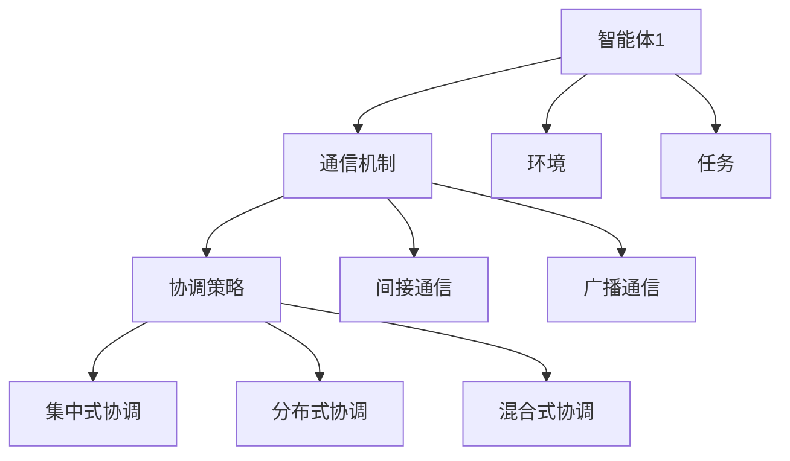

                 

### 第1章: 引言与背景

#### 1.1 问题背景

在当今的金融市场中，投资决策的复杂性不断增加。随着全球经济的不断变化和市场的快速波动，投资者面临着越来越多的挑战。传统的投资分析方法已经无法满足现代投资需求，因此，寻找新的投资策略和工具成为了投资者关注的焦点。

**核心概念术语说明**：
- **金融市场**：指金融资产进行交易和定价的市场，包括股票、债券、期货、外汇等多种金融工具。
- **投资决策**：投资者在金融市场中选择投资对象和投资策略的过程。
- **传统投资分析方法**：主要依赖于基本面分析和技术分析，通过分析公司的财务报表和市场走势来做出投资决策。
- **多智能体AI**：指由多个智能体组成的系统，每个智能体具备一定的智能能力，能够自主地执行任务和协作。

巴菲特式投资理念以其长期投资、价值投资和稳健投资的特点，在全球范围内受到广泛认可。然而，巴菲特的投资策略依赖于深厚的行业知识和经验，这并不是每个投资者都能够掌握的。此外，巴菲特的投资策略在实际应用中也存在一定的局限性，尤其是在面对大数据时代下的海量信息和复杂市场环境时。

多智能体AI的崛起为投资者提供了新的工具和方法。多智能体AI通过模拟人类思维和行为，能够处理海量数据，快速识别行业领导者，从而帮助投资者做出更准确的投资决策。

#### 1.2 多智能体AI概述

**核心概念与联系**：

多智能体系统（MAS）是一种由多个智能体组成的系统，每个智能体在系统中扮演特定的角色，能够自主地执行任务和协作。多智能体AI是在传统多智能体系统的基础上，引入人工智能技术，使智能体具备更高级的智能能力和决策能力。

| **概念**             | **定义**                                                   | **联系**                                            |
|----------------------|-----------------------------------------------------------|-----------------------------------------------------|
| 多智能体系统（MAS）  | 由多个智能体组成的系统，每个智能体具有自主性、协作性和反应性。 | 多智能体AI的基础架构。                            |
| 智能体（Agent）      | 具有自主性、社交性、反应性和适应性等特点的个体。           | 多智能体系统的基本组成单元。                      |
| 人工智能（AI）        | 使计算机系统能够模拟、延伸和扩展人类的智能活动。           | 引入智能算法和技术，提升多智能体的智能能力和决策能力。 |

多智能体AI的特点包括：

1. **分布式计算**：智能体分布在不同的计算节点上，能够协同处理复杂任务。
2. **自主性**：智能体具备自主决策和行动的能力，能够根据环境和目标自主调整行为。
3. **适应性**：智能体能够根据环境和任务的变化，自主学习和适应，提高系统的鲁棒性。
4. **协作性**：智能体之间能够通过通信和协作，共同完成任务，提高系统的整体性能。

多智能体AI在投资领域的应用主要包括：

1. **投资组合优化**：通过智能体的协作，分析市场数据，实时调整投资组合，提高投资回报率。
2. **行业领导者识别**：利用智能体的自主性和适应性，从海量数据中快速识别行业领导者，指导投资决策。
3. **市场预测**：智能体通过分析和预测市场趋势，为投资者提供有价值的参考信息。

#### 1.3 巴菲特式投资理念

巴菲特式投资理念的核心是价值投资和长期投资。巴菲特认为，投资者应该寻找那些具有可持续竞争优势的企业，并在市场价格低于其内在价值时进行投资。这种投资策略强调对企业的深入研究和分析，以及对市场和经济的长期判断。

**核心概念与联系**：

| **概念**        | **定义**                                                   | **联系**                                            |
|-----------------|-----------------------------------------------------------|-----------------------------------------------------|
| **价值投资**    | 寻找那些市场价格低于其内在价值的投资机会。                 | 巴菲特式投资理念的核心。                          |
| **长期投资**    | 持有优质股票，享受企业成长带来的收益，而非短期炒作。     | 巴菲特的投资策略。                              |
| **内在价值**    | 企业未来的现金流量折现到现在的价值。                     | 用于评估企业价值的指标。                        |

巴菲特式投资理念的优点包括：

1. **风险控制**：通过深入研究企业基本面，降低投资风险。
2. **长期收益**：专注于优质企业，分享企业长期增长的收益。
3. **稳健收益**：以长期投资为核心，减少市场波动带来的影响。

然而，巴菲特式投资理念也存在一定的局限性：

1. **时间成本**：需要投入大量时间和精力进行企业研究和市场分析。
2. **市场适应性**：在快速变化的市场环境中，巴菲特式投资策略可能面临挑战。
3. **投资机会**：需要寻找具有可持续竞争优势的企业，这在一定程度上限制了投资范围。

多智能体AI的引入，可以弥补巴菲特式投资理念的局限性，提高投资决策的准确性和效率。

### 总结

本文介绍了利用多智能体AI实现巴菲特式行业领导者识别的背景和重要性。通过引入多智能体AI，我们可以解决传统投资分析方法在复杂市场和海量数据环境下的局限性，实现更准确、高效的投资决策。在接下来的章节中，我们将深入探讨多智能体AI的基础、巴菲特式投资理念的详细解读，以及多智能体AI在投资领域的具体应用。

### 第2章: 多智能体AI基础

#### 2.1 多智能体系统的基本架构

多智能体系统（MAS）是一种由多个智能体（Agent）组成的分布式系统，每个智能体具有自主性、协作性和反应性等特点。多智能体系统的基本架构包括以下几个关键组成部分：

**智能体**：智能体是MAS的基本组成单元，具备以下特点：
- **自主性**：智能体能够自主地执行任务和决策，不受外部直接控制。
- **协作性**：智能体之间可以通过通信和协作，共同完成任务。
- **反应性**：智能体能够根据环境和任务的变化，实时调整行为。

**通信机制**：智能体之间的通信是MAS实现协作和任务分配的关键。常见的通信机制包括：
- **直接通信**：智能体之间通过直接的消息传递进行通信。
- **间接通信**：智能体通过共享信息和数据来间接交互。
- **广播通信**：智能体将信息广播到整个系统，实现信息共享。

**协调策略**：协调策略用于管理智能体之间的协作和任务分配。常见的协调策略包括：
- **集中式协调**：由一个中央协调器负责智能体之间的任务分配和协调。
- **分布式协调**：智能体通过局部信息交换和协商，自主协调任务分配。
- **混合式协调**：结合集中式和分布式协调策略，提高系统的灵活性和鲁棒性。

**多智能体系统的基本架构图**：

#### 2.2 多智能体AI算法

多智能体AI算法是MAS的核心，通过模拟人类思维和行为，使智能体具备更高级的智能能力和决策能力。以下是一些常见的多智能体AI算法：

**1. 强化学习**：强化学习是一种通过试错和反馈来学习最优策略的机器学习技术。在多智能体系统中，强化学习算法可以通过智能体之间的交互，不断优化策略，实现协作和任务分配。

**2. 遗传算法**：遗传算法是一种基于自然进化的启发式搜索算法，通过模拟生物进化过程，寻找最优解。在多智能体系统中，遗传算法可以用于优化智能体的行为和策略，提高系统的整体性能。

**3. 协同优化算法**：协同优化算法通过智能体之间的协作，共同求解复杂优化问题。常见的协同优化算法包括协同过滤、协同定位和协同感知等。

**多智能体AI算法的对比表格**：

| **算法**       | **特点**                                                     | **应用领域**                 |
|----------------|------------------------------------------------------------|-----------------------------|
| 强化学习       | 通过试错和反馈学习最优策略                               | 游戏智能、机器人控制、投资策略 |
| 遗传算法       | 基于自然进化的启发式搜索算法                             | 优化问题、设计自动化、机器学习 |
| 协同优化算法   | 通过智能体之间的协作求解复杂优化问题                     | 聚类分析、多目标优化、协同定位 |

**4. 多智能体AI平台的比较表格**：

| **平台**       | **特点**                                                     | **优势**                     | **劣势**                     |
|----------------|------------------------------------------------------------|-----------------------------|-----------------------------|
| MOA            | 开源的多智能体平台，支持多种算法和工具                     | 丰富的算法库、易扩展         | 需要较高的技术门槛           |
| COMET          | 商业多智能体平台，提供完整的开发工具和生态系统             | 一站式解决方案、强大的支持   | 成本较高                     |
| Multi-Agent    | 简单易用的多智能体平台，适合初学者和实践者                 | 易于上手、直观的界面         | 算法库有限                   |

通过对比不同多智能体AI算法和平台的特点，我们可以根据实际需求选择合适的算法和工具，构建高效的多智能体AI系统。

#### 2.3 多智能体AI工具与平台

在多智能体AI领域，有许多优秀的工具和平台可供选择。这些工具和平台提供了丰富的算法库、开发环境和生态系统，使得开发者能够轻松构建和部署多智能体AI系统。

**1. MOA（Multi-Agent-Oriented Platform）**

MOA是一个开源的多智能体平台，支持多种算法和工具。MOA的特点包括：
- **丰富的算法库**：MOA内置了多种常见的多智能体算法，如强化学习、遗传算法和协同优化算法等。
- **易扩展**：MOA支持用户自定义算法和智能体，使得开发者可以根据需求进行扩展和优化。
- **可视化界面**：MOA提供了直观的可视化界面，方便开发者进行算法调试和系统监控。

**2. COMET**

COMET是一个商业多智能体平台，提供完整的开发工具和生态系统。COMET的优势包括：
- **一站式解决方案**：COMET集成了算法库、开发环境和部署工具，为开发者提供了一站式解决方案。
- **强大的支持**：COMET提供了专业的技术支持和培训服务，帮助开发者快速上手和解决问题。
- **丰富的应用场景**：COMET支持多种应用场景，如游戏智能、机器人控制和投资策略等。

**3. Multi-Agent**

Multi-Agent是一个简单易用的多智能体平台，适合初学者和实践者。Multi-Agent的特点包括：
- **易于上手**：Multi-Agent提供了直观的界面和简单的操作流程，使得开发者能够快速上手。
- **直观的界面**：Multi-Agent的可视化界面使得开发者能够直观地了解系统的运行状态和智能体的行为。
- **算法库有限**：Multi-Agent的算法库相对有限，适用于简单的应用场景，但在复杂场景下可能需要更强大的平台。

通过比较不同多智能体AI工具和平台的特点，我们可以根据实际需求选择合适的工具和平台，构建高效的多智能体AI系统。在选择工具和平台时，需要考虑算法库的丰富程度、开发环境的易用性、生态系统的支持力度以及成本等因素。

### 总结

本章详细介绍了多智能体AI的基础知识，包括多智能体系统的基本架构、常见的多智能体AI算法以及多智能体AI工具与平台。通过理解这些基础知识，读者可以更好地掌握多智能体AI的核心概念和原理，为后续章节中的具体应用打下坚实的基础。在下一章中，我们将深入探讨巴菲特式投资理念，分析其核心要素和投资策略。

### 第3章: 巴菲特式行业领导者识别策略

#### 3.1 行业领导者识别的挑战

在投资领域，识别行业领导者是投资者实现成功投资的关键。然而，这一过程面临着诸多挑战：

**数据收集与处理的复杂性**：行业领导者识别需要大量数据支持，包括财务报表、市场走势、行业动态等。收集和处理这些数据是一项复杂且耗时的任务。此外，数据来源的多样性增加了数据整合的难度。

**行业动态变化的影响**：行业动态不断变化，企业竞争格局和市场地位也在不断调整。投资者需要实时关注行业动态，快速识别新的行业领导者。这要求投资者具备敏锐的市场洞察力和快速响应能力。

**投资决策的多样性**：不同投资者对行业领导者的定义和识别标准可能有所不同。投资决策的多样性增加了行业领导者识别的难度，投资者需要根据自己的投资策略和目标，制定相应的识别方法。

**投资风险的管理**：识别行业领导者并非一劳永逸的过程，投资者还需要对投资风险进行管理。行业领导者的地位可能受到各种因素的影响，如市场竞争、政策变动等。投资者需要制定风险控制策略，确保投资决策的稳健性。

#### 3.2 多智能体AI在行业领导者识别中的应用

多智能体AI在行业领导者识别中具有显著优势，通过模拟人类思维和行为，能够高效地处理海量数据，快速识别行业领导者。

**多智能体系统在行业分析中的优势**：

1. **分布式计算**：多智能体系统能够利用分布式计算的优势，快速处理海量数据。智能体分布在不同的计算节点上，协同处理数据，提高计算效率。

2. **自主性和适应性**：智能体具备自主性和适应性，能够根据数据和环境的变化，自主调整识别策略，提高识别准确性。

3. **协作性**：智能体之间可以通过协作，共同识别行业领导者。通过智能体之间的信息共享和协调，提高识别的整体性能。

**多智能体AI如何识别行业领导者**：

1. **数据预处理**：多智能体AI首先对收集到的数据进行预处理，包括数据清洗、归一化和特征提取等。通过数据预处理，提高数据质量，为后续分析奠定基础。

2. **特征选择**：智能体利用机器学习算法，从大量数据中提取关键特征，用于评估企业的市场地位和竞争优势。

3. **竞争分析**：智能体通过分析企业的市场份额、盈利能力、研发投入等指标，评估其在行业中的竞争力。

4. **动态监测**：智能体实时监测行业动态，分析企业竞争格局的变化，及时识别新的行业领导者。

**实际案例研究**：

以下是一个利用多智能体AI识别行业领导者的实际案例：

**案例背景**：某投资者关注食品饮料行业，希望通过多智能体AI识别出该行业的领导者。

**解决方案**：
1. **数据收集**：智能体从财经网站、行业报告等渠道收集食品饮料行业的相关数据，包括公司财务报表、市场走势、行业动态等。
2. **数据预处理**：智能体对收集到的数据进行清洗和特征提取，提取关键指标，如市场份额、盈利能力、研发投入等。
3. **竞争分析**：智能体利用机器学习算法，对企业的关键指标进行分析，评估其在行业中的竞争力。
4. **动态监测**：智能体实时监测行业动态，分析企业竞争格局的变化，及时识别新的行业领导者。

**案例结果**：通过多智能体AI的识别，投资者成功找到了食品饮料行业的领导者，并制定了相应的投资策略。

**案例经验**：该案例表明，多智能体AI在行业领导者识别中具有显著优势，能够高效地处理海量数据，快速识别行业领导者。然而，投资者还需要结合自己的投资策略和目标，对识别结果进行评估和调整。

#### 3.3 多智能体AI与巴菲特式投资理念的融合

多智能体AI与巴菲特式投资理念的融合，能够提高投资决策的准确性和效率，实现稳健的投资回报。

**多智能体AI如何增强巴菲特式投资决策**：

1. **数据驱动**：多智能体AI能够处理海量数据，从不同维度分析企业基本面和市场动态，为投资决策提供更加全面和准确的数据支持。

2. **快速识别**：多智能体AI能够快速识别行业领导者，使投资者能够及时抓住市场机会，实现长期投资策略。

3. **风险管理**：多智能体AI能够实时监测市场变化，评估投资风险，为投资者提供风险管理策略，确保投资决策的稳健性。

**多智能体AI如何降低投资风险**：

1. **多元化投资**：多智能体AI通过分析企业风险和行业风险，制定多元化投资策略，降低单一投资的风险。

2. **风险评估**：多智能体AI利用机器学习算法，对企业风险进行量化评估，为投资者提供有价值的参考信息。

3. **动态调整**：多智能体AI能够根据市场变化，实时调整投资组合，降低投资风险。

**多智能体AI在投资策略优化中的应用**：

1. **优化投资组合**：多智能体AI通过分析市场数据和行业趋势，优化投资组合，提高投资回报率。

2. **风险控制**：多智能体AI利用机器学习算法，对投资组合进行风险评估和动态调整，确保投资组合的稳健性。

3. **策略迭代**：多智能体AI能够根据市场变化和投资表现，不断迭代和优化投资策略，提高投资决策的准确性。

**总结**

多智能体AI与巴菲特式投资理念的融合，为投资者提供了新的工具和方法。通过利用多智能体AI的自主性、协作性和适应性，投资者能够更准确、高效地识别行业领导者，实现稳健的投资回报。然而，投资者也需要结合自己的投资策略和目标，对多智能体AI的识别结果进行评估和调整，确保投资决策的稳健性。

### 第4章: 多智能体AI在投资组合管理中的应用

#### 4.1 投资组合管理的挑战

投资组合管理是投资者在金融市场中的重要任务，旨在通过合理的资产配置和风险控制，实现投资回报的最大化。然而，在当前复杂多变的市场环境中，投资组合管理面临着诸多挑战：

**投资组合的多样性**：投资者需要管理多种不同类型的资产，包括股票、债券、基金、房地产等。每种资产都有其独特的风险和收益特征，如何在不同资产之间实现合理配置，成为投资组合管理的首要挑战。

**风险控制**：投资组合管理需要有效控制投资风险，确保投资组合的稳健性。市场波动、信用风险、政策变化等因素都可能对投资组合产生负面影响，如何识别和应对这些风险，是投资组合管理的重要任务。

**动态调整**：市场环境不断变化，投资者需要根据市场动态及时调整投资组合。然而，市场变化的复杂性和不确定性，使得动态调整成为一个挑战，如何在不同市场环境中进行有效的调整，是投资者需要面对的问题。

**投资组合的优化**：投资者希望通过优化投资组合，提高投资回报率。然而，投资组合的优化涉及到大量的计算和模型选择，如何在有限的时间和资源下，实现投资组合的优化，是投资组合管理的又一挑战。

#### 4.2 多智能体AI在投资组合管理中的应用

多智能体AI在投资组合管理中具有显著优势，通过模拟人类思维和行为，能够高效地处理复杂的市场数据，实现投资组合的优化和风险控制。

**多智能体AI如何优化投资组合**：

1. **数据驱动**：多智能体AI能够处理海量市场数据，从不同维度分析资产的风险和收益特征，为投资者提供全面的数据支持。

2. **优化算法**：多智能体AI利用优化算法，对投资组合进行调优，实现资产配置的优化。常见的优化算法包括线性规划、遗传算法和神经网络等。

3. **风险控制**：多智能体AI通过分析资产的风险特征，制定相应的风险控制策略，确保投资组合的稳健性。

**多智能体AI如何实现投资组合的动态调整**：

1. **实时监测**：多智能体AI实时监测市场动态，分析市场走势和资产价格变化，为投资者提供实时的调整建议。

2. **自适应调整**：多智能体AI根据市场变化，自适应调整投资组合，确保投资组合与市场环境相适应。

3. **风险评估**：多智能体AI通过风险评估模型，对投资组合进行实时评估，及时发现潜在的风险，并采取相应的调整措施。

**多智能体AI在投资组合风险管理中的应用**：

1. **风险识别**：多智能体AI通过分析市场数据和资产特征，识别潜在的风险因素，为投资者提供风险预警。

2. **风险量化**：多智能体AI利用量化模型，对投资组合的风险进行量化评估，为投资者提供有价值的参考信息。

3. **风险控制**：多智能体AI通过制定风险控制策略，对投资组合进行动态调整，降低投资风险，确保投资组合的稳健性。

**投资组合管理案例研究**：

以下是一个利用多智能体AI进行投资组合管理的实际案例：

**案例背景**：某投资者希望利用多智能体AI对投资组合进行优化和风险控制。

**解决方案**：
1. **数据收集**：智能体从财经网站、行业报告等渠道收集市场数据，包括股票价格、交易量、行业动态等。
2. **数据预处理**：智能体对收集到的数据进行清洗和特征提取，提取关键指标，如股票收益率、波动率、行业相关性等。
3. **优化算法**：智能体利用优化算法，对投资组合进行调优，实现资产配置的优化。
4. **风险评估**：智能体利用风险评估模型，对投资组合进行实时评估，识别潜在的风险因素。
5. **动态调整**：智能体根据市场动态和风险评估结果，实时调整投资组合，降低投资风险。

**案例结果**：通过多智能体AI的投资组合管理，投资者成功实现了投资组合的优化和风险控制，提高了投资回报率。

**案例经验**：该案例表明，多智能体AI在投资组合管理中具有显著优势，能够高效地处理复杂的市场数据，实现投资组合的优化和风险控制。然而，投资者也需要结合自己的投资策略和目标，对多智能体AI的优化建议进行评估和调整，确保投资决策的稳健性。

### 第5章: 多智能体AI在市场预测中的应用

#### 5.1 市场预测的挑战

市场预测是投资者在金融市场中的一项重要任务，旨在通过分析市场趋势和影响因素，预测未来的市场走势，从而指导投资决策。然而，市场预测面临着诸多挑战：

**数据量巨大**：市场预测需要处理大量的历史数据和实时数据，包括股票价格、交易量、宏观经济指标、政策变化等。这些数据的规模和复杂性给数据处理和预测带来了巨大挑战。

**数据的不确定性**：市场数据具有高度的不确定性，包括市场波动、突发事件、投资者情绪等。这些不确定性因素使得市场预测变得更加复杂和困难。

**预测模型的复杂性**：市场预测需要构建复杂的预测模型，包括时间序列模型、机器学习模型和统计模型等。模型的构建和优化需要大量的计算资源和专业知识，增加了市场预测的难度。

**市场波动性**：金融市场具有高度波动性，价格波动剧烈，预测准确性受到影响。投资者需要面对市场波动带来的风险和不确定性，制定相应的应对策略。

**预测时效性**：市场预测需要实时性和时效性，投资者需要及时调整预测结果，以应对市场的变化。然而，市场预测的时效性受到数据处理速度和模型预测速度的限制。

#### 5.2 多智能体AI在市场预测中的应用

多智能体AI在市场预测中具有显著优势，通过模拟人类思维和行为，能够高效地处理海量数据，实现市场预测的准确性和时效性。

**多智能体AI如何捕捉市场趋势**：

1. **实时数据处理**：多智能体AI能够实时处理市场数据，包括股票价格、交易量、宏观经济指标等。通过实时数据处理，多智能体AI能够及时捕捉市场趋势。

2. **多维度分析**：多智能体AI从不同维度分析市场数据，包括技术分析、基本面分析和宏观经济分析等。通过多维度分析，多智能体AI能够更全面地理解市场趋势。

3. **动态调整**：多智能体AI根据市场动态和预测结果，动态调整预测策略。通过动态调整，多智能体AI能够更准确地预测市场趋势。

**多智能体AI如何预测市场波动**：

1. **风险评估**：多智能体AI通过风险评估模型，对市场波动进行量化评估。通过风险评估，多智能体AI能够预测市场波动的大小和方向。

2. **预测模型**：多智能体AI利用预测模型，如时间序列模型、机器学习模型和统计模型等，对市场波动进行预测。通过预测模型，多智能体AI能够预测市场波动的趋势。

3. **实时监控**：多智能体AI实时监控市场数据，分析市场波动的原因和影响因素。通过实时监控，多智能体AI能够及时调整预测结果，应对市场波动。

**多智能体AI在市场预测中的实际应用**：

以下是一个利用多智能体AI进行市场预测的实际案例：

**案例背景**：某投资者希望通过多智能体AI预测股票市场的走势。

**解决方案**：
1. **数据收集**：智能体从财经网站、交易系统等渠道收集股票市场的历史数据和实时数据。
2. **数据预处理**：智能体对收集到的数据进行清洗和特征提取，提取关键指标，如股票收益率、波动率、市场情绪等。
3. **多维度分析**：智能体从技术分析、基本面分析和宏观经济分析等多个维度分析市场数据。
4. **预测模型**：智能体利用预测模型，如时间序列模型、机器学习模型和统计模型等，对市场走势进行预测。
5. **实时监控**：智能体实时监控市场数据，分析市场波动的原因和影响因素。
6. **预测结果调整**：智能体根据市场动态和预测结果，动态调整预测策略。

**案例结果**：通过多智能体AI的市场预测，投资者成功预测了股票市场的走势，制定了相应的投资策略，取得了良好的投资回报。

**案例经验**：该案例表明，多智能体AI在市场预测中具有显著优势，能够高效地处理海量数据，实现市场预测的准确性和时效性。然而，投资者也需要结合自己的投资策略和目标，对多智能体AI的预测结果进行评估和调整，确保投资决策的稳健性。

### 第6章: 多智能体AI在投资分析报告中的应用

#### 6.1 投资分析报告的挑战

投资分析报告是投资者在金融市场中的重要工具，通过分析市场趋势、行业动态和企业表现，为投资者提供投资决策的参考。然而，编写投资分析报告面临着诸多挑战：

**数据来源的多样性**：投资分析报告需要收集和处理多种来源的数据，包括财经网站、行业报告、财务报表等。这些数据来源的多样性增加了数据整合和处理的复杂性。

**报告内容的深度与广度**：投资分析报告需要涵盖多个方面，包括市场趋势、行业动态、企业基本面和技术分析等。编写高质量的投资分析报告需要深入研究和广泛的知识储备。

**报告生成的效率**：投资分析报告的编写是一个复杂的过程，涉及数据收集、分析、报告撰写等多个环节。如何提高报告生成的效率，是一个重要的挑战。

**报告的准确性**：投资分析报告的准确性对投资决策至关重要。然而，市场的不确定性和数据的不完整性，使得编写准确的投资分析报告变得困难。

#### 6.2 多智能体AI在投资分析报告中的应用

多智能体AI在投资分析报告的编写中具有显著优势，通过模拟人类思维和行为，能够高效地处理海量数据，生成高质量的分析报告。

**多智能体AI如何生成投资分析报告**：

1. **数据预处理**：多智能体AI首先对收集到的数据进行分析和预处理，包括数据清洗、归一化和特征提取等。通过数据预处理，提高数据质量，为后续分析奠定基础。

2. **数据分析**：多智能体AI利用机器学习算法，对数据进行分析和挖掘，提取关键特征和趋势。通过数据分析，多智能体AI能够生成具有深度和广度的分析报告。

3. **报告撰写**：多智能体AI利用自然语言生成技术，将分析结果转化为文字形式的报告。通过报告撰写，多智能体AI能够高效地生成高质量的分析报告。

**多智能体AI如何提升报告的准确性**：

1. **多维度分析**：多智能体AI从多个维度分析数据，包括技术分析、基本面分析和宏观经济分析等。通过多维度分析，多智能体AI能够更全面地理解市场趋势，提高报告的准确性。

2. **实时更新**：多智能体AI能够实时监控市场数据，根据市场变化及时更新分析结果。通过实时更新，多智能体AI能够提高报告的时效性，降低市场变化对报告准确性的影响。

3. **自动化校验**：多智能体AI利用自动化校验技术，对报告内容进行校验和修正。通过自动化校验，多智能体AI能够确保报告的准确性，减少人为错误。

**多智能体AI在报告生成中的实际应用**：

以下是一个利用多智能体AI生成投资分析报告的实际案例：

**案例背景**：某投资者希望通过多智能体AI生成投资分析报告，为投资决策提供参考。

**解决方案**：
1. **数据收集**：智能体从财经网站、行业报告等渠道收集市场数据。
2. **数据预处理**：智能体对收集到的数据进行清洗和特征提取。
3. **数据分析**：智能体利用机器学习算法，对数据进行分析和挖掘，提取关键特征和趋势。
4. **报告撰写**：智能体利用自然语言生成技术，将分析结果转化为文字形式的报告。
5. **自动化校验**：智能体利用自动化校验技术，对报告内容进行校验和修正。

**案例结果**：通过多智能体AI的投资分析报告生成，投资者成功生成高质量的分析报告，为投资决策提供了有力支持。

**案例经验**：该案例表明，多智能体AI在投资分析报告生成中具有显著优势，能够高效地处理海量数据，生成高质量的分析报告。然而，投资者也需要结合自己的投资策略和目标，对多智能体AI的报告内容进行评估和调整，确保投资决策的稳健性。

### 第7章: 总结与展望

#### 7.1 多智能体AI在投资领域的总结

多智能体AI在投资领域展现出巨大的潜力，通过模拟人类思维和行为，实现了海量数据处理、快速市场预测、行业领导者识别和投资组合优化等功能。以下是多智能体AI在投资领域的总结：

**1. 提高投资决策准确性**：多智能体AI能够高效地处理海量数据，从多个维度分析市场趋势和企业表现，提高投资决策的准确性。

**2. 降低投资风险**：多智能体AI能够实时监控市场变化，识别潜在风险，制定相应的风险控制策略，降低投资风险。

**3. 优化投资组合**：多智能体AI能够根据市场动态和投资策略，动态调整投资组合，提高投资回报率。

**4. 提高报告生成效率**：多智能体AI能够自动化生成高质量的投资分析报告，减少人为错误，提高报告生成效率。

**5. 智能化投资策略**：多智能体AI能够根据市场数据和投资目标，自动生成和调整投资策略，实现智能化投资。

**6. 多领域应用**：多智能体AI不仅适用于股票市场，还适用于债券市场、外汇市场和期货市场等多种投资领域。

然而，多智能体AI在投资领域也存在一些不足之处，如算法模型的选择和优化、数据质量和隐私保护等问题。因此，在未来的发展中，需要进一步解决这些技术挑战，提高多智能体AI在投资领域的应用效果。

#### 7.2 未来发展趋势

随着人工智能技术的不断发展，多智能体AI在投资领域的应用前景广阔。以下是未来发展趋势：

**1. 算法模型的优化**：研究人员将继续优化多智能体AI的算法模型，提高其预测准确性和鲁棒性，适应更复杂的市场环境。

**2. 数据质量和隐私保护**：随着数据量的增加，如何保证数据质量和隐私保护将成为重要课题。研究人员将致力于开发更高效的数据处理技术和隐私保护算法。

**3. 多领域应用拓展**：多智能体AI将在更多投资领域得到应用，如债券市场、外汇市场和期货市场等，实现全面的投资智能化。

**4. 投资决策智能化**：随着多智能体AI技术的发展，投资决策将更加智能化，投资者将能够更轻松地制定和调整投资策略。

**5. 生态系统建设**：多智能体AI平台和工具将不断完善，为开发者提供更丰富的算法库和开发环境，促进多智能体AI在投资领域的应用。

**6. 监管与合规**：随着多智能体AI在投资领域的广泛应用，监管机构将加强对多智能体AI的监管，确保其合规性和安全性。

**7. 社会影响力**：多智能体AI将在投资领域发挥更大的社会影响力，帮助投资者实现更高的投资回报，促进金融市场的稳定和发展。

总之，多智能体AI在投资领域的应用具有巨大的发展潜力。通过不断优化算法模型、提高数据质量和隐私保护，多智能体AI将进一步提升投资决策的准确性、效率和安全性，为投资者带来更稳健的投资回报。

### 结语

本文全面探讨了利用多智能体AI实现巴菲特式行业领导者识别和投资决策的各个方面。从多智能体AI的基础知识，到其在投资领域的应用，再到具体的案例研究，我们深入分析了多智能体AI在投资决策中的优势和挑战。

首先，我们介绍了多智能体AI的基本概念和架构，以及常见的多智能体AI算法和工具。接着，我们探讨了巴菲特式投资理念的核心要素和优势，以及其与多智能体AI的融合。在此基础上，我们详细阐述了多智能体AI在行业领导者识别、投资组合管理、市场预测和投资分析报告中的应用，并通过实际案例展示了其效果。

总结而言，多智能体AI为投资领域带来了新的机遇和挑战。它不仅提高了投资决策的准确性、效率和安全性，还能够实现投资策略的智能化。然而，多智能体AI在投资领域的发展仍面临一些技术挑战，如算法模型的优化、数据质量和隐私保护等。

未来，随着人工智能技术的不断进步，多智能体AI在投资领域的应用将更加广泛和深入。投资者和研究人员应积极关注这些发展趋势，探索多智能体AI在投资领域的创新应用，为金融市场带来更多稳健的投资回报。

### 作者信息

**作者：AI天才研究院/AI Genius Institute & 禅与计算机程序设计艺术 /Zen And The Art of Computer Programming**

AI天才研究院（AI Genius Institute）是一家专注于人工智能研究和应用的创新机构。我们致力于推动人工智能技术的发展，探索其在各个领域的应用潜力。我们的研究团队由世界顶尖的人工智能专家、程序员和软件架构师组成，致力于解决复杂的人工智能问题和推动人工智能技术的实际应用。

《禅与计算机程序设计艺术》（Zen And The Art of Computer Programming）是一本经典的计算机科学书籍，由著名计算机科学家唐纳德·克努特（Donald E. Knuth）撰写。本书通过深入探讨计算机编程的本质和艺术，为程序员提供了独特的思考方法和设计原则，深受全球计算机科学爱好者的推崇。

通过本文，我们希望向读者展示多智能体AI在投资领域的应用潜力，以及如何利用人工智能技术提升投资决策的准确性和效率。同时，我们也期待与广大读者共同探讨人工智能技术在投资领域的未来发展，为金融市场的创新和进步贡献力量。

---

### 注意事项与最佳实践

**注意事项**：
1. 数据质量和清洗：确保使用高质量的数据进行投资分析，对数据进行充分清洗和预处理，以避免噪声和异常值对分析结果的影响。
2. 风险评估与控制：在应用多智能体AI进行投资决策时，要充分考虑投资风险，制定相应的风险控制策略，确保投资组合的稳健性。
3. 模型优化与迭代：定期对多智能体AI模型进行优化和迭代，以适应市场变化和新的数据特征，提高预测和识别的准确性。

**最佳实践**：
1. 数据多样性：利用多源数据，如财经网站、行业报告、社交媒体等，获取全面和丰富的投资信息。
2. 动态调整：根据市场变化和预测结果，实时调整投资组合，以最大化投资回报。
3. 跨学科合作：结合金融学、计算机科学和人工智能等领域的专业知识，提高投资分析的深度和广度。

通过遵循上述注意事项和最佳实践，投资者可以更好地利用多智能体AI进行投资决策，提高投资回报的同时降低风险。

### 拓展阅读

1. 《人工智能投资实战》：本书详细介绍了人工智能在投资领域的应用，包括市场预测、投资组合优化和风险管理等。通过实际案例，读者可以深入了解人工智能在投资中的具体应用和实践。

2. 《多智能体系统导论》：本书全面介绍了多智能体系统的基本概念、架构和算法。对于希望深入了解多智能体AI基础理论的读者，本书是一个很好的参考资源。

3. 《机器学习实战》：本书通过实际案例和代码示例，介绍了机器学习的基本概念、算法和应用。对于希望掌握机器学习技术的读者，本书提供了丰富的实战经验和指导。

4. 《金融科技与区块链》：本书探讨了金融科技和区块链技术的应用和发展趋势，包括智能合约、加密货币和分布式账本等。对于关注金融科技创新的读者，本书提供了有价值的见解。

通过阅读这些拓展资源，读者可以进一步深入了解多智能体AI在投资领域的应用，以及相关技术的最新进展。这些资源将帮助读者更好地理解文章中的核心概念和原理，提升在投资决策中的实践能力。

