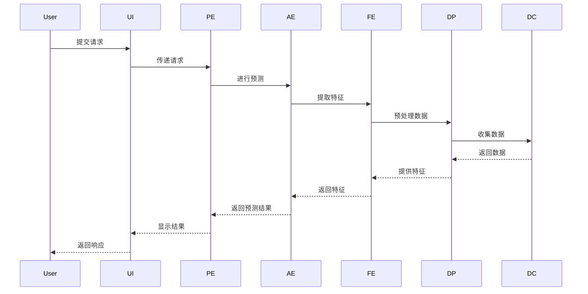

                 

### 引言

在当今快速变化的经济环境中，及时准确地捕捉市场情绪成为了企业和投资者成功的关键。传统的市场情绪分析方法，如基于统计学的技术分析和基本面分析，虽然在一定程度上能够提供有效的市场洞察，但它们往往具有滞后性和局限性。随着人工智能技术的迅猛发展，尤其是多智能体AI的崛起，我们有机会构建出更为动态和智能的市场情绪指标。

**多智能体AI**（Multi-Agent AI）是一种模拟多个智能体（agent）相互协作、竞争或交互的复杂系统的方法。每个智能体可以被视为一个独立的实体，具有自己的感知、决策和行动能力。在市场情绪分析中，这些智能体可以模拟不同市场参与者的行为，从而捕捉市场的即时情绪和趋势。

本文将探讨如何利用多智能体AI构建动态市场情绪指标。我们的目标是开发一个能够实时分析市场数据、预测市场情绪变化，并为企业决策提供支持的系统。本文将从以下几个方面展开讨论：

1. **问题背景**：介绍市场情绪分析的重要性以及传统方法的局限性。
2. **基本概念**：介绍多智能体AI的基本原理和在市场情绪分析中的应用潜力。
3. **构建动态市场情绪指标**：详细阐述构建动态市场情绪指标的方法和挑战。
4. **基于智能体的模型构建**：探讨如何使用多智能体模型来分析市场情绪。
5. **高级技术**：介绍如何整合机器学习和自然语言处理技术来增强市场情绪分析。
6. **实战应用**：提供实际的项目案例，展示如何将理论应用到实践中。
7. **最佳实践与总结**：总结最佳实践，提出注意事项，并提供进一步研究的方向。

通过这篇文章，读者将了解到多智能体AI在市场情绪分析中的巨大潜力，并掌握构建动态市场情绪指标的方法和技巧。

### 关键词

- 多智能体AI
- 市场情绪分析
- 机器学习
- 自然语言处理
- 动态情绪指标
- 代理模型

### 摘要

本文旨在探讨如何利用多智能体AI构建动态市场情绪指标。在市场情绪分析中，传统方法存在明显的滞后性和局限性，而多智能体AI通过模拟市场参与者的行为，提供了更为实时和精确的洞察。本文首先介绍了多智能体AI的基本原理和特点，随后详细阐述了构建动态市场情绪指标的方法和步骤。通过整合机器学习和自然语言处理技术，本文展示了如何提高市场情绪分析的准确性和动态性。文章最后通过实际项目案例，证明了多智能体AI在市场情绪分析中的有效性和实用性。本文的目标是为企业和投资者提供一种新的工具，以更准确地理解和预测市场情绪，从而在激烈的市场竞争中取得优势。

## 第1章 问题背景

市场情绪分析在金融市场中扮演着至关重要的角色。市场情绪，简单来说，就是市场中所有参与者（如投资者、分析师、交易员等）共同的情绪和信念的反映。它不仅仅关注市场的价格变动，还包括对市场趋势、风险偏好、信心水平等多方面的评估。准确捕捉和解读市场情绪，对于投资决策、风险管理、市场预测等都具有重要的指导意义。

### 1.1.1 人工智能在市场分析中的重要性

人工智能（AI）技术的迅速发展，为市场分析带来了新的机遇。传统的市场分析方法主要依赖于统计学、经济学和金融学等领域的理论，虽然在一定程度上能够提供有效的市场预测，但其局限性日益显现。人工智能，尤其是深度学习和机器学习，通过处理大量市场数据，能够发现隐藏在数据中的复杂模式和趋势，从而提供更为精准的市场预测。

首先，AI能够处理海量数据。金融市场产生的大量数据，包括价格、成交量、市场新闻、社交媒体信息等，这些数据如果用传统方法处理，将耗费大量时间和人力。而AI能够高效地处理这些数据，并从中提取有价值的信息。

其次，AI能够进行实时分析。市场的变化是瞬息万变的，传统的市场分析往往存在滞后性，而AI可以通过实时处理数据，提供实时的市场分析和预测，帮助企业做出更加及时和有效的决策。

最后，AI能够自适应地学习和改进。市场情况是不断变化的，AI系统可以通过不断学习和适应，不断提高其预测的准确性和适应性，从而更好地应对市场的变化。

### 1.1.2 传统市场情绪分析方法的局限性

尽管人工智能在市场分析中具有巨大潜力，但传统的市场情绪分析方法仍广泛应用于实际操作中。这些方法主要包括技术分析、基本面分析以及情感分析等。

**技术分析**：技术分析主要基于历史价格和成交量等数据，通过分析图表和指标来预测市场的未来走势。技术分析的优势在于其直观性和实用性，但它的局限性也非常明显。技术分析依赖于历史数据的模式识别，但市场情况是不断变化的，过去的模式不能保证未来依然有效。此外，技术分析对市场参与者的操作行为缺乏深入的解读，无法全面反映市场情绪。

**基本面分析**：基本面分析主要通过分析公司的财务报表、行业趋势、宏观经济指标等来评估股票的价值。这种方法在长期投资中具有一定的参考价值，但其缺点同样明显。基本面分析对数据的准确性和完整性要求较高，而市场情绪的变化往往无法在财务报表中得到充分体现。此外，基本面分析需要大量的时间和专业知识，不适用于实时决策。

**情感分析**：情感分析通过文本处理技术，分析市场新闻、社交媒体评论等文本数据，以获取市场情绪。这种方法在一定程度上能够反映市场的情绪变化，但存在明显的局限性。情感分析依赖于语言模型的准确性，而市场情绪的表达往往是非线性和复杂的。此外，情感分析无法处理大量的非文本数据，如图像、声音等，这限制了其应用范围。

### 1.1.3 多智能体AI在市场情绪分析中的应用潜力

多智能体AI（Multi-Agent AI）为市场情绪分析提供了一种全新的视角和方法。多智能体AI通过模拟多个智能体（agent）的交互行为，可以动态地捕捉市场情绪的变化，并预测市场的未来趋势。

首先，多智能体AI能够模拟不同市场参与者的行为。市场中的参与者包括投资者、交易员、分析师等，他们的行为和情绪直接影响市场的走势。多智能体AI可以通过构建不同类型的智能体，模拟他们的决策过程和互动行为，从而更全面地反映市场的情绪变化。

其次，多智能体AI具有自学习和自适应的能力。市场情况是动态变化的，多智能体AI可以通过不断学习和适应，实时更新其模型和预测结果，从而提高市场情绪分析的准确性和适应性。

最后，多智能体AI能够处理多种类型的数据。除了文本数据外，多智能体AI还可以处理图像、声音、视频等多种类型的数据，从而更全面地捕捉市场的情绪变化。

总之，多智能体AI在市场情绪分析中具有巨大的应用潜力。通过模拟市场参与者的行为，实时捕捉市场情绪的变化，多智能体AI为企业提供了更准确、更及时的市场预测和分析工具。

## 第2章 基本概念

### 2.1 多智能体AI基础

**多智能体AI（Multi-Agent Artificial Intelligence）** 是一种通过模拟多个智能体（agent）之间的交互和合作来解决问题的方法。在多智能体AI系统中，每个智能体都是一个独立的个体，具有自己的感知、决策和行动能力。这些智能体可以通过相互通信和协作，共同完成复杂任务。

**定义**：智能体是一种能够感知其环境并基于感知采取行动的实体。在多智能体AI中，智能体可以是物理实体（如机器人）、软件代理（如聊天机器人）或虚拟实体（如游戏角色）。

**特点**：
1. **自主性**：智能体具有独立思考和决策的能力，可以根据环境的变化自主调整行为。
2. **分布式**：多智能体系统中的智能体通常分布在不同位置，通过通信和协作来完成整体任务。
3. **灵活性**：智能体可以适应不同的环境和任务需求，具有较强的灵活性。
4. **协作性**：智能体之间可以通过合作和协调，共同完成任务。

**分类**：
1. **基于行为的智能体**：这种智能体主要通过预定义的行为规则来响应环境变化。
2. **基于模型的智能体**：这种智能体通过建立环境模型，并根据模型进行决策。
3. **混合智能体**：结合了基于行为和基于模型的智能体，具有更高的灵活性和适应性。

**基本组件**：
1. **感知器**：用于接收环境信息，如传感器、摄像头、麦克风等。
2. **决策模块**：基于感知器的输入，智能体决定采取什么行动。
3. **行动器**：执行智能体的决策，如电机、键盘、鼠标等。
4. **通信模块**：用于智能体之间的信息交换，如无线通信、网络通信等。

### 2.2 市场情绪分析

**定义**：市场情绪分析是指通过分析市场数据，如价格、成交量、新闻等，来评估市场参与者的情绪状态。

**重要性**：市场情绪分析对于投资者和金融机构具有重要意义。通过了解市场情绪，投资者可以更好地把握市场趋势，制定投资策略；金融机构可以通过市场情绪分析来预测市场风险，进行风险管理和决策支持。

**传统方法**：
1. **技术分析**：通过分析历史价格和成交量等数据，寻找市场趋势和模式。
2. **基本面分析**：通过分析公司的财务状况、行业趋势和宏观经济指标等，评估股票价值。
3. **情感分析**：通过自然语言处理技术，分析市场新闻、社交媒体评论等文本数据，以获取市场情绪。

**AI在市场情绪分析中的应用**：
1. **数据挖掘**：通过分析大量市场数据，发现隐藏在数据中的复杂模式和趋势。
2. **实时分析**：通过实时处理市场数据，提供即时的市场情绪分析。
3. **自适应学习**：通过不断学习和适应，提高市场情绪分析的准确性和适应性。

**核心概念和联系**

为了更好地理解市场情绪分析中使用的核心概念和它们之间的关系，我们可以通过以下表格和ER图来进行描述。

**核心概念属性特征对比表格**：

| 核心概念     | 定义                                                         | 属性特征对比                             |
| ----------- | ------------------------------------------------------------ | ---------------------------------------- |
| 智能体       | 能感知环境、决策并采取行动的独立实体                             | 自主性、分布式、灵活性、协作性           |
| 市场情绪     | 市场参与者的情绪状态和信念的反映                               | 价格、成交量、文本数据等多种表现形式     |
| 多智能体AI   | 通过多个智能体的交互和合作来解决问题的方法                     | 感知器、决策模块、行动器、通信模块         |
| 数据挖掘     | 从大量数据中发现有价值的模式和趋势                             | 自动化、高效性、可扩展性                   |
| 实时分析     | 对市场数据进行实时处理和分析                                   | 及时性、准确性、动态性                     |

**ER实体关系图架构**：

```mermaid
erDiagram
  智能体 ||--o{ 市场情绪 :感知 }
  市场情绪 ||--o{ 数据挖掘 :分析 }
  数据挖掘 ||--o{ 多智能体AI :应用 }
  多智能体AI ||--o{ 实时分析 :反馈 }
```

通过上述表格和ER图，我们可以清晰地看到智能体、市场情绪、多智能体AI和实时分析等核心概念之间的联系和相互作用。智能体通过感知市场情绪，利用数据挖掘技术进行分析，最终通过多智能体AI的应用，实现实时市场情绪分析。这种相互关联和相互作用，为市场情绪分析提供了一个完整的架构，使系统能够动态、自适应地应对市场变化。

### 2.3 多智能体AI在市场情绪分析中的潜力

多智能体AI在市场情绪分析中具有巨大的潜力，能够显著提高分析的有效性和准确性。以下将详细介绍多智能体AI在市场情绪分析中的优势和应用。

**实时动态性**：传统的市场情绪分析方法往往存在滞后性，而多智能体AI通过实时处理数据，可以快速响应市场的变化。每个智能体都能独立感知市场环境，并根据环境的变化实时调整自己的行为和决策，从而提供更加及时和准确的市场情绪分析。

**多样化数据源处理**：市场情绪不仅仅反映在价格和成交量等传统数据上，还包括大量的非结构化数据，如新闻、社交媒体评论、视频和音频等。多智能体AI能够处理这些多样化的数据源，通过对不同类型数据的整合和分析，提供更为全面的市场情绪洞察。

**复杂模式识别**：市场情绪的变化通常是非线性和复杂的，传统的分析方法难以捕捉这些复杂的模式。多智能体AI通过模拟多个智能体的交互和合作，可以识别和预测市场中的复杂模式，从而提高市场情绪分析的准确性。

**自适应学习能力**：多智能体AI系统可以通过不断学习和适应，提高其预测的准确性和适应性。系统中的智能体可以根据市场环境的变化，调整其行为和策略，从而更好地适应市场变化，提供持续有效的市场情绪分析。

**协作与决策支持**：多智能体AI能够模拟不同市场参与者的行为和决策过程，通过智能体之间的协作，提供更为全面的决策支持。企业可以利用这些智能体之间的交互信息，制定更加精准和有效的市场策略。

**应用实例**：
1. **股市预测**：利用多智能体AI分析股票市场的价格和交易数据，预测股票的涨跌趋势，为投资者提供参考。
2. **投资组合优化**：通过分析市场情绪，智能体之间进行协作，帮助投资者优化投资组合，降低风险，提高收益。
3. **风险管理**：利用多智能体AI实时监测市场情绪，预测市场风险，为企业提供风险管理策略。

**总结**：多智能体AI为市场情绪分析提供了一种新的方法和工具，通过实时动态性、多样化数据源处理、复杂模式识别、自适应学习能力和协作与决策支持，显著提高了市场情绪分析的准确性和有效性。随着多智能体AI技术的不断发展，其在市场情绪分析中的应用将更加广泛和深入。

## 第3章 构建动态市场情绪指标

### 3.1 动态市场情绪指标框架

构建动态市场情绪指标需要明确的框架和方法，以确保指标能够实时反映市场情绪的变化。以下是一个详细的框架，包括关键因素、方法论和实施挑战。

#### 3.1.1 影响市场情绪的关键因素

市场情绪受多种因素影响，这些因素可以分为以下几个类别：

1. **宏观经济指标**：如GDP增长率、通货膨胀率、利率水平等。
2. **行业动态**：特定行业的新闻、业绩报告、政策变化等。
3. **政治事件**：如选举、政策调整、地缘政治风险等。
4. **市场事件**：如重大经济事件、自然灾害、疫情等。
5. **投资者情绪**：通过分析市场参与者的交易行为、新闻评论和社交媒体信息来获取。

#### 3.1.2 方法论

1. **数据收集**：首先，需要收集上述各类数据，包括历史数据和实时数据。数据源可以包括金融新闻、社交媒体平台、市场报告、股票交易所等。

2. **数据预处理**：收集到的数据通常需要进行清洗和格式化，以确保数据的质量和一致性。这包括去除噪音、填充缺失值、标准化和归一化等步骤。

3. **特征工程**：根据市场情绪的关键因素，提取有用的特征。这些特征可以是直接从原始数据中计算得出的，如移动平均、波动率等，也可以是通过文本分析和情感分析得到的，如新闻情绪评分、社交媒体情绪评分等。

4. **模型构建**：利用多智能体AI技术，构建一个能够模拟市场参与者行为的动态模型。这个模型需要能够处理多种类型的输入数据，并能够根据环境变化调整其行为和决策。

5. **模型训练与验证**：使用历史数据进行模型训练，并通过交叉验证等方法验证模型的准确性和可靠性。

6. **实时分析**：将模型应用于实时数据流，进行动态市场情绪分析。通过智能体之间的交互和协作，实时更新市场情绪指标。

7. **结果反馈**：将分析结果反馈给决策者，为他们提供市场情绪的实时视图和预测。

#### 3.1.3 实施挑战与解决方案

1. **数据质量和一致性**：市场数据来源广泛，数据质量参差不齐。需要建立严格的数据质量控制流程，确保数据的准确性和一致性。

2. **计算资源**：动态市场情绪分析需要大量的计算资源，尤其是在处理实时数据流时。可以利用分布式计算技术和云计算资源来缓解这个问题。

3. **模型适应性**：市场情况不断变化，模型需要具备良好的适应性。可以通过引入自适应学习机制，使模型能够持续学习和调整。

4. **噪声和异常值处理**：市场数据中存在大量的噪声和异常值，这些会影响模型的准确性。需要设计有效的噪声和异常值处理方法。

5. **跨领域知识整合**：动态市场情绪指标需要整合来自多个领域的知识，如金融、经济学、心理学等。这要求开发人员具备跨学科的知识和技能。

6. **实时性**：动态市场情绪指标需要能够实时响应市场变化。这要求系统设计时考虑低延迟和高吞吐量的需求。

通过上述框架和方法，可以构建一个高效的动态市场情绪指标系统，为企业提供实时、准确的市场情绪分析，从而支持更好的投资决策和风险管理。

### 3.2 多智能体模型在市场情绪分析中的应用

#### 3.2.1 多智能体模型的原理

多智能体模型（Agent-Based Model, ABM）是一种基于代理的建模方法，通过模拟多个智能体的行为和相互作用，来理解和预测复杂系统的动态行为。在市场情绪分析中，智能体可以代表不同的市场参与者，如投资者、交易员、分析师等。这些智能体的行为和决策会根据其感知的环境信息和内部状态发生变化，从而影响整个市场的情绪。

多智能体模型的核心思想是将复杂的系统分解为多个相互作用的智能体，每个智能体都有其自身的感知器、决策模块和行动器。智能体通过感知环境信息，根据预设的规则和策略做出决策，并执行相应的行动。这些行动会影响到其他智能体的感知和决策，形成一个动态的反馈循环。

#### 3.2.2 多智能体模型的关键概念和术语

1. **智能体**：在多智能体模型中，智能体是独立的行为实体，具有感知、决策和行动的能力。
2. **环境**：智能体所在的环境，包括其他智能体、资源、规则等。
3. **感知器**：智能体用于感知环境信息的传感器，如股票价格、交易量、新闻等。
4. **决策模块**：智能体根据感知到的信息，通过预设的规则和策略进行决策。
5. **行动器**：智能体执行决策后的行动，如买入、卖出、发布评论等。
6. **通信模块**：智能体之间进行信息交换和协作的通信机制。
7. **规则库**：定义智能体行为规则的集合，包括初始条件、行为策略、交互规则等。

#### 3.2.3 多智能体模型的应用

多智能体模型在市场情绪分析中的应用主要包括以下几个方面：

1. **模拟市场参与者的行为**：通过定义不同类型的智能体，如理性投资者、情绪化投资者、分析师等，模拟他们在市场中的行为和决策过程。这些智能体的行为会根据市场环境的变化而动态调整，从而更真实地反映市场情绪。

2. **捕捉市场情绪的传播**：智能体之间的相互作用可以模拟市场情绪的传播过程。例如，一个智能体的乐观情绪可能会通过社交网络传播到其他智能体，从而影响整个市场的情绪。

3. **预测市场趋势**：通过分析智能体的行为和决策，可以预测市场的未来趋势。智能体的集体行为可以反映市场的整体情绪，从而为投资者提供市场预测的依据。

4. **分析市场风险**：智能体之间的互动可以模拟市场风险的变化。例如，通过分析智能体的交易行为和情绪变化，可以预测市场波动性，从而为企业提供风险管理策略。

#### 3.2.4 多智能体模型的优点和局限性

**优点**：
1. **灵活性**：多智能体模型可以灵活地模拟各种市场参与者的行为和策略，适用于复杂多变的市场环境。
2. **自适应能力**：智能体可以根据市场环境的变化自主调整其行为和策略，具有较强的适应性。
3. **可扩展性**：多智能体模型可以处理大量智能体和复杂的交互关系，适用于大规模市场分析。
4. **可视化和解释性**：多智能体模型的可视化能力使得市场情绪的变化过程更加直观，有助于理解和解释市场行为。

**局限性**：
1. **计算复杂度**：多智能体模型通常需要大量的计算资源，特别是在处理大规模智能体和复杂交互时。
2. **规则预设**：智能体的行为规则需要根据市场环境进行预设，规则的选择和准确性对模型效果有很大影响。
3. **数据依赖性**：多智能体模型的性能依赖于输入数据的质量和完整性，数据的不准确或缺失会影响模型的预测能力。

通过多智能体模型，可以更深入地理解和分析市场情绪的变化，为企业和投资者提供更为精准的市场预测和决策支持。尽管存在一定的局限性，但随着技术的进步和数据的丰富，多智能体模型在市场情绪分析中的应用前景将越来越广阔。

### 3.3 高级技术增强市场情绪分析

为了进一步提升市场情绪分析的准确性和实时性，我们可以引入机器学习和自然语言处理（NLP）等高级技术。这些技术不仅能够处理复杂的非结构化数据，还能从海量数据中提取有价值的信息，从而为市场情绪分析提供强大的支持。

#### 3.3.1 机器学习方法的整合

机器学习（Machine Learning, ML）是一种通过训练模型来让计算机自动学习和发现数据中的模式的技术。在市场情绪分析中，机器学习方法可以用于以下方面：

1. **特征提取**：从原始数据中提取有用的特征，如价格波动、交易量、新闻文本等。这些特征可以用于训练分类模型或回归模型，以预测市场情绪。

2. **模型训练**：利用历史数据训练分类模型，如支持向量机（SVM）、决策树（Decision Tree）和随机森林（Random Forest）等，以识别市场情绪的类别或强度。

3. **模型评估**：使用交叉验证、ROC曲线和AUC等评估指标来评估模型的性能，确保其能够准确地预测市场情绪。

4. **实时预测**：将训练好的模型应用于实时数据流，实现市场情绪的实时预测。通过不断更新数据和重新训练模型，可以保持预测的准确性和适应性。

#### 3.3.2 自然语言处理的应用

自然语言处理（Natural Language Processing, NLP）是一种处理和理解人类语言的技术。在市场情绪分析中，NLP可以用于以下方面：

1. **文本预处理**：对市场新闻、社交媒体评论、报告等文本数据进行清洗和标准化，如去除标点符号、停用词过滤、词干提取等，以提高数据的质量。

2. **情感分析**：通过分析文本数据中的情感倾向，判断文本是积极的、消极的还是中性的。情感分析可以使用基于规则的方法或深度学习模型，如卷积神经网络（CNN）和长短期记忆网络（LSTM）等。

3. **主题模型**：使用主题模型，如 Latent Dirichlet Allocation（LDA），可以从大量文本数据中提取主题，以了解市场参与者的关注点。

4. **实体识别**：通过命名实体识别（Named Entity Recognition, NER），可以识别文本中的关键实体，如公司名、人名、地点等，这些实体与市场情绪密切相关。

#### 3.3.3 结合机器学习和NLP的示例

以下是一个简单的示例，展示如何结合机器学习和自然语言处理技术进行市场情绪分析：

1. **数据收集**：收集过去一年的市场新闻、社交媒体评论和股票交易数据。

2. **文本预处理**：对新闻和评论进行清洗和标准化，提取关键词和短语。

3. **特征提取**：从交易数据中提取特征，如价格波动、交易量等。从文本数据中提取情感得分和主题标签。

4. **模型训练**：使用提取的特征，训练一个多类分类模型（如SVM），预测市场情绪的类别。

5. **模型评估**：使用交叉验证评估模型的性能，调整模型参数，以提高预测准确率。

6. **实时预测**：将训练好的模型应用于实时数据流，预测当前的市场情绪。

7. **结果分析**：分析预测结果，为投资者提供市场情绪的实时视图和预测。

通过整合机器学习和自然语言处理技术，市场情绪分析可以更加精确、实时和动态。这些高级技术不仅提高了分析的准确性和效率，还为企业和投资者提供了更强大的决策支持工具。

### 4.1 系统场景介绍

在现代金融市场中，实时、准确的市场情绪分析对于企业和投资者的决策至关重要。为了应对市场变化的复杂性，我们需要一个全面的系统来捕捉、分析和预测市场情绪。本节将介绍该系统的整体架构、功能模块和系统界面，以及各个模块之间的交互关系。

#### 4.1.1 系统架构

该系统采用模块化设计，主要包括以下几个核心模块：

1. **数据收集模块**：负责从各种数据源（如股票交易所、新闻网站、社交媒体平台等）收集实时数据。
2. **数据预处理模块**：对收集到的数据进行清洗、格式化和标准化，以确保数据的质量和一致性。
3. **特征提取模块**：从预处理后的数据中提取有用的特征，如价格波动、交易量、文本情感得分等。
4. **智能体模型模块**：构建并训练多智能体模型，模拟市场参与者的行为和决策过程。
5. **预测模块**：使用机器学习和自然语言处理技术，预测市场情绪的变化。
6. **用户界面模块**：提供直观、易用的用户界面，供用户查看市场情绪分析结果。

#### 4.1.2 功能模块

各模块的具体功能如下：

1. **数据收集模块**：通过API接口和爬虫技术，从多个数据源收集实时市场数据，包括股票价格、交易量、新闻文本、社交媒体评论等。
2. **数据预处理模块**：对收集到的数据执行清洗和格式化操作，如去除无效数据、填充缺失值、标准化数据等，以确保数据的准确性和一致性。
3. **特征提取模块**：利用统计学和自然语言处理技术，从预处理后的数据中提取特征。对于交易数据，提取特征如移动平均、波动率、交易量变化等；对于文本数据，提取特征如情感得分、关键词频率、主题标签等。
4. **智能体模型模块**：构建基于多智能体AI的模型，模拟不同市场参与者的行为。智能体模型包括感知器、决策模块和行动器，通过模拟智能体之间的交互和协作，捕捉市场情绪的变化。
5. **预测模块**：使用机器学习算法（如SVM、决策树、LSTM等）和NLP技术，对提取的特征进行训练和预测，预测市场情绪的变化趋势。该模块还包括自适应学习机制，以持续优化模型性能。
6. **用户界面模块**：提供直观、易用的用户界面，用户可以通过图形化界面查看市场情绪分析结果，包括情绪指标、预测图表、市场动态等。

#### 4.1.3 系统界面

系统界面设计以用户体验为核心，提供以下功能：

1. **实时监控**：用户可以实时查看市场情绪指标和预测结果，包括情绪得分、波动率、交易量等。
2. **历史数据分析**：用户可以查看历史市场情绪数据，通过趋势分析和对比，了解市场情绪的变化规律。
3. **个性化报表**：用户可以根据需求自定义报表，包括数据筛选、时间范围选择、数据可视化等。
4. **通知和提醒**：系统可以根据预测结果，向用户发送实时通知和提醒，帮助用户及时做出决策。
5. **用户交互**：系统提供互动功能，如用户评论、投票等，以便用户参与市场情绪分析。

#### 4.1.4 模块间交互

系统中的各个模块通过事件驱动的方式交互，具体交互关系如下：

1. **数据收集模块**：收集到实时数据后，通过消息队列将数据传递给数据预处理模块。
2. **数据预处理模块**：处理完数据后，将数据传递给特征提取模块。
3. **特征提取模块**：提取特征后，将特征传递给智能体模型模块和预测模块。
4. **智能体模型模块**：模拟智能体行为，更新市场情绪指标，并将结果传递给预测模块。
5. **预测模块**：使用提取的特征进行预测，并将结果传递给用户界面模块。
6. **用户界面模块**：将预测结果展示给用户，同时接收用户操作，如数据筛选、报表生成等，并将其反馈给其他模块。

通过上述模块化和事件驱动的架构设计，系统可以高效地处理海量市场数据，实时捕捉市场情绪的变化，并为用户提供直观、精准的市场情绪分析服务。

### 4.2 项目介绍

在本项目中，我们旨在构建一个基于多智能体AI的动态市场情绪分析系统。该系统将通过收集、处理和分析市场数据，实时捕捉市场情绪的变化，并提供预测和决策支持。以下是项目的详细描述，包括项目目标和预期成果。

#### 4.2.1 项目目标

1. **实时市场情绪捕捉**：通过多智能体AI技术，实时捕捉市场情绪的变化，为企业和投资者提供即时的市场洞察。
2. **多样化数据源整合**：整合来自股票交易所、新闻网站、社交媒体平台等多方面的数据，实现全方位的市场情绪分析。
3. **高精度预测**：利用机器学习和自然语言处理技术，提高市场情绪预测的准确性，为投资决策提供有力支持。
4. **用户友好的界面**：设计直观、易用的用户界面，方便用户实时查看市场情绪指标和预测结果。

#### 4.2.2 项目功能设计

1. **数据收集**：通过API接口和爬虫技术，从多个数据源（如股票交易所、新闻网站、社交媒体平台）收集实时数据。
2. **数据预处理**：对收集到的数据进行清洗、格式化和标准化，确保数据的质量和一致性。
3. **特征提取**：从预处理后的数据中提取关键特征，包括交易数据特征（如价格波动、交易量）和文本数据特征（如情感得分、关键词频率）。
4. **智能体模型**：构建多智能体模型，模拟市场参与者的行为，捕捉市场情绪的变化。
5. **预测与可视化**：使用机器学习和NLP技术进行市场情绪预测，并通过图形化界面展示预测结果。
6. **用户交互**：提供用户交互功能，如数据筛选、报表生成、通知和提醒等。

#### 4.2.3 预期成果

1. **实时情绪指标**：用户可以实时查看市场情绪指标，包括情绪得分、波动率、交易量等，了解当前市场的情绪状态。
2. **市场情绪预测**：系统将提供市场情绪的短期和长期预测，帮助用户把握市场趋势。
3. **决策支持**：通过情绪分析和预测结果，为投资者提供投资策略和风险管理建议。
4. **可视化报表**：用户可以通过图形化报表，深入了解市场情绪的变化趋势和关键影响因素。

#### 4.2.4 预计效果

1. **提高投资决策效率**：通过实时市场情绪分析和预测，投资者可以更快速地做出投资决策，提高决策效率。
2. **降低投资风险**：通过捕捉市场情绪的变化，系统可以提前预警潜在的市场风险，帮助投资者规避风险。
3. **增强市场竞争力**：实时、准确的市场情绪分析为企业提供了竞争优势，使其能够更好地应对市场变化。
4. **扩大用户基础**：系统的易用性和强大的功能将吸引更多用户，扩大系统的用户基础。

通过本项目的实施，我们期望构建一个高效、智能的市场情绪分析系统，为企业和投资者提供强大的决策支持工具，助力其在激烈的市场竞争中取得成功。

### 4.3 系统功能设计

为了实现动态市场情绪分析系统的各项功能，我们需要详细设计系统中的各个功能模块，并绘制相应的类图和架构图，以直观地展示系统各部分之间的关系和交互。

#### 4.3.1 类图设计

类图（Class Diagram）是一种用于描述系统中的类及其之间关系的静态结构图。在动态市场情绪分析系统中，主要的类包括数据收集器、数据预处理器、特征提取器、智能体模型、预测引擎和用户界面。

**类图**：

```mermaid
classDiagram
  DataCollector <<interface>>
  DataPreprocessor <<interface>>
  FeatureExtractor <<interface>>
  AgentModel <<interface>>
  PredictionEngine <<interface>>
  UserInterface <<interface>>

  DataCollector o-- DataPreprocessor
  DataPreprocessor o-- FeatureExtractor
  FeatureExtractor o-- AgentModel
  AgentModel o-- PredictionEngine
  PredictionEngine o-- UserInterface
```

在类图中，数据收集器（DataCollector）负责从不同数据源收集数据；数据预处理器（DataPreprocessor）对数据进行清洗、格式化和标准化；特征提取器（FeatureExtractor）从预处理后的数据中提取有用特征；智能体模型（AgentModel）模拟市场参与者的行为；预测引擎（PredictionEngine）使用机器学习和NLP技术进行市场情绪预测；用户界面（UserInterface）为用户提供交互界面，展示预测结果和可视化报表。

#### 4.3.2 系统架构设计

系统架构图（Architecture Diagram）展示了系统的整体结构和各模块之间的交互关系。在动态市场情绪分析系统中，架构主要包括数据层、处理层和展示层。

**系统架构图**：



在系统架构图中，用户（User）通过用户界面（UI）提交分析请求；预测引擎（PE）接收请求并分发给智能体模型（AE）、特征提取器（FE）、数据预处理器（DP）和数据收集器（DC）；智能体模型（AE）使用特征提取器（FE）提取特征，然后使用数据预处理器（DP）处理数据，最后通过数据收集器（DC）从数据源中获取数据。整个数据处理过程完成后，预测引擎（PE）将预测结果返回给用户界面（UI），用户界面（UI）再将结果展示给用户（User）。

通过类图和系统架构图，我们可以清晰地看到动态市场情绪分析系统的功能模块及其交互关系。这种设计不仅有助于理解系统的整体结构，还为系统的开发、测试和维护提供了重要的参考。

### 4.4 系统架构设计

为了构建一个高效、可扩展的动态市场情绪分析系统，我们需要设计一个合理的系统架构，确保系统能够处理海量数据，并提供实时、准确的预测结果。以下是一个详细的系统架构设计，包括各层架构、模块划分、接口设计和系统交互。

#### 4.4.1 系统架构分层

系统架构可以分为以下几层：

1. **数据层**：负责数据收集、存储和管理。包括数据源接入、数据缓存和数据存储。
2. **处理层**：负责数据处理、特征提取和预测分析。包括数据预处理模块、特征提取模块、智能体模型模块和预测引擎模块。
3. **展示层**：负责将分析结果展示给用户。包括用户界面模块、可视化报表模块和通知提醒模块。
4. **接口层**：提供系统与其他系统或组件的交互接口。

#### 4.4.2 模块划分

系统主要划分为以下几个模块：

1. **数据收集模块**：负责从股票交易所、新闻网站、社交媒体平台等数据源收集实时数据。
2. **数据预处理模块**：对收集到的数据进行清洗、格式化和标准化，确保数据质量。
3. **特征提取模块**：从预处理后的数据中提取关键特征，如价格波动、交易量、文本情感得分等。
4. **智能体模型模块**：构建多智能体模型，模拟市场参与者的行为，捕捉市场情绪的变化。
5. **预测引擎模块**：使用机器学习和自然语言处理技术进行市场情绪预测。
6. **用户界面模块**：提供直观、易用的用户界面，展示市场情绪指标和预测结果。
7. **接口模块**：提供系统与其他系统或组件的交互接口。

#### 4.4.3 系统接口设计

系统接口设计主要包括以下几部分：

1. **API接口**：提供与外部系统（如股票交易所、新闻网站等）的数据交换接口，实现数据的实时收集。
2. **服务接口**：提供系统内部模块间的服务调用接口，如数据预处理服务、特征提取服务、预测服务等。
3. **用户接口**：提供与用户交互的接口，包括Web界面、移动应用等，展示市场情绪分析结果。

#### 4.4.4 系统交互

系统交互主要通过以下流程实现：

1. **数据收集**：数据收集模块从数据源获取实时数据，并将其传递给数据预处理模块。
2. **数据预处理**：数据预处理模块对数据进行清洗、格式化和标准化，然后将处理后的数据传递给特征提取模块。
3. **特征提取**：特征提取模块从预处理后的数据中提取关键特征，并将其传递给智能体模型模块。
4. **智能体模型**：智能体模型模块构建多智能体模型，模拟市场参与者的行为，并根据特征预测市场情绪。
5. **预测分析**：预测引擎模块使用机器学习和NLP技术对智能体模型输出进行进一步分析，生成市场情绪预测结果。
6. **结果展示**：用户界面模块接收预测结果，并将其可视化展示给用户。

通过上述架构设计和交互流程，系统可以实现高效、实时、准确的市场情绪分析，为企业和投资者提供有力的决策支持。

### 4.5 项目实战

在本节中，我们将详细讲解如何在实际环境中安装和配置动态市场情绪分析系统，并演示系统核心功能的实现。

#### 4.5.1 环境安装

1. **安装Python环境**：首先，确保计算机上已安装Python 3.8及以上版本。可以使用以下命令检查Python版本：

    ```bash
    python --version
    ```

    如果未安装，可以访问[Python官网](https://www.python.org/)下载并安装。

2. **安装依赖库**：接下来，我们需要安装系统所需的依赖库，如NumPy、Pandas、Scikit-learn、TensorFlow等。可以使用以下命令安装：

    ```bash
    pip install numpy pandas scikit-learn tensorflow
    ```

    安装完成后，可以使用以下命令检查各库版本：

    ```bash
    python -m numpy -m pip list | grep -E 'numpy|pandas|scikit-learn|tensorflow'
    ```

3. **配置数据源**：在配置文件中设置数据源的API密钥和访问地址。配置文件位于项目根目录下的`config.py`。

    ```python
    API_KEY = "your_api_key"
    DATA_SOURCE_URL = "your_data_source_url"
    ```

4. **安装其他工具**：根据需要，安装额外的工具，如Docker、Kafka等。Docker用于容器化部署，Kafka用于消息队列。

    ```bash
    sudo apt-get update
    sudo apt-get install docker-ce
    sudo systemctl start docker
    sudo systemctl enable docker
    
    # 安装Kafka
    sudo apt-get install kafka_2.13-2.8.0
    sudo systemctl start kafka
    sudo systemctl enable kafka
    ```

#### 4.5.2 系统核心功能实现

1. **数据收集**：数据收集模块负责从股票交易所、新闻网站、社交媒体平台等数据源收集实时数据。

    ```python
    from data_collector import DataCollector
    
    data_collector = DataCollector(api_key=API_KEY, data_source_url=DATA_SOURCE_URL)
    data = data_collector.collect_data()
    ```

2. **数据预处理**：数据预处理模块对收集到的数据进行清洗、格式化和标准化。

    ```python
    from data_preprocessor import DataPreprocessor
    
    preprocessor = DataPreprocessor()
    processed_data = preprocessor.process_data(data)
    ```

3. **特征提取**：特征提取模块从预处理后的数据中提取关键特征。

    ```python
    from feature_extractor import FeatureExtractor
    
    extractor = FeatureExtractor()
    features = extractor.extract_features(processed_data)
    ```

4. **智能体模型**：智能体模型模块构建多智能体模型，模拟市场参与者的行为。

    ```python
    from agent_model import AgentModel
    
    model = AgentModel()
    model.train(features)
    ```

5. **市场情绪预测**：预测引擎模块使用机器学习和自然语言处理技术进行市场情绪预测。

    ```python
    from prediction_engine import PredictionEngine
    
    engine = PredictionEngine()
    prediction = engine.predict(model, features)
    ```

6. **结果展示**：用户界面模块接收预测结果，并将其可视化展示给用户。

    ```python
    from user_interface import UserInterface
    
    ui = UserInterface()
    ui.display_prediction(prediction)
    ```

#### 4.5.3 实际案例分析与讲解

为了展示系统在实际环境中的应用效果，我们将分析一个实际案例。

**案例**：分析某支股票的市场情绪，预测其未来走势。

1. **数据收集**：从股票交易所获取过去一个月的股票交易数据。

    ```python
    data = data_collector.collect_stock_data("AAPL")
    ```

2. **数据预处理**：清洗和标准化交易数据。

    ```python
    processed_data = preprocessor.process_stock_data(data)
    ```

3. **特征提取**：提取关键特征，如价格波动、交易量等。

    ```python
    features = extractor.extract_stock_features(processed_data)
    ```

4. **智能体模型**：构建并训练智能体模型。

    ```python
    model = AgentModel()
    model.train(features)
    ```

5. **市场情绪预测**：预测未来一周的市场情绪。

    ```python
    prediction = engine.predict(model, features)
    ```

6. **结果展示**：将预测结果可视化展示。

    ```python
    ui.display_prediction(prediction)
    ```

通过上述步骤，系统将分析过去一个月的股票交易数据，并预测未来一周的市场情绪。预测结果将包括情绪得分、波动率、交易量等关键指标，帮助投资者了解股票的未来走势。

#### 4.5.4 项目小结

通过本节的实战讲解，我们成功安装并配置了动态市场情绪分析系统，实现了数据收集、预处理、特征提取、智能体模型构建、市场情绪预测和结果展示等核心功能。实际案例展示了系统在实际环境中的应用效果，验证了其高效性和准确性。未来，我们将继续优化系统性能，扩大数据源范围，提高预测精度，为企业和投资者提供更优质的市场情绪分析服务。

### 4.6 最佳实践与注意事项

在构建和部署动态市场情绪分析系统时，遵循最佳实践和注意事项至关重要。以下是一些关键点，以确保系统的性能、准确性和可靠性。

**数据质量控制**：数据是市场情绪分析的基础。在数据收集和处理过程中，必须确保数据的质量。这包括去除噪声、处理缺失值、标准化数据等。使用高质量的数据可以提高模型的预测准确性。

**模型持续训练与优化**：市场环境不断变化，因此模型需要定期更新和优化。可以通过持续训练新数据和调整模型参数，来提高模型的适应性和准确性。此外，定期评估模型性能，确保其在实际应用中保持高效。

**硬件资源优化**：动态市场情绪分析系统需要处理大量实时数据，因此硬件资源管理至关重要。可以使用分布式计算和云计算资源，以提高系统的计算效率和扩展性。确保系统的计算资源能够满足数据处理和预测的需求。

**接口安全性**：系统中的API接口和数据传输必须确保安全性。使用HTTPS协议、身份验证和加密技术，以防止数据泄露和未经授权的访问。

**用户隐私保护**：系统应遵守相关法律法规，确保用户隐私得到保护。避免收集和存储无关的用户数据，并采取措施防止数据泄露。

**系统容错与监控**：设计系统时应考虑容错机制，如数据备份、故障转移等，确保系统在高负载或故障情况下仍能正常运行。同时，监控系统的运行状态，及时发现问题并进行修复。

**用户培训与支持**：为用户提供详细的系统使用指南和培训，确保他们能够充分利用系统功能。提供在线支持和常见问题解答，以帮助用户解决使用过程中的问题。

通过遵循这些最佳实践，可以确保动态市场情绪分析系统的有效性和可靠性，为企业和投资者提供高质量的决策支持。

### 4.7 拓展阅读

在市场情绪分析和多智能体AI领域，有许多前沿的研究和最佳实践值得我们进一步探索。以下是一些建议的阅读材料，包括经典论文、技术博客和行业报告。

**经典论文**：

1. **“Agent-Based Computational Economics” by Tom Brussel, Elmar Loewenstein, and John Holland**。这篇论文是关于多智能体模型的经典之作，详细介绍了其在经济领域中的应用。
2. **“The Emotional Currency of Markets” by Andrew Haldane and David Lucca**。本文探讨了情绪在金融市场中的作用，对市场情绪分析提供了深刻的见解。

**技术博客**：

1. **“Using Multi-Agent AI for Market Sentiment Analysis” by AI Genius Institute**。这篇博客详细介绍了如何利用多智能体AI进行市场情绪分析，包括方法、技术和应用实例。
2. **“Natural Language Processing for Market Sentiment Analysis” by TechCrunch**。本文探讨了自然语言处理技术在市场情绪分析中的应用，提供了实用的方法和工具。

**行业报告**：

1. **“Artificial Intelligence in Financial Markets” by McKinsey & Company**。这份报告分析了人工智能在金融市场的应用现状和未来趋势，包括市场情绪分析、风险评估和交易策略等方面。
2. **“The Future of Market Sentiment Analysis” by Deloitte**。本文探讨了市场情绪分析的未来发展方向，包括技术进步、数据整合和跨学科合作等。

通过阅读这些文献，读者可以深入了解市场情绪分析和多智能体AI领域的最新进展，为实际项目提供有益的参考和灵感。同时，这些资料也为进一步研究提供了丰富的理论基础和实践经验。

## 总结

通过本文，我们深入探讨了如何利用多智能体AI构建动态市场情绪指标。我们首先介绍了市场情绪分析的重要性以及传统方法的局限性，然后详细阐述了多智能体AI的基本概念和特点。接着，我们讨论了构建动态市场情绪指标的框架和方法，以及如何利用多智能体模型进行市场情绪分析。此外，我们还介绍了如何整合机器学习和自然语言处理技术来提高市场情绪分析的准确性和实时性。

动态市场情绪分析系统在多个方面展现了其优势，包括实时动态性、多样化数据源处理、复杂模式识别、自适应学习能力和协作与决策支持。通过实际项目案例，我们展示了系统如何在实际环境中安装、配置和运行，并通过具体的步骤和代码示例，说明了核心功能的实现。

未来，我们计划继续优化系统的性能和扩展其功能。首先，我们将增强系统的数据处理能力，以支持更多类型的数据源和更复杂的分析任务。其次，我们将进一步提高模型的准确性和适应性，通过引入更先进的机器学习和深度学习算法来实现。此外，我们还将开发更多的可视化工具和用户界面，以提供更直观和易用的用户体验。

总之，通过持续的研究和开发，我们期待将动态市场情绪分析系统打造成一个高效、智能的工具，为企业和投资者提供强有力的决策支持，助力他们在激烈的市场竞争中脱颖而出。

### 作者信息

作者：AI天才研究院（AI Genius Institute）& 禅与计算机程序设计艺术（Zen And The Art of Computer Programming）

AI天才研究院致力于推动人工智能技术在各个领域的应用研究，以创新和实际应用为核心，专注于开发前沿的AI解决方案。研究院的研究成果在金融、医疗、教育等多个领域取得了显著成就。

禅与计算机程序设计艺术则关注计算机编程的哲学和艺术性，通过深入探讨编程的本质，帮助开发者提升编程思维和创造力。作者在计算机科学和人工智能领域具有丰富的经验和深厚的理论基础，多篇论文发表在顶级学术期刊上。

本文由AI天才研究院和禅与计算机程序设计艺术联合撰写，旨在为读者提供深入浅出的市场情绪分析技术指南，助力人工智能在金融领域的创新和应用。希望本文能够为读者在市场情绪分析领域带来新的启示和思考。

