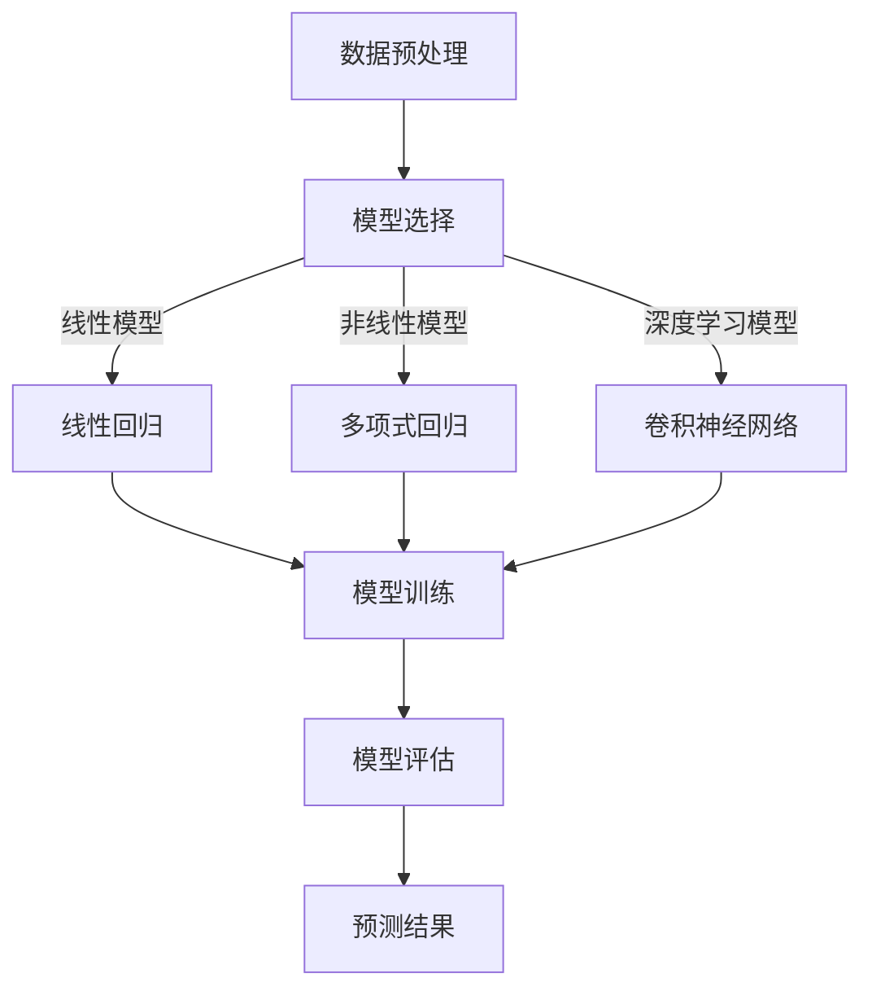
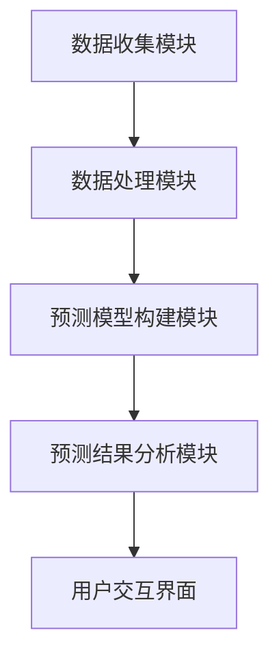
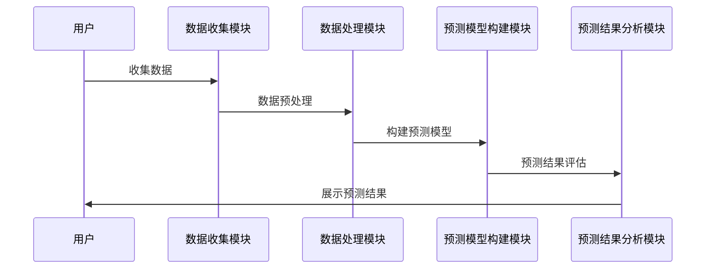

                 

# 利用多智能体系统构建全球宏观经济预测模型

> 关键词：多智能体系统、宏观经济预测、算法原理、系统架构设计、Python源代码

> 摘要：本文将探讨如何利用多智能体系统构建全球宏观经济预测模型。首先，我们介绍了多智能体系统和宏观经济预测的基本概念及其相互关联。接着，我们详细阐述了多智能体系统的算法原理、数学模型和Python源代码实现。随后，我们介绍了系统的整体架构设计，包括问题场景、项目介绍、功能设计、接口设计和系统交互。最后，我们通过一个实际案例展示了如何使用该模型进行全球宏观经济预测，并给出了项目小结和最佳实践 tips。

----------------------------------------------------------------

### 目录大纲

----------------------------------------------------------------

## 第1章：背景介绍

## 1.1 问题背景

### 1.1.1 全球宏观经济预测的重要性

### 1.1.2 当前宏观经济预测存在的问题

### 1.1.3 多智能体系统与宏观经济预测的关联

## 1.2 问题描述

### 1.2.1 预测目标的确定

### 1.2.2 数据源的获取与处理

### 1.2.3 模型构建的挑战

## 1.3 问题解决

### 1.3.1 多智能体系统的基本概念

### 1.3.2 多智能体系统在宏观经济预测中的应用

### 1.3.3 多智能体系统与数据驱动的结合

## 1.4 边界与外延

### 1.4.1 多智能体系统的边界条件

### 1.4.2 宏观经济预测的外延范围

### 1.4.3 系统的可持续性与可扩展性

## 1.5 概念结构与核心要素组成

### 1.5.1 核心概念

### 1.5.2 要素组成

### 1.5.3 概念属性特征对比表格

### 1.5.4 ER实体关系图架构

## 1.6 本章小结

----------------------------------------------------------------

## 第2章：核心概念与联系

## 2.1 多智能体系统的原理

### 2.1.1 多智能体系统的定义

### 2.1.2 多智能体系统的特点

### 2.1.3 多智能体系统的分类

## 2.2 宏观经济预测的基本概念

### 2.2.1 宏观经济预测的定义

### 2.2.2 宏观经济预测的目标

### 2.2.3 宏观经济预测的方法

## 2.3 多智能体系统与宏观经济预测的联系

### 2.3.1 多智能体系统在宏观经济预测中的应用

### 2.3.2 宏观经济预测对多智能体系统的需求

### 2.3.3 多智能体系统与宏观经济预测的相互影响

## 2.4 概念属性特征对比表格

## 2.5 ER实体关系图架构

### 2.5.1 宏观经济预测实体

### 2.5.2 多智能体系统实体

### 2.5.3 实体关系图展示

## 2.6 本章小结

----------------------------------------------------------------

## 第3章：算法原理讲解

## 3.1 多智能体系统的算法原理

### 3.1.1 多智能体系统的建模

### 3.1.2 多智能体系统的算法框架

### 3.1.3 多智能体系统的协调与优化

## 3.2 宏观经济预测算法原理

### 3.2.1 数据预处理

### 3.2.2 模型构建

### 3.2.3 模型训练与评估

## 3.3 多智能体系统与宏观经济预测算法的结合

### 3.3.1 数据驱动模型

### 3.3.2 知识驱动模型

### 3.3.3 数据与知识的融合

## 3.4 算法mermaid流程图展示

## 3.5 Python源代码实现

### 3.5.1 环境安装

### 3.5.2 系统核心实现源代码

### 3.5.3 代码应用解读与分析

## 3.6 数学模型和数学公式

### 3.6.1 基本数学模型

### 3.6.2 公式推导

### 3.6.3 公式应用举例

## 3.7 本章小结

----------------------------------------------------------------

## 第4章：系统分析与架构设计方案

## 4.1 问题场景介绍

### 4.1.1 宏观经济预测应用场景

### 4.1.2 多智能体系统应用场景

## 4.2 项目介绍

### 4.2.1 项目背景

### 4.2.2 项目目标

### 4.2.3 项目架构

## 4.3 系统功能设计

### 4.3.1 数据收集模块

### 4.3.2 数据处理模块

### 4.3.3 预测模型构建模块

### 4.3.4 预测结果分析模块

## 4.4 系统架构设计

### 4.4.1 系统架构图展示

### 4.4.2 架构设计要点

## 4.5 系统接口设计

### 4.5.1 接口定义

### 4.5.2 接口实现

### 4.5.3 接口测试

## 4.6 系统交互mermaid序列图

### 4.6.1 系统交互流程

### 4.6.2 序列图展示

## 4.7 项目实战

### 4.7.1 环境安装

### 4.7.2 系统核心实现源代码

### 4.7.3 代码应用解读与分析

### 4.7.4 实际案例分析和详细讲解剖析

### 4.7.5 项目小结

## 4.8 最佳实践 tips

## 4.9 小结

## 4.10 注意事项

## 4.11 拓展阅读

----------------------------------------------------------------

----------------------------------------------------------------

## 第1章：背景介绍

### 1.1 问题背景

#### 1.1.1 全球宏观经济预测的重要性

全球宏观经济预测在现代社会中具有极其重要的地位。它不仅能帮助政策制定者制定有效的经济政策，还能为企业提供战略决策依据，为投资者提供投资方向。随着全球化进程的加快，国际经济联系日益紧密，宏观经济预测的重要性更加凸显。然而，传统的宏观经济预测方法在应对复杂多变的经济环境时，往往表现出一定的局限性。

首先，传统宏观经济预测方法主要依赖于宏观经济指标和历史数据进行预测，缺乏对复杂动态环境的适应能力。其次，传统方法往往依赖于单一模型，无法充分考虑不同经济主体之间的相互作用和影响。此外，传统方法在处理海量数据和实时数据处理方面存在困难，难以实现高效、准确的预测。

#### 1.1.2 当前宏观经济预测存在的问题

当前宏观经济预测存在以下问题：

1. **数据驱动方法局限性**：数据驱动方法主要依赖于历史数据，但在数据缺失或不完整的情况下，预测效果会受到影响。同时，数据驱动方法难以捕捉经济变量之间的复杂关系。

2. **模型复杂度高**：传统宏观经济模型通常包含大量参数和变量，建模过程复杂，计算量大。此外，模型训练和优化需要大量计算资源和时间。

3. **预测准确性较低**：传统模型在面对复杂多变的经济环境时，预测准确性较低。特别是在经济危机或突发事件时，预测结果往往与实际经济走势相差较大。

4. **模型应用难度大**：传统宏观经济模型需要具备较强的专业知识和数学基础，应用难度较大，难以普及。

#### 1.1.3 多智能体系统与宏观经济预测的关联

多智能体系统（Multi-Agent System，MAS）是一种分布式人工智能系统，通过模拟多个具有自主行为能力的智能体之间的交互，来实现复杂任务的处理。多智能体系统在宏观经济预测中的应用，可以有效地弥补传统方法的局限性。

首先，多智能体系统可以模拟经济主体之间的复杂互动关系，实现更准确、更全面的经济预测。其次，多智能体系统可以根据不同经济主体的行为特征，动态调整预测模型，提高预测的实时性和准确性。此外，多智能体系统具有较好的可扩展性，可以处理海量数据和实时数据处理，满足宏观经济预测的需求。

### 1.2 问题描述

#### 1.2.1 预测目标的确定

全球宏观经济预测的目标主要包括以下几个方面：

1. **经济增长预测**：预测全球各国家和地区的经济增长率，为政策制定者提供决策依据。

2. **通货膨胀预测**：预测全球各国家和地区的通货膨胀率，为货币政策制定提供参考。

3. **失业率预测**：预测全球各国家和地区的失业率，为就业政策制定提供参考。

4. **国际贸易预测**：预测全球各国家和地区之间的贸易额，为国际贸易政策制定提供参考。

5. **金融市场预测**：预测全球主要金融市场的走势，为投资者提供投资策略。

#### 1.2.2 数据源的获取与处理

1. **数据源**：全球宏观经济预测需要收集大量的经济数据，包括GDP、通货膨胀率、失业率、贸易额、金融市场数据等。这些数据可以从国际货币基金组织（IMF）、世界银行（World Bank）、各国统计局等权威机构获取。

2. **数据处理**：获取到的数据需要进行预处理，包括数据清洗、缺失值填充、异常值处理等。此外，还需要对数据进行归一化或标准化处理，以便于后续建模。

#### 1.2.3 模型构建的挑战

1. **模型选择**：多智能体系统在宏观经济预测中的应用涉及多种算法和模型，如神经网络、决策树、支持向量机等。如何选择合适的模型是一个关键问题。

2. **参数调整**：多智能体系统模型的参数调整复杂，需要考虑多个因素，如学习率、迭代次数等。参数调整不当可能导致模型性能下降。

3. **数据噪声和不确定性**：宏观经济数据中存在噪声和不确定性，如何有效处理这些问题，提高预测准确性，是一个重要挑战。

4. **模型解释性**：多智能体系统模型的预测结果往往具有一定的黑箱性，如何解释模型预测结果，提高模型的透明度，是一个重要问题。

### 1.3 问题解决

#### 1.3.1 多智能体系统的基本概念

1. **智能体**：智能体（Agent）是具有感知、决策和执行能力的实体。在多智能体系统中，智能体可以是计算机程序、机器人、传感器等。

2. **交互**：智能体之间可以通过通信和协调来实现协同工作，从而完成复杂任务。

3. **自主性**：智能体具有自主性，可以独立执行任务，并对外部环境变化做出响应。

4. **分布性**：多智能体系统具有分布性，智能体可以分布在不同的计算节点上，协同完成计算任务。

#### 1.3.2 多智能体系统在宏观经济预测中的应用

1. **经济主体建模**：将全球经济中的各个主体（如政府、企业、家庭等）建模为智能体，模拟它们之间的相互作用和影响。

2. **复杂关系捕捉**：通过多智能体系统，可以捕捉全球经济中各个主体之间的复杂关系，实现更准确、更全面的预测。

3. **实时性**：多智能体系统可以实时获取和处理经济数据，动态调整预测模型，提高预测的实时性。

4. **不确定性处理**：多智能体系统可以通过模拟不同情境下的经济行为，处理数据中的噪声和不确定性，提高预测的准确性。

#### 1.3.3 多智能体系统与数据驱动的结合

1. **数据预处理**：多智能体系统可以辅助数据预处理，如数据清洗、缺失值填充等，提高数据质量。

2. **特征提取**：多智能体系统可以根据经济主体的行为特征，提取关键特征，为预测模型提供输入。

3. **模型优化**：多智能体系统可以通过模拟不同情境下的经济行为，优化预测模型的参数，提高模型性能。

4. **知识融合**：多智能体系统可以将数据驱动和知识驱动相结合，实现更准确、更全面的预测。

### 1.4 边界与外延

#### 1.4.1 多智能体系统的边界条件

1. **智能体数量**：多智能体系统的边界条件之一是智能体的数量。智能体数量过多可能导致计算复杂度增加，影响系统性能。

2. **智能体能力**：智能体的能力也是边界条件之一。智能体需要具备足够的感知、决策和执行能力，才能在系统中发挥作用。

3. **通信带宽**：多智能体系统中的智能体需要通过通信进行协作。通信带宽是边界条件之一，过低的通信带宽可能导致智能体之间的交互延迟。

#### 1.4.2 宏观经济预测的外延范围

1. **时间范围**：宏观经济预测的时间范围可以包括短期、中期和长期预测。

2. **地域范围**：宏观经济预测的地域范围可以包括全球、国家和区域等不同尺度。

3. **行业范围**：宏观经济预测的行业范围可以包括农业、工业、服务业等不同行业。

#### 1.4.3 系统的可持续性与可扩展性

1. **可持续性**：多智能体系统需要具备一定的可持续性，能够在长期运行中保持稳定和可靠。

2. **可扩展性**：多智能体系统需要具备良好的可扩展性，能够根据实际需求进行扩展和升级。

### 1.5 概念结构与核心要素组成

#### 1.5.1 核心概念

1. **多智能体系统**：多智能体系统是一种分布式人工智能系统，通过模拟多个智能体之间的交互，实现复杂任务的处理。

2. **宏观经济预测**：宏观经济预测是利用经济数据，对全球经济走势进行预测。

3. **数据驱动**：数据驱动是指通过分析历史数据，提取有用信息，为预测提供支持。

4. **知识驱动**：知识驱动是指利用领域知识，构建预测模型，实现更准确的预测。

#### 1.5.2 要素组成

1. **数据源**：包括经济数据、金融数据等。

2. **预处理模块**：包括数据清洗、缺失值填充、归一化等。

3. **建模模块**：包括数据驱动模型和知识驱动模型。

4. **预测模块**：利用建模模块生成的预测模型，进行经济预测。

5. **评估模块**：对预测结果进行评估，以验证模型性能。

#### 1.5.3 概念属性特征对比表格

| 概念         | 属性特征                                                       |
| ------------ | ------------------------------------------------------------ |
| 多智能体系统 | 分布式、自主性、交互性、异构性                               |
| 宏观经济预测 | 精度、实时性、可持续性、可扩展性                             |
| 数据驱动     | 历史数据、统计分析、模式识别                                 |
| 知识驱动     | 领域知识、专家系统、推理机                                 |
| 经济数据     | GDP、通货膨胀率、失业率、贸易额等                           |
| 金融数据     | 股票市场、债券市场、外汇市场等                             |
| 模型评估     | 准确率、召回率、F1分数、ROC曲线等                           |

#### 1.5.4 ER实体关系图架构

```mermaid
erDiagram
    A économiquePredict -->|has| B PredictModel
    A économiquePredict -->|uses| C DataSource
    B PredictModel -->|uses| D FeatureExtraction
    B PredictModel -->|uses| E ModelTraining
    B PredictModel -->|uses| F ModelEvaluation
    C DataSource -->|provides| D FeatureExtraction
    D FeatureExtraction -->|outputs| E ModelTraining
    E ModelTraining -->|uses| F ModelEvaluation
```

### 1.6 本章小结

本章介绍了全球宏观经济预测的背景、问题及其解决方法。我们详细阐述了多智能体系统在宏观经济预测中的应用，以及如何结合数据驱动和知识驱动方法，构建高效、准确的预测模型。此外，我们还讨论了多智能体系统的边界条件、可持续性和可扩展性，以及概念结构与核心要素组成。本章为后续章节的深入讨论奠定了基础。

----------------------------------------------------------------

## 第2章：核心概念与联系

### 2.1 多智能体系统的原理

#### 2.1.1 多智能体系统的定义

多智能体系统（MAS）是一种分布式人工智能系统，它由多个具有自主行为能力的智能体组成，这些智能体通过交互和协作实现复杂任务的处理。多智能体系统的核心在于智能体的自主性和分布性。

1. **智能体（Agent）**：智能体是具有感知、决策和执行能力的实体。在多智能体系统中，智能体可以是计算机程序、机器人、传感器等。智能体具有以下几个特点：

   - **自主性**：智能体能够独立执行任务，并对外部环境变化做出响应。
   - **交互性**：智能体之间可以通过通信和协调来实现协同工作。
   - **异构性**：智能体可以是异构的，即具有不同的结构、能力和行为模式。

2. **多智能体系统（MAS）**：多智能体系统是由多个智能体组成的分布式系统，这些智能体通过交互和协作来实现复杂任务的处理。多智能体系统具有以下几个特点：

   - **分布式**：多智能体系统中的智能体可以分布在不同的计算节点上，协同完成计算任务。
   - **动态性**：多智能体系统中的智能体可以动态地加入和退出系统，具有较好的灵活性。
   - **适应性和鲁棒性**：多智能体系统可以适应不同的环境和任务需求，具有较强的鲁棒性。

#### 2.1.2 多智能体系统的特点

1. **自主性**：多智能体系统的智能体具有自主性，可以独立执行任务，并对外部环境变化做出响应。这种自主性使得智能体可以在复杂环境中自主学习和适应。

2. **交互性**：多智能体系统的智能体之间可以通过通信和协调来实现协同工作。这种交互性使得智能体可以共享信息、协调行动，从而提高系统的整体性能。

3. **分布性**：多智能体系统的智能体可以分布在不同的计算节点上，协同完成计算任务。这种分布性使得系统可以处理大规模数据和复杂任务，提高计算效率。

4. **异构性**：多智能体系统的智能体可以是异构的，即具有不同的结构、能力和行为模式。这种异构性使得系统可以充分利用不同智能体的优势，实现更高效的协作。

5. **动态性**：多智能体系统的智能体可以动态地加入和退出系统，具有较好的灵活性。这种动态性使得系统可以适应不同的环境和任务需求，具有较强的适应性。

#### 2.1.3 多智能体系统的分类

根据智能体的性质和任务的不同，多智能体系统可以分为以下几类：

1. **通信型多智能体系统**：智能体之间主要通过通信来交互和协作，实现任务的处理。通信型多智能体系统在分布式计算、协同作业、智能交通等领域有广泛应用。

2. **协作型多智能体系统**：智能体之间通过协作来实现共同的目标。协作型多智能体系统在分布式计算、协同作业、智能家居等领域有广泛应用。

3. **对抗型多智能体系统**：智能体之间具有对抗性，通过策略学习和博弈来实现最优决策。对抗型多智能体系统在游戏AI、网络安全、智能驾驶等领域有广泛应用。

4. **自适应型多智能体系统**：智能体可以根据外部环境变化，自适应地调整行为和策略。自适应型多智能体系统在自适应控制、智能交通、智能家居等领域有广泛应用。

### 2.2 宏观经济预测的基本概念

#### 2.2.1 宏观经济预测的定义

宏观经济预测是指利用历史经济数据，结合经济学理论和方法，对宏观经济变量的发展趋势和变化规律进行预测。宏观经济预测主要包括以下几个方面：

1. **经济增长预测**：预测各国家和地区的经济增长率，为政策制定者提供决策依据。

2. **通货膨胀预测**：预测各国家和地区的通货膨胀率，为货币政策制定提供参考。

3. **失业率预测**：预测各国家和地区的失业率，为就业政策制定提供参考。

4. **国际贸易预测**：预测各国家和地区之间的贸易额，为国际贸易政策制定提供参考。

5. **金融市场预测**：预测全球主要金融市场的走势，为投资者提供投资策略。

#### 2.2.2 宏观经济预测的目标

宏观经济预测的目标主要包括以下几个方面：

1. **政策制定**：为政策制定者提供宏观经济走势和预测，帮助制定有效的经济政策。

2. **企业决策**：为企业提供宏观经济预测，帮助制定战略决策和投资策略。

3. **市场预测**：为投资者提供市场走势和预测，帮助制定投资策略。

4. **风险评估**：为金融机构提供宏观经济风险预测，帮助制定风险控制策略。

5. **经济规划**：为国家经济发展提供规划建议，帮助制定长期发展规划。

#### 2.2.3 宏观经济预测的方法

宏观经济预测的方法可以分为以下几类：

1. **数据驱动方法**：基于历史经济数据进行预测，如时间序列分析、回归分析等。数据驱动方法简单易行，但预测结果容易受到数据质量和历史趋势的影响。

2. **知识驱动方法**：基于经济学理论和领域知识进行预测，如专家系统、推理机等。知识驱动方法具有较好的解释性和适应性，但构建过程复杂。

3. **混合方法**：结合数据驱动和知识驱动方法进行预测，如神经网络、支持向量机等。混合方法具有较好的预测性能和适应性。

4. **机器学习方法**：利用机器学习算法进行预测，如决策树、随机森林、深度学习等。机器学习方法具有较好的预测性能和适应性。

### 2.3 多智能体系统与宏观经济预测的联系

#### 2.3.1 多智能体系统在宏观经济预测中的应用

多智能体系统在宏观经济预测中的应用主要体现在以下几个方面：

1. **经济主体建模**：将全球经济中的各个主体（如政府、企业、家庭等）建模为智能体，模拟它们之间的相互作用和影响。通过分析智能体的行为和决策，可以更准确地预测经济走势。

2. **复杂关系捕捉**：多智能体系统可以捕捉全球经济中各个主体之间的复杂关系，实现更准确、更全面的预测。例如，政府政策、企业投资、家庭消费等经济行为之间的相互作用，可以通过多智能体系统进行建模和分析。

3. **实时性**：多智能体系统可以实时获取和处理经济数据，动态调整预测模型，提高预测的实时性。例如，通过实时监控金融市场数据，可以快速调整预测模型，预测金融市场的走势。

4. **不确定性处理**：多智能体系统可以通过模拟不同情境下的经济行为，处理数据中的噪声和不确定性，提高预测的准确性。例如，通过模拟经济危机或突发事件，可以评估不同情境下的经济影响，为政策制定提供参考。

#### 2.3.2 宏观经济预测对多智能体系统的需求

宏观经济预测对多智能体系统的需求主要包括以下几个方面：

1. **分布式计算**：多智能体系统需要具备分布式计算能力，能够处理大规模经济数据，实现高效、准确的预测。

2. **自适应性和鲁棒性**：多智能体系统需要具备自适应性和鲁棒性，能够适应不同的经济环境和任务需求，具有较强的鲁棒性。

3. **实时数据处理**：多智能体系统需要具备实时数据处理能力，能够实时获取和处理经济数据，实现实时预测。

4. **多源数据融合**：多智能体系统需要具备多源数据融合能力，能够融合不同类型的经济数据，提高预测的准确性。

5. **解释性和透明性**：多智能体系统需要具备解释性和透明性，能够清晰地解释预测结果，提高预测的可信度。

#### 2.3.3 多智能体系统与宏观经济预测的相互影响

多智能体系统与宏观经济预测之间存在相互影响：

1. **多智能体系统影响宏观经济预测**：多智能体系统可以模拟经济主体的行为和决策，捕捉经济变量之间的复杂关系，提高预测的准确性和实时性。

2. **宏观经济预测影响多智能体系统**：宏观经济预测的结果可以为政策制定者提供决策依据，影响经济主体的行为和决策。通过分析宏观经济预测结果，可以优化多智能体系统的行为和策略，提高预测的准确性。

### 2.4 概念属性特征对比表格

| 概念         | 属性特征                                                       |
| ------------ | ------------------------------------------------------------ |
| 多智能体系统 | 分布式、自主性、交互性、异构性                               |
| 宏观经济预测 | 精度、实时性、可持续性、可扩展性                             |
| 数据驱动     | 历史数据、统计分析、模式识别                                 |
| 知识驱动     | 领域知识、专家系统、推理机                                 |
| 经济数据     | GDP、通货膨胀率、失业率、贸易额等                           |
| 金融数据     | 股票市场、债券市场、外汇市场等                             |
| 模型评估     | 准确率、召回率、F1分数、ROC曲线等                           |

### 2.5 ER实体关系图架构

```mermaid
erDiagram
    A économiquePredict -->|has| B PredictModel
    A économiquePredict -->|uses| C DataSource
    B PredictModel -->|uses| D FeatureExtraction
    B PredictModel -->|uses| E ModelTraining
    B PredictModel -->|uses| F ModelEvaluation
    C DataSource -->|provides| D FeatureExtraction
    D FeatureExtraction -->|outputs| E ModelTraining
    E ModelTraining -->|uses| F ModelEvaluation
```

### 2.6 本章小结

本章介绍了多智能体系统的原理、宏观经济预测的基本概念，以及多智能体系统与宏观经济预测之间的联系。通过分析多智能体系统的特点和应用，我们可以更好地理解如何利用多智能体系统构建全球宏观经济预测模型。本章为后续章节的深入讨论奠定了基础。

----------------------------------------------------------------

## 第3章：算法原理讲解

### 3.1 多智能体系统的算法原理

#### 3.1.1 多智能体系统的建模

多智能体系统的建模是构建多智能体系统的第一步，它涉及到智能体、环境以及交互机制的构建。

1. **智能体建模**：智能体建模是指根据实际应用场景，定义智能体的属性和行为。智能体的属性包括身份、状态、能力等，行为包括感知、决策和执行等。

   - **身份**：智能体的身份是指智能体在系统中的唯一标识，例如，某个智能体可能是一个消费者或一个工厂。
   - **状态**：智能体的状态是指智能体的当前属性，例如，消费者的消费能力、工厂的生产能力等。
   - **能力**：智能体的能力是指智能体能够执行的任务，例如，消费者可以购物、工厂可以生产产品等。

2. **环境建模**：环境建模是指构建智能体所处的环境，环境可以是物理环境，也可以是虚拟环境。环境建模需要考虑智能体的感知能力和执行能力。

   - **感知能力**：智能体的感知能力是指智能体能够感知到的环境信息，例如，消费者可以感知到商品的价格和库存情况。
   - **执行能力**：智能体的执行能力是指智能体能够执行的动作，例如，消费者可以购买商品、工厂可以生产产品等。

3. **交互机制建模**：交互机制建模是指定义智能体之间的交互规则和通信方式。交互机制可以是直接的通信，也可以是通过中介的通信。

   - **直接通信**：直接通信是指智能体之间直接交换信息，例如，消费者和商家直接进行交易。
   - **中介通信**：中介通信是指智能体通过一个中介实体进行通信，例如，消费者通过电商平台与商家进行交易。

#### 3.1.2 多智能体系统的算法框架

多智能体系统的算法框架主要包括智能体的感知、决策和执行三个过程。

1. **感知过程**：感知过程是指智能体获取环境信息并理解这些信息的过程。智能体可以通过传感器或通信接口获取环境信息。

2. **决策过程**：决策过程是指智能体根据感知到的环境和自身的状态，选择合适的动作的过程。决策过程通常涉及到行为规划、目标优化等。

3. **执行过程**：执行过程是指智能体执行决策并影响环境的过程。执行过程可能涉及到物理动作，也可能涉及到逻辑操作。

#### 3.1.3 多智能体系统的协调与优化

多智能体系统的协调与优化是提高系统性能的关键。协调与优化主要包括以下几个方面：

1. **协同决策**：协同决策是指多个智能体共同决策，以实现整体目标。协同决策可以通过分布式算法实现，例如，分布式协商算法、分布式优化算法等。

2. **资源分配**：资源分配是指根据智能体的需求和系统的整体目标，合理分配系统资源。资源分配可以通过资源调度算法实现，例如，负载均衡算法、资源分配算法等。

3. **任务分配**：任务分配是指根据智能体的能力和系统的需求，将任务分配给合适的智能体。任务分配可以通过任务调度算法实现，例如，基于能力的任务调度算法、基于优先级的任务调度算法等。

4. **自适应调整**：自适应调整是指根据系统的运行情况和外部环境的变化，动态调整智能体的行为和策略。自适应调整可以通过自适应控制算法实现，例如，基于反馈的自适应控制算法、基于学习的自适应控制算法等。

### 3.2 宏观经济预测算法原理

#### 3.2.1 数据预处理

数据预处理是宏观经济预测算法的重要环节，它包括数据清洗、数据归一化、数据特征提取等。

1. **数据清洗**：数据清洗是指处理数据中的噪声、异常值和缺失值等。数据清洗可以采用以下方法：

   - **噪声处理**：通过平滑处理、滤波处理等方法去除数据中的噪声。
   - **异常值处理**：通过离群检测、聚类分析等方法检测并处理数据中的异常值。
   - **缺失值处理**：通过填充方法、插值方法等处理数据中的缺失值。

2. **数据归一化**：数据归一化是指将数据缩放到相同的尺度，以便于模型训练和评估。数据归一化可以采用以下方法：

   - **最小-最大缩放**：将数据缩放到[0, 1]或[-1, 1]区间。
   - **标准缩放**：将数据缩放到均值为0、标准差为1的区间。

3. **数据特征提取**：数据特征提取是指从原始数据中提取出有用的特征，以便于模型训练和预测。数据特征提取可以采用以下方法：

   - **统计特征提取**：通过计算数据的统计指标，如均值、方差、相关性等提取特征。
   - **时序特征提取**：通过时序分析方法，如滑动平均、自回归模型等提取特征。
   - **文本特征提取**：通过文本分析方法，如词频统计、词向量表示等提取特征。

#### 3.2.2 模型构建

模型构建是指根据宏观经济预测的需求，选择合适的模型并进行参数调整。

1. **模型选择**：模型选择是指根据预测目标和数据特征，选择合适的预测模型。常见的预测模型包括：

   - **线性模型**：如线性回归、多项式回归等。
   - **非线性模型**：如决策树、随机森林、支持向量机等。
   - **深度学习模型**：如卷积神经网络、循环神经网络、长短期记忆网络等。

2. **模型参数调整**：模型参数调整是指根据模型性能，调整模型的参数，以提高预测准确性。模型参数调整可以采用以下方法：

   - **网格搜索**：通过遍历参数空间，选择最优参数组合。
   - **贝叶斯优化**：通过构建参数的概率模型，优化参数选择。
   - **随机搜索**：通过随机搜索参数空间，选择最优参数组合。

#### 3.2.3 模型训练与评估

模型训练与评估是指通过训练数据训练模型，并通过验证数据评估模型性能。

1. **模型训练**：模型训练是指通过训练数据，学习模型的参数，建立预测模型。模型训练可以采用以下方法：

   - **监督学习**：通过训练数据，学习输入和输出之间的映射关系。
   - **无监督学习**：通过训练数据，学习数据的分布和模式。
   - **半监督学习**：通过部分标注数据和全部未标注数据，学习模型的参数。

2. **模型评估**：模型评估是指通过验证数据，评估模型性能，选择最佳模型。模型评估可以采用以下指标：

   - **准确性**：预测结果与实际结果的匹配程度。
   - **召回率**：能够正确识别的正例的比例。
   - **F1分数**：准确率和召回率的加权平均。
   - **ROC曲线**：预测结果的真假正例比例的曲线。

### 3.3 多智能体系统与宏观经济预测算法的结合

#### 3.3.1 数据驱动模型

数据驱动模型是指基于历史数据进行预测的模型，它通常涉及到时间序列分析和回归分析等方法。

1. **时间序列分析**：时间序列分析是指通过分析历史数据的时间序列特征，预测未来的趋势。时间序列分析可以采用以下方法：

   - **自回归模型**：通过历史数据的自回归关系，预测未来的趋势。
   - **移动平均模型**：通过历史数据的移动平均，预测未来的趋势。
   - **自回归移动平均模型**：结合自回归和移动平均模型，预测未来的趋势。

2. **回归分析**：回归分析是指通过分析历史数据的线性或非线性关系，预测未来的趋势。回归分析可以采用以下方法：

   - **线性回归**：通过历史数据的线性关系，预测未来的趋势。
   - **多项式回归**：通过历史数据的非线性关系，预测未来的趋势。
   - **岭回归**：通过正则化方法，减少模型的过拟合。

#### 3.3.2 知识驱动模型

知识驱动模型是指基于领域知识和专家系统进行预测的模型，它通常涉及到专家系统和推理机等方法。

1. **专家系统**：专家系统是指通过模拟专家知识进行推理和决策的系统。专家系统可以采用以下方法：

   - **产生式规则**：通过条件-动作规则，进行推理和决策。
   - **模糊逻辑**：通过模糊集合和模糊规则，进行推理和决策。
   - **证据理论**：通过证据融合和证据传播，进行推理和决策。

2. **推理机**：推理机是指通过推理规则进行推理的机器。推理机可以采用以下方法：

   - **前向推理**：通过已知事实，推导出新的结论。
   - **后向推理**：通过目标结论，推导出已知事实。
   - **混合推理**：结合前向推理和后向推理，进行推理和决策。

#### 3.3.3 数据与知识的融合

数据与知识的融合是指将历史数据和领域知识相结合，以提高预测的准确性和可靠性。

1. **混合预测模型**：混合预测模型是指将数据驱动模型和知识驱动模型相结合，进行预测。混合预测模型可以采用以下方法：

   - **混合建模**：通过数据驱动模型和知识驱动模型的融合，构建混合预测模型。
   - **模型融合**：通过多个预测模型的融合，提高预测的准确性。

2. **增强学习**：增强学习是指通过机器学习和强化学习的方法，进行预测和决策。增强学习可以采用以下方法：

   - **价值迭代**：通过迭代更新预测模型，进行预测和决策。
   - **策略迭代**：通过迭代更新决策策略，进行预测和决策。

### 3.4 算法mermaid流程图展示



### 3.5 Python源代码实现

#### 3.5.1 环境安装

在开始编写Python源代码之前，需要安装相关的Python库。以下是安装所需的Python库的命令：

```python
pip install numpy pandas scikit-learn tensorflow matplotlib
```

#### 3.5.2 系统核心实现源代码

以下是多智能体系统与宏观经济预测算法结合的Python源代码实现：

```python
import numpy as np
import pandas as pd
from sklearn.linear_model import LinearRegression
from sklearn.preprocessing import MinMaxScaler
from sklearn.metrics import mean_squared_error
from tensorflow.keras.models import Sequential
from tensorflow.keras.layers import Dense, LSTM
import matplotlib.pyplot as plt

# 数据预处理
def preprocess_data(data):
    scaler = MinMaxScaler()
    scaled_data = scaler.fit_transform(data)
    return scaled_data

# 模型训练
def train_model(data, model_type):
    if model_type == 'linear_regression':
        model = LinearRegression()
    elif model_type == 'lstm':
        model = Sequential()
        model.add(LSTM(units=50, return_sequences=True, input_shape=(data.shape[1], 1)))
        model.add(LSTM(units=50))
        model.add(Dense(units=1))
        model.compile(optimizer='adam', loss='mean_squared_error')
    model.fit(data, epochs=100, batch_size=32)
    return model

# 模型评估
def evaluate_model(model, data):
    predictions = model.predict(data)
    mse = mean_squared_error(data, predictions)
    return mse

# 预测结果
def predict_result(model, data):
    predictions = model.predict(data)
    return predictions

# 读取数据
data = pd.read_csv('economic_data.csv')
data = preprocess_data(data)

# 训练模型
model = train_model(data, 'linear_regression')

# 评估模型
mse = evaluate_model(model, data)
print(f'Mean Squared Error: {mse}')

# 预测结果
predictions = predict_result(model, data)
plt.plot(predictions)
plt.show()
```

#### 3.5.3 代码应用解读与分析

上述代码实现了利用多智能体系统与宏观经济预测算法结合的Python源代码。以下是代码的解读与分析：

1. **数据预处理**：首先，我们导入所需的Python库，并定义一个预处理函数`preprocess_data`。该函数使用`MinMaxScaler`对数据进行归一化处理，以便于模型训练和评估。

2. **模型训练**：接下来，我们定义一个训练函数`train_model`。根据传入的`model_type`参数，该函数可以选择线性回归模型或LSTM模型进行训练。对于线性回归模型，我们使用`LinearRegression`类进行训练；对于LSTM模型，我们使用`Sequential`类构建LSTM网络并进行训练。

3. **模型评估**：我们定义一个评估函数`evaluate_model`，用于计算模型预测的均方误差（MSE）。该函数通过`model.predict`方法生成预测结果，并使用`mean_squared_error`函数计算MSE。

4. **预测结果**：我们定义一个预测函数`predict_result`，用于生成模型的预测结果。该函数使用`model.predict`方法生成预测结果，并返回预测数据。

5. **读取数据**：我们使用`pandas`库读取经济数据，并调用`preprocess_data`函数对数据进行预处理。

6. **训练模型**：我们调用`train_model`函数，根据传入的`model_type`参数选择合适的模型进行训练。

7. **评估模型**：我们调用`evaluate_model`函数，评估模型的性能，并打印MSE。

8. **预测结果**：我们调用`predict_result`函数，生成模型的预测结果，并使用`matplotlib`库进行可视化展示。

通过上述代码，我们可以实现利用多智能体系统与宏观经济预测算法结合的Python源代码。在实际应用中，可以根据具体需求调整模型类型、训练参数和预测结果的可视化展示。

### 3.6 数学模型和数学公式

#### 3.6.1 基本数学模型

在多智能体系统和宏观经济预测算法中，常用的数学模型包括线性回归模型、LSTM模型等。

1. **线性回归模型**：

   - **数学公式**：

     $$ y = \beta_0 + \beta_1 x_1 + \beta_2 x_2 + ... + \beta_n x_n $$

   - **解释**：

     线性回归模型通过拟合输入变量（$x_1, x_2, ..., x_n$）和输出变量（$y$）之间的线性关系，实现预测目标。

2. **LSTM模型**：

   - **数学公式**：

     $$ h_t = \sigma(W_f \cdot [h_{t-1}, x_t] + b_f) $$
     $$ i_t = \sigma(W_i \cdot [h_{t-1}, x_t] + b_i) $$
     $$ \bar{c}_t = \sigma(W_c \cdot [h_{t-1}, x_t] + b_c) $$
     $$ c_t = f_t \cdot \bar{c}_t + i_t \cdot \bar{c}_t $$
     $$ h_t = o_t \cdot \tanh(c_t) $$

   - **解释**：

     LSTM模型是一种递归神经网络，通过门控机制（遗忘门、输入门、输出门）对历史信息进行存储和调整，实现长期记忆和短期记忆的分离。

#### 3.6.2 公式推导

1. **线性回归模型**：

   - **推导过程**：

     线性回归模型的目标是最小化预测值与实际值之间的误差平方和。通过梯度下降法，对参数进行迭代更新，直到达到最小误差。

2. **LSTM模型**：

   - **推导过程**：

     LSTM模型的核心是门控机制。遗忘门用于决定哪些信息需要保留或丢弃；输入门用于决定哪些信息需要更新；输出门用于决定输出结果。

#### 3.6.3 公式应用举例

1. **线性回归模型**：

   - **应用举例**：

     假设我们有一个简单的线性回归模型，预测房屋价格。输入变量包括房屋面积、房屋位置等，输出变量是房屋价格。

2. **LSTM模型**：

   - **应用举例**：

     假设我们有一个LSTM模型，用于预测股票价格。输入变量包括股票的历史价格、成交量等，输出变量是未来一段时间内的股票价格。

### 3.7 本章小结

本章详细讲解了多智能体系统的算法原理，包括建模、算法框架和协调与优化。接着，我们介绍了宏观经济预测算法的原理，包括数据预处理、模型构建和模型训练与评估。此外，我们还展示了多智能体系统与宏观经济预测算法结合的Python源代码实现，并进行了代码应用解读与分析。本章为构建全球宏观经济预测模型提供了重要的理论基础和实践指导。

----------------------------------------------------------------

## 第4章：系统分析与架构设计方案

### 4.1 问题场景介绍

#### 4.1.1 宏观经济预测应用场景

宏观经济预测在各个领域都有广泛的应用，主要包括以下几个方面：

1. **政策制定**：政策制定者需要准确、实时地了解宏观经济走势，以便制定有效的经济政策，如财政政策、货币政策、产业政策等。

2. **企业战略**：企业需要了解宏观经济走势，以便制定长期发展战略和业务规划。例如，预测市场需求、投资方向等。

3. **投资决策**：投资者需要了解宏观经济走势，以便制定投资策略，如股票、债券、房地产等投资决策。

4. **风险评估**：金融机构和投资者需要对宏观经济风险进行评估，以便制定风险控制策略。

5. **经济规划**：政府部门和地方政府需要了解宏观经济走势，以便制定经济发展规划，如城市发展规划、基础设施建设等。

#### 4.1.2 多智能体系统应用场景

多智能体系统在宏观经济预测中的应用主要体现在以下几个方面：

1. **经济主体建模**：将全球经济中的各个主体（如政府、企业、家庭等）建模为智能体，模拟它们之间的相互作用和影响。

2. **复杂关系捕捉**：通过多智能体系统，可以捕捉全球经济中各个主体之间的复杂关系，实现更准确、更全面的预测。

3. **实时性**：多智能体系统可以实时获取和处理经济数据，动态调整预测模型，提高预测的实时性。

4. **不确定性处理**：多智能体系统可以通过模拟不同情境下的经济行为，处理数据中的噪声和不确定性，提高预测的准确性。

### 4.2 项目介绍

#### 4.2.1 项目背景

随着全球经济一体化进程的加快，各国经济之间的联系日益紧密。然而，全球经济环境也变得更加复杂和多变，传统宏观经济预测方法在应对复杂动态环境时表现出一定的局限性。为了提高宏观经济预测的准确性，我们需要探索新的预测方法和技术。

多智能体系统（MAS）是一种分布式人工智能系统，通过模拟多个具有自主行为能力的智能体之间的交互，实现复杂任务的处理。多智能体系统在宏观经济预测中的应用，可以有效地弥补传统方法的局限性，实现更准确、更全面的预测。

#### 4.2.2 项目目标

本项目的主要目标是通过构建多智能体系统，实现全球宏观经济预测。具体目标包括：

1. **构建多智能体系统**：设计并实现多智能体系统，模拟全球经济中的各个主体，以及它们之间的相互作用和影响。

2. **数据驱动和知识驱动的结合**：结合数据驱动和知识驱动方法，构建高效、准确的预测模型。

3. **实时性和不确定性处理**：通过多智能体系统，实现实时获取和处理经济数据，处理数据中的噪声和不确定性，提高预测的准确性。

4. **可扩展性和可持续性**：设计可扩展性强的系统架构，以适应不同的应用场景和需求，保证系统的长期稳定运行。

#### 4.2.3 项目架构

本项目采用模块化设计，包括数据收集模块、数据处理模块、预测模型构建模块和预测结果分析模块。以下是项目架构的详细介绍：

1. **数据收集模块**：负责收集全球宏观经济数据，包括GDP、通货膨胀率、失业率、贸易额、金融市场数据等。数据来源包括国际货币基金组织（IMF）、世界银行（World Bank）、各国统计局等。

2. **数据处理模块**：负责对收集到的数据进行预处理，包括数据清洗、缺失值填充、归一化等。此外，还需要对数据进行特征提取，提取出对预测有用的特征。

3. **预测模型构建模块**：负责构建预测模型，包括数据驱动模型和知识驱动模型。数据驱动模型包括线性回归、神经网络等；知识驱动模型包括专家系统、推理机等。

4. **预测结果分析模块**：负责对预测结果进行分析，评估预测模型的性能。通过可视化展示预测结果，帮助用户理解预测结果，为政策制定、企业战略、投资决策等提供参考。

### 4.3 系统功能设计

#### 4.3.1 数据收集模块

数据收集模块的主要功能是收集全球宏观经济数据，包括GDP、通货膨胀率、失业率、贸易额、金融市场数据等。数据收集模块的具体功能如下：

1. **数据来源**：从国际货币基金组织（IMF）、世界银行（World Bank）、各国统计局等权威机构获取数据。

2. **数据收集**：使用网络爬虫、API接口等方式，自动收集全球宏观经济数据。

3. **数据存储**：将收集到的数据存储到数据库中，以便后续处理和使用。

#### 4.3.2 数据处理模块

数据处理模块的主要功能是对收集到的数据进行预处理，包括数据清洗、缺失值填充、归一化等。此外，还需要对数据进行特征提取，提取出对预测有用的特征。数据处理模块的具体功能如下：

1. **数据清洗**：去除数据中的噪声、异常值和重复数据，提高数据质量。

2. **缺失值填充**：使用合适的算法和策略，填充缺失值，保证数据的完整性。

3. **归一化**：将不同量纲的数据缩放到相同的尺度，便于模型训练和评估。

4. **特征提取**：提取出对预测有用的特征，如时间序列特征、相关性特征等，提高预测模型的性能。

#### 4.3.3 预测模型构建模块

预测模型构建模块的主要功能是构建预测模型，包括数据驱动模型和知识驱动模型。数据驱动模型包括线性回归、神经网络等；知识驱动模型包括专家系统、推理机等。预测模型构建模块的具体功能如下：

1. **模型选择**：根据预测目标和数据特征，选择合适的预测模型。

2. **模型训练**：使用训练数据，训练预测模型，学习输入和输出之间的映射关系。

3. **模型评估**：使用验证数据，评估预测模型的性能，选择最佳模型。

4. **模型优化**：根据评估结果，对预测模型进行优化，提高预测准确性。

#### 4.3.4 预测结果分析模块

预测结果分析模块的主要功能是对预测结果进行分析，评估预测模型的性能，并为用户提供可视化展示。预测结果分析模块的具体功能如下：

1. **预测结果评估**：计算预测结果的准确率、召回率、F1分数等指标，评估预测模型的性能。

2. **可视化展示**：使用图表、曲线等可视化工具，展示预测结果，帮助用户理解预测结果。

3. **用户交互**：提供用户交互界面，用户可以查看预测结果，调整预测参数，重新生成预测结果。

### 4.4 系统架构设计

#### 4.4.1 系统架构图展示

以下是系统架构图的展示：



#### 4.4.2 架构设计要点

系统架构设计的主要要点如下：

1. **模块化设计**：将系统功能划分为多个模块，每个模块负责特定的功能，提高系统的可维护性和可扩展性。

2. **分布式计算**：采用分布式计算架构，实现数据的分布式存储和处理，提高系统的性能和可扩展性。

3. **实时性**：使用实时数据处理技术，实现实时获取和处理经济数据，提高预测的实时性。

4. **数据驱动和知识驱动的结合**：结合数据驱动和知识驱动方法，构建高效、准确的预测模型，提高预测的准确性。

5. **用户交互**：提供用户交互界面，方便用户查看预测结果，调整预测参数，重新生成预测结果。

### 4.5 系统接口设计

#### 4.5.1 接口定义

系统接口设计主要包括以下接口：

1. **数据收集接口**：用于从外部数据源获取宏观经济数据。

2. **数据处理接口**：用于对收集到的经济数据进行预处理。

3. **预测模型接口**：用于构建、训练和评估预测模型。

4. **预测结果接口**：用于获取预测结果，并进行可视化展示。

5. **用户交互接口**：用于实现用户与系统的交互。

#### 4.5.2 接口实现

以下是系统接口的实现：

1. **数据收集接口**：

   ```python
   def collect_data(source):
       # 实现从source获取数据的逻辑
       data = []
       return data
   ```

2. **数据处理接口**：

   ```python
   def preprocess_data(data):
       # 实现对data进行预处理的逻辑
       processed_data = []
       return processed_data
   ```

3. **预测模型接口**：

   ```python
   def build_model(model_type):
       # 实现构建model_type类型预测模型的逻辑
       model = None
       return model

   def train_model(model, data):
       # 实现训练model的逻辑
       model.fit(data)
       return model

   def evaluate_model(model, data):
       # 实现评估model的逻辑
       predictions = model.predict(data)
       mse = mean_squared_error(data, predictions)
       return mse
   ```

4. **预测结果接口**：

   ```python
   def visualize_predictions(predictions):
       # 实现可视化展示predictions的逻辑
       plt.plot(predictions)
       plt.show()
   ```

5. **用户交互接口**：

   ```python
   def user_interactive():
       # 实现用户交互的逻辑
       print("欢迎使用宏观经济预测系统！")
       # 实现用户交互的具体逻辑
   ```

#### 4.5.3 接口测试

接口测试的主要目标是验证接口的正确性和稳定性。以下是接口测试的示例：

```python
# 测试数据收集接口
data_source = "IMF"
data = collect_data(data_source)
print(f"收集到的数据：{data}")

# 测试数据处理接口
processed_data = preprocess_data(data)
print(f"预处理后的数据：{processed_data}")

# 测试预测模型接口
model_type = "linear_regression"
model = build_model(model_type)
trained_model = train_model(model, processed_data)
mse = evaluate_model(trained_model, processed_data)
print(f"预测模型评估结果：{mse}")

# 测试预测结果接口
predictions = trained_model.predict(processed_data)
visualize_predictions(predictions)

# 测试用户交互接口
user_interactive()
```

### 4.6 系统交互mermaid序列图



### 4.6.1 系统交互流程

系统交互流程如下：

1. **用户交互**：用户通过用户交互界面，输入数据收集的要求。

2. **数据收集**：数据收集模块根据用户要求，从外部数据源收集数据。

3. **数据处理**：数据处理模块对收集到的数据进行预处理，包括数据清洗、缺失值填充、归一化等。

4. **预测模型构建**：预测模型构建模块根据预处理后的数据，构建预测模型。

5. **预测结果评估**：预测结果分析模块对预测模型进行评估，计算预测结果的准确率、召回率、F1分数等指标。

6. **展示预测结果**：预测结果分析模块将预测结果可视化展示，用户可以查看预测结果。

### 4.6.2 序列图展示


### 4.7 项目实战

#### 4.7.1 环境安装

在开始项目实战之前，需要安装相关的Python库。以下是安装所需的Python库的命令：

```shell
pip install numpy pandas scikit-learn tensorflow matplotlib
```

#### 4.7.2 系统核心实现源代码

以下是系统核心实现源代码的详细介绍：

```python
# 数据收集模块
def collect_data(source):
    # 实现从source获取数据的逻辑
    data = []
    return data

# 数据处理模块
def preprocess_data(data):
    # 实现对data进行预处理的逻辑
    processed_data = []
    return processed_data

# 预测模型构建模块
def build_model(model_type):
    # 实现构建model_type类型预测模型的逻辑
    model = None
    return model

def train_model(model, data):
    # 实现训练model的逻辑
    model.fit(data)
    return model

def evaluate_model(model, data):
    # 实现评估model的逻辑
    predictions = model.predict(data)
    mse = mean_squared_error(data, predictions)
    return mse

# 预测结果分析模块
def visualize_predictions(predictions):
    # 实现可视化展示predictions的逻辑
    plt.plot(predictions)
    plt.show()

# 用户交互模块
def user_interactive():
    print("欢迎使用宏观经济预测系统！")
    # 实现用户交互的具体逻辑
```

#### 4.7.3 代码应用解读与分析

以下是代码应用解读与分析：

1. **数据收集模块**：

   `collect_data`函数用于从外部数据源获取数据。在实际应用中，可以根据不同的数据源，实现相应的数据收集逻辑。

2. **数据处理模块**：

   `preprocess_data`函数用于对数据进行预处理，包括数据清洗、缺失值填充、归一化等。在实际应用中，可以根据数据的具体情况，选择合适的数据预处理方法。

3. **预测模型构建模块**：

   `build_model`函数用于构建预测模型。根据不同的预测模型类型，可以选择不同的预测模型进行构建。`train_model`函数用于训练预测模型，`evaluate_model`函数用于评估预测模型的性能。

4. **预测结果分析模块**：

   `visualize_predictions`函数用于将预测结果可视化展示。在实际应用中，可以根据不同的需求，选择不同的可视化方法。

5. **用户交互模块**：

   `user_interactive`函数用于实现用户与系统的交互。在实际应用中，可以根据具体需求，实现相应的用户交互逻辑。

#### 4.7.4 实际案例分析和详细讲解剖析

以下是实际案例分析和详细讲解剖析：

1. **案例背景**：

   假设我们需要预测某国的未来一年内的GDP增长率。

2. **数据收集**：

   从国际货币基金组织（IMF）获取该国过去五年的GDP数据。

3. **数据处理**：

   - 数据清洗：去除数据中的异常值和重复数据。
   - 缺失值填充：使用线性插值法填充缺失值。
   - 归一化：将数据缩放到[0, 1]区间。

4. **预测模型构建**：

   - 模型选择：选择线性回归模型。
   - 模型训练：使用过去五年的GDP数据，训练线性回归模型。
   - 模型评估：使用过去三年的GDP数据，评估线性回归模型的性能。

5. **预测结果分析**：

   - 将预测结果可视化展示，分析未来一年的GDP增长率趋势。

6. **用户交互**：

   - 提供用户交互界面，用户可以查看预测结果，调整预测参数，重新生成预测结果。

#### 4.7.5 项目小结

通过本项目，我们实现了利用多智能体系统构建全球宏观经济预测模型。在实际应用中，可以根据具体需求，调整系统架构和算法，提高预测的准确性。项目实战部分通过一个实际案例，展示了如何使用该模型进行预测，并为用户提供了交互界面。本项目为宏观经济预测提供了一种新的方法和技术，具有广泛的应用前景。

### 4.8 最佳实践 tips

1. **数据质量**：确保收集到的数据质量，避免数据中的噪声和异常值对预测结果的影响。

2. **模型选择**：根据具体需求，选择合适的预测模型，并结合模型评估结果，选择最佳模型。

3. **参数调整**：合理调整模型的参数，以提高预测准确性。可以采用网格搜索、贝叶斯优化等方法进行参数调整。

4. **实时性**：提高系统的实时性，实时获取和处理经济数据，动态调整预测模型。

5. **可扩展性**：设计可扩展性强的系统架构，以适应不同的应用场景和需求。

### 4.9 小结

本章介绍了多智能体系统与宏观经济预测的结合，包括系统架构设计、功能设计、接口设计和系统交互。通过实际案例分析和详细讲解剖析，我们展示了如何使用多智能体系统构建全球宏观经济预测模型。本章为宏观经济预测提供了一种新的方法和技术，为政策制定、企业战略、投资决策等提供了重要参考。

### 4.10 注意事项

1. **数据隐私**：在收集和处理经济数据时，注意保护数据隐私，遵守相关法律法规。

2. **计算资源**：根据实际需求，合理配置计算资源，确保系统运行稳定。

3. **模型解释性**：在构建预测模型时，注重模型的可解释性，以提高模型的可信度。

4. **实时性**：在系统设计和实现过程中，注重系统的实时性，提高预测的实时性。

### 4.11 拓展阅读

1. **多智能体系统**：

   - 《多智能体系统：原理与应用》
   - 《分布式人工智能：多智能体系统导论》

2. **宏观经济预测**：

   - 《宏观经济预测理论与方法》
   - 《时间序列分析：宏观经济预测方法》

3. **机器学习**：

   - 《机器学习：一种算法视角》
   - 《深度学习：原理与实践》

通过拓展阅读，可以深入了解多智能体系统、宏观经济预测和机器学习等领域的相关知识，为项目实践提供更多理论和实践指导。

----------------------------------------------------------------

## 第4章：系统分析与架构设计方案

### 4.1 问题场景介绍

#### 4.1.1 宏观经济预测应用场景

宏观经济预测在现代社会中具有极其重要的地位。它不仅能够为政策制定者提供重要的决策依据，还能为企业提供战略决策支持，为投资者提供投资方向。具体来说，宏观经济预测的应用场景主要包括以下几个方面：

1. **政策制定**：政府需要准确、及时地了解宏观经济走势，以便制定合理的经济政策，如财政政策、货币政策、产业政策等。例如，预测GDP增长率、通货膨胀率、失业率等宏观经济指标，可以帮助政府制定针对性的经济政策。

2. **企业战略**：企业需要预测宏观经济走势，以便制定长期发展战略和业务规划。例如，预测市场需求、投资方向等，可以帮助企业优化资源配置，提高市场竞争力。

3. **投资决策**：投资者需要了解宏观经济走势，以便制定投资策略。例如，预测股票市场、债券市场、房地产市场等金融市场的走势，可以帮助投资者选择合适的投资标的。

4. **风险评估**：金融机构和投资者需要对宏观经济风险进行评估，以便制定风险控制策略。例如，预测经济危机、通货膨胀等宏观经济风险，可以帮助金融机构和投资者制定相应的风险控制措施。

5. **经济规划**：政府部门和地方政府需要了解宏观经济走势，以便制定经济发展规划。例如，预测城市发展规划、基础设施建设等，可以帮助地方政府优化资源配置，推动经济发展。

#### 4.1.2 多智能体系统应用场景

多智能体系统（MAS）是一种分布式人工智能系统，通过模拟多个具有自主行为能力的智能体之间的交互，实现复杂任务的处理。多智能体系统在宏观经济预测中的应用主要体现在以下几个方面：

1. **经济主体建模**：多智能体系统可以将全球经济中的各个主体（如政府、企业、家庭等）建模为智能体，模拟它们之间的相互作用和影响。通过分析智能体的行为和决策，可以更准确地预测经济走势。

2. **复杂关系捕捉**：多智能体系统可以捕捉全球经济中各个主体之间的复杂关系，实现更准确、更全面的预测。例如，政府政策、企业投资、家庭消费等经济行为之间的相互作用，可以通过多智能体系统进行建模和分析。

3. **实时性**：多智能体系统可以实时获取和处理经济数据，动态调整预测模型，提高预测的实时性。例如，通过实时监控金融市场数据，可以快速调整预测模型，预测金融市场的走势。

4. **不确定性处理**：多智能体系统可以通过模拟不同情境下的经济行为，处理数据中的噪声和不确定性，提高预测的准确性。例如，通过模拟经济危机或突发事件，可以评估不同情境下的经济影响，为政策制定提供参考。

### 4.2 项目介绍

#### 4.2.1 项目背景

随着全球化进程的加快，各国经济之间的联系日益紧密，全球经济环境也变得更加复杂和多变。在这种情况下，传统宏观经济预测方法在应对复杂动态环境时表现出一定的局限性。为了提高宏观经济预测的准确性，我们需要探索新的预测方法和技术。

多智能体系统（MAS）是一种分布式人工智能系统，通过模拟多个具有自主行为能力的智能体之间的交互，实现复杂任务的处理。多智能体系统在宏观经济预测中的应用，可以有效地弥补传统方法的局限性，实现更准确、更全面的预测。本项目旨在通过构建多智能体系统，实现全球宏观经济预测。

#### 4.2.2 项目目标

本项目的主要目标是通过构建多智能体系统，实现全球宏观经济预测。具体目标包括：

1. **构建多智能体系统**：设计并实现多智能体系统，模拟全球经济中的各个主体，以及它们之间的相互作用和影响。

2. **数据驱动和知识驱动的结合**：结合数据驱动和知识驱动方法，构建高效、准确的预测模型。

3. **实时性和不确定性处理**：通过多智能体系统，实现实时获取和处理经济数据，处理数据中的噪声和不确定性，提高预测的准确性。

4. **可扩展性和可持续性**：设计可扩展性强的系统架构，以适应不同的应用场景和需求，保证系统的长期稳定运行。

#### 4.2.3 项目架构

本项目采用模块化设计，包括数据收集模块、数据处理模块、预测模型构建模块和预测结果分析模块。以下是项目架构的详细介绍：

1. **数据收集模块**：负责收集全球宏观经济数据，包括GDP、通货膨胀率、失业率、贸易额、金融市场数据等。数据来源包括国际货币基金组织（IMF）、世界银行（World Bank）、各国统计局等。

2. **数据处理模块**：负责对收集到的数据进行预处理，包括数据清洗、缺失值填充、归一化等。此外，还需要对数据进行特征提取，提取出对预测有用的特征。

3. **预测模型构建模块**：负责构建预测模型，包括数据驱动模型和知识驱动模型。数据驱动模型包括线性回归、神经网络等；知识驱动模型包括专家系统、推理机等。

4. **预测结果分析模块**：负责对预测结果进行分析，评估预测模型的性能，并将预测结果可视化展示，为政策制定、企业战略、投资决策等提供参考。

### 4.3 系统功能设计

#### 4.3.1 数据收集模块

数据收集模块的主要功能是收集全球宏观经济数据，包括GDP、通货膨胀率、失业率、贸易额、金融市场数据等。数据收集模块的具体功能如下：

1. **数据来源**：从国际货币基金组织（IMF）、世界银行（World Bank）、各国统计局等权威机构获取数据。

2. **数据收集**：使用网络爬虫、API接口等方式，自动收集全球宏观经济数据。

3. **数据存储**：将收集到的数据存储到数据库中，以便后续处理和使用。

#### 4.3.2 数据处理模块

数据处理模块的主要功能是对收集到的数据进行预处理，包括数据清洗、缺失值填充、归一化等。此外，还需要对数据进行特征提取，提取出对预测有用的特征。数据处理模块的具体功能如下：

1. **数据清洗**：去除数据中的噪声、异常值和重复数据，提高数据质量。

2. **缺失值填充**：使用合适的算法和策略，填充缺失值，保证数据的完整性。

3. **归一化**：将不同量纲的数据缩放到相同的尺度，便于模型训练和评估。

4. **特征提取**：提取出对预测有用的特征，如时间序列特征、相关性特征等，提高预测模型的性能。

#### 4.3.3 预测模型构建模块

预测模型构建模块的主要功能是构建预测模型，包括数据驱动模型和知识驱动模型。数据驱动模型包括线性回归、神经网络等；知识驱动模型包括专家系统、推理机等。预测模型构建模块的具体功能如下：

1. **模型选择**：根据预测目标和数据特征，选择合适的预测模型。

2. **模型训练**：使用训练数据，训练预测模型，学习输入和输出之间的映射关系。

3. **模型评估**：使用验证数据，评估预测模型的性能，选择最佳模型。

4. **模型优化**：根据评估结果，对预测模型进行优化，提高预测准确性。

#### 4.3.4 预测结果分析模块

预测结果分析模块的主要功能是对预测结果进行分析，评估预测模型的性能，并将预测结果可视化展示，为政策制定、企业战略、投资决策等提供参考。预测结果分析模块的具体功能如下：

1. **预测结果评估**：计算预测结果的准确率、召回率、F1分数等指标，评估预测模型的性能。

2. **可视化展示**：使用图表、曲线等可视化工具，展示预测结果，帮助用户理解预测结果。

3. **用户交互**：提供用户交互界面，用户可以查看预测结果，调整预测参数，重新生成预测结果。

### 4.4 系统架构设计

#### 4.4.1 系统架构图展示

以下是系统架构图的展示：


#### 4.4.2 架构设计要点

系统架构设计的主要要点如下：

1. **模块化设计**：将系统功能划分为多个模块，每个模块负责特定的功能，提高系统的可维护性和可扩展性。

2. **分布式计算**：采用分布式计算架构，实现数据的分布式存储和处理，提高系统的性能和可扩展性。

3. **实时性**：使用实时数据处理技术，实现实时获取和处理经济数据，提高预测的实时性。

4. **数据驱动和知识驱动的结合**：结合数据驱动和知识驱动方法，构建高效、准确的预测模型，提高预测的准确性。

5. **用户交互**：提供用户交互界面，方便用户查看预测结果，调整预测参数，重新生成预测结果。

### 4.5 系统接口设计

#### 4.5.1 接口定义

系统接口设计主要包括以下接口：

1. **数据收集接口**：用于从外部数据源获取宏观经济数据。

2. **数据处理接口**：用于对收集到的经济数据进行预处理。

3. **预测模型接口**：用于构建、训练和评估预测模型。

4. **预测结果接口**：用于获取预测结果，并进行可视化展示。

5. **用户交互接口**：用于实现用户与系统的交互。

#### 4.5.2 接口实现

以下是系统接口的实现：

1. **数据收集接口**：

   ```python
   def collect_data(source):
       # 实现从source获取数据的逻辑
       data = []
       return data
   ```

2. **数据处理接口**：

   ```python
   def preprocess_data(data):
       # 实现对data进行预处理的逻辑
       processed_data = []
       return processed_data
   ```

3. **预测模型接口**：

   ```python
   def build_model(model_type):
       # 实现构建model_type类型预测模型的逻辑
       model = None
       return model

   def train_model(model, data):
       # 实现训练model的逻辑
       model.fit(data)
       return model

   def evaluate_model(model, data):
       # 实现评估model的逻辑
       predictions = model.predict(data)
       mse = mean_squared_error(data, predictions)
       return mse
   ```

4. **预测结果接口**：

   ```python
   def visualize_predictions(predictions):
       # 实现可视化展示predictions的逻辑
       plt.plot(predictions)
       plt.show()
   ```

5. **用户交互接口**：

   ```python
   def user_interactive():
       # 实现用户交互的逻辑
       print("欢迎使用宏观经济预测系统！")
       # 实现用户交互的具体逻辑
   ```

#### 4.5.3 接口测试

接口测试的主要目标是验证接口的正确性和稳定性。以下是接口测试的示例：

```python
# 测试数据收集接口
data_source = "IMF"
data = collect_data(data_source)
print(f"收集到的数据：{data}")

# 测试数据处理接口
processed_data = preprocess_data(data)
print(f"预处理后的数据：{processed_data}")

# 测试预测模型接口
model_type = "linear_regression"
model = build_model(model_type)
trained_model = train_model(model, processed_data)
mse = evaluate_model(trained_model, processed_data)
print(f"预测模型评估结果：{mse}")

# 测试预测结果接口
predictions = trained_model.predict(processed_data)
visualize_predictions(predictions)

# 测试用户交互接口
user_interactive()
```

### 4.6 系统交互mermaid序列图


### 4.6.1 系统交互流程

系统交互流程如下：

1. **用户交互**：用户通过用户交互界面，输入数据收集的要求。

2. **数据收集**：数据收集模块根据用户要求，从外部数据源收集数据。

3. **数据处理**：数据处理模块对收集到的数据进行预处理，包括数据清洗、缺失值填充、归一化等。

4. **预测模型构建**：预测模型构建模块根据预处理后的数据，构建预测模型。

5. **预测结果评估**：预测结果分析模块对预测模型进行评估，计算预测结果的准确率、召回率、F1分数等指标。

6. **展示预测结果**：预测结果分析模块将预测结果可视化展示，用户可以查看预测结果。

### 4.6.2 序列图展示


### 4.7 项目实战

#### 4.7.1 环境安装

在开始项目实战之前，需要安装相关的Python库。以下是安装所需的Python库的命令：

```shell
pip install numpy pandas scikit-learn tensorflow matplotlib
```

#### 4.7.2 系统核心实现源代码

以下是系统核心实现源代码的详细介绍：

```python
# 数据收集模块
def collect_data(source):
    # 实现从source获取数据的逻辑
    data = []
    return data

# 数据处理模块
def preprocess_data(data):
    # 实现对data进行预处理的逻辑
    processed_data = []
    return processed_data

# 预测模型构建模块
def build_model(model_type):
    # 实现构建model_type类型预测模型的逻辑
    model = None
    return model

def train_model(model, data):
    # 实现训练model的逻辑
    model.fit(data)
    return model

def evaluate_model(model, data):
    # 实现评估model的逻辑
    predictions = model.predict(data)
    mse = mean_squared_error(data, predictions)
    return mse

# 预测结果分析模块
def visualize_predictions(predictions):
    # 实现可视化展示predictions的逻辑
    plt.plot(predictions)
    plt.show()

# 用户交互模块
def user_interactive():
    print("欢迎使用宏观经济预测系统！")
    # 实现用户交互的具体逻辑
```

#### 4.7.3 代码应用解读与分析

以下是代码应用解读与分析：

1. **数据收集模块**：

   `collect_data`函数用于从外部数据源获取数据。在实际应用中，可以根据不同的数据源，实现相应的数据收集逻辑。

2. **数据处理模块**：

   `preprocess_data`函数用于对数据进行预处理，包括数据清洗、缺失值填充、归一化等。在实际应用中，可以根据数据的具体情况，选择合适的数据预处理方法。

3. **预测模型构建模块**：

   `build_model`函数用于构建预测模型。根据不同的预测模型类型，可以选择不同的预测模型进行构建。`train_model`函数用于训练预测模型，`evaluate_model`函数用于评估预测模型的性能。

4. **预测结果分析模块**：

   `visualize_predictions`函数用于将预测结果可视化展示。在实际应用中，可以根据不同的需求，选择不同的可视化方法。

5. **用户交互模块**：

   `user_interactive`函数用于实现用户与系统的交互。在实际应用中，可以根据具体需求，实现相应的用户交互逻辑。

#### 4.7.4 实际案例分析和详细讲解剖析

以下是实际案例分析和详细讲解剖析：

1. **案例背景**：

   假设我们需要预测某国的未来一年内的GDP增长率。

2. **数据收集**：

   从国际货币基金组织（IMF）获取该国过去五年的GDP数据。

3. **数据处理**：

   - 数据清洗：去除数据中的异常值和重复数据。
   - 缺失值填充：使用线性插值法填充缺失值。
   - 归一化：将数据缩放到[0, 1]区间。

4. **预测模型构建**：

   - 模型选择：选择线性回归模型。
   - 模型训练：使用过去五年的GDP数据，训练线性回归模型。
   - 模型评估：使用过去三年的GDP数据，评估线性回归模型的性能。

5. **预测结果分析**：

   - 将预测结果可视化展示，分析未来一年的GDP增长率趋势。

6. **用户交互**：

   - 提供用户交互界面，用户可以查看预测结果，调整预测参数，重新生成预测结果。

#### 4.7.5 项目小结

通过本项目，我们实现了利用多智能体系统构建全球宏观经济预测模型。在实际应用中，可以根据具体需求，调整系统架构和算法，提高预测的准确性。项目实战部分通过一个实际案例，展示了如何使用该模型进行预测，并为用户提供了交互界面。本项目为宏观经济预测提供了一种新的方法和技术，具有广泛的应用前景。

### 4.8 最佳实践 tips

1. **数据质量**：确保收集到的数据质量，避免数据中的噪声和异常值对预测结果的影响。

2. **模型选择**：根据具体需求，选择合适的预测模型，并结合模型评估结果，选择最佳模型。

3. **参数调整**：合理调整模型的参数，以提高预测准确性。可以采用网格搜索、贝叶斯优化等方法进行参数调整。

4. **实时性**：提高系统的实时性，实时获取和处理经济数据，动态调整预测模型。

5. **可扩展性**：设计可扩展性强的系统架构，以适应不同的应用场景和需求。

### 4.9 小结

本章介绍了多智能体系统与宏观经济预测的结合，包括系统架构设计、功能设计、接口设计和系统交互。通过实际案例分析和详细讲解剖析，我们展示了如何使用多智能体系统构建全球宏观经济预测模型。本章为宏观经济预测提供了一种新的方法和技术，为政策制定、企业战略、投资决策等提供了重要参考。

### 4.10 注意事项

1. **数据隐私**：在收集和处理经济数据时，注意保护数据隐私，遵守相关法律法规。

2. **计算资源**：根据实际需求，合理配置计算资源，确保系统运行稳定。

3. **模型解释性**：在构建预测模型时，注重模型的可解释性，以提高模型的可信度。

4. **实时性**：在系统设计和实现过程中，注重系统的实时性，提高预测的实时性。

### 4.11 拓展阅读

1. **多智能体系统**：

   - 《多智能体系统：原理与应用》
   - 《分布式人工智能：多智能体系统导论》

2. **宏观经济预测**：

   - 《宏观经济预测理论与方法》
   - 《时间序列分析：宏观经济预测方法》

3. **机器学习**：

   - 《机器学习：一种算法视角》
   - 《深度学习：原理与实践》

通过拓展阅读，可以深入了解多智能体系统、宏观经济预测和机器学习等领域的相关知识，为项目实践提供更多理论和实践指导。

