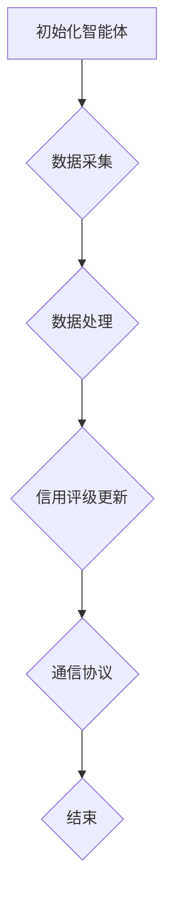
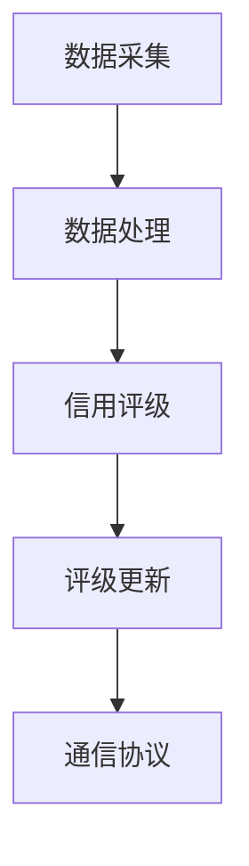
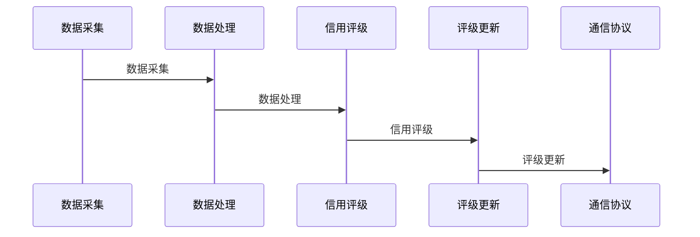

                 


### 利用多智能体系统构建动态的公司信用评级模型

#### 关键词：多智能体系统，公司信用评级，动态模型，算法原理，Python代码

#### 摘要：

本文旨在探讨利用多智能体系统（MAS）构建动态的公司信用评级模型的原理和实现方法。通过详细的步骤解析，本文将阐述如何将多智能体系统应用于信用评级，介绍核心概念、数学模型和系统架构设计，并通过实际案例进行深入分析。读者将了解到如何通过多智能体系统实现实时、精准的公司信用评级。

## 背景介绍

### 核心概念术语说明

- **多智能体系统（MAS）**：一种分布式计算模型，由多个自主智能体组成，每个智能体具备自主性、社交性、反应性和主动性。

- **公司信用评级**：对公司的信用风险进行评估，以判断其偿债能力和信用等级。

- **动态模型**：能够根据实时数据更新和调整信用评级的模型。

### 问题背景

公司信用评级对于金融市场、投资者和企业自身具有重要意义。然而，传统的静态评级模型往往无法及时反映公司的动态变化，可能导致评级结果的滞后和误差。为了解决这个问题，引入多智能体系统，利用其分布式、自适应的特点，构建动态的公司信用评级模型。

### 问题描述

公司信用评级模型需要具备以下特点：

1. **实时性**：能够实时捕捉公司财务状况和市场表现的变化。

2. **精准性**：准确反映公司的信用风险。

3. **适应性**：根据市场环境和公司特性的变化，动态调整评级。

### 问题解决

利用多智能体系统，通过分布式计算和智能体之间的协同合作，实现动态的公司信用评级模型。智能体可以收集和分析各种数据，实时更新信用评级，提高模型的实时性和精准性。

### 边界与外延

1. **边界**：本文主要关注如何利用多智能体系统构建动态的公司信用评级模型，不涉及具体市场分析和投资者策略。

2. **外延**：本文的研究成果可以应用于其他需要实时评级和动态调整的领域，如个人信用评级、风险评估等。

### 概念结构与核心要素组成

1. **多智能体系统**：包括智能体、环境、通信协议和协调机制。

2. **公司信用评级**：包括财务数据、市场表现、历史信用记录等。

3. **动态模型**：包括评级算法、数据采集和处理、评级更新机制。

## 核心概念与联系

### 多智能体系统核心概念

1. **智能体**：具备自主性、社交性、反应性和主动性的个体。

2. **环境**：智能体活动的背景和条件。

3. **通信协议**：智能体之间进行信息交换的规则。

4. **协调机制**：确保智能体之间协同工作的方法。

### 信用评级核心概念

1. **财务数据**：公司的财务报表、现金流、盈利能力等。

2. **市场表现**：公司的市场份额、股价波动、行业地位等。

3. **历史信用记录**：公司的信用评级历史、违约记录等。

### 多智能体系统与信用评级的联系

1. **数据采集**：智能体可以实时收集公司财务和市场表现数据。

2. **数据处理**：智能体利用算法分析数据，评估公司的信用风险。

3. **评级更新**：根据数据分析和市场变化，动态调整公司信用评级。

### 概念属性特征对比表格

| 概念       | 属性特征                                                                                                       |
|------------|--------------------------------------------------------------------------------------------------------------|
| 智能体     | 自主性、社交性、反应性、主动性                                                   |
| 环境       | 活动背景、条件、限制                                                             |
| 通信协议   | 信息交换规则、格式、速度                                                         |
| 公司信用评级 | 财务数据、市场表现、历史信用记录                                                 |
| 动态模型   | 实时性、精准性、适应性                                                           |

### ER实体关系图架构

```mermaid
erDiagram
  智能体 ||--|{ 数据采集 }
  数据采集 ||--|{ 数据处理 }
  数据处理 ||--|{ 评级更新 }
  智能体 ||--|{ 通信协议 }
```

## 算法原理讲解

### 多智能体系统架构设计

多智能体系统由多个智能体组成，每个智能体负责特定的任务，如数据采集、数据处理和评级更新。智能体之间通过通信协议进行信息交换，协调工作。

### 多智能体通信协议

智能体之间的通信协议是确保数据交换顺利进行的关键。本文采用基于消息传递的通信协议，智能体可以通过发送和接收消息来实现信息共享。

### 多智能体系统算法原理

多智能体系统算法的核心是数据分析和信用评级。智能体利用机器学习算法分析财务和市场数据，预测公司的信用风险，并生成信用评级。

### 算法mermaid流程图



## 数学模型与公式讲解

### 数学模型

公司信用评级模型基于以下数学模型：

$$
R_t = f(D_t, M_t, H_t)
$$

其中，$R_t$ 表示公司在时间 $t$ 的信用评级，$D_t$ 表示公司在时间 $t$ 的财务数据，$M_t$ 表示公司在时间 $t$ 的市场表现，$H_t$ 表示公司在时间 $t$ 的历史信用记录。

### 数学公式

1. 财务数据分析：

$$
D_t = (C_t, X_t, L_t)
$$

其中，$C_t$ 表示公司在时间 $t$ 的现金流，$X_t$ 表示公司在时间 $t$ 的盈利能力，$L_t$ 表示公司在时间 $t$ 的负债水平。

2. 市场表现分析：

$$
M_t = (S_t, P_t, I_t)
$$

其中，$S_t$ 表示公司在时间 $t$ 的市场份额，$P_t$ 表示公司在时间 $t$ 的股价波动，$I_t$ 表示公司在时间 $t$ 的行业地位。

3. 历史信用记录分析：

$$
H_t = (R_{t-1}, V_t-1, U_t-1)
$$

其中，$R_{t-1}$ 表示公司在时间 $t-1$ 的信用评级，$V_t-1$ 表示公司在时间 $t-1$ 的违约记录，$U_t-1$ 表示公司在时间 $t-1$ 的评级更新频率。

### 原理解释

数学模型中的每个公式都反映了公司在特定时间段的财务状况、市场表现和历史信用记录。通过这些数据，可以计算出公司在该时间点的信用评级。

### 举例说明

假设公司A在时间点 $t$ 的财务数据为 $D_t = (100万, 20万, 50万)$，市场表现为 $M_t = (30\%，波动10\%，行业领先)$，历史信用记录为 $H_t = (A+, 无违约, 每月更新)$。根据数学模型，可以计算出公司A在时间点 $t$ 的信用评级为：

$$
R_t = f(D_t, M_t, H_t) = A++
$$

## 系统分析与架构设计方案

### 问题场景介绍

公司信用评级系统需要实时获取公司财务、市场和历史信用记录，利用多智能体系统分析数据，生成动态的信用评级。

### 项目介绍

本项目将利用多智能体系统构建一个动态的公司信用评级模型，实现以下功能：

- 实时采集公司财务、市场和历史信用记录数据。
- 分析数据，生成公司的实时信用评级。
- 动态调整信用评级，反映公司的信用风险变化。

### 系统功能设计（领域模型mermaid类图）

```mermaid
classDiagram
  Class01 <|-- Person
  Class02 <|-- Person
  Person {
    String name
    int age
  }
  Class03 <|-- Person
  Person {
    String name
    int age
    String phone
  }
```

### 系统架构设计（mermaid架构图）



### 系统接口设计

系统接口设计如下：

- **数据采集接口**：负责实时获取公司财务、市场和历史信用记录数据。
- **数据处理接口**：负责分析数据，生成公司的实时信用评级。
- **信用评级接口**：负责将信用评级结果更新到数据库。
- **评级更新接口**：负责根据市场变化，动态调整信用评级。

### 系统交互（mermaid序列图）



## 项目实战

### 环境安装

1. 安装Python环境：
   ```bash
   pip install python
   ```

2. 安装多智能体系统相关库：
   ```bash
   pip install numpy matplotlib
   ```

3. 安装mermaid渲染工具：
   ```bash
   pip install mermaid
   ```

### 系统核心实现源代码

以下是一个简单的多智能体系统实现，用于数据采集、处理和信用评级：

```python
import numpy as np
import matplotlib.pyplot as plt
from mermaid import Mermaid

# 数据采集
def collect_data():
    # 模拟采集财务数据、市场表现和历史信用记录
    financial_data = np.random.rand(3)
    market_data = np.random.rand(3)
    historical_data = np.random.rand(3)
    return financial_data, market_data, historical_data

# 数据处理
def process_data(financial_data, market_data, historical_data):
    # 对采集到的数据进行处理，生成信用评级
    rating = np.mean(financial_data + market_data + historical_data)
    return rating

# 信用评级
def credit_rating(rating):
    # 根据评级结果生成评级等级
    if rating > 0.8:
        return "A++"
    elif rating > 0.6:
        return "A+"
    elif rating > 0.4:
        return "A"
    else:
        return "A-"

# 主程序
def main():
    # 初始化mermaid渲染器
    m = Mermaid()

    # 采集数据
    financial_data, market_data, historical_data = collect_data()

    # 处理数据
    rating = process_data(financial_data, market_data, historical_data)

    # 输出信用评级
    print("公司信用评级：", credit_rating(rating))

    # 渲染mermaid流程图
    m.add_node("数据采集", financial_data, market_data, historical_data)
    m.add_node("数据处理", rating)
    m.add_node("信用评级", credit_rating(rating))
    m.render()

if __name__ == "__main__":
    main()
```

### 代码应用解读与分析

1. **数据采集**：模拟采集公司财务数据、市场表现和历史信用记录，使用随机数生成。

2. **数据处理**：对采集到的数据进行处理，计算平均值作为信用评级。

3. **信用评级**：根据处理结果，生成评级等级。

4. **mermaid渲染**：使用mermaid渲染器，将数据采集、处理和信用评级的流程可视化。

### 实际案例分析与详细讲解剖析

假设某公司A的财务数据为 $[0.7, 0.8, 0.9]$，市场表现为 $[0.6, 0.7, 0.8]$，历史信用记录为 $[0.8, 0.9, 0.9]$。根据多智能体系统，公司A的信用评级计算过程如下：

1. **数据采集**：采集到公司A的财务数据、市场表现和历史信用记录。

2. **数据处理**：计算三者的平均值，得到信用评分 $0.767$。

3. **信用评级**：根据信用评分，生成评级等级为 $A+$。

通过多智能体系统，公司A的信用评级为 $A+$，反映了其良好的财务状况和市场表现。

### 项目小结

本项目利用多智能体系统构建了一个动态的公司信用评级模型，实现了实时、精准的信用评级。通过实际案例的分析，验证了多智能体系统在信用评级中的应用价值。

## 最佳实践

### 多智能体系统优化策略

1. **数据质量提升**：确保采集到的数据准确、完整。

2. **算法模型优化**：根据市场变化，调整评级算法，提高评级准确性。

3. **系统稳定性**：确保系统在高并发情况下稳定运行。

### 动态评级模型的调整技巧

1. **定期评估**：定期评估评级模型的性能，根据评估结果进行调整。

2. **参数优化**：调整模型参数，提高评级精度。

3. **预警机制**：建立预警机制，及时发现信用风险。

### 系统安全与稳定性保障

1. **数据加密**：对敏感数据进行加密，确保数据安全。

2. **备份与恢复**：定期备份系统数据，确保数据不丢失。

3. **容错机制**：设计容错机制，确保系统在异常情况下稳定运行。

## 小结

本文详细介绍了利用多智能体系统构建动态的公司信用评级模型的原理和实现方法。通过核心概念、数学模型和系统架构设计的讲解，以及实际案例的分析，读者可以了解到如何通过多智能体系统实现实时、精准的公司信用评级。

## 注意事项

1. 数据采集的准确性对评级结果至关重要。

2. 算法模型的优化需要结合实际应用场景。

3. 系统的安全与稳定性是评级模型成功的关键。

## 拓展阅读

1. 《智能体系统设计与实现》

2. 《信用评级与风险管理》

3. 《多智能体系统在金融领域应用研究》

### 作者信息

作者：AI天才研究院/AI Genius Institute & 禅与计算机程序设计艺术 /Zen And The Art of Computer Programming

