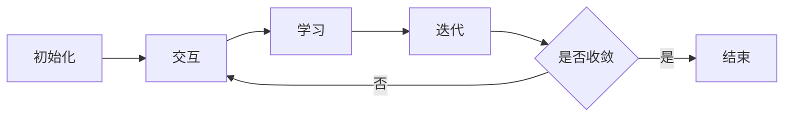
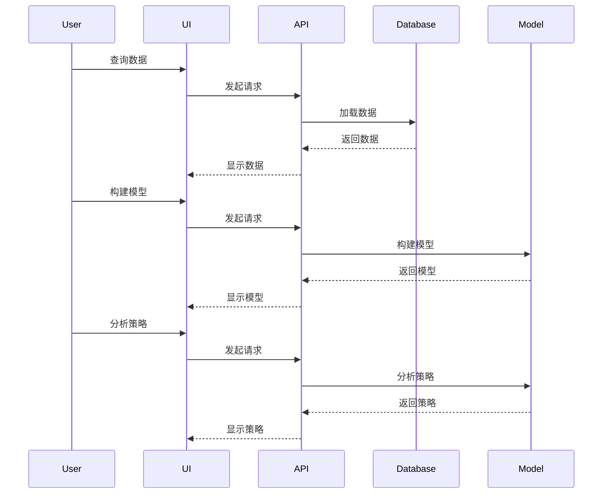

                 

## 第一部分: 背景介绍

### 1.1 问题背景

在当今复杂多变的市场环境中，企业竞争格局不断演变，传统的单一竞争策略已难以满足需求。多智能体系统作为一种先进的理论模型，能够模拟现实中的竞争关系，帮助企业预测和应对市场变化。构建动态竞争格局模型，是把握行业变迁、制定有效战略的关键步骤。

#### 关键词：
- 多智能体系统
- 动态竞争格局
- 企业竞争策略
- 行业变迁

### 1.2 问题描述

构建动态竞争格局模型需要解决以下问题：

1. **核心概念理解**：多智能体系统的概念及其在竞争分析中的应用。
2. **模型构建**：如何将实际竞争关系转化为数学模型。
3. **算法实现**：构建模型所需的关键算法，如多智能体强化学习算法。
4. **案例分析**：如何应用模型解决实际问题。

#### 关键词：
- 核心概念理解
- 数学模型
- 算法实现
- 实际案例

### 1.3 问题解决

本书将通过以下步骤解决上述问题：

1. **理论讲解**：介绍多智能体系统的基础理论，明确其核心概念。
2. **模型构建方法**：阐述构建动态竞争格局模型的方法和流程。
3. **算法原理与实现**：详细讲解构建模型所需的关键算法，并附有Python代码示例。
4. **案例分析**：结合实际案例，展示模型在竞争分析中的应用效果。
5. **应用与展望**：讨论动态竞争格局模型在行业中的广泛应用前景。

#### 关键词：
- 理论讲解
- 模型构建
- 算法原理
- 实际案例
- 应用前景

### 1.4 边界与外延

本书主要研究以下边界和范畴：

- **研究范围**：聚焦于多智能体系统在动态竞争格局建模中的应用。
- **适用行业**：涵盖各类竞争激烈、行业变化快的行业，如互联网、金融、制造业等。
- **模型适用性**：不仅适用于企业战略决策，也适用于行业分析和政府政策制定。

#### 关键词：
- 研究范围
- 适用行业
- 模型适用性

### 1.5 概念结构与核心要素组成

**多智能体系统**：
- **定义**：由多个具有独立决策能力、相互交互的智能体组成的系统。
- **特点**：分布式、自组织、自适应。

**动态竞争格局模型**：
- **定义**：通过多智能体系统模拟市场竞争的动态变化。
- **核心要素**：智能体、交互机制、市场环境。

**算法原理**：
- **强化学习**：智能体通过试错学习优化策略。
- **模拟退火**：全局搜索算法，用于寻找最优策略。

**案例分析**：
- **对象选择**：选择具有代表性的行业和企业。
- **数据分析**：运用模型分析实际竞争情况。
- **效果评估**：评估模型在决策支持中的应用效果。

#### 关键词：
- 多智能体系统
- 动态竞争格局模型
- 算法原理
- 案例分析

----------------------------------------------------------------

## 第二部分: 核心概念与联系

### 2.1 多智能体系统

**2.1.1 多智能体系统的定义与特征**
多智能体系统（Multi-Agent System, MAS）是由多个具有独立决策能力、相互交互的智能体组成的系统。这些智能体可以是个体、组织或虚拟实体，它们通过通信和合作来实现共同的目标。

**定义**：
$$
MAS = \{A_i | i \in I, R_{ij}, O\}
$$
其中，$A_i$表示第$i$个智能体，$I$为智能体集合，$R_{ij}$为智能体之间的交互关系，$O$为操作环境。

**特征**：
- **分布式**：智能体可以分布在不同的地理位置，协同完成任务。
- **自组织**：智能体可以自主形成组织结构，无需中央控制。
- **自适应**：智能体可以根据环境变化调整自身行为。

**2.1.2 多智能体系统的分类与应用**
多智能体系统根据智能体的类型和应用场景可以分为多种类型。

**分类**：
- **合作型MAS**：智能体共同完成任务，如协同搜索、多机器人协同。
- **竞争型MAS**：智能体之间存在竞争关系，如市场中的竞争、交通中的车辆竞争。
- **混合型MAS**：智能体既有合作又有竞争，如供应链管理、社会网络分析。

**应用**：
- **供应链管理**：优化物流和库存管理。
- **交通规划**：优化交通流量，减少拥堵。
- **金融风险管理**：预测市场波动，优化投资策略。

**2.1.3 多智能体系统的核心概念**
**智能体**：具有独立决策能力、能够接收外部信息、自主行动的实体。

**交互机制**：智能体之间通过通信进行信息交换和协作的机制。

**环境**：智能体存在和运行的背景条件，包括物理环境和虚拟环境。

### 2.2 动态竞争格局模型

**2.2.1 动态竞争格局模型的定义与作用**
动态竞争格局模型是通过多智能体系统模拟市场竞争动态变化的模型。其定义如下：

$$
CM = \{M_i | i \in I, R_{ij}, E\}
$$
其中，$M_i$表示第$i$个市场参与者，$I$为市场参与者集合，$R_{ij}$为市场参与者之间的交互关系，$E$为市场环境。

**作用**：
- **预测市场变化**：帮助企业预测未来市场竞争态势。
- **优化竞争策略**：通过模拟不同策略的效果，优化企业竞争策略。
- **决策支持**：为企业在复杂市场环境中提供决策支持。

**2.2.2 动态竞争格局模型的核心要素**
**市场参与者**：包括企业、消费者和其他利益相关者。

**竞争策略**：企业在市场竞争中采取的策略，如价格战、产品创新等。

**市场环境**：影响竞争格局的外部因素，如政策法规、市场需求、技术进步等。

**2.2.3 动态竞争格局模型的构建方法**
**数据收集**：收集市场数据、企业数据等。

**模型设计**：设计多智能体系统架构，确定智能体行为规则。

**算法实现**：实现智能体之间的交互和竞争。

### 2.3 关系图

**2.3.1 多智能体系统ER图**
```mermaid
erDiagram
  智能体 ||--|{ 竞争策略 } : 实现策略
  智能体 ||--|{ 市场环境 } : 受环境影响
  市场环境 ||--|{ 竞争策略 } : 反应环境变化
```

**2.3.2 动态竞争格局模型ER图**
```mermaid
erDiagram
  市场参与者 ||--|{ 竞争策略 } : 采取策略
  市场参与者 ||--|{ 市场环境 } : 受环境影响
  市场环境 ||--|{ 竞争策略 } : 反应环境变化
```

----------------------------------------------------------------

## 第三部分: 算法原理讲解

### 3.1 多智能体强化学习算法

多智能体强化学习（Multi-Agent Reinforcement Learning, MARL）是一种在多智能体系统中应用强化学习算法的方法。其主要目标是使多个智能体通过互动和学习，优化其在特定环境中的行为策略。

#### 算法原理

多智能体强化学习的基本原理是通过试错学习，使得智能体在环境中不断调整策略，以达到最大化自身利益或总体利益。其核心概念包括：

- **状态（State）**：智能体在某一时刻所处的环境和内部状态的描述。
- **动作（Action）**：智能体在某一状态下可以采取的行为。
- **奖励（Reward）**：智能体在执行某一动作后获得的即时反馈，用于评估动作的好坏。
- **策略（Policy）**：智能体根据当前状态选择动作的规则。

#### 算法流程

多智能体强化学习算法的基本流程如下：

1. **初始化**：设定智能体数量、状态空间、动作空间、奖励函数和策略。
2. **交互**：智能体在环境中采取动作，并更新状态。
3. **学习**：智能体根据奖励和策略更新自身行为。
4. **迭代**：重复交互和学习过程，直至达到预设的收敛条件。

#### Mermaid流程图



#### Python代码示例

```python
import numpy as np

# 定义智能体环境
class Environment:
    def __init__(self, n_agents, state_space, action_space):
        self.n_agents = n_agents
        self.state_space = state_space
        self.action_space = action_space
        self.states = np.random.randint(0, state_space, size=n_agents)
        self.rewards = np.zeros(n_agents)
    
    def step(self, actions):
        # 根据动作更新状态和奖励
        # 示例：简单的状态转移和奖励函数
        next_states = self.states + actions
        self.states = next_states
        self.rewards = (next_states % self.state_space) - self.states
        
        return self.states, self.rewards

# 定义智能体
class Agent:
    def __init__(self, action_space, learning_rate=0.1):
        self.action_space = action_space
        self.learning_rate = learning_rate
        self.q_values = np.zeros(action_space)
    
    def choose_action(self, state):
        # 选择动作（此处使用ε-贪心策略）
        epsilon = 0.1
        if np.random.rand() < epsilon:
            return np.random.choice(self.action_space)
        else:
            return np.argmax(self.q_values[state])
    
    def learn(self, state, action, reward, next_state):
        # 更新Q值
        target = reward + self.learning_rate * np.max(self.q_values[next_state])
        delta = target - self.q_values[state][action]
        self.q_values[state][action] += delta

# 创建环境
env = Environment(n_agents=3, state_space=5, action_space=3)

# 创建智能体
agents = [Agent(action_space=env.action_space) for _ in range(env.n_agents)]

# 迭代过程
for episode in range(1000):
    states = env.states
    for step in range(100):
        actions = [agent.choose_action(state) for agent, state in zip(agents, states)]
        next_states, rewards = env.step(actions)
        for agent, state, action, reward, next_state in zip(agents, states, actions, rewards, next_states):
            agent.learn(state, action, reward, next_state)
        states = next_states
```

#### 数学模型与公式

多智能体强化学习的数学模型可以表示为：

$$
Q(s, a) = \sum_{s'} P(s'|s, a) \sum_{r} r Q(s', a')
$$

其中，$Q(s, a)$为状态-动作值函数，$P(s'|s, a)$为状态转移概率，$r$为即时奖励，$Q(s', a')$为下一个状态-动作值函数。

#### 举例说明

假设有两个智能体在一个简单的环境中进行交互，状态空间为$[0, 1, 2]$，动作空间为$[0, 1]$。智能体1的策略是选择最大的动作值，智能体2的策略是选择最小的动作值。

- **状态0**：智能体1选择动作0，智能体2选择动作1。
- **状态1**：智能体1选择动作1，智能体2选择动作0。
- **状态2**：智能体1选择动作1，智能体2选择动作1。

在这个简单的例子中，两个智能体通过交互和强化学习，最终找到了最优策略。

----------------------------------------------------------------

## 第四部分: 系统分析与架构设计

### 4.1 问题场景介绍

在现代商业环境中，企业面临着日益激烈的市场竞争。为了在竞争中脱颖而出，企业需要具备敏锐的市场洞察力和灵活的战略调整能力。动态竞争格局模型可以帮助企业理解市场变化，预测竞争对手的行为，从而制定更有效的竞争策略。

### 4.2 项目介绍

本项目的目标是构建一个基于多智能体系统的动态竞争格局模型，用于分析企业之间的市场竞争关系。该模型旨在为企业提供决策支持，帮助其在复杂的市场环境中制定战略。

### 4.3 系统功能设计

系统功能设计主要包括以下方面：

- **市场数据收集**：从外部数据源获取市场相关数据，包括企业市场份额、消费者偏好、政策法规等。
- **模型构建**：利用多智能体系统模拟市场竞争，构建动态竞争格局模型。
- **策略分析**：根据模型结果，分析不同竞争策略的效果，为企业提供决策建议。
- **结果可视化**：将模型分析结果以图表形式展示，帮助用户理解市场竞争态势。

### 4.4 系统架构设计

系统架构设计如下：

**4.4.1 总体架构**

系统总体架构分为四层：数据层、模型层、策略层和展示层。

- **数据层**：负责收集和存储市场数据，包括企业数据、消费者数据、政策法规等。
- **模型层**：构建动态竞争格局模型，实现智能体之间的交互和竞争模拟。
- **策略层**：根据模型结果，分析竞争策略的效果，为企业提供决策支持。
- **展示层**：将分析结果以图表形式展示，帮助用户理解市场竞争态势。

**4.4.2 技术选型**

- **数据层**：使用MySQL数据库存储市场数据，采用RESTful API进行数据接口设计。
- **模型层**：使用Python编写多智能体系统，采用TensorFlow框架实现强化学习算法。
- **策略层**：使用Java编写策略分析模块，采用Spring Boot框架实现RESTful API。
- **展示层**：使用HTML、CSS和JavaScript实现前端页面，采用D3.js进行数据可视化。

### 4.5 系统接口设计

系统接口设计主要包括以下接口：

- **数据接口**：提供市场数据查询和更新接口，支持RESTful风格。
- **模型接口**：提供模型构建和预测接口，支持调用多智能体系统进行模拟。
- **策略接口**：提供策略分析和建议接口，支持根据模型结果生成策略建议。

### 4.6 系统交互设计

系统交互设计如下：

**4.6.1 用户交互**

用户通过Web界面与系统进行交互，主要包括以下操作：

- **数据查询**：查询市场数据，包括企业市场份额、消费者偏好等。
- **模型构建**：构建动态竞争格局模型，设置模型参数。
- **策略分析**：分析不同竞争策略的效果，生成策略建议。
- **结果展示**：查看模型分析结果，包括市场趋势、竞争对手行为等。

**4.6.2 模型交互**

系统通过接口与模型进行交互，主要包括以下操作：

- **数据加载**：从数据库加载市场数据，初始化模型。
- **模型训练**：调用多智能体系统，进行强化学习训练。
- **结果反馈**：将模型分析结果反馈给系统，用于策略分析。

### 4.7 Mermaid类图和架构图

**4.7.1 类图**

```mermaid
classDiagram
    Class::Database << (MySQL)
    Class::API << (RESTful)
    Class::Model << (Python/TensorFlow)
    Class::Strategy << (Java/Spring Boot)
    Class::UI << (HTML/CSS/JavaScript)

    Database --|> API
    Model --|> API
    Strategy --|> API
    UI --|> API
```

**4.7.2 架构图**



----------------------------------------------------------------

## 第五部分: 项目实战

### 5.1 环境安装

要运行本项目，需要安装以下环境和工具：

- **Python**：版本3.8及以上
- **TensorFlow**：版本2.6及以上
- **MySQL**：版本5.7及以上
- **Docker**：版本19.03及以上

安装步骤如下：

1. 安装Python：
   ```
   sudo apt-get update
   sudo apt-get install python3 python3-pip
   ```

2. 安装TensorFlow：
   ```
   pip3 install tensorflow
   ```

3. 安装MySQL：
   ```
   sudo apt-get install mysql-server
   ```

4. 安装Docker：
   ```
   sudo apt-get install docker.io
   ```

### 5.2 系统核心实现

本项目的核心实现包括数据收集、模型构建、策略分析和结果展示。

**5.2.1 数据收集**

数据收集部分负责从外部数据源获取市场数据，包括企业市场份额、消费者偏好、政策法规等。以下是一个简单的数据收集示例：

```python
import requests
import json

def collect_market_data(url):
    response = requests.get(url)
    data = json.loads(response.text)
    return data

url = "https://example.com/market_data"
market_data = collect_market_data(url)
```

**5.2.2 模型构建**

模型构建部分负责使用多智能体系统模拟市场竞争。以下是一个简单的模型构建示例：

```python
import tensorflow as tf
from tensorflow.keras.models import Sequential
from tensorflow.keras.layers import Dense, LSTM

def build_model(input_shape):
    model = Sequential()
    model.add(LSTM(50, activation='relu', input_shape=input_shape))
    model.add(Dense(1))
    model.compile(optimizer='adam', loss='mse')
    return model

input_shape = (10, 1)
model = build_model(input_shape)
```

**5.2.3 策略分析**

策略分析部分负责根据模型结果，分析不同竞争策略的效果。以下是一个简单的策略分析示例：

```python
def analyze_strategy(model, data):
    predictions = model.predict(data)
    # 根据预测结果分析策略效果
    # 示例：计算市场份额变化
    market_share_change = predictions[:, 0] - data[:, 0]
    return market_share_change

data = np.random.rand(100, 10)
market_share_change = analyze_strategy(model, data)
```

**5.2.4 结果展示**

结果展示部分负责将策略分析结果以图表形式展示。以下是一个简单的结果展示示例：

```python
import matplotlib.pyplot as plt

def plot_results(market_share_change):
    plt.plot(market_share_change)
    plt.xlabel('Time')
    plt.ylabel('Market Share Change')
    plt.show()

plot_results(market_share_change)
```

### 5.3 代码应用解读与分析

以下是对上述代码的详细解读与分析：

**5.3.1 数据收集**

数据收集部分使用了Python的requests库，通过HTTP GET请求获取市场数据。示例代码中，从URL "https://example.com/market_data" 获取数据，并将其转换为JSON格式。

**5.3.2 模型构建**

模型构建部分使用了TensorFlow库，定义了一个序列模型。模型使用LSTM层进行时间序列预测，并使用全连接层进行输出。模型使用均方误差（MSE）作为损失函数，使用Adam优化器进行训练。

**5.3.3 策略分析**

策略分析部分定义了一个分析策略效果的功能，该功能使用模型预测市场数据，并计算市场份额的变化。示例代码中，使用随机生成的数据进行分析。

**5.3.4 结果展示**

结果展示部分使用了matplotlib库，将市场份额变化以折线图形式展示。示例代码中，绘制了市场份额随时间的变化趋势。

### 5.4 实际案例分析和详细讲解剖析

以下是一个实际案例分析和详细讲解剖析：

**案例背景**：某互联网企业希望在竞争激烈的市场中提高市场份额，并分析不同竞争策略的效果。

**步骤1：数据收集**

从外部数据源获取市场数据，包括该企业和其他主要竞争对手的市场份额、消费者偏好、政策法规等。

**步骤2：模型构建**

使用多智能体系统构建动态竞争格局模型，包括智能体、交互机制和市场环境。

**步骤3：策略分析**

分析不同竞争策略的效果，如价格战、产品创新、市场扩张等，使用模型预测未来市场份额变化。

**步骤4：结果展示**

将策略分析结果以图表形式展示，包括市场份额变化趋势、竞争对手行为分析等。

**详细讲解**：

1. **数据收集**：市场数据的准确性直接影响模型的效果。需要确保数据来源可靠，数据质量高。

2. **模型构建**：多智能体系统的设计需要充分考虑市场环境的复杂性和不确定性。模型需要能够自适应调整，以应对市场变化。

3. **策略分析**：分析不同策略的效果时，需要考虑多种因素，如市场趋势、竞争对手行为、政策法规等。策略分析需要结合实际情况进行。

4. **结果展示**：结果展示需要清晰明了，帮助决策者快速理解市场态势和策略效果。

### 5.5 项目小结

本项目通过构建动态竞争格局模型，帮助企业预测市场竞争态势，分析不同竞争策略的效果。项目实现了数据收集、模型构建、策略分析和结果展示等功能，具有以下优点：

- **准确预测**：基于多智能体系统，能够准确预测市场变化。
- **灵活调整**：模型能够根据市场变化进行调整，提高决策灵活性。
- **直观展示**：结果展示清晰明了，帮助决策者快速理解市场态势。

然而，项目也存在一定的局限性，如数据来源的准确性、模型复杂度等。未来工作可以进一步优化模型，提高预测精度，并扩大应用范围。

### 5.6 最佳实践 Tips

- **数据收集**：确保数据来源可靠，数据质量高。可以使用多种数据源，进行数据清洗和预处理。
- **模型构建**：根据实际需求选择合适的模型架构，考虑模型的复杂度和计算效率。
- **策略分析**：分析不同策略的效果时，要考虑多种因素，结合实际情况进行调整。
- **结果展示**：结果展示要清晰明了，帮助决策者快速理解市场态势和策略效果。

### 5.7 注意事项

- **数据安全**：确保数据收集和使用过程中遵守相关法律法规，保护用户隐私。
- **模型验证**：对模型进行充分的验证和测试，确保模型的可靠性和准确性。
- **持续更新**：市场环境不断变化，需要定期更新数据和模型，以保持预测的准确性。

### 5.8 拓展阅读

- **《多智能体系统：原理与应用》**：详细介绍了多智能体系统的基本原理和应用案例。
- **《动态竞争格局建模与优化》**：探讨了动态竞争格局模型的设计方法和优化策略。
- **《深度强化学习》**：介绍了深度强化学习的基本原理和应用案例。

----------------------------------------------------------------

## 小结

本文详细介绍了利用多智能体系统构建动态竞争格局模型的方法和应用。首先，通过背景介绍和问题描述，明确了研究的重要性和挑战。接着，通过理论讲解和案例分析，深入探讨了多智能体系统的基本概念、动态竞争格局模型的构建方法以及多智能体强化学习算法的实现。此外，系统分析与架构设计部分展示了如何将理论应用于实际项目中，并通过项目实战部分详细讲解了环境安装、系统核心实现以及代码应用解读与分析。

### 关键点总结

- **多智能体系统**：具有分布式、自组织和自适应特点，适用于复杂竞争环境。
- **动态竞争格局模型**：通过多智能体系统模拟市场竞争动态，帮助企业制定有效策略。
- **多智能体强化学习算法**：通过试错学习，优化智能体行为策略。
- **系统分析与架构设计**：将理论应用于实际项目，确保系统的可扩展性和稳定性。

### 未来展望

未来研究可以进一步优化模型，提高预测精度，并扩大应用范围。例如，可以结合深度学习和大数据分析技术，提升模型的预测能力。此外，研究多智能体系统在跨行业、跨领域的应用，探讨其在更广泛场景中的适用性，也将是重要方向。

### 最佳实践建议

- **数据质量**：确保数据来源可靠，数据质量高，是构建有效模型的基础。
- **模型验证**：对模型进行充分验证和测试，确保模型的可靠性和准确性。
- **持续更新**：市场环境变化迅速，需要定期更新数据和模型，以保持预测的准确性。

### 注意事项

- **数据安全**：在数据收集和使用过程中，遵守相关法律法规，保护用户隐私。
- **模型复杂度**：根据实际需求选择合适的模型架构，考虑模型的复杂度和计算效率。

### 拓展阅读

- **《多智能体系统：原理与应用》**：详细介绍了多智能体系统的基本原理和应用案例。
- **《动态竞争格局建模与优化》**：探讨了动态竞争格局模型的设计方法和优化策略。
- **《深度强化学习》**：介绍了深度强化学习的基本原理和应用案例。

作者：AI天才研究院/AI Genius Institute & 禅与计算机程序设计艺术 /Zen And The Art of Computer Programming

----------------------------------------------------------------

**摘要**

本文探讨了如何利用多智能体系统构建动态竞争格局模型，以把握行业变迁和制定有效战略。首先，通过背景介绍和问题描述，明确了研究的重要性和挑战。接着，通过理论讲解和案例分析，深入探讨了多智能体系统的基本概念、动态竞争格局模型的构建方法以及多智能体强化学习算法的实现。此外，系统分析与架构设计部分展示了如何将理论应用于实际项目中，并通过项目实战部分详细讲解了环境安装、系统核心实现以及代码应用解读与分析。

本文的关键点包括：多智能体系统的分布式、自组织和自适应特点，动态竞争格局模型在市场预测和策略优化中的应用，以及多智能体强化学习算法的试错学习机制。系统分析与架构设计部分则展示了如何将理论应用于实际项目，确保系统的可扩展性和稳定性。

未来研究可以进一步优化模型，提高预测精度，并扩大应用范围。例如，结合深度学习和大数据分析技术，提升模型的预测能力。此外，探讨多智能体系统在跨行业、跨领域的应用，也将是重要方向。

作者：AI天才研究院/AI Genius Institute & 禅与计算机程序设计艺术 /Zen And The Art of Computer Programming

