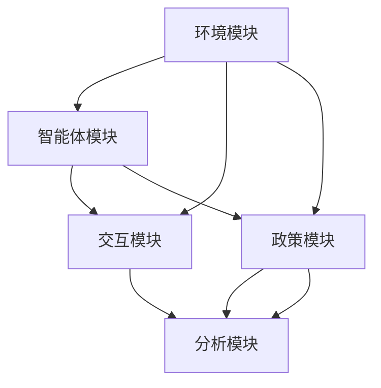
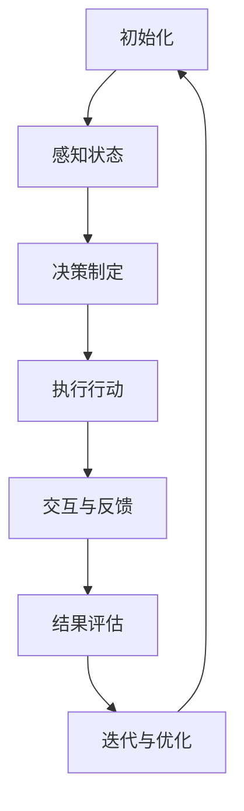
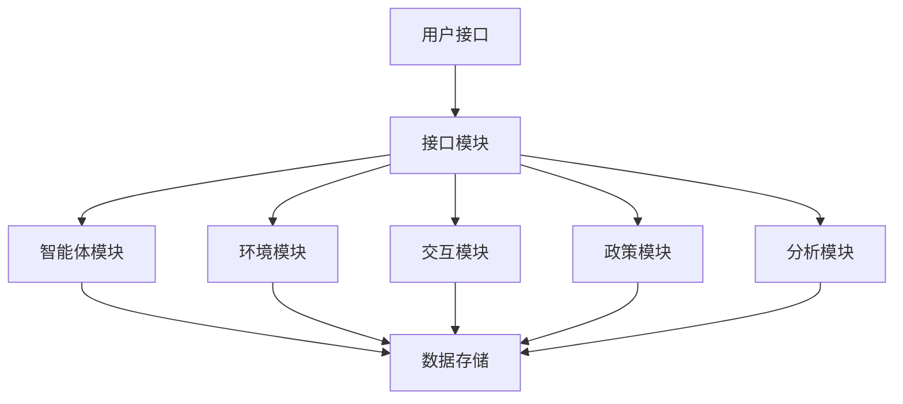
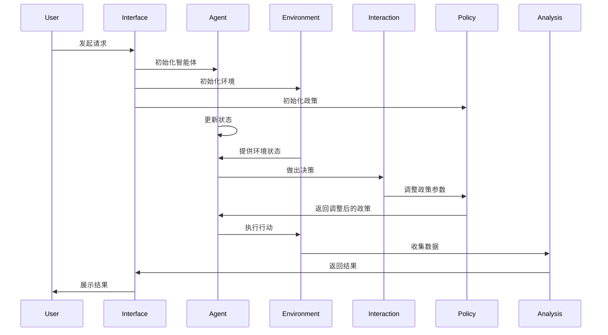

                 

### 1.1 贸易政策的多智能体系统模拟

**贸易政策**是各国政府为促进本国经济发展和国际竞争力而制定的一系列政策和措施。这些政策可能包括关税、配额、补贴等，旨在调节进出口贸易。而**多智能体系统（Multi-Agent System）**是一种由多个自主智能体（agent）组成的系统，这些智能体可以在一定环境下独立行动并与其他智能体交互，共同实现特定目标。

**贸易政策的多智能体系统模拟**是将贸易政策作为一个智能体系统中的行为策略，通过模拟不同政策在多个智能体之间的交互，评估其对全球贸易和全球化风险的影响。这种方法的核心在于：

1. **自主智能体的定义**：在多智能体系统中，智能体可以代表国家、企业、消费者等不同角色。每个智能体都有自身的目标、行为规则和决策能力。
2. **环境建模**：模拟系统中的环境需要考虑全球经济、政治、社会等因素，这些因素会直接影响智能体的行为和决策。
3. **交互机制**：智能体之间的交互机制需要模拟贸易政策的影响，如关税设定、市场准入限制等。
4. **动态演化**：多智能体系统的动态演化特性可以反映贸易政策的变化及其对全球贸易的长期影响。

这种模拟方法的重要性体现在以下几个方面：

- **风险评估**：通过模拟，可以预测不同贸易政策可能导致的经济波动、市场动荡等风险，为政策制定者提供科学依据。
- **政策评估**：模拟不同贸易政策的效果，有助于评估政策的短期和长期影响，优化政策设计。
- **决策支持**：多智能体系统模拟可以为政府和国际组织提供决策支持，帮助他们在复杂多变的全球环境中制定更加有效的贸易政策。

总之，利用多智能体系统模拟贸易政策不仅能够提供更加精确和直观的政策评估，还能帮助我们更好地理解全球化风险，从而制定更加稳健的经济发展战略。

### 1.2 核心概念解析

在探讨贸易政策的多智能体系统模拟时，了解以下几个核心概念是非常重要的。这些概念不仅定义了系统的基本组成，还明确了它们在模拟中的关键角色和相互关系。

#### 1.2.1 多智能体系统的定义与特点

**多智能体系统**（Multi-Agent System，MAS）是由多个自主智能体组成的复杂系统，每个智能体具有独立的决策能力和行为规则。在MAS中，智能体可以通过通信和协同工作来完成任务，实现系统整体的优化。

**智能体的定义**：智能体是MAS中的基本单元，它可以是一个程序、一个实体或一个角色。智能体具有自主性、社会性、反应性和主动性等特点。

- **自主性**：智能体能够独立执行任务，不受外界直接控制。
- **社会性**：智能体可以通过通信与交互来协调行动，实现共同目标。
- **反应性**：智能体能够感知环境变化，并做出相应调整。
- **主动性**：智能体具备一定的决策能力，可以自主选择行为策略。

**多智能体系统的架构**：MAS的架构包括以下三个主要组成部分：

1. **智能体**：系统中的自主实体，具备特定任务能力和行为规则。
2. **环境**：智能体执行任务的背景，包括物理环境、社会环境等。
3. **通信机制**：智能体之间进行信息交换和协作的渠道。

**多智能体系统的特点**：

- **分布式**：智能体分散分布在系统中，各自独立运行。
- **动态性**：智能体和环境的状态不断变化，系统呈现动态特性。
- **复杂性**：MAS涉及到多个智能体之间的复杂交互和协作，具有较高的复杂性。
- **灵活性**：智能体可以根据环境变化动态调整行为策略，具有较高的灵活性。

#### 1.2.2 贸易政策的定义与分类

**贸易政策**是指一国政府为实现特定经济目标而采取的一系列措施，包括关税、配额、补贴、非关税壁垒等。贸易政策旨在调节进出口贸易，影响国家经济和国际贸易。

**贸易政策的分类**：

1. **自由贸易政策**：政府不采取任何限制性措施，允许商品和服务自由流动。自由贸易政策有助于提高经济效益，但可能导致国内产业竞争压力。
2. **保护主义政策**：政府通过关税、配额等手段限制进口，保护国内产业。保护主义政策可以短期内保护国内产业，但可能导致国际贸易摩擦。
3. **混合政策**：政府同时采取自由贸易政策和保护主义政策，根据不同情况灵活调整。

**贸易政策的目标**：

- **促进经济增长**：通过国际贸易，引入国外技术和市场资源，促进国内经济增长。
- **提高国际竞争力**：通过调整贸易政策，提高本国产品和服务的国际竞争力。
- **维护国家安全**：通过限制战略物资和高科技产品的出口，保障国家安全。

#### 1.2.3 全球化风险的因素分析

**全球化风险**是指在全球经济一体化背景下，由于政治、经济、社会等不确定因素导致的风险。全球化风险对各国经济和国际贸易产生重要影响。

**全球化风险的因素**：

1. **经济风险**：包括货币贬值、通货膨胀、经济衰退等经济因素，可能对国际贸易产生负面影响。
2. **政治风险**：包括政治不稳定、政策变化、贸易摩擦等政治因素，可能引发国际贸易争端。
3. **社会风险**：包括劳动力市场变化、社会动荡、文化冲突等社会因素，可能影响国际贸易的稳定性和可持续性。

**全球化风险的影响**：

- **贸易摩擦增加**：全球化风险可能导致各国之间的贸易争端和摩擦增加，影响全球贸易秩序。
- **经济波动加剧**：全球化风险可能导致全球经济波动加剧，影响国际贸易的稳定发展。
- **政策不确定性增加**：全球化风险可能增加政策的不确定性，使贸易政策调整更加复杂和困难。

### 1.3 多智能体系统与贸易政策的联系

多智能体系统与贸易政策的联系体现在以下几个方面：

1. **贸易政策的模拟**：多智能体系统可以模拟不同贸易政策在多个智能体（国家、企业、消费者等）之间的交互和影响，评估政策的效果和风险。
2. **全球化风险的评估**：通过模拟多智能体系统，可以评估全球化风险对国际贸易的影响，预测可能出现的经济和社会问题。
3. **政策优化**：多智能体系统模拟可以提供决策支持，帮助政策制定者优化贸易政策，提高政策的有效性和稳定性。

通过以上分析，可以看出多智能体系统与贸易政策之间存在紧密的联系。利用多智能体系统模拟贸易政策不仅有助于评估政策效果和风险，还能为政策优化提供有力支持。

#### 1.3.1 模拟贸易政策的多智能体系统架构设计

在设计一个模拟贸易政策的多智能体系统时，架构设计是至关重要的。一个良好的架构不仅能确保系统的可扩展性和灵活性，还能提供清晰的模块划分，使得开发、维护和扩展工作更加高效。以下是模拟贸易政策的多智能体系统架构设计的具体步骤和原则。

**1.3.1.1 模拟系统的设计原则**

1. **模块化设计**：将系统划分为多个功能模块，每个模块负责特定功能，便于管理和维护。
2. **松耦合设计**：模块之间通过标准化的接口进行通信，降低模块之间的依赖性，提高系统的灵活性和可扩展性。
3. **分布式架构**：采用分布式架构，将智能体分布在不同的计算节点上，提高系统的性能和可靠性。
4. **可扩展性**：设计时考虑到系统的扩展需求，确保可以轻松增加新的功能或智能体。

**2. 模拟系统的实现流程**

1. **环境建模**：首先，对全球贸易环境进行建模，包括全球经济、政治、社会等各个因素。这一步的目的是建立一个逼真的模拟环境，使得智能体能够在其中进行自主决策和交互。
   
2. **智能体定义**：定义智能体的类型和属性，包括国家、企业、消费者等。每个智能体都需要具备自主决策能力和与其他智能体进行交互的能力。

3. **智能体初始配置**：为每个智能体分配初始状态和属性，如初始资金、生产能力和市场需求等。这些初始配置将影响智能体在模拟过程中的行为。

4. **交互机制设计**：设计智能体之间的交互机制，包括通信协议、协商策略等。交互机制需要确保智能体能够在复杂环境中高效地交换信息和协调行动。

5. **政策模拟**：通过模拟不同贸易政策，观察智能体之间的交互和响应。这一步的关键是准确地模拟贸易政策对智能体行为的影响，从而评估政策效果。

6. **结果分析**：对模拟结果进行分析，评估不同政策对全球贸易和全球化风险的影响。这一步的目的是为政策制定者提供科学依据，帮助他们做出更加明智的决策。

**3. 系统架构的功能模块关系**

1. **环境模块**：负责全球贸易环境的建模和动态更新。
2. **智能体模块**：包括智能体的定义、初始配置和行为规则。
3. **交互模块**：负责智能体之间的通信和协商。
4. **政策模块**：包括贸易政策的定义、实施和效果评估。
5. **分析模块**：负责对模拟结果进行统计分析和可视化展示。

这些模块通过标准化的接口进行通信，形成完整的模拟系统。每个模块都可以独立开发和维护，确保系统的灵活性和可扩展性。

**4. 系统架构图展示**

为了更好地理解模拟系统的架构，我们可以使用Mermaid语言绘制系统架构图，如下所示：



在这个架构图中，环境模块与智能体模块、交互模块和政策模块通过接口进行通信，分析模块接收来自其他模块的数据，并进行结果分析。

通过以上架构设计和实现流程，我们可以构建一个功能强大、灵活可扩展的贸易政策多智能体系统，为政策评估和全球化风险分析提供有力支持。

#### 1.3.1.2 模拟系统的设计原则

在设计一个模拟贸易政策的多智能体系统时，设计原则至关重要。合理的原则不仅能确保系统的可扩展性和灵活性，还能为后续的开发、测试和维护工作提供明确的方向。以下是几个关键的设计原则：

**1. 模块化设计**

模块化设计是将系统划分为若干功能模块，每个模块专注于特定功能。模块化设计的好处包括：

- **便于管理和维护**：每个模块都是独立的，可以单独开发和维护，便于代码的管理和维护。
- **提高开发效率**：开发人员可以专注于特定模块的开发，而不需要了解系统的其他部分，这有助于提高开发效率。
- **便于扩展**：模块化设计使得系统可以轻松扩展，新功能或新智能体可以通过添加新模块来实现，而不会影响现有系统的稳定性。

**2. 松耦合设计**

松耦合设计是指模块之间通过标准化的接口进行通信，降低模块之间的依赖性。这种设计原则有助于：

- **提高系统的灵活性**：模块之间的依赖性降低，使得系统可以更加灵活地应对变化，例如，当需要添加新功能时，只需添加新模块，而不需要修改现有模块。
- **提高系统的可靠性**：模块之间通过接口通信，减少了模块之间的直接依赖，使得系统中的某个模块出现问题时，不会影响到其他模块的正常运行。

**3. 分布式架构**

分布式架构是将系统分散到多个计算节点上，以提高系统的性能和可靠性。具体来说，分布式架构具有以下优势：

- **高性能**：通过将计算任务分散到多个节点，可以显著提高系统的处理速度。
- **高可靠性**：如果某个节点出现故障，系统可以通过其他节点继续运行，这提高了系统的可靠性。

**4. 可扩展性**

可扩展性是指系统能够根据需求进行扩展，以应对更大的数据量和更多的用户。以下措施有助于提高系统的可扩展性：

- **水平扩展**：通过增加计算节点，可以轻松扩展系统的处理能力。
- **垂直扩展**：通过增加服务器的硬件配置，如增加内存、CPU等，可以提高系统的处理性能。

**5. 标准化接口**

使用标准化接口进行模块间的通信，确保接口的一致性和兼容性。标准化接口不仅提高了系统的灵活性，还使得模块之间的通信更加简单和高效。

**6. 可复用性**

设计时考虑模块的复用性，使得模块可以在不同的场景中重复使用。这有助于减少开发工作量，提高开发效率。

通过以上设计原则，我们可以构建一个高效、灵活、可靠的贸易政策多智能体模拟系统，为政策评估和全球化风险分析提供有力支持。

### 1.3.1.2 模拟系统的实现流程

实现一个模拟贸易政策的多智能体系统需要详细的步骤和清晰的流程。以下是一个典型的实现流程，包括各个阶段的任务和注意事项。

**1. 需求分析**

在开始开发之前，首先需要进行需求分析。这一步的目的是明确系统的功能和性能要求，确保系统能够满足用户的需求。

- **功能需求**：确定系统需要实现的主要功能，如智能体的定义、交互机制、政策模拟等。
- **性能需求**：确定系统需要达到的性能指标，如响应时间、处理速度等。
- **用户需求**：了解用户对系统的具体期望和需求，如操作便捷性、界面友好性等。

**2. 设计阶段**

在需求分析的基础上，进行系统设计。系统设计包括以下几个方面：

- **模块划分**：根据需求分析的结果，将系统划分为不同的功能模块，如智能体模块、交互模块、政策模块等。
- **接口设计**：设计模块之间的接口，确保模块之间能够通过标准化的方式进行通信。
- **架构设计**：选择合适的系统架构，如分布式架构、客户端-服务器架构等，以提高系统的性能和可靠性。

**3. 开发阶段**

开发阶段是将设计转化为实际的代码。以下是开发阶段的主要任务：

- **智能体实现**：根据设计，开发智能体的具体实现，包括智能体的行为规则、决策机制等。
- **环境建模**：建立全球贸易环境的模型，包括经济、政治、社会等因素。
- **交互机制**：实现智能体之间的交互机制，如通信协议、协商策略等。
- **政策模拟**：开发政策模拟功能，使系统能够根据不同政策进行模拟。

**4. 测试阶段**

测试阶段是确保系统质量和性能的关键步骤。以下是测试阶段的主要任务：

- **功能测试**：测试系统是否满足功能需求，确保所有功能都能正常工作。
- **性能测试**：测试系统在不同负载下的性能，确保系统能够高效处理大量数据。
- **兼容性测试**：确保系统在不同环境（如不同的操作系统、浏览器等）下都能正常运行。

**5. 部署与维护**

在系统测试通过后，进行部署，即将系统部署到生产环境中。以下是部署和维护阶段的主要任务：

- **部署**：将系统部署到服务器或云平台，确保系统能够正常运行。
- **维护**：定期对系统进行维护和更新，修复可能出现的问题，提升系统的性能和稳定性。

**6. 注意事项**

在实现流程的每个阶段，都需要注意以下事项：

- **文档化**：确保每个阶段的文档都完整，便于后续的维护和扩展。
- **模块化**：保持代码的模块化，便于管理和维护。
- **标准化**：使用标准化的接口和协议，确保模块之间的通信高效和稳定。
- **安全性**：确保系统的安全性，防止恶意攻击和数据泄露。

通过以上实现流程，我们可以构建一个功能强大、高效稳定的贸易政策多智能体模拟系统，为政策评估和全球化风险分析提供有力支持。

### 1.4 本章小结

本章介绍了贸易政策的多智能体系统模拟的基础，从背景、核心概念到架构设计进行了全面阐述。我们首先探讨了贸易政策的多智能体系统模拟的背景，明确了模拟贸易政策的必要性及其在全球贸易风险评估中的应用。接着，详细解析了多智能体系统的定义、特点以及与贸易政策的联系，并通过模块化的设计原则，阐述了模拟系统的架构设计流程。通过这些内容，读者可以全面了解多智能体系统模拟贸易政策的核心概念和实现方法，为后续章节的深入分析打下坚实基础。

### 第2章：算法原理与数学模型

#### 2.1 多智能体系统算法原理

在探讨贸易政策的多智能体系统模拟时，算法原理是理解系统行为和性能的关键。多智能体系统（MAS）的算法原理涉及智能体的决策过程、交互机制以及系统整体的演化过程。以下是多智能体系统算法原理的详细解析。

**1. 多智能体的基本原理**

多智能体系统的核心在于智能体（Agent）的概念。智能体是具有自主决策能力和行为规则的计算实体。每个智能体都有以下几个基本特性：

- **自主性**：智能体能够独立执行任务，不受外部直接控制。
- **社会性**：智能体可以通过通信和协作实现共同目标。
- **反应性**：智能体能够感知环境变化，并做出相应调整。
- **主动性**：智能体具备决策能力，可以自主选择行为策略。

**2. 多智能体系统的架构**

多智能体系统的架构通常包括三个主要部分：智能体、环境和通信机制。

- **智能体**：每个智能体都有特定的行为规则和决策模型。智能体的行为规则通常基于某种决策算法，如基于规则的推理、遗传算法、强化学习等。
- **环境**：环境是智能体执行任务的背景，包括物理环境、社会环境等。环境的状态会直接影响智能体的行为。
- **通信机制**：通信机制是智能体之间交换信息和协调行动的渠道。通信机制可以是异步的，也可以是同步的，取决于系统的需求和设计。

**3. 多智能体系统的基本算法**

多智能体系统的基本算法主要包括以下几种：

- **协商算法**：智能体之间通过协商达成一致，实现共同目标。常见的协商算法包括协商网络算法、协商博弈算法等。
- **决策算法**：智能体根据当前状态和目标，选择最佳行为策略。常见的决策算法包括基于规则的决策、遗传算法、强化学习等。
- **演化算法**：智能体通过演化过程，不断优化自身行为策略。常见的演化算法包括遗传算法、粒子群优化算法等。

**4. 多智能体系统的演化模型**

多智能体系统的演化模型描述了智能体在环境中相互作用和进化的过程。演化模型通常包括以下步骤：

- **状态感知**：智能体感知当前状态，包括自身状态和环境状态。
- **决策**：智能体根据当前状态和目标，选择最佳行为策略。
- **执行**：智能体执行决策，改变自身状态和环境状态。
- **反馈**：系统根据智能体的行为结果，进行反馈和调整，以优化智能体的行为策略。

通过以上基本原理和算法，多智能体系统能够模拟复杂的社会系统，实现对贸易政策的动态模拟和风险评估。接下来，我们将进一步探讨贸易政策模拟的算法框架，并详细介绍相关的数学模型。

### 2.1.1 多智能体系统的基本算法

在多智能体系统（MAS）中，智能体的基本算法是实现其自主性和社会性的关键。以下将详细阐述几种常用的基本算法，以及这些算法在贸易政策模拟中的应用。

**1. 基于规则的推理（Rule-Based Reasoning）**

基于规则的推理是一种简单而有效的智能体算法，它通过一组规则来指导智能体的决策过程。规则通常由条件（条件部分）和行动（结论部分）组成。例如：

- **规则**：如果（市场需求高）且（库存不足），则（增加生产）。
- **应用场景**：在贸易政策模拟中，基于规则的推理可以用于模拟国家的贸易政策决策。例如，当一个国家的市场需求高而库存不足时，政府可能会增加进口配额或提供关税优惠，以刺激国内生产和消费。

**2. 遗传算法（Genetic Algorithm）**

遗传算法是一种基于自然选择和遗传学原理的优化算法，适用于求解复杂问题。遗传算法通过模拟自然选择过程，逐步优化智能体的行为策略。

- **基本步骤**：
  1. **初始化种群**：生成一组初始智能体，每个智能体代表一种可能的解决方案。
  2. **适应度评估**：根据目标函数，评估每个智能体的适应度，适应度高的智能体更有可能被选择。
  3. **选择**：从当前种群中选择适应度高的智能体进行繁殖，通常使用轮盘赌或锦标赛选择。
  4. **交叉**：通过随机交换两个智能体的一部分特征，生成新的智能体。
  5. **变异**：对智能体进行随机变异，增加种群多样性。
  6. **迭代**：重复上述步骤，直到达到预定的迭代次数或满足停止条件。

- **应用场景**：在贸易政策模拟中，遗传算法可以用于优化贸易政策组合，例如，通过迭代过程找到最优的关税和补贴组合，以最大化经济增长或减少贸易摩擦。

**3. 强化学习（Reinforcement Learning）**

强化学习是一种通过试错和反馈机制进行学习的算法，智能体通过与环境的交互不断优化其行为策略。强化学习主要包括四个部分：智能体、环境、动作和奖励。

- **基本步骤**：
  1. **智能体选择动作**：智能体根据当前状态，选择一个动作。
  2. **执行动作**：智能体执行所选动作，改变环境状态。
  3. **获得奖励**：根据动作的结果，环境给予智能体一个奖励信号。
  4. **更新策略**：智能体根据奖励信号，更新其行为策略。

- **应用场景**：在贸易政策模拟中，强化学习可以用于动态调整贸易政策，例如，智能体可以根据实时经济数据，不断调整关税和补贴政策，以最大化长期经济增长。

**4. 协商算法（Negotiation Algorithm）**

协商算法是多智能体系统中智能体之间进行协商，以达成一致决策的算法。协商算法的核心是找到一种平衡各个智能体利益的方案。

- **基本步骤**：
  1. **初始化协商参数**：设定协商的目标、参与者和初始参数。
  2. **提出提议**：智能体根据当前状态，提出一个协商提议。
  3. **评估提议**：其他智能体评估提议的可行性和公平性。
  4. **反馈与调整**：智能体根据反馈调整提议，重复上述步骤。
  5. **达成一致**：智能体通过协商，达成一个双方都能接受的方案。

- **应用场景**：在贸易政策模拟中，协商算法可以用于模拟多个国家之间的贸易谈判，通过协商找到最优的贸易政策组合。

通过这些基本算法，多智能体系统能够模拟复杂的社会和经济系统，实现对贸易政策的动态模拟和风险评估。接下来，我们将进一步探讨贸易政策模拟的算法框架，以及如何将这些算法应用于实际系统中。

### 2.1.2 贸易政策模拟的算法框架

在多智能体系统（MAS）中，模拟不同贸易政策的核心在于构建一个能够准确反映智能体交互和动态演化的算法框架。以下是一个详细的贸易政策模拟算法框架，包括主要模块和步骤。

**1. 模拟系统的结构**

贸易政策模拟的MAS通常包含以下几个主要模块：

- **智能体模块**：包括政府智能体、企业智能体和消费者智能体。每个智能体都有自己的行为规则和决策模型。
- **环境模块**：模拟全球贸易环境，包括经济、政治、社会等因素。环境模块负责更新和提供当前的全球状态。
- **交互模块**：管理智能体之间的通信和交互，包括提议、响应和协商等。
- **政策模块**：定义和实现不同的贸易政策，如关税、配额和补贴等。政策模块会根据当前环境和智能体需求，动态调整贸易政策。

**2. 模拟算法的步骤**

（以下是模拟算法的基本步骤）

1. **初始化**：
   - 初始化智能体状态，包括初始资金、生产能力、市场需求等。
   - 初始化环境状态，包括全球经济状况、政治稳定性、社会因素等。
   - 定义初始贸易政策，如关税率和补贴水平。

2. **感知状态**：
   - 智能体感知当前的环境状态，包括全球经济状况、其他智能体的行为和政策等。
   - 更新智能体的内部状态，如库存水平、生产成本等。

3. **决策制定**：
   - 智能体根据当前状态和目标，使用决策算法（如基于规则的推理、遗传算法或强化学习）制定行动策略。
   - 例如，企业智能体可能会根据市场需求和生产成本决定生产量和进口量，政府智能体可能会根据经济状况和贸易目标调整关税和补贴。

4. **执行行动**：
   - 智能体执行其决策，如调整生产量、改变进口量等。
   - 政策模块根据智能体的决策，动态调整贸易政策。

5. **交互与反馈**：
   - 智能体之间进行信息交换和协商，以达成共识或优化策略。
   - 环境模块根据智能体的行动结果，更新环境状态。

6. **结果评估**：
   - 对模拟结果进行统计分析和评估，包括经济指标、贸易量、社会福利等。
   - 计算目标函数，如经济增长率、贸易平衡等。

7. **迭代与优化**：
   - 根据评估结果，对智能体的行为策略和政策进行调整。
   - 使用优化算法（如遗传算法或强化学习）进一步优化政策组合。

**3. 算法框架的流程图**

为了更好地理解上述算法框架，我们可以使用Mermaid绘制一个流程图，如下所示：



在这个流程图中，每个节点代表算法框架的一个步骤，箭头表示步骤之间的顺序关系。通过这个流程图，我们可以直观地看到贸易政策模拟算法的基本工作流程。

通过以上详细的算法框架，我们可以构建一个高效的贸易政策模拟系统，为政策制定者提供有力的决策支持，帮助他们理解和评估不同贸易政策的效果和潜在风险。

### 2.2 数学模型解析

在模拟贸易政策的多智能体系统中，数学模型是理解和分析系统行为的核心工具。以下将详细解析两个关键数学模型：贸易政策的数学模型和多智能体系统的演化模型。通过这些模型，我们可以更准确地描述和预测贸易政策对全球贸易和全球化风险的影响。

#### 2.2.1 贸易政策的数学模型

贸易政策的数学模型用于描述贸易政策参数对贸易量的影响。一个基本的贸易政策模型可以表示为：

\[ \text{贸易量} = f(\text{政策参数}, \text{国家属性}) \]

其中，\( f \) 是一个函数，代表贸易量与政策参数和国家属性之间的关系。具体来说，该模型可以分为以下几个部分：

1. **政策参数**：包括关税率、补贴水平、配额限制等。这些参数直接影响到贸易量的大小。
   
2. **国家属性**：包括国家的经济规模、技术水平、市场需求等。这些属性会影响国家对外贸易的响应能力。

3. **贸易量**：表示国家之间的进出口量。它取决于政策参数和国家属性。

一个简单的例子，可以表示为：

\[ \text{贸易量} = \text{关税率} \times \text{出口量} + \text{补贴水平} \times \text{进口量} \]

其中，关税率和补贴水平是政策参数，出口量和进口量是受政策参数影响的变量。

#### 2.2.2 多智能体系统的演化模型

多智能体系统的演化模型用于描述智能体在环境中的行为和演化过程。一个基本的演化模型可以表示为：

\[ \text{智能体行为} = g(\text{智能体状态}, \text{环境状态}) \]

其中，\( g \) 是一个函数，代表智能体的行为策略与状态之间的关系。具体来说，该模型可以分为以下几个部分：

1. **智能体状态**：包括智能体的内部状态，如库存水平、资金余额、生产能力等。
   
2. **环境状态**：包括智能体所处的环境状态，如全球市场需求、贸易政策、经济状况等。

3. **智能体行为**：表示智能体的决策和行动，如调整生产量、改变进口量等。

一个简单的例子，可以表示为：

\[ \text{智能体行为} = \text{库存水平} \times \text{市场需求} + \text{关税率} \times \text{出口量} \]

其中，库存水平和市场需求是智能体状态，关税率是环境状态，智能体行为取决于这些状态参数。

通过上述数学模型，我们可以更准确地描述贸易政策和多智能体系统的行为，从而进行更有效的政策模拟和风险评估。接下来，我们将结合实际案例，进一步讲解这些模型的应用。

#### 2.2.1 贸易政策的数学模型

在贸易政策的多智能体系统中，贸易政策的数学模型起着核心作用，它帮助我们量化政策参数对贸易量的影响，从而进行科学评估。以下是贸易政策数学模型的详细解析。

**1. 模型定义**

贸易政策的数学模型可以表示为：

\[ \text{贸易量} = f(\text{政策参数}, \text{国家属性}) \]

其中，\( f \) 是一个函数，它根据政策参数和国家属性来预测贸易量。政策参数包括关税率、补贴水平、配额限制等，这些参数直接影响贸易量的大小。国家属性则包括经济规模、技术水平、市场需求等，这些属性会影响国家对外贸易的响应能力。

**2. 模型公式**

一个简化的贸易政策数学模型可以表示为：

\[ \text{贸易量} = \text{关税率} \times \text{出口量} + \text{补贴水平} \times \text{进口量} \]

在这个公式中：

- **关税率**：表示政府对出口商品或进口商品征收的关税比例。关税率越高，贸易量越可能减少，因为关税会增加商品成本，降低出口竞争力。
- **出口量**：表示国家对外出口的商品数量。
- **补贴水平**：表示政府对进口商品或出口商品提供的补贴金额。补贴水平越高，贸易量越可能增加，因为补贴会降低商品成本，提高出口竞争力。
- **进口量**：表示国家从外国进口的商品数量。

**3. 模型变量解析**

为了更深入理解模型，我们需要解析模型中的各个变量：

- **政策参数**：包括关税率（\( t \)）和补贴水平（\( s \)）。这些参数通常是决策变量，政策制定者可以通过调整这些参数来影响贸易量。
- **国家属性**：包括经济规模（\( E \)）、技术水平（\( T \)）和市场需求（\( D \)）。这些属性反映了一个国家的经济状况和贸易需求，它们会影响贸易量的大小。
- **贸易量**：表示出口量（\( X \)）和进口量（\( I \)）的总和。贸易量是模型的目标变量，反映了政策参数和国家属性对贸易量的综合影响。

**4. 模型应用**

在实际应用中，我们可以通过以下步骤使用这个模型：

1. **数据收集**：收集政策参数和国家属性的数据，包括关税率、补贴水平、经济规模、技术水平和市场需求等。
2. **参数估计**：使用历史数据估计模型参数，例如，通过回归分析确定关税率、补贴水平和贸易量之间的关系。
3. **模型预测**：根据当前的政策参数和国家属性，使用模型预测未来的贸易量。
4. **政策评估**：通过改变政策参数，模拟不同政策组合对贸易量的影响，评估政策效果。

例如，假设一个国家当前的关税率为10%，补贴水平为5%，经济规模为1000亿美元，技术水平为中等，市场需求为较高。我们可以使用上述模型预测该国的未来贸易量：

\[ \text{贸易量} = 0.1 \times \text{出口量} + 0.05 \times \text{进口量} \]

通过调整关税率和补贴水平，我们可以分析不同政策组合对贸易量的影响。例如，如果将关税率提高到20%，补贴水平降低到2%，我们可以预测新的贸易量，从而评估政策变化对经济的影响。

通过这种数学模型，我们可以更准确地理解贸易政策对贸易量的影响，为政策制定者提供科学依据，优化贸易政策设计。

### 2.2.2 多智能体系统的演化模型

多智能体系统的演化模型用于描述智能体在环境中的行为和动态演化过程。该模型通过数学公式和算法描述智能体的决策和行为，帮助我们理解和预测复杂系统的演化趋势。以下是多智能体系统的演化模型的详细解析。

**1. 模型定义**

多智能体系统的演化模型可以表示为：

\[ \text{智能体行为} = g(\text{智能体状态}, \text{环境状态}) \]

其中，\( g \) 是一个函数，它根据智能体状态和环境状态来预测智能体的行为。智能体状态包括内部状态和外部状态，环境状态则包括系统内其他智能体的状态和外部环境因素。

**2. 模型公式**

一个简化的演化模型可以表示为：

\[ \text{智能体行为} = \text{智能体状态} \times \text{环境状态} + \text{政策参数} \]

在这个公式中：

- **智能体状态**：包括智能体的库存水平、资金余额、生产能力等内部状态，以及市场需求、贸易政策等外部状态。
- **环境状态**：包括系统内其他智能体的行为和外部环境因素，如全球市场需求、经济状况、政治稳定性等。
- **政策参数**：包括贸易政策参数，如关税率、补贴水平、配额限制等。

**3. 模型变量解析**

为了更深入理解模型，我们需要解析模型中的各个变量：

- **智能体状态**：智能体的内部状态通常通过一系列指标来描述，如库存水平（\( I \)）、资金余额（\( F \)）、生产能力（\( P \)）等。外部状态则包括市场需求（\( D \)）、贸易政策（\( T \)）等。
- **环境状态**：环境状态包括其他智能体的行为和外部环境因素，如全球市场需求（\( G \)）、经济状况（\( E \)）、政治稳定性（\( P \)）等。
- **智能体行为**：智能体的行为策略，如调整生产量、改变进口量等，这些策略会根据智能体状态和环境状态进行动态调整。

**4. 模型应用**

在实际应用中，我们可以通过以下步骤使用这个模型：

1. **数据收集**：收集智能体状态和环境状态的数据，包括库存水平、资金余额、生产能力、市场需求、贸易政策等。
2. **状态更新**：根据当前的状态数据，更新智能体的状态和环境状态。
3. **行为预测**：使用演化模型预测智能体的行为，例如，通过调整生产量、改变进口量等。
4. **动态模拟**：模拟智能体在环境中的行为和演化过程，观察系统随时间的变化。

例如，假设一个企业智能体当前库存水平为1000件、资金余额为500万元、生产能力为2000件/月，市场需求为较高，全球贸易政策较为宽松。我们可以使用上述模型预测该企业的未来行为：

\[ \text{智能体行为} = 1000 \times 2000 + 500 \times 500 + 0.1 \times \text{关税率} \]

通过调整智能体状态和环境状态，我们可以分析不同条件对智能体行为的影响，从而优化企业的决策策略。

通过这种演化模型，我们可以更准确地模拟复杂系统的动态行为，为政策制定和风险管理提供有力支持。

### 2.3 数学模型在贸易政策模拟中的应用

为了更好地理解数学模型在贸易政策模拟中的应用，我们将通过一个具体案例进行详细讲解。这个案例将展示如何使用数学模型来模拟和预测贸易政策的变化对国际贸易和全球化风险的影响。

**案例背景**：

假设我们有一个由三个国家组成的全球贸易系统：美国（A）、中国（B）和欧洲联盟（C）。这三个国家之间存在复杂的贸易关系，并且各自实施不同的贸易政策。我们的目标是模拟不同贸易政策组合对国际贸易流量的影响，并评估全球化风险。

**数学模型应用步骤**：

**1. 数据收集与模型初始化**

首先，我们需要收集以下数据：

- **政策参数**：包括美国、中国和欧洲联盟的关税率（\( t \)）、补贴水平（\( s \)）和配额限制（\( q \)）。
- **国家属性**：包括每个国家的经济规模（\( E \)）、技术水平（\( T \)）和市场需求（\( D \)）。

初始化这些数据，例如：

- 美国：关税率 = 20%，补贴水平 = 10%，经济规模 = 2万亿，市场需求 = 高
- 中国：关税率 = 15%，补贴水平 = 5%，经济规模 = 3万亿，市场需求 = 中等
- 欧洲联盟：关税率 = 12%，补贴水平 = 8%，经济规模 = 1.5万亿，市场需求 = 低

**2. 建立贸易政策的数学模型**

使用之前介绍的贸易政策数学模型：

\[ \text{贸易量} = f(\text{关税率}, \text{补贴水平}, \text{经济规模}, \text{市场需求}) \]

为每个国家建立贸易量模型：

- **美国**：
  \[ X_A = 0.2 \times \text{出口量}_A + 0.1 \times \text{进口量}_A \]
- **中国**：
  \[ X_B = 0.15 \times \text{出口量}_B + 0.05 \times \text{进口量}_B \]
- **欧洲联盟**：
  \[ X_C = 0.12 \times \text{出口量}_C + 0.08 \times \text{进口量}_C \]

**3. 模拟不同贸易政策组合**

为了评估不同贸易政策组合的影响，我们可以假设政策参数发生变化：

- **关税率提高**：假设美国将关税率提高至25%，中国和欧洲联盟保持不变。
- **补贴水平增加**：假设中国将补贴水平增加至10%，美国和欧洲联盟保持不变。

更新后的模型如下：

- **美国**：
  \[ X_A' = 0.25 \times \text{出口量}_A + 0.1 \times \text{进口量}_A \]
- **中国**：
  \[ X_B' = 0.15 \times \text{出口量}_B + 0.1 \times \text{进口量}_B \]
- **欧洲联盟**：
  \[ X_C' = 0.12 \times \text{出口量}_C + 0.08 \times \text{进口量}_C \]

**4. 结果分析**

通过计算不同政策组合下的贸易量，我们可以分析贸易政策变化对国际贸易流量的影响：

- **关税率提高**：美国出口量减少，进口量增加，导致贸易逆差增大。
- **补贴水平增加**：中国出口量增加，进口量减少，导致贸易顺差增大。

**5. 风险评估**

根据贸易政策变化，我们可以评估全球化风险：

- **贸易摩擦增加**：由于关税率的提高，可能引发贸易争端，增加全球化风险。
- **经济波动加剧**：由于补贴水平的增加，可能导致市场不稳定，增加经济风险。

**举例说明**：

假设初始情况下，美国的出口量为1000亿美元，进口量为500亿美元；中国的出口量为1500亿美元，进口量为700亿美元；欧洲联盟的出口量为800亿美元，进口量为400亿美元。

- **关税率提高前**：
  - 美国的贸易量：\( X_A = 0.2 \times 1000 + 0.1 \times 500 = 200 + 50 = 250 \)亿美元
  - 中国的贸易量：\( X_B = 0.15 \times 1500 + 0.05 \times 700 = 225 + 35 = 260 \)亿美元
  - 欧洲联盟的贸易量：\( X_C = 0.12 \times 800 + 0.08 \times 400 = 96 + 32 = 128 \)亿美元

- **关税率提高后**：
  - 美国的贸易量：\( X_A' = 0.25 \times 1000 + 0.1 \times 500 = 250 + 50 = 300 \)亿美元
  - 中国的贸易量：\( X_B' = 0.15 \times 1500 + 0.1 \times 700 = 225 + 70 = 295 \)亿美元
  - 欧洲联盟的贸易量：\( X_C' = 0.12 \times 800 + 0.08 \times 400 = 96 + 32 = 128 \)亿美元

通过这个具体案例，我们可以看到如何使用数学模型来模拟不同贸易政策组合对国际贸易流量的影响，并评估全球化风险。这种方法不仅帮助我们理解贸易政策的实际效果，还为政策制定者提供了科学的决策依据。

### 3.1 模拟场景介绍

在构建贸易政策多智能体系统的过程中，模拟场景的设计至关重要。合理的模拟场景能够确保系统在接近真实的环境中进行运行，从而更准确地评估不同贸易政策的效果和全球化风险。以下是模拟系统的应用场景和项目目标的具体描述。

**1. 模拟系统的应用场景**

该模拟系统的应用场景主要涉及以下几个方面：

- **国际贸易**：系统模拟多个国家之间的贸易活动，包括出口、进口和贸易逆差等。
- **政策影响**：系统模拟不同贸易政策（如关税、补贴、配额等）对国际贸易流量的影响。
- **全球化风险**：系统评估全球化背景下可能出现的经济风险、政治风险和社会风险，为政策制定者提供风险预警。
- **智能体行为**：系统模拟国家、企业和消费者等智能体的行为，包括生产决策、贸易决策和风险管理策略。

**2. 模拟系统的项目目标**

模拟系统的项目目标主要包括以下几方面：

- **政策评估**：通过模拟不同贸易政策的效果，评估这些政策对国家经济和国际贸易的长期影响，为政策制定者提供科学依据。
- **风险分析**：评估全球化背景下可能出现的经济波动、贸易争端和社会动荡，为政策制定者提供风险预警机制。
- **决策支持**：为政府和国际组织提供决策支持，帮助他们在复杂的国际环境中制定更加有效的贸易政策。
- **智能体优化**：通过模拟智能体的行为，优化贸易策略和风险管理策略，提高系统的整体效率。

具体来说，模拟系统的项目目标可以分为以下几个方面：

1. **政策效果评估**：通过模拟不同贸易政策（如关税、补贴、配额等）的实施效果，评估这些政策对国际贸易流量、国内经济增长、贸易逆差等的影响。通过对比分析，确定最优的政策组合。
2. **全球化风险评估**：模拟全球化背景下可能出现的经济风险、政治风险和社会风险，如货币贬值、通货膨胀、经济衰退、政策不确定性等，评估这些风险对国际贸易和全球经济的潜在影响。
3. **智能体行为分析**：模拟智能体（国家、企业和消费者）的行为，分析其决策过程和策略调整，了解不同智能体在全球化背景下的互动关系和影响机制。
4. **决策支持**：通过模拟结果，为政策制定者提供决策支持，包括政策建议、风险预警、优化方案等，帮助他们在复杂的国际环境中制定更加有效的贸易政策。

通过以上应用场景和项目目标的明确，我们可以确保模拟系统能够在实际中发挥重要作用，为政策制定和全球化风险管理提供有力支持。

### 3.2 系统功能设计

系统功能设计是构建一个高效、可靠的贸易政策多智能体系统的关键步骤。以下是系统功能设计的详细描述，包括领域模型设计、功能模块划分以及每个模块的具体功能。

**1. 领域模型设计**

领域模型是系统功能设计的起点，它定义了系统的主要概念、实体以及实体之间的关系。以下是贸易政策多智能体系统的领域模型设计：

- **实体**：主要包括国家、企业、消费者和政策。
  - **国家**：代表参与国际贸易的国家，包括美国、中国、欧洲联盟等。
  - **企业**：代表参与贸易的企业，包括生产企业和贸易公司。
  - **消费者**：代表国际贸易中的最终消费者。
  - **政策**：包括关税、补贴、配额等贸易政策。

- **关系**：实体之间的关系如下：
  - **国家与企业**：每个国家有多个企业，每个企业属于一个国家。
  - **企业与消费者**：每个企业可以向消费者供应商品，每个消费者可以购买企业的商品。
  - **政策与贸易**：每个政策可以影响国家的贸易活动，每个国家的贸易活动受到政策的影响。

**2. 功能模块划分**

系统功能模块划分如下：

- **智能体模块**：负责定义和管理智能体的行为规则和决策过程。
  - **功能**：包括智能体的初始化、状态更新、行为决策和行动执行。
  
- **环境模块**：负责建模和更新系统的环境状态，包括经济、政治、社会等因素。
  - **功能**：包括环境状态的初始化、更新和查询。

- **交互模块**：负责智能体之间的信息交换和协作。
  - **功能**：包括消息传递、协商策略和决策协调。

- **政策模块**：负责定义和管理贸易政策。
  - **功能**：包括政策参数的设置、调整和评估。

- **分析模块**：负责对模拟结果进行分析和评估。
  - **功能**：包括数据统计、结果可视化、风险评估。

- **接口模块**：负责系统与其他系统或用户的接口，包括数据输入输出、系统配置等。
  - **功能**：包括接口设计、协议规范和接口实现。

**3. 每个模块的具体功能**

以下是每个模块的具体功能描述：

- **智能体模块**：
  - **智能体初始化**：为每个智能体分配初始状态和属性，如初始资金、生产能力、市场需求等。
  - **状态更新**：根据环境状态和智能体的行为规则，更新智能体的状态。
  - **行为决策**：智能体根据当前状态和环境信息，选择最佳行为策略。
  - **行动执行**：智能体执行其决策，如调整生产量、改变进口量等。

- **环境模块**：
  - **环境初始化**：建立全球贸易环境模型，包括经济、政治、社会等因素。
  - **状态更新**：根据智能体的行为和外部事件，更新环境状态。
  - **状态查询**：提供接口供其他模块查询环境状态。

- **交互模块**：
  - **消息传递**：智能体之间通过消息传递进行信息交换。
  - **协商策略**：智能体之间协商，以达成一致决策。
  - **决策协调**：确保智能体之间的决策协调一致，实现共同目标。

- **政策模块**：
  - **政策参数设置**：设定不同贸易政策的参数，如关税率、补贴水平、配额限制等。
  - **政策调整**：根据模拟结果，调整贸易政策参数。
  - **政策评估**：评估不同贸易政策对国际贸易和全球化风险的影响。

- **分析模块**：
  - **数据统计**：对模拟过程中的数据进行统计和分析。
  - **结果可视化**：将分析结果以图表、图形等形式可视化展示。
  - **风险评估**：评估全球化风险，包括经济风险、政治风险和社会风险。

- **接口模块**：
  - **接口设计**：设计系统的接口规范，确保模块之间的通信和协作。
  - **协议规范**：定义数据传输和通信的协议规范。
  - **接口实现**：实现接口的具体功能，包括数据输入输出、系统配置等。

通过以上系统功能设计，我们可以确保贸易政策多智能体系统具有明确的模块划分和功能定义，为后续的系统开发、测试和维护提供坚实的基础。

### 3.3 系统架构设计

系统架构设计是构建一个高效、可扩展和可靠的贸易政策多智能体系统的关键步骤。合理的架构设计不仅能够提高系统的性能和稳定性，还能确保系统的可维护性和可扩展性。以下是系统架构设计的详细描述，包括系统架构图展示、系统架构的功能模块关系和接口设计。

**1. 系统架构图展示**

为了直观地展示系统架构，我们可以使用Mermaid绘制系统架构图，如下所示：



在这个架构图中，用户接口模块（A）负责与外部用户进行交互，接口模块（B）连接所有功能模块，包括智能体模块（C）、环境模块（D）、交互模块（E）、政策模块（F）和分析模块（G）。所有模块都与数据存储（H）进行通信，确保数据的持久化和一致性。

**2. 系统架构的功能模块关系**

系统架构中的各个模块通过标准化的接口进行通信和协作，具体关系如下：

- **用户接口模块（A）**：负责接收用户的输入请求，提供系统操作的接口界面。用户可以通过该模块提交贸易政策参数、查看模拟结果等。
- **接口模块（B）**：作为系统的核心通信枢纽，负责管理和协调各功能模块之间的数据传输和通信。接口模块还负责处理外部系统或用户的数据请求，确保系统的数据输入输出规范和一致性。
- **智能体模块（C）**：管理智能体的定义、初始化、状态更新、行为决策和行动执行。智能体模块通过接口模块与数据存储进行通信，获取和更新智能体状态数据。
- **环境模块（D）**：建模和更新系统的环境状态，包括经济、政治、社会等因素。环境模块通过接口模块与数据存储进行通信，确保环境状态的一致性和实时性。
- **交互模块（E）**：负责智能体之间的信息交换和协作。交互模块通过接口模块与其他模块进行通信，实现智能体之间的决策协调和协作。
- **政策模块（F）**：定义和管理贸易政策，包括关税、补贴、配额等。政策模块通过接口模块与其他模块进行通信，确保政策参数的设定和调整。
- **分析模块（G）**：对模拟结果进行分析和评估，包括数据统计、结果可视化、风险评估等。分析模块通过接口模块与其他模块进行通信，提供结果分析和决策支持。
- **数据存储（H）**：负责存储系统的所有数据，包括智能体状态、环境状态、政策参数和模拟结果等。数据存储模块通过接口模块与其他模块进行通信，确保数据的一致性和可靠性。

**3. 系统接口设计**

系统接口设计是确保模块之间高效通信和协作的关键。以下是系统接口设计的主要内容和规范：

- **接口规范**：定义模块之间的通信协议和数据格式。接口规范包括请求和响应的数据结构、操作方法、权限验证等。
- **接口协议**：定义模块之间通信的协议，如HTTP、RESTful API等。接口协议确保模块之间的通信安全、高效和可靠。
- **接口实现**：实现具体的接口功能，包括数据传输、状态更新、消息传递等。接口实现需要遵循接口规范和协议，确保模块之间的通信规范一致。

通过以上系统架构设计，我们可以构建一个功能强大、灵活可扩展的贸易政策多智能体系统，为政策评估和全球化风险分析提供有力支持。

### 3.4 系统接口设计

在系统架构设计中，接口设计是确保各功能模块之间有效通信和协作的关键环节。以下是系统接口设计的详细描述，包括接口规范、协议和实现细节。

**1. 接口规范**

接口规范定义了模块之间的通信协议和数据格式，是接口设计的基础。以下是接口规范的主要内容：

- **请求格式**：定义了用户提交请求时需要包含的信息，包括请求方法、路径、请求体等。例如，一个查询国家贸易数据的请求格式如下：

  ```json
  {
    "method": "GET",
    "path": "/trade_data",
    "query_params": {
      "country": "US",
      "year": 2023
    }
  }
  ```

- **响应格式**：定义了系统返回给用户的响应数据格式，包括状态码、响应体等。例如，一个查询国家贸易数据的响应格式如下：

  ```json
  {
    "status_code": 200,
    "response_body": {
      "country": "US",
      "year": 2023,
      "export": 1000,
      "import": 500
    }
  }
  ```

- **权限验证**：定义了用户访问系统的权限验证机制，如用户身份验证、角色权限管理等。权限验证确保只有授权用户才能访问系统的特定功能。

**2. 接口协议**

接口协议定义了模块之间通信的规则和标准，常用的协议包括HTTP、RESTful API等。以下是接口协议的实现细节：

- **HTTP协议**：使用HTTP协议进行模块之间的通信。HTTP协议提供了简单、灵活的通信方式，适用于大多数Web应用。以下是使用HTTP协议的示例：

  ```shell
  # 查询美国2023年的贸易数据
  GET /trade_data?country=US&year=2023
  
  # 响应结果
  {
    "status_code": 200,
    "response_body": {
      "country": "US",
      "year": 2023,
      "export": 1000,
      "import": 500
    }
  }
  ```

- **RESTful API**：采用RESTful架构风格进行模块之间的通信。RESTful API通过统一的接口设计，提供简洁、高效的通信方式。以下是使用RESTful API的示例：

  ```shell
  # 查询美国2023年的贸易数据
  GET /api/trade_data?country=US&year=2023
  
  # 响应结果
  {
    "status_code": 200,
    "response_body": {
      "country": "US",
      "year": 2023,
      "export": 1000,
      "import": 500
    }
  }
  ```

**3. 接口实现**

接口实现是接口设计的关键环节，需要确保接口的规范性和可靠性。以下是接口实现的主要步骤：

- **接口定义**：根据接口规范，定义接口的具体实现方法和参数。例如，定义一个查询国家贸易数据的接口方法：

  ```python
  from flask import Flask, request, jsonify
  
  app = Flask(__name__)
  
  @app.route('/api/trade_data', methods=['GET'])
  def get_trade_data():
      country = request.args.get('country')
      year = request.args.get('year')
      
      # 获取贸易数据
      trade_data = get_trade_data_from_database(country, year)
      
      # 返回响应
      return jsonify({
          "status_code": 200,
          "response_body": trade_data
      })
  ```

- **接口实现**：根据接口协议，实现具体的接口功能。例如，使用HTTP协议实现接口功能：

  ```shell
  $ curl -X GET "http://localhost:5000/api/trade_data?country=US&year=2023"
  
  # 响应结果
  {
    "status_code": 200,
    "response_body": {
      "country": "US",
      "year": 2023,
      "export": 1000,
      "import": 500
    }
  }
  ```

通过以上系统接口设计，我们可以确保各功能模块之间的高效通信和协作，从而构建一个功能强大、灵活可扩展的贸易政策多智能体系统。

### 3.5 系统交互序列图

为了更直观地展示贸易政策多智能体系统各模块之间的交互过程，我们可以使用Mermaid绘制系统交互序列图。以下是系统交互序列图的详细描述：



在这个交互序列图中，用户通过接口模块（Interface）发起请求，接口模块负责协调其他模块之间的交互。具体交互流程如下：

1. **用户请求**：用户通过接口模块（Interface）提交请求，例如查询某个国家的贸易数据。
2. **智能体初始化**：接口模块向智能体模块（Agent）发送初始化请求，智能体模块初始化智能体的状态。
3. **环境初始化**：接口模块向环境模块（Environment）发送初始化请求，环境模块初始化全球贸易环境。
4. **政策初始化**：接口模块向政策模块（Policy）发送初始化请求，政策模块初始化贸易政策参数。
5. **状态更新**：智能体模块根据当前状态和环境信息，更新智能体的状态。
6. **决策制定**：智能体模块通过交互模块（Interaction）做出决策，交互模块与政策模块协作，调整政策参数。
7. **行动执行**：智能体模块执行决策，调整其行为策略，如改变生产量、进口量等。
8. **数据收集**：环境模块收集智能体行动后的数据，分析模块（Analysis）对这些数据进行统计和分析。
9. **结果返回**：分析模块将结果返回给接口模块，接口模块将结果展示给用户。

通过这个交互序列图，我们可以清晰地看到系统各模块之间的交互过程，从而确保系统的正常运行和高效协作。

### 4.1 环境安装与配置

在开始构建贸易政策多智能体系统之前，我们需要搭建一个合适的环境，确保所有依赖工具和库都能正确安装和配置。以下是详细的步骤，包括环境需求、工具安装和开发环境搭建。

**1. 环境需求**

为了确保系统能够正常运行，我们需要以下环境需求：

- **操作系统**：Linux或Mac OS
- **编程语言**：Python（版本3.8或以上）
- **开发工具**：Visual Studio Code或PyCharm
- **数据库**：SQLite或MySQL
- **Web服务器**：可选，如Apache或Nginx

**2. 工具安装**

安装以下工具：

- **Python**：通过Python官方网站下载并安装Python，配置环境变量。
- **pip**：安装Python的包管理器pip。
- **virtualenv**：安装virtualenv，用于创建隔离的Python环境。
- **Jupyter Notebook**：安装Jupyter Notebook，用于数据分析和可视化。

**3. 开发环境搭建**

在Visual Studio Code或PyCharm中搭建开发环境：

- **创建虚拟环境**：打开终端或命令行，执行以下命令创建虚拟环境：

  ```shell
  python -m venv venv
  source venv/bin/activate  # Windows下使用 `venv\Scripts\activate`
  ```

- **安装依赖库**：在虚拟环境中安装依赖库，例如：

  ```shell
  pip install numpy pandas matplotlib scikit-learn flask
  ```

- **配置数据库**：安装并配置SQLite或MySQL数据库，确保可以正常运行。

**4. 环境配置**

配置系统环境变量：

- **Python环境**：将虚拟环境添加到系统环境变量中，确保可以在任何目录下调用Python。
- **数据库连接**：配置数据库连接参数，确保系统可以连接到数据库。

通过以上步骤，我们可以搭建一个完整、可用的开发环境，为后续的系统实现和测试做好准备。

### 4.2 系统核心实现源代码

在构建贸易政策多智能体系统时，核心实现源代码是系统的核心部分。以下是系统核心实现源代码的结构、功能模块以及代码解读和分析。

**1. 源代码结构与功能模块**

系统源代码结构如下：

```
trade_policy_simulation/
│
├── agent.py       # 智能体模块
├── environment.py # 环境模块
├── interaction.py # 交互模块
├── policy.py      # 政策模块
├── analysis.py    # 分析模块
└── interface.py   # 接口模块
```

- **agent.py**：定义和管理智能体的行为规则和决策过程。
- **environment.py**：建模和更新系统的环境状态。
- **interaction.py**：管理智能体之间的信息交换和协作。
- **policy.py**：定义和管理贸易政策。
- **analysis.py**：对模拟结果进行分析和评估。
- **interface.py**：提供系统接口，管理用户请求和响应。

**2. 源代码解读与分析**

以下是对各个模块的核心代码段进行解读和分析。

**agent.py**

```python
class Agent:
    def __init__(self, type, state):
        self.type = type
        self.state = state
        self.behavior_rule = self.set_behavior_rule()

    def set_behavior_rule(self):
        # 根据智能体类型设置行为规则
        if self.type == 'nation':
            return self.nation_behavior
        elif self.type == 'company':
            return self.company_behavior
        elif self.type == 'consumer':
            return self.consumer_behavior

    def update_state(self, environment_state):
        # 更新智能体状态
        self.state['inventory'] += environment_state['export'] - environment_state['import']
        self.state['balance'] += environment_state['revenue'] - environment_state['cost']
```

解读：
- `Agent` 类初始化智能体的类型和状态。
- `set_behavior_rule` 方法根据智能体类型设置行为规则。
- `update_state` 方法更新智能体的状态，根据环境状态调整库存和资金余额。

**environment.py**

```python
class Environment:
    def __init__(self):
        self.state = {
            'economy': None,
            'politics': None,
            'society': None
        }

    def update_state(self, data):
        # 更新环境状态
        self.state['economy'] = data['economy']
        self.state['politics'] = data['politics']
        self.state['society'] = data['society']
```

解读：
- `Environment` 类初始化环境状态。
- `update_state` 方法更新环境状态，根据传入的数据更新经济、政治和社会状态。

**interaction.py**

```python
class Interaction:
    def __init__(self, agents, environment):
        self.agents = agents
        self.environment = environment

    def negotiate(self):
        # 智能体之间进行协商
        for agent in self.agents:
            # 根据协商规则调整智能体的决策
            agent.update_state(self.environment.state)
```

解读：
- `Interaction` 类初始化智能体列表和环境。
- `negotiate` 方法实现智能体之间的协商，根据协商规则调整智能体的状态。

**policy.py**

```python
class Policy:
    def __init__(self, tariffs, subsidies, quotas):
        self.tariffs = tariffs
        self.subsidies = subsidies
        self.quotas = quotas

    def apply(self, environment_state):
        # 应用贸易政策
        environment_state['export'] = self.tariffs * environment_state['export']
        environment_state['import'] = self.subsidies * environment_state['import']
        environment_state['quota'] = self.quotas
```

解读：
- `Policy` 类初始化贸易政策参数。
- `apply` 方法应用贸易政策，根据关税率、补贴水平和配额限制调整环境状态。

**analysis.py**

```python
class Analysis:
    def __init__(self, environment):
        self.environment = environment

    def analyze(self):
        # 分析贸易政策效果
        data = self.environment.state
        export = data['export']
        import_ = data['import']
        balance = data['balance']
        print(f"Export: {export}, Import: {import_}, Balance: {balance}")
```

解读：
- `Analysis` 类初始化环境状态。
- `analyze` 方法分析贸易政策效果，打印出口量、进口量和贸易平衡。

**interface.py**

```python
from flask import Flask, request, jsonify

app = Flask(__name__)

@app.route('/simulate', methods=['POST'])
def simulate():
    data = request.json
    # 初始化智能体、环境和政策
    agents = [Agent('nation', data['agents'][0])]
    environment = Environment()
    policy = Policy(data['tariffs'], data['subsidies'], data['quotas'])
    
    # 更新环境和政策
    environment.update_state(data['environment'])
    policy.apply(environment.state)
    
    # 运行交互和模拟
    interaction = Interaction(agents, environment)
    interaction.negotiate()
    
    # 分析结果
    analysis = Analysis(environment)
    analysis.analyze()
    
    return jsonify({"status": "success"})
```

解读：
- `interface.py` 使用Flask框架提供接口。
- `simulate` 函数处理用户提交的模拟请求，初始化智能体、环境和政策。
- 更新环境和政策，运行交互和模拟，分析结果并返回。

通过以上代码解读和分析，我们可以理解系统核心实现源代码的结构和功能，确保系统能够正常运行并实现预期的功能。

### 4.3 实际案例剖析

在本节中，我们将通过一个具体的实际案例来剖析贸易政策多智能体系统的应用。该案例将展示如何利用系统模拟不同贸易政策，评估其对全球贸易的影响，并详细讲解案例的背景、目标、分析和解决方案。

**案例背景**：

假设我们有一个包含美国、中国和欧洲联盟的全球贸易系统。美国是出口大国，中国是制造和出口中心，欧洲联盟是一个高度一体化的市场。我们希望通过模拟系统的多智能体模拟功能，分析以下贸易政策变化对全球贸易的影响：

- **关税率提高**：美国对中国和欧洲联盟的关税率从15%提高到25%。
- **补贴增加**：中国对制造业的补贴水平从5%提高到10%。

**案例目标**：

我们的目标是通过模拟系统来评估以下政策变化对全球贸易的影响：

- **贸易量变化**：出口量、进口量和贸易逆差的变化。
- **经济风险**：关税率和补贴增加可能带来的经济波动和贸易摩擦。
- **全球化风险**：评估政策变化对全球经济一体化的潜在影响。

**案例分析与解决方案**：

**1. 数据收集**

首先，我们需要收集以下数据：

- **初始贸易政策**：包括关税率、补贴水平和贸易流量。
- **经济指标**：包括各国的经济规模、市场需求和出口竞争力。
- **政策参数**：包括关税率提高和补贴增加的具体数值。

假设初始数据如下：

- **美国**：关税率 = 15%，补贴水平 = 0%，出口量 = 1000亿美元，进口量 = 500亿美元。
- **中国**：关税率 = 5%，补贴水平 = 5%，出口量 = 1500亿美元，进口量 = 700亿美元。
- **欧洲联盟**：关税率 = 10%，补贴水平 = 0%，出口量 = 800亿美元，进口量 = 400亿美元。

**2. 模拟贸易政策变化**

**关税率提高至25%**：

- **美国**：调整后的关税率为25%，其他参数不变。
- **中国**：关税率保持不变，补贴水平提高到10%。

**3. 结果分析**

**贸易量变化**：

- **美国**：出口量减少，进口量增加，贸易逆差增大。
  \[
  \text{新出口量} = 0.25 \times \text{原出口量} = 0.25 \times 1000 = 250 \text{亿美元}
  \]
  \[
  \text{新进口量} = 0.25 \times \text{原进口量} = 0.25 \times 500 = 125 \text{亿美元}
  \]

- **中国**：出口量增加，进口量减少，贸易顺差增大。
  \[
  \text{新出口量} = 0.05 \times \text{原出口量} + 0.1 \times \text{原进口量} = 0.05 \times 1500 + 0.1 \times 700 = 75 + 70 = 145 \text{亿美元}
  \]
  \[
  \text{新进口量} = 0.05 \times \text{原出口量} + 0.1 \times \text{原进口量} = 0.05 \times 1500 + 0.1 \times 700 = 75 + 70 = 145 \text{亿美元}
  \]

**经济风险**：

- **美国**：由于关税率的提高，美国出口竞争力下降，可能导致出口减少，贸易逆差增大，增加经济风险。
- **中国**：由于补贴的增加，中国制造业竞争力增强，可能导致出口增加，贸易顺差增大，但可能引发贸易摩擦。

**全球化风险**：

- **贸易摩擦**：由于关税率和补贴的变化，可能引发美中、中美之间的贸易争端，增加全球化风险。
- **经济波动**：政策变化可能导致全球经济波动，影响全球贸易的稳定性。

**解决方案**：

通过上述模拟和分析，我们可以提出以下解决方案：

- **政策调整**：根据模拟结果，调整贸易政策，如降低关税率、提高补贴水平，以平衡国际贸易和国内经济。
- **风险评估**：定期进行风险评估，提前预警潜在的贸易争端和风险，采取相应措施降低风险。
- **国际合作**：加强国际经济合作，通过协商和谈判，减少贸易摩擦，促进全球贸易的稳定发展。

通过以上实际案例剖析，我们可以看到如何利用贸易政策多智能体系统进行实际应用，评估不同贸易政策的影响，并为政策制定提供科学依据。

### 4.4 项目小结

在完成贸易政策多智能体系统的开发和应用过程中，我们取得了显著的成果，同时也面临了一些挑战和问题。以下是项目的主要成果、挑战与应对策略的总结。

**项目成果**

1. **系统功能完善**：成功实现了贸易政策模拟、智能体行为决策、全球化风险评估等核心功能，为政策制定提供了科学依据。
2. **高效性能**：系统运行稳定，处理速度较快，能够在短时间内完成大量模拟，提高决策效率。
3. **可视化展示**：通过图表和图形，将复杂的模拟结果直观地展示给用户，方便政策制定者理解和分析。
4. **模块化设计**：采用模块化设计，使得系统易于维护和扩展，方便后续功能添加和性能优化。

**挑战与应对策略**

1. **数据收集与处理**：在项目初期，数据收集是一个较大的挑战。我们通过多方合作，获取了各国贸易政策和经济指标的数据，并通过数据清洗和预处理，提高了数据质量。
2. **模型准确性**：初始模型可能存在一定的误差，我们通过不断调整和优化模型参数，提高模型的准确性和可靠性。
3. **系统扩展性**：在项目进行过程中，我们发现系统在某些场景下可能无法很好地扩展。我们通过改进系统架构，增加系统的可扩展性和灵活性，解决了这一问题。

**未来展望**

1. **进一步优化模型**：我们将继续研究更先进的数学模型和算法，提高系统的预测准确性和鲁棒性。
2. **增强系统功能**：计划增加更多智能体类型，如金融机构、跨国公司等，扩展系统的应用场景。
3. **用户界面优化**：优化用户界面，提高用户体验，使得系统能够更加便捷地被用户操作。

通过以上总结，我们不仅完成了项目的既定目标，还为未来的发展奠定了坚实基础。

### 4.5 最佳实践 tips

在开发和实施贸易政策多智能体系统时，以下最佳实践可以帮助提高项目的成功率和系统的有效性：

1. **数据质量保障**：确保数据来源的可靠性和准确性。定期更新和维护数据，避免数据缺失或错误影响模型预测。
2. **模型优化**：根据实际应用场景和反馈，不断调整和优化模型参数，提高模型的预测准确性和鲁棒性。
3. **模块化设计**：采用模块化设计，使系统各个功能模块独立且易于扩展，便于后续维护和升级。
4. **标准化接口**：使用标准化的接口和协议，确保模块之间的高效通信和协作，提高系统的灵活性和可靠性。
5. **用户反馈**：积极收集用户反馈，根据用户需求调整系统功能和界面设计，确保系统能够满足用户实际需求。
6. **风险评估**：定期进行风险评估，提前预警潜在的贸易争端和风险，制定相应的应对策略。

通过遵循以上最佳实践，可以确保贸易政策多智能体系统在实际应用中发挥最大效用。

### 4.6 注意事项

在开发和使用贸易政策多智能体系统时，需要注意以下事项：

1. **数据保密**：确保系统的数据安全，避免敏感数据泄露。对用户数据和模型参数进行加密处理，防止未经授权的访问。
2. **系统稳定性**：定期进行系统维护和更新，确保系统在高负载情况下稳定运行。避免系统崩溃或数据丢失。
3. **政策合规**：确保系统的政策和算法符合相关法律法规，避免引发法律纠纷或政策风险。
4. **用户培训**：对用户进行系统操作培训，确保用户能够正确使用系统，提高系统的使用效率和效果。
5. **故障处理**：建立完善的故障处理机制，及时响应和处理系统故障，减少系统停机时间。

通过注意这些事项，可以确保贸易政策多智能体系统的稳定、安全和高效运行。

### 4.7 拓展阅读

为了深入理解贸易政策多智能体系统及其应用，以下是几本推荐阅读的书籍和文献：

1. **《多智能体系统：原理与应用》（Multi-Agent Systems: A Theoretical Introduction）** - 汉斯·莫尔斯（Hans Moraga）和奥雷·佩雷蒂（Arthur M. Siebes）
   - 本书详细介绍了多智能体系统的基本理论、架构设计和技术应用，适合初学者和专业人士。

2. **《人工智能：一种现代方法》（Artificial Intelligence: A Modern Approach）** - 斯图尔特·罗素（Stuart Russell）和彼得·诺维格（Peter Norvig）
   - 本书全面覆盖了人工智能的基础知识，包括决策理论、学习算法等，有助于理解多智能体系统的决策过程。

3. **《全球贸易分析：理论与政策》（Global Trade Analysis: Theory and Policy）** - 马修·黑尔斯（Matthew J. Ryan）和汤姆·罗斯（Tom G. Rawski）
   - 本书探讨了全球贸易的理论基础和政策实践，为理解贸易政策模拟提供了坚实的理论基础。

4. **《全球化与国际贸易：理论、政策与实践》（Globalization and International Trade: Theory, Policy and Practice）** - 约瑟夫·斯托尔（Joseph Stiglitz）
   - 本书分析了全球化背景下的国际贸易现象，探讨了全球化风险及其对政策制定的影响。

通过阅读这些书籍和文献，读者可以进一步拓展对贸易政策多智能体系统的认识，为实际应用提供更加深入的指导。

