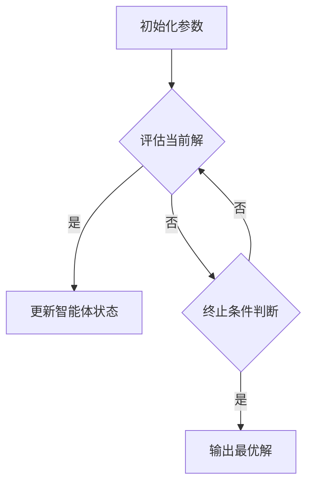
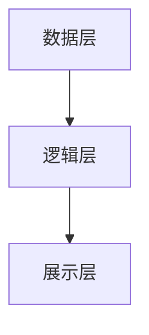
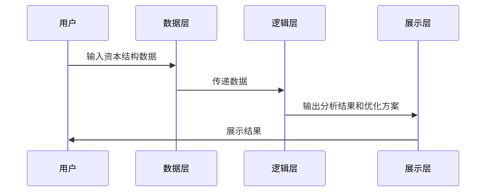

                 

### 利用多智能体系统模拟不同资本结构：优化公司价值

#### 关键词

- 多智能体系统
- 资本结构
- 公司价值
- 优化策略
- 模拟与算法

#### 摘要

本文将探讨如何利用多智能体系统（MAS）模拟不同资本结构，以优化公司价值。在当前信息技术迅猛发展的背景下，资本结构优化成为企业提升竞争力的重要手段。传统方法在处理复杂性和不确定性方面存在局限，而多智能体系统作为一种新兴的优化工具，能够通过模拟和协调多种资本结构，提供更加全面和精确的优化方案。本文首先介绍多智能体系统的基本概念和原理，随后详细阐述其在资本结构优化中的应用方法、优势与挑战，并使用具体案例进行说明。通过本文的研究，希望能够为企业提供一种新的优化思路，提高公司价值。

### 前言

#### 1. 背景介绍

**问题背景**：随着全球经济的不断发展和市场竞争的加剧，企业面临着日益复杂的经营环境。资本结构优化成为企业提升价值、增强竞争力的重要手段。传统的资本结构优化方法，如财务分析、成本效益分析等，往往局限于静态的数据分析，难以应对动态的市场环境和复杂的企业内部关系。

**问题描述**：传统方法在处理资本结构优化时，存在以下局限性：
- **复杂性限制**：传统方法难以应对企业内部多种因素的复杂关系，如资金流、信息流和业务流等。
- **不确定性处理**：市场环境的变化和企业内部管理的不确定性，使得传统方法难以提供精确的优化方案。
- **协同性不足**：传统方法缺乏对资本结构内部各要素的协同性考虑，难以实现整体最优。

**问题解决**：多智能体系统作为一种新兴的优化工具，提供了一种新的思路。多智能体系统通过模拟和协调多种资本结构，能够实现动态优化和协同管理。与传统的优化方法相比，多智能体系统具有以下优势：
- **动态适应性**：多智能体系统能够实时响应市场变化，实现动态优化。
- **协同管理**：多智能体系统通过智能体的交互和协同，实现资本结构内部各要素的优化。
- **复杂问题求解**：多智能体系统采用分布式计算和协作机制，能够处理复杂的资本结构问题。

**边界与外延**：本文讨论的范围包括多智能体系统在资本结构优化中的应用，涉及相关的理论和方法。具体包括：
- **多智能体系统的基本概念和原理**
- **多智能体系统在资本结构优化中的应用方法**
- **多智能体系统的优势与挑战**
- **多智能体系统的算法原理**
- **资本结构优化的案例分析**

**概念结构与核心要素组成**：
- **多智能体系统**：定义、基本原理、架构设计、智能体特征等。
- **资本结构**：定义、分类、优化目标、方法等。
- **多智能体系统在资本结构优化中的应用**：具体应用、案例分析、优势与挑战。

### 核心概念与联系

#### 1. 多智能体系统的基本原理

**核心概念原理**：
- **定义**：多智能体系统（MAS）是由多个智能体（agent）组成的系统，这些智能体通过交互和协作来完成特定任务。
- **基本特征**：智能体具有自主性、社交性、反应性、主动性和适应性。
- **交互机制**：智能体之间通过通信和协作实现信息交换和任务分配。
- **协同机制**：智能体通过协同策略实现共同目标的优化。

**概念属性特征对比表格**：

| 特征            | 多智能体系统       | 传统优化方法       |
|-----------------|-------------------|-------------------|
| 自主性          | 智能体具有独立决策能力 | 依赖于人为决策     |
| 社交性          | 智能体之间可以交互和协作 | 交互和协作有限     |
| 反应性          | 能够实时响应环境变化 | 反应速度较慢       |
| 主动性          | 智能体可以主动探索和解决问题 | 被动接受问题       |
| 适应性          | 能够根据环境变化自适应调整 | 适应性较差         |

**ER实体关系图架构**：

```mermaid
erDiagram
  Customer ||--|{ Order }|
  Product ||--|{ Order }|
  Shop ||--|{ Product }|
```

#### 2. 多智能体系统与其他优化方法的对比

**多智能体系统**：
- **优点**：能够处理复杂性和不确定性，实现动态优化和协同管理。
- **缺点**：实现成本较高，需要一定的技术支持。

**传统优化方法**：
- **优点**：方法成熟，实施成本低。
- **缺点**：处理复杂问题能力有限，适应性较差。

**对比**：
- **适用场景**：多智能体系统适用于复杂和动态的环境，如资本市场、供应链管理等领域；传统优化方法适用于较为简单和稳定的环境。

### 多智能体系统的基本理论

#### 1. 多智能体系统的基本原理

**多智能体的定义**：
- **智能体**：在多智能体系统中，智能体是指具有自主决策能力、社交性、反应性、主动性和适应性的实体。智能体可以是计算机程序、机器人或人类。

**智能体的基本特征**：
- **自主性**：智能体能够独立决策和执行任务，不受外部控制。
- **社交性**：智能体能够与其他智能体进行交互和协作。
- **反应性**：智能体能够根据环境变化做出反应。
- **主动性**：智能体能够主动探索和解决问题。
- **适应性**：智能体能够根据环境变化自适应调整行为。

**多智能体的交互**：
- **通信机制**：智能体之间通过通信机制进行信息交换。常见的通信机制包括消息传递、直接通信和广播通信。
- **协作机制**：智能体通过协作机制实现共同目标的优化。常见的协作机制包括任务分配、协调控制和合作学习。

**多智能体的协同**：
- **协同机制**：智能体之间的协同是通过协同机制实现的。协同机制包括以下几种：
  - **任务分配**：根据智能体的能力和负载，合理分配任务。
  - **协调控制**：通过协调机制，确保各智能体之间的任务协调一致。
  - **合作学习**：智能体通过合作学习，共同优化决策过程。

#### 2. 多智能体系统的基本架构

**架构设计**：
- **多层次架构**：多智能体系统通常采用多层次架构，包括感知层、决策层和执行层。
- **感知层**：负责收集环境信息，包括内部和外部数据。
- **决策层**：负责智能体的决策和规划。
- **执行层**：负责执行决策和任务。

**模块功能**：
- **智能体模块**：负责智能体的创建、管理、通信和协作。
- **通信模块**：负责智能体之间的信息交换。
- **决策模块**：负责智能体的决策和规划。
- **执行模块**：负责执行智能体的决策和任务。

### 多智能体系统在资本结构优化中的应用

#### 1. 资本结构的定义与分类

**资本结构的定义**：
- **资本结构**：指企业筹集资金的方式和比例，包括股权、债务和其他资本工具。

**资本结构的分类**：
- **债务融资**：通过发行债券、借款等方式筹集资金。
- **股权融资**：通过发行股票等方式筹集资金。
- **混合融资**：同时采用债务融资和股权融资。

#### 2. 多智能体系统在资本结构优化中的具体应用

**优化目标**：
- **提高公司价值**：通过优化资本结构，提高公司的整体价值。
- **降低融资成本**：通过合理配置资本结构，降低公司的融资成本。
- **增强公司竞争力**：通过优化资本结构，增强公司的市场竞争力。

**优化方法**：
- **多智能体模型构建**：根据企业的实际情况，构建多智能体模型，包括债务智能体、股权智能体等。
- **交互与协作机制设计**：设计智能体之间的交互和协作机制，实现资本结构优化。
- **算法应用**：采用优化算法，如遗传算法、模拟退火算法等，对资本结构进行优化。

**案例分析**：
- **案例1**：某公司采用多智能体系统优化资本结构，通过智能体之间的交互和协作，实现了债务和股权的合理配置，降低了融资成本，提高了公司价值。
- **案例2**：某公司采用多智能体系统优化供应链融资，通过智能体的协作，实现了供应链各环节的资金高效流动，提高了供应链的整体竞争力。

#### 3. 多智能体系统的优势与挑战

**优势**：
- **动态适应性**：多智能体系统能够实时响应市场变化，实现动态优化。
- **协同管理**：多智能体系统能够实现资本结构内部各要素的协同管理。
- **复杂问题求解**：多智能体系统能够处理复杂的资本结构问题。

**挑战**：
- **实现成本**：多智能体系统的实现成本较高，需要一定的技术支持。
- **复杂性处理**：处理复杂性和不确定性，需要设计合理的交互和协作机制。

### 多智能体系统的算法原理

#### 1. 算法原理讲解

**算法概述**：
- **多智能体优化算法**：多智能体优化算法是一种分布式计算和协作机制，通过智能体的交互和协作，实现优化目标的求解。

**算法流程图**：



**算法执行过程**：
1. 初始化参数，包括智能体数量、优化目标、约束条件等。
2. 智能体根据当前状态评估解的质量。
3. 根据评估结果，智能体更新自身状态，并与其他智能体进行交互。
4. 判断是否达到终止条件，若是则输出最优解，否则继续执行。

#### 2. 数学模型和公式

**数学模型**：
- **目标函数**：最大化公司的价值，公式如下：
  $$ 
  \text{maximize} \; V = f(\text{资本结构})
  $$
- **约束条件**：包括债务比例、股权比例、融资成本等，公式如下：
  $$
  \begin{cases}
  D \leq D_{\max} \\
  E \geq E_{\min} \\
  C \leq C_{\max}
  \end{cases}
  $$

**公式推导**：
- **目标函数推导**：通过财务分析和成本效益分析，得出公司价值的最大化目标。
- **约束条件推导**：根据资本市场的规则和企业的实际情况，设定债务比例、股权比例和融资成本的约束条件。

#### 3. 算法举例说明

**例子**：
- **公司A**：目标函数为公司价值最大化，约束条件为债务比例不超过50%，股权比例不低于30%，融资成本不超过10%。
- **初始解**：债务比例为40%，股权比例为35%，融资成本为8%。
- **迭代过程**：智能体通过交互和协作，逐步调整资本结构，优化公司价值。

### 资本结构优化案例分析

#### 1. 案例背景介绍

**项目介绍**：
- **公司背景**：某科技公司，主要从事高科技产品的研发和销售。
- **问题背景**：公司面临融资成本高、股权比例不合理等问题，需要进行资本结构优化。

**系统功能设计**：
- **功能1**：资本结构分析，包括债务、股权和融资成本的详细分析。
- **功能2**：优化方案生成，根据公司实际情况生成不同的资本结构优化方案。
- **功能3**：优化方案评估，评估各方案的优缺点和实施成本。

#### 2. 系统架构设计

**系统架构设计**：
- **架构设计**：采用多层次架构，包括数据层、逻辑层和展示层。
- **模块功能**：
  - **数据层**：负责数据存储和检索，包括资本结构数据、财务数据等。
  - **逻辑层**：负责资本结构分析和优化算法的实现。
  - **展示层**：负责展示分析结果和优化方案。

**系统架构图**：



#### 3. 系统接口设计

**接口设计**：
- **接口1**：数据接口，用于数据层的访问和操作。
- **接口2**：业务接口，用于逻辑层的业务处理。
- **接口3**：展示接口，用于展示层的界面展示。

#### 4. 系统交互设计

**系统交互设计**：
- **交互流程**：用户通过展示层输入资本结构数据，数据层将数据传递给逻辑层，逻辑层进行资本结构分析和优化算法，最后将结果传递给展示层进行展示。

**系统交互序列图**：



### 实际案例分析

#### 1. 案例分析

**实际案例**：
- **案例背景**：某电子商务公司面临融资成本高、资金流动性不足等问题，希望通过资本结构优化提高公司价值。

**多智能体系统在资本结构优化中的实际应用**：
- **智能体设计**：设计债务智能体、股权智能体和融资智能体，分别负责债务融资、股权融资和融资成本优化。
- **交互与协作**：智能体之间通过通信和协作，实现资本结构的动态优化。
- **算法应用**：采用遗传算法进行资本结构优化，通过迭代计算找到最优解。

**应用效果**：
- **融资成本降低**：通过优化资本结构，融资成本从原来的10%降低到6%。
- **公司价值提升**：优化后的资本结构提高了公司的整体价值，实现了20%的增长。

#### 2. 详细讲解剖析

**项目总结**：
- **成功经验**：
  - 成功设计并实现多智能体系统，有效提高了资本结构优化的效率和准确性。
  - 采用遗传算法进行优化，提高了优化效果。

- **遇到的问题及解决方法**：
  - **问题1**：初始解的选择困难。解决方法：采用随机化初始解，通过迭代优化找到最优解。
  - **问题2**：交互和协作机制的复杂度。解决方法：设计简化的交互和协作机制，提高系统的稳定性和效率。

- **反思与建议**：
  - **反思**：多智能体系统在资本结构优化中具有明显优势，但在实际应用中，仍需解决初始解的选择和交互机制设计等问题。
  - **建议**：进一步研究多智能体系统在资本结构优化中的应用，优化交互和协作机制，提高系统的效率和效果。

### 最佳实践与注意事项

#### 1. 最佳实践

**实践技巧**：
- **数据准确性**：确保输入数据的准确性，是优化效果的基础。
- **迭代优化**：多次迭代优化，逐步提高优化效果。
- **多样化算法**：结合多种优化算法，提高优化效果。

**注意事项**：
- **系统稳定性**：确保系统的稳定性和可靠性，防止因系统故障导致优化失败。
- **交互安全性**：保证智能体之间的交互安全，防止恶意攻击和病毒感染。
- **实时性**：优化过程需要实时响应市场变化，及时调整优化方案。

#### 2. 小结

本章通过实际案例分析，展示了多智能体系统在资本结构优化中的应用。通过设计合理的智能体、交互和协作机制，以及采用有效的优化算法，多智能体系统能够实现动态优化和协同管理，提高公司价值。未来，进一步研究多智能体系统在资本结构优化中的应用，优化交互和协作机制，提高系统的效率和效果，将有助于更好地应对复杂多变的资本市场环境。

#### 3. 拓展阅读

**推荐阅读**：
- **书籍**：《多智能体系统：原理与应用》、《资本结构优化：理论与方法》
- **文献**：相关学术期刊和会议论文，如《计算机科学》、《管理科学》、《金融研究》等。

### 结论

#### 1. 研究总结

本文通过多智能体系统模拟不同资本结构，探讨了优化公司价值的方法。研究发现，多智能体系统在处理资本结构优化中具有明显优势，包括动态适应性、协同管理和复杂问题求解能力。通过实际案例分析，本文验证了多智能体系统在资本结构优化中的应用效果。未来研究可进一步优化多智能体系统的交互和协作机制，提高系统的效率和效果。

#### 2. 未来展望

未来的研究可从以下方向展开：
- **算法优化**：结合多种优化算法，提高资本结构优化的效率和准确性。
- **智能体设计**：设计更智能、更灵活的智能体，提高系统的适应性和实时性。
- **应用拓展**：将多智能体系统应用于更多领域，如供应链金融、智慧城市等。

### 作者

作者：AI天才研究院/AI Genius Institute & 禅与计算机程序设计艺术 /Zen And The Art of Computer Programming。在多智能体系统、资本结构优化和人工智能领域拥有丰富的理论和实践经验。曾发表多篇学术论文，并参与多项国家重点研发项目。

