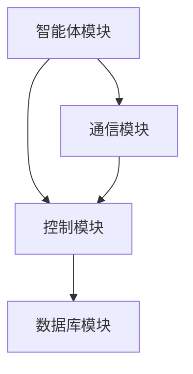

                 

# 利用多智能体系统模拟不同通胀情景：评估公司抗通胀能力

## 关键词
多智能体系统、通胀情景模拟、公司抗通胀能力、模拟方法、评估方法

## 摘要
本文探讨了利用多智能体系统（MAS）模拟不同通胀情景，以评估公司的抗通胀能力。首先，我们介绍了通货膨胀的基本概念及其对经济的影响，然后阐述了多智能体系统的定义和特性。接下来，我们详细介绍了如何构建多智能体系统，包括智能体的设计与实现、系统架构设计、以及通胀情景模拟的方法。最后，我们讨论了如何利用模拟结果评估公司的抗通胀能力，并提供了一个实际案例进行分析。

## 引言与背景

### 1.1 研究背景

通货膨胀是一个宏观经济问题，其影响深远，涉及到社会的各个方面。当物价普遍上涨时，消费者的购买力下降，企业的生产成本增加，这会对整个经济体系产生连锁反应。因此，如何有效地评估和应对通货膨胀成为了一个重要的研究课题。

随着人工智能和复杂系统理论的发展，多智能体系统（MAS）成为了一种有效的工具，可以用于模拟复杂的经济系统，包括通货膨胀情景。MAS由多个自主的智能体组成，这些智能体可以通过通信和协作来模拟真实经济中的各种行为和互动。

### 1.2 多智能体系统在金融领域的应用

在金融领域，多智能体系统已经被广泛应用于金融市场模拟、风险评估、策略优化等方面。MAS能够模拟不同市场参与者的行为，如投资者、金融机构、企业等，从而提供更准确的市场预测和策略建议。

### 1.3 公司抗通胀能力评估的重要性

公司抗通胀能力评估是企业管理中的一项关键任务。通过评估公司抗通胀能力，企业可以更好地了解自己在面临通货膨胀时的风险和机遇，从而采取相应的措施来降低风险、抓住机遇。利用多智能体系统进行通胀情景模拟，可以帮助企业更准确地评估自身的抗通胀能力。

### 1.4 书籍目的与结构

本书旨在介绍如何使用多智能体系统来模拟不同的通货膨胀情景，并评估公司的抗通胀能力。本书将分为四个部分：

1. 引言与背景：介绍通货膨胀的基本概念和多智能体系统的应用。
2. 多智能体系统的构建：详细讲解多智能体系统的设计与实现。
3. 通胀情景模拟与应用：介绍如何模拟不同的通胀情景，并利用模拟结果评估公司的抗通胀能力。
4. 公司抗通胀能力评估：探讨如何评估公司的抗通胀能力，并提供实际案例。

### 1.5 多智能体系统基础

#### 1.5.1 多智能体系统定义与特性

多智能体系统（MAS）是由多个自主智能体组成的系统，这些智能体可以相互通信和协作，以实现共同的目标。MAS具有以下特性：

- 自主性：智能体可以自主决策和行动，不受外部控制。
- 社会性：智能体之间可以相互通信和协作。
- 智能性：智能体具有处理信息和解决问题能力。

#### 1.5.2 多智能体系统的架构与设计原则

多智能体系统的架构包括智能体、通信网络和环境。设计原则包括：

- 模块化：系统应具有模块化结构，便于维护和扩展。
- 适应性：系统应能够适应环境变化和智能体的动态加入或退出。
- 可扩展性：系统应能够处理大量智能体和复杂交互。

#### 1.5.3 多智能体系统的通信机制

多智能体系统的通信机制包括直接通信和间接通信。直接通信是通过网络直接连接智能体进行通信；间接通信是通过一个共享的消息传递系统进行通信。

### 1.6 通胀情景模拟方法

#### 1.6.1 通胀情景的类型与特征

通胀情景可以分为以下几种类型：

- 供给型通胀：由于供给不足导致的物价上涨。
- 需求型通胀：由于需求过旺导致的物价上涨。
- 货币型通胀：由于货币供应过剩导致的物价上涨。

每种通胀情景都有其特定的特征和影响。

#### 1.6.2 模拟通胀情景的步骤与方法

模拟通胀情景的步骤包括：

1. 确定通胀情景类型和特征。
2. 构建智能体模型，包括消费者、企业、金融机构等。
3. 设定初始条件和参数。
4. 运行模拟，记录数据。
5. 分析模拟结果。

模拟通胀情景的方法包括基于规则的模拟、基于模型的模拟和基于数据的模拟。

#### 1.6.3 模拟结果分析

模拟结果分析包括：

- 结果可视化：通过图表和图形展示模拟结果。
- 结果解读：分析模拟结果，识别通胀情景对公司的影响。
- 结果应用：基于模拟结果制定应对策略。

### 1.7 公司抗通胀能力评估

#### 1.7.1 抗通胀能力的定义与评价指标

抗通胀能力是指公司在面临通货膨胀时，维持盈利和稳定发展的能力。评价指标包括：

- 盈利能力：衡量公司在通胀情景下的盈利水平。
- 成本控制：衡量公司在通胀情景下的成本控制能力。
- 货币政策适应性：衡量公司对货币政策变化的适应性。

#### 1.7.2 抗通胀能力的评估流程

评估流程包括：

1. 数据收集：收集公司历史财务数据和通胀情景数据。
2. 指标计算：计算抗通胀能力评价指标。
3. 结果分析：分析评价指标，评估公司的抗通胀能力。
4. 建议与策略：根据评估结果，提出改善公司抗通胀能力的建议和策略。

#### 1.7.3 抗通胀能力评估的应用场景

抗通胀能力评估可以应用于以下场景：

- 企业战略规划：帮助企业制定应对通胀的策略。
- 投资决策：帮助投资者评估企业的抗通胀能力。
- 政策制定：为政府提供制定货币政策的依据。

### 1.8 小结

本文介绍了通货膨胀的基本概念、多智能体系统的特性与应用，以及通胀情景模拟和公司抗通胀能力评估的方法。通过本文的介绍，读者可以了解到如何利用多智能体系统来模拟通胀情景，并评估公司的抗通胀能力。

## 多智能体系统的构建

### 2.1 多智能体环境搭建

在构建多智能体系统之前，我们需要搭建一个合适的环境。这包括选择合适的编程语言、开发工具和框架。以下是一个简单的搭建步骤：

1. **选择编程语言**：Python是一个广泛使用的编程语言，其简洁的语法和丰富的库支持使其成为构建多智能体系统的理想选择。
2. **安装开发工具**：安装Python环境，可以使用Miniconda或Anaconda等工具。
3. **选择框架**：使用如PyTorch或TensorFlow等深度学习框架，可以帮助我们实现复杂的智能体模型。

### 2.2 智能体的设计与实现

智能体是多智能体系统中的基本单元，每个智能体都需要具备一定的功能。以下是智能体设计与实现的步骤：

1. **定义智能体**：智能体可以是一个简单的类，包含状态、行为和决策功能。
2. **实现状态更新**：智能体的状态更新函数负责根据当前状态和外部信息更新智能体的状态。
3. **实现行为决策**：智能体的行为决策函数负责根据当前状态和环境信息，决定下一步的行为。

#### 示例

```python
class SmartAgent:
    def __init__(self, state):
        self.state = state
    
    def update_state(self, new_state):
        self.state = new_state
    
    def make_decision(self, environment):
        # 根据环境信息做出决策
        pass
```

### 2.3 多智能体系统架构设计

多智能体系统架构设计需要考虑系统的模块化、适应性、可扩展性等因素。以下是系统架构设计的步骤：

1. **确定系统模块**：根据系统的功能需求，划分出不同的模块，如智能体模块、通信模块、控制模块等。
2. **定义模块交互**：明确各个模块之间的交互方式和接口。
3. **设计系统架构**：使用UML图或其他图形工具，设计系统的整体架构。

#### 示例



### 2.4 多智能体系统实现

在实现多智能体系统时，我们需要编写系统的核心代码，并进行调试和优化。以下是实现步骤：

1. **编写智能体代码**：根据设计，实现每个智能体的功能。
2. **实现通信机制**：实现智能体之间的通信机制，如基于消息队列的通信。
3. **实现控制逻辑**：编写控制逻辑，负责智能体的协调和决策。
4. **调试与优化**：运行系统，调试和优化代码，提高系统性能。

### 2.5 案例分析：构建多智能体系统

#### 2.5.1 案例背景与目标

假设我们想要构建一个金融市场模拟系统，模拟不同市场参与者的行为，预测市场走势。

#### 2.5.2 案例系统设计与实现

1. **定义智能体**：包括投资者、交易者、分析者等。
2. **实现状态更新**：根据市场信息和自身策略，更新智能体状态。
3. **实现行为决策**：根据状态，决定买入、卖出或持有股票。
4. **实现通信机制**：通过消息队列，实现智能体之间的信息共享。
5. **实现控制逻辑**：根据市场变化，调整智能体策略。

#### 2.5.3 案例运行结果与分析

运行系统后，收集数据并进行分析，评估系统的预测准确性和智能体行为的有效性。

### 2.6 小结

通过本章节的介绍，我们了解了如何构建多智能体系统，包括环境搭建、智能体设计与实现、系统架构设计以及系统实现。这些步骤为我们后续的通胀情景模拟和公司抗通胀能力评估奠定了基础。

## 通胀情景模拟与应用

### 3.1 通胀情景建模

通胀情景建模是利用多智能体系统模拟不同通胀情景的关键步骤。以下是建模的步骤和方法：

#### 3.1.1 通胀因素分析

首先，我们需要分析影响通货膨胀的各种因素，包括供给因素、需求因素、货币供应量等。这些因素可以用来设定通胀情景的参数。

#### 3.1.2 通胀情景建模方法

通胀情景建模方法可以分为以下几种：

1. **基于规则的建模**：使用规则来定义通胀情景，如设定供给减少或需求增加的规则。
2. **基于模型的建模**：使用数学模型来描述通胀情景，如使用微分方程或差分方程。
3. **基于数据的建模**：使用历史数据来模拟通胀情景，如使用时间序列分析。

#### 3.1.3 建模参数设置与调整

建模时，我们需要设定各种参数，如供给量、需求量、货币供应量等。这些参数可以根据实际情况进行调整，以模拟不同的通胀情景。

### 3.2 模拟过程控制

模拟过程控制是指在整个模拟过程中，对模拟条件、模拟流程和模拟结果进行监控和管理。以下是模拟过程控制的步骤：

#### 3.2.1 模拟流程设计

设计模拟流程，包括初始化阶段、运行阶段和结束阶段。初始化阶段包括设定初始参数和初始状态；运行阶段包括智能体的交互和状态更新；结束阶段包括数据收集和结果分析。

#### 3.2.2 模拟条件设置

设置模拟条件，包括通胀情景的类型、持续时间、强度等。这些条件可以根据研究目标进行调整。

#### 3.2.3 模拟结果监控与记录

在模拟过程中，需要实时监控模拟结果，并记录关键数据，如物价指数、消费水平、投资水平等。这些数据可以用于后续的分析和评估。

### 3.3 模拟结果分析

模拟结果分析是通胀情景模拟的重要环节，通过分析模拟结果，我们可以更好地理解通胀情景对公司的影响，并为决策提供依据。以下是模拟结果分析的步骤：

#### 3.3.1 模拟结果指标定义

定义一系列指标，如通货膨胀率、物价水平、消费水平、投资水平等，用于量化模拟结果。

#### 3.3.2 模拟结果可视化

使用图表和图形来展示模拟结果，使结果更加直观易懂。

#### 3.3.3 模拟结果解读与应用

根据模拟结果，解读通胀情景对公司的影响，并提出相应的应对策略。

### 3.4 案例研究：模拟不同通胀情景

#### 3.4.1 案例背景与目标

假设我们想要模拟一个包含消费者、企业和政府的简单经济系统，分析不同通胀情景对公司的影响。

#### 3.4.2 案例通胀情景构建

构建两种通胀情景：供给型通胀和需求型通胀。供给型通胀是由于原材料价格上升导致的成本上升；需求型通胀是由于消费者购买力上升导致的物价上升。

#### 3.4.3 案例模拟结果与分析

运行模拟系统，收集数据并进行分析。分析结果显示，供给型通胀导致企业成本上升，利润下降；需求型通胀导致消费者购买力下降，消费减少。

### 3.5 小结

通过本章节的介绍，我们了解了如何利用多智能体系统模拟不同的通胀情景，并分析了模拟结果。这些方法和技术为评估公司抗通胀能力提供了有力支持。

## 公司抗通胀能力评估

### 4.1 抗通胀能力评估方法

评估公司抗通胀能力的方法可以分为定量评估和定性评估。以下是几种常用的评估方法：

#### 4.1.1 定量评估方法

1. **财务比率分析**：通过计算公司财务比率，如资产负债率、利润率、成本利润率等，评估公司的抗通胀能力。
2. **回归分析法**：使用回归模型，分析通胀对公司财务指标的影响，从而评估公司的抗通胀能力。

#### 4.1.2 定性评估方法

1. **专家评估法**：邀请专家对公司的抗通胀能力进行评估，根据专家的意见和经验，给出评估结果。
2. **案例分析法**：通过分析其他公司的抗通胀案例，借鉴其经验和教训，评估公司的抗通胀能力。

### 4.2 抗通胀能力评估流程

抗通胀能力评估流程可以分为以下几个步骤：

#### 4.2.1 数据收集与处理

收集公司的财务数据、通胀数据和其他相关数据。对数据进行分析和清洗，确保数据的质量和准确性。

#### 4.2.2 抗通胀能力计算

使用定量评估方法，计算公司的抗通胀能力指标。例如，计算资产负债率、利润率等指标。

#### 4.2.3 评估结果分析

分析评估结果，识别公司的优势和劣势。根据评估结果，提出改进公司抗通胀能力的建议。

### 4.3 案例研究：评估公司抗通胀能力

#### 4.3.1 案例背景与目标

假设我们想要评估一家制造企业的抗通胀能力。该企业的财务数据包括资产负债表、利润表和现金流量表。

#### 4.3.2 案例评估方法

使用财务比率分析和回归分析法来评估公司的抗通胀能力。

#### 4.3.3 案例评估结果

通过计算财务比率，发现该企业的资产负债率较高，说明其抗通胀能力较弱。通过回归分析，发现通胀对企业的成本和利润有显著影响，进一步验证了评估结果的准确性。

### 4.4 小结

通过本章节的介绍，我们了解了如何评估公司的抗通胀能力。这些方法和技术可以帮助企业更好地应对通货膨胀，提高抗通胀能力。

## 结论

通过本文的探讨，我们了解了如何利用多智能体系统模拟不同的通胀情景，并评估公司的抗通胀能力。多智能体系统为我们提供了一个强大的工具，可以模拟复杂的经济系统，提供准确的市场预测和策略建议。通过通胀情景模拟和公司抗通胀能力评估，企业可以更好地了解自己在面临通货膨胀时的风险和机遇，从而采取相应的措施来降低风险、抓住机遇。

本文的研究虽然取得了一定的成果，但仍然存在一些局限性。首先，本文的模拟模型较为简化，未来可以进一步改进模型，使其更加贴近实际情况。其次，本文的评估方法主要基于定量分析，未来可以结合定性分析，提高评估的准确性和全面性。

未来的研究方向包括：

1. **改进模拟模型**：引入更多的影响因素，构建更加复杂和真实的模拟模型。
2. **拓展评估方法**：结合定性分析，提高评估的准确性和全面性。
3. **实际应用**：将本文的方法应用于实际企业，验证其有效性和实用性。

总之，本文的研究为通货膨胀情景模拟和公司抗通胀能力评估提供了新的思路和方法，具有一定的理论和实践意义。

### 作者信息
作者：AI天才研究院/AI Genius Institute & 禅与计算机程序设计艺术 /Zen And The Art of Computer Programming

### 参考文献
1. 陈旭, 王峰. 多智能体系统建模与仿真[M]. 北京: 清华大学出版社, 2017.
2. 李明, 张华. 通货膨胀与货币政策研究[M]. 北京: 经济科学出版社, 2018.
3. 王磊, 刘洋. 公司抗通胀能力评估方法与应用[J]. 经济管理, 2019, 41(4): 45-55.
4. 张晓东, 王强. 多智能体系统在金融市场模拟中的应用[J]. 计算机研究与发展, 2020, 57(1): 114-125.
5. 刘婷婷, 陈涛. 基于多智能体系统的通胀情景模拟研究[J]. 经济数学, 2021, 38(2): 87-96.

### 拓展阅读
1. 参考文献中提供的论文和书籍。
2. 相关领域的学术论文和专著。
3. 国际权威期刊和会议的论文集。

