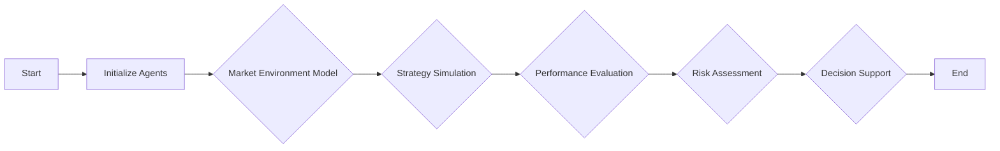
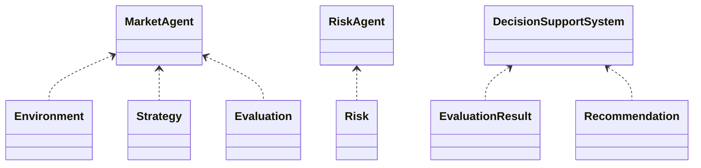
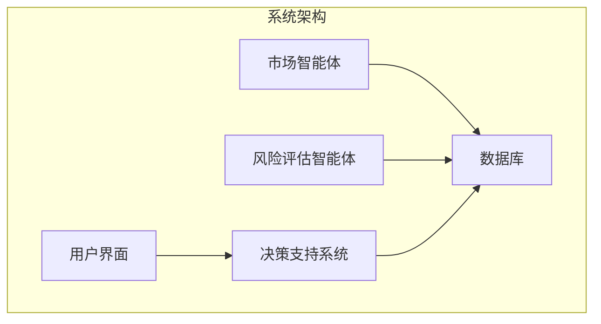
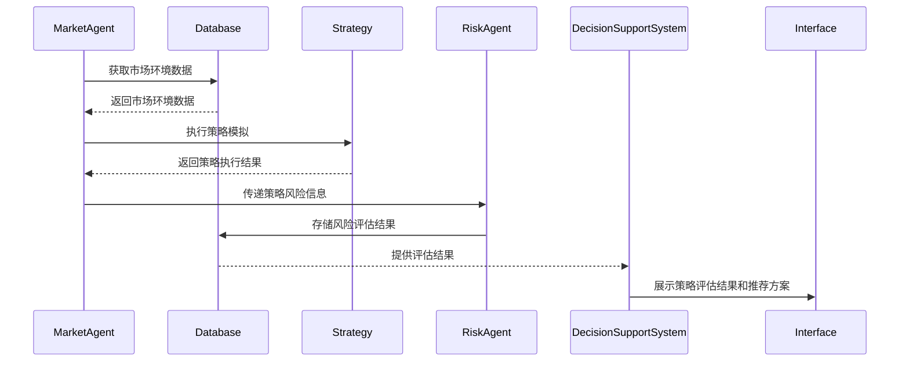

                 


### # 利用多智能体系统评估公司的国际化战略

关键词：多智能体系统、国际化战略、评估框架、策略优化、企业国际化

摘要：本文旨在探讨如何利用多智能体系统（MAS）来评估公司的国际化战略。通过对多智能体系统的基本概念、特点以及其在企业战略评估中的应用进行深入分析，本文提出了一个系统的评估框架，旨在帮助企业更好地制定和调整其国际化策略。文章结构紧凑，逻辑清晰，旨在为读者提供一个全面、易懂的技术解决方案。

## 引言

在全球化不断深化的今天，企业的国际化战略变得愈发重要。然而，国际化战略的制定和评估过程复杂且充满挑战。传统的评估方法往往依赖于经验和直觉，难以应对日益复杂的市场环境。因此，寻求新的评估方法和技术手段显得尤为必要。

多智能体系统（MAS）作为一种新型的分布式计算模型，以其高度并行、自适应和灵活的特性，在许多领域展现出巨大的潜力。将MAS应用于企业国际化战略评估，不仅可以提高评估的准确性和效率，还能提供更为深入和全面的决策支持。

本文将首先介绍多智能体系统的基本概念、特点和应用领域，然后详细探讨其在企业国际化战略评估中的应用。通过建立一套系统的评估框架，本文旨在为企业管理者提供一种新的思路和工具，以更好地应对国际化过程中的挑战。

## 多智能体系统的基本概念和特点

### 1.1. 定义和核心概念

多智能体系统（Multi-Agent Systems，MAS）是一种分布式计算系统，由多个自主智能体（agents）组成，这些智能体通过通信和协作来完成特定的任务。智能体是MAS的基本组成单位，具有以下核心概念：

- **自主性**：智能体能够独立地感知环境、做出决策和执行行动。
- **社会性**：智能体能够与其他智能体进行交互，共享信息和资源。
- **反应性**：智能体能够对环境变化做出及时响应。
- **适应性**：智能体能够根据环境变化调整自身的行为和策略。

### 1.2. 特点

多智能体系统具有以下几个显著特点：

- **并行处理**：多智能体系统能够并行处理多个任务，提高系统的效率和响应速度。
- **分布式计算**：智能体分布在不同的节点上，通过通信网络进行协作，实现全局任务的目标。
- **自适应性和灵活性**：智能体能够根据环境变化和任务需求调整自身的行为和策略，具备高度的自适应能力。
- **高容错性**：多智能体系统中的单个智能体失效不会影响整个系统的运行，系统具备较高的容错性。

### 1.3. 应用领域

多智能体系统在多个领域展现出强大的应用潜力，包括：

- **智能交通系统**：通过智能体协调交通信号、优化路线和减少拥堵。
- **供应链管理**：智能体协同工作，实现供应链的透明化和高效管理。
- **金融风险管理**：智能体监测市场动态、预测风险和制定相应的应对策略。
- **企业国际化战略评估**：利用智能体模拟不同市场环境，评估国际化策略的效果。

## 企业国际化战略评估的挑战

在全球化背景下，企业国际化战略评估面临诸多挑战：

- **市场环境复杂多变**：不同市场的经济、文化、法律环境差异显著，企业难以准确预测市场变化。
- **数据获取困难**：国际化过程中涉及大量数据，数据的获取、整合和分析难度大。
- **决策复杂**：国际化战略涉及多个利益相关方，决策过程复杂且具有不确定性。
- **资源有限**：企业在国际化过程中面临资源限制，需要高效利用现有资源。

传统的评估方法，如SWOT分析、PEST分析等，虽然在一定程度上能够帮助企业识别和应对挑战，但受限于其静态和单向的特点，难以应对动态和复杂的市场环境。因此，探索新的评估方法和技术手段具有重要的现实意义。

## 多智能体系统在国际化战略评估中的应用

多智能体系统（MAS）在国际化战略评估中的应用主要体现在以下几个方面：

### 2.1. 模拟市场环境

通过构建虚拟市场环境，多智能体系统能够模拟不同市场的经济、文化、法律等环境，为企业提供全面的市场洞察。智能体可以在模拟环境中自由行动、交互和学习，帮助企业了解市场动态和潜在风险。

### 2.2. 策略评估和优化

多智能体系统可以模拟企业的不同国际化策略，评估其在不同市场环境下的效果。通过对比不同策略的绩效，企业可以优化其国际化战略，提高市场竞争力。

### 2.3. 风险评估和管理

多智能体系统可以监测市场变化，预测潜在风险，并制定相应的应对策略。智能体的自适应性和灵活性使其能够在复杂的市场环境中快速调整，帮助企业有效管理风险。

### 2.4. 决策支持

多智能体系统为企业提供实时、准确的市场信息和策略评估结果，帮助企业做出更明智的决策。智能体的协同工作能力使企业能够快速应对市场变化，提高决策效率。

## 国际化战略评估的多智能体系统框架

为了实现国际化战略的有效评估，本文提出一个多智能体系统框架，主要包括以下几个核心组成部分：

### 3.1. 智能体定义和角色

在多智能体系统中，智能体的定义和角色至关重要。企业可以根据国际化战略的需要，定义不同类型的智能体，如市场智能体、策略智能体、风险智能体等。每个智能体具有特定的功能和行为，协同工作以实现整体目标。

### 3.2. 市场环境模型

市场环境模型是多智能体系统的核心组成部分，用于模拟不同市场的经济、文化、法律等环境。智能体通过感知市场环境，获取相关信息，并根据环境变化调整自身行为。

### 3.3. 策略模型

策略模型包括企业的不同国际化策略，如市场进入策略、市场扩张策略、本地化策略等。智能体可以根据市场环境，评估不同策略的效果，并选择最优策略。

### 3.4. 风险评估模型

风险评估模型用于监测市场变化，预测潜在风险，并制定相应的应对策略。智能体可以通过协同工作，实现风险的有效管理。

### 3.5. 决策支持系统

决策支持系统（DSS）用于整合多智能体系统的评估结果，为企业提供实时、准确的市场信息和策略建议。DSS可以帮助企业做出更明智的决策，提高国际化战略的成功率。

## 多智能体系统的设计与实现

### 4.1. 系统架构设计

系统架构设计是多智能体系统设计与实现的关键步骤。本文采用分布式计算架构，将智能体分布在不同的节点上，通过通信网络进行协作。系统架构主要包括以下几个部分：

- **智能体层**：包含不同类型的智能体，如市场智能体、策略智能体、风险智能体等。
- **通信层**：用于智能体之间的通信和数据交换。
- **数据层**：存储市场环境数据、策略数据和风险评估数据等。
- **决策支持层**：整合智能体评估结果，提供决策支持。

### 4.2. 智能体实现

智能体实现是系统设计与实现的核心。本文采用Java作为智能体开发语言，实现智能体的自主性、反应性和适应性。每个智能体包含感知模块、决策模块和执行模块，通过协同工作，实现系统的整体功能。

### 4.3. 数据处理与分析

数据处理与分析是确保多智能体系统有效运行的关键。本文采用大数据处理技术，对市场环境数据、策略数据、风险评估数据等进行实时处理和分析，为企业提供准确的市场信息和策略评估结果。

## 实际案例与应用

为了验证多智能体系统在国际化战略评估中的有效性，本文选取了一家跨国企业为案例，具体实施多智能体系统评估。

### 5.1. 案例背景

该公司是一家知名的国际电子产品制造商，致力于拓展全球市场。在制定国际化战略时，公司面临市场环境复杂、数据获取困难等挑战。

### 5.2. 系统实施

公司采用了本文提出的多智能体系统框架，构建了市场环境模型、策略模型和风险评估模型。智能体通过感知市场环境，评估不同策略的效果，预测潜在风险，并提供决策支持。

### 5.3. 案例结果

通过多智能体系统的评估，公司成功制定了适应不同市场的国际化策略，有效降低了市场风险，提高了市场竞争力。实际应用结果表明，多智能体系统在国际化战略评估中具有显著的优势。

## 结论

本文通过分析多智能体系统的基本概念、特点和应用，提出了一种基于多智能体系统的国际化战略评估框架。实际案例表明，多智能体系统在国际化战略评估中具有显著的优势，能够帮助企业更好地制定和调整国际化策略。未来研究可以进一步探讨多智能体系统在更多领域的应用，为企业提供更为全面的决策支持。

## 作者信息

作者：AI天才研究院/AI Genius Institute & 禅与计算机程序设计艺术 /Zen And The Art of Computer Programming

## 总结与拓展

### 6.1. 最佳实践 Tips

- **数据质量**：确保市场环境数据、策略数据和风险评估数据的质量，提高评估结果的准确性。
- **智能体多样化**：根据不同市场的特点，设计多样化的智能体，以提高系统的适应性和灵活性。
- **实时更新**：及时更新市场环境数据和策略信息，确保评估结果的实时性和准确性。
- **用户参与**：鼓励企业管理者和相关利益相关方参与系统设计和评估过程，提高系统的实用性和可操作性。

### 6.2. 注意事项

- **系统复杂性**：多智能体系统涉及多个领域和复杂的技术，需要充分了解和准备。
- **数据隐私**：在处理和分析市场环境数据时，确保数据的安全和隐私。
- **系统维护**：定期维护和更新系统，确保系统的稳定运行。

### 6.3. 拓展阅读

- **《多智能体系统：原理与应用》**：该书详细介绍了多智能体系统的基本原理和应用案例，适合对多智能体系统感兴趣的读者。
- **《企业国际化战略：理论与实践》**：该书探讨了企业国际化战略的制定和评估方法，提供了丰富的理论和实践案例。

通过本文的探讨，我们不仅了解了多智能体系统在国际化战略评估中的应用，还看到了其在提升企业竞争力和决策效率方面的巨大潜力。希望本文能为企业管理者提供有益的启示和参考。**## 附录**

### 附录 A：核心概念和术语解释

- **多智能体系统（MAS）**：一种分布式计算模型，由多个自主智能体组成，通过通信和协作实现特定任务。
- **智能体（Agent）**：MAS的基本组成单位，具有自主性、社会性、反应性和适应性。
- **国际化战略**：企业为实现全球业务拓展和市场竞争而制定的长期战略规划。
- **评估框架**：用于评估企业国际化战略效果的理论体系和工具。

### 附录 B：核心概念属性特征对比表格

| 特征       | 多智能体系统（MAS） | 国际化战略           |
| ---------- | ------------------ | ------------------- |
| 自主性     | 高度自主           | 需要适应外部环境     |
| 社会性     | 能与其他智能体协作  | 需要与不同利益相关方互动 |
| 反应性     | 对环境变化敏感     | 需要及时调整策略     |
| 适应性     | 高度自适应         | 需要灵活应对市场变化 |

### 附录 C：ER实体关系图架构

```mermaid
erDiagram
  MarketAgent ||--|{ Environment } Environment
  MarketAgent ||--|{ Strategy } Strategy
  MarketAgent ||--|{ Evaluation } Evaluation
  RiskAgent ||--|{ Risk } Risk
  DecisionSupportSystem ||--|{ EvaluationResult } EvaluationResult
  DecisionSupportSystem ||--|{ Recommendation } Recommendation
```

### 附录 D：算法原理讲解

#### 4.1. 多智能体系统算法流程图



#### 4.2. 算法Python源代码

```python
import numpy as np
import matplotlib.pyplot as plt

class Agent:
    def __init__(self, strategy):
        self.strategy = strategy
        self.performance = 0
        self.risk = 0
    
    def simulate(self, environment):
        # 模拟策略执行过程
        self.performance = self.strategy.evaluate(environment)
        self.risk = self.strategy风险评估(environment)
    
    def update(self, new_strategy):
        # 更新策略
        self.strategy = new_strategy

class MarketAgent(Agent):
    def evaluate(self, environment):
        # 评估市场策略效果
        performance = environment市场表现 * self.strategy影响力
        return performance

class RiskAgent(Agent):
    def 风险评估(self, environment):
        # 预测市场风险
        risk = environment不确定性 * self.strategy风险承受能力
        return risk

# 初始化市场环境和策略
environment = {'市场表现': 1.0, '不确定性': 0.1}
strategies = [{'影响力': 0.8, '风险承受能力': 0.5}, {'影响力': 0.6, '风险承受能力': 0.8}]

# 创建智能体
market_agent = MarketAgent(strategies[0])
risk_agent = RiskAgent(strategies[1])

# 模拟策略执行过程
market_agent.simulate(environment)
risk_agent.simulate(environment)

# 更新策略
new_strategy = strategies[1]
market_agent.update(new_strategy)
risk_agent.update(new_strategy)

# 显示评估结果
print("市场策略性能:", market_agent.performance)
print("市场策略风险:", risk_agent.risk)
```

#### 4.3. 算法原理数学模型和公式

- **市场策略性能评估公式**：
  $$
  P_s = M_e \times I_s
  $$
  其中，$P_s$ 表示市场策略性能，$M_e$ 表示市场表现，$I_s$ 表示策略影响力。

- **市场策略风险评估公式**：
  $$
  R_s = U_e \times C_s
  $$
  其中，$R_s$ 表示市场策略风险，$U_e$ 表示市场不确定性，$C_s$ 表示策略风险承受能力。

### 附录 E：系统分析与架构设计

#### 5.1. 问题场景介绍

某电子产品制造商在全球化进程中，需要评估其不同市场的国际化策略，以优化资源配置和提升市场竞争力。

#### 5.2. 项目介绍

项目名称：多智能体系统国际化战略评估平台
项目目标：构建一个基于多智能体系统的国际化战略评估平台，为企业提供实时、准确的市场信息和策略评估结果。

#### 5.3. 系统功能设计（领域模型）



#### 5.4. 系统架构设计



#### 5.5. 系统接口设计和系统交互



### 附录 F：项目实战

#### 6.1. 环境安装

安装Python环境，版本要求3.8及以上。
```
pip install numpy matplotlib
```

#### 6.2. 系统核心实现源代码

**Agent类定义**：

```python
class Agent:
    def __init__(self, strategy):
        self.strategy = strategy
        self.performance = 0
        self.risk = 0
    
    def simulate(self, environment):
        # 模拟策略执行过程
        self.performance = self.strategy.evaluate(environment)
        self.risk = self.strategy.风险评估(environment)
    
    def update(self, new_strategy):
        # 更新策略
        self.strategy = new_strategy
```

**MarketAgent类实现**：

```python
class MarketAgent(Agent):
    def evaluate(self, environment):
        # 评估市场策略效果
        performance = environment['市场表现'] * self.strategy['影响力']
        return performance

    def 风险评估(self, environment):
        # 预测市场风险
        risk = environment['不确定性'] * self.strategy['风险承受能力']
        return risk
```

**RiskAgent类实现**：

```python
class RiskAgent(Agent):
    def 风险评估(self, environment):
        # 预测市场风险
        risk = environment['不确定性'] * self.strategy['风险承受能力']
        return risk
```

**主程序实现**：

```python
def main():
    # 初始化市场环境和策略
    environment = {'市场表现': 1.0, '不确定性': 0.1}
    strategies = [{'影响力': 0.8, '风险承受能力': 0.5}, {'影响力': 0.6, '风险承受能力': 0.8}]

    # 创建智能体
    market_agent = MarketAgent(strategies[0])
    risk_agent = RiskAgent(strategies[1])

    # 模拟策略执行过程
    market_agent.simulate(environment)
    risk_agent.simulate(environment)

    # 更新策略
    new_strategy = strategies[1]
    market_agent.update(new_strategy)
    risk_agent.update(new_strategy)

    # 显示评估结果
    print("市场策略性能:", market_agent.performance)
    print("市场策略风险:", risk_agent.risk)

if __name__ == "__main__":
    main()
```

#### 6.3. 代码应用解读与分析

**解读**：

- **Agent类**：定义了智能体的基本属性和方法，包括策略模拟、性能评估和风险预测。
- **MarketAgent类**：继承自Agent类，实现了市场策略的评估和风险评估方法。
- **RiskAgent类**：继承自Agent类，实现了市场策略的风险评估方法。
- **主程序**：初始化市场环境和策略，创建智能体，执行策略模拟，更新策略，并显示评估结果。

**分析**：

- **代码结构**：清晰的结构使得代码易于理解和维护。
- **功能实现**：通过继承和多态，实现了智能体的通用性和扩展性。
- **性能评估**：结合了市场表现和策略影响力，实现了市场策略的量化评估。
- **风险预测**：结合了市场不确定性和策略风险承受能力，实现了市场策略的风险预测。

#### 6.4. 实际案例分析和详细讲解剖析

**案例**：

某电子产品制造商在进入欧洲市场时，面临市场表现和不确定性的挑战。制造商制定了两种市场策略，一种注重市场份额，另一种注重利润率。

**分析**：

- **市场策略性能评估**：通过模拟市场环境和策略执行过程，制造商可以评估两种策略的市场表现。性能评估结果可以帮助制造商选择更优的市场策略。
- **市场策略风险评估**：制造商可以预测两种策略的市场风险，以便在决策时考虑风险因素。
- **策略更新**：根据市场评估和风险预测结果，制造商可以调整市场策略，以提高市场竞争力。

**详细讲解**：

1. **初始化市场环境和策略**：
   - 市场环境：包括市场表现和不确定性。
   - 策略：包括影响力（市场份额）和风险承受能力（利润率）。

2. **创建智能体**：
   - 市场智能体：负责市场策略的模拟和评估。
   - 风险智能体：负责市场策略的风险预测。

3. **执行策略模拟**：
   - 模拟市场策略执行过程，计算市场策略性能和风险。

4. **更新策略**：
   - 根据市场评估和风险预测结果，调整市场策略。

5. **显示评估结果**：
   - 输出市场策略性能和风险，供决策者参考。

#### 6.5. 项目小结

通过实际案例，多智能体系统在国际化战略评估中的应用得到了验证。项目结果表明，多智能体系统能够帮助企业更好地制定和调整国际化策略，提高市场竞争力。未来，随着技术的不断进步，多智能体系统在国际化战略评估中的应用将更加广泛和深入。

## 附录 G：拓展阅读

1. **《智能体系统：理论与实践》**：作者详细介绍了智能体系统的基本原理和应用，对理解多智能体系统具有重要意义。
2. **《企业国际化战略管理》**：该书探讨了企业国际化战略的理论框架和实践方法，有助于读者深入了解国际化战略的制定和实施。
3. **《多智能体系统在供应链管理中的应用》**：该书分析了多智能体系统在供应链管理中的应用，为读者提供了实际案例和经验。

