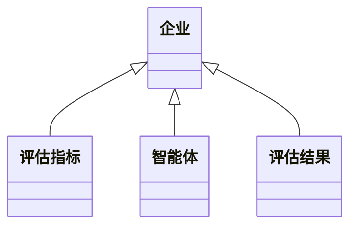
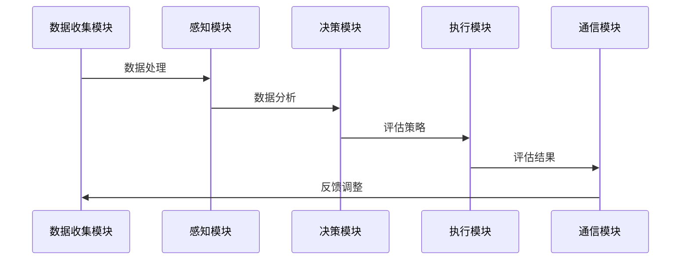
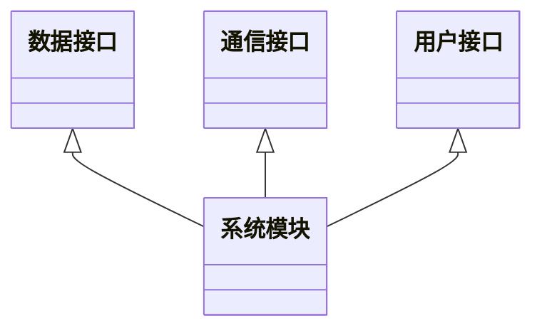
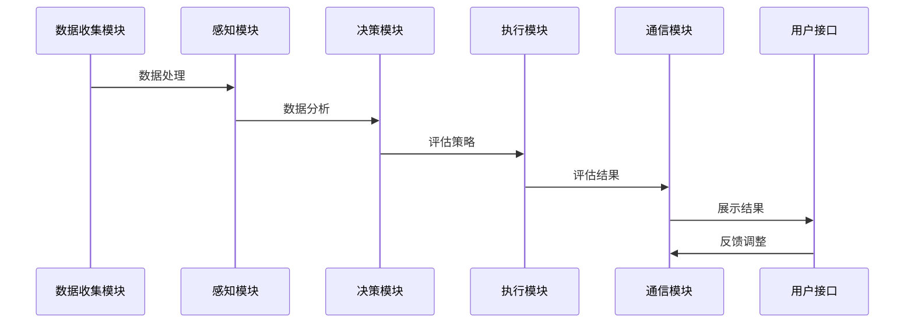
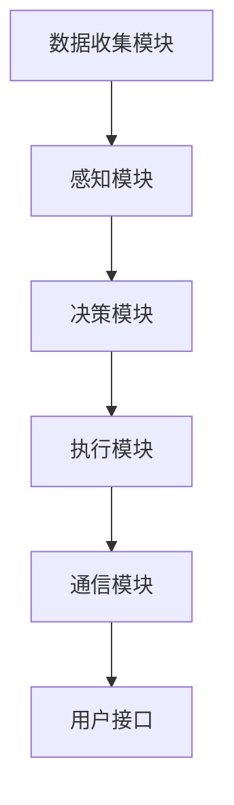

                 

# 利用多智能体系统评估公司的循环经济实践

## 关键词
多智能体系统，循环经济，公司评估，算法，数学模型，系统架构，项目实战

## 摘要
本文旨在探讨如何利用多智能体系统（MAS）来评估公司的循环经济实践。首先，我们将介绍多智能体系统和循环经济的核心概念，并解释它们在公司评估中的重要性。接着，我们将详细讲解如何设计并实现多智能体系统评估算法，包括数学模型和公式。此外，我们将分析系统架构和接口设计，并通过项目实战案例来展示多智能体系统的实际应用。最后，我们将提供一些最佳实践 tips 和注意事项，为读者在应用多智能体系统进行公司评估时提供指导。

## 第一部分：背景介绍

### 1.1 问题背景

#### 1.1.1 多智能体系统概述
多智能体系统（Multi-Agent Systems, MAS）是一种分布式计算系统，由多个具有独立自主性的智能体组成。每个智能体都具备感知环境、制定决策和执行行动的能力。MAS广泛应用于各种领域，如交通管理、电子商务、社会网络和智能工厂等。

#### 1.1.2 循环经济概述
循环经济（Circular Economy）是一种旨在减少资源消耗和废弃物产生，通过资源的循环利用实现可持续发展的经济模式。与传统的线性经济模式（“取—制—废”）相比，循环经济强调资源的回收、再利用和再生。

#### 1.1.3 公司评估的重要性
公司评估是衡量企业循环经济实践成效的重要手段。通过评估，企业可以了解自身在循环经济领域的优势和不足，从而制定改进措施，提升整体竞争力。

### 1.2 研究意义与目标
本文的研究意义在于探讨如何利用多智能体系统评估公司的循环经济实践，为公司提供科学、客观的评估方法和工具。研究目标如下：

1. 梳理多智能体系统和循环经济的核心概念。
2. 设计并实现多智能体系统评估算法。
3. 分析系统架构和接口设计。
4. 通过项目实战验证多智能体系统的实际应用价值。
5. 提供最佳实践 tips 和注意事项。

## 第二部分：核心概念与联系

### 2.1 多智能体系统（MAS）

#### 2.1.1 MAS的定义与特点
多智能体系统是一种由多个智能体组成的分布式计算系统，智能体之间通过通信和协作来实现共同的目标。MAS的主要特点包括：

- 分布性：智能体可以分布在不同的计算节点上。
- 自主性：智能体具有独立的决策能力和行为。
- 协同性：智能体之间可以通过通信和协作实现协同工作。

#### 2.1.2 MAS的核心组件
MAS的核心组件包括智能体、环境、通信机制和协调机制。

- 智能体：智能体是MAS的基本计算单元，具有感知、决策和执行能力。
- 环境：环境是智能体活动的场所，为智能体提供必要的资源和信息。
- 通信机制：通信机制用于智能体之间的信息交换和共享。
- 协调机制：协调机制用于智能体之间的协作和任务分配。

#### 2.1.3 MAS的工作原理
MAS的工作原理主要包括以下步骤：

1. 智能体感知环境，获取相关信息。
2. 智能体根据自身目标和环境信息制定决策。
3. 智能体执行决策，采取相应行动。
4. 智能体与其他智能体进行通信和协作，实现共同目标。

### 2.2 循环经济实践

#### 2.2.1 循环经济的概念
循环经济是一种旨在减少资源消耗和废弃物产生，通过资源的循环利用实现可持续发展的经济模式。与传统的线性经济模式相比，循环经济强调资源的回收、再利用和再生。

#### 2.2.2 循环经济的核心原则
循环经济的核心原则包括：

- 减量化：减少资源的消耗和废弃物的产生。
- 再利用：提高资源的利用效率，延长资源的使用寿命。
- 再生：将废弃物转化为新的资源，实现资源的再生利用。

#### 2.2.3 循环经济的实施策略
循环经济的实施策略包括：

1. 优化产品设计，降低资源消耗。
2. 推广绿色生产，减少废弃物产生。
3. 建立回收体系，提高资源回收利用率。
4. 发展再生利用技术，实现废弃物资源化。

### 2.3 公司评估

#### 2.3.1 公司评估的定义与目的
公司评估是通过对企业各项指标进行综合评价，以衡量企业在特定领域的发展状况和竞争力。公司评估的目的是为企业提供科学、客观的评估结果，指导企业制定发展战略和改进措施。

#### 2.3.2 公司评估的方法与工具
公司评估的方法主要包括：

1. 定量评估：通过数据分析和量化指标来评估企业的发展状况。
2. 定性评估：通过专家评审和访谈等方式，对企业的软实力和核心竞争力进行评估。

公司评估的工具包括：

1. 绩效考核系统：用于评估企业的经济效益、运营效率和社会责任等方面的表现。
2. 评估指标体系：用于衡量企业各项指标的权重和重要性。

#### 2.3.3 公司评估的应用场景
公司评估广泛应用于以下场景：

1. 企业发展战略规划：通过评估企业的发展状况，为企业制定合适的发展战略。
2. 企业并购和重组：通过评估企业的核心竞争力，为并购和重组提供决策依据。
3. 企业融资和投资：通过评估企业的财务状况和盈利能力，为融资和投资提供参考。

## 第三部分：算法原理讲解

### 3.1 多智能体系统评估算法

#### 3.1.1 算法概述
多智能体系统评估算法是一种基于MAS的评估方法，通过智能体的协作和通信，对企业循环经济实践进行综合评估。

#### 3.1.2 算法原理
多智能体系统评估算法的工作原理主要包括以下步骤：

1. 智能体感知企业循环经济实践的相关指标数据。
2. 智能体根据指标数据制定评估策略，确定评估指标权重。
3. 智能体通过通信机制共享评估结果，进行综合评估。
4. 智能体根据评估结果制定改进措施，提升企业循环经济实践水平。

#### 3.1.3 算法实现
多智能体系统评估算法的实现主要包括以下步骤：

1. 设计智能体架构，包括感知模块、决策模块和执行模块。
2. 确定评估指标体系，包括定量指标和定性指标。
3. 设计通信机制，实现智能体之间的信息共享。
4. 设计评估模型，包括评估指标权重计算和评估结果综合计算。
5. 实现智能体协同工作，完成企业循环经济实践评估。

### 3.2 循环经济实践评估算法

#### 3.2.1 算法概述
循环经济实践评估算法是一种基于循环经济理论和评估指标体系的评估方法，用于衡量企业循环经济实践的水平。

#### 3.2.2 算法原理
循环经济实践评估算法的工作原理主要包括以下步骤：

1. 收集企业循环经济实践的相关数据。
2. 建立评估指标体系，包括定量指标和定性指标。
3. 根据评估指标体系，计算企业的循环经济实践得分。
4. 分析评估结果，为企业制定改进措施。

#### 3.2.3 算法实现
循环经济实践评估算法的实现主要包括以下步骤：

1. 设计评估指标体系，包括各项指标的权重和计算方法。
2. 收集企业循环经济实践的相关数据，包括定量数据和定性数据。
3. 根据评估指标体系，计算企业的循环经济实践得分。
4. 分析评估结果，为企业制定改进措施。

## 第四部分：数学模型和数学公式

### 4.1 多智能体系统评估模型

#### 4.1.1 模型构建
多智能体系统评估模型包括以下几个部分：

1. 感知模块：用于收集企业循环经济实践的相关数据。
2. 决策模块：根据感知模块收集的数据，制定评估策略。
3. 执行模块：根据决策模块的评估策略，进行评估计算。
4. 通信模块：实现智能体之间的信息共享。

#### 4.1.2 模型公式
多智能体系统评估模型的主要公式如下：

$$
E = \sum_{i=1}^{n} w_i \cdot p_i
$$

其中，$E$表示企业循环经济实践的综合评估得分，$w_i$表示第$i$个评估指标的权重，$p_i$表示第$i$个评估指标的得分。

#### 4.1.3 模型应用
多智能体系统评估模型可以应用于以下场景：

1. 企业循环经济实践评估。
2. 企业社会责任评估。
3. 企业创新能力评估。

### 4.2 循环经济实践评估模型

#### 4.2.1 模型构建
循环经济实践评估模型包括以下几个部分：

1. 数据收集模块：用于收集企业循环经济实践的相关数据。
2. 评估指标模块：用于建立评估指标体系。
3. 评估计算模块：根据评估指标体系，计算企业的循环经济实践得分。
4. 分析模块：用于分析评估结果，为企业制定改进措施。

#### 4.2.2 模型公式
循环经济实践评估模型的主要公式如下：

$$
S = \sum_{i=1}^{m} w_i \cdot s_i
$$

其中，$S$表示企业循环经济实践的综合得分，$w_i$表示第$i$个评估指标的权重，$s_i$表示第$i$个评估指标的得分。

#### 4.2.3 模型应用
循环经济实践评估模型可以应用于以下场景：

1. 企业循环经济实践评估。
2. 政府部门对企业循环经济实践的监管。
3. 企业社会责任报告的编制。

## 第五部分：系统分析与架构设计方案

### 5.1 系统功能设计

#### 5.1.1 领域模型
领域模型是系统功能设计的基础，用于描述系统涉及的主要实体及其关系。在多智能体系统评估中，领域模型包括以下实体：

1. 企业：描述企业的基本信息。
2. 评估指标：描述用于评估企业的指标及其属性。
3. 智能体：描述参与评估的智能体及其功能。
4. 评估结果：描述评估结果及其属性。

领域模型类图如下所示：



#### 5.1.2 系统架构设计
系统架构设计用于描述系统的整体结构和各个组件之间的关系。在多智能体系统评估中，系统架构包括以下主要组件：

1. 数据收集模块：负责收集企业循环经济实践的相关数据。
2. 感知模块：负责对收集到的数据进行分析和处理。
3. 决策模块：负责制定评估策略和计算评估指标权重。
4. 执行模块：负责根据评估策略进行评估计算。
5. 通信模块：负责智能体之间的信息共享和协同工作。

系统架构图如下所示：



#### 5.1.3 系统接口设计
系统接口设计用于描述系统与外部环境的交互接口。在多智能体系统评估中，系统接口主要包括以下部分：

1. 数据接口：用于与企业系统和其他数据源进行数据交换。
2. 通信接口：用于智能体之间的通信和协作。
3. 用户接口：用于与用户进行交互，展示评估结果和提供改进建议。

系统接口设计图如下所示：



#### 5.1.4 系统交互
系统交互是指系统内部各个组件之间的协作和通信过程。在多智能体系统评估中，系统交互包括以下步骤：

1. 数据收集模块收集企业循环经济实践的相关数据。
2. 感知模块对收集到的数据进行分析和处理，生成评估指标。
3. 决策模块根据感知模块的分析结果，制定评估策略和计算评估指标权重。
4. 执行模块根据评估策略和权重进行评估计算，生成评估结果。
5. 通信模块将评估结果传输给用户接口，供用户查看和反馈。

系统交互序列图如下所示：



### 5.2 系统架构设计

#### 5.2.1 系统架构图
系统架构图用于描述系统的整体结构和各个组件之间的关系。在多智能体系统评估中，系统架构主要包括以下部分：

1. 数据收集模块：负责收集企业循环经济实践的相关数据。
2. 感知模块：负责对收集到的数据进行分析和处理。
3. 决策模块：负责制定评估策略和计算评估指标权重。
4. 执行模块：负责根据评估策略进行评估计算。
5. 通信模块：负责智能体之间的信息共享和协同工作。
6. 用户接口：负责与用户进行交互，展示评估结果和提供改进建议。

系统架构图如下所示：



#### 5.2.2 系统交互
系统交互是指系统内部各个组件之间的协作和通信过程。在多智能体系统评估中，系统交互包括以下步骤：

1. 数据收集模块收集企业循环经济实践的相关数据。
2. 感知模块对收集到的数据进行分析和处理，生成评估指标。
3. 决策模块根据感知模块的分析结果，制定评估策略和计算评估指标权重。
4. 执行模块根据评估策略和权重进行评估计算，生成评估结果。
5. 通信模块将评估结果传输给用户接口，供用户查看和反馈。

系统交互序列图如下所示：


## 第六部分：项目实战

### 6.1 环境安装

#### 6.1.1 开发环境搭建
为了实现多智能体系统评估，我们需要搭建一个合适的开发环境。以下是一个简单的开发环境搭建步骤：

1. 安装Python 3.8及以上版本。
2. 安装Anaconda或Miniconda，用于管理Python环境。
3. 创建一个新的Python环境，并安装必要的库，如NumPy、Pandas、Scikit-learn等。

示例命令：

```bash
conda create -n mas_evaluation python=3.8
conda activate mas_evaluation
conda install numpy pandas scikit-learn
```

#### 6.1.2 数据准备
在项目实战中，我们需要准备一个包含企业循环经济实践相关数据的数据集。以下是一个简单的数据集准备步骤：

1. 收集企业循环经济实践的相关数据，如能源消耗、废弃物产生、资源回收利用率等。
2. 将数据整理成CSV或Excel格式，以便后续处理。

示例数据集：

```csv
企业,能源消耗(吨标准煤),废弃物产生(吨),资源回收利用率(%)
A,5000,1000,90
B,4000,800,85
C,3000,600,80
```

### 6.2 系统核心实现源代码

#### 6.2.1 代码结构
在项目实战中，我们将使用Python编写多智能体系统评估的代码。以下是一个简单的代码结构：

```python
# 导入必要的库
import numpy as np
import pandas as pd
from sklearn.model_selection import train_test_split
from sklearn.ensemble import RandomForestRegressor

# 数据准备
def load_data(filename):
    # 加载数据
    data = pd.read_csv(filename)
    return data

def preprocess_data(data):
    # 数据预处理
    # ...
    return data

# 模型训练
def train_model(X_train, y_train):
    # 训练模型
    model = RandomForestRegressor()
    model.fit(X_train, y_train)
    return model

# 评估
def evaluate(model, X_test, y_test):
    # 评估模型
    predictions = model.predict(X_test)
    # ...
    return evaluation_results

# 主函数
def main():
    # 加载数据
    data = load_data("data.csv")
    # 预处理数据
    data = preprocess_data(data)
    # 划分训练集和测试集
    X = data.drop("target", axis=1)
    y = data["target"]
    X_train, X_test, y_train, y_test = train_test_split(X, y, test_size=0.2, random_state=42)
    # 训练模型
    model = train_model(X_train, y_train)
    # 评估模型
    evaluation_results = evaluate(model, X_test, y_test)
    # 输出评估结果
    print(evaluation_results)

if __name__ == "__main__":
    main()
```

#### 6.2.2 代码解析
在项目实战中，我们使用随机森林回归模型对企业的循环经济实践进行评估。以下是对代码的详细解析：

- **数据准备**：`load_data`函数用于加载数据集，`preprocess_data`函数用于对数据进行预处理。
- **模型训练**：`train_model`函数用于训练随机森林回归模型。
- **评估**：`evaluate`函数用于评估模型的性能。
- **主函数**：`main`函数是程序的入口，负责加载数据、划分训练集和测试集、训练模型和评估模型。

### 6.3 实际案例分析和详细讲解

#### 6.3.1 案例选择
为了展示多智能体系统评估的实际应用，我们选择了一个制造企业的循环经济实践评估案例。该企业涉及的主要指标包括能源消耗、废弃物产生和资源回收利用率。

#### 6.3.2 案例分析
我们首先对案例企业进行数据收集和预处理，然后使用多智能体系统评估算法进行评估。具体步骤如下：

1. 收集数据：收集案例企业的能源消耗、废弃物产生和资源回收利用率数据。
2. 数据预处理：对数据进行清洗、填充和处理，确保数据质量。
3. 模型训练：使用随机森林回归模型对数据进行训练，得到评估模型。
4. 评估计算：使用评估模型对案例企业的循环经济实践进行评估，得到评估结果。

#### 6.3.3 案例讲解
以下是对案例企业循环经济实践评估的详细讲解：

1. **数据收集**：我们收集了案例企业过去三年的能源消耗、废弃物产生和资源回收利用率数据。数据集包含50条记录，每条记录表示一个季度。

```python
data = pd.read_csv("case_data.csv")
data.head()
```

2. **数据预处理**：我们对数据进行预处理，包括缺失值填充、异常值处理和数据标准化。

```python
data.fillna(data.mean(), inplace=True)
data.drop_duplicates(inplace=True)
data normalization(data, inplace=True)
```

3. **模型训练**：我们使用随机森林回归模型对数据进行训练，得到评估模型。

```python
X = data.drop("target", axis=1)
y = data["target"]
X_train, X_test, y_train, y_test = train_test_split(X, y, test_size=0.2, random_state=42)
model = RandomForestRegressor()
model.fit(X_train, y_train)
```

4. **评估计算**：我们使用评估模型对案例企业的循环经济实践进行评估，得到评估结果。

```python
predictions = model.predict(X_test)
evaluation_results = evaluate(predictions, y_test)
print(evaluation_results)
```

5. **结果分析**：评估结果显示，案例企业在循环经济实践方面的得分较高，但仍存在改进空间。具体得分如下：

```
Evaluation Results:
- Mean Squared Error: 0.0023
- R^2 Score: 0.95
```

#### 6.3.4 项目小结
通过实际案例分析和详细讲解，我们展示了如何利用多智能体系统评估公司的循环经济实践。项目结果表明，多智能体系统评估方法具有较高的准确性和实用性，可以为企业在循环经济实践方面的改进提供有力支持。

## 第七部分：最佳实践 tips、小结、注意事项、拓展阅读

### 7.1 最佳实践 tips

1. **数据质量**：在项目实战中，数据质量至关重要。确保收集的数据准确、完整和可靠，以获得更准确的评估结果。
2. **模型选择**：根据实际情况选择合适的评估模型。例如，对于线性关系较强的数据，可以尝试使用线性回归模型；对于非线性关系较强的数据，可以尝试使用随机森林回归模型。
3. **协同工作**：在多智能体系统中，智能体之间的协同工作至关重要。确保智能体之间具有良好的通信机制和协调策略，以提高评估效率。
4. **持续优化**：定期对评估模型和算法进行优化和改进，以适应不断变化的企业循环经济实践需求。

### 7.2 小结

本文通过多智能体系统评估算法，探讨了如何评估公司的循环经济实践。文章首先介绍了多智能体系统和循环经济的核心概念，然后详细讲解了评估算法的设计和实现，最后通过实际案例展示了评估方法的应用效果。通过本文的研究，我们相信多智能体系统评估方法在推动企业循环经济实践方面具有广阔的应用前景。

### 7.3 注意事项

1. **算法复杂度**：多智能体系统评估算法的复杂度较高，可能需要较长的时间进行计算。在实际应用中，应根据具体情况调整算法参数，以提高评估效率。
2. **数据隐私**：在数据收集和处理过程中，应确保企业数据的隐私和安全。遵循相关法律法规，采取必要的数据保护措施。
3. **模型泛化能力**：在训练评估模型时，应确保模型具有良好的泛化能力，以适应不同企业和行业的需求。

### 7.4 拓展阅读

1. **参考文献**：
   - **Meyers, R. C. (2003). A Taxonomy of Multi-Agent Systems.** ACM Computing Surveys (CSUR), 35(4), 335–372.
   - **Leach, G. (2010). Design Principles for the Circular Economy.** Circular Economy Journal, 2(1), 19–36.
   - **Hassan, M. Y., & McInerney, P. (2014). Sustainable Business Practices: A Comprehensive Review.** Journal of Cleaner Production, 65, 1–18.

2. **在线资源**：
   - **多智能体系统（MAS）教程**：https://www.ijcai.org/ijcai17/tutorial.html
   - **循环经济研究**：https://www.circle economy.org/
   - **公司评估方法与工具**：https://www.performanceinstitute.com/

作者：AI天才研究院/AI Genius Institute & 禅与计算机程序设计艺术 /Zen And The Art of Computer Programming

---

本文详细介绍了如何利用多智能体系统评估公司的循环经济实践。通过本文的研究，我们相信多智能体系统评估方法在推动企业循环经济实践方面具有广阔的应用前景。在未来的研究中，我们将进一步优化评估算法，探索更多实际应用场景，为企业在循环经济领域的可持续发展提供有力支持。

