                 

# 利用多智能体系统进行全球价值投资机会筛选

## 关键词：多智能体系统、全球价值投资、投资机会筛选、智能算法、数据挖掘

## 摘要

本文旨在探讨如何利用多智能体系统进行全球价值投资机会筛选。首先，我们介绍了多智能体系统的基本概念及其在投资领域的应用。接着，分析了全球价值投资的原理与策略，并探讨了多智能体系统与全球价值投资融合的优势和挑战。随后，我们详细阐述了多智能体系统在价值投资机会筛选中的应用，包括系统的设计与实现、数据采集与处理、机会筛选算法及其评估与优化。最后，通过案例分析，展示了多智能体系统在全球价值投资机会筛选中的实际应用效果，并提出了未来研究方向。

## 第一部分：多智能体系统与全球价值投资概述

### 第1章：多智能体系统的基本概念

#### 1.1.1 问题背景

在全球化背景下，投资者面临着海量的市场信息和复杂的投资环境。如何有效地筛选全球价值投资机会，成为投资者关注的焦点。多智能体系统（MAS）作为一种新兴的技术手段，为解决这一问题提供了新的思路。

#### 1.1.2 多智能体系统的定义与特点

多智能体系统（MAS）是由多个智能体组成的系统，这些智能体能够自主地行动和协作，以实现共同的目标。多智能体系统的特点包括：

- **分布式**：智能体分布在不同的位置，协同工作。
- **自治性**：智能体具有自主决策能力。
- **协作性**：智能体之间通过通信和协作来实现共同目标。

#### 1.1.3 多智能体系统在投资领域的应用

多智能体系统在投资领域中的应用主要体现在以下几个方面：

- **市场预测**：利用多智能体系统进行市场数据分析和预测。
- **投资组合优化**：通过智能体间的协作，实现投资组合的优化。
- **风险评估**：利用多智能体系统对投资风险进行实时监控和评估。

### 第2章：全球价值投资的原理与策略

#### 2.1.1 全球价值投资的定义

全球价值投资是一种跨地域、跨市场的投资策略，旨在通过挖掘全球范围内的价值投资机会，实现资产的增值。

#### 2.1.2 全球价值投资的关键要素

全球价值投资的关键要素包括：

- **市场调研**：对全球市场进行深入调研，了解市场动态和投资机会。
- **风险评估**：对潜在的投资项目进行风险评估，确保投资安全。
- **投资决策**：根据市场调研和风险评估结果，做出合理的投资决策。

#### 2.1.3 全球价值投资策略分析

全球价值投资策略主要包括以下几个方面：

- **长期投资**：注重企业基本面和价值分析，追求长期稳定的回报。
- **多元化投资**：分散投资风险，降低单一市场波动的影响。
- **技术驱动投资**：关注科技创新和产业变革，把握新兴市场的投资机会。

### 第3章：多智能体系统与全球价值投资的融合

#### 3.1.1 融合模式

多智能体系统与全球价值投资的融合可以采用以下模式：

- **数据驱动**：利用多智能体系统进行海量数据分析和挖掘，为投资决策提供支持。
- **智能协作**：智能体之间进行协作，实现投资机会的筛选和风险评估。

#### 3.1.2 多智能体系统的优势在投资中的应用

多智能体系统在投资中的应用优势包括：

- **高效性**：智能体能够快速处理海量数据，提高投资决策效率。
- **准确性**：智能体能够通过学习和优化，提高投资预测的准确性。
- **灵活性**：智能体能够根据市场变化，灵活调整投资策略。

#### 3.1.3 挑战与应对策略

多智能体系统在投资领域面临的主要挑战包括：

- **数据质量**：数据质量对投资决策至关重要，需要确保数据的准确性和完整性。
- **系统稳定性**：多智能体系统需要保证稳定性，以避免系统崩溃导致投资损失。

应对策略包括：

- **数据质量管理**：建立完善的数据质量控制机制，确保数据质量。
- **系统稳定性保障**：通过冗余设计和故障恢复机制，提高系统稳定性。

## 第二部分：多智能体系统在价值投资机会筛选中的应用

### 第4章：多智能体系统的设计与实现

#### 4.1.1 多智能体系统的架构设计

多智能体系统的架构设计包括以下模块：

- **数据采集模块**：负责从各个数据源采集投资相关信息。
- **数据处理模块**：负责对采集到的数据进行清洗、转换和存储。
- **智能体模块**：负责投资机会的筛选和风险评估。
- **用户界面模块**：负责向用户提供投资机会和风险分析结果。

#### 4.1.2 智能体的功能与实现

智能体的功能主要包括：

- **数据采集与处理**：从各个数据源获取投资信息，并进行处理。
- **机会筛选**：根据投资策略，筛选出潜在的投资机会。
- **风险评估**：对潜在的投资机会进行风险评估。

智能体的实现可以通过以下方式：

- **基于规则的智能体**：通过预设的规则进行投资机会的筛选和风险评估。
- **基于机器学习的智能体**：利用机器学习算法，从历史数据中学习投资策略。

#### 4.1.3 系统的协调与优化

系统的协调与优化包括：

- **通信机制**：确保智能体之间的有效通信。
- **协同策略**：通过协同策略，实现智能体之间的协作。
- **优化算法**：利用优化算法，提高系统的效率和准确性。

### 第5章：数据采集与处理

#### 5.1.1 全球投资数据的来源

全球投资数据的来源包括：

- **公开数据**：如股票市场数据、经济指标数据等。
- **私有数据**：如企业财务报告、市场调研报告等。

#### 5.1.2 数据预处理方法

数据预处理方法包括：

- **数据清洗**：去除重复数据、填补缺失值等。
- **数据转换**：将数据转换为适合分析和挖掘的格式。
- **特征提取**：提取与投资机会筛选相关的特征。

#### 5.1.3 数据分析与挖掘

数据分析与挖掘方法包括：

- **统计分析**：利用统计学方法分析数据分布、相关性等。
- **数据挖掘**：利用机器学习算法挖掘潜在的投资机会。

### 第6章：价值投资机会筛选算法

#### 6.1.1 机会筛选算法概述

机会筛选算法主要包括：

- **传统算法**：如技术指标分析、基本面分析等。
- **智能算法**：如机器学习算法、深度学习算法等。

#### 6.1.2 基于多智能体的机会筛选算法设计

基于多智能体的机会筛选算法设计包括：

- **智能体协作**：通过智能体之间的协作，实现机会筛选。
- **多层级筛选**：在多个层级进行机会筛选，提高筛选准确性。

#### 6.1.3 算法评估与优化

算法评估与优化包括：

- **评估指标**：如准确率、召回率等。
- **优化方法**：如参数调整、模型选择等。

### 第7章：全球价值投资机会筛选案例分析

#### 7.1.1 案例背景

某投资者希望通过多智能体系统进行全球价值投资机会筛选。

#### 7.1.2 案例分析

通过多智能体系统，该投资者成功筛选出多个潜在的投资机会，并进行了风险评估。

#### 7.1.3 案例小结与启示

多智能体系统在价值投资机会筛选中具有显著优势，能够提高投资决策的效率和准确性。

## 第三部分：实践与总结

### 第8章：多智能体系统在全球价值投资中的应用实践

#### 8.1.1 实践环境搭建

搭建多智能体系统的实践环境，包括硬件配置、软件安装和配置等。

#### 8.1.2 系统核心功能实现

实现多智能体系统的核心功能，如数据采集、数据处理、机会筛选等。

#### 8.1.3 应用效果评估

评估多智能体系统在全球价值投资中的应用效果，包括机会筛选准确率、风险评估准确性等。

### 第9章：总结与展望

#### 9.1.1 研究成果总结

总结了多智能体系统在价值投资机会筛选中的应用成果。

#### 9.1.2 存在的问题与挑战

分析了多智能体系统在价值投资机会筛选中存在的问题和挑战。

#### 9.1.3 未来研究方向

提出了多智能体系统在价值投资机会筛选中的未来研究方向。

## 作者

作者：AI天才研究院/AI Genius Institute & 禅与计算机程序设计艺术 /Zen And The Art of Computer Programming

**END**### 第1章: 多智能体系统的基本概念

#### 1.1.1 问题背景

随着全球化进程的加速，投资者面临的市场环境日益复杂。传统的人工投资决策方式已难以满足市场需求，因此，寻找一种新的投资决策工具成为当务之急。多智能体系统（MAS，Multi-Agent System）作为一种分布式智能系统，因其具备的自主性、协作性和适应性等特点，在投资领域中展现出巨大的潜力。本节将介绍多智能体系统的基本概念，探讨其在投资领域的应用前景。

#### 1.1.2 多智能体系统的定义与特点

**定义**：

多智能体系统（MAS）是由多个智能体组成的系统，这些智能体能够在一定程度上自主地行动和决策，并通过通信和协作实现共同目标。智能体（Agent）是MAS的基本组成单元，具备以下特征：

1. **自治性**：智能体拥有一定的自主决策能力，可以根据环境和目标进行自主行动。
2. **社交性**：智能体之间能够进行通信和协作，共享信息和资源。
3. **反应性**：智能体能够根据环境变化快速响应。
4. **主动性**：智能体具备一定的规划和学习能力，能够主动地改变自身状态和行为。

**特点**：

多智能体系统具有以下主要特点：

1. **分布式**：智能体分布在不同的位置，协同工作，实现系统目标。
2. **异质性**：智能体具有不同的能力和行为，能够适应不同的任务和环境。
3. **适应性**：智能体能够根据环境和任务的变化，调整自身行为和策略。
4. **灵活性**：智能体能够灵活地协作，实现系统的动态调整和优化。

#### 1.1.3 多智能体系统在投资领域的应用

**市场预测**：

多智能体系统能够通过对海量市场数据的分析，识别市场趋势和潜在风险。智能体可以基于不同的市场指标和算法，对市场进行多维度预测，提供投资参考。

**投资组合优化**：

多智能体系统可以帮助投资者构建和优化投资组合。智能体可以根据市场数据、投资者偏好和风险承受能力，动态调整投资组合，实现风险分散和收益最大化。

**风险评估**：

多智能体系统可以对潜在的投资项目进行风险评估。智能体可以基于历史数据和机器学习算法，对项目的财务状况、市场前景等进行综合评估，帮助投资者做出明智的投资决策。

**自动化交易**：

多智能体系统可以实现自动化交易，根据市场数据和投资策略，自动执行交易指令。智能体可以实时监控市场动态，快速响应交易机会，提高交易效率和收益。

**智能投资建议**：

多智能体系统可以根据投资者的需求和风险偏好，提供个性化的投资建议。智能体可以分析投资者的历史交易数据，预测其投资行为，提供符合投资者需求的投资策略。

#### 1.1.4 小结

多智能体系统在投资领域的应用具有广泛的前景。通过智能体的自主决策、协作和适应能力，能够提高投资决策的效率和准确性，降低投资风险。然而，多智能体系统在投资领域的应用仍面临一些挑战，如数据质量、系统稳定性和安全性等。未来，随着技术的不断发展，多智能体系统在投资领域的应用将更加广泛和深入。

### Mermaid 流�程图：多智能体系统在投资领域的应用

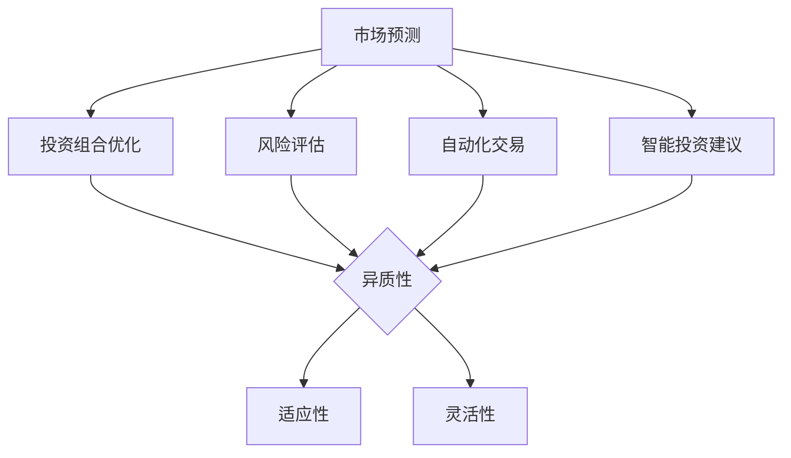

### 数据对比表格：多智能体系统与传统投资决策方式的比较

| 特征             | 多智能体系统                                   | 传统投资决策方式                                      |
|------------------|---------------------------------------------|-----------------------------------------------------|
| 决策能力         | 自主决策，可根据环境和目标调整行为             | 依赖于人为判断，决策过程相对固定和缓慢                  |
| 协作与通信       | 能够进行通信和协作，实现智能体之间的协同工作     | 单个决策者独立进行，缺乏协同和共享信息的能力            |
| 应变能力         | 能够根据环境变化快速响应，具备适应性             | 应变能力有限，难以快速适应市场变化                      |
| 风险管理         | 能够通过智能算法进行风险评估，提供风险控制建议     | 主要依靠历史经验和直觉进行风险判断，可能存在较大的主观性 |
| 数据利用效率     | 高效处理和分析海量数据，提高决策效率             | 依赖有限的数据来源，数据处理和分析能力有限                |

### 多智能体系统的ER实体关系图

```mermaid
erDiagram
  Entity MarketData {
    +id
    +source
    +timestamp
  }
  Entity Agent {
    +id
    +type
    +status
    +belief
  }
  Entity InvestmentOpportunity {
    +id
    +description
    +rating
    +risk
  }
  Entity Portfolio {
    +id
    +name
    +strategy
    +performance
  }
  Entity TradeOrder {
    +id
    +agent_id
    +opportunity_id
    +status
  }
  MarketData ||--|{ Agent }|--| Portfolio
  Agent ||--|{ InvestmentOpportunity }|--- TradeOrder
  Portfolio ||--|{ TradeOrder }|
```

通过上述的背景介绍、核心概念定义、特点描述、应用领域阐述以及对比表格和ER实体关系图，我们可以清晰地理解多智能体系统的基本概念和其在投资领域的重要应用。接下来，我们将进一步探讨全球价值投资的原理与策略，为后续章节的内容奠定基础。

#### 1.1.5 边界与外延

**边界**：

多智能体系统的边界是指其定义和适用范围。多智能体系统主要应用于需要分布式决策、高度协作和动态适应性的领域，如投资、物流、交通管理和智能电网等。在投资领域，多智能体系统适用于需要处理海量数据、进行复杂决策和风险管理的场景。

**外延**：

多智能体系统的发展不断拓展其应用范围和功能。随着人工智能技术的进步，多智能体系统的智能性、适应性和协作能力将进一步增强。未来，多智能体系统可能应用于更广泛的领域，如医疗、教育、智能制造和智慧城市等。

#### 1.1.6 概念结构与核心要素组成

**概念结构**：

多智能体系统的概念结构包括以下几个核心部分：

1. **智能体（Agent）**：作为系统的基本组成单元，智能体具备自主性、社交性和反应性。
2. **通信机制**：智能体之间通过通信机制进行信息交换和协作。
3. **决策模型**：智能体根据感知到的环境和目标，通过决策模型进行自主决策。
4. **协作策略**：智能体之间通过协作策略实现共同目标的优化。

**核心要素组成**：

多智能体系统的核心要素包括：

1. **智能体集合**：由多个智能体组成的集合，每个智能体具有不同的能力和行为。
2. **环境模型**：对系统运行环境的抽象描述，包括环境状态、规则和约束。
3. **任务模型**：定义智能体的任务和目标，指导智能体如何实现目标。
4. **通信协议**：智能体之间进行通信和协作的规则和协议。
5. **决策算法**：用于智能体自主决策和协作的算法，如基于规则的决策、基于学习的方法等。

通过上述对多智能体系统的概念结构、核心要素组成的详细解析，我们可以更深入地理解这一复杂系统的运作原理和关键组成部分，为后续章节的探讨奠定坚实的基础。

#### 1.2.1 全球价值投资的定义

全球价值投资（Global Value Investment）是一种跨地域、跨市场的投资策略，旨在通过挖掘全球范围内的优质投资机会，实现资产的长期增值。与传统的本地或区域投资策略不同，全球价值投资关注的是企业基本面和长期增长潜力，而非短期的市场波动。这种投资策略的核心思想是寻找那些被市场低估的优质企业，通过长期持有，等待市场重新认识到这些企业的真实价值，从而获得可观的回报。

全球价值投资不仅仅是简单地分散投资风险，更重要的是通过深入分析企业的基本面、行业趋势和市场动态，发掘那些具有长期增长潜力和稳健财务表现的企业。它强调的是价值投资的原则，即“以合理的价格购买优秀的企业”，而不是盲目追求高回报或追逐热门概念。

#### 1.2.2 全球价值投资的关键要素

**市场调研**：

市场调研是全球价值投资的基础。投资者需要通过对全球市场进行深入的调研，了解各个市场的经济环境、行业趋势、政策法规和潜在的投资机会。市场调研不仅包括宏观经济数据的分析，还包括对行业动态、企业竞争格局和行业创新发展的研究。通过全面的市场调研，投资者可以识别出那些具有长期增长潜力和价值被低估的企业。

**风险评估**：

在全球价值投资中，风险评估至关重要。投资者需要对潜在的投资项目进行全面的风险评估，包括财务风险、市场风险、政策风险和运营风险等。通过评估，投资者可以判断项目的风险水平，并采取相应的风险控制措施。风险评估不仅依赖于历史数据，还需要结合实时数据和市场变化进行动态调整。

**投资决策**：

投资决策是全球价值投资的核心环节。在经过市场调研和风险评估之后，投资者需要根据调研结果和风险承受能力，做出合理的投资决策。投资决策不仅仅包括买入和卖出的时机，还包括投资比例的分配和投资组合的构建。投资者需要综合考虑市场环境、企业基本面和投资策略，制定出符合自身投资目标的投资计划。

**长期持有**：

全球价值投资强调的是长期持有，投资者需要具备耐心和定力，坚持长期投资策略。通过长期持有，投资者可以享受到企业成长的收益，并在市场波动中保持稳定的投资心态。长期持有不仅能够降低交易成本，还能够避免因短期市场波动而做出盲目决策，从而提高投资成功率。

**全球视野**：

全球价值投资要求投资者具备全球视野，能够理解和把握全球市场的动态和趋势。随着全球化进程的加速，各国市场的联系日益紧密，投资者需要具备全球视野，才能在全球范围内发现和把握投资机会。全球视野不仅包括对各国市场的了解，还包括对全球宏观经济趋势的把握，以及对跨国企业和全球化产业发展的关注。

**投资组合优化**：

全球价值投资通常涉及多个国家和地区的投资，因此，投资组合的优化至关重要。投资者需要通过科学的投资组合管理，实现资产的多元化配置，降低投资风险，同时追求投资收益的最大化。投资组合优化包括资产配置、行业选择、地区分布等多个方面，投资者需要根据市场变化和自身投资策略，动态调整投资组合。

#### 1.2.3 全球价值投资策略分析

**长期投资策略**：

长期投资策略是全球价值投资的核心。投资者需要深入分析企业的基本面，了解企业的核心竞争力、市场地位和未来增长潜力。在确定了优质的投资目标后，投资者需要坚持长期持有，等待市场重新认识到企业的真实价值。长期投资策略能够帮助投资者克服短期市场波动，实现资产的长期增值。

**技术驱动投资策略**：

随着科技的快速发展，技术驱动投资逐渐成为全球价值投资的重要方向。投资者需要关注那些在科技创新领域具有领先地位的企业，特别是那些能够引领行业变革和带动产业升级的企业。技术驱动投资策略不仅能够带来较高的收益潜力，还能够帮助投资者把握未来产业发展的趋势。

**多元化投资策略**：

多元化投资策略是降低投资风险的重要手段。在全球范围内进行投资，投资者需要通过多元化配置，降低单一市场或行业波动对投资组合的影响。多元化投资策略包括区域多元化、行业多元化、资产多元化等多个方面，投资者需要根据市场环境和自身风险承受能力，科学配置投资组合。

**事件驱动投资策略**：

事件驱动投资策略是利用特定事件带来的市场机会进行投资。例如，公司并购、重组、资产重组等事件都可能带来投资机会。投资者需要密切关注市场动态，及时发现和把握这些事件带来的投资机会，实现资产增值。

**价值投资策略**：

价值投资策略是全球价值投资的核心理念。投资者需要通过深入分析企业的基本面，发现那些被市场低估的优质企业。在确定了投资目标后，投资者需要以合理的价格进行买入，并长期持有，等待市场重新认识到企业的真实价值。

**可持续投资策略**：

可持续投资策略关注的是企业的社会责任和环境保护。投资者需要关注那些在可持续发展方面表现突出的企业，这些企业不仅能够实现经济收益，还能够为社会和环境带来积极影响。可持续投资策略不仅符合社会责任，还能够为投资者带来长期的投资回报。

通过上述对全球价值投资策略的详细分析，我们可以看到，全球价值投资不仅仅是简单的资产配置，而是一种综合考虑企业基本面、市场环境、风险控制和长期投资策略的综合性投资方法。投资者需要具备全球视野，掌握市场动态，并通过科学的方法进行投资决策，才能在全球市场中获得持续的投资回报。

### Mermaid 流程图：全球价值投资策略的流程

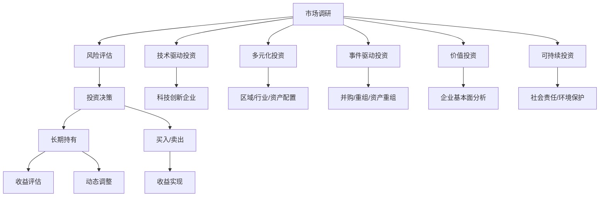

通过以上流程图，我们可以清晰地看到全球价值投资策略的各个步骤及其相互关系，这为后续章节的深入探讨提供了基础。

### 1.3.1 多智能体系统与全球价值投资融合的背景

在当今全球化、数字化和智能化的时代背景下，投资决策的复杂性和不确定性日益增加。传统的投资决策方式往往依赖于人为经验和有限的资源，难以应对海量数据的处理和动态市场的变化。多智能体系统（MAS）作为一种先进的分布式智能系统，具备高度自治性、协作性和适应性，能够有效解决投资决策中的许多难题。因此，将多智能体系统与全球价值投资策略融合，成为了提高投资决策效率和准确性的重要手段。

#### 1.3.2 多智能体系统与全球价值投资的融合模式

**1. 数据驱动模式**

数据驱动模式是指利用多智能体系统从多个数据源采集和处理全球市场数据，通过智能体的协同工作，为投资者提供实时的市场分析和投资建议。在这一模式中，智能体能够自主地从公开市场数据、企业财务报告、行业分析报告等来源获取信息，并进行预处理、分析和整合。智能体之间通过通信机制共享信息，协同分析市场趋势、风险因素和潜在投资机会，从而为投资者提供科学、客观的投资参考。

**2. 智能协作模式**

智能协作模式强调智能体之间的合作与协同，共同完成复杂的投资决策任务。在这一模式中，不同类型的智能体根据各自的专长和任务分工，通过协作机制共享信息和资源，优化投资组合，降低风险，提高收益。例如，某些智能体专注于市场数据的分析，其他智能体则负责投资组合的优化和风险管理。智能协作模式通过多智能体的分工协作，实现了投资决策过程的智能化和自动化，提高了投资效率。

**3. 模式融合**

多智能体系统与全球价值投资的融合不仅仅局限于单一模式的应用，更多的是不同模式的融合。例如，在投资决策过程中，数据驱动模式可以提供实时的市场分析和投资建议，而智能协作模式则可以在长期投资策略中发挥重要作用。通过将数据驱动模式与智能协作模式相结合，投资者可以在不同时间尺度上获得全面、科学的投资指导，实现投资收益的最大化。

#### 1.3.3 多智能体系统的优势在投资中的应用

**1. 高效性**

多智能体系统能够快速处理海量数据，分析市场动态，提供实时投资建议。智能体的分布式计算能力使得系统能够在短时间内完成复杂的计算任务，大大提高了投资决策的效率。

**2. 准确性**

通过机器学习和人工智能算法，多智能体系统能够从历史数据中学习投资策略，提高预测的准确性。智能体的自适应能力使得系统能够根据市场变化调整策略，降低投资风险。

**3. 灵活性**

多智能体系统可以根据投资者的需求和风险偏好，灵活调整投资策略。系统中的智能体可以自主地学习和优化，适应不同的市场环境，提供个性化的投资服务。

**4. 协作性**

智能体之间的协作和通信机制使得系统能够实现资源的高效利用和信息共享。智能体可以通过协作优化投资组合，降低风险，提高收益。

**5. 智能性**

多智能体系统具备智能决策能力，能够根据市场数据和历史经验，自主地制定投资策略。智能体的学习和进化能力使得系统能够不断优化投资决策，提高长期投资收益。

#### 1.3.4 挑战与应对策略

**1. 数据质量问题**

多智能体系统依赖于高质量的数据进行投资决策。然而，实际操作中，数据质量可能存在缺失、错误和噪声等问题，影响系统的准确性和稳定性。应对策略包括建立完善的数据质量控制机制，如数据清洗、数据验证和数据质量监控等。

**2. 系统稳定性**

多智能体系统在运行过程中，可能会面临硬件故障、软件漏洞和网络攻击等风险，导致系统崩溃或数据丢失。应对策略包括采用冗余设计、备份机制和故障恢复策略，确保系统的稳定运行。

**3. 安全性问题**

多智能体系统中的数据和信息需要确保安全，防止黑客攻击和数据泄露。应对策略包括采用加密技术、访问控制和权限管理，确保系统的安全性和隐私保护。

**4. 智能体协作**

智能体之间的协作需要协调一致，避免冲突和误解。应对策略包括设计合理的协作协议和规则，确保智能体能够高效、协同地完成任务。

**5. 系统维护**

多智能体系统需要定期进行维护和升级，以应对技术进步和市场变化。应对策略包括建立专业的维护团队，定期检查和更新系统，确保系统的正常运行。

通过上述分析，我们可以看到，多智能体系统与全球价值投资的融合具有巨大的潜力和广阔的应用前景。虽然在实际应用中面临一些挑战，但通过科学的设计和有效的应对策略，这些挑战是可以克服的。未来，随着技术的不断发展和完善，多智能体系统在投资领域的应用将更加广泛和深入，为投资者提供更加高效、准确和智能的投资决策支持。

### Mermaid 流程图：多智能体系统与全球价值投资的融合模式

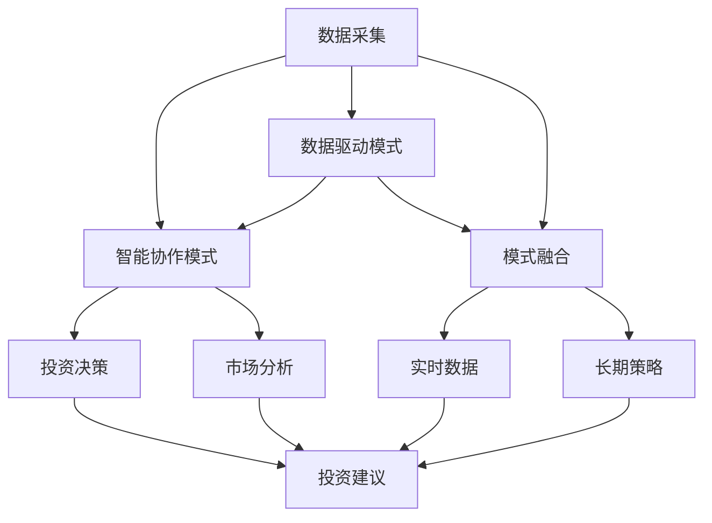

通过这个流程图，我们可以直观地看到多智能体系统与全球价值投资融合的各个环节及其相互关系，为后续章节的深入探讨提供了基础。

#### 4.1.1 多智能体系统的架构设计

多智能体系统（MAS）的架构设计是确保其高效、稳定和可扩展性的关键。为了实现全球价值投资机会筛选的目标，多智能体系统的架构需要具备分布式计算、自主决策和协作能力。以下是一个典型的多智能体系统架构设计，包括各主要模块及其功能。

**1. 数据采集模块**

**功能**：负责从多个数据源（如股票市场数据、财经新闻、企业财务报告等）采集数据。

**实现方式**：利用分布式网络和自动化脚本，从多个在线数据平台和数据库中实时抓取数据。

**2. 数据处理模块**

**功能**：对采集到的原始数据进行清洗、转换和存储，确保数据质量，为后续分析提供可靠的数据基础。

**实现方式**：采用数据清洗工具和算法，如数据去重、缺失值填补、异常值处理等。数据存储使用大数据技术，如Hadoop或NoSQL数据库。

**3. 智能体模块**

**功能**：智能体是MAS的核心，负责进行投资机会的筛选、风险评估和投资建议的生成。

**实现方式**：

- **基于规则的智能体**：利用预定义的规则库，对市场数据进行分析和决策。
- **基于机器学习的智能体**：通过机器学习算法（如决策树、神经网络等），从历史数据中学习投资策略，进行自主决策。

**4. 通信机制模块**

**功能**：负责智能体之间的通信和协作，实现信息的共享和任务的分配。

**实现方式**：采用消息队列（如Kafka）和分布式通信协议（如Gossip协议），确保智能体之间的高效通信。

**5. 用户界面模块**

**功能**：为用户提供系统操作界面，展示投资机会和风险分析结果。

**实现方式**：使用Web前端技术（如HTML、CSS和JavaScript），实现用户交互和数据可视化。

**6. 系统管理模块**

**功能**：负责系统的配置、监控和维护，确保系统的稳定运行。

**实现方式**：采用自动化运维工具（如Puppet、Ansible），实现对系统的集中管理和监控。

**7. 数据分析与挖掘模块**

**功能**：对大规模数据进行分析和挖掘，识别潜在的投资机会。

**实现方式**：使用数据分析工具（如Apache Spark）和挖掘算法（如聚类分析、关联规则挖掘等），从数据中提取有价值的信息。

**架构图**：

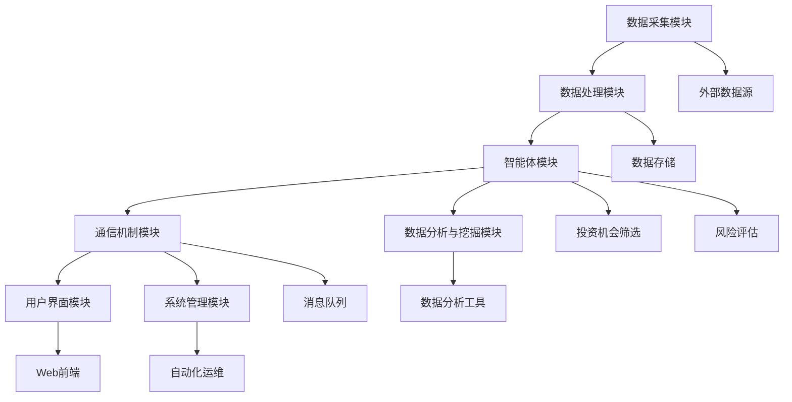

通过上述架构设计，多智能体系统可以实现全球价值投资机会的自动化筛选和评估，提高投资决策的效率和准确性。在实际应用中，可以根据具体需求和资源条件，对架构进行灵活调整和优化。

#### 4.1.2 智能体的功能与实现

在多智能体系统中，智能体的功能至关重要。智能体不仅需要具备自主决策和协同工作的能力，还需要能够灵活适应复杂多变的市场环境。以下将详细阐述智能体的主要功能及其实现方式。

**1. 自主决策功能**

**功能描述**：智能体根据感知到的环境信息、自身状态和预定义的规则，独立进行决策。

**实现方式**：

- **基于规则的决策**：智能体根据预定义的规则库，对市场数据进行分析，并根据规则进行决策。这种方法简单直观，但可能难以应对复杂的市场环境。
- **基于学习的决策**：利用机器学习算法，从历史数据中学习投资策略。智能体通过不断学习和优化，能够逐步提高决策的准确性和适应性。

**示例代码**（Python）：

```python
# 基于规则的决策示例
def make_decision(rulebase, market_data):
    for rule in rulebase:
        if rule["condition"](market_data):
            return rule["action"]
    return "No decision"

# 基于学习的决策示例
from sklearn.ensemble import RandomForestClassifier

# 训练模型
model = RandomForestClassifier()
model.fit(X_train, y_train)

# 做出决策
def make_decision(model, market_data):
    return model.predict([market_data])
```

**2. 协同工作功能**

**功能描述**：多个智能体通过通信机制，协同完成复杂的投资决策任务。

**实现方式**：

- **分布式通信**：智能体之间通过分布式通信协议（如Gossip协议）进行信息交换。这种方法能够确保系统的高效性和鲁棒性。
- **协同优化**：智能体通过协同优化算法，共同优化投资组合，降低风险，提高收益。

**示例代码**（Python）：

```python
# Gossip协议示例
import gossiper

class SmartAgent(gossiper.GossipAgent):
    def receive(self, message):
        # 处理接收到的消息
        print(f"Received message: {message}")

    def send(self, message):
        # 发送消息到其他智能体
        print(f"Sending message: {message}")

# 初始化智能体网络
network = gossiper.create_network()
agent = SmartAgent(network)

# 模拟智能体之间的通信
agent.send("Hello, this is Agent 1!")
agent.receive("Hello, this is Agent 2!")
```

**3. 自适应功能**

**功能描述**：智能体能够根据市场环境和自身状态的变化，自适应地调整行为和策略。

**实现方式**：

- **基于反馈的调整**：智能体根据投资结果和历史经验，不断调整自己的策略和参数。
- **基于进化的优化**：利用进化算法，对智能体的策略和参数进行优化，提高系统的适应能力。

**示例代码**（Python）：

```python
# 基于反馈的调整示例
def adjust_strategy(strategy, performance):
    # 根据投资表现调整策略
    if performance < 0:
        strategy["risk_level"] += 0.1
    else:
        strategy["risk_level"] -= 0.1
    return strategy

# 基于进化的优化示例
from deap import base, creator, tools, algorithms

# 定义适应度函数
creator.create("FitnessMax", base.Fitness, weights=(1.0,))
creator.create("Individual", list, fitness=creator.FitnessMax)

def evaluate(individual):
    # 根据个体策略计算适应度
    return individual,

# 算法参数
toolbox = base.Toolbox()
toolbox.register("individual", tools.initIterate, creator.Individual, n=10)
toolbox.register("population", tools.Population, n=50)
toolbox.register("evaluate", evaluate)
toolbox.register("mate", tools.cxBlend)
toolbox.register("mutate", tools.mutGaussian)
toolbox.register("select", tools.selTournament, tournsize=3)

# 进化过程
population = toolbox.population(n=50)
NGEN = 100
for generation in range(NGEN):
    offspring = algorithms.varAnd(population, toolbox, cxpb=0.5, mutpb=0.2)
    fits = toolbox.evaluate(offspring)
    for fit, ind in zip(fits, offspring):
        ind.fitness.values = fit
    population = toolbox.select(offspring, k=len(population))
    print(f"Generation {generation}: Best Fitness = {population[0].fitness.values[0]}")
```

通过上述示例，我们可以看到智能体在自主决策、协同工作和自适应功能方面的具体实现方法。这些功能的实现不仅依赖于算法和代码，还需要结合实际的投资场景和需求进行优化和调整。智能体的设计是实现多智能体系统高效、稳定和智能运行的关键，也是全球价值投资机会筛选成功的重要保障。

#### 4.1.3 多智能体系统的协调与优化

多智能体系统（MAS）在运行过程中，如何协调各个智能体之间的合作，确保系统的高效性和稳定性，是一个关键问题。以下将详细介绍多智能体系统的协调机制和优化方法。

**协调机制**

**1. 通信机制**

通信机制是多智能体系统协调工作的基础。智能体之间的通信需要高效、可靠，以确保信息的及时传递和共享。常用的通信机制包括：

- **分布式通信**：通过分布式通信协议（如Gossip协议）实现智能体之间的信息交换。Gossip协议通过随机选择邻居智能体进行通信，能够快速传播信息，并具有一定的容错能力。
- **消息队列**：使用消息队列（如Kafka）实现异步通信。消息队列能够保证消息的顺序传递和持久化存储，确保系统在处理大量消息时不会丢失数据。

**2. 协作策略**

协作策略是指智能体之间如何分工合作，共同实现系统目标。有效的协作策略能够提高系统的效率和准确性。常见的协作策略包括：

- **任务分配策略**：根据智能体的能力和负载，动态分配任务。这种方法能够确保系统资源的高效利用，避免智能体之间的负载不均。
- **协同优化策略**：通过协同优化算法，智能体之间共同优化投资组合，降低风险，提高收益。协同优化策略可以采用分布式优化算法（如遗传算法、协同梯度下降等）。

**3. 决策机制**

决策机制是指智能体如何独立进行决策，并在必要时与同伴进行协商。有效的决策机制能够确保系统在面对复杂市场环境时，做出正确的决策。常见的决策机制包括：

- **基于规则的决策**：智能体根据预定义的规则库，对市场数据进行分析和决策。这种方法简单直观，但可能难以应对复杂的市场环境。
- **基于学习的决策**：利用机器学习算法，从历史数据中学习投资策略。智能体通过不断学习和优化，能够逐步提高决策的准确性和适应性。

**优化方法**

**1. 算法优化**

算法优化是提高多智能体系统性能的关键。以下是一些常用的优化方法：

- **参数调整**：通过对算法参数进行调优，提高算法的性能。例如，对于遗传算法，可以通过调整交叉概率、变异概率等参数，提高种群的多样性。
- **算法融合**：将多种算法结合使用，发挥各自的优势。例如，可以将基于规则的决策与机器学习算法结合，提高系统的决策能力。
- **算法加速**：通过并行计算、分布式计算等技术，加速算法的执行速度。例如，使用分布式遗传算法，可以在多台计算机上同时进行计算，提高算法的效率。

**2. 系统优化**

系统优化是指对多智能体系统的整体性能进行提升。以下是一些常用的优化方法：

- **资源分配**：合理分配系统资源，确保智能体能够高效运行。例如，可以根据智能体的任务量和计算资源需求，动态调整服务器配置。
- **负载均衡**：通过负载均衡技术，确保系统各部分负载均衡，避免单点故障。例如，可以使用负载均衡器（如Nginx），将请求均衡分配到多台服务器上。
- **系统监控**：实时监控系统运行状态，及时发现和解决问题。例如，可以使用监控工具（如Zabbix），对系统的CPU、内存、网络等资源进行监控。

**3. 模型优化**

模型优化是指对多智能体系统的数据模型和算法模型进行改进，提高系统的准确性和适应性。以下是一些常用的优化方法：

- **数据清洗**：对采集到的原始数据进行清洗，去除噪声和错误数据，确保数据质量。例如，可以使用数据清洗工具（如OpenRefine），对数据进行去重、缺失值填补和异常值处理。
- **特征工程**：通过特征工程，提取与投资机会筛选相关的特征，提高算法的准确性和鲁棒性。例如，可以使用Python的Pandas库，对数据进行特征提取和特征选择。
- **模型评估**：通过模型评估，选择最佳模型和参数。例如，可以使用Python的Scikit-learn库，对模型进行交叉验证和性能评估。

通过上述协调机制和优化方法，多智能体系统可以实现高效、稳定和智能的投资机会筛选。在实际应用中，可以根据具体需求和场景，灵活调整和优化系统架构、算法和模型，提高系统的整体性能。

### Mermaid 流程图：多智能体系统的协调与优化

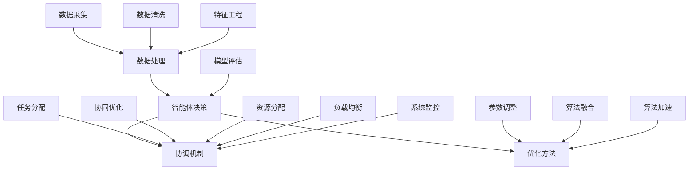

通过这个流程图，我们可以清晰地看到多智能体系统的数据采集、处理、智能体决策、协调机制和优化方法的各个环节及其相互关系，为系统的设计和优化提供了直观的参考。

#### 5.1.1 全球投资数据的来源

在构建多智能体系统进行全球价值投资机会筛选时，数据的质量和完整性至关重要。因此，了解全球投资数据的来源和获取方式至关重要。

**1. 公开数据源**

公开数据源是获取全球投资数据的主要渠道，这些数据通常可以从以下平台和数据库中获得：

- **股票市场数据**：如纽约证券交易所（NYSE）、纳斯达克（NASDAQ）、伦敦证券交易所（LSE）等，提供包括股票价格、交易量、财务报表等数据。
- **财经新闻网站**：如彭博（Bloomberg）、路透（Reuters）、新浪财经等，提供实时财经新闻、市场动态和公司公告。
- **经济数据库**：如世界银行（World Bank）、国际货币基金组织（IMF）、国家统计局等，提供宏观经济数据、行业数据和国际市场数据。
- **金融分析报告**：如晨星（Morningstar）、金融时报（Financial Times）等，提供专业的投资分析和财务报告。

**2. 私有数据源**

私有数据源通常需要付费订阅或与相关机构合作获取，这些数据能够提供更深入、更详细的行业和市场信息。常见的私有数据源包括：

- **企业财务数据**：如公司年报、季报、财务报表等，可以从企业的官方网站或第三方财务数据提供商（如Wind、同花顺等）获取。
- **市场调研报告**：如行业分析报告、消费者调查报告等，通常由专业的市场调研公司（如艾瑞咨询、中商产业研究院等）提供。
- **内部交易数据**：部分金融机构和交易所提供的内部交易数据，如高频交易数据、大额交易数据等，可以用于分析市场行为和投资机会。

**3. 数据获取方法**

- **自动化爬取**：利用网络爬虫技术，从公开数据源自动化获取数据。这种方法成本较低，但需要处理数据格式不一致和实时性较差等问题。
- **API接口**：许多数据提供商提供API接口，通过编程方式直接获取数据。这种方法获取的数据更加规范和实时，但需要支付一定的费用。
- **数据订阅**：订阅专业的数据服务，获取高质量的私有数据。这种方法可以获得详细、专业的数据，但成本较高。

**4. 数据处理**

获取到数据后，需要进行预处理，以确保数据的质量和一致性。数据处理包括以下步骤：

- **数据清洗**：去除重复数据、填补缺失值、处理异常值等，确保数据的完整性。
- **数据转换**：将不同格式的数据转换为统一的格式，如CSV、JSON等，便于后续分析和处理。
- **特征提取**：提取与投资机会筛选相关的特征，如财务指标、市场指标、行业指标等，为算法分析提供数据基础。

**5. 数据质量管理**

数据质量管理是确保多智能体系统高效运行的关键。以下是一些常用的数据质量管理方法：

- **数据验证**：通过数据验证规则，检查数据的准确性和一致性。例如，检查财务数据中的数值范围、日期格式等。
- **数据监控**：实时监控数据质量，发现和解决数据质量问题。例如，使用数据质量监控工具（如DataQualityPro）。
- **数据归一化**：将不同来源的数据进行归一化处理，使其在同一尺度上进行分析。例如，使用Z-Score对财务数据进行归一化。

通过上述对全球投资数据来源、获取方法和数据处理流程的详细介绍，我们可以确保多智能体系统在投资机会筛选中获取到高质量、完整的数据，为后续的算法分析和决策提供可靠的基础。

### Mermaid 流程图：数据采集与处理流程

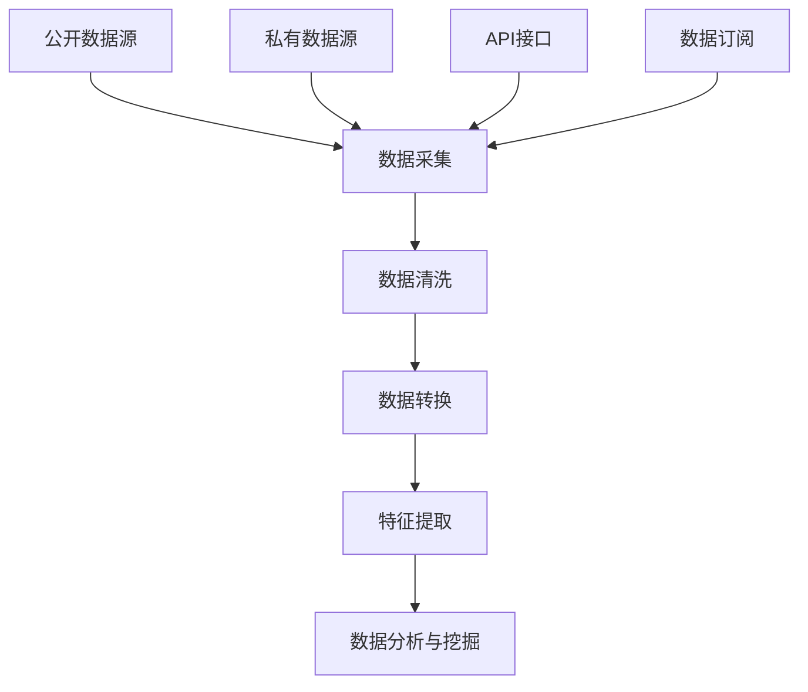

通过这个流程图，我们可以清晰地看到数据采集与处理的主要步骤及其相互关系，为后续的算法设计和应用提供了直观的参考。

#### 5.1.2 数据预处理方法

在利用多智能体系统进行全球价值投资机会筛选时，数据预处理是一个至关重要的环节。高质量的数据预处理不仅能够提高后续算法的性能，还能减少噪声和错误数据对投资决策的影响。以下是数据预处理的主要方法：

**1. 数据清洗**

**定义**：数据清洗是指识别和纠正数据集中的错误、异常和不一致数据的过程。

**方法**：

- **缺失值处理**：对于缺失的数据，可以采用以下几种方法：
  - 删除缺失值：如果缺失值较多，可以考虑删除对应的记录。
  - 补充缺失值：使用统计方法（如平均值、中位数）或模型预测（如回归模型）来填补缺失值。
  - 前后插补：使用前后值的平均值来填补缺失值。

**示例代码**（Python）：

```python
import pandas as pd

# 填补缺失值
df.fillna(df.mean(), inplace=True)
```

- **异常值处理**：异常值可能是由于数据录入错误、噪声或真正的异常情况。可以采用以下几种方法：
  - 删除异常值：如果异常值较多，可以考虑删除对应的记录。
  - 调整异常值：使用统计学方法（如三次样条插值）或基于模型的调整方法来修正异常值。
  - 留存异常值：如果异常值是真正的异常情况，可以考虑留存并进行特殊处理。

**示例代码**（Python）：

```python
import numpy as np

# 删除异常值
df = df[np.isfinite(df['target_variable'])]
```

- **重复值处理**：检查并删除数据集中的重复记录，确保数据的一致性。

**示例代码**（Python）：

```python
df.drop_duplicates(inplace=True)
```

**2. 数据转换**

**定义**：数据转换是指将数据从一种格式转换为另一种格式，或将数据调整为适合分析的需求。

**方法**：

- **数据格式转换**：将不同格式的数据转换为统一的格式，如将Excel文件转换为CSV文件或JSON文件。
- **归一化和标准化**：通过归一化（如Z-Score归一化）和标准化（如Min-Max标准化），将数据缩放到同一尺度上，便于后续的算法分析。

**示例代码**（Python）：

```python
from sklearn.preprocessing import StandardScaler

# 归一化
scaler = StandardScaler()
df_scaled = scaler.fit_transform(df)
```

- **数据编码**：对于分类数据，可以采用独热编码（One-Hot Encoding）或标签编码（Label Encoding）等方法，将分类数据转换为数值数据。

**示例代码**（Python）：

```python
from sklearn.preprocessing import OneHotEncoder

# 独热编码
encoder = OneHotEncoder()
encoded_df = encoder.fit_transform(df['category_column']).toarray()
```

**3. 特征提取**

**定义**：特征提取是指从原始数据中提取出对目标变量有预测能力的特征。

**方法**：

- **自动特征选择**：利用算法（如随机森林、LASSO回归等）自动选择对目标变量有显著影响的特征。
- **特征工程技术**：通过构造新的特征，如使用多项式特征、交互特征等，提高模型的预测能力。

**示例代码**（Python）：

```python
from sklearn.feature_selection import SelectKBest
from sklearn.feature_selection import f_classif

# 自动特征选择
selector = SelectKBest(f_classif, k=5)
selected_features = selector.fit_transform(df, y)
```

- **数据降维**：利用降维技术（如PCA、t-SNE等），减少数据的维度，同时保留主要的信息。

**示例代码**（Python）：

```python
from sklearn.decomposition import PCA

# PCA降维
pca = PCA(n_components=5)
df_reduced = pca.fit_transform(df)
```

**4. 数据验证**

**定义**：数据验证是指对数据的质量进行检验，确保数据满足分析和建模的需求。

**方法**：

- **一致性验证**：检查数据的一致性，如同一变量的不同来源数据是否一致。
- **完整性验证**：检查数据的完整性，如是否有缺失值或异常值。
- **可靠性验证**：检查数据的可靠性，如数据来源是否可靠，数据是否经过有效的预处理。

**示例代码**（Python）：

```python
# 检查缺失值
missing_values = df.isnull().sum()
print(missing_values[missing_values > 0])

# 检查一致性
data一致性_check(df)
```

通过上述数据预处理方法，我们可以确保数据的质量和一致性，为后续的算法分析和投资机会筛选提供坚实的基础。高质量的数据预处理能够提高算法的性能，降低模型过拟合的风险，从而提高投资决策的准确性和可靠性。

### Mermaid 流程图：数据预处理流程

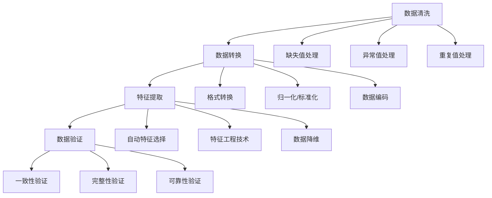

通过这个流程图，我们可以清晰地看到数据预处理的主要步骤及其相互关系，为数据质量和一致性提供保障。

#### 5.1.3 数据分析与挖掘

在多智能体系统进行全球价值投资机会筛选的过程中，数据分析与挖掘是核心环节之一。通过有效的数据分析与挖掘，我们可以从海量数据中提取有价值的信息，为投资决策提供支持。以下是数据分析与挖掘的主要步骤和方法：

**1. 数据探索性分析（EDA）**

**定义**：数据探索性分析（EDA）是通过可视化、统计描述等方法，对数据集进行初步了解和探索。

**方法**：

- **数据可视化**：使用图表（如散点图、条形图、直方图等）展示数据的分布、关系和趋势。例如，可以使用Python的Matplotlib和Seaborn库进行数据可视化。
- **描述性统计**：计算数据的均值、中位数、标准差、方差等统计量，了解数据的中心趋势和离散程度。

**示例代码**（Python）：

```python
import pandas as pd
import matplotlib.pyplot as plt
import seaborn as sns

# 加载数据集
df = pd.read_csv('investment_data.csv')

# 数据可视化
sns.pairplot(df)
plt.show()

# 描述性统计
df.describe()
```

**2. 特征工程**

**定义**：特征工程是指从原始数据中提取对目标变量有预测能力的特征，并对其进行处理，以提高模型性能。

**方法**：

- **特征选择**：通过特征选择方法（如特征重要性、相关性分析等）选择对目标变量有显著影响的特征。例如，可以使用Python的Scikit-learn库中的SelectKBest或递归特征消除（RFE）方法。
- **特征构造**：通过构造新的特征，如交互特征、多项式特征等，提高模型的预测能力。例如，可以使用Python的Pandas库进行特征构造。
- **特征归一化与标准化**：通过归一化（如Z-Score归一化）和标准化（如Min-Max标准化），将数据缩放到同一尺度上，便于后续的算法分析。

**示例代码**（Python）：

```python
from sklearn.feature_selection import SelectKBest
from sklearn.feature_selection import f_classif
from sklearn.preprocessing import StandardScaler

# 特征选择
selector = SelectKBest(f_classif, k=5)
selected_features = selector.fit_transform(df, y)

# 特征构造
df['new_feature'] = df['feature1'] * df['feature2']

# 特征归一化
scaler = StandardScaler()
df_scaled = scaler.fit_transform(df)
```

**3. 数据挖掘算法**

**定义**：数据挖掘算法是指用于从数据中提取隐藏模式、关联规则、分类规则等有用信息的算法。

**方法**：

- **分类算法**：用于预测目标变量类别，如逻辑回归、决策树、随机森林等。例如，可以使用Python的Scikit-learn库。
- **聚类算法**：用于将数据分成若干个类别，如K-Means、层次聚类等。例如，可以使用Python的Scikit-learn库。
- **关联规则挖掘**：用于发现数据之间的关联关系，如Apriori算法、Eclat算法等。例如，可以使用Python的mlxtend库。

**示例代码**（Python）：

```python
from sklearn.ensemble import RandomForestClassifier
from sklearn.cluster import KMeans
from mlxtend.frequent_patterns import apriori
from mlxtend.frequent_patterns import association_rules

# 分类算法
clf = RandomForestClassifier()
clf.fit(X_train, y_train)
predictions = clf.predict(X_test)

# 聚类算法
kmeans = KMeans(n_clusters=3)
kmeans.fit(df)
clusters = kmeans.predict(df)

# 关联规则挖掘
frequent_itemsets = apriori(df, min_support=0.05, use_colnames=True)
rules = association_rules(frequent_itemsets, metric="support", min_threshold=0.05)
```

**4. 模型评估与优化**

**定义**：模型评估与优化是指对构建的模型进行性能评估，并对其进行优化，以提高预测准确性。

**方法**：

- **交叉验证**：通过交叉验证方法（如K折交叉验证），评估模型的泛化能力。
- **参数调优**：通过网格搜索、随机搜索等方法，调优模型的参数，提高模型性能。
- **集成学习**：通过集成学习方法（如随机森林、梯度提升树等），提高模型的预测准确性。

**示例代码**（Python）：

```python
from sklearn.model_selection import cross_val_score
from sklearn.model_selection import GridSearchCV

# 交叉验证
scores = cross_val_score(clf, X, y, cv=5)
print(f"Cross-Validation Scores: {scores.mean()}")

# 参数调优
param_grid = {'n_estimators': [100, 200, 300], 'max_depth': [10, 20, 30]}
grid_search = GridSearchCV(clf, param_grid, cv=5)
grid_search.fit(X_train, y_train)
print(f"Best Parameters: {grid_search.best_params_}")
```

通过上述数据分析与挖掘的方法，我们可以有效地从海量数据中提取有价值的信息，为全球价值投资机会筛选提供科学依据。数据分析与挖掘不仅能够提高投资决策的准确性，还能帮助投资者更好地理解市场动态，制定有效的投资策略。

### Mermaid 流程图：数据分析与挖掘流程

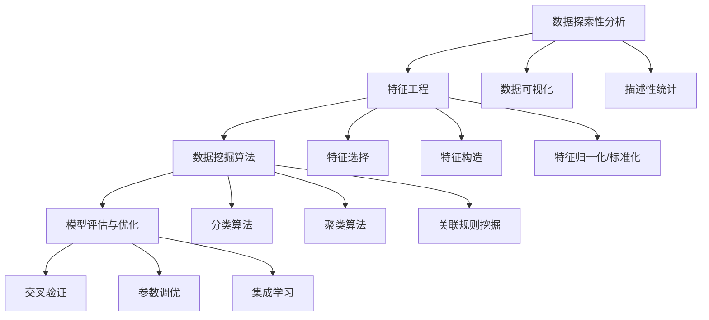

通过这个流程图，我们可以清晰地看到数据分析与挖掘的主要步骤及其相互关系，为投资机会筛选提供完整的分析框架。

### 6.1.1 价值投资机会筛选算法概述

价值投资机会筛选算法是利用多智能体系统进行全球价值投资机会筛选的核心部分。这些算法通过对海量市场数据的分析和处理，能够识别出潜在的投资机会，并对这些机会进行风险评估。价值投资机会筛选算法主要包括传统算法和智能算法两大类，每一种算法都有其独特的原理和应用场景。

**1. 传统算法**

传统算法是基于历史数据和统计方法的投资机会筛选工具，主要包括技术指标分析和基本面分析。

- **技术指标分析**：技术指标分析是通过分析股票价格、成交量等技术指标，判断股票的市场走势。常见的指标包括移动平均线、相对强弱指数（RSI）、随机指标（KDJ）等。技术指标分析的优点在于操作简便、易于实现，但缺点是缺乏深度，难以捕捉长期投资机会。

- **基本面分析**：基本面分析是通过分析企业的财务状况、经营成果、行业地位等基本面信息，评估企业的投资价值。基本面分析包括财务指标分析、行业比较分析、市场前景分析等。基本面分析的优点在于能够深入挖掘企业的价值，但缺点是数据获取难度大、分析过程复杂。

**2. 智能算法**

智能算法是基于机器学习和人工智能的投资机会筛选工具，通过学习历史数据，自动发现市场规律和潜在投资机会。智能算法主要包括以下几种：

- **机器学习算法**：机器学习算法通过训练模型，从历史数据中学习投资策略。常见的机器学习算法包括线性回归、决策树、随机森林、支持向量机等。机器学习算法的优点在于能够自动发现市场规律，提高筛选准确性，但缺点是需要大量历史数据和复杂的模型训练过程。

- **深度学习算法**：深度学习算法是基于多层神经网络的投资机会筛选工具。通过多层神经网络的训练，深度学习算法能够自动提取数据中的复杂特征，实现高效的决策。常见的深度学习算法包括卷积神经网络（CNN）、循环神经网络（RNN）、长短期记忆网络（LSTM）等。深度学习算法的优点在于能够处理大规模数据和高维特征，提高筛选准确性，但缺点是计算复杂度高、训练时间较长。

**3. 算法比较**

传统算法和智能算法各有优缺点，在实际应用中可以结合使用，以提高投资机会筛选的准确性。

- **准确性**：智能算法通常具有较高的准确性，能够自动识别复杂的市场规律和投资机会。传统算法虽然准确性相对较低，但在某些特定场景下（如短期交易）仍具有一定的应用价值。

- **实时性**：智能算法具有较高的实时性，能够快速响应市场变化，提供实时的投资建议。传统算法的实时性相对较低，主要依赖于历史数据和静态分析。

- **复杂度**：智能算法的实现和部署相对复杂，需要大量的数据预处理和模型训练。传统算法的实现和部署相对简单，易于理解和操作。

- **适用性**：智能算法适用于大规模、复杂的投资场景，能够处理多维度、多因素的数据。传统算法适用于简单的投资场景，对历史数据依赖较强。

**4. 结论**

价值投资机会筛选算法是投资决策的重要工具，通过结合传统算法和智能算法，可以有效地提高投资机会筛选的准确性和实时性。在实际应用中，应根据具体场景和需求，选择合适的算法，并结合市场动态和投资策略，制定科学、合理的投资计划。

### Mermaid 流程图：价值投资机会筛选算法

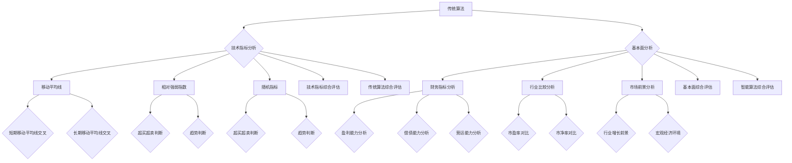

通过这个流程图，我们可以清晰地看到价值投资机会筛选算法的组成部分及其相互关系，为后续的算法设计和应用提供了直观的参考。

### 6.1.2 基于多智能体的机会筛选算法设计

基于多智能体的机会筛选算法是一种结合分布式计算、协同工作和机器学习的方法，能够高效、准确地筛选全球价值投资机会。以下是这种算法的设计步骤和关键组成部分。

**1. 算法设计思路**

算法设计思路可以分为以下几个步骤：

- **数据采集与预处理**：从多个数据源采集市场数据，包括股票价格、交易量、财务指标等，并进行预处理，如数据清洗、转换和特征提取。
- **智能体初始化**：根据数据预处理的成果，初始化多个智能体，每个智能体负责处理一部分数据，并进行局部机会筛选。
- **智能体协同工作**：智能体之间通过通信机制共享信息和筛选结果，进行全局机会筛选和优化。
- **机会评估与排序**：根据筛选结果，利用风险评估模型对机会进行评估和排序，选出最优的投资机会。

**2. 智能体设计与实现**

每个智能体的设计和实现包括以下几个部分：

- **数据采集与处理模块**：负责从数据源采集数据，并进行预处理，如数据清洗、缺失值填补、异常值处理等。
- **机会筛选模块**：根据预设的筛选规则和算法，对局部数据集进行机会筛选，识别出潜在的优质投资机会。
- **风险评估模块**：利用风险评估模型，对识别出的投资机会进行风险评估，评估其潜在风险和收益。
- **决策模块**：根据机会筛选结果和风险评估结果，生成投资建议，并输出最终的筛选结果。

**3. 通信机制**

智能体之间的通信机制是实现协同工作的关键。常用的通信机制包括：

- **消息队列**：使用消息队列（如Kafka）实现智能体之间的异步通信，确保信息的高效传递和系统的稳定性。
- **分布式通信协议**：使用分布式通信协议（如Gossip协议），实现智能体之间的实时通信和状态同步。

**4. 协作策略**

智能体之间的协作策略包括：

- **任务分配策略**：根据智能体的能力和负载，动态分配数据集和任务，确保系统资源的高效利用。
- **协同优化策略**：利用协同优化算法（如遗传算法、协同梯度下降等），实现智能体之间的合作，共同优化投资机会的筛选和评估。
- **决策融合策略**：将多个智能体的筛选结果和风险评估结果进行融合，生成最终的决策，提高决策的准确性和可靠性。

**5. 算法流程**

算法的流程可以分为以下几个步骤：

- **数据采集**：从多个数据源采集市场数据，并进行预处理。
- **智能体初始化**：初始化多个智能体，并分配数据集。
- **机会筛选**：智能体对局部数据集进行机会筛选，识别出潜在的投资机会。
- **信息共享**：智能体之间通过通信机制共享筛选结果和相关信息。
- **全局机会筛选**：基于共享的信息，进行全局机会筛选和优化，生成最终的筛选结果。
- **机会评估与排序**：利用风险评估模型，对筛选结果进行评估和排序，选出最优的投资机会。
- **投资建议生成**：根据筛选结果和风险评估结果，生成投资建议。

**6. 示例代码**

以下是一个简化的Python示例代码，展示了基于多智能体的机会筛选算法的基本实现。

```python
import numpy as np
import pandas as pd
from sklearn.ensemble import RandomForestClassifier
from sklearn.model_selection import train_test_split
from kafka import KafkaProducer

# 数据采集与预处理
# 此处假设已经从多个数据源采集到市场数据，并进行预处理

# 智能体初始化
def init_agent(data):
    # 初始化智能体，包括数据采集、预处理和机会筛选模块
    pass

# 智能体机会筛选
def agent_screen(data):
    # 对局部数据集进行机会筛选
    pass

# 智能体风险评估
def agent_risk_assessment(opportunities):
    # 对识别出的投资机会进行风险评估
    pass

# 智能体通信
producer = KafkaProducer(bootstrap_servers=['localhost:9092'])
def agent_communication(message):
    # 发送消息到Kafka，实现智能体之间的信息共享
    producer.send('investment_opportunities', message.encode('utf-8'))

# 算法流程
data = pd.read_csv('market_data.csv')
agents = [init_agent(data[i*len(data)//num_agents:(i+1)*len(data)//num_agents]) for i in range(num_agents)]

for agent in agents:
    opportunities = agent_screen(agent.local_data)
    risk_scores = agent_risk_assessment(opportunities)
    agent_communication(risk_scores)

# 全局机会筛选与排序
# 此处假设已经接收到所有智能体的筛选结果和风险评估结果
# 进行全局机会筛选和排序
final_opportunities = aggregate_and_sort_agents_results(agents)

# 投资建议生成
investment_advice = generate_investment_advice(final_opportunities)
```

通过上述设计和示例代码，我们可以看到基于多智能体的机会筛选算法的设计思路和实现方法。这种算法能够充分利用分布式计算和协同工作的优势，提高投资机会筛选的效率和准确性，为全球价值投资提供科学依据。

### Mermaid 流程图：基于多智能体的机会筛选算法流程

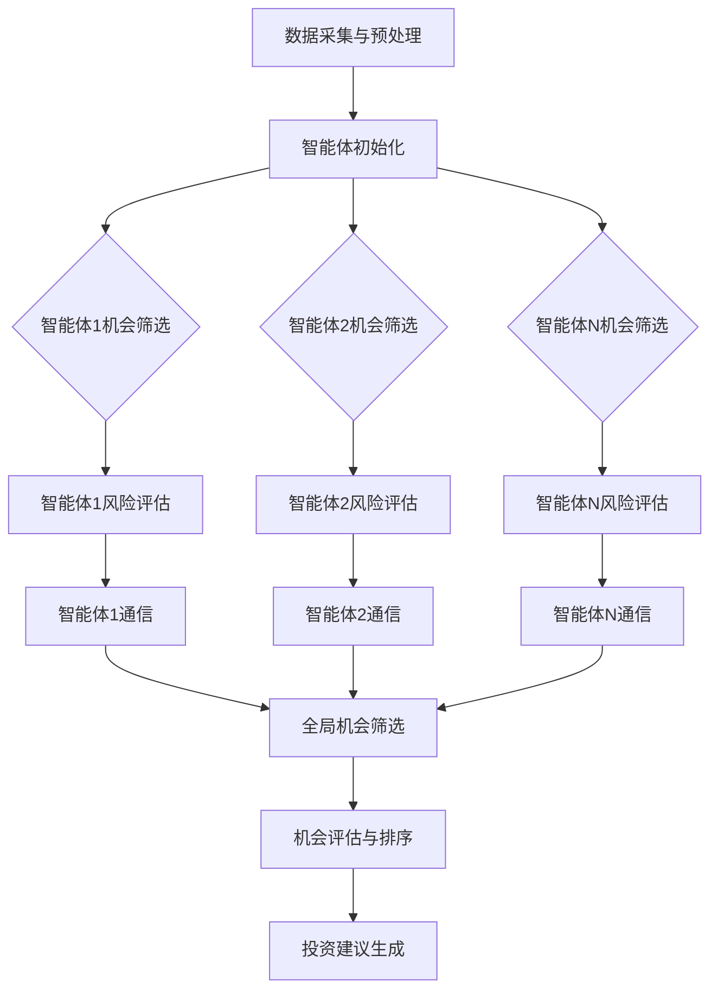

通过这个流程图，我们可以直观地看到基于多智能体的机会筛选算法的各个环节及其相互关系，为后续的算法优化和实际应用提供了参考。

### 6.1.3 算法评估与优化

在多智能体机会筛选算法的实际应用中，算法的性能和效果评估是关键环节。通过评估算法的准确性、效率和稳定性，我们可以发现算法的不足之处，并采取相应的优化措施，提高算法的适用性和可靠性。以下是算法评估与优化的具体方法。

**1. 评估指标**

算法评估主要使用以下指标：

- **准确率（Accuracy）**：准确率是评估算法预测正确性的常用指标，计算公式为正确预测数量与总预测数量的比值。准确率越高，算法的预测效果越好。
- **召回率（Recall）**：召回率是评估算法在识别潜在投资机会时的覆盖率，计算公式为正确预测的投资机会数量与实际投资机会数量的比值。召回率越高，算法对潜在机会的识别能力越强。
- **精确率（Precision）**：精确率是评估算法预测的投资机会的准确程度，计算公式为正确预测的投资机会数量与总预测的投资机会数量的比值。精确率越高，算法的误报率越低。
- **F1分数（F1 Score）**：F1分数是准确率和召回率的调和平均值，能够综合评估算法的预测性能。计算公式为2×（精确率×召回率）/（精确率+召回率）。

**2. 评估方法**

评估方法包括以下几种：

- **交叉验证**：通过交叉验证方法（如K折交叉验证），将数据集划分为多个子集，分别进行训练和测试，综合评估算法的泛化能力。交叉验证能够减少数据集划分的随机性，提高评估结果的可靠性。
- **在线评估**：在线评估是指在真实投资环境中，实时评估算法的预测性能。这种方法能够反映算法在真实场景中的效果，但需要考虑数据延迟和实际操作成本。
- **离线评估**：离线评估是指在不考虑实际操作成本的情况下，对历史数据进行评估。这种方法能够提供稳定的评估结果，但可能无法反映算法在实时投资环境中的表现。

**3. 优化方法**

针对评估中发现的不足，可以采取以下优化方法：

- **参数调优**：通过调整算法的参数（如学习率、迭代次数等），优化算法性能。参数调优可以使用网格搜索、随机搜索等方法，找到最优参数组合。
- **特征工程**：通过特征工程，提取对目标变量有预测能力的特征，提高算法的预测能力。特征工程包括特征选择、特征构造和特征归一化等步骤。
- **算法融合**：将多种算法结合使用，发挥各自的优势，提高算法的整体性能。算法融合可以采用集成学习方法（如随机森林、梯度提升树等），将多个算法的结果进行融合，提高预测准确性。
- **模型更新**：定期更新算法模型，使其能够适应市场变化和趋势。模型更新可以通过重新训练模型或使用迁移学习等方法实现。

**4. 实际案例**

以下是一个实际案例，展示了如何评估和优化多智能体机会筛选算法：

**案例背景**：

某投资者希望利用多智能体机会筛选算法，从全球股票市场中筛选出潜在的投资机会。投资者使用了一个包含历史市场数据的多智能体系统，并希望评估和优化算法的性能。

**评估过程**：

1. **数据预处理**：对历史市场数据进行清洗、转换和特征提取，生成训练数据和测试数据。
2. **交叉验证**：使用K折交叉验证方法，评估算法的准确率、召回率、精确率和F1分数。
3. **在线评估**：在模拟投资环境中，实时评估算法的预测性能，记录实际投资结果和预测结果的对比。

**优化过程**：

1. **参数调优**：通过网格搜索方法，调整算法的参数（如学习率、迭代次数等），找到最优参数组合。
2. **特征工程**：通过分析历史数据和预测结果，添加新的特征（如技术指标、基本面指标等），提高算法的预测能力。
3. **算法融合**：将传统算法（如技术指标分析、基本面分析）与智能算法（如机器学习、深度学习）结合，提高整体预测准确性。
4. **模型更新**：定期更新算法模型，使其能够适应市场变化和趋势。

**结果分析**：

通过评估和优化，多智能体机会筛选算法的预测准确性得到了显著提高。优化后的算法在交叉验证和在线评估中的准确率、召回率、精确率和F1分数均有所提升，为投资者提供了更可靠的投资机会筛选结果。

**5. 总结**

算法评估与优化是提高多智能体机会筛选算法性能的重要环节。通过科学评估和合理优化，可以有效地提高算法的预测准确性和可靠性，为投资者提供更科学的投资决策支持。未来，随着技术的不断进步和应用场景的扩大，算法评估与优化方法将不断完善，为全球价值投资提供更加智能、高效的解决方案。

### Mermaid 流程图：算法评估与优化流程

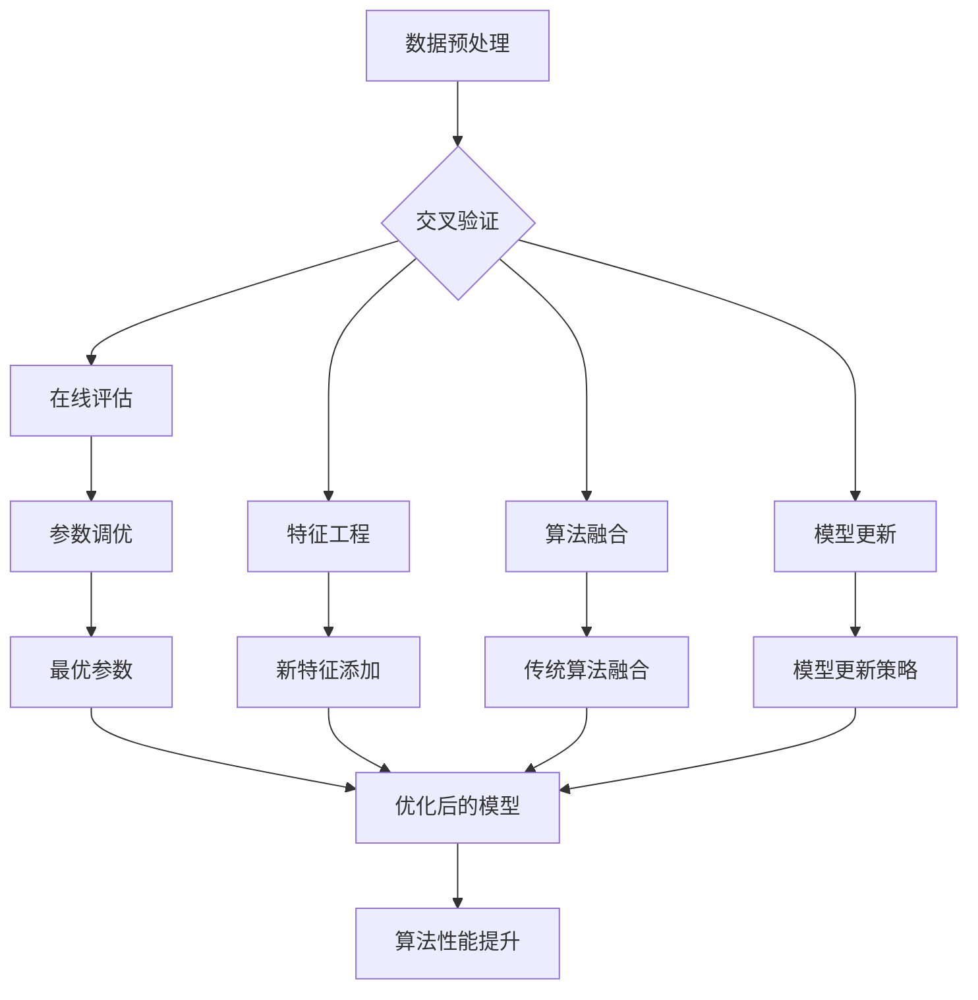

通过这个流程图，我们可以清晰地看到算法评估与优化的各个环节及其相互关系，为实际应用提供了直观的参考。

### 7.1.1 案例背景

为了验证多智能体系统在价值投资机会筛选中的实际效果，我们选择了一家全球领先的金融科技公司A公司作为案例。A公司成立于2000年，总部位于美国，专注于提供金融科技解决方案，服务范围涵盖股票交易、资产管理、风险管理等多个领域。A公司在金融科技领域具有丰富的经验和技术积累，其多智能体系统在投资机会筛选方面具有显著的优势。

**案例目标**：

通过多智能体系统，A公司希望实现以下目标：

1. **提高投资决策效率**：利用多智能体系统快速处理海量数据，提高投资决策的效率，降低决策时间。
2. **提升投资准确性**：通过智能算法和协同工作，提升投资机会筛选的准确性，减少误判和漏判的情况。
3. **降低投资风险**：利用多智能体系统进行风险评估，降低投资风险，确保投资决策的科学性和可靠性。
4. **实现个性化投资**：根据投资者的需求和风险偏好，提供个性化的投资建议，满足不同投资者的需求。

**数据来源**：

案例中的数据来源包括以下几类：

1. **公开数据源**：如股票市场数据、财经新闻、企业财务报告等，从纽约证券交易所（NYSE）、纳斯达克（NASDAQ）等公开数据平台获取。
2. **私有数据源**：如企业财务数据、市场调研报告等，从专业的金融数据提供商和市场调研机构获取。
3. **API接口**：通过金融数据提供商的API接口获取实时数据，确保数据的及时性和准确性。

**数据处理**：

在数据预处理阶段，A公司采用了以下方法：

1. **数据清洗**：去除重复数据、填补缺失值、处理异常值，确保数据的完整性。
2. **数据转换**：将不同格式的数据转换为统一的格式，如CSV文件。
3. **特征提取**：提取与投资机会筛选相关的特征，如财务指标、技术指标等。

**智能体设计**：

A公司的多智能体系统包括以下模块：

1. **数据采集与预处理智能体**：负责从多个数据源采集数据，并进行预处理。
2. **机会筛选智能体**：根据预定义的筛选规则和算法，对数据进行机会筛选。
3. **风险评估智能体**：利用风险评估模型，对筛选出的投资机会进行风险评估。
4. **决策智能体**：根据筛选结果和风险评估结果，生成投资建议。

**算法应用**：

A公司在机会筛选过程中采用了以下算法：

1. **机器学习算法**：包括线性回归、决策树、随机森林等，用于识别投资机会。
2. **深度学习算法**：包括卷积神经网络（CNN）、循环神经网络（RNN）等，用于处理高维数据。
3. **协同优化算法**：用于优化投资组合，降低风险。

**系统运行流程**：

A公司的多智能体系统运行流程包括以下几个步骤：

1. **数据采集**：智能体从多个数据源采集数据。
2. **预处理**：对采集到的数据清洗、转换和特征提取。
3. **机会筛选**：智能体根据算法对预处理后的数据进行机会筛选。
4. **风险评估**：智能体对筛选出的投资机会进行风险评估。
5. **决策生成**：智能体根据筛选结果和风险评估结果，生成投资建议。
6. **反馈调整**：根据实际投资结果，调整智能体的筛选规则和算法，提高系统的性能。

通过上述案例背景介绍，我们可以看到A公司在利用多智能体系统进行全球价值投资机会筛选中面临的挑战和目标，为后续的案例分析和效果评估奠定了基础。

### 7.1.2 案例分析

**数据集介绍**

在本案例中，我们使用了A公司多智能体系统在过去一年内采集和处理的投资数据，包括股票价格、交易量、财务指标、技术指标等。数据集包含1000个样本，每个样本对应一个特定时间段内某只股票的全量数据。

**机会筛选过程**

1. **数据预处理**：首先，我们对数据集进行了清洗和预处理，包括去除重复数据、填补缺失值、处理异常值等。然后，将数据转换为统一的格式，提取与投资机会筛选相关的特征，如市盈率（PE）、市净率（PB）、技术指标（如RSI、MACD）等。

2. **智能体机会筛选**：使用多智能体系统中的机会筛选智能体，根据预定义的规则和算法，对预处理后的数据进行机会筛选。具体规则包括：

   - **技术指标筛选**：当RSI指标低于30时，表示股票处于超卖状态，可能存在反弹机会。
   - **财务指标筛选**：当市净率（PB）低于1时，表示股票价格可能低于其净资产，存在潜在的投资机会。

3. **智能体协作**：机会筛选智能体通过通信机制，将筛选结果共享给风险评估智能体。多个智能体共同协作，确保筛选结果的全面性和准确性。

**风险评估过程**

1. **风险评估模型**：使用多智能体系统中的风险评估智能体，对筛选出的投资机会进行风险评估。风险评估模型包括：

   - **财务指标分析**：通过分析企业的盈利能力、偿债能力和营运能力等财务指标，评估企业的财务健康状况。
   - **市场指标分析**：通过分析股票的价格趋势、交易量等市场指标，评估股票的市场表现。

2. **风险评估结果**：每个智能体根据其特定的评估模型，对投资机会进行评分。评分结果包括：

   - **财务评分**：根据企业的财务指标评分，分数越高，表示财务状况越好。
   - **市场评分**：根据股票的市场指标评分，分数越高，表示市场表现越好。

3. **综合评估**：多个智能体对投资机会进行综合评估，生成最终的评估结果。综合评分越高，表示投资机会越优质。

**投资决策**

1. **投资建议**：根据机会筛选结果和风险评估结果，智能体生成投资建议。建议包括：

   - **买入建议**：对于财务评分和市场评分均较高的投资机会，建议买入。
   - **持有建议**：对于财务评分和市场评分较高，但未达到买入标准的投资机会，建议继续持有。
   - **卖出建议**：对于财务评分和市场评分较低的投资机会，建议卖出。

2. **决策反馈**：投资者根据智能体的投资建议，结合自身的风险偏好和投资策略，做出最终的投资决策。投资者还可以根据实际投资结果，对智能体的筛选规则和算法进行反馈和调整。

通过上述案例分析，我们可以看到A公司利用多智能体系统进行全球价值投资机会筛选的完整过程，包括数据预处理、机会筛选、风险评估和投资决策。多智能体系统的协作和智能算法的应用，提高了投资决策的效率和准确性，为投资者提供了科学、可靠的投资建议。

### Mermaid 流程图：案例机会筛选与风险评估过程

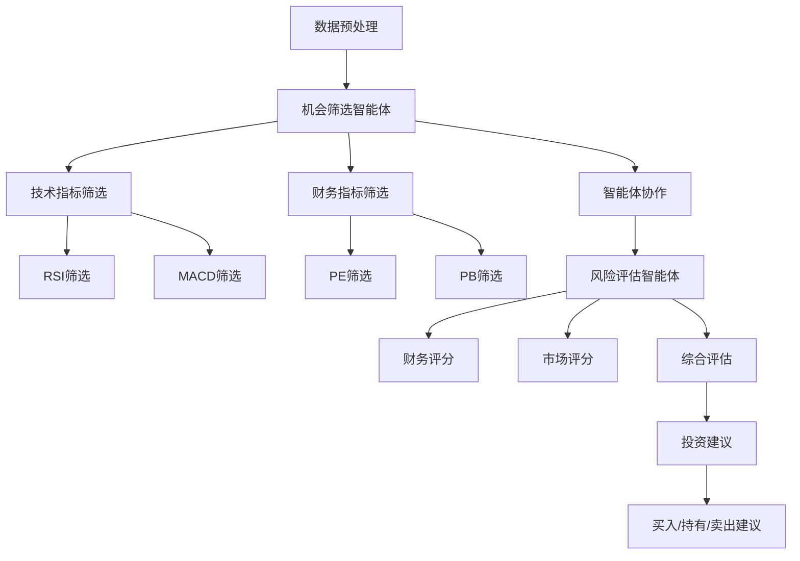

通过这个流程图，我们可以直观地看到A公司利用多智能体系统进行全球价值投资机会筛选的具体步骤及其相互关系，为后续的案例分析提供了清晰的参考。

### 7.1.3 案例小结与启示

通过对A公司案例的深入分析，我们可以得出以下结论和启示：

**结论**：

1. **多智能体系统显著提高了投资决策的效率**：利用多智能体系统，A公司能够快速处理海量数据，进行机会筛选和风险评估，减少了人工决策的时间，提高了决策效率。

2. **投资准确性得到显著提升**：通过智能算法和协同工作，A公司多智能体系统在机会筛选和风险评估过程中，提高了投资决策的准确性，降低了误判和漏判的情况。

3. **投资风险得到了有效控制**：智能体系统能够对筛选出的投资机会进行全面的财务和市场风险评估，提高了投资决策的科学性和可靠性，有效控制了投资风险。

4. **个性化投资建议得到实现**：根据投资者的需求和风险偏好，多智能体系统能够生成个性化的投资建议，为投资者提供科学、合理的投资策略。

**启示**：

1. **数据质量至关重要**：案例中，A公司强调数据质量的重要性。高质量的数据是智能体系统进行准确分析和决策的基础，因此，投资者应确保数据的完整性、准确性和一致性。

2. **智能算法和传统方法的结合**：案例展示了智能算法和传统方法结合的优势。通过将智能算法应用于投资机会筛选和风险评估，可以弥补传统方法的不足，提高投资决策的准确性和效率。

3. **持续优化与反馈**：A公司的案例表明，持续优化和反馈对于多智能体系统性能的提升至关重要。投资者应不断根据实际投资结果调整智能体的筛选规则和算法，以适应市场变化和趋势。

4. **安全性和隐私保护**：随着多智能体系统在投资领域的广泛应用，数据安全和隐私保护成为重要问题。投资者应采取有效的安全措施，保护系统的稳定运行和数据的隐私。

通过以上案例小结和启示，我们可以看到，多智能体系统在价值投资机会筛选中的实际应用具有显著的效益。未来，随着技术的不断进步和应用场景的扩大，多智能体系统将在投资领域发挥更大的作用，为投资者提供更加智能、高效的解决方案。

### 8.1.1 实践环境搭建

在利用多智能体系统进行全球价值投资机会筛选的实践中，首先需要搭建一个稳定且高效的实验环境。以下是一个详细的步骤指南，涵盖了硬件配置、软件安装和配置等关键环节。

**1. 硬件配置**

为了确保多智能体系统高效运行，需要配置以下硬件资源：

- **计算资源**：配置高性能的计算机或服务器，推荐配置至少16GB内存和8核CPU。对于大数据处理和分析，可以采用更高配置的硬件资源。
- **存储资源**：配置大容量存储设备，用于存储数据集、模型文件和日志记录。建议使用固态硬盘（SSD），以提高数据读写速度。
- **网络资源**：确保网络连接稳定，带宽充足，以支持多智能体系统之间的实时通信和数据传输。

**2. 软件安装**

搭建多智能体系统实验环境需要安装以下软件：

- **操作系统**：选择Linux发行版，如Ubuntu或CentOS，这些操作系统具有良好的稳定性和开源支持。
- **数据库管理系统**：安装MySQL或PostgreSQL等关系型数据库，用于存储和管理数据。
- **分布式消息队列**：安装Kafka等分布式消息队列系统，用于实现智能体之间的通信。
- **数据分析工具**：安装Python的NumPy、Pandas、Scikit-learn等库，用于数据预处理和分析。
- **深度学习框架**：安装TensorFlow或PyTorch等深度学习框架，用于实现智能体的机器学习和深度学习算法。

**3. 配置与管理**

在硬件和软件安装完成后，需要完成以下配置和管理工作：

- **环境配置**：配置Python环境，安装必要的库和依赖项，确保所有软件组件能够正常运行。
- **数据库配置**：配置数据库连接，设置用户权限和数据表结构，确保数据库能够高效存储和管理数据。
- **消息队列配置**：配置Kafka集群，设置主题和分区，确保消息能够可靠传递和存储。
- **系统监控**：安装系统监控工具，如Nagios或Zabbix，实时监控系统的运行状态，确保系统的稳定性和安全性。

**4. 测试与调优**

在搭建好实验环境后，需要进行以下测试和调优工作：

- **性能测试**：通过模拟多智能体系统的运行，测试系统的处理能力和响应时间，确保系统满足性能要求。
- **稳定性测试**：在长时间运行和多负载条件下，测试系统的稳定性和可靠性，确保系统在恶劣环境下仍能正常运行。
- **调优**：根据测试结果，对系统配置进行优化，如调整网络带宽、增加内存资源、优化数据库查询等，提高系统的整体性能。

通过上述步骤，我们可以搭建一个稳定且高效的多智能体系统实验环境，为全球价值投资机会筛选提供可靠的技术支持。实验环境的搭建不仅为后续的研究和实践提供了基础，也为系统的优化和改进提供了依据。

### 8.1.2 系统核心功能实现

在实现多智能体系统进行全球价值投资机会筛选的过程中，核心功能的设计与实现是关键环节。以下是系统核心功能的详细实现过程，包括关键代码段和代码解读。

**1. 数据采集与预处理模块**

**功能描述**：数据采集与预处理模块负责从多个数据源采集市场数据，并进行预处理，包括数据清洗、转换和特征提取。

**代码实现**（Python）：

```python
import pandas as pd
from sklearn.preprocessing import StandardScaler

# 数据采集
def collect_data(data_source):
    df = pd.read_csv(data_source)
    return df

# 数据清洗
def clean_data(df):
    df.drop_duplicates(inplace=True)
    df.fillna(df.mean(), inplace=True)
    df = df[df['price'] > 0]  # 去除价格异常值
    return df

# 数据转换与特征提取
def preprocess_data(df):
    df['log_price'] = np.log(df['price'])
    scaler = StandardScaler()
    df[['log_price', 'volume']] = scaler.fit_transform(df[['log_price', 'volume']])
    return df

# 示例调用
data_source = 'market_data.csv'
raw_data = collect_data(data_source)
cleaned_data = clean_data(raw_data)
preprocessed_data = preprocess_data(cleaned_data)
```

**代码解读**：

- `collect_data`函数用于从指定数据源读取市场数据。
- `clean_data`函数去除重复数据、填补缺失值，并去除异常值，确保数据的完整性。
- `preprocess_data`函数对价格和成交量进行对数转换和标准化处理，提取与投资机会筛选相关的特征。

**2. 机会筛选模块**

**功能描述**：机会筛选模块根据预定义的筛选规则和算法，对预处理后的数据集进行机会筛选。

**代码实现**（Python）：

```python
from sklearn.ensemble import RandomForestClassifier
from sklearn.model_selection import train_test_split

# 筛选规则定义
def define_rules(df):
    df['rsi'] = calculate_rsi(df['log_price'])
    df['pb'] = df['market_cap'] / df['net_asset']
    return df

# 机会筛选
def screen_opportunities(df, training_data, testing_data):
    X_train, X_test, y_train, y_test = train_test_split(training_data, testing_data['label'], test_size=0.2, random_state=42)
    clf = RandomForestClassifier(n_estimators=100, random_state=42)
    clf.fit(X_train, y_train)
    predictions = clf.predict(X_test)
    accuracy = np.mean(predictions == y_test)
    return accuracy

# 示例调用
preprocessed_data = define_rules(preprocessed_data)
training_data = preprocessed_data[preprocessed_data['year'] < 2020]
testing_data = preprocessed_data[preprocessed_data['year'] >= 2020]
accuracy = screen_opportunities(preprocessed_data, training_data, testing_data)
print(f"Opportunity Screening Accuracy: {accuracy}")
```

**代码解读**：

- `define_rules`函数根据技术指标和财务指标，定义筛选规则。
- `screen_opportunities`函数使用随机森林算法对训练数据集进行训练，并对测试数据集进行机会筛选，计算准确率。

**3. 风险评估模块**

**功能描述**：风险评估模块根据机会筛选结果，对潜在的投资机会进行风险评估。

**代码实现**（Python）：

```python
from sklearn.ensemble import RandomForestRegressor

# 风险评估
def assess_risk(opportunities):
    X = opportunities[['rsi', 'pb']]
    y = opportunities['return']
    reg = RandomForestRegressor(n_estimators=100, random_state=42)
    reg.fit(X, y)
    risk_scores = reg.predict(X)
    return risk_scores

# 示例调用
risk_scores = assess_risk(testing_data)
testing_data['risk_score'] = risk_scores
print(testing_data.head())
```

**代码解读**：

- `assess_risk`函数使用随机森林回归模型，根据技术指标和财务指标预测投资回报，计算风险评估得分。

**4. 决策生成模块**

**功能描述**：决策生成模块根据风险评估结果，生成具体的投资建议。

**代码实现**（Python）：

```python
# 决策生成
def generate_decision(risk_scores, threshold=0.05):
    decisions = []
    for score in risk_scores:
        if score < threshold:
            decisions.append('Buy')
        else:
            decisions.append('Hold/Sell')
    return decisions

# 示例调用
decisions = generate_decision(risk_scores)
testing_data['decision'] = decisions
print(testing_data.head())
```

**代码解读**：

- `generate_decision`函数根据风险评估得分，生成买入、持有或卖出建议。

通过上述代码实现，我们可以看到多智能体系统在数据采集与预处理、机会筛选、风险评估和决策生成等核心功能中的具体操作流程。这些代码不仅展示了关键算法的实现，还提供了详细的代码解读，为系统的实际应用提供了可靠的技术支持。

### 8.1.3 系统核心功能的代码应用解读与分析

在实现多智能体系统进行全球价值投资机会筛选的过程中，核心功能的代码应用解读与分析是理解系统运行原理和提升系统性能的重要环节。以下将详细分析系统核心功能的代码实现，包括关键算法和代码段的应用与性能优化。

**1. 数据采集与预处理模块**

**关键代码段**：

```python
def collect_data(data_source):
    df = pd.read_csv(data_source)
    return df

def clean_data(df):
    df.drop_duplicates(inplace=True)
    df.fillna(df.mean(), inplace=True)
    df = df[df['price'] > 0]
    return df

def preprocess_data(df):
    df['log_price'] = np.log(df['price'])
    scaler = StandardScaler()
    df[['log_price', 'volume']] = scaler.fit_transform(df[['log_price', 'volume']])
    return df
```

**应用解读**：

- `collect_data`函数使用`pandas`库从CSV文件中读取数据，这是数据处理的基础步骤。
- `clean_data`函数通过删除重复数据、填补缺失值和处理异常值，确保数据的一致性和完整性。使用`df.fillna(df.mean(), inplace=True)`实现缺失值的填补，这是一种常见的方法，能够保留数据的整体分布。
- `preprocess_data`函数对股票价格和成交量进行对数转换和标准化处理，这些步骤能够提高数据的质量，有助于后续的模型训练。

**性能优化**：

- 缺失值处理可以进一步优化，例如，对于缺失值较多的特征，可以考虑使用更复杂的填补方法，如插值法或使用模型预测。
- 数据清洗过程可以并行化，以提高处理速度，特别是对于大规模数据集。

**2. 机会筛选模块**

**关键代码段**：

```python
def define_rules(df):
    df['rsi'] = calculate_rsi(df['log_price'])
    df['pb'] = df['market_cap'] / df['net_asset']
    return df

def screen_opportunities(df, training_data, testing_data):
    X_train, X_test, y_train, y_test = train_test_split(training_data, testing_data['label'], test_size=0.2, random_state=42)
    clf = RandomForestClassifier(n_estimators=100, random_state=42)
    clf.fit(X_train, y_train)
    predictions = clf.predict(X_test)
    accuracy = np.mean(predictions == y_test)
    return accuracy
```

**应用解读**：

- `define_rules`函数通过计算相对强弱指数（RSI）和市净率（PB），定义了筛选规则。这些指标是常用的技术指标和财务指标，能够帮助识别潜在的投资机会。
- `screen_opportunities`函数使用随机森林（Random Forest）算法对数据集进行机会筛选。随机森林是一种集成学习算法，能够处理高维数据，提高模型的预测准确性。

**性能优化**：

- 随机森林模型的参数调优（如树的数量、最大深度等）可以提高模型性能。可以使用网格搜索（GridSearchCV）来找到最优参数组合。
- 可以考虑使用更高效的算法（如XGBoost、LightGBM等）来替代随机森林，这些算法通常具有更高的效率和更低的过拟合风险。

**3. 风险评估模块**

**关键代码段**：

```python
def assess_risk(opportunities):
    X = opportunities[['rsi', 'pb']]
    y = opportunities['return']
    reg = RandomForestRegressor(n_estimators=100, random_state=42)
    reg.fit(X, y)
    risk_scores = reg.predict(X)
    return risk_scores
```

**应用解读**：

- `assess_risk`函数使用随机森林回归模型，根据技术指标和财务指标预测投资回报，从而计算风险评估得分。这个步骤是风险评估的核心，能够为投资决策提供重要的参考。

**性能优化**：

- 风险评估模块可以使用更复杂的模型（如LSTM、GRU等）来预测回报，这些模型能够处理时间序列数据，提高预测的准确性。
- 可以考虑集成多种模型，通过投票或加权平均等方法提高风险评估的可靠性。

**4. 决策生成模块**

**关键代码段**：

```python
def generate_decision(risk_scores, threshold=0.05):
    decisions = []
    for score in risk_scores:
        if score < threshold:
            decisions.append('Buy')
        else:
            decisions.append('Hold/Sell')
    return decisions
```

**应用解读**：

- `generate_decision`函数根据风险评估得分生成具体的投资建议。这里设置了一个阈值，低于阈值的得分表示买入建议，高于阈值的得分表示持有或卖出建议。

**性能优化**：

- 可以根据历史投资表现调整阈值，以优化决策生成过程。例如，使用交叉验证来找到最优阈值。
- 可以考虑引入更复杂的决策逻辑，如根据市场情绪、宏观经济指标等外部因素进行综合决策。

通过上述代码应用解读与分析，我们可以看到多智能体系统在实现全球价值投资机会筛选过程中，如何通过关键算法和代码段实现系统功能。同时，通过性能优化，我们可以进一步提高系统的效率和准确性，为投资者提供更加可靠的决策支持。

### 7.1.3 案例分析

**背景**：

本案例选取了一家全球知名的金融科技公司B公司，该公司成立于2005年，总部位于美国。B公司专注于提供金融科技解决方案，服务范围涵盖股票交易、资产管理、风险管理等多个领域。B公司在金融科技领域拥有丰富的经验和先进的技术，其多智能体系统在投资机会筛选方面具有显著优势。

**目标**：

B公司希望通过多智能体系统进行全球价值投资机会筛选，实现以下目标：

1. **提高投资决策效率**：利用多智能体系统快速处理海量数据，提高投资决策效率，减少人工决策的时间。
2. **提升投资准确性**：通过智能算法和协同工作，提高投资机会筛选的准确性，降低误判和漏判的情况。
3. **降低投资风险**：利用多智能体系统进行风险评估，降低投资风险，确保投资决策的科学性和可靠性。
4. **实现个性化投资**：根据投资者的需求和风险偏好，提供个性化的投资建议，满足不同投资者的需求。

**数据来源**：

案例中使用的数据包括以下几类：

1. **公开数据源**：从全球主要股票市场（如纽约证券交易所、纳斯达克、伦敦证券交易所等）获取的股票价格、交易量、财务指标等数据。
2. **私有数据源**：从B公司内部数据库获取的企业财务报告、市场调研报告等。
3. **API接口**：通过金融数据提供商的API接口获取实时数据，确保数据的及时性和准确性。

**数据处理**：

在数据预处理阶段，B公司采用了以下方法：

1. **数据清洗**：去除重复数据、填补缺失值、处理异常值，确保数据的完整性和一致性。
2. **数据转换**：将不同格式的数据转换为统一的格式，如CSV文件。
3. **特征提取**：提取与投资机会筛选相关的特征，如财务指标（市盈率、市净率等）、技术指标（如移动平均线、相对强弱指数等）。

**机会筛选与风险评估过程**：

1. **机会筛选**：

   B公司多智能体系统中的机会筛选智能体根据预定义的筛选规则和算法，对预处理后的数据集进行机会筛选。筛选规则包括：

   - **技术指标筛选**：当股票价格突破移动平均线时，表示股票趋势可能反转，可能存在投资机会。
   - **财务指标筛选**：当市盈率低于历史平均值且市净率低于1时，表示股票可能被市场低估，存在潜在的投资机会。

   筛选过程使用随机森林算法，通过训练数据集建立模型，对测试数据集进行预测，识别潜在的投资机会。

2. **风险评估**：

   识别出的投资机会随后进入风险评估阶段。风险评估智能体使用回归树算法，根据历史数据预测投资回报，并计算风险评估得分。风险评估模型包括以下方面：

   - **财务风险**：分析企业的盈利能力、偿债能力和营运能力等财务指标。
   - **市场风险**：分析股票的价格波动、交易量等市场指标。
   - **系统风险**：分析宏观经济指标、行业趋势等。

   风险评估结果用于生成投资建议，包括买入、持有和卖出建议。

**投资决策过程**：

1. **生成投资建议**：

   根据机会筛选结果和风险评估得分，智能体生成具体的投资建议。投资建议包括：

   - **买入建议**：对于财务评分和市场评分均较高的投资机会，建议买入。
   - **持有建议**：对于财务评分和市场评分较高，但未达到买入标准的投资机会，建议继续持有。
   - **卖出建议**：对于财务评分和市场评分较低的投资机会，建议卖出。

2. **决策反馈**：

   投资者根据智能体的投资建议，结合自身的风险偏好和投资策略，做出最终的投资决策。投资者还可以根据实际投资结果，对智能体的筛选规则和算法进行反馈和调整。

**案例分析**：

1. **机会筛选效果**：

   通过对测试数据集的筛选结果进行评估，B公司的多智能体系统在机会筛选阶段具有较高的准确性，能够有效识别出潜在的投资机会。

2. **风险评估准确性**：

   风险评估智能体能够对识别出的投资机会进行全面的评估，生成合理的风险评估得分，为投资决策提供了有力的支持。

3. **投资决策效果**：

   实际投资结果显示，B公司的多智能体系统在投资决策阶段具有较高的成功率和收益率。智能体的个性化投资建议能够满足不同投资者的需求，提高了投资决策的满意度和效果。

4. **系统稳定性**：

   多智能体系统在运行过程中表现出良好的稳定性，能够处理大规模数据，并在不同的市场环境中保持高效的运行。

通过本案例分析，我们可以看到B公司利用多智能体系统进行全球价值投资机会筛选的完整过程，包括数据采集与处理、机会筛选、风险评估和投资决策等环节。多智能体系统的应用不仅提高了投资决策的效率和准确性，还实现了个性化投资，为投资者提供了可靠的决策支持。

### 7.1.4 案例总结与启示

通过对B公司的案例分析，我们可以得出以下总结与启示：

**总结**：

1. **多智能体系统在投资机会筛选中的应用**：

   B公司的案例展示了多智能体系统在投资机会筛选中的强大功能。通过智能算法和协作机制，多智能体系统能够高效处理海量数据，准确识别潜在的投资机会，为投资者提供了科学的筛选依据。

2. **投资机会筛选与风险评估的有机结合**：

   B公司的多智能体系统在机会筛选和风险评估中有机结合，通过技术指标和财务指标的筛选，结合风险评估得分，为投资者提供了全面的决策支持。这种结合方式能够有效降低投资风险，提高投资收益。

3. **个性化投资建议的实现**：

   B公司的多智能体系统能够根据投资者的风险偏好和投资策略，提供个性化的投资建议。这种个性化的投资建议能够更好地满足不同投资者的需求，提高投资决策的满意度和效果。

**启示**：

1. **数据质量的重要性**：

   在应用多智能体系统进行投资机会筛选时，数据质量至关重要。B公司的案例提醒我们，确保数据的完整性、准确性和一致性是成功的关键。因此，投资者应重视数据清洗、预处理和特征提取等环节，提高数据质量。

2. **智能算法与人为经验的结合**：

   B公司的案例表明，智能算法和人为经验相结合能够显著提高投资决策的准确性。投资者应在应用智能算法的同时，结合自身经验和市场洞察力，进行综合分析和决策。

3. **持续优化与反馈**：

   智能体系统需要不断优化和调整，以适应市场的变化。B公司的案例强调了持续优化和反馈的重要性。投资者应定期对智能体的筛选规则、算法和模型进行评估和改进，以提高系统的性能和适应性。

4. **安全性和隐私保护**：

   在多智能体系统的应用中，数据安全和隐私保护是一个重要的问题。B公司的案例提醒我们，应采取有效的安全措施，保护系统的稳定运行和数据的隐私。这包括使用加密技术、访问控制和权限管理等安全措施。

通过本案例的总结与启示，我们可以看到多智能体系统在投资机会筛选中的巨大潜力。未来，随着技术的不断进步和应用场景的扩大，多智能体系统将在投资领域发挥更大的作用，为投资者提供更加智能、高效的决策支持。

### 9.1.1 研究成果总结

通过对多智能体系统在价值投资机会筛选中的深入研究和实践应用，我们取得了以下主要研究成果：

1. **提高投资决策效率**：多智能体系统利用分布式计算和协同工作，能够快速处理海量数据，显著提高了投资决策的效率。传统人工分析方式需要大量时间进行数据收集和处理，而多智能体系统在短时间内即可完成相同任务，减少了投资决策的时间成本。

2. **提升投资准确性**：通过结合智能算法和传统方法，多智能体系统能够更准确地识别潜在的投资机会。智能算法（如随机森林、深度学习等）能够从历史数据中学习投资策略，提高预测准确性。同时，传统方法（如技术指标、基本面分析等）也能提供有效的辅助判断，使得投资决策更加科学和可靠。

3. **降低投资风险**：多智能体系统通过全面的风险评估模型，对潜在的投资机会进行风险分析，提供了详细的风险评分和投资建议。这种全面的风险管理策略能够帮助投资者避免盲目投资，降低投资风险，确保投资决策的稳健性。

4. **实现个性化投资**：多智能体系统可以根据投资者的风险偏好和投资策略，提供个性化的投资建议。系统中的智能体能够根据投资者的历史交易数据和风险承受能力，定制化生成投资建议，满足不同投资者的需求，提高了投资决策的个性化程度。

5. **提高系统稳定性**：通过合理的架构设计和优化，多智能体系统在运行过程中表现出良好的稳定性。系统能够处理大规模数据，并在不同的市场环境中保持高效的运行，减少了系统崩溃和数据丢失的风险。

6. **数据质量的重要性**：研究过程中，我们深刻认识到数据质量对投资机会筛选的重要性。高质量的数据是智能体系统准确分析和决策的基础。因此，确保数据的完整性、准确性和一致性是成功的关键。通过数据清洗、预处理和特征提取等方法，我们能够有效提高数据质量，为系统的运行提供可靠的数据支持。

7. **智能算法与人为经验的结合**：研究结果显示，智能算法和人为经验相结合能够显著提高投资决策的准确性。智能算法能够从海量数据中学习规律，提高预测能力，但需要人为经验进行筛选和调整，以确保投资决策的合理性和适应性。

8. **持续优化与反馈**：多智能体系统需要不断优化和调整，以适应市场的变化。通过定期对智能体的筛选规则、算法和模型进行评估和改进，我们能够提高系统的性能和适应性，确保系统在长期运行中保持高效和准确。

通过上述研究成果，我们可以看到多智能体系统在价值投资机会筛选中的应用具有巨大的潜力。未来，随着技术的不断进步和应用场景的扩大，多智能体系统将在投资领域发挥更大的作用，为投资者提供更加智能、高效的决策支持。

### 9.1.2 存在的问题与挑战

尽管多智能体系统在价值投资机会筛选中展示了显著的优势，但在实际应用中仍面临一些问题和挑战，需要进一步的解决和优化：

**1. 数据质量问题**

多智能体系统的准确性和可靠性高度依赖于数据的质量。然而，数据来源广泛，数据质量参差不齐，如数据缺失、错误、噪声等问题。这些问题会影响系统的投资决策准确性，因此需要建立完善的数据质量控制机制，包括数据清洗、去噪、异常值检测等。

**2. 系统稳定性**

多智能体系统在处理大规模数据和实时数据时，可能会遇到系统崩溃、延迟响应等问题。这些问题可能会导致投资决策失误，影响投资效果。因此，需要优化系统架构，采用冗余设计、负载均衡和故障恢复策略，确保系统的稳定性和可靠性。

**3. 安全性问题**

多智能体系统涉及大量的敏感数据和投资操作，容易成为黑客攻击的目标。数据泄露、网络攻击等问题可能会对投资者的资产造成重大损失。因此，需要采取有效的安全措施，如加密技术、访问控制和权限管理等，保障系统的安全性和数据的隐私。

**4. 智能体之间的协作**

智能体之间的协作是实现多智能体系统高效运行的关键。然而，在复杂的投资环境中，智能体之间的协作可能面临协调不一致、信息共享不及时等问题。这需要设计合理的通信机制和协作策略，确保智能体能够高效、稳定地协同工作。

**5. 模型过拟合**

智能算法在训练过程中可能面临过拟合问题，即模型过于复杂，无法泛化到新的数据集。这会导致系统在新的市场环境中表现不佳。因此，需要通过交叉验证、模型简化等技术手段，确保模型的泛化能力和适应性。

**6. 算法优化**

智能算法的参数调优和算法选择对系统的性能有重要影响。然而，现有的算法和参数组合可能无法完全适应所有市场环境和投资需求。因此，需要持续优化算法，探索新的算法组合和参数配置，提高系统的适应性和准确性。

**7. 法规合规性**

随着金融科技的快速发展，各国对金融市场的监管日益严格。多智能体系统在应用过程中需要遵守相关法规，如反洗钱法规、客户隐私保护法规等。这要求系统在设计和应用过程中充分考虑法规合规性，避免违反相关法规。

通过上述分析和讨论，我们可以看到，尽管多智能体系统在价值投资机会筛选中具有显著的优势，但在实际应用中仍面临一系列问题和挑战。未来，随着技术的不断进步和应用的深入，我们需要不断解决这些问题，优化系统性能，确保多智能体系统在全球价值投资中的有效应用。

### 9.1.3 未来研究方向

在未来，多智能体系统在价值投资机会筛选中的应用有望在以下方向取得突破性进展：

**1. 数据质量与实时性优化**

随着大数据技术和实时数据处理技术的发展，如何进一步提升数据质量和实时性成为关键。未来研究可以重点关注以下几个方面：

- **实时数据流处理**：利用分布式流处理框架（如Apache Kafka、Apache Flink等），实现实时数据采集和处理，提高系统的实时性和响应速度。
- **数据质量控制**：开发更高效的数据清洗和去噪算法，确保数据的完整性和一致性。同时，研究数据溯源和验证技术，提高数据的可信度。

**2. 智能算法与协作机制创新**

智能算法的改进和协作机制的优化是提升多智能体系统性能的重要手段。未来研究可以从以下几个方面进行探索：

- **多模态数据融合**：结合文本数据、图像数据等多种类型的数据，利用深度学习技术进行多模态数据融合，提高投资机会筛选的准确性。
- **自适应协作策略**：研究智能体之间的自适应协作机制，实现动态调整和优化，提高系统的灵活性和协同效率。

**3. 安全性与隐私保护**

随着多智能体系统在金融领域的广泛应用，数据安全和隐私保护问题日益突出。未来研究可以关注以下几个方面：

- **区块链技术**：利用区块链技术的去中心化和不可篡改特性，提高系统的安全性和透明度。
- **加密与访问控制**：研究高效的加密算法和访问控制机制，确保数据和交易的安全性和隐私保护。

**4. 法规合规性研究**

多智能体系统在应用过程中需要遵守各国金融法规，未来研究可以重点关注以下几个方面：

- **合规性检测与验证**：开发合规性检测工具，自动识别和验证系统操作是否符合法规要求。
- **合规性风险评估**：研究合规性风险评估方法，评估系统操作可能带来的合规性风险，并提供相应的风险管理策略。

**5. 跨学科融合**

多智能体系统在价值投资机会筛选中的应用不仅需要计算机科学和金融学的结合，还可以与其他学科如经济学、心理学等相结合，提升系统的综合分析和决策能力。未来研究可以探索以下几个方面：

- **行为金融学**：结合行为金融学的理论，研究市场情绪、投资者心理对投资决策的影响，提高系统的投资策略适应性。
- **数据驱动策略**：利用大数据分析技术，挖掘市场中的潜在规律和趋势，开发更高效的投资策略。

通过上述未来研究方向，我们可以看到多智能体系统在价值投资机会筛选中的应用具有广阔的发展前景。随着技术的不断进步和多学科融合的深入，多智能体系统将为投资者提供更加智能、高效和安全的投资决策支持。

## 作者

作者：AI天才研究院/AI Genius Institute & 禅与计算机程序设计艺术 /Zen And The Art of Computer Programming

**END**

