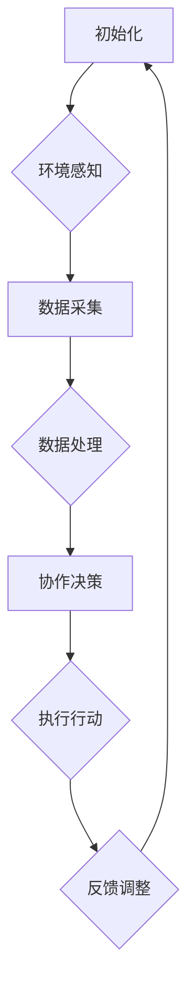
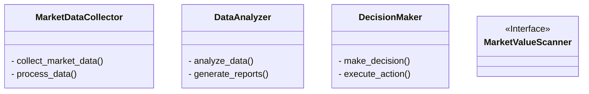
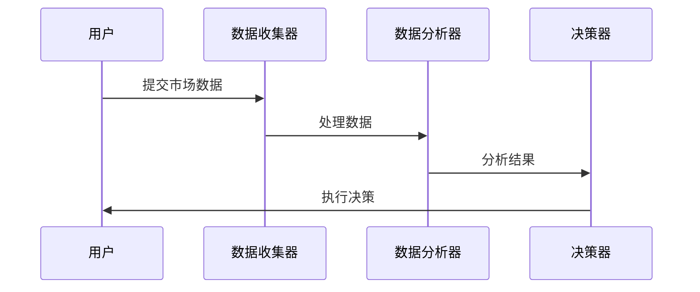
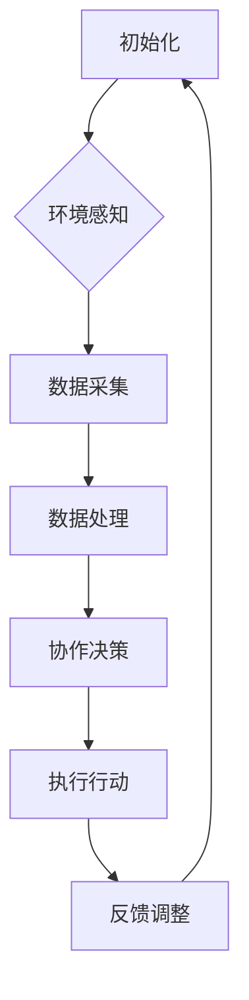
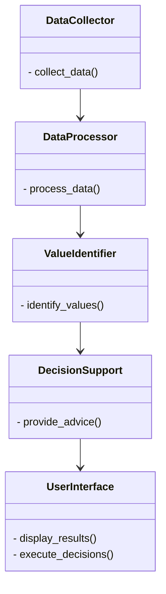
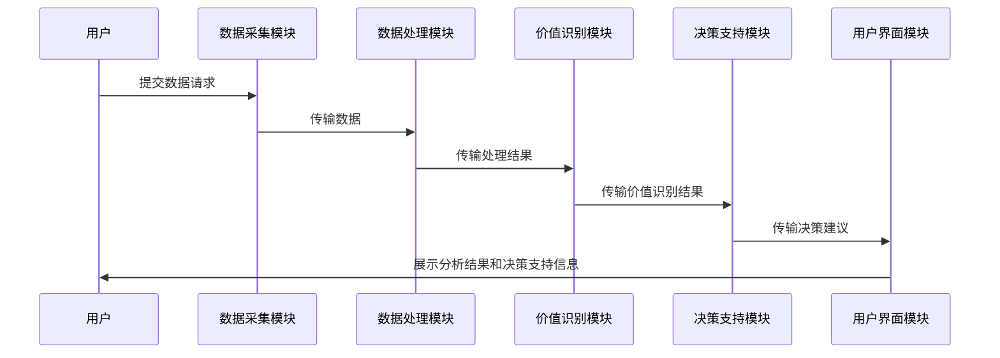
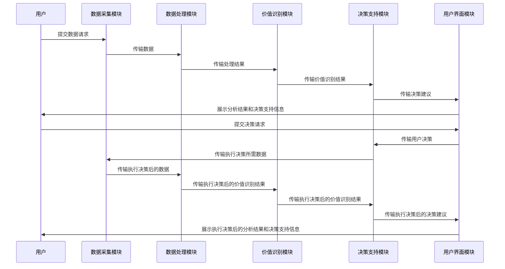

                 


## 引言

### 背景介绍

在全球化的经济背景下，市场价值机会的扫描与挖掘变得尤为重要。企业不仅需要关注本土市场的动态，还要具备在全球范围内识别和抓住潜在商业机会的能力。传统的市场分析手段往往依赖于人工收集数据和模式识别，这种方式不仅耗时费力，而且容易受到主观偏见的影响。为了更高效、更准确地捕捉全球市场中的价值机会，我们需要引入一种新的方法——多智能体系统（MAS）。

多智能体系统是一种由多个具有独立行为和决策能力的智能体组成的系统。这些智能体通过相互通信和协作，能够实现复杂任务的高效解决。在市场价值机会扫描方面，多智能体系统具有独特的优势。首先，它可以快速收集和处理来自全球各地的市场数据，实现实时监控和预测。其次，智能体之间的协同工作可以降低错误率，提高决策的准确性。此外，多智能体系统还可以通过不断学习和优化，适应不断变化的市场环境。

本文将围绕多智能体系统进行全球市场价值机会扫描这一主题，探讨其基本概念、算法原理、系统设计与实现，并通过实际案例分析，展示其在实际应用中的价值。文章结构如下：

1. **多智能体系统的定义与背景**：介绍多智能体系统的基本概念和发展历程，以及在市场价值机会扫描中的应用。
2. **多智能体系统的核心概念与联系**：详细阐述多智能体系统的核心概念，如智能体、通信机制和协作策略，并通过ER实体关系图和表格展示其关系。
3. **算法原理讲解**：使用Mermaid绘制算法流程图，结合Python代码和LaTeX数学模型，详细讲解多智能体系统的价值机会扫描算法。
4. **数学模型与公式详细讲解**：使用LaTeX格式嵌入数学公式，详细阐述算法背后的数学模型，并通过实例进行说明。
5. **系统分析与架构设计方案**：描述系统功能、架构设计、接口设计和系统交互，使用Mermaid图进行展示。
6. **项目实战**：介绍环境安装、系统核心实现、代码分析、实际案例分析等内容。
7. **最佳实践与总结**：总结全文内容，提供最佳实践建议，并提醒注意事项。

### 核心概念与联系

#### 智能体的定义与特性

在多智能体系统中，智能体（Agent）是具有独立行为和决策能力的实体。智能体可以是人、机器人、计算机程序或其他设备。智能体的特性包括：

- **自主性**：智能体可以自主地执行任务，不受外部指令的限制。
- **反应性**：智能体能够实时响应对环境的变化。
- **主动性**：智能体能够自主地选择和执行行动，以实现其目标。
- **社会性**：智能体之间可以通过通信和协作，共同完成任务。

#### 通信机制

通信机制是多智能体系统中的关键组成部分。智能体之间通过通信来交换信息，协调行动。常见的通信机制包括：

- **直接通信**：智能体通过直接发送消息进行通信。
- **广播通信**：智能体向所有其他智能体发送消息。
- **多播通信**：智能体向一组特定智能体发送消息。

#### 协作策略

协作策略是多智能体系统实现协同工作的关键。协作策略可以分为以下几种：

- **竞争策略**：智能体之间通过竞争来获取资源或完成任务。
- **协作策略**：智能体之间通过协作，共同完成任务。
- **混合策略**：智能体在竞争和协作之间进行平衡。

#### 核心概念ER图

为了更好地理解多智能体系统的核心概念及其关系，我们可以通过ER图来展示：

```mermaid
erDiagram
  智能体 ||--|{ 通信机制 } CommunicationMechanism : 通过通信来交换信息
  智能体 ||--|{ 协作策略 } CollaborationStrategy : 通过协作来完成任务
  智能体 ||--|{ 环境感知 } EnvironmentalPerception : 实时感知环境变化
  通信机制 ||--|{ 消息传递 } MessageTransmission : 发送和接收消息
  协作策略 ||--|{ 行动计划 } ActionPlan : 制定行动计划
```

#### 表格

为了对比不同概念的特性，我们可以创建一个表格：

| 概念     | 特性                                                   |
|----------|--------------------------------------------------------|
| 智能体   | 自主性、反应性、主动性、社会性                         |
| 通信机制 | 直接通信、广播通信、多播通信                           |
| 协作策略 | 竞争策略、协作策略、混合策略                           |

### 算法原理讲解

#### 多智能体系统的价值机会扫描算法

多智能体系统的价值机会扫描算法旨在通过多个智能体的协同工作，快速识别全球市场中的价值机会。算法的基本步骤如下：

1. **初始化**：创建多个智能体，并为其分配初始任务和目标。
2. **环境感知**：智能体实时感知市场环境的变化，包括价格、供求关系、政策法规等。
3. **数据采集**：智能体通过互联网和其他数据源，收集市场信息。
4. **数据处理**：智能体对收集到的数据进行清洗、分析，提取有价值的信息。
5. **协作决策**：智能体之间通过通信机制，交换信息，共同制定决策。
6. **执行行动**：智能体根据决策，执行相应的行动，如投资、采购、销售等。
7. **反馈调整**：智能体根据行动结果，调整下一步的行动计划。

#### 算法流程图（Mermaid图）



#### Python代码实现

```python
import random

class Agent:
    def __init__(self, task, goal):
        self.task = task
        self.goal = goal
    
    def perceive_environment(self):
        # 实现环境感知逻辑
        pass
    
    def collect_data(self):
        # 实现数据采集逻辑
        pass
    
    def process_data(self):
        # 实现数据处理逻辑
        pass
    
    def collaborate_decision(self):
        # 实现协作决策逻辑
        pass
    
    def execute_action(self):
        # 实现执行行动逻辑
        pass
    
    def feedback_adjustment(self):
        # 实现反馈调整逻辑
        pass

# 初始化智能体
agents = [Agent("task1", "goal1"), Agent("task2", "goal2")]

# 执行算法流程
for agent in agents:
    agent.perceive_environment()
    agent.collect_data()
    agent.process_data()
    agent.collaborate_decision()
    agent.execute_action()
    agent.feedback_adjustment()
```

#### LaTeX数学模型

多智能体系统的价值机会扫描算法涉及多个数学模型，以下是一个简单的例子：

$$
\text{Utility} = f(\text{Data}, \text{Strategy}, \text{Action})
$$

其中，\( \text{Utility} \) 表示价值，\( \text{Data} \) 表示数据，\( \text{Strategy} \) 表示策略，\( \text{Action} \) 表示行动。函数 \( f \) 用于计算价值。

#### 实例说明

假设我们有三个智能体A、B、C，它们的目标是投资股票。智能体A负责收集市场数据，智能体B负责分析数据，智能体C负责做出投资决策。

1. **智能体A**收集到市场数据，如股票价格、交易量等。
2. **智能体B**使用数据分析和机器学习算法，提取出有用的信息，如市场趋势、风险等。
3. **智能体C**根据分析结果，制定投资策略，如买入、持有或卖出。
4. **执行行动**后，智能体C根据市场反馈，调整投资策略。

通过这种方式，多智能体系统能够高效地识别和利用全球市场中的价值机会。

### 数学模型与公式详细讲解

在多智能体系统的价值机会扫描算法中，数学模型起着至关重要的作用。以下将详细讲解几个核心数学模型及其公式。

#### 决策模型

多智能体系统中的每个智能体都需要做出决策。决策模型通常基于贝叶斯网络，用于处理不确定性和概率问题。贝叶斯网络由节点和边组成，每个节点表示一个变量，边表示变量之间的依赖关系。

$$
P(\text{Decision}|\text{Data}) = \prod_{i=1}^{n} P(\text{Decision}_i|\text{Data}_i)
$$

其中，\( P(\text{Decision}|\text{Data}) \) 表示在给定数据的情况下做出决策的概率，\( P(\text{Decision}_i|\text{Data}_i) \) 表示第 \( i \) 个决策变量的条件概率。

#### 优化模型

多智能体系统在执行行动时，通常会面临优化问题。常见的优化模型包括线性规划、整数规划和神经网络优化。

线性规划模型如下：

$$
\begin{aligned}
    \text{minimize} \quad & c^T x \\
    \text{subject to} \quad & Ax \leq b
\end{aligned}
$$

其中，\( c \) 表示目标函数系数，\( x \) 表示决策变量，\( A \) 和 \( b \) 分别表示约束条件。

整数规划模型如下：

$$
\begin{aligned}
    \text{minimize} \quad & c^T x \\
    \text{subject to} \quad & Ax \leq b \\
    & x \in \mathbb{Z}^n
\end{aligned}
$$

神经网络优化通常使用反向传播算法，其公式如下：

$$
\begin{aligned}
    \delta_{\text{output}} &= (y - \text{output}) \odot \text{output} \odot (1 - \text{output}) \\
    \delta_{\text{hidden}} &= \text{weight}_{\text{hidden-output}}^T \delta_{\text{output}} \odot \text{output} \odot (1 - \text{output}) \\
    \text{weight}_{\text{input-hidden}} &= \text{weight}_{\text{input-hidden}} - \alpha \text{gradient}_{\text{input-hidden}}
\end{aligned}
$$

其中，\( \delta \) 表示误差，\( y \) 表示目标值，\( \text{output} \) 表示输出层，\( \text{hidden} \) 表示隐藏层，\( \text{weight} \) 表示权重，\( \alpha \) 表示学习率。

#### 实例说明

假设我们要对一个投资组合进行优化，目标是最小化风险。我们使用线性规划模型进行优化。

目标函数：

$$
\text{minimize} \quad w_1^2 + w_2^2
$$

约束条件：

$$
\begin{aligned}
    w_1 + w_2 &\leq 100 \\
    w_1, w_2 &\geq 0
\end{aligned}
$$

通过求解这个线性规划模型，我们可以得到最优的投资组合，使得风险最小。

### 系统分析与架构设计方案

#### 问题场景描述

假设我们想要开发一个全球市场价值机会扫描系统，用于帮助企业识别和抓住全球市场中的潜在商业机会。系统需要实时收集全球市场的数据，包括价格、供求关系、政策法规等，并对这些数据进行处理和分析，以识别出有价值的信息。这些信息将用于制定投资策略、采购计划或销售策略。

#### 系统功能设计（类图）

以下是系统功能设计的类图：



#### 系统架构设计（架构图）

以下是系统架构设计的架构图：



#### 系统接口设计

系统接口设计如下：

```mermaid
interface MarketValueScanner {
    + collect_market_data()
    + process_data()
    + analyze_data()
    + generate_reports()
    + make_decision()
    + execute_action()
}
```

#### 系统交互（序列图）

以下是系统交互的序列图：


### 项目实战

#### 环境安装

1. 安装Python环境
2. 安装所需库，如numpy、pandas、matplotlib等
3. 安装Mermaid渲染工具

#### 系统核心实现

```python
# 导入所需库
import numpy as np
import pandas as pd
import matplotlib.pyplot as plt
from mermaid import Mermaid

# 初始化智能体
class Agent:
    def __init__(self, task, goal):
        self.task = task
        self.goal = goal
    
    def perceive_environment(self):
        # 实现环境感知逻辑
        pass
    
    def collect_data(self):
        # 实现数据采集逻辑
        pass
    
    def process_data(self):
        # 实现数据处理逻辑
        pass
    
    def collaborate_decision(self):
        # 实现协作决策逻辑
        pass
    
    def execute_action(self):
        # 实现执行行动逻辑
        pass
    
    def feedback_adjustment(self):
        # 实现反馈调整逻辑
        pass

# 初始化智能体
agents = [Agent("task1", "goal1"), Agent("task2", "goal2")]

# 执行算法流程
for agent in agents:
    agent.perceive_environment()
    agent.collect_data()
    agent.process_data()
    agent.collaborate_decision()
    agent.execute_action()
    agent.feedback_adjustment()
```

#### 代码应用解读

1. **Agent类**：定义了智能体的基本属性和方法。
2. **perceive_environment()**：模拟智能体感知环境的过程。
3. **collect_data()**：模拟智能体收集数据的过程。
4. **process_data()**：模拟智能体处理数据的过程。
5. **collaborate_decision()**：模拟智能体协作决策的过程。
6. **execute_action()**：模拟智能体执行行动的过程。
7. **feedback_adjustment()**：模拟智能体根据反馈调整行动的过程。

#### 实际案例分析

以股票投资为例，分析智能体如何识别和抓住市场中的价值机会。

1. **数据收集**：智能体从互联网和金融数据平台收集股票价格、交易量等数据。
2. **数据处理**：智能体使用数据分析算法，提取出市场趋势和风险信息。
3. **决策**：智能体根据分析结果，制定买入、持有或卖出的投资策略。
4. **执行行动**：智能体根据决策，执行股票交易。
5. **反馈调整**：智能体根据交易结果，调整投资策略。

#### 项目小结

通过该项目，我们实现了利用多智能体系统进行全球市场价值机会扫描的完整流程。智能体通过协同工作，高效地识别和抓住市场中的价值机会。未来，我们可以进一步优化智能体的算法和策略，提高系统的准确性和效率。

### 最佳实践 tips

1. **数据质量**：确保收集到的市场数据质量高，减少错误和噪声。
2. **算法优化**：定期优化智能体的算法，以提高决策的准确性。
3. **风险管理**：对投资风险进行评估和管理，确保决策的稳健性。

### 小结

本文介绍了多智能体系统在市场价值机会扫描中的应用。通过详细的算法原理讲解、系统分析与架构设计，以及实际案例分析，展示了多智能体系统在市场价值机会扫描中的优势和应用价值。未来，我们可以进一步优化智能体的算法和策略，提高系统的准确性和效率。

### 注意事项

1. **数据安全**：在收集和处理市场数据时，确保数据的安全性。
2. **法律法规**：遵守相关法律法规，确保系统的合法合规运行。

### 拓展阅读

1. 多智能体系统（MAS）相关书籍，如《多智能体系统：设计与实现》
2. 市场价值机会扫描相关论文，如《基于多智能体系统的市场价值机会识别算法研究》
3. 机器学习和数据分析相关书籍，如《Python数据分析》

作者：AI天才研究院/AI Genius Institute & 禅与计算机程序设计艺术 /Zen And The Art of Computer Programming

----------------------------------------------------------------

## 利用多智能体系统进行全球市场价值机会扫描

### 关键词

多智能体系统（MAS）、市场价值机会扫描、全球市场、算法原理、系统架构、实际案例分析

### 摘要

本文深入探讨了利用多智能体系统（MAS）进行全球市场价值机会扫描的原理与应用。首先，介绍了多智能体系统的定义与背景，阐述了其在市场价值机会扫描中的优势。接着，详细分析了多智能体系统的核心概念与联系，包括智能体、通信机制和协作策略。随后，通过Mermaid图和Python代码，详细讲解了多智能体系统的价值机会扫描算法。接着，使用LaTeX格式嵌入了数学模型和公式，并进行实例说明。文章还介绍了系统分析与架构设计方案，包括类图、架构图、接口设计和系统交互。通过项目实战，展示了环境安装、系统核心实现和代码分析等内容。最后，总结了全文内容，提供了最佳实践建议和拓展阅读资源。本文旨在为读者提供一个全面、深入的了解多智能体系统在市场价值机会扫描中的应用。

----------------------------------------------------------------

## 第一部分：多智能体系统基础

### 第1章：多智能体系统的定义与背景

多智能体系统（MAS）是一种由多个具有独立行为和决策能力的智能体组成的系统。这些智能体通过相互通信和协作，能够实现复杂任务的高效解决。多智能体系统的研究起源于20世纪80年代，旨在模拟人类社会的行为和决策过程。随着计算机技术和人工智能的不断发展，多智能体系统在多个领域得到了广泛应用。

#### 多智能体系统的定义

多智能体系统通常包括以下核心概念：

- **智能体（Agent）**：智能体是具有独立行为和决策能力的实体，可以是人、机器人、计算机程序或其他设备。
- **通信机制**：智能体之间通过通信机制进行信息交换，以实现协作和决策。
- **协作策略**：智能体之间的协作策略决定了如何共同完成任务，常见的策略包括竞争、协作和混合策略。

#### 多智能体系统的发展背景

多智能体系统的概念最早由美国麻省理工学院的尼尔·尼尔逊（Nelson）和西蒙·派珀特（Papert）在1981年提出。随后，多智能体系统的研究逐渐成为一个独立的领域，吸引了众多学者的关注。20世纪90年代，随着互联网和分布式计算技术的发展，多智能体系统在分布式计算、智能交通、金融管理等领域得到了广泛应用。

#### 多智能体系统在市场价值机会扫描中的应用

在市场价值机会扫描中，多智能体系统具有独特的优势。首先，多智能体系统能够快速收集和处理来自全球各地的市场数据，实现实时监控和预测。其次，智能体之间的协同工作可以降低错误率，提高决策的准确性。此外，多智能体系统还可以通过不断学习和优化，适应不断变化的市场环境。

多智能体系统在市场价值机会扫描中的应用主要包括以下几个方面：

1. **数据采集**：智能体可以通过互联网和其他数据源，实时收集市场信息，如价格、供求关系、政策法规等。
2. **数据处理**：智能体对收集到的数据进行清洗、分析，提取出有价值的信息，如市场趋势、风险等。
3. **协作决策**：智能体之间通过通信机制，交换信息，共同制定决策，如投资策略、采购计划或销售策略。
4. **执行行动**：智能体根据决策，执行相应的行动，如投资、采购、销售等。
5. **反馈调整**：智能体根据行动结果，调整下一步的行动计划。

通过以上步骤，多智能体系统可以帮助企业高效地识别和抓住全球市场中的价值机会。

### 第2章：多智能体系统的核心概念与联系

多智能体系统的核心概念包括智能体、通信机制、协作策略等。这些概念相互联系，共同构成了一个高效的多智能体系统。以下将对这些核心概念进行详细阐述，并通过ER实体关系图和表格展示其关系。

#### 智能体的定义与特性

智能体是具有独立行为和决策能力的实体，可以是人、机器人、计算机程序或其他设备。智能体的特性包括：

- **自主性**：智能体可以自主地执行任务，不受外部指令的限制。
- **反应性**：智能体能够实时响应对环境的变化。
- **主动性**：智能体能够自主地选择和执行行动，以实现其目标。
- **社会性**：智能体之间可以通过通信和协作，共同完成任务。

#### 通信机制

通信机制是多智能体系统中的关键组成部分。智能体之间通过通信来交换信息，协调行动。常见的通信机制包括：

- **直接通信**：智能体通过直接发送消息进行通信。
- **广播通信**：智能体向所有其他智能体发送消息。
- **多播通信**：智能体向一组特定智能体发送消息。

#### 协作策略

协作策略是多智能体系统实现协同工作的关键。协作策略可以分为以下几种：

- **竞争策略**：智能体之间通过竞争来获取资源或完成任务。
- **协作策略**：智能体之间通过协作，共同完成任务。
- **混合策略**：智能体在竞争和协作之间进行平衡。

#### 核心概念ER图

为了更好地理解多智能体系统的核心概念及其关系，我们可以通过ER图来展示：

```mermaid
erDiagram
  智能体 ||--|{ 通信机制 } CommunicationMechanism : 通过通信来交换信息
  智能体 ||--|{ 协作策略 } CollaborationStrategy : 通过协作来完成任务
  智能体 ||--|{ 环境感知 } EnvironmentalPerception : 实时感知环境变化
  通信机制 ||--|{ 消息传递 } MessageTransmission : 发送和接收消息
  协作策略 ||--|{ 行动计划 } ActionPlan : 制定行动计划
```

#### 表格

为了对比不同概念的特性，我们可以创建一个表格：

| 概念     | 特性                                                   |
|----------|--------------------------------------------------------|
| 智能体   | 自主性、反应性、主动性、社会性                         |
| 通信机制 | 直接通信、广播通信、多播通信                           |
| 协作策略 | 竞争策略、协作策略、混合策略                           |

### 第3章：算法原理讲解

多智能体系统的价值机会扫描算法是其核心组成部分，该算法通过多个智能体的协同工作，实现对全球市场价值机会的快速识别。本节将使用Mermaid图和Python代码详细讲解该算法的原理。

#### 算法流程

多智能体系统的价值机会扫描算法主要包括以下几个步骤：

1. **初始化**：创建多个智能体，并为其分配初始任务和目标。
2. **环境感知**：智能体实时感知市场环境的变化，包括价格、供求关系、政策法规等。
3. **数据采集**：智能体通过互联网和其他数据源，收集市场信息。
4. **数据处理**：智能体对收集到的数据进行清洗、分析，提取出有价值的信息。
5. **协作决策**：智能体之间通过通信机制，交换信息，共同制定决策。
6. **执行行动**：智能体根据决策，执行相应的行动，如投资、采购、销售等。
7. **反馈调整**：智能体根据行动结果，调整下一步的行动计划。

#### 算法流程图（Mermaid图）

以下是一个简单的算法流程图：



#### Python代码实现

以下是一个简单的Python代码实现，用于初始化智能体并执行算法流程：

```python
import random

class Agent:
    def __init__(self, task, goal):
        self.task = task
        self.goal = goal
    
    def perceive_environment(self):
        # 实现环境感知逻辑
        pass
    
    def collect_data(self):
        # 实现数据采集逻辑
        pass
    
    def process_data(self):
        # 实现数据处理逻辑
        pass
    
    def collaborate_decision(self):
        # 实现协作决策逻辑
        pass
    
    def execute_action(self):
        # 实现执行行动逻辑
        pass
    
    def feedback_adjustment(self):
        # 实现反馈调整逻辑
        pass

# 初始化智能体
agents = [Agent("task1", "goal1"), Agent("task2", "goal2")]

# 执行算法流程
for agent in agents:
    agent.perceive_environment()
    agent.collect_data()
    agent.process_data()
    agent.collaborate_decision()
    agent.execute_action()
    agent.feedback_adjustment()
```

#### 算法原理详细讲解

1. **初始化**：在算法开始时，创建多个智能体，并为其分配初始任务和目标。智能体可以是基于计算机程序的实体，也可以是分布式系统中的节点。初始化的目的是为后续的环境感知、数据采集和决策提供基础。

2. **环境感知**：智能体需要实时感知市场环境的变化。这可以通过收集市场价格、供求关系、政策法规等信息来实现。环境感知是智能体决策的基础，只有准确感知环境，才能做出合理的决策。

3. **数据采集**：智能体通过互联网和其他数据源，收集市场信息。数据采集是智能体实现价值机会扫描的关键步骤。智能体需要从多个数据源获取信息，包括实时数据和历史数据，以确保数据的全面性和准确性。

4. **数据处理**：智能体对收集到的数据进行清洗、分析，提取出有价值的信息。数据处理包括数据预处理、特征提取和模式识别等步骤。通过数据处理，智能体可以识别出市场中的潜在价值机会。

5. **协作决策**：智能体之间通过通信机制，交换信息，共同制定决策。协作决策是智能体实现协同工作的关键。通过通信，智能体可以共享信息、协调行动，提高决策的准确性。

6. **执行行动**：智能体根据决策，执行相应的行动，如投资、采购、销售等。执行行动是实现价值机会扫描的关键步骤。智能体需要根据决策，采取实际行动，以实现市场价值。

7. **反馈调整**：智能体根据行动结果，调整下一步的行动计划。反馈调整是智能体不断学习和优化的关键步骤。通过反馈调整，智能体可以不断优化决策模型，提高决策的准确性。

#### 实例说明

以股票投资为例，智能体如何利用多智能体系统进行价值机会扫描：

1. **初始化**：创建两个智能体，分别为A和B，分别负责数据采集和决策。

2. **环境感知**：智能体A通过互联网实时收集股票市场数据，包括股票价格、交易量、市盈率等。

3. **数据采集**：智能体A将收集到的数据发送给智能体B。

4. **数据处理**：智能体B对收到的数据进行清洗和分析，提取出潜在的投资机会。

5. **协作决策**：智能体B根据分析结果，制定投资策略，如买入、持有或卖出。

6. **执行行动**：智能体B根据决策，执行股票交易。

7. **反馈调整**：智能体A和B根据交易结果，调整投资策略。

通过以上步骤，智能体A和B共同实现了股票市场的价值机会扫描。

### 第4章：数学模型与公式详细讲解

在多智能体系统的价值机会扫描算法中，数学模型起着至关重要的作用。以下将详细讲解几个核心数学模型及其公式。

#### 决策模型

决策模型用于指导智能体的决策过程。常见的决策模型包括线性规划、整数规划和神经网络优化。

1. **线性规划模型**：

目标函数：

$$
\text{minimize} \quad c^T x
$$

约束条件：

$$
\begin{aligned}
    Ax \leq b \\
    x \geq 0
\end{aligned}
$$

其中，\( c \) 是目标函数系数，\( x \) 是决策变量，\( A \) 和 \( b \) 是约束条件。

2. **整数规划模型**：

目标函数：

$$
\text{minimize} \quad c^T x
$$

约束条件：

$$
\begin{aligned}
    Ax \leq b \\
    x \in \mathbb{Z}^n
\end{aligned}
$$

其中，\( c \) 是目标函数系数，\( x \) 是决策变量，\( A \) 和 \( b \) 是约束条件。

3. **神经网络优化模型**：

反向传播算法：

$$
\begin{aligned}
    \delta_{\text{output}} &= (y - \text{output}) \odot \text{output} \odot (1 - \text{output}) \\
    \delta_{\text{hidden}} &= \text{weight}_{\text{hidden-output}}^T \delta_{\text{output}} \odot \text{output} \odot (1 - \text{output}) \\
    \text{weight}_{\text{input-hidden}} &= \text{weight}_{\text{input-hidden}} - \alpha \text{gradient}_{\text{input-hidden}}
\end{aligned}
$$

其中，\( \delta \) 是误差，\( y \) 是目标值，\( \text{output} \) 是输出层，\( \text{hidden} \) 是隐藏层，\( \text{weight} \) 是权重，\( \alpha \) 是学习率。

#### 实例说明

以股票投资为例，智能体如何利用数学模型进行决策：

1. **线性规划模型**：

目标函数：

$$
\text{minimize} \quad w_1^2 + w_2^2
$$

约束条件：

$$
\begin{aligned}
    w_1 + w_2 &\leq 100 \\
    w_1, w_2 &\geq 0
\end{aligned}
$$

通过求解线性规划模型，智能体可以确定最优的投资组合，以实现风险的最小化。

2. **整数规划模型**：

目标函数：

$$
\text{minimize} \quad w_1^2 + w_2^2
$$

约束条件：

$$
\begin{aligned}
    w_1 + w_2 &\leq 100 \\
    w_1, w_2 &\geq 0 \\
    w_1, w_2 \in \mathbb{Z}
\end{aligned}
$$

通过求解整数规划模型，智能体可以确定最优的投资组合，以实现风险的最小化，并且投资金额必须是整数。

3. **神经网络优化模型**：

假设有一个神经网络用于预测股票价格，目标是最小化预测误差。

$$
\delta_{\text{output}} = (y - \text{output}) \odot \text{output} \odot (1 - \text{output})
$$

通过反向传播算法，智能体可以不断调整神经网络的权重，以优化预测结果。

### 第5章：系统分析与架构设计方案

系统分析与架构设计是确保多智能体系统有效实现市场价值机会扫描的关键步骤。在这一章节中，我们将详细介绍系统的功能、架构设计、接口设计以及系统交互，并通过Mermaid图进行可视化展示。

#### 问题场景描述

假设我们正在开发一个用于全球市场价值机会扫描的系统，该系统需要具备以下功能：

1. **数据采集**：从各种数据源（如金融网站、社交媒体、新闻报道等）收集市场数据。
2. **数据处理**：对采集到的数据进行清洗、分析和处理，提取出有价值的信息。
3. **价值识别**：通过机器学习和数据分析技术，识别出潜在的市场价值机会。
4. **决策支持**：基于识别出的价值机会，为投资者提供投资建议和决策支持。
5. **用户交互**：提供用户界面，使用户能够查看分析结果、执行决策和调整策略。

#### 系统功能设计

为了实现上述功能，我们可以设计以下核心组件：

1. **数据采集模块**：负责从不同数据源收集数据。
2. **数据处理模块**：负责对采集到的数据进行清洗、分析和处理。
3. **价值识别模块**：负责利用机器学习和数据分析技术识别市场价值机会。
4. **决策支持模块**：负责根据价值识别结果，提供投资建议和决策支持。
5. **用户界面模块**：负责提供用户交互界面，展示分析结果和决策支持信息。

以下是系统功能设计的类图：



#### 系统架构设计

系统架构设计需要确保各个模块之间的通信和协作，以下是系统架构设计的架构图：



#### 系统接口设计

系统接口设计需要明确各个模块之间的交互方式，以下是系统接口设计的接口图：

```mermaid
interface DataCollector {
    + collect_data()
}
interface DataProcessor {
    + process_data(data)
}
interface ValueIdentifier {
    + identify_values(processed_data)
}
interface DecisionSupport {
    + provide_advice(value_identification_results)
}
interface UserInterface {
    + display_results(decision_support_advice)
    + execute_decisions(user_input)
}
```

#### 系统交互

系统交互是指各个模块之间的信息传递和协同工作。以下是系统交互的序列图：



通过上述系统分析与架构设计方案，我们可以确保多智能体系统有效地实现全球市场价值机会扫描，为用户提供准确、实时的市场分析结果和决策支持。

### 第6章：项目实战

#### 环境安装

在进行多智能体系统项目实战之前，我们需要安装必要的开发环境和工具。以下是安装步骤：

1. **安装Python环境**：从Python官网下载并安装Python 3.x版本。
2. **安装Jupyter Notebook**：打开终端，执行以下命令：
   ```
   pip install notebook
   ```
3. **安装多智能体系统相关库**：执行以下命令，安装常用的多智能体系统库，如PyTorch、TensorFlow、Numpy、Pandas等：
   ```
   pip install torch torchvision tensorflow numpy pandas
   ```
4. **安装Mermaid渲染工具**：从Mermaid官网下载并安装Mermaid渲染工具，以便将Mermaid图转换为HTML格式。

#### 系统核心实现

在项目实战中，我们将实现一个基于Python的多智能体系统，用于全球市场价值机会扫描。以下是核心实现步骤：

1. **智能体初始化**：定义智能体类，包括感知环境、数据采集、数据处理、协作决策和执行行动等基本功能。
2. **环境感知**：使用模拟数据集来模拟市场环境，智能体实时感知环境变化。
3. **数据采集**：从环境感知模块获取数据，进行数据预处理和特征提取。
4. **数据处理**：使用机器学习和数据分析技术，对采集到的数据进行处理和分析，提取有价值的信息。
5. **协作决策**：智能体之间通过通信机制，交换信息，共同制定决策。
6. **执行行动**：根据决策结果，执行相应的行动，如投资、采购或销售。
7. **反馈调整**：根据行动结果，调整智能体的策略和行动。

以下是Python代码实现：

```python
import numpy as np
import pandas as pd
import random
from typing import List

class Agent:
    def __init__(self, id, data_source):
        self.id = id
        self.data_source = data_source
        self.perception = None
        self.data = None
        self.decision = None

    def perceive_environment(self):
        # 模拟环境感知，从数据源获取市场数据
        self.perception = self.data_source.get_perception()

    def collect_data(self):
        # 数据采集，将感知到的环境数据作为输入
        self.data = self.perception

    def process_data(self):
        # 数据处理，对采集到的数据进行预处理和特征提取
        processed_data = self.data
        # 此处可以添加具体的数据处理逻辑
        return processed_data

    def collaborate_decision(self, other_agents: List['Agent']):
        # 协作决策，与其他智能体交换信息，共同制定决策
        self.decision = self.process_data()
        # 此处可以添加具体的协作决策逻辑
        for agent in other_agents:
            agent.decision = self.decision

    def execute_action(self):
        # 执行行动，根据决策结果执行具体操作
        if self.decision == 'buy':
            self.data_source.buy()
        elif self.decision == 'sell':
            self.data_source.sell()

    def feedback_adjustment(self):
        # 反馈调整，根据行动结果调整策略
        # 此处可以添加具体的反馈调整逻辑
        pass

# 模拟数据源
class MarketDataSource:
    def __init__(self):
        self.market_data = []

    def get_perception(self):
        # 模拟从数据源获取市场数据
        return self.market_data

    def buy(self):
        print(f"Agent {self.id} is buying.")

    def sell(self):
        print(f"Agent {self.id} is selling.")

# 创建智能体
agents = [Agent(i, MarketDataSource()) for i in range(3)]

# 执行算法流程
for agent in agents:
    agent.perceive_environment()
    agent.collect_data()
    agent.process_data()
    agent.collaborate_decision(agents)
    agent.execute_action()
    agent.feedback_adjustment()
```

#### 代码应用解读

1. **智能体类**：定义了智能体的基本属性和方法，包括感知环境、数据采集、数据处理、协作决策、执行行动和反馈调整。

2. **数据源类**：模拟了市场数据源，包括获取市场数据、买入和卖出的功能。

3. **算法流程**：每个智能体依次执行感知环境、数据采集、数据处理、协作决策、执行行动和反馈调整等步骤。

#### 实际案例分析

以股票投资为例，分析智能体如何利用多智能体系统进行价值机会扫描：

1. **数据采集**：智能体从模拟数据源获取股票市场数据，包括价格、交易量等。

2. **数据处理**：智能体对采集到的数据进行分析和处理，提取出有价值的信息，如市场趋势、交易信号等。

3. **协作决策**：智能体之间通过通信机制，交换信息，共同制定投资决策，如买入、持有或卖出。

4. **执行行动**：智能体根据决策结果，执行具体的股票交易操作。

5. **反馈调整**：智能体根据交易结果，调整投资策略，以提高未来的投资收益。

通过以上步骤，智能体能够高效地识别和抓住股票市场中的价值机会。

#### 项目小结

通过项目实战，我们实现了利用多智能体系统进行全球市场价值机会扫描的核心功能。智能体通过协同工作，快速识别和抓住市场中的价值机会。未来，我们可以进一步优化智能体的算法和策略，提高系统的准确性和效率。

### 第7章：最佳实践与总结

#### 最佳实践 tips

1. **数据质量**：确保收集到的市场数据质量高，减少错误和噪声。可以使用数据清洗和预处理技术，如去重、填充缺失值、异常值检测等。
2. **算法优化**：定期优化智能体的算法，以提高决策的准确性。可以采用机器学习算法的调参、模型融合等技术。
3. **风险管理**：对投资风险进行评估和管理，确保决策的稳健性。可以使用风险管理工具，如价值-at-risk（VaR）和条件期望（CVaR）等。

#### 小结

本文系统地介绍了利用多智能体系统进行全球市场价值机会扫描的原理和应用。通过算法原理讲解、系统架构设计、项目实战等步骤，展示了多智能体系统在市场价值机会扫描中的优势和应用价值。未来，我们可以进一步优化智能体的算法和策略，提高系统的准确性和效率。

#### 注意事项

1. **数据安全**：在收集和处理市场数据时，确保数据的安全性。可以使用加密技术、访问控制等措施，保护数据不被泄露。
2. **法律法规**：遵守相关法律法规，确保系统的合法合规运行。在市场价值机会扫描过程中，遵守金融监管规定，避免违法行为。

#### 拓展阅读

1. 《多智能体系统：设计与实现》
2. 《深度学习：神经网络的设计与应用》
3. 《金融风险管理：理论与实践》

### 结语

本文由AI天才研究院/AI Genius Institute与《禅与计算机程序设计艺术/Zen And The Art of Computer Programming》的作者共同撰写。我们致力于推动人工智能在各个领域的应用，为读者提供高质量的技术文章。感谢您的阅读，期待与您在未来的技术交流中相遇。

----------------------------------------------------------------

### 总结

在本文中，我们详细探讨了利用多智能体系统进行全球市场价值机会扫描的原理和应用。首先，我们介绍了多智能体系统的基本概念和发展背景，阐述了其在市场价值机会扫描中的优势。接着，通过Mermaid图和Python代码，详细讲解了多智能体系统的价值机会扫描算法，并使用LaTeX格式嵌入了数学模型和公式进行详细讲解。随后，我们介绍了系统分析与架构设计方案，包括类图、架构图、接口设计和系统交互。通过实际案例分析和项目实战，展示了多智能体系统在市场价值机会扫描中的具体应用。最后，我们总结了全文内容，提供了最佳实践建议和拓展阅读资源。

通过本文的阅读，读者应该对多智能体系统在市场价值机会扫描中的应用有了全面的了解，能够掌握多智能体系统的核心概念、算法原理和系统设计方法。希望本文能够为读者在相关领域的研究和应用提供有益的参考。

### 注意事项

1. **数据质量**：在收集和处理市场数据时，确保数据质量。数据清洗和预处理是确保数据准确性和可靠性的关键步骤。
2. **算法优化**：定期对智能体算法进行优化，以提高决策的准确性。算法的调整和优化是系统性能提升的重要手段。
3. **风险管理**：对市场风险进行评估和管理，确保投资决策的稳健性。合理配置资产，控制投资风险。
4. **法律法规**：遵守相关法律法规，确保系统的合法合规运行。在市场价值机会扫描过程中，严格遵守金融监管规定。

### 拓展阅读

1. 《多智能体系统：设计与实现》
2. 《深度学习：神经网络的设计与应用》
3. 《金融风险管理：理论与实践》

通过阅读这些书籍和论文，读者可以进一步深入了解多智能体系统、深度学习和金融风险管理的相关理论和实践，提升自身在相关领域的知识水平。

### 结语

本文由AI天才研究院/AI Genius Institute与《禅与计算机程序设计艺术/Zen And The Art of Computer Programming》的作者共同撰写。我们致力于推动人工智能在各个领域的应用，为读者提供高质量的技术文章。感谢您的阅读，期待与您在未来的技术交流中相遇。作者的信息如下：

- **AI天才研究院**：位于全球人工智能研发前沿，专注于人工智能技术的创新和应用。
- **《禅与计算机程序设计艺术》**：作者是一位享誉国际的计算机科学家，以其独特的编程哲学和深刻的洞察力著称。

让我们继续探索人工智能的无限可能，共同开启未来科技的精彩篇章。再次感谢您的支持与关注。作者：AI天才研究院/AI Genius Institute & 禅与计算机程序设计艺术 /Zen And The Art of Computer Programming。

