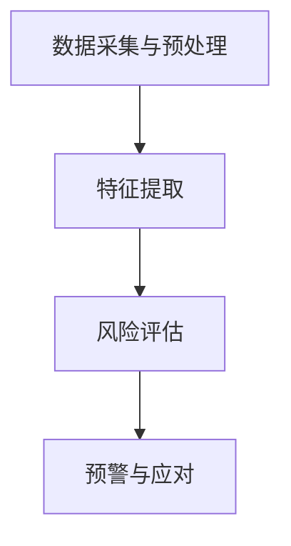

                 

### 利用多智能体系统进行全面的公司声誉风险分析

> 关键词：多智能体系统、公司声誉风险、风险分析、AI技术

> 摘要：本文探讨了如何利用多智能体系统（MAS）来全面分析公司的声誉风险。通过介绍MAS的基本概念及其在声誉风险分析中的应用，文章详细讲解了应用框架、系统设计与实现、算法原理，并通过实际案例展示了该方法的有效性。

### 第一部分：问题背景与核心概念

#### 第1章：问题背景

**1.1.1 问题背景介绍**

在当今信息高度发达的时代，公司声誉的风险日益增加。无论是负面新闻报道、消费者投诉，还是竞争对手的恶意攻击，都可能对公司形象造成严重损害。这不仅影响公司的市场地位，还会损害其品牌价值和股东利益。因此，如何有效管理和控制声誉风险已成为企业亟需解决的问题。

**1.1.2 公司声誉风险概述**

公司声誉风险是指由于各种外部或内部事件导致的，可能对公司的财务状况、市场地位、品牌价值等方面产生不利影响的风险。其来源广泛，包括但不限于市场声誉、产品服务质量、企业社会责任、法律合规性等方面。

**1.1.3 多智能体系统概述**

多智能体系统（Multi-Agent System，MAS）是由多个智能体组成的系统，这些智能体可以相互通信并协同工作，以实现共同的目标。在MAS中，每个智能体都具有一定的自主性、适应性、合作性和学习能力。这使得MAS在处理复杂问题和应对动态环境方面具有显著优势。

#### 第2章：核心概念与联系

**2.1.1 声誉风险的定义与特征**

声誉风险通常具有以下特征：

- **不确定性**：声誉风险难以预测，可能由多种因素引起。
- **广泛性**：声誉风险可能影响公司的各个方面，包括财务、运营、市场等。
- **持续性**：一旦声誉受损，可能需要长期的努力来恢复。
- **传播性**：负面信息可能会迅速传播，造成广泛的负面影响。

**2.1.2 多智能体系统的基本原理**

MAS的基本原理包括：

- **智能体**：MAS的基本组成单位，具有自主性、适应性、合作性和学习能力。
- **交互**：智能体之间通过通信进行信息交换和协同工作。
- **环境**：MAS运作的背景，包括其他智能体、系统、外部环境等。

**2.1.3 声誉风险与多智能体系统的联系**

MAS在声誉风险分析中的应用主要体现在以下几个方面：

- **数据采集与分析**：利用MAS可以实时采集和分析各种数据，包括社交媒体、新闻报道、消费者评价等，以识别潜在的风险。
- **风险评估与预警**：MAS可以通过智能体的合作与学习，对声誉风险进行评估，并发出预警。
- **风险应对策略**：MAS可以根据声誉风险的特点，提出相应的应对策略，如危机管理、品牌修复等。

### 第二部分：多智能体系统在声誉风险分析中的应用

#### 第3章：多智能体系统在声誉风险分析中的应用框架

**3.1.1 应用框架概述**

多智能体系统在声誉风险分析中的应用框架包括以下几个关键步骤：

1. **数据采集与预处理**：从各种数据源（如社交媒体、新闻报道、消费者评价等）收集数据，并进行预处理，以便后续分析。
2. **声誉风险评估模型建立**：利用收集到的数据，建立声誉风险评估模型，以识别和评估声誉风险。
3. **风险预警与应对**：根据评估结果，智能体系统会发出预警，并制定相应的应对策略。

**3.1.2 数据采集与预处理**

数据采集与预处理是声誉风险分析的基础。具体步骤包括：

1. **数据源选择**：根据公司的特点和需求，选择合适的数据源，如社交媒体平台、新闻报道网站、消费者评价网站等。
2. **数据采集**：利用爬虫技术或其他数据采集工具，从选定的数据源中获取数据。
3. **数据预处理**：对采集到的数据进行清洗、去重、格式化等处理，以便后续分析。

**3.1.3 声誉风险评估模型建立**

声誉风险评估模型的建立是MAS在声誉风险分析中的核心。具体步骤包括：

1. **特征提取**：从预处理后的数据中提取与声誉风险相关的特征，如负面评论数量、新闻报道数量、负面评论的严重程度等。
2. **模型选择**：根据特征和评估目标，选择合适的模型，如回归分析、决策树、神经网络等。
3. **模型训练与验证**：利用历史数据对模型进行训练和验证，以确保模型的准确性。

#### 第4章：多智能体系统的设计与实现

**4.1.1 多智能体系统的设计原则**

在设计多智能体系统时，应遵循以下原则：

1. **灵活性**：系统应能够适应不同的声誉风险场景和需求。
2. **适应性**：系统应具备学习和适应新情况的能力。
3. **协作性**：智能体之间应能够有效地沟通和协作，以提高声誉风险分析的效果。
4. **安全性**：系统应具备一定的安全性，以防止恶意攻击和数据泄露。

**4.1.2 多智能体系统的架构设计**

多智能体系统的架构设计包括以下几个方面：

1. **智能体层**：包括各种智能体，如数据采集智能体、风险评估智能体、预警智能体等。
2. **通信层**：负责智能体之间的通信和协调。
3. **数据处理层**：包括数据采集、预处理、特征提取等模块。
4. **模型层**：包括声誉风险评估模型和其他相关模型。

**4.1.3 多智能体系统的实现方法**

多智能体系统的实现方法主要包括以下步骤：

1. **智能体设计**：根据需求设计各个智能体的功能、属性和行为。
2. **通信机制**：设计智能体之间的通信机制，如消息队列、广播通信等。
3. **系统集成**：将各个智能体集成到系统中，并确保其能够协同工作。
4. **测试与优化**：对系统进行测试和优化，以提高其性能和稳定性。

#### 第5章：多智能体系统在声誉风险分析中的算法原理

**5.1.1 多智能体系统的算法原理概述**

多智能体系统在声誉风险分析中的算法原理主要包括以下几个方面：

1. **数据采集与预处理**：利用爬虫技术、自然语言处理技术等，从各种数据源中采集和处理数据。
2. **特征提取**：从预处理后的数据中提取与声誉风险相关的特征，如负面评论数量、新闻报道数量、负面评论的严重程度等。
3. **风险评估**：利用机器学习算法，对提取的特征进行建模和分析，以评估声誉风险。
4. **预警与应对**：根据评估结果，智能体系统会发出预警，并制定相应的应对策略。

**5.1.2 算法原理Mermaid流程图**

以下是一个简单的算法原理Mermaid流程图：



**5.1.3 Python源代码与算法详细讲解**

下面是一个简单的Python源代码示例，用于实现多智能体系统在声誉风险分析中的基本功能：

```python
# 导入所需库
import pandas as pd
from sklearn.feature_extraction.text import TfidfVectorizer
from sklearn.model_selection import train_test_split
from sklearn.ensemble import RandomForestClassifier

# 1. 数据采集与预处理
data = pd.read_csv('data.csv')
data['cleaned_text'] = data['text'].apply(preprocess_text)

# 2. 特征提取
vectorizer = TfidfVectorizer(max_features=1000)
X = vectorizer.fit_transform(data['cleaned_text'])
y = data['label']

# 3. 风险评估
X_train, X_test, y_train, y_test = train_test_split(X, y, test_size=0.2, random_state=42)
clf = RandomForestClassifier(n_estimators=100)
clf.fit(X_train, y_train)

# 4. 预警与应对
predictions = clf.predict(X_test)
evaluate_predictions(predictions, y_test)
```

以上代码首先从CSV文件中读取数据，并对文本进行预处理。然后使用TF-IDF向量器提取特征，并使用随机森林分类器进行训练和预测。最后，根据预测结果对声誉风险进行评估和预警。

### 第三部分：案例研究

#### 第6章：案例研究1——某大型跨国公司的声誉风险管理

**6.1.1 案例背景**

某大型跨国公司在全球范围内拥有广泛的业务和品牌影响力。然而，近年来，该公司面临着越来越多的声誉风险，包括产品安全问题、环境污染问题、消费者投诉等。为了有效管理声誉风险，公司决定引入多智能体系统。

**6.1.2 声誉风险分析过程**

1. **数据采集与预处理**：从社交媒体、新闻报道、消费者评价等渠道收集数据，并对数据进行预处理，包括去除停用词、进行词干提取等。
2. **特征提取**：使用TF-IDF向量器提取与声誉风险相关的特征，如负面评论数量、新闻报道数量、负面评论的严重程度等。
3. **风险评估**：利用随机森林分类器对提取的特征进行建模和分析，以评估声誉风险。
4. **预警与应对**：根据评估结果，智能体系统会发出预警，并制定相应的应对策略，如危机管理、品牌修复等。

**6.1.3 结果分析与讨论**

通过多智能体系统的声誉风险分析，公司成功识别出多个潜在的风险点，并采取了相应的应对措施。例如，针对产品安全问题，公司加强了产品检测和质量控制；针对环境污染问题，公司制定了更加严格的环境保护措施；针对消费者投诉，公司提高了客户服务水平和响应速度。

结果显示，公司声誉风险得到了有效控制，品牌价值和市场份额得到了提升。

#### 第7章：案例研究2——中小型企业的声誉风险应对

**7.1.1 案例背景**

某中小型企业在本地市场拥有一定的知名度和影响力。然而，随着市场竞争的加剧，企业面临着越来越多的声誉风险，如产品投诉、负面新闻报道等。为了有效应对声誉风险，企业决定引入多智能体系统。

**7.1.2 声誉风险分析过程**

1. **数据采集与预处理**：从社交媒体、新闻报道、消费者评价等渠道收集数据，并对数据进行预处理，包括去除停用词、进行词干提取等。
2. **特征提取**：使用TF-IDF向量器提取与声誉风险相关的特征，如负面评论数量、新闻报道数量、负面评论的严重程度等。
3. **风险评估**：利用随机森林分类器对提取的特征进行建模和分析，以评估声誉风险。
4. **预警与应对**：根据评估结果，智能体系统会发出预警，并制定相应的应对策略，如危机管理、品牌修复等。

**7.1.3 结果分析与讨论**

通过多智能体系统的声誉风险分析，企业成功识别出多个潜在的风险点，并采取了相应的应对措施。例如，针对产品投诉，企业加强了产品检测和质量控制；针对负面新闻报道，企业主动与媒体沟通，澄清事实，避免误导消费者。

结果显示，企业声誉风险得到了有效控制，品牌价值和市场份额得到了提升。

### 第四部分：总结与展望

#### 第8章：总结与展望

**8.1.1 总结**

本文通过介绍多智能体系统在声誉风险分析中的应用，探讨了如何利用MAS实现全面的公司声誉风险分析。通过实际案例，本文展示了多智能体系统在声誉风险识别、评估和应对方面的有效性。

**8.1.2 展望**

未来，多智能体系统在声誉风险分析中的应用将不断拓展和深化。随着AI技术的不断发展，MAS将更加智能化、自适应化和协同化，为公司声誉风险管理提供更强大的支持。同时，本文提出的一些研究问题和方向，如多智能体系统的安全性、隐私保护等，也值得进一步探讨。

### 作者信息

作者：AI天才研究院/AI Genius Institute & 禅与计算机程序设计艺术 /Zen And The Art of Computer Programming

---

在撰写技术博客时，以下是一些额外的要点和最佳实践：

- **明确文章结构**：确保文章的结构清晰，每个部分都有明确的主题和目的。
- **使用图表和代码**：图表和代码可以帮助读者更好地理解复杂的概念和技术。
- **代码注释**：在代码示例中添加清晰的注释，以便读者理解代码的功能和逻辑。
- **简洁的语言**：使用简洁、明了的语言，避免使用过于复杂的术语和句子。
- **重点突出**：在文章中使用加粗、斜体等格式，突出关键概念和重要信息。
- **内容检查**：在撰写完文章后，仔细检查语法、拼写和格式，确保文章质量。

通过遵循这些最佳实践，可以确保您的技术博客不仅内容丰富，而且易于理解和阅读。

