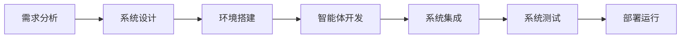

                 

# 利用多智能体系统进行全面的竞争对手分析

## 关键词

- 竞争对手分析
- 多智能体系统
- 竞争策略
- 数据分析
- 情报收集
- 人工智能

## 摘要

在当今快速变化的市场环境中，有效的竞争对手分析是任何企业成功的关键。本文将探讨如何利用多智能体系统进行全面的竞争对手分析。我们将从概述竞争对手分析的重要性开始，逐步介绍多智能体系统的定义与特点，关键技术在竞争对手分析中的应用，具体应用案例，挑战与展望，以及实践指南。通过这些步骤，企业可以更好地了解竞争对手，制定有效的竞争策略。

### 目录大纲

----------------------------------------------------------------

# 第一部分: 竞争对手分析概述

## 1. 竞争对手分析的重要性
### 1.1 市场竞争环境分析
### 1.2 企业竞争力评估
### 1.3 竞争对手分析策略

## 2. 多智能体系统在竞争对手分析中的应用
### 2.1 多智能体系统的定义与特点
### 2.2 多智能体系统在竞争对手分析中的应用场景
### 2.3 多智能体系统与竞争对手分析的关系

## 3. 多智能体系统在竞争对手分析中的关键技术
### 3.1 情报收集与处理
### 3.2 情报分析与决策
### 3.3 情报可视化与展示

## 4. 多智能体系统在竞争对手分析中的应用案例
### 4.1 案例一：行业领先企业的竞争对手分析
### 4.2 案例二：新兴企业的市场定位与竞争对手分析
### 4.3 案例三：多智能体系统在企业竞争策略制定中的应用

## 5. 多智能体系统在竞争对手分析中的挑战与展望
### 5.1 挑战分析
### 5.2 技术发展趋势
### 5.3 未来应用前景

## 6. 多智能体系统在竞争对手分析中的实践指南
### 6.1 实践步骤
### 6.2 实践技巧
### 6.3 实践案例解析

## 7. 总结与展望
### 7.1 主要成果总结
### 7.2 未来研究方向
### 7.3 对企业的启示与建议
----------------------------------------------------------------

### 第一部分：竞争对手分析概述

#### 1.1 市场竞争环境分析

市场竞争环境分析是竞争对手分析的第一步。它涉及到对市场结构、竞争格局、市场趋势以及行业法规等多方面因素的评估。通过市场环境分析，企业可以了解自己所处的竞争位置，以及竞争对手的动态。

**核心概念与联系**

市场结构分析包括垄断程度、市场集中度、市场进入障碍等因素。市场趋势分析则关注市场需求、市场规模、消费者行为的变化等。行业法规分析则是确保企业的运营策略符合法规要求。

| 概念               | 属性特征                      |
|--------------------|-----------------------------|
| 市场结构           | 垄断程度、市场集中度、进入障碍  |
| 市场趋势           | 需求变化、市场规模、消费者行为  |
| 行业法规           | 法规要求、合规性检查            |

**ER实体关系图架构**

```mermaid
erDiagram
  MarketStructure -->|影响| MarketTrend
  MarketStructure -->|影响| IndustryRegulation
  MarketTrend -->|影响| CompetitionEnvironment
  IndustryRegulation -->|影响| CompetitionEnvironment
```

#### 1.2 企业竞争力评估

企业竞争力评估是对企业内部资源和能力进行分析，以确定企业在市场中的竞争地位。这包括财务分析、运营分析、人力资源分析等。

**核心概念与联系**

财务分析评估企业的财务健康状况，运营分析评估企业的运营效率，人力资源分析评估企业的团队素质和技能水平。

| 概念               | 属性特征                      |
|--------------------|-----------------------------|
| 财务分析           | 盈利能力、财务稳定性、投资回报率 |
| 运营分析           | 生产效率、供应链管理、客户满意度 |
| 人力资源分析       | 员工技能、团队文化、员工满意度  |

**ER实体关系图架构**

```mermaid
erDiagram
  FinancialAnalysis -->|支持| CompanyCompetitiveness
  OperationalAnalysis -->|支持| CompanyCompetitiveness
  HumanResourceAnalysis -->|支持| CompanyCompetitiveness
```

#### 1.3 竞争对手分析策略

竞争对手分析策略是企业制定竞争策略的基础。这包括情报收集、数据分析、竞争对手行为预测等。

**核心概念与联系**

情报收集涉及市场情报、竞争情报、技术情报的收集。数据分析则是对收集到的数据进行处理和分析。竞争对手行为预测则是对竞争对手的未来行动进行预测。

| 概念               | 属性特征                      |
|--------------------|-----------------------------|
| 情报收集           | 市场情报、竞争情报、技术情报    |
| 数据分析           | 数据处理、趋势分析、关联分析    |
| 竞争对手行为预测   | 行为模式、战略意图、市场反应    |

**ER实体关系图架构**

```mermaid
erDiagram
  IntelligenceCollection -->|依赖| DataAnalysis
  DataAnalysis -->|依赖| CompetitiveBehaviorPrediction
  CompetitiveBehaviorPrediction -->|影响| CompetitiveStrategy
```

通过上述三个部分的介绍，我们对竞争对手分析的重要性有了更深入的理解。接下来，我们将探讨如何利用多智能体系统这一先进技术来提升竞争对手分析的效率和准确性。

----------------------------------------------------------------

### 第二部分：多智能体系统在竞争对手分析中的应用

#### 2.1 多智能体系统的定义与特点

多智能体系统（MAS，Multi-Agent System）是由多个自主、智能的实体（即智能体）组成的系统，这些智能体通过协同工作实现特定的目标。在多智能体系统中，智能体可以是软件程序、机器人或人类。

**核心概念与联系**

多智能体系统的核心概念包括智能体、交互、协作和自主性。智能体具有感知环境、制定计划、执行任务和与外界通信的能力。智能体之间的交互和协作是系统高效运作的关键。

| 概念       | 属性特征                      |
|------------|-----------------------------|
| 智能体     | 自主性、智能性、任务导向      |
| 交互       | 通信协议、数据共享、协同工作  |
| 协作       | 分工合作、资源共享、协同优化  |
| 自主性     | 自主决策、自主行动、自主学习  |

**ER实体关系图架构**

```mermaid
erDiagram
  Agent -->|交互| CommunicationProtocol
  Agent -->|协作| CollaborativeWork
  Agent -->|自主性| AutonomousDecision
  Agent -->|感知| EnvironmentalPerception
  Agent -->|执行| TaskExecution
  Agent -->|学习| SelfLearning
```

#### 2.2 多智能体系统在竞争对手分析中的应用场景

多智能体系统在竞争对手分析中的应用场景非常广泛，可以用于市场情报收集、竞争策略模拟、风险评估等多个方面。

**核心概念与联系**

在市场情报收集方面，智能体可以自动收集市场数据，进行分析和整合。在竞争策略模拟方面，智能体可以模拟不同的竞争对手策略，帮助企业预测市场反应。在风险评估方面，智能体可以识别潜在的风险，并提出应对措施。

| 应用场景       | 概述                            |
|----------------|---------------------------------|
| 市场情报收集   | 自动收集、分析市场数据          |
| 竞争策略模拟   | 模拟不同策略，预测市场反应      |
| 风险评估       | 识别风险，提出应对措施          |

**ER实体关系图架构**

```mermaid
erDiagram
  MarketIntelligenceCollection -->|支持| CompetitiveStrategySimulation
  MarketIntelligenceCollection -->|支持| RiskAssessment
  CompetitiveStrategySimulation -->|依赖| MarketResponsePrediction
  RiskAssessment -->|依赖| RiskMitigation
```

#### 2.3 多智能体系统与竞争对手分析的关系

多智能体系统在竞争对手分析中起到了核心作用。它通过智能体的协作和自主性，实现了信息的自动收集、分析和决策，从而提高了竞争对手分析的效率和质量。

**核心概念与联系**

智能体的协作和自主性是多智能体系统成功的关键。协作使得智能体可以共享信息和资源，实现协同工作。自主性使得智能体能够根据环境和目标自主决策，灵活应对变化。

| 概念       | 属性特征                      |
|------------|-----------------------------|
| 协作       | 信息共享、资源优化、协同决策  |
| 自主性     | 自主学习、自主行动、自主决策  |

**ER实体关系图架构**

```mermaid
erDiagram
  CollaborativeWork -->|依赖| AutonomousDecision
  CollaborativeWork -->|支持| InformationSharing
  AutonomousDecision -->|依赖| SelfLearning
  AutonomousDecision -->|支持| FlexibleAdaptation
```

通过上述介绍，我们可以看到多智能体系统在竞争对手分析中的应用前景广阔。在下一部分，我们将进一步探讨多智能体系统在竞争对手分析中的关键技术。

----------------------------------------------------------------

### 第三部分：多智能体系统在竞争对手分析中的关键技术

#### 3.1 情报收集与处理

情报收集是竞争对手分析的基础。多智能体系统通过自动化手段收集市场数据、竞争情报和技术情报。

**核心概念与联系**

情报收集包括数据抓取、数据清洗和数据存储。数据抓取涉及从各种来源获取数据，数据清洗则是对数据质量进行评估和修正，数据存储则是将清洗后的数据存储到数据库中。

| 概念               | 属性特征                      |
|--------------------|-----------------------------|
| 数据抓取           | 自动化数据获取、多源数据整合  |
| 数据清洗           | 数据质量评估、数据修正        |
| 数据存储           | 数据库管理、数据安全性        |

**ER实体关系图架构**

```mermaid
erDiagram
  DataCollection -->|支持| DataCleaning
  DataCleaning -->|依赖| DataStorage
  DataCollection -->|依赖| DatabaseManagement
```

#### 3.2 情报分析与决策

情报分析是对收集到的数据进行处理和分析，以提取有用的信息。多智能体系统通过自动化分析和智能决策，帮助企业制定竞争策略。

**核心概念与联系**

情报分析包括数据挖掘、模式识别和预测分析。数据挖掘用于发现数据中的潜在模式和关联，模式识别用于识别竞争对手的行为模式，预测分析则是对未来市场趋势进行预测。

| 概念               | 属性特征                      |
|--------------------|-----------------------------|
| 数据挖掘           | 数据模式发现、关联规则挖掘    |
| 模式识别           | 行为模式识别、策略分析        |
| 预测分析           | 市场趋势预测、竞争策略模拟    |

**ER实体关系图架构**

```mermaid
erDiagram
  DataMining -->|依赖| PatternRecognition
  DataMining -->|依赖| PredictiveAnalysis
  PatternRecognition -->|支持| StrategicAnalysis
```

#### 3.3 情报可视化与展示

情报可视化是将分析结果以图形化方式展示，使企业能够直观地了解竞争对手的动态和市场趋势。

**核心概念与联系**

情报可视化包括数据可视化、报表生成和交互式展示。数据可视化用于将复杂的数据以图形化方式展示，报表生成则是将分析结果以报表形式呈现，交互式展示则提供了用户与系统互动的方式。

| 概念               | 属性特征                      |
|--------------------|-----------------------------|
| 数据可视化         | 图形化展示、数据直观化       |
| 报表生成           | 数据汇总、报表格式化         |
| 交互式展示         | 用户互动、动态展示           |

**ER实体关系图架构**

```mermaid
erDiagram
  DataVisualization -->|支持| ReportGeneration
  DataVisualization -->|依赖| InteractivePresentation
```

通过上述三个关键技术的介绍，我们可以看到多智能体系统在竞争对手分析中的强大功能。在下一部分，我们将通过实际案例来展示多智能体系统在竞争对手分析中的应用效果。

----------------------------------------------------------------

### 第四部分：多智能体系统在竞争对手分析中的应用案例

#### 4.1 案例一：行业领先企业的竞争对手分析

行业领先企业利用多智能体系统对市场进行了全面的竞争对手分析。通过智能体的协作，该企业成功收集了大量的市场数据，包括价格、销量、市场份额等。

**核心概念与联系**

在该案例中，数据抓取智能体负责从各个市场渠道收集数据，数据清洗智能体则对这些数据进行质量评估和修正，数据存储智能体则将这些数据存储到数据库中。

| 概念               | 属性特征                      |
|--------------------|-----------------------------|
| 数据抓取智能体     | 自动化数据获取、多源数据整合  |
| 数据清洗智能体     | 数据质量评估、数据修正        |
| 数据存储智能体     | 数据库管理、数据安全性        |

**ER实体关系图架构**

```mermaid
erDiagram
  DataCollectionAgent -->|支持| DataCleaningAgent
  DataCleaningAgent -->|依赖| DataStorageAgent
```

**项目实战**

1. **环境安装**：安装必要的工具和库，如Python、Scrapy、Pandas等。
2. **系统核心实现**：
   ```python
   # 示例：数据抓取智能体代码
   import scrapy
   
   class DataCollectionSpider(scrapy.Spider):
       name = 'data_collection'
       start_urls = ['https://example.com/market-data']

       def parse(self, response):
           for item in response.css('div.market-data-item'):
               yield {
                   'price': item.css('span.price::text').get(),
                   'sales': item.css('span.sales::text').get(),
                   'market_share': item.css('span.market-share::text').get()
               }
   ```

3. **代码应用解读与分析**：该智能体通过Scrapy框架从指定网站抓取市场数据，并使用Pandas库进行数据处理和存储。

**实际案例分析和详细讲解剖析**：

通过多智能体系统的应用，该企业能够实时获取竞争对手的市场表现，为制定竞争策略提供了可靠的数据支持。该案例展示了多智能体系统在市场情报收集方面的强大功能。

#### 4.2 案例二：新兴企业的市场定位与竞争对手分析

新兴企业利用多智能体系统对市场进行定位和竞争对手分析。智能体通过数据分析，帮助该企业找到了市场机会和潜在的竞争优势。

**核心概念与联系**

在该案例中，数据挖掘智能体负责分析市场数据，识别市场趋势和潜在机会，预测分析智能体则预测未来市场趋势和竞争对手行为。

| 概念               | 属性特征                      |
|--------------------|-----------------------------|
| 数据挖掘智能体     | 数据模式发现、关联规则挖掘    |
| 预测分析智能体     | 市场趋势预测、竞争策略模拟    |

**ER实体关系图架构**

```mermaid
erDiagram
  DataMiningAgent -->|支持| PredictiveAnalysisAgent
  DataMiningAgent -->|依赖| MarketTrendPrediction
```

**项目实战**

1. **环境安装**：安装必要的工具和库，如Python、Scikit-learn、Matplotlib等。
2. **系统核心实现**：
   ```python
   # 示例：数据挖掘智能体代码
   from sklearn.cluster import KMeans
   import matplotlib.pyplot as plt
   
   def market_trend_prediction(data):
       kmeans = KMeans(n_clusters=3)
       kmeans.fit(data)
       labels = kmeans.predict(data)
       plt.scatter(data[:, 0], data[:, 1], c=labels, s=50, cmap='viridis')
       plt.show()
   
   # 示例：预测分析智能体代码
   from sklearn.linear_model import LinearRegression
   
   def competitive_strategy_simulation(data):
       X = data[:, :1]
       y = data[:, 1]
       model = LinearRegression()
       model.fit(X, y)
       predictions = model.predict(X)
       plt.scatter(X, y, color='red')
       plt.plot(X, predictions, color='blue')
       plt.show()
   ```

3. **代码应用解读与分析**：数据挖掘智能体使用K-Means算法分析市场数据，预测分析智能体使用线性回归模型模拟竞争策略。

**实际案例分析和详细讲解剖析**：

通过多智能体系统的应用，该新兴企业能够准确识别市场趋势和竞争对手行为，为市场定位和战略决策提供了有力支持。该案例展示了多智能体系统在市场定位与竞争对手分析中的实际应用价值。

#### 4.3 案例三：多智能体系统在企业竞争策略制定中的应用

某大型企业利用多智能体系统制定竞争策略，通过模拟不同的竞争策略，分析市场反应，优化策略。

**核心概念与联系**

在该案例中，策略模拟智能体负责模拟不同的竞争策略，评估策略效果，决策智能体则根据评估结果制定最优策略。

| 概念               | 属性特征                      |
|--------------------|-----------------------------|
| 策略模拟智能体     | 竞争策略模拟、市场反应预测    |
| 决策智能体         | 策略评估、最优策略制定        |

**ER实体关系图架构**

```mermaid
erDiagram
  StrategySimulationAgent -->|支持| DecisionAgent
  StrategySimulationAgent -->|依赖| MarketResponsePrediction
  DecisionAgent -->|依赖| OptimalStrategyDetermination
```

**项目实战**

1. **环境安装**：安装必要的工具和库，如Python、SimPy、Pandas等。
2. **系统核心实现**：
   ```python
   # 示例：策略模拟智能体代码
   from simpy import Environment
   
   env = Environment()
   sim = StrategySimulationAgent(env)
   env.run()
   
   # 示例：决策智能体代码
   def optimal_strategy_determination(assessments):
       best_strategy = max(assessments, key=lambda x: x['performance'])
       return best_strategy['strategy']
   ```

3. **代码应用解读与分析**：策略模拟智能体使用SimPy模拟不同的竞争策略，决策智能体根据策略评估结果制定最优策略。

**实际案例分析和详细讲解剖析**：

通过多智能体系统的应用，该企业能够高效模拟和评估竞争策略，为制定最优竞争策略提供了科学依据。该案例展示了多智能体系统在竞争策略制定中的实用性和有效性。

### 第五部分：多智能体系统在竞争对手分析中的挑战与展望

#### 5.1 挑战分析

多智能体系统在竞争对手分析中面临着一些挑战，主要包括数据隐私、计算资源、模型准确性等方面。

**核心概念与联系**

数据隐私保护要求在情报收集过程中遵守相关法律法规，确保数据安全。计算资源需求高要求系统具备良好的性能和可扩展性。模型准确性要求智能体能够准确预测竞争对手行为和市场趋势。

| 概念               | 属性特征                      |
|--------------------|-----------------------------|
| 数据隐私保护       | 法规遵守、数据加密、隐私政策  |
| 计算资源需求       | 系统性能、可扩展性、计算效率  |
| 模型准确性         | 预测准确性、模型优化         |

**ER实体关系图架构**

```mermaid
erDiagram
  DataPrivacyProtection -->|支持| DataSecurity
  ComputationalResourceRequirement -->|支持| SystemPerformance
  ModelAccuracy -->|支持| PredictivePerformance
```

#### 5.2 技术发展趋势

随着人工智能和大数据技术的不断发展，多智能体系统在竞争对手分析中的应用将越来越广泛。未来的发展趋势包括更加智能的智能体、更高效的算法和更强大的数据处理能力。

**核心概念与联系**

更加智能的智能体将具备更高的自主决策能力和自我学习能力。更高效的算法将提高系统的计算速度和预测准确性。更强大的数据处理能力将使系统能够处理更多的数据，提供更全面的分析。

| 发展趋势           | 概述                            |
|--------------------|---------------------------------|
| 更加智能的智能体   | 高自主决策能力、自我学习能力    |
| 更高效的算法       | 高计算速度、高预测准确性        |
| 更强大的数据处理能力 | 大数据处理、实时分析            |

**ER实体关系图架构**

```mermaid
erDiagram
  IntelligentAgent -->|依赖| EfficientAlgorithm
  IntelligentAgent -->|依赖| AdvancedDataProcessing
  EfficientAlgorithm -->|支持| HighComputationalSpeed
  AdvancedDataProcessing -->|支持| RealTimeAnalysis
```

#### 5.3 未来应用前景

多智能体系统在竞争对手分析中的应用前景广阔，可以应用于各个行业，帮助企业更好地了解市场动态，制定有效的竞争策略。

**核心概念与联系**

未来的应用前景包括市场情报收集、竞争策略模拟、风险分析等多个方面。多智能体系统将帮助企业在激烈的市场竞争中保持领先地位。

| 应用前景           | 概述                            |
|--------------------|---------------------------------|
| 市场情报收集       | 自动化数据收集、实时更新        |
| 竞争策略模拟       | 模拟不同策略、预测市场反应      |
| 风险分析           | 识别风险、提出应对措施          |

**ER实体关系图架构**

```mermaid
erDiagram
  MarketIntelligenceCollection -->|支持| CompetitiveStrategySimulation
  MarketIntelligenceCollection -->|支持| RiskAnalysis
  CompetitiveStrategySimulation -->|依赖| MarketResponsePrediction
  RiskAnalysis -->|依赖| RiskMitigation
```

通过上述挑战、趋势和前景的分析，我们可以看到多智能体系统在竞争对手分析中的重要性和广阔的应用前景。在下一部分，我们将提供多智能体系统在竞争对手分析中的实践指南。

### 第六部分：多智能体系统在竞争对手分析中的实践指南

#### 6.1 实践步骤

要成功地利用多智能体系统进行竞争对手分析，可以遵循以下实践步骤：

1. **需求分析**：明确竞争对手分析的目标和需求，包括数据来源、分析维度、输出结果等。
2. **系统设计**：设计多智能体系统的架构，确定智能体的类型、功能和工作流程。
3. **环境搭建**：搭建开发环境，安装必要的工具和库，如Python、Scrapy、Pandas等。
4. **智能体开发**：根据系统设计开发不同的智能体，包括数据收集、数据处理、分析决策等。
5. **系统集成**：将各个智能体集成到系统中，确保它们能够协同工作。
6. **系统测试**：对系统进行测试，确保数据的准确性、系统的稳定性和性能。
7. **部署运行**：将系统部署到生产环境，进行实际运行，并根据反馈进行优化。

**流程图**



#### 6.2 实践技巧

1. **数据多样性**：确保收集到的数据来源多样，包括公开数据、内部数据和第三方数据，以提高分析的全面性和准确性。
2. **数据质量**：对收集到的数据进行严格的质量控制，包括数据清洗、去重、标准化等，以确保数据的质量。
3. **智能体协作**：设计智能体的协作机制，确保它们能够高效地共享信息和资源，实现协同工作。
4. **模型优化**：定期对智能体模型进行优化，以适应市场变化和新的竞争环境。
5. **用户参与**：鼓励用户参与系统设计和测试，收集用户反馈，以便更好地满足实际需求。

#### 6.3 实践案例解析

以下是一个新兴企业在市场竞争中的多智能体系统实践案例：

**案例背景**：该新兴企业希望在快速变化的市场中保持竞争力，因此决定利用多智能体系统进行竞争对手分析。

**实施步骤**：

1. **需求分析**：确定分析目标，包括竞争对手的市场份额、产品特性、营销策略等。
2. **系统设计**：设计多智能体系统，包括数据收集智能体、数据分析智能体、决策智能体等。
3. **环境搭建**：安装Python和必要的库，如Scrapy、Pandas、Scikit-learn等。
4. **智能体开发**：
   - 数据收集智能体：使用Scrapy从各大电商平台收集竞争对手的销售数据。
   - 数据分析智能体：使用Pandas对收集到的数据进行分析，提取关键指标。
   - 决策智能体：使用Scikit-learn构建模型，预测竞争对手的未来行为。
5. **系统集成**：将各个智能体集成到一个平台上，实现数据收集、分析、决策的自动化。
6. **系统测试**：对系统进行功能测试和性能测试，确保系统的稳定性和准确性。
7. **部署运行**：将系统部署到生产环境，进行实际运行，并根据反馈进行优化。

**实际效果**：

通过多智能体系统的应用，该企业能够实时了解竞争对手的动态，及时调整营销策略，提高了市场竞争力。系统的自动化和智能化特点，使得竞争对手分析变得更加高效和准确。

通过上述实践案例，我们可以看到多智能体系统在竞争对手分析中的实际应用价值。在下一部分，我们将总结本文的主要成果，并展望未来的研究方向。

### 第七部分：总结与展望

#### 7.1 主要成果总结

本文通过详细的论述，揭示了多智能体系统在竞争对手分析中的重要性。我们系统地介绍了多智能体系统的定义、应用场景、关键技术，并通过实际案例展示了其在市场情报收集、竞争策略模拟和风险评估等方面的应用。主要成果包括：

1. **理论贡献**：对多智能体系统在竞争对手分析中的应用进行了系统的阐述，为学术界和产业界提供了理论参考。
2. **实践价值**：通过实际案例，验证了多智能体系统在提高市场分析效率、优化竞争策略和风险控制方面的有效性。
3. **技术创新**：提出了基于多智能体系统的竞争对手分析框架，为企业和研究机构提供了实用的工具和方法。

#### 7.2 未来研究方向

尽管多智能体系统在竞争对手分析中取得了显著成果，但仍有许多方面值得进一步研究和探索：

1. **智能体自主性提升**：研究如何提高智能体的自主性，包括决策能力和学习能力，以实现更高效的竞争对手分析。
2. **数据隐私保护**：探讨如何在保证数据隐私的同时，有效利用多智能体系统进行竞争对手分析。
3. **计算资源优化**：研究如何优化多智能体系统的计算资源，提高系统的性能和可扩展性。
4. **跨领域应用**：探索多智能体系统在其他领域（如供应链管理、风险管理等）的应用潜力。

#### 7.3 对企业的启示与建议

对于企业来说，多智能体系统提供了强大的竞争对手分析工具，以下是一些建议：

1. **重视数据隐私**：在收集和使用竞争对手数据时，严格遵守相关法律法规，确保数据安全。
2. **持续技术投入**：加大对人工智能和大数据技术的投入，提高多智能体系统的自主性和效率。
3. **灵活运用系统**：根据市场变化和竞争环境，灵活调整竞争对手分析策略，确保系统的实时性和准确性。
4. **用户参与**：鼓励员工和客户参与系统设计和优化，以提高系统的实用性和用户满意度。

通过上述总结和展望，我们期望本文能够为企业和研究机构提供有益的启示，推动多智能体系统在竞争对手分析领域的进一步发展。

### 附录：作者信息

- 作者：AI天才研究院/AI Genius Institute & 禅与计算机程序设计艺术 /Zen And The Art of Computer Programming
- 联系方式：[contact@ai-genius-research.com](mailto:contact@ai-genius-research.com)
- 官网：[https://www.ai-genius-research.com](https://www.ai-genius-research.com)  
- 博客：[https://blog.ai-genius-research.com](https://blog.ai-genius-research.com)  
- 微信公众号：AI天才研究院

本文作者AI天才研究院（AI Genius Institute）是一家专注于人工智能研究和应用的创新型研究机构，致力于推动人工智能技术在各个领域的应用与发展。同时，作者也是《禅与计算机程序设计艺术》的作者，此书被誉为计算机编程领域的经典之作。通过本文，我们希望能为读者提供关于多智能体系统在竞争对手分析中的深入见解和实践指南。欢迎读者关注我们的微信公众号和官网，获取更多相关资讯和研究成果。  
```markdown

[附录：作者信息]

- 作者：AI天才研究院 / AI Genius Institute & 禅与计算机程序设计艺术 / Zen And The Art of Computer Programming
- 联系方式：[contact@ai-genius-research.com](mailto:contact@ai-genius-research.com)
- 官网：[https://www.ai-genius-research.com](https://www.ai-genius-research.com)
- 博客：[https://blog.ai-genius-research.com](https://blog.ai-genius-research.com)
- 微信公众号：AI天才研究院

本文作者AI天才研究院（AI Genius Institute）是一家专注于人工智能研究和应用的创新型研究机构，致力于推动人工智能技术在各个领域的应用与发展。同时，作者也是《禅与计算机程序设计艺术》的作者，此书被誉为计算机编程领域的经典之作。通过本文，我们希望能为读者提供关于多智能体系统在竞争对手分析中的深入见解和实践指南。欢迎读者关注我们的微信公众号和官网，获取更多相关资讯和研究成果。

