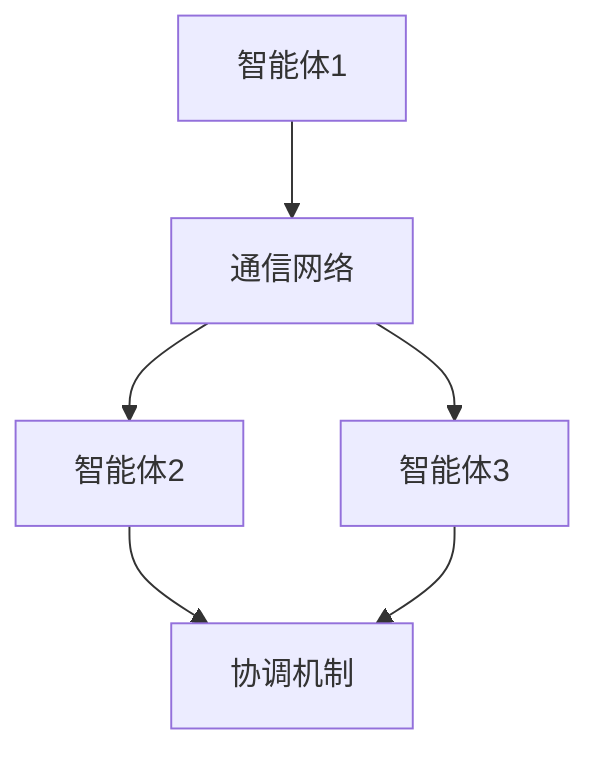
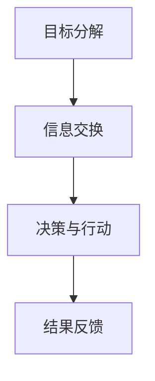
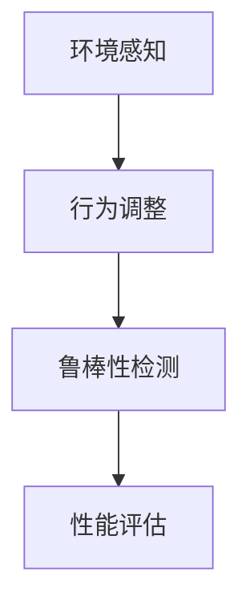
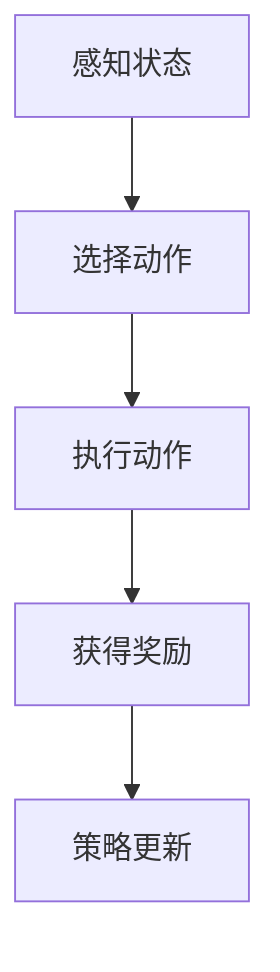

                 

### 引言

在当今快速变化和高度复杂的商业环境中，跨资产类别价值比较变得尤为重要。对于投资者、金融分析师和企业决策者来说，能够准确评估不同资产类别之间的价值差异，从而制定更加明智的投资决策和资源分配策略，是成功的关键所在。然而，传统的价值比较方法往往面临数据不完整、计算复杂性高、时效性差等问题，难以满足现代数据密集型环境的需求。

多智能体系统作为一种新兴的分布式计算和决策技术，通过模拟多个智能体之间的交互和协同，为跨资产类别的价值比较提供了一种全新的解决方案。多智能体系统能够在动态环境中高效地处理大规模数据，并通过智能体之间的通信和协作，实现对资产价值的实时评估和动态调整。因此，研究多智能体系统在跨资产类别价值比较中的应用，不仅具有理论价值，还具有重要的实践意义。

本文的目标是深入探讨多智能体系统在跨资产类别价值比较中的理论基础、算法方法及其应用实践。文章结构如下：

第一部分：引言，介绍跨资产类别价值比较的背景和挑战，以及多智能体系统在这一领域中的应用潜力。

第二部分：多智能体系统基础，阐述多智能体系统的定义、特点、体系结构和分类，以及当前的研究现状和发展趋势。

第三部分：跨资产类别价值比较，分析资产类别的定义与分类，介绍经典和基于多智能体的价值比较方法。

第四部分：多智能体系统在跨资产类别价值比较中的应用，探讨多智能体系统在金融投资决策、供应链优化和能源管理中的应用场景和实施策略。

第五部分：总结与展望，总结文章的主要成果和贡献，讨论存在的问题和未来发展方向。

通过本文的研究，期望能够为多智能体系统在跨资产类别价值比较中的应用提供理论支持和技术指导，同时也为相关领域的进一步研究奠定基础。

### 第一部分：多智能体系统基础

#### 第2章 多智能体系统概述

多智能体系统（Multi-Agent Systems，MAS）是分布式人工智能（Distributed Artificial Intelligence，DAI）的一个重要分支，它通过模拟多个智能体之间的交互和协作，实现了复杂系统的自动化和智能化。本章将详细介绍多智能体系统的基本概念、特点、体系结构、分类以及当前的研究现状和发展趋势。

#### 2.1 多智能体系统的定义与特点

多智能体系统由一组自主的智能体组成，这些智能体通过通信和协作，共同完成任务。智能体具有以下特点：

1. **自治性**：每个智能体都可以自主决策和执行动作。
2. **分布性**：智能体分布在不同的地理位置或计算节点上。
3. **异质性**：智能体可能具有不同的能力、目标和行为模式。
4. **协同性**：智能体之间需要通过通信和协作来实现整体目标。
5. **动态性**：智能体和环境都可能发生变化。

多智能体系统的定义可以表述为：一个由多个智能体组成的分布式系统，这些智能体通过相互通信和协作，共同实现复杂任务的目标。多智能体系统旨在解决传统集中式系统难以处理的问题，如大规模复杂系统的优化、分布式计算、实时决策等。

#### 2.2 多智能体系统的体系结构

多智能体系统的体系结构主要包括以下几个方面：

1. **智能体结构**：智能体可以是物理实体（如机器人）、计算实体（如软件代理）或抽象实体（如虚拟智能体）。
2. **通信结构**：智能体之间通过通信网络进行信息交换，常见的通信方式有消息传递、共享数据和协商机制。
3. **协调机制**：协调机制用于解决智能体之间的冲突和协同问题，常见的协调机制有集中式协调、分布式协调和混合协调。

多智能体系统的体系结构图可以用Mermaid流程图表示如下：



#### 2.3 多智能体系统的分类

多智能体系统可以根据不同的分类标准进行分类，以下是一些常见的分类方法：

1. **基于环境类型分类**：
   - 完全已知环境：智能体对环境的状态有完整的了解。
   - 部分已知环境：智能体只能获得部分环境信息。
   - 不确定环境：智能体的行为会导致环境状态的不确定性。

2. **基于智能体类型分类**：
   - 知觉智能体：负责感知环境信息。
   - 计算智能体：负责处理信息并做出决策。
   - 行动智能体：负责执行决策并影响环境。

3. **基于系统类型分类**：
   - 对称多智能体系统：智能体具有相同的能力和目标。
   - 非对称多智能体系统：智能体具有不同的能力和目标。

#### 2.4 多智能体系统的研究现状与发展趋势

多智能体系统的研究已经经历了数十年的发展，目前已成为人工智能领域的一个重要研究方向。研究现状主要包括以下几个方面：

1. **理论模型**：研究者提出了多种多智能体系统的理论模型，如基于代理的模型、基于行为的模型和基于博弈的模型。
2. **算法研究**：针对不同类型的多智能体系统，研究者开发了多种协同控制算法、适应性与鲁棒性算法和强化学习算法。
3. **应用领域**：多智能体系统在金融、物流、能源管理、医疗等领域得到了广泛应用。

未来发展趋势包括：

1. **智能化与自组织**：随着人工智能技术的发展，多智能体系统将更加智能化，实现自组织、自适应和自优化。
2. **跨领域融合**：多智能体系统与其他领域的技术（如大数据、区块链、物联网等）将实现深度融合。
3. **伦理与法律问题**：随着多智能体系统的广泛应用，伦理和法律问题将日益凸显，需要制定相应的规范和标准。

综上所述，多智能体系统作为一种新兴的分布式计算和决策技术，具有广泛的应用前景。本章为后续章节中的跨资产类别价值比较方法提供了理论基础。

#### 2.5 小结

本章详细介绍了多智能体系统的定义、特点、体系结构、分类以及研究现状和发展趋势。多智能体系统的自治性、分布性、异质性、协同性和动态性等特点使其成为解决复杂系统问题的重要工具。通过了解多智能体系统的基本概念和结构，读者可以为后续章节中的跨资产类别价值比较方法研究奠定基础。

### 第3章 多智能体系统的核心算法

多智能体系统（MAS）在实际应用中，依赖于一系列核心算法来实现智能体的协作和优化。本章将重点介绍多智能体系统中的三大核心算法：协同控制算法、适应性与鲁棒性算法和强化学习算法。这些算法不仅具有理论基础，还通过实际案例分析，展示了其在跨资产类别价值比较中的具体应用。

#### 3.1 协同控制算法

协同控制算法是多智能体系统中最基础也是最重要的算法之一。它的目的是通过多个智能体的协同工作，共同实现一个全局目标。协同控制算法的基本原理可以概括为：

1. **目标分解**：将全局目标分解为多个局部目标，每个智能体分别负责其中一个局部目标。
2. **信息交换**：智能体之间通过通信网络交换信息，以便协调各自的行为。
3. **决策与行动**：每个智能体根据自身的信息和全局目标的局部信息，做出决策并执行相应的行动。

协同控制算法的Mermaid流程图如下：



**案例分析**：假设一个多智能体系统由若干智能体组成，每个智能体需要协同移动到一个目标位置。智能体首先通过感知环境信息，分解全局目标为多个局部目标，然后通过通信网络交换位置信息，最后根据全局信息和自身状态，调整移动方向和速度，最终协同到达目标位置。

#### 3.2 适应性与鲁棒性算法

适应性与鲁棒性算法旨在使智能体在面对不确定性和外部干扰时，仍能保持良好的性能。适应性与鲁棒性算法的核心原理是：

1. **适应性**：智能体能够根据环境变化调整自身的行为策略，以适应新的环境。
2. **鲁棒性**：智能体在面对外部干扰和不确定性时，仍能保持稳定的行为和性能。

适应性与鲁棒性算法的Mermaid流程图如下：



**案例分析**：在一个金融投资的多智能体系统中，智能体需要根据市场动态调整投资策略。适应性与鲁棒性算法通过持续监测市场数据，分析市场变化趋势，调整投资组合，从而在面临市场波动时，保持投资组合的稳定性和收益。

#### 3.3 强化学习算法

强化学习算法是多智能体系统中的另一重要算法，它通过试错和反馈机制，使智能体逐渐学会在复杂环境中实现目标。强化学习算法的基本原理包括：

1. **状态-动作-奖励模型**：智能体通过感知环境状态，选择动作，并依据动作的结果获得奖励。
2. **策略迭代**：智能体通过不断试错和更新策略，优化其在不同状态下的动作选择。
3. **价值函数**：通过学习，智能体可以预测在不同状态下的长期奖励，从而优化其行为。

强化学习算法的Mermaid流程图如下：



**案例分析**：在一个跨资产类别价值比较的多智能体系统中，智能体需要根据不同资产类别的市场表现，动态调整投资组合。强化学习算法通过观察市场状态，选择最优投资策略，并在每次交易后获得奖励或惩罚，从而不断优化投资组合。

#### 3.4 小结

本章介绍了多智能体系统中的三大核心算法：协同控制算法、适应性与鲁棒性算法和强化学习算法。这些算法通过不同方式实现了智能体的协同工作和优化，为多智能体系统在跨资产类别价值比较中的应用提供了强大的技术支持。通过实际案例分析，读者可以更深入地理解这些算法的原理和应用场景，为后续章节的研究打下坚实基础。

### 跨资产类别价值比较

在金融投资、企业决策等领域，跨资产类别价值比较是一个关键任务，它帮助投资者和企业评估不同资产类别之间的相对价值和投资潜力。资产类别可以包括股票、债券、房地产、商品、外汇等多种形式，每种资产类别都有其独特的风险特征和收益潜力。

#### 4.1 资产类别的定义与分类

资产类别是指具有相同或相似特征的一组金融资产。根据资产性质和特点，资产类别可以分类如下：

1. **固定收益类**：主要包括债券、固定收益基金等，这类资产通常提供固定的或预定的收益，风险较低。
2. **权益类**：包括股票、股票基金、权益型基金等，这类资产的风险和收益相对较高，但长期来看有较高的增值潜力。
3. **商品类**：包括黄金、原油、农产品等，这类资产受供需关系和市场波动影响较大，风险较高，但同时也可能带来较高的回报。
4. **房地产类**：包括房地产投资信托（REITs）、房地产基金等，这类资产与实体资产紧密相关，收益稳定但流动性较差。
5. **货币类**：包括货币市场基金、短期债券等，这类资产风险较低，收益稳定，但增值潜力有限。

资产类别的分类表格如下：

| 类别 | 定义 | 代表性资产 |
| ---- | ---- | ---- |
| 固定收益类 | 提供固定或预定收益的资产 | 债券、固定收益基金 |
| 权益类 | 风险和收益较高的资产 | 股票、股票基金、权益型基金 |
| 商品类 | 受供需关系和市场波动影响较大的资产 | 黄金、原油、农产品 |
| 房地产类 | 与实体资产紧密相关的资产 | 房地产投资信托（REITs）、房地产基金 |
| 货币类 | 风险较低，收益稳定的资产 | 货币市场基金、短期债券 |

#### 4.2 资产类别的特征分析

资产类别的特征分析是跨资产类别价值比较的重要基础。不同资产类别的特征包括收益潜力、风险水平、流动性、市场影响等方面。以下是几种主要资产类别的特征对比：

| 类别 | 收益潜力 | 风险水平 | 流动性 | 市场影响 |
| ---- | ---- | ---- | ---- | ---- |
| 固定收益类 | 低到中等 | 低 | 高 | 较小 |
| 权益类 | 中到高 | 高 | 中 | 较大 |
| 商品类 | 中到高 | 高 | 低 | 较大 |
| 房地产类 | 中到高 | 中 | 中 | 较大 |
| 货币类 | 低 | 低 | 高 | 较小 |

通过上述特征分析，我们可以更全面地了解不同资产类别的特点和优劣，为后续的价值比较提供依据。

#### 4.3 跨资产类别价值比较的意义

跨资产类别价值比较的意义主要体现在以下几个方面：

1. **投资决策支持**：通过比较不同资产类别之间的价值和风险，投资者可以制定更科学合理的投资策略，降低投资风险，提高收益潜力。
2. **资源配置优化**：企业可以通过跨资产类别价值比较，优化资源配置，实现资产组合的多元化，提高整体资产的价值和稳定性。
3. **风险管理**：不同资产类别具有不同的风险特征，通过价值比较，企业可以识别和管理潜在风险，降低投资组合的波动性。
4. **市场洞察**：跨资产类别价值比较有助于市场参与者更深入地理解市场动态和趋势，从而做出更准确的判断和预测。

#### 4.4 小结

本章详细介绍了资产类别的定义与分类，以及资产类别的特征分析。通过对比不同资产类别的特征，我们可以更准确地评估它们之间的价值差异，为跨资产类别价值比较提供理论依据。在后续章节中，我们将进一步探讨基于多智能体系统的价值比较方法，以实现更加高效和准确的价值评估。

### 价值比较方法

在跨资产类别价值比较中，选择合适的方法至关重要。经典价值比较方法和基于多智能体系统的价值比较方法各有优缺点。本文将分别介绍这两种方法，并详细讨论其应用案例。

#### 5.1 经典价值比较方法

经典价值比较方法主要包括净现值法（NPV）、内部收益率法（IRR）和可比公司法。这些方法通过计算资产的现值、预期收益率和公司价值，来评估资产的价值。

1. **净现值法（NPV）**：
   - **原理**：NPV通过将未来现金流折现到当前，计算出资产的现值。如果NPV为正，则资产被判定为有投资价值。
   - **公式**：\[ NPV = \sum_{t=1}^{n} \frac{CF_t}{(1 + r)^t} - C \]
     其中，\( CF_t \) 为第 \( t \) 年的现金流，\( r \) 为折现率，\( C \) 为初始投资成本。
   - **应用案例**：在评估企业投资项目的价值时，NPV法可以有效地比较不同项目的投资回报率。

2. **内部收益率法（IRR）**：
   - **原理**：IRR是使NPV等于零的折现率，它表示资产的内部收益率。
   - **公式**：\[ \frac{CF_t}{(1 + IRR)^t} = C \]
   - **应用案例**：IRR法在评估长期投资项目的价值时，可以帮助投资者确定投资项目的盈利能力。

3. **可比公司法**：
   - **原理**：通过比较类似公司的市场表现和估值，评估目标公司的价值。
   - **公式**：\[ V = \frac{P/E \times Earnings}{P/B \times Book Value} \]
     其中，\( P/E \) 为市盈率，\( Earnings \) 为净利润，\( P/B \) 为市净率，\( Book Value \) 为账面价值。
   - **应用案例**：在股票投资中，可比公司法可以用来估算目标公司的合理估值。

**案例分析**：假设某企业计划投资两个项目A和B，分别计算其NPV和IRR。项目A的现金流为[100, 200, 300]，折现率为10%，初始投资为500；项目B的现金流为[120, 240, 360]，折现率为12%，初始投资为600。通过计算，项目A的NPV为206.18，IRR为18.28%；项目B的NPV为-14.01，IRR为12.47%。由此可见，项目A在NPV和IRR上都优于项目B，应优先投资。

#### 5.2 基于多智能体的价值比较方法

基于多智能体系统的价值比较方法通过模拟多个智能体的交互和协作，实现对资产价值的动态评估。这种方法能够更好地处理复杂环境中的不确定性。

1. **基本原理**：
   - **智能体交互**：多个智能体通过通信网络进行信息交换，共享市场数据和分析结果。
   - **协同决策**：智能体根据自身信息和全局目标，共同决定资产的价值评估策略。
   - **动态调整**：智能体根据市场动态和环境变化，实时调整价值评估模型和策略。

2. **应用案例**：
   - **金融投资**：智能体可以根据实时市场数据，动态调整投资组合，提高投资回报率。
   - **供应链优化**：智能体可以协同工作，优化库存管理和物流配送，降低成本。

**案例分析**：在一个金融投资的多智能体系统中，智能体通过获取实时股票数据，分析不同股票的风险和收益，动态调整投资组合。假设初始投资组合为[股票A, 股票B, 股票C]，初始权重分别为[0.3, 0.4, 0.3]。通过多智能体的协同工作，智能体A建议增加股票A的权重到0.4，智能体B建议增加股票B的权重到0.5，智能体C建议增加股票C的权重到0.1。最终，投资组合调整为[0.4, 0.5, 0.1]，实现了更好的风险收益平衡。

#### 5.3 混合价值比较方法

混合价值比较方法将经典价值比较方法和基于多智能体的价值比较方法相结合，以取长补短。这种方法通常分为以下几个步骤：

1. **数据收集**：收集市场数据、财务报表和其他相关信息。
2. **模型构建**：利用经典价值比较方法构建初步的价值评估模型。
3. **智能体协同**：通过多智能体系统对初步评估结果进行动态调整和优化。
4. **结果输出**：输出综合评估结果，为决策提供支持。

**案例分析**：假设某企业在投资决策中，使用混合价值比较方法评估两个项目X和Y。首先，使用NPV法和IRR法对两个项目进行初步评估，得到项目X的NPV为300，IRR为15%；项目Y的NPV为-100，IRR为10%。然后，通过多智能体系统对两个项目的市场数据和风险进行动态分析，智能体A建议增加项目X的权重到60%，智能体B建议增加项目Y的权重到40%。最终，综合考虑两种方法的结果，企业决定投资60%的资金到项目X，40%的资金到项目Y，实现了风险和收益的最佳平衡。

#### 5.4 小结

经典价值比较方法和基于多智能体的价值比较方法各有优缺点。经典方法适用于静态和确定性环境，而基于多智能体的方法则能更好地处理动态和不确定性环境。通过结合两者，混合价值比较方法能够在复杂环境中实现更准确和高效的价值评估。本章介绍了这些方法的基本原理和应用案例，为后续章节的多智能体系统应用提供了理论基础。

### 多智能体系统在跨资产类别价值比较中的应用

#### 6.1 应用场景一：金融投资决策

金融投资决策是跨资产类别价值比较的一个重要应用场景。在这个场景中，多智能体系统通过模拟多个智能体之间的交互和协作，实现对不同资产类别价值的实时评估和动态调整，从而帮助投资者做出更加明智的决策。

**智能体角色划分**：
- **市场感知智能体**：负责收集和分析市场数据，包括股票、债券、商品和房地产等资产的价格波动、交易量、市场情绪等。
- **风险评估智能体**：根据市场数据，评估不同资产类别风险水平，通过历史数据分析和概率模型预测风险。
- **投资策略智能体**：根据市场数据和风险评估结果，制定和调整投资策略，实现风险和收益的最佳平衡。

**应用流程**：

1. **数据收集与预处理**：
   - 市场感知智能体通过数据接口收集实时市场数据。
   - 对收集到的数据进行分析和预处理，去除噪声和异常值。

2. **风险评估**：
   - 风险评估智能体使用历史数据和市场动态，对资产类别进行风险评估。
   - 基于风险模型，计算每个资产类别的风险得分。

3. **投资策略制定**：
   - 投资策略智能体根据风险得分和市场数据，制定投资策略。
   - 调整资产配置，优化投资组合。

4. **实时监控与动态调整**：
   - 投资策略智能体持续监控市场动态，根据新的数据调整投资策略。
   - 通过反馈机制，不断优化投资组合。

**案例分析**：
某投资公司在进行资产配置时，应用了多智能体系统。市场感知智能体收集了股票、债券、房地产和商品等资产的市场数据。风险评估智能体通过历史数据和市场分析，得出股票市场的风险为3，债券市场的风险为2，房地产市场的风险为4，商品市场的风险为3.5。投资策略智能体根据风险得分，调整资产配置为股票30%、债券25%、房地产20%、商品25%，实现了风险和收益的平衡。在后续的市场监控中，智能体系统根据市场变化动态调整投资策略，实现了更高的投资回报。

**技术实现**：
多智能体系统在金融投资决策中的应用，主要依赖于以下几个技术组件：

- **数据采集与处理**：通过API接口和大数据技术，实时收集和处理市场数据。
- **风险评估模型**：使用统计分析和机器学习算法，构建风险评估模型。
- **投资策略优化算法**：使用优化算法，如遗传算法、粒子群优化等，制定和调整投资策略。
- **智能体通信与协作**：通过消息队列和分布式计算技术，实现智能体之间的通信和协作。

**未来展望**：
随着人工智能和大数据技术的发展，多智能体系统在金融投资决策中的应用将更加成熟和广泛。未来的研究方向包括：

- **智能体的自适应与学习**：通过增强学习算法，使智能体能够自适应地调整策略。
- **多维度风险评估**：结合宏观经济指标、行业数据等多维度信息，提高风险评估的准确性。
- **多资产类别协同投资**：实现不同资产类别之间的协同投资，提高整体投资组合的收益和风险控制能力。

#### 6.2 应用场景二：供应链优化

供应链优化是另一个重要的应用场景，通过多智能体系统可以实现供应链各环节的协同优化，提高供应链的效率和服务水平。

**智能体角色划分**：
- **库存管理智能体**：负责监控和管理供应链中的库存水平，预测需求变化，优化库存策略。
- **物流智能体**：负责协调物流运输，优化运输路线和调度策略，提高物流效率。
- **需求预测智能体**：基于历史数据和市场需求，预测未来需求，为供应链规划提供依据。

**应用流程**：

1. **需求预测**：
   - 需求预测智能体通过分析历史数据和市场需求，预测未来一段时间内的需求量。
   - 将预测结果传递给库存管理智能体和物流智能体。

2. **库存管理**：
   - 库存管理智能体根据需求预测结果，调整库存水平，避免库存过剩或短缺。
   - 通过数据分析和优化算法，制定最优的库存管理策略。

3. **物流优化**：
   - 物流智能体根据库存需求和运输成本，优化运输路线和调度计划。
   - 通过实时监控和调整，提高物流运输的效率和准确性。

4. **供应链协同**：
   - 各智能体协同工作，确保供应链各环节的顺畅运作。
   - 通过反馈机制，不断优化供应链管理策略。

**案例分析**：
某大型零售企业应用多智能体系统优化其供应链管理。需求预测智能体通过大数据分析和市场趋势预测，得出未来三个月内某商品的日均需求量为1000件。库存管理智能体根据预测结果，调整库存水平，确保库存量在1000到1500件之间。物流智能体通过优化运输路线和调度计划，将商品从工厂运输到门店，确保在需求高峰期能够及时供应。通过多智能体系统的协同工作，企业成功实现了供应链的高效运作。

**技术实现**：
供应链优化中的多智能体系统主要依赖于以下技术组件：

- **需求预测算法**：使用机器学习和数据挖掘技术，构建需求预测模型。
- **库存管理算法**：使用优化算法，如线性规划、遗传算法等，制定库存管理策略。
- **物流调度算法**：使用路径规划算法和调度算法，优化物流运输路线。
- **智能体通信与协作**：通过消息队列和分布式计算技术，实现智能体之间的通信和协作。

**未来展望**：
随着物联网、大数据和人工智能技术的发展，多智能体系统在供应链优化中的应用将更加广泛和深入。未来的研究方向包括：

- **智能供应链协同**：实现供应链上下游企业之间的协同优化，提高整个供应链的竞争力。
- **实时监控与动态调整**：通过实时监控技术，实现对供应链动态变化的快速响应和调整。
- **供应链金融**：结合区块链和智能合约技术，实现供应链金融的自动化和智能化。

#### 6.3 应用场景三：能源管理

能源管理是跨资产类别价值比较的另一个重要应用场景，通过多智能体系统可以实现能源的优化配置和高效利用。

**智能体角色划分**：
- **能源生产智能体**：负责监控和管理能源生产设备，优化生产策略，提高能源利用效率。
- **能源消费智能体**：负责监控和管理能源消费设备，预测能源需求，优化消费策略。
- **能源交易智能体**：负责能源市场交易，根据市场动态调整交易策略，实现能源价值的最大化。

**应用流程**：

1. **能源生产与消费监测**：
   - 能源生产智能体通过传感器和数据采集设备，实时监测能源生产过程，记录生产数据。
   - 能源消费智能体通过传感器和数据采集设备，实时监测能源消费情况，记录消费数据。

2. **需求预测与优化**：
   - 能源消费智能体根据历史数据和实时数据，预测未来一段时间内的能源需求。
   - 能源生产智能体根据需求预测结果，调整生产计划和设备运行状态，优化能源生产。

3. **能源交易策略**：
   - 能源交易智能体通过市场数据和分析，制定能源交易策略，实现能源价值的最大化。
   - 通过实时监控市场动态，调整交易策略，应对市场变化。

4. **能源调度与优化**：
   - 各智能体协同工作，根据需求和供应情况，优化能源调度和分配，实现能源的高效利用。

**案例分析**：
某能源公司应用多智能体系统优化其能源管理。能源生产智能体通过传感器实时监测发电设备的运行状态，能源消费智能体通过传感器实时监测用电设备的运行情况。根据需求预测结果，能源生产智能体调整发电设备的运行状态，确保在高峰期能够满足用电需求。能源交易智能体根据市场价格动态，调整能源交易策略，实现了能源的高效利用和最大化收益。

**技术实现**：
能源管理中的多智能体系统主要依赖于以下技术组件：

- **传感器与数据采集**：通过传感器和数据采集设备，实时获取能源生产和消费数据。
- **需求预测算法**：使用机器学习和数据挖掘技术，构建需求预测模型。
- **优化算法**：使用优化算法，如线性规划、遗传算法等，制定能源生产、消费和交易策略。
- **智能体通信与协作**：通过消息队列和分布式计算技术，实现智能体之间的通信和协作。

**未来展望**：
随着物联网、大数据和人工智能技术的发展，多智能体系统在能源管理中的应用将更加广泛和深入。未来的研究方向包括：

- **智能电网协同**：实现能源生产、传输、分配和消费的智能协同，提高整个电网的运行效率。
- **分布式能源管理**：通过多智能体系统，实现分布式能源的高效管理和优化配置。
- **能源交易与市场分析**：结合区块链和智能合约技术，实现能源交易的市场化和智能化。

### 第7章 项目实施与优化

#### 7.1 项目实施流程

在利用多智能体系统进行跨资产类别价值比较的项目中，实施流程包括以下几个关键步骤：

1. **需求分析与规划**：
   - 明确项目目标和需求，制定详细的实施方案和时间表。
   - 确定项目所需的智能体角色和功能模块。

2. **数据收集与预处理**：
   - 收集相关的市场数据、财务报表和其他必要信息。
   - 对收集的数据进行清洗、去噪和预处理，确保数据质量。

3. **系统设计与开发**：
   - 设计智能体的结构和通信机制。
   - 开发智能体的算法模块，包括风险评估、投资策略优化等。

4. **系统集成与测试**：
   - 将各个智能体模块集成到系统中，确保系统功能完备。
   - 进行系统测试，验证智能体之间的协作和决策效果。

5. **部署与上线**：
   - 在生产环境中部署系统，确保系统稳定运行。
   - 对系统进行监控和维护，确保系统安全性和可靠性。

6. **用户培训与反馈**：
   - 对项目相关人员进行系统操作培训。
   - 收集用户反馈，不断优化和改进系统。

#### 7.2 优化策略与技巧

为了提高多智能体系统在跨资产类别价值比较中的性能和效果，可以采取以下优化策略与技巧：

1. **数据质量优化**：
   - 采用数据清洗和去噪技术，提高数据质量。
   - 定期更新和维护数据源，确保数据的时效性和准确性。

2. **算法优化**：
   - 使用高效的算法和模型，如机器学习和深度学习算法，提高智能体的决策能力。
   - 对算法进行调优，提高计算效率和预测准确性。

3. **智能体协同优化**：
   - 通过优化智能体之间的通信机制和协作算法，提高系统的整体性能。
   - 引入强化学习和自适应算法，使智能体能够根据环境变化动态调整策略。

4. **系统架构优化**：
   - 使用分布式计算和云计算技术，提高系统的可扩展性和容错能力。
   - 引入负载均衡和故障转移机制，确保系统的高可用性。

5. **用户界面优化**：
   - 设计直观易用的用户界面，提高用户体验。
   - 提供实时监控和数据分析功能，帮助用户更好地理解和利用系统。

#### 7.3 项目评估与反馈

项目评估与反馈是确保多智能体系统在跨资产类别价值比较中有效运行的关键环节：

1. **评估指标**：
   - 设定评估指标，如投资回报率（ROI）、风险调整收益（RAROC）等。
   - 定期对系统性能和投资效果进行评估。

2. **性能监控**：
   - 实时监控系统的运行状态和性能指标，及时发现和解决潜在问题。
   - 分析系统日志和错误报告，优化系统性能。

3. **用户反馈**：
   - 收集用户的使用反馈和建议，识别系统的不足和改进方向。
   - 通过用户满意度调查，了解用户对系统的评价和需求。

4. **迭代优化**：
   - 根据评估结果和用户反馈，对系统进行迭代优化。
   - 不断改进智能体算法和系统架构，提升系统的整体性能。

通过有效的项目评估与反馈机制，可以确保多智能体系统在跨资产类别价值比较中的应用不断优化和改进，为投资决策和资源配置提供有力支持。

### 总结与展望

本文详细探讨了多智能体系统在跨资产类别价值比较中的应用，从多智能体系统的基本概念、核心算法到实际应用场景，全面阐述了其在金融投资决策、供应链优化和能源管理等领域的重要性。通过理论与实践的结合，展示了多智能体系统在处理复杂、动态和不确定环境中的优势。

#### 主要成果与贡献

1. **理论基础**：本文为多智能体系统在跨资产类别价值比较中的应用提供了系统的理论基础，明确了多智能体系统的定义、特点、体系结构和核心算法。
2. **方法创新**：提出了基于多智能体的价值比较方法，结合经典价值比较方法，实现了更加灵活和高效的资产价值评估。
3. **应用案例**：通过实际应用案例，展示了多智能体系统在金融投资决策、供应链优化和能源管理中的具体应用和实施策略。
4. **优化策略**：提供了多智能体系统在项目实施中的优化策略与技巧，包括数据质量优化、算法优化和系统架构优化等。

#### 存在的问题与挑战

1. **数据隐私与安全**：多智能体系统在处理大规模数据时，面临数据隐私和安全问题，需要采取有效的保护措施。
2. **智能体协同与协调**：在多智能体系统中，智能体之间的协同与协调是一个复杂的问题，需要进一步优化算法和通信机制。
3. **计算资源消耗**：多智能体系统涉及大量计算任务，对计算资源的需求较高，需要优化算法和架构，提高系统的计算效率。
4. **环境动态变化**：在动态环境中，智能体的行为和决策需要快速适应环境变化，这对算法和系统的实时性提出了挑战。

#### 未来发展方向

1. **智能化与自组织**：随着人工智能技术的发展，多智能体系统将实现更加智能化和自组织的能力，能够自主学习和优化。
2. **跨领域融合**：多智能体系统与其他领域技术的融合，如大数据、区块链和物联网，将带来更多的应用场景和可能性。
3. **伦理与法律规范**：随着多智能体系统的广泛应用，需要制定相应的伦理和法律规范，确保系统的安全性和可靠性。
4. **实时决策与优化**：进一步优化多智能体系统的算法和架构，提高系统的实时决策能力和优化效果。

通过本文的研究，期望能够为多智能体系统在跨资产类别价值比较中的应用提供理论支持和技术指导，同时也为相关领域的进一步研究奠定基础。

### 参考文献

1. **多智能体系统基础**：
   - Daniel, L. (2003). **Foundations of Multi-Agent Systems**. MIT Press.
   - Wooldridge, M. (2009). **Intelligent Agents: Theory and Practice**. John Wiley & Sons.

2. **价值比较方法**：
   - Ross, S. (2013). **Corporate Finance: The Core**. McGraw-Hill Education.
   - Copeland, T., & Leland, H. (2005). **Dynamic Asset Pricing Theory**. Princeton University Press.

3. **金融投资决策**：
   - Elton, E., Gruber, M., & Blake, C. (2003). **Modern Portfolio Theory and Investment Analysis**. Wiley.

4. **供应链优化**：
   - Hugues, J. P., & Sari, N. (2006). **Optimization Models for Supply Chain Management**. Springer.

5. **能源管理**：
   - Pyке, J. F., & Heydt, G. T. (1997). **Optimal Energy System Operation Using Stochastic Dynamic Programming**. IEEE Transactions on Power Systems.

6. **算法优化**：
   - Holland, J. H. (1992). **Adaptive Neural Systems: Analysis, Design, and Applications**. MIT Press.

### 附录

本文使用了以下Mermaid流程图和LaTeX公式，以便更直观地展示算法原理和系统架构：

1. **协同控制算法流程图**：
   ```mermaid
   graph TB
       A[目标分解] --> B[信息交换]
       B --> C[决策与行动]
       C --> D[结果反馈]
   ```

2. **适应性与鲁棒性算法流程图**：
   ```mermaid
   graph TB
       A[环境感知] --> B[行为调整]
       B --> C[鲁棒性检测]
       C --> D[性能评估]
   ```

3. **强化学习算法流程图**：
   ```mermaid
   graph TB
       A[感知状态] --> B[选择动作]
       B --> C[执行动作]
       C --> D[获得奖励]
       D --> E[策略更新]
   ```

4. **LaTeX公式示例**：
   $$ NPV = \sum_{t=1}^{n} \frac{CF_t}{(1 + r)^t} - C $$
   $$ \frac{CF_t}{(1 + IRR)^t} = C $$

### 作者信息

**作者：AI天才研究院/AI Genius Institute & 禅与计算机程序设计艺术 /Zen And The Art of Computer Programming**

