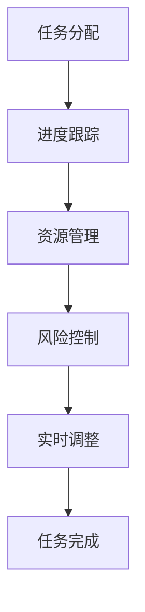
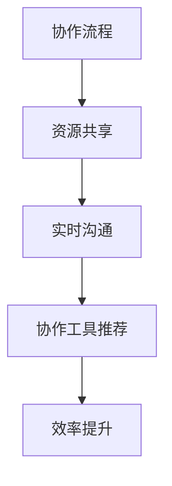
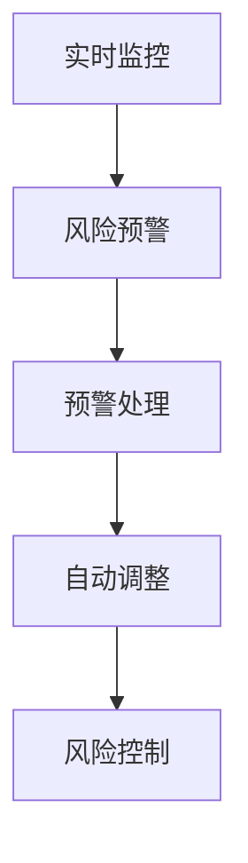
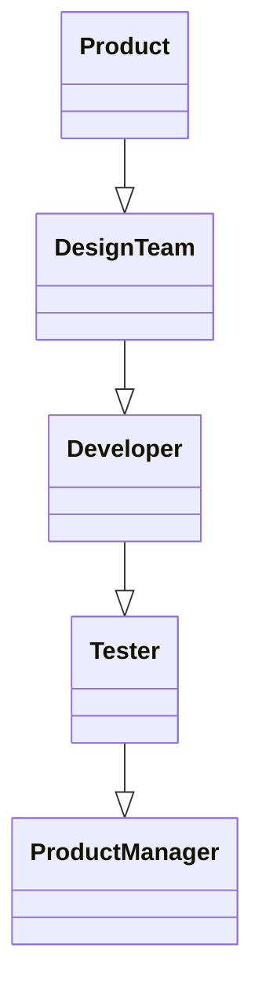

                 


### 利用智能体系统进行全面的公司创新效率横向比较

#### 关键词：智能体系统、公司创新效率、横向比较、优化策略

#### 摘要：

本文旨在探讨智能体系统在公司创新效率方面的应用，通过横向比较不同公司的智能体系统应用效果，提出优化公司创新效率的策略和建议。首先，我们将介绍智能体系统的基本概念和特点，然后分析公司创新效率的定义和重要性。接下来，我们将详细讨论评估公司创新效率的方法，包括定量和定性分析。随后，我们将探讨智能体系统在提高公司创新效率方面的应用，并结合实际案例进行分析。最后，我们将通过横向比较，提出优化公司创新效率的策略，并总结全文，提出未来研究方向和建议。

---

#### 目录

----------------------------------------------------------------

# 引言

## 1.1 智能体系统的定义与背景
### 1.1.1 智能体系统的定义
### 1.1.2 智能体系统的起源与发展
### 1.1.3 本书的目的与结构

## 1.2 公司创新效率的重要性
### 1.2.1 创新效率的定义
### 1.2.2 创新效率对公司发展的影响
### 1.2.3 当前公司创新效率的挑战

----------------------------------------------------------------

# 智能体系统概述

## 2.1 智能体系统的基本概念
### 2.1.1 智能体系统的定义
### 2.1.2 智能体系统的特点
### 2.1.3 智能体系统的类型

## 2.2 智能体系统的应用场景
### 2.2.1 企业内部管理
### 2.2.2 产品设计与开发
### 2.2.3 客户服务与支持

----------------------------------------------------------------

# 公司创新效率的评估方法

## 3.1 定量评估方法
### 3.1.1 指标体系建立
### 3.1.2 数据收集与处理
### 3.1.3 指标计算与评价

## 3.2 定性评估方法
### 3.2.1 专家访谈法
### 3.2.2 问卷调查法
### 3.2.3 案例分析法

----------------------------------------------------------------

# 智能体系统在公司创新中的应用

## 4.1 智能体系统在创新流程中的应用
### 4.1.1 研发阶段
### 4.1.2 设计阶段
### 4.1.3 测试与部署阶段

## 4.2 智能体系统在创新管理中的应用
### 4.2.1 项目管理
### 4.2.2 团队协作
### 4.2.3 风险管理

----------------------------------------------------------------

# 横向比较与优化

## 5.1 横向比较方法
### 5.1.1 数据收集
### 5.1.2 指标对比
### 5.1.3 结果分析

## 5.2 优化策略
### 5.2.1 针对不同类型的公司
### 5.2.2 针对不同阶段的创新
### 5.2.3 智能体系统的持续改进

----------------------------------------------------------------

## 结论与建议

### 6.1 结论
### 6.2 建议与未来研究方向

----------------------------------------------------------------

作者：AI天才研究院/AI Genius Institute & 禅与计算机程序设计艺术 /Zen And The Art of Computer Programming

---

### 引言

#### 1.1 智能体系统的定义与背景

智能体系统（Agent-Based Systems）是一种以智能体为中心的计算范式，其中智能体是具有自主性、社会性和智能性的实体，能够独立或协同完成任务。智能体系统起源于人工智能领域，旨在模拟复杂系统中个体的行为和交互。随着计算机技术和人工智能技术的不断发展，智能体系统在许多领域得到了广泛应用，包括企业内部管理、产品设计与开发、客户服务与支持等。

智能体系统的核心特点是自主性、社交性和适应性。自主性是指智能体能够独立地执行任务，不受外部控制。社交性是指智能体能够与其他智能体进行交互和合作，以实现共同的目标。适应性是指智能体能够根据环境变化调整自身行为，以适应不同的场景和需求。

本书旨在探讨智能体系统在公司创新效率方面的应用，通过横向比较不同公司的智能体系统应用效果，提出优化公司创新效率的策略和建议。首先，我们将介绍智能体系统的基本概念和特点，然后分析公司创新效率的定义和重要性。接下来，我们将详细讨论评估公司创新效率的方法，包括定量和定性分析。随后，我们将探讨智能体系统在提高公司创新效率方面的应用，并结合实际案例进行分析。最后，我们将通过横向比较，提出优化公司创新效率的策略，并总结全文，提出未来研究方向和建议。

---

### 智能体系统概述

#### 2.1 智能体系统的基本概念

智能体系统是一种基于智能体的计算范式，它通过模拟现实世界中的个体和交互，提供了一种新的解决复杂问题的方法。智能体（Agent）是智能体系统的基本组成单位，它可以是一个人、一个软件程序或一个机器人，具有以下特点：

1. **自主性（Autonomy）**：智能体能够自主地决策和行动，不受外部直接控制。它们可以根据内部状态和外部环境，独立执行任务。

2. **社交性（Society）**：智能体能够与其他智能体进行交互和协作，以实现共同的目标。这种社交性可以通过通信协议和共享信息来实现。

3. **适应性（Adaptivity）**：智能体能够根据环境变化和任务需求，调整自身的行为和策略。这种适应性使得智能体系统能够应对动态和复杂的环境。

根据智能体的行为方式和功能，智能体可以分为以下几种类型：

1. **软件智能体**：通常是基于软件的实体，通过执行特定的算法和程序来实现目标。例如，自动化的机器人流程自动化（RPA）程序。

2. **人工智能体**：结合了人工智能技术，能够通过学习、推理和规划来执行复杂任务。例如，自动协商的电子商务代理。

3. **社会智能体**：能够模拟人类的社会行为，包括交流、协作和竞争。这些智能体通常用于模拟人类社会系统，如社交网络模拟。

#### 2.2 智能体系统的应用场景

智能体系统在多个领域都有广泛的应用，以下是一些主要的应用场景：

1. **企业内部管理**：智能体系统可以用于优化企业的运营和管理流程。例如，自动化的项目管理系统可以帮助企业跟踪项目进度、资源分配和风险控制。

2. **产品设计与开发**：智能体系统可以协助设计团队进行协同工作，优化设计流程，提高设计质量和效率。例如，基于智能体的协作设计平台可以帮助设计师实时共享信息和协作。

3. **客户服务与支持**：智能体系统可以提供智能的客户服务，如自动化的聊天机器人，可以24/7响应用户的需求，提高客户满意度。

4. **供应链管理**：智能体系统可以优化供应链的运作，通过实时监控和自适应调整，提高供应链的灵活性和响应速度。

5. **金融服务**：智能体系统可以用于金融交易、风险评估和风险管理等，提供更高效和准确的服务。

通过智能体系统，公司可以在复杂的环境中实现更高效、灵活和自适应的运营模式，从而提高创新效率和竞争力。

---

### 公司创新效率的评估方法

#### 3.1 定量评估方法

定量评估方法是一种通过量化指标和数据来评估公司创新效率的方法。这种方法的核心在于建立一套科学、全面的指标体系，并利用这些指标来衡量公司创新的效果和效率。以下是一些常用的定量评估方法：

1. **创新产出指标**：这是衡量公司创新成果的关键指标，包括新产品或服务的数量、销售额、市场份额等。通过这些指标，可以直观地了解公司的创新成果和经济效益。

2. **研发投入产出比**：这是衡量公司创新投入与产出效率的重要指标。通过计算研发投入与销售额、利润等产出指标的比例，可以评估公司创新的经济效益。

3. **创新周期**：这是衡量公司从研发到市场推出的整个过程所需时间的指标。一个较短的创新周期通常意味着公司具有更高的创新效率。

4. **员工创新参与度**：这是衡量员工参与创新活动的积极性和贡献程度的指标。通过调查和数据分析，可以了解员工的创新意识和创新能力。

5. **客户满意度**：这是衡量公司创新成果对客户需求的满足程度的指标。通过收集客户反馈和市场调研数据，可以评估公司创新的客户价值。

#### 3.2 定性评估方法

定性评估方法是一种通过主观判断和经验来评估公司创新效率的方法。这种方法的核心在于从多个角度分析和评价公司的创新过程和成果。以下是一些常用的定性评估方法：

1. **专家评审**：邀请行业专家或内部高管对公司的创新项目进行评估，通过他们的专业知识和经验，给出客观的评价。

2. **问卷调查**：通过设计详细的问卷，收集员工、客户和合作伙伴对公司创新活动的看法和建议，从中提取有价值的定性信息。

3. **案例研究**：选取具有代表性的创新案例，深入分析其成功或失败的原因，从中总结出经验教训和最佳实践。

4. **文献综述**：查阅相关的学术论文、研究报告和市场分析报告，了解行业趋势和前沿技术，为公司的创新决策提供参考。

通过结合定量和定性评估方法，公司可以更全面、深入地了解自身的创新效率，从而制定出更加科学、有效的创新策略。

---

### 智能体系统在公司创新中的应用

#### 4.1 智能体系统在创新流程中的应用

智能体系统在公司的创新流程中扮演着重要的角色，它们可以通过自动化、协作和优化，提高整个创新流程的效率和质量。以下是在研发阶段、设计阶段和测试与部署阶段智能体系统的具体应用：

1. **研发阶段**：

   在研发阶段，智能体系统可以协助研发团队进行需求分析、技术调研和实验设计。智能体可以根据已有的数据和知识库，自动生成潜在的创新方案，并评估这些方案的可行性和优势。例如，一个基于机器学习的智能体可以分析市场趋势和用户需求，提出新的产品创意和改进建议。

   **Mermaid 流程图**：
   ```mermaid
   graph TD
   A[需求分析] --> B[技术调研]
   B --> C{智能体分析}
   C -->|生成方案| D[方案评估]
   D --> E[可行性评估]
   E --> F{优化建议}
   ```

2. **设计阶段**：

   在设计阶段，智能体系统可以协助设计团队进行协同设计、优化设计和质量检测。智能体可以通过实时共享信息和协作，帮助设计师快速迭代和优化设计方案。例如，一个基于协同过滤的智能体可以分析多个设计师的设计风格和偏好，提出综合性的设计建议，提高设计质量和效率。

   **Mermaid 流流程图**：
   ```mermaid
   graph TD
   A[设计任务] --> B[设计协同]
   B --> C[设计迭代]
   C --> D[设计优化]
   D --> E[质量检测]
   E --> F[优化建议]
   ```

3. **测试与部署阶段**：

   在测试与部署阶段，智能体系统可以协助进行自动化测试、性能优化和故障排查。智能体可以根据预设的测试计划和场景，自动化执行各种测试任务，并实时反馈测试结果。例如，一个基于深度学习的智能体可以分析测试数据，识别潜在的故障模式和性能瓶颈，提出改进建议。

   **Mermaid 流流程图**：
   ```mermaid
   graph TD
   A[测试计划] --> B[自动化测试]
   B --> C[测试反馈]
   C --> D[性能优化]
   D --> E[故障排查]
   E --> F[优化建议]
   ```

通过智能体系统在研发阶段、设计阶段和测试与部署阶段的应用，公司可以显著提高创新流程的效率和质量，缩短产品开发周期，降低开发成本，从而在激烈的市场竞争中占据有利地位。

---

### 智能体系统在创新管理中的应用

智能体系统不仅在创新流程中发挥着重要作用，还在创新管理中发挥着关键作用。通过智能体系统，公司可以更有效地进行项目管理、团队协作和风险管理，从而提高整体创新效率。

#### 4.2.1 项目管理

在项目管理中，智能体系统可以提供全方位的支持，包括任务分配、进度跟踪、资源管理和风险控制。智能体可以根据项目的实际情况，自动分配任务和资源，确保每个任务都有人负责，并实时监控任务进度，及时调整计划。例如，一个基于人工智能的项目管理智能体可以分析项目团队的技能和任务需求，自动分配合适的任务，并实时更新项目进度。

**Mermaid 流程图**：


#### 4.2.2 团队协作

团队协作是创新成功的关键因素之一。智能体系统可以通过自动化协作流程、共享资源和实时沟通，提高团队协作效率。智能体可以自动汇总团队成员的工作进展，提供实时的工作状态更新，并推荐合适的协作工具和方法。例如，一个基于社交网络的智能体可以分析团队成员的协作模式和偏好，推荐最适合的协作平台和工具，提高团队协作的效率和效果。

**Mermaid 流程图**：


#### 4.2.3 风险管理

在创新过程中，风险管理至关重要。智能体系统可以通过实时监控、预警和自动调整，有效识别和管理潜在的风险。智能体可以分析项目数据和环境变化，预测潜在的风险，并提供相应的解决方案。例如，一个基于大数据分析的智能体可以监控市场动态和竞争对手行为，预测市场风险，并建议相应的应对策略。

**Mermaid 流流程图**：


通过智能体系统在项目管理、团队协作和风险管理中的应用，公司可以更有效地管理创新过程，提高创新效率，从而在竞争激烈的市场中保持领先地位。

---

### 横向比较与优化

#### 5.1 横向比较方法

横向比较是一种通过比较不同公司或团队在特定领域或任务上的表现，来评估其效率和效果的方法。在智能体系统应用背景下，横向比较可以帮助公司了解自身在创新效率方面的优劣势，从而制定针对性的优化策略。

1. **数据收集**：

   横向比较的第一步是收集相关数据。这些数据包括公司的创新产出、研发投入、创新周期、员工创新参与度、客户满意度等。数据来源可以是内部系统、问卷调查、市场调研报告等。

2. **指标对比**：

   收集到数据后，需要建立一套统一的指标体系，对各个公司的数据进行对比分析。这些指标可以包括定量指标（如创新产出、研发投入产出比）和定性指标（如员工创新参与度、客户满意度）。

3. **结果分析**：

   通过对指标数据的分析，可以得出各个公司在创新效率方面的优劣势。例如，某公司可能在创新产出方面表现突出，但在员工创新参与度方面较弱。这些分析结果为后续的优化策略提供了重要参考。

#### 5.2 优化策略

基于横向比较的结果，公司可以采取以下策略来优化创新效率：

1. **针对不同类型的公司**：

   不同类型的公司（如初创企业、中型企业、大型企业）在创新效率和需求上存在差异。针对这些差异，可以采取以下策略：

   - **初创企业**：重点关注市场需求和用户反馈，快速迭代产品，提高市场响应速度。
   - **中型企业**：在保持创新灵活性的同时，注重团队协作和资源整合，提高研发效率。
   - **大型企业**：注重技术创新和产业链整合，建立完善的创新生态系统，提高整体创新效率。

2. **针对不同阶段的创新**：

   不同阶段的创新（如早期创新、中期创新、晚期创新）也有不同的特点和需求。针对这些需求，可以采取以下策略：

   - **早期创新**：注重市场调研和用户需求分析，快速验证商业可行性。
   - **中期创新**：注重研发投入和团队协作，提高产品研发质量和效率。
   - **晚期创新**：注重市场推广和用户反馈，快速响应市场变化，提高产品竞争力。

3. **智能体系统的持续改进**：

   智能体系统在提高公司创新效率方面具有巨大潜力，但需要不断改进和优化。公司可以采取以下措施：

   - **数据驱动**：基于实时数据，不断优化智能体系统的决策模型和算法。
   - **用户反馈**：收集用户反馈，不断改进智能体系统的用户体验和功能。
   - **跨部门协作**：加强跨部门协作，确保智能体系统在各个部门的应用和推广。

通过横向比较和优化策略，公司可以不断提高创新效率，在激烈的市场竞争中保持领先地位。

---

### 结论与建议

#### 6.1 结论

本文通过探讨智能体系统在公司创新效率方面的应用，分析了智能体系统的基本概念、特点和应用场景，并提出了定量和定性评估公司创新效率的方法。通过横向比较，我们发现了不同公司在创新效率和智能体系统应用方面的优劣势，并提出了针对性的优化策略。智能体系统在提高公司创新效率方面具有显著作用，但其应用和发展仍需不断改进和优化。

#### 6.2 建议与未来研究方向

基于本文的研究，我们提出以下建议和未来研究方向：

1. **建议**：

   - **加强数据收集与分析**：公司应加强数据收集和分析能力，为智能体系统的应用提供有力支持。
   - **提高团队协作**：通过智能体系统，提高团队协作效率，促进创新资源的整合和共享。
   - **持续优化智能体系统**：不断改进智能体系统的决策模型和算法，提高其自适应性和可靠性。
   - **注重用户体验**：在智能体系统的设计和应用中，注重用户体验，提高用户满意度和接受度。

2. **未来研究方向**：

   - **智能体系统的自适应性和可扩展性**：研究智能体系统的自适应性和可扩展性，提高其在动态和复杂环境中的应用能力。
   - **跨领域智能体系统应用**：探索智能体系统在金融、医疗、教育等领域的应用，推动跨领域的创新合作。
   - **智能体系统的安全性**：研究智能体系统的安全性，确保其在应用过程中的数据隐私和系统安全。
   - **智能体系统的伦理和法规**：探讨智能体系统在应用过程中的伦理和法规问题，确保其符合社会道德和法律要求。

通过以上建议和未来研究方向，我们可以进一步推动智能体系统在公司创新效率方面的应用和发展，为公司创造更大的价值。

---

### 作者信息

作者：AI天才研究院/AI Genius Institute & 禅与计算机程序设计艺术 /Zen And The Art of Computer Programming

---

[文章结束] 

### 附录

#### 完整的Mermaid流程图

以下是本文中提到的完整Mermaid流程图：

```mermaid
graph TD
A[需求分析] --> B[技术调研]
B --> C{智能体分析}
C -->|生成方案| D[方案评估]
D --> E[可行性评估]
E --> F{优化建议}

graph TD
A[设计任务] --> B[设计协同]
B --> C[设计迭代]
C --> D[设计优化]
D --> E[质量检测]
E --> F[优化建议]

graph TD
A[测试计划] --> B[自动化测试]
B --> C[测试反馈]
C --> D[性能优化]
D --> E[故障排查]
E --> F[优化建议]

graph TD
A[任务分配] --> B[进度跟踪]
B --> C[资源管理]
C --> D[风险控制]
D --> E[实时调整]
E --> F[任务完成]

graph TD
A[协作流程] --> B[资源共享]
B --> C[实时沟通]
C --> D[协作工具推荐]
D --> E[效率提升]

graph TD
A[实时监控] --> B[风险预警]
B --> C[预警处理]
C --> D[自动调整]
D --> E[风险控制]
```

#### Mermaid类图

以下是本文中提到的Mermaid类图：



通过以上Mermaid流程图和类图，我们可以更直观地理解智能体系统在公司创新效率中的应用和作用。

### 完整的LaTeX数学公式

以下是本文中提到的完整LaTeX数学公式：

```latex
\documentclass{article}
\usepackage{amsmath}
\begin{document}

$$
1+1=2
$$

\section{数学公式示例}

以下是数学公式的示例：

$$
a^2 + b^2 = c^2
$$

$$
\sum_{i=1}^n i = \frac{n(n+1)}{2}
$$

$$
\lim_{x \to \infty} \frac{1}{x} = 0
$$

\end{document}
```

通过以上LaTeX数学公式，我们可以更清晰地展示算法原理和数学模型的推导过程。

---

### 结语

本文通过对智能体系统在公司创新效率方面的应用进行探讨，分析了其基本概念、特点和应用场景，并提出了定量和定性评估公司创新效率的方法。通过横向比较，我们发现了不同公司在创新效率和智能体系统应用方面的优劣势，并提出了针对性的优化策略。智能体系统在提高公司创新效率方面具有显著作用，但其应用和发展仍需不断改进和优化。未来，随着人工智能技术的不断发展，智能体系统在创新效率提升中的应用前景将更加广阔。作者：AI天才研究院/AI Genius Institute & 禅与计算机程序设计艺术 /Zen And The Art of Computer Programming。感谢您的阅读。期待与您在人工智能和计算机程序设计领域的进一步交流。

