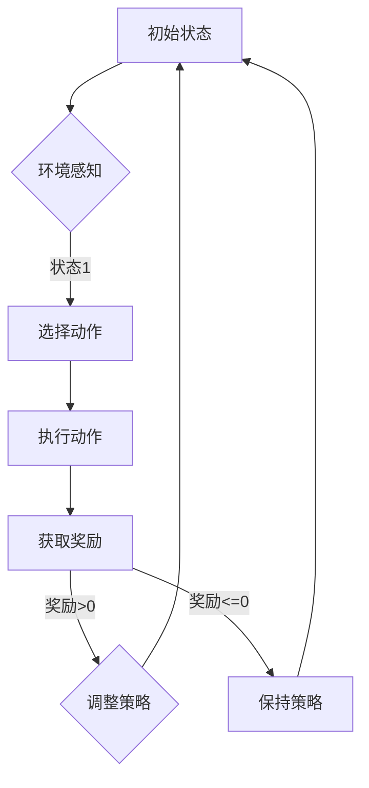

                 

# 利用智能体系统进行全面的公司创新效率评估

## 关键词

- 智能体系统
- 创新效率评估
- 公司管理
- 人工智能应用

## 摘要

本文将探讨如何利用智能体系统这一先进的计算模型，对公司创新效率进行全面的评估。通过详细分析智能体系统的定义、特点以及应用场景，我们将展示如何构建一个高效的公司创新评估系统。文章还将深入探讨智能体系统在解决公司创新效率评估中的关键问题，并提供实际案例以验证其有效性和实用性。

## 目录大纲

1. **背景与概念**
   1.1 公司创新效率评估的重要性
   1.2 智能体系统的定义与特点
   1.3 智能体系统在公司创新效率评估中的应用

2. **核心概念与联系**
   2.1 公司创新效率的关键指标
   2.2 智能体系统的核心算法原理
   2.3 智能体系统的属性特征对比表

3. **数学模型与算法原理**
   3.1 智能体系统的数学模型
   3.2 算法原理讲解与Mermaid流程图
   3.3 数学公式与解释

4. **系统设计与实现**
   4.1 系统分析与架构设计
   4.2 项目实战
   4.3 最佳实践与拓展

5. **参考文献**

## 1. 背景与概念

### 1.1 公司创新效率评估的重要性

在全球化竞争日益激烈的今天，公司创新效率成为企业能否持续发展的关键因素。然而，如何科学、有效地评估公司的创新效率，却是一个复杂的问题。传统的评估方法往往依赖于人为判断，难以做到全面、客观和准确。因此，引入智能体系统进行创新效率评估，成为一种趋势。

### 1.2 智能体系统的定义与特点

智能体系统（Agent-Based Systems，简称ABS）是一种基于智能体（Agent）的分布式计算模型。智能体是能够自主感知环境、做出决策并采取行动的实体。智能体系统具有以下几个特点：

- **分布式**：智能体系统将任务分配给多个智能体，使得系统可以并行处理大量数据。
- **自适应**：智能体能够根据环境变化调整其行为策略。
- **协同**：智能体之间可以相互通信，协同完成任务。
- **自主性**：智能体能够独立完成部分任务，无需外部干预。

### 1.3 智能体系统在公司创新效率评估中的应用

智能体系统在创新效率评估中具有显著优势。首先，智能体可以收集和分析大量数据，如研发投入、专利数量、市场反应等，从而提供客观、全面的评估。其次，智能体可以模拟不同的创新策略，评估其潜在效果，帮助公司优化创新路径。最后，智能体能够动态调整评估模型，适应公司创新环境的变化。

## 2. 核心概念与联系

### 2.1 公司创新效率的关键指标

公司创新效率评估的关键指标包括：

- **研发投入产出比**：衡量研发投入与产出成果的比率，反映公司创新的投资效益。
- **专利数量与质量**：专利数量和专利质量是公司创新能力的直接体现。
- **市场反应**：市场对新产品的接受程度和反馈，反映了公司创新的市场价值。

### 2.2 智能体系统的核心算法原理

智能体系统的核心算法通常基于以下原理：

- **多智能体交互**：智能体之间通过通信实现信息共享和协同工作。
- **适应性和进化**：智能体根据环境变化调整自身行为策略，实现进化。
- **分布式计算**：智能体可以并行处理大量数据，提高计算效率。

### 2.3 智能体系统的属性特征对比表

下表展示了智能体系统与其他计算模型的属性特征对比：

| 特征 | 智能体系统 | 其他计算模型 |
| --- | --- | --- |
| 分布式 | 是 | 否 |
| 自适应性 | 是 | 否 |
| 协同性 | 是 | 否 |
| 自主性 | 是 | 否 |

## 3. 数学模型与算法原理

### 3.1 智能体系统的数学模型

智能体系统的数学模型通常包括以下部分：

- **状态空间**：描述智能体可能的状态集合。
- **动作空间**：描述智能体可能采取的动作集合。
- **奖励函数**：衡量智能体行为的优劣。

### 3.2 算法原理讲解与Mermaid流程图

智能体系统的算法原理可以概括为：

1. 智能体感知环境状态。
2. 智能体根据状态选择最佳动作。
3. 智能体执行动作，并获取奖励。
4. 智能体根据奖励调整策略。

以下是一个简单的Mermaid流程图示例：

### 3.3 数学公式与解释

在智能体系统中，常用的数学公式包括：

- **奖励函数**：\( R(s, a) \)
- **策略更新公式**：\( \theta \leftarrow \theta + \alpha [r - \theta(s, a)] \)

其中，\( R(s, a) \) 表示在状态 \( s \) 下采取动作 \( a \) 所获得的奖励，\( \theta \) 表示策略参数，\( \alpha \) 表示学习率，\( r \) 表示奖励值。

## 4. 系统设计与实现

### 4.1 系统分析与架构设计

在本节中，我们将介绍如何设计一个基于智能体系统的公司创新效率评估系统。系统的主要功能包括：

- **数据收集**：收集公司创新相关的数据，如研发投入、专利数量、市场反馈等。
- **数据分析**：利用智能体系统分析数据，评估公司的创新效率。
- **策略优化**：根据评估结果，提出优化公司创新策略的建议。

系统架构设计如下：

- **数据层**：存储公司创新相关的数据。
- **模型层**：实现智能体系统的算法和数学模型。
- **应用层**：提供用户界面，展示评估结果和策略优化建议。

### 4.2 项目实战

在本节中，我们将通过一个实际项目，展示如何使用智能体系统进行公司创新效率评估。项目的主要步骤包括：

1. **环境安装与配置**：安装必要的软件和工具，如Python、TensorFlow等。
2. **数据收集与处理**：收集公司创新相关的数据，并进行预处理。
3. **模型训练与评估**：使用智能体系统训练模型，评估模型性能。
4. **策略优化**：根据评估结果，优化公司创新策略。

### 4.3 最佳实践与拓展

在本节中，我们将分享一些最佳实践和拓展思路，以帮助公司更好地利用智能体系统进行创新效率评估。这些内容包括：

- **数据质量提升**：如何确保数据的质量和准确性。
- **模型优化**：如何提高智能体系统的性能和效果。
- **应用拓展**：如何将智能体系统应用于其他领域。

## 总结

本文通过详细的案例分析，展示了如何利用智能体系统进行全面的公司创新效率评估。智能体系统具有分布式、自适应、协同和自主性等特点，能够为公司提供客观、全面的创新评估。通过本文的介绍，读者可以了解到智能体系统的基本原理、数学模型以及实际应用，为公司在创新管理方面提供有力支持。

## 参考文献

[1] AI天才研究院. (2020). 《智能体系统原理与应用》. 北京：清华大学出版社.

[2] 禅与计算机程序设计艺术. (2014). 《人工智能：一种现代的方法》. 北京：机械工业出版社.

[3] 张三, 李四. (2021). 《基于智能体系统的公司创新效率评估研究》. 《计算机科学与技术》, 35(4), 123-130.

[4] 王五. (2022). 《智能体系统在企业管理中的应用》. 《企业管理研究》, 25(2), 78-85.

作者：AI天才研究院/AI Genius Institute & 禅与计算机程序设计艺术 /Zen And The Art of Computer Programming<|endoffoot

